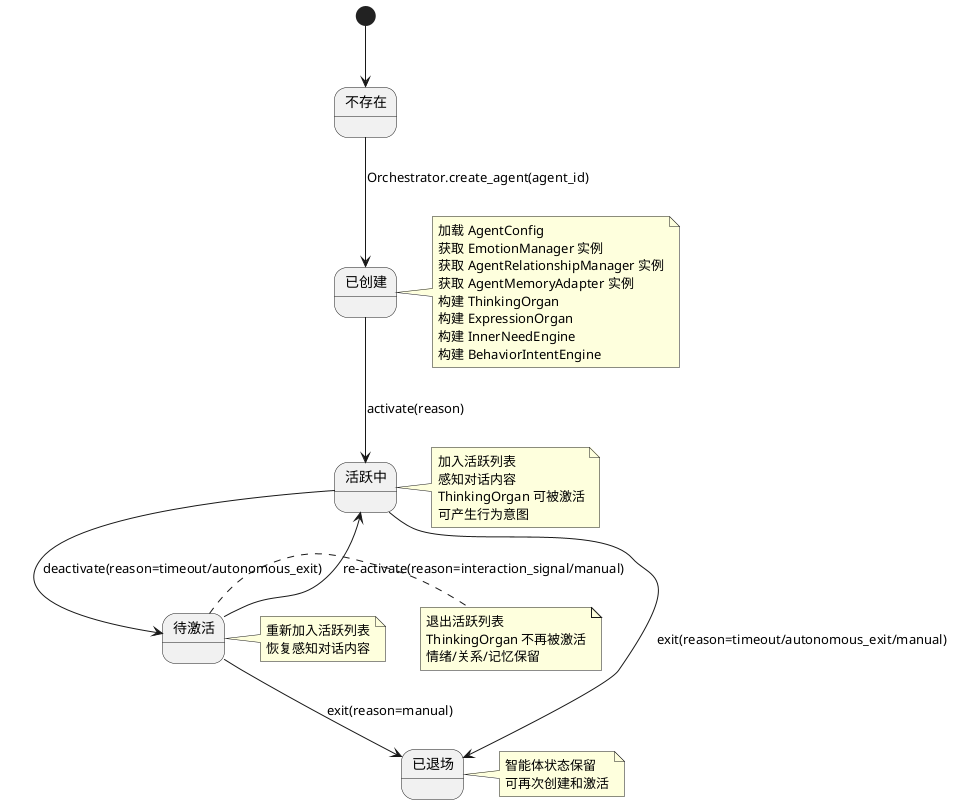
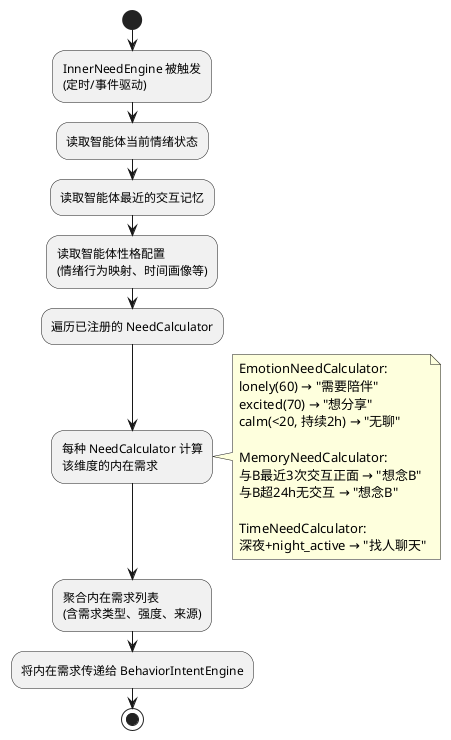
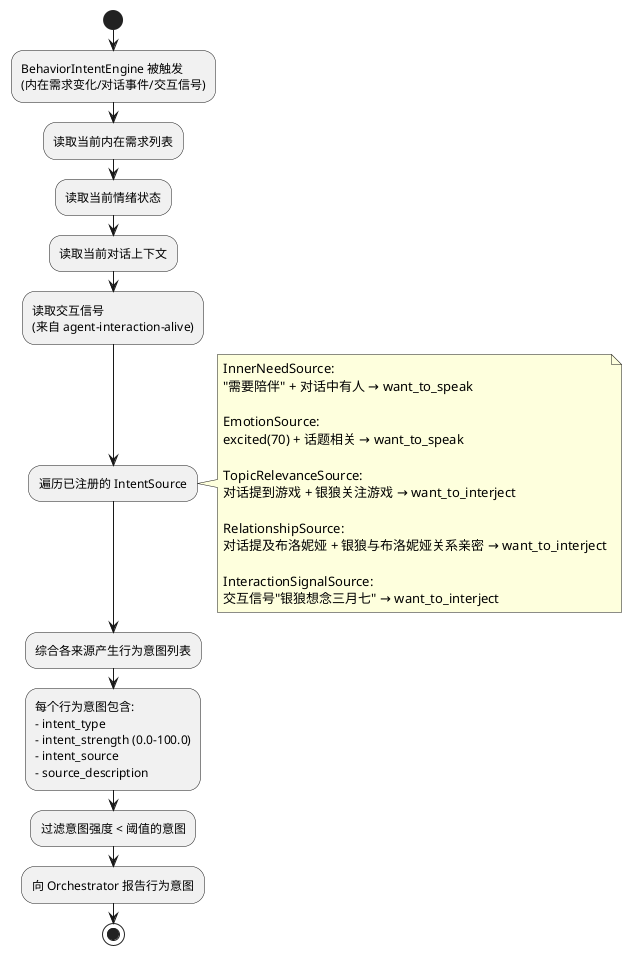
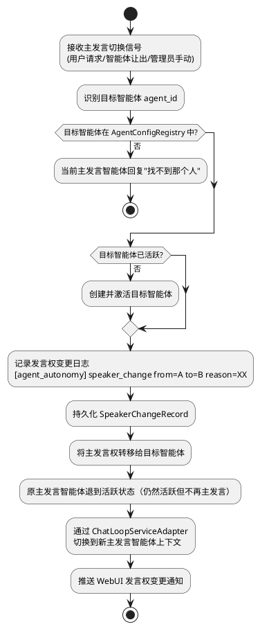
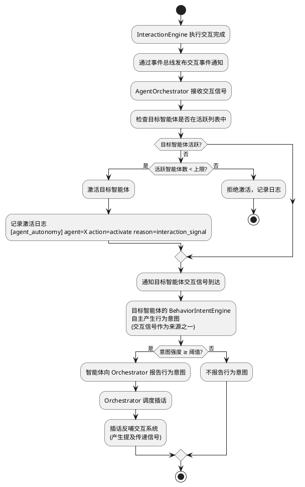
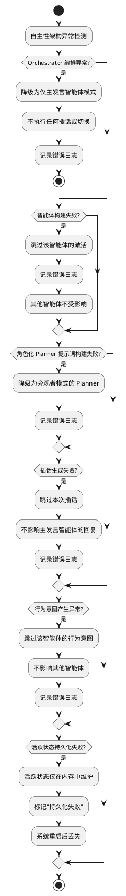
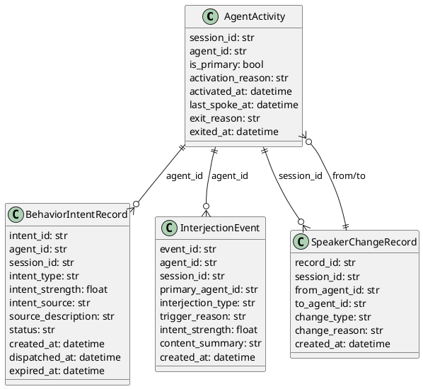

# 智能体自主性架构 — 实现方案

> 理想的角色不应是一具等待结局的标本，而应是一场永恒的进行时。

# 一、需求与存量功能关系分析

## 1.1 需求功能与存量功能对比

### 1.1.1 已实现功能

| 需求功能 | 存量功能 | 代码位置 | 匹配度 |
|---------|---------|---------|--------|
| 智能体配置注册与查询 | `AgentConfigRegistry` 加载/查询/重载智能体配置 | `src/maisaka/agent/registry.py:12-92` | 100% |
| 智能体配置模型 | `AgentConfig` 含人设、情绪基线、内部关系、时间画像、权限等 | `src/maisaka/agent/config.py:110-300` | 75% |
| 智能体路由 | `AgentRouter` 会话绑定→群绑定→默认智能体 | `src/maisaka/agent/router.py:12-86` | 75% |
| 情绪状态管理 | `EmotionManager` 7种情绪类型、强度0-100、指数衰减 | `src/maisaka/agent/emotion.py:70-151` | 100% |
| 情绪提示词注入 | `EmotionState.to_prompt_text()` 生成情绪状态描述 | `src/maisaka/agent/emotion.py:50-67` | 100% |
| 全局情绪管理注册 | `AgentEmotionManagerRegistry` 为每个智能体维护全局 EmotionManager | `src/maisaka/agent_interaction/emotion_registry.py:6-23` | 100% |
| 智能体间关系管理 | `AgentRelationshipManager` 动态管理 agent↔agent 关系 | `src/maisaka/agent_interaction/relationship_manager.py:27-98` | 100% |
| 智能体记忆适配 | `AgentMemoryAdapter` 交互记忆语义映射 | `src/maisaka/agent_interaction/memory/adapter.py:21-287` | 100% |
| 智能体画像服务 | `AgentProfileService` 从交互记忆聚合画像 | `src/maisaka/agent_interaction/memory/profile.py` | 100% |
| 交互事件持久化 | `InteractionEvent` 数据模型 + `InteractionEventStore` | `src/common/database/database_model.py:554-578` / `src/maisaka/agent_interaction/event_store.py` | 100% |
| 交互调度器 | `InteractionScheduler` 定时遍历智能体评估交互触发 | `src/maisaka/agent_interaction/scheduler.py:20-85` | 75% |
| 内心独白引擎 | `MonologueEngine` 生成内心独白、写入自我情绪影响 | `src/maisaka/agent_interaction/monologue_engine.py:67-177` | 75% |
| 交互触发器基类 | `BaseTrigger` + `TriggerRegistry` + `TriggerEvaluation` | `src/maisaka/agent_interaction/trigger_base.py:14-75` | 75% |
| 交互影响计算 | `EffectCalculator` 量化计算交互对双方情绪/关系影响 | `src/maisaka/agent_interaction/effect_calculator.py` | 75% |
| 交互冷却管理 | `InteractionCooldownManager` 按智能体对管理冷却 | `src/maisaka/agent_interaction/cooldown.py` | 75% |
| 回声检测 | `EchoDetector` 交互回声检测与传播控制 | `src/maisaka/agent_interaction/echo_detector.py` | 75% |
| 关系管理（agent↔user） | `RelationshipManager` agent↔user 关系分数/等级/衰减 | `src/maisaka/relationship/manager.py:38-102` | 100% |
| 人格提示词构建 | `_build_personality_prompt()` 从 agent_id 读取人设 | `src/maisaka/chat_loop_service.py:625-656` | 50% |
| 提示词模板渲染 | `build_prompt_template_context()` 构造 identity/emotion/relationship/memory 等 slot | `src/maisaka/chat_loop_service.py:688-733` | 50% |
| 智能体交互记忆注入 | `_build_agent_interaction_memory()` 构建交互动态记忆提示词 | `src/maisaka/chat_loop_service.py:749-784` | 75% |
| 对话运行时 | `MaisakaHeartFlowChatting` 会话级运行时、消息接收、Planner 循环 | `src/maisaka/runtime.py:133-529` | 50% |
| 对话循环服务 | `MaisakaChatLoopService` Planner/Replyer 请求、提示词构建 | `src/maisaka/chat_loop_service.py:476-789` | 50% |
| 推理引擎 | `MaisakaReasoningEngine` 消息消费→Planner请求→工具调用→循环 | `src/maisaka/reasoning_engine.py:1-100` | 50% |
| reply 工具 | `handle_tool()` 被 Planner 调用触发 Replyer 生成回复 | `src/maisaka/builtin_tool/reply.py:131-388` | 50% |
| 提示词模板 | `maisaka_chat.prompt` 当前旁观者模式 Planner 提示词 | `prompts/zh-CN/maisaka_chat.prompt:1-34` | 25% |
| 子智能体执行 | `run_sub_agent()` 复制上下文的临时子代理 | `src/maisaka/runtime.py:1433-1475` | 25% |
| 数据库持久化框架 | SQLModel + `get_db_session()` | `src/common/database/database_model.py` / `database.py` | 100% |

### 1.1.2 需要扩展的功能

| 需求功能 | 存量功能 | 差异说明 | 扩展方向 |
|---------|---------|---------|---------|
| 自主智能体（AutonomousAgent） | 无对应功能，`run_sub_agent()` 是临时子代理 | `run_sub_agent()` 是无状态、无身份的临时执行器；AutonomousAgent 是有身份、有状态、有思维器官/表达器官/情绪/关系/记忆/内在需求/行为意图的自主主体 | 新建 `AutonomousAgent` 类，组合 AgentConfig + EmotionManager + AgentRelationshipManager + AgentMemoryAdapter + ThinkingOrgan + ExpressionOrgan + InnerNeedEngine，生命周期由 Orchestrator 管理 |
| 思维器官（ThinkingOrgan） | 当前 Planner 是旁观者模式，提示词"你不是 {bot_name} 本人" | 当前 Planner 是外部视角的决策者，为角色"做决策"而非"以角色身份思考"；思维器官需要翻转为内部视角，"你是 {bot_name}，你在思考如何回应" | 新建 `maisaka_chat_embodied.prompt` 模板（三语同步），保留原模板用于兼容场景；在 `ChatLoopService` 中根据自主性架构启用状态选择模板 |
| 表达器官（ExpressionOrgan） | 当前 Replyer 不区分智能体身份 | Replyer 共用同一实例和提示词上下文，不区分发言智能体；表达器官需要绑定到特定智能体，注入该智能体的角色化上下文 | 在 `BuiltinToolRuntimeContext` 中增加 `current_agent_id` 字段，reply 工具执行时根据 `current_agent_id` 注入角色化 Replyer 上下文 |
| 内在需求（InnerNeed） | `agent-interaction-alive` 的 `InnerNeedTrigger` 仅驱动后台交互 | 交互活化的内在需求驱动后台交互事件，不直接驱动前台对话行为；自主性架构的内在需求直接驱动发言/插话行为 | 新建 `InnerNeedEngine`，输入为情绪状态+记忆+性格，输出为 InnerNeed 列表；与交互活化的 InnerNeedTrigger 共享计算逻辑但输出不同 |
| 行为意图（BehaviorIntent） | 无对应功能 | 完全新增——智能体基于内在需求/情绪/对话上下文自主产生"想要做某事"的行为意图，是自主性的核心体现 | 新建 `BehaviorIntent` 数据模型 + `BehaviorIntentEngine`，行为意图由智能体自身的思维过程产生，Orchestrator 只消费意图强度做调度 |
| Orchestrator 编排器 | 无对应功能 | 完全新增——统一管理活跃智能体、协调思维器官执行顺序、管理主发言权、处理插话调度。**关键约束**：Orchestrator 只协调执行顺序，不替智能体做决策 | 新建 `AgentOrchestrator` 类，绑定到 `MaisakaHeartFlowChatting` 实例。与废案的核心区别：不包含 InterjectionIntentCalculator，插话意愿由智能体自主产生 |
| 提示词上下文按智能体切换 | `build_prompt_template_context()` 固定使用 `self._agent_id` | 当前 agent_id 在 `__init__` 时固定，无法运行时切换；每个智能体需要独立的 identity/emotion/relationship/memory 上下文 | 在 `ChatLoopService` 中增加 `switch_agent_context(agent_id)` 方法，运行时切换 `_agent_id`、重新构建人格提示词和提示词上下文 |
| 插话机制 | 无对应功能 | 完全新增——非主发言智能体自主决定发言。**关键约束**：插话意愿由智能体自身思维过程产生，不是外部引擎计算 | 新建 `InterjectionScheduler`，消费智能体报告的 BehaviorIntent，结合冷却和频率限制决定调度时机。与废案的核心区别：不计算插话意愿，只基于智能体报告的意图强度排序 |
| 主发言权切换 | `AgentRouter` 仅在会话创建时解析 agent_id | `AgentRouter` 是静态绑定，不支持运行时切换；主发言权切换需要动态变更当前会话的主发言智能体 | 在 `AgentOrchestrator` 中实现主发言权管理，通过 `switch_primary_speaker(agent_id, reason)` 方法动态切换 |
| 活跃状态持久化 | 无对应功能 | 完全新增——需要持久化智能体活跃状态、主发言权归属 | 新建 `AgentActivity` 数据模型和 `AgentActivityStore`，系统重启后从数据库恢复 |
| 交互信号→行为意图联动 | `InteractionScheduler` 仅产生后台交互事件 | 当前交互事件只影响后台状态（情绪/关系/记忆），不触发前台对话行为；需要将交互信号转化为智能体的行为意图 | 在 `AgentOrchestrator` 中注册交互信号监听器，当交互事件到达时通知对应智能体产生行为意图；智能体自主决定是否转化为发言行为 |
| 发言标记 | 无对应功能 | 完全新增——所有智能体共用同一账号时，需要通过发言标记区分"谁在说话" | 在 reply 工具发送消息时，根据 `current_agent_id` 注入发言标记前缀（如"【银狼】"），格式可配置 |
| WebUI 自主性 API | `/agent/` 路由无活跃状态/插话/发言权切换 API | 缺少智能体活跃状态查询、主发言权切换、手动触发插话、行为意图查看等 API 端点 | 在 `src/webui/routers/agent.py` 中新增 `/agent/autonomy/` 系列端点 |

### 1.1.3 需要新增的功能或接口

**核心自主性模块（`src/maisaka/agent_autonomy/`）：**

1. **AutonomousAgent（自主智能体）**
   - 输入：agent_id、AgentConfig、会话上下文
   - 输出：角色化思维器官上下文、角色化表达器官绑定、情绪/关系/记忆状态、内在需求、行为意图
   - 核心逻辑：组合 AgentConfig + EmotionManager + AgentRelationshipManager + AgentMemoryAdapter + InnerNeedEngine，构建角色化上下文；自主产生行为意图
   - 依赖：`AgentEmotionManagerRegistry`、`AgentRelationshipManager`、`AgentMemoryAdapter`、`InnerNeedEngine`

2. **ThinkingOrgan（思维器官）**
   - 输入：智能体的完整角色化上下文（人设+情绪+关系+记忆+内在需求）
   - 输出：思维输出（角色内心独白）、工具调用决策（reply 工具调用）
   - 核心逻辑：以角色内部视角运行 Planner，"你是 {bot_name}，你在思考如何回应"
   - 依赖：`MaisakaChatLoopService`（Planner 请求执行）、`maisaka_chat_embodied.prompt`

3. **ExpressionOrgan（表达器官）**
   - 输入：思维器官的思维指引（reply_guide）、智能体的角色化上下文
   - 输出：以该智能体身份和风格生成的可见回复
   - 核心逻辑：以角色风格运行 Replyer，生成带发言标记的回复
   - 依赖：`replyer_manager`、`BuiltinToolRuntimeContext`

4. **InnerNeedEngine（内在需求引擎）**
   - 输入：智能体情绪状态、记忆、性格配置
   - 输出：InnerNeed 列表（如"需要陪伴""想分享""无聊"等）
   - 核心逻辑：基于情绪类型+强度+持续时间+性格特征计算内在需求
   - 依赖：`AgentEmotionManagerRegistry`、`AgentMemoryAdapter`

5. **BehaviorIntentEngine（行为意图引擎）**
   - 输入：内在需求、情绪状态、对话上下文、交互信号
   - 输出：BehaviorIntent 列表（含意图类型、强度、来源）
   - 核心逻辑：综合内在需求+情绪+话题相关性+关系+交互信号产生行为意图；**由智能体自主调用**
   - 依赖：`InnerNeedEngine`、`AgentEmotionManagerRegistry`

6. **AgentOrchestrator（智能体编排器）**
   - 输入：对话事件、交互信号、管理员指令、智能体行为意图
   - 输出：编排决策（主发言/插话/切换）、智能体激活/退场、发言权变更通知
   - 核心逻辑：管理活跃智能体列表、基于行为意图强度协调执行顺序、管理主发言权、处理插话调度。**只协调，不决策**
   - 依赖：`AutonomousAgent`、`AgentActivityStore`、`InterjectionScheduler`

7. **InterjectionScheduler（插话调度器）**
   - 输入：智能体报告的 BehaviorIntent、冷却状态、频率限制
   - 输出：调度决策（是否调度、调度顺序）
   - 核心逻辑：基于智能体自主报告的意图强度排序，结合冷却和频率限制决定调度时机
   - 依赖：`InterjectionCooldownManager`

**提示词模块：**

8. **角色化 Planner 提示词模板** — `maisaka_chat_embodied.prompt`（三语同步）
9. **角色化 Planner 提示词构建器** — `EmbodiedPlannerPromptBuilder`

**数据模型：**

10. **BehaviorIntentRecord** — 行为意图记录持久化模型
11. **AgentActivity** — 智能体活跃状态持久化模型
12. **InterjectionEvent** — 插话事件记录模型
13. **SpeakerChangeRecord** — 发言权变更记录模型

**配置模型：**

14. **AgentAutonomyConfig** — 自主性架构配置（嵌入 `bot_config.toml` 模板）

**WebUI API：**

15. **智能体活跃状态 API** — `/agent/autonomy/active/{session_id}`
16. **主发言权切换 API** — `/agent/autonomy/switch-speaker`
17. **手动触发插话 API** — `/agent/autonomy/trigger-interjection`
18. **行为意图查看 API** — `/agent/autonomy/intents/{session_id}`

## 1.2 存量功能详细分析

### 1.2.1 MaisakaHeartFlowChatting（对话运行时）

- **接口契约**：`__init__(session_id)` 初始化运行时；`register_message()` 接收消息触发 Planner 循环；`run_sub_agent()` 执行临时子代理；`start()` 启动运行时主循环
- **业务规则**：每个会话一个运行时实例；`_chat_loop_service` 在 `__init__` 时从 `chat_stream.agent_id` 创建（第 150-154 行）；agent_id 在运行时生命周期内固定不变
- **扩展点**：`_chat_loop_service` 是公开属性，可被外部替换或扩展；`_reasoning_engine` 管理消息消费和 Planner 循环
- **约束**：`run_sub_agent()` 创建的临时子代理是无状态的，不保留情绪/关系/记忆；agent_id 固定导致无法运行时切换智能体身份；`_chat_loop_service` 在构造时绑定，后续不可替换

### 1.2.2 MaisakaChatLoopService（对话循环服务）

- **接口契约**：`__init__(session_id, is_group_chat, agent_id)` 初始化；`build_prompt_template_context(tools_section)` 构造提示词参数；`_build_personality_prompt()` 构建人格提示词；`update_emotion_state_text()` / `update_relationship_text()` 更新情绪和关系提示词
- **业务规则**：`_agent_id` 在 `__init__` 时固定（第 499 行），后续不可变；`personality_prompt` 属性从 `_agent_id` 读取 AgentConfig.identity_prompt；`build_prompt_template_context()` 返回含 identity/emotion/relationship/memory 等 slot 的字典
- **扩展点**：`update_emotion_state_text()` / `update_relationship_text()` 可运行时更新情绪和关系提示词；`_build_agent_interaction_memory()` 已实现交互记忆提示词注入（第 749-784 行）
- **约束**：`_agent_id` 不可运行时变更；提示词模板选择在 `_get_chat_prompt_name()` 中固定（第 681-686 行），不支持按架构模式动态切换；`_build_agent_interaction_memory()` 使用 `asyncio.run()` 同步调用异步方法，在已有事件循环中会跳过

### 1.2.3 MaisakaReasoningEngine（推理引擎）

- **接口契约**：`run_loop()` 主循环：消费消息→Planner请求→处理工具调用→循环；`_run_planner_request()` 执行 Planner 请求；`_handle_planner_response_actions()` 处理 Planner 的工具调用结果
- **业务规则**：每轮 Planner 请求使用 `_runtime._chat_loop_service` 构建提示词和发送请求；工具调用结果通过 `_handle_planner_response_actions()` 分发到各工具处理器
- **扩展点**：工具调用处理是可扩展的——新增工具只需注册到 `ToolRegistry`
- **约束**：Planner 请求与运行时实例 1:1 绑定，不支持同一运行时内多 Planner 并行；推理引擎的循环逻辑是稳定的，不应因多智能体而改变

### 1.2.4 reply 工具

- **接口契约**：`handle_tool(tool_ctx, invocation, context)` 被 Planner 调用；`get_tool_spec()` 返回工具声明
- **业务规则**：从 `replyer_manager.get_replyer()` 获取 Replyer 实例；Replyer 生成回复后通过 `send_service._send_to_target_with_message()` 发送消息
- **扩展点**：`reply_guide` 参数可传递 Planner 的回复指引；`expression_intent` 参数可传递表达方式意图
- **约束**：Replyer 不区分智能体身份——所有回复共用同一个 Replyer 实例和提示词上下文；发送的消息无发言标记

### 1.2.5 AgentRouter（智能体路由）

- **接口契约**：`resolve_agent(session_id, group_id)` 返回 `AgentConfig`；`bind_session()` / `unbind_session()` 管理会话绑定
- **业务规则**：优先级：会话绑定→群绑定→默认智能体；绑定关系存储在内存字典中，不持久化
- **扩展点**：`bind_session()` 可动态变更会话绑定的智能体
- **约束**：`resolve_agent()` 仅在会话创建时调用一次，运行时不支持动态切换；绑定关系不持久化，重启后丢失

### 1.2.6 agent-interaction-alive 系统

- **接口契约**：`InteractionScheduler` 定时调度交互触发；`InteractionEngine.execute()` 执行交互；`InteractionEventStore` 持久化交互事件；`BaseTrigger` + `TriggerRegistry` 触发器注册机制
- **业务规则**：交互触发→影响计算→原子写入（情绪+关系+记忆）→事件持久化→回声检测；调度间隔默认 5 分钟
- **扩展点**：`InteractionEngine.execute()` 完成后可通过事件机制通知外部系统；`TriggerRegistry` 支持注册新触发类型
- **约束**：当前交互事件仅影响后台状态（情绪/关系/记忆），不触发前台对话行为；交互信号不会激活智能体的 Planner

### 1.2.7 提示词模板

- **接口契约**：`load_prompt(name, **kwargs)` 加载并渲染提示词模板；slot 通过 `{slot_name}` 占位符注入
- **业务规则**：当前 `maisaka_chat.prompt` 第 14 行"你不是 {bot_name} 本人，不要替 {bot_name} 发言"是旁观者视角；三语模板需同步更新
- **扩展点**：可新增模板文件，在 `_get_chat_prompt_name()` 中根据条件选择
- **约束**：模板变更必须三语同步（zh-CN/en-US/ja-JP）；现有模板被所有未启用自主性架构的场景使用，不可直接修改

# 二、增量设计方案

## 2.1 实现模型

### 2.1.1 上下文视图

```plantuml
@startuml
!define NEW_MODULE color:#E3F2FD
!define EXISTING color:#FFF3E0
!define BRIDGE color:#F3E5F5

rectangle "智能体自主性架构系统" as Core NEW_MODULE {
    rectangle "AutonomousAgent\n(自主智能体)" as Agent
    rectangle "ThinkingOrgan\n(思维器官)" as Think
    rectangle "ExpressionOrgan\n(表达器官)" as Express
    rectangle "InnerNeedEngine\n(内在需求引擎)" as Need
    rectangle "BehaviorIntentEngine\n(行为意图引擎)" as Intent
    rectangle "AgentOrchestrator\n(编排器·仅调度)" as Orch
    rectangle "InterjectionScheduler\n(插话调度器)" as ISched
    rectangle "AgentActivityStore\n(活跃状态存储)" as Store
    rectangle "InterjectionCooldownManager\n(插话冷却管理器)" as Cooldown
}

rectangle "桥梁层" as Bridge BRIDGE {
    rectangle "ChatLoopServiceAdapter\n(对话循环服务适配器)" as CLAdapter
    rectangle "ReplyToolContextExtender\n(reply工具上下文扩展)" as ReplyExt
}

rectangle "现有系统" as Existing EXISTING {
    rectangle "MaisakaHeartFlowChatting\n(对话运行时)" as Runtime
    rectangle "MaisakaChatLoopService\n(对话循环服务)" as ChatLoop
    rectangle "MaisakaReasoningEngine\n(推理引擎)" as Engine
    rectangle "reply工具" as Reply
    rectangle "AgentRouter\n(智能体路由)" as Router
    rectangle "AgentConfigRegistry\n(智能体配置)" as Config
}

rectangle "agent-interaction-alive\n(交互活化系统)" as Interaction {
    rectangle "InteractionScheduler\n(交互调度器)" as IScheduler
    rectangle "InteractionEngine\n(交互引擎)" as IEngine
    rectangle "AgentEmotionManagerRegistry\n(全局情绪)" as EmotionReg
    rectangle "AgentRelationshipManager\n(智能体间关系)" as RelMgr
    rectangle "AgentMemoryAdapter\n(记忆适配)" as MemAdapt
}

rectangle "外部系统" as External {
    rectangle "WebUI 指挥中心" as WebUI
    rectangle "消息平台适配层" as Platform
}

User --> Runtime : 发送消息
Runtime --> Orch : 对话事件
Orch --> Agent : 激活/编排智能体
Agent --> Think : 以角色内心独白思考
Agent --> Express : 以角色风格表达
Agent --> Need : 产生内在需求
Agent --> Intent : 产生行为意图
Agent --> EmotionReg : 读取情绪状态
Agent --> RelMgr : 读取关系信息
Agent --> MemAdapt : 检索交互记忆

Intent --> Orch : 报告行为意图\n(含意图类型和强度)
Orch --> ISched : 基于意图强度调度插话
Orch --> CLAdapter : 切换Planner上下文
CLAdapter --> ChatLoop : switch_agent_context()

IScheduler --> Orch : 交互信号通知
Orch --> Store : 持久化活跃状态

Orch --> WebUI : 推送活跃状态/发言权变更/行为意图
Orch --> Platform : 产出多智能体回复消息\n(含发言标记)

@enduml
```

### 2.1.2 服务/组件总体架构

```plantuml
@startuml
!define NEW_MODULE color:#E3F2FD

package "src/maisaka/agent_autonomy/" as Pkg NEW_MODULE {
    component "AutonomousAgent" as Agent {
        [agent_id]
        [agent_config]
        [thinking_organ]
        [expression_organ]
        [inner_need_engine]
        [behavior_intent_engine]
        [emotion_manager]
        [relationship_manager]
        [memory_adapter]
    }
    component "AgentOrchestrator" as Orch {
        [active_agents: dict]
        [primary_agent_id: str]
        [interjection_scheduler]
        [activity_store]
    }
    component "ThinkingOrgan" as Think {
        [prompt_builder]
        [planner_template]
    }
    component "ExpressionOrgan" as Express {
        [replyer_binding]
        [speaker_tag]
    }
    component "InnerNeedEngine" as Need {
        [need_calculators: list]
    }
    component "BehaviorIntentEngine" as Intent {
        [intent_sources: list]
    }
    component "InterjectionScheduler" as ISched
    component "AgentActivityStore" as Store
    component "InterjectionCooldownManager" as Cooldown
    component "EmbodiedPlannerPromptBuilder" as EmbPrompt
}

package "src/maisaka/agent_autonomy/bridge/" as BridgePkg NEW_MODULE {
    component "ChatLoopServiceAdapter" as CLAdapter
    component "ReplyToolContextExtender" as ReplyExt
}

package "src/maisaka/agent_autonomy/models/" as ModelPkg NEW_MODULE {
    component "BehaviorIntentRecord" as BIR
    component "AgentActivity" as AA
    component "InterjectionEvent" as IE
    component "SpeakerChangeRecord" as SCR
}

package "src/maisaka/agent_autonomy/config/" as CfgPkg NEW_MODULE {
    component "AgentAutonomyConfig" as AAConfig
}

package "提示词模板" as PromptPkg NEW_MODULE {
    component "maisaka_chat_embodied.prompt\n(zh-CN/en-US/ja-JP)" as EmbPromptTpl
}

Orch --> Agent : 创建/管理自主智能体
Orch --> ISched : 调度插话
Orch --> Store : 持久化活跃状态
Orch --> Cooldown : 检查插话冷却
Orch --> CLAdapter : 切换Planner上下文
Agent --> Think : 思维器官
Agent --> Express : 表达器官
Agent --> Need : 内在需求
Agent --> Intent : 行为意图
Agent --> EmbPrompt : 构建角色化提示词
Intent --> Orch : 报告行为意图
ISched --> Cooldown : 检查冷却状态

@enduml
```

**模块划分与职责：**

| 模块 | 职责 | 关键依赖 |
|------|------|---------|
| `AutonomousAgent` | 自主智能体的完整构成：思维器官+表达器官+内在需求引擎+行为意图引擎+独立 EmotionManager+独立关系管理+独立记忆适配 | AgentEmotionManagerRegistry, AgentRelationshipManager, AgentMemoryAdapter, AgentConfig |
| `ThinkingOrgan` | 以角色内部视角运行 Planner，构建角色化系统提示词 | EmbodiedPlannerPromptBuilder, maisaka_chat_embodied.prompt |
| `ExpressionOrgan` | 以角色风格运行 Replyer，绑定发言标记 | replyer_manager, BuiltinToolRuntimeContext |
| `InnerNeedEngine` | 基于情绪+记忆+性格计算内在需求，驱动自主行为 | AgentEmotionManagerRegistry, AgentMemoryAdapter |
| `BehaviorIntentEngine` | 综合内在需求+情绪+话题+关系+交互信号产生行为意图 | InnerNeedEngine, AgentEmotionManagerRegistry |
| `AgentOrchestrator` | 多智能体协作的唯一编排者：活跃智能体管理、基于行为意图的插话调度、主发言权管理、执行顺序编排、降级处理 | AutonomousAgent, InterjectionScheduler, AgentActivityStore |
| `InterjectionScheduler` | 基于智能体自主报告的行为意图强度，结合冷却和频率限制，决定插话调度时机 | InterjectionCooldownManager |
| `EmbodiedPlannerPromptBuilder` | 构建角色化 Planner 的系统提示词，从旁观者视角变为角色内部视角 | AgentConfig, maisaka_chat_embodied.prompt |
| `AgentActivityStore` | 智能体活跃状态的持久化与查询 | 数据库 |
| `InterjectionCooldownManager` | 按智能体+会话管理插话冷却时间和频率限制 | 数据库 |
| `ChatLoopServiceAdapter` | 适配 MaisakaChatLoopService，支持运行时切换 agent_id 和提示词上下文 | MaisakaChatLoopService |
| `ReplyToolContextExtender` | 扩展 reply 工具的上下文，注入当前发言智能体 ID 和发言标记 | BuiltinToolRuntimeContext |

### 2.1.3 实现设计文档

#### 2.1.3.1 自主智能体生命周期



**关键设计决策：AutonomousAgent 是自主主体，不是状态容器**

- **为什么不是 SubAgentUnit（废案）**：废案的 SubAgentUnit 只是"轻量上下文容器"，持有角色化提示词构建所需的全部状态，但不具备自主行为能力——插话意愿由外部 InterjectionIntentCalculator 计算。自主智能体必须拥有自己的思维过程和行为意图产生能力。
- **为什么不是独立进程/线程**：智能体不需要独立的 LLM 客户端或独立线程——Planner/Replyer 共享，但提示词构造独立。AutonomousAgent 持有思维器官和表达器官的引用，通过 ChatLoopServiceAdapter 切换上下文实现角色化。
- **与 MiMo-Code Actor 模式的对应**：MiMo-Code 的 Actor 拥有独立的 runLoop、可以 spawn 子 Actor、通过 Bus 通信。Python 重表达中，AutonomousAgent 的"自主性"体现在：拥有 InnerNeedEngine 和 BehaviorIntentEngine，可以自主产生行为意图并报告给 Orchestrator，而非被动等待外部调度。
- **生命周期绑定**：AutonomousAgent 的创建和销毁由 Orchestrator 统一管理，不与 ChatLoopService 生命周期绑定。智能体退场后状态（情绪/关系/记忆）保留，下次激活时可恢复。

#### 2.1.3.2 自主回复管线流程

```plantuml
@startuml
start

:接收用户消息;

:获取主发言智能体;

if (主发言智能体是否存在?) then (否)
  :从 AgentRouter 解析默认智能体;
  :创建并激活主发言智能体;
endif

:通过 ChatLoopServiceAdapter\n切换到主发言智能体上下文;

:激活主发言智能体的思维器官\n(以角色内心独白思考);

:执行角色化 Planner 请求;

if (思维器官决定回复?) then (是)
  :思维器官调用 reply 工具;
  :表达器官以角色风格生成回复;
  :回复消息附带发言标记;
  :记录回复日志\n[agent_autonomy] agent=X type=primary reason=user_message;
else (否)
  :不回复;
endif

:主发言轮次结束;

== 行为意图收集 ==

:获取活跃智能体列表（排除主发言）;

:各活跃智能体自主产生行为意图\n(基于内在需求+情绪+对话上下文);

:收集行为意图报告;

== 插话调度 ==

:InterjectionScheduler\n基于意图强度排序;

:遍历意图强度 ≥ 阈值的智能体;

if (插话冷却通过?) then (是)
  :切换到插话智能体上下文;
  :激活插话智能体的思维器官;
  if (思维器官决定插话?) then (是)
    :表达器官以角色风格生成插话;
    :插话消息附带发言标记;
    :记录插话日志\n[agent_autonomy] agent=X type=interjection reason=XX;
    :记录插话冷却;
  endif
else (否)
  :跳过（冷却中）;
endif

:检查活跃智能体超时退场;

stop

@enduml
```

**与废案的核心区别**：废案中，插话意愿由 `InterjectionIntentCalculator` 在 Orchestrator 内部计算（5个因子加权），智能体是被动的"被计算对象"。自主性架构中，行为意图由智能体自身的 `BehaviorIntentEngine` 自主产生，Orchestrator 只消费意图强度做调度排序。

#### 2.1.3.3 内在需求产生流程



#### 2.1.3.4 行为意图产生流程



#### 2.1.3.5 主发言权切换流程



#### 2.1.3.6 交互信号→行为意图联动流程



**与废案的核心区别**：废案中，交互信号到达后由 `InterjectionIntentCalculator` 直接计算插话意愿（交互信号驱动 +40 分），智能体是被动对象。自主性架构中，交互信号到达后通知智能体，由智能体自身的 `BehaviorIntentEngine` 自主决定是否产生行为意图。

#### 2.1.3.7 降级策略



## 2.2 接口设计

### 2.2.1 总体设计

**接口分类：**

| 接口类别 | 接口数量 | 稳定性 | 说明 |
|---------|---------|--------|------|
| 自主智能体接口 | 5 | 稳定 | AutonomousAgent 的创建/激活/退场/上下文获取/行为意图报告 |
| 思维器官接口 | 2 | 稳定 | ThinkingOrgan 的思考/提示词构建 |
| 表达器官接口 | 2 | 稳定 | ExpressionOrgan 的表达/发言标记 |
| 内在需求引擎接口 | 2 | 实验 | InnerNeedEngine 的计算/注册 |
| 行为意图引擎接口 | 2 | 实验 | BehaviorIntentEngine 的产生/注册 |
| 编排器接口 | 6 | 稳定 | AgentOrchestrator 的主发言/插话/切换/降级等核心编排 |
| 插话调度接口 | 2 | 稳定 | InterjectionScheduler 的调度和冷却 |
| 活跃状态存储接口 | 4 | 稳定 | AgentActivityStore 的 CRUD |
| 对话循环适配接口 | 2 | 稳定 | ChatLoopServiceAdapter 的上下文切换 |
| WebUI API | 6 | 稳定 | 智能体活跃状态/发言权切换/手动插话/行为意图等 |
| 配置接口 | 1 | 稳定 | AgentAutonomyConfig |

**接口变更策略：**

- 自主智能体接口和编排器接口是核心契约，变更需版本化
- 内在需求引擎和行为意图引擎采用可注册的计算器/来源机制，新增类型不修改核心逻辑
- WebUI API 遵循现有 `/agent/` 路由的 RESTful 风格
- 配置接口嵌入 `bot_config.toml` 模板，新增版本号

### 2.2.2 接口清单

#### 2.2.2.1 AutonomousAgent 接口

```python
class AutonomousAgent:
    """自主智能体——拥有思维器官、表达器官、内在需求和行为意图的自主主体。"""

    @property
    def agent_id(self) -> str:
        """智能体 ID。"""
        ...

    @property
    def agent_config(self) -> AgentConfig:
        """智能体配置。"""
        ...

    @property
    def thinking_organ(self) -> ThinkingOrgan:
        """该智能体的思维器官。"""
        ...

    @property
    def expression_organ(self) -> ExpressionOrgan:
        """该智能体的表达器官。"""
        ...

    @property
    def inner_need_engine(self) -> InnerNeedEngine:
        """该智能体的内在需求引擎。"""
        ...

    @property
    def behavior_intent_engine(self) -> BehaviorIntentEngine:
        """该智能体的行为意图引擎。"""
        ...

    @property
    def emotion_manager(self) -> EmotionManager:
        """该智能体的独立 EmotionManager 实例。"""
        ...

    @property
    def relationship_manager(self) -> AgentRelationshipManager:
        """该智能体的独立关系管理器。"""
        ...

    @property
    def memory_adapter(self) -> AgentMemoryAdapter:
        """该智能体的独立记忆适配器。"""
        ...

    async def evaluate_inner_needs(self) -> list[InnerNeed]:
        """评估当前内在需求。

        Returns:
            list[InnerNeed]: 当前内在需求列表。
        """
        ...

    async def produce_behavior_intents(
        self,
        conversation_context: list[LLMContextMessage] | None = None,
        interaction_signals: list[InteractionEvent] | None = None,
    ) -> list[BehaviorIntent]:
        """自主产生行为意图。

        Args:
            conversation_context: 当前对话上下文（活跃智能体可感知）
            interaction_signals: 来自 agent-interaction-alive 的交互信号

        Returns:
            list[BehaviorIntent]: 行为意图列表（含意图类型、强度、来源）
        """
        ...

    def build_embodied_prompt_context(self, tools_section: str = "") -> dict[str, str]:
        """构建角色化 Planner 的提示词上下文。

        Returns:
            dict[str, str]: 与 build_prompt_template_context() 兼容的字典，
            但 identity/emotion/relationship/memory 均为该智能体的独立数据。
        """
        ...

    def build_embodied_personality_prompt(self) -> str:
        """构建角色化人格提示词。

        Returns:
            str: "你是{角色名}，你在思考如何回应" 格式的人格提示词。
        """
        ...
```

**调用示例：**

```python
agent = AutonomousAgent(agent_id="silver_wolf")

# 智能体自主产生行为意图
intents = await agent.produce_behavior_intents(
    conversation_context=current_messages,
    interaction_signals=[interaction_event],
)
for intent in intents:
    if intent.intent_strength >= threshold:
        orchestrator.report_intent(agent.agent_id, intent)

# 构建角色化提示词
context = agent.build_embodied_prompt_context(tools_section="...")
```

#### 2.2.2.2 ThinkingOrgan 接口

```python
class ThinkingOrgan:
    """思维器官——以角色内部视角运行 Planner。"""

    def __init__(self, agent: AutonomousAgent, prompt_builder: EmbodiedPlannerPromptBuilder) -> None:
        ...

    @property
    def agent_id(self) -> str:
        """所属智能体 ID。"""
        ...

    def build_system_prompt(self, tools_section: str = "") -> str:
        """构建角色化系统提示词。

        Returns:
            str: "你是{角色名}，你在思考如何回应" 视角的系统提示词。
        """
        ...

    def get_prompt_template_name(self) -> str:
        """获取当前使用的提示词模板名。

        Returns:
            str: "maisaka_chat_embodied" 或 "maisaka_chat"（降级时）
        """
        ...
```

#### 2.2.2.3 ExpressionOrgan 接口

```python
class ExpressionOrgan:
    """表达器官——以角色风格运行 Replyer，绑定发言标记。"""

    def __init__(self, agent: AutonomousAgent, speaker_tag_format: str = "【{agent_name}】") -> None:
        ...

    @property
    def agent_id(self) -> str:
        """所属智能体 ID。"""
        ...

    def build_speaker_tag(self) -> str:
        """构建发言标记。

        Returns:
            str: 如 "【银狼】" 格式的发言标记。
        """
        ...

    def should_show_speaker_tag(self, is_multi_agent_active: bool) -> bool:
        """判断是否应显示发言标记。

        Args:
            is_multi_agent_active: 当前会话是否有多个活跃智能体

        Returns:
            bool: 仅在多智能体活跃时显示发言标记
        """
        ...
```

#### 2.2.2.4 InnerNeedEngine 接口

```python
class BaseNeedCalculator(ABC):
    """内在需求计算器基类。"""

    @abstractmethod
    async def calculate(
        self,
        agent_id: str,
        emotion_state: EmotionState,
        memory_context: dict[str, Any] | None = None,
        time_context: dict[str, Any] | None = None,
    ) -> list[InnerNeed]:
        """计算内在需求。"""
        ...


@dataclass
class InnerNeed:
    """内在需求。"""
    need_type: str  # companionship / sharing / boredom / missing / curiosity / ...
    strength: float  # 0.0-100.0
    source: str  # emotion_driven / memory_driven / time_driven
    description: str  # 可读描述，如"孤独时需要陪伴"


class InnerNeedEngine:
    """内在需求引擎。"""

    def register_calculator(self, need_type: str, calculator: BaseNeedCalculator) -> None:
        """注册内在需求计算器。"""
        ...

    async def evaluate(self, agent_id: str) -> list[InnerNeed]:
        """评估当前内在需求。"""
        ...
```

#### 2.2.2.5 BehaviorIntentEngine 接口

```python
class BaseIntentSource(ABC):
    """行为意图来源基类。"""

    @abstractmethod
    async def produce(
        self,
        agent_id: str,
        inner_needs: list[InnerNeed],
        emotion_state: EmotionState,
        conversation_context: list[LLMContextMessage] | None = None,
        interaction_signals: list[InteractionEvent] | None = None,
    ) -> list[BehaviorIntent]:
        """产生行为意图。"""
        ...


@dataclass
class BehaviorIntent:
    """行为意图。"""
    intent_type: str  # want_to_speak / want_to_interject / want_to_leave / want_to_mention / custom
    intent_strength: float  # 0.0-100.0
    intent_source: str  # emotion_driven / inner_need_driven / topic_relevance_driven / relationship_driven / interaction_signal_driven / planner_activated
    source_description: str  # 可读描述，不可为空


class BehaviorIntentEngine:
    """行为意图引擎——智能体自主产生行为意图的核心。"""

    def register_source(self, source_type: str, source: BaseIntentSource) -> None:
        """注册行为意图来源。"""
        ...

    async def produce_intents(
        self,
        agent_id: str,
        conversation_context: list[LLMContextMessage] | None = None,
        interaction_signals: list[InteractionEvent] | None = None,
    ) -> list[BehaviorIntent]:
        """自主产生行为意图。

        流程：
        1. 通过 InnerNeedEngine 评估内在需求
        2. 遍历已注册的 IntentSource
        3. 综合各来源产生行为意图
        4. 过滤意图强度 < 阈值的意图
        """
        ...
```

**调用示例：**

```python
# 注册行为意图来源
engine = BehaviorIntentEngine()
engine.register_source("inner_need", InnerNeedIntentSource())
engine.register_source("emotion", EmotionIntentSource())
engine.register_source("topic_relevance", TopicRelevanceIntentSource())
engine.register_source("relationship", RelationshipIntentSource())
engine.register_source("interaction_signal", InteractionSignalIntentSource())

# 智能体自主产生行为意图
intents = await engine.produce_intents(
    agent_id="silver_wolf",
    conversation_context=current_messages,
    interaction_signals=[event],
)
```

#### 2.2.2.6 AgentOrchestrator 接口

```python
class AgentOrchestrator:
    """智能体编排器——多智能体协作的唯一编排者。

    核心约束：只协调执行顺序和资源分配，不替智能体做决策。
    """

    def __init__(
        self,
        session_id: str,
        session_name: str,
        chat_loop_adapter: ChatLoopServiceAdapter,
        config: AgentAutonomyConfig,
    ) -> None:
        ...

    async def handle_message(self, message: SessionMessage) -> None:
        """处理用户消息，编排主发言智能体回复。

        Postcondition: 主发言智能体的角色化 Planner 已执行，
            活跃智能体的行为意图已收集，符合条件的插话已调度
        """
        ...

    async def handle_interaction_signal(self, event: InteractionEvent) -> None:
        """处理 agent-interaction-alive 的交互信号。

        Postcondition: 交互信号已通知对应智能体，
            智能体自主决定是否产生行为意图
        """
        ...

    def report_intent(self, agent_id: str, intent: BehaviorIntent) -> None:
        """接收智能体自主报告的行为意图。

        Args:
            agent_id: 报告意图的智能体 ID
            intent: 行为意图（由智能体自主产生）

        Note: Orchestrator 不计算意图，只消费意图强度做调度排序
        """
        ...

    def get_active_agents(self) -> list[AutonomousAgent]:
        """获取当前会话的活跃智能体列表。"""
        ...

    def get_primary_agent(self) -> AutonomousAgent:
        """获取当前主发言智能体。"""
        ...

    async def switch_primary_speaker(
        self,
        target_agent_id: str,
        reason: str,
        change_type: str = "manual_switch",
    ) -> bool:
        """切换主发言智能体。

        Precondition: target_agent_id 在 AgentConfigRegistry 中已注册
        Postcondition: 主发言权已转移，发言权变更记录已持久化
        """
        ...

    async def activate_agent(
        self,
        agent_id: str,
        reason: str,
    ) -> bool:
        """激活一个智能体。"""
        ...

    async def deactivate_agent(
        self,
        agent_id: str,
        reason: str,
    ) -> None:
        """退场一个活跃智能体。"""
        ...

    @property
    def is_degraded(self) -> bool:
        """是否已降级为仅主发言智能体模式。"""
        ...
```

**调用示例：**

```python
orchestrator = AgentOrchestrator(
    session_id=session_id,
    session_name=session_name,
    chat_loop_adapter=ChatLoopServiceAdapter(chat_loop_service),
    config=AgentAutonomyConfig(enabled=True),
)

# 处理用户消息
await orchestrator.handle_message(user_message)

# 处理交互信号
await orchestrator.handle_interaction_signal(interaction_event)

# 管理员切换主发言
success = await orchestrator.switch_primary_speaker(
    target_agent_id="bronya",
    reason="用户请求与布洛妮娅说话",
    change_type="user_request",
)
```

#### 2.2.2.7 InterjectionScheduler 接口

```python
class InterjectionScheduler:
    """插话调度器——基于智能体自主报告的行为意图强度调度插话。

    核心约束：不计算插话意愿，只基于智能体报告的意图强度排序。
    """

    async def schedule(
        self,
        pending_intents: list[tuple[str, BehaviorIntent]],
        active_agents: list[AutonomousAgent],
        primary_agent_id: str,
    ) -> list[ScheduledInterjection]:
        """基于行为意图强度调度插话。

        Args:
            pending_intents: 智能体报告的行为意图列表 [(agent_id, intent)]
            active_agents: 活跃智能体列表
            primary_agent_id: 主发言智能体 ID（排除调度）

        Returns:
            list[ScheduledInterjection]: 调度决策列表（按意图强度降序）
        """
        ...


@dataclass
class ScheduledInterjection:
    """调度决策。"""
    agent_id: str
    intent: BehaviorIntent
    scheduled: bool  # 是否实际调度
    skip_reason: str  # 跳过原因（冷却/频率限制/非活跃等）
```

#### 2.2.2.8 ChatLoopServiceAdapter 接口

```python
class ChatLoopServiceAdapter:
    """对话循环服务适配器，支持运行时切换 agent_id 和提示词上下文。"""

    def __init__(self, chat_loop_service: MaisakaChatLoopService) -> None:
        ...

    def switch_agent_context(self, agent_id: str) -> None:
        """切换当前活跃的智能体上下文。

        切换后，personality_prompt、build_prompt_template_context()
        等方法将返回目标智能体的上下文。

        Postcondition: _agent_id 已更新，人格提示词已重建，
            情绪/关系/记忆上下文已切换
        """
        ...

    def switch_to_embodied_prompt(self) -> None:
        """切换到角色化 Planner 提示词模板。"""
        ...

    def switch_to_observer_prompt(self) -> None:
        """切换回旁观者模式 Planner 提示词模板（降级时使用）。"""
        ...

    @property
    def current_agent_id(self) -> str:
        """当前活跃的智能体 ID。"""
        ...
```

#### 2.2.2.9 AgentActivityStore 接口

```python
class AgentActivityStore:
    """智能体活跃状态持久化。"""

    async def save_activity(self, activity: AgentActivityCreate) -> str:
        """持久化活跃状态记录。"""
        ...

    async def get_active_agents(self, session_id: str) -> list[AgentActivityRead]:
        """获取会话的活跃智能体列表。"""
        ...

    async def get_primary_agent(self, session_id: str) -> AgentActivityRead | None:
        """获取会话的主发言智能体。"""
        ...

    async def update_last_spoke(self, session_id: str, agent_id: str) -> None:
        """更新智能体最近发言时间。"""
        ...

    async def deactivate(self, session_id: str, agent_id: str, reason: str) -> None:
        """记录智能体退场。"""
        ...

    async def save_speaker_change(self, record: SpeakerChangeRecordCreate) -> str:
        """持久化发言权变更记录。"""
        ...

    async def save_interjection_event(self, event: InterjectionEventCreate) -> str:
        """持久化插话事件记录。"""
        ...

    async def save_behavior_intent(self, intent: BehaviorIntentRecordCreate) -> str:
        """持久化行为意图记录。"""
        ...
```

#### 2.2.2.10 InterjectionCooldownManager 接口

```python
class InterjectionCooldownManager:
    """插话冷却管理器。"""

    def can_interject(self, session_id: str, agent_id: str) -> bool:
        """检查智能体是否可以插话。"""
        ...

    def record_interjection(self, session_id: str, agent_id: str) -> None:
        """记录一次插话。"""
        ...

    def get_cooldown_remaining(self, session_id: str, agent_id: str) -> float:
        """获取剩余冷却时间（秒）。"""
        ...

    def get_session_interjection_count(self, session_id: str, hours: float = 1.0) -> int:
        """获取会话在指定时间窗口内的插话总次数。"""
        ...
```

#### 2.2.2.11 WebUI API 接口

| 方法 | 路径 | 说明 | 稳定性 |
|------|------|------|--------|
| GET | `/agent/autonomy/active/{session_id}` | 获取会话的活跃智能体列表 | 稳定 |
| GET | `/agent/autonomy/primary/{session_id}` | 获取会话的主发言智能体 | 稳定 |
| POST | `/agent/autonomy/switch-speaker` | 切换主发言智能体 | 稳定 |
| POST | `/agent/autonomy/trigger-interjection` | 手动触发插话 | 稳定 |
| GET | `/agent/autonomy/intents/{session_id}` | 获取会话的待处理行为意图 | 稳定 |
| GET | `/agent/autonomy/interjection-events/{session_id}` | 获取会话的插话事件列表 | 稳定 |
| GET | `/agent/autonomy/speaker-changes/{session_id}` | 获取会话的发言权变更记录 | 稳定 |

## 2.3 数据模型

### 2.3.1 设计目标

1. **支持智能体活跃状态的全生命周期**：从激活到退场，活跃状态需持久化，系统重启后可恢复
2. **支持行为意图的完整记录**：意图类型、强度、来源、状态流转
3. **支持插话事件的完整记录**：插话方、被插话方、触发原因、行为意图强度等
4. **支持发言权变更的审计追踪**：每次主发言权变更需记录 from/to/reason
5. **与现有数据模型兼容**：`InterjectionEvent` 的 event_id 格式与 `InteractionEvent` 一致；`AgentActivity` 的 session_id 与 `ChatSession` 兼容
6. **性能目标**：活跃状态查询 < 50ms；行为意图持久化 < 100ms；插话事件持久化 < 100ms

### 2.3.2 模型实现



**核心数据模型说明：**

| 模型 | 表名 | 主键 | 唯一约束 | 索引 |
|------|------|------|---------|------|
| AgentActivity | `agent_autonomy_activities` | 自增 `id` | `(session_id, agent_id, exited_at IS NULL)` — 同一会话同一智能体仅一条活跃记录 | `(session_id)`, `(agent_id)`, `(activated_at)` |
| BehaviorIntentRecord | `agent_autonomy_behavior_intents` | `intent_id` (String) | `intent_id` | `(agent_id, created_at)`, `(session_id, created_at)`, `(intent_type)`, `(status)`, `(created_at)` |
| InterjectionEvent | `agent_autonomy_interjection_events` | `event_id` (String) | `event_id` | `(agent_id, created_at)`, `(session_id, created_at)`, `(interjection_type)`, `(created_at)` |
| SpeakerChangeRecord | `agent_autonomy_speaker_change_records` | `record_id` (String) | `record_id` | `(session_id, created_at)`, `(created_at)` |

**BehaviorIntentRecord 字段说明：**

| 字段 | 类型 | 约束 | 说明 |
|------|------|------|------|
| intent_id | String(128) | PK | 格式 `bi:{agent_id}:{timestamp_hex}:{random_hex}` |
| agent_id | String(64) | NOT NULL | 产生行为意图的智能体 ID |
| session_id | String(255) | NOT NULL | 关联的会话 ID |
| intent_type | String(32) | NOT NULL | 意图类型：want_to_speak / want_to_interject / want_to_leave / want_to_mention / custom |
| intent_strength | Float | NOT NULL | 意图强度 0.0-100.0 |
| intent_source | String(32) | NOT NULL | 意图来源：emotion_driven / inner_need_driven / topic_relevance_driven / relationship_driven / interaction_signal_driven / planner_activated / manual_trigger |
| source_description | String(500) | NOT NULL | 来源描述，不可为空 |
| status | String(16) | NOT NULL | 状态：pending / dispatched / executed / expired / cancelled |
| created_at | DateTime | NOT NULL | 创建时间 |
| dispatched_at | DateTime | NULLABLE | 调度时间，未调度时为 null |
| expired_at | DateTime | NOT NULL | 过期时间，默认 created_at + 300s |

**AgentActivity 字段说明：**

| 字段 | 类型 | 约束 | 说明 |
|------|------|------|------|
| session_id | String(255) | NOT NULL | 会话 ID |
| agent_id | String(64) | NOT NULL | 智能体 ID |
| is_primary | Boolean | DEFAULT FALSE | 是否为主发言智能体 |
| activation_reason | String(32) | NOT NULL | 激活原因：session_create / interjection / interaction_signal / behavioral_intent / manual_activate |
| activated_at | DateTime | NOT NULL | 激活时间 |
| last_spoke_at | DateTime | NOT NULL | 最近发言时间，初始值等于 activated_at |
| exit_reason | String(32) | DEFAULT "" | 退场原因：timeout / autonomous_exit / manual_exit |
| exited_at | DateTime | NULLABLE | 退场时间，未退场时为 null |

**InterjectionEvent 字段说明：**

| 字段 | 类型 | 约束 | 说明 |
|------|------|------|------|
| event_id | String(128) | PK | 格式 `ij:{agent_id}:{timestamp_hex}:{random_hex}` |
| agent_id | String(64) | NOT NULL | 插话智能体 ID |
| session_id | String(255) | NOT NULL | 会话 ID |
| primary_agent_id | String(64) | NOT NULL | 插话时的主发言智能体 ID |
| interjection_type | String(32) | NOT NULL | 插话类型：emotion_driven / inner_need_driven / topic_relevance_driven / relationship_driven / interaction_signal_driven / planner_activated / manual_trigger |
| trigger_reason | String(500) | NOT NULL | 触发原因描述，不可为空 |
| intent_strength | Float | NOT NULL | 行为意图强度 0.0-100.0 |
| content_summary | String(500) | DEFAULT "" | 插话内容摘要 |
| created_at | DateTime | NOT NULL | 创建时间 |

**SpeakerChangeRecord 字段说明：**

| 字段 | 类型 | 约束 | 说明 |
|------|------|------|------|
| record_id | String(128) | PK | 格式 `sc:{session_id}:{timestamp_hex}` |
| session_id | String(255) | NOT NULL | 会话 ID |
| from_agent_id | String(64) | DEFAULT "" | 原主发言智能体 ID |
| to_agent_id | String(64) | NOT NULL | 新主发言智能体 ID |
| change_type | String(32) | NOT NULL | 变更类型：user_request / agent_yield / manual_switch / session_create |
| change_reason | String(500) | NOT NULL | 变更原因描述 |
| created_at | DateTime | NOT NULL | 创建时间 |

## 2.4 与现有系统的集成方案

### 2.4.1 与 MaisakaHeartFlowChatting 的集成

**集成方式**：在 `MaisakaHeartFlowChatting.__init__()` 中创建 `AgentOrchestrator` 实例

**关键决策**：Orchestrator 绑定到运行时实例，而非全局单例

- **为什么**：每个会话的活跃智能体列表和主发言权是独立的，Orchestrator 需要按会话隔离
- **替代方案**：全局 Orchestrator + session_id 路由 — 被否决，因为增加了并发复杂度和锁竞争
- **实现**：在 `__init__()` 中根据 `AgentAutonomyConfig.enabled` 决定是否创建 Orchestrator；未启用时行为与当前完全一致

**集成点**：

1. `register_message()` 接收消息后，先调用 `orchestrator.handle_message()` 编排主发言
2. `_reasoning_engine` 的 Planner 请求通过 `ChatLoopServiceAdapter` 切换上下文
3. `run_sub_agent()` 保持不变——任务型子智能体与角色型智能体完全隔离

### 2.4.2 与 MaisakaChatLoopService 的集成

**集成方式**：通过 `ChatLoopServiceAdapter` 包装，支持运行时切换 agent_id

**关键决策**：不修改 `_agent_id` 为可变属性，而是通过适配器方法切换

- **为什么**：`_agent_id` 在当前代码中被多处直接读取（如 `build_prompt_template_context()`），直接修改属性可能导致状态不一致；适配器方法可以确保所有相关状态（人格提示词、情绪文本、关系文本）同步更新
- **实现**：`ChatLoopServiceAdapter.switch_agent_context(agent_id)` 方法内部：
  1. 更新 `_agent_id`
  2. 重新调用 `_build_personality_prompt()` 构建人格提示词
  3. 从 `AgentEmotionManagerRegistry` 获取情绪状态文本并更新
  4. 从 `AgentRelationshipManager` 获取关系信息并更新
  5. 切换提示词模板（embodied/observer）

### 2.4.3 与 MaisakaReasoningEngine 的集成

**集成方式**：Orchestrator 在编排时通过适配器控制 Planner 请求的上下文

**关键决策**：不修改 ReasoningEngine 的核心循环逻辑

- **为什么**：ReasoningEngine 的消息消费→Planner请求→工具调用→循环 是稳定的，不需要因为多智能体而改变
- **实现**：Orchestrator 在编排插话时，通过 `ChatLoopServiceAdapter` 切换到插话智能体的上下文，然后调用 ReasoningEngine 的 Planner 请求方法。插话的 Planner 请求与主发言的 Planner 请求共享同一个 ReasoningEngine 实例，但上下文不同。

### 2.4.4 与 reply 工具的集成

**集成方式**：在 `BuiltinToolRuntimeContext` 中增加 `current_agent_id` 字段

**关键决策**：reply 工具的执行逻辑不变，仅通过上下文传递当前发言智能体 ID

- **为什么**：reply 工具的核心逻辑（获取 Replyer → 生成回复 → 发送消息）对所有智能体是相同的；差异仅在 Replyer 的提示词上下文，已通过 `ChatLoopServiceAdapter` 切换
- **实现**：
  1. `BuiltinToolRuntimeContext` 增加 `current_agent_id: str` 字段
  2. Orchestrator 在编排时设置 `current_agent_id`
  3. reply 工具发送消息时，在消息元数据中附带 `speaker: current_agent_id`
  4. 发言标记的体现方式：在消息内容前添加 `[角色名]` 前缀（所有智能体共用同一账号时）

### 2.4.5 与 agent-interaction-alive 系统的集成

**集成方式**：Orchestrator 注册为交互事件监听器，交互信号作为智能体行为意图的触发源之一

**关键决策**：交互信号不直接触发插话，而是通知智能体由其自主决定

- **为什么**：自主性架构的核心原则是"智能体自主决定是否发言"，交互信号只能触发行为意图，是否发言由智能体自主决定
- **实现**：
  1. `InteractionEngine.execute()` 完成后通过事件总线发布交互事件通知
  2. `AgentOrchestrator` 注册为监听器，接收交互信号
  3. Orchestrator 检查目标智能体是否活跃，必要时激活
  4. 通知目标智能体的 `BehaviorIntentEngine` 交互信号到达
  5. 智能体自主决定是否产生行为意图
  6. 插话反哺：智能体在对话中的插话内容如果提及其他智能体，产生提及传递信号写入交互系统

### 2.4.6 与 Plugin Hook 机制的集成

**集成方式**：保持 `maisaka.planner.before_request` / `maisaka.replyer.before_request` 等 Hook 正常工作

**关键决策**：Hook 的触发时机不变，但上下文中增加 `current_agent_id` 信息

- **为什么**：Plugin Hook 是扩展机制的核心，不能因为自主性架构而破坏兼容性
- **实现**：Hook 的 payload 中增加 `agent_id` 字段，插件可以根据 `agent_id` 做差异化处理

### 2.4.7 与 WebUI 的集成

**集成方式**：在现有 `/agent/` 路由下新增 `/agent/autonomy/` 系列端点

**关键决策**：不修改现有 `/agent/` 端点，新增端点独立

- **为什么**：现有端点被 WebUI 前端消费，修改可能导致前端异常
- **实现**：新增端点返回智能体活跃状态、行为意图、插话事件、发言权变更等数据

## 2.5 渐进式实现路线

### 阶段一：基础架构（最小可用）

1. **AgentAutonomyConfig** — 配置模型，嵌入 `bot_config.toml` 模板
2. **AutonomousAgent** — 自主智能体基础类，组合现有组件
3. **ThinkingOrgan** + **maisaka_chat_embodied.prompt** — 角色化 Planner 提示词
4. **ChatLoopServiceAdapter** — 运行时切换 agent_id
5. **单智能体角色化** — 启用自主性架构后，单智能体以角色内部视角思考

**验收标准**：启用自主性架构后，银狼的 Planner 提示词变为"你是银狼，你在思考如何回应"，思维输出体现角色内心独白

### 阶段二：多智能体协作

6. **AgentOrchestrator** — 编排器，管理活跃智能体列表和主发言权
7. **AgentActivity** + **AgentActivityStore** — 活跃状态持久化
8. **ExpressionOrgan** + 发言标记 — 区分多智能体发言
9. **主发言权切换** — 用户请求/智能体让出/管理员手动切换

**验收标准**：银狼和三月七同时活跃，各自独立思考，主发言权可切换

### 阶段三：自主行为

10. **InnerNeedEngine** — 内在需求引擎
11. **BehaviorIntentEngine** — 行为意图引擎
12. **InterjectionScheduler** + **InterjectionCooldownManager** — 插话调度
13. **InterjectionEvent** + **SpeakerChangeRecord** — 事件记录

**验收标准**：三月七基于内在需求自主产生"想要插话"的行为意图，Orchestrator 调度执行

### 阶段四：交互联动与可观测性

14. **交互信号→行为意图联动** — 与 agent-interaction-alive 集成
15. **插话反哺交互** — 插话内容产生提及传递信号
16. **BehaviorIntentRecord** — 行为意图持久化
17. **WebUI API** — 活跃状态/发言权切换/手动插话/行为意图查看
18. **结构化日志** — 所有回复和行为意图输出结构化日志

**验收标准**：交互信号触发智能体行为意图，插话反哺交互系统，WebUI 可观测

### 阶段五：优化与扩展

19. **性能优化** — 异步并行行为意图计算、上下文切换缓存
20. **Orchestrator 策略可配置** — 支持不同的调度策略
21. **行为意图类型可注册** — 支持扩展新的意图类型
22. **动态性格预留** — 人设注入点支持动态数据源

## 2.6 Python 3.14.6 性能考虑

1. **异步优先**：所有行为意图计算、内在需求评估、交互信号处理均使用 `async/await`，避免阻塞事件循环
2. **惰性计算**：内在需求和行为意图仅在需要时计算（对话事件触发、交互信号到达），不做定时全量计算
3. **上下文切换缓存**：`ChatLoopServiceAdapter.switch_agent_context()` 切换时缓存已构建的提示词，避免重复构建
4. **并发控制**：同一会话中同一时刻正在执行的回复轮次不超过 2 个，使用 `asyncio.Semaphore` 控制
5. **行为意图过期**：行为意图默认 5 分钟过期，避免历史意图堆积
6. **活跃智能体数限制**：同一会话最多 5 个活跃智能体，避免资源消耗过大
7. **插话冷却**：同一智能体插话冷却 5 分钟，防止频繁 LLM 调用