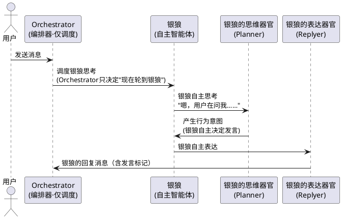
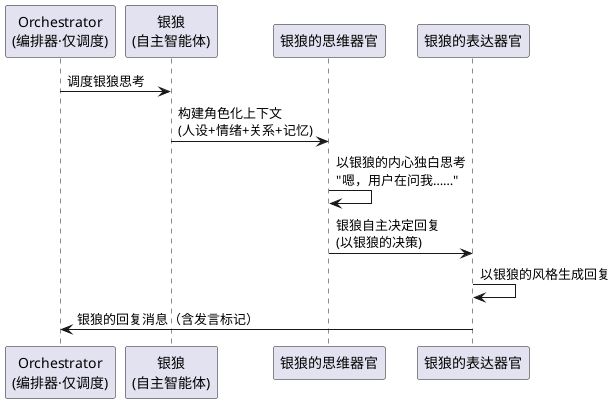
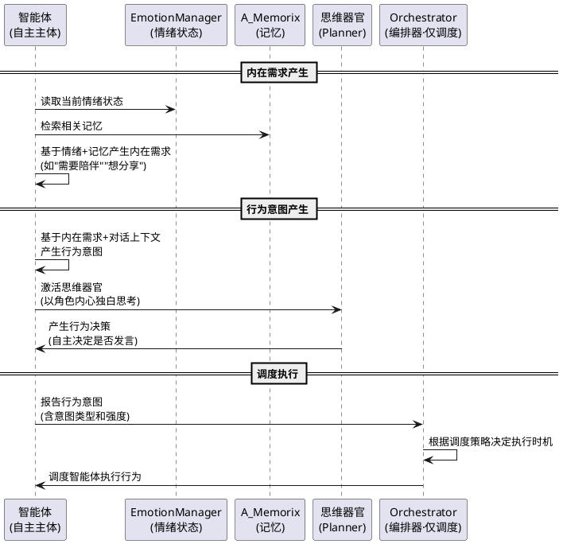
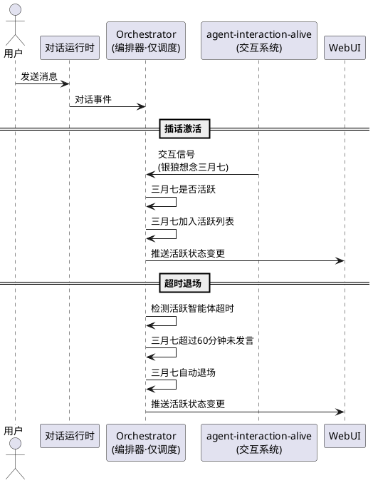
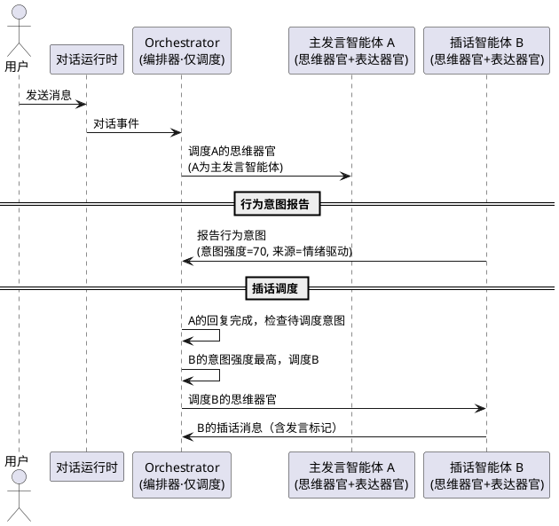
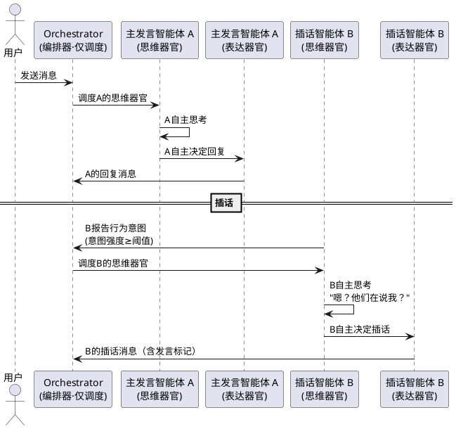
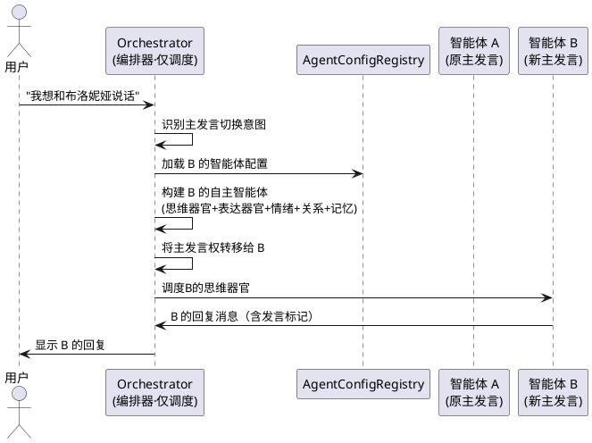
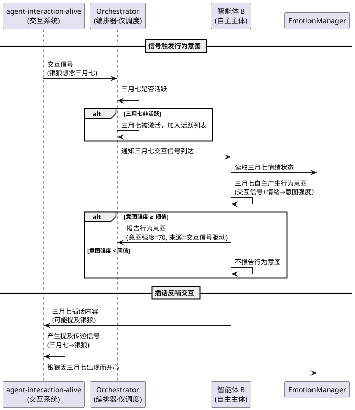
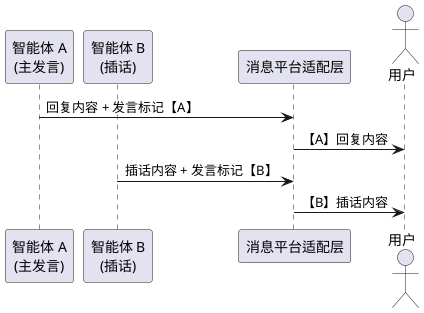
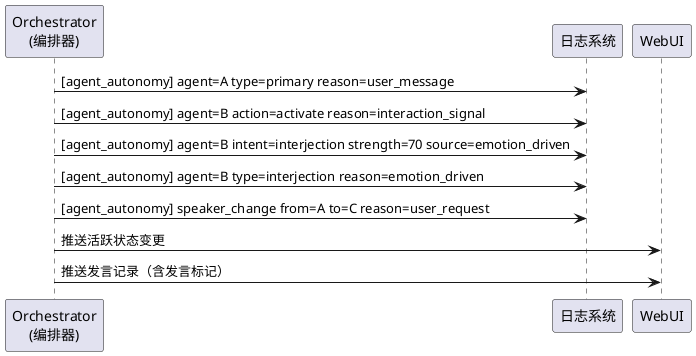

# 智能体自主性架构 — 需求规格

> 理想的角色不应是一具等待结局的标本，而应是一场永恒的进行时。

# **1. 组件定位**

## **1.1 核心职责**

本组件负责将智能体从"被 Planner/Replyer 拥有的状态容器"变革为"拥有 Planner/Replyer 的自主主体"——每个智能体自己思考、自己表达、自己感受、自己渴望、自己决定，Orchestrator 仅协调执行顺序而不替智能体做决策。

## **1.2 核心输入**

1. **用户消息**：用户在群聊或私聊中发送的消息，来源于消息平台适配层
2. **智能体交互信号**：来自 agent-interaction-alive 系统的交互事件、情绪变化、提及传递等信号，来源于 InteractionScheduler / InteractionEngine
3. **智能体自主行为意图**：智能体基于自身情绪、需求、记忆等内在状态产生的"想要做某事"的自主行为意图，来源于智能体自身的思维过程
4. **管理员指令**：通过 WebUI 或命令行手动指定某智能体发言、切换主发言智能体等操作
5. **对话上下文**：当前会话的对话历史、当前主发言智能体身份、活跃智能体列表等

## **1.3 核心输出**

1. **多智能体回复消息**：同一会话中，不同智能体以各自身份发出的回复消息，每条消息必须明确标识发言智能体
2. **智能体行为意图记录**：智能体自主产生的行为意图的结构化记录，包含意图类型、触发原因、意图强度等
3. **发言权变更通知**：主发言智能体变更时产生的通知，供日志和 WebUI 消费
4. **智能体活跃状态**：当前会话中"活跃"的智能体列表及其状态，供 WebUI 和其他模块消费
5. **可观测性日志**：每次回复和行为意图必须输出结构化日志，包含发言智能体 ID、行为类型、触发原因等

## **1.4 职责边界**

1. **不负责**智能体间交互的触发和影响计算——那是 agent-interaction-alive 系统的职责，本组件只消费其产生的信号
2. **不负责**智能体配置的加载和管理——那是 AgentConfigRegistry 的职责
3. **不负责**消息的发送和平台适配——那是消息平台适配层的职责，本组件只产出"由某智能体发出的回复内容"
4. **不负责**记忆的存储和检索——那是 A_Memorix 的职责，本组件只通过 MemoryService 接口消费记忆
5. **不负责**修改 A_Memorix 核心层——所有记忆操作通过 MemoryService 接口完成
6. **不负责**自行计算会话 ID——业务模块不应自行调用 SessionUtils.calculate_session_id
7. **不负责**任务型子智能体（Dream/Compaction/CheckpointWriter 等）的调度——那是 SubAgentScheduler 的职责，本组件管理的角色型智能体与任务型子智能体是完全不同的概念
8. **不负责**替智能体做决策——Orchestrator 只协调执行顺序和资源分配，不替任何智能体决定"是否发言""如何发言"，这些决策权属于智能体自身

# **2. 领域术语**

**自主智能体（Autonomous Agent）**
: 一个拥有完整自主行为能力的独立主体，拥有自己的思维（Planner 作为思维器官）、表达（Replyer 作为表达器官）、情绪、记忆、关系、内在需求和行为意图。自主智能体不是"被外部系统调度的参数包"，而是一个可以自主决定是否发言、何时发言、如何发言的主体。

**思维器官（Thinking Organ）**
: 智能体拥有的 Planner，从"旁观决策者"变为"智能体本人的思维过程"。当前 Planner 的提示词是"你不是 {bot_name} 本人，不要替 {bot_name} 发言"，这是外部视角；自主智能体的 Planner 提示词变为"你是 {bot_name}，你在思考如何回应"，这是内部视角。Planner 不再拥有智能体，而是智能体拥有 Planner。

**表达器官（Expression Organ）**
: 智能体拥有的 Replyer，与思维器官配对，属于同一智能体的表达单元。表达器官接收思维器官的思维指引，以该智能体的身份和风格生成可见回复。Replyer 不再是独立的"嘴巴"，而是智能体自身的表达器官。

**编排器（Orchestrator）**
: 协调多智能体在同一会话中协作的执行调度器。Orchestrator **只协调执行顺序和资源分配**，不替智能体做决策。Orchestrator 的职责是：管理哪些智能体处于活跃状态、协调多个智能体的 Planner 执行顺序、管理主发言权归属、处理插话调度。Orchestrator 不计算插话意愿——插话意愿由智能体自身的思维过程产生。

**主发言智能体（Primary Agent）**
: 在一个会话中当前承担主要回复职责的智能体。主发言智能体接收用户消息并通过其思维器官产生主要回复，类似群聊中"正在和你聊天的那个人"。

**插话（Interjection）**
: 非主发言智能体自主决定发言的行为。插话的本质是"另一个智能体自主决定要说话"，而非"外部引擎触发"。插话意愿由智能体自身的思维过程产生，Orchestrator 只负责调度执行时机。插话后，原主发言智能体仍然活跃，插话智能体发言完毕后回归待激活状态，主发言权不转移。

**发言权（Speaking Right）**
: 某个智能体在特定会话中发言的资格和优先级。拥有发言权不代表必须发言，但只有拥有发言权的智能体才能产生回复。

**活跃智能体（Active Agent）**
: 在某个会话中处于"活跃"状态的智能体。活跃智能体可以感知对话内容、其思维器官可产生行为意图、可被交互信号激活。非活跃的智能体无法插话。

**行为意图（Behavioral Intent）**
: 智能体基于自身内在状态（情绪、需求、记忆、关系等）自主产生的"想要做某事"的内在驱动力。行为意图是智能体自主性的核心体现——它不是外部系统计算的，而是智能体自己的思维过程产生的。行为意图包括但不限于：想要发言、想要插话、想要离开、想要提及某人。

**内在需求（Inner Need）**
: 智能体基于自身性格和当前状态产生的内在驱动力，如"孤独时需要陪伴""开心时想分享""无聊时想找人说话"等。内在需求是行为意图的重要来源，但不同于 agent-interaction-alive 中的同名概念——本组件的内在需求直接驱动对话行为（发言/插话），而 agent-interaction-alive 的内在需求驱动后台交互。

**插话冷却（Interjection Cooldown）**
: 同一智能体在两次插话之间必须间隔的最短时间，防止某个智能体频繁插话导致对话混乱。

**智能体退场（Agent Exit）**
: 一个活跃智能体离开当前对话的行为。退场后该智能体不再感知对话内容，其思维器官不再被激活。退场可以是自主的（智能体自行决定离开）也可以是被动的（长时间未参与对话自动退场）。

**发言标记（Speaker Tag）**
: 每条回复消息上附带的标识信息，标明该消息由哪个智能体发出。在所有智能体共用同一账号的场景下，发言标记是区分"谁在说话"的唯一方式。

**角色型智能体（Role Agent）**
: 拥有独立身份、状态、记忆、持续存在的智能体，如银狼、三月七等。区别于任务型子智能体。

**任务型子智能体（Task Sub-Agent）**
: 无身份、执行特定任务后消失的子智能体，如 Dream、Compaction、CheckpointWriter 等。由 SubAgentScheduler 管理，与本组件无关。

**自主回复管线（Autonomous Reply Pipeline）**
: 从"智能体自主产生行为意图"到"思维器官思考"到"表达器官输出"到"消息发出"的完整处理管线。在自主性架构下，回复管线由智能体自主驱动，Orchestrator 只负责调度多个智能体管线的执行顺序。

# **3. 角色与边界**

## **3.1 核心角色**

- **普通用户**：与智能体对话的参与者，体验多智能体自主回复带来的群像式对话效果
- **系统管理员**：通过 WebUI 管理智能体活跃状态、手动触发插话或切换主发言智能体

## **3.2 外部系统**

- **agent-interaction-alive 系统**：提供智能体间交互信号（情绪变化、提及传递、交互事件等），本组件消费这些信号作为智能体行为意图的触发源之一
- **AgentConfigRegistry**：提供智能体配置（人设、内部关系、情绪基线等），是智能体构建的基础
- **EmotionManager**：提供智能体当前情绪状态，影响行为意图产生；每个智能体拥有独立的 EmotionManager 实例
- **RelationshipManager**：提供智能体与用户的关系数据，影响回复风格；每个智能体拥有独立的 RelationshipManager 实例
- **A_Memorix（MemoryService）**：提供记忆检索能力，影响回复内容和行为决策；每个智能体通过独立的 MemoryService 接入消费记忆
- **MaisakaHeartFlowChatting**：当前对话运行时，本组件需要与其深度集成以支持多智能体自主回复
- **MaisakaChatLoopService**：对话循环服务，本组件需要扩展其能力以支持按智能体切换 Planner/Replyer 上下文
- **WebUI 指挥中心**：消费智能体活跃状态、发言权变更、行为意图等可观测性数据
- **消息平台适配层**：接收本组件产出的多智能体回复消息，负责实际发送
- **SubAgentScheduler**：管理任务型子智能体的调度，与本组件管理的角色型智能体无关

## **3.3 交互上下文**

```plantuml
@startuml
!define COMPONENT color:#E8F5E9

rectangle "智能体自主性架构系统\n（自主主体架构）" as Core COMPONENT {
}

actor "普通用户" as User
actor "系统管理员" as Admin

usecase "agent-interaction-alive\n(智能体交互活化)" as Interaction
usecase "AgentConfigRegistry\n(智能体配置)" as Config
usecase "EmotionManager\n(情绪管理·每智能体独立)" as Emotion
usecase "RelationshipManager\n(关系管理·每智能体独立)" as Relationship
usecase "A_Memorix\n(记忆系统·每智能体独立接入)" as Memory
usecase "MaisakaHeartFlowChatting\n(对话运行时)" as Runtime
usecase "MaisakaChatLoopService\n(对话循环服务)" as ChatLoop
usecase "WebUI 指挥中心\n(可视化)" as WebUI
usecase "消息平台适配层\n(消息发送)" as Platform

User --> Runtime : 发送消息
Admin --> Core : 管理活跃状态/触发插话
Runtime --> Core : 对话事件信号

Core --> Interaction : 消费交互信号\n(行为意图触发源之一)
Core <-- Config : 读取智能体配置\n(智能体构建)
Core <-- Emotion : 读取情绪状态\n(行为意图产生)
Core <-- Relationship : 读取关系数据
Core <-- Memory : 检索记忆\n(智能体上下文)
Core --> ChatLoop : 切换Planner/Replyer上下文\n(按智能体)
Core --> Runtime : 注入多智能体回复
Core --> WebUI : 推送活跃状态/发言权变更/行为意图
Core --> Platform : 产出多智能体回复消息\n(含发言标记)

@enduml
```

# **4. DFX约束**

## **4.1 性能**

1. 智能体行为意图产生延迟必须 < 300ms（不含 LLM 调用）
2. 智能体上下文切换延迟必须 < 100ms（从决定由智能体 B 发言到 B 的思维器官上下文就绪）
3. 单次插话产生的额外 LLM 调用不超过 1 次思维器官 + 1 次表达器官（与主发言流程一致）
4. 同一会话中同时活跃的智能体不超过 5 个
5. 同一会话中同一时刻正在执行的回复轮次不超过 2 个（防止消息发送顺序混乱）
6. Orchestrator 的调度决策延迟必须 < 50ms（不含智能体 Planner/Replyer 的 LLM 调用）

## **4.2 可靠性**

1. 自主性架构异常时必须降级为单智能体模式（当前行为），不能导致对话中断
2. 智能体上下文切换失败时必须回退到原主发言智能体继续对话
3. 插话消息的发送失败不得影响主发言智能体的回复流程
4. 系统重启后，智能体活跃状态必须从持久化存储恢复
5. Orchestrator 异常时必须降级为仅主发言智能体模式，不得导致整个会话崩溃
6. 智能体行为意图产生失败时不得阻塞其他智能体的回复流程

## **4.3 安全性**

1. 智能体的发言内容必须遵守其自身的 AgentConfig.permission 和 hard_permission
2. 智能体产生的记忆写入必须遵守 A_Memorix 的 MODIFICATION_POLICY
3. 智能体发言内容不得泄露私聊上下文（遵守 CrossChatContextService 的共享规则）
4. 管理员手动触发插话的操作必须记录审计日志
5. 智能体活跃状态的变更必须记录审计日志
6. 思维器官的提示词必须确保不会绕过权限控制——自主性不等于无约束
7. 智能体的自主行为必须遵守发言频率限制和冷却规则——自主性不等于无限制

## **4.4 可维护性**

1. 所有回复消息必须输出结构化日志，包含 agent_id、reply_type（primary/interjection/switch）、trigger_reason
2. 插话事件必须输出结构化日志，格式为 `[agent_autonomy] agent=X type=interjection reason=XX`
3. 发言权变更必须输出结构化日志，格式为 `[agent_autonomy] speaker_change from=A to=B reason=XX`
4. 智能体活跃状态变更必须输出结构化日志，格式为 `[agent_autonomy] agent=X action=activate/deactivate session=XX reason=XX`
5. 智能体行为意图必须输出结构化日志，格式为 `[agent_autonomy] agent=X intent=XX strength=XX source=XX`
6. 插话冷却和频率限制参数必须可配置，无需改代码即可调整
7. 活跃智能体列表和状态必须通过标准 API 暴露，WebUI 通过 API 消费
8. Orchestrator 的调度策略必须可配置（如最大活跃数、超时退场时间等）

## **4.5 兼容性**

1. 本组件必须与现有的单智能体模式完全兼容——未启用自主性架构时，行为与当前完全一致
2. 本组件必须与 agent-interaction-alive 系统兼容——交互信号可以作为智能体行为意图的触发源，但插话机制不依赖交互系统独立运行
3. 本组件必须与现有的 ProactiveEngine 兼容——主动对话仍然由主发言智能体发起
4. 本组件必须与现有的 Plugin Hook 机制兼容——maisaka.planner.before_request / maisaka.replyer.before_request 等 Hook 仍然正常工作
5. 提示词模板的修改必须三语同步（zh-CN/en-US/ja-JP）
6. 配置文件修改只改模板，新增版本号
7. 角色型智能体与任务型子智能体必须完全隔离——本组件的变更不得影响 SubAgentScheduler 管理的任务型子智能体

# **5. 核心能力**

## **5.1 智能体自主性**

### **5.1.1 业务规则**

1. **智能体是自主主体规则**：每个智能体必须是一个拥有完整自主行为能力的独立主体，而非被外部系统调度的"参数包"
   - 智能体自己思考：调用 Planner 作为思维器官
   - 智能体自己表达：调用 Replyer 作为表达器官
   - 智能体自己感受：情绪响应
   - 智能体自己渴望：内在需求驱动行为
   - 智能体自己决定：行为意图
   a. 验收条件：[银狼接收到用户消息] → [银狼的思维器官以银狼的内心独白思考"用户在问我……"，银狼的表达器官以银狼的风格生成回复，而非旁观者分析和指令]
   b. 验收条件：[银狼和三月七同时活跃] → [两者的思维过程、情绪状态、关系信息、记忆完全独立，各自自主决策]

2. **视角翻转规则**：Planner 和 Replyer 的所有权必须从"系统拥有"翻转为"智能体拥有"
   - 旧架构：Planner 拥有智能体（智能体是 Planner 的上下文参数）
   - 新架构：智能体拥有 Planner（Planner 是智能体的思维器官）
   a. 验收条件：[查看银狼的思维器官提示词] → [提示词为"你是银狼，你在思考如何回应"，而非"你不是银狼本人，不要替银狼发言"]
   b. 验收条件：[银狼的思维器官产生思维输出] → [输出内容体现银狼的内心独白风格（"嗯，用户在问我……"），而非第三人称分析（"银狼应该回复用户"）]

3. **智能体行为意图规则**：智能体必须能基于自身内在状态自主产生行为意图，而非被动等待外部触发
   a. 验收条件：[银狼的情绪为 excited（强度 70）且对话中提到游戏话题] → [银狼自主产生"想要发言"的行为意图，意图来源为"情绪驱动+话题相关"]
   b. 验收条件：[三月七的内在需求为"想念银狼"且银狼正在对话中] → [三月七自主产生"想要插话"的行为意图，意图来源为"内在需求驱动"]
   c. 验收条件：[智能体无任何内在驱动力] → [不产生行为意图，智能体保持安静]

4. **智能体自主决定规则**：智能体的发言决策必须由智能体自身的思维过程产生，Orchestrator 不替智能体做决策
   a. 验收条件：[Orchestrator 调度智能体 B 的思维器官] → [B 的思维器官自主决定是否发言、如何发言，Orchestrator 只决定"现在轮到 B 思考"]
   b. 验收条件：[Orchestrator 调度智能体 B 的思维器官但 B 决定不发言] → [B 不发言，Orchestrator 不强制 B 发言]

5. **禁止项**：禁止 Orchestrator 替智能体做发言决策——Orchestrator 只协调执行顺序，不决定"是否发言""如何发言"
   a. 验收条件：[Orchestrator 的调度逻辑] → [不包含任何"替智能体判断是否应该发言"的逻辑，只包含"何时给智能体思考机会"的调度逻辑]

6. **禁止项**：禁止在智能体的思维器官提示词中混入其他智能体的身份信息
   a. 验收条件：[银狼的思维器官上下文] → [不得包含三月七的人设、情绪状态或关系信息]

### **5.1.2 交互流程**



### **5.1.3 异常场景**

1. **思维器官提示词构建失败**
   a. 触发条件：智能体的人设配置缺失或情绪/关系/记忆加载失败
   b. 系统行为：降级为当前旁观者模式的 Planner 继续对话，记录错误日志
   c. 用户感知：回复内容可能缺乏角色个性，但不影响对话进行

2. **智能体行为意图产生异常**
   a. 触发条件：智能体的思维过程产生异常或超时
   b. 系统行为：跳过该智能体的本轮思考，不影响其他智能体
   c. 用户感知：该智能体本轮不发言

3. **思维器官产生越权内容**
   a. 触发条件：智能体的思维器官尝试替其他智能体做决策或生成违反权限的内容
   b. 系统行为：被权限系统拦截，记录警告日志
   c. 用户感知：该回复不会发出

## **5.2 智能体思维器官角色化**

### **5.2.1 业务规则**

1. **思维器官角色化提示词规则**：每个智能体的 Planner 提示词必须从"旁观决策者"变为"智能体本人的思维过程"
   - 当前："你不是 {bot_name} 本人，不要替 {bot_name} 发言，你需要给 {bot_name} 的行为做出决策" → 外部视角
   - 变革："你是 {bot_name}，你在思考如何回应" → 内部视角
   a. 验收条件：[银狼的思维器官构建完成] → [银狼的 Planner 提示词为"你是银狼，你在思考如何回应"，而非"你不是银狼本人"]
   b. 验收条件：[三月七的思维器官构建完成] → [三月七的 Planner 提示词为"你是三月七，你在思考如何回应"]

2. **思维器官身份注入规则**：思维器官的系统提示词必须注入该智能体的完整身份信息
   - 角色人设（{identity}）：该角色的性格、背景、说话风格
   - 情绪状态：该角色当前的情绪
   - 关系信息：该角色与对话参与者的关系
   - 交互记忆：该角色的记忆
   a. 验收条件：[银狼的思维器官被激活] → [系统提示词中包含银狼的人设、银狼的情绪状态、银狼的关系信息、银狼的交互记忆]

3. **思维器官思维输出规则**：思维器官的思维输出应当体现角色的内心独白，而非旁观者的分析
   - 当前："分析：银狼应该回复用户关于游戏的话题" → 旁观者分析
   - 变革："嗯，用户在问我游戏的事？正好我最近在玩这个……" → 角色内心独白
   a. 验收条件：[银狼的思维器官生成思维输出] → [输出内容体现银狼的内心独白风格，而非第三人称分析]

4. **思维器官工具调用规则**：思维器官调用 reply 工具时，应当以角色的身份做出决策
   - 当前："判断银狼应该回复" → 旁观者决策
   - 变革："我决定回复用户" → 角色本人决策
   a. 验收条件：[银狼的思维器官调用 reply 工具] → [reply_guide 参数中的指引体现银狼的内心决策，而非外部指令]

5. **思维器官与表达器官的配对规则**：思维器官和表达器官必须属于同一个智能体，不能跨智能体配对
   a. 验收条件：[银狼的思维器官调用 reply 工具] → [触发的 Replyer 必须是银狼的表达器官，不能是三月七的]

6. **思维器官的权限约束规则**：自主性不等于无约束——思维器官仍然必须遵守该智能体的权限规则
   a. 验收条件：[银狼的思维器官尝试生成违反 hard_permission 的内容] → [被权限系统拦截，不会发出]

7. **禁止项**：禁止在思维器官的提示词中混入其他智能体的身份信息
   a. 验收条件：[银狼的思维器官上下文] → [不得包含三月七的人设、情绪状态或关系信息]

8. **禁止项**：禁止思维器官直接替其他智能体做决策——每个智能体的思维器官只能为自己做决策
   a. 验收条件：[银狼的思维器官] → [不能决定"三月七应该回复"，只能决定"我（银狼）应该回复"]

### **5.2.2 交互流程**



### **5.2.3 异常场景**

1. **思维器官提示词构建失败**
   a. 触发条件：角色的人设配置缺失或情绪/关系/记忆加载失败
   b. 系统行为：降级为当前旁观者模式的 Planner 继续对话，记录错误日志
   c. 用户感知：回复内容可能缺乏角色个性，但不影响对话进行

2. **思维器官产生越权内容**
   a. 触发条件：思维器官尝试替其他智能体做决策或生成违反权限的内容
   b. 系统行为：被权限系统拦截，记录警告日志
   c. 用户感知：该回复不会发出

## **5.3 智能体内在需求与行为意图**

### **5.3.1 业务规则**

1. **内在需求产生规则**：智能体必须能基于自身性格和当前状态产生内在需求，驱动自主行为
   a. 验收条件：[银狼的情绪为 lonely（强度 60）] → [银狼产生"需要陪伴"的内在需求]
   b. 验收条件：[三月七的情绪为 excited（强度 70）] → [三月七产生"想分享"的内在需求]
   c. 验收条件：[智能体 A 的情绪为 calm（强度 < 20）持续 2 小时] → [A 产生"无聊"的内在需求]

2. **行为意图产生规则**：智能体必须能基于内在需求、情绪状态、对话上下文等自主产生行为意图
   a. 验收条件：[银狼产生"想分享"的内在需求且对话中提到游戏话题] → [银狼自主产生"想要发言"的行为意图，意图强度由需求和话题相关性共同决定]
   b. 验收条件：[三月七产生"想念银狼"的内在需求且银狼正在对话中] → [三月七自主产生"想要插话"的行为意图]
   c. 验收条件：[智能体无内在需求且对话内容不相关] → [不产生行为意图]

3. **行为意图强度规则**：行为意图必须有可量化的强度值，影响是否转化为实际行为
   a. 验收条件：[银狼的行为意图强度 ≥ 阈值（默认 60）] → [行为意图转化为实际的发言行为]
   b. 验收条件：[银狼的行为意图强度 < 阈值] → [行为意图不转化为发言行为，但仍然被记录]

4. **行为意图来源规则**：行为意图的来源必须可追溯，包含以下来源类型：
   - 情绪驱动：由智能体当前情绪状态产生
   - 内在需求驱动：由智能体的内在需求产生
   - 话题相关驱动：由对话内容与智能体关注领域的相关性产生
   - 关系驱动：由对话中提及与智能体关系密切的人或事产生
   - 交互信号驱动：由 agent-interaction-alive 产生的交互事件信号产生
   - 思维器官激活驱动：由智能体自身的思维过程被激活产生
   a. 验收条件：[任意行为意图记录] → [必须包含至少一个来源类型和来源描述]

5. **行为意图与 Orchestrator 的关系规则**：行为意图由智能体自主产生，Orchestrator 只负责调度执行时机
   a. 验收条件：[银狼产生"想要插话"的行为意图] → [Orchestrator 根据调度策略决定何时给银狼思考机会，但不决定银狼是否应该插话]
   b. 验收条件：[银狼产生行为意图但 Orchestrator 判断当前不适合调度] → [行为意图被暂存，等待合适的调度时机]

6. **禁止项**：禁止 Orchestrator 替智能体计算行为意图——行为意图必须由智能体自身的思维过程产生
   a. 验收条件：[Orchestrator 的逻辑] → [不包含任何"替智能体计算插话意愿"的逻辑，只包含"基于智能体报告的行为意图强度决定调度优先级"的逻辑]

7. **禁止项**：禁止在无任何内在驱动力的情况下产生行为意图——每次行为意图必须有明确的来源
   a. 验收条件：[行为意图记录中来源为空] → [该行为意图不应被创建]

### **5.3.2 交互流程**



### **5.3.3 异常场景**

1. **内在需求计算异常**
   a. 触发条件：情绪状态读取失败或记忆检索异常
   b. 系统行为：跳过内在需求产生，智能体仍可基于对话上下文产生行为意图
   c. 用户感知：智能体的行为可能缺乏情绪驱动的深度

2. **行为意图产生冲突**
   a. 触发条件：智能体同时产生多个相互冲突的行为意图（如"想发言"和"想离开"）
   b. 系统行为：由智能体的思维器官自主裁决冲突，选择最符合当前状态的意图
   c. 用户感知：智能体表现出一致的行为

3. **行为意图暂存超时**
   a. 触发条件：行为意图被暂存但长时间未被调度执行
   b. 系统行为：行为意图自然衰减，超过 5 分钟后自动失效
   c. 用户感知：智能体未在该时机发言

## **5.4 多智能体协作**

### **5.4.1 业务规则**

1. **多智能体共存规则**：同一会话中可以同时存在多个活跃智能体，每个智能体拥有独立的思维器官、表达器官、情绪状态、关系信息和记忆
   a. 验收条件：[银狼和三月七同时活跃] → [两者的 Planner 提示词、情绪状态、关系信息、记忆完全独立，互不干扰]

2. **智能体激活规则**：智能体可以通过以下方式加入会话活跃列表：
   - 主发言激活：会话创建时，主发言智能体自动激活
   - 插话激活：智能体插话时自动加入活跃列表
   - 交互信号激活：agent-interaction-alive 的交互事件信号可以激活智能体
   - 行为意图激活：智能体自主产生强烈的行为意图时可以激活
   - 管理员手动激活
   a. 验收条件：[智能体 B 在会话中插话] → [B 自动加入该会话的活跃智能体列表]
   b. 验收条件：[agent-interaction-alive 产生"银狼想念三月七"交互事件且三月七与该会话有关联] → [三月七加入该会话的活跃列表]

3. **智能体退场规则**：智能体可以通过以下方式退场：
   - 自主退场：智能体在思维过程中决定离开（如"我先走了"）
   - 超时退场：活跃智能体超过一定时间未发言，自动退场
   - 管理员手动退场
   a. 验收条件：[智能体 B 活跃但超过 60 分钟未发言] → [B 自动退场，记录退场原因"超时"]
   b. 验收条件：[智能体 B 的思维器官决定离开] → [B 自主退场，记录退场原因"自主"]

4. **活跃智能体数量限制**：同一会话中同时活跃的智能体不超过 5 个
   a. 验收条件：[会话中已有 5 个活跃智能体，第 6 个尝试激活] → [拒绝激活，记录日志"活跃智能体数已满"]

5. **活跃状态持久化**：智能体活跃状态必须持久化，系统重启后可恢复
   a. 验收条件：[系统重启后] → [重启前的活跃智能体列表仍然可查]

6. **活跃感知规则**：活跃智能体应当能感知当前对话内容，非活跃的智能体不能感知
   a. 验收条件：[智能体 B 活跃] → [B 的思维器官可以参考当前对话内容产生行为意图]
   b. 验收条件：[智能体 C 非活跃] → [C 不会基于当前对话内容产生行为意图]

7. **禁止项**：禁止非活跃的智能体直接发言——非活跃的智能体必须先激活，才能产生回复
   a. 验收条件：[智能体 C 不在会话的活跃列表中] → [C 不能在该会话中产生任何回复]

8. **禁止项**：禁止智能体之间共享上下文——每个智能体的思维器官提示词、情绪状态、关系信息、记忆必须完全独立
   a. 验收条件：[银狼和三月七同时活跃] → [银狼的思维器官上下文中不得包含三月七的情绪状态或关系信息]

### **5.4.2 交互流程**



### **5.4.3 异常场景**

1. **活跃状态持久化失败**
   a. 触发条件：数据库不可用导致活跃状态无法持久化
   b. 系统行为：活跃状态仅在内存中维护，标记"持久化失败"，系统重启后丢失
   c. 用户感知：重启后活跃智能体列表清空，仅主发言智能体活跃

2. **活跃智能体数达到上限**
   a. 触发条件：已有 5 个活跃智能体，第 6 个尝试激活
   b. 系统行为：拒绝激活，记录日志
   c. 用户感知：第 6 个智能体不会出现在对话中

3. **智能体构建失败**
   a. 触发条件：智能体的配置加载失败或 EmotionManager/RelationshipManager 初始化异常
   b. 系统行为：跳过该智能体的激活，记录错误日志
   c. 用户感知：该智能体不会出现在对话中

## **5.5 Orchestrator 编排**

### **5.5.1 业务规则**

1. **Orchestrator 仅调度规则**：Orchestrator 是多智能体协作的执行调度器，只协调执行顺序和资源分配，不替智能体做决策
   - 活跃管理 → Orchestrator 管理哪些智能体处于活跃状态
   - 执行调度 → Orchestrator 协调多个智能体的思维器官执行顺序
   - 发言权管理 → Orchestrator 管理主发言权归属
   - 插话调度 → Orchestrator 基于智能体报告的行为意图强度决定调度优先级
   a. 验收条件：[会话中存在多个活跃智能体] → [所有调度决策由 Orchestrator 统一处理，Orchestrator 不包含任何"替智能体判断是否应该发言"的逻辑]

2. **Orchestrator 主发言权管理规则**：Orchestrator 负责管理当前的主发言智能体
   - 会话创建时：主发言智能体由 AgentRouter 解析
   - 用户请求切换时：Orchestrator 将主发言权转移给目标智能体
   - 智能体自主让出时：Orchestrator 将主发言权转移给被指定的智能体
   - 管理员手动切换时：Orchestrator 执行切换
   a. 验收条件：[用户说"我想和布洛妮娅说话"] → [Orchestrator 将主发言权从 A 转移给布洛妮娅]
   b. 验收条件：[银狼在回复中说"你问布洛妮娅吧"] → [Orchestrator 将主发言权从银狼转移给布洛妮娅]

3. **Orchestrator 插话调度规则**：Orchestrator 基于智能体报告的行为意图强度决定插话调度优先级
   - 主发言智能体的思维器官优先执行
   - 插话智能体的思维器官在主发言完成后执行
   - 多个智能体同时报告行为意图时，按意图强度排序依次调度
   a. 验收条件：[主发言智能体 A 正在生成回复，智能体 B 和 C 同时报告行为意图] → [A 的回复先完成，然后按意图强度排序依次调度 B 和 C 的思维器官]

4. **Orchestrator 降级规则**：当 Orchestrator 异常时，必须降级为仅主发言智能体模式
   a. 验收条件：[Orchestrator 编排异常] → [降级为仅主发言智能体回复，不执行任何插话或切换]

5. **禁止项**：禁止绕过 Orchestrator 直接激活智能体的思维器官——所有智能体的思维器官激活必须通过 Orchestrator 调度
   a. 验收条件：[交互信号到达] → [必须经过 Orchestrator 的调度，不能直接激活智能体的思维器官]

6. **禁止项**：禁止 Orchestrator 在主发言智能体的 LLM 调用进行中时调度插话——插话必须在当前回复轮次结束后调度
   a. 验收条件：[主发言智能体 A 的 LLM 调用正在进行中] → [Orchestrator 必须等待 A 的回复轮次结束后再调度插话]

### **5.5.2 交互流程**



### **5.5.3 异常场景**

1. **Orchestrator 编排异常**
   a. 触发条件：Orchestrator 内部状态不一致或编排逻辑异常
   b. 系统行为：降级为仅主发言智能体模式，记录错误日志
   c. 用户感知：只看到主发言智能体的回复，无插话

2. **多个智能体同时报告行为意图冲突**
   a. 触发条件：B 和 C 同时报告强烈的行为意图
   b. 系统行为：Orchestrator 按意图强度排序，依次调度，遵守频率限制
   c. 用户感知：先看到意图更强的智能体插话

3. **插话生成失败**
   a. 触发条件：插话智能体的思维器官/表达器官的 LLM 调用失败或超时
   b. 系统行为：跳过本次插话，不影响主发言智能体的回复
   c. 用户感知：只看到主发言智能体的回复，未看到插话

## **5.6 插话机制**

### **5.6.1 业务规则**

1. **插话本质规则**：插话的本质是"另一个智能体自主决定要说话"，而非"外部引擎触发的发言代理"
   - 旧架构：InterjectionEngine 计算意愿 → 触发 Replyer 生成插话内容 → 外部视角
   - 自主性架构：智能体 B 自主产生行为意图 → B 的思维器官以角色内心独白思考 → B 的表达器官以角色风格表达 → 内部视角
   a. 验收条件：[三月七插话] → [三月七自主产生"想要插话"的行为意图，三月七的思维器官以三月七的内心独白思考"嗯？银狼在说我？我也要说！"，然后三月七的表达器官生成插话内容]

2. **插话与主发言的区分规则**：插话和主发言必须明确区分
   a. 验收条件：[智能体 B 插话] → [插话消息带有发言标记，标识为 B 发出；主发言智能体 A 仍然活跃，发言权不转移]
   b. 验收条件：[智能体 B 插话后] → [B 的发言完毕后，A 继续作为主发言智能体]

3. **插话内容规则**：插话内容必须体现插话智能体的自主思维和性格，且与当前对话上下文相关
   a. 验收条件：[布洛妮娅插话且对话中提到她] → [插话内容体现布洛妮娅的自主思维和性格特征，与对话话题相关]
   b. 验收条件：[银狼插话且当前情绪为 happy] → [插话内容体现银狼的开心状态，以银狼的内心独白风格]

4. **插话冷却规则**：同一智能体的两次插话之间必须间隔一定时间
   a. 验收条件：[智能体 B 刚完成插话] → [B 的下一次插话至少 5 分钟后]
   b. 验收条件：[智能体 B 在 10 分钟内插话 3 次] → [第 3 次插话被冷却拒绝]

5. **插话频率限制**：同一会话中所有智能体的插话总频率必须受限
   a. 验收条件：[会话中 10 分钟内已有 3 次插话] → [第 4 次插话被频率限制拒绝]

6. **插话不阻断主发言**：插话的执行不得阻断主发言智能体的回复流程
   a. 验收条件：[主发言智能体 A 正在生成回复时，智能体 B 报告行为意图] → [B 的插话等待 A 的回复完成后再调度，或与 A 的回复并行但发送顺序保证 A 先 B 后]
   b. 验收条件：[插话生成失败] → [不影响主发言智能体 A 的回复]

7. **禁止项**：禁止插话内容与当前对话完全无关——插话必须有上下文关联
   a. 验收条件：[智能体 B 的插话内容与当前对话话题无关] → [该插话不应被执行]

### **5.6.2 交互流程**



### **5.6.3 异常场景**

1. **插话冷却冲突**
   a. 触发条件：智能体 B 报告行为意图但仍在冷却期内
   b. 系统行为：拒绝调度，记录日志
   c. 用户感知：B 未插话

2. **插话频率超限**
   a. 触发条件：会话的插话总频率超过限制
   b. 系统行为：拒绝调度，记录日志
   c. 用户感知：无

3. **插话与主回复发送顺序冲突**
   a. 触发条件：插话消息和主回复消息几乎同时生成
   b. 系统行为：Orchestrator 保证主回复先发送，插话后发送
   c. 用户感知：先看到主发言智能体的回复，再看到插话

## **5.7 主发言权切换**

### **5.7.1 业务规则**

1. **主发言权切换规则**：主发言智能体可以通过以下方式切换：
   - 用户明确请求（如"我想和布洛妮娅说话"）
   - 当前主发言智能体自主让出（如"你问布洛妮娅吧"）
   - 管理员手动切换
   a. 验收条件：[用户说"我想和布洛妮娅说话"] → [Orchestrator 将主发言权从 A 转移给布洛妮娅，A 退到活跃状态（仍然活跃但不再主发言）]
   b. 验收条件：[银狼在回复中说"你问布洛妮娅吧"] → [Orchestrator 将主发言权从银狼转移给布洛妮娅]

2. **切换与插话的区别规则**：主发言权切换和插话必须明确区分
   a. 验收条件：[主发言权从 A 切换为 B] → [A 不再是主发言智能体，B 成为新的主发言智能体，后续用户消息由 B 的思维器官主要处理]
   b. 验收条件：[智能体 B 插话] → [A 仍然是主发言智能体，B 发言完毕后回归待激活状态，后续用户消息仍由 A 的思维器官主要处理]

3. **对话历史共享规则**：不同智能体在同一会话中共享对话历史，但各自以自己的角色化视角理解
   a. 验收条件：[智能体 B 接管主发言后] → [B 可以看到之前的对话历史（包括 A 的发言），但 B 的回复风格和内容基于 B 的自主思维]
   b. 验收条件：[智能体 B 插话时] → [B 可以看到当前对话上下文，但 B 的插话内容基于 B 的自主思维和当前状态]

4. **发言标记规则**：每条回复消息必须明确标识发言智能体
   a. 验收条件：[智能体 A 发送主回复] → [消息带有发言标记 `speaker: A`]
   b. 验收条件：[智能体 B 插话] → [消息带有发言标记 `speaker: B`]
   c. 验收条件：[所有智能体共用同一账号时] → [发言标记通过消息内容中的角色名前缀或其他方式体现，确保用户能区分谁在说话]

5. **禁止项**：禁止在主发言权切换时混入前一个智能体的角色化上下文
   a. 验收条件：[从 A 切换到 B 为主发言] → [B 的思维器官提示词中不得包含 A 的身份提示词、A 的情绪状态、A 的关系信息]

### **5.7.2 交互流程**



### **5.7.3 异常场景**

1. **主发言权切换失败**
   a. 触发条件：目标智能体的配置加载失败或智能体构建异常
   b. 系统行为：回退到原主发言智能体继续对话，记录错误日志
   c. 用户感知：看到原主发言智能体的回复，附带提示"切换失败"

2. **目标智能体不存在**
   a. 触发条件：用户请求切换到的智能体不在 AgentConfigRegistry 中
   b. 系统行为：当前主发言智能体回复"找不到那个人"，不切换
   c. 用户感知：看到当前智能体的回复

3. **对话历史过大导致上下文溢出**
   a. 触发条件：切换主发言智能体时，对话历史超过上下文窗口
   b. 系统行为：按现有上下文选择策略裁剪历史，不影响切换
   c. 用户感知：新智能体可能不记得很早的对话内容

## **5.8 与交互活化系统的联动**

### **5.8.1 业务规则**

1. **交互信号作为行为意图触发源规则**：agent-interaction-alive 系统产生的交互信号应当能触发智能体产生行为意图
   a. 验收条件：[agent-interaction-alive 产生"银狼想念三月七"交互事件且三月七在该会话活跃] → [三月七产生"想要插话"的行为意图，意图来源为"交互信号驱动"，意图强度 +40]
   b. 验收条件：[agent-interaction-alive 产生提及传递信号（对话中提及布洛妮娅）且布洛妮娅在该会话活跃] → [布洛妮娅产生"想要插话"的行为意图，意图来源为"交互信号驱动"，意图强度 +30]

2. **交互信号激活智能体规则**：交互信号应当能激活非活跃的智能体
   a. 验收条件：[agent-interaction-alive 产生"银狼想念三月七"交互事件且三月七非活跃但与该会话有关联] → [三月七被激活，加入活跃列表，产生行为意图]

3. **插话反哺交互规则**：智能体在对话中的插话行为应当反哺 agent-interaction-alive 的交互系统
   a. 验收条件：[智能体 B 在对话中插话且内容与智能体 C 相关] → [产生 B→C 的提及传递信号，写入交互系统]
   b. 验收条件：[智能体 B 插话后] → [B 的情绪状态因插话产生变化，写入 EmotionManager]

4. **信号传导闭环规则**：从"后台交互信号"到"前台智能体行为意图"到"新交互信号"形成闭环
   a. 验收条件：[银狼想念三月七（后台信号）→ 三月七自主产生行为意图并插话（前台行为）→ 银狼因三月七出现而开心（新后台信号）] → [完整的信号传导闭环]

5. **禁止项**：禁止交互信号绕过智能体的自主决策直接触发发言——交互信号只能触发行为意图，是否发言由智能体自主决定
   a. 验收条件：[交互信号到达但智能体自主决定不发言] → [不产生插话行为，但智能体可能被激活]

### **5.8.2 交互流程**



### **5.8.3 异常场景**

1. **交互信号到达时对话不活跃**
   a. 触发条件：交互信号到达但当前会话无活跃对话
   b. 系统行为：交互信号仅影响活跃状态和情绪，不触发行为意图
   c. 用户感知：无

2. **交互信号与插话形成无限循环**
   a. 触发条件：A 插话 → 产生交互信号 → B 产生行为意图并插话 → 产生交互信号 → A 再次产生行为意图
   b. 系统行为：插话冷却机制和频率限制自动打破循环
   c. 用户感知：插话逐渐减少直到停止

## **5.9 发言标记**

### **5.9.1 业务规则**

1. **发言标记必须规则**：每条回复消息必须明确标识发言智能体，确保用户能区分"谁在说话"
   a. 验收条件：[任意智能体产生回复] → [回复消息带有发言标记，标识为该智能体发出]

2. **发言标记格式规则**：在所有智能体共用同一账号的场景下，发言标记通过消息内容中的角色名前缀体现
   a. 验收条件：[银狼发送回复] → [消息内容以"【银狼】"或类似格式前缀标识]
   b. 验收条件：[三月七发送回复] → [消息内容以"【三月七】"或类似格式前缀标识]

3. **发言标记一致性规则**：同一智能体在不同会话中的发言标记格式必须一致
   a. 验收条件：[银狼在群聊 A 和群聊 B 中的发言标记] → [格式完全一致]

4. **发言标记可配置规则**：发言标记的格式和前缀必须可配置
   a. 验收条件：[修改发言标记配置] → [所有智能体的发言标记格式同步变更]

5. **禁止项**：禁止在单智能体模式下显示发言标记——未启用自主性架构时，不显示发言标记
   a. 验收条件：[会话中仅有一个活跃智能体且未启用多智能体] → [回复消息不包含发言标记]

### **5.9.2 交互流程**



### **5.9.3 异常场景**

1. **发言标记格式解析失败**
   a. 触发条件：发言标记配置格式错误
   b. 系统行为：使用默认格式（角色名前缀），记录警告日志
   c. 用户感知：发言标记使用默认格式

## **5.10 日志可观测性**

### **5.10.1 业务规则**

1. **回复日志规则**：每次智能体回复必须输出结构化日志，包含以下字段：
   - agent_id：发言智能体 ID
   - reply_type：回复类型（primary / interjection / switch）
   - trigger_reason：触发原因
   - session_id：会话 ID
   - session_name：会话名称（优先显示群名称或"xxx的私聊"）
   a. 验收条件：[任意智能体产生回复] → [日志中出现 `[agent_autonomy] agent=silver_wolf type=primary reason=user_message session=xxx` 格式的记录]
   b. 验收条件：[智能体插话] → [日志中 reply_type=interjection，且包含插话触发原因]

2. **发言权变更日志规则**：主发言智能体变更时必须输出日志
   a. 验收条件：[主发言智能体从 A 切换为 B] → [日志中出现 `[agent_autonomy] speaker_change from=A to=B reason=xxx` 格式的记录]

3. **智能体活跃状态变更日志规则**：智能体激活或退场时必须输出日志
   a. 验收条件：[智能体 B 被激活] → [日志中出现 `[agent_autonomy] agent=B action=activate session=xxx reason=xxx` 格式的记录]
   b. 验收条件：[智能体 B 退场] → [日志中出现 `[agent_autonomy] agent=B action=deactivate session=xxx reason=xxx` 格式的记录]

4. **行为意图日志规则**：智能体行为意图必须输出调试级别日志
   a. 验收条件：[智能体产生行为意图] → [调试日志中包含 `[agent_autonomy] agent=X intent=XX strength=XX source=XX` 格式的记录]

5. **Orchestrator 调度日志规则**：Orchestrator 的关键调度决策应当输出调试级别日志
   a. 验收条件：[Orchestrator 做出调度决策] → [调试日志中包含决策类型、涉及智能体、决策原因]

6. **WebUI 可观测性规则**：用户必须能从 WebUI 看到当前会话的智能体活跃状态和发言历史
   a. 验收条件：[打开 WebUI 对话监控面板] → [能看到当前会话的活跃智能体列表、主发言智能体标识、最近的发言记录（含发言智能体标记）]
   b. 验收条件：[智能体插话后] → [WebUI 中该条消息显示插话智能体的标识]

7. **禁止项**：禁止在日志中泄露其他会话的对话内容
   a. 验收条件：[智能体 A 在会话 X 中插话] → [日志中只包含会话 X 的信息，不包含 A 在会话 Y 中的对话内容]

### **5.10.2 交互流程**



### **5.10.3 异常场景**

1. **日志系统不可用**
   a. 触发条件：日志写入失败
   b. 系统行为：不影响对话流程，仅记录到 stderr
   c. 用户感知：无

## **5.11 未来扩展预留**

### **5.11.1 业务规则**

1. **动态性格预留规则**：自主性架构必须支持未来"智能体性格动态变化"的场景——同一智能体在不同时期可能表现出不同的性格特征
   a. 验收条件：[智能体的思维器官提示词构建方式] → [必须支持从动态数据源（而非仅静态配置）加载人设信息，为未来的动态性格引擎预留接口]
   b. 验收条件：[智能体的思维器官提示词] → [人设注入点 {identity} 必须支持动态替换，而非编译时固定]

2. **程序化生成人生预留规则**：自主性架构必须支持未来"程序化生成智能体人生经历"的场景——智能体的记忆和经历可以动态生成
   a. 验收条件：[智能体的记忆注入方式] → [必须支持从动态生成的记忆源（而非仅历史对话记忆）注入内容，为未来的程序化生成人生预留接口]

3. **多账号预留规则**：自主性架构的设计不得假设"所有智能体共用同一账号"——虽然当前是这种情况，但未来可能每个智能体有独立账号
   a. 验收条件：[发言标记的标识方式] → [不得依赖"同一账号"这一约束，必须为每个智能体的回复提供独立的标识能力]

4. **回复管线可扩展规则**：回复管线必须支持未来扩展新的回复类型（如"旁白""内心独白外显"等）
   a. 验收条件：[回复类型的定义方式] → [必须通过可注册的枚举或字符串类型定义，而非硬编码的枚举值]

5. **智能体可扩展规则**：智能体的构成必须支持未来扩展新的组成部分（如"内在需求引擎""长远目标管理"等）
   a. 验收条件：[智能体的构建方式] → [必须通过可注册的组件机制扩展，而非硬编码的固定组成]

6. **Orchestrator 策略可扩展规则**：Orchestrator 的调度策略必须支持未来扩展（如"辩论模式""轮流发言模式"等）
   a. 验收条件：[Orchestrator 的调度策略] → [必须通过可配置的策略模式实现，而非硬编码的固定逻辑]

7. **行为意图类型可扩展规则**：行为意图的类型必须支持未来扩展（如"想要提及某人""想要改变话题"等）
   a. 验收条件：[行为意图类型的定义方式] → [必须通过可注册的类型机制扩展，而非硬编码的枚举值]

8. **禁止项**：禁止在自主性架构中硬编码任何智能体的特定逻辑——所有智能体必须通过统一的机制参与回复
   a. 验收条件：[新增一个智能体] → [无需修改自主性架构的任何代码，该智能体即可作为自主智能体参与插话和发言切换]

# **6. 数据约束**

## **6.1 行为意图记录（BehavioralIntentRecord）**

1. **intent_id**：全局唯一标识，格式为 `bi:{agent_id}:{timestamp_hex}:{random_hex}`
2. **agent_id**：产生行为意图的智能体 ID，必须为 AgentConfigRegistry 中已注册的 agent_id
3. **session_id**：行为意图关联的会话 ID
4. **intent_type**：意图类型，取值范围为：want_to_speak / want_to_interject / want_to_leave / want_to_mention / custom（可扩展）
5. **intent_strength**：意图强度，浮点数，0.0-100.0
6. **intent_source**：意图来源类型，取值范围为：emotion_driven / inner_need_driven / topic_relevance_driven / relationship_driven / interaction_signal_driven / planner_activated / manual_trigger
7. **source_description**：意图来源的可读描述，不可为空字符串
8. **status**：意图状态，取值范围为：pending / dispatched / executed / expired / cancelled
9. **created_at**：创建时间戳，Unix 时间戳（秒）
10. **dispatched_at**：调度时间戳，Unix 时间戳（秒），未调度时为 null
11. **expired_at**：过期时间戳，Unix 时间戳（秒），默认为 created_at + 300（5 分钟）

## **6.2 插话事件（InterjectionEvent）**

1. **event_id**：全局唯一标识，格式为 `ij:{agent_id}:{timestamp_hex}:{random_hex}`
2. **agent_id**：插话智能体 ID，必须为 AgentConfigRegistry 中已注册的 agent_id
3. **session_id**：插话发生的会话 ID
4. **primary_agent_id**：插话时的主发言智能体 ID
5. **interjection_type**：插话类型，取值范围为：emotion_driven / inner_need_driven / topic_relevance_driven / relationship_driven / interaction_signal_driven / planner_activated / manual_trigger
6. **trigger_reason**：触发原因的可读描述，不可为空字符串
7. **intent_strength**：行为意图强度，浮点数，0.0-100.0
8. **content_summary**：插话内容摘要，最大 500 字符
9. **created_at**：创建时间戳，Unix 时间戳（秒）

## **6.3 智能体活跃状态（AgentActivity）**

1. **session_id**：会话 ID
2. **agent_id**：智能体 ID，必须为 AgentConfigRegistry 中已注册的 agent_id
3. **is_primary**：是否为主发言智能体，布尔值
4. **activation_reason**：激活原因，取值范围为：session_create / interjection / interaction_signal / behavioral_intent / manual_activate
5. **activated_at**：激活时间戳，Unix 时间戳（秒）
6. **last_spoke_at**：最近一次发言时间戳，Unix 时间戳（秒），初始值等于 activated_at
7. **exit_reason**：退场原因，取值范围为：timeout / autonomous_exit / manual_exit / null（未退场）
8. **exited_at**：退场时间戳，Unix 时间戳（秒），未退场时为 null

## **6.4 发言权变更记录（SpeakerChangeRecord）**

1. **record_id**：全局唯一标识，格式为 `sc:{session_id}:{timestamp_hex}`
2. **session_id**：会话 ID
3. **from_agent_id**：原主发言智能体 ID，首次切换时可为空字符串
4. **to_agent_id**：新主发言智能体 ID
5. **change_type**：变更类型，取值范围为：user_request / agent_yield / manual_switch / session_create
6. **change_reason**：变更原因的可读描述
7. **created_at**：创建时间戳，Unix 时间戳（秒）

## **6.5 自主性架构配置（AgentAutonomyConfig）**

1. **enabled**：是否启用自主性架构，布尔值，默认 false（需显式开启）
2. **max_active_agents**：同一会话最大活跃智能体数，整数，2-5，默认 3
3. **auto_exit_timeout_minutes**：活跃智能体超时退场时间（分钟），整数，≥ 10，默认 60
4. **interjection_enabled**：是否启用插话机制，布尔值，默认 true
5. **interjection_intent_threshold**：插话行为意图阈值，浮点数，0.0-100.0，默认 60.0
6. **interjection_cooldown_minutes**：插话冷却时间（分钟），整数，≥ 1，默认 5
7. **max_interjections_per_hour**：同一智能体每小时最大插话次数，整数，1-10，默认 3
8. **max_interjections_per_session_per_hour**：同一会话每小时最大插话总次数，整数，1-20，默认 6
9. **interaction_signal_intent_bonus**：交互信号对行为意图的加成强度，浮点数，0.0-50.0，默认 40.0
10. **embodied_planner_enabled**：是否启用思维器官角色化，布尔值，默认 true（启用自主性架构时自动启用）
11. **speaker_tag_format**：发言标记格式，字符串，默认 "【{agent_name}】"，支持 {agent_name} 和 {agent_id} 占位符
12. **orchestrator_strategy**：Orchestrator 调度策略，字符串，默认 "default"，取值范围为可注册的策略名
13. **intent_expiry_seconds**：行为意图过期时间（秒），整数，≥ 60，默认 300