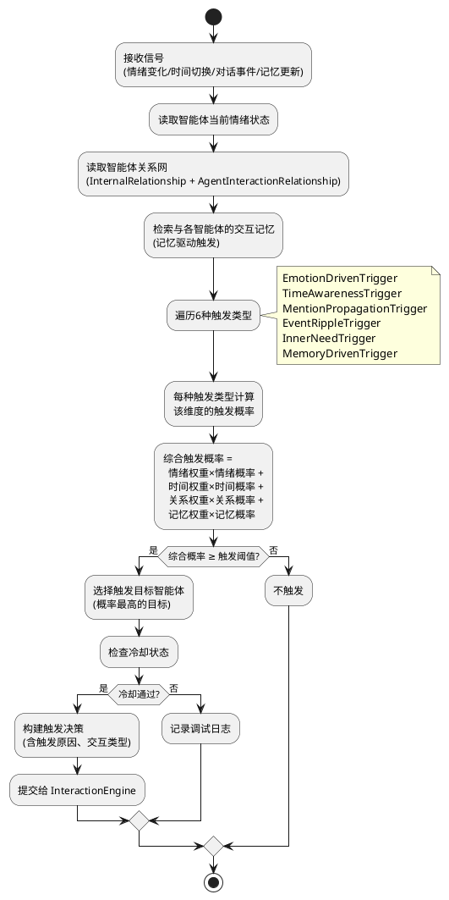
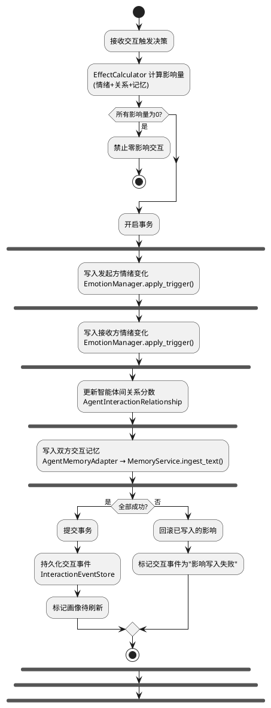
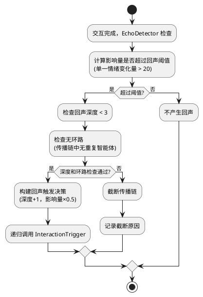
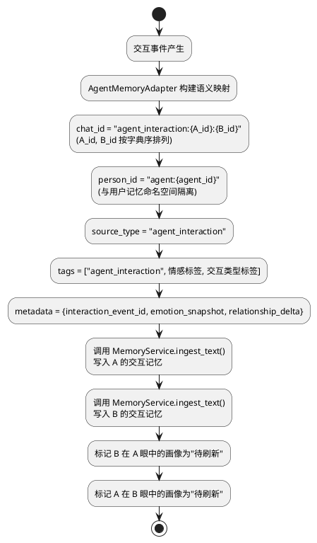
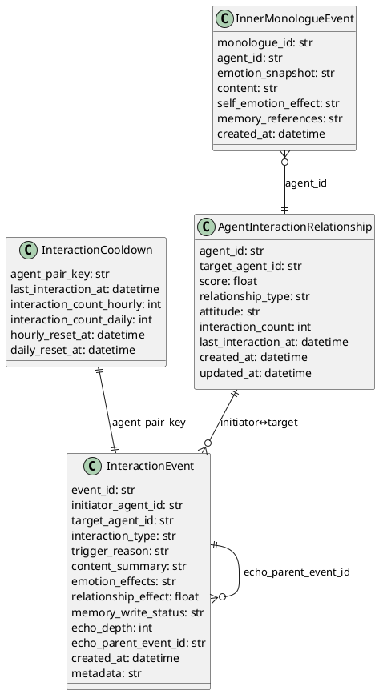

# 智能体交互活化 — 实现方案

> 让智能体从"等待用户触发的标本"变为"拥有记忆、因记忆而行动的持续互动生命体"。

# 一、需求与存量功能关系分析

## 1.1 需求功能与存量功能对比

### 1.1.1 已实现功能

| 需求功能 | 存量功能 | 代码位置 | 匹配度 |
|---------|---------|---------|--------|
| 情绪状态读取与写入 | `EmotionManager.apply_trigger()` / `EmotionManager.state` | `src/maisaka/agent/emotion.py:70-151` | 100% |
| 情绪衰减机制 | `EmotionManager._apply_decay()` 指数衰减趋向基线 | `src/maisaka/agent/emotion.py:132-151` | 100% |
| 情绪-行为映射 | `EmotionManager.get_behavior_tendency()` + `EmotionBehaviorRule` | `src/maisaka/agent/emotion.py:112-121` | 75% |
| 关系分数读写 | `RelationshipManager.update_interaction()` / `get_relationship()` | `src/maisaka/relationship/manager.py:38-102` | 75% |
| 关系等级与阈值 | `RelationshipLevel` 枚举 + `LEVEL_THRESHOLDS` | `src/maisaka/relationship/level.py:10-45` | 100% |
| 关系轨迹追踪 | `RelationshipTracker.record_level_change()` / `get_trajectory_text()` | `src/maisaka/relationship/tracker.py:42-127` | 75% |
| 主动对话决策 | `ProactiveDecisionMaker.evaluate()` 综合情绪+时间+关系评分 | `src/maisaka/proactive/decision.py:26-116` | 50% |
| 主动对话频率控制 | `ProactiveFrequencyController` 冷却+小时限制+窗口抑制 | `src/maisaka/proactive/frequency.py:25-101` | 75% |
| 主动对话内容生成 | `ProactiveContentGenerator.generate()` 基于情绪模板 | `src/maisaka/proactive/content.py:54-130` | 25% |
| 主动对话引擎整合 | `ProactiveEngine.evaluate()` + `build_proactive_intent()` | `src/maisaka/proactive/engine.py:37-175` | 50% |
| 智能体配置注册 | `AgentConfigRegistry` 加载/查询/重载 | `src/maisaka/agent/registry.py:12-92` | 100% |
| 智能体配置模型 | `AgentConfig` 含情绪基线、内部关系、时间画像等 | `src/maisaka/agent/config.py:110-300` | 75% |
| 内部关系定义 | `InternalRelationship` 含 target_agent_id / relationship_type / mention_tendency | `src/maisaka/agent/config.py:46-55` | 75% |
| 时间感知服务 | `TimeAwarenessService.get_time_context()` / `get_active_coefficient()` | `src/maisaka/time_awareness/service.py:21-81` | 75% |
| 记忆检索/写入 | `MemoryService.search()` / `ingest_text()` / `ingest_summary()` | `src/services/memory_service.py:92-342` | 100% |
| 人物画像检索 | `MemoryService.get_person_profile()` → `PersonProfileResult` | `src/services/memory_service.py:344-356` | 75% |
| 启发式记忆注入 | `HeuristicMemoryInjector.build_injection_message()` | `src/maisaka/memory/heuristic_injector.py:55-396` | 50% |
| 提示词注入框架 | `build_prompt_template_context()` 中 agent_internal_relationships / agent_emotion_state 等 slot | `src/maisaka/chat_loop_service.py:688-727` | 75% |
| 内部关系提示词 | `AgentConfig.internal_relationships_prompt` 静态构建 | `src/maisaka/agent/config.py:198-211` | 50% |
| 情绪状态提示词 | `EmotionState.to_prompt_text()` | `src/maisaka/agent/emotion.py:50-67` | 100% |
| WebUI 智能体 API | `/agent/list` / `/agent/{id}` / `/agent/emotion/{id}` / `/agent/relationship/{id}` | `src/webui/routers/agent.py:23-470` | 50% |
| 数据库持久化框架 | SQLModel + `get_db_session()` | `src/common/database/database_model.py` / `database.py` | 100% |
| 子智能体审计日志 | `SubAgentExecutionRecord` 数据模型 | `src/common/database/database_model.py:527-551` | 50% |
| 事件传感器 | `EventSensor` 群事件感知 | `src/maisaka/event_sensor/` | 25% |

### 1.1.2 需要扩展的功能

| 需求功能 | 存量功能 | 差异说明 | 扩展方向 |
|---------|---------|---------|---------|
| 智能体间交互触发 | `ProactiveEngine` 仅处理"智能体→用户"主动对话 | 缺少"智能体→智能体"交互维度；触发信号源不同（情绪/时间/记忆 vs 用户对话上下文）；触发目标不同（智能体 vs 用户会话） | 新建 `InteractionTrigger` 组件，复用 `ProactiveDecisionMaker` 的评分思路但扩展信号维度和目标选择逻辑，与 `ProactiveEngine` 协同而非替换 |
| 交互影响落实 | `EmotionManager.apply_trigger()` 和 `RelationshipManager.update_interaction()` 各自独立 | 缺少原子性保证——情绪+关系+记忆三者需全部成功或全部回滚；`RelationshipManager` 仅支持 agent↔user 关系，不支持 agent↔agent 关系 | 新建 `EffectCalculator` 组件，实现事务化的影响写入；扩展 `RelationshipManager` 或新建 `AgentRelationshipManager` 支持智能体间关系 |
| 交互事件持久化 | `SubAgentExecutionRecord` 仅记录子智能体执行 | 数据模型不匹配——交互事件需要 initiator/target/interaction_type/trigger_reason 等字段 | 新建 `InteractionEvent` 数据模型和 `InteractionEventStore` |
| 交互冷却控制 | `ProactiveFrequencyController` 按 agent_id 控制 | 冷却维度不同——交互冷却按智能体对 (agent_pair) 控制，而非单个智能体；需要小时/天级频率限制 | 新建 `InteractionCooldownManager`，参考 `ProactiveFrequencyController` 的设计模式但按 agent_pair_key 管理 |
| 智能体间关系管理 | `RelationshipManager` 仅管理 agent↔user 关系 | 完全缺失 agent↔agent 关系数据；现有 `InternalRelationship` 是静态配置，不随交互动态变化 | 新建 `AgentInteractionRelationship` 数据模型，初始化时从 `InternalRelationship` 导入基线，交互后动态更新 |
| 记忆语义映射 | `MemoryService` 的 chat_id/person_id 无智能体交互前缀 | 现有 chat_id 为会话 ID（如 `qq_group:123456`），person_id 为用户 ID（如 `qq:654321`）；智能体交互记忆需要独立命名空间 | 在 `AgentMemoryAdapter` 中构建 `agent_interaction:{A}:{B}` chat_id 和 `agent:{agent_id}` person_id 映射，通过 `MemoryService.ingest_text()` / `search()` 接口操作 |
| 智能体画像 | `PersonProfileResult` 仅面向用户画像 | 结构兼容但数据源不同——智能体画像由交互记忆聚合生成，而非用户对话记忆 | 新建 `AgentProfileService`，输出 `AgentProfileResult` 结构兼容 `PersonProfileResult`，增加 `observer_agent_id` / `refresh_status` 等扩展字段 |
| 提示词注入扩展 | `agent_internal_relationships` slot 仅注入静态配置 | 需要注入动态交互记忆（如"最近和布洛妮娅有过争执"）；需要区分静态关系描述和动态交互记忆 | 在 `build_prompt_template_context()` 中新增 `agent_interaction_memory` slot，由 `AgentMemoryAdapter` 提供动态内容，与静态 `internal_relationships_prompt` 合并注入 |
| WebUI 交互可见性 | `/agent/` 路由无交互事件 API | 缺少交互流查询、交互详情、交互历史等 API 端点 | 在 `src/webui/routers/agent.py` 中新增 `/agent/interactions/recent` / `/agent/interactions/{event_id}` 等端点 |
| 内心独白 | 无对应功能 | 完全新增——需要触发器、内容生成、自我情绪影响、持久化记录 | 新建 `MonologueTrigger` + `MonologueEngine`，复用 `EmotionManager.apply_trigger()` 写入自我情绪影响 |

### 1.1.3 需要新增的功能或接口

**核心引擎模块（`src/maisaka/agent_interaction/`）：**

1. **交互触发器（InteractionTrigger）**
   - 输入：智能体状态变化信号、时间感知信号、外部对话事件、交互记忆信号
   - 输出：触发决策（是否触发、目标智能体、触发原因、交互类型）
   - 核心逻辑：综合情绪+时间+关系+记忆计算触发概率，支持6种触发类型注册
   - 依赖：`EmotionManager`、`AgentConfigRegistry`、`MemoryService`、`TimeAwarenessService`

2. **交互引擎（InteractionEngine）**
   - 输入：触发决策
   - 输出：交互结果（交互内容、影响详情、事件记录）
   - 核心逻辑：生成交互内容、调用 EffectCalculator 落实影响、持久化事件
   - 依赖：`EffectCalculator`、`InteractionEventStore`、`AgentMemoryAdapter`

3. **影响计算器（EffectCalculator）**
   - 输入：交互类型、关系类型、双方情绪状态
   - 输出：情绪影响量、关系影响量、记忆内容
   - 核心逻辑：基于交互类型和关系类型的规则引擎，计算量化的情绪/关系/记忆影响
   - 依赖：`EmotionManager`、`RelationshipManager`（或 `AgentRelationshipManager`）

4. **交互冷却管理器（InteractionCooldownManager）**
   - 输入：智能体对标识
   - 输出：是否可触发、剩余冷却时间
   - 核心逻辑：按 agent_pair_key 管理冷却时间和频率限制
   - 依赖：数据库（`InteractionCooldown` 表）

5. **回声检测器（EchoDetector）**
   - 输入：交互结果
   - 输出：是否产生回声、回声目标、回声深度
   - 核心逻辑：检查影响量是否超过回声阈值、回声深度和环路检测
   - 依赖：`InteractionTrigger`（递归调用）

6. **内心独白触发器（MonologueTrigger）**
   - 输入：智能体空闲状态、情绪状态
   - 输出：是否触发内心独白
   - 核心逻辑：空闲时间+情绪强度+冷却期判断
   - 依赖：`EmotionManager`、`AgentConfigRegistry`

7. **内心独白引擎（MonologueEngine）**
   - 输入：智能体配置、情绪状态、最近记忆
   - 输出：内心独白内容、自我情绪影响
   - 核心逻辑：基于性格+情绪+记忆生成独白内容，写入微小情绪变化
   - 依赖：`EmotionManager`、`MemoryService`、`InteractionEventStore`

**记忆适配模块：**

8. **智能体记忆适配器（AgentMemoryAdapter）**
   - 输入：交互事件、智能体ID
   - 输出：MemoryService 兼容的写入/检索参数
   - 核心逻辑：构建 `agent_interaction:{A}:{B}` chat_id 和 `agent:{agent_id}` person_id 语义映射
   - 依赖：`MemoryService`

9. **智能体画像服务（AgentProfileService）**
   - 输入：观察方智能体ID、被画像智能体ID
   - 输出：`AgentProfileResult`（summary + traits + evidence + emotion_tendency）
   - 核心逻辑：从交互记忆聚合生成画像，支持"待刷新"标记
   - 依赖：`AgentMemoryAdapter`、`InteractionEventStore`

**数据模型：**

10. **InteractionEvent** — 交互事件持久化模型
11. **InteractionCooldown** — 交互冷却状态模型
12. **InnerMonologueEvent** — 内心独白事件模型
13. **AgentInteractionRelationship** — 智能体间关系模型

**WebUI API：**

14. **交互流 API** — `/agent/interactions/recent` / `/agent/interactions/{event_id}`
15. **内心世界面板 API** — `/agent/monologue/{agent_id}`

**提示词注入扩展：**

16. **交互记忆提示词注入** — 在 `build_prompt_template_context()` 中新增 `agent_interaction_memory` slot

## 1.2 存量功能详细分析

### 1.2.1 EmotionManager

- **接口契约**：`apply_trigger(emotion_type, delta)` 写入情绪变化；`state` 属性返回 `EmotionState`（自动衰减后）；`get_behavior_tendency()` 返回 `EmotionBehaviorRule` 或 None
- **业务规则**：7 种情绪类型（happy/sad/anxious/angry/calm/excited/lonely），强度 0-100，指数衰减趋向基线，每实例绑定一个 `AgentConfig`
- **扩展点**：`apply_trigger()` 是公开方法，可直接被外部调用写入情绪变化；`EmotionBehaviorRule` 支持情绪-行为映射但当前仅用于提示词注入
- **约束**：每个 `EmotionManager` 实例绑定一个 `AgentConfig`，非全局单例；当前由 `ChatLoopService` 按会话创建，智能体间交互需要独立的 `EmotionManager` 实例管理

### 1.2.2 RelationshipManager

- **接口契约**：`get_relationship(agent_id, user_id)` 返回 `RelationshipSnapshot`；`update_interaction(agent_id, user_id, ...)` 更新关系并返回新快照；`set_emotion_trigger_callback(callback)` 设置关系-情绪联动回调
- **业务规则**：关系分数 0-1000，4 级等级（陌生人/认识/熟悉/亲密），7/30/90 天自然衰减，按 agent_id + user_id 唯一
- **扩展点**：`update_interaction()` 的参数可自定义 frequency/depth/emotion/time 权重；`_on_relationship_upgrade()` 支持情绪联动回调
- **约束**：仅支持 agent↔user 关系，user_id 字段为字符串，数据库模型 `AgentRelationship` 的 user_id 列无外键约束，理论上可存储 agent_id 但语义不清晰

### 1.2.3 ProactiveEngine

- **接口契约**：`evaluate(agent_config, emotion_manager, ...)` 返回 `ProactiveResult`；`build_proactive_intent(result)` 转换为 `enqueue_proactive_task()` 兼容参数
- **业务规则**：决策延迟 <3s，综合情绪(0.4) + 时间(0.3) + 关系(0.3) 计算 proactive_score，阈值默认 0.5
- **扩展点**：`ProactiveDecisionMaker` 的权重可调整；`ProactiveContentGenerator` 支持自定义模板
- **约束**：仅面向"智能体→用户"主动对话，无"智能体→智能体"交互维度；`ProactiveFrequencyController` 按单 agent_id 管理，不支持 agent_pair 维度

### 1.2.4 MemoryService

- **接口契约**：`search(query, chat_id, person_id, ...)` 返回 `MemorySearchResult`；`ingest_text(external_id, source_type, text, chat_id, person_ids, tags, metadata, ...)` 返回 `MemoryWriteResult`；`get_person_profile(person_id, chat_id)` 返回 `PersonProfileResult`
- **业务规则**：所有操作通过 `AMemorixHostService.invoke()` 路由到 A_Memorix 核心层；chat_id 和 person_id 为字符串，无格式约束
- **扩展点**：`ingest_text()` 的 `source_type`、`tags`、`metadata` 参数可自由定义；`search()` 的 `chat_id` 和 `person_id` 可用于命名空间隔离
- **约束**：不可修改 A_Memorix 核心层（`src/A_memorix/core/`）；所有记忆操作必须通过 MemoryService 接口

### 1.2.5 HeuristicMemoryInjector

- **接口契约**：`build_injection_message(session_id)` 返回启发式记忆参考文本
- **业务规则**：基于聊天流印象自然拉起长期记忆，支持跨聊共享、频率控制、缓存
- **扩展点**：`_is_hit_allowed()` 可扩展过滤规则；`_rerank_by_agent_focus()` 支持按智能体焦点领域重排
- **约束**：当前仅消费用户记忆，不消费智能体交互记忆；`_is_hit_allowed()` 的 chat_id 过滤逻辑会拒绝 `agent_interaction:` 前缀的记忆（因为无法解析为真实聊天流）

### 1.2.6 AgentConfig / InternalRelationship

- **接口契约**：`AgentConfig.internal_relationships` 列表，每项含 `target_agent_id` / `relationship_type` / `attitude` / `interaction_style` / `mention_tendency` / `anti_mechanization`
- **业务规则**：静态配置，从 agents/*.md 文件加载，不随交互动态变化
- **扩展点**：`internal_relationships_prompt` 属性构建提示词文本，可被动态内容覆盖或合并
- **约束**：`mention_tendency` 是静态值（0-1），不反映交互历史；`relationship_type` 仅有5种枚举（family/romantic/rival/mentor/friend）

### 1.2.7 提示词注入框架

- **接口契约**：`build_prompt_template_context()` 返回字典，含 `agent_internal_relationships` / `agent_emotion_state` / `agent_favor_injection` / `agent_relationship` 等 slot
- **业务规则**：每个 slot 对应 prompt 模板中的一个占位符，渲染时注入
- **扩展点**：可新增 slot（如 `agent_interaction_memory`），在 prompt 模板中添加对应占位符
- **约束**：prompt 模板需三语同步（zh-CN/en-US/ja-JP）；注入优先级需遵循 DeepSeek 优化配置的 `injection_priority`

# 二、增量设计方案

## 2.1 实现模型

### 2.1.1 上下文视图

```plantuml
@startuml
!define NEW_MODULE color:#E3F2FD
!define EXISTING color:#FFF3E0

rectangle "智能体交互活化系统" as Core NEW_MODULE {
    rectangle "InteractionTrigger\n(交互触发器)" as Trigger
    rectangle "InteractionEngine\n(交互引擎)" as Engine
    rectangle "EffectCalculator\n(影响计算器)" as Calculator
    rectangle "EchoDetector\n(回声检测器)" as Echo
    rectangle "MonologueTrigger\n(内心独白触发器)" as MTrigger
    rectangle "MonologueEngine\n(内心独白引擎)" as MEngine
    rectangle "AgentMemoryAdapter\n(智能体记忆适配器)" as Adapter
    rectangle "AgentProfileService\n(智能体画像服务)" as Profile
    rectangle "InteractionCooldownManager\n(交互冷却管理器)" as Cooldown
    rectangle "InteractionEventStore\n(交互事件存储)" as Store
}

rectangle "现有系统" as Existing EXISTING {
    rectangle "EmotionManager" as Emotion
    rectangle "RelationshipManager" as RelMgr
    rectangle "ProactiveEngine" as Proactive
    rectangle "AgentConfigRegistry" as Config
    rectangle "TimeAwarenessService" as Time
    rectangle "MemoryService" as Memory
    rectangle "HeuristicMemoryInjector" as Heuristic
    rectangle "MaisakaChatLoopService" as Chat
    rectangle "WebUI Agent API" as WebUI
}

Trigger --> Emotion : 读取情绪状态
Trigger --> Config : 读取关系网和交互配置
Trigger --> Memory : 检索交互记忆\n(记忆驱动触发)
Trigger --> Time : 获取时间上下文
Trigger --> Cooldown : 检查冷却状态
Trigger --> Engine : 触发交互\n(含触发原因)

Engine --> Calculator : 计算交互影响
Engine --> Adapter : 写入交互记忆
Engine --> Store : 持久化交互事件
Engine --> Echo : 检查回声

Calculator --> Emotion : 写入情绪变化\n(原子操作)
Calculator --> RelMgr : 更新关系分数\n(原子操作)

Adapter --> Memory : ingest_text()/search()\n(通过MemoryService接口)
Adapter --> Profile : 标记画像待刷新

Profile --> Memory : search()\n检索交互记忆
Profile --> Heuristic : 提供智能体画像\n(供提示词注入)

Echo --> Trigger : 触发回声交互\n(深度+1，影响×0.5)

MTrigger --> Emotion : 读取情绪状态
MTrigger --> MEngine : 触发内心独白
MEngine --> Emotion : 写入微小情绪变化
MEngine --> Store : 记录独白事件

Chat --> Heuristic : 消费交互记忆\n(提示词注入)
WebUI --> Store : 查询交互流/交互历史

@enduml
```

### 2.1.2 服务/组件总体架构

```plantuml
@startuml
!define NEW_MODULE color:#E3F2FD

package "src/maisaka/agent_interaction/" as Pkg NEW_MODULE {
    component "InteractionTrigger" as Trigger {
        [EmotionDrivenTrigger]
        [TimeAwarenessTrigger]
        [MentionPropagationTrigger]
        [EventRippleTrigger]
        [InnerNeedTrigger]
        [MemoryDrivenTrigger]
    }
    component "InteractionEngine" as Engine
    component "EffectCalculator" as Calculator
    component "EchoDetector" as Echo
    component "MonologueTrigger" as MTrigger
    component "MonologueEngine" as MEngine
    component "InteractionCooldownManager" as Cooldown
    component "InteractionEventStore" as Store
}

package "src/maisaka/agent_interaction/memory/" as MemPkg NEW_MODULE {
    component "AgentMemoryAdapter" as Adapter
    component "AgentProfileService" as Profile
}

package "src/maisaka/agent_interaction/models/" as ModelPkg NEW_MODULE {
    component "InteractionEvent" as IE
    component "InteractionCooldown" as IC
    component "InnerMonologueEvent" as IM
    component "AgentInteractionRelationship" as AIR
}

package "src/maisaka/agent_interaction/config/" as CfgPkg NEW_MODULE {
    component "InteractionTriggerConfig" as ITC
    component "MemoryDrivenTriggerConfig" as MDTC
}

Trigger --> Engine : 触发决策
Engine --> Calculator : 计算影响
Engine --> Store : 持久化事件
Engine --> Echo : 回声检测
Engine --> Adapter : 记忆写入
Calculator --> Cooldown : 更新冷却
MTrigger --> MEngine : 触发独白
Adapter --> Profile : 画像刷新标记

@enduml
```

**模块划分与职责：**

| 模块 | 职责 | 关键依赖 |
|------|------|---------|
| `InteractionTrigger` | 综合多维度信号计算交互触发概率，支持6种触发类型注册 | EmotionManager, AgentConfigRegistry, MemoryService, TimeAwarenessService |
| `InteractionEngine` | 交互生命周期管理：内容生成→影响落实→事件持久化→回声检测 | EffectCalculator, InteractionEventStore, AgentMemoryAdapter, EchoDetector |
| `EffectCalculator` | 量化计算交互对双方的情绪/关系/记忆影响，保证原子性 | EmotionManager, RelationshipManager |
| `EchoDetector` | 检测交互回声（连锁反应），控制深度和衰减 | InteractionTrigger |
| `MonologueTrigger` | 判断智能体是否应产生内心独白 | EmotionManager |
| `MonologueEngine` | 生成内心独白内容，写入自我情绪影响 | EmotionManager, MemoryService, InteractionEventStore |
| `InteractionCooldownManager` | 按智能体对管理交互冷却和频率限制 | 数据库 |
| `InteractionEventStore` | 交互事件和内心独白事件的持久化与查询 | 数据库 |
| `AgentMemoryAdapter` | 构建智能体交互记忆的语义映射，通过 MemoryService 接口操作 | MemoryService |
| `AgentProfileService` | 从交互记忆聚合生成智能体画像 | AgentMemoryAdapter, InteractionEventStore |

### 2.1.3 实现设计文档

#### 2.1.3.1 交互触发决策流程



#### 2.1.3.2 交互影响原子写入流程



#### 2.1.3.3 交互回声传播流程



#### 2.1.3.4 智能体交互记忆语义映射



## 2.2 接口设计

### 2.2.1 总体设计

**接口分类：**

| 接口类别 | 接口数量 | 稳定性 | 说明 |
|---------|---------|--------|------|
| 触发器接口 | 6 | 实验 | 6种触发类型的统一接口，支持注册新类型 |
| 引擎接口 | 3 | 稳定 | InteractionEngine / MonologueEngine / EchoDetector |
| 存储接口 | 4 | 稳定 | InteractionEventStore 的 CRUD |
| 记忆适配接口 | 3 | 稳定 | AgentMemoryAdapter 的写入/检索/画像 |
| WebUI API | 5 | 稳定 | 交互流/交互详情/独白/画像/手动触发 |
| 配置接口 | 2 | 稳定 | InteractionTriggerConfig / MemoryDrivenTriggerConfig |

**接口变更策略：**

- 触发器接口采用注册机制，新增触发类型不修改核心逻辑
- 存储接口和记忆适配接口遵循现有 MemoryService 的设计模式
- WebUI API 遵循现有 `/agent/` 路由的 RESTful 风格

### 2.2.2 接口清单

#### 2.2.2.1 触发器接口

```python
class BaseTrigger(ABC):
    """交互触发器基类。"""

    @abstractmethod
    async def evaluate(
        self,
        agent_id: str,
        emotion_state: EmotionState,
        relationships: list[InternalRelationship],
        memory_context: MemorySearchResult | None,
        time_context: TimeContext | None,
    ) -> TriggerEvaluation:
        """评估是否应触发交互。

        Args:
            agent_id: 触发方智能体ID
            emotion_state: 当前情绪状态
            relationships: 关系网列表
            memory_context: 交互记忆上下文
            time_context: 时间感知上下文

        Returns:
            TriggerEvaluation: 触发评估结果
        """
        ...


@dataclass
class TriggerEvaluation:
    """触发评估结果。"""
    should_trigger: bool
    trigger_probability: float
    target_agent_id: str
    interaction_type: str  # emotion_driven / time_awareness / ...
    trigger_reason: str
    metadata: dict[str, Any]
```

**调用示例：**

```python
trigger = EmotionDrivenTrigger()
evaluation = await trigger.evaluate(
    agent_id="silver_wolf",
    emotion_state=emotion_manager.state,
    relationships=agent_config.internal_relationships,
    memory_context=None,
    time_context=None,
)
if evaluation.should_trigger:
    await interaction_engine.execute(evaluation)
```

#### 2.2.2.2 交互引擎接口

```python
class InteractionEngine:
    """智能体间交互引擎。"""

    async def execute(self, evaluation: TriggerEvaluation) -> InteractionResult:
        """执行一次交互。

        Args:
            evaluation: 触发评估结果

        Returns:
            InteractionResult: 交互执行结果

        Precondition: evaluation.should_trigger == True
        Postcondition: 交互事件已持久化，影响已落实
        """
        ...

    async def execute_manual(
        self,
        initiator_id: str,
        target_id: str,
        interaction_type: str,
        reason: str,
    ) -> InteractionResult:
        """管理员手动触发交互。

        Args:
            initiator_id: 发起方智能体ID
            target_id: 接收方智能体ID
            interaction_type: 交互类型
            reason: 触发原因

        Returns:
            InteractionResult: 交互执行结果

        Precondition: 两个智能体均已在 AgentConfigRegistry 中注册
        Postcondition: 交互事件已持久化，影响已落实，审计日志已记录
        """
        ...


@dataclass
class InteractionResult:
    """交互执行结果。"""
    success: bool
    event_id: str
    emotion_effects: dict[str, dict[str, float]]
    relationship_effect: float
    memory_write_status: str  # success / failed / policy_rejected / skipped
    echo_triggered: bool
    error: str
```

#### 2.2.2.3 影响计算器接口

```python
class EffectCalculator:
    """交互影响计算器。"""

    def calculate(
        self,
        interaction_type: str,
        relationship_type: str,
        initiator_emotion: EmotionState,
        target_emotion: EmotionState,
        echo_depth: int = 0,
    ) -> InteractionEffect:
        """计算交互影响。

        Args:
            interaction_type: 交互类型
            relationship_type: 关系类型
            initiator_emotion: 发起方情绪状态
            target_emotion: 接收方情绪状态
            echo_depth: 回声深度（0=原始交互）

        Returns:
            InteractionEffect: 量化的交互影响
        """
        ...


@dataclass
class InteractionEffect:
    """交互影响。"""
    initiator_emotion_deltas: dict[str, float]  # {"happy": +5, "lonely": -15}
    target_emotion_deltas: dict[str, float]
    relationship_delta: float  # +3.0
    memory_content: str  # 交互内容摘要
    emotion_tag: str  # positive / negative / neutral / mixed
```

#### 2.2.2.4 交互冷却管理器接口

```python
class InteractionCooldownManager:
    """交互冷却管理器。"""

    def can_trigger(self, agent_pair_key: str) -> bool:
        """检查智能体对是否可以触发交互。

        Args:
            agent_pair_key: 智能体对标识 "{smaller_id}:{larger_id}"

        Returns:
            是否可以触发
        """
        ...

    def record_interaction(self, agent_pair_key: str) -> None:
        """记录一次交互触发。"""
        ...

    def get_cooldown_remaining(self, agent_pair_key: str) -> float:
        """获取剩余冷却时间（秒）。"""
        ...
```

#### 2.2.2.5 交互事件存储接口

```python
class InteractionEventStore:
    """交互事件存储。"""

    async def save_event(self, event: InteractionEvent) -> str:
        """持久化交互事件，返回事件ID。"""
        ...

    async def get_event(self, event_id: str) -> InteractionEvent | None:
        """查询交互事件。"""
        ...

    async def query_events(
        self,
        *,
        agent_id: str = "",
        target_agent_id: str = "",
        interaction_type: str = "",
        time_start: float | None = None,
        time_end: float | None = None,
        limit: int = 50,
        offset: int = 0,
    ) -> list[InteractionEvent]:
        """按条件查询交互事件列表。"""
        ...

    async def get_recent_events(self, limit: int = 20) -> list[InteractionEvent]:
        """获取最近的交互事件。"""
        ...
```

#### 2.2.2.6 智能体记忆适配器接口

```python
class AgentMemoryAdapter:
    """智能体记忆适配器，构建语义映射并通过 MemoryService 操作。"""

    @staticmethod
    def build_chat_id(agent_a_id: str, agent_b_id: str) -> str:
        """构建智能体交互记忆的 chat_id。

        格式: agent_interaction:{smaller_id}:{larger_id}
        """
        ...

    @staticmethod
    def build_person_id(agent_id: str) -> str:
        """构建智能体交互记忆的 person_id。

        格式: agent:{agent_id}
        """
        ...

    async def write_interaction_memory(
        self,
        event: InteractionEvent,
        effect: InteractionEffect,
    ) -> MemoryWriteResult:
        """将交互事件写入双方的记忆。

        Args:
            event: 交互事件
            effect: 交互影响

        Returns:
            MemoryWriteResult: 写入结果
        """
        ...

    async def search_interaction_memory(
        self,
        agent_id: str,
        target_agent_id: str,
        query: str = "",
        limit: int = 5,
    ) -> MemorySearchResult:
        """检索智能体关于另一智能体的交互记忆。"""
        ...
```

#### 2.2.2.7 智能体画像服务接口

```python
class AgentProfileService:
    """智能体画像服务。"""

    async def get_profile(
        self,
        observer_agent_id: str,
        target_agent_id: str,
    ) -> AgentProfileResult:
        """获取智能体在其他智能体眼中的画像。

        Args:
            observer_agent_id: 观察方智能体ID
            target_agent_id: 被画像智能体ID

        Returns:
            AgentProfileResult: 智能体画像
        """
        ...

    async def refresh_profile(
        self,
        observer_agent_id: str,
        target_agent_id: str,
    ) -> AgentProfileResult:
        """强制刷新智能体画像（从交互记忆重新聚合）。"""
        ...

    async def mark_stale(
        self,
        observer_agent_id: str,
        target_agent_id: str,
    ) -> None:
        """标记画像为"待刷新"。"""
        ...


@dataclass
class AgentProfileResult:
    """智能体画像结果，结构兼容 PersonProfileResult。"""
    observer_agent_id: str
    target_agent_id: str
    summary: str
    traits: list[str]
    evidence: list[dict[str, Any]]
    interaction_count: int
    last_interaction_at: float
    emotion_tendency: str  # positive / negative / neutral / mixed
    refresh_status: str  # fresh / stale / pending
```

#### 2.2.2.8 WebUI API 接口

| 方法 | 路径 | 说明 | 稳定性 |
|------|------|------|--------|
| GET | `/agent/interactions/recent` | 获取最近交互事件列表 | 稳定 |
| GET | `/agent/interactions/{event_id}` | 获取交互事件详情 | 稳定 |
| GET | `/agent/interactions/history` | 按条件查询交互历史 | 稳定 |
| GET | `/agent/monologue/{agent_id}` | 获取智能体内心独白列表 | 稳定 |
| GET | `/agent/profile/{observer_id}/{target_id}` | 获取智能体画像 | 稳定 |
| POST | `/agent/interactions/trigger` | 管理员手动触发交互 | 稳定 |
| GET | `/agent/interactions/config` | 获取交互触发配置 | 稳定 |
| PUT | `/agent/interactions/config` | 更新交互触发配置 | 稳定 |

## 2.3 数据模型

### 2.3.1 设计目标

1. **支持智能体间交互的全生命周期**：从触发决策到影响落实到持久化记录，数据模型需覆盖交互事件、冷却状态、内心独白、智能体间关系
2. **与现有数据模型兼容**：`InteractionEvent` 需与 `SubAgentExecutionRecord` 格式兼容；`AgentProfileResult` 需与 `PersonProfileResult` 结构兼容
3. **记忆命名空间隔离**：智能体交互记忆通过 `agent_interaction:` 前缀的 chat_id 和 `agent:` 前缀的 person_id 与用户记忆隔离，不污染用户记忆数据
4. **性能目标**：交互事件持久化 < 200ms；交互记忆检索 < 300ms；画像聚合刷新 < 2s

### 2.3.2 模型实现



**核心数据模型说明：**

| 模型 | 表名 | 主键 | 唯一约束 | 索引 |
|------|------|------|---------|------|
| InteractionEvent | `agent_interaction_events` | `event_id` (String) | `event_id` | `(initiator_agent_id, created_at)`, `(target_agent_id, created_at)`, `(interaction_type)`, `(created_at)` |
| InteractionCooldown | `agent_interaction_cooldowns` | `agent_pair_key` (String) | `agent_pair_key` | `(agent_pair_key)` |
| InnerMonologueEvent | `agent_inner_monologue_events` | `monologue_id` (String) | `monologue_id` | `(agent_id, created_at)`, `(created_at)` |
| AgentInteractionRelationship | `agent_interaction_relationships` | 自增 `id` | `(agent_id, target_agent_id)` | `(agent_id)`, `(target_agent_id)` |

**智能体交互记忆语义映射（不新建表，复用 A_Memorix）：**

| 字段 | 格式 | 示例 |
|------|------|------|
| chat_id | `agent_interaction:{smaller_id}:{larger_id}` | `agent_interaction:bronya:silver_wolf` |
| person_id | `agent:{agent_id}` | `agent:silver_wolf` |
| source_type | `agent_interaction` | — |
| tags | `["agent_interaction", "positive", "emotion_driven"]` | — |
| metadata.interaction_event_id | `ie:silver_wolf:18a3f2:7b1c` | — |
| metadata.propagated_from | `agent:{source_agent_id}` | 仅间接记忆 |

**智能体画像（不新建表，由交互记忆实时聚合）：**

画像数据由 `AgentProfileService` 在检索时从 `InteractionEvent` + 交互记忆聚合生成，结果缓存在内存中（带 TTL），不单独持久化。理由：画像数据是派生数据，其源头（交互事件+交互记忆）已持久化，无需冗余存储。

## 2.4 与现有系统的集成方案

### 2.4.1 与 EmotionManager 的集成

**集成方式**：直接调用 `EmotionManager.apply_trigger()` 写入情绪变化

**关键决策**：智能体间交互需要独立的 `EmotionManager` 实例，而非复用会话中的实例

- **为什么**：当前 `EmotionManager` 由 `ChatLoopService` 按会话创建，生命周期与会话绑定。智能体间交互不发生在用户会话中，需要全局级别的情绪管理
- **替代方案**：复用会话中的 `EmotionManager` — 被否决，因为会话可能不存在或已销毁
- **实现**：新建 `AgentEmotionManagerRegistry`，为每个智能体维护一个全局 `EmotionManager` 实例，初始化时从 `AgentConfig.emotion_baseline` 构建

### 2.4.2 与 RelationshipManager 的集成

**集成方式**：新建 `AgentInteractionRelationship` 数据模型，与现有 `AgentRelationship` 并行

**关键决策**：不扩展现有 `AgentRelationship` 表，而是新建独立的智能体间关系表

- **为什么**：`AgentRelationship` 的 `user_id` 字段语义为用户ID，虽然技术上可存 agent_id，但会混淆查询逻辑和业务语义；智能体间关系的字段需求（relationship_type/attitude/interaction_style）与用户关系不同
- **替代方案**：在 `AgentRelationship` 中用 `agent:{agent_id}` 格式的 user_id 存储 — 被否决，因为会污染用户关系查询
- **实现**：`AgentInteractionRelationship` 初始化时从 `AgentConfig.internal_relationships` 导入基线数据，交互后动态更新

### 2.4.3 与 ProactiveEngine 的集成

**集成方式**：协同工作，不替换

**关键决策**：`InteractionTrigger` 复用 `ProactiveDecisionMaker` 的评分思路，但不共享实例

- **为什么**：两者的信号源和目标不同——ProactiveEngine 面向"智能体→用户"，InteractionTrigger 面向"智能体→智能体"；评分权重和阈值也不同
- **替代方案**：将交互触发逻辑合并到 ProactiveEngine 中 — 被否决，因为职责不同，合并会导致 ProactiveEngine 过于复杂
- **实现**：`InteractionTrigger` 的 `EmotionDrivenTrigger` 参考 `ProactiveDecisionMaker._compute_emotion_score()` 的权重设计，但增加关系亲密度和记忆维度

### 2.4.4 与 MemoryService / A_Memorix 的集成

**集成方式**：通过 `AgentMemoryAdapter` 构建语义映射，完全通过 `MemoryService` 接口操作

**关键决策**：不修改 A_Memorix 核心层，所有扩展在 MaiBot 接入层完成

- **为什么**：遵守 `MODIFICATION_POLICY`——核心层改动应先提交上游 `MaiBot_branch`；语义映射方案（chat_id 前缀 + person_id 前缀）无需核心层支持
- **替代方案**：在 A_Memorix 核心层新增 `agent_interaction` 记忆类型 — 被否决，违反 MODIFICATION_POLICY
- **实现**：`AgentMemoryAdapter.build_chat_id()` 返回 `agent_interaction:{A}:{B}` 格式；`AgentMemoryAdapter.build_person_id()` 返回 `agent:{agent_id}` 格式；通过 `MemoryService.ingest_text()` 写入，`MemoryService.search()` 检索

**HeuristicMemoryInjector 扩展**：

- **问题**：当前 `_is_hit_allowed()` 会拒绝 `agent_interaction:` 前缀的记忆，因为无法解析为真实聊天流
- **方案**：在 `_is_hit_allowed()` 中增加对 `agent_interaction:` 前缀 chat_id 的识别逻辑——如果当前智能体是交互记忆的参与方，则允许该命中
- **优先级**：交互记忆提示词注入的优先级低于身份提示词和反机械化规则，高于一般启发式记忆

### 2.4.5 与提示词注入框架的集成

**集成方式**：在 `build_prompt_template_context()` 中新增 `agent_interaction_memory` slot

**关键决策**：动态交互记忆与静态内部关系描述合并注入，而非替换

- **为什么**：静态 `internal_relationships_prompt` 提供基础关系框架，动态交互记忆提供实时状态变化，两者互补
- **替代方案**：用动态交互记忆完全替换静态内部关系 — 被否决，因为交互记忆可能为空（新部署时），静态描述是兜底
- **实现**：新增 `agent_interaction_memory` slot，由 `AgentMemoryAdapter` + `AgentProfileService` 提供内容；在 prompt 模板中，该 slot 位于 `agent_internal_relationships` 之后，格式为"最近的交互动态"段落

### 2.4.6 与 WebUI 的集成

**集成方式**：在 `src/webui/routers/agent.py` 中新增交互相关 API 端点

**关键决策**：交互可见性数据通过标准 API 暴露，WebUI 通过 API 消费

- **为什么**：遵循现有架构——WebUI 不直接读取数据库，通过 FastAPI 路由层访问
- **实现**：新增 `/agent/interactions/` 系列端点；WebUI 前端在指挥中心新增"交互流"面板和"内心世界"面板

### 2.4.7 与 TimeAwarenessService 的集成

**集成方式**：直接调用 `TimeAwarenessService.get_time_context()` 和 `get_active_coefficient()`

**关键决策**：复用现有的时间感知服务，不新建时间相关组件

- **为什么**：`TimeAwarenessService` 已支持智能体差异化时间行为（通过 `AgentConfig.time_behavior_profile`）
- **实现**：`TimeAwarenessTrigger` 调用 `TimeAwarenessService.get_time_context(agent_config)` 获取时间上下文，结合 `night_active_coefficient` 等参数判断是否触发

## 2.5 分阶段实现路径

### Phase 1：基础设施（交互事件+冷却+数据模型）

**目标**：建立交互活化的数据基础，实现交互事件的持久化和冷却控制

**交付物**：
1. `InteractionEvent` / `InteractionCooldown` / `InnerMonologueEvent` / `AgentInteractionRelationship` 数据模型
2. `InteractionEventStore` 持久化与查询
3. `InteractionCooldownManager` 冷却控制
4. 数据库迁移脚本
5. WebUI 交互事件 API（`/agent/interactions/recent` 等）

**验收标准**：
- 交互事件可持久化到数据库，系统重启后可查询
- 冷却控制按 agent_pair_key 正确限制交互频率
- WebUI 可查看交互事件列表

### Phase 2：交互触发+影响落实

**目标**：实现6种触发类型和交互影响的原子写入

**交付物**：
1. `BaseTrigger` 基类和6种触发器实现
2. `InteractionTrigger` 触发器调度器
3. `EffectCalculator` 影响计算器
4. `InteractionEngine` 交互引擎
5. `AgentEmotionManagerRegistry` 全局情绪管理
6. `AgentInteractionRelationship` 初始化（从 `InternalRelationship` 导入）

**验收标准**：
- 情绪驱动触发：智能体 lonely 强度 ≥ 60 且 mention_tendency ≥ 0.3 时触发交互
- 交互影响原子写入：情绪+关系+记忆三者全部成功或全部回滚
- 冷却控制：同一对智能体 30 分钟内不重复触发

### Phase 3：记忆深度配合

**目标**：实现智能体交互记忆的语义映射、画像生成和提示词注入

**交付物**：
1. `AgentMemoryAdapter` 记忆语义映射
2. `AgentProfileService` 画像聚合
3. `HeuristicMemoryInjector` 扩展（识别 `agent_interaction:` 前缀）
4. `build_prompt_template_context()` 新增 `agent_interaction_memory` slot
5. prompt 模板三语同步更新

**验收标准**：
- 交互记忆通过 `agent_interaction:{A}:{B}` chat_id 写入，不污染用户记忆
- 智能体画像由交互记忆聚合生成，结构兼容 `PersonProfileResult`
- 交互记忆可注入到提示词中，影响回复风格

### Phase 4：内心独白+交互回声

**目标**：实现内心独白和交互回声传播

**交付物**：
1. `MonologueTrigger` + `MonologueEngine`
2. `EchoDetector` 回声检测器
3. 记忆驱动触发（`MemoryDrivenTrigger`）
4. 记忆传播机制
5. WebUI 内心世界面板 API

**验收标准**：
- 智能体空闲 30 分钟且情绪强度 > 40 时产生内心独白
- 交互回声链最大深度 3 层，每层影响量衰减 50%
- 记忆驱动触发：正面交互记忆 +20% 触发概率，负面 -30%
- 记忆传播：间接记忆权重为直接记忆的 50%

### Phase 5：WebUI 可视化+配置化

**目标**：完善 WebUI 交互可见性和配置管理

**交付物**：
1. WebUI 交互流面板组件
2. WebUI 内心世界面板组件
3. 交互触发配置管理 API 和 UI
4. 管理员手动触发交互 API
5. 交互热点和关系网络动态展示

**验收标准**：
- WebUI 可查看智能体间交互流和交互详情
- 交互触发参数可通过 WebUI 调整
- 管理员可手动触发交互
- 交互热点对在星图中高亮显示

## 2.6 风险与缓解措施

| 风险 | 影响 | 概率 | 缓解措施 |
|------|------|------|---------|
| 交互回声链导致无限循环 | 系统资源耗尽 | 低 | 最大深度 3 层硬限制 + 环路检测 + 30 秒超时强制截断 |
| 交互频率过高导致 LLM 调用成本飙升 | 成本超预期 | 中 | 交互内容生成优先使用模板，LLM 调用降级为可选；冷却时间和频率限制可配置 |
| 智能体交互记忆污染用户记忆 | 数据完整性 | 低 | `agent_interaction:` chat_id 前缀 + `agent:` person_id 前缀严格隔离；写入前校验前缀格式 |
| A_Memorix 不可用时交互记忆丢失 | 功能降级 | 中 | 交互影响（情绪+关系）优先保证生效，记忆写入降级为本地日志；标记"记忆写入降级" |
| EmotionManager 全局实例与 会话实例状态不一致 | 情绪状态不准确 | 中 | 全局实例定期同步到会话实例；会话创建时从全局实例读取基线 |
| 交互内容模板化导致"标本感"增强 | 用户体验 | 中 | Phase 2 先用模板，Phase 3 引入 LLM 生成；模板内容需体现智能体性格特征 |
| HeuristicMemoryInjector 扩展引入安全风险 | 记忆泄露 | 低 | `_is_hit_allowed()` 扩展时严格校验当前智能体是交互记忆的参与方；遵守 CrossChatContextService 共享规则 |
| 数据库迁移与现有表冲突 | 部署失败 | 低 | 新表独立命名空间（`agent_interaction_*`），不修改现有表结构；迁移脚本幂等 |
