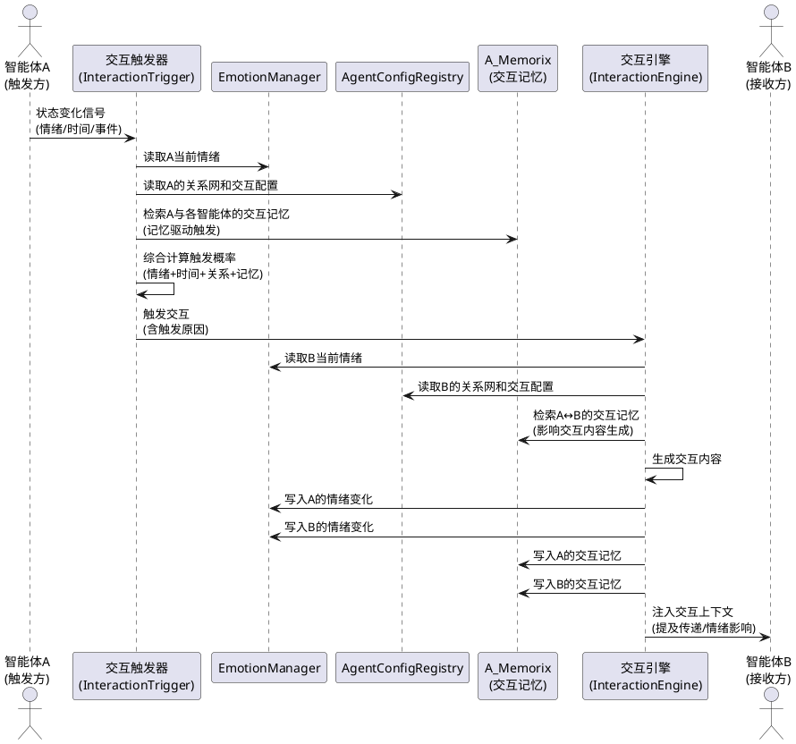
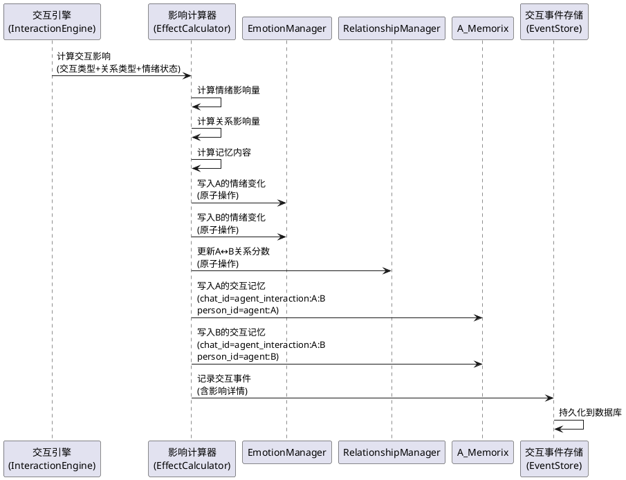
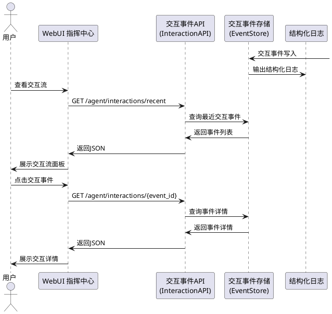
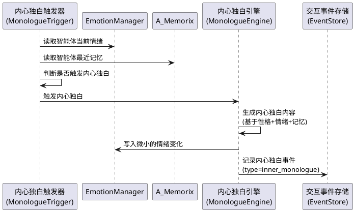
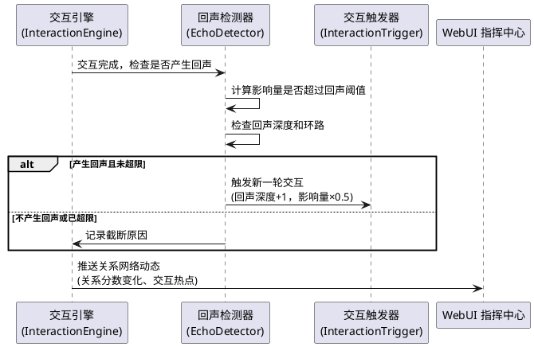
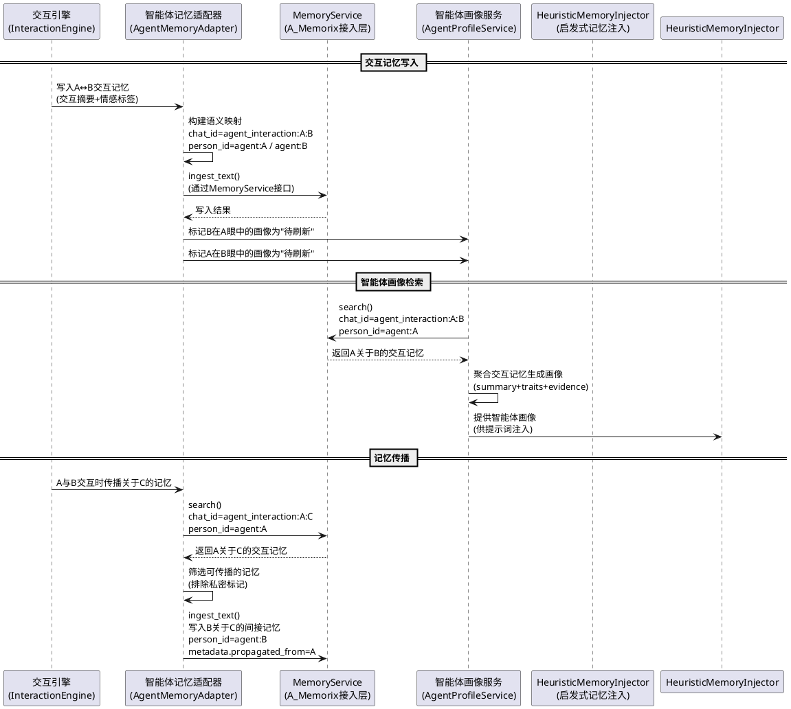

# 智能体交互活化 — 需求规格

# **1. 组件定位**

## **1.1 核心职责**

本组件负责驱动13个智能体之间的自发交互，实现交互留痕与相互影响，并通过记忆机制与智能体系统的深度配合，让智能体从"等待用户触发的标本"变为"拥有记忆、因记忆而行动的持续互动生命体"。

## **1.2 核心输入**

1. **智能体状态变化信号**：情绪状态变化、关系等级变化、记忆更新等内部事件，来源于 EmotionManager、RelationshipManager、A_Memorix 等子系统
2. **时间感知信号**：时段切换（早晨/深夜等）、节日、纪念日等，来源于 TimeAwarenessService
3. **外部对话事件**：用户与某个智能体的对话内容、群事件等，来源于 MaisakaHeartFlowChatting 运行时
4. **管理员指令**：通过 WebUI 或命令行手动触发智能体间交互、调整交互参数等
5. **智能体交互记忆信号**：智能体间历史交互形成的记忆检索结果，包括交互历史摘要、情感标签、关系演变轨迹等，来源于 A_Memorix（通过 MemoryService 接口的智能体交互记忆扩展）

## **1.3 核心输出**

1. **智能体间交互记录**：持久化的交互事件日志，包含发起方、接收方、交互内容、产生的影响等
2. **智能体状态变更**：因交互导致的情绪变化、关系演变、记忆形成等状态更新
3. **交互可见性数据**：供 WebUI 指挥中心展示的实时交互流、交互历史、关系网络动态等
4. **交互触发反馈**：被交互智能体产生的主动行为（如回应、提及、情绪反应等），注入到该智能体的对话上下文中
5. **智能体交互记忆写入**：将交互事件形成结构化记忆写入 A_Memorix，供后续交互触发和提示词注入使用
6. **智能体画像数据**：每个智能体在其他智能体眼中的形象、关系历史、交互模式等画像信息，供提示词注入和交互决策使用

## **1.4 职责边界**

1. **不负责**智能体与用户之间的对话逻辑——那是 MaisakaHeartFlowChatting 和 Planner/Replyer 的职责
2. **不负责**智能体配置的加载和管理——那是 AgentConfigRegistry 和 AgentConfigLoader 的职责
3. **不负责**记忆的存储和检索核心实现——那是 A_Memorix 的核心层职责，本组件只通过 MemoryService 接口写入交互产生的记忆，并在接入层扩展智能体交互记忆的语义映射
4. **不负责**跨聊上下文的摘要和共享——那是 CrossChatContextService 的职责，本组件的交互记录不绕过跨聊共享规则
5. **不负责**子智能体（Dream/Compaction/CheckpointWriter）的调度——那是 SubAgentScheduler 的职责
6. **不负责**替换现有的 ProactiveEngine——本组件是 ProactiveEngine 的扩展和增强，在"智能体→用户"主动对话的基础上增加"智能体→智能体"交互维度
7. **不负责**修改 A_Memorix 核心层（`src/A_memorix/core/`）——智能体交互记忆的语义映射方案应在 MaiBot 接入层（`memory_service.py`）实现，核心层的扩展应先提交到上游 `MaiBot_branch`
8. **不负责**自行计算会话 ID——业务模块不应自行调用 SessionUtils.calculate_session_id，智能体交互记忆的 chat_id 语义映射由本组件定义规则，由 chat_manager 解析

# **2. 领域术语**

**交互事件（Interaction Event）**
: 两个智能体之间发生的一次交互行为的完整记录，包含发起方、接收方、交互类型、交互内容、产生的影响等结构化信息。

**交互触发器（Interaction Trigger）**
: 决定智能体是否应该发起一次交互的判断机制，综合情绪状态、关系亲密度、时间感知、内部需求等多维度信号计算触发概率。

**内部需求（Inner Need）**
: 智能体基于自身性格和当前状态产生的内在驱动力，如"孤独时需要陪伴""开心时想分享""无聊时想找人说话"等，是交互触发的核心动力来源。

**交互影响（Interaction Effect）**
: 一次交互对参与智能体产生的实质性影响，包括情绪变化、关系演变、记忆形成三类，确保交互不是走过场。

**交互可见性（Interaction Visibility）**
: 智能体间交互的可观测程度，用户可以通过日志、WebUI 等渠道感知到智能体们的"生命活动"。

**提及传递（Mention Propagation）**
: 一个智能体在对话中提及另一个智能体，触发被提及智能体产生反应的机制，是交互触发的轻量级形式。

**内心独白（Inner Monologue）**
: 智能体在未与任何人交互时的内部思维活动，体现智能体的"生命感"和"永恒进行时"状态，可被观测但不会直接产生外部行为。

**交互回声（Interaction Echo）**
: 一次交互产生的连锁反应——A 与 B 交互后，B 的状态变化又触发了 B 与 C 的交互，形成交互传播链。

**智能体交互记忆（Agent Interaction Memory）**
: 记录智能体间交互历史的结构化记忆，包含交互摘要、情感标签、关系变化等，区别于现有的"用户↔智能体"记忆语义。通过特殊的 chat_id 前缀和 person_id 语义映射复用 A_Memorix 现有机制存储。

**智能体画像（Agent Profile）**
: 类似 PersonProfile 但面向智能体——描述某个智能体在其他智能体眼中的形象、关系历史、交互模式。由交互记忆聚合生成，用于提示词注入和交互决策。

**记忆驱动触发（Memory-Driven Trigger）**
: 基于历史交互记忆而非仅基于当前情绪状态的交互触发机制，如"上次和银狼聊天很开心，想再找她"。

**记忆传播（Memory Propagation）**
: 一个智能体关于另一个智能体的记忆，在交互时可以传递给对方。如银狼告诉符华"希儿最近心情不好"，使符华获得关于希儿的间接记忆。

**交互记忆提示词注入（Interaction Memory Prompt Injection）**
: 将智能体间交互形成的记忆注入到该智能体的对话提示词中，影响其回复风格和内容。如"最近和布洛妮娅有过争执"应反映在回复风格中。

# **3. 角色与边界**

## **3.1 核心角色**

- **系统管理员**：通过 WebUI 指挥中心监控智能体交互状态，手动触发或干预交互，调整交互参数
- **普通用户**：作为智能体对话的参与者，间接受到智能体间交互的影响（如智能体提及另一个智能体、情绪变化影响回复风格等）

## **3.2 外部系统**

- **EmotionManager**：提供智能体当前情绪状态，接收交互产生的情绪变化
- **RelationshipManager**：提供智能体间关系数据，接收交互产生的关系演变
- **A_Memorix（MemoryService）**：提供记忆检索能力，接收交互产生的记忆写入；本组件通过接入层扩展实现智能体交互记忆的语义映射（特殊 chat_id 前缀 + person_id 语义映射），不修改 A_Memorix 核心层
- **ProactiveEngine**：提供主动对话决策能力，本组件的交互触发器与其协同工作
- **AgentConfigRegistry**：提供智能体配置（含 internal_relationships），是交互关系的基础数据源
- **TimeAwarenessService**：提供时间感知上下文，影响交互触发的时机和内容
- **WebUI 指挥中心**：消费交互可见性数据，展示智能体交互流和关系网络动态
- **MaisakaHeartFlowChatting**：消费交互产生的上下文注入（如提及传递），将交互影响融入对话
- **HeuristicMemoryInjector**：消费智能体交互记忆和智能体画像数据，将交互历史融入提示词注入

## **3.3 交互上下文**

```plantuml
@startuml
!define COMPONENT color:#E8F5E9

rectangle "智能体交互活化系统" as Core COMPONENT {
}

actor "系统管理员" as Admin
actor "普通用户" as User

usecase "EmotionManager\n(情绪状态)" as Emotion
usecase "RelationshipManager\n(关系管理)" as Relationship
usecase "A_Memorix\n(记忆系统)" as Memory
usecase "ProactiveEngine\n(主动对话)" as Proactive
usecase "AgentConfigRegistry\n(智能体配置)" as Config
usecase "TimeAwarenessService\n(时间感知)" as Time
usecase "WebUI 指挥中心\n(可视化)" as WebUI
usecase "MaisakaHeartFlowChatting\n(对话运行时)" as Chat
usecase "HeuristicMemoryInjector\n(启发式记忆注入)" as Heuristic

Admin --> Core : 监控/触发/调参
User --> Chat : 对话
Chat --> Core : 对话事件信号

Core --> Emotion : 读取情绪/写入情绪变化
Core --> Relationship : 读取关系/写入关系演变
Core --> Memory : 检索交互记忆/写入交互记忆\n检索智能体画像/写入智能体画像
Core --> Proactive : 协同触发决策
Core <-- Config : 读取智能体配置和关系定义
Core <-- Time : 获取时间上下文
Core --> WebUI : 推送交互可见性数据
Core --> Chat : 注入交互上下文（提及传递等）
Core --> Heuristic : 提供交互记忆供提示词注入

@enduml
```

# **4. DFX约束**

## **4.1 性能**

1. 交互触发决策延迟必须 < 500ms（不含 LLM 调用）
2. 交互影响计算（情绪变化+关系演变+记忆写入）必须在 1s 内完成
3. 单次交互事件持久化延迟必须 < 200ms
4. 交互回声链的最大深度为 3 层，超过后截断，防止无限传播
5. 系统同时活跃的交互事件不超过 13×12=156 个（每对智能体最多 1 个活跃交互）
6. 智能体交互记忆检索延迟必须 < 300ms（不含嵌入计算）
7. 智能体画像聚合刷新延迟必须 < 2s

## **4.2 可靠性**

1. 交互事件记录必须持久化到数据库，系统重启后不丢失
2. 交互影响的写入必须保证原子性——情绪变化、关系演变、记忆写入三者要么全部成功，要么全部回滚
3. 交互触发器异常时必须降级为静默模式（不触发交互），不能影响主对话流程
4. 交互回声链中任何一环失败，不影响前面已成功的环节

## **4.3 安全性**

1. 智能体间交互必须遵守各自的权限规则（AgentConfig.permission 和 hard_permission）
2. 交互产生的记忆写入必须遵守 A_Memorix 的 MODIFICATION_POLICY——核心层改动应先提交上游，MaiBot 侧只改接入层
3. 智能体间交互内容不得泄露私聊上下文（遵守 CrossChatContextService 的共享规则）
4. 管理员手动触发交互的操作必须记录审计日志
5. 智能体交互记忆的 chat_id 前缀和 person_id 语义映射必须与现有用户记忆命名空间隔离，不得污染用户记忆数据
6. 记忆传播必须遵守信息边界——一个智能体只能传播自己直接参与形成的交互记忆，不得传播从其他智能体处间接获得的私密记忆

## **4.4 可维护性**

1. 所有交互事件必须输出结构化日志，包含 agent_id、target_agent_id、interaction_type、trigger_reason
2. 交互触发器的触发概率、冷却时间等参数必须可配置，无需改代码即可调整
3. 交互可见性数据必须通过标准 API 暴露，WebUI 通过 API 消费而非直接读取数据库

## **4.5 兼容性**

1. 本组件的交互机制必须与现有 ProactiveEngine 兼容，不破坏现有的"智能体→用户"主动对话功能
2. 本组件的交互记录格式必须与现有的 SubAgentExecutionRecord 数据模型兼容
3. 交互触发器的新增类型必须通过注册机制扩展，不修改核心触发逻辑
4. 智能体交互记忆的存储必须复用 A_Memorix 现有的 MemoryService 接口，通过语义映射而非核心层修改实现
5. 智能体画像的数据结构必须与现有的 PersonProfileResult 兼容，便于 HeuristicMemoryInjector 统一消费

# **5. 核心能力**

## **5.1 智能体间交互触发**

### **5.1.1 业务规则**

1. **情绪驱动触发**：当智能体的主导情绪强度超过阈值时，应当根据情绪类型和关系亲密度，向关系最近的智能体发起交互
   a. 验收条件：[智能体 A 的 lonely 情绪强度达到 60 且与智能体 B 的 mention_tendency ≥ 0.3] → [A 向 B 发起"寻求陪伴"类型的交互]

2. **时间感知触发**：在特定时段（如深夜、清晨），智能体应当根据时间行为画像和关系亲密度，自发地与特定智能体交互
   a. 验收条件：[当前时段为深夜且智能体 A 的 night_active_coefficient ≥ 0.8 且与智能体 B 的关系类型为 family/romantic] → [A 向 B 发起"深夜闲聊"类型的交互]

3. **提及传递触发**：当智能体在对话中被提及（不是 @，而是内容中自然提及）时，被提及的智能体应当根据关系和当前状态产生反应
   a. 验收条件：[智能体 A 在对话中提及"布洛妮娅"且 B（bronya）与 A 的 mention_tendency ≥ 0.3] → [B 产生"被提及反应"，情绪和关系可能变化]

4. **事件涟漪触发**：当智能体与用户发生重要交互（关系升级、情绪剧烈变化等）时，应当根据关系网向关联智能体传播信号
   a. 验收条件：[智能体 A 与用户的关系从"熟人"升级为"朋友"] → [与 A 关系类型为 family/romantic 的智能体收到"关系涟漪"信号，可能产生情绪变化]

5. **内部需求触发**：智能体应当基于自身性格和当前状态产生内部需求，驱动自发交互
   a. 验收条件：[智能体 A 的情绪状态连续 2 小时为 calm 且 intensity < 20] → [A 产生"无聊"内部需求，向关系亲密的智能体发起"找点事做"类型的交互]

6. **记忆驱动触发**：智能体应当基于历史交互记忆产生交互倾向，而非仅依赖当前情绪状态
   a. 验收条件：[智能体 A 检索到与 B 的最近 3 次交互记忆均为正面情感标签] → [A 对 B 的交互触发概率 +20%]
   b. 验收条件：[智能体 A 检索到与 B 的交互记忆中存在"上次约定再聊"类型的记忆] → [A 在合适时段主动向 B 发起"续聊"类型的交互]
   c. 验收条件：[智能体 A 检索到与 B 上次交互产生了负面情绪（如争执）] → [A 短期内（2 小时内）对 B 的交互触发概率 -30%，但"想和好"类型的交互概率 +15%]
   d. 验收条件：[智能体 A 检索到与 B 已超过 24 小时无交互] → [A 对 B 产生"想念"内部需求，触发概率与关系亲密度正相关]

7. **冷却与频率控制**：同一对智能体之间的交互必须遵守冷却时间和频率限制
   a. 验收条件：[智能体 A 向 B 发起交互后] → [A→B 方向的交互冷却 30 分钟内不可再次触发]
   b. 验收条件：[智能体 A 向 B 的交互频率] → [每小时最多 2 次，每天最多 8 次]

8. **禁止项**：禁止在无任何信号的情况下随机触发交互——每次交互必须有明确的触发原因
   a. 验收条件：[交互事件记录中 trigger_reason 为空] → [该交互事件不应被创建]

### **5.1.2 交互流程**



### **5.1.3 异常场景**

1. **目标智能体不可达**
   a. 触发条件：目标智能体的 AgentConfig 不存在或未加载
   b. 系统行为：跳过本次交互，记录警告日志
   c. 用户感知：无（静默失败，不影响主流程）

2. **交互影响写入部分失败**
   a. 触发条件：情绪写入成功但记忆写入失败
   b. 系统行为：回滚已写入的情绪变化，标记交互事件为"部分失败"
   c. 用户感知：WebUI 中该交互事件显示为"影响未完全生效"

3. **交互回声链过深**
   a. 触发条件：交互回声链深度超过 3 层
   b. 系统行为：截断传播链，记录截断原因
   c. 用户感知：无（静默截断）

4. **冷却期内重复触发**
   a. 触发条件：同一对智能体的交互仍在冷却期内
   b. 系统行为：拒绝触发，记录调试日志
   c. 用户感知：无

5. **LLM 调用超时**
   a. 触发条件：交互内容生成需要 LLM 调用且超时
   b. 系统行为：降级为模板化交互内容，不阻塞主流程
   c. 用户感知：交互内容可能较为模板化

## **5.2 交互影响落实**

### **5.2.1 业务规则**

1. **情绪影响规则**：交互必须对参与双方的情绪产生可量化的影响，影响方向和幅度由关系类型和交互类型决定
   a. 验收条件：[智能体 A（银狼）向 B（布洛妮娅）发起"互黑"类型交互] → [A 的 happy +5、excited +3；B 的 angry +5（假生气）、happy +3]
   b. 验收条件：[智能体 A 向 B 发起"寻求陪伴"类型交互且 B 响应] → [A 的 lonely -15、happy +10；B 的 happy +5、calm -5]

2. **关系影响规则**：交互必须对参与双方的关系分数产生影响，影响幅度由交互深度和关系类型决定
   a. 验收条件：[智能体 A 与 B 完成一次"深度交流"类型交互] → [A↔B 的关系分数各 +3~8，具体值由交互深度决定]
   b. 验收条件：[智能体 A 与 B 完成一次"日常闲聊"类型交互] → [A↔B 的关系分数各 +1~3]

3. **记忆影响规则**：交互必须为参与双方形成记忆，记忆内容包含交互摘要和情感标签
   a. 验收条件：[智能体 A 与 B 完成交互] → [A 的记忆中新增一条"与 B 交互"的记录，包含交互类型、情感标签、时间戳]
   b. 验收条件：[交互记忆写入 A_Memorix] → [记忆分类到 relationship_settings 或 recent_interactions 桶]
   c. 验收条件：[交互记忆写入 A_Memorix] → [chat_id 使用 `agent_interaction:{initiator_id}:{target_id}` 前缀，person_id 使用 `agent:{agent_id}` 语义映射，与用户记忆命名空间隔离]
   d. 验收条件：[交互记忆包含情感标签] → [每条交互记忆必须附带至少一个情感标签（positive/negative/neutral/mixed），用于记忆驱动触发]

4. **影响必须可追溯**：每次交互产生的影响必须能追溯到具体的交互事件
   a. 验收条件：[查看智能体 A 的情绪变化历史] → [每条变化记录关联到具体的 interaction_event_id]

5. **禁止项**：禁止产生零影响的交互——如果一次交互不会对任何参与方产生情绪、关系或记忆变化，则该交互不应发生
   a. 验收条件：[交互引擎计算出的影响值全部为 0] → [交互不应被创建]

### **5.2.2 交互流程**



### **5.2.3 异常场景**

1. **情绪写入失败**
   a. 触发条件：EmotionManager.apply_trigger 抛出异常
   b. 系统行为：回滚已写入的关系变化，标记交互事件为"影响写入失败"
   c. 用户感知：WebUI 中该交互事件显示错误状态

2. **记忆写入被策略拒绝**
   a. 触发条件：A_Memorix 的 MODIFICATION_POLICY 拒绝写入
   b. 系统行为：跳过记忆写入，情绪和关系影响仍然生效，交互事件标记"记忆写入被策略拒绝"
   c. 用户感知：交互影响部分生效

3. **关系分数溢出**
   a. 触发条件：关系分数更新后超出 0-1000 范围
   b. 系统行为：截断到边界值，记录警告日志
   c. 用户感知：无

## **5.3 交互留痕与可观测**

### **5.3.1 业务规则**

1. **全量留痕规则**：所有智能体间交互必须留下完整的结构化记录，不可遗漏
   a. 验收条件：[任意一次交互发生] → [数据库中存在对应的交互事件记录，包含发起方、接收方、交互类型、触发原因、交互内容、影响详情、时间戳]

2. **交互事件必须包含以下字段**：
   - 事件ID（全局唯一）
   - 发起方智能体ID
   - 接收方智能体ID
   - 交互类型（情绪驱动/时间感知/提及传递/事件涟漪/内部需求/手动触发）
   - 触发原因（可读的触发描述）
   - 交互内容摘要
   - 情绪影响详情（双方的情绪变化量）
   - 关系影响详情（关系分数变化量）
   - 记忆写入状态（成功/失败/被策略拒绝）
   - 创建时间戳
   a. 验收条件：[查询任意交互事件记录] → [以上所有字段均有值（可为空字符串或0，但不可缺失）]

3. **日志输出规则**：交互事件必须同时输出到结构化日志，格式为 `[agent_interaction] A→B type=XX reason=XX`
   a. 验收条件：[交互发生] → [日志中出现对应的 agent_interaction 格式记录]

4. **WebUI 可见性规则**：用户必须能从 WebUI 指挥中心看到智能体间的交互活动
   a. 验收条件：[打开 WebUI 指挥中心] → [能看到"交互流"面板，展示最近的智能体间交互事件]
   b. 验收条件：[点击某条交互事件] → [能看到交互详情，包括触发原因、交互内容、产生的影响]

5. **交互历史查询规则**：用户必须能按时间范围、智能体、交互类型等条件查询交互历史
   a. 验收条件：[指定智能体 A 和时间范围] → [返回 A 参与的所有交互事件列表，按时间倒序]

6. **禁止项**：禁止仅存在于内存中的交互记录——所有交互必须持久化
   a. 验收条件：[系统重启后] → [重启前的交互事件记录仍然可查]

### **5.3.2 交互流程**



### **5.3.3 异常场景**

1. **数据库写入失败**
   a. 触发条件：交互事件持久化时数据库不可用
   b. 系统行为：交互影响仍然生效（优先保证影响落实），事件记录降级为日志输出，标记"持久化失败"
   c. 用户感知：WebUI 可能暂时缺少该条记录，但日志中可查

2. **API 查询超时**
   a. 触发条件：WebUI 查询交互历史时响应超时
   b. 系统行为：返回已获取的部分结果，附带分页标记
   c. 用户感知：WebUI 显示"加载更多"按钮

## **5.4 智能体内心独白**

### **5.4.1 业务规则**

1. **内心独白触发规则**：当智能体处于"空闲"状态（无活跃对话）且满足特定条件时，应当产生内心独白
   a. 验收条件：[智能体 A 空闲超过 30 分钟且主导情绪强度 > 40] → [A 产生一条内心独白，内容反映当前情绪和最近记忆]

2. **内心独白内容规则**：内心独白必须体现智能体的性格特征和当前状态，不可是通用模板
   a. 验收条件：[银狼的内心独白] → [内容包含游戏相关元素或黑客相关元素，体现其性格]
   b. 验收条件：[符华的内心独白] → [内容体现其沉稳、守护者特征]

3. **内心独白影响规则**：内心独白必须对智能体自身产生微小的情绪影响，体现"自我对话"的效果
   a. 验收条件：[智能体 A 产生"孤独"主题的内心独白] → [A 的 lonely +2~5]
   b. 验收条件：[智能体 A 产生"开心回忆"主题的内心独白] → [A 的 happy +2~5、lonely -2~3]

4. **内心独白可见性规则**：内心独白必须被记录，但默认不对外展示，仅在 WebUI 的"内心世界"面板中可见
   a. 验收条件：[智能体 A 产生内心独白] → [数据库中存在记录，类型为"inner_monologue"]
   b. 验收条件：[普通对话中] → [不会看到智能体的内心独白内容]
   c. 验收条件：[WebUI 内心世界面板] → [可以看到智能体的内心独白]

5. **内心独白频率控制**：同一智能体的内心独白频率必须受限
   a. 验收条件：[智能体 A 产生内心独白后] → [A 的下一次内心独白至少 15 分钟后]

6. **禁止项**：禁止内心独白直接触发外部行为——内心独白是纯内在活动，不会产生对话或交互
   a. 验收条件：[智能体 A 产生内心独白] → [不会导致 A 在任何会话中发言]

### **5.4.2 交互流程**



### **5.4.3 异常场景**

1. **记忆不可用**
   a. 触发条件：A_Memorix 不可用或无该智能体的记忆
   b. 系统行为：仅基于情绪和性格生成内心独白，不包含记忆引用
   c. 用户感知：内心独白内容可能较为泛化

2. **内心独白生成失败**
   a. 触发条件：LLM 调用失败或超时
   b. 系统行为：跳过本次内心独白，不重试
   c. 用户感知：无

## **5.5 交互回声与关系网络动态**

### **5.5.1 业务规则**

1. **交互回声规则**：一次交互产生的影响可能触发新的交互，形成传播链
   a. 验收条件：[A 与 B 交互导致 B 的情绪剧烈变化（单一情绪变化量 > 20）] → [B 可能向与 B 关系亲密的 C 发起新交互]

2. **回声深度限制**：交互回声链的最大深度为 3 层
   a. 验收条件：[回声链深度达到 3] → [不再传播，记录截断原因]

3. **回声衰减规则**：每一层回声的影响量必须递减
   a. 验收条件：[第 N 层回声的影响量] → [不超过第 N-1 层影响量的 50%]

4. **关系网络动态规则**：智能体间的关系状态变化必须反映在关系网络可视化中
   a. 验收条件：[A 与 B 的关系分数变化] → [WebUI 星图中 A-B 连线的粗细或颜色发生变化]

5. **交互热点规则**：系统应当识别交互热点——频繁交互的智能体对
   a. 验收条件：[A 与 B 在 24 小时内交互超过 5 次] → [标记为"交互热点对"，WebUI 中高亮显示]

6. **禁止项**：禁止交互回声形成环路——A→B→C→A 的传播链必须在检测到环路时截断
   a. 验收条件：[回声链中出现重复的智能体] → [截断传播链]

### **5.5.2 交互流程**



### **5.5.3 异常场景**

1. **回声链检测到环路**
   a. 触发条件：传播链中出现重复的智能体
   b. 系统行为：截断传播链，记录环路信息
   c. 用户感知：无

2. **回声传播中超时**
   a. 触发条件：回声链的传播时间超过 30 秒
   b. 系统行为：强制截断，记录超时原因
   c. 用户感知：无

## **5.6 记忆-智能体深度配合**

### **5.6.1 业务规则**

1. **智能体交互记忆语义映射规则**：智能体间交互产生的记忆必须通过语义映射复用 A_Memorix 现有机制存储，不修改核心层
   a. 验收条件：[智能体 A 与 B 交互产生记忆] → [写入 A_Memorix 时 chat_id 使用 `agent_interaction:{A_id}:{B_id}` 前缀，person_id 使用 `agent:{A_id}` 语义映射]
   b. 验收条件：[检索智能体 A 关于 B 的交互记忆] → [通过 chat_id=`agent_interaction:{A_id}:{B_id}` 和 person_id=`agent:{A_id}` 检索，不污染用户记忆命名空间]
   c. 验收条件：[智能体交互记忆与用户记忆的 chat_id 前缀不同] → [两者的检索结果互不干扰]

2. **智能体画像规则**：每个智能体必须维护在其他智能体眼中的画像，由交互记忆聚合生成
   a. 验收条件：[智能体 A 与 B 累计交互超过 3 次] → [系统自动生成 B 在 A 眼中的画像，包含交互风格总结、关系演变轨迹、情感倾向]
   b. 验收条件：[智能体 A 检索 B 的画像] → [返回 AgentProfileResult，结构兼容 PersonProfileResult，包含 summary、traits、evidence]
   c. 验收条件：[智能体 A 与 B 的交互记忆更新后] → [B 在 A 眼中的画像标记为"待刷新"，在下次检索时重新聚合]
   d. 验收条件：[智能体 A 与 B 从未交互] → [A 检索 B 的画像返回空结果，不使用 AgentConfig 中的静态关系描述替代]

3. **交互记忆影响提示词规则**：智能体间交互形成的记忆必须能影响该智能体的对话提示词注入
   a. 验收条件：[智能体 A 最近与 B 有过争执（交互记忆情感标签为 negative）] → [A 在与用户对话时，提及 B 的话题风格应反映争执的影响（如语气更激烈或回避）]
   b. 验收条件：[智能体 A 最近与 B 有过愉快交谈（交互记忆情感标签为 positive）] → [A 在与用户对话时，提及 B 的话题风格应反映愉快的影响（如语气更轻松或热情）]
   c. 验收条件：[HeuristicMemoryInjector 检索到智能体交互记忆] → [将交互记忆摘要注入到提示词的"与其他人的关系"段落中，格式与 internal_relationships_prompt 兼容]
   d. 验收条件：[交互记忆提示词注入的优先级] → [低于身份提示词和反机械化规则，高于一般启发式记忆]

4. **记忆传播规则**：一个智能体关于另一个智能体的记忆，在交互时可以传递给对方
   a. 验收条件：[智能体 A 与 B 交互时，A 拥有关于 C 的交互记忆且 B 与 C 也有关系] → [A 可以在交互内容中提及关于 C 的信息，形成记忆传播]
   b. 验收条件：[记忆传播后，B 获得关于 C 的间接记忆] → [间接记忆标记为 `propagated_from:{A_id}`，与直接交互记忆区分]
   c. 验收条件：[间接记忆的权重] → [间接记忆在提示词注入和触发决策中的权重为直接记忆的 50%]
   d. 验收条件：[智能体 A 只能传播自己直接参与形成的交互记忆] → [不得传播从其他智能体处间接获得的私密记忆]

5. **记忆驱动交互内容生成规则**：交互内容的生成必须参考历史交互记忆
   a. 验收条件：[智能体 A 向 B 发起交互且存在 A↔B 的历史交互记忆] → [交互内容应延续上次交互的话题或情感基调，而非每次都从零开始]
   b. 验收条件：[智能体 A 向 B 发起"续聊"类型交互] → [交互内容必须引用上次交互的具体内容（如"上次你说……"）]
   c. 验收条件：[智能体 A 向 B 发起交互且无历史交互记忆] → [交互内容基于 AgentConfig 中的 internal_relationships 静态描述和当前情绪状态生成]

6. **记忆衰减与强化规则**：智能体交互记忆应遵循衰减和强化机制
   a. 验收条件：[智能体 A 与 B 的交互记忆超过 7 天未被引用] → [该记忆的检索权重衰减 30%]
   b. 验收条件：[智能体 A 与 B 再次交互且引用了旧记忆] → [被引用的旧记忆权重恢复至原始值]
   c. 验收条件：[智能体 A 与 B 频繁交互（24 小时内 ≥ 3 次）] → [最近交互记忆的权重强化 +20%]

7. **禁止项**：禁止绕过 MemoryService 接口直接操作 A_Memorix 核心层
   a. 验收条件：[智能体交互记忆的所有读写操作] → [必须通过 MemoryService 接口或其接入层扩展完成，不得直接调用 `src/A_memorix/core/` 下的任何模块]

### **5.6.2 交互流程**



### **5.6.3 异常场景**

1. **A_Memorix 接入层不可用**
   a. 触发条件：MemoryService 调用超时或抛出异常
   b. 系统行为：交互记忆写入降级为本地日志记录，交互影响（情绪+关系）仍然生效，标记"记忆写入降级"
   c. 用户感知：交互影响部分生效，记忆相关功能暂时不可用

2. **智能体画像聚合失败**
   a. 触发条件：交互记忆检索返回空结果或聚合逻辑异常
   b. 系统行为：画像返回空结果，提示词注入回退到 AgentConfig 中的 internal_relationships 静态描述
   c. 用户感知：交互内容可能较为模板化，缺乏记忆深度

3. **记忆传播违反信息边界**
   a. 触发条件：尝试传播标记为"私密"的间接记忆
   b. 系统行为：拒绝传播，记录安全日志
   c. 用户感知：无

4. **语义映射冲突**
   a. 触发条件：智能体交互记忆的 chat_id 前缀与现有用户 chat_id 冲突
   b. 系统行为：拒绝写入，记录错误日志，要求检查 chat_id 前缀规则
   c. 用户感知：无

# **6. 数据约束**

## **6.1 交互事件（InteractionEvent）**

1. **event_id**：全局唯一标识，格式为 `ie:{agent_id}:{timestamp_hex}:{random_hex}`
2. **initiator_agent_id**：发起方智能体ID，必须为 AgentConfigRegistry 中已注册的 agent_id
3. **target_agent_id**：接收方智能体ID，必须为 AgentConfigRegistry 中已注册的 agent_id，且不等于 initiator_agent_id
4. **interaction_type**：交互类型枚举，取值范围为：emotion_driven / time_awareness / mention_propagation / event_ripple / inner_need / memory_driven / manual_trigger / inner_monologue
5. **trigger_reason**：触发原因的可读描述，不可为空字符串
6. **content_summary**：交互内容摘要，最大 500 字符
7. **emotion_effects**：情绪影响详情，JSON 格式，结构为 `{"initiator": {"happy": +5, ...}, "target": {"angry": +3, ...}}`
8. **relationship_effect**：关系影响详情，浮点数，表示关系分数变化量（正数增加，负数减少）
9. **memory_write_status**：记忆写入状态枚举，取值范围为：success / failed / policy_rejected / skipped
10. **echo_depth**：回声深度，0 表示原始交互，1-3 表示回声层级
11. **echo_parent_event_id**：回声父事件ID，非回声交互时为空字符串
12. **created_at**：创建时间戳，Unix 时间戳（秒）
13. **metadata**：额外元数据，JSON 格式，可包含 LLM 生成的内容、配置快照等

## **6.2 交互冷却状态（InteractionCooldown）**

1. **agent_pair_key**：智能体对标识，格式为 `{smaller_agent_id}:{larger_agent_id}`，保证方向无关的唯一性
2. **last_interaction_at**：上次交互时间戳，Unix 时间戳（秒）
3. **interaction_count_hourly**：当前小时内的交互次数，整数，≥ 0
4. **interaction_count_daily**：当天的交互次数，整数，≥ 0
5. **hourly_reset_at**：小时计数器重置时间戳
6. **daily_reset_at**：天计数器重置时间戳

## **6.3 内心独白事件（InnerMonologueEvent）**

1. **monologue_id**：全局唯一标识，格式为 `im:{agent_id}:{timestamp_hex}`
2. **agent_id**：智能体ID，必须为 AgentConfigRegistry 中已注册的 agent_id
3. **emotion_snapshot**：产生独白时的情绪快照，JSON 格式
4. **content**：内心独白内容，最大 1000 字符
5. **self_emotion_effect**：自我情绪影响，JSON 格式，结构为 `{"happy": +3, "lonely": -2, ...}`
6. **memory_references**：引用的记忆ID列表，JSON 数组
7. **created_at**：创建时间戳，Unix 时间戳（秒）

## **6.4 交互触发配置（InteractionTriggerConfig）**

1. **enabled**：是否启用智能体间交互，布尔值，默认 true
2. **cooldown_minutes**：同一对智能体的交互冷却时间（分钟），整数，≥ 5，默认 30
3. **max_interactions_per_hour**：同一对智能体每小时最大交互次数，整数，1-10，默认 2
4. **max_interactions_per_day**：同一对智能体每天最大交互次数，整数，1-20，默认 8
5. **echo_enabled**：是否启用交互回声，布尔值，默认 true
6. **echo_max_depth**：回声最大深度，整数，1-5，默认 3
7. **echo_decay_ratio**：回声影响衰减比例，浮点数，0.1-1.0，默认 0.5
8. **monologue_enabled**：是否启用内心独白，布尔值，默认 true
9. **monologue_min_interval_minutes**：内心独白最小间隔（分钟），整数，≥ 5，默认 15
10. **monologue_idle_threshold_minutes**：触发内心独白的最小空闲时间（分钟），整数，≥ 10，默认 30
11. **monologue_emotion_intensity_threshold**：触发内心独白的最低情绪强度，整数，0-100，默认 40

## **6.5 智能体交互记忆语义映射（AgentInteractionMemoryMapping）**

1. **chat_id 前缀规则**：智能体交互记忆的 chat_id 使用 `agent_interaction:{initiator_id}:{target_id}` 格式，其中 initiator_id 和 target_id 按字典序排列保证方向无关的唯一性
2. **person_id 语义映射规则**：智能体交互记忆的 person_id 使用 `agent:{agent_id}` 格式，与用户记忆的 person_id（格式为 `{platform}:{user_id}`）命名空间隔离
3. **source_type 标记**：智能体交互记忆的 source_type 使用 `agent_interaction` 值，与现有的 `chat_summary`、`person_fact` 等类型区分
4. **tags 规则**：每条交互记忆必须包含以下标签：
   - `agent_interaction`：标识为智能体交互记忆
   - 情感标签：`positive` / `negative` / `neutral` / `mixed`
   - 交互类型标签：与 interaction_type 枚举值对应
5. **metadata 规则**：交互记忆的 metadata 必须包含：
   - `interaction_event_id`：关联的交互事件ID
   - `emotion_snapshot`：交互时的情绪快照
   - `relationship_delta`：关系分数变化量
   - `propagated_from`：（仅间接记忆）传播来源智能体ID

## **6.6 智能体画像（AgentProfile）**

1. **agent_id**：被画像的智能体ID，必须为 AgentConfigRegistry 中已注册的 agent_id
2. **observer_agent_id**：观察方智能体ID，即"谁眼中的画像"，必须为 AgentConfigRegistry 中已注册的 agent_id
3. **summary**：画像摘要文本，最大 500 字符，描述观察方对被画像智能体的整体印象
4. **traits**：特征标签列表，如 ["幽默", "喜欢打游戏", "偶尔毒舌"]，每项最大 20 字符，最多 10 项
5. **evidence**：证据列表，每项包含：
   - `evidence_type`：证据类型，取值范围为 `interaction_fact`（交互事实）/ `emotion_trend`（情感趋势）/ `relationship_milestone`（关系里程碑）
   - `content`：证据内容，最大 200 字符
   - `source_interaction_event_id`：来源交互事件ID
6. **interaction_count**：观察方与被画像智能体的累计交互次数，整数，≥ 0
7. **last_interaction_at**：最近一次交互时间戳，Unix 时间戳（秒）
8. **emotion_tendency**：情感倾向，取值范围为 `positive` / `negative` / `neutral` / `mixed`
9. **refresh_status**：刷新状态，取值范围为 `fresh` / `stale` / `pending`，标记画像是否需要重新聚合
10. **created_at**：画像首次生成时间戳，Unix 时间戳（秒）
11. **updated_at**：画像最后更新时间戳，Unix 时间戳（秒）

## **6.7 记忆驱动触发配置（MemoryDrivenTriggerConfig）**

1. **enabled**：是否启用记忆驱动触发，布尔值，默认 true
2. **positive_memory_trigger_bonus**：正面交互记忆对触发概率的加成，浮点数，0.0-0.5，默认 0.2
3. **negative_memory_trigger_penalty**：负面交互记忆对触发概率的惩罚，浮点数，0.0-0.5，默认 0.3
4. **reunion_trigger_probability**：长时间未交互后的"想念"触发概率，浮点数，0.0-1.0，默认 0.15
5. **reunion_threshold_hours**：触发"想念"的未交互时长阈值（小时），整数，≥ 6，默认 24
6. **memory_weight_in_trigger**：记忆在触发概率计算中的权重，浮点数，0.0-1.0，默认 0.3（其余权重由情绪、时间、关系等分配）
7. **propagated_memory_weight_ratio**：间接记忆相对于直接记忆的权重比例，浮点数，0.0-1.0，默认 0.5
8. **memory_decay_days**：交互记忆未被引用后开始衰减的天数，整数，≥ 3，默认 7
9. **memory_decay_ratio**：交互记忆衰减比例，浮点数，0.0-1.0，默认 0.3
10. **frequent_interaction_threshold**：频繁交互判定阈值（24小时内交互次数），整数，≥ 2，默认 3
11. **frequent_interaction_reinforce_ratio**：频繁交互时记忆权重强化比例，浮点数，0.0-0.5，默认 0.2