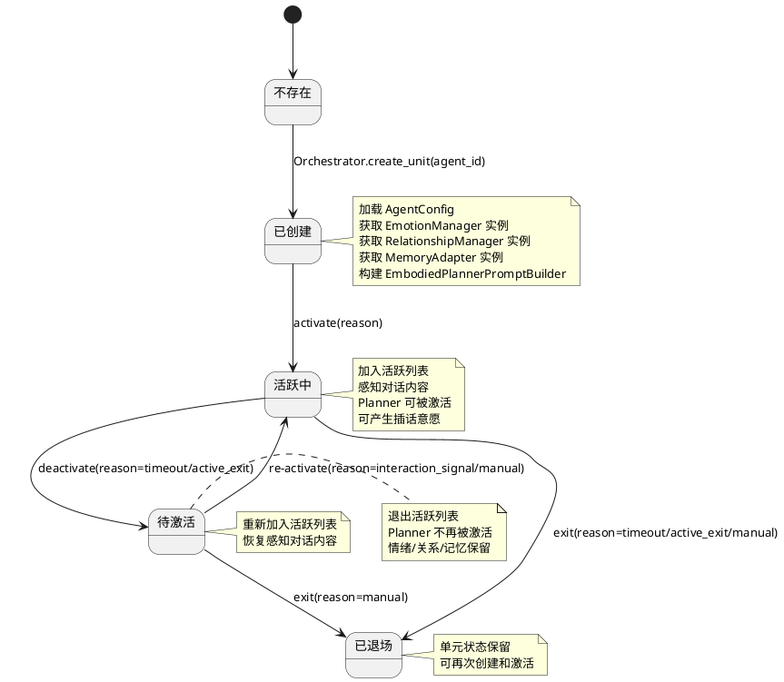
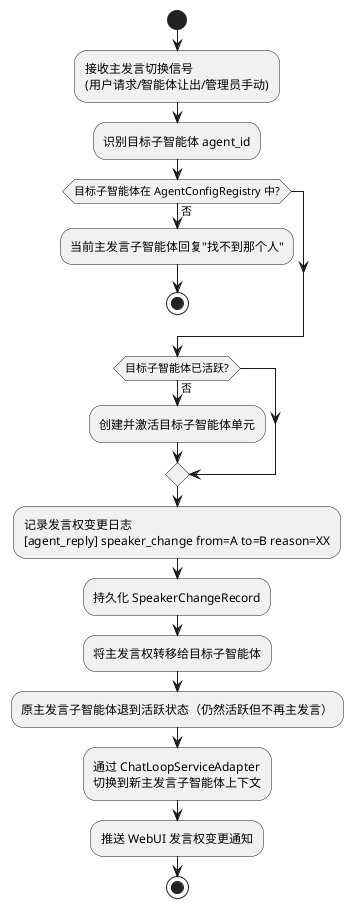
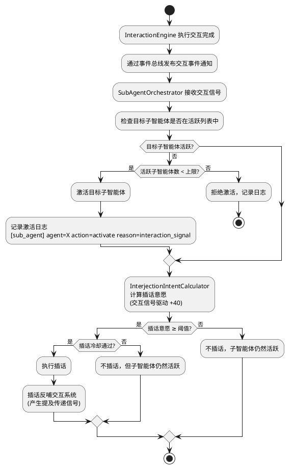
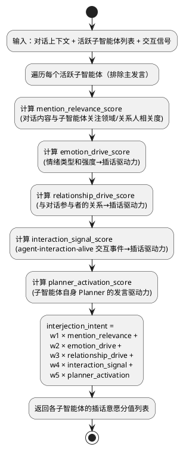
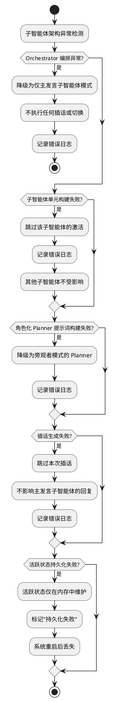
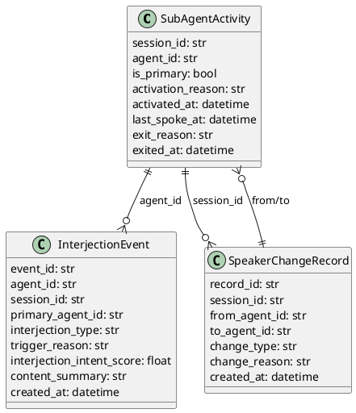

# 智能体回复机制变革 — 实现方案

> 让角色从"等待结局的标本"变为"永恒进行时的生命体"——每个角色拥有独立的思维、表达、情绪、记忆和关系。

# 一、需求与存量功能关系分析

## 1.1 需求功能与存量功能对比

### 1.1.1 已实现功能

| 需求功能 | 存量功能 | 代码位置 | 匹配度 |
|---------|---------|---------|--------|
| 智能体配置注册与查询 | `AgentConfigRegistry` 加载/查询/重载智能体配置 | `src/maisaka/agent/registry.py:12-92` | 100% |
| 智能体配置模型 | `AgentConfig` 含人设、情绪基线、内部关系、时间画像等 | `src/maisaka/agent/config.py:110-300` | 75% |
| 智能体路由 | `AgentRouter` 会话绑定→群绑定→默认智能体 | `src/maisaka/agent/router.py:12-86` | 75% |
| 人格提示词构建 | `_build_personality_prompt()` 从 agent_id 读取人设 | `src/maisaka/chat_loop_service.py:625-656` | 50% |
| 提示词模板渲染 | `build_prompt_template_context()` 构造 identity/emotion/relationship/memory 等 slot | `src/maisaka/chat_loop_service.py:688-733` | 50% |
| 情绪状态管理 | `EmotionManager` 7种情绪类型、强度0-100、指数衰减 | `src/maisaka/agent/emotion.py:70-151` | 100% |
| 情绪提示词注入 | `EmotionState.to_prompt_text()` 生成情绪状态描述 | `src/maisaka/agent/emotion.py:50-67` | 100% |
| 关系管理 | `RelationshipManager` agent↔user 关系分数/等级/衰减 | `src/maisaka/relationship/manager.py:38-102` | 50% |
| 全局情绪管理注册 | `AgentEmotionManagerRegistry` 为每个智能体维护全局 EmotionManager | `src/maisaka/agent_interaction/emotion_registry.py:6-23` | 100% |
| 智能体间关系管理 | `AgentRelationshipManager` 动态管理 agent↔agent 关系 | `src/maisaka/agent_interaction/relationship_manager.py:27-98` | 100% |
| 智能体记忆适配 | `AgentMemoryAdapter` 交互记忆语义映射 | `src/maisaka/agent_interaction/memory/adapter.py:21-287` | 100% |
| 智能体画像服务 | `AgentProfileService` 从交互记忆聚合画像 | `src/maisaka/agent_interaction/memory/profile.py` | 100% |
| 交互事件持久化 | `InteractionEvent` 数据模型 + `InteractionEventStore` | `src/common/database/database_model.py:554-578` / `src/maisaka/agent_interaction/event_store.py` | 100% |
| 交互调度器 | `InteractionScheduler` 定时遍历智能体评估交互触发 | `src/maisaka/agent_interaction/scheduler.py:20-85` | 75% |
| 内心独白引擎 | `MonologueEngine` 生成内心独白、写入自我情绪影响 | `src/maisaka/agent_interaction/monologue_engine.py:67-177` | 75% |
| 对话运行时 | `MaisakaHeartFlowChatting` 会话级运行时、消息接收、Planner 循环 | `src/maisaka/runtime.py:133-529` | 50% |
| 对话循环服务 | `MaisakaChatLoopService` Planner/Replyer 请求、提示词构建 | `src/maisaka/chat_loop_service.py:490-789` | 50% |
| 推理引擎 | `MaisakaReasoningEngine` 消息消费→Planner请求→工具调用→循环 | `src/maisaka/reasoning_engine.py:1-100` | 50% |
| reply 工具 | `handle_tool()` 被 Planner 调用触发 Replyer 生成回复 | `src/maisaka/builtin_tool/reply.py:131-388` | 50% |
| 子代理执行 | `run_sub_agent()` 复制上下文的临时子代理 | `src/maisaka/runtime.py:1433-1475` | 25% |
| 提示词模板 | `maisaka_chat.prompt` 当前旁观者模式 Planner 提示词 | `prompts/zh-CN/maisaka_chat.prompt:1-34` | 25% |
| WebUI 智能体 API | `/agent/list` / `/agent/{id}` / `/agent/emotion/{id}` 等 | `src/webui/routers/agent.py:23-1160` | 25% |

### 1.1.2 需要扩展的功能

| 需求功能　　　　　　　　　　 | 存量功能　　　　　　　　　　　　　　　　　　　　　　　　　　　　　　　　　　 | 差异说明　　　　　　　　　　　　　　　　　　　　　　　　　　　　　　　　　　　　　　　　　　　　　　　　　　　　　　　 | 扩展方向　　　　　　　　　　　　　　　　　　　　　　　　　　　　　　　　　　　　　　　　　　　　　　　　　　　　　　　　　　　　　　　　　　　　　　　　　　　　　　　　　　　　　　　 |
| ------------------------------| ------------------------------------------------------------------------------| ------------------------------------------------------------------------------------------------------------------------| ----------------------------------------------------------------------------------------------------------------------------------------------------------------------------------------|
| 子智能体单元（SubAgentUnit） | 无对应功能，`run_sub_agent()` 是临时子代理　　　　　　　　　　　　　　　　　 | `run_sub_agent()` 是无状态、无身份的临时执行器；SubAgentUnit 是有身份、有状态、有情绪/关系/记忆的持久化单元　　　　　　| 新建 `SubAgentUnit` 类，组合 AgentConfig + EmotionManager + RelationshipManager + MemoryAdapter + 角色化 Planner 提示词构建器，生命周期由 Orchestrator 管理　　　　　　　　　　　　　　|
| 角色化 Planner 提示词　　　　| `maisaka_chat.prompt` 第14行"你不是 {bot_name} 本人，不要替 {bot_name} 发言" | 当前是外部旁观者视角；需要变为角色内部视角"你是 {bot_name}，你在思考如何回应"　　　　　　　　　　　　　　　　　　　　　| 新建 `maisaka_chat_embodied.prompt` 模板，保留原模板用于未启用子智能体架构的兼容场景；在 `ChatLoopService._build_chat_system_prompt()` 中根据架构启用状态选择模板　　　　　　　　　　　|
| 提示词上下文按子智能体切换　 | `build_prompt_template_context()` 固定使用 `self._agent_id`　　　　　　　　　| 当前 agent_id 在 `__init__` 时固定，无法运行时切换；每个子智能体需要独立的 identity/emotion/relationship/memory 上下文 | 在 `ChatLoopService` 中增加 `switch_agent_context(agent_id)` 方法，运行时切换 `_agent_id`、重新构建人格提示词和提示词上下文；Orchestrator 在编排时调用此方法　　　　　　　　　　　　　 |
| Orchestrator 编排器　　　　　| 无对应功能　　　　　　　　　　　　　　　　　　　　　　　　　　　　　　　　　 | 完全新增——需要统一管理活跃子智能体、插话意愿计算、主发言权管理、执行顺序编排　　　　　　　　　　　　　　　　　　　　　 | 新建 `SubAgentOrchestrator` 类，绑定到 `MaisakaHeartFlowChatting` 实例，取代不存在的 InterjectionEngine + PresenceManager + SpeakingContextManager　　　　　　　　　　　　　　　　　　 |
| 插话意愿计算　　　　　　　　 | 无对应功能　　　　　　　　　　　　　　　　　　　　　　　　　　　　　　　　　 | 完全新增——需要综合对话内容相关性、情绪驱动、关系驱动、交互信号驱动、Planner 激活驱动五个因子计算　　　　　　　　　　　 | 新建 `InterjectionIntentCalculator`，输入为对话上下文 + 各活跃子智能体状态 + 交互信号，输出为各子智能体的插话意愿分值　　　　　　　　　　　　　　　　　　　　　　　　　　　　　　　　　|
| 主发言权切换　　　　　　　　 | `AgentRouter` 仅在会话创建时解析 agent_id　　　　　　　　　　　　　　　　　　| `AgentRouter` 是静态绑定，不支持运行时切换；主发言权切换需要动态变更当前会话的主发言子智能体　　　　　　　　　　　　　 | 在 `SubAgentOrchestrator` 中实现主发言权管理，通过 `switch_primary_speaker(agent_id, reason)` 方法动态切换；与 `AgentRouter` 的会话绑定解耦　　　　　　　　　　　　　　　　　　　　　　|
| reply 工具绑定子智能体　　　 | `replyer_manager.get_replyer()` 无 agent_id 参数　　　　　　　　　　　　　　 | 当前 Replyer 不区分子智能体身份，所有回复共用同一个 Replyer 实例　　　　　　　　　　　　　　　　　　　　　　　　　　　 | 在 `BuiltinToolRuntimeContext` 中增加 `current_agent_id` 字段，reply 工具执行时根据 `current_agent_id` 注入角色化 Replyer 上下文；Replyer 本身不需要多实例，但提示词需要按子智能体切换 |
| 交互信号→插话联动　　　　　　| `InteractionScheduler` 仅产生后台交互事件　　　　　　　　　　　　　　　　　　| 当前交互事件只影响情绪/关系/记忆，不触发前台对话行为；需要将交互信号转化为子智能体 Planner 激活　　　　　　　　　　　　| 在 `SubAgentOrchestrator` 中注册交互信号监听器，当交互事件到达时计算插话意愿；`InteractionEngine` 执行完成后通过事件总线通知 Orchestrator　　　　　　　　　　　　　　　　　　　　　　　|
| 活跃状态持久化　　　　　　　 | 无对应功能　　　　　　　　　　　　　　　　　　　　　　　　　　　　　　　　　 | 完全新增——需要持久化子智能体活跃状态、主发言权归属　　　　　　　　　　　　　　　　　　　　　　　　　　　　　　　　　　 | 新建 `SubAgentActivity` 数据模型和 `SubAgentActivityStore`，系统重启后从数据库恢复　　　　　　　　　　　　　　　　　　　　　　　　　　　　　　　　　　　　　　　　　　　　　　　　　　 |
| WebUI 子智能体 API　　　　　 | `/agent/` 路由无子智能体活跃状态/插话/发言权切换 API　　　　　　　　　　　　 | 缺少子智能体活跃状态查询、主发言权切换、手动触发插话等 API 端点　　　　　　　　　　　　　　　　　　　　　　　　　　　　| 在 `src/webui/routers/agent.py` 中新增 `/agent/sub-agents/` 系列端点　　　　　　　　　　　　　　　　　　　　　　　　　　　　　　　　　　　　　　　　　　　　　　　　　　　　　　　　　 |

### 1.1.3 需要新增的功能或接口

**核心编排模块（`src/maisaka/sub_agent/`）：**

1. **SubAgentUnit（子智能体单元）**
   - 输入：agent_id、AgentConfig、会话上下文
   - 输出：角色化 Planner 提示词上下文、角色化 Replyer 绑定、情绪/关系/记忆状态
   - 核心逻辑：组合 AgentConfig + EmotionManager + RelationshipManager + MemoryAdapter，构建角色化上下文
   - 依赖：`AgentEmotionManagerRegistry`、`AgentRelationshipManager`、`AgentMemoryAdapter`

2. **SubAgentOrchestrator（子智能体编排器）**
   - 输入：对话事件、交互信号、管理员指令
   - 输出：编排决策（主发言/插话/切换）、子智能体激活/退场、发言权变更通知
   - 核心逻辑：管理活跃子智能体列表、计算插话意愿、协调 Planner 执行顺序、处理主发言权切换
   - 依赖：`SubAgentUnit`、`InterjectionIntentCalculator`、`SubAgentActivityStore`

3. **InterjectionIntentCalculator（插话意愿计算器）**
   - 输入：对话上下文、活跃子智能体状态、交互信号
   - 输出：各子智能体的插话意愿分值（0-100）
   - 核心逻辑：综合5个因子（对话内容相关性、情绪驱动、关系驱动、交互信号驱动、Planner激活驱动）加权计算
   - 依赖：`AgentEmotionManagerRegistry`、`AgentRelationshipManager`

**提示词模块：**

4. **角色化 Planner 提示词模板** — `maisaka_chat_embodied.prompt`（三语同步）
5. **角色化 Planner 提示词构建器** — `EmbodiedPlannerPromptBuilder`

**数据模型：**

6. **SubAgentActivity** — 子智能体活跃状态持久化模型
7. **InterjectionEvent** — 插话事件记录模型
8. **SpeakerChangeRecord** — 发言权变更记录模型

**配置模型：**

9. **SubAgentArchitectureConfig** — 子智能体架构配置（嵌入 `bot_config.toml` 模板）

**WebUI API：**

10. **子智能体活跃状态 API** — `/agent/sub-agents/active/{session_id}`
11. **主发言权切换 API** — `/agent/sub-agents/switch-speaker`
12. **手动触发插话 API** — `/agent/sub-agents/trigger-interjection`

## 1.2 存量功能详细分析

### 1.2.1 MaisakaHeartFlowChatting（对话运行时）

- **接口契约**：`__init__(session_id)` 初始化运行时；`register_message()` 接收消息触发 Planner 循环；`run_sub_agent()` 执行临时子代理；`start()` 启动运行时主循环
- **业务规则**：每个会话一个运行时实例；`_chat_loop_service` 在 `__init__` 时从 `chat_stream.agent_id` 创建；agent_id 在运行时生命周期内固定不变
- **扩展点**：`_chat_loop_service` 是公开属性，可被外部替换或扩展；`_reasoning_engine` 管理消息消费和 Planner 循环
- **约束**：`run_sub_agent()` 创建的临时子代理是无状态的，不保留情绪/关系/记忆；agent_id 固定导致无法运行时切换智能体身份

### 1.2.2 MaisakaChatLoopService（对话循环服务）

- **接口契约**：`__init__(session_id, is_group_chat, agent_id)` 初始化；`build_prompt_template_context(tools_section)` 构造提示词参数；`_build_personality_prompt()` 构建人格提示词；`chat_loop_step()` 执行一轮 Planner 请求
- **业务规则**：`_agent_id` 在 `__init__` 时固定，后续不可变；`personality_prompt` 属性从 `_agent_id` 读取 AgentConfig.identity_prompt；`build_prompt_template_context()` 返回含 identity/emotion/relationship/memory 等 slot 的字典
- **扩展点**：`update_emotion_state_text()` / `update_relationship_text()` 可运行时更新情绪和关系提示词；`_build_agent_interaction_memory()` 已实现交互记忆提示词注入
- **约束**：`_agent_id` 不可运行时变更；提示词模板选择在 `_get_chat_prompt_name()` 中固定，不支持按架构模式动态切换

### 1.2.3 MaisakaReasoningEngine（推理引擎）

- **接口契约**：`run_loop()` 主循环：消费消息→Planner请求→处理工具调用→循环；`_run_planner_request()` 执行 Planner 请求；`_handle_planner_response_actions()` 处理 Planner 的工具调用结果
- **业务规则**：每轮 Planner 请求使用 `_runtime._chat_loop_service` 构建提示词和发送请求；工具调用结果通过 `_handle_planner_response_actions()` 分发到各工具处理器
- **扩展点**：工具调用处理是可扩展的——新增工具只需注册到 `ToolRegistry`
- **约束**：Planner 请求与运行时实例1:1绑定，不支持同一运行时内多 Planner 并行

### 1.2.4 reply 工具

- **接口契约**：`handle_tool(tool_ctx, invocation, context)` 被 Planner 调用；`get_tool_spec()` 返回工具声明
- **业务规则**：从 `replyer_manager.get_replyer()` 获取 Replyer 实例；Replyer 生成回复后通过 `send_service._send_to_target_with_message()` 发送消息
- **扩展点**：`reply_guide` 参数可传递 Planner 的回复指引；`expression_intent` 参数可传递表达方式意图
- **约束**：Replyer 不区分子智能体身份——所有回复共用同一个 Replyer 实例和提示词上下文；发送的消息无发言标记

### 1.2.5 AgentRouter（智能体路由）

- **接口契约**：`resolve_agent(session_id, group_id)` 返回 `AgentConfig`；`bind_session()` / `unbind_session()` 管理会话绑定
- **业务规则**：优先级：会话绑定→群绑定→默认智能体；绑定关系存储在内存字典中，不持久化
- **扩展点**：`bind_session()` 可动态变更会话绑定的智能体
- **约束**：`resolve_agent()` 仅在会话创建时调用一次，运行时不支持动态切换

### 1.2.6 agent-interaction-alive 系统

- **接口契约**：`InteractionScheduler` 定时调度交互触发；`InteractionEngine.execute()` 执行交互；`InteractionEventStore` 持久化交互事件
- **业务规则**：交互触发→影响计算→原子写入（情绪+关系+记忆）→事件持久化→回声检测；调度间隔默认5分钟
- **扩展点**：`InteractionEngine.execute()` 完成后可通过事件机制通知外部系统
- **约束**：当前交互事件仅影响后台状态（情绪/关系/记忆），不触发前台对话行为；交互信号不会激活子智能体的 Planner

### 1.2.7 提示词模板

- **接口契约**：`load_prompt(name, **kwargs)` 加载并渲染提示词模板；slot 通过 `{slot_name}` 占位符注入
- **业务规则**：当前 `maisaka_chat.prompt` 第14行"你不是 {bot_name} 本人，不要替 {bot_name} 发言"是旁观者视角；三语模板需同步更新
- **扩展点**：可新增模板文件，在 `_get_chat_prompt_name()` 中根据条件选择
- **约束**：模板变更必须三语同步（zh-CN/en-US/ja-JP）；现有模板被所有未启用子智能体架构的场景使用，不可直接修改

# 二、增量设计方案

## 2.1 实现模型

### 2.1.1 上下文视图

```plantuml
@startuml
!define NEW_MODULE color:#E3F2FD
!define EXISTING color:#FFF3E0
!define BRIDGE color:#F3E5F5

rectangle "子智能体回复机制变革系统" as Core NEW_MODULE {
    rectangle "SubAgentUnit\n(子智能体单元)" as Unit
    rectangle "SubAgentOrchestrator\n(编排器)" as Orch
    rectangle "InterjectionIntentCalculator\n(插话意愿计算器)" as Intent
    rectangle "EmbodiedPlannerPromptBuilder\n(角色化Planner提示词构建器)" as EmbPrompt
    rectangle "SubAgentActivityStore\n(活跃状态存储)" as Store
}

rectangle "桥梁层" as Bridge BRIDGE {
    rectangle "ChatLoopServiceAdapter\n(对话循环服务适配器)" as CLAdapter
    rectangle "ReplyToolContextExtender\n(reply工具上下文扩展)" as ReplyExt
}

rectangle "现有系统" as Existing EXISTING {
    rectangle "MaisakaHeartFlowChatting\n(对话运行时)" as Runtime
    rectangle "MaisakaChatLoopService\n(对话循环服务)" as ChatLoop
    rectangle "MaisakaReasoningEngine\n(推理引擎)" as Engine
    rectangle "reply工具" as Reply
    rectangle "AgentRouter\n(智能体路由)" as Router
    rectangle "AgentConfigRegistry\n(智能体配置)" as Config
}

rectangle "agent-interaction-alive\n(交互活化系统)" as Interaction {
    rectangle "InteractionScheduler\n(交互调度器)" as IScheduler
    rectangle "InteractionEngine\n(交互引擎)" as IEngine
    rectangle "AgentEmotionManagerRegistry\n(全局情绪)" as EmotionReg
    rectangle "AgentRelationshipManager\n(智能体间关系)" as RelMgr
    rectangle "AgentMemoryAdapter\n(记忆适配)" as MemAdapt
}

rectangle "外部系统" as External {
    rectangle "WebUI 指挥中心" as WebUI
    rectangle "消息平台适配层" as Platform
}

User --> Runtime : 发送消息
Runtime --> Orch : 对话事件
Orch --> Unit : 激活/编排子智能体
Unit --> EmbPrompt : 构建角色化提示词
Unit --> EmotionReg : 读取情绪状态
Unit --> RelMgr : 读取关系信息
Unit --> MemAdapt : 检索交互记忆

Orch --> CLAdapter : 切换Planner上下文
CLAdapter --> ChatLoop : switch_agent_context()

Orch --> Intent : 计算插话意愿
Intent --> EmotionReg : 读取情绪
Intent --> RelMgr : 读取关系
Intent --> IEngine : 读取交互信号

IScheduler --> Orch : 交互信号通知
Orch --> Store : 持久化活跃状态

Orch --> WebUI : 推送活跃状态/发言权变更
Orch --> Platform : 产出多子智能体回复消息\n(含发言标记)

@enduml
```

### 2.1.2 服务/组件总体架构

```plantuml
@startuml
!define NEW_MODULE color:#E3F2FD

package "src/maisaka/sub_agent/" as Pkg NEW_MODULE {
    component "SubAgentUnit" as Unit {
        [agent_id]
        [agent_config]
        [emotion_manager]
        [relationship_manager]
        [memory_adapter]
        [prompt_builder]
    }
    component "SubAgentOrchestrator" as Orch {
        [active_agents: dict]
        [primary_agent_id: str]
        [intent_calculator]
        [activity_store]
    }
    component "InterjectionIntentCalculator" as Intent {
        [mention_relevance_scorer]
        [emotion_drive_scorer]
        [relationship_drive_scorer]
        [interaction_signal_scorer]
        [planner_activation_scorer]
    }
    component "EmbodiedPlannerPromptBuilder" as EmbPrompt
    component "SubAgentActivityStore" as Store
    component "InterjectionCooldownManager" as Cooldown
}

package "src/maisaka/sub_agent/bridge/" as BridgePkg NEW_MODULE {
    component "ChatLoopServiceAdapter" as CLAdapter
    component "ReplyToolContextExtender" as ReplyExt
}

package "src/maisaka/sub_agent/models/" as ModelPkg NEW_MODULE {
    component "SubAgentActivity" as SAA
    component "InterjectionEvent" as IE
    component "SpeakerChangeRecord" as SCR
}

package "src/maisaka/sub_agent/config/" as CfgPkg NEW_MODULE {
    component "SubAgentArchitectureConfig" as SAAConfig
}

package "提示词模板" as PromptPkg NEW_MODULE {
    component "maisaka_chat_embodied.prompt\n(zh-CN/en-US/ja-JP)" as EmbPromptTpl
}

Orch --> Unit : 创建/管理子智能体单元
Orch --> Intent : 计算插话意愿
Orch --> Store : 持久化活跃状态
Orch --> Cooldown : 检查插话冷却
Orch --> CLAdapter : 切换Planner上下文
Unit --> EmbPrompt : 构建角色化提示词
Intent --> Cooldown : 检查冷却状态

@enduml
```

**模块划分与职责：**

| 模块 | 职责 | 关键依赖 |
|------|------|---------|
| `SubAgentUnit` | 子智能体的完整构成：角色化 Planner 提示词 + 角色化 Replyer 绑定 + 独立 EmotionManager + 独立 RelationshipManager + 独立 MemoryAdapter | AgentEmotionManagerRegistry, AgentRelationshipManager, AgentMemoryAdapter, AgentConfig |
| `SubAgentOrchestrator` | 多子智能体协作的唯一编排者：活跃子智能体管理、插话意愿计算与执行、主发言权管理、执行顺序编排、降级处理 | SubAgentUnit, InterjectionIntentCalculator, SubAgentActivityStore |
| `InterjectionIntentCalculator` | 综合多维度信号计算各活跃子智能体的插话意愿分值 | AgentEmotionManagerRegistry, AgentRelationshipManager |
| `EmbodiedPlannerPromptBuilder` | 构建角色化 Planner 的系统提示词，从旁观者视角变为角色内部视角 | AgentConfig, maisaka_chat_embodied.prompt |
| `SubAgentActivityStore` | 子智能体活跃状态的持久化与查询 | 数据库 |
| `InterjectionCooldownManager` | 按子智能体+会话管理插话冷却时间和频率限制 | 数据库 |
| `ChatLoopServiceAdapter` | 适配 MaisakaChatLoopService，支持运行时切换 agent_id 和提示词上下文 | MaisakaChatLoopService |
| `ReplyToolContextExtender` | 扩展 reply 工具的上下文，注入当前发言子智能体 ID | BuiltinToolRuntimeContext |

### 2.1.3 实现设计文档

#### 2.1.3.1 子智能体单元生命周期



**关键设计决策：SubAgentUnit 是轻量上下文容器**

- **为什么不是独立进程/线程**：子智能体不需要独立的 LLM 客户端或独立线程——Planner/Replyer 共享，但提示词构造独立。SubAgentUnit 只是一个上下文容器，持有角色化提示词构建所需的全部状态。
- **为什么不是 ChatLoopService 子类**：ChatLoopService 负责与 LLM 的交互协议（消息格式、工具调用、缓存等），这些对所有子智能体是相同的。差异仅在提示词内容，通过 `switch_agent_context()` 方法即可实现。
- **生命周期绑定**：SubAgentUnit 的创建和销毁由 Orchestrator 统一管理，不与 ChatLoopService 生命周期绑定。单元退场后状态（情绪/关系/记忆）保留，下次激活时可恢复。

#### 2.1.3.2 Orchestrator 主发言流程

```plantuml
@startuml
start

:接收用户消息;

:获取主发言子智能体单元;

if (主发言子智能体单元是否存在?) then (否)
  :从 AgentRouter 解析默认智能体;
  :创建并激活主发言子智能体单元;
endif

:通过 ChatLoopServiceAdapter\n切换到主发言子智能体上下文;

:执行主发言子智能体的角色化 Planner 请求;

if (Planner 决定回复?) then (是)
  :reply 工具触发角色化 Replyer 生成回复;
  :回复消息附带发言标记 speaker: primary_agent_id;
  :记录回复日志\n[agent_reply] agent=X type=primary reason=user_message;
else (否)
  :不回复;
endif

:主发言轮次结束;

== 插话意愿评估 ==

:获取活跃子智能体列表（排除主发言）;

:InterjectionIntentCalculator\n计算各子智能体插话意愿;

:按意愿强度排序;

:遍历插话意愿 ≥ 阈值的子智能体;

if (插话冷却通过?) then (是)
  :切换到插话子智能体上下文;
  :执行插话子智能体的角色化 Planner 请求;
  if (Planner 决定插话?) then (是)
    :reply 工具触发角色化 Replyer 生成插话;
    :插话消息附带发言标记 speaker: interjection_agent_id;
    :记录插话日志\n[agent_reply] agent=X type=interjection reason=XX;
    :记录插话冷却;
  endif
else (否)
  :跳过（冷却中）;
endif

:检查活跃子智能体超时退场;

stop

@enduml
```

#### 2.1.3.3 主发言权切换流程



#### 2.1.3.4 交互信号→插话联动流程



#### 2.1.3.5 插话意愿计算



**插话意愿计算因子权重（默认值，可通过配置调整）：**

| 因子 | 权重 | 说明 |
|------|------|------|
| mention_relevance_score | 0.25 | 对话内容与子智能体的关联度 |
| emotion_drive_score | 0.15 | 情绪状态驱动力 |
| relationship_drive_score | 0.20 | 关系驱动力 |
| interaction_signal_score | 0.25 | 交互信号驱动力 |
| planner_activation_score | 0.15 | 角色化 Planner 自身激活驱动力 |

#### 2.1.3.6 降级策略



## 2.2 接口设计

### 2.2.1 总体设计

**接口分类：**

| 接口类别 | 接口数量 | 稳定性 | 说明 |
|---------|---------|--------|------|
| 子智能体单元接口 | 4 | 稳定 | SubAgentUnit 的创建/激活/退场/上下文获取 |
| 编排器接口 | 6 | 稳定 | Orchestrator 的主发言/插话/切换/降级等核心编排 |
| 插话意愿计算接口 | 2 | 实验 | InterjectionIntentCalculator 的计算和配置 |
| 活跃状态存储接口 | 4 | 稳定 | SubAgentActivityStore 的 CRUD |
| 对话循环适配接口 | 2 | 稳定 | ChatLoopServiceAdapter 的上下文切换 |
| WebUI API | 5 | 稳定 | 子智能体活跃状态/发言权切换/手动插话等 |
| 配置接口 | 1 | 稳定 | SubAgentArchitectureConfig |

**接口变更策略：**

- 子智能体单元接口和编排器接口是核心契约，变更需版本化
- 插话意愿计算接口采用可注册的评分器机制，新增评分因子不修改核心逻辑
- WebUI API 遵循现有 `/agent/` 路由的 RESTful 风格
- 配置接口嵌入 `bot_config.toml` 模板，新增版本号

### 2.2.2 接口清单

#### 2.2.2.1 SubAgentUnit 接口

```python
class SubAgentUnit:
    """子智能体单元——轻量上下文容器。"""

    @property
    def agent_id(self) -> str:
        """子智能体 ID。"""
        ...

    @property
    def agent_config(self) -> AgentConfig:
        """智能体配置。"""
        ...

    @property
    def emotion_manager(self) -> EmotionManager:
        """该子智能体的独立 EmotionManager 实例。"""
        ...

    @property
    def relationship_manager(self) -> AgentRelationshipManager:
        """该子智能体的独立关系管理器。"""
        ...

    @property
    def memory_adapter(self) -> AgentMemoryAdapter:
        """该子智能体的独立记忆适配器。"""
        ...

    def build_embodied_prompt_context(self, tools_section: str = "") -> dict[str, str]:
        """构建角色化 Planner 的提示词上下文。

        Returns:
            dict[str, str]: 与 build_prompt_template_context() 兼容的字典，
            但 identity/emotion/relationship/memory 均为该子智能体的独立数据。
        """
        ...

    def build_embodied_personality_prompt(self) -> str:
        """构建角色化人格提示词。

        Returns:
            str: "你是{角色名}，你在思考如何回应" 格式的人格提示词。
        """
        ...
```

**调用示例：**

```python
unit = SubAgentUnit(agent_id="silver_wolf")
context = unit.build_embodied_prompt_context(tools_section="...")
# context["identity"] = "你是银狼，你在思考如何回应\n\n{银狼的人设}"
# context["agent_emotion_state"] = "当前心情：开心（强度60/100）"
# context["agent_internal_relationships"] = "## 你与其他人的关系\n- **布洛妮娅**（family）：..."
# context["agent_interaction_memory"] = "## 最近的交互动态\n- 与bronya：..."
```

#### 2.2.2.2 SubAgentOrchestrator 接口

```python
class SubAgentOrchestrator:
    """子智能体编排器——多子智能体协作的唯一编排者。"""

    def __init__(
        self,
        session_id: str,
        session_name: str,
        chat_loop_adapter: ChatLoopServiceAdapter,
        config: SubAgentArchitectureConfig,
    ) -> None:
        ...

    async def handle_message(self, message: SessionMessage) -> None:
        """处理用户消息，编排主发言子智能体回复。

        Args:
            message: 用户消息

        Postcondition: 主发言子智能体的角色化 Planner 已执行，
            插话意愿已计算，符合条件的插话已执行
        """
        ...

    async def handle_interaction_signal(self, event: InteractionEvent) -> None:
        """处理 agent-interaction-alive 的交互信号。

        Args:
            event: 交互事件

        Postcondition: 交互信号已纳入插话意愿计算，
            符合条件的子智能体已激活或产生插话
        """
        ...

    def get_active_agents(self) -> list[SubAgentUnit]:
        """获取当前会话的活跃子智能体列表。"""
        ...

    def get_primary_agent(self) -> SubAgentUnit:
        """获取当前主发言子智能体。"""
        ...

    async def switch_primary_speaker(
        self,
        target_agent_id: str,
        reason: str,
        change_type: str = "manual_switch",
    ) -> bool:
        """切换主发言子智能体。

        Args:
            target_agent_id: 目标子智能体 ID
            reason: 切换原因
            change_type: 变更类型

        Returns:
            bool: 是否切换成功

        Precondition: target_agent_id 在 AgentConfigRegistry 中已注册
        Postcondition: 主发言权已转移，发言权变更记录已持久化
        """
        ...

    async def activate_agent(
        self,
        agent_id: str,
        reason: str,
    ) -> bool:
        """激活一个子智能体。

        Args:
            agent_id: 子智能体 ID
            reason: 激活原因

        Returns:
            bool: 是否激活成功
        """
        ...

    async def deactivate_agent(
        self,
        agent_id: str,
        reason: str,
    ) -> None:
        """退场一个活跃子智能体。

        Args:
            agent_id: 子智能体 ID
            reason: 退场原因
        """
        ...

    @property
    def is_degraded(self) -> bool:
        """是否已降级为仅主发言子智能体模式。"""
        ...
```

**调用示例：**

```python
orchestrator = SubAgentOrchestrator(
    session_id=session_id,
    session_name=session_name,
    chat_loop_adapter=ChatLoopServiceAdapter(chat_loop_service),
    config=SubAgentArchitectureConfig(enabled=True),
)

# 处理用户消息
await orchestrator.handle_message(user_message)

# 处理交互信号
await orchestrator.handle_interaction_signal(interaction_event)

# 管理员切换主发言
success = await orchestrator.switch_primary_speaker(
    target_agent_id="bronya",
    reason="用户请求与布洛妮娅说话",
    change_type="user_request",
)
```

#### 2.2.2.3 InterjectionIntentCalculator 接口

```python
@dataclass
class InterjectionIntentResult:
    """插话意愿计算结果。"""
    agent_id: str
    intent_score: float  # 0.0-100.0
    factors: dict[str, float]  # 各因子分值
    trigger_reason: str  # 触发原因描述


class InterjectionIntentCalculator:
    """插话意愿计算器。"""

    def __init__(self, config: SubAgentArchitectureConfig) -> None:
        ...

    async def calculate(
        self,
        session_id: str,
        active_agents: list[SubAgentUnit],
        primary_agent_id: str,
        conversation_context: list[LLMContextMessage],
        interaction_signals: list[InteractionEvent] | None = None,
    ) -> list[InterjectionIntentResult]:
        """计算各活跃子智能体的插话意愿。

        Args:
            session_id: 会话 ID
            active_agents: 活跃子智能体列表
            primary_agent_id: 主发言子智能体 ID（排除计算）
            conversation_context: 当前对话上下文
            interaction_signals: 交互信号列表

        Returns:
            list[InterjectionIntentResult]: 各子智能体的插话意愿结果
        """
        ...
```

#### 2.2.2.4 SubAgentActivityStore 接口

```python
class SubAgentActivityStore:
    """子智能体活跃状态持久化。"""

    async def save_activity(self, activity: SubAgentActivityCreate) -> str:
        """持久化活跃状态记录。"""
        ...

    async def get_active_agents(self, session_id: str) -> list[SubAgentActivityRead]:
        """获取会话的活跃子智能体列表。"""
        ...

    async def get_primary_agent(self, session_id: str) -> SubAgentActivityRead | None:
        """获取会话的主发言子智能体。"""
        ...

    async def update_last_spoke(self, session_id: str, agent_id: str) -> None:
        """更新子智能体最近发言时间。"""
        ...

    async def deactivate(self, session_id: str, agent_id: str, reason: str) -> None:
        """记录子智能体退场。"""
        ...

    async def save_speaker_change(self, record: SpeakerChangeRecordCreate) -> str:
        """持久化发言权变更记录。"""
        ...

    async def save_interjection_event(self, event: InterjectionEventCreate) -> str:
        """持久化插话事件记录。"""
        ...
```

#### 2.2.2.5 ChatLoopServiceAdapter 接口

```python
class ChatLoopServiceAdapter:
    """对话循环服务适配器，支持运行时切换 agent_id 和提示词上下文。"""

    def __init__(self, chat_loop_service: MaisakaChatLoopService) -> None:
        ...

    def switch_agent_context(self, agent_id: str) -> None:
        """切换当前活跃的子智能体上下文。

        切换后，personality_prompt、build_prompt_template_context()
        等方法将返回目标子智能体的上下文。

        Args:
            agent_id: 目标子智能体 ID

        Postcondition: _agent_id 已更新，人格提示词已重建，
            情绪/关系/记忆上下文已切换
        """
        ...

    def switch_to_embodied_prompt(self) -> None:
        """切换到角色化 Planner 提示词模板。"""
        ...

    def switch_to_observer_prompt(self) -> None:
        """切换回旁观者模式 Planner 提示词模板（降级时使用）。"""
        ...

    @property
    def current_agent_id(self) -> str:
        """当前活跃的子智能体 ID。"""
        ...
```

#### 2.2.2.6 InterjectionCooldownManager 接口

```python
class InterjectionCooldownManager:
    """插话冷却管理器。"""

    def can_interject(self, session_id: str, agent_id: str) -> bool:
        """检查子智能体是否可以插话。"""
        ...

    def record_interjection(self, session_id: str, agent_id: str) -> None:
        """记录一次插话。"""
        ...

    def get_cooldown_remaining(self, session_id: str, agent_id: str) -> float:
        """获取剩余冷却时间（秒）。"""
        ...

    def get_session_interjection_count(self, session_id: str, hours: float = 1.0) -> int:
        """获取会话在指定时间窗口内的插话总次数。"""
        ...
```

#### 2.2.2.7 WebUI API 接口

| 方法 | 路径 | 说明 | 稳定性 |
|------|------|------|--------|
| GET | `/agent/sub-agents/active/{session_id}` | 获取会话的活跃子智能体列表 | 稳定 |
| GET | `/agent/sub-agents/primary/{session_id}` | 获取会话的主发言子智能体 | 稳定 |
| POST | `/agent/sub-agents/switch-speaker` | 切换主发言子智能体 | 稳定 |
| POST | `/agent/sub-agents/trigger-interjection` | 手动触发插话 | 稳定 |
| GET | `/agent/sub-agents/interjection-events/{session_id}` | 获取会话的插话事件列表 | 稳定 |
| GET | `/agent/sub-agents/speaker-changes/{session_id}` | 获取会话的发言权变更记录 | 稳定 |

## 2.3 数据模型

### 2.3.1 设计目标

1. **支持子智能体活跃状态的全生命周期**：从激活到退场，活跃状态需持久化，系统重启后可恢复
2. **支持插话事件的完整记录**：插话方、被插话方、触发原因、插话意愿分值等
3. **支持发言权变更的审计追踪**：每次主发言权变更需记录 from/to/reason
4. **与现有数据模型兼容**：`InterjectionEvent` 的 event_id 格式与 `InteractionEvent` 一致；`SubAgentActivity` 的 session_id 与 `ChatSession` 兼容
5. **性能目标**：活跃状态查询 < 50ms；插话事件持久化 < 100ms

### 2.3.2 模型实现



**核心数据模型说明：**

| 模型 | 表名 | 主键 | 唯一约束 | 索引 |
|------|------|------|---------|------|
| SubAgentActivity | `sub_agent_activities` | 自增 `id` | `(session_id, agent_id, exited_at IS NULL)` — 同一会话同一智能体仅一条活跃记录 | `(session_id)`, `(agent_id)`, `(activated_at)` |
| InterjectionEvent | `sub_agent_interjection_events` | `event_id` (String) | `event_id` | `(agent_id, created_at)`, `(session_id, created_at)`, `(interjection_type)`, `(created_at)` |
| SpeakerChangeRecord | `sub_agent_speaker_change_records` | `record_id` (String) | `record_id` | `(session_id, created_at)`, `(created_at)` |

**SubAgentActivity 字段说明：**

| 字段 | 类型 | 约束 | 说明 |
|------|------|------|------|
| session_id | String(255) | NOT NULL | 会话 ID |
| agent_id | String(64) | NOT NULL | 子智能体 ID |
| is_primary | Boolean | DEFAULT FALSE | 是否为主发言子智能体 |
| activation_reason | String(32) | NOT NULL | 激活原因：session_create / interjection / interaction_signal / planner_activated / manual_activate |
| activated_at | DateTime | NOT NULL | 激活时间 |
| last_spoke_at | DateTime | NOT NULL | 最近发言时间，初始值等于 activated_at |
| exit_reason | String(32) | DEFAULT "" | 退场原因：timeout / active_exit / manual_exit |
| exited_at | DateTime | NULLABLE | 退场时间，未退场时为 NULL |

**InterjectionEvent 字段说明：**

| 字段 | 类型 | 约束 | 说明 |
|------|------|------|------|
| event_id | String(128) | PK | 格式 `ij:{agent_id}:{timestamp_hex}:{random_hex}` |
| agent_id | String(64) | NOT NULL | 插话子智能体 ID |
| session_id | String(255) | NOT NULL | 会话 ID |
| primary_agent_id | String(64) | NOT NULL | 插话时的主发言子智能体 ID |
| interjection_type | String(32) | NOT NULL | 插话类型：mention_driven / emotion_driven / interaction_signal / planner_activated / manual_trigger |
| trigger_reason | String(500) | NOT NULL | 触发原因描述，不可为空 |
| interjection_intent_score | Float | NOT NULL | 插话意愿分值 0.0-100.0 |
| content_summary | String(500) | DEFAULT "" | 插话内容摘要 |
| created_at | DateTime | NOT NULL | 创建时间 |

**SpeakerChangeRecord 字段说明：**

| 字段 | 类型 | 约束 | 说明 |
|------|------|------|------|
| record_id | String(128) | PK | 格式 `sc:{session_id}:{timestamp_hex}` |
| session_id | String(255) | NOT NULL | 会话 ID |
| from_agent_id | String(64) | DEFAULT "" | 原主发言子智能体 ID |
| to_agent_id | String(64) | NOT NULL | 新主发言子智能体 ID |
| change_type | String(32) | NOT NULL | 变更类型：user_request / agent_yield / manual_switch / session_create |
| change_reason | String(500) | NOT NULL | 变更原因描述 |
| created_at | DateTime | NOT NULL | 创建时间 |

## 2.4 与现有系统的集成方案

### 2.4.1 与 MaisakaHeartFlowChatting 的集成

**集成方式**：在 `MaisakaHeartFlowChatting.__init__()` 中创建 `SubAgentOrchestrator` 实例

**关键决策**：Orchestrator 绑定到运行时实例，而非全局单例

- **为什么**：每个会话的活跃子智能体列表和主发言权是独立的，Orchestrator 需要按会话隔离
- **替代方案**：全局 Orchestrator + session_id 路由 — 被否决，因为增加了并发复杂度和锁竞争
- **实现**：在 `__init__()` 中根据 `SubAgentArchitectureConfig.enabled` 决定是否创建 Orchestrator；未启用时行为与当前完全一致

**集成点**：

1. `register_message()` 接收消息后，先调用 `orchestrator.handle_message()` 编排主发言
2. `_reasoning_engine` 的 Planner 请求通过 `ChatLoopServiceAdapter` 切换上下文
3. `run_sub_agent()` 保持不变——任务型子智能体与角色型子智能体完全隔离

### 2.4.2 与 MaisakaChatLoopService 的集成

**集成方式**：通过 `ChatLoopServiceAdapter` 包装，支持运行时切换 agent_id

**关键决策**：不修改 `_agent_id` 为可变属性，而是通过适配器方法切换

- **为什么**：`_agent_id` 在当前代码中被多处直接读取（如 `build_prompt_template_context()`），直接修改属性可能导致状态不一致；适配器方法可以确保所有相关状态（人格提示词、情绪文本、关系文本）同步更新
- **实现**：`ChatLoopServiceAdapter.switch_agent_context(agent_id)` 方法内部：
  1. 更新 `_agent_id`
  2. 重新调用 `_build_personality_prompt()` 构建人格提示词
  3. 从 `AgentEmotionManagerRegistry` 获取情绪状态文本并更新
  4. 从 `AgentRelationshipManager` 获取关系信息并更新
  5. 切换提示词模板（embodied/observer）

### 2.4.3 与 MaisakaReasoningEngine 的集成

**集成方式**：Orchestrator 在编排时通过适配器控制 Planner 请求的上下文

**关键决策**：不修改 ReasoningEngine 的核心循环逻辑

- **为什么**：ReasoningEngine 的消息消费→Planner请求→工具调用→循环 是稳定的，不需要因为多子智能体而改变
- **实现**：Orchestrator 在编排插话时，通过 `ChatLoopServiceAdapter` 切换到插话子智能体的上下文，然后调用 ReasoningEngine 的 Planner 请求方法。插话的 Planner 请求与主发言的 Planner 请求共享同一个 ReasoningEngine 实例，但上下文不同。

### 2.4.4 与 reply 工具的集成

**集成方式**：在 `BuiltinToolRuntimeContext` 中增加 `current_agent_id` 字段

**关键决策**：reply 工具的执行逻辑不变，仅通过上下文传递当前发言子智能体 ID

- **为什么**：reply 工具的核心逻辑（获取 Replyer → 生成回复 → 发送消息）对所有子智能体是相同的；差异仅在 Replyer 的提示词上下文，已通过 `ChatLoopServiceAdapter` 切换
- **实现**：
  1. `BuiltinToolRuntimeContext` 增加 `current_agent_id: str` 字段
  2. Orchestrator 在编排时设置 `current_agent_id`
  3. reply 工具发送消息时，在消息元数据中附带 `speaker: current_agent_id`
  4. 发言标记的体现方式：在消息内容前添加 `[角色名]` 前缀（所有子智能体共用同一账号时）

### 2.4.5 与 agent-interaction-alive 系统的集成

**集成方式**：Orchestrator 注册为交互事件监听器，交互信号作为插话意愿计算的输入

**关键决策**：交互信号不直接激活子智能体 Planner，必须经过 Orchestrator 的插话意愿计算

- **为什么**：spec 明确禁止交互信号绕过 Orchestrator 直接激活子智能体的 Planner——所有信号必须经过 Orchestrator 的插话意愿计算才能转化为实际插话行为
- **实现**：
  1. `InteractionEngine.execute()` 完成后，通过 `asyncio.Event` 或回调通知 Orchestrator
  2. Orchestrator 调用 `InterjectionIntentCalculator.calculate()` 计算插话意愿
  3. 交互信号作为 `interaction_signal_score` 因子参与计算（默认 +40）
  4. 插话执行后，插话内容中提及其他智能体时，产生提及传递信号反哺交互系统

### 2.4.6 与提示词注入框架的集成

**集成方式**：新增 `maisaka_chat_embodied.prompt` 模板，保留原模板用于兼容

**关键决策**：角色化模板与旁观者模板并行存在，根据架构启用状态选择

- **为什么**：未启用子智能体架构时，行为必须与当前完全一致；直接修改原模板会破坏兼容性
- **实现**：
  1. 新建 `prompts/zh-CN/maisaka_chat_embodied.prompt`（三语同步）
  2. 角色化模板核心变更：第14行从"你不是 {bot_name} 本人，不要替 {bot_name} 发言"变为"你是 {bot_name}，你在思考如何回应"
  3. `ChatLoopServiceAdapter.switch_to_embodied_prompt()` 切换 `_get_chat_prompt_name()` 返回值
  4. 角色化模板保留所有现有 slot（identity, emotion, relationship, memory 等），仅变更视角描述

### 2.4.7 与 WebUI 的集成

**集成方式**：在 `src/webui/routers/agent.py` 中新增 `/agent/sub-agents/` 系列端点

**关键决策**：子智能体活跃状态和发言权变更通过标准 API 暴露

- **为什么**：遵循现有架构——WebUI 不直接读取数据库，通过 FastAPI 路由层访问
- **实现**：新增端点；WebUI 前端在对话监控面板新增"活跃子智能体"区域和"发言权变更"历史

## 2.5 配置模型设计

**配置位置**：嵌入 `bot_config.toml` 模板，新增 `[sub_agent_architecture]` section

```toml
[sub_agent_architecture]
# 是否启用子智能体架构（需显式开启）
enabled = false

# 同一会话最大活跃子智能体数（2-5）
max_active_sub_agents = 3

# 活跃子智能体超时退场时间（分钟，≥10）
auto_exit_timeout_minutes = 60

# 是否启用插话机制
interjection_enabled = true

# 插话意愿阈值（0.0-100.0）
interjection_intent_threshold = 60.0

# 插话冷却时间（分钟，≥1）
interjection_cooldown_minutes = 5

# 同一子智能体每小时最大插话次数（1-10）
max_interjections_per_hour = 3

# 同一会话每小时最大插话总次数（1-20）
max_interjections_per_session_per_hour = 6

# 是否启用交互信号激活子智能体 Planner
interaction_signal_interjection_enabled = true

# 交互信号对插话意愿的加成分值（0.0-50.0）
interaction_signal_interjection_bonus = 40.0

# 是否启用角色化 Planner（启用子智能体架构时自动启用）
embodied_planner_enabled = true

# Orchestrator 编排策略（可注册的策略名）
orchestrator_strategy = "default"
```

**配置版本号**：新增 `config_version = 2`（假设当前为 1）

## 2.6 日志可观测性设计

### 2.6.1 结构化日志格式

| 事件类型 | 日志格式 | 级别 |
|---------|---------|------|
| 子智能体回复 | `[agent_reply] agent={agent_id} type={primary/interjection/switch} reason={trigger_reason} session={session_id}` | INFO |
| 发言权变更 | `[agent_reply] speaker_change from={from_id} to={to_id} reason={reason} session={session_id}` | INFO |
| 子智能体激活 | `[sub_agent] agent={agent_id} action=activate session={session_id} reason={reason}` | INFO |
| 子智能体退场 | `[sub_agent] agent={agent_id} action=deactivate session={session_id} reason={reason}` | INFO |
| 插话意愿计算 | `[sub_agent] interjection_intent agent={agent_id} score={score} factors={factors} session={session_id}` | DEBUG |
| Orchestrator 编排 | `[sub_agent] orchestrate action={action} agents={agents} reason={reason} session={session_id}` | DEBUG |
| 架构降级 | `[sub_agent] degrade reason={reason} session={session_id}` | WARNING |

### 2.6.2 WebUI 可观测性

- 对话监控面板显示当前会话的活跃子智能体列表（含主发言标识）
- 每条消息显示发言子智能体标识
- 发言权变更历史时间线
- 插话事件流

## 2.7 分阶段实现路径

### Phase 1：核心基础（SubAgentUnit + Orchestrator + Planner 角色化）

**目标**：建立子智能体架构的核心骨架，实现单会话内多子智能体切换发言

**交付物**：
1. `SubAgentUnit` 类——子智能体单元的完整构成
2. `SubAgentOrchestrator` 类——编排器的核心逻辑（主发言管理、上下文切换）
3. `EmbodiedPlannerPromptBuilder` + `maisaka_chat_embodied.prompt`（三语同步）
4. `ChatLoopServiceAdapter`——对话循环服务适配器
5. `SubAgentArchitectureConfig`——配置模型
6. 与 `MaisakaHeartFlowChatting` 的集成

**验收标准**：
- 未启用子智能体架构时，行为与当前完全一致
- 启用后，主发言子智能体使用角色化 Planner 提示词（"你是银狼，你在思考如何回应"）
- 管理员可通过 WebUI API 切换主发言子智能体
- 切换后，Planner 提示词、情绪、关系、记忆上下文完全独立

### Phase 2：插话机制

**目标**：实现子智能体插话意愿计算和插话执行

**交付物**：
1. `InterjectionIntentCalculator`——插话意愿计算器
2. `InterjectionCooldownManager`——插话冷却管理
3. `InterjectionEvent` 数据模型
4. Orchestrator 的插话编排逻辑
5. reply 工具的发言标记扩展
6. 插话事件日志

**验收标准**：
- 活跃子智能体的插话意愿超过阈值时自动插话
- 插话消息带有发言标记，主发言子智能体仍然活跃
- 插话冷却机制正常工作（5分钟内不重复插话）
- 插话不阻断主发言子智能体的回复流程

### Phase 3：交互信号联动 + 活跃状态持久化

**目标**：实现 agent-interaction-alive 系统与子智能体架构的闭环联动

**交付物**：
1. Orchestrator 的交互信号监听器
2. 交互信号→插话意愿→插话执行的完整链路
3. 插话反哺交互系统（提及传递信号）
4. `SubAgentActivity` 数据模型 + `SubAgentActivityStore`
5. `SpeakerChangeRecord` 数据模型
6. 系统重启后活跃状态恢复

**验收标准**：
- 交互信号可激活非活跃子智能体
- 交互信号可增加子智能体插话意愿
- 插话内容提及其他智能体时产生提及传递信号
- 系统重启后活跃子智能体列表可恢复

### Phase 4：WebUI 可视化 + 配置化

**目标**：完善 WebUI 子智能体可观测性和配置管理

**交付物**：
1. WebUI 子智能体活跃状态面板
2. WebUI 发言权切换操作
3. WebUI 手动触发插话操作
4. WebUI 插话事件流展示
5. 配置模板更新（`bot_config.toml` 新增 `[sub_agent_architecture]` section）

**验收标准**：
- WebUI 可查看当前会话的活跃子智能体列表和主发言标识
- 管理员可通过 WebUI 切换主发言子智能体
- 管理员可通过 WebUI 手动触发插话
- 子智能体架构配置可通过配置文件调整

### Phase 5：高级编排策略 + 未来扩展

**目标**：实现可配置的编排策略和未来扩展预留

**交付物**：
1. Orchestrator 策略注册机制
2. 主发言权切换意图识别（用户说"我想和布洛妮娅说话"时自动切换）
3. 智能体主动让出发言权（银狼说"你问布洛妮娅吧"时自动切换）
4. 子智能体主动退场识别
5. 动态性格预留接口
6. 程序化生成人生预留接口

**验收标准**：
- 用户说"我想和布洛妮娅说话"时自动切换主发言权
- 智能体回复中包含让出发言权的意图时自动切换
- 新增编排策略无需修改核心逻辑
- 子智能体单元的构成支持未来扩展新组件

## 2.8 风险与缓解措施

| 风险 | 影响 | 概率 | 缓解措施 |
|------|------|------|---------|
| 多子智能体 Planner 并行导致消息发送顺序混乱 | 用户体验 | 中 | 同一会话同一时刻最多 2 个回复轮次并行；主回复先发，插话后发；Orchestrator 保证发送顺序 |
| 插话频率过高导致对话混乱 | 用户体验 | 中 | 插话冷却（5分钟/次/子智能体）+ 频率限制（6次/小时/会话）+ 意愿阈值（60分）三重控制 |
| 角色化 Planner 产生越权内容 | 安全性 | 低 | 权限系统不变——角色化不等于无约束；AgentConfig.permission 和 hard_permission 仍然生效 |
| ChatLoopServiceAdapter 切换上下文时状态不一致 | 稳定性 | 中 | switch_agent_context() 方法内同步更新所有相关状态（agent_id、人格提示词、情绪、关系、记忆）；加锁保证原子性 |
| 与 agent-interaction-alive 系统形成无限循环 | 系统资源 | 低 | 插话冷却机制自动打破循环；交互回声链已有最大深度限制 |
| 活跃状态持久化失败导致重启后丢失 | 数据完整性 | 低 | 降级为仅内存维护，标记"持久化失败"；重启后仅主发言子智能体活跃 |
| 角色化提示词模板与旁观者模板不一致 | 维护性 | 中 | 两个模板共享大部分内容，仅视角描述不同；三语同步更新；自动化测试验证模板一致性 |
| Docker 环境下数据库迁移失败 | 部署 | 低 | 新表独立命名空间（`sub_agent_*`），不修改现有表结构；迁移脚本幂等 |
