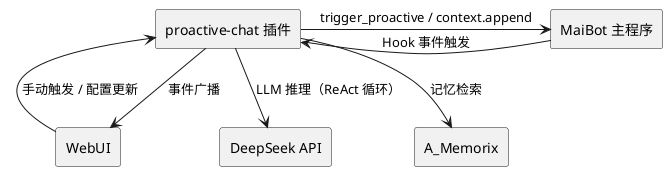
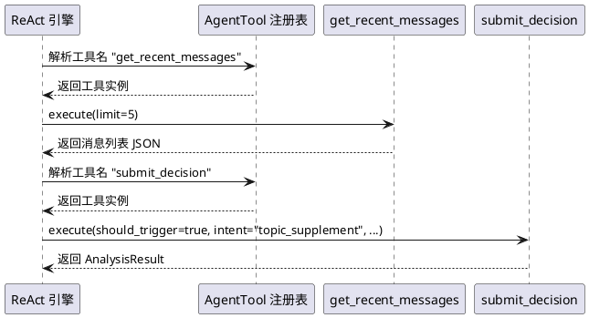
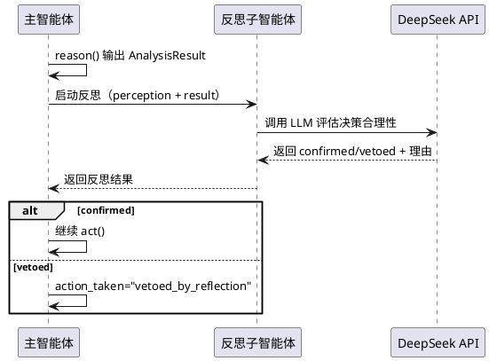
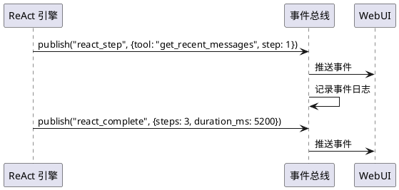
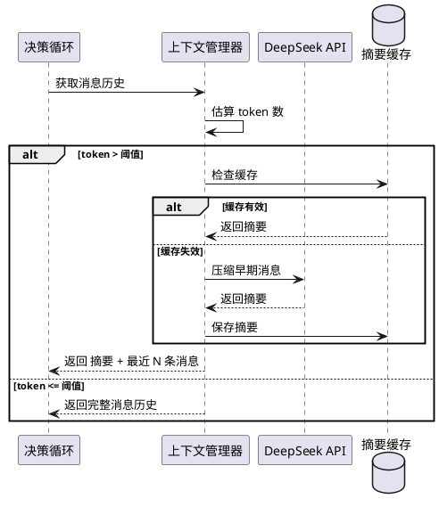

# 1. 组件定位

## 1.1 核心职责

本组件负责将 proactive-chat 插件的智能体从单次决策升级为 ReAct 循环驱动的多轮推理智能体，引入子智能体分工、事件总线系统化、上下文压缩三项核心能力。

## 1.2 核心输入

1. MaiBot planner 响应完成事件（`maisaka.planner.after_response` Hook）
2. 延迟触发队列的冷场/超时信号
3. LLM 返回的 tool_use 指令（智能体主动查询请求）
4. WebUI 手动触发请求
5. `@Tool trigger_proactive_chat` 调用

## 1.3 核心输出

1. 主动对话触发（`maisaka.trigger_proactive`）
2. 结构化决策记录（DecisionRecord，含 ReAct 循环步数）
3. 事件总线广播（AgentEvent，供 WebUI 订阅）
4. 上下文压缩摘要（长期对话历史压缩结果）

## 1.4 职责边界

- 不负责对话内容的生成（由 MaiBot 主程序负责）
- 不负责消息的收发（由 MaiBot SDK 负责）
- 不引入 Effect-TS 或其他重量级框架（保持 Python 原生 asyncio）
- 不实现完整的 Actor 系统（MiMo-Code 的 Actor 模型过于复杂，仅借鉴子智能体分工思想）
- 不实现权限系统（proactive-chat 是后台插件，无用户交互权限需求）
- 不实现 Max Mode 并行推理（成本过高，不适用于主动对话场景）
- 不实现 Fork Agent 前缀缓存（Anthropic 专有优化，DeepSeek 无此需求）

# 2. 领域术语

**ReAct 循环**
: 智能体通过 Reasoning-Action 循环迭代决策的模式：LLM 输出 tool_use → 执行工具 → 结果反馈 → 再次调用 LLM，直到 LLM 输出最终决策。

**AgentTool（智能体工具）**
: LLM 在 ReAct 循环中可调用的工具函数，用于主动查询信息（如消息历史、冷却状态、群活跃度），区别于 MaiBot SDK 的 @Tool。

**子智能体**
: 独立执行特定任务的轻量级智能体实例，由主智能体按需启动，完成后返回结果。当前设计包含：反思子智能体（评估决策质量）。

**事件总线**
: 基于发布-订阅模式的模块间通信机制，统一管理智能体生命周期事件、决策事件、状态变更事件的广播与订阅。

**上下文压缩**
: 当对话历史超过阈值时，通过 LLM 生成有损摘要替换早期消息，减少 token 消耗的机制。

**PerceptionTool**
: 感知类 AgentTool，让 LLM 在 ReAct 循环中主动查询消息历史、冷却状态、群活跃度等信息。

**DecisionTool**
: 决策类 AgentTool，让 LLM 在 ReAct 循环中输出最终决策结果（should_trigger/intent/reason 等）。

**ReActStep**
: ReAct 循环中的一次迭代记录，包含 LLM 输出、工具调用、工具结果。

# 3. 角色与边界

## 3.1 核心角色

- **MaiBot 管理员**：配置插件参数、查看 WebUI 决策面板、手动触发决策
- **MaiBot 主程序**：通过 Hook 事件触发插件决策循环，接收主动对话触发请求

## 3.2 外部系统

- **MaiBot SDK**：提供 ctx.message / ctx.chat / ctx.maisaka / ctx.config 等 API
- **DeepSeek API**：提供 LLM 推理服务
- **A_Memorix**：提供记忆检索服务

## 3.3 交互上下文



# 4. DFX 约束

## 4.1 性能

1. 单次 ReAct 循环最大步数 SHALL 不超过 5 步
2. 单次决策循环总耗时 SHALL 不超过 30 秒（含所有 LLM 调用和工具执行）
3. 上下文压缩 SHALL 在后台异步执行，不阻塞决策循环
4. 事件总线广播 SHALL 非阻塞，单次发布耗时不超过 5ms

## 4.2 可靠性

1. ReAct 循环中任何工具执行失败 SHALL 记录错误并继续循环（不中断）
2. 上下文压缩失败 SHALL 不影响正常决策（降级为不压缩）
3. 事件总线发布失败 SHALL 不影响核心决策流程
4. 子智能体执行超时（30秒）SHALL 自动取消并返回错误结果

## 4.3 安全性

1. AgentTool 只能执行只读查询，禁止任何写操作
2. ReAct 循环的 LLM 调用 SHALL 复用现有的 DeepSeek API Key 和鉴权机制
3. 上下文压缩的摘要 SHALL 不包含用户敏感信息（API Key 等）

## 4.4 可维护性

1. AgentTool 定义 SHALL 采用声明式注册，新增工具只需定义执行函数和参数 schema
2. 事件类型 SHALL 采用字符串枚举，新增事件只需定义类型和数据结构
3. ReAct 循环日志 SHALL 记录每步的工具调用和结果，便于调试

## 4.5 兼容性

1. v3.0 SHALL 向后兼容 v2.1 的决策记录格式（新增 react_steps 字段，旧记录该字段为空列表）
2. v3.0 SHALL 向后兼容 v2.1 的配置格式（新增 ReActConfig 段，默认值等价于 v2.1 行为）
3. WebUI SHALL 同时展示 v2.1 旧记录和 v3.0 新记录

# 5. 核心能力

## 5.1 ReAct 循环

### 5.1.1 业务规则

1. **循环启动**：当 perceive 阶段完成且 perception 数据非空时，SHALL 启动 ReAct 循环
   - 验收条件：perceive 返回有效数据 → ReAct 循环启动

2. **循环步数限制**：ReAct 循环 SHALL 在最大步数（默认 3）内终止
   - 验收条件：循环步数达到 max_react_steps → 强制终止并要求 LLM 输出最终决策

3. **工具调用**：LLM 输出 tool_use 时，SHALL 执行对应 AgentTool 并将结果追加到消息历史
   - 验收条件：LLM 输出 `get_recent_messages` tool_use → 执行查询 → 结果追加到消息 → 再次调用 LLM

4. **最终决策**：LLM 输出 `submit_decision` tool_use 或非 tool_use 的 finish_reason 时，SHALL 提取决策结果并终止循环
   - 验收条件：LLM 输出 `submit_decision` → 解析 should_trigger/intent/reason → 循环终止

5. **循环超时**：ReAct 循环总耗时超过 30 秒时，SHALL 强制终止并降级为不触发
   - 验收条件：循环耗时 > 30s → 返回 AnalysisResult(should_trigger=False) + action_taken="error_react_timeout"

6. **工具执行失败**：AgentTool 执行异常时，SHALL 将错误信息作为工具结果返回给 LLM，允许 LLM 重试或换策略
   - 验收条件：工具抛异常 → LLM 收到错误结果 → LLM 可选择其他工具或输出决策

7. **禁止项**：ReAct 循环中禁止执行任何写操作（触发主动对话、修改冷却状态等）
   - 验收条件：AgentTool 定义中无写操作 → 循环中只能查询信息

### 5.1.2 交互流程

```plantuml
@startuml
participant "决策循环" as loop
participant "ReAct 引擎" as react
participant "DeepSeek API" as llm
participant "AgentTool 注册表" as tools
database "消息历史" as msgs

loop -> react : 启动 ReAct 循环
react -> msgs : 加载初始上下文（perception 数据）

loop while (步数 < max 且 未决策) {
  react -> llm : 发送消息历史 + 工具定义
  llm --> react : 返回 tool_use 或 finish
  
  alt tool_use
    react -> tools : 执行 AgentTool
    tools --> react : 返回工具结果
    react -> msgs : 追加工具调用和结果
  else finish / submit_decision
    react --> loop : 返回 AnalysisResult
  end
}

@enduml
```

### 5.1.3 异常场景

1. **LLM 返回无效 tool_use**
   - 触发条件：LLM 输出的工具名不在注册表中
   - 系统行为：将"未知工具"错误作为工具结果返回给 LLM
   - 用户感知：决策记录中记录 invalid_tool 步骤

2. **LLM 连续输出无效 tool_use**
   - 触发条件：连续 2 次输出未知工具名
   - 系统行为：强制终止循环，降级为不触发
   - 用户感知：action_taken="error_react_invalid_tool"

3. **ReAct 循环达到最大步数仍未决策**
   - 触发条件：步数达到 max_react_steps 且 LLM 未输出 submit_decision
   - 系统行为：追加"请立即决策"提示，给 LLM 最后一次机会
   - 用户感知：决策记录中 react_steps 包含强制终止标记

4. **DeepSeek API 在 ReAct 循环中限流**
   - 触发条件：循环中某步 LLM 调用返回 429
   - 系统行为：遵循现有重试逻辑（指数退避），重试耗尽后终止循环
   - 用户感知：action_taken="error_api_retry_exhausted"

## 5.2 AgentTool 系统

### 5.2.1 业务规则

1. **工具定义**：每个 AgentTool SHALL 声明名称、描述、参数 schema 和异步执行函数
   - 验收条件：新工具只需定义 `@agent_tool` 装饰器或类即可注册

2. **工具分类**：AgentTool 分为感知类（只读查询）和决策类（输出最终决策）
   - 验收条件：感知类工具返回查询结果，决策类工具返回 AnalysisResult

3. **内置感知工具**：
   - `get_recent_messages`：查询指定聊天流的近期消息（参数：limit）
   - `get_cooldown_status`：查询指定聊天流的冷却状态
   - `get_stream_activity`：查询指定聊天流的活跃度指标（消息频率、最后消息时间等）
   - `search_memory`：检索与关键词相关的记忆

4. **内置决策工具**：
   - `submit_decision`：提交最终决策结果（参数：should_trigger, intent, reason, confidence, timing_score）

5. **工具参数验证**：AgentTool 执行前 SHALL 验证参数，无效参数返回错误信息而非抛异常
   - 验收条件：传入非法 limit 值 → 返回"参数错误"文本 → LLM 可修正

6. **禁止项**：AgentTool 禁止执行任何副作用操作（触发对话、修改冷却、写入文件等）
   - 验收条件：所有 AgentTool 执行函数只读取数据

### 5.2.2 交互流程



### 5.2.3 异常场景

1. **工具执行超时**
   - 触发条件：AgentTool 执行超过 10 秒
   - 系统行为：取消执行，返回超时错误信息给 LLM
   - 用户感知：react_steps 中记录 timeout

2. **工具参数缺失**
   - 触发条件：LLM 输出的 tool_use 缺少必需参数
   - 系统行为：返回参数缺失错误信息给 LLM
   - 用户感知：react_steps 中记录 missing_param

## 5.3 子智能体（反思子智能体）

### 5.3.1 业务规则

1. **触发条件**：当主智能体决策为 should_trigger=True 且 confidence >= 0.7 时，SHALL 可选启动反思子智能体
   - 验收条件：confidence >= 0.7 且 reflect_subagent_enabled=True → 启动反思子智能体

2. **反思子智能体职责**：评估主智能体的决策是否合理，返回"确认"或"否决"及理由
   - 验收条件：反思子智能体输入=主智能体的感知数据+决策结果 → 输出=confirmed/vetoed + 理由

3. **否决处理**：反思子智能体否决时，SHALL 将决策降级为不触发，并记录否决理由
   - 验收条件：反思返回 vetoed → action_taken="vetoed_by_reflection" → 不触发主动对话

4. **超时保护**：反思子智能体执行超过 15 秒时，SHALL 自动取消并按"确认"处理
   - 验收条件：反思超时 → 视为 confirmed → 继续执行 act 阶段

5. **成本控制**：反思子智能体 SHALL 使用独立的 max_tokens 限制（默认 200），避免过度消耗 token
   - 验收条件：反思 LLM 调用的 max_tokens <= 200

6. **禁止项**：反思子智能体禁止再次调用 AgentTool 或启动子智能体
   - 验收条件：反思子智能体使用独立的系统提示词，不包含工具定义

### 5.3.2 交互流程



### 5.3.3 异常场景

1. **反思子智能体 LLM 调用失败**
   - 触发条件：DeepSeek API 返回错误
   - 系统行为：按"确认"处理，继续执行 act 阶段
   - 用户感知：决策记录中 reflection_result 包含 error 标记

2. **反思子智能体返回无法解析的结果**
   - 触发条件：LLM 输出非 JSON 格式
   - 系统行为：按"确认"处理
   - 用户感知：决策记录中 reflection_result 包含 parse_error 标记

## 5.4 事件总线系统化

### 5.4.1 业务规则

1. **事件定义**：所有智能体事件 SHALL 通过 AgentEvent 类型定义，包含事件类型、时间戳、数据载荷
   - 验收条件：新事件只需定义事件类型字符串和数据结构

2. **事件类型**：
   - `react_step`：ReAct 循环每步完成（含工具名、参数、结果摘要）
   - `react_complete`：ReAct 循环完成（含总步数、总耗时）
   - `reflection_result`：反思子智能体返回结果
   - `context_compressed`：上下文压缩完成（含压缩前后的 token 估算）
   - `phase_changed`：决策阶段变更（perceiving/reasoning/reflecting/acting）
   - `new_decision`：新决策记录产生
   - `cooldown_expired`：冷却到期

3. **发布-订阅**：事件总线 SHALL 支持多个订阅者，发布失败不影响发布者
   - 验收条件：WebUI 订阅事件 → 智能体发布事件 → WebUI 收到通知

4. **事件去重**：1 秒内同一事件类型的重复事件 SHALL 自动去重
   - 验收条件：0.5s 内连续发布 2 个 react_step 事件 → 订阅者只收到 1 个

5. **禁止项**：事件总线禁止用于核心业务逻辑的同步调用（仅用于通知和 UI 更新）
   - 验收条件：决策循环不依赖事件总线的返回值

### 5.4.2 交互流程



### 5.4.3 异常场景

1. **订阅者处理异常**
   - 触发条件：WebUI 的 WebSocket 连接断开
   - 系统行为：事件总线跳过该订阅者，不影响其他订阅者
   - 用户感知：WebUI 重连后可获取最新状态

2. **事件发布积压**
   - 触发条件：发布速度超过订阅者消费速度
   - 系统行为：丢弃最旧的事件（滑动窗口，保留最近 100 条）
   - 用户感知：WebUI 可能丢失部分中间状态事件

## 5.5 上下文压缩

### 5.5.1 业务规则

1. **触发条件**：当消息历史的估算 token 数超过阈值（默认 4000）时，SHALL 触发上下文压缩
   - 验收条件：token 估算 > 4000 → 启动压缩

2. **压缩策略**：保留最近 N 条消息（默认 5 条），对更早的消息通过 LLM 生成摘要
   - 验收条件：压缩后消息历史 = 摘要 + 最近 N 条原始消息

3. **异步执行**：上下文压缩 SHALL 在后台异步执行，不阻塞当前决策循环
   - 验收条件：决策循环使用未压缩的完整消息 → 压缩结果供下次决策使用

4. **压缩结果缓存**：压缩生成的摘要 SHALL 缓存到文件，下次决策直接使用
   - 验收条件：首次压缩生成摘要文件 → 后续决策读取缓存 → 消息更新时失效

5. **成本控制**：压缩 LLM 调用 SHALL 使用独立的 max_tokens 限制（默认 300）
   - 验收条件：压缩 LLM 调用的 max_tokens <= 300

6. **禁止项**：压缩 SHALL 不丢弃最近 N 条消息（这些是当前决策的核心上下文）
   - 验收条件：压缩后最近 N 条消息完整保留

### 5.5.2 交互流程



### 5.5.3 异常场景

1. **压缩 LLM 调用失败**
   - 触发条件：DeepSeek API 返回错误
   - 系统行为：降级为不压缩，使用原始消息历史（截断到 max_tokens）
   - 用户感知：决策质量可能略降（早期消息被截断而非摘要）

2. **摘要缓存损坏**
   - 触发条件：缓存文件 JSON 解析失败
   - 系统行为：删除损坏缓存，重新生成
   - 用户感知：无感知（自动恢复）

# 6. 数据约束

## 6.1 ReActStep

1. **step_index**：步骤序号，从 1 开始，必须为正整数
2. **tool_name**：调用的工具名称，必须为已注册的 AgentTool 名称
3. **tool_args**：工具调用参数，JSON 对象
4. **tool_result**：工具返回结果，字符串，最大 2000 字符
5. **tool_error**：工具执行错误信息，字符串，为空表示成功
6. **duration_ms**：步骤耗时（毫秒），浮点数

## 6.2 ReflectionResult

1. **verdict**：反思结论，必须为 "confirmed" 或 "vetoed"
2. **reason**：反思理由，字符串，最大 300 字符
3. **confidence**：反思置信度，0.0-1.0 浮点数
4. **error**：反思错误信息，字符串，为空表示成功

## 6.3 ContextSummary

1. **stream_id**：聊天流 ID，字符串
2. **summary_text**：压缩摘要文本，字符串
3. **original_message_count**：压缩前的消息数量，正整数
4. **retained_message_count**：保留的最近消息数量，正整数
5. **created_at**：摘要创建时间，Unix 时间戳
6. **token_estimate**：压缩前的 token 估算值，正整数

## 6.4 AgentEvent

1. **event_type**：事件类型，字符串，必须为预定义的事件类型之一
2. **timestamp**：事件时间戳，Unix 时间戳（毫秒）
3. **stream_id**：关联的聊天流 ID，字符串
4. **data**：事件数据载荷，JSON 对象

## 6.5 DecisionRecord 扩展

在 v2.1 的 DecisionRecord 基础上新增：

1. **react_steps**：ReAct 循环步骤列表，ReActStep 数组，v2.1 旧记录为空列表
2. **react_total_steps**：ReAct 循环总步数，正整数，v2.1 旧记录为 0
3. **reflection_result**：反思子智能体结果，ReflectionResult 或 null
4. **context_compressed**：是否使用了压缩上下文，布尔值