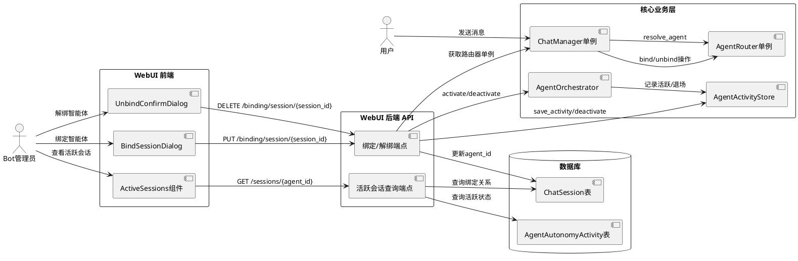
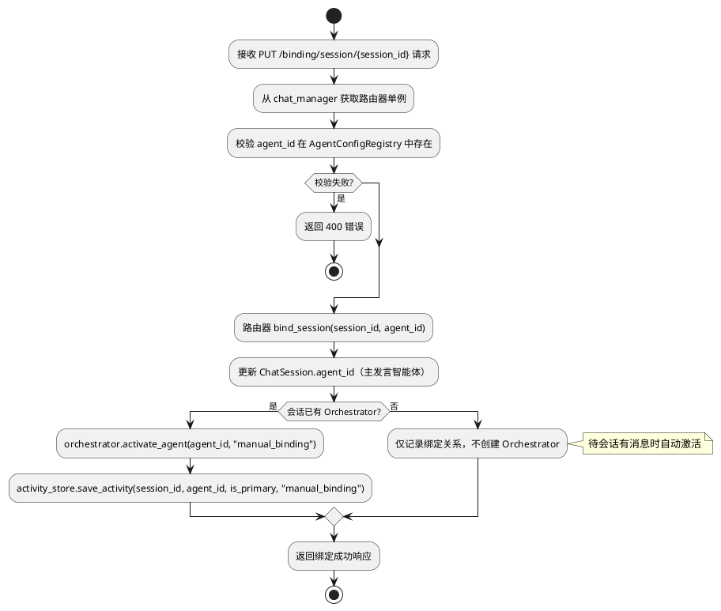
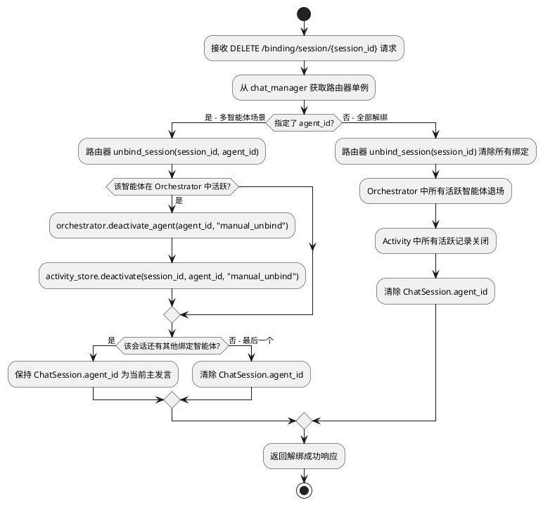
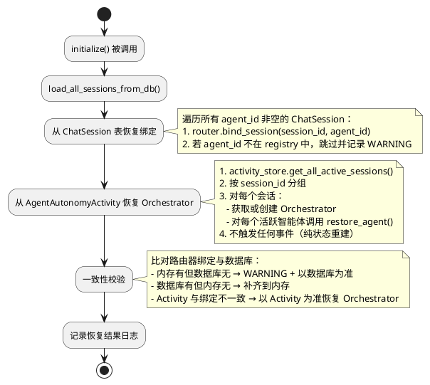
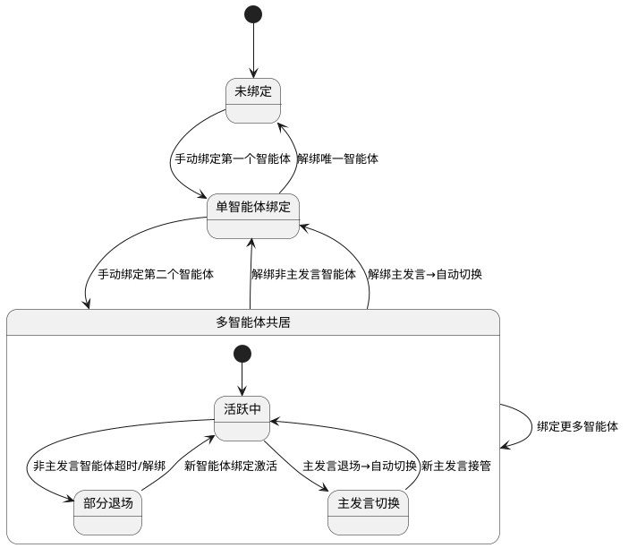
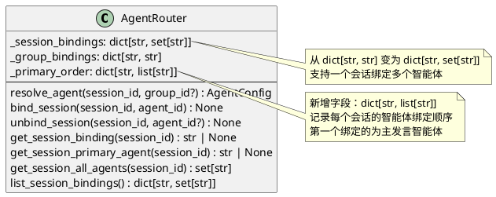
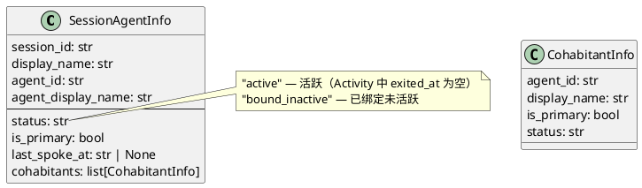
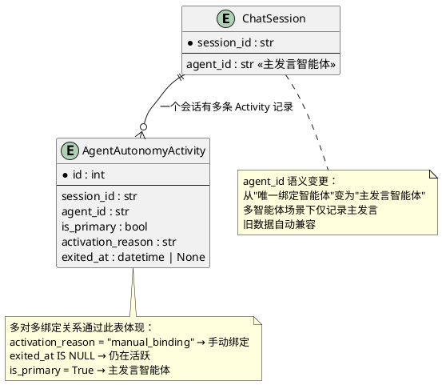

# 一、需求与存量功能关系分析

## 1.1 需求功能与存量功能对比

### 1.1.1 已实现功能

| 需求功能 | 存量功能 | 代码位置 | 匹配度 |
|---------|---------|---------|--------|
| 会话-智能体绑定 API（PUT） | `bind_session_agent` 端点，写入内存路由器+数据库 | `src/webui/routers/agent.py:302-331` | 75% |
| 会话-智能体解绑 API（DELETE） | `unbind_session_agent` 端点，仅清除内存路由器 | `src/webui/routers/agent.py:334-343` | 25% |
| 批量绑定 API | `batch_bind_sessions` 端点，逐条绑定 | `src/webui/routers/agent.py:346-380` | 75% |
| 群-智能体绑定/解绑 | `bind_group_agent` / `unbind_group_agent` 端点 | `src/webui/routers/agent.py:397-431` | 100% |
| 路由解析（resolve_agent） | `AgentRouter.resolve_agent` 优先级：会话绑定→群绑定→默认 | `src/maisaka/agent/router.py:29-44` | 100% |
| 智能体配置注册表 | `AgentConfigRegistry` 单例，提供 `has_agent`/`get_agent`/`list_agents` | `src/maisaka/agent/registry.py` | 100% |
| 多智能体编排器 | `AgentOrchestrator` 支持 `activate_agent`/`deactivate_agent`/`restore_agent` | `src/maisaka/agent_autonomy/orchestrator.py:204-295` | 75% |
| 活跃状态持久化 | `AgentActivityStore` 支持 `save_activity`/`deactivate`/`get_active_agents` | `src/maisaka/agent_autonomy/activity_store.py` | 75% |
| 活跃状态数据模型 | `AgentAutonomyActivity` 含 `is_primary`/`activation_reason`/`exited_at` | `src/common/database/database_model.py:634-653` | 100% |
| 会话数据模型 | `ChatSession` 含 `agent_id` 字段，默认 `"silver_wolf"` | `src/common/database/database_model.py:481-507` | 50% |
| WebUI 活跃会话展示 | `ActiveSessions` 组件展示会话列表+解绑按钮 | `dashboard/src/routes/agent/components/inner-world/ActiveSessions.tsx` | 25% |
| WebUI 绑定对话框 | `BindSessionDialog` 选择聊天流进行绑定 | `dashboard/src/routes/agent/components/inner-world/BindSessionDialog.tsx` | 50% |
| WebUI 数据 hook | `useInnerWorldData` 聚合智能体详情/情绪/关系/会话 | `dashboard/src/routes/agent/hooks/useInnerWorldData.ts` | 50% |
| 前端 API 层 | `agent-api.ts` 封装所有智能体相关 HTTP 请求 | `dashboard/src/lib/agent-api.ts` | 50% |

### 1.1.2 需要扩展的功能

| 需求功能 | 存量功能 | 差异说明 | 扩展方向 |
|---------|---------|---------|---------|
| 路由器单例共享 | WebUI 每次调用 `_get_router()` 创建新 `AgentRouter` 实例 | `_get_router()` 返回 `AgentRouter(_get_registry())`，每次都是新实例；ChatManager 持有独立的 `_agent_router` 单例；两者完全隔离 | 删除 `_get_router()` 函数，改为从 `chat_manager` 获取共享的 `_agent_router` 单例 |
| 绑定双写一致性 | `bind_session_agent` 已实现内存+数据库双写，但内存写入的是隔离实例 | WebUI 写入的绑定在请求结束后丢失，ChatManager 的路由器看不到 | 统一使用 ChatManager 的路由器单例，绑定操作写入共享实例 |
| 解绑双清一致性 | `unbind_session_agent` 仅调用 `agent_router.unbind_session()`，不清数据库 | 缺少数据库 `ChatSession.agent_id` 清除、Orchestrator 退场、Activity 记录关闭 | 解绑时依次执行：路由器解绑→Orchestrator 退场→Activity 关闭→数据库清除 |
| 多智能体共居绑定 | `AgentRouter._session_bindings` 为 `dict[str, str]`，一对一映射 | 当前数据结构只支持一个会话绑定一个智能体；需支持一对多 | 将 `_session_bindings` 从 `dict[str, str]` 改为 `dict[str, set[str]]`，新增 `bind_session` 多智能体重载 |
| 活跃会话精确展示 | `GET /sessions/{agent_id}` 仅查 `ChatSession.agent_id` | 不区分"绑定关系"和"实际活跃状态"；不展示共居智能体；无状态分类 | 联合查询 `ChatSession` + `AgentAutonomyActivity`，返回分类结果（活跃/已绑定未活跃）+ 共居智能体列表 |
| 启动恢复绑定 | `ChatManager.initialize()` 加载会话但不恢复路由器绑定 | `_load_sessions_from_db` 只重建内存会话表，不调用 `router.bind_session` | 在 `initialize()` 中从 `ChatSession` 恢复绑定到路由器，从 `AgentAutonomyActivity` 恢复 Orchestrator |
| 前端会话状态分类 | `ActiveSessions` 组件无状态区分，所有会话同等展示 | 无"活跃/已绑定未活跃"分类，无共居智能体标签，无主发言标记 | 扩展 `SessionAgentInfo` 类型，增加 `status`/`cohabitants`/`is_primary` 字段；UI 增加状态标记和共居展示 |
| 绑定触发激活 | 手动绑定后不激活 Orchestrator | 当前 `bind_session_agent` 只写路由器和数据库，不调用 `activate_agent` | 绑定成功后检查会话是否已有 Orchestrator，有则激活新智能体 |

### 1.1.3 需要新增的功能或接口

**后端模块：**

1. **ChatManager 路由器访问接口**：暴露 `_agent_router` 单例供 WebUI API 使用
   - 输入：无
   - 输出：`AgentRouter` 实例
   - 核心逻辑：返回 `ChatManager._ensure_agent_router()` 的结果
   - 依赖：`ChatManager` 单例

2. **解绑彻底清除流程**：解绑时依次执行内存→Orchestrator→Activity→数据库四步清除
   - 输入：`session_id`，可选 `agent_id`（多智能体场景下指定解绑哪个）
   - 输出：解绑结果
   - 核心逻辑：路由器解绑→Orchestrator 退场→Activity 关闭→数据库清除
   - 依赖：`AgentOrchestrator`、`AgentActivityStore`

3. **多智能体绑定存储逻辑**：基于 `AgentAutonomyActivity` 的 `activation_reason="manual_binding"` 记录来体现多对多关系
   - 输入：`session_id`，`agent_id`，`is_primary`
   - 输出：绑定记录
   - 核心逻辑：写入路由器多对多映射 + 数据库 Activity 记录
   - 依赖：`AgentActivityStore`

4. **活跃会话联合查询接口**：替代现有 `GET /sessions/{agent_id}`，返回分类后的会话列表
   - 输入：`agent_id`
   - 输出：分类会话列表（活跃/已绑定未活跃）+ 共居智能体信息
   - 核心逻辑：联合查询 `ChatSession` + `AgentAutonomyActivity`
   - 依赖：`AgentActivityStore`、`ChatSession` 数据库

5. **启动恢复流程**：在 `ChatManager.initialize()` 中恢复绑定关系到路由器和 Orchestrator
   - 输入：无
   - 输出：恢复的绑定数量
   - 核心逻辑：从 `ChatSession` 恢复路由器绑定，从 `AgentAutonomyActivity` 恢复 Orchestrator
   - 依赖：`AgentActivityStore`、`AgentOrchestrator`

6. **一致性校验逻辑**：启动恢复后比对内存与数据库的一致性
   - 输入：无
   - 输出：不一致项列表 + WARNING 日志
   - 核心逻辑：比对路由器绑定与数据库 `ChatSession.agent_id`
   - 依赖：`AgentRouter`、`ChatSession` 数据库

**前端模块：**

7. **扩展 `SessionAgentInfo` 类型**：增加 `status`/`cohabitants`/`is_primary`/`last_spoke_at` 字段
   - 依赖：后端 API 响应格式变更

8. **ActiveSessions 状态分类 UI**：活跃会话绿色标记 + 已绑定未活跃灰色标记 + 共居智能体标签
   - 依赖：扩展后的 `SessionAgentInfo` 类型

9. **解绑指定智能体 UI**：多智能体场景下可选择解绑特定智能体
   - 依赖：后端解绑 API 支持 `agent_id` 参数

## 1.2 存量功能详细分析

### 1.2.1 AgentRouter（`src/maisaka/agent/router.py`）

**接口契约**：
- `resolve_agent(session_id, group_id?) → AgentConfig`：路由解析，优先级为会话绑定→群绑定→默认智能体
- `bind_session(session_id, agent_id) → None`：绑定会话到智能体，校验 `agent_id` 存在性
- `unbind_session(session_id) → None`：解除会话绑定
- `get_session_binding(session_id) → Optional[str]`：获取会话绑定的智能体 ID
- `list_session_bindings() → dict[str, str]`：列出所有会话绑定

**业务规则**：
- `_session_bindings: dict[str, str]`：纯内存字典，一对一映射，重启丢失
- `_group_bindings: dict[str, str]`：群绑定，同理纯内存
- `bind_session` 校验 `agent_id` 在 `AgentConfigRegistry` 中存在，不存在则抛 `ValueError`

**扩展点**：
- `_session_bindings` 需从 `dict[str, str]` 改为 `dict[str, set[str]]` 以支持多智能体
- `resolve_agent` 需返回主发言智能体（多智能体场景下）
- 需新增 `get_session_primary_agent(session_id)` 方法
- 需新增 `get_session_all_agents(session_id)` 方法

**约束**：
- 线程安全：当前无锁保护，FastAPI 多线程环境下需注意
- 路由解析不得引入额外数据库查询（spec 4.1.3 约束）

### 1.2.2 ChatManager（`src/chat/message_receive/chat_manager.py`）

**接口契约**：
- `initialize() → None`：异步初始化，从数据库加载会话
- `get_or_create_session(platform, user_id, ...) → BotChatSession`：获取或创建会话
- `_ensure_agent_router() → AgentRouter`：延迟初始化路由器单例
- `_save_session(session) → None`：保存会话到数据库

**业务规则**：
- 模块级单例 `chat_manager = ChatManager()`（第 520 行）
- `_agent_router` 延迟初始化，首次访问时创建 `AgentRouter(AgentConfigRegistry())`
- `initialize()` 调用 `_load_sessions_from_db()` 重建内存会话表，但不恢复路由器绑定
- `get_or_create_session` 在创建新会话时调用 `_ensure_agent_router().resolve_agent()` 确定智能体

**扩展点**：
- `initialize()` 需增加绑定恢复逻辑
- 需暴露 `agent_router` 属性供 WebUI API 使用
- 需增加一致性校验方法

**约束**：
- `_agent_router` 是唯一权威路由器实例，WebUI 必须通过此实例操作
- 会话 ID 规范：业务模块不应自行调用 `SessionUtils.calculate_session_id`

### 1.2.3 AgentOrchestrator（`src/maisaka/agent_autonomy/orchestrator.py`）

**接口契约**：
- `activate_agent(agent_id, reason) → bool`：激活智能体，记录 Activity
- `deactivate_agent(agent_id, reason) → None`：退场智能体，关闭 Activity，自动切换主发言
- `restore_agent(agent_id, is_primary) → None`：从数据库恢复，不触发事件
- `switch_primary_speaker(target_agent_id, reason, change_type) → bool`：切换主发言
- `get_by_session(session_id) → AgentOrchestrator | None`：类方法，获取编排器实例

**业务规则**：
- `_active_agents: dict[str, AutonomousAgent]`：活跃智能体映射
- `_primary_agent_id: str | None`：主发言智能体 ID
- 类级别 `_registry: dict[str, AgentOrchestrator]`：session_id 到编排器的映射
- `activate_agent` 受 `max_active_agents` 限制
- `deactivate_agent` 自动处理主发言切换
- `restore_agent` 不触发事件、不记录 Activity（纯状态重建）

**扩展点**：
- 手动绑定需调用 `activate_agent(agent_id, "manual_binding")`
- 手动解绑需调用 `deactivate_agent(agent_id, "manual_unbind")`
- 启动恢复需调用 `restore_agent(agent_id, is_primary)`

**约束**：
- `restore_agent` 不产生副作用（spec 5.5.1 禁止项）
- 编排器通过 `get_by_session` 获取，不存在时需创建

### 1.2.4 AgentActivityStore（`src/maisaka/agent_autonomy/activity_store.py`）

**接口契约**：
- `save_activity(session_id, agent_id, is_primary, activation_reason) → str`：持久化活跃记录
- `deactivate(session_id, agent_id, reason) → None`：记录退场
- `get_active_agents(session_id) → list[AgentAutonomyActivity]`：获取会话活跃智能体
- `get_all_active_sessions() → list[AgentAutonomyActivity]`：查询所有未退出的活跃记录
- `set_primary(session_id, agent_id) → None`：设置主发言

**业务规则**：
- 所有操作通过 `get_db_session()` 上下文管理器
- `deactivate` 设置 `exit_reason` 和 `exited_at`
- `get_active_agents` 过滤 `exited_at.is_(None)`

**扩展点**：
- 需新增 `get_sessions_by_agent(agent_id)` 方法：按智能体查询关联的所有会话（含活跃和已退出）
- 需新增 `get_active_sessions_by_agent(agent_id)` 方法：按智能体查询活跃会话

**约束**：
- 数据库操作需注意事务边界
- `AgentAutonomyActivity` 表无需修改结构

### 1.2.5 WebUI 后端 API（`src/webui/routers/agent.py`）

**接口契约**：
- `GET /agent/binding/session/{session_id}`：获取会话绑定
- `PUT /agent/binding/session/{session_id}`：绑定会话
- `DELETE /agent/binding/session/{session_id}`：解绑会话
- `PUT /agent/binding/batch`：批量绑定
- `GET /agent/sessions/{agent_id}`：获取智能体关联的会话列表

**业务规则**：
- `_get_router()` 每次创建新 `AgentRouter` 实例（**核心 Bug**）
- `_get_registry()` 每次创建新 `AgentConfigRegistry` 实例
- 绑定端点写入内存路由器 + 数据库，但内存路由器是隔离实例
- 解绑端点仅清除内存路由器，不清数据库
- `GET /sessions/{agent_id}` 仅查 `ChatSession.agent_id`

**扩展点**：
- 删除 `_get_router()` 函数，改为从 `chat_manager` 获取路由器单例
- 解绑端点需增加数据库清除 + Orchestrator 退场 + Activity 关闭
- `GET /sessions/{agent_id}` 需联合查询 Activity
- 新增 `DELETE /agent/binding/session/{session_id}/{agent_id}` 端点（多智能体场景）

**约束**：
- 认证依赖 `require_auth`，保持不变
- 响应格式需向后兼容

### 1.2.6 WebUI 前端（`dashboard/src/routes/agent/components/inner-world/`）

**接口契约**：
- `ActiveSessions`：展示会话列表，接收 `SessionAgentInfo[]`
- `BindSessionDialog`：选择聊天流绑定
- `UnbindConfirmDialog`：确认解绑
- `useInnerWorldData`：聚合数据 hook，含 `sessionsQuery`
- `agent-api.ts`：`getSessionsByAgent(agentId)` → `SessionAgentInfo[]`

**业务规则**：
- `SessionAgentInfo` 仅含 `session_id`/`display_name`/`agent_id`/`agent_display_name`
- 无状态分类、无共居展示、无主发言标记
- 绑定对话框显示所有聊天流，已绑定的显示勾号

**扩展点**：
- `SessionAgentInfo` 需扩展 `status`/`cohabitants`/`is_primary`/`last_spoke_at` 字段
- `ActiveSessions` 需增加状态标记（活跃绿色/已绑定灰色）和共居智能体标签
- `UnbindConfirmDialog` 需支持多智能体场景下的指定解绑
- `agent-api.ts` 需新增/修改 API 调用以匹配后端变更

**约束**：
- 使用 TanStack Query 管理服务端状态
- 使用 shadcn/ui 组件库
- 国际化支持（zh-CN/en-US/ja-JP）

# 二、增量设计方案

## 2.1 实现模型

### 2.1.1 上下文视图



### 2.1.2 服务/组件总体架构

```plantuml
@startuml
package "WebUI API层" {
  [AgentBindingAPI] as api
  note right of api : 绑定/解绑/查询端点\n通过 chat_manager 获取路由器
}

package "核心业务层" {
  component "ChatManager" as chat_mgr {
    [agent_router属性] as router_prop
    [initialize()] as init
    note right of init : 启动恢复绑定+一致性校验
  }
  
  component "AgentRouter" as router {
    [_session_bindings: dict[str, set[str]]] as bindings
    [resolve_agent()] as resolve
    [bind_session()] as bind
    [unbind_session()] as unbind
    [get_session_primary_agent()] as primary
    [get_session_all_agents()] as all_agents
    note right of bindings : 多对多映射\nsession_id → agent_id集合
  }
  
  component "AgentOrchestrator" as orch {
    [activate_agent()] as activate
    [deactivate_agent()] as deactivate
    [restore_agent()] as restore
    note right of restore : 启动恢复专用\n不触发事件
  }
  
  component "AgentActivityStore" as store {
    [save_activity()] as save
    [deactivate()] as close
    [get_active_agents()] as get_active
    [get_sessions_by_agent()] as get_sessions
    note right of get_sessions : 新增方法\n按智能体查询关联会话
  }
}

package "数据持久层" {
  [ChatSession] as db_session
  [AgentAutonomyActivity] as db_activity
}

api --> chat_mgr : 获取路由器单例
chat_mgr --> router : 持有唯一实例
api --> orch : 绑定时激活/解绑时退场
api --> store : 记录Activity
api --> db_session : 更新agent_id
api --> db_activity : 查询活跃状态

init --> db_session : 恢复绑定
init --> db_activity : 恢复Orchestrator
init --> router : bind_session恢复
init --> orch : restore_agent恢复
@enduml
```

### 2.1.3 实现设计文档

#### 2.1.3.1 绑定操作流程（修复后）



#### 2.1.3.2 解绑操作流程（修复后）



#### 2.1.3.3 启动恢复流程



#### 2.1.3.4 多智能体绑定状态机



## 2.2 接口设计

### 2.2.1 总体设计

接口分为四类：

| 接口分类 | 接口数量 | 稳定性 | 说明 |
|---------|---------|--------|------|
| 绑定操作接口 | 3 | 稳定 | PUT/DELETE 绑定 + 批量绑定 |
| 查询接口 | 2 | 稳定 | 会话绑定查询 + 活跃会话列表查询 |
| 路由器内部接口 | 4 | 稳定 | AgentRouter 新增/修改方法 |
| Activity 查询接口 | 2 | 稳定 | AgentActivityStore 新增方法 |

接口变更策略：
- 现有 API 路径和请求格式保持不变（向后兼容）
- `GET /sessions/{agent_id}` 响应体扩展（新增字段，不删除旧字段）
- 新增 `DELETE /binding/session/{session_id}/{agent_id}` 端点
- `SessionAgentInfo` 类型扩展（新增可选字段）

### 2.2.2 接口清单

#### 绑定操作接口

**PUT /api/webui/agent/binding/session/{session_id}**

- 接口签名：`bind_session_agent(session_id: str, request: BindSessionRequest) → SessionBindingResponse`
- 业务说明：绑定智能体到指定会话，支持多智能体共居
- 前置条件：`agent_id` 在 `AgentConfigRegistry` 中存在；`chat_manager` 已初始化
- 后置条件：路由器有绑定记录；数据库 `ChatSession.agent_id` 已更新（主发言智能体）；若会话有 Orchestrator，智能体被激活
- 异常映射：`agent_id` 不存在 → 400；`chat_manager` 未初始化 → 503；数据库写入失败 → 500（回滚内存绑定）
- 变更说明：从 `_get_router()` 改为从 `chat_manager` 获取路由器单例；绑定后触发 Orchestrator 激活

**DELETE /api/webui/agent/binding/session/{session_id}**

- 接口签名：`unbind_session_agent(session_id: str) → SessionBindingResponse`
- 业务说明：解除会话的所有智能体绑定
- 前置条件：`chat_manager` 已初始化
- 后置条件：路由器无该 session_id 的绑定；数据库 `ChatSession.agent_id` 为空；Orchestrator 中所有智能体退场；Activity 记录全部关闭
- 异常映射：`chat_manager` 未初始化 → 503
- 变更说明：**重大修复** — 原实现仅清内存，现增加数据库清除 + Orchestrator 退场 + Activity 关闭

**DELETE /api/webui/agent/binding/session/{session_id}/{agent_id}**（新增）

- 接口签名：`unbind_session_specific_agent(session_id: str, agent_id: str) → SessionBindingResponse`
- 业务说明：多智能体场景下，解除指定智能体的绑定，不影响其他智能体
- 前置条件：`chat_manager` 已初始化；`agent_id` 在 `AgentConfigRegistry` 中存在
- 后置条件：路由器中该 session_id 不再包含指定 agent_id；若为最后一个智能体，数据库 `ChatSession.agent_id` 为空；若为主发言智能体，自动切换主发言；Orchestrator 中指定智能体退场；Activity 记录关闭
- 异常映射：`agent_id` 不存在 → 400；`chat_manager` 未初始化 → 503

**PUT /api/webui/agent/binding/batch**

- 接口签名：`batch_bind_sessions(request: BatchBindRequest) → BatchBindResponse`
- 业务说明：批量绑定，单条失败不影响其他
- 变更说明：从 `_get_router()` 改为从 `chat_manager` 获取路由器单例；每条绑定后触发 Orchestrator 激活

#### 查询接口

**GET /api/webui/agent/binding/session/{session_id}**

- 接口签名：`get_session_binding(session_id: str) → SessionBindingResponse`
- 业务说明：获取会话绑定的智能体（主发言智能体）
- 变更说明：从 `_get_router()` 改为从 `chat_manager` 获取路由器单例

**GET /api/webui/agent/sessions/{agent_id}**

- 接口签名：`get_sessions_by_agent(agent_id: str) → SessionsByAgentResponse`
- 业务说明：获取智能体关联的所有会话，含活跃状态分类和共居智能体信息
- 前置条件：`agent_id` 在 `AgentConfigRegistry` 中存在
- 后置条件：无状态变更
- 异常映射：`agent_id` 不存在 → 404
- 变更说明：**重大改造** — 原实现仅查 `ChatSession.agent_id`，现联合查询 `AgentAutonomyActivity`，返回分类结果

#### 路由器内部接口

**AgentRouter.bind_session(session_id: str, agent_id: str) → None**

- 业务说明：绑定会话到智能体，支持多智能体（同一 session_id 可绑定多个 agent_id）
- 变更说明：`_session_bindings` 从 `dict[str, str]` 改为 `dict[str, set[str]]`，绑定操作为 `set.add(agent_id)`

**AgentRouter.unbind_session(session_id: str, agent_id: str | None = None) → None**

- 业务说明：解除绑定。`agent_id=None` 时清除该会话所有绑定；指定 `agent_id` 时仅移除指定智能体
- 变更说明：新增 `agent_id` 可选参数，支持多智能体场景下的精确解绑

**AgentRouter.get_session_primary_agent(session_id: str) → str | None**

- 业务说明：获取会话的主发言智能体 ID（新增方法）
- 返回：该会话绑定集合中的第一个智能体（按绑定顺序）

**AgentRouter.get_session_all_agents(session_id: str) → set[str]**

- 业务说明：获取会话绑定的所有智能体 ID 集合（新增方法）

**AgentRouter.resolve_agent(session_id: str, group_id: str | None = None) → AgentConfig**

- 业务说明：路由解析，多智能体场景下返回主发言智能体
- 变更说明：从 `_session_bindings.get(session_id)` 改为获取主发言智能体

#### Activity 查询接口

**AgentActivityStore.get_sessions_by_agent(agent_id: str) → list[AgentAutonomyActivity]**

- 业务说明：按智能体查询关联的所有会话（含活跃和已退出）（新增方法）
- 实现：查询 `AgentAutonomyActivity` 表中 `agent_id` 匹配的所有记录

**AgentActivityStore.get_active_sessions_by_agent(agent_id: str) → list[AgentAutonomyActivity]**

- 业务说明：按智能体查询当前活跃的会话（新增方法）
- 实现：查询 `AgentAutonomyActivity` 表中 `agent_id` 匹配且 `exited_at` 为空的记录

## 2.3 数据模型

### 2.3.1 设计目标

1. **支持多智能体共居**：一个会话可绑定多个智能体，通过 `AgentAutonomyActivity` 的 `activation_reason="manual_binding"` 记录体现多对多关系
2. **无需新增数据库表**：利用已有的 `AgentAutonomyActivity` 表存储多智能体绑定关系
3. **向后兼容**：`ChatSession.agent_id` 语义从"唯一绑定智能体"变为"主发言智能体"，旧数据自动兼容
4. **性能目标**：路由解析从内存直接返回，不引入额外数据库查询

### 2.3.2 模型实现

#### 内存模型变更



#### API 响应模型变更



#### 对象关系



#### 持久化策略

- **ChatSession.agent_id**：仅存储主发言智能体 ID，多智能体场景下由 `AgentAutonomyActivity` 补充
- **AgentAutonomyActivity**：存储完整的绑定关系，`activation_reason="manual_binding"` 标识手动绑定，`exited_at` 标识是否仍在活跃
- **AgentRouter 内存**：`_session_bindings` 存储会话到智能体集合的映射，启动时从数据库恢复
- **恢复优先级**：`ChatSession.agent_id` 恢复路由器绑定 → `AgentAutonomyActivity` 恢复 Orchestrator 活跃状态