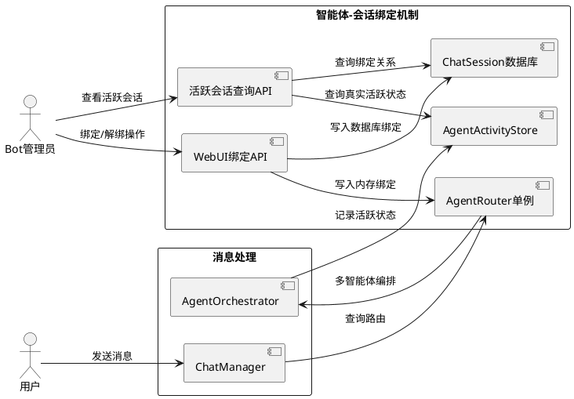
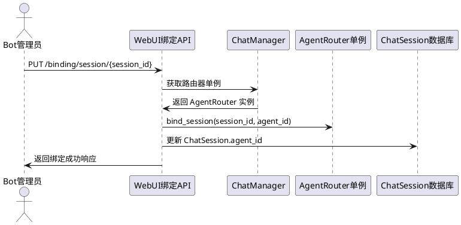
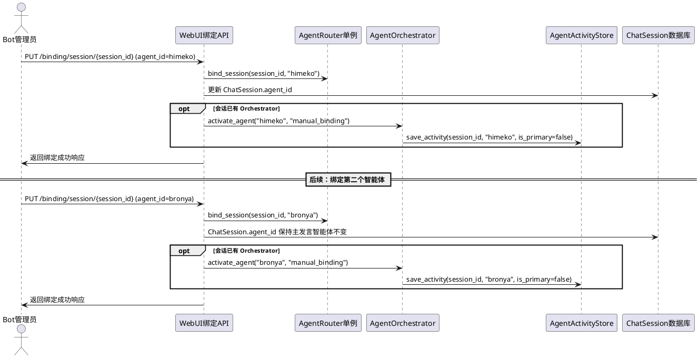
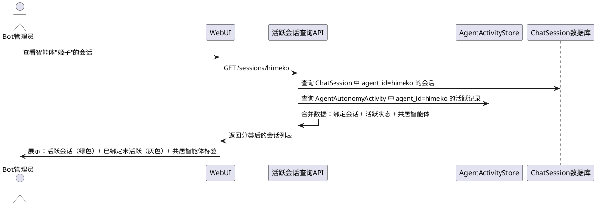
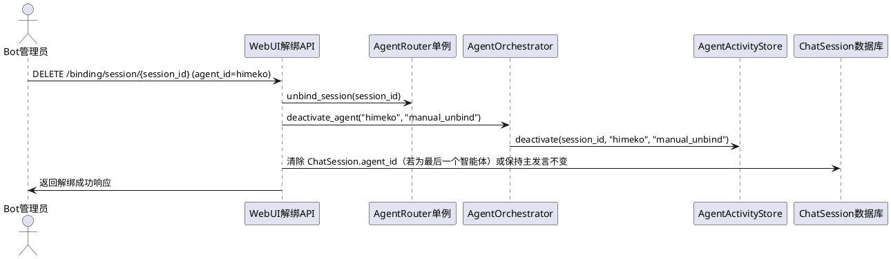
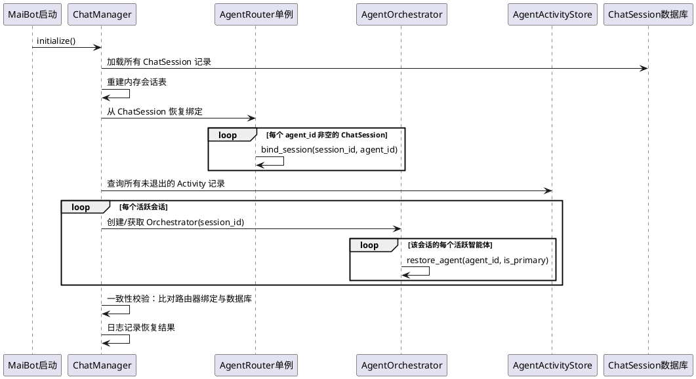

# 1. 组件定位

## 1.1 核心职责

本组件负责修复智能体-会话绑定机制的三个关键缺陷，并实现多智能体共居对话能力，确保手动绑定持久生效、解绑彻底清除、活跃会话精确展示。

## 1.2 核心输入

1. **WebUI 绑定请求**：管理员通过 WebUI 发起的会话-智能体绑定/解绑操作（PUT/DELETE /binding/session/{session_id}）
2. **WebUI 批量绑定请求**：管理员通过 WebUI 发起的批量绑定操作（PUT /binding/batch）
3. **WebUI 活跃会话查询**：管理员查看某智能体关联的所有会话（GET /sessions/{agent_id}）
4. **ChatManager 路由请求**：消息到达时 ChatManager 需要解析当前会话应使用的智能体
5. **AgentOrchestrator 激活请求**：多智能体场景下 Orchestrator 需要激活/管理共居的智能体
6. **启动恢复请求**：MaiBot 重启后需要从数据库恢复所有绑定关系

## 1.3 核心输出

1. **持久化的绑定关系**：绑定操作同时写入内存路由器和数据库，确保一致性
2. **彻底的解绑结果**：解绑操作同时清除内存路由器和数据库记录
3. **精确的活跃会话列表**：结合 AgentAutonomyActivity 展示真正活跃的会话状态
4. **多智能体共居路由**：同一会话可被多个智能体绑定，由 Orchestrator 编排发言权
5. **WebUI 展示数据**：前端可展示每个智能体的活跃会话列表及共居状态

## 1.4 职责边界

- **不负责**：智能体自主性逻辑（思考、表达、插话等），这些由 AgentOrchestrator 已有逻辑处理
- **不负责**：智能体间交互引擎的内部逻辑（InteractionEngine）
- **不负责**：修改 AgentAutonomyActivity 的数据库表结构（已有表结构足够支撑）
- **不负责**：LLM 调用和 prompt 模板（那是回复生成层的职责）
- **不负责**：WebUI 的整体布局和主题样式（只涉及绑定/会话展示的功能性改动）

# 2. 领域术语

**会话绑定（Session Binding）**
: 将一个或多个智能体与一个聊天会话建立关联关系，使该智能体在该会话中生效。

**多智能体共居（Multi-Agent Cohabitation）**
: 多个智能体同时绑定到同一个会话，在该会话中共同存在，由 Orchestrator 编排发言权。

**主发言智能体（Primary Agent）**
: 在一个会话中当前拥有主要回复权的智能体，直接回应用户消息。

**活跃智能体（Active Agent）**
: 在某个会话中处于活跃状态的智能体，包括主发言和可插话的智能体。

**路由器单例（Router Singleton）**
: ChatManager 持有的唯一 AgentRouter 实例，是消息路由的唯一权威来源。

**绑定一致性（Binding Consistency）**
: 内存路由器的绑定状态与数据库 ChatSession.agent_id 字段保持同步的状态。

**活跃会话（Active Session）**
: 智能体当前真正参与交互的会话，以 AgentAutonomyActivity 中 exited_at 为空为判定依据，而非仅数据库中的绑定标记。

**手动绑定（Manual Binding）**
: 管理员通过 WebUI API 主动发起的绑定操作，区别于智能体自主加入（如插话激活）。

# 3. 角色与边界

## 3.1 核心角色

**Bot 管理员**：通过 WebUI 管理智能体与会话的绑定关系，查看各智能体的活跃会话状态。

**用户**：在聊天会话中与智能体交互，感知多智能体共居的对话体验。

## 3.2 外部系统

**ChatManager**：持有 AgentRouter 单例，负责消息到达时的智能体路由决策。

**AgentOrchestrator**：多智能体编排器，管理同一会话中多个活跃智能体的发言权分配。

**AgentActivityStore**：智能体活跃状态持久化，提供 AgentAutonomyActivity 的查询能力。

**WebUI 后端 API**：提供绑定/解绑/查询接口给前端。

**ChatSession 数据库表**：持久化会话与智能体的绑定关系（agent_id 字段）。

## 3.3 交互上下文

# 4. DFX约束

## 4.1 性能

1. 绑定/解绑操作的响应时间不得超过 200ms（含数据库写入）
2. 活跃会话查询响应时间不得超过 500ms（需联合查询 ChatSession + AgentAutonomyActivity）
3. 路由解析（resolve_agent）不得因绑定修复引入额外数据库查询，必须从内存路由器直接返回

## 4.2 可靠性

1. 绑定操作必须是原子性的：内存路由器和数据库要么同时成功，要么同时失败
2. 解绑操作必须是原子性的：内存路由器和数据库必须同时清除
3. MaiBot 重启后，所有手动绑定必须能从数据库正确恢复到内存路由器
4. 绑定一致性异常（如内存有但数据库无）必须通过日志告警，不得静默忽略

## 4.3 安全性

1. 绑定/解绑 API 必须经过认证（已有 require_auth 依赖，保持不变）
2. 绑定操作必须校验 agent_id 的合法性（已存在，保持不变）
3. 批量绑定单条失败不得影响其他绑定的执行（已存在，保持不变）

## 4.4 可维护性

1. 绑定操作的日志必须包含 session_id、agent_id、操作类型（bind/unbind）、来源（manual/auto）
2. 绑定不一致时必须输出 WARNING 级别日志，包含具体的不一致详情
3. WebUI API 的 AgentRouter 必须使用 ChatManager 的单例，禁止创建独立实例

## 4.5 兼容性

1. 多智能体共居不得破坏现有的单智能体绑定行为（向后兼容）
2. ChatSession.agent_id 字段的语义变更（从"唯一绑定"变为"主发言智能体"）必须兼容旧数据
3. WebUI API 的请求/响应格式不得产生破坏性变更
4. 现有的群绑定（group binding）机制不受影响

# 5. 核心能力

## 5.1 绑定路由器单例共享

### 5.1.1 业务规则

1. **路由器单例唯一性**：WebUI API 必须使用 ChatManager 持有的 AgentRouter 单例，禁止创建独立的 AgentRouter 实例
   - 验收条件：WebUI 绑定操作写入的绑定关系 → ChatManager 的路由器立即可见
   - 验收条件：WebUI 绑定操作后，消息到达时 ChatManager.resolve_agent 返回正确的智能体

2. **绑定双写一致性**：绑定操作必须同时写入内存路由器和数据库 ChatSession.agent_id
   - 验收条件：执行 PUT /binding/session/{session_id} → 内存路由器有记录 且 数据库 ChatSession.agent_id 已更新
   - 验收条件：绑定成功后重启 MaiBot → 路由器从数据库恢复后仍能正确路由

3. **解绑双清一致性**：解绑操作必须同时清除内存路由器和数据库 ChatSession.agent_id
   - 验收条件：执行 DELETE /binding/session/{session_id} → 内存路由器无记录 且 数据库 ChatSession.agent_id 为空
   - 验收条件：解绑成功后重启 MaiBot → 该会话不再路由到已解绑的智能体

4. **启动恢复**：MaiBot 重启后，AgentRouter 必须从数据库 ChatSession 表恢复所有非空的 agent_id 绑定到内存
   - 验收条件：重启前有 3 个会话绑定了不同智能体 → 重启后路由器能正确路由这 3 个会话
   - 验收条件：重启后 WebUI 查询绑定 → 返回与重启前一致的结果

5. **禁止项**：禁止 WebUI API 创建独立的 AgentRouter 实例
   - 验收条件：WebUI API 中不再出现 `AgentRouter(...)` 构造调用 → 必须通过 ChatManager 获取

### 5.1.2 交互流程

### 5.1.3 异常场景

1. **数据库写入失败**
   - 触发条件：绑定操作写入内存路由器成功，但数据库写入失败
   - 系统行为：回滚内存路由器的绑定，返回 500 错误
   - 用户感知：WebUI 显示"绑定失败"错误提示

2. **路由器单例不可用**
   - 触发条件：ChatManager 尚未初始化
   - 系统行为：返回 503 错误，提示"服务尚未就绪"
   - 用户感知：WebUI 显示"系统初始化中，请稍后重试"

3. **智能体不存在**
   - 触发条件：绑定的 agent_id 在 AgentConfigRegistry 中不存在
   - 系统行为：返回 400 错误，提示"智能体不存在"
   - 用户感知：WebUI 显示具体的错误信息（已有行为，保持不变）

## 5.2 多智能体共居绑定

### 5.2.1 业务规则

1. **多对多绑定**：一个会话可以绑定多个智能体，一个智能体可以绑定多个会话
   - 验收条件：会话 936658939 绑定 13 个智能体 → 所有 13 个智能体均可在此会话中活跃
   - 验收条件：智能体"姬子"绑定到会话 A 和会话 B → 姬子在两个会话中均可活跃

2. **主发言智能体标记**：多智能体绑定时，第一个绑定的智能体默认为主发言智能体
   - 验收条件：会话首次绑定"银狼" → 银狼为主发言智能体
   - 验收条件：后续绑定"姬子" → 姬子为非主发言（可插话）智能体

3. **绑定触发激活**：手动绑定智能体到会话时，如果该会话已有 AgentOrchestrator，必须将新绑定的智能体激活到编排器中
   - 验收条件：会话已有 Orchestrator（银狼为主发言）→ 手动绑定姬子 → 姬子被 activate_agent 激活
   - 验收条件：绑定后姬子可以参与插话、交互信号等自主性活动

4. **解绑触发退场**：手动解绑智能体时，如果该智能体在 Orchestrator 中活跃，必须执行 deactivate_agent 退场
   - 验收条件：解绑姬子 → 姬子从 Orchestrator 的 _active_agents 中移除
   - 验收条件：解绑主发言智能体 → 自动切换到下一个活跃智能体为主发言

5. **ChatSession.agent_id 语义**：在多智能体共居场景下，ChatSession.agent_id 表示该会话的主发言智能体
   - 验收条件：会话绑定了银狼（主发言）和姬子 → ChatSession.agent_id = "silver_wolf"
   - 验收条件：切换主发言为姬子 → ChatSession.agent_id 更新为 "himeko"

6. **多智能体绑定存储**：多智能体与会话的绑定关系必须持久化，确保重启后可恢复
   - 验收条件：会话绑定了 3 个智能体 → 重启后 3 个智能体均恢复活跃
   - 验收条件：重启后主发言智能体标记正确恢复

7. **禁止项**：禁止在未激活 Orchestrator 的会话中直接绑定多个智能体（必须先有会话活动触发 Orchestrator 创建）
   - 验收条件：对从未有过消息的会话绑定多个智能体 → 仅记录绑定关系，不创建 Orchestrator

### 5.2.2 交互流程

### 5.2.3 异常场景

1. **Orchestrator 不存在**
   - 触发条件：绑定智能体时会话尚无 AgentOrchestrator
   - 系统行为：仅记录绑定关系到路由器和数据库，不激活 Orchestrator；待会话有消息时自动激活
   - 用户感知：绑定成功，但智能体需等到有消息时才会真正活跃

2. **达到最大活跃智能体数**
   - 触发条件：绑定智能体时已达到 max_active_agents 限制
   - 系统行为：绑定关系记录成功，但 Orchestrator 拒绝激活，返回警告信息
   - 用户感知：WebUI 显示"绑定已记录，但因达到最大活跃数限制暂未激活"

3. **智能体已在会话中活跃**
   - 触发条件：重复绑定同一个智能体到同一会话
   - 系统行为：幂等处理，不报错，返回当前绑定状态
   - 用户感知：显示"该智能体已在此会话中"

## 5.3 活跃会话精确展示

### 5.3.1 业务规则

1. **活跃会话判定**：活跃会话必须基于 AgentAutonomyActivity 中 exited_at 为空的记录，而非仅查询 ChatSession.agent_id
   - 验收条件：智能体"姬子"在会话 A 中有未退出的 Activity 记录 → 会话 A 出现在姬子的活跃会话列表
   - 验收条件：智能体"姬子"与会话 B 仅有 ChatSession.agent_id 绑定但无 Activity 记录 → 会话 B 标记为"已绑定未活跃"

2. **会话状态分类**：每个智能体关联的会话必须分为"活跃"和"已绑定未活跃"两种状态
   - 验收条件：活跃会话显示绿色状态标记，已绑定未活跃显示灰色状态标记
   - 验收条件：活跃会话显示最近发言时间，已绑定未活跃显示绑定时间

3. **多智能体共居展示**：活跃会话列表必须展示该会话中所有共居的智能体
   - 验收条件：会话 936658939 有银狼（主发言）和姬子（活跃）→ 列表中显示两个智能体标签
   - 验收条件：点击会话可展开查看所有共居智能体的状态

4. **主发言标记**：活跃会话中的主发言智能体必须有明确的视觉标记
   - 验收条件：主发言智能体显示"主发言"标签或特殊图标
   - 验收条件：非主发言智能体显示"活跃"标签

5. **禁止项**：禁止仅依赖 ChatSession.agent_id 查询来展示"活跃会话"
   - 验收条件：GET /sessions/{agent_id} 的结果必须包含 Activity 状态信息 → 不得仅返回数据库绑定记录

### 5.3.2 交互流程

### 5.3.3 异常场景

1. **Activity 记录与绑定不一致**
   - 触发条件：ChatSession 有 agent_id 绑定但 AgentAutonomyActivity 无对应记录
   - 系统行为：将会话标记为"已绑定未活跃"，不报错
   - 用户感知：会话显示灰色状态，提示"已绑定但未活跃"

2. **Activity 记录存在但绑定已清除**
   - 触发条件：AgentAutonomyActivity 有未退出记录但 ChatSession.agent_id 已被清空
   - 系统行为：仍将该会话展示为"活跃"（以 Activity 为准），但标记为异常状态
   - 用户感知：会话显示黄色警告标记，提示"绑定数据不一致"

3. **查询超时**
   - 触发条件：联合查询耗时过长
   - 系统行为：返回已获取的部分数据，标记为"数据可能不完整"
   - 用户感知：列表底部显示"部分数据加载超时"提示

## 5.4 解绑彻底清除

### 5.4.1 业务规则

1. **内存+数据库双清**：解绑操作必须同时清除内存路由器的绑定记录和数据库 ChatSession.agent_id
   - 验收条件：执行 DELETE /binding/session/{session_id} → 内存路由器无该 session_id 的绑定 且 数据库 ChatSession.agent_id 为空

2. **Orchestrator 退场**：解绑时如果智能体在 Orchestrator 中活跃，必须执行 deactivate_agent
   - 验收条件：解绑姬子 → Orchestrator 的 _active_agents 中不再包含姬子
   - 验收条件：解绑主发言智能体 → 自动切换主发言

3. **Activity 记录关闭**：解绑时必须将 AgentAutonomyActivity 中对应的活跃记录标记为 exited
   - 验收条件：解绑姬子 → Activity 中姬子的记录 exited_at 不为空
   - 验收条件：解绑后姬子不再出现在该会话的活跃智能体列表中

4. **多智能体解绑**：在多智能体共居场景下，解绑单个智能体不影响其他智能体
   - 验收条件：会话有银狼+姬子 → 解绑姬子 → 银狼仍活跃，姬子退场
   - 验收条件：解绑姬子后 → ChatSession.agent_id 仍为银狼（主发言）

5. **全部解绑**：当会话最后一个智能体被解绑时，ChatSession.agent_id 必须清空
   - 验收条件：会话只有姬子 → 解绑姬子 → ChatSession.agent_id 为空

6. **禁止项**：禁止解绑操作只清除内存而不同步数据库
   - 验收条件：解绑后重启 MaiBot → 该会话不再路由到已解绑的智能体

### 5.4.2 交互流程

### 5.4.3 异常场景

1. **Orchestrator 退场失败**
   - 触发条件：deactivate_agent 抛出异常
   - 系统行为：继续完成内存和数据库的清除，日志记录退场失败
   - 用户感知：解绑操作返回成功，但日志中有警告

2. **会话不存在**
   - 触发条件：解绑的 session_id 在数据库中不存在
   - 系统行为：清除内存路由器中的绑定（如有），返回成功
   - 用户感知：解绑操作返回成功

3. **智能体不在该会话中活跃**
   - 触发条件：解绑的智能体未在该会话的 Orchestrator 中活跃
   - 系统行为：仅清除绑定记录和数据库，跳过 Orchestrator 退场
   - 用户感知：解绑操作返回成功

## 5.5 启动恢复与一致性校验

### 5.5.1 业务规则

1. **绑定恢复**：MaiBot 重启后，AgentRouter 必须从数据库 ChatSession 表恢复所有 agent_id 非空的绑定
   - 验收条件：重启前有 5 个会话绑定了智能体 → 重启后路由器包含 5 条绑定记录

2. **多智能体绑定恢复**：重启后，多智能体共居的绑定关系必须完整恢复
   - 验收条件：重启前会话有 3 个智能体共居 → 重启后 3 个智能体均恢复到 Orchestrator

3. **一致性校验**：启动恢复时必须检测内存路由器与数据库的一致性，不一致时输出告警日志
   - 验收条件：数据库有绑定但内存路由器恢复遗漏 → 输出 WARNING 日志并补齐

4. **禁止项**：禁止启动恢复时触发智能体行为（恢复是纯状态重建，不产生副作用）
   - 验收条件：恢复过程中不产生思考、表达、插话等事件

### 5.5.2 交互流程

### 5.5.3 异常场景

1. **数据库中无绑定记录**
   - 触发条件：首次部署或所有绑定已清除
   - 系统行为：跳过恢复，路由器为空
   - 用户感知：无感知，正常启动

2. **绑定的智能体配置已删除**
   - 触发条件：数据库中的 agent_id 在当前 AgentConfigRegistry 中不存在
   - 系统行为：跳过该绑定的恢复，日志记录 WARNING
   - 用户感知：该智能体不再路由到对应会话

3. **Activity 记录与绑定不一致**
   - 触发条件：数据库有绑定但 Activity 无记录，或反之
   - 系统行为：以数据库绑定为基准补齐路由器，以 Activity 为基准恢复 Orchestrator
   - 用户感知：日志中有 WARNING 记录不一致详情

# 6. 数据约束

## 6.1 ChatSession（已有模型）

1. **session_id**：聊天会话唯一标识，非空字符串，唯一索引
2. **agent_id**：绑定的主发言智能体 ID，可选字符串，默认 "silver_wolf"；多智能体共居场景下表示主发言智能体
3. **platform**：会话所在平台，非空字符串
4. **group_id**：群组 ID，可选字符串，群聊时非空
5. **group_name**：群组名称，可选字符串
6. **user_id**：用户 ID，可选字符串，私聊时非空
7. **user_nickname**：用户昵称，可选字符串

## 6.2 AgentAutonomyActivity（已有模型）

1. **session_id**：聊天会话唯一标识，非空字符串
2. **agent_id**：智能体唯一标识，非空字符串
3. **is_primary**：是否为该会话的主发言智能体，布尔值
4. **activation_reason**：激活原因，字符串，手动绑定时为 "manual_binding"
5. **activated_at**：激活时间，ISO 8601 格式
6. **last_spoke_at**：最近发言时间，ISO 8601 格式
7. **exit_reason**：退场原因，字符串，手动解绑时为 "manual_unbind"
8. **exited_at**：退场时间，ISO 8601 格式，可为空（表示仍在活跃）

## 6.3 会话-智能体多对多绑定关系（新增逻辑约束）

1. **session_id**：聊天会话唯一标识，非空字符串
2. **agent_id**：智能体唯一标识，非空字符串
3. **is_primary**：是否为主发言智能体，布尔值，每个会话最多一个主发言
4. **bind_source**：绑定来源，字符串，必须为 "manual"（手动绑定）或 "auto"（自动激活）之一
5. **bound_at**：绑定时间，ISO 8601 格式
6. **备注**：此绑定关系通过 AgentAutonomyActivity 表的 activation_reason="manual_binding" 记录来体现，无需新增数据库表