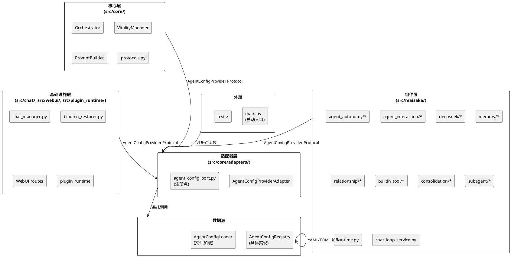
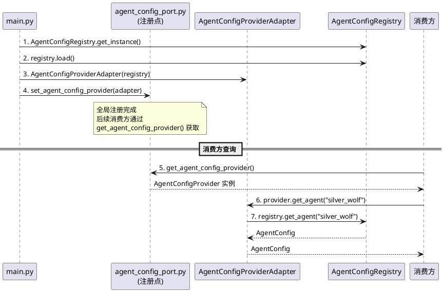

# SSD-6：智能体配置协议化 — 实现方案

# 一、需求与存量功能关系分析

## 1.1 需求功能与存量功能对比

### 1.1.1 已实现功能

| 需求功能 | 存量功能 | 代码位置 | 匹配度 |
|---------|---------|---------|--------|
| 智能体配置查询 get_agent | AgentConfigRegistry.get_agent() | `src/maisaka/agent/registry.py:64` | 100% |
| 智能体列表 list_agents | AgentConfigRegistry.list_agents() | `src/maisaka/agent/registry.py:79` | 100% |
| 默认智能体 get_default_agent | AgentConfigRegistry.get_default_agent() | `src/maisaka/agent/registry.py:85` | 100% |
| 智能体存在性检查 has_agent | AgentConfigRegistry.has_agent() | `src/maisaka/agent/registry.py:100` | 100% |
| 全量重载 reload | AgentConfigRegistry.reload() | `src/maisaka/agent/registry.py:93` | 100% |
| 单智能体重载 reload_agent | AgentConfigRegistry.reload_agent() | `src/maisaka/agent/registry.py:106` | 100% |
| 懒加载 load | AgentConfigRegistry.load() | `src/maisaka/agent/registry.py:37` | 100% |
| AgentConfig 数据模型 | Pydantic BaseModel，311 行 | `src/maisaka/agent/config.py:155` | 100% |
| 全局单例获取 | AgentConfigRegistry.get_instance() | `src/maisaka/agent/registry.py:31` | 75% |

### 1.1.2 需要扩展的功能

| 需求功能 | 存量功能 | 差异说明 | 扩展方向 |
|---------|---------|---------|---------|
| AgentConfigProvider Protocol | 不存在 | 核心层缺少接口契约，所有消费方直接依赖 AgentConfigRegistry 具体类 | 在 `src/core/protocols.py` 新增 `AgentConfigProvider` Protocol，方法签名与 AgentConfigRegistry 公共方法一一对应 |
| 注册点函数 | 不存在 | 无全局注册点管理 Provider 实例，消费方自行 `get_instance()` 或 `AgentConfigRegistry()` | 在 `src/core/adapters/agent_config_port.py` 新增 `get_agent_config_provider()`/`set_agent_config_provider()`/`reset_agent_config_provider()` |
| 适配器实现 | 不存在 | 无适配器包裹 AgentConfigRegistry，核心层和组件层直接导入具体类 | 在 `src/core/adapters/agent_config_port.py` 新增 `AgentConfigProviderAdapter`，纯委托调用 |
| ruff TID251 守卫 | 不存在 | 无 CI 层面阻止新增 `AgentConfigRegistry` 违规导入的规则 | 在 `pyproject.toml` 的 `banned-api` 中新增 `src.maisaka.agent.registry.AgentConfigRegistry` |
| AgentConfig 跨层传递 | 间接存在 | `src/core/protocols.py:20` 通过 `TYPE_CHECKING` 从 `src.core.types` 导入 AgentConfig，但 `src/core/types.py` 中无实际定义或 re-export | 在 `src/core/types.py` 新增 `from src.maisaka.agent.config import AgentConfig` re-export，使核心层可通过 `src.core.types` 引用 |

### 1.1.3 需要新增的功能或接口

#### Protocol 层

1. **AgentConfigProvider Protocol**：7 个方法（get_agent/list_agents/get_default_agent/has_agent/reload/reload_agent/load），定义在 `src/core/protocols.py`

#### 适配器层

2. **AgentConfigProviderAdapter**：纯委托适配器，包裹 `AgentConfigRegistry`，定义在 `src/core/adapters/agent_config_port.py`
3. **注册点函数**：`get_agent_config_provider()`/`set_agent_config_provider()`/`reset_agent_config_provider()`，定义在 `src/core/adapters/agent_config_port.py`

#### 启动流程

4. **启动时注册**：在 `src/main.py` 的 `_init_agent_registry()` 方法中创建适配器并注册到全局注册点

#### ruff 守卫

5. **banned-api 规则**：`src.maisaka.agent.registry.AgentConfigRegistry` → 禁止直接导入
6. **per-file-ignores 更新**：确保适配器层和 main.py 有 TID251 豁免（已有）

#### 消费方迁移

7. **49 处导入迁移**：将所有 `from src.maisaka.agent.registry import AgentConfigRegistry` 替换为通过 `AgentConfigProvider` Protocol 或注册点访问

## 1.2 存量功能详细分析

### AgentConfigRegistry（`src/maisaka/agent/registry.py`）

**接口契约**：
- `__init__(config_dir: Optional[str] = None)`：构造函数，接受可选配置目录，默认从 `global_config.agent.agents_dir` 读取
- `get_instance() -> AgentConfigRegistry`：类方法，获取全局单例
- `load() -> None`：加载所有智能体配置，支持懒加载（`get_agent`/`list_agents` 等方法内部调用 `load()` 时自动触发）
- `get_agent(agent_id: str) -> AgentConfig`：获取指定智能体，不存在时返回默认智能体，再不存在返回 `AgentConfig()`
- `list_agents() -> list[AgentConfig]`：返回所有智能体配置列表
- `get_default_agent() -> AgentConfig`：返回默认智能体，无默认时返回 `AgentConfig()`
- `has_agent(agent_id: str) -> bool`：检查智能体是否存在
- `reload() -> None`：重新加载所有配置
- `reload_agent(agent_id: str) -> bool`：重载指定智能体，不存在或失败返回 False

**业务规则**：
1. 懒加载模式：`_loaded` 标志控制，首次查询时自动加载
2. 默认智能体选择：`is_default=True` 的非管家智能体优先，无标记时取第一个非管家智能体
3. 不存在时返回默认智能体（不抛异常），无默认智能体时返回 `AgentConfig()` 空实例

**扩展点**：
- `_loader` 是 `AgentConfigLoader` 实例，可替换加载器实现
- `get_instance()` 是类方法单例，可通过子类覆盖

**约束**：
- 非线程安全（当前为同步调用，无并发问题）
- 全局单例模式，`_instance` 类属性持有唯一实例
- `get_agent()` 不存在时返回默认智能体而非 None，这是核心行为约束

### AgentRouter（`src/maisaka/agent/router.py`）

**接口契约**：
- `__init__(registry: AgentConfigRegistry)`：构造函数，直接依赖 `AgentConfigRegistry` 具体类
- `resolve_agent(session_id, group_id) -> AgentConfig`：解析会话应使用的智能体
- `bind_session(session_id, agent_id) -> None`：绑定会话到智能体
- `unbind_session(session_id, agent_id) -> None`：解除绑定
- 其他方法：`get_session_primary_agent`/`get_session_all_agents`/`bind_group`/`unbind_group` 等

**关键约束**：
- `__init__` 参数类型为 `AgentConfigRegistry`，SSD-6 需改为 `AgentConfigProvider` Protocol
- 内部调用 `self._registry.has_agent()`/`self._registry.get_agent()`/`self._registry.get_default_agent()`/`self._registry.list_agents()`，这些方法签名与 Protocol 完全一致，迁移零成本

### 消费方引用统计

| 引用方式 | 数量 | 文件分布 |
|---------|------|---------|
| `from src.maisaka.agent.registry import AgentConfigRegistry` | 49 处 | 核心层 0、agent_autonomy 17、agent_interaction 5、deepseek 5、memory 2、relationship 1、builtin_tool 1、consolidation 1、subagent 3、chat 2、webui 3、plugin_runtime 1、services 1、tools 1、main 2 |
| `AgentConfigRegistry.get_instance()` | 41 处 | 同上 |
| `AgentConfigRegistry()` 直接实例化 | 9 处 | chat_manager、binding_restorer、webui(2)、plugin_runtime、data_migration、statistics_service、main |

### AgentConfig 数据模型（`src/maisaka/agent/config.py`）

**关键属性**（SSD-6 不修改）：
- `agent_id`/`display_name`/`is_default`/`is_butler`：基础标识
- `model_config_override: Optional[dict]`：模型配置覆盖，供 `ModelConfigPort` 合并使用
- `memory_personality: MemoryPersonalityV2`：记忆性格参数，供记忆系统注册使用
- `emotion_baseline: dict[str, int]`：情绪基线
- `proactive_config: ProactiveConfig`：主动对话配置
- `internal_relationships: list[InternalRelationship]`：内部关系网
- 其他字段：详见 `src/maisaka/agent/config.py:155-311`

**跨层传递现状**：
- `src/core/protocols.py:20` 通过 `TYPE_CHECKING` 从 `src.core.types` 导入 `AgentConfig`，但 `src/core/types.py` 中无实际 re-export
- `src/core/adapters/routing_adapter.py:9` 直接从 `src.maisaka.agent.config` 导入 `AgentConfig`
- 这意味着 `AgentConfig` 作为 Protocol 返回类型需要建立正式的跨层传递路径

# 二、增量设计方案

## 2.1 实现模型

### 2.1.1 上下文视图



### 2.1.2 服务/组件总体架构

```plantuml
@startuml
skinparam componentStyle rectangle

package "Protocol 层 (src/core/protocols.py)" {
  interface AgentConfigProvider {
    +get_agent(agent_id: str) -> AgentConfig
    +list_agents() -> list[AgentConfig]
    +get_default_agent() -> AgentConfig
    +has_agent(agent_id: str) -> bool
    +reload() -> None
    +reload_agent(agent_id: str) -> bool
    +load() -> None
  }
}

package "适配器层 (src/core/adapters/agent_config_port.py)" {
  class AgentConfigProviderAdapter {
    -_registry: AgentConfigRegistry
    +__init__(registry: AgentConfigRegistry)
    +get_agent(agent_id: str) -> AgentConfig
    +list_agents() -> list[AgentConfig]
    +get_default_agent() -> AgentConfig
    +has_agent(agent_id: str) -> bool
    +reload() -> None
    +reload_agent(agent_id: str) -> bool
    +load() -> None
  }
}

package "注册点 (src/core/adapters/agent_config_port.py)" {
  function "get_agent_config_provider() -> AgentConfigProvider"
  function "set_agent_config_provider(provider) -> None"
  function "reset_agent_config_provider() -> None"
}

package "基础设施 (src/maisaka/agent/registry.py)" {
  class AgentConfigRegistry {
    -_agents: dict[str, AgentConfig]
    -_loader: AgentConfigLoader
    -_default_agent: AgentConfig | None
    -_loaded: bool
    +get_instance() -> AgentConfigRegistry
    +load() -> None
    +get_agent(agent_id: str) -> AgentConfig
    +list_agents() -> list[AgentConfig]
    +get_default_agent() -> AgentConfig
    +has_agent(agent_id: str) -> bool
    +reload() -> None
    +reload_agent(agent_id: str) -> bool
  }
}

AgentConfigProviderAdapter .up.|> AgentConfigProvider : 实现
AgentConfigProviderAdapter -down-> AgentConfigRegistry : 委托

@enduml
```

### 2.1.3 实现设计文档

#### 注册时序



#### ModelConfigPort 联动

当前 `ConfigManagerModelConfigPort` 的构造函数接受 `agent_config_resolver: Callable[[str], Optional[object]]` 回调，用于根据 agent_id 解析 AgentConfig 的 `model_config_override`。SSD-6 迁移后，main.py 中的回调实现从 `self._agent_registry.get_agent(aid)` 改为 `get_agent_config_provider().get_agent(aid)`，回调签名不变。

## 2.2 接口设计

### 2.2.1 总体设计

| 接口分类 | 接口名 | 稳定性 | 说明 |
|---------|--------|--------|------|
| Protocol | AgentConfigProvider | 稳定 | 智能体配置查询的接口契约 |
| 适配器 | AgentConfigProviderAdapter | 稳定 | AgentConfigRegistry → AgentConfigProvider 的适配器 |
| 注册点 | get/set/reset_agent_config_provider | 稳定 | 全局实例管理 |

**接口变更策略**：新增接口，不修改现有接口。迁移完成后，`AgentConfigRegistry` 的公共 API 仍保留，仅消费方不再直接引用。

### 2.2.2 接口清单

#### AgentConfigProvider Protocol

```python
@runtime_checkable
class AgentConfigProvider(Protocol):
    """智能体配置查询接口 — 核心通过此接口查询智能体配置，不直接依赖 AgentConfigRegistry。"""

    def get_agent(self, agent_id: str) -> AgentConfig:
        """获取指定智能体配置，不存在时返回默认智能体。

        Args:
            agent_id: 智能体 ID

        Returns:
            AgentConfig 实例，不存在时返回默认智能体配置
        """

    def list_agents(self) -> list[AgentConfig]:
        """列出所有智能体配置。

        Returns:
            AgentConfig 列表
        """

    def get_default_agent(self) -> AgentConfig:
        """获取默认智能体配置。

        Returns:
            AgentConfig 实例，无默认智能体时返回空 AgentConfig()
        """

    def has_agent(self, agent_id: str) -> bool:
        """检查智能体是否存在。

        Args:
            agent_id: 智能体 ID

        Returns:
            智能体是否存在
        """

    def reload(self) -> None:
        """重新加载所有智能体配置。"""

    def reload_agent(self, agent_id: str) -> bool:
        """重新加载指定智能体配置。

        Args:
            agent_id: 智能体 ID

        Returns:
            重载是否成功
        """

    def load(self) -> None:
        """加载所有智能体配置（首次调用时触发懒加载）。"""
```

**前置条件**：无（Protocol 定义无前置条件）

**后置条件**：消费方通过此接口查询智能体配置，不直接依赖 `AgentConfigRegistry`

**异常映射**：`get_agent` 不抛异常（不存在时返回默认智能体）；`reload_agent` 返回 False 表示重载失败

#### AgentConfigProviderAdapter

```python
class AgentConfigProviderAdapter:
    """AgentConfigProvider 适配器 — 委托 AgentConfigRegistry，零开销。"""

    def __init__(self, registry: AgentConfigRegistry) -> None:
        """初始化适配器。

        Args:
            registry: AgentConfigRegistry 实例
        """
```

**前置条件**：`registry` 已初始化（非 None）

**后置条件**：所有方法委托给 `registry` 的对应方法，返回值完全一致

**调用示例**：

```python
# 启动时注册
from src.maisaka.agent.registry import AgentConfigRegistry
from src.core.adapters.agent_config_port import (
    AgentConfigProviderAdapter,
    set_agent_config_provider,
)

registry = AgentConfigRegistry.get_instance()
registry.load()
set_agent_config_provider(AgentConfigProviderAdapter(registry))

# 消费方使用
from src.core.adapters.agent_config_port import get_agent_config_provider

provider = get_agent_config_provider()
agent_cfg = provider.get_agent("silver_wolf")
```

#### 注册点函数

```python
_provider: AgentConfigProvider | None = None

def get_agent_config_provider() -> AgentConfigProvider:
    """获取全局 AgentConfigProvider 实例。

    Raises:
        RuntimeError: 未注册时抛出
    """

def set_agent_config_provider(provider: AgentConfigProvider) -> None:
    """注册全局 AgentConfigProvider 实例。

    重复注册时覆盖旧实例并记录 warning 日志。
    """

def reset_agent_config_provider() -> None:
    """重置全局实例（仅用于测试）。"""
```

**前置条件**：`set_agent_config_provider` 需在启动流程中调用

**后置条件**：`get_agent_config_provider` 返回已注册实例，未注册时抛出 RuntimeError

**异常映射**：未注册 → RuntimeError("AgentConfigProvider 未注册，请先调用 set_agent_config_provider()")

## 2.3 数据模型

### 2.3.1 设计目标

1. **AgentConfig 跨层传递**：AgentConfig 作为 Protocol 返回类型，需在核心层可引用
2. **不修改 AgentConfig**：保持现有数据模型结构不变
3. **与现有 re-export 模式一致**：类似 `src/core/types.py` 对 `MemorySearchResult` 等类型的 re-export

### 2.3.2 模型实现

#### AgentConfig 跨层传递路径

```plantuml
@startuml
skinparam componentStyle rectangle

rectangle "定义层\n(src/maisaka/agent/config.py)" as def_layer {
  class AgentConfig {
    agent_id: str
    display_name: str
    is_default: bool
    is_butler: bool
    model_config_override: Optional[dict]
    memory_personality: MemoryPersonalityV2
    emotion_baseline: dict[str, int]
    ...
  }
}

rectangle "Re-export 层\n(src/core/types.py)" as reexport {
  note "from src.maisaka.agent.config import AgentConfig  # noqa: F401"
}

rectangle "消费层\n(src/core/protocols.py)" as consumer {
  note "TYPE_CHECKING:\n  from src.core.types import AgentConfig"
}

def_layer -up-> reexport : import
reexport -up-> consumer : TYPE_CHECKING import

@enduml
```

**关键决策**：AgentConfig 真实定义在 `src/maisaka/agent/config.py`，通过 `src/core/types.py` re-export 供核心层 TYPE_CHECKING 使用。这与 MemorySearchResult 等类型从 `src/common/memory_types.py` re-export 到 `src/core/types.py` 的模式一致。

**注意**：`src/maisaka/agent/config.py` 中的 `AgentConfig` 不是"实现细节"，而是 Protocol 的返回类型，属于接口契约的一部分。消费方导入 `AgentConfig` 是合法的（导入数据模型不等于导入具体实现类）。

## 2.4 迁移策略

### 2.4.1 迁移批次计划

#### 批次 1：Protocol + 适配器 + 注册点（基础设施）

**目标**：建立 AgentConfigProvider Protocol 和适配器，注册到全局注册点

| 任务 | 文件 | 变更内容 |
|------|------|---------|
| T1.1 | `src/core/protocols.py` | 新增 `AgentConfigProvider` Protocol（7 个方法） |
| T1.2 | `src/core/types.py` | 新增 `from src.maisaka.agent.config import AgentConfig` re-export |
| T1.3 | `src/core/adapters/agent_config_port.py` | 新建文件：`AgentConfigProviderAdapter` + 3 个注册点函数 |
| T1.4 | `src/core/adapters/__init__.py` | 导出 `get_agent_config_provider`/`reset_agent_config_provider` |
| T1.5 | `src/main.py` | `_init_agent_registry()` 中创建适配器并注册 |

**验证**：启动后调用 `get_agent_config_provider().get_agent("silver_wolf")` 返回正确结果

#### 批次 2：核心自主性层迁移

**目标**：`src/maisaka/agent_autonomy/` 下所有消费者迁移到 `AgentConfigProvider`

| 任务 | 文件 | 当前引用方式 | 迁移方式 |
|------|------|-------------|---------|
| T2.1 | `orchestrator.py` | 函数内延迟导入 `AgentConfigRegistry.get_instance()` | 改用 `get_agent_config_provider()` |
| T2.2 | `vitality_manager.py` | 函数内延迟导入 `AgentConfigRegistry.get_instance()` | 改用 `get_agent_config_provider()` |
| T2.3 | `prompt_builder.py` | 函数内延迟导入 `AgentConfigRegistry.get_instance()` | 改用 `get_agent_config_provider()` |
| T2.4 | `expression_organ.py` | 函数内延迟导入 `AgentConfigRegistry.get_instance()` | 改用 `get_agent_config_provider()` |
| T2.5 | `butler.py` | 模块级导入 `AgentConfigRegistry` + `get_instance()` | 改用 `get_agent_config_provider()` |
| T2.6 | `behavior_intent.py` | 函数内延迟导入 `AgentConfigRegistry.get_instance()` | 改用 `get_agent_config_provider()` |
| T2.7 | `ambient_awareness.py` | 函数内延迟导入 `AgentConfigRegistry.get_instance()` | 改用 `get_agent_config_provider()` |
| T2.8 | `agent.py` | 函数内延迟导入 `AgentConfigRegistry.get_instance()` | 改用 `get_agent_config_provider()` |
| T2.9 | `session_recovery.py` | 函数内延迟导入 `AgentConfigRegistry.get_instance()` | 改用 `get_agent_config_provider()` |
| T2.10 | `state_awareness/summary_generator.py` | 函数内延迟导入 `AgentConfigRegistry.get_instance()` | 改用 `get_agent_config_provider()` |

**迁移模式**：所有函数内延迟导入统一改为 `from src.core.adapters.agent_config_port import get_agent_config_provider`，然后 `registry = get_agent_config_provider()`

#### 批次 3：组件层-交互迁移

**目标**：`src/maisaka/agent_interaction/` 和 `src/maisaka/builtin_tool/` 下消费者迁移

| 任务 | 文件 | 当前引用方式 | 迁移方式 |
|------|------|-------------|---------|
| T3.1 | `agent_interaction/trigger_scheduler.py` | 构造函数 `AgentConfigRegistry.get_instance()` → `self._config_registry` | 构造注入 `AgentConfigProvider`，或改用 `get_agent_config_provider()` |
| T3.2 | `agent_interaction/scheduler.py` | 构造函数 `AgentConfigRegistry.get_instance()` → `self._config_registry` | 构造注入 `AgentConfigProvider`，或改用 `get_agent_config_provider()` |
| T3.3 | `agent_interaction/relationship_manager.py` | 构造函数 `AgentConfigRegistry.get_instance()` → `self._registry` | 构造注入 `AgentConfigProvider`，或改用 `get_agent_config_provider()` |
| T3.4 | `agent_interaction/monologue_engine.py` | 构造函数 `AgentConfigRegistry.get_instance()` → `self._config_registry` | 构造注入 `AgentConfigProvider`，或改用 `get_agent_config_provider()` |
| T3.5 | `agent_interaction/emotion_registry.py` | 构造函数 `AgentConfigRegistry.get_instance()` → `self._registry` | 构造注入 `AgentConfigProvider`，或改用 `get_agent_config_provider()` |
| T3.6 | `builtin_tool/butler.py` | 函数内延迟导入 `AgentConfigRegistry.get_instance()` | 改用 `get_agent_config_provider()` |

**迁移模式**：构造函数中 `self._config_registry = AgentConfigRegistry.get_instance()` 改为 `self._config_registry = get_agent_config_provider()`，字段类型注解从 `AgentConfigRegistry` 改为 `AgentConfigProvider`

#### 批次 4：组件层-优化器迁移

**目标**：`src/maisaka/deepseek/` 和 `src/maisaka/consolidation/` 下消费者迁移

| 任务 | 文件 | 当前引用方式 | 迁移方式 |
|------|------|-------------|---------|
| T4.1 | `deepseek/optimizer.py` | 3 处函数内延迟导入 `AgentConfigRegistry.get_instance()` | 改用 `get_agent_config_provider()` |
| T4.2 | `deepseek/prefix_cache.py` | 函数内延迟导入 `AgentConfigRegistry.get_instance()` | 改用 `get_agent_config_provider()` |
| T4.3 | `deepseek/model_scheduler.py` | 函数内延迟导入 `AgentConfigRegistry.get_instance()` | 改用 `get_agent_config_provider()` |
| T4.4 | `deepseek/budget.py` | 函数内延迟导入 `AgentConfigRegistry.get_instance()` | 改用 `get_agent_config_provider()` |
| T4.5 | `deepseek/batch_scheduler.py` | 函数内延迟导入 `AgentConfigRegistry.get_instance()` | 改用 `get_agent_config_provider()` |
| T4.6 | `consolidation/scheduler.py` | 函数内延迟导入 `AgentConfigRegistry.get_instance()` | 改用 `get_agent_config_provider()` |

#### 批次 5：组件层-其他迁移

**目标**：`src/maisaka/` 下剩余消费者迁移

| 任务 | 文件 | 当前引用方式 | 迁移方式 |
|------|------|-------------|---------|
| T5.1 | `memory/heuristic_injector.py` | 函数内延迟导入 `AgentConfigRegistry.get_instance()` | 改用 `get_agent_config_provider()` |
| T5.2 | `memory/person_profile.py` | 函数内延迟导入 `AgentConfigRegistry.get_instance()` | 改用 `get_agent_config_provider()` |
| T5.3 | `relationship/manager.py` | 函数内延迟导入 `AgentConfigRegistry.get_instance()` | 改用 `get_agent_config_provider()` |
| T5.4 | `subagent/fork_context.py` | 3 处函数内延迟导入 `AgentConfigRegistry.get_instance()` | 改用 `get_agent_config_provider()` |
| T5.5 | `runtime.py` | 2 处函数内延迟导入 `AgentConfigRegistry.get_instance()` | 改用 `get_agent_config_provider()` |
| T5.6 | `chat_loop_service.py` | 2 处函数内延迟导入 `AgentConfigRegistry.get_instance()` | 改用 `get_agent_config_provider()` |

#### 批次 6：基础设施层迁移 + AgentRouter 解耦 + ruff 守卫

**目标**：`src/chat/`、`src/webui/`、`src/plugin_runtime/`、`src/services/`、`src/tools/` 迁移，AgentRouter 解耦，ruff 守卫上线

| 任务 | 文件 | 当前引用方式 | 迁移方式 |
|------|------|-------------|---------|
| T6.1 | `chat/message_receive/chat_manager.py` | `AgentConfigRegistry()` 直接实例化 | 改用 `get_agent_config_provider()` |
| T6.2 | `chat/message_receive/binding_restorer.py` | `AgentConfigRegistry()` 直接实例化 | 改用 `get_agent_config_provider()` |
| T6.3 | `webui/routers/agent.py` | 模块级导入 + `get_instance()` + `AgentConfigRegistry()` | 改用 `get_agent_config_provider()` |
| T6.4 | `webui/routers/deepseek.py` | `AgentConfigRegistry()` 直接实例化 | 改用 `get_agent_config_provider()` |
| T6.5 | `webui/routers/chat/routes.py` | `AgentConfigRegistry()` 直接实例化 | 改用 `get_agent_config_provider()` |
| T6.6 | `plugin_runtime/capabilities/core.py` | 函数内 `AgentConfigRegistry()` 直接实例化 | 改用 `get_agent_config_provider()` |
| T6.7 | `services/statistics_service.py` | `AgentConfigRegistry()` 直接实例化 | 改用 `get_agent_config_provider()` |
| T6.8 | `tools/data_migration.py` | `AgentConfigRegistry()` 直接实例化 | 改用 `get_agent_config_provider()` |
| T6.9 | `maisaka/agent/router.py` | `__init__(registry: AgentConfigRegistry)` | 改为 `__init__(registry: AgentConfigProvider)`，删除 `from .registry import AgentConfigRegistry` |
| T6.10 | `pyproject.toml` | 无 `AgentConfigRegistry` banned-api | 新增 `"src.maisaka.agent.registry.AgentConfigRegistry"` 到 banned-api |
| T6.11 | `src/main.py` | `_init_session_submodules()` 中 `AgentRouter(AgentConfigRegistry())` | 改为 `AgentRouter(get_agent_config_provider())` |

**AgentRouter 解耦细节**：
- `router.py` 的 `__init__` 参数类型从 `AgentConfigRegistry` 改为 `AgentConfigProvider`
- 内部 `self._registry.has_agent()`/`self._registry.get_agent()`/`self._registry.get_default_agent()`/`self._registry.list_agents()` 调用不变（方法签名一致）
- 删除 `from .registry import AgentConfigRegistry`，新增 `from src.core.protocols import AgentConfigProvider`（TYPE_CHECKING）
- `routing_adapter.py` 中 `AgentRouter` 的构造注入不变（已通过适配器层）

#### 批次 7：测试层迁移 + 全量验证

**目标**：`tests/` 下消费者迁移，全量验证零违规

| 任务 | 文件 | 当前引用方式 | 迁移方式 |
|------|------|-------------|---------|
| T7.1 | `tests/test_t093_m3_e2e.py` | 6 处 `AgentConfigRegistry()` 直接实例化 | 改用 `AgentConfigProviderAdapter(AgentConfigRegistry(...))` 或直接用 `AgentConfigProvider` mock |
| T7.2 | `tests/test_t092_stress.py` | 10 处 `AgentConfigRegistry()` 直接实例化 | 同上 |
| T7.3 | 全量验证 | — | 运行 `rg "from src.maisaka.agent.registry import AgentConfigRegistry" src/` → 仅剩适配器层和 main.py |
| T7.4 | 全量验证 | — | 运行 `rg "AgentConfigRegistry.get_instance()" src/` → 零结果 |
| T7.5 | 全量验证 | — | 运行 `rg "AgentConfigRegistry()" src/` → 仅剩适配器层和 main.py |
| T7.6 | 全量验证 | — | 运行 `ruff check src/` → 零 TID251 违规 |

### 2.4.2 迁移模式总结

**模式 A：函数内延迟导入替换**（最常见，~30 处）

```python
# 迁移前
def some_method(self):
    from src.maisaka.agent.registry import AgentConfigRegistry
    registry = AgentConfigRegistry.get_instance()
    agent_cfg = registry.get_agent(agent_id)

# 迁移后
def some_method(self):
    from src.core.adapters.agent_config_port import get_agent_config_provider
    provider = get_agent_config_provider()
    agent_cfg = provider.get_agent(agent_id)
```

**模式 B：构造函数注入替换**（~5 处）

```python
# 迁移前
class SomeClass:
    def __init__(self):
        self._registry = AgentConfigRegistry.get_instance()

# 迁移后
class SomeClass:
    def __init__(self):
        from src.core.adapters.agent_config_port import get_agent_config_provider
        self._registry = get_agent_config_provider()
```

**模式 C：直接实例化替换**（~9 处）

```python
# 迁移前
registry = AgentConfigRegistry()

# 迁移后
from src.core.adapters.agent_config_port import get_agent_config_provider
registry = get_agent_config_provider()
```

**模式 D：AgentRouter 解耦**（1 处）

```python
# 迁移前
class AgentRouter:
    def __init__(self, registry: AgentConfigRegistry) -> None:

# 迁移后
from src.core.protocols import AgentConfigProvider

class AgentRouter:
    def __init__(self, registry: AgentConfigProvider) -> None:
```

## 2.5 ruff 守卫规则设计

### 2.5.1 banned-api 新增

在 `pyproject.toml` 的 `[tool.ruff.lint.flake8-tidy-imports.banned-api]` 中新增：

```toml
"src.maisaka.agent.registry.AgentConfigRegistry" = {msg = "禁止直接导入 AgentConfigRegistry，请使用 AgentConfigProvider Protocol 接口（get_agent_config_provider()）"}
```

### 2.5.2 per-file-ignores 审查

当前 `per-file-ignores` 中已有以下 TID251 豁免：
- `src/core/adapters/*` → TID251 豁免（适配器层需要导入具体类）
- `src/main.py` → TID251 豁免（启动入口需要导入具体类）

SSD-6 无需新增 per-file-ignores，上述豁免已覆盖：
- `src/core/adapters/agent_config_port.py` → 适配器层，已有豁免
- `src/main.py` → 启动入口，已有豁免

### 2.5.3 守卫生效时序

- **批次 1-5**：不启用守卫（迁移进行中，存量违规会被 ruff 报错但不阻塞开发）
- **批次 6**：T6.10 新增 banned-api 规则，此时除适配器层和 main.py 外应已零违规
- **批次 7**：全量验证，确认 ruff check 零 TID251 违规

## 2.6 风险评估与回滚方案

### 2.6.1 风险评估

| 风险 | 概率 | 影响 | 缓解措施 |
|------|------|------|---------|
| 注册时序错误：消费方在 `set_agent_config_provider()` 之前调用 `get_agent_config_provider()` | 低 | 高（启动失败） | RuntimeError 明确报错 + 启动流程中 `_init_agent_registry()` 在所有消费方之前执行 |
| AgentRouter 解耦导致路由功能异常 | 低 | 高（智能体绑定失效） | AgentRouter 内部调用不变（方法签名一致），仅类型注解从具体类改为 Protocol |
| 迁移遗漏导致运行时 ImportError | 中 | 中（功能缺失） | ruff TID251 守卫 + 批次验证 `rg` 命令 |
| 循环依赖：agent_config_port.py 导入消费方模块 | 极低 | 高（启动失败） | agent_config_port.py 仅导入 `AgentConfigRegistry`（maisaka/agent/registry.py），不导入任何消费方模块 |
| WebUI 路由中 `AgentConfigRegistry()` 直接实例化导致配置不一致 | 中 | 中（WebUI 显示过时配置） | 迁移后统一通过 `get_agent_config_provider()` 获取同一实例 |

### 2.6.2 回滚方案

**回滚条件**：迁移后出现无法快速修复的启动失败或功能异常

**回滚步骤**：
1. 删除 `src/core/adapters/agent_config_port.py`
2. 撤销 `src/core/protocols.py` 中 `AgentConfigProvider` 定义
3. 撤销 `src/core/types.py` 中 `AgentConfig` re-export
4. 撤销 `src/main.py` 中注册点调用
5. 撤销 `pyproject.toml` 中 banned-api 规则
6. 撤销所有消费方迁移（git revert）

**回滚成本**：中等（涉及 ~30 个文件的导入回退），但每个批次的变更是独立的，可按批次回滚

**渐进回滚**：如果仅某个批次出问题，可只回滚该批次的变更，不影响已完成的其他批次。因为适配器层是纯委托，即使消费方仍直接导入 `AgentConfigRegistry`，系统仍能正常工作（只是架构债务未消除）。