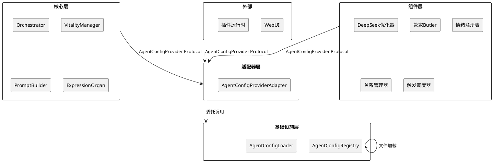
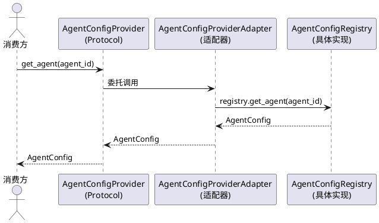
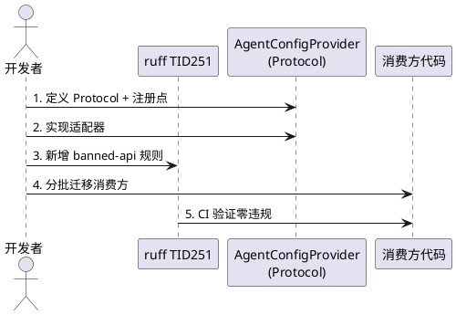
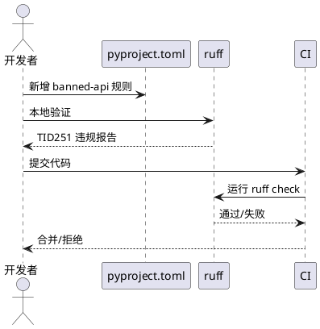

# SSD-6：智能体配置协议化

## 1. 组件定位

### 1.1 核心职责

本组件负责将智能体配置查询从 `AgentConfigRegistry` 具体实现类解耦为 Protocol 接口，使核心层和组件层通过接口契约访问智能体配置，不再直接依赖全局单例。

### 1.2 核心输入

1. **核心层/组件层的智能体配置查询请求**：通过 `AgentConfigProvider` Protocol 发起的 `get_agent`、`list_agents`、`has_agent` 等查询
2. **启动流程的配置加载信号**：`StartupOrchestrator` 阶段触发智能体配置加载
3. **运行时的配置热重载请求**：WebUI 或管理接口触发的 `reload`/`reload_agent` 操作

### 1.3 核心输出

1. **AgentConfig 数据对象**：查询请求返回的智能体配置实例
2. **智能体列表**：`list_agents()` 返回的所有已注册智能体配置
3. **配置变更通知**：重载后通过回调机制通知消费方

### 1.4 职责边界

本组件**不负责**：

1. **智能体路由逻辑**：会话→智能体的绑定/解析仍由 `AgentRoutingService` 负责
2. **智能体配置文件格式**：YAML/TOML 解析仍由 `AgentConfigLoader` 负责
3. **智能体运行时生命周期**：创建/销毁/思考仍由 `ThinkingOrgan`/`ChatRuntime` 负责
4. **模型配置查询**：模型级配置仍由 `ModelConfigPort` 负责（但 `AgentConfigProvider` 需提供 `model_config_override` 数据供 `ModelConfigPort` 合并）
5. **记忆性格注册**：`MemoryServicePort.set_memory_personality()` 仍由记忆系统负责（但 `AgentConfigProvider` 需提供 `memory_personality` 数据供调用方传递）

## 2. 领域术语

**AgentConfigProvider**
: 智能体配置查询的 Protocol 接口，定义核心层和组件层访问智能体配置的契约。核心只依赖此接口，不依赖 `AgentConfigRegistry` 具体类。

**AgentConfigRegistry**
: 智能体配置注册表的具体实现类，管理所有已加载的智能体配置。当前为全局单例模式，SSD-6 后将被 `AgentConfigProvider` 适配器包裹，消费方不再直接引用。

**AgentConfig**
: 智能体配置数据模型（Pydantic BaseModel），包含人格、情绪、关系、记忆性格等所有智能体级参数。此数据模型不属于"实现细节"，是 Protocol 接口的返回类型，可跨层传递。

**AgentRouter**
: 智能体路由层，管理会话与智能体的绑定关系。当前构造函数直接依赖 `AgentConfigRegistry`，SSD-6 后应依赖 `AgentConfigProvider` Protocol。

**ruff TID251 守卫**
: ruff 的 flake8-tidy-imports 规则，用于在 CI 层面禁止特定模块的直接导入。SSD-6 需新增 `src.maisaka.agent.registry.AgentConfigRegistry` 到 banned-api 列表。

## 3. 角色与边界

### 3.1 核心角色

- **核心层消费者**（Orchestrator/VitalityManager/PromptBuilder 等）：通过 `AgentConfigProvider` Protocol 查询智能体配置，不再直接导入 `AgentConfigRegistry`
- **组件层消费者**（DeepSeek 优化器/管家/情绪注册表/关系管理器等）：同样通过 `AgentConfigProvider` Protocol 查询，不再直接导入 `AgentConfigRegistry`
- **WebUI 管理员**：通过 WebUI 路由查看/重载智能体配置，走 `AgentConfigProvider` 的重载接口
- **插件运行时**：通过 `AgentConfigProvider` 查询智能体信息，不直接依赖 maisaka 内部模块

### 3.2 外部系统

- **AgentConfigLoader**：智能体配置文件加载器，`AgentConfigRegistry` 的内部依赖，SSD-6 不改动
- **ConfigManager**：全局配置管理器，提供 `agents_dir` 路径，SSD-6 不改动
- **StartupOrchestrator**：启动编排器，在 `CORE_SERVICES` 阶段触发智能体配置加载

### 3.3 交互上下文

## 4. DFX约束

### 4.1 性能

1. **查询响应时间**：`get_agent()`/`list_agents()` 等查询操作为纯内存读取，适配器层零开销，响应时间 ≤1ms
2. **启动加载时间**：配置加载时间不变，适配器层不引入额外延迟
3. **热重载时间**：`reload()` 操作时间不变，适配器层仅委托调用

### 4.2 可靠性

1. **查询失败处理**：`get_agent(agent_id)` 在智能体不存在时返回默认智能体（与现有行为一致），不抛异常
2. **单例一致性**：全局只存在一个 `AgentConfigProvider` 实例（通过注册点管理），避免多实例导致配置不一致
3. **降级策略**：如果 `AgentConfigProvider` 未注册，查询时必须立即报错（RuntimeError），不用空配置兜底

### 4.3 安全性

1. **接口隔离**：`AgentConfigProvider` Protocol 只暴露查询和重载方法，不暴露 `_agents` 内部字典等可变状态
2. **ruff 守卫**：新增 `src.maisaka.agent.registry.AgentConfigRegistry` 到 banned-api 列表，CI 层面阻止新增违规导入

### 4.4 可维护性

1. **注册点模式**：与 `MemoryServicePort`/`ModelConfigPort` 一致，使用 `get_agent_config_provider()`/`reset_agent_config_provider()` 注册点管理
2. **日志规范**：适配器层使用 `core.adapters.agent_config_port` 命名空间的 logger
3. **迁移可追踪**：每批次迁移后通过 `rg "AgentConfigRegistry" src/` 验证剩余引用数

### 4.5 兼容性

1. **接口签名不变**：`AgentConfigProvider` 的方法签名与 `AgentConfigRegistry` 的公共方法一一对应，消费方迁移只需改导入路径和实例获取方式
2. **AgentConfig 数据模型不变**：返回的 `AgentConfig` 对象与现有完全一致，无需消费方修改
3. **渐进式迁移**：适配器先包裹现有 `AgentConfigRegistry`，不改变其内部实现，迁移完成后可考虑退役单例模式

## 5. 核心能力

### 5.1 智能体配置查询

#### 5.1.1 业务规则

1. **Protocol 定义规则**：`AgentConfigProvider` Protocol 必须定义以下方法，与 `AgentConfigRegistry` 的公共方法一一对应：
   - `get_agent(agent_id: str) -> AgentConfig`：获取指定智能体配置，不存在时返回默认智能体
   - `list_agents() -> list[AgentConfig]`：列出所有智能体配置
   - `get_default_agent() -> AgentConfig`：获取默认智能体配置
   - `has_agent(agent_id: str) -> bool`：检查智能体是否存在
   - `reload() -> None`：重新加载所有智能体配置
   - `reload_agent(agent_id: str) -> bool`：重新加载指定智能体配置
   - `load() -> None`：加载所有智能体配置（首次调用时触发懒加载）
   a. 验收条件：[核心层调用 `provider.get_agent("silver_wolf")`] → [返回对应的 AgentConfig 实例，类型和字段与现有完全一致]
   b. 验收条件：[核心层调用 `provider.get_agent("nonexistent")`] → [返回默认智能体配置，与现有 AgentConfigRegistry 行为一致]
   c. 验收条件：[核心层调用 `provider.has_agent("silver_wolf")`] → [返回 True]
   d. 验收条件：[核心层调用 `provider.list_agents()`] → [返回所有已注册智能体配置列表]

2. **注册点规则**：必须提供全局注册点函数，与 `MemoryServicePort`/`ModelConfigPort` 模式一致：
   - `get_agent_config_provider() -> AgentConfigProvider`：获取全局实例，未注册时抛出 RuntimeError
   - `set_agent_config_provider(provider: AgentConfigProvider) -> None`：注册全局实例
   - `reset_agent_config_provider() -> None`：重置全局实例（仅用于测试）
   a. 验收条件：[未注册时调用 `get_agent_config_provider()`] → [抛出 RuntimeError，提示"AgentConfigProvider 未注册"]
   b. 验收条件：[注册后调用 `get_agent_config_provider()`] → [返回已注册的实例]
   c. 验收条件：[测试中调用 `reset_agent_config_provider()`] → [全局实例被清除，后续查询抛出 RuntimeError]

3. **适配器实现规则**：`AgentConfigProviderAdapter` 必须包裹现有 `AgentConfigRegistry`，所有方法委托调用：
   - 构造函数接受 `AgentConfigRegistry` 实例
   - 每个方法直接委托给 `AgentConfigRegistry` 的对应方法
   - 不引入额外的缓存、转换或延迟加载逻辑
   a. 验收条件：[适配器的 `get_agent()` 返回值] → [与直接调用 `AgentConfigRegistry.get_instance().get_agent()` 完全一致]

4. **禁止项**：`AgentConfigProvider` Protocol 禁止暴露以下内部实现细节：
   - `_agents` 内部字典
   - `_loader` 配置加载器
   - `_loaded` 加载状态标志
   - `_default_agent` 默认智能体缓存
   a. 验收条件：[审查 Protocol 定义] → [不包含上述任何私有属性或方法]

#### 5.1.2 交互流程

#### 5.1.3 异常场景

1. **Provider 未注册**
   a. 触发条件：消费方调用 `get_agent_config_provider()` 但尚未注册
   b. 系统行为：抛出 RuntimeError，消息为 "AgentConfigProvider 未注册，请先调用 set_agent_config_provider()"
   c. 用户感知：启动失败，日志中显示明确的注册时序错误

2. **智能体不存在**
   a. 触发条件：调用 `get_agent(agent_id)` 传入不存在的 agent_id
   b. 系统行为：返回默认智能体配置（与现有行为一致），同时记录 warning 日志
   c. 用户感知：无异常，使用默认智能体配置

3. **配置加载失败**
   a. 触发条件：`load()` 或 `reload()` 时配置文件不存在或格式错误
   b. 系统行为：`AgentConfigLoader` 抛出异常，适配器层不捕获，向上传播
   c. 用户感知：启动失败或重载失败，日志中显示配置文件错误详情

4. **重载单个智能体失败**
   a. 触发条件：`reload_agent(agent_id)` 时智能体不存在或配置文件错误
   b. 系统行为：返回 False（与现有行为一致），记录 warning 日志
   c. 用户感知：重载失败，该智能体保持旧配置

### 5.2 消费方迁移

#### 5.2.1 业务规则

1. **迁移优先级规则**：按对核心架构的影响程度分批迁移，优先迁移核心层消费者：
   - **批次1（核心层）**：`src/core/` 下的所有消费者（当前仅 `protocols.py` 的 TYPE_CHECKING 导入）
   - **批次2（核心自主性层）**：`src/maisaka/agent_autonomy/` 下的消费者（orchestrator/vitality_manager/prompt_builder/expression_organ/butler/behavior_intent/ambient_awareness/agent/session_recovery）
   - **批次3（组件层-交互）**：`src/maisaka/agent_interaction/` 和 `src/maisaka/builtin_tool/` 下的消费者
   - **批次4（组件层-优化器）**：`src/maisaka/deepseek/` 和 `src/maisaka/consolidation/` 下的消费者
   - **批次5（组件层-其他）**：`src/maisaka/memory/`、`src/maisaka/relationship/`、`src/maisaka/subagent/`、`src/maisaka/runtime.py`、`src/maisaka/chat_loop_service.py`
   - **批次6（基础设施层）**：`src/chat/`、`src/main.py`、`src/services/`、`src/plugin_runtime/`、`src/webui/`、`src/tools/`
   - **批次7（测试层）**：`tests/` 下的消费者
   a. 验收条件：[每批次迁移完成后运行 `rg "from src.maisaka.agent.registry import AgentConfigRegistry" src/`] → [该批次对应的文件不再出现在结果中]

2. **迁移模式规则**：所有消费方必须按统一模式迁移：
   - **构造注入优先**：如果消费方已有构造函数，在构造函数中接受 `AgentConfigProvider` 参数
   - **注册点兜底**：如果消费方无法构造注入（如模块级函数），使用 `get_agent_config_provider()` 获取实例
   - **禁止延迟导入**：迁移后不再出现 `from src.maisaka.agent.registry import AgentConfigRegistry` 的函数内延迟导入
   a. 验收条件：[审查迁移后的代码] → [不再存在 `from src.maisaka.agent.registry import` 导入语句]
   b. 验收条件：[审查迁移后的代码] → [不再存在 `AgentConfigRegistry.get_instance()` 调用]
   c. 验收条件：[审查迁移后的代码] → [不再存在 `AgentConfigRegistry()` 直接实例化]

3. **AgentRouter 解耦规则**：`AgentRouter` 当前构造函数直接依赖 `AgentConfigRegistry`，必须迁移为依赖 `AgentConfigProvider`：
   - 构造函数参数类型从 `AgentConfigRegistry` 改为 `AgentConfigProvider`
   - 内部所有 `self._registry.xxx()` 调用不变（方法签名一致）
   a. 验收条件：[审查 `AgentRouter.__init__` 签名] → [参数类型为 `AgentConfigProvider` Protocol]
   b. 验收条件：[审查 `routing_adapter.py`] → [不再导入 `AgentConfigRegistry`]

4. **禁止项**：迁移过程中禁止以下行为：
   - 禁止在核心层（`src/core/`）导入 `AgentConfigRegistry`（ruff TID251 守卫阻止）
   - 禁止在适配器层（`src/core/adapters/`）以外的任何地方导入 `AgentConfigRegistry`
   - 禁止修改 `AgentConfig` 数据模型的结构或字段（迁移是纯粹的依赖替换）
   a. 验收条件：[运行 ruff check] → [核心层和组件层不再有 `AgentConfigRegistry` 导入违规]

#### 5.2.2 交互流程

#### 5.2.3 异常场景

1. **迁移遗漏**
   a. 触发条件：某文件遗漏迁移，仍直接导入 `AgentConfigRegistry`
   b. 系统行为：ruff TID251 守卫在 CI 中报错
   c. 用户感知：CI 不通过，错误信息指向具体文件和行号

2. **循环依赖**
   a. 触发条件：`AgentConfigProvider` 的注册点模块导入了消费方模块
   b. 系统行为：Python 启动时 ImportError
   c. 用户感知：启动失败，日志中显示循环导入链

3. **注册时序错误**
   a. 触发条件：消费方在 `set_agent_config_provider()` 之前调用 `get_agent_config_provider()`
   b. 系统行为：抛出 RuntimeError
   c. 用户感知：启动失败，日志中显示明确的注册时序错误

### 5.3 ruff 守卫与验证

#### 5.3.1 业务规则

1. **banned-api 规则**：在 `pyproject.toml` 的 `[tool.ruff.lint.flake8-tidy-imports.banned-api]` 中新增：
   - `"src.maisaka.agent.registry.AgentConfigRegistry"` → 禁止直接导入，提示使用 `AgentConfigProvider` Protocol 接口
   a. 验收条件：[在核心层文件中添加 `from src.maisaka.agent.registry import AgentConfigRegistry`] → [ruff check 报 TID251 错误]

2. **per-file-ignores 规则**：以下文件允许导入 `AgentConfigRegistry`（适配器层和启动入口）：
   - `src/core/adapters/*`：已有 TID251 豁免
   - `src/main.py`：已有 TID251 豁免（启动时创建适配器需要导入具体类）
   a. 验收条件：[审查 per-file-ignores 配置] → [仅适配器层和启动入口有 TID251 豁免]

3. **迁移完成验证规则**：全部迁移完成后，运行以下验证：
   - `rg "from src.maisaka.agent.registry import AgentConfigRegistry" src/` → 仅剩适配器层和 main.py
   - `rg "AgentConfigRegistry.get_instance()" src/` → 零结果
   - `rg "AgentConfigRegistry()" src/` → 仅剩适配器层和 main.py
   - `ruff check src/` → 零 TID251 违规
   a. 验收条件：[运行上述 4 条命令] → [结果符合预期，核心层和组件层零违规]

#### 5.3.2 交互流程

#### 5.3.3 异常场景

1. **banned-api 误杀**
   a. 触发条件：banned-api 规则过于宽泛，阻止了合法的适配器层导入
   b. 系统行为：ruff 误报 TID251 错误
   c. 用户感知：CI 误报失败，需调整 per-file-ignores 或细化 banned-api 规则

2. **存量违规未清理**
   a. 触发条件：迁移批次中遗漏了某些文件，ruff 报错但被 per-file-ignores 豁免
   b. 系统行为：存量违规被豁免掩盖
   c. 用户感知：需审查 per-file-ignores 列表，确保不新增不必要的豁免

## 6. 数据约束

### 6.1 AgentConfigProvider（Protocol 接口）

1. **get_agent**：接受 agent_id 字符串，返回 AgentConfig 实例。不存在时返回默认智能体，不返回 None
2. **list_agents**：无参数，返回 list[AgentConfig]。列表可能为空（无配置加载时）
3. **get_default_agent**：无参数，返回 AgentConfig 实例。无默认智能体时返回空 AgentConfig()
4. **has_agent**：接受 agent_id 字符串，返回 bool
5. **reload**：无参数，无返回值。重新加载所有配置
6. **reload_agent**：接受 agent_id 字符串，返回 bool。重载成功返回 True，失败返回 False
7. **load**：无参数，无返回值。首次加载配置（支持懒加载模式）

### 6.2 AgentConfig（数据模型，SSD-6 不修改）

1. **agent_id**：智能体唯一标识，字符串，默认 "silver_wolf"
2. **display_name**：显示名称，字符串，默认 "银狼"
3. **is_default**：是否为默认智能体，布尔值
4. **is_butler**：是否为管家智能体，布尔值
5. **model_config_override**：模型配置覆盖，Optional[dict]，供 ModelConfigPort 合并使用
6. **memory_personality**：记忆性格参数，MemoryPersonalityV2 实例，供记忆系统注册使用
7. **emotion_baseline**：情绪基线，dict[str, int]
8. **proactive_config**：主动对话配置，ProactiveConfig 实例
9. **internal_relationships**：内部关系网，list[InternalRelationship]
10. **其他字段**：详见 `src/maisaka/agent/config.py`，SSD-6 不做任何修改

### 6.3 注册点函数

1. **get_agent_config_provider**：无参数，返回 AgentConfigProvider 实例。未注册时抛出 RuntimeError
2. **set_agent_config_provider**：接受 AgentConfigProvider 参数，无返回值。重复注册时覆盖旧实例并记录 warning 日志
3. **reset_agent_config_provider**：无参数，无返回值。清除已注册实例（仅用于测试）

## 附录：不在范围内的事项

1. **AgentConfig 数据模型重构**：不修改 `AgentConfig` 的字段、类型或结构
2. **AgentConfigLoader 重构**：不修改配置文件加载逻辑
3. **AgentConfigRegistry 单例模式退役**：本期仅用适配器包裹，不改变其内部实现；单例退役可作为后续优化
4. **AgentConfigProvider 异步化**：当前所有查询为纯内存同步操作，无需异步
5. **WebUI 智能体管理功能增强**：仅迁移现有 WebUI 路由的依赖，不新增功能
6. **智能体动态注册/注销**：当前所有智能体在启动时加载，运行时不支持动态增删
7. **AgentConfig 不可变化**：当前 AgentConfig 是 Pydantic BaseModel，可变性由消费方自行保证；本期不引入 frozen 模式