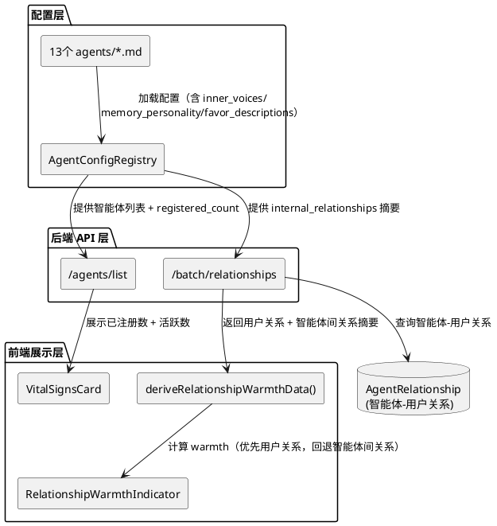
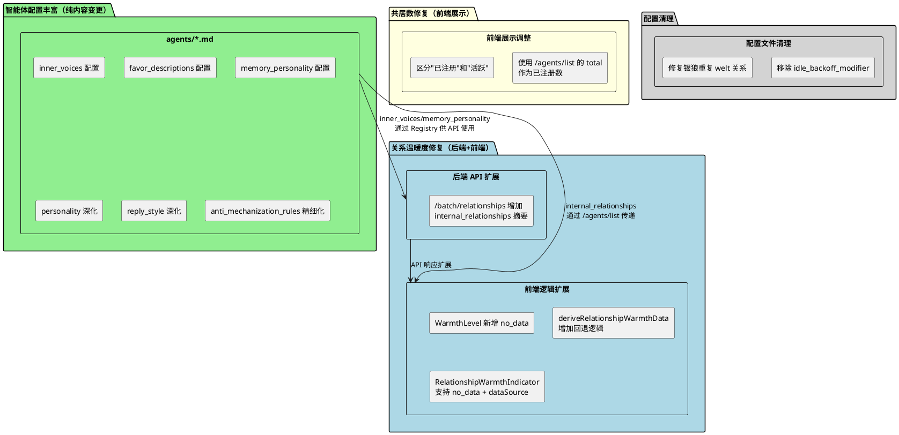
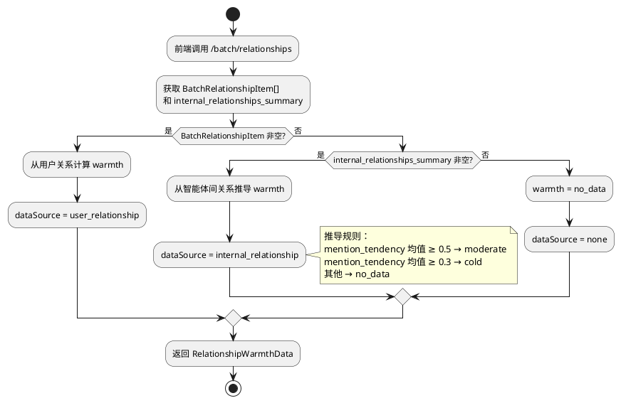
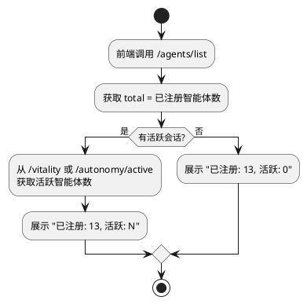
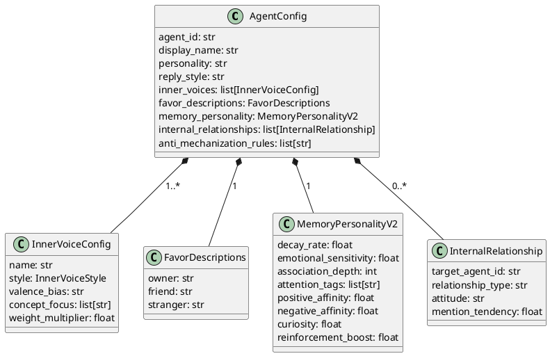
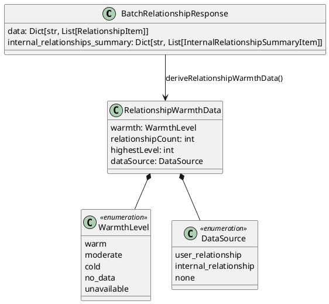

# 一、需求与存量功能关系分析

## 1.1 需求功能与存量功能对比

### 1.1.1 已实现功能

| 需求功能 | 存量功能 | 代码位置 | 匹配度 |
|---------|---------|---------|--------|
| 内心声音数据模型（InnerVoiceConfig） | 已有完整的 Pydantic 模型：name/style/valence_bias/concept_focus/weight_multiplier | `src/maisaka/agent/config.py:137-144` | 100% |
| 内心声音加载链路 | AgentConfigLoader 已支持从 YAML frontmatter 解析 inner_voices 列表 | `src/maisaka/agent/config_loader/loader.py:79-102` | 100% |
| 内心声音注册表 | AgentConfigRegistry 单例管理所有 AgentConfig（含 inner_voices） | `src/maisaka/agent/registry.py:12-114` | 100% |
| 记忆性格数据模型（MemoryPersonalityV2） | 已有完整的八参数模型：decay_rate/emotional_sensitivity/association_depth/attention_tags/positive_affinity/negative_affinity/curiosity/reinforcement_boost | `src/maisaka/agent/config.py:114-124` | 100% |
| 偏爱描述数据模型（FavorDescriptions） | 已有 owner/friend/stranger 三级模型，支持 {user_name} 占位符 | `src/maisaka/agent/config.py:147-152` | 100% |
| 偏爱注入逻辑 | get_favor_injection() 已实现按关系等级选择描述 + 占位符替换 | `src/maisaka/agent/config.py:276-289` | 100% |
| 智能体-用户关系查询 | /batch/relationships API 已实现，返回 AgentRelationship 数据 | `src/webui/routers/agent.py:734-768` | 100% |
| 智能体间关系（internal_relationships） | AgentConfig.internal_relationships 已有完整模型和加载链路 | `src/maisaka/agent/config.py:50-58` | 100% |
| 星座图数据推导 | deriveConstellationData() 已实现从 internal_relationships 构建节点+边 | `dashboard/src/routes/agent/utils/constellation.ts:52-101` | 100% |
| 关系温暖度推导 | deriveRelationshipWarmthData() 已实现从 BatchRelationshipItem 计算 warm/moderate/cold/unavailable | `dashboard/src/routes/agent/utils/vital-signs.ts:71-89` | 75% |
| 共居数计算 | VitalityManager.get_cohabitation_params() 已实现 active+standby 计数 | `src/maisaka/agent_autonomy/vitality_manager.py:330-368` | 50% |
| 银狼内心声音配置 | silver_wolf.md 已有3个内心声音（恶作剧心/游戏瘾/倔强） | `agents/silver_wolf.md:31-50` | 100% |
| 银狼偏爱描述 | silver_wolf.md 已有完整的 owner/friend/stranger 三级 | `agents/silver_wolf.md:95-98` | 100% |
| 银狼记忆性格 | silver_wolf.md 已有差异化参数（emotional_sensitivity=1.3, curiosity=1.2） | `agents/silver_wolf.md:83-94` | 100% |
| VitalSignsCard 组件 | 已有完整的四指标卡片：情绪脉搏/活动节律/关系温暖度/内心活动 | `dashboard/src/routes/agent/components/VitalSignsCard.tsx:16-47` | 100% |
| RelationshipWarmthIndicator 组件 | 已有温暖度圆点+文字展示 | `dashboard/src/routes/agent/components/RelationshipWarmthIndicator.tsx:16-34` | 75% |
| 反机械化规则注入 | AgentConfig.anti_mechanization_prompt 属性已实现规则列表→提示词 | `src/maisaka/agent/config.py:251-259` | 100% |
| 内部关系注入 | AgentConfig.internal_relationships_prompt 属性已实现关系列表→提示词 | `src/maisaka/agent/config.py:261-274` | 100% |

### 1.1.2 需要扩展的功能

| 需求功能 | 存量功能 | 差异说明 | 扩展方向 |
|---------|---------|---------|---------|
| 12个智能体内心声音配置 | 仅银狼有3个内心声音，其余12个 inner_voices 为空列表 | 缺少内容数据，数据模型和加载链路已完备 | 为12个智能体编写 inner_voices 配置，每个至少2个声音 |
| 13个智能体提示词深化 | personality/reply_style 已有基础内容，但缺少内心张力描述和情境化规则 | personality 缺少"未解决的矛盾"描述；reply_style 缺少触发条件；anti_mechanization_rules 缺少"情境+禁止+替代"三要素 | 重写13个 agents/*.md 的 personality（加入内心张力）、reply_style（加入触发条件）、anti_mechanization_rules（三要素格式） |
| 12个智能体偏爱描述 | 仅银狼有完整 favor_descriptions，其余12个使用默认空字符串 | 默认 get_favor_injection() 返回"你关心{user_name}"，无角色差异化 | 为12个智能体编写 owner/friend/stranger 三级偏爱描述 |
| 12个智能体记忆性格 | 仅银狼有自定义参数，其余12个使用默认值（全部0.5） | 默认参数意味着所有智能体记忆行为一致，无差异化 | 为12个智能体编写差异化的 memory_personality 参数 |
| 关系温暖度数据源 | deriveRelationshipWarmthData() 仅依赖 BatchRelationshipItem（智能体-用户关系），无回退逻辑 | AgentRelationship 为空时全部显示 unavailable，未利用 internal_relationships 作为补充数据源 | 1. /batch/relationships API 增加 internal_relationships 摘要返回；2. 前端 deriveRelationshipWarmthData() 增加回退逻辑 |
| 温暖度级别 | WarmthLevel 仅有 warm/moderate/cold/unavailable 四级 | "无数据"和"无关系"混为 unavailable，无法区分"系统刚启动"和"确实冷" | 新增 no_data 级别，替代 unavailable 在"无数据"场景的使用 |
| 共居数展示 | VitalityManager.get_cohabitation_params() 依赖 Orchestrator._active_agents | 无 Orchestrator 实例时共居数为0，而实际13个智能体已注册 | 1. /agents/list API 增加 registered_count 字段；2. 前端区分"已注册"和"活跃"两个指标 |
| 银狼重复 welt 关系 | silver_wolf.md internal_relationships 中有两条 welt 关系（第69行和第76行），第二条缺少其他字段 | YAML 解析时第二条覆盖第一条，导致 welt 关系数据不完整 | 删除重复的 welt 条目，保留完整的那一条 |
| idle_backoff_modifier 残留 | 13个 agents/*.md 中均有 idle_backoff_modifier 字段，但 AgentConfig 模型中已删除该字段 | Pydantic model_validate 会忽略未知字段，不报错但配置文件不干净 | 从13个配置文件中移除 idle_backoff_modifier 字段 |

### 1.1.3 需要新增的功能或接口

**后端 API 扩展**

1. `/batch/relationships` 响应增加 `internal_relationships_summary` 字段
   - 输入：无（复用 AgentConfigRegistry）
   - 输出：每个智能体的 internal_relationships 摘要（relationship_type + mention_tendency 列表）
   - 依赖：AgentConfigRegistry（已有）

2. `/agents/list` 响应增加 `registered_count` 字段
   - 输入：无
   - 输出：已注册智能体总数（= AgentConfigRegistry.list_agents().length）
   - 依赖：AgentConfigRegistry（已有）

**前端类型与逻辑扩展**

3. `WarmthLevel` 类型新增 `no_data` 值
   - 输入：relationships 为空列表
   - 输出：warmth = 'no_data'，区别于 'unavailable'

4. `RelationshipWarmthData` 接口新增 `dataSource` 字段
   - 值：'user_relationship' | 'internal_relationship' | 'none'
   - 标识温暖度的数据来源，便于前端展示来源标签

5. `deriveRelationshipWarmthData()` 增加回退逻辑
   - 当 BatchRelationshipItem 为空时，从 internal_relationships 摘要推导温暖度
   - 推导规则：mention_tendency 均值映射为 warmth 级别

6. `RelationshipWarmthIndicator` 组件支持 `no_data` 和 `dataSource` 展示
   - no_data 时显示"暂无交互数据"
   - dataSource 为 internal_relationship 时显示"基于角色关系"

**配置内容新增**

7. 12个智能体的 inner_voices 配置（每个至少2个声音）
8. 12个智能体的 favor_descriptions 配置（owner/friend/stranger 三级）
9. 12个智能体的 memory_personality 差异化参数
10. 13个智能体的 personality/reply_style/anti_mechanization_rules 深化内容

## 1.2 存量功能详细分析

### 1.2.1 AgentConfig 数据模型

**接口契约**：
- 入参：YAML frontmatter 字典 → Pydantic model_validate
- 出参：AgentConfig 实例，所有字段有默认值
- 异常：YAML 解析失败 → 返回 None；Pydantic 校验失败 → 返回 None + 日志报错
- 副作用：body 部分（--- 以下）自动写入 personality 字段

**业务规则**：
- inner_voices 默认为空列表，不校验非空——这是当前12个智能体 inner_voices 为空不报错的根因
- memory_personality 默认工厂为 MemoryPersonalityV2()，所有参数默认0.5——这是12个智能体记忆性格无差异的根因
- favor_descriptions 默认工厂为 FavorDescriptions()，三个字段默认空字符串——这是 get_favor_injection() 返回"你关心{user_name}"的根因
- idle_backoff_modifier 在 Pydantic v2 中被忽略（model_config 默认 extra='ignore'），不报错但配置文件不干净

**扩展点**：
- AgentConfig.identity_prompt 属性：拼接 personality + reply_style，是提示词注入的入口
- AgentConfig.anti_mechanization_prompt 属性：构建反机械化规则提示词
- AgentConfig.internal_relationships_prompt 属性：构建内部关系提示词
- AgentConfig.get_favor_injection() 方法：按关系等级选择偏爱描述

**约束**：
- personality 内容来自 Markdown body，不能包含 YAML frontmatter 语法
- inner_voices 的 style 必须是 InnerVoiceStyle 枚举值，否则 Pydantic 校验失败
- memory_personality 的 decay_rate 范围 [0.1, 5.0]，超出范围校验失败

### 1.2.2 /batch/relationships API

**接口契约**：
- 入参：无
- 出参：`Dict[str, List[RelationshipItem]]`，键为 agent_id
- 异常：数据库查询失败 → 500 + 日志
- 副作用：无

**业务规则**：
- 遍历所有已注册智能体，逐个查询 AgentRelationship 表
- AgentRelationship 为空时，该智能体返回空列表（`result[agent_id] = []`）
- RelationshipItem 包含 user_id/level/level_name/score/total_interactions

**约束**：
- 当前仅查询"智能体-用户关系"，不涉及"智能体间关系"
- 前端 deriveRelationshipWarmthData() 在 relationships 为空时返回 unavailable——这是 VitalSignsCard 全部 unavailable 的根因

**扩展点**：
- API 响应可扩展 internal_relationships 摘要，无需新增端点
- RelationshipItem 可扩展 dataSource 字段标识数据来源

### 1.2.3 VitalityManager 共居数计算

**接口契约**：
- 入参：session_id
- 出参：CohabitationParams（intent_threshold/cooldown_minutes/max_interjections_per_hour）
- 异常：Orchestrator._active_agents 访问失败 → bound_count = 1
- 副作用：无

**业务规则**：
- bound_count = active_count + standby_count
- active_count 来自 Orchestrator._active_agents 字典长度
- standby_count 来自 StandbyAgentRegistry 按 session_id 查询
- bound_count < 3 时使用默认参数，≥ 3 时动态调整

**约束**：
- 强依赖 Orchestrator 实例——VitalityManager 构造函数要求传入 orchestrator
- Orchestrator 按会话创建，系统启动时无实例 → 共居数无法计算
- 这是 WebUI 展示共居数为0的根因

**扩展点**：
- AgentConfigRegistry.list_agents() 提供已注册智能体总数，可作为无 Orchestrator 时的回退数据源
- /agents/list API 的 total 字段已等于已注册数，前端可直接使用

### 1.2.4 deriveRelationshipWarmthData() 温暖度推导

**接口契约**：
- 入参：`BatchRelationshipItem[] | undefined | null`
- 出参：`RelationshipWarmthData { warmth, relationshipCount, highestLevel }`
- 异常：无（纯计算函数）

**业务规则**：
- relationships 为空/null → warmth = 'unavailable'
- highestLevel ≥ 3 → warm；≥ 2 → moderate；≥ 1 → cold；= 0 → unavailable
- relationshipCount = relationships.length

**约束**：
- 仅依赖 BatchRelationshipItem（智能体-用户关系），无回退数据源
- "无数据"和"确实冷"都映射为 unavailable——这是无法区分两种状态的根因
- WarmthLevel 类型为联合字符串，无 no_data 选项

**扩展点**：
- 可增加第二个参数接收 internal_relationships 摘要
- 可增加 dataSource 字段标识数据来源

# 二、增量设计方案

## 2.1 实现模型

### 2.1.1 上下文视图



### 2.1.2 服务/组件总体架构



### 2.1.3 实现设计文档

#### 关系温暖度回退流程



#### 共居数展示流程



#### 内心声音配置设计模式

每个智能体的 inner_voices 遵循统一设计模式：

1. **声音1：核心驱动力**（AMPLIFY/PRESERVE，POSITIVE/NEUTRAL）
   - 反映角色最本质的内在驱动力
   - concept_focus 对齐 memory_focus_areas 的核心领域
   - weight_multiplier = 1.0-1.3（主导声音）

2. **声音2：内在矛盾**（INVERT/CHAOTIC，NEGATIVE/NEUTRAL）
   - 反映角色内心未解决的张力
   - concept_focus 对齐角色最脆弱/矛盾的领域
   - weight_multiplier = 0.7-1.0（次要声音）

3. **声音3（可选）：隐藏面**（NEUTRALIZE/PRESERVE，与声音1相反的 valence）
   - 反映角色不轻易展示的一面
   - concept_focus 对齐角色的隐藏兴趣或秘密
   - weight_multiplier = 0.5-0.8（最弱声音）

## 2.2 接口设计

### 2.2.1 总体设计

| 接口 | 类型 | 变更类型 | 稳定性 |
|------|------|---------|--------|
| `/batch/relationships` 响应 | 后端 API | 扩展（增加 internal_relationships_summary） | 稳定 |
| `/agents/list` 响应 | 后端 API | 扩展（registered_count 已在 total 中） | 稳定 |
| `BatchRelationshipResponse` | 后端 Schema | 扩展（增加 internal_relationships_summary 字段） | 稳定 |
| `WarmthLevel` | 前端类型 | 扩展（增加 no_data） | 稳定 |
| `RelationshipWarmthData` | 前端类型 | 扩展（增加 dataSource） | 稳定 |
| `deriveRelationshipWarmthData()` | 前端函数 | 签名变更（增加 internalRelationships 参数） | 稳定 |
| `RelationshipWarmthIndicator` | 前端组件 | 扩展（支持 no_data + dataSource 展示） | 稳定 |
| `deriveVitalSignsData()` | 前端函数 | 签名变更（传递 internalRelationships） | 稳定 |

### 2.2.2 接口清单

#### `/batch/relationships` API 扩展

**接口签名**：
```python
@router.get("/batch/relationships", response_model=ApiResponse[BatchRelationshipResponse])
async def batch_get_relationships()
```

**业务说明**：批量获取所有智能体的关系概览，新增 internal_relationships_summary 字段

**前置条件**：AgentConfigRegistry 已加载

**后置条件**：响应中每个智能体增加 `internal_relationships_summary` 字段

**变更内容**：

BatchRelationshipResponse 增加字段：
```python
class InternalRelationshipSummaryItem(BaseModel):
    target_agent_id: str
    relationship_type: str
    mention_tendency: float

class BatchRelationshipResponse(BaseModel):
    success: bool
    data: Dict[str, List[RelationshipItem]]
    internal_relationships_summary: Dict[str, List[InternalRelationshipSummaryItem]] = Field(default_factory=dict)
```

batch_get_relationships() 实现变更：
- 遍历 agents 时，同步构建 `internal_relationships_summary`
- 从 `config.internal_relationships` 提取 `target_agent_id + relationship_type + mention_tendency`

#### 前端 `deriveRelationshipWarmthData()` 签名变更

**接口签名**：
```typescript
export function deriveRelationshipWarmthData(
  relationships: BatchRelationshipItem[] | undefined | null,
  internalRelationships?: InternalRelationshipSummaryItem[] | undefined | null,
): RelationshipWarmthData
```

**业务说明**：增加 internalRelationships 参数，当用户关系为空时回退到智能体间关系

**前置条件**：/batch/relationships API 返回 internal_relationships_summary

**后置条件**：
- relationships 非空 → 从用户关系计算（dataSource = 'user_relationship'）
- relationships 为空 + internalRelationships 非空 → 从智能体间关系推导（dataSource = 'internal_relationship'）
- 均为空 → warmth = 'no_data'（dataSource = 'none'）

**推导规则（智能体间关系 → 温暖度）**：
- mention_tendency 均值 ≥ 0.5 → moderate
- mention_tendency 均值 ≥ 0.3 → cold
- 其他 → no_data

#### 前端 `WarmthLevel` 类型扩展

```typescript
export type WarmthLevel = 'warm' | 'moderate' | 'cold' | 'no_data' | 'unavailable'
```

- `no_data`：无任何关系数据（系统刚启动或无交互）
- `unavailable`：保留用于未来其他不可用场景（当前不使用，但保留类型兼容性）

#### 前端 `RelationshipWarmthData` 接口扩展

```typescript
export interface RelationshipWarmthData {
  warmth: WarmthLevel
  relationshipCount: number
  highestLevel: number
  dataSource: 'user_relationship' | 'internal_relationship' | 'none'
}
```

#### 前端 `RelationshipWarmthIndicator` 组件扩展

- no_data 时显示"暂无交互数据"（灰色圆点）
- dataSource 为 internal_relationship 时追加"基于角色关系"标签
- WARMTH_COLORS 增加 `no_data: '#9ca3af'`

## 2.3 数据模型

### 2.3.1 设计目标

1. **配置丰富**：13个智能体的 inner_voices/favor_descriptions/memory_personality 从空/默认变为差异化
2. **温暖度可用**：VitalSignsCard 关系温暖度不再全部显示 unavailable
3. **共居数准确**：系统启动后共居数反映已注册智能体数
4. **数据来源可追溯**：温暖度数据来源可区分用户关系 vs 智能体间关系
5. **配置干净**：移除废弃字段，修复数据错误

### 2.3.2 模型实现

#### 智能体配置数据关系



#### 温暖度数据流



## 2.4 分批执行策略

### 第1批：配置清理 + 关系温暖度修复（低风险，快速见效）

**目标**：修复 VitalSignsCard 全部 unavailable 的视觉问题

**变更清单**：
1. `agents/silver_wolf.md`：删除第76行重复的 welt 关系条目
2. `agents/*.md`（13个文件）：移除 idle_backoff_modifier 字段
3. `src/webui/schemas/agent.py`：新增 InternalRelationshipSummaryItem 模型
4. `src/webui/routers/agent.py`：batch_get_relationships() 增加 internal_relationships_summary 构建
5. `dashboard/src/routes/agent/utils/vital-signs.ts`：
   - WarmthLevel 增加 no_data
   - RelationshipWarmthData 增加 dataSource
   - deriveRelationshipWarmthData() 增加回退逻辑
6. `dashboard/src/routes/agent/components/RelationshipWarmthIndicator.tsx`：支持 no_data + dataSource
7. `dashboard/src/lib/agent-api.ts`：BatchRelationshipResponse 类型增加 internal_relationships_summary
8. `dashboard/src/routes/agent/hooks/useBatchAgentData.ts`：传递 internal_relationships_summary
9. `dashboard/src/i18n/locales/{zh,en,ja}.json`：增加 no_data 和 dataSource 相关翻译

**验证**：
- 系统启动后 VitalSignsCard 不再全部显示 unavailable
- 银狼的 welt 关系只有一条完整记录
- 13个配置文件中无 idle_backoff_modifier

### 第2批：共居数展示修复（低风险）

**目标**：系统启动后共居数正确反映已注册智能体数

**变更清单**：
1. `dashboard/src/routes/agent/` 相关组件：使用 /agents/list 的 total 作为"已注册数"
2. 区分展示"已注册: 13"和"活跃: N"两个独立指标
3. 无 Orchestrator 实例时，活跃数显示为0而非报错

**验证**：
- 系统启动后 WebUI 展示"已注册: 13"
- 有活跃会话时展示"活跃: N"

### 第3批：内心声音 + 偏爱描述 + 记忆性格配置（内容密集，无代码变更）

**目标**：12个智能体从"空配置"变为"有灵魂"

**变更清单**：
1. `agents/bronya.md`：增加 inner_voices（2-3个）、favor_descriptions、memory_personality
2. `agents/elysia.md`：同上
3. `agents/fu_hua.md`：同上
4. `agents/kiana.md`：同上
5. `agents/mei.md`：同上
6. `agents/seele.md`：同上
7. `agents/veliona.md`：同上
8. `agents/himeko.md`：同上
9. `agents/welt.md`：同上
10. `agents/tighnari.md`：同上
11. `agents/signora.md`：同上
12. `agents/columbina.md`：同上

**设计约束**：
- 每个智能体至少2个 inner_voices，不超过4个
- inner_voices 的 concept_focus 必须与 memory_focus_areas 有语义关联
- weight_multiplier 必须有差异化（至少1个 ≠ 1.0）
- 任意两个智能体的 inner_voices 不存在完全相同的 name
- favor_descriptions 的 owner/friend/stranger 三级态度有明确差异
- memory_personality 至少3个参数值不同于默认值0.5

**验证**：
- 加载后每个智能体的 AgentConfig.inner_voices 长度 ≥ 2
- 每个 AgentConfig.favor_descriptions 的三个字段非空
- 每个 AgentConfig.memory_personality 至少3个参数 ≠ 0.5

### 第4批：提示词深化（内容密集，无代码变更）

**目标**：13个智能体的 personality/reply_style/anti_mechanization_rules 从"基础"变为"有张力"

**变更清单**：
1. `agents/*.md`（13个文件）：personality 增加内心张力描述
2. `agents/*.md`（13个文件）：reply_style 增加情境化触发条件
3. `agents/*.md`（13个文件）：anti_mechanization_rules 改为"情境+禁止+替代"三要素格式

**设计约束**：
- personality 中至少包含1组明确的内心张力描述
- reply_style 中每种模式有明确的触发条件
- anti_mechanization_rules 每条包含"情境+禁止行为+替代方案"
- 提示词总 token 数不超过 DeepSeek 注入预算（adaptive 策略下按优先级截断）

**验证**：
- 每个 AgentConfig.identity_prompt 中包含张力关键词
- 每个 AgentConfig.anti_mechanization_prompt 中规则包含三要素

## 2.5 回退方案

**原则**：不兜底，而是优雅降级——让缺失信息可见，而非用假数据掩盖。

### 关系温暖度回退

| 场景 | 当前行为 | 修复后行为 | 降级策略 |
|------|---------|-----------|---------|
| AgentRelationship 为空 | unavailable | 基于 internal_relationships 推导，dataSource 标注来源 | 两者均为空时显示 no_data（"暂无交互数据"），而非 unavailable |
| internal_relationships 引用不存在的 target | 不影响（星座图已跳过） | 温暖度计算同样跳过 | 不降级，正常处理 |

### 共居数回退

| 场景 | 当前行为 | 修复后行为 | 降级策略 |
|------|---------|-----------|---------|
| 无 Orchestrator 实例 | 共居数为0 | 显示"已注册: 13, 活跃: 0" | 已注册数来自 Registry，不依赖 Orchestrator |
| 智能体配置加载失败 | 共居数 < 13 | 已注册数反映实际加载数 | 启动日志报错，已注册数如实反映 |

### 内心声音降级

| 场景 | 系统行为 | 用户感知 |
|------|---------|---------|
| inner_voices 格式错误 | Pydantic 校验失败，该智能体降级为无内心声音 | 启动日志报错，该智能体回复无内心声音影响 |
| concept_focus 引用的概念不存在 | 该声音的激活权重降低 | 该声音影响减弱，不影响其他声音 |

### 提示词截断

| 场景 | 系统行为 | 用户感知 |
|------|---------|---------|
| personality + rules 总 token 超限 | DeepSeek adaptive 策略按 injection_priority 截断低优先级内容 | 部分反机械化规则被截断，回复可能轻微机械化 |

## 2.6 文件变更汇总

### 后端变更

| 文件 | 变更类型 | 说明 |
|------|---------|------|
| `src/webui/schemas/agent.py` | 修改 | 新增 InternalRelationshipSummaryItem 模型 |
| `src/webui/routers/agent.py` | 修改 | batch_get_relationships() 增加 internal_relationships_summary 构建 |

### 前端变更

| 文件 | 变更类型 | 说明 |
|------|---------|------|
| `dashboard/src/routes/agent/utils/vital-signs.ts` | 修改 | WarmthLevel 增加 no_data；RelationshipWarmthData 增加 dataSource；deriveRelationshipWarmthData() 增加回退逻辑 |
| `dashboard/src/routes/agent/components/RelationshipWarmthIndicator.tsx` | 修改 | 支持 no_data + dataSource 展示 |
| `dashboard/src/lib/agent-api.ts` | 修改 | BatchRelationshipResponse 类型增加 internal_relationships_summary |
| `dashboard/src/routes/agent/hooks/useBatchAgentData.ts` | 修改 | 传递 internal_relationships_summary |
| `dashboard/src/i18n/locales/zh.json` | 修改 | 增加 no_data 和 dataSource 翻译 |
| `dashboard/src/i18n/locales/en.json` | 修改 | 增加 no_data 和 dataSource 翻译 |
| `dashboard/src/i18n/locales/ja.json` | 修改 | 增加 no_data 和 dataSource 翻译 |

### 配置文件变更

| 文件 | 变更类型 | 说明 |
|------|---------|------|
| `agents/silver_wolf.md` | 修改 | 删除重复 welt 关系；移除 idle_backoff_modifier；深化 personality/reply_style/anti_mechanization_rules |
| `agents/bronya.md` | 修改 | 移除 idle_backoff_modifier；增加 inner_voices/favor_descriptions/memory_personality；深化提示词 |
| `agents/elysia.md` | 修改 | 同上 |
| `agents/fu_hua.md` | 修改 | 同上 |
| `agents/kiana.md` | 修改 | 同上 |
| `agents/mei.md` | 修改 | 同上 |
| `agents/seele.md` | 修改 | 同上 |
| `agents/veliona.md` | 修改 | 同上 |
| `agents/himeko.md` | 修改 | 同上 |
| `agents/welt.md` | 修改 | 同上 |
| `agents/tighnari.md` | 修改 | 同上 |
| `agents/signora.md` | 修改 | 同上 |
| `agents/columbina.md` | 修改 | 同上 |

### 不变更的文件

| 文件 | 原因 |
|------|------|
| `src/maisaka/agent/config.py` | 数据模型已完备，无需修改 |
| `src/maisaka/agent/config_loader/loader.py` | 加载链路已完备，无需修改 |
| `src/maisaka/agent/registry.py` | 注册表已完备，无需修改 |
| `src/maisaka/agent_autonomy/vitality_manager.py` | 共居数修复在前端展示层，不修改运行时逻辑 |
| `src/maisaka/agent_autonomy/orchestrator.py` | 不修改架构，仅在前端使用 Registry 数据 |