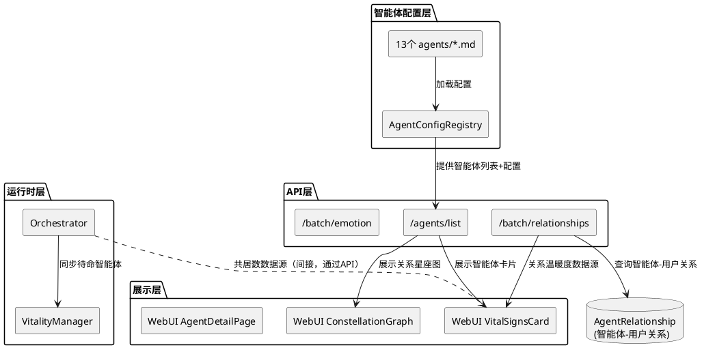
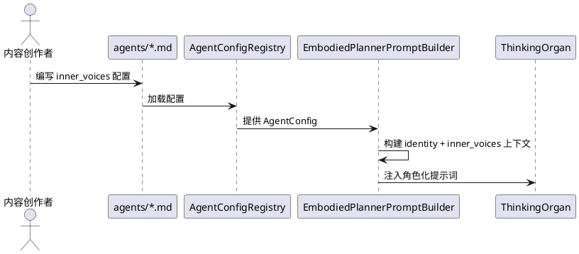
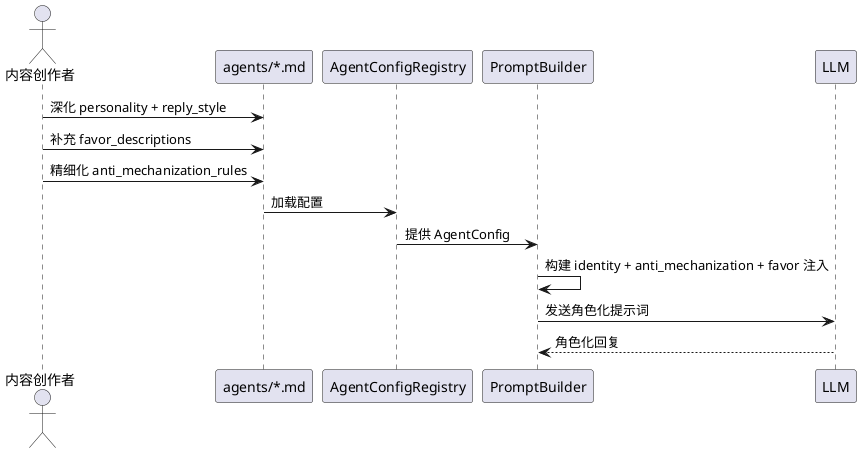
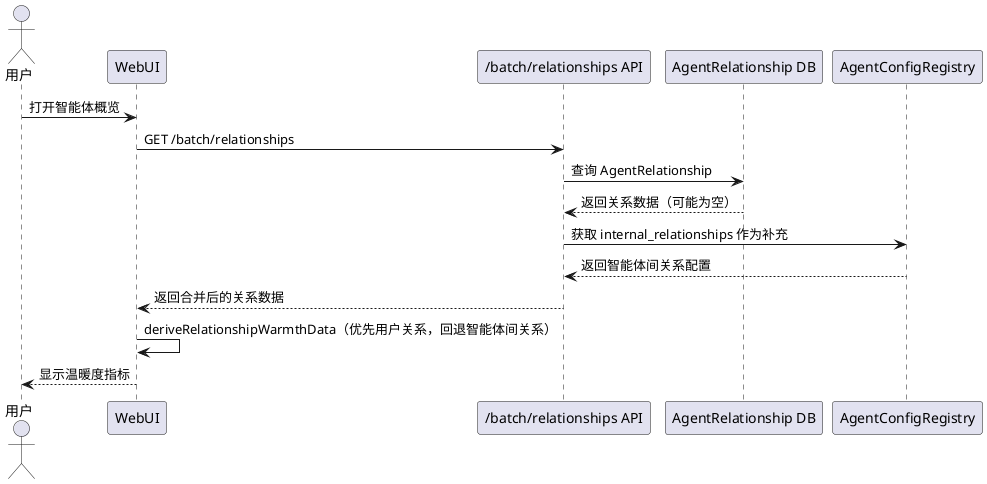
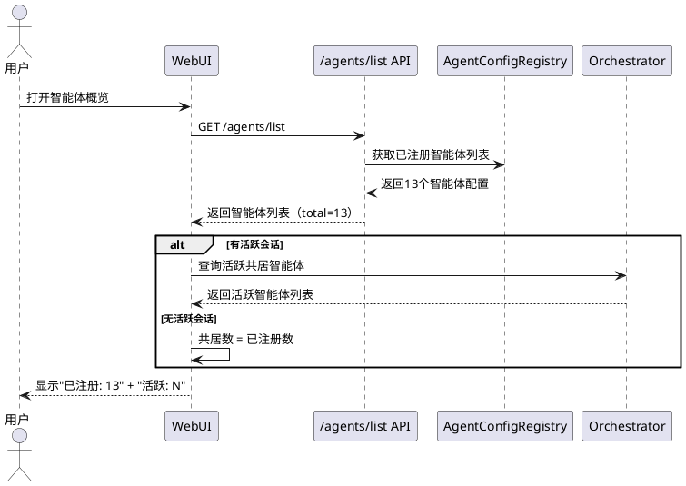

# 1. 组件定位

## 1.1 核心职责

本组件负责丰富智能体核心的内容细节（提示词、内心声音、角色性格），并修复共居数和关系温暖度两个展示缺陷，使13个智能体从"能运行"变为"有灵魂"。

## 1.2 核心输入

1. 13个智能体配置文件 — `agents/*.md`，包含 personality、reply_style、internal_relationships、inner_voices 等字段
2. AgentConfig 数据模型 — `src/maisaka/agent/config.py`，定义了智能体的所有可配置属性
3. WebUI 关系温暖度指标 — `dashboard/src/routes/agent/utils/vital-signs.ts`，依赖 `/batch/relationships` API 返回的智能体-用户关系
4. WebUI 星座图 — `dashboard/src/routes/agent/utils/constellation.ts`，依赖 `internal_relationships` 静态配置
5. 后端关系 API — `src/webui/routers/agent.py`，`/batch/relationships` 查询 `AgentRelationship`（智能体-用户关系）
6. Orchestrator 共居数计算 — `src/maisaka/agent_autonomy/orchestrator.py`，依赖 `_active_agents` 字典

## 1.3 核心输出

1. 13个智能体丰富的内心声音配置（inner_voices）— 当前仅银狼有3个声音，其余12个为空
2. 13个智能体丰富的提示词内容（personality + reply_style）— 当前已有基础内容，需深化角色内心世界的张力
3. 修复后的关系温暖度展示 — VitalSignsCard 不再全部显示 unavailable
4. 修复后的共居数展示 — 系统启动后共居数正确反映13个已注册智能体

## 1.4 职责边界

- 不负责架构变更（不修改 Orchestrator/ThinkingOrgan/管家系统的代码结构）
- 不负责新增全新的业务功能（仅丰富已有配置和修复已有缺陷）
- 不负责记忆系统范式迁移（属于独立项目）
- 不负责 WebUI 的视觉重设计（仅修复功能性问题）
- 不负责提示词模板文件（maisaka_chat_embodied 等）的修改，仅修改智能体配置内容

# 2. 领域术语

**内心声音（InnerVoice）**
: 智能体内心多种声音的配置，每个声音有名称、处理风格（AMPLIFY/NEUTRALIZE/PRESERVE/INVERT/CHAOTIC）、情感偏移、关注概念和权重倍率。用于让智能体的内心世界不再是单一维度，而是多种倾向的动态博弈。

**处理风格（InnerVoiceStyle）**
: 内心声音对信息的处理方式。AMPLIFY=放大该声音的倾向；NEUTRALIZE=中和/淡化；PRESERVE=保持原样；INVERT=反转（如把负面转为正面）；CHAOTIC=混乱不可预测。

**智能体-用户关系（AgentRelationship）**
: 智能体与用户之间的动态关系记录，存储在数据库中，包含 level、score、interaction_count 等字段。由系统在交互过程中自动积累。
: 备注：这是"智能体怎么看用户"，不是"智能体之间怎么看"。

**智能体间关系（InternalRelationship）**
: 智能体之间的静态关系配置，定义在 `agents/*.md` 的 `internal_relationships` 字段中。包含 relationship_type、attitude、interaction_style、mention_tendency、anti_mechanization。
: 备注：这是配置数据，不是运行时动态数据。

**关系温暖度（RelationshipWarmth）**
: WebUI VitalSignsCard 中展示的指标，基于 `/batch/relationships` 返回的智能体-用户关系计算。warm/moderate/cold/unavailable 四级。
: 备注：当前因 AgentRelationship 数据为空，所有智能体都显示 unavailable。

**共居数（Cohabitant Count）**
: 一个会话中共同居住的智能体数量，由 Orchestrator 的 `_active_agents` + `_standby_agents` 计算。系统刚启动时没有 Orchestrator 实例，共居数为0。

**反机械化规则（Anti-mechanization Rules）**
: 防止智能体机械化重复的约束规则，如"不要每句飙游戏术语"。每个智能体有独立的反机械化规则列表。

**偏爱描述（FavorDescriptions）**
: 智能体对不同关系等级用户的偏爱行为描述，分为 owner/friend/stranger 三级。替代了旧版硬编码的 favor_map。

**记忆性格（MemoryPersonalityV2）**
: 智能体对记忆的个性化处理参数，包含 decay_rate、emotional_sensitivity、association_depth 等8个参数。影响记忆的衰减、联想和强化。

**角色内心张力**
: 角色内心世界中未解决的冲突和矛盾，是让角色"活"起来的关键。如银狼的"好胜心 vs 怕输"、布洛妮娅的"三无外壳 vs 丰富内心"。

# 3. 角色与边界

## 3.1 核心角色

- **运维人员**：通过 WebUI 监控智能体状态、查看关系温暖度、确认共居智能体数量
- **内容创作者**：编写和调整智能体的提示词、内心声音、性格参数，使角色更丰满
- **开发者**：调试关系温暖度和共居数的展示逻辑

## 3.2 外部系统

- **WebUI 前端**：消费 `/batch/relationships`、`/batch/emotion`、`/list` 等 API 展示智能体状态
- **WebUI 后端 API**：提供智能体配置、关系、情绪等查询接口
- **Orchestrator**：管理智能体激活/待命状态，是共居数的数据来源
- **AgentRelationship 数据库**：存储智能体-用户动态关系，是关系温暖度的数据来源

## 3.3 交互上下文

# 4. DFX约束

## 4.1 性能

- 13个智能体的内心声音配置加载不得增加启动时间超过500ms
- `/batch/relationships` API 响应时间不超过200ms（当前已有性能，修复不得引入退化）
- 星座图渲染13个节点+46条边不得出现明显卡顿

## 4.2 可靠性

- 内心声音配置缺失时，系统不得崩溃，应优雅降级为无内心声音模式
- 关系温暖度修复后，已有 AgentRelationship 数据不得丢失或损坏
- 共居数修复不得影响 Orchestrator 的正常消息调度

## 4.3 安全性

- 智能体配置文件（agents/*.md）中的提示词内容不得泄露系统内部信息
- 内心声音的 concept_focus 不得用于注入恶意指令

## 4.4 兼容性

- 提示词修改需三语同步（zh-CN / en-US / ja-JP）— 当前仅有中文配置，需确认是否需要多语言版本
- 配置文件修改只改模板，新增版本号，不改动 legacy_migration
- AgentConfig 数据模型已有 `inner_voices` 和 `inner_voice_template_text` 字段，无需新增字段
- WebUI 前端类型定义变更需与后端 schema 对齐

## 4.5 可维护性

- 内心声音配置应遵循统一的命名规范和结构模式，便于批量维护
- 关系温暖度的计算逻辑变更需在代码中有清晰注释说明数据来源
- 共居数的计算逻辑变更需考虑 Orchestrator 未初始化的边界场景

# 5. 核心能力

## 5.1 智能体内心声音丰富

### 5.1.1 业务规则

1. **每个智能体必须配置至少2个内心声音**：当前仅银狼有3个内心声音（恶作剧心、游戏瘾、倔强），其余12个智能体的 inner_voices 字段为空列表。内心声音是让智能体"像人"的关键——人的内心不是单一声音，而是多种倾向的动态博弈
   - 验收条件：13个智能体每个至少有2个 inner_voices 条目 → 加载后 AgentConfig.inner_voices 长度 ≥ 2

2. **内心声音必须体现角色核心张力**：每个声音应反映角色内心世界中未解决的冲突，而非简单的性格标签。如银狼的"倔强"（INVERT风格，把挫折当动力）比"勇敢"更有张力
   - 验收条件：每个内心声音的 name 字段不是简单的性格形容词 → style 和 valence_bias 的组合能体现该声音的"立场"

3. **内心声音的 concept_focus 必须与角色的 memory_focus_areas 对齐**：concept_focus 是该声音特别关注的领域，应与角色已有的记忆焦点领域有交集，但不完全相同
   - 验收条件：每个声音的 concept_focus 至少有1项与该角色的 memory_focus_areas 有语义关联

4. **内心声音的 weight_multiplier 必须有差异化**：不同声音的权重应有差异，体现角色内心中哪种声音更占主导
   - 验收条件：同一智能体的 inner_voices 中，至少有1个 weight_multiplier ≠ 1.0

5. **禁止为所有智能体套用相同的内心声音模板**：13个角色的内心世界各不相同，内心声音必须基于角色性格独立设计
   - 验收条件：任意两个智能体的 inner_voices 列表不存在完全相同的 name 值

### 5.1.2 交互流程

### 5.1.3 异常场景

1. **内心声音配置格式错误**
   - 触发条件：inner_voices 中的 style 值不是 InnerVoiceStyle 枚举成员
   - 系统行为：AgentConfigLoader 解析时抛出校验错误
   - 用户感知：启动日志中报错，该智能体降级为无内心声音模式

2. **concept_focus 中的概念在记忆系统中不存在**
   - 触发条件：concept_focus 引用的概念在连接主义记忆网络中没有对应节点
   - 系统行为：内心声音的 concept_focus 无法匹配到记忆痕迹，该声音的激活权重降低
   - 用户感知：该声音的影响减弱，但不影响其他声音的正常工作

## 5.2 智能体提示词深化

### 5.2.1 业务规则

1. **personality 字段必须包含角色内心世界的核心张力**：当前13个智能体的 personality 已有基础内容（角色背景、行为模式、表达风格），但缺少内心世界中"未解决的矛盾"——这是让角色从标本变为生命体的关键
   - 验收条件：每个智能体的 personality 中至少包含1组明确的内心张力描述（如"嘴硬心软""表面A但内在B"）

2. **reply_style 必须包含情境化的语气变化规则**：当前已有"日常模式/认真模式/XX模式"的描述，但需更精确地定义什么情境触发什么语气变化
   - 验收条件：reply_style 中每种模式有明确的触发条件描述，而非仅描述模式本身

3. **anti_mechanization_rules 必须覆盖角色最容易机械化的表达模式**：当前规则较笼统（如"不要每句飙游戏术语"），需更具体地指出该角色在什么情境下容易陷入什么机械化模式
   - 验收条件：每条规则包含"情境+禁止行为+替代方案"三要素

4. **favor_descriptions 必须体现角色对不同关系等级的差异化态度**：当前仅银狼有完整的 favor_descriptions（owner/friend/stranger），其余智能体使用默认值
   - 验收条件：13个智能体均有非空的 favor_descriptions，且 owner/friend/stranger 三级态度有明确差异

5. **idle_backoff_modifier 字段必须从所有智能体配置中移除**：该字段已从 AgentConfig 代码中删除，但13个 agents/*.md 文件中仍存在此字段
   - 验收条件：13个配置文件中无 idle_backoff_modifier 字段 → 加载后无废弃字段警告

6. **银狼配置中的重复 target_agent_id 必须修复**：silver_wolf.md 的 internal_relationships 中有两条 welt 关系（第69行和第76行），第二条缺少其他字段
   - 验收条件：silver_wolf.md 的 internal_relationships 中每个 target_agent_id 只出现一次

### 5.2.2 交互流程

### 5.2.3 异常场景

1. **personality 内容过长导致 token 超限**
   - 触发条件：personality + reply_style + anti_mechanization_rules 的总 token 数超过 DeepSeek 注入预算
   - 系统行为：DeepSeek 优化配置按 injection_priority 截断低优先级内容
   - 用户感知：部分反机械化规则或关系描述被截断，回复可能出现轻微机械化

2. **favor_descriptions 中的 {user_name} 占位符未被替换**
   - 触发条件：用户信息查询失败，user_name 为空
   - 系统行为：get_favor_injection 返回包含空占位符的文本
   - 用户感知：提示词中出现原始的 {user_name} 字符串

## 5.3 关系温暖度展示修复

### 5.3.1 业务规则

1. **关系温暖度必须区分"无数据"和"无关系"两种状态**：当前 `deriveRelationshipWarmthData` 在 relationships 为空时返回 `unavailable`，但"系统刚启动还没有交互数据"和"有交互但关系确实很冷"是不同的业务含义
   - 验收条件：relationships 为空列表时温暖度显示为"暂无交互数据"而非"unavailable" → relationships 非空但 level 全为0时显示"cold"

2. **关系温暖度应优先使用智能体间关系（internal_relationships）作为初始数据源**：当 AgentRelationship（智能体-用户关系）为空时，应回退到 internal_relationships（智能体间关系）计算温暖度，因为智能体间关系是配置数据，始终存在
   - 验收条件：AgentRelationship 为空时，VitalSignsCard 的关系温暖度基于 internal_relationships 计算 → 不再全部显示 unavailable

3. **/batch/relationships API 应同时返回智能体间关系数据**：当前 API 仅返回 AgentRelationship（智能体-用户关系），前端 VitalSignsCard 和 ConstellationGraph 需要不同类型的关系数据，但只有一个 API 端点
   - 验收条件：/batch/relationships 返回数据中包含 internal_relationships 摘要信息 → 前端可据此计算温暖度

4. **VitalSignsCard 的温暖度计算逻辑必须更新**：当前 `deriveRelationshipWarmthData` 仅依赖 BatchRelationshipItem（智能体-用户关系），需增加对 internal_relationships 的回退逻辑
   - 验收条件：当 BatchRelationshipItem 为空时，温暖度从 internal_relationships 的 mention_tendency 和 relationship_type 推导

### 5.3.2 交互流程

### 5.3.3 异常场景

1. **AgentRelationship 和 internal_relationships 都为空**
   - 触发条件：智能体既没有用户关系数据，也没有配置智能体间关系
   - 系统行为：温暖度显示"暂无数据"
   - 用户感知：VitalSignsCard 显示"暂无数据"而非"unavailable"

2. **internal_relationships 中引用了不存在的 target_agent_id**
   - 触发条件：配置文件中 target_agent_id 指向未注册的智能体
   - 系统行为：星座图已处理此情况（跳过不存在的 target），温暖度计算应同样跳过
   - 用户感知：该关系条目不影响温暖度计算

## 5.4 共居数展示修复

### 5.4.1 业务规则

1. **系统启动后共居数必须反映已注册智能体总数**：当前共居数依赖 Orchestrator 的 `_active_agents`，但 Orchestrator 仅在消息到达时按需创建。系统刚启动时没有 Orchestrator 实例，导致共居数为0，而实际已有13个智能体注册成功
   - 验收条件：系统启动后，WebUI 展示的共居数为13（或"已注册智能体数"），而非0

2. **共居数计算必须区分"已注册"和"已激活"两种状态**："已注册"表示智能体配置已加载，"已激活"表示智能体在某个会话中处于活跃状态。当前的共居数概念混淆了这两个状态
   - 验收条件：WebUI 展示"已注册智能体: 13"和"活跃共居智能体: N"两个独立指标

3. **无 Orchestrator 实例时不得报错**：当前 WebUI 查询共居数时如果 Orchestrator 为 None，应返回合理的默认值而非报错
   - 验收条件：Orchestrator 为 None 时，共居数显示为"已注册数"而非0或报错

### 5.4.2 交互流程

### 5.4.3 异常场景

1. **Orchestrator 注册表为空**
   - 触发条件：系统刚启动，没有任何会话触发过 Orchestrator 创建
   - 系统行为：共居数回退为已注册智能体数
   - 用户感知：显示"已注册: 13，活跃: 0"

2. **智能体配置加载失败**
   - 触发条件：某个 agents/*.md 文件格式错误
   - 系统行为：该智能体不被注册，已注册数减少
   - 用户感知：共居数小于13，启动日志中有错误提示

## 5.5 智能体记忆性格差异化

### 5.5.1 业务规则

1. **13个智能体的 memory_personality 参数必须体现性格差异**：当前仅银狼有自定义的 memory_personality（emotional_sensitivity=1.3, curiosity=1.2），其余12个使用默认值（全部0.5）。记忆性格直接影响记忆的衰减、联想和强化，使用相同默认值意味着所有智能体的记忆行为完全一致
   - 验收条件：13个智能体的 memory_personality 中至少有3个参数值不同于默认值

2. **记忆性格参数必须与角色的情感特质对齐**：如布洛妮娅的 emotional_sensitivity 应低于银狼（三无 vs 情绪化），符华的 decay_rate 应极低（五万年记忆者），爱莉希雅的 positive_affinity 应较高（总是看到美好）
   - 验收条件：每个智能体的 memory_personality 参数值与其 personality 中的情感描述一致

3. **attention_tags 必须与 memory_focus_areas 有语义关联但不完全重叠**：attention_tags 是记忆系统层面的关注标签，memory_focus_areas 是提示词层面的焦点领域，两者应有交集但视角不同
   - 验收条件：attention_tags 中至少有1项与 memory_focus_areas 有语义关联

### 5.5.2 异常场景

1. **记忆性格参数超出范围**
   - 触发条件：decay_rate > 5.0 或 emotional_sensitivity > 3.0
   - 系统行为：Pydantic 校验拒绝，配置加载失败
   - 用户感知：启动报错，该智能体使用默认记忆性格

# 6. 数据约束

## 6.1 InnerVoiceConfig（内心声音配置）

1. **name**：非空字符串，声音名称，应体现该声音的"立场"而非简单性格标签（如"倔强"而非"勇敢"）
2. **style**：InnerVoiceStyle 枚举值，AMPLIFY/NEUTRALIZE/PRESERVE/INVERT/CHAOTIC 之一
3. **valence_bias**：POSITIVE/NEGATIVE/NEUTRAL 之一，该声音对信息的情感偏移方向
4. **concept_focus**：字符串列表，该声音特别关注的领域，至少1项
5. **weight_multiplier**：0.0-3.0 浮点数，该声音的权重倍率，同一智能体的不同声音应有差异

## 6.2 FavorDescriptions（偏爱描述）

1. **owner**：非空字符串，对主人的偏爱行为描述，支持 {user_name} 占位符
2. **friend**：非空字符串，对主人朋友的偏爱行为描述，支持 {user_name} 占位符
3. **stranger**：非空字符串，对陌生人的偏爱行为描述，支持 {user_name} 占位符

## 6.3 MemoryPersonalityV2（记忆性格参数）

1. **decay_rate**：0.1-5.0，记忆衰减率。符华应极低（0.2），银狼应中等偏高（0.8）
2. **emotional_sensitivity**：0.1-3.0，情感敏感度。爱莉希雅应高（1.5），布洛妮娅应低（0.3）
3. **association_depth**：1-4，联想深度。瓦尔特应高（3），符华应高（3），琪亚娜应低（1）
4. **attention_tags**：字符串列表，关注领域标签
5. **positive_affinity**：0.0-3.0，正面情感亲和度。爱莉希雅应高（1.5），Veliona应低（0.3）
6. **negative_affinity**：0.0-3.0，负面情感亲和度。Veliona应高（1.5），爱莉希雅应低（0.2）
7. **curiosity**：0.5-2.0，好奇心/记忆门槛。银狼应高（1.2），符华应低（0.5）
8. **reinforcement_boost**：0.1-0.5，强化增幅

## 6.4 RelationshipWarmthData（关系温暖度数据）

1. **warmth**：warm/moderate/cold/no_data 四级（新增 no_data 替代 unavailable）
2. **relationshipCount**：非负整数，关系条目总数
3. **highestLevel**：非负整数，最高关系等级
4. **dataSource**：枚举值，user_relationship / internal_relationship / none，标识温暖度的数据来源