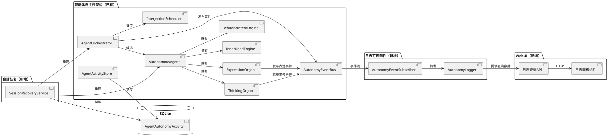

# 1. 实现模型

## 1.1 上下文视图



## 1.2 服务/组件总体架构

### 新增模块

| 模块 | 文件路径 | 职责 |
|------|---------|------|
| AutonomyLogger | `src/maisaka/agent_autonomy/autonomy_logger.py` | 统一日志格式化与输出 |
| AutonomyEventSubscriber | `src/maisaka/agent_autonomy/autonomy_logger.py`（同文件） | 订阅 EventBus 并转发到 Logger |
| SessionRecoveryService | `src/maisaka/agent_autonomy/session_recovery.py` | 重启时从数据库恢复会话关联 |
| 日志查询 API | `src/webui/routers/agent.py`（追加端点） | 提供 `/api/webui/agent/autonomy-logs` 接口 |
| WebUI 日志面板 | `dashboard/src/routes/agent/components/AutonomyLogPanel.tsx` | 前端日志展示 |

### 修改模块

| 模块 | 文件路径 | 修改内容 |
|------|---------|---------|
| AutonomousAgent | `src/maisaka/agent_autonomy/agent.py` | 添加关键决策日志输出 |
| ThinkingOrgan | `src/maisaka/agent_autonomy/thinking_organ.py` | 添加思考完成日志 |
| ExpressionOrgan | `src/maisaka/agent_autonomy/expression_organ.py` | 添加表达意图日志 |
| InterjectionScheduler | `src/maisaka/agent_autonomy/interjection_scheduler.py` | 添加插话决策日志 |
| AgentOrchestrator | `src/maisaka/agent_autonomy/orchestrator.py` | 添加协调日志；添加 `restore_session()` 方法 |
| Runtime | `src/maisaka/runtime.py` | 启动时调用 SessionRecoveryService |
| ActivityStore | `src/maisaka/agent_autonomy/activity_store.py` | 添加 `get_all_active_sessions()` 查询 |
| agent-api.ts | `dashboard/src/lib/agent-api.ts` | 添加日志查询函数 |
| i18n | `dashboard/src/i18n/locales/*.json` | 添加日志面板 i18n 键 |

## 1.3 实现设计文档

### 1.3.1 AutonomyLogger

统一日志格式化器，所有自主性日志的入口。

```python
# src/maisaka/agent_autonomy/autonomy_logger.py

class AutonomyEventType:
    THINKING = "thinking"
    EXPRESSION = "expression"
    INNER_NEED = "inner_need"
    BEHAVIOR_INTENT = "behavior_intent"
    INTERJECTION = "interjection"
    ORCHESTRATION = "orchestration"

class AutonomyLogger:
    """自主性架构统一日志器。"""

    def __init__(self) -> None:
        self._logger = get_logger("agent_autonomy")

    def log(
        self,
        agent_id: str,
        event_type: str,
        detail: str,
        *,
        level: str = "info",
        session_id: str = "",
    ) -> None:
        """记录自主性事件日志。

        格式: [Autonomy:{agent_id}] {event_type}: {detail}
        INFO 级别日志输出到 stdout（Docker 可见）和文件。
        """
        prefix = f"[Autonomy:{agent_id}]"
        message = f"{prefix} {event_type}: {detail}"

        log_method = getattr(self._logger, level, self._logger.info)
        log_method(message)

    @classmethod
    def get(cls) -> "AutonomyLogger":
        return cls()
```

**关键设计决策**：
- 使用项目已有的 `structlog` + `get_logger()` 体系，不引入新依赖
- 日志格式 `[Autonomy:{agent_id}] {event_type}: {detail}` 保证 `grep` 可过滤
- INFO 级别日志通过 structlog 的 stdout handler 自动输出到 Docker 控制台
- 不做额外格式化，structlog 已配置 JSON/Console 双输出

### 1.3.2 AutonomyEventSubscriber

订阅 AutonomyEventBus，将事件转发到 AutonomyLogger。

```python
# 在 autonomy_logger.py 同文件

class AutonomyEventSubscriber:
    """订阅自主性事件总线，转发到日志器。"""

    def __init__(self, logger: AutonomyLogger | None = None) -> None:
        self._logger = logger or AutonomyLogger.get()

    def subscribe_all(self) -> None:
        """订阅所有自主性事件类型。"""
        bus = AutonomyEventBus.get_instance()
        bus.subscribe("interaction_signal", self._on_interaction_signal)
        bus.subscribe("interjection_mention", self._on_interjection_mention)

    async def _on_interaction_signal(self, event: Any) -> None:
        if hasattr(event, "initiator_agent_id"):
            self._logger.log(
                event.initiator_agent_id,
                AutonomyEventType.ORCHESTRATION,
                f"交互信号: {event.interaction_type} → {event.target_agent_id}",
            )

    async def _on_interjection_mention(self, event: Any) -> None:
        if hasattr(event, "speaker_agent_id"):
            self._logger.log(
                event.speaker_agent_id,
                AutonomyEventType.INTERJECTION,
                f"提及 {event.mentioned_agent_id}: {event.content_summary}",
            )
```

**关键设计决策**：
- 只订阅 EventBus 上已有的事件类型，不新增事件
- 各模块（ThinkingOrgan/ExpressionOrgan/InterjectionScheduler）直接调用 `AutonomyLogger.log()` 记录自身日志，不依赖 EventBus 转发
- EventBus 订阅仅用于跨模块事件（交互信号、插话提及）

### 1.3.3 SessionRecoveryService

重启时从数据库恢复会话关联。

```python
# src/maisaka/agent_autonomy/session_recovery.py

class SessionRecoveryService:
    """重启时从数据库恢复智能体与会话的关联。"""

    def __init__(self) -> None:
        self._activity_store = AgentActivityStore()
        self._logger = AutonomyLogger.get()

    async def recover_all(self, chat_manager: Any) -> dict[str, list[str]]:
        """恢复所有活跃会话的智能体关联。

        Returns:
            {session_id: [agent_id, ...]} 成功恢复的映射
        """
        # 1. 查询所有 exited_at 为空的活跃记录
        active_records = self._activity_store.get_all_active_sessions()

        # 2. 按 session_id 分组
        sessions: dict[str, list[AgentAutonomyActivity]] = {}
        for record in active_records:
            # 验证 ChatSession 仍存在
            chat_session = chat_manager.get_session_by_session_id(record.session_id)
            if chat_session is None:
                self._activity_store.deactivate(
                    record.session_id, record.agent_id, "session_deleted"
                )
                continue

            if record.session_id not in sessions:
                sessions[record.session_id] = []
            sessions[record.session_id].append(record)

        # 3. 为每个会话重建 Orchestrator 和 Agent
        recovered: dict[str, list[str]] = {}
        for session_id, records in sessions.items():
            try:
                session_name = chat_manager.get_session_name(session_id) or session_id
                # 获取或创建 Orchestrator
                orch = AgentOrchestrator.get_by_session(session_id)
                if orch is None:
                    # 需要创建 Orchestrator，但需要 ChatLoopAdapter
                    # 这部分在 Runtime._init_agent_autonomy 中处理
                    continue

                for record in records:
                    orch.restore_agent(record.agent_id, record.is_primary)
                    if session_id not in recovered:
                        recovered[session_id] = []
                    recovered[session_id].append(record.agent_id)

            except Exception as exc:
                logger.warning(
                    f"[agent_autonomy] 恢复会话失败: session={session_id} error={exc}"
                )

        # 4. 日志记录恢复结果
        total_agents = sum(len(v) for v in recovered.values())
        self._logger.log(
            "system",
            AutonomyEventType.ORCHESTRATION,
            f"会话恢复完成: {len(recovered)} 个会话, {total_agents} 个智能体",
        )

        return recovered
```

**关键设计决策**：
- 恢复过程是纯状态重建，不触发任何智能体行为
- 验证 ChatSession 存在性，不存在则标记退出
- Orchestrator 新增 `restore_agent()` 方法，区别于 `add_agent()`（后者会触发事件）
- 冷却状态（内存数据）不恢复，重启后可立即插话

### 1.3.4 AgentOrchestrator 修改

```python
# orchestrator.py 新增方法

def restore_agent(self, agent_id: str, is_primary: bool = False) -> None:
    """从数据库恢复智能体到编排器（不触发事件）。"""
    if agent_id in self._active_agents:
        return

    agent = AutonomousAgent(agent_id)
    self._active_agents[agent_id] = agent

    if is_primary:
        self._primary_agent_id = agent_id

    # 不调用 _subscribe_events()，不发布事件
    # 不记录 activity（数据库中已有）
```

### 1.3.5 ActivityStore 新增查询

```python
# activity_store.py 新增方法

def get_all_active_sessions(self) -> list[AgentAutonomyActivity]:
    """查询所有未退出的活跃记录（用于重启恢复）。"""
    with get_db_session() as session:
        return list(
            session.query(AgentAutonomyActivity)
            .filter(AgentAutonomyActivity.exited_at.is_(None))
            .all()
        )
```

### 1.3.6 Runtime 启动恢复

```python
# runtime.py 修改 _init_agent_autonomy

def _init_agent_autonomy(self) -> None:
    # ... 现有初始化逻辑 ...

    # 新增：恢复已有会话
    from src.maisaka.agent_autonomy.session_recovery import SessionRecoveryService
    recovery = SessionRecoveryService()
    asyncio.create_task(recovery.recover_all(self._chat_manager))
```

# 2. 接口设计

## 2.1 总体设计

- **Python 内部接口**：`AutonomyLogger.log()` — 所有模块调用
- **HTTP API**：`GET /api/webui/agent/autonomy-logs` — WebUI 查询
- **EventBus 订阅**：`AutonomyEventSubscriber` — 跨模块事件日志

## 2.2 接口清单

### AutonomyLogger.log()

```python
def log(
    self,
    agent_id: str,
    event_type: str,       # AutonomyEventType 枚举值
    detail: str,           # 人类可读的决策描述
    *,
    level: str = "info",   # debug/info/warning/error
    session_id: str = "",  # 可选，关联的会话 ID
) -> None
```

### GET /api/webui/agent/autonomy-logs

**请求参数**：

| 参数 | 类型 | 必填 | 说明 |
|------|------|------|------|
| agent_id | string | 否 | 按智能体筛选 |
| event_type | string | 否 | 按事件类型筛选 |
| start_time | string | 否 | 起始时间 ISO 8601 |
| end_time | string | 否 | 结束时间 ISO 8601 |
| page | int | 否 | 页码，默认 1 |
| page_size | int | 否 | 每页条数，默认 50 |

**响应**：

```json
{
  "items": [
    {
      "agent_id": "himeko",
      "event_type": "thinking",
      "detail": "决定参与讨论",
      "timestamp": "2026-07-06T12:00:00.000Z",
      "session_id": "group_12345",
      "log_level": "info"
    }
  ],
  "total": 100,
  "page": 1,
  "page_size": 50
}
```

**实现方式**：读取日志文件，按 `[Autonomy:` 前缀过滤，解析为结构化数据。使用 `tail` 方式读取最近 N 行，避免全文件扫描。

### AgentOrchestrator.restore_agent()

```python
def restore_agent(self, agent_id: str, is_primary: bool = False) -> None
```

### AgentActivityStore.get_all_active_sessions()

```python
def get_all_active_sessions(self) -> list[AgentAutonomyActivity]
```

# 4. 数据模型

## 4.1 设计目标

- 日志数据不新增数据库表（使用文件日志 + 运行时解析）
- 会话恢复使用已有的 `AgentAutonomyActivity` 表
- 不引入新的持久化依赖

## 4.2 模型实现

### 已有模型（无需修改）

**AgentAutonomyActivity** — 已在 `database_model.py` 中定义，包含：
- `session_id`, `agent_id`, `is_primary`, `activated_at`, `exited_at`, `exit_reason`, `activation_reason`, `last_spoke_at`

重启恢复时查询 `exited_at IS NULL` 的记录即可。

### 日志查询模型（运行时解析，不持久化）

```python
class AutonomyLogEntry(BaseModel):
    agent_id: str
    event_type: str
    detail: str
    timestamp: str
    session_id: str = ""
    log_level: str = "info"
```

### 日志文件读取策略

- 日志文件路径：由 structlog 配置决定（通常在 `logs/` 目录）
- 查询方式：从文件末尾向前读取（`tail`），按 `[Autonomy:` 前缀过滤
- 缓存：无缓存，每次查询实时读取（日志量可控）
- 性能：限制最大读取行数（默认 5000 行），避免大文件扫描