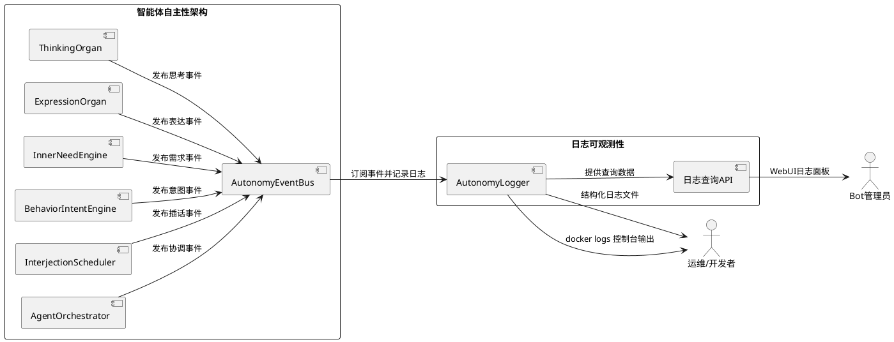
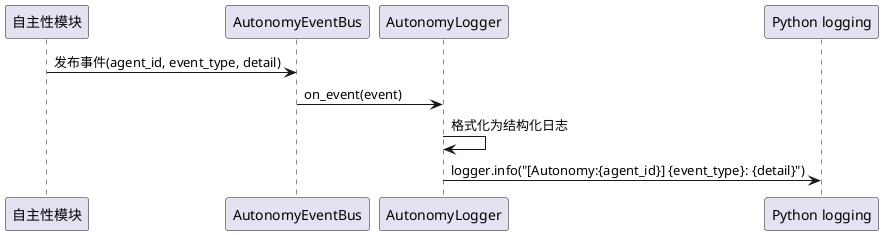
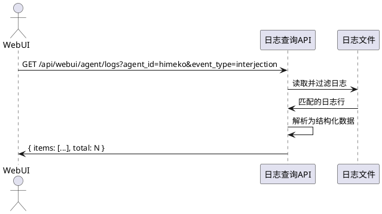
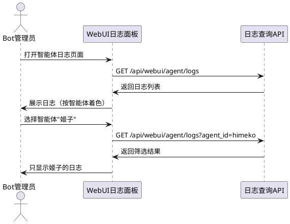
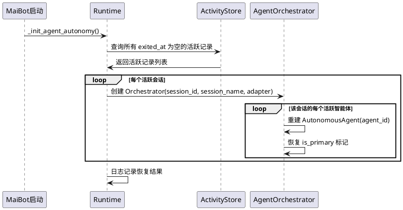

# 1. 组件定位

## 1.1 核心职责

本组件负责为智能体自主性架构提供结构化日志可观测性与会话持久化恢复，实现：
1. 从日志中分辨哪个智能体在发挥作用
2. 智能体关联的会话在重启后能够恢复

## 1.2 核心输入

1. **ThinkingOrgan 思考事件**：智能体内部思考过程（内心独白、决策推理）
2. **ExpressionOrgan 表达事件**：智能体表达意图（想说话、想行动）
3. **InnerNeedEngine 需求事件**：内在需求计算结果（孤独感、好奇心等）
4. **BehaviorIntentEngine 意图事件**：行为意图计算结果（插话、主动发起等）
5. **InterjectionScheduler 插话事件**：插话调度决策（触发、冷却、跳过）
6. **AgentOrchestrator 协调事件**：多智能体协调决策（发言权分配、优先级排序）
7. **AutonomyEventBus 事件总线**：所有自主性事件的流转记录
8. **ChatLoopAdapter 交互事件**：聊天循环中的智能体参与记录

## 1.3 核心输出

1. **Docker 控制台日志**：关键决策日志直接输出到 stdout，`docker logs` 即可看到智能体活动
2. **结构化日志文件**：带 agent_id 标记的完整日志条目，输出到 Python logging 系统
3. **日志查询能力**：按智能体、事件类型、时间范围筛选日志
4. **WebUI 日志面板**：前端实时展示智能体活动日志
5. **会话恢复**：重启后从数据库恢复智能体与会话的关联关系

## 1.4 职责边界

- **不负责**：日志存储引擎的实现（使用 Python 标准 logging + 文件轮转）
- **不负责**：日志的持久化策略（由运维配置决定）
- **不负责**：性能监控指标（那是 metrics 的职责，不是 logs）
- **不负责**：修改智能体的业务逻辑（只观察，不干预）

# 2. 领域术语

**agent_id**
: 唯一标识一个智能体的字符串，如 "himeko"、"bronya"。

**自主性事件（Autonomy Event）**
: 智能体自主行为链路中产生的任何事件，包括思考、表达、需求、意图、插话、协调。

**思考（Thinking）**
: ThinkingOrgan 产生的内部推理过程，包含内心独白和决策理由。

**表达（Expression）**
: ExpressionOrgan 产生的表达意图，表示智能体想要说话或行动。

**内在需求（Inner Need）**
: InnerNeedEngine 计算的动态需求值，如孤独感、好奇心、表达欲。

**行为意图（Behavior Intent）**
: BehaviorIntentEngine 计算的意图结果，如插话意图、主动发起意图。

**插话调度（Interjection Scheduling）**
: InterjectionScheduler 根据意图和冷却策略决定是否执行插话。

**协调（Orchestration）**
: AgentOrchestrator 在多智能体场景下分配发言权和排序优先级。

**事件总线（Event Bus）**
: AutonomyEventBus 负责自主性事件的发布与订阅。

# 3. 角色与边界

## 3.1 核心角色

**运维人员**：通过日志排查智能体行为异常、验证自主性功能是否正常运作。

**开发者**：通过日志理解智能体决策链路、调试自主性模块。

**Bot 管理员**：通过 WebUI 观察各智能体的实时活动状态。

## 3.2 外部系统

**Python logging 系统**：日志输出的底层基础设施。

**AutonomyEventBus**：事件源，自主性事件的发布通道。

**WebUI 后端 API**：提供日志查询接口给前端。

## 3.3 交互上下文

# 4. DFX约束

## 4.1 性能

1. 单条日志写入延迟不得超过 1ms
2. 日志模块不得影响智能体决策链路的主路径性能
3. 日志格式化必须在 I/O 线程完成，不得阻塞事件循环

## 4.2 可靠性

1. 日志模块异常不得导致智能体功能中断
2. 日志写入失败应静默降级，不抛出异常到业务层

## 4.3 安全性

1. 日志中不得记录用户敏感信息（如真实姓名、手机号）
2. 日志中不得记录 API Key 或 Token

## 4.4 可维护性

1. 每个自主性模块必须使用统一的日志格式
2. 日志必须包含 agent_id、event_type、timestamp 三个必选字段
3. 日志级别必须遵循：DEBUG=内部细节、INFO=关键决策、WARNING=异常但可恢复、ERROR=功能异常
4. INFO 级别日志必须同时输出到 stdout（Docker 控制台可见）和日志文件
5. Docker 环境下，`docker logs` 必须能直接看到智能体的关键活动（思考决策、表达意图、插话执行、协调结果）

## 4.5 兼容性

1. 日志格式变更必须向后兼容
2. 不得破坏现有 Python logging 配置

# 5. 核心能力

## 5.1 智能体活动日志记录

### 5.1.1 业务规则

1. **统一日志格式**：所有自主性日志必须使用结构化格式，包含 agent_id、event_type、timestamp、detail 四个字段
   - 验收条件：任意一条自主性日志 → 均包含上述四个字段

2. **日志前缀标记**：每条日志必须以 `[Autonomy:{agent_id}]` 前缀开头，便于 grep 过滤
   - 验收条件：`grep "\[Autonomy:" logfile` → 能匹配所有自主性日志

3. **事件类型分类**：event_type 必须是以下枚举值之一：thinking、expression、inner_need、behavior_intent、interjection、orchestration
   - 验收条件：日志中出现其他 event_type → 视为格式错误

4. **关键决策日志级别**：智能体的关键决策点必须以 INFO 级别记录
   - 验收条件：ThinkingOrgan 产生决策 → 日志级别为 INFO

5. **内部细节日志级别**：中间计算过程以 DEBUG 级别记录
   - 验收条件：InnerNeedEngine 计算中间值 → 日志级别为 DEBUG

6. **Docker 控制台可见性**：INFO 级别的关键决策日志必须输出到 stdout，确保 `docker logs` 能直接看到智能体活动
   - 验收条件：`docker logs maim-bot-core 2>&1 | grep "\[Autonomy:"` → 能看到智能体思考、表达、插话等关键活动
   - 验收条件：智能体产生插话决策 → `docker logs` 中出现 `[Autonomy:himeko] interjection: 决定插话...`
   - 验收条件：智能体完成思考 → `docker logs` 中出现 `[Autonomy:himeko] thinking: ...`

7. **禁止项**：禁止在日志中记录完整的 LLM 响应内容（可能包含用户隐私）
   - 验收条件：日志中出现完整 LLM response → 视为违规

### 5.1.2 交互流程

### 5.1.3 异常场景

1. **日志写入失败**
   - 触发条件：磁盘满或权限不足
   - 系统行为：静默忽略，不抛出异常
   - 用户感知：无感知，智能体功能不受影响

2. **事件总线异常**
   - 触发条件：AutonomyEventBus 未初始化
   - 系统行为：各模块使用本地 logger 降级记录
   - 用户感知：日志格式可能不统一，但功能正常

## 5.2 日志查询 API

### 5.2.1 业务规则

1. **按智能体查询**：必须支持按 agent_id 筛选日志
   - 验收条件：传入 agent_id="himeko" → 只返回姬子的日志

2. **按事件类型查询**：必须支持按 event_type 筛选日志
   - 验收条件：传入 event_type="interjection" → 只返回插话相关日志

3. **按时间范围查询**：必须支持按时间范围筛选日志
   - 验收条件：传入 start_time 和 end_time → 只返回该时间段的日志

4. **分页支持**：查询结果必须支持分页
   - 验收条件：传入 page 和 page_size → 返回对应页的数据

5. **禁止项**：禁止返回非自主性日志（避免日志泄露）
   - 验收条件：查询结果中不包含非 [Autonomy:] 前缀的日志

### 5.2.2 交互流程

### 5.2.3 异常场景

1. **日志文件不存在**
   - 触发条件：首次运行，日志文件尚未创建
   - 系统行为：返回空列表
   - 用户感知：WebUI 显示"暂无日志"

2. **日志文件过大**
   - 触发条件：查询时间范围跨度过大
   - 系统行为：限制单次最大返回条数（默认 1000 条）
   - 用户感知：结果被截断，提示缩小查询范围

## 5.3 WebUI 日志面板

### 5.3.1 业务规则

1. **实时日志流**：必须支持实时展示最新的智能体活动日志
   - 验收条件：智能体产生活动 → 3秒内 WebUI 显示新日志

2. **智能体筛选**：必须支持按智能体筛选日志
   - 验收条件：选择"姬子" → 只显示姬子的活动日志

3. **事件类型筛选**：必须支持按事件类型筛选
   - 验收条件：选择"插话" → 只显示插话相关日志

4. **日志着色**：不同事件类型必须使用不同颜色标记
   - 验收条件：thinking=蓝色、expression=绿色、interjection=橙色、orchestration=紫色

5. **i18n 三语**：日志面板的所有 UI 文本必须支持中英日三语
   - 验收条件：切换语言 → 面板标题、筛选标签等均跟随切换

### 5.3.2 交互流程

### 5.3.3 异常场景

1. **API 不可用**
   - 触发条件：后端服务未启动
   - 系统行为：显示错误提示
   - 用户感知：面板显示"无法连接到日志服务"

2. **无日志数据**
   - 触发条件：智能体尚未产生任何活动
   - 系统行为：显示空状态提示
   - 用户感知：面板显示"暂无智能体活动记录"

# 6. 数据约束

## 6.1 自主性日志条目

1. **agent_id**：智能体唯一标识，非空字符串，与配置中的 agent_id 一致
2. **event_type**：事件类型枚举，必须为 thinking/expression/inner_need/behavior_intent/interjection/orchestration 之一
3. **timestamp**：事件发生时间，ISO 8601 格式，精确到毫秒
4. **detail**：事件详情，字符串，包含决策理由或计算结果摘要
5. **session_id**：可选，关联的聊天会话 ID
6. **log_level**：日志级别，必须为 DEBUG/INFO/WARNING/ERROR 之一

## 6.2 智能体会话关联

1. **session_id**：聊天会话唯一标识，非空字符串
2. **agent_id**：关联的智能体标识，非空字符串
3. **is_primary**：是否为该会话的主发言智能体，布尔值
4. **activated_at**：智能体加入会话的时间，ISO 8601 格式
5. **exited_at**：智能体退出会话的时间，ISO 8601 格式，可为空（表示仍在活跃）
6. **activation_reason**：加入原因，字符串（如 session_create、interjection_join）

# 7. 会话持久化与恢复

## 7.1 业务规则

1. **会话关联持久化**：智能体与会话的关联关系必须持久化到数据库（已有 AgentAutonomyActivity 表）
   - 验收条件：智能体加入会话 → 数据库中存在对应记录

2. **重启恢复**：MaiBot 重启后，必须从数据库恢复所有活跃会话的智能体关联
   - 验收条件：重启后 `AgentOrchestrator._registry` 中包含所有未退出的会话

3. **Orchestrator 重建**：重启后，对每个有活跃智能体的会话，必须重建 AgentOrchestrator 实例
   - 验收条件：重启后调用 `AgentOrchestrator.get_by_session(session_id)` → 返回有效的 Orchestrator

4. **AutonomousAgent 重建**：重启后，对每个活跃的智能体，必须重建 AutonomousAgent 实例
   - 验收条件：重启后 Orchestrator 的 `_active_agents` 包含所有未退出的智能体

5. **主发言恢复**：重启后必须恢复会话的主发言智能体标记
   - 验收条件：重启前姬子是主发言 → 重启后姬子仍是主发言

6. **冷却状态重置**：重启后插话冷却状态可以重置（内存数据，无需持久化）
   - 验收条件：重启后智能体可以立即插话，无需等待冷却

7. **禁止项**：禁止在恢复过程中触发任何智能体行为（恢复是纯状态重建，不产生副作用）
   - 验收条件：恢复过程中不产生思考、表达、插话等事件

## 7.2 交互流程

## 7.3 异常场景

1. **数据库中无活跃记录**
   - 触发条件：首次部署或所有会话已退出
   - 系统行为：跳过恢复，等待新会话创建
   - 用户感知：无感知，正常启动

2. **关联的聊天会话已不存在**
   - 触发条件：数据库中有活跃记录但对应的 ChatSession 已被删除
   - 系统行为：将该记录标记为 exited（exit_reason="session_deleted"），跳过恢复
   - 用户感知：无感知，日志记录清理操作

3. **智能体配置已变更**
   - 触发条件：数据库中记录的 agent_id 在当前配置中不存在
   - 系统行为：跳过该智能体的恢复，日志记录警告
   - 用户感知：该智能体不再活跃，其他智能体正常恢复