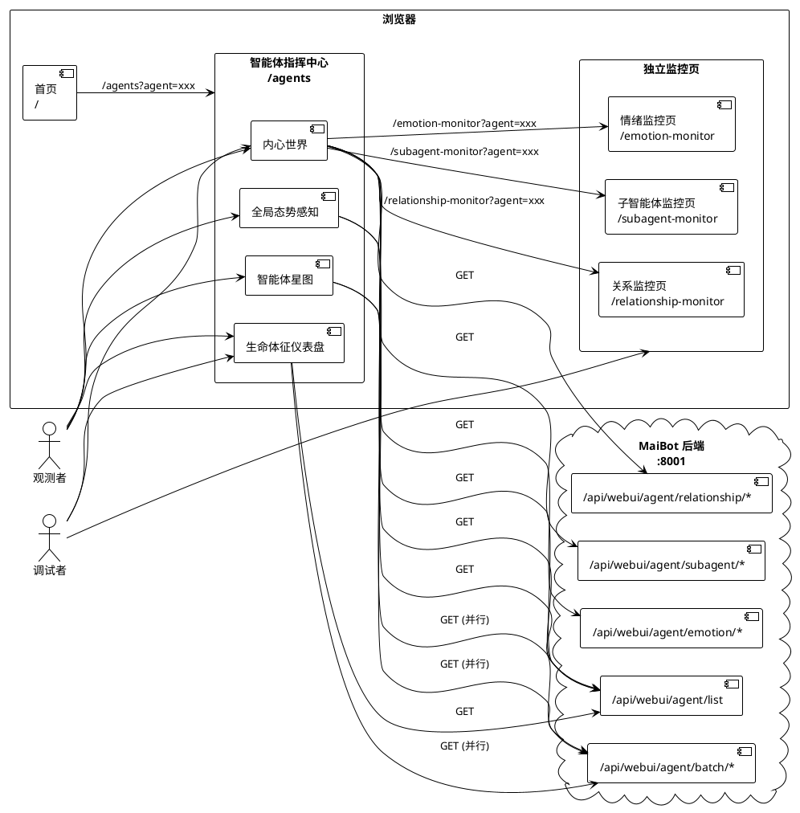
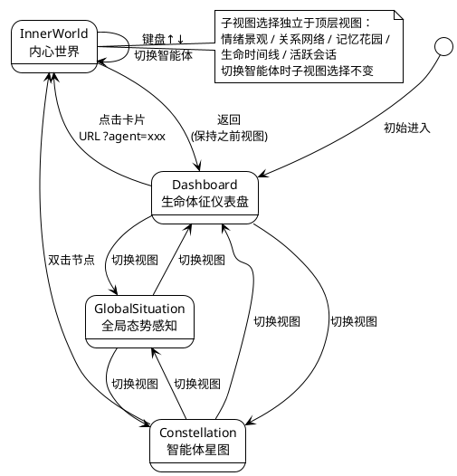
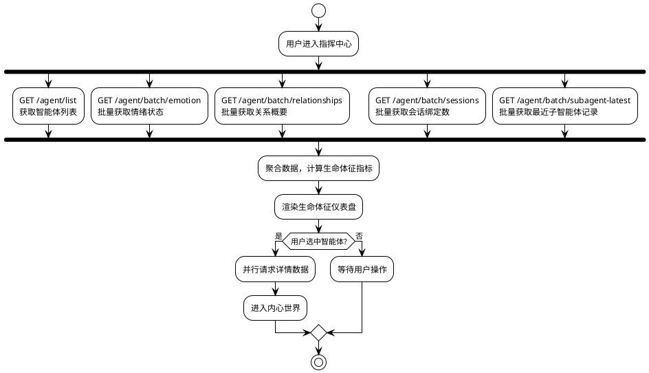
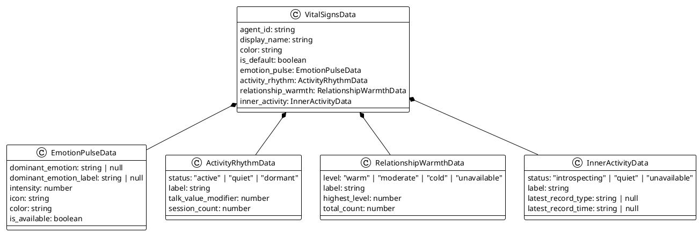
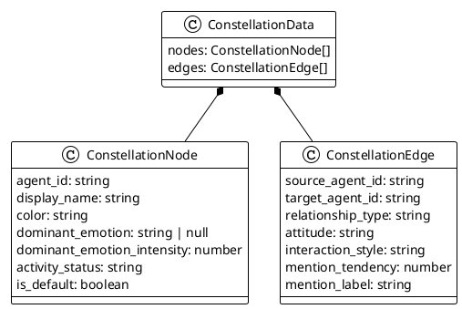
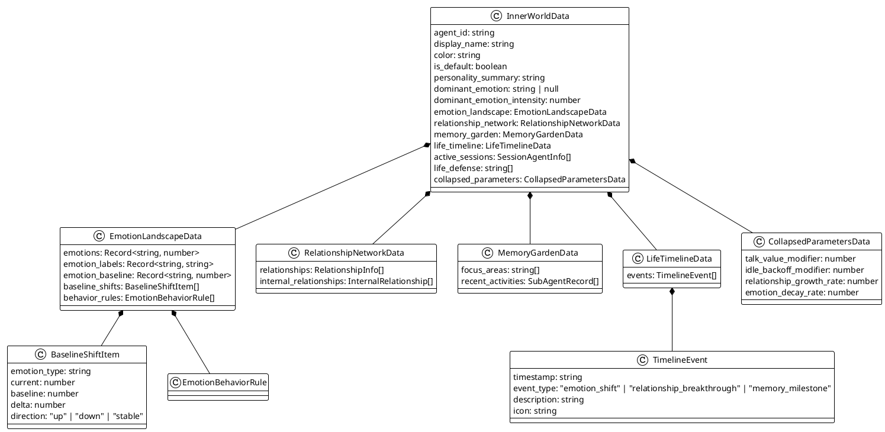

# 智能体指挥中心 — 实现方案设计

> 核心理念：不做故事的结局，只做生命的序章。

# 一、需求与存量功能关系分析

## 1.1 需求功能与存量功能对比

### 1.1.1 已实现功能

| 需求功能 | 存量功能 | 代码位置 | 匹配度 |
|---------|---------|---------|--------|
| 智能体列表查询与展示 | `getAgentList()` + `AgentCard` 组件 | `agent-api.ts:117` / `agent/index.tsx:241` | 75% |
| 智能体详情查询 | `getAgentDetail()` | `agent-api.ts:125` | 100% |
| 情绪状态查询 | `getAgentEmotion()` | `agent-api.ts:132` | 100% |
| 情绪雷达图 | `EmotionRadar` / `EmotionRadarChart` SVG 组件 | `agent/index.tsx:80` / `emotion-monitor/index.tsx:42` | 75% |
| 情绪柱状图 | `EmotionBars` / `EmotionBarChart` 组件 | `agent/index.tsx:163` / `emotion-monitor/index.tsx:132` | 75% |
| 关系数据查询 | `getAgentRelationships()` | `agent-api.ts:146` | 100% |
| 关系列表展示 | `RelationshipTable` 组件 | `agent/index.tsx:187` | 50% |
| 会话绑定/解绑 | `bindSessionAgent()` / `unbindSessionAgent()` | `agent-api.ts:163` / `agent-api.ts:174` | 100% |
| 智能体会话列表 | `getSessionsByAgent()` | `agent-api.ts:208` | 100% |
| 智能体配置重载 | `reloadAgents()` | `agent-api.ts:216` | 100% |
| 子智能体执行记录 | `getSubAgentRecords()` | `agent-api.ts:271` | 100% |
| 子智能体统计 | `getSubAgentStats()` | `agent-api.ts:290` | 100% |
| 搜索过滤智能体 | `searchQuery` 状态过滤 | `agent/index.tsx:373` | 100% |
| 智能体指示器 | `AgentIndicator` 组件（3种尺寸） | `components/agent/AgentIndicator.tsx` | 100% |
| 情绪基线对比 | `BaselineComparisonCard` 组件 | `emotion-monitor/index.tsx:219` | 75% |
| 首页智能体总览导航 | `AgentOverviewGrid` 组件，链接至 `/agents?agent=xxx` | `routes/index.tsx:225` | 75% |
| 后端智能体 API 路由 | 完整的 `/api/webui/agent/**` 路由集 | `webui/routers/agent.py` | 100% |
| i18n 多语言支持 | `react-i18next`，4语言（zh/en/ja/ko） | `i18n/locales/*.json` | 100% |
| 内部关系数据结构 | `InternalRelationship` 类型 + 后端序列化 | `agent-api.ts:11` / `agent.py:39` | 100% |
| 反机械化规则数据 | `anti_mechanization_rules` 字段 | `agent-api.ts:34` / `config.py:153` | 100% |
| 记忆焦点区域数据 | `memory_focus_areas` 字段 | `agent-api.ts:32` / `config.py:147` | 100% |

### 1.1.2 需要扩展的功能

| 需求功能 | 存量功能 | 差异说明 | 扩展方向 |
|---------|---------|---------|---------|
| 生命体征卡片 | `AgentCard` 组件 | 当前卡片展示原始技术参数（`talk_value_modifier`、`relationship_growth_rate`），无情绪脉动/活跃节奏/关系温度/内在活动指示 | 重构为 `VitalSignsCard`，增加4项生命感指标，移除原始参数展示，增加脉动/呼吸灯动画 |
| 情绪雷达图复用 | `EmotionRadar`（agent页）与 `EmotionRadarChart`（情绪监控页） | 两处实现几乎相同但各自独立，参数接口不同 | 提取为共享组件 `EmotionRadarChart`，统一接口，放入 `components/agent/` 目录 |
| 情绪柱状图复用 | `EmotionBars`（agent页）与 `EmotionBarChart`（情绪监控页） | 同上，两处独立实现 | 提取为共享组件 `EmotionBarChart`，统一接口 |
| 关系网络可视化 | `RelationshipTable`（列表形式） | 需求要求关系网络图（小型力导向图），当前仅为表格列表 | 新增 `RelationshipNetworkGraph` 组件，基于 reactflow/dagre 实现小型网络图，保留表格作为辅助视图 |
| 内部关系展示 | 列表形式展示 `internal_relationships` | 需求要求星图（力导向图）展示，当前为 Badge + 文字列表 | 新增 `AgentConstellation` 力导向图组件，基于 reactflow + dagre |
| 反机械化规则展示 | 技术列表（编号+文本） | 需求要求"生命防线"语义化展示 | 重构为 `LifeDefensePanel` 组件，语义化描述替代编号列表 |
| 记忆焦点展示 | `Badge` 标签列表 | 需求要求"记忆花园"隐喻式展示 | 重构为 `MemoryGarden` 组件，增加花园视觉隐喻 |
| 会话绑定对话框 | 基础 Select 对话框 | 功能完整但交互简陋 | 优化为更友好的会话选择器，增加搜索和分类 |
| URL 参数支持 | `AgentOverviewGrid` 已生成 `?agent=xxx` 链接 | `AgentManagementPage` 未读取 URL 参数 | 增加 `useSearch()` 读取 `agent` 参数，自动进入内心世界 |
| 情绪基线偏移对比 | `BaselineComparisonCard`（情绪监控页） | 当前为并列柱状图对比，需求要求偏移量可视化 | 新增 `EmotionBaselineShift` 组件，展示当前值与基线的差异方向和幅度 |
| 主导情绪分布统计 | `dominantEmotionStats`（情绪监控页） | 已有统计逻辑，但展示为标签列表，需求要求环形图 | 复用统计逻辑，新增 `EmotionDonutChart` 组件（基于 recharts PieChart） |

### 1.1.3 需要新增的功能或接口

**前端组件（按业务模块分组）：**

1. **视图框架层**
   - `CommandCenterLayout`：指挥中心整体布局，管理三个顶层视图的切换
   - `ViewSwitcher`：顶层视图切换器（仪表盘/星图/全局态势）
   - `InnerWorldView`：内心世界沉浸式视图容器

2. **生命体征仪表盘**
   - `VitalSignsCard`：生命体征卡片（含脉动动画、呼吸灯、温度指示、内省指示）
   - `EmotionPulse`：情绪脉动动画组件
   - `ActivityRhythmIndicator`：活跃节奏指示器（活跃/安静/沉睡）
   - `RelationshipWarmthIndicator`：关系温度指示器
   - `InnerActivityIndicator`：内在活动指示器（内省动画）
   - `CoreBadge`：核心智能体徽章

3. **智能体星图**
   - `AgentConstellation`：力导向图主组件（基于 reactflow + dagre）
   - `ConstellationNode`：星图节点（含脉动动画）
   - `ConstellationEdge`：星图关系连线（颜色/粗细映射）
   - `RelationshipTooltip`：关系悬停浮层
   - `NodeDetailPopover`：节点点击浮层

4. **内心世界**
   - `IdentityHeader`：身份标识区域（大头像+名称+情绪徽章+人格摘要）
   - `EmotionLandscape`：情绪景观子视图
   - `EmotionBaselineShift`：基线偏移可视化
   - `EmotionBehaviorMap`：情绪-行为映射展示
   - `RelationshipNetwork`：关系网络子视图（含小型网络图）
   - `MemoryGarden`：记忆花园子视图（标签花园+内在活动）
   - `LifeTimeline`：生命时间线子视图
   - `ActiveSessions`：活跃会话子视图
   - `LifeDefensePanel`：生命防线（反机械化规则语义化展示）
   - `CollapsedParameters`：底层参数折叠区
   - `DeepMonitorLink`：深入观测导航链接

5. **全局态势感知**
   - `GlobalSituationView`：全局态势主视图
   - `EmotionDonutChart`：群体情绪环形图
   - `ActivityHeatmap`：活跃度热力图
   - `RelationshipDynamicsFlow`：关系动态流
   - `GroupStatsBar`：群体概览统计条

6. **交互与动画**
   - `useAgentNavigation`：智能体导航 hook（键盘快捷键、URL 参数）
   - `useViewSwitch`：视图切换状态管理 hook
   - `useBatchAgentData`：批量智能体数据加载 hook
   - `PulseAnimation`：脉动动画 CSS 模块
   - `BreathingAnimation`：呼吸灯动画 CSS 模块

**后端 API（新增）：**

1. `GET /api/webui/agent/batch/emotion`：批量获取多个智能体情绪状态（解决 N+1 查询问题）
2. `GET /api/webui/agent/batch/relationships`：批量获取多个智能体关系概要
3. `GET /api/webui/agent/batch/sessions`：批量获取多个智能体的会话绑定数
4. `GET /api/webui/agent/{agent_id}/emotion-behavior-rules`：获取智能体情绪-行为映射规则
5. `GET /api/webui/agent/batch/subagent-latest`：批量获取各智能体最近子智能体执行记录

**i18n 翻译键（新增）：**

- `agent.commandCenter.*`：指挥中心相关文案
- `agent.vitalSigns.*`：生命体征相关文案
- `agent.constellation.*`：星图相关文案
- `agent.innerWorld.*`：内心世界相关文案
- `agent.globalSituation.*`：全局态势相关文案
- `agent.lifeDefense.*`：生命防线相关文案
- `agent.memoryGarden.*`：记忆花园相关文案
- `agent.lifeTimeline.*`：生命时间线相关文案

## 1.2 存量功能详细分析

### 1.2.1 AgentManagementPage（`agent/index.tsx`）

**接口契约**：
- 入参：无（路由页面组件）
- 内部状态：`selectedAgentId`、`searchQuery`、`bindDialogOpen`、`bindSessionId`、`bindTargetAgentId`
- 数据查询：5个 `useQuery`（agents、detail、emotion、relationships、sessions）+ 1个 chatStreams 查询
- 变更操作：3个 `useMutation`（reload、bind、unbind）

**业务规则**：
- 左右分栏布局：左侧 320px 智能体列表，右侧详情区
- 选中智能体后右侧展示 Tabs（概览/情绪/关系/会话）
- 概览 Tab 展示原始参数值（talk_value_modifier 等）
- 情绪 Tab 展示雷达图 + 柱状图 + 基线对比
- 关系 Tab 展示关系表格
- 会话 Tab 展示已绑定会话列表 + 解绑按钮

**扩展点**：
- 布局结构需彻底重构（从左右分栏变为三视图切换 + 内心世界叠加）
- `AgentCard` 需替换为 `VitalSignsCard`
- Tabs 需替换为内心世界子视图
- 需增加 URL 参数读取（`?agent=xxx`）

**约束**：
- 所有查询使用 `@tanstack/react-query`，遵循 `queryKey` 前缀约定
- 变更操作通过 `useMutation` + `toast` 反馈
- 组件内硬编码中文文案需迁移至 i18n

### 1.2.2 EmotionMonitorPage（`emotion-monitor/index.tsx`）

**接口契约**：
- 入参：无
- 内部状态：`selectedAgentId`、`viewMode`（grid/detail）、`autoRefresh`
- 数据查询：3个 `useQuery`（agents、allEmotions、singleEmotion）

**业务规则**：
- Grid 模式：展示主导情绪统计 + 所有智能体情绪卡片网格
- Detail 模式：展示单个智能体的雷达图 + 柱状图 + 基线对比
- 支持自动刷新（30秒间隔）

**扩展点**：
- `EmotionRadarChart` 和 `EmotionBarChart` 需提取为共享组件
- `BaselineComparisonCard` 的并列对比需增强为偏移量可视化

**约束**：
- 页面独立运行，不依赖指挥中心
- 指挥中心的"深入观测"链接需导航至此页面并携带 `?agent=xxx` 参数

### 1.2.3 RelationshipMonitorPage（`relationship-monitor/index.tsx`）

**接口契约**：
- 入参：无
- 内部状态：`selectedAgentId`
- 数据查询：3个 `useQuery`（agents、allRelationships、selectedRelationships）

**业务规则**：
- 左右分栏：左侧智能体选择列表，右侧关系详情
- 关系详情包含：等级分布图 + 平均分数 + 关系排行

**扩展点**：
- 需支持 URL 参数 `?agent=xxx` 自动选中
- 指挥中心的关系网络子视图需复用其数据获取逻辑

### 1.2.4 SubAgentMonitorPage（`subagent-monitor/index.tsx`）

**接口契约**：
- 入参：无
- 内部状态：`filterType`、`filterStatus`、`filterAgent`
- 数据查询：3个 `useQuery`（agents、stats、records）

**业务规则**：
- 顶部统计卡片 + 类型/状态分布 + 筛选器 + 执行记录表
- 支持按智能体、类型、状态筛选

**扩展点**：
- 需支持 URL 参数 `?agent=xxx` 自动筛选
- 指挥中心的内在活动展示需复用其数据

### 1.2.5 后端 Agent API（`webui/routers/agent.py`）

**接口契约**：
- 路由前缀：`/api/webui/agent`
- 认证：`require_auth` 依赖注入
- 响应格式：`{ success: bool, ...data }`

**已有端点**：
- `GET /list`：智能体列表
- `GET /{agent_id}`：智能体详情
- `GET /emotion/{agent_id}`：情绪状态
- `GET /relationship/{agent_id}`：关系概览
- `GET/PUT/DELETE /binding/session/{session_id}`：会话绑定 CRUD
- `PUT /binding/batch`：批量绑定
- `GET/PUT/DELETE /binding/group`：群绑定 CRUD
- `GET /sessions/{agent_id}`：智能体会话列表
- `POST /reload`：重载配置
- `GET /subagent/records`：子智能体记录
- `GET /subagent/stats`：子智能体统计

**约束**：
- 情绪和关系数据为逐个查询，指挥中心首页需并行请求所有智能体数据（N+1 问题）
- `AgentConfig.emotion_behavior_map` 字段未在 API 响应中暴露
- 子智能体记录无"最近一条"快捷查询

### 1.2.6 AgentConfig 数据模型（`maisaka/agent/config.py`）

**关键字段**：
- `emotion_behavior_map: list[EmotionBehaviorRule]`：情绪-行为映射规则，API 未暴露
- `internal_relationships: list[InternalRelationship]`：内部关系网，API 已暴露
- `anti_mechanization_rules: list[str]`：反机械化规则，API 已暴露
- `memory_focus_areas: list[str]`：记忆焦点，API 已暴露
- `time_behavior_profile: TimeBehaviorProfile`：时间行为画像，API 未暴露

**约束**：
- `emotion_behavior_map` 需新增 API 端点暴露
- 所有字段均有 Pydantic 验证，后端扩展安全

### 1.2.7 首页 AgentOverviewGrid（`routes/index.tsx`）

**接口契约**：
- 使用 `useQuery` 获取智能体列表
- 每个智能体渲染为 `Link` 组件，指向 `/agents?agent=xxx`
- 使用 `AgentIndicator` 组件展示头像

**扩展点**：
- 需求要求点击后导航至指挥中心并自动进入内心世界，当前链接格式已满足
- 可能需要增加情绪脉动等视觉信号

### 1.2.8 技术栈依赖

**已有可复用依赖**：
- `recharts@3.5.1`：图表库，可用于环形图、柱状图
- `reactflow@11.11.4` + `dagre@0.8.5`：流程图/图布局，可用于星图力导向图
- `motion@12.38.0`：动画库（framer-motion 继任者），可用于过渡动画
- `@react-spring/web@10.0.3`：弹簧动画，可用于脉动/呼吸灯
- `@radix-ui/react-*`：UI 组件库
- `lucide-react`：图标库

**需新增依赖**：
- 无需新增。`reactflow + dagre` 可实现力导向图，`recharts` 可实现环形图，`motion` / `@react-spring/web` 可实现动画。现有依赖完全覆盖需求。

# 二、增量设计方案

## 2.1 实现模型

### 2.1.1 上下文视图



### 2.1.2 服务/组件总体架构

```plantuml
@startuml
!theme plain

package "CommandCenterLayout" {
  component [ViewSwitcher] as vs
  component [VitalSignsDashboard] as dashboard
  component [AgentConstellation] as constellation
  component [GlobalSituationView] as global
  component [InnerWorldView] as inner
}

package "VitalSignsDashboard" {
  component [VitalSignsCard × N] as card
  component [SearchFilter] as search
}

package "VitalSignsCard" {
  component [EmotionPulse] as pulse
  component [ActivityRhythmIndicator] as rhythm
  component [RelationshipWarmthIndicator] as warmth
  component [InnerActivityIndicator] as activity
  component [CoreBadge] as core
}

package "AgentConstellation" {
  component [ConstellationNode × N] as node
  component [ConstellationEdge × M] as edge
  component [RelationshipTooltip] as tooltip
  component [NodeDetailPopover] as popover
}

package "InnerWorldView" {
  component [IdentityHeader] as identity
  component [EmotionLandscape] as emotion_l
  component [RelationshipNetwork] as rel_n
  component [MemoryGarden] as memory
  component [LifeTimeline] as timeline
  component [ActiveSessions] as sessions
  component [LifeDefensePanel] as defense
  component [CollapsedParameters] as params
  component [DeepMonitorLink] as deep_link
}

package "EmotionLandscape" {
  component [EmotionRadarChart] as radar
  component [EmotionBarChart] as bars
  component [EmotionBaselineShift] as shift
  component [EmotionBehaviorMap] as behavior
}

package "GlobalSituationView" {
  component [EmotionDonutChart] as donut
  component [ActivityHeatmap] as heatmap
  component [RelationshipDynamicsFlow] as dynamics
  component [GroupStatsBar] as stats
}

package "共享 Hooks" {
  component [useAgentNavigation] as nav_hook
  component [useViewSwitch] as view_hook
  component [useBatchAgentData] as batch_hook
  component [useInnerWorldData] as inner_hook
}

vs --> dashboard
vs --> constellation
vs --> global
dashboard --> card
card --> pulse
card --> rhythm
card --> warmth
card --> activity
card --> core
inner --> identity
inner --> emotion_l
inner --> rel_n
inner --> memory
inner --> timeline
inner --> sessions
inner --> defense
inner --> params
emotion_l --> radar
emotion_l --> bars
emotion_l --> shift
emotion_l --> behavior
@enduml
```



### 2.1.3 实现设计文档

#### 视图切换状态机



#### 数据加载流程



#### 内心世界子视图数据依赖

| 子视图 | 需要的数据 | API 调用 | 缓存策略 |
|-------|-----------|---------|---------|
| 情绪景观 | emotions, emotion_baseline, emotion_behavior_rules | `getAgentEmotion()` + 详情中的 baseline + 新端点 | 首次加载缓存，切换子视图不重请求 |
| 关系网络 | relationships, internal_relationships | `getAgentRelationships()` + 详情中的 internal_relationships | 同上 |
| 记忆花园 | memory_focus_areas, sub_agent_records | 详情中的 focus_areas + `getSubAgentRecords()` | 同上 |
| 生命时间线 | 关系变化 + 情绪变化 + 子智能体记录 | 聚合自上述数据 + 额外历史查询 | 同上 |
| 活跃会话 | bound_sessions | `getSessionsByAgent()` | 同上 |

## 2.2 接口设计

### 2.2.1 总体设计

**接口分类依据**：按数据聚合粒度分为"单智能体查询"和"批量聚合查询"两类。批量接口为指挥中心首页优化，避免 N+1 请求。

| 接口分类 | 接口名称 | 稳定性 | 说明 |
|---------|---------|--------|------|
| 单智能体查询 | `getAgentDetail` | 稳定 | 已有，无需修改 |
| 单智能体查询 | `getAgentEmotion` | 稳定 | 已有，无需修改 |
| 单智能体查询 | `getAgentRelationships` | 稳定 | 已有，无需修改 |
| 单智能体查询 | `getSubAgentRecords` | 稳定 | 已有，无需修改 |
| 单智能体查询 | `getEmotionBehaviorRules` | 实验 | 新增 |
| 批量聚合查询 | `getBatchEmotions` | 实验 | 新增，指挥中心首页优化 |
| 批量聚合查询 | `getBatchRelationships` | 实验 | 新增，指挥中心首页优化 |
| 批量聚合查询 | `getBatchSessionCounts` | 实验 | 新增，指挥中心首页优化 |
| 批量聚合查询 | `getBatchLatestSubAgentRecords` | 实验 | 新增，指挥中心首页优化 |

**接口变更策略**：所有新增接口为独立端点，不修改已有接口签名。已有接口的响应体可能新增可选字段（向后兼容）。

### 2.2.2 接口清单

#### GET /api/webui/agent/batch/emotion

**接口签名**：
```typescript
function getBatchEmotions(): Promise<Record<string, EmotionStateInfo>>
```

**业务说明**：一次性获取所有智能体的情绪状态，用于指挥中心首页和全局态势视图。避免逐个调用 `getAgentEmotion()` 导致的 N+1 请求。

**前置条件**：用户已认证。

**后置条件**：无副作用，纯读取。

**异常映射**：部分智能体情绪数据不可用时，该智能体不出现在返回结果中（不报错），前端以"脉动暂不可感知"占位。

**后端实现**：
- 路由：`GET /api/webui/agent/batch/emotion`
- 逻辑：遍历 `registry.list_agents()`，对每个智能体调用 `EmotionManager(config).state`，捕获单个失败
- 响应格式：`{ success: bool, data: Record<string, EmotionStateInfo> }`

#### GET /api/webui/agent/batch/relationships

**接口签名**：
```typescript
function getBatchRelationships(): Promise<Record<string, RelationshipInfo[]>>
```

**业务说明**：一次性获取所有智能体的关系概要，用于全局态势视图的关系动态流和生命体征卡片的关系温度。

**前置条件**：用户已认证。

**后置条件**：无副作用，纯读取。

**异常映射**：同上，部分失败不阻塞。

**后端实现**：
- 路由：`GET /api/webui/agent/batch/relationships`
- 逻辑：遍历所有智能体，查询 `AgentRelationship` 表，捕获单个失败
- 响应格式：`{ success: bool, data: Record<string, RelationshipInfo[]> }`

#### GET /api/webui/agent/batch/sessions

**接口签名**：
```typescript
function getBatchSessionCounts(): Promise<Record<string, number>>
```

**业务说明**：批量获取各智能体的已绑定会话数量，用于生命体征卡片的活跃节奏计算。

**前置条件**：用户已认证。

**后置条件**：无副作用，纯读取。

**后端实现**：
- 路由：`GET /api/webui/agent/batch/sessions`
- 逻辑：按 `agent_id` 分组统计 `ChatSession` 表
- 响应格式：`{ success: bool, data: Record<string, number> }`

#### GET /api/webui/agent/batch/subagent-latest

**接口签名**：
```typescript
function getBatchLatestSubAgentRecords(): Promise<Record<string, SubAgentRecord | null>>
```

**业务说明**：批量获取各智能体最近一条子智能体执行记录，用于生命体征卡片的内在活动指示。

**前置条件**：用户已认证。

**后置条件**：无副作用，纯读取。

**后端实现**：
- 路由：`GET /api/webui/agent/batch/subagent-latest`
- 逻辑：对每个智能体查询 `SubAgentExecutionRecord` 最新一条（按 `completed_at` 降序）
- 响应格式：`{ success: bool, data: Record<string, SubAgentRecord | null> }`

#### GET /api/webui/agent/{agent_id}/emotion-behavior-rules

**接口签名**：
```typescript
function getEmotionBehaviorRules(agentId: string): Promise<EmotionBehaviorRule[]>
```

**业务说明**：获取智能体的情绪-行为映射规则，用于内心世界情绪景观的行为倾向展示。

**前置条件**：用户已认证，智能体存在。

**后置条件**：无副作用，纯读取。

**后端实现**：
- 路由：`GET /api/webui/agent/{agent_id}/emotion-behavior-rules`
- 逻辑：从 `AgentConfig.emotion_behavior_map` 读取
- 响应格式：`{ success: bool, data: EmotionBehaviorRule[] }`

**EmotionBehaviorRule 类型**：
```typescript
interface EmotionBehaviorRule {
  emotion_type: string
  intensity_threshold: number
  behavior_tendency: string
  reply_style_modifier: string
}
```

#### 前端 Hook：useBatchAgentData

**接口签名**：
```typescript
function useBatchAgentData(): {
  agents: AgentConfigInfo[]
  emotions: Record<string, EmotionStateInfo>
  relationships: Record<string, RelationshipInfo[]>
  sessionCounts: Record<string, number>
  latestSubAgentRecords: Record<string, SubAgentRecord | null>
  isLoading: boolean
  error: Error | null
  refetch: () => void
}
```

**业务说明**：指挥中心首页的聚合数据 hook，并行调用4个批量 API，统一管理加载状态和错误处理。

**实现策略**：
- 使用 `useQuery` 的 `Promise.all` 组合，4个请求并行发起
- 部分失败时，可用数据正常返回，不可用部分以空值占位
- `queryKey: ['agents', 'batch', 'overview']`

#### 前端 Hook：useInnerWorldData

**接口签名**：
```typescript
function useInnerWorldData(agentId: string | null): {
  agent: AgentConfigInfo | null
  emotion: EmotionStateInfo | null
  relationships: RelationshipInfo[]
  subAgentRecords: SubAgentRecord[]
  emotionBehaviorRules: EmotionBehaviorRule[]
  sessions: SessionAgentInfo[]
  isLoading: boolean
  error: Error | null
  refetch: () => void
}
```

**业务说明**：内心世界的聚合数据 hook，管理单个智能体的所有数据请求。

**实现策略**：
- 使用多个 `useQuery`，通过 `enabled: !!agentId` 控制请求触发
- 切换智能体时自动重新请求，但切换子视图不重新请求（利用 TanStack Query 缓存）
- `queryKey` 遵循 `['agents', 'detail', agentId]`、`['agents', 'emotion', agentId]` 等现有约定

#### 前端 Hook：useAgentNavigation

**接口签名**：
```typescript
function useAgentNavigation(agents: AgentConfigInfo[]): {
  selectedAgentId: string | null
  setSelectedAgentId: (id: string | null) => void
  navigateToAgent: (id: string) => void
  navigateToNext: () => void
  navigateToPrev: () => void
  isInnerWorldOpen: boolean
  exitInnerWorld: () => void
}
```

**业务说明**：智能体导航状态管理，处理 URL 参数、键盘快捷键和视图切换。

**实现策略**：
- 读取 URL 搜索参数 `agent`，自动进入内心世界
- 监听键盘 `ArrowUp`/`ArrowDown` 事件，在智能体列表中切换
- 选中状态同步至 URL，支持浏览器前进/后退
- 使用 `@tanstack/react-router` 的 `useSearch()` 和 `navigate()`

#### 前端 Hook：useViewSwitch

**接口签名**：
```typescript
type TopView = 'dashboard' | 'constellation' | 'global'

function useViewSwitch(): {
  currentView: TopView
  switchView: (view: TopView) => void
}
```

**业务说明**：顶层视图切换状态管理。

**实现策略**：
- 状态存储在组件内（无需持久化至 URL）
- 切换视图时保持 `selectedAgentId` 不变
- 从内心世界返回时恢复之前的顶层视图

## 2.3 数据模型

### 2.3.1 设计目标

1. 支持生命体征卡片的语义化展示，将原始技术参数转化为用户可理解的生命感描述
2. 支持智能体星图的力导向布局，节点和连线数据从 `AgentConfigInfo` 和 `InternalRelationship` 派生
3. 支持内心世界的多维度展示，聚合配置、情绪、关系、子智能体记录等数据
4. 与存量数据结构（`AgentConfigInfo`、`EmotionStateInfo`、`RelationshipInfo`、`SubAgentRecord`）完全兼容，仅做前端派生计算

### 2.3.2 模型实现

#### 生命体征派生模型



**派生规则**：

- `EmotionPulseData`：从 `EmotionStateInfo` 派生。`dominant_emotion` 和 `intensity` 直接取值；`icon` 从 `EMOTION_ICONS` 映射；`color` 从 `EMOTION_COLORS` 映射；`is_available` 根据情绪数据是否存在决定。
- `ActivityRhythmData`：从 `AgentConfigInfo.talk_value_modifier` + `sessionCounts[agent_id]` 派生。`status` 判定规则：`session_count > 0 && talk_value_modifier > 1.0` → `active`；`session_count > 0 && talk_value_modifier >= 0.5` → `quiet`；否则 → `dormant`。
- `RelationshipWarmthData`：从 `RelationshipInfo[]` 派生。`highest_level` 取所有关系中最大 `level`；`level` 映射：`>= 3` → `warm`，`>= 2` → `moderate`，`>= 1` → `cold`，无数据 → `unavailable`。
- `InnerActivityData`：从 `SubAgentRecord | null` 派生。若最近1小时内有完成记录 → `introspecting`，否则 → `quiet`，无数据 → `unavailable`。

#### 星图数据模型



**派生规则**：

- `ConstellationNode`：从 `AgentConfigInfo` + `EmotionStateInfo` + `ActivityRhythmData` 派生。节点大小映射 `activity_status`（active > quiet > dormant）。
- `ConstellationEdge`：从 `AgentConfigInfo.internal_relationships` 派生。`mention_label` 映射：`>= 0.7` → "紧密"，`>= 0.4` → "一般"，`< 0.4` → "疏远"。连线颜色映射 `relationship_type`：`romantic` → 红色，`family` → 橙色，`rival` → 灰色，`mentor` → 蓝色，`friend` → 绿色。连线粗细映射 `mention_tendency`。

#### 内心世界数据模型



**派生规则**：

- `personality_summary`：从 `AgentConfigInfo.personality` 截断至50字。
- `BaselineShiftItem`：遍历 `emotions` 和 `emotion_baseline` 的共有键，计算 `delta = current - baseline`。`direction`：`delta > 5` → `up`，`delta < -5` → `down`，否则 → `stable`。
- `TimelineEvent`：从关系变化（`RelationshipInfo` 中 `score` 接近等级阈值）、情绪变化（`dominant_emotion` 变化）、子智能体记录（`SubAgentRecord` 完成事件）聚合。按时间降序排列，最多展示20条。此为轻量级前端聚合，不依赖后端新增历史查询。

## 2.4 前端组件详细设计

### 2.4.1 CommandCenterLayout

**职责**：指挥中心页面根组件，管理顶层视图切换和内心世界叠加。

**Props**：无（路由页面组件）

**State**：
- `currentView: TopView`：当前顶层视图（dashboard/constellation/global）
- `selectedAgentId: string | null`：当前选中的智能体ID
- `isInnerWorldOpen: boolean`：内心世界是否打开

**行为**：
- 初始化时读取 URL 参数 `?agent=xxx`，若存在则自动进入内心世界
- 顶层视图切换时保持 `selectedAgentId`
- 从内心世界返回时恢复之前的 `currentView`
- 监听键盘 `ArrowUp`/`ArrowDown` 事件切换智能体

**布局结构**：
```
┌─────────────────────────────────────────┐
│ ViewSwitcher (仪表盘 | 星图 | 全局态势)  │
├─────────────────────────────────────────┤
│                                         │
│  [当前顶层视图内容]                       │
│  - Dashboard: VitalSignsCard 网格        │
│  - Constellation: 力导向图              │
│  - Global: 态势大屏                     │
│                                         │
├─────────────────────────────────────────┤
│ InnerWorldView (叠加层，全屏覆盖)        │
│  - 仅在 selectedAgentId 存在时显示       │
│  - 带淡入淡出过渡动画                    │
└─────────────────────────────────────────┘
```

### 2.4.2 VitalSignsCard

**职责**：单个智能体的生命体征卡片，展示情绪脉动、活跃节奏、关系温度和内在活动。

**Props**：
```typescript
interface VitalSignsCardProps {
  data: VitalSignsData
  isSelected: boolean
  onClick: () => void
}
```

**视觉结构**：
```
┌─────────────────────────────┐
│ [头像] 显示名称    [核心徽章] │
│        agent_id              │
├─────────────────────────────┤
│ 😊 开心     [脉动动画●●●]   │ ← EmotionPulse
│ 活跃 · 3个会话 [呼吸灯●]    │ ← ActivityRhythmIndicator
│ 温暖 · 5条纽带  [暖色■]     │ ← RelationshipWarmthIndicator
│ 内省中 · Dream [微光●]      │ ← InnerActivityIndicator
└─────────────────────────────┘
```

**动画规格**：
- `EmotionPulse`：以 `@react-spring/web` 实现脉动效果，`scale` 在 `1.0 ~ 1.0 + intensity/200` 之间循环，周期 `2s - intensity/100` 秒
- `ActivityRhythmIndicator`：活跃状态呼吸灯 `opacity: 0.4 ~ 1.0`，周期 3s；安静状态 `opacity: 0.2 ~ 0.5`，周期 5s；沉睡无动画
- `InnerActivityIndicator`：微光效果 `opacity: 0.1 ~ 0.3`，周期 4s

### 2.4.3 AgentConstellation

**职责**：力导向图展示所有智能体及其内部关系。

**Props**：
```typescript
interface AgentConstellationProps {
  data: ConstellationData
  selectedAgentId: string | null
  onNodeClick: (agentId: string) => void
  onNodeDoubleClick: (agentId: string) => void
}
```

**实现方案**：
- 基于 `reactflow` + `dagre` 实现
- `dagre` 负责初始布局计算（从上到下或从左到右），`reactflow` 负责渲染和交互
- 节点自定义渲染：圆形节点，背景色为 `color`，中心显示情绪图标，外围脉动光环
- 连线自定义渲染：颜色映射 `relationship_type`，粗细映射 `mention_tendency`
- 悬停连线显示 `RelationshipTooltip`
- 点击节点高亮该节点及所有连线，显示 `NodeDetailPopover`
- 双击节点触发 `onNodeDoubleClick`，进入内心世界

**连线颜色映射**：

| relationship_type | 颜色 |
|------------------|------|
| romantic | `#ef4444`（红色） |
| family | `#f97316`（橙色） |
| mentor | `#3b82f6`（蓝色） |
| friend | `#22c55e`（绿色） |
| rival | `#94a3b8`（灰色） |

**连线粗细映射**：`mention_tendency` × 4 + 1（范围 1px ~ 5px）

### 2.4.4 InnerWorldView

**职责**：单个智能体的沉浸式深度视图。

**Props**：
```typescript
interface InnerWorldViewProps {
  agentId: string
  onBack: () => void
}
```

**State**：
- `activeSubView: InnerSubView`：当前子视图（emotion/relationship/memory/timeline/sessions）

**布局结构**：
```
┌─────────────────────────────────────────┐
│ ← 返回  [大头像] 显示名称  [情绪徽章]    │
│         人格摘要...                      │ ← IdentityHeader
├─────────────────────────────────────────┤
│ [情绪景观] [关系网络] [记忆花园]          │
│ [生命时间线] [活跃会话]                   │ ← 子视图切换 Tabs
├─────────────────────────────────────────┤
│                                         │
│  [当前子视图内容]                         │
│                                         │
├─────────────────────────────────────────┤
│ 🛡️ 生命防线 (折叠)  ⚙️ 底层参数 (折叠)   │
│ 🔗 深入观测 → 情绪监控 | 关系监控 | 子智能体 │
└─────────────────────────────────────────┘
```

**子视图切换**：使用 Radix `Tabs` 组件，切换时利用 TanStack Query 缓存，不重新请求数据。

**过渡动画**：使用 `motion` 库的 `AnimatePresence` + `fade` 过渡，切换智能体时整个内心世界淡入淡出。

### 2.4.5 EmotionLandscape

**职责**：展示情绪雷达图、强度分布、基线偏移和行为倾向。

**视觉结构**：
```
┌──────────────┬──────────────┐
│  情绪雷达图   │  强度分布柱图  │
│  (共享组件)   │  (共享组件)   │
├──────────────┴──────────────┤
│  基线偏移对比                 │
│  😊 开心  ████████░░ +30 ↑   │
│  😢 悲伤  ██░░░░░░░░ -5 ↓    │
├─────────────────────────────┤
│  行为倾向                    │
│  "焦虑时倾向回避"            │
│  "开心时更主动互动"           │
├─────────────────────────────┤
│  🔗 深入观测 → 情绪监控页     │
└─────────────────────────────┘
```

**EmotionBaselineShift 组件**：
- 每个情绪维度一行：图标 + 标签 + 偏移条 + 差值 + 方向箭头
- 正向偏移（`delta > 5`）：绿色条 + "↑"
- 负向偏移（`delta < -5`）：红色条 + "↓"
- 稳定（`|delta| <= 5`）：灰色条 + "→"

### 2.4.6 GlobalSituationView

**职责**：全局态势感知大屏，展示群体情绪分布、活跃度热力图和关系动态流。

**视觉结构**：
```
┌─────────────────────────────────────────┐
│ 13 个生命体 · 5 个活跃 · 120 条纽带 · 均温 450 │ ← GroupStatsBar
├───────────────────┬─────────────────────┤
│  群体情绪分布      │  活跃度热力图         │
│  (环形图)         │  (色块网格)           │
├───────────────────┴─────────────────────┤
│  关系动态流                              │
│  · 麦麦 与 用户A 的关系升温至亲密         │
│  · 银狼 与 用户B 的关系进展至熟悉         │
│  · 近期关系平稳，无显著变化               │
└─────────────────────────────────────────┘
```

**EmotionDonutChart**：基于 `recharts` 的 `PieChart`，`innerRadius` 设为外径的 60%，每个扇区颜色使用 `EMOTION_COLORS`。点击扇区高亮对应智能体。

**ActivityHeatmap**：使用 CSS Grid 渲染色块网格。每个智能体一个色块，颜色从冷色（`#3b82f6`，沉睡）到暖色（`#ef4444`，活跃）渐变。色块大小一致，排列为响应式网格。

**RelationshipDynamicsFlow**：纯文本列表，展示近期关系变化事件。数据来源：前端从 `getBatchRelationships()` 的返回值中，比对关系分数与等级阈值来推断"近期突破"。由于后端不提供关系变化历史，初始版本仅展示当前状态快照中的"接近阈值"的关系，标注为"即将突破"。后续版本可增加后端历史查询 API。

## 2.5 动画/交互设计

### 2.5.1 生命感动画体系

| 动画名称 | 触发条件 | 实现方式 | 参数 |
|---------|---------|---------|------|
| 情绪脉动 | 智能体有情绪数据 | `@react-spring/web` useSpring | `scale: 1.0 ~ 1.0 + intensity/200`，周期 `2s - intensity/100` |
| 呼吸灯（活跃） | 活跃状态 | `@react-spring/web` useSpring | `opacity: 0.4 ~ 1.0`，周期 3s |
| 呼吸灯（安静） | 安静状态 | `@react-spring/web` useSpring | `opacity: 0.2 ~ 0.5`，周期 5s |
| 内省微光 | 近期有子智能体执行 | `@react-spring/web` useSpring | `opacity: 0.1 ~ 0.3`，周期 4s |
| 星图节点脉动 | 节点有情绪数据 | CSS animation + `@react-spring/web` | 同情绪脉动，但作用于节点外环 |
| 内心世界过渡 | 切换智能体 | `motion` AnimatePresence | `fade` 过渡，duration 200ms |
| 卡片选中高亮 | 点击卡片 | Tailwind `ring-2 ring-primary` | 无动画，即时响应 |

### 2.5.2 交互规格

| 交互 | 触发 | 响应 |
|------|------|------|
| 点击生命体征卡片 | 单击 | 高亮卡片 → 进入内心世界 |
| 点击星图节点 | 单击 | 高亮节点及连线 → 显示浮层 |
| 双击星图节点 | 双击 | 进入内心世界 |
| 悬停星图连线 | mouseenter | 显示关系浮层 |
| 键盘↑↓ | 内心世界中按键 | 切换至上/下一个智能体，子视图不变 |
| 点击"深入观测" | 单击 | 导航至对应监控页，URL 携带 `?agent=xxx` |
| 点击首页智能体头像 | 单击 | 导航至 `/agents?agent=xxx`，自动进入内心世界 |
| URL 参数 `?agent=xxx` | 页面加载 | 自动选中该智能体并进入内心世界 |

## 2.6 i18n 设计

### 2.6.1 新增翻译键命名空间

所有新增翻译键归属于 `agent` 命名空间下的子命名空间，与现有 `agent.indicator`、`agent.switcher` 等平级。

### 2.6.2 翻译键清单（zh 为基准）

```
agent.commandCenter.title=智能体指挥中心
agent.commandCenter.subtitle=不做故事的结局，只做生命的序章

agent.vitalSigns.emotionPulse.unavailable=脉动暂不可感知
agent.vitalSigns.activity.active=活跃
agent.vitalSigns.activity.quiet=安静
agent.vitalSigns.activity.dormant=沉睡
agent.vitalSigns.warmth.warm=温暖
agent.vitalSigns.warmth.moderate=温和
agent.vitalSigns.warmth.cold=冷淡
agent.vitalSigns.warmth.unavailable=温度暂不可感知
agent.vitalSigns.innerActivity.introspecting=内省中
agent.vitalSigns.innerActivity.quiet=安静
agent.vitalSigns.innerActivity.unavailable=暂不可感知
agent.vitalSigns.coreBadge=核心
agent.vitalSigns.sessionCount={{count}} 个会话
agent.vitalSigns.relationshipCount={{count}} 条纽带

agent.constellation.title=智能体星图
agent.constellation.noRelationships=暂无内部关系数据
agent.constellation.mention.close=紧密
agent.constellation.mention.moderate=一般
agent.constellation.mention.distant=疏远
agent.constellation.tooltip.relationshipType=关系类型
agent.constellation.tooltip.attitude=态度
agent.constellation.tooltip.interactionStyle=互动风格

agent.innerWorld.back=返回
agent.innerWorld.personalitySummary=人格摘要
agent.innerWorld.subView.emotion=情绪景观
agent.innerWorld.subView.relationship=关系网络
agent.innerWorld.subView.memory=记忆花园
agent.innerWorld.subView.timeline=生命时间线
agent.innerWorld.subView.sessions=活跃会话

agent.emotionLandscape.radarTitle=情绪雷达
agent.emotionLandscape.barTitle=情绪强度
agent.emotionLandscape.baselineShift=基线偏移
agent.emotionLandscape.behaviorTendency=行为倾向
agent.emotionLandscape.shiftUp=↑ 偏移 +{{delta}}
agent.emotionLandscape.shiftDown=↓ 偏移 {{delta}}
agent.emotionLandscape.shiftStable=→ 稳定
agent.emotionLandscape.unavailable=情绪景观暂不可感知
agent.emotionLandscape.deepMonitor=深入观测

agent.relationshipNetwork.title=关系网络
agent.relationshipNetwork.distribution=关系等级分布
agent.relationshipNetwork.ranking=关系排行
agent.relationshipNetwork.internalGraph=内部关系网
agent.relationshipNetwork.unavailable=关系网络暂不可感知
agent.relationshipNetwork.deepMonitor=深入观测

agent.memoryGarden.title=记忆花园
agent.memoryGarden.focusAreas=记忆焦点
agent.memoryGarden.innerActivity=内在活动
agent.memoryGarden.noFocusAreas=暂无特定焦点
agent.memoryGarden.dreamComplete=刚刚完成了一次内省
agent.memoryGarden.unavailable=活动记录暂不可用
agent.memoryGarden.deepMonitor=深入观测

agent.lifeTimeline.title=生命时间线
agent.lifeTimeline.emotionShift=情绪转折
agent.lifeTimeline.relationshipBreakthrough=关系突破
agent.lifeTimeline.memoryMilestone=记忆里程碑
agent.lifeTimeline.noEvents=暂无近期事件
agent.lifeTimeline.relationshipWarmUp=与 {{user}} 的关系升温至 {{level}}

agent.lifeDefense.title=生命防线
agent.lifeDefense.description=这些规则守护着角色的独特性，防止回应陷入机械化重复

agent.collapsedParameters.title=底层参数
agent.collapsedParameters.talkValueModifier=活跃度修正
agent.collapsedParameters.idleBackoffModifier=空闲退避修正
agent.collapsedParameters.relationshipGrowthRate=关系进展速率
agent.collapsedParameters.emotionDecayRate=情绪衰减率

agent.globalSituation.title=全局态势
agent.globalSituation.stats={{total}} 个生命体 · {{active}} 个活跃 · {{relationships}} 条纽带 · 均温 {{avgScore}}
agent.globalSituation.emotionDistribution=群体情绪分布
agent.globalSituation.activityHeatmap=活跃度热力图
agent.globalSituation.relationshipDynamics=关系动态流
agent.globalSituation.noChanges=近期关系平稳，无显著变化
agent.globalSituation.nearBreakthrough={{agent}} 与 {{user}} 的关系即将突破至 {{level}}

agent.activeSessions.title=活跃会话
agent.activeSessions.bindSession=绑定会话
agent.activeSessions.unbind=解绑
agent.activeSessions.unbindConfirm=确认解除绑定？
agent.activeSessions.noSessions=暂无活跃会话
```

### 2.6.3 多语言同步策略

- 以 `zh.json` 为基准，同步翻译至 `en.json`、`ja.json`、`ko.json`
- 情绪标签等已有翻译键复用 `emotion.*` 命名空间
- 关系等级标签复用 `relationship.*` 命名空间

## 2.7 与现有监控页的整合方案

### 2.7.1 导航整合

| 来源 | 目标 | 传递参数 | 实现方式 |
|------|------|---------|---------|
| 内心世界 → 情绪景观"深入观测" | `/emotion-monitor?agent=xxx` | `agent` 查询参数 | `navigate({ to: '/emotion-monitor', search: { agent: agentId } })` |
| 内心世界 → 关系网络"深入观测" | `/relationship-monitor?agent=xxx` | `agent` 查询参数 | 同上 |
| 内心世界 → 记忆花园"深入观测" | `/subagent-monitor?agent=xxx` | `agent` 查询参数 | 同上 |
| 首页 → 智能体头像 | `/agents?agent=xxx` | `agent` 查询参数 | 已有实现 |

### 2.7.2 监控页 URL 参数支持

三个监控页当前均未读取 URL 参数。需增加以下修改：

- **EmotionMonitorPage**：初始化时读取 `?agent=xxx`，若存在则自动切换至 Detail 模式并选中该智能体
- **RelationshipMonitorPage**：初始化时读取 `?agent=xxx`，若存在则自动选中该智能体
- **SubAgentMonitorPage**：初始化时读取 `?agent=xxx`，若存在则自动设置 `filterAgent` 为该智能体

实现方式：使用 `@tanstack/react-router` 的 `useSearch()` 读取查询参数。

### 2.7.3 组件复用

- `EmotionRadarChart` 和 `EmotionBarChart` 从 `emotion-monitor/index.tsx` 提取至 `components/agent/` 目录，统一接口后由指挥中心和情绪监控页共同引用
- `AgentIndicator` 组件已在 `components/agent/` 中，直接复用
- `RelationshipLevelBadge` 等局部组件保留在各自页面内，不强制提取

## 2.8 渐进式实现策略

### Phase 1：基础框架 + 生命体征仪表盘（核心价值）

**目标**：替换现有智能体管理页为指挥中心框架，实现生命体征仪表盘。

**范围**：
1. 创建 `CommandCenterLayout` 组件，替换 `AgentManagementPage`
2. 创建 `ViewSwitcher` 组件
3. 创建 `VitalSignsCard` 及其子组件（EmotionPulse、ActivityRhythmIndicator、RelationshipWarmthIndicator、InnerActivityIndicator）
4. 创建 `useBatchAgentData` hook
5. 新增后端批量 API（`/batch/emotion`、`/batch/relationships`、`/batch/sessions`、`/batch/subagent-latest`）
6. 提取 `EmotionRadarChart` 和 `EmotionBarChart` 为共享组件
7. 实现 `useAgentNavigation` hook（URL 参数 + 键盘导航）
8. 更新路由配置，将 `/agents` 指向新组件
9. 新增 i18n 翻译键

**验收标准**：进入 `/agents` 后看到生命体征仪表盘，每张卡片展示情绪脉动、活跃节奏、关系温度和内在活动，点击卡片进入内心世界占位视图。

### Phase 2：内心世界（深度体验）

**目标**：实现内心世界的5个子视图。

**范围**：
1. 创建 `InnerWorldView` 容器组件
2. 创建 `IdentityHeader` 组件
3. 创建 `EmotionLandscape` 子视图（含 `EmotionBaselineShift`、`EmotionBehaviorMap`）
4. 新增后端 API `/emotion-behavior-rules`
5. 创建 `RelationshipNetwork` 子视图（含小型网络图）
6. 创建 `MemoryGarden` 子视图
7. 创建 `LifeTimeline` 子视图
8. 创建 `ActiveSessions` 子视图（复用现有会话绑定逻辑）
9. 创建 `LifeDefensePanel` 和 `CollapsedParameters` 组件
10. 创建 `DeepMonitorLink` 组件
11. 创建 `useInnerWorldData` hook
12. 实现内心世界过渡动画（`motion` AnimatePresence）

**验收标准**：点击生命体征卡片后进入内心世界，可在5个子视图间切换，每个子视图展示对应数据，"深入观测"链接跳转至监控页。

### Phase 3：智能体星图 + 全局态势（群体视角）

**目标**：实现力导向图星图和全局态势大屏。

**范围**：
1. 创建 `AgentConstellation` 组件（基于 reactflow + dagre）
2. 创建 `ConstellationNode`、`ConstellationEdge` 自定义渲染
3. 创建 `RelationshipTooltip` 和 `NodeDetailPopover`
4. 创建 `GlobalSituationView` 组件
5. 创建 `EmotionDonutChart`（基于 recharts）
6. 创建 `ActivityHeatmap`
7. 创建 `RelationshipDynamicsFlow`
8. 创建 `GroupStatsBar`

**验收标准**：切换至星图视图可看到力导向布局的智能体关系网，切换至全局态势可看到群体情绪分布和活跃度热力图。

### Phase 4：监控页整合 + 打磨

**目标**：完善监控页导航、动画打磨、性能优化。

**范围**：
1. 三个监控页增加 URL 参数 `?agent=xxx` 支持
2. 生命感动画参数微调（脉动频率、呼吸灯节奏）
3. 性能优化：批量 API 响应压缩、前端缓存策略调整
4. 星图渲染性能优化（简化动画、节点懒渲染）
5. 首页 `AgentOverviewGrid` 增加情绪脉动视觉信号
6. 全量 i18n 翻译（en/ja/ko）

**验收标准**：从指挥中心跳转至监控页时自动选中对应智能体，动画流畅，4语言完整支持。