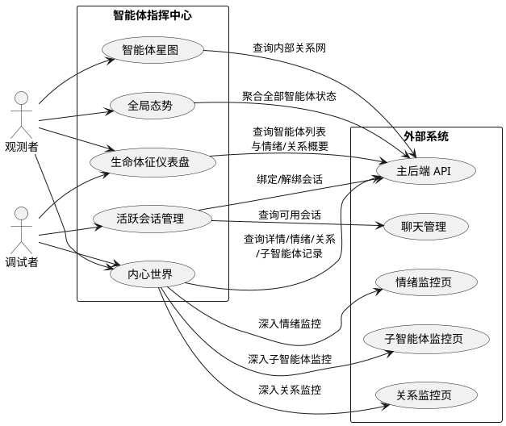
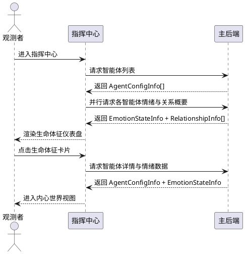
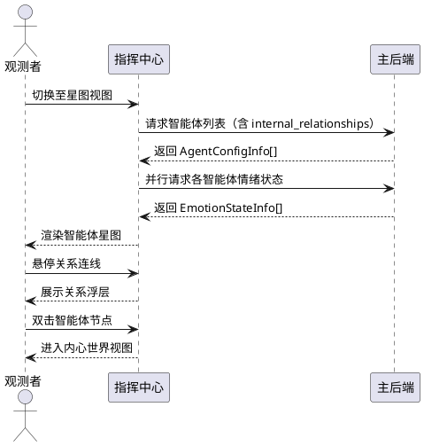
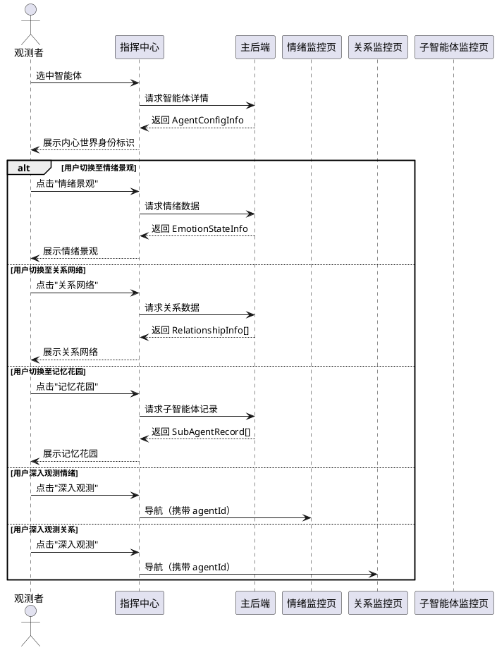
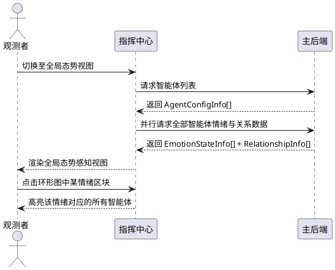
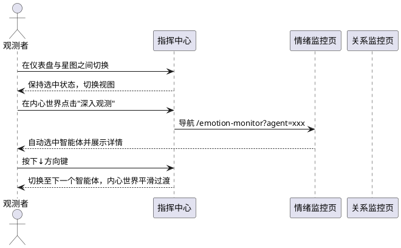

# 智能体指挥中心 — 需求规格

> 核心理念：不做故事的结局，只做生命的序章。
> 角色不应是一具等待结局的标本，而应是一场永恒的进行时。

# 1. 组件定位

## 1.1 核心职责

本组件负责呈现和观测多智能体的生命状态与群体态势，实现从"配置管理"到"生命观测"的交互范式革命。

## 1.2 核心输入

1. 智能体列表查询请求 — 来源：用户进入指挥中心时自动触发，内容：全部智能体的配置信息（`AgentConfigInfo[]`）
2. 智能体详情查询请求 — 来源：用户选中某个智能体时触发，内容：单个智能体的完整配置（`AgentConfigInfo`）
3. 智能体情绪状态查询请求 — 来源：指挥中心自动轮询与用户手动刷新，内容：情绪维度值与主导情绪（`EmotionStateInfo`）
4. 智能体关系查询请求 — 来源：用户查看关系网络时触发，内容：与各用户的关系等级与分数（`RelationshipInfo[]`）
5. 智能体会话绑定查询请求 — 来源：用户查看活跃会话时触发，内容：已绑定的会话列表（`SessionAgentInfo[]`）
6. 会话绑定/解绑操作请求 — 来源：用户在指挥中心执行绑定或解绑操作，内容：目标会话ID与智能体ID
7. 智能体配置重载请求 — 来源：用户点击刷新按钮，内容：无额外参数
8. 子智能体执行记录查询请求 — 来源：用户查看智能体内在活动时触发，内容：Dream/Compaction/Checkpoint执行记录
9. 全局情绪态势查询请求 — 来源：指挥中心首页自动触发，内容：所有智能体的情绪状态聚合

## 1.3 核心输出

1. 生命体征仪表盘 — 目标：用户浏览器，内容：所有智能体的实时生命感指标总览
2. 智能体星图 — 目标：用户浏览器，内容：智能体之间内部关系的可视化星图
3. 内心世界视图 — 目标：用户浏览器，内容：单个智能体的情绪景观、关系网络、记忆花园、生命时间线
4. 全局态势感知 — 目标：用户浏览器，内容：群体情绪分布、活跃度热力图、关系动态流
5. 活跃会话管理 — 目标：用户浏览器，内容：智能体正在参与的对话流及其状态
6. 监控页导航链接 — 目标：用户浏览器，内容：从指挥中心跳转至深度监控页的入口

## 1.4 职责边界

1. 本组件**不负责**智能体配置的增删改 — 智能体的创建、删除、参数修改由配置文件和后端API管理
2. 本组件**不负责**情绪数据的采集与计算 — 情绪状态由后端情绪引擎维护，本组件仅展示
3. 本组件**不负责**关系数据的采集与计算 — 关系分数由后端关系系统维护，本组件仅展示
4. 本组件**不负责**聊天流的创建与消息收发 — 聊天流管理由聊天管理模块负责
5. 本组件**不负责**替代独立的情绪监控页、关系监控页、子智能体监控页 — 本组件提供生命感概览与导航，深度监控仍在独立页面完成
6. 本组件**不负责**修改智能体的内在状态（情绪、记忆、目标） — 本组件是"观测者"而非"操控者"
7. 本组件**不负责**实现智能体之间的实时通信或调度 — 调度逻辑由后端 maisaka 引擎完成

# 2. 领域术语

**智能体（Agent）**
: 系统中具备独立人格、情绪系统和关系网络的对话角色实体。不是配置项，而是有生命感的个体——拥有情绪脉动、关系纽带、记忆生长和内在需求。

**生命体征（Vital Signs）**
: 反映智能体"活着"状态的综合视觉信号集合，包括情绪脉动、活跃节奏、关系温度和记忆生长率。区别于静态的"配置参数"。

**情绪脉动（Emotion Pulse）**
: 智能体当前主导情绪及其强度的视觉化呈现，如同心跳般反映智能体的内在状态。由 `EmotionStateInfo` 中的 `dominant_emotion` 和 `emotions` 派生。

**活跃节奏（Activity Rhythm）**
: 智能体参与对话的频率和模式，由 `talk_value_modifier`、已绑定会话数和最近互动时间共同决定。不是冷冰冰的"活跃度参数"，而是"这个角色此刻是热闹还是安静"。

**关系温度（Relationship Warmth）**
: 智能体与用户群体之间关系亲疏程度的视觉化表达，由关系数量、平均分数和最高等级共同决定。不是"关系数据表"，而是"谁靠近了谁"。

**记忆生长（Memory Growth）**
: 智能体记忆系统的活跃程度，由子智能体执行记录（Dream巩固、Compaction压缩、Checkpoint快照）的频率和最近执行时间反映。体现"这个角色正在消化经历、沉淀自我"。

**智能体星图（Agent Constellation）**
: 所有智能体及其内部关系的可视化网络图，以星图形式呈现智能体之间的引力与张力。基于 `internal_relationships` 数据。

**内心世界（Inner World）**
: 单个智能体的深度视图，包含情绪景观、关系网络、记忆花园和生命时间线。不是"详情页"，而是"走进一个人的内心"。

**情绪景观（Emotion Landscape）**
: 智能体当前情绪状态的多维可视化呈现，包含情绪雷达图、强度分布和基线偏移。比"情绪标签页"更具沉浸感。

**全局态势（Global Situation）**
: 所有智能体的群体状态总览，包含群体情绪分布、活跃度热力图和关系动态流。如同指挥中心的态势大屏。

**内在活动（Inner Activity）**
: 智能体内部子智能体的执行活动，包括 Dream 巩固（记忆整理）、Compaction 压缩（经验提炼）、Checkpoint 快照（状态保存）。体现"这个角色在无人注视时仍在成长"。

**反机械化规则（Anti-mechanization Rules）**
: 防止智能体回应模式化、机械化的行为约束规则列表。是智能体保持"生命感"而非"标本感"的关键防线。

**生命时间线（Life Timeline）**
: 智能体近期重要事件的时序排列，包括情绪转折、关系突破、记忆里程碑。体现"这个角色的故事仍在进行"。

# 3. 角色与边界

## 3.1 核心角色

**智能体观测者**：通过指挥中心观察和照料多个智能体的运维人员，关注每个智能体的生命状态、情绪变化和关系进展，而非冷冰冰的配置参数。

**智能体调试者**：需要深入理解智能体行为逻辑的开发人员，关注情绪引擎输出、关系系统状态与子智能体执行情况的一致性。

## 3.2 外部系统

**主后端（MaiBot Backend）**：提供智能体列表、详情、情绪、关系、会话绑定、子智能体记录等 REST API（`/api/webui/agent/**`）。

**情绪监控页（Emotion Monitor）**：独立的全局情绪监控页面，提供情绪雷达图、基线对比和时间序列分析等深度监控能力。

**关系监控页（Relationship Monitor）**：独立的全局关系监控页面，提供关系等级分布、分数排行等深度分析能力。

**子智能体监控页（SubAgent Monitor）**：独立的子智能体执行监控页面，提供执行记录、Token统计等深度监控能力。

**聊天管理模块（Chat Management）**：管理聊天流的创建、会话绑定和消息收发，指挥中心通过其 API 查询可用会话。

## 3.3 交互上下文

# 4. DFX约束

## 4.1 性能

1. 指挥中心首页（生命体征仪表盘）首次加载完成时间不得超过 2 秒（含全部智能体的生命体征数据）
2. 全局态势视图的数据聚合请求应并行发起，总耗时不得超过单次 API 请求耗时的 1.5 倍
3. 内心世界视图切换子视图时，已有缓存数据不得重新请求
4. 智能体星图的渲染帧率不得低于 30fps（13个智能体节点 + 全部内部关系连线）

## 4.2 可靠性

1. 当情绪数据请求失败时，生命体征卡片应正常展示基础信息，情绪脉动区域显示"脉动暂不可感知"占位符
2. 当关系数据请求失败时，生命体征卡片应正常展示基础信息，关系温度区域显示"温度暂不可感知"占位符
3. 当子智能体记录请求失败时，内心世界应正常展示其他子视图，内在活动区域显示"活动记录暂不可用"
4. 会话绑定操作失败时，应显示明确的错误提示，不得静默失败

## 4.3 安全性

1. 所有 API 请求必须通过已认证的 `backendApi` 实例发起
2. 会话绑定操作必须经过用户二次确认

## 4.4 可维护性

1. 所有用户可见文本必须通过 i18n（react-i18next）管理，支持 zh/en/ja/ko 四种语言
2. 生命体征卡片、情绪景观、关系网络等可视化组件应复用现有组件或提取为独立组件
3. 新增的 API 调用应遵循 `agent-api.ts` 中已有的请求客户端模式

## 4.5 兼容性

1. 改造后的指挥中心必须兼容现有的 `AgentConfigInfo`、`EmotionStateInfo`、`RelationshipInfo`、`SubAgentRecord` 数据结构
2. 现有的会话绑定/解绑功能必须保持向后兼容
3. 情绪监控页、关系监控页、子智能体监控页的独立访问入口不受影响
4. 首页智能体总览面板（`AgentOverviewGrid`）的导航链接必须指向新的指挥中心路由

# 5. 核心能力

## 5.1 生命体征仪表盘

### 5.1.1 业务规则

1. **仪表盘布局规则**：当用户进入指挥中心时，系统应当以响应式网格布局展示所有智能体的生命体征卡片，每张卡片包含头像、显示名称、情绪脉动、活跃节奏、关系温度和内在活动指示。
   - 验收条件：[用户进入指挥中心] → [页面以网格形式展示所有智能体的生命体征卡片，每张卡片包含上述6项信息]

2. **情绪脉动展示规则**：当智能体存在情绪数据时，系统必须在生命体征卡片上以脉动色彩和主导情绪图标标识其当前情绪脉动。脉动强度应与情绪强度值成正比。
   - 验收条件：[智能体主导情绪为 happy，强度 72] → [卡片上显示 😊 图标及对应黄色脉动，脉动动画幅度较大]
   - 验收条件：[智能体主导情绪为 calm，强度 15] → [卡片上显示 😌 图标及对应绿色脉动，脉动动画幅度较小]
   - 验收条件：[智能体情绪数据不可用] → [卡片上不显示脉动动画，情绪区域显示"脉动暂不可感知"]

3. **活跃节奏展示规则**：系统应当根据智能体的 `talk_value_modifier`、已绑定会话数量，在生命体征卡片上以视觉方式呈现其活跃节奏，使用语义化描述而非原始数值。
   - 验收条件：[智能体 talk_value_modifier > 1.0 且有已绑定会话] → [卡片显示"活跃"状态，带有呼吸灯效果]
   - 验收条件：[智能体 talk_value_modifier 介于 0.5-1.0 且有已绑定会话] → [卡片显示"安静"状态，带有微弱呼吸灯]
   - 验收条件：[智能体无已绑定会话] → [卡片显示"沉睡"状态，无呼吸灯效果]

4. **关系温度展示规则**：当智能体存在关系数据时，系统应当在生命体征卡片上以温度色彩展示关系温度——关系越亲密，温度色彩越暖。
   - 验收条件：[智能体最高关系等级为"亲密"（level 3）] → [卡片关系区域显示暖色（如橙红色）温度指示]
   - 验收条件：[智能体最高关系等级为"认识"（level 1）] → [卡片关系区域显示冷色（如蓝色）温度指示]
   - 验收条件：[智能体无关系数据] → [卡片关系区域显示"温度暂不可感知"]

5. **内在活动指示规则**：当智能体存在子智能体执行记录时，系统应当在生命体征卡片上以微弱的"内省"动画指示其内在活动状态。
   - 验收条件：[智能体最近1小时内有 Dream 巩固执行记录] → [卡片显示微弱的"内省中"动画指示]
   - 验收条件：[智能体无近期子智能体执行记录] → [卡片不显示内在活动指示]

6. **默认智能体标识规则**：当智能体的 `is_default` 为 true 时，系统必须在生命体征卡片上以醒目标识标注"核心"。
   - 验收条件：[智能体 is_default 为 true] → [卡片显示"核心"徽章]

7. **卡片交互规则**：当用户点击某张生命体征卡片时，系统应当以视觉高亮标识该卡片，并进入该智能体的内心世界视图。
   - 验收条件：[用户点击生命体征卡片] → [该卡片获得选中高亮，视图切换至内心世界]

8. **搜索过滤规则**：系统应当支持按智能体显示名称或 agent_id 进行模糊搜索过滤。
   - 验收条件：[用户在搜索框输入"银狼"] → [仪表盘仅显示显示名称或 agent_id 包含"银狼"的智能体]

9. **禁止项**：生命体征卡片上禁止展示原始的技术参数值（如 `talk_value_modifier: 1.2`、`emotion_decay_rate: 0.5`），必须转化为用户可理解的生命感描述。
   - 验收条件：[查看生命体征卡片] → [卡片上不出现原始技术参数值，而是展示"活跃""安静""沉睡"等语义化描述]

### 5.1.2 交互流程

### 5.1.3 异常场景

1. **智能体列表加载失败**
   - 触发条件：`getAgentList()` 请求返回错误或网络超时
   - 系统行为：显示错误提示文案与重试按钮，不展示空白页面
   - 用户感知：页面显示"智能体列表加载失败"提示及重试按钮

2. **部分智能体情绪数据不可用**
   - 触发条件：某个智能体的 `getAgentEmotion()` 请求失败
   - 系统行为：该智能体的生命体征卡片正常展示基础信息，情绪脉动区域显示"脉动暂不可感知"
   - 用户感知：该卡片情绪位置显示灰色占位符而非报错

3. **部分智能体关系数据不可用**
   - 触发条件：某个智能体的 `getAgentRelationships()` 请求失败
   - 系统行为：该智能体的生命体征卡片正常展示基础信息，关系温度区域显示"温度暂不可感知"
   - 用户感知：该卡片关系位置显示灰色占位符而非报错

## 5.2 智能体星图

### 5.2.1 业务规则

1. **星图布局规则**：系统应当以力导向图（Force-Directed Graph）布局展示所有智能体及其内部关系。每个智能体为一个节点，内部关系为连线。节点大小应反映该智能体的活跃程度。
   - 验收条件：[13个智能体存在内部关系] → [星图以力导向布局展示13个节点和全部关系连线，活跃智能体的节点较大]

2. **节点视觉规则**：每个智能体节点应当以其主题色（`color`）为底色，以主导情绪图标为节点标识，以脉动动画反映当前情绪强度。
   - 验收条件：[智能体"麦麦"主题色为绿色，主导情绪为 happy] → [星图中"麦麦"节点为绿色底色，中心显示 😊 图标，带有脉动动画]

3. **关系连线规则**：智能体之间的内部关系应当以连线展示，连线颜色和粗细应反映关系类型（family/romantic/rival/mentor/friend）和提及倾向（`mention_tendency`）。
   - 验收条件：[智能体A与智能体B的关系类型为 romantic，mention_tendency 为 0.8] → [星图中A与B之间以红色粗连线连接]
   - 验收条件：[智能体A与智能体B的关系类型为 rival，mention_tendency 为 0.3] → [星图中A与B之间以灰色细连线连接]

4. **关系标签规则**：当用户悬停在关系连线上时，系统应当以浮层展示关系类型、态度描述和互动风格。
   - 验收条件：[用户悬停在A与B的连线上] → [浮层显示"关系类型：朋友 · 态度：信任 · 互动风格：调侃"]

5. **节点交互规则**：当用户点击某个智能体节点时，系统应当高亮该节点及其所有关系连线，并展示该智能体的简要生命体征浮层。
   - 验收条件：[用户点击"银狼"节点] → [银狼节点高亮，其所有关系连线高亮，浮层显示简要生命体征]

6. **节点深入规则**：当用户双击某个智能体节点时，系统应当进入该智能体的内心世界视图。
   - 验收条件：[用户双击"银狼"节点] → [视图切换至银狼的内心世界]

7. **禁止项**：星图中禁止展示原始的 `mention_tendency` 数值，应转化为"紧密""疏远"等语义化描述。
   - 验收条件：[查看星图关系连线] → [连线上不出现原始数值，悬停浮层中使用语义化描述]

### 5.2.2 交互流程

### 5.2.3 异常场景

1. **无内部关系数据**
   - 触发条件：所有智能体的 `internal_relationships` 均为空
   - 系统行为：星图仅展示散落的节点，无连线，并显示提示"暂无内部关系数据"
   - 用户感知：星图展示独立的智能体节点，中央显示提示文案

2. **星图渲染性能不足**
   - 触发条件：智能体数量或关系数量导致渲染帧率低于 30fps
   - 系统行为：自动简化连线渲染（减少动画效果），确保基本交互流畅
   - 用户感知：星图动画简化但交互仍可正常使用

## 5.3 内心世界

### 5.3.1 业务规则

1. **内心世界入口规则**：当用户从生命体征仪表盘或智能体星图选中某个智能体时，系统应当进入该智能体的内心世界视图，以沉浸式布局展示其内在状态。
   - 验收条件：[用户选中智能体"麦麦"] → [视图切换至"麦麦"的内心世界，顶部展示其身份标识和情绪脉动]

2. **身份标识规则**：内心世界顶部应当以大尺寸头像、显示名称、情绪脉动徽章和一句人格摘要组成身份标识区域。人格摘要从 `personality` 字段中提取，截断至50字。
   - 验收条件：[进入"麦麦"的内心世界] → [顶部展示大头像、"麦麦"名称、当前情绪脉动徽章和人格摘要]

3. **情绪景观规则**：系统应当提供"情绪景观"子视图，展示情绪雷达图、情绪强度分布、情绪基线偏移和情绪-行为映射。情绪基线偏移应当以当前状态与基线的差异可视化呈现。
   - 验收条件：[用户切换至"情绪景观"] → [展示情绪雷达图、强度分布、基线偏移对比和行为倾向描述]
   - 验收条件：[智能体当前 happy 强度为 60，基线为 30] → [基线偏移图显示 happy 维度正向偏移 +30，以绿色标识]

4. **情绪-行为映射规则**：当智能体存在 `emotion_behavior_rules` 时，系统应当在情绪景观中以语义化方式展示情绪对行为的影响。
   - 验收条件：[智能体有情绪-行为规则"当 anxious 强度 > 50 时，行为倾向为回避"] → [情绪景观中展示"焦虑时倾向回避"的行为描述]

5. **关系网络规则**：系统应当提供"关系网络"子视图，展示智能体与用户的关系分布、关系排行和内部关系网。内部关系网应当以小型网络图呈现。
   - 验收条件：[用户切换至"关系网络"] → [展示关系等级分布、关系排行和内部关系小型网络图]

6. **记忆花园规则**：系统应当提供"记忆花园"子视图，展示智能体的记忆焦点区域（以标签花园形式呈现）和内在活动记录（Dream/Compaction/Checkpoint的近期执行情况）。
   - 验收条件：[用户切换至"记忆花园"] → [展示记忆焦点标签花园和近期内在活动记录]
   - 验收条件：[智能体有记忆焦点"日常对话""情感支持"] → [以花园标签形式展示这些焦点区域]
   - 验收条件：[智能体最近执行了 Dream 巩固] → [记忆花园展示"刚刚完成了一次内省"的活动记录]

7. **生命时间线规则**：系统应当提供"生命时间线"子视图，展示智能体近期的重要事件，包括情绪转折（主导情绪变化）、关系突破（关系等级提升）和记忆里程碑（子智能体执行完成）。
   - 验收条件：[用户切换至"生命时间线"] → [展示近期事件的时间线排列]
   - 验收条件：[智能体与某用户的关系从"熟悉"提升至"亲密"] → [时间线中展示"与 XXX 的关系升温至亲密"事件]

8. **活跃会话规则**：系统应当提供"活跃会话"子视图，展示智能体当前绑定的会话列表，支持解绑操作和新增绑定。
   - 验收条件：[用户切换至"活跃会话"] → [展示已绑定会话列表，每条会话提供解绑按钮]
   - 验收条件：[用户点击"绑定会话"按钮] → [弹出会话选择对话框]

9. **反机械化防线规则**：当智能体存在 `anti_mechanization_rules` 时，系统应当在内心世界中以"生命防线"的语义化方式展示这些规则，而非以技术列表形式呈现。
   - 验收条件：[智能体有3条反机械化规则] → [内心世界展示"生命防线"区域，以语义化方式描述3条规则]

10. **深度监控导航规则**：系统应当在情绪景观、关系网络、记忆花园子视图中分别提供跳转至对应独立监控页的"深入观测"链接。
    - 验收条件：[用户在情绪景观点击"深入观测"] → [导航至情绪监控页并自动选中当前智能体]
    - 验收条件：[用户在关系网络点击"深入观测"] → [导航至关系监控页并自动选中当前智能体]
    - 验收条件：[用户在记忆花园点击"深入观测"] → [导航至子智能体监控页并自动筛选当前智能体]

11. **禁止项**：内心世界的主要视觉区域禁止展示原始技术参数值（如 `talk_value_modifier: 1.2`、`emotion_decay_rate: 0.5`、`relationship_growth_rate: 1.0`），应收纳至"底层参数"折叠区域，并以语义化描述替代。
    - 验收条件：[查看内心世界] → [主要视觉区域不出现原始技术参数值，参数收纳在"底层参数"折叠区]

### 5.3.2 交互流程

### 5.3.3 异常场景

1. **智能体详情加载失败**
   - 触发条件：`getAgentDetail()` 请求失败
   - 系统行为：在内心世界区域显示错误提示和重试按钮
   - 用户感知：内心世界显示"加载失败"提示及重试按钮

2. **情绪数据加载失败**
   - 触发条件：`getAgentEmotion()` 请求失败
   - 系统行为：情绪景观显示"情绪景观暂不可感知"占位符
   - 用户感知：情绪景观区域显示灰色占位文案

3. **关系数据加载失败**
   - 触发条件：`getAgentRelationships()` 请求失败
   - 系统行为：关系网络显示"关系网络暂不可感知"占位符
   - 用户感知：关系网络区域显示灰色占位文案

4. **子智能体记录加载失败**
   - 触发条件：`getSubAgentRecords()` 请求失败
   - 系统行为：记忆花园正常展示记忆焦点，内在活动区域显示"活动记录暂不可用"
   - 用户感知：记忆花园部分可用，内在活动区域显示占位文案

5. **会话绑定操作失败**
   - 触发条件：`bindSessionAgent()` 或 `unbindSessionAgent()` 请求失败
   - 系统行为：弹出 toast 错误提示，不更新会话列表
   - 用户感知：页面顶部显示"绑定失败"或"解除绑定失败"的 toast 通知

## 5.4 全局态势感知

### 5.4.1 业务规则

1. **群体情绪分布规则**：系统应当在全局态势视图中以环形图展示所有智能体的主导情绪分布，让观测者一眼看出"此刻谁在开心、谁在焦虑、谁在平静"。
   - 验收条件：[5个智能体主导情绪为 happy，3个为 calm，3个为 lonely，2个为 anxious] → [环形图显示4种情绪的占比分布]

2. **活跃度热力图规则**：系统应当以热力图形式展示所有智能体的活跃程度分布，颜色从冷色（沉睡）到暖色（活跃）渐变。
   - 验收条件：[3个智能体活跃，5个安静，5个沉睡] → [热力图以暖色标识3个活跃智能体，中间色标识5个安静智能体，冷色标识5个沉睡智能体]

3. **关系动态流规则**：系统应当在全局态势视图中以动态流形式展示近期关系变化——哪些关系在升温、哪些在降温、哪些刚刚突破等级阈值。
   - 验收条件：[智能体A与用户X的关系分数从 640 升至 660（突破"熟悉"阈值）] → [关系动态流展示"A 与 X 的关系升温至熟悉"事件]
   - 验收条件：[无近期关系变化] → [关系动态流显示"近期关系平稳，无显著变化"]

4. **群体概览统计规则**：系统应当在全局态势视图顶部展示关键统计指标：智能体总数、活跃智能体数、总关系数、平均关系分数。
   - 验收条件：[13个智能体，5个活跃，120条总关系，平均分数 450] → [顶部展示"13 个生命体 · 5 个活跃 · 120 条纽带 · 均温 450"]

5. **禁止项**：全局态势视图中禁止以表格形式罗列智能体参数，必须以可视化图表和语义化描述呈现。
   - 验收条件：[查看全局态势] → [不出现参数表格，所有信息以图表和语义化描述呈现]

### 5.4.2 交互流程

### 5.4.3 异常场景

1. **全局态势数据部分不可用**
   - 触发条件：部分智能体的情绪或关系数据请求失败
   - 系统行为：基于可用数据渲染全局态势，不可用部分以灰色占位
   - 用户感知：全局态势部分展示，缺失区域显示"数据暂不可用"

2. **全局态势数据全部不可用**
   - 触发条件：智能体列表请求失败
   - 系统行为：显示错误提示和重试按钮
   - 用户感知：全局态势显示"全局态势加载失败"提示及重试按钮

## 5.5 视图切换与导航

### 5.5.1 业务规则

1. **视图切换规则**：系统应当支持在"生命体征仪表盘"、"智能体星图"和"全局态势"三个顶层视图之间自由切换，切换时保持当前选中的智能体状态。
   - 验收条件：[用户在仪表盘选中"银狼"后切换至星图] → [星图中"银狼"节点处于高亮状态]

2. **内心世界返回规则**：当用户从内心世界返回顶层视图时，系统应当保持之前的顶层视图选择和智能体选中状态。
   - 验收条件：[用户从"银狼"的内心世界返回] → [回到之前的仪表盘视图，"银狼"卡片仍为选中状态]

3. **监控页导航规则**：当用户从内心世界的"深入观测"链接跳转至独立监控页时，系统应当通过 URL 查询参数传递智能体 ID，确保页面刷新后仍能保持选中状态。
   - 验收条件：[从内心世界导航至情绪监控页] → [URL 中包含 `?agent=xxx` 参数，刷新后仍选中对应智能体]

4. **首页导航规则**：当用户从首页的智能体总览面板点击某个智能体时，系统应当导航至指挥中心，并自动进入该智能体的内心世界视图。
   - 验收条件：[用户在首页点击智能体"麦麦"的头像] → [导航至指挥中心，自动进入"麦麦"的内心世界]

5. **URL 参数规则**：指挥中心应当支持通过 URL 查询参数（`?agent=xxx`）指定初始选中的智能体，并自动进入其内心世界。
   - 验收条件：[用户访问 /agents?agent=silver_wolf] → [页面加载后自动进入 silver_wolf 的内心世界]

6. **键盘快捷切换规则**：系统应当支持在内心世界视图中通过键盘快捷键（上/下方向键）在相邻智能体之间快速切换，切换时内心世界子视图选择保持不变。
   - 验收条件：[用户在"情绪景观"子视图按下↓方向键] → [切换至下一个智能体的内心世界，仍停留在"情绪景观"子视图]
   - 验收条件：[当前已是列表最后一个智能体时按下↓] → [不发生切换]

7. **切换过渡规则**：当用户在两个智能体之间切换时，系统应当以平滑过渡动画展示内心世界的变更，而非瞬间替换。
   - 验收条件：[用户从智能体A切换到智能体B] → [内心世界以淡入淡出动画过渡]

8. **禁止项**：禁止在切换智能体时重置用户的子视图选择状态。
   - 验收条件：[切换智能体后] → [子视图选择状态与切换前一致]

### 5.5.2 交互流程

### 5.5.3 异常场景

1. **URL 指定的智能体不存在**
   - 触发条件：URL 参数中的 agentId 在智能体列表中不存在
   - 系统行为：忽略该参数，展示生命体征仪表盘的默认未选中状态
   - 用户感知：页面正常加载，不自动进入内心世界，不出现报错

2. **切换时目标智能体详情加载失败**
   - 触发条件：切换到新智能体时 `getAgentDetail()` 请求失败
   - 系统行为：保持卡片选中状态，内心世界显示加载失败提示和重试按钮
   - 用户感知：内心世界显示"加载失败"提示，可通过重试按钮重新加载

3. **目标智能体在监控页不存在**
   - 触发条件：导航至监控页时，URL 中的 agentId 在监控页的智能体列表中不存在
   - 系统行为：监控页忽略该参数，展示默认的全局概览视图
   - 用户感知：监控页正常展示全局概览，不出现报错

# 6. 数据约束

## 6.1 生命体征卡片（VitalSignsCard）

1. **agent_id**：智能体的唯一标识符，必填，用于 API 请求和卡片唯一键
2. **display_name**：智能体的显示名称，必填，用于卡片标题展示
3. **color**：智能体的主题色，必填，用于头像背景色、脉动色彩和视觉标识
4. **is_default**：是否为默认智能体，必填，用于"核心"徽章展示
5. **dominant_emotion**：当前主导情绪类型（如 happy、sad），可选，用于情绪脉动图标和色彩
6. **dominant_emotion_label**：主导情绪的本地化标签，可选，用于脉动文本展示
7. **dominant_emotion_intensity**：主导情绪的强度值（0-100），可选，用于脉动动画幅度
8. **activity_status**：活跃状态（"活跃"/"安静"/"沉睡"），由 talk_value_modifier 和会话绑定数计算得出
9. **relationship_warmth**：关系温度等级（"温暖"/"温和"/"冷淡"/"暂不可感知"），由最高关系等级决定
10. **relationship_count**：关系总数，可选，用于关系概要展示
11. **inner_activity**：内在活动状态（"内省中"/"安静"/"暂不可感知"），由近期子智能体执行记录决定

## 6.2 智能体星图节点（ConstellationNode）

1. **agent_id**：智能体的唯一标识符，必填，用于节点唯一键
2. **display_name**：智能体的显示名称，必填，用于节点标签
3. **color**：智能体的主题色，必填，用于节点底色
4. **dominant_emotion**：当前主导情绪类型，可选，用于节点中心图标
5. **dominant_emotion_intensity**：主导情绪强度值，可选，用于节点脉动动画
6. **activity_status**：活跃状态，可选，用于节点大小映射

## 6.3 智能体星图连线（ConstellationEdge）

1. **source_agent_id**：关系发起方智能体ID，必填
2. **target_agent_id**：关系目标方智能体ID，必填
3. **relationship_type**：关系类型（family/romantic/rival/mentor/friend），必填，用于连线颜色
4. **attitude**：态度描述，可选，用于悬停浮层
5. **interaction_style**：互动风格描述，可选，用于悬停浮层
6. **mention_tendency**：提及倾向（0-1），必填，用于连线粗细和语义化描述（"紧密"/"一般"/"疏远"）

## 6.4 内心世界（InnerWorld）

1. **agent_id**：智能体的唯一标识符，必填
2. **display_name**：智能体的显示名称，必填，用于身份标识
3. **color**：智能体的主题色，必填，用于视觉主题
4. **is_default**：是否为默认智能体，必填
5. **personality_summary**：人格摘要（截断至50字），可选，用于身份标识区域
6. **dominant_emotion**：当前主导情绪类型，可选，用于身份标识情绪徽章
7. **dominant_emotion_intensity**：主导情绪强度值，可选，用于脉动动画
8. **emotions**：各情绪维度的当前强度值（Record<string, number>），可选，用于情绪景观
9. **emotion_labels**：情绪维度的本地化标签（Record<string, string>），可选，用于图表标注
10. **emotion_baseline**：情绪基线值（Record<string, number>），可选，用于基线偏移对比
11. **emotion_behavior_rules**：情绪-行为映射规则列表，可选，用于行为倾向展示
12. **relationships**：关系列表（RelationshipInfo[]），可选，用于关系网络展示
13. **internal_relationships**：内部关系列表（InternalRelationship[]），可选，用于内部关系小型网络图
14. **memory_focus_areas**：记忆焦点区域列表（string[]），可选，用于记忆花园标签展示
15. **anti_mechanization_rules**：反机械化规则列表（string[]），可选，用于"生命防线"展示
16. **sub_agent_records**：近期子智能体执行记录（SubAgentRecord[]），可选，用于内在活动展示
17. **bound_sessions**：已绑定会话列表（SessionAgentInfo[]），可选，用于活跃会话展示
18. **reply_style**：回复风格描述，可选，用于身份标识区域

## 6.5 底层参数（CollapsedParameters）

1. **talk_value_modifier**：活跃度修正值，可选，收纳至底层参数折叠区
2. **idle_backoff_modifier**：空闲退避修正值，可选，收纳至底层参数折叠区
3. **relationship_growth_rate**：关系进展速率，可选，收纳至底层参数折叠区
4. **emotion_decay_rate**：情绪衰减率，可选，收纳至底层参数折叠区

## 6.6 导航参数

1. **agent**：URL 查询参数，值为智能体的 agent_id，用于从外部页面导航至指挥中心时指定初始选中项并自动进入内心世界
