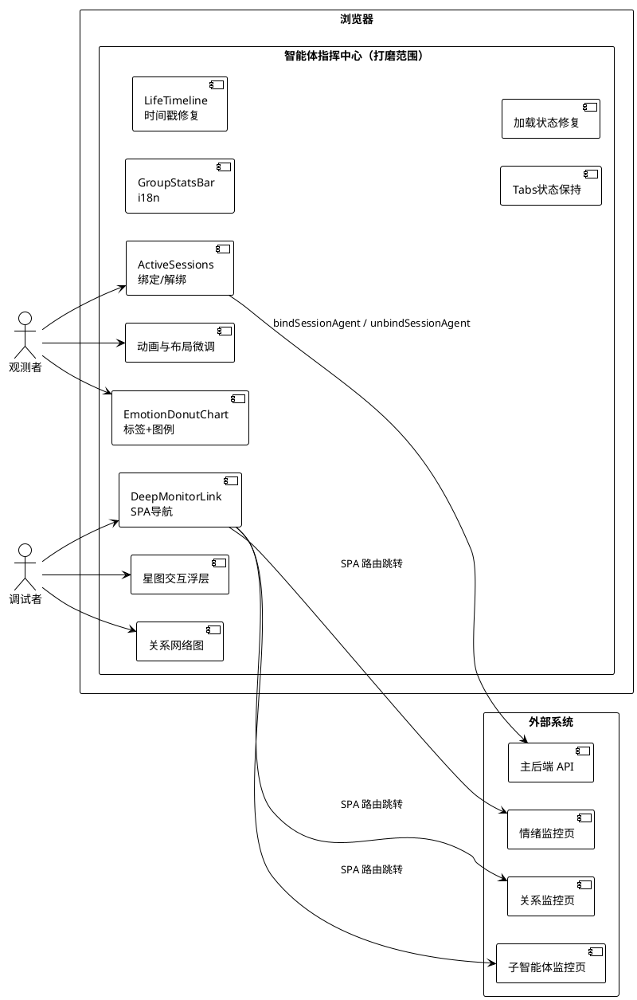
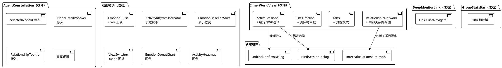
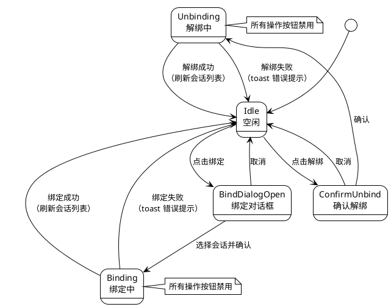
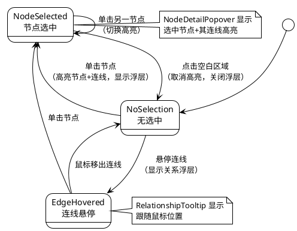
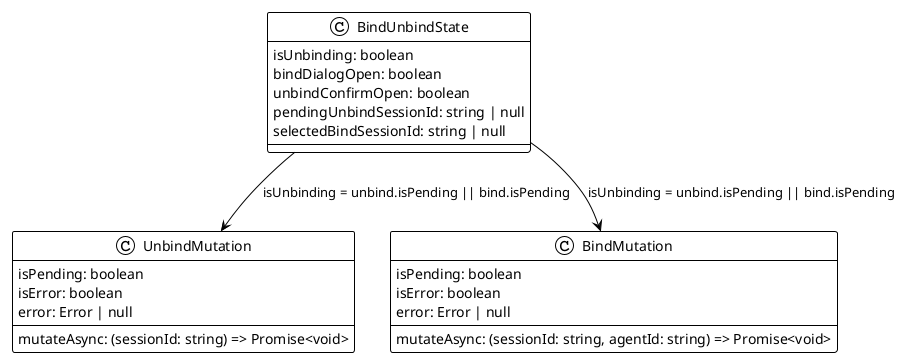
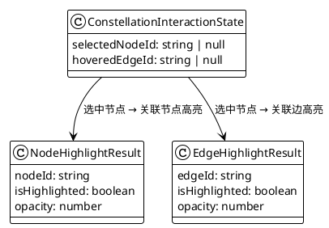
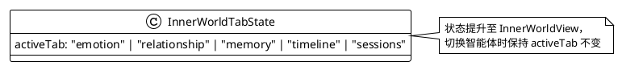

# 智能体指挥中心 — 后续打磨实现方案

> 基于已完成的全量开发（Phase 1~4），对智能体管理页进行功能补全、交互修复和体验打磨。

# 一、需求与存量功能关系分析

## 1.1 需求功能与存量功能对比

### 1.1.1 已实现功能

| 需求功能 | 存量功能 | 代码位置 | 匹配度 |
|---------|---------|---------|--------|
| ActiveSessions 解绑按钮 UI | `ActiveSessions` 组件已有解绑按钮和 `onUnbind` 回调 | `inner-world/ActiveSessions.tsx:39-47` | 75% |
| ActiveSessions 绑定按钮 UI | `ActiveSessions` 组件已有绑定按钮和 `onBindClick` 回调 | `inner-world/ActiveSessions.tsx:25-28` | 75% |
| ActiveSessions isUnbinding 禁用 | `ActiveSessions` 组件已接收 `isUnbinding` prop 并禁用按钮 | `inner-world/ActiveSessions.tsx:43` | 100% |
| DeepMonitorLink 导航链接 | `DeepMonitorLink` 组件已实现，构建目标 URL | `inner-world/DeepMonitorLink.tsx:9-19` | 50% |
| GroupStatsBar 统计条 UI | `GroupStatsBar` 组件已实现4项指标计算和展示 | `global-situation/GroupStatsBar.tsx:9-28` | 50% |
| 星图节点点击回调 | `AgentConstellation` 已有 `onNodeClick` 回调 | `constellation/AgentConstellation.tsx:80-82` | 75% |
| 星图节点/边组件 | `ConstellationNode`、`ConstellationEdge` 已实现 | `constellation/ConstellationNode.tsx` / `ConstellationEdge.tsx` | 75% |
| NodeDetailPopover 浮层 | 已实现节点详情浮层组件 | `constellation/NodeDetailPopover.tsx` | 50% |
| RelationshipTooltip 浮层 | 已实现关系悬停浮层组件 | `constellation/RelationshipTooltip.tsx` | 50% |
| EmotionPulse 脉动动画 | `EmotionPulse` 组件已实现脉动效果 | `EmotionPulse.tsx:16-24` | 75% |
| ActivityRhythmIndicator | `ActivityRhythmIndicator` 已实现三种状态动画 | `ActivityRhythmIndicator.tsx:17-51` | 75% |
| EmotionBaselineShift 偏移条 | `EmotionBaselineShift` 已实现偏移可视化 | `inner-world/EmotionBaselineShift.tsx:11-50` | 75% |
| ViewSwitcher 视图切换器 | `ViewSwitcher` 已实现三视图切换 | `ViewSwitcher.tsx:12-41` | 50% |
| EmotionDonutChart 环形图 | `EmotionDonutChart` 已实现 recharts 环形图 | `global-situation/EmotionDonutChart.tsx:13-54` | 75% |
| ActivityHeatmap 热力图 | `ActivityHeatmap` 已实现网格热力图 | `global-situation/ActivityHeatmap.tsx:15-34` | 75% |
| LifeTimeline 时间线 | `LifeTimeline` 已实现事件时间线 | `inner-world/LifeTimeline.tsx:19-84` | 50% |
| RelationshipNetwork 关系网络 | `RelationshipNetwork` 已实现等级分布+排行+内部关系 | `inner-world/RelationshipNetwork.tsx:23-108` | 50% |
| InnerWorldView Tabs | `InnerWorldView` 已实现5个子视图 Tabs | `inner-world/InnerWorldView.tsx:63-85` | 75% |
| useInnerWorldData Hook | 已实现6个 useQuery 聚合 | `hooks/useInnerWorldData.ts:29-79` | 50% |
| i18n 翻译键体系 | 已有 `agent.*` 命名空间完整翻译键 | `i18n/locales/zh.json:1181-1328` | 75% |
| bindSessionAgent / unbindSessionAgent API | 已实现绑定/解绑 API 函数 | `lib/agent-api.ts:163-180` | 100% |
| getChatStreams API | 已实现聊天流列表查询 | `lib/chat-management-api.ts:167-172` | 100% |
| CommandCenterLayout 内心世界叠加层 | 已实现 fixed overlay + max-w-4xl | `CommandCenterLayout.tsx:123-144` | 75% |

### 1.1.2 需要扩展的功能

| 需求功能 | 存量功能 | 差异说明 | 扩展方向 |
|---------|---------|---------|---------|
| ActiveSessions 绑定/解绑完整逻辑 | `InnerWorldView` 传入空回调 `onUnbind={() => {}}`、`onBindClick={() => {}}` | 绑定/解绑按钮存在但无实际逻辑；缺少二次确认对话框、绑定会话选择对话框、加载状态管理、错误 toast | 在 `InnerWorldView` 中实现完整的绑定/解绑状态机，包含 `useMutation`、确认对话框、会话选择对话框、toast 错误反馈 |
| DeepMonitorLink SPA 导航 | 当前使用 `<a href>` 硬跳转 | `<a>` 标签导致整页刷新而非 SPA 路由切换，违反 SPA 导航原则 | 替换为 `@tanstack/react-router` 的 `Link` 组件或 `useNavigate` hook |
| GroupStatsBar i18n | 当前硬编码中文文案 | `"个生命体"`、`"个活跃"`、`"条纽带"`、`"均温"` 均为硬编码中文，不通过 i18n | 将4项文案替换为 i18n 翻译键 |
| 星图节点点击浮层接入 | `NodeDetailPopover` 和 `RelationshipTooltip` 已创建但未在 `AgentConstellation` 中使用 | `AgentConstellation` 未渲染浮层组件，节点点击和连线悬停无浮层显示 | 在 `AgentConstellation` 中增加 `selectedNodeId`/`hoveredEdgeId` 状态，渲染浮层并实现高亮逻辑 |
| EmotionPulse 脉动幅度上限 | `scaleRange = 1.0 + intensity / 200`，intensity=100 时 scale=1.5 | 无上限约束，高强度值时脉动幅度过大导致视觉跳跃 | 添加 `Math.min(scaleRange, 1.2)` 上限约束 |
| ActivityRhythmIndicator 沉睡状态 | 沉睡状态 `opacity: 0.6` 固定值，有呼吸灯效果 | 需求要求沉睡状态为固定不透明灰色圆点，无动画 | 修改沉睡状态为 `opacity: 1.0`、灰色、`immediate: true` |
| InnerWorldView 布局响应式 | `max-w-4xl`（896px）固定最大宽度 | 在 1366px 屏幕上左右空白过大，768px 屏幕上不够全屏 | 改为 `max-w-5xl`（1024px）或 `max-w-[90vw]`，小屏使用 `max-w-full` |
| EmotionBaselineShift 偏移条最小宽度 | `width: Math.min(Math.abs(delta), 100)%`，delta=8 时仅 8% | 小幅偏移不可见，需求要求 delta 5~15 时宽度不低于 10% | 添加 `Math.max(Math.min(Math.abs(delta), 100), delta >= 5 ? 10 : 0)` 逻辑 |
| ViewSwitcher emoji 图标 | 使用 emoji `📊`、`🌌`、`🌍` | 跨平台渲染不一致，需求要求使用 lucide-react SVG 图标 | 替换为 `LayoutDashboard`、`Sparkles`、`Globe` 等 lucide 图标 |
| EmotionDonutChart 图例 | 无图例，仅依赖 Tooltip | 需求要求图表下方或右侧展示颜色色块+标签图例 | 在 `PieChart` 下方添加自定义图例组件 |
| ActivityHeatmap 图例 | 无颜色-状态映射图例 | 需求要求展示"红色=活跃、黄色=安静、蓝色=沉睡"图例 | 在热力图下方添加图例行 |
| LifeTimeline 时间戳 | 情绪转折和关系突破使用 `new Date().toISOString()` | 需求要求使用真实时间戳或标注"当前状态"，禁止伪造时间 | 修改为：记忆里程碑使用 `completed_at`；情绪转折/关系突破标注"当前状态" |
| EmotionDonutChart 标签取值 | `emotions[Object.keys(emotions)[0]]?.emotion_labels[emotion]` | 仅取第一个智能体的标签映射，多智能体时标签可能错误 | 改为从当前情绪类型对应的智能体数据中独立获取标签 |
| InnerWorldView Tabs 状态保持 | `<Tabs defaultValue="emotion">` | 每次切换智能体时 Tabs 重置为"情绪景观"，需求要求保持子视图选择 | 改为受控 `Tabs`，`value` 由 `useInnerWorldData` 外部状态管理 |
| useInnerWorldData 加载状态 | `isLoading = agentQuery.isLoading \|\| emotionQuery.isLoading` | 仅检查2个查询，忽略 relationships/sessions/subAgent/behaviorRules 4个查询 | 修改为检查所有6个查询的 `isLoading`，并实现渐进加载 |

### 1.1.3 需要新增的功能或接口

**前端组件（按业务模块分组）：**

1. **ActiveSessions 绑定/解绑交互**
   - `UnbindConfirmDialog`：解绑二次确认对话框（复用 Radix AlertDialog）
   - `BindSessionDialog`：绑定会话选择对话框（展示聊天流列表，使用 `getChatStreams` 获取数据，以 `display_name` 展示）
   - 绑定/解绑状态管理逻辑（`useMutation` + `isUnbinding` 状态 + toast 错误反馈）

2. **星图交互浮层**
   - 节点选中高亮逻辑（`selectedNodeId` 状态 → 节点/边样式变化）
   - 连线悬停浮层定位（`hoveredEdgeId` 状态 → `RelationshipTooltip` 定位渲染）
   - 空白区域点击关闭浮层（`onPaneClick` 回调）

3. **内部关系网络图**
   - `InternalRelationshipGraph`：小型力导向图组件（基于 reactflow + dagre），展示内部关系节点和连线
   - 降级逻辑：reactflow 渲染异常时降级为纯文本列表

**i18n 翻译键（新增）：**

- `agent.globalSituation.stats.totalAgents`：`{{count}} 个生命体`
- `agent.globalSituation.stats.activeAgents`：`{{count}} 个活跃`
- `agent.globalSituation.stats.totalRelationships`：`{{count}} 条纽带`
- `agent.globalSituation.stats.avgScore`：`均温 {{score}}`
- `agent.activeSessions.unbindFailed`：`解除绑定失败`
- `agent.activeSessions.bindFailed`：`绑定失败`
- `agent.activeSessions.loadFailed`：`加载失败`
- `agent.activeSessions.currentStatus`：`当前状态`
- `agent.constellation.legend.active`：`活跃`
- `agent.constellation.legend.quiet`：`安静`
- `agent.constellation.legend.dormant`：`沉睡`
- `agent.globalSituation.heatmapLegend.active`：`活跃`
- `agent.globalSituation.heatmapLegend.quiet`：`安静`
- `agent.globalSituation.heatmapLegend.dormant`：`沉睡`
- `agent.constellation.dataIncomplete`：`暂不可感知`

## 1.2 存量功能详细分析

### 1.2.1 ActiveSessions 组件（`inner-world/ActiveSessions.tsx`）

**接口契约**：
- 入参：`sessions: SessionAgentInfo[]`、`onUnbind: (sessionId: string) => void`、`onBindClick: () => void`、`isUnbinding: boolean`
- 出参：无（纯展示+回调）
- 副作用：无

**业务规则**：
- 展示已绑定会话列表，每条显示 `display_name` + 解绑按钮
- 绑定按钮在顶部，解绑按钮在每条会话右侧
- `isUnbinding` 为 true 时禁用所有解绑按钮

**扩展点**：
- `onUnbind` 和 `onBindClick` 当前为空回调，需接入实际逻辑
- 缺少二次确认对话框（解绑前确认）
- 缺少绑定会话选择对话框
- 缺少操作失败 toast 反馈

**约束**：
- 组件本身无状态，所有状态由父组件管理
- `SessionAgentInfo.display_name` 已由后端返回聊天流实际名称

### 1.2.2 InnerWorldView 组件（`inner-world/InnerWorldView.tsx`）

**接口契约**：
- 入参：`agentId: string`、`onBack: () => void`
- 内部状态：无（Tabs 使用 `defaultValue` 非受控）
- 数据查询：`useBatchAgentData()` + `useInnerWorldData(agentId)`

**业务规则**：
- 渲染 IdentityHeader + Tabs（5个子视图）+ LifeDefensePanel + CollapsedParameters
- ActiveSessions 传入空回调：`onUnbind={() => {}}`、`onBindClick={() => {}}`、`isUnbinding={false}`
- 加载状态：仅检查 `innerData.isLoading || !agent`

**扩展点**：
- 需要管理绑定/解绑状态机（`isUnbinding`、`bindDialogOpen`、`selectedSessionId`）
- 需要将 Tabs 从非受控改为受控，以支持子视图状态保持
- 需要完善加载状态判断（6个查询而非2个）
- 需要实现渐进加载（核心数据先展示，辅助数据骨架屏）

**约束**：
- `useInnerWorldData` 返回的 `sessions` 可直接用于 ActiveSessions
- `bindSessionAgent` / `unbindSessionAgent` API 已在 `agent-api.ts` 中实现
- `getChatStreams` API 已在 `chat-management-api.ts` 中实现

### 1.2.3 DeepMonitorLink 组件（`inner-world/DeepMonitorLink.tsx`）

**接口契约**：
- 入参：`agentId: string`、`target: 'emotion' | 'relationship' | 'subagent'`
- 出参：渲染 `<a>` 链接

**业务规则**：
- 根据 `target` 映射目标路由
- 构建 `?agent=agentId` 查询参数

**扩展点**：
- 需将 `<a href>` 替换为 SPA 导航方式

**约束**：
- 项目使用 `@tanstack/react-router`，应使用其 `Link` 组件或 `useNavigate` hook
- 目标监控页（emotion-monitor、relationship-monitor、subagent-monitor）均已支持 `?agent=xxx` 参数

### 1.2.4 GroupStatsBar 组件（`global-situation/GroupStatsBar.tsx`）

**接口契约**：
- 入参：`vitalSignsList: VitalSignsData[]`、`relationships: Record<string, BatchRelationshipItem[]>`
- 出参：渲染统计条

**业务规则**：
- 计算4项指标：totalAgents、activeAgents、totalRelationships、avgScore
- 展示格式：`"13 个生命体 · 5 个活跃 · 120 条纽带 · 均温 450"`

**扩展点**：
- 所有文案需迁移至 i18n

**约束**：
- 组件未使用 `useTranslation`，需新增
- 4项指标的 i18n 键需支持插值（`{{count}}`、`{{score}}`）

### 1.2.5 AgentConstellation 组件（`constellation/AgentConstellation.tsx`）

**接口契约**：
- 入参：`data: ConstellationData`、`selectedAgentId: string | null`、`onNodeClick`、`onNodeDoubleClick`
- 出参：渲染 ReactFlow 星图

**业务规则**：
- 使用 dagre 布局，LR 方向
- 自定义节点 `ConstellationNodeComponent`、边 `ConstellationEdgeComponent`
- 空数据时显示占位文案

**扩展点**：
- 需要增加 `selectedNodeId` 状态，实现节点选中高亮
- 需要增加 `hoveredEdgeId` 状态，实现连线悬停浮层
- 需要渲染 `NodeDetailPopover` 和 `RelationshipTooltip`
- 需要实现 `onPaneClick` 关闭浮层
- 需要实现选中节点时高亮其所有关系连线

**约束**：
- ReactFlow 的 `onPaneClick` 事件可用于关闭浮层
- 浮层定位需基于 ReactFlow 的坐标转换（`flowToScreenPosition`）
- 选中高亮可通过修改节点/边的 `style` 或 `className` 实现

### 1.2.6 EmotionPulse 组件（`EmotionPulse.tsx`）

**接口契约**：
- 入参：`data: EmotionPulseData | null`
- 出参：脉动动画圆点 + 情绪标签

**业务规则**：
- `scaleRange = 1.0 + intensity / 200`
- `duration = Math.max(800, 2000 - intensity / 100 * 1000)`
- 无数据时显示占位文案

**扩展点**：
- 需要添加 scale 上限约束 `Math.min(scaleRange, 1.2)`

**约束**：
- `@react-spring/web` 的 `useSpring` 已支持 `immediate` 和 `loop` 控制
- 修改仅影响 `scaleRange` 计算，不影响动画框架

### 1.2.7 ActivityRhythmIndicator 组件（`ActivityRhythmIndicator.tsx`）

**接口契约**：
- 入参：`data: ActivityRhythmData`
- 出参：状态圆点 + 标签 + 会话数

**业务规则**：
- 活跃：`opacity: 0.4 ~ 1.0`，周期 1500ms
- 安静：`opacity: 0.2 ~ 0.5`，周期 2500ms
- 沉睡：`opacity: 0.6` 固定值

**扩展点**：
- 沉睡状态需改为 `opacity: 1.0`、灰色、无动画

**约束**：
- 当前沉睡状态 `immediate: true` 已设置，但 opacity 起止值仍为 0.6
- 需修改沉睡分支的 spring 配置

### 1.2.8 EmotionBaselineShift 组件（`inner-world/EmotionBaselineShift.tsx`）

**接口契约**：
- 入参：`emotions`、`baseline`、`emotionLabels`
- 出参：偏移条列表

**业务规则**：
- delta > 5：绿色条 + "↑"
- delta < -5：红色条 + "↓"
- |delta| <= 5：灰色条 + "→"
- 偏移条宽度：`Math.min(Math.abs(delta), 100)%`

**扩展点**：
- 需要添加最小可见宽度：delta 在 5~15 范围内时宽度不低于 10%

**约束**：
- 修改仅影响宽度计算逻辑，不影响颜色/箭头判定

### 1.2.9 ViewSwitcher 组件（`ViewSwitcher.tsx`）

**接口契约**：
- 入参：`currentView: TopView`、`onSwitch: (view: TopView) => void`
- 出参：三视图切换按钮组

**业务规则**：
- 使用 emoji 图标：`📊`、`🌌`、`🌍`

**扩展点**：
- 需要替换为 lucide-react SVG 图标

**约束**：
- `lucide-react` 已为项目依赖，无需新增
- 图标映射：`dashboard → LayoutDashboard`、`constellation → Sparkles`、`global → Globe`

### 1.2.10 EmotionDonutChart 组件（`global-situation/EmotionDonutChart.tsx`）

**接口契约**：
- 入参：`emotions: Record<string, BatchEmotionItem>`
- 出参：recharts PieChart 环形图

**业务规则**：
- 统计各主导情绪的智能体数量
- 标签取值：`emotions[Object.keys(emotions)[0]]?.emotion_labels[emotion]`
- 无图例

**扩展点**：
- 需要修复标签取值逻辑（从对应智能体数据独立获取）
- 需要添加图例（颜色色块 + 情绪标签）

**约束**：
- recharts 的 `Legend` 组件可直接使用
- 标签修复需遍历所有智能体的 `emotion_labels`，优先取非空值

### 1.2.11 LifeTimeline 组件（`inner-world/LifeTimeline.tsx`）

**接口契约**：
- 入参：`emotion`、`relationships`、`subAgentRecords`
- 出参：事件时间线列表

**业务规则**：
- 情绪转折：`timestamp: new Date().toISOString()`（伪造当前时间）
- 关系突破：`timestamp: new Date().toISOString()`（伪造当前时间）
- 记忆里程碑：`timestamp: record.completed_at`（真实时间）

**扩展点**：
- 情绪转折/关系突破需标注"当前状态"而非使用 `new Date().toISOString()`
- 记忆里程碑已使用真实时间，无需修改

**约束**：
- 需要新增 i18n 键 `agent.lifeTimeline.currentStatus`
- 时间戳显示逻辑需区分"真实时间"和"当前状态"标注

### 1.2.12 RelationshipNetwork 组件（`inner-world/RelationshipNetwork.tsx`）

**接口契约**：
- 入参：`agentId`、`relationships`、`internalRelationships`
- 出参：等级分布 + 排行 + 内部关系列表

**业务规则**：
- 内部关系以纯文本列表展示（颜色圆点 + 目标ID + 关系类型 + 态度）
- 展示原始 `relationship_type` 字符串

**扩展点**：
- 需要新增 `InternalRelationshipGraph` 小型力导向图组件
- 需要实现降级逻辑（reactflow 异常时降级为文本列表）
- 禁止展示原始 `mention_tendency` 数值

**约束**：
- 可复用 `AgentConstellation` 的 dagre 布局逻辑
- 节点使用智能体头像（主题色圆形+首字）
- 连线颜色映射关系类型（复用 `REL_TYPE_COLORS`）
- 无内部关系时不展示网络图区域

### 1.2.13 useInnerWorldData Hook（`hooks/useInnerWorldData.ts`）

**接口契约**：
- 入参：`agentId: string | null`
- 出参：`InnerWorldData`（agent、emotion、relationships、sessions、subAgentRecords、emotionBehaviorRules、isLoading、error）

**业务规则**：
- 6个 `useQuery` 并行请求
- `isLoading` 仅检查 `agentQuery.isLoading || emotionQuery.isLoading`
- `error` 仅检查 `agentQuery.error ?? emotionQuery.error`

**扩展点**：
- `isLoading` 需检查所有6个查询
- 需要实现渐进加载：核心数据（agent）加载完成后先展示 IdentityHeader，辅助数据加载中显示骨架屏

**约束**：
- TanStack Query 的 `isLoading` 仅在首次加载时为 true（有缓存后为 `isFetching`）
- 渐进加载需区分 `isCoreLoading`（agent）和 `isAuxLoading`（其余5个）

### 1.2.14 CommandCenterLayout 内心世界叠加层（`CommandCenterLayout.tsx`）

**接口契约**：
- 入参：无（页面根组件）
- 内部状态：`searchQuery`
- 数据查询：`useBatchAgentData()`、`useAgentNavigation()`、`useViewSwitch()`

**业务规则**：
- 内心世界叠加层：`max-w-4xl max-h-[85vh]` 固定尺寸
- 使用 `motion.div` 实现进入/退出动画

**扩展点**：
- 需要调整响应式布局：小屏接近全屏，大屏保持合理最大宽度
- 建议改为 `max-w-5xl` 或 `max-w-[90vw]`，小屏 `max-w-full`

**约束**：
- 动画效果（scale + opacity）需保持
- `overflow-hidden` 需保持

# 二、增量设计方案

## 2.1 实现模型

### 2.1.1 上下文视图



### 2.1.2 服务/组件总体架构

打磨不改变组件间依赖关系，仅在现有组件内部进行功能补全和修复。以下仅展示涉及改动的组件及其新增依赖：



### 2.1.3 实现设计文档

#### ActiveSessions 绑定/解绑状态机



#### 星图交互浮层状态机



## 2.2 接口设计

### 2.2.1 总体设计

| 接口分类 | 接口名称 | 稳定性 | 说明 |
|---------|---------|--------|------|
| 组件接口 | `ActiveSessions` props 扩展 | 稳定 | 新增绑定/解绑相关 props |
| 组件接口 | `InnerWorldView` 绑定/解绑状态管理 | 稳定 | 内部管理 isUnbinding/bindDialogOpen 等状态 |
| 组件接口 | `DeepMonitorLink` 导航方式 | 稳定 | 替换 `<a>` 为 `Link` |
| 组件接口 | `AgentConstellation` 浮层接口 | 稳定 | 新增 selectedNodeId/hoveredEdgeId 状态 |
| 组件接口 | `InternalRelationshipGraph` | 新增 | 内部关系小型网络图 |
| 组件接口 | `UnbindConfirmDialog` | 新增 | 解绑二次确认 |
| 组件接口 | `BindSessionDialog` | 新增 | 绑定会话选择 |
| Hook 接口 | `useInnerWorldData` isLoading | 稳定 | 扩展加载状态判断 |

**接口变更策略**：所有改动在现有组件内部完成，不新增后端 API，不修改已有 API 签名。组件 props 接口保持向后兼容（新增可选 props）。

### 2.2.2 接口清单

#### ActiveSessions props 扩展

**接口签名**：
```typescript
interface ActiveSessionsProps {
  sessions: SessionAgentInfo[]
  onUnbind: (sessionId: string) => void
  onBindClick: () => void
  isUnbinding: boolean
  // 新增
  onUnbindConfirm: (sessionId: string) => Promise<void>
  onBindConfirm: (sessionId: string) => Promise<void>
  onFetchChatStreams: () => Promise<ChatStream[]>
}
```

**业务说明**：扩展 ActiveSessions 的 props，支持绑定/解绑的完整交互流程。`onUnbindConfirm` 和 `onBindConfirm` 由 `InnerWorldView` 通过 `useMutation` 管理。

**前置条件**：`bindSessionAgent` / `unbindSessionAgent` API 可用。

**后置条件**：绑定/解绑成功后自动刷新会话列表（通过 `useQuery` 的 `invalidateQueries`）。

**异常映射**：API 失败时通过 toast 显示错误提示，不更新会话列表。

#### InnerWorldView 绑定/解绑状态管理

**接口签名**：
```typescript
// InnerWorldView 内部状态
interface BindUnbindState {
  isUnbinding: boolean
  bindDialogOpen: boolean
  unbindConfirmOpen: boolean
  pendingUnbindSessionId: string | null
  selectedBindSessionId: string | null
}
```

**业务说明**：在 `InnerWorldView` 中管理绑定/解绑的完整状态机，包含二次确认、会话选择、加载状态和错误反馈。

**实现策略**：
- `unbindSessionAgent` 使用 `useMutation`，`onSuccess` 时 `invalidateQueries(['agents', 'sessions', agentId])`
- `bindSessionAgent` 使用 `useMutation`，`onSuccess` 时同样刷新
- `isUnbinding` 在任一 mutation 执行时为 true
- 错误通过 `toast.error()` 反馈

#### DeepMonitorLink SPA 导航

**接口签名**：
```typescript
interface DeepMonitorLinkProps {
  agentId: string
  target: 'emotion' | 'relationship' | 'subagent'
}
```

**业务说明**：将 `<a href>` 替换为 `@tanstack/react-router` 的 `Link` 组件，实现 SPA 路由切换。

**实现策略**：
- 导入 `Link` from `@tanstack/react-router`
- 替换 `<a href={url}>` 为 `<Link to={route} search={{ agent: agentId }}>`
- 保持现有样式和图标不变

#### AgentConstellation 浮层接口

**接口签名**：
```typescript
interface AgentConstellationProps {
  data: ConstellationData
  selectedAgentId: string | null
  onNodeClick: (agentId: string) => void
  onNodeDoubleClick: (agentId: string) => void
  // 新增
  emotions: Record<string, BatchEmotionItem>
  sessionCounts: Record<string, number>
  agents: AgentConfigInfo[]
}
```

**业务说明**：扩展 `AgentConstellation` 的 props，传入浮层所需的额外数据（情绪、会话数、智能体配置），并在组件内部管理选中/悬停状态。

**实现策略**：
- 新增 `selectedNodeId` 和 `hoveredEdgeId` 内部状态
- 渲染 `NodeDetailPopover`（基于 `selectedNodeId` 定位）
- 渲染 `RelationshipTooltip`（基于 `hoveredEdgeId` 定位）
- `onPaneClick` 时清除 `selectedNodeId`
- 选中节点时，其关联边的 `style.opacity` 设为 1，其余边设为 0.2
- 选中节点时，其关联节点的 `style.opacity` 设为 1，其余节点设为 0.4

#### InternalRelationshipGraph 组件

**接口签名**：
```typescript
interface InternalRelationshipGraphProps {
  agentId: string
  internalRelationships: InternalRelationship[]
  agents: AgentConfigInfo[]
}
```

**业务说明**：以小型力导向图展示智能体的内部关系网络。节点为智能体头像（主题色圆形+首字），连线颜色映射关系类型。

**前置条件**：`internalRelationships` 非空。

**后置条件**：纯展示，无副作用。

**异常映射**：reactflow 渲染异常时降级为纯文本列表（通过 `ErrorBoundary` 捕获）。

**实现策略**：
- 复用 `AgentConstellation` 的 dagre 布局逻辑
- 节点大小统一为 36px
- 连线颜色复用 `REL_TYPE_COLORS`
- 悬停浮层展示关系类型、态度、互动风格（语义化描述，禁止原始 `mention_tendency`）
- 使用 `ErrorBoundary` 包裹，降级为 `RelationshipNetwork` 现有的文本列表

#### UnbindConfirmDialog 组件

**接口签名**：
```typescript
interface UnbindConfirmDialogProps {
  open: boolean
  onOpenChange: (open: boolean) => void
  onConfirm: () => void
  sessionName: string
}
```

**业务说明**：解绑二次确认对话框，展示即将解绑的会话名称。

**实现策略**：使用 Radix `AlertDialog` 组件。

#### BindSessionDialog 组件

**接口签名**：
```typescript
interface BindSessionDialogProps {
  open: boolean
  onOpenChange: (open: boolean) => void
  onSelect: (sessionId: string) => void
  agentId: string
}
```

**业务说明**：绑定会话选择对话框，展示所有可用聊天流（通过 `getChatStreams` 获取），以聊天流实际名称展示。

**前置条件**：`getChatStreams` API 可用。

**后置条件**：用户选择会话后触发 `onSelect` 回调。

**异常映射**：`getChatStreams` 失败时，对话框显示"加载失败"提示和重试按钮。

**实现策略**：
- 使用 Radix `Dialog` 组件
- 内部使用 `useQuery` 调用 `getChatStreams()`
- 列表以 `ChatStream.display_name` 展示（群名称或"xxx的私聊"）
- 加载中显示骨架屏，加载失败显示错误提示+重试按钮
- 已绑定当前智能体的会话在列表中标注"已绑定"

#### useInnerWorldData isLoading 修复

**接口签名**：
```typescript
function useInnerWorldData(agentId: string | null): InnerWorldData & {
  isCoreLoading: boolean  // 新增：核心数据（agent）是否加载中
  isAuxLoading: boolean   // 新增：辅助数据是否加载中
}
```

**业务说明**：完善加载状态判断，支持渐进加载。

**实现策略**：
- `isLoading` 检查所有6个查询：`agentQuery.isLoading || emotionQuery.isLoading || relationshipQuery.isLoading || sessionsQuery.isLoading || subAgentQuery.isLoading || behaviorRulesQuery.isLoading`
- `isCoreLoading` 仅检查 `agentQuery.isLoading`
- `isAuxLoading` 检查其余5个查询
- `InnerWorldView` 根据 `isCoreLoading` 和 `isAuxLoading` 实现渐进渲染

## 2.3 数据模型

### 2.3.1 设计目标

1. 打磨不引入新的数据模型，仅修改现有组件的内部状态和派生逻辑
2. 所有新增状态均为组件内部 UI 状态（绑定/解绑状态机、选中/悬停状态、Tabs 受控值）
3. 与存量数据结构完全兼容

### 2.3.2 模型实现

#### 绑定/解绑状态模型



#### 星图交互状态模型



#### 内心世界 Tabs 受控状态模型

