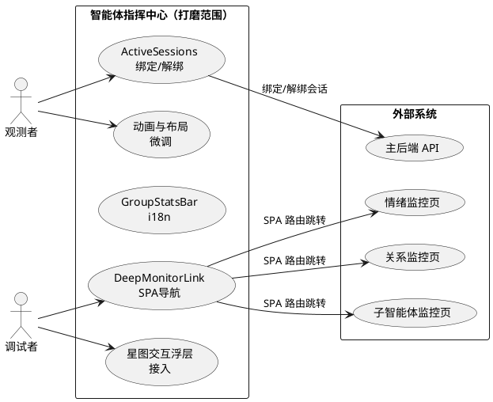
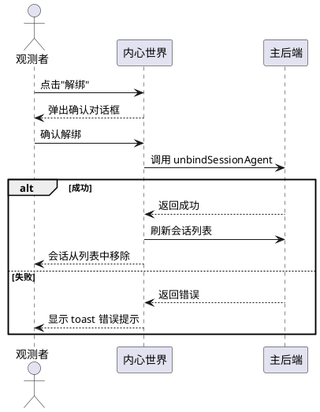
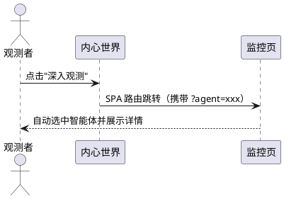
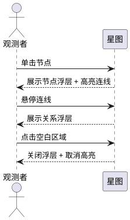
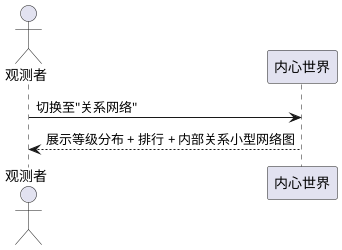

# 智能体指挥中心 — 后续打磨需求规格

> 基于已完成的全量开发（Phase 1~4），对智能体管理页进行功能补全、交互修复和体验打磨。
> 本文档仅描述"做什么"，不涉及"怎么做"。

# 1. 组件定位

## 1.1 核心职责

本组件负责修补智能体指挥中心已实现功能中的逻辑缺失、交互缺陷和体验瑕疵，使已上线功能达到可交付品质。

## 1.2 核心输入

1. 代码审查发现的问题清单 — 来源：对已实现代码的逐文件审查，内容：功能缺失、逻辑错误、体验瑕疵
2. 用户反馈 — 来源：实际使用中发现的交互问题，内容：操作异常、视觉不一致、文案缺失
3. 原始需求规格 — 来源：`agent_mgmt_enhance/spec.md`，内容：已定义但未完整实现的业务规则

## 1.3 核心输出

1. 功能补全 — 目标：智能体指挥中心，内容：ActiveSessions 绑定/解绑逻辑、星图交互浮层等已创建但未接入的功能
2. 交互修复 — 目标：智能体指挥中心，内容：DeepMonitorLink SPA 导航、GroupStatsBar i18n、Tabs 状态保持等
3. 体验打磨 — 目标：智能体指挥中心，内容：动画微调、布局优化、视觉一致性提升

## 1.4 职责边界

1. 本组件**不负责**新增业务功能 — 所有打磨项均基于已有需求规格中已定义但未完整实现的能力
2. 本组件**不负责**后端 API 新增或修改 — 仅修复前端逻辑和展示
3. 本组件**不负责**重构已有组件的架构 — 仅做最小化修补，不改变组件间关系
4. 本组件**不负责**性能优化的架构级重构 — 仅做局部优化（如减少重复计算）

# 2. 领域术语

**后续打磨（Polish）**
: 对已上线功能进行的功能补全、交互修复和体验提升，不涉及新业务能力的引入。

**功能缺失（Feature Gap）**
: 已创建组件或接口但未接入实际逻辑的状态。如 ActiveSessions 组件存在但绑定/解绑处理函数为空。

**交互缺陷（Interaction Defect）**
: 已实现的交互行为与需求规格不一致的问题。如 DeepMonitorLink 使用 `<a>` 导致整页刷新而非 SPA 路由切换。

**体验瑕疵（UX Polish）**
: 功能可用但体验不够完善的问题。如硬编码中文、缺少图例、动画参数需微调等。

**SPA 导航（SPA Navigation）**
: 单页应用内的路由切换，不触发浏览器整页刷新。区别于 `<a href>` 导致的硬跳转。

# 3. 角色与边界

## 3.1 核心角色

**智能体观测者**：通过指挥中心观察和照料多个智能体的运维人员，期望所有按钮和交互都能正常工作，所有文案都能正确显示。

**智能体调试者**：需要深入理解智能体行为逻辑的开发人员，期望"深入观测"链接能正确跳转并保持上下文。

## 3.2 外部系统

**主后端（MaiBot Backend）**：提供智能体绑定/解绑 API（`bindSessionAgent`/`unbindSessionAgent`），打磨过程中不修改后端。

## 3.3 交互上下文

# 4. DFX约束

## 4.1 性能

1. 打磨后的指挥中心首页首次加载完成时间不得超过 2 秒（与原规格一致）
2. 打磨不得引入新的重复 API 请求
3. 星图交互浮层的渲染不得影响星图的主线程帧率

## 4.2 可靠性

1. 会话绑定/解绑操作失败时，必须显示明确的错误提示，不得静默失败（与原规格一致）
2. 打磨不得引入新的异常场景或回归问题

## 4.3 安全性

1. 会话解绑操作必须经过用户二次确认（与原规格一致）

## 4.4 可维护性

1. 所有新增或修改的用户可见文本必须通过 i18n 管理
2. 打磨修改应保持最小化，不改变组件间的依赖关系

## 4.5 兼容性

1. 打磨后的组件必须与现有 `AgentConfigInfo`、`EmotionStateInfo`、`RelationshipInfo`、`SubAgentRecord` 数据结构兼容
2. 打磨不得破坏已有的会话绑定/解绑、智能体重载、情绪监控页、关系监控页、子智能体监控页功能

# 5. 核心能力

## 5.1 ActiveSessions 绑定/解绑逻辑补全

### 5.1.1 业务规则

1. **解绑操作规则**：当用户在活跃会话子视图中点击某条会话的"解绑"按钮时，系统应当弹出二次确认对话框，确认后调用 `unbindSessionAgent` API 执行解绑，成功后刷新会话列表。
   - 验收条件：[用户点击"解绑"按钮] → [弹出二次确认对话框"确认解绑？"] → [用户确认] → [调用解绑 API] → [成功后刷新会话列表，该会话从列表中移除]

2. **解绑失败处理规则**：当解绑 API 调用失败时，系统应当显示 toast 错误提示，不更新会话列表。
   - 验收条件：[解绑 API 返回错误] → [页面顶部显示"解除绑定失败"的 toast 通知，会话列表不变]

3. **绑定操作规则**：当用户在活跃会话子视图中点击"绑定会话"按钮时，系统应当弹出会话选择对话框，展示所有可用会话列表，用户选择后调用 `bindSessionAgent` API 执行绑定，成功后刷新会话列表。
   - 验收条件：[用户点击"绑定会话"按钮] → [弹出会话选择对话框] → [用户选择会话并确认] → [调用绑定 API] → [成功后刷新会话列表，新会话出现在列表中]

4. **绑定失败处理规则**：当绑定 API 调用失败时，系统应当显示 toast 错误提示，不更新会话列表。
   - 验收条件：[绑定 API 返回错误] → [页面顶部显示"绑定失败"的 toast 通知，会话列表不变]

5. **绑定中状态规则**：当绑定或解绑 API 正在执行时，系统应当禁用所有绑定/解绑操作按钮，防止重复提交。
   - 验收条件：[解绑 API 正在执行] → [所有解绑按钮显示禁用状态]

6. **会话选择对话框规则**：会话选择对话框应当展示所有可用聊天流（通过 `getChatStreams` 获取），以聊天流实际名称（群名称或"xxx的私聊"）展示，而非 session_id。
   - 验收条件：[打开会话选择对话框] → [列表中展示聊天流实际名称而非 session_id]

7. **禁止项**：禁止在绑定/解绑操作执行期间允许用户重复点击操作按钮。
   - 验收条件：[绑定 API 正在执行] → [绑定按钮不可点击]

### 5.1.2 交互流程

### 5.1.3 异常场景

1. **解绑操作失败**
   - 触发条件：`unbindSessionAgent()` 请求返回错误
   - 系统行为：显示 toast 错误提示，不更新会话列表
   - 用户感知：页面顶部显示"解除绑定失败"的 toast 通知

2. **绑定操作失败**
   - 触发条件：`bindSessionAgent()` 请求返回错误
   - 系统行为：显示 toast 错误提示，不更新会话列表
   - 用户感知：页面顶部显示"绑定失败"的 toast 通知

3. **会话列表加载失败**
   - 触发条件：`getChatStreams()` 请求返回错误
   - 系统行为：会话选择对话框显示"加载失败"提示和重试按钮
   - 用户感知：对话框中显示错误提示而非空白

## 5.2 DeepMonitorLink SPA 导航修复

### 5.2.1 业务规则

1. **SPA 导航规则**：当用户在内心世界点击"深入观测"链接时，系统应当通过 SPA 路由切换导航至对应监控页，而非触发浏览器整页刷新。
   - 验收条件：[用户在情绪景观点击"深入观测"] → [页面通过 SPA 路由切换至情绪监控页，URL 包含 `?agent=xxx`，浏览器不刷新]

2. **上下文保持规则**：导航至监控页时，系统应当通过 URL 查询参数传递智能体 ID，确保监控页能自动选中对应智能体。
   - 验收条件：[从内心世界导航至情绪监控页] → [情绪监控页自动选中当前智能体并展示详情]

3. **禁止项**：禁止使用 `<a href>` 导致整页刷新的方式实现导航。
   - 验收条件：[点击"深入观测"链接] → [浏览器 Network 面板不出现 HTML 文档请求，仅发生 SPA 路由切换]

### 5.2.2 交互流程

### 5.2.3 异常场景

1. **监控页路由不存在**
   - 触发条件：目标监控页路由未注册
   - 系统行为：SPA 路由切换失败，保持当前页面
   - 用户感知：页面无变化，不出现白屏

## 5.3 GroupStatsBar i18n 修复

### 5.3.1 业务规则

1. **文案国际化规则**：全局态势视图顶部的群体概览统计条中所有文案必须通过 i18n 管理，禁止硬编码中文。
   - 验收条件：[查看全局态势统计条] → [文案通过 i18n 翻译键渲染，切换至英文后文案正确显示英文]

2. **统计格式规则**：统计条应当以语义化格式展示4项指标：智能体总数、活跃智能体数、总关系数、平均关系分数。
   - 验收条件：[13个智能体，5个活跃，120条总关系，平均分数 450] → [统计条展示"13 个生命体 · 5 个活跃 · 120 条纽带 · 均温 450"，且所有文案通过 i18n 翻译键渲染]

### 5.3.2 交互流程

无新增交互流程，仅修复文案渲染方式。

### 5.3.3 异常场景

无新增异常场景。

## 5.4 星图交互浮层接入

### 5.4.1 业务规则

1. **节点点击浮层规则**：当用户单击星图中某个智能体节点时，系统应当展示该智能体的简要生命体征浮层（情绪脉动、活跃节奏），并高亮该节点及其所有关系连线。
   - 验收条件：[用户单击"银狼"节点] → [银狼节点高亮，其所有关系连线高亮，浮层显示简要生命体征]

2. **关系悬停浮层规则**：当用户悬停在星图的关系连线上时，系统应当展示关系浮层，包含关系类型、态度描述和互动风格，使用语义化描述。
   - 验收条件：[用户悬停在A与B的连线上] → [浮层显示关系类型、态度、互动风格和紧密程度描述]

3. **浮层关闭规则**：当用户点击星图空白区域时，系统应当关闭所有浮层并取消高亮。
   - 验收条件：[用户点击星图空白区域] → [所有浮层关闭，节点和连线取消高亮]

### 5.4.2 交互流程

### 5.4.3 异常场景

1. **节点浮层数据不完整**
   - 触发条件：点击的智能体节点缺少情绪数据
   - 系统行为：浮层正常展示可用数据，缺失部分显示"暂不可感知"
   - 用户感知：浮层部分展示，不出现空白或报错

## 5.5 关系网络内部关系可视化升级

### 5.5.1 业务规则

1. **内部关系网络图规则**：当智能体存在内部关系数据时，系统应当在关系网络子视图中以小型网络图（力导向图）展示内部关系，而非纯文本列表。节点为智能体头像，连线颜色映射关系类型。
   - 验收条件：[智能体有3条内部关系] → [关系网络子视图中展示包含该智能体和3个目标智能体的小型力导向图，连线颜色反映关系类型]

2. **降级规则**：当内部关系数据为空时，系统应当不展示网络图区域，仅展示关系等级分布和排行。
   - 验收条件：[智能体无内部关系] → [关系网络子视图中不出现网络图区域]

3. **禁止项**：禁止在内部关系网络图上展示原始 `mention_tendency` 数值，应使用语义化描述。
   - 验收条件：[查看内部关系网络图] → [图上不出现原始数值，悬停浮层中使用语义化描述]

### 5.5.2 交互流程

### 5.5.3 异常场景

1. **内部关系网络图渲染失败**
   - 触发条件：reactflow 组件渲染异常
   - 系统行为：降级展示纯文本列表，不显示空白
   - 用户感知：关系网络子视图中内部关系区域以文本列表形式展示

## 5.6 动画与布局微调

### 5.6.1 业务规则

1. **EmotionPulse 脉动幅度规则**：情绪脉动的 scale 动画幅度应当有上限约束，避免强度值较高时脉动幅度过大导致视觉跳跃。最大 scale 不超过 1.2。
   - 验收条件：[智能体主导情绪强度为 100] → [脉动 scale 不超过 1.2，动画自然不突兀]

2. **ActivityRhythmIndicator 沉睡状态规则**：当智能体处于"沉睡"状态时，活跃节奏指示器应当显示固定不透明的圆点（无呼吸灯效果），而非当前实现的 opacity: 0.6 固定值。
   - 验收条件：[智能体处于"沉睡"状态] → [活跃节奏指示器显示不透明的灰色圆点，无动画]

3. **InnerWorldView 布局响应式规则**：内心世界叠加层应当适配不同屏幕尺寸。在小屏设备上应接近全屏展示，在大屏设备上保持合理的最大宽度。
   - 验收条件：[在 1366px 宽度屏幕上查看内心世界] → [内心世界叠加层宽度合理，不出现左右大片空白]
   - 验收条件：[在 768px 宽度屏幕上查看内心世界] → [内心世界叠加层接近全屏展示]

4. **EmotionBaselineShift 偏移条宽度规则**：基线偏移条的宽度应当有最小可见宽度，确保小幅偏移也能被用户感知。偏移量在 5~15 范围内时，偏移条宽度不低于 10%。
   - 验收条件：[某情绪维度 delta=8] → [偏移条宽度不低于 10%，用户可清晰辨识偏移方向]

5. **ViewSwitcher 图标规则**：视图切换器应当使用 lucide-react 图标替代 emoji 图标，确保跨平台渲染一致性。
   - 验收条件：[查看视图切换器] → [图标使用 SVG 渲染而非 emoji，在 Windows/macOS/Linux 上显示一致]

6. **EmotionDonutChart 图例规则**：群体情绪环形图应当包含图例，展示各情绪类型的颜色和标签，不依赖 Tooltip 才能辨识。
   - 验收条件：[查看群体情绪环形图] → [图表下方或右侧展示图例，包含颜色色块和情绪标签]

7. **ActivityHeatmap 图例规则**：活跃度热力图应当包含颜色-状态映射的图例说明。
   - 验收条件：[查看活跃度热力图] → [图表下方展示图例：红色=活跃、黄色=安静、蓝色=沉睡]

8. **禁止项**：禁止在动画微调中引入新的性能问题，13个智能体场景下帧率不得低于 30fps。
   - 验收条件：[13个智能体同时展示脉动动画] → [帧率不低于 30fps]

### 5.6.2 交互流程

无新增交互流程，仅调整已有交互的视觉表现。

### 5.6.3 异常场景

无新增异常场景。

## 5.7 生命时间线时间戳修复

### 5.7.1 业务规则

1. **真实时间戳规则**：生命时间线中的"记忆里程碑"事件应当使用子智能体记录的实际完成时间（`completed_at`），而非当前时间。"情绪转折"和"关系突破"事件在缺乏历史数据时应当标注为"当前状态"而非使用伪造的时间戳。
   - 验收条件：[智能体最近完成了一次 Dream 巩固，完成时间为 10:30] → [时间线中该事件显示 10:30 而非当前时间]
   - 验收条件：[情绪转折事件无历史时间戳] → [时间线中该事件标注为"当前状态"而非当前时间]

2. **禁止项**：禁止使用 `new Date().toISOString()` 作为事件时间戳，除非该事件确实发生在当前时刻。
   - 验收条件：[查看生命时间线] → [所有事件时间戳均为真实时间或标注为"当前状态"]

### 5.7.2 交互流程

无新增交互流程。

### 5.7.3 异常场景

无新增异常场景。

## 5.8 EmotionDonutChart 标签取值修复

### 5.8.1 业务规则

1. **标签独立取值规则**：群体情绪环形图中每个情绪类型的标签应当从该情绪类型对应的智能体数据中获取，而非仅取第一个智能体的标签映射。
   - 验收条件：[5个智能体主导情绪为 happy，3个为 calm] → [环形图中 happy 和 calm 标签均正确显示，不依赖第一个智能体的标签映射]

### 5.8.2 交互流程

无新增交互流程。

### 5.8.3 异常场景

无新增异常场景。

## 5.9 内心世界 Tabs 状态保持

### 5.9.1 业务规则

1. **子视图选择保持规则**：当用户在内心世界中切换智能体时，系统应当保持当前选中的子视图（情绪景观/关系网络/记忆花园/生命时间线/活跃会话），不重置为默认的"情绪景观"。
   - 验收条件：[用户在"记忆花园"子视图按下↓方向键切换至下一个智能体] → [切换后仍停留在"记忆花园"子视图]

2. **禁止项**：禁止在切换智能体时重置用户的子视图选择状态。
   - 验收条件：[切换智能体后] → [子视图选择状态与切换前一致]

### 5.9.2 交互流程

无新增交互流程。

### 5.9.3 异常场景

无新增异常场景。

## 5.10 useInnerWorldData 加载状态修复

### 5.10.1 业务规则

1. **完整加载状态规则**：内心世界的加载状态判断应当包含所有数据查询（agent、emotion、relationships、sessions、subAgentRecords、emotionBehaviorRules），而非仅检查 agent 和 emotion 两个查询。
   - 验收条件：[agent 和 emotion 已加载完成，但 relationships 仍在加载中] → [内心世界仍显示加载状态而非部分渲染]

2. **渐进加载规则**：当核心数据（agent）已加载完成但辅助数据仍在加载时，系统可以先展示身份标识区域，辅助数据区域显示骨架屏。
   - 验收条件：[agent 已加载，emotion 仍在加载] → [身份标识区域正常展示，情绪景观区域显示骨架屏]

### 5.10.2 交互流程

无新增交互流程。

### 5.10.3 异常场景

无新增异常场景。

# 6. 数据约束

## 6.1 ActiveSessions 交互状态

1. **isUnbinding**：绑定/解绑操作是否正在执行中，布尔值，必填，用于禁用操作按钮
2. **bindDialogOpen**：绑定会话对话框是否打开，布尔值，必填，用于控制对话框显示
3. **selectedSessionId**：用户在绑定对话框中选中的会话ID，字符串，可选，用于确认绑定目标

## 6.2 星图交互状态

1. **selectedNodeId**：当前选中的星图节点ID，字符串，可选，用于控制节点高亮和浮层显示
2. **hoveredEdgeId**：当前悬停的星图连线ID，字符串，可选，用于控制连线浮层显示

## 6.3 内心世界 Tabs 状态

1. **activeTab**：当前选中的子视图标识（emotion/relationship/memory/timeline/sessions），字符串，必填，切换智能体时保持不变