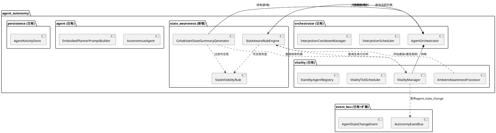
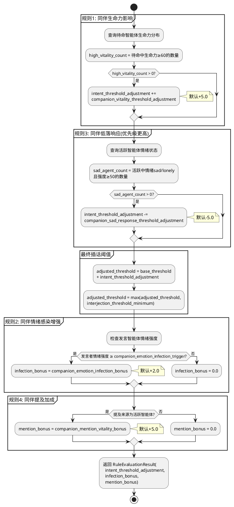
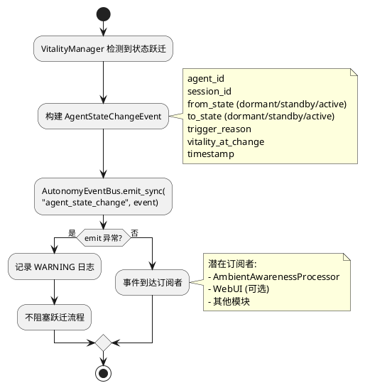
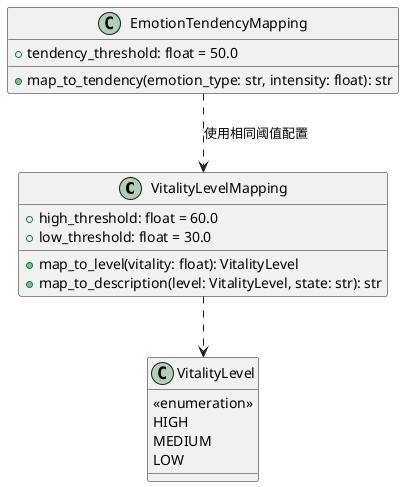
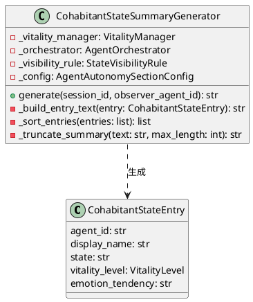
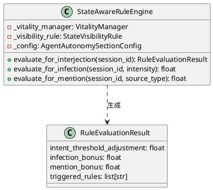

# 智能体状态互知机制 — 技术设计文档

> 理想的角色不应是一具等待结局的标本，而应是一场永恒的进行时。

# 一、需求与存量功能关系分析

## 1.1 需求功能与存量功能对比

### 1.1.1 已实现功能

| 需求功能 | 存量功能 | 代码位置 | 匹配度 |
|---------|---------|---------|--------|
| 待命智能体列表查询 | `VitalityManager.get_standby_agents()` 返回 `list[StandbyAgentInfo]` | `vitality_manager.py:294-296` | 100% |
| 活跃智能体列表查询 | `AgentOrchestrator.get_active_agents()` 返回 `list[AutonomousAgent]` | `orchestrator.py:196-198` | 100% |
| 智能体显示名获取 | `AgentConfigRegistry.get_agent().display_name` | `agent/registry.py` | 100% |
| 情绪状态快照获取 | `AutonomousAgent.get_emotion_state()` 返回情绪状态对象 | `agent.py:126-130` | 100% |
| 会话绑定关系查询 | `AgentRouter.get_session_all_agents()` 返回 `set[str]` | `router.py` | 100% |
| 事件总线发布/订阅 | `AutonomyEventBus.emit()` / `subscribe()` | `event_bus.py:79-102` | 100% |
| 生命力值查询 | `VitalityManager.get_agent_vitality()` 返回 `float` | `vitality_manager.py:298-301` | 100% |
| 插话意图阈值动态调整 | `VitalityManager.get_cohabitation_params()` 返回 `CohabitationParams` | `vitality_manager.py:303-348` | 75% |
| 提及检测 | `AmbientAwarenessProcessor.check_mention()` | `ambient_awareness.py:106-133` | 100% |
| 情绪感染处理 | `AmbientAwarenessProcessor.on_agent_speak()` | `ambient_awareness.py:69-95` | 75% |
| 角色化提示词构建 | `EmbodiedPlannerPromptBuilder._build_embodied_context()` | `prompt_builder.py:73-118` | 75% |
| 提示词模板加载 | `load_prompt("maisaka_chat_embodied", **context)` | `prompt_builder.py:49` | 100% |
| 共居插话参数计算 | `VitalityManager.get_cohabitation_params()` | `vitality_manager.py:303-348` | 75% |
| 活跃状态持久化 | `AgentActivityStore` 全套 CRUD | `activity_store.py:1-387` | 100% |

### 1.1.2 需要扩展的功能

| 需求功能 | 存量功能 | 差异说明 | 扩展方向 |
|---------|---------|---------|---------|
| 共居状态摘要生成 | 无。当前提示词中无任何同伴状态信息 | `_build_embodied_context()` 返回的上下文字典中无 `cohabitant_states` 键，提示词模板中无对应占位符 | 在 `_build_embodied_context()` 中新增 `cohabitant_states` 键，在提示词模板中新增 `{cohabitant_states}` 占位符 |
| 提示词模板占位符 | 当前 `maisaka_chat_embodied.prompt` 中无 `{cohabitant_states}` 占位符 | 三语模板均需新增该占位符，放置在 `{agent_emotion_state}` 之后、输出规则之前 | 修改 zh-CN/en-US/ja-JP 三个模板文件，新增 `{cohabitant_states}` 占位符 |
| 状态感知规则引擎 | 无。当前 `get_cohabitation_params()` 仅基于绑定智能体数量计算参数，不考虑同伴具体状态 | 缺少4条感知规则：同伴生命力影响、同伴情绪感染增强、同伴低落响应、同伴提及加成 | 新增 `StateAwareRuleEngine` 类，在 `_collect_behavior_intents()` 前调用规则评估，调整插话意图阈值和情绪感染强度 |
| 情绪感染强度调整 | `AmbientAwarenessProcessor.on_agent_speak()` 中情绪感染强度固定为 `3.0` | 当前不根据发言智能体情绪强度动态调整感染强度 | 在 `on_agent_speak()` 中引入规则引擎评估结果，动态调整感染强度 |
| 提及加成调整 | `AmbientAwarenessProcessor.on_session_message()` 中提及加成固定为 `vitality_stimulus_mention` | 当前不区分"用户提及"和"活跃智能体提及"的加成差异 | 在提及检测后调用规则引擎，活跃智能体提及时额外增加生命力加成 |
| 事件类型扩展 | `AutonomyEventBus` 当前支持 `interaction_signal`、`interjection_mention`、`session_message`、`agent_speak` 四种事件 | 缺少 `agent_state_change` 事件类型 | 在 `event_bus.py` 中新增 `AgentStateChangeEvent` 数据类，在 VitalityManager 状态跃迁时发布 |
| 配置参数扩展 | `AgentAutonomySectionConfig` 中有生命力相关参数，但无状态感知规则参数 | 缺少4条感知规则的参数配置和可见性规则配置 | 在 `AgentAutonomySectionConfig` 中新增状态感知规则参数和可见性规则参数 |
| WebUI 状态互知展示 | 当前 WebUI API 仅有 `GET /agent/sessions/{agent_id}` 返回 active/bound_inactive 两种状态 | 缺少感知关系展示、摘要预览、感知规则状态展示 | 新增 WebUI API 端点和前端组件 |

### 1.1.3 需要新增的功能或接口

**共居状态摘要生成器** (`state_awareness/summary_generator.py`)
- 输入：session_id、observer_agent_id
- 输出：自然语言共居状态摘要文本（最大 500 字符）
- 核心逻辑：查询待命/活跃列表 → 获取情绪快照 → 数值映射为自然语言 → 按可见性规则过滤 → 组装摘要文本
- 依赖：VitalityManager、AgentOrchestrator、EmotionManager、AgentConfigRegistry、StateVisibilityRule
- 约束：总耗时 ≤ 50ms，不调用 LLM，不暴露具体数值

**状态感知规则引擎** (`state_awareness/rule_engine.py`)
- 输入：session_id、当前上下文（待命列表生命力分布、活跃智能体情绪状态）
- 输出：参数调整指令（插话意图阈值偏移、情绪感染强度偏移、生命力加成偏移）
- 核心逻辑：4条感知规则的参数化评估，按优先级叠加
- 依赖：VitalityManager、AgentOrchestrator、EmotionManager
- 约束：单次评估 ≤ 10ms，纯规则计算，不替智能体做决策

**状态可见性规则** (`state_awareness/visibility_rule.py`)
- 输入：observer_agent_id、target_agent_id、session_id
- 输出：target 对 observer 可见的信息粒度（状态+生命力等级+情绪倾向 / 状态+生命力等级 / 不可见）
- 核心逻辑：基于双方状态判定可见性层级
- 依赖：VitalityManager、AgentOrchestrator
- 约束：纯内存查询，无 I/O

**状态变更事件** (`event_bus.py` 扩展)
- 输入：agent_id、session_id、from_state、to_state、trigger_reason、vitality_at_change
- 输出：通过 AutonomyEventBus 发布 `agent_state_change` 事件
- 依赖：AutonomyEventBus
- 约束：发布延迟 ≤ 20ms，发布失败不阻塞跃迁

**WebUI 状态互知 API** (`webui/routers/agent.py` 扩展)
- 输入：session_id 查询参数
- 输出：感知关系数据、摘要预览文本、感知规则状态
- 依赖：CohabitantStateSummaryGenerator、StateAwareRuleEngine

## 1.2 存量功能详细分析

### VitalityManager（`vitality_manager.py`）

**接口契约**：
- `sync_standby_agents(session_id)` → 同步待命列表，绑定但非活跃的智能体加入待命
- `add_to_standby(agent_id, session_id, reason, initial_vitality)` → 加入待命并持久化
- `remove_from_standby(agent_id, session_id, reason)` → 从待命移除并持久化
- `update_vitality(agent_id, session_id, delta, reason) -> float` → 更新生命力值，返回新值
- `check_instant_activation(agent_id, session_id) -> bool` → 即时跃迁检查
- `get_standby_agents(session_id) -> list[StandbyAgentInfo]` → 查询待命列表
- `get_agent_vitality(agent_id, session_id) -> float` → 查询生命力值
- `get_cohabitation_params(session_id) -> CohabitationParams` → 计算共居插话参数

**业务规则**：
- 生命力值范围 [0.0, 100.0]，超出范围自动截断
- 待命智能体通过 `StandbyAgentRegistry` 内存注册表管理，同时持久化到 `AgentAutonomyActivity` 表
- 共居参数基于绑定智能体数量动态计算，`bound_count >= 3` 时启用调整

**扩展点**：
- `get_cohabitation_params()` 可扩展为接受规则引擎的调整结果
- `update_vitality()` 可接受额外的 `delta` 来源（如同伴提及加成）
- 状态跃迁点（`add_to_standby`、`check_instant_activation`、`remove_from_standby`）可发布 `agent_state_change` 事件

**约束**：
- `sync_standby_agents()` 为同步方法（非 async），内部调用 `ChatManager` 单例
- 心跳评估使用 `asyncio.Lock` 防止并发

### AmbientAwarenessProcessor（`ambient_awareness.py`）

**接口契约**：
- `on_session_message(event: SessionMessageEvent)` → 处理会话消息，更新待命智能体生命力
- `on_agent_speak(event: AgentSpeakEvent)` → 处理智能体发言，执行情绪感染
- `check_mention(content, agent_id) -> bool` → 检查是否提及智能体
- `check_topic_relevance(content, agent_id) -> list[str]` → 检查话题相关性

**业务规则**：
- 消息感知：每个待命智能体生命力 += `vitality_stimulus_message`
- 提及感知：被提及的待命智能体生命力 += `vitality_stimulus_mention`，并检查即时跃迁
- 话题感知：匹配关键词的待命智能体生命力 += `vitality_stimulus_topic`
- 情绪感染：发言智能体情绪强度 ≥ 60 时，待命智能体情绪偏移 +3.0

**扩展点**：
- `on_agent_speak()` 中情绪感染强度 `3.0` 可替换为规则引擎动态计算的值
- `on_session_message()` 中提及加成可区分用户提及和活跃智能体提及

**约束**：
- 纯规则计算，不调用 LLM
- 情绪感染使用 `AutonomousAgent(agent_id)` 临时创建实例访问 `EmotionManager`

### EmbodiedPlannerPromptBuilder（`prompt_builder.py`）

**接口契约**：
- `build_system_prompt(tools_section) -> str` → 构建角色化系统提示词
- `_build_embodied_context(tools_section) -> dict[str, str]` → 构建提示词渲染上下文

**业务规则**：
- 上下文字典包含：`bot_name`、`identity`、`agent_anti_mechanization`、`agent_internal_relationships`、`agent_interaction_memory`、`agent_favor_injection`、`agent_emotion_state`、`agent_relationship` 等
- 动态数据源优先：注册的 `identity_provider` 返回非 None 时替换默认 `identity_prompt`
- 构建失败降级为 `maisaka_chat` 旁观者模板

**扩展点**：
- `_build_embodied_context()` 返回的字典可新增 `cohabitant_states` 键
- `load_prompt("maisaka_chat_embodied", **context)` 会自动将字典中的键与模板占位符匹配

**约束**：
- 占位符缺失时 `load_prompt` 不会报错（降级为空字符串或跳过）
- 上下文构建为同步方法，不涉及异步 I/O

### AutonomyEventBus（`event_bus.py`）

**接口契约**：
- `subscribe(event_type, handler)` → 订阅事件
- `emit(event_type, event)` → 异步发射事件
- `emit_sync(event_type, event)` → 同步发射事件（创建 asyncio.Task）

**业务规则**：
- 单例模式，全局共享
- 当前支持的事件类型：`interaction_signal`、`interjection_mention`、`session_message`、`agent_speak`
- 事件处理器异常时记录 WARNING 日志，不中断其他处理器

**扩展点**：
- 可新增 `agent_state_change` 事件类型
- 事件数据类为 `@dataclass`，可新增 `AgentStateChangeEvent`

**约束**：
- `emit_sync()` 使用 `asyncio.create_task()`，不等待处理器完成
- 事件处理器必须为异步函数（`AutonomyEventHandler = Callable[[Any], Coroutine[Any, Any, None]]`）

### AgentOrchestrator（`orchestrator.py`）

**接口契约**：
- `activate_agent(agent_id, reason) -> bool` → 激活智能体
- `deactivate_agent(agent_id, reason)` → 退场智能体
- `handle_message(message)` → 处理用户消息
- `_collect_behavior_intents()` → 收集活跃智能体行为意图
- `_schedule_interjections()` → 调度插话

**业务规则**：
- `handle_message()` 中调用 `sync_standby_agents()` 同步待命列表
- `_collect_behavior_intents()` 使用 `get_cohabitation_params()` 获取动态插话阈值
- `_check_timeout_exit()` 中超时智能体回落为待命

**扩展点**：
- `_collect_behavior_intents()` 前可插入规则引擎评估，调整 `dynamic_threshold`
- `activate_agent()` / `deactivate_agent()` 后可发布 `agent_state_change` 事件
- `_subscribe_events()` 可订阅 `agent_state_change` 事件

**约束**：
- `_active_agents` 为 `dict[str, AutonomousAgent]`，线程安全依赖 asyncio 事件循环
- `max_active_agents` 默认为 3，范围 [2, 5]

### 提示词模板（`prompts/{locale}/maisaka_chat_embodied.prompt`）

**当前结构**（zh-CN）：
```
你是 {bot_name}，你在思考如何回应。
{bot_name}的人设：{identity}
{agent_anti_mechanization}
{agent_internal_relationships}
{agent_interaction_memory}
{agent_favor_injection}
{agent_emotion_state}
{agent_relationship}
以上是你的人设...
{group_chat_attention_block}
# Using your tools...
```

**扩展点**：
- 在 `{agent_emotion_state}` 和 `{agent_relationship}` 之后、`以上是你的人设` 之前，新增 `{cohabitant_states}` 占位符
- 三语模板需同步修改

**约束**：
- 占位符缺失时 `load_prompt` 不会报错，但模板中应显式包含以确保注入
- 摘要文本最大 500 字符，避免占用过多上下文窗口

# 二、增量设计方案

## 2.1 实现模型

### 2.1.1 上下文视图

```plantuml
@startuml
!define COMPONENT rectangle
!define EXTERNAL rectangle

actor "活跃智能体" as active_agent
actor "待命智能体" as standby_agent
actor "Bot管理员" as admin

COMPONENT "智能体状态互知机制" {
  [CohabitantStateSummaryGenerator] as summary
  [StateAwareRuleEngine] as rule_engine
  [StateVisibilityRule] as visibility
  [AgentStateChangeEvent] as state_event
}

EXTERNAL "已有生命力架构" {
  [VitalityManager] as vitality
  [AgentOrchestrator] as orch
  [AmbientAwarenessProcessor] as ambient
  [StandbyAgentRegistry] as registry
}

EXTERNAL "已有提示词系统" {
  [EmbodiedPlannerPromptBuilder] as prompt
}

EXTERNAL "外部依赖" {
  [EmotionManager] as emotion
  [AgentRouter] as router
  [AgentConfigRegistry] as agent_registry
  [AutonomyEventBus] as bus
  [WebUI API] as webui
}

active_agent -down-> orch : 请求思考
orch -down-> summary : 获取共居状态摘要
summary -down-> vitality : 查询待命列表
summary -down-> orch : 查询活跃列表
summary -down-> emotion : 查询情绪状态
summary -down-> agent_registry : 获取显示名
summary -down-> visibility : 过滤可见性
summary -down-> prompt : 注入{cohabitant_states}

orch -down-> rule_engine : 收集意图前评估规则
rule_engine -down-> vitality : 查询待命生命力分布
rule_engine -down-> emotion : 查询活跃智能体情绪
rule_engine -down-> orch : 调整插话意图阈值

standby_agent -left-> rule_engine : 规则感知(间接)
rule_engine -down-> ambient : 调整情绪感染强度
rule_engine -down-> vitality : 调整生命力加成

vitality -down-> state_event : 状态跃迁通知
state_event -down-> bus : 发布agent_state_change

summary -down-> webui : 感知关系数据
admin -down-> webui : 查看状态互知
@enduml
```



**关键交互说明**：
1. 活跃智能体进入思考 → Orchestrator 调用 SummaryGenerator 生成共居状态摘要 → 注入到提示词
2. 收集行为意图前 → Orchestrator 调用 RuleEngine 评估感知规则 → 调整插话意图阈值
3. 情绪感染处理时 → AmbientAwarenessProcessor 调用 RuleEngine → 动态调整感染强度
4. 提及检测后 → AmbientAwarenessProcessor 调用 RuleEngine → 活跃智能体提及额外加成
5. 状态跃迁时 → VitalityManager 发布 `agent_state_change` 事件 → 供其他模块订阅

### 2.1.2 服务/组件总体架构



**模块职责说明**：

| 模块 | 职责 | 新增/扩展 |
|------|------|----------|
| CohabitantStateSummaryGenerator | 共居状态摘要生成：查询同伴状态、数值映射为自然语言、按可见性过滤、组装摘要文本 | 新增 |
| StateAwareRuleEngine | 状态感知规则引擎：4条感知规则的参数化评估，输出参数调整指令 | 新增 |
| StateVisibilityRule | 状态可见性规则：判定目标智能体对观察者的可见信息粒度 | 新增 |
| AgentStateChangeEvent | 状态变更事件数据类 | 新增 |
| AgentOrchestrator | 扩展 `_collect_behavior_intents()` 前调用规则引擎，扩展构造函数持有新组件 | 扩展 |
| EmbodiedPlannerPromptBuilder | 扩展 `_build_embodied_context()` 新增 `cohabitant_states` 键 | 扩展 |
| AmbientAwarenessProcessor | 扩展 `on_agent_speak()` 和 `on_session_message()` 调用规则引擎 | 扩展 |
| VitalityManager | 扩展状态跃迁点发布 `agent_state_change` 事件 | 扩展 |
| AutonomyEventBus | 新增 `AgentStateChangeEvent` 数据类 | 扩展 |
| AgentAutonomySectionConfig | 新增状态感知规则参数和可见性规则参数 | 扩展 |

### 2.1.3 实现设计文档

#### 2.1.3.1 共居状态摘要生成流程

```plantuml
@startuml
start
:活跃智能体进入思考阶段;
:CohabitantStateSummaryGenerator.generate(\n  session_id, observer_agent_id);

:查询待命智能体列表\n(VitalityManager.get_standby_agents);
:查询活跃智能体列表\n(Orchestrator.get_active_agents);

:过滤掉自身和沉睡智能体;

repeat :对每个共居智能体B;
  :StateVisibilityRule.evaluate(\n  observer=A, target=B);
  
  alt B为活跃
    :可见信息：状态+生命力等级+情绪倾向;
    :获取情绪快照\n(EmotionManager.state);
    :生命力值→等级映射\n(高/中/低);
    :情绪→倾向描述映射;
  else B为待命
    :可见信息：状态+生命力等级(无情绪);
    :生命力值→等级映射;
  else B为沉睡
    :不可见，跳过;
  endif
  
  :生成单条自然语言描述;
repeat while (还有共居智能体?)

:按优先级排序\n(活跃优先，高生命力优先);

:组装摘要文本;

if (摘要长度 > max_summary_length?) then (是)
  :按优先级截断;
endif

:返回摘要文本;
stop
@enduml
```

**摘要生成性能考量**：
- 待命列表查询：内存操作（`StandbyAgentRegistry`），< 1ms
- 活跃列表查询：内存操作（`_active_agents`），< 1ms
- 情绪快照查询：每个智能体约 1ms（`EmotionManager.state` 属性访问），13 个智能体约 13ms
- 显示名查询：每个智能体约 1ms（`AgentConfigRegistry` 缓存），13 个智能体约 13ms
- 数值映射和文本组装：纯字符串操作，< 5ms
- 总计：13 个共居智能体场景下约 35ms，远低于 50ms 限制

#### 2.1.3.2 状态感知规则引擎评估流程



**规则优先级说明**：
- 规则3（同伴低落响应）与规则1（同伴生命力影响）作用在同一参数（插话意图阈值）上，按优先级叠加：先应用规则3（-5.0），再应用规则1（+5.0），可相互抵消
- 规则2（情绪感染增强）和规则4（同伴提及加成）作用在不同参数上，互不影响
- 所有参数调整均通过配置文件控制，默认值确保"无感知规则时行为不变"

#### 2.1.3.3 状态变更事件发布流程



## 2.2 接口设计

### 2.2.1 总体设计

接口分为五组：

| 接口组 | 稳定性 | 说明 |
|--------|--------|------|
| 共居状态摘要接口 | 稳定 | CohabitantStateSummaryGenerator 对外暴露的生成接口 |
| 状态感知规则接口 | 稳定 | StateAwareRuleEngine 对外暴露的评估接口 |
| 状态可见性规则接口 | 稳定 | StateVisibilityRule 对外暴露的判定接口 |
| 状态变更事件接口 | 稳定 | AgentStateChangeEvent 数据类和事件发布 |
| WebUI 查询接口 | 稳定 | 状态互知数据的 HTTP API |

接口变更策略：新增接口以扩展为主，不修改现有接口签名。对 Orchestrator 的修改仅限于内部方法扩展和构造函数新增依赖，公开接口 `activate_agent()`/`deactivate_agent()` 签名不变。

### 2.2.2 接口清单

#### CohabitantStateSummaryGenerator

```python
class CohabitantStateSummaryGenerator:
    """共居状态摘要生成器——为活跃智能体生成同伴状态的自然语言摘要。"""

    def __init__(
        self,
        vitality_manager: VitalityManager,
        orchestrator: AgentOrchestrator,
        visibility_rule: StateVisibilityRule,
    ) -> None: ...

    def generate(
        self, session_id: str, observer_agent_id: str
    ) -> str:
        """生成共居状态摘要文本。

        前置条件：VitalityManager 已初始化
        后置条件：返回自然语言摘要文本，最大长度 max_summary_length
        异常映射：VitalityManager 不可用 → 仅展示活跃智能体状态
        异常映射：EmotionManager 不可用 → 跳过情绪描述
        异常映射：任何异常 → 返回空字符串，不阻塞提示词构建
        """

    def generate_preview(
        self, session_id: str
    ) -> dict[str, Any]:
        """生成感知关系预览数据（供 WebUI 使用）。

        前置条件：无
        返回值：包含 observer_agents、cohabitant_entries、summary_text 的字典
        """
```

#### StateAwareRuleEngine

```python
@dataclass
class RuleEvaluationResult:
    """感知规则评估结果。"""
    intent_threshold_adjustment: float  # 插话意图阈值偏移量
    infection_bonus: float  # 情绪感染强度偏移量
    mention_bonus: float  # 提及生命力加成偏移量
    triggered_rules: list[str]  # 触发的规则名称列表

class StateAwareRuleEngine:
    """状态感知规则引擎——基于同伴状态调整行为参数。"""

    def __init__(
        self,
        vitality_manager: VitalityManager,
        visibility_rule: StateVisibilityRule,
    ) -> None: ...

    def evaluate_for_interjection(
        self, session_id: str
    ) -> RuleEvaluationResult:
        """评估插话相关的感知规则（规则1+规则3）。

        前置条件：VitalityManager 已初始化
        后置条件：返回插话意图阈值调整量
        异常映射：评估超时 → 返回零偏移结果
        """

    def evaluate_for_infection(
        self, session_id: str, speaker_emotion_intensity: float
    ) -> float:
        """评估情绪感染增强规则（规则2）。

        前置条件：无
        返回值：情绪感染强度偏移量
        """

    def evaluate_for_mention(
        self, session_id: str, mention_source_type: str
    ) -> float:
        """评估同伴提及加成规则（规则4）。

        前置条件：无
        返回值：生命力加成偏移量
        """
```

#### StateVisibilityRule

```python
@dataclass
class VisibilityInfo:
    """可见性判定结果。"""
    visible: bool  # 是否可见
    show_emotion: bool  # 是否展示情绪倾向
    show_vitality_level: bool  # 是否展示生命力等级

class StateVisibilityRule:
    """状态可见性规则——判定目标智能体对观察者的可见信息粒度。"""

    def __init__(self, config: AgentAutonomySectionConfig) -> None: ...

    def evaluate(
        self,
        observer_state: str,
        target_state: str,
    ) -> VisibilityInfo:
        """判定目标智能体对观察者的可见信息粒度。

        前置条件：observer_state 和 target_state 为 active/standby/dormant 之一
        返回值：VisibilityInfo 包含可见性和信息粒度
        """
```

#### AgentStateChangeEvent

```python
@dataclass
class AgentStateChangeEvent:
    """智能体状态变更事件——状态跃迁时发布。"""

    agent_id: str = ""
    session_id: str = ""
    from_state: str = ""  # "dormant" | "standby" | "active"
    to_state: str = ""  # "dormant" | "standby" | "active"
    trigger_reason: str = ""  # "vitality_activation" | "timeout_fallback" | "mention" | ...
    vitality_at_change: float = 0.0
    timestamp: str = ""  # ISO 8601
```

#### WebUI 状态互知 API

```python
# GET /api/webui/agent/state-awareness?session_id={session_id}

class CohabitantEntry(BaseModel):
    agent_id: str
    display_name: str
    state: str  # "active" | "standby"
    vitality_level: str  # "high" | "medium" | "low"
    emotion_tendency: str  # 自然语言描述，待命智能体为空

class StateAwarenessResponse(BaseModel):
    success: bool
    session_id: str
    cohabitant_entries: list[CohabitantEntry]
    summary_preview: str  # 当前活跃智能体看到的摘要文本
    active_rules: list[dict[str, Any]]  # 当前生效的感知规则及最近触发时间
```

## 2.3 数据模型

### 2.3.1 设计目标

1. **支持共居状态摘要**：将同伴状态信息以自然语言形式注入提示词
2. **支持状态可见性判定**：不同状态的智能体看到不同粒度的信息
3. **支持感知规则参数化**：4条感知规则的参数可通过配置文件调整
4. **支持状态变更事件**：状态跃迁时发布结构化事件
5. **兼容现有架构**：不新增数据库表，仅扩展配置类和事件类

### 2.3.2 模型实现

#### 数值映射模型



**生命力等级映射规则**：

| 生命力值范围 | 等级 | 活跃状态描述 | 待命状态描述 |
|------------|------|------------|------------|
| ≥ 60.0 | HIGH | 也在场，精神饱满 | 在旁边听着，跃跃欲试 |
| 30.0 ~ 60.0 | MEDIUM | 也在场 | 在旁边安静地听着 |
| < 30.0 | LOW | 也在场，似乎有些疲倦 | 在旁边待着，有些困倦 |

**情绪倾向映射规则**：

| 情绪类型 | 强度条件 | 倾向描述 |
|---------|---------|---------|
| happy/excited | ≥ 50 | 心情不错 / 很兴奋 |
| sad/lonely | ≥ 50 | 有些低落 / 似乎有点孤单 |
| angry/anxious | ≥ 50 | 似乎有些烦躁 / 看起来有些不安 |
| 其他或所有 < 50 | - | 不特别描述 |

#### 摘要文本组装模型



**摘要文本模板**（zh-CN）：

- 活跃 + 高生命力 + 情绪倾向：`"{display_name}也在场，精神饱满，看起来{emotion_tendency}"`
- 活跃 + 中生命力 + 情绪倾向：`"{display_name}也在场，看起来{emotion_tendency}"`
- 活跃 + 低生命力：`"{display_name}也在场，似乎有些疲倦"`
- 待命 + 高生命力：`"{display_name}在旁边听着，跃跃欲试"`
- 待命 + 中生命力：`"{display_name}在旁边安静地听着"`
- 待命 + 低生命力：`"{display_name}在旁边待着，有些困倦"`

多条摘要以分号连接，整体前缀为 `"\n你身边的同伴状态："` 或空字符串（无同伴时）。

#### 状态感知规则模型



**4条感知规则参数化设计**：

| 规则名称 | 触发条件 | 调整参数 | 默认值 | 配置键 |
|---------|---------|---------|--------|--------|
| 同伴生命力影响 | 待命中生命力≥60的数量>0 | 插话意图阈值 +5.0 | 5.0 | `companion_vitality_threshold_adjustment` |
| 同伴情绪感染增强 | 发言者情绪强度≥80 | 情绪感染强度 +2.0 | 2.0 | `companion_emotion_infection_bonus` |
| 同伴低落响应 | 活跃中sad/lonely强度≥50的数量>0 | 插话意图阈值 -5.0 | 5.0 | `companion_sad_response_threshold_adjustment` |
| 同伴提及加成 | 提及来源为活跃智能体 | 生命力加成 +5.0 | 5.0 | `companion_mention_vitality_bonus` |

**规则触发阈值配置**：

| 配置键 | 默认值 | 范围 | 说明 |
|--------|--------|------|------|
| `companion_vitality_trigger_threshold` | 60.0 | [30.0, 100.0] | 同伴生命力影响规则的触发阈值 |
| `companion_emotion_infection_trigger` | 80.0 | [50.0, 100.0] | 同伴情绪感染增强规则的触发阈值 |
| `companion_sad_trigger_threshold` | 50.0 | [20.0, 80.0] | 同伴低落响应规则的触发阈值 |

**可见性规则配置**：

| 配置键 | 默认值 | 说明 |
|--------|--------|------|
| `active_visible_to_active` | true | 活跃对活跃可见 |
| `standby_visible_to_active` | true | 待命对活跃可见 |
| `standby_emotion_visible_to_active` | false | 待命情绪对活跃不可见 |
| `dormant_visible_to_any` | false | 沉睡对任何智能体不可见 |
| `vitality_level_high_threshold` | 60.0 | 生命力"高"等级阈值 |
| `vitality_level_low_threshold` | 30.0 | 生命力"低"等级阈值 |
| `emotion_tendency_threshold` | 50.0 | 情绪倾向描述的强度阈值 |
| `max_summary_length` | 500 | 共居状态摘要最大长度 |

## 2.4 对现有模块的修改清单

### AgentOrchestrator（`orchestrator.py`）

| 修改点 | 修改内容 | 影响范围 |
|--------|---------|---------|
| `__init__()` | 新增 `self._summary_generator` 和 `self._rule_engine` 实例化 | 构造函数 |
| `_collect_behavior_intents()` | 在收集意图前调用 `self._rule_engine.evaluate_for_interjection()`，将调整量叠加到 `dynamic_threshold` | 方法内部 |
| `_subscribe_events()` | 新增订阅 `"agent_state_change"` 事件 | 方法内部 |

### EmbodiedPlannerPromptBuilder（`prompt_builder.py`）

| 修改点 | 修改内容 | 影响范围 |
|--------|---------|---------|
| `_build_embodied_context()` | 新增 `"cohabitant_states"` 键到返回的上下文字典 | 方法内部 |

### AmbientAwarenessProcessor（`ambient_awareness.py`）

| 修改点 | 修改内容 | 影响范围 |
|--------|---------|---------|
| `__init__()` | 新增 `self._rule_engine` 参数 | 构造函数 |
| `on_agent_speak()` | 调用 `self._rule_engine.evaluate_for_infection()` 获取动态感染强度，替换固定值 `3.0` | 方法内部 |
| `on_session_message()` | 在提及检测后调用 `self._rule_engine.evaluate_for_mention()` 获取额外加成 | 方法内部 |

### VitalityManager（`vitality_manager.py`）

| 修改点 | 修改内容 | 影响范围 |
|--------|---------|---------|
| `add_to_standby()` | 在加入待命后发布 `agent_state_change` 事件（from=dormant, to=standby） | 方法末尾 |
| `remove_from_standby()` | 在移除待命后发布 `agent_state_change` 事件（from=standby, to=dormant） | 方法末尾 |
| `check_instant_activation()` | 在跃迁成功后发布 `agent_state_change` 事件（from=standby, to=active） | 方法末尾 |
| `_evaluate_single_agent()` | 在生命力激活后发布 `agent_state_change` 事件（from=standby, to=active） | 方法内部 |

### AutonomyEventBus（`event_bus.py`）

| 修改点 | 修改内容 | 影响范围 |
|--------|---------|---------|
| 新增 `AgentStateChangeEvent` | 新增 `@dataclass` 数据类 | 文件末尾 |

### AgentAutonomySectionConfig（`official_configs.py`）

| 修改点 | 修改内容 | 影响范围 |
|--------|---------|---------|
| 新增配置字段 | 新增 16 个状态感知和可见性规则配置字段 | 类定义 |

### 提示词模板文件

| 文件 | 修改内容 |
|------|---------|
| `prompts/zh-CN/maisaka_chat_embodied.prompt` | 在 `{agent_emotion_state}` 之后新增 `{cohabitant_states}` 占位符 |
| `prompts/en-US/maisaka_chat_embodied.prompt` | 同上，英文版 |
| `prompts/ja-JP/maisaka_chat_embodied.prompt` | 同上，日文版 |

## 2.5 新增文件清单

| 文件路径 | 职责 |
|---------|------|
| `src/maisaka/agent_autonomy/state_awareness/__init__.py` | 包初始化 |
| `src/maisaka/agent_autonomy/state_awareness/summary_generator.py` | 共居状态摘要生成器 |
| `src/maisaka/agent_autonomy/state_awareness/rule_engine.py` | 状态感知规则引擎 |
| `src/maisaka/agent_autonomy/state_awareness/visibility_rule.py` | 状态可见性规则 |
| `src/maisaka/agent_autonomy/state_awareness/mapping.py` | 数值→自然语言映射（生命力等级、情绪倾向） |

## 2.6 配置参数设计

在 `AgentAutonomySectionConfig` 中新增以下字段：

### 状态感知规则参数

```python
# --- 状态感知规则参数 ---

companion_vitality_threshold_adjustment: float = Field(
    default=5.0, ge=0.0, le=20.0,
    ...
)
"""同伴生命力影响规则的插话阈值调整幅度。"""

companion_vitality_trigger_threshold: float = Field(
    default=60.0, ge=30.0, le=100.0,
    ...
)
"""同伴生命力影响规则的触发阈值。"""

companion_emotion_infection_bonus: float = Field(
    default=2.0, ge=0.0, le=10.0,
    ...
)
"""同伴情绪感染增强规则的强度增加。"""

companion_emotion_infection_trigger: float = Field(
    default=80.0, ge=50.0, le=100.0,
    ...
)
"""同伴情绪感染增强规则的触发阈值。"""

companion_sad_response_threshold_adjustment: float = Field(
    default=5.0, ge=0.0, le=20.0,
    ...
)
"""同伴低落响应规则的插话阈值调整幅度。"""

companion_sad_trigger_threshold: float = Field(
    default=50.0, ge=20.0, le=80.0,
    ...
)
"""同伴低落响应规则的触发阈值。"""

companion_mention_vitality_bonus: float = Field(
    default=5.0, ge=0.0, le=20.0,
    ...
)
"""同伴提及加成规则的生命力额外加成。"""
```

### 可见性规则参数

```python
# --- 状态可见性规则参数 ---

active_visible_to_active: bool = Field(default=True, ...)
"""活跃智能体对活跃智能体是否可见。"""

standby_visible_to_active: bool = Field(default=True, ...)
"""待命智能体对活跃智能体是否可见。"""

standby_emotion_visible_to_active: bool = Field(default=False, ...)
"""待命智能体的情绪是否对活跃智能体可见。"""

dormant_visible_to_any: bool = Field(default=False, ...)
"""沉睡智能体是否对任何智能体可见。"""

vitality_level_high_threshold: float = Field(
    default=60.0, ge=30.0, le=100.0,
    ...
)
"""生命力"高"等级阈值。"""

vitality_level_low_threshold: float = Field(
    default=30.0, ge=0.0, le=60.0,
    ...
)
"""生命力"低"等级阈值。"""

emotion_tendency_threshold: float = Field(
    default=50.0, ge=20.0, le=80.0,
    ...
)
"""情绪倾向描述的强度阈值。"""

max_summary_length: int = Field(
    default=500, ge=100, le=1000,
    ...
)
"""共居状态摘要最大长度。"""
```

**配置版本号**：新增配置字段需同步更新配置模板版本号，不改动 `legacy_migration`。