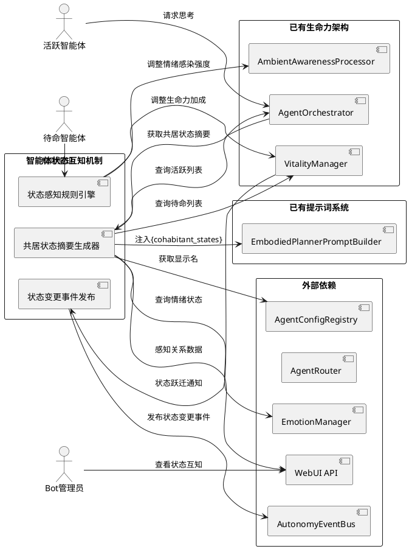
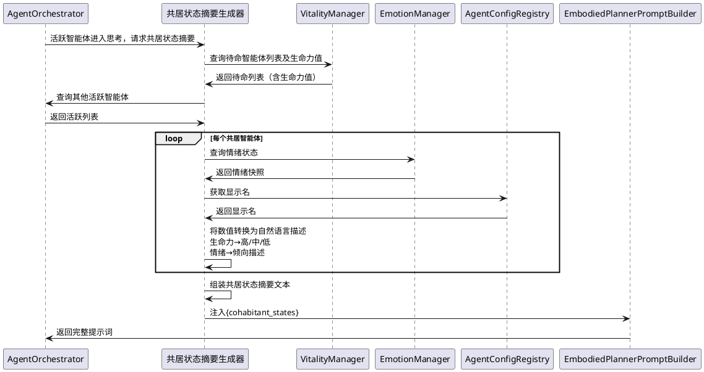
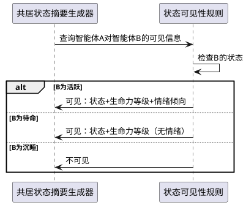
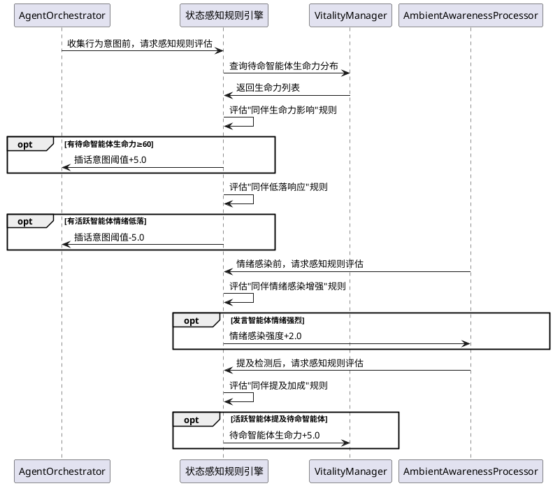
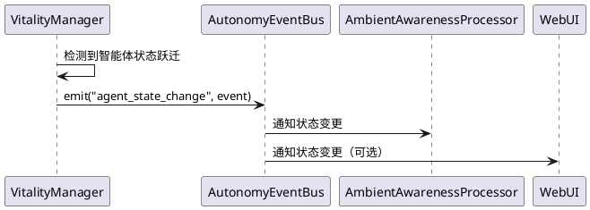
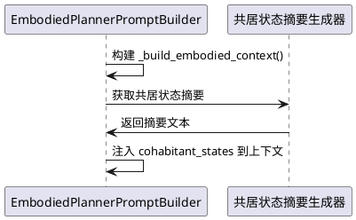
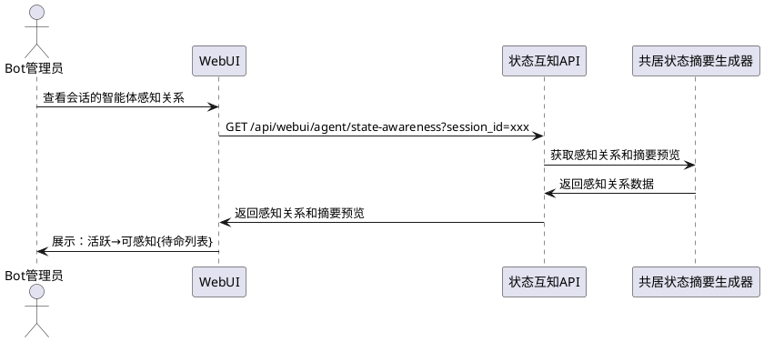

# 智能体状态互知机制 — 需求规格

> 理想的角色不应是一具等待结局的标本，而应是一场永恒的进行时。

# **1. 组件定位**

## **1.1 核心职责**

本组件负责将会话中共居智能体的状态信息（活跃/待命/沉睡、生命力、情绪摘要）传递给其他智能体，使智能体在决策时能感知同伴的存在与状态，从而产生更自然的交互行为。

## **1.2 核心输入**

1. **待命智能体列表**：来自 VitalityManager 的 StandbyAgentRegistry 中当前会话的所有待命智能体及其生命力值
2. **活跃智能体列表**：来自 AgentOrchestrator 的 `_active_agents` 中当前会话的所有活跃智能体
3. **智能体情绪状态**：每个活跃/待命智能体的 EmotionManager 当前情绪快照（主导情绪、强度）
4. **绑定智能体集合**：来自 AgentRouter 的会话绑定关系，确定哪些智能体属于同一共居空间
5. **智能体配置**：来自 AgentConfigRegistry 的显示名、人设关键词等，用于生成可读的状态描述

## **1.3 核心输出**

1. **共居状态提示词片段**：注入到活跃智能体提示词中的 `{cohabitant_states}` 占位符内容，描述其他智能体的状态摘要
2. **状态感知规则触发**：基于其他智能体状态触发的规则引擎决策（如：待命智能体被同伴提及后生命力加成调整、活跃智能体因同伴情绪而调整插话意愿）
3. **状态变更事件**：智能体状态变化时通过 AutonomyEventBus 发布的事件，供其他模块订阅
4. **可观测性日志**：状态互知注入和规则触发的结构化日志

## **1.4 职责边界**

- **不负责**：智能体状态的管理和跃迁——那是 agent_vitality 机制的职责
- **不负责**：智能体情绪的计算和更新——那是 EmotionManager 的职责
- **不负责**：智能体行为意图的产生——那是 BehaviorIntentEngine 的职责
- **不负责**：让待命智能体主动查询其他智能体状态——待命智能体不调用 LLM，状态信息通过提示词注入和规则引擎被动传递
- **不负责**：跨会话的状态互知——状态互知仅限同一会话内的共居智能体
- **不负责**：修改智能体的核心决策逻辑——只提供状态信息，不替智能体做决策

# **2. 领域术语**

**状态互知（State Awareness）**
: 智能体感知同一会话中其他共居智能体当前状态（活跃/待命/沉睡、生命力、情绪）的能力。状态互知是单向的信息传递：系统将状态信息推送给智能体，而非智能体主动查询。

**共居状态摘要（Cohabitant State Summary）**
: 对同一会话中其他智能体状态的简短文字描述，注入到活跃智能体的提示词中。摘要包含智能体名称、当前状态、生命力等级、情绪倾向等关键信息，以自然语言形式呈现。

**状态可见性规则（State Visibility Rule）**
: 定义哪些状态信息对哪些智能体可见的规则。不同状态级别的智能体可看到的信息粒度不同，活跃智能体可看到更详细的状态，待命智能体仅能通过规则引擎间接感知。

**状态感知规则引擎（State-Aware Rule Engine）**
: 基于其他智能体状态触发行为调整的规则集合。当同伴状态满足特定条件时（如：同伴情绪低落、同伴生命力接近激活阈值），自动调整当前智能体的行为参数（如插话意愿、情绪感染强度）。

**状态变更事件（State Change Event）**
: 智能体状态发生跃迁时发布的事件，包含变更前后的状态、触发原因等。供其他模块订阅以实现联动效果。

**感知层级（Awareness Level）**
: 智能体对同伴状态的感知深度分级。活跃智能体处于"完整感知"层级（可通过提示词获得详细状态），待命智能体处于"规则感知"层级（仅通过规则引擎间接影响行为参数）。

# **3. 角色与边界**

## **3.1 核心角色**

**活跃智能体**：在会话中可发言的智能体，通过提示词注入获得其他共居智能体的完整状态摘要，在思考时自然感知同伴的存在和状态。

**待命智能体**：在会话中拥有环境感知但不可发言的智能体，通过规则引擎间接感知同伴状态（如生命力加成调整、情绪感染强度调整），不直接获得状态文本。

**Bot 管理员**：通过 WebUI 查看共居智能体间的状态互知情况，配置状态可见性规则和感知规则。

## **3.2 外部系统**

**VitalityManager**：提供待命智能体列表和生命力值，是状态互知的核心数据源。

**AgentOrchestrator**：提供活跃智能体列表，是状态互知的另一个数据源；同时是提示词注入的执行入口。

**EmotionManager**：提供智能体情绪状态快照，是状态互知的情绪数据源。

**AgentRouter**：提供会话绑定关系，确定状态互知的范围。

**AgentConfigRegistry**：提供智能体显示名等配置，用于生成可读的状态摘要。

**AutonomyEventBus**：发布状态变更事件，供其他模块订阅。

**EmbodiedPlannerPromptBuilder**：接收共居状态摘要，注入到活跃智能体的提示词中。

**WebUI 后端 API**：消费状态互知数据，展示共居智能体间的感知关系。

## **3.3 交互上下文**

# **4. DFX约束**

## **4.1 性能**

1. 共居状态摘要生成的总耗时不得超过 50ms（13个共居智能体场景下）
2. 状态感知规则引擎的单次评估延迟不得超过 10ms（纯规则计算，无 LLM 调用）
3. 状态变更事件的发布延迟不得超过 20ms
4. 提示词注入增加的文本长度不得超过 500 字符（避免占用过多上下文窗口）
5. 状态互知不得增加任何 LLM API 调用

## **4.2 可靠性**

1. 状态互知功能异常不得影响活跃智能体的正常回复流程
2. 共居状态摘要生成失败时，智能体应使用不含状态信息的提示词继续工作
3. 状态感知规则引擎异常时，应静默降级为不调整行为参数
4. 状态变更事件发布失败时，不得阻塞状态跃迁流程

## **4.3 安全性**

1. 状态互知必须遵守状态可见性规则——沉睡智能体的状态不向任何智能体暴露
2. 待命智能体的详细内在需求信息不得暴露给其他智能体——仅暴露生命力等级（高/中/低）
3. 活跃智能体的完整情绪数值不得暴露——仅暴露情绪倾向（如"心情不错""有些低落"）
4. 状态互知不得泄露跨会话的智能体状态信息
5. 状态可见性规则的修改必须通过 WebUI API 进行，且需要管理员权限

## **4.4 可维护性**

1. 共居状态摘要的每次生成必须输出 DEBUG 级别日志，包含会话 ID、智能体数量、摘要长度
2. 状态感知规则的每次触发必须输出 DEBUG 级别日志，包含规则名称、触发条件、调整参数
3. 状态可见性规则和感知规则必须可通过配置文件调整
4. 提示词模板修改需三语同步（zh-CN/en-US/ja-JP）

## **4.5 兼容性**

1. 本组件必须与现有的 agent_vitality 机制完全兼容——状态互知是生命力机制的上层消费者
2. 本组件必须与现有的提示词系统兼容——通过新增 `{cohabitant_states}` 占位符注入，不修改现有占位符
3. 本组件必须与现有的插话机制兼容——状态感知规则调整的是参数而非逻辑
4. 本组件必须与单智能体模式兼容——无共居智能体时不产生任何开销
5. 配置文件修改只改模板，新增版本号
6. 提示词修改需三语同步（zh-CN/en-US/ja-JP）

# **5. 核心能力**

## **5.1 共居状态摘要生成与提示词注入**

### **5.1.1 业务规则**

1. **摘要生成规则**：当活跃智能体进入思考阶段时，系统必须为该智能体生成当前会话中其他共居智能体的状态摘要
   - 验收条件：[银狼（活跃）进入思考阶段] → [银狼的提示词中包含其他12个智能体的状态摘要]
   - 验收条件：[会话中仅有1个活跃智能体且无待命智能体] → [不生成摘要，`{cohabitant_states}` 为空]

2. **摘要内容规则**：每个共居智能体的状态摘要必须包含以下信息：
   - 智能体显示名
   - 当前状态（活跃/待命，不暴露沉睡状态）
   - 生命力等级（高/中/低，不暴露具体数值）
   - 情绪倾向（自然语言描述，如"心情不错""有些低落""很兴奋"，不暴露具体数值）
   - 验收条件：[三月七处于待命状态、生命力65、情绪happy(70)] → [摘要中显示"三月七正在旁边安静地听着，看起来心情不错"]
   - 验收条件：[姬子处于活跃状态、生命力50、情绪sad(40)] → [摘要中显示"姬子也在场，似乎有些低落"]

3. **摘要语言风格规则**：状态摘要必须以自然、角色化的语言呈现，而非机械的数据罗列
   - 验收条件：[摘要文本] → [不包含"生命力=65""情绪=happy(70)"等数值表达]
   - 验收条件：[摘要文本] → [使用"在旁边听着""也在场""似乎""看起来"等自然表达]

4. **提示词注入规则**：共居状态摘要必须通过 `{cohabitant_states}` 占位符注入到 `maisaka_chat_embodied` 提示词模板中
   - 验收条件：[活跃智能体的提示词] → [包含 `{cohabitant_states}` 占位符对应的内容]
   - 验收条件：[无共居智能体时] → [`{cohabitant_states}` 占位符为空字符串]

5. **摘要更新时机规则**：共居状态摘要必须在每次智能体思考时重新生成，确保信息时效性
   - 验收条件：[智能体 A 从待命跃迁为活跃] → [下一次思考时其他智能体的摘要反映 A 的状态变化]

6. **禁止项**：禁止在摘要中暴露沉睡智能体的存在——沉睡意味着"不在场"，不应被其他智能体感知
   - 验收条件：[智能体 B 处于沉睡状态] → [B 不出现在任何智能体的状态摘要中]

### **5.1.2 交互流程**

### **5.1.3 异常场景**

1. **VitalityManager 不可用**
   - 触发条件：查询待命列表时 VitalityManager 未初始化或异常
   - 系统行为：仅展示活跃智能体状态，跳过待命智能体
   - 用户感知：智能体可能不知道有待命同伴

2. **EmotionManager 不可用**
   - 触发条件：查询情绪状态时 EmotionManager 异常
   - 系统行为：跳过该智能体的情绪描述，仅展示状态和生命力等级
   - 用户感知：智能体不知道同伴的情绪

3. **摘要文本过长**
   - 触发条件：13个共居智能体的摘要总长度超过 500 字符
   - 系统行为：按优先级截断（活跃优先于待命，高生命力优先于低生命力），确保不超过限制
   - 用户感知：低优先级的智能体可能不出现在摘要中

## **5.2 状态可见性规则**

### **5.2.1 业务规则**

1. **活跃智能体可见性规则**：活跃智能体对其他活跃智能体和待命智能体均可见，其状态信息（状态、生命力等级、情绪倾向）对同一会话中的所有活跃智能体开放
   - 验收条件：[银狼和姬子均为活跃] → [银狼的摘要中包含姬子的状态，姬子的摘要中包含银狼的状态]

2. **待命智能体可见性规则**：待命智能体对活跃智能体可见，但其信息粒度低于活跃智能体——仅展示"在旁边听着"和生命力等级，不展示情绪倾向
   - 验收条件：[三月七处于待命] → [活跃智能体的摘要中显示"三月七正在旁边安静地听着"（含生命力等级）]
   - 验收条件：[三月七处于待命] → [活跃智能体的摘要中不包含三月七的情绪信息]

3. **沉睡智能体不可见规则**：沉睡智能体对任何智能体均不可见，不出现在状态摘要中
   - 验收条件：[瓦尔特处于沉睡] → [任何智能体的摘要中均不包含瓦尔特]

4. **自我不可见规则**：智能体在自身的状态摘要中不包含自己的状态
   - 验收条件：[银狼的摘要] → [不包含银狼自身的状态信息]

5. **跨会话不可见规则**：状态互知仅限同一会话内的共居智能体，不同会话的智能体状态互不可见
   - 验收条件：[银狼在会话 A 和会话 B 中均活跃] → [会话 A 的摘要不包含会话 B 的智能体状态]

6. **生命力等级映射规则**：生命力值必须映射为三个等级而非暴露具体数值
   - 高（≥60.0）：描述为"精神饱满""跃跃欲试"等
   - 中（30.0~60.0）：描述为"安静地听着""在旁边待着"等
   - 低（<30.0）：描述为"有些困倦""不太有精神"等
   - 验收条件：[生命力值 75.0] → [摘要中使用"精神饱满"类描述]
   - 验收条件：[生命力值 15.0] → [摘要中使用"有些困倦"类描述]

7. **情绪倾向映射规则**：情绪状态必须映射为自然语言倾向描述而非暴露具体数值
   - happy/excited（强度≥50）：描述为"心情不错""很兴奋"等
   - sad/lonely（强度≥50）：描述为"有些低落""似乎有点孤单"等
   - angry/anxious（强度≥50）：描述为"似乎有些烦躁""看起来有些不安"等
   - 中性（所有情绪强度<50）：不特别描述情绪
   - 验收条件：[情绪 happy(80)] → [摘要中使用"心情不错"类描述]
   - 验收条件：[情绪中性（所有<50）] → [摘要中不特别描述情绪]

8. **禁止项**：禁止向任何智能体暴露其他智能体的具体生命力数值和情绪强度数值
   - 验收条件：[任何状态摘要] → [不包含"生命力=65.0""情绪强度=70"等数值]

### **5.2.2 交互流程**

### **5.2.3 异常场景**

1. **状态判断不一致**
   - 触发条件：摘要生成时智能体状态刚好发生跃迁
   - 系统行为：使用生成时刻的快照，不做实时锁定
   - 用户感知：摘要可能有短暂延迟，不影响功能

## **5.3 状态感知规则引擎**

### **5.3.1 业务规则**

1. **同伴生命力影响规则**：当共居智能体的生命力接近激活阈值时，活跃智能体的插话意愿应当微调——如果同伴"跃跃欲试"，活跃智能体可以适当让出话题空间
   - 验收条件：[3个待命智能体生命力≥60.0] → [活跃智能体的插话意图阈值小幅提升（+5.0，可配置）]
   - 验收条件：[所有待命智能体生命力<30.0] → [不调整插话意图阈值]

2. **同伴情绪感染增强规则**：当共居智能体（活跃）情绪强烈时，情绪感染效果应当增强——强烈情绪更容易"传染"给待命同伴
   - 验收条件：[活跃智能体 A 情绪强度≥80] → [待命智能体受 A 情绪感染时强度增加（+2.0，可配置）]
   - 验收条件：[活跃智能体 A 情绪强度<50] → [不增强情绪感染效果]

3. **同伴低落响应规则**：当共居智能体（活跃）情绪低落时，其他活跃智能体的插话意愿应当微调——倾向于主动关心或给予空间
   - 验收条件：[姬子（活跃）情绪 sad(60)] → [银狼的插话意图阈值小幅降低（-5.0，可配置），倾向于主动互动]
   - 验收条件：[所有活跃智能体情绪正常] → [不调整插话意图阈值]

4. **同伴提及加成规则**：当活跃智能体在发言中提及待命智能体时，被提及的待命智能体获得额外的生命力加成（在现有 `vitality_stimulus_mention` 基础上增加）
   - 验收条件：[银狼（活跃）发言中提到"三月七"] → [三月七（待命）生命力额外增加（+5.0，可配置）]
   - 验收条件：[用户提到"三月七"] → [三月七获得标准的 vitality_stimulus_mention 加成，无额外加成]

5. **规则优先级规则**：当多条感知规则同时触发时，按以下优先级处理：
   - 同伴低落响应 > 同伴生命力影响 > 同伴提及加成 > 同伴情绪感染增强
   - 验收条件：[姬子低落且三月七生命力高] → [先应用低落响应（阈值-5.0），再应用生命力影响（阈值+5.0），最终无变化]

6. **规则可配置规则**：所有感知规则的参数（阈值调整幅度、加成幅度等）必须可通过配置文件调整
   - 验收条件：[修改配置 `state_awareness_companion_vitality_threshold_adjustment` 为 8.0] → [同伴生命力影响规则的阈值调整变为 8.0]

7. **禁止项**：禁止状态感知规则直接决定智能体是否发言——规则只调整参数，不替智能体做决策
   - 验收条件：[任何感知规则触发] → [不产生"必须发言"或"必须沉默"的强制决策]

### **5.3.2 交互流程**

### **5.3.3 异常场景**

1. **规则评估超时**
   - 触发条件：单条规则评估耗时超过 10ms
   - 系统行为：跳过该规则，使用默认参数
   - 用户感知：无感知

2. **规则参数配置异常**
   - 触发条件：配置的参数值为负数或超出合理范围
   - 系统行为：使用默认参数值，记录 WARNING 日志
   - 用户感知：感知规则可能不生效

3. **VitalityManager 数据不一致**
   - 触发条件：规则评估时待命列表刚被修改
   - 系统行为：使用评估时刻的快照，不做实时锁定
   - 用户感知：规则可能有短暂延迟，不影响功能

## **5.4 状态变更事件发布**

### **5.4.1 业务规则**

1. **跃迁事件发布规则**：智能体在三种状态之间发生跃迁时，必须通过 AutonomyEventBus 发布状态变更事件
   - 验收条件：[三月七从待命跃迁为活跃] → [发布 `agent_state_change` 事件，包含 from=standby, to=active]
   - 验收条件：[姬子从活跃回落为待命] → [发布 `agent_state_change` 事件，包含 from=active, to=standby]

2. **事件内容规则**：状态变更事件必须包含以下信息：
   - agent_id：发生跃迁的智能体 ID
   - session_id：所属会话 ID
   - from_state：跃迁前状态（dormant/standby/active）
   - to_state：跃迁后状态
   - trigger_reason：触发原因（vitality_activation/timeout_fallback/mention/instant_activation 等）
   - vitality_at_change：跃迁时的生命力值
   - timestamp：跃迁时间
   - 验收条件：[状态变更事件] → [包含上述所有字段]

3. **事件订阅规则**：其他模块（如 AmbientAwarenessProcessor、WebUI）可订阅 `agent_state_change` 事件以实现联动
   - 验收条件：[AmbientAwarenessProcessor 订阅了 `agent_state_change`] → [智能体跃迁后环境感知器收到通知]

4. **禁止项**：禁止状态变更事件包含智能体的完整情绪数据或内在需求数据——仅包含状态和生命力
   - 验收条件：[状态变更事件] → [不包含 emotion_state、inner_needs 等详细数据]

### **5.4.2 交互流程**

### **5.4.3 异常场景**

1. **事件发布失败**
   - 触发条件：AutonomyEventBus 不可用或 emit 抛出异常
   - 系统行为：记录 WARNING 日志，不阻塞状态跃迁流程
   - 用户感知：其他模块可能收不到状态变更通知

## **5.5 提示词模板扩展**

### **5.5.1 业务规则**

1. **新增占位符规则**：在 `maisaka_chat_embodied` 提示词模板中新增 `{cohabitant_states}` 占位符，用于注入共居状态摘要
   - 验收条件：[提示词模板] → [包含 `{cohabitant_states}` 占位符]
   - 验收条件：[无共居智能体时] → [`{cohabitant_states}` 替换为空字符串]

2. **占位符位置规则**：`{cohabitant_states}` 占位符必须放置在提示词中人设信息之后、输出规则之前，使智能体在思考时自然感知同伴
   - 验收条件：[提示词模板中 `{cohabitant_states}` 的位置] → [在 `{agent_emotion_state}` 之后，输出规则之前]

3. **三语同步规则**：提示词模板的修改必须同步到 zh-CN、en-US、ja-JP 三个语言版本
   - 验收条件：[zh-CN 模板包含 `{cohabitant_states}`] → [en-US 和 ja-JP 模板也包含对应内容]

4. **向后兼容规则**：`{cohabitant_states}` 占位符缺失时，提示词构建不得报错，应降级为空字符串
   - 验收条件：[旧版提示词模板不含 `{cohabitant_states}`] → [提示词构建正常，占位符不替换]

### **5.5.2 交互流程**

### **5.5.3 异常场景**

1. **摘要生成失败**
   - 触发条件：共居状态摘要生成器抛出异常
   - 系统行为：`cohabitant_states` 降级为空字符串，不影响提示词构建
   - 用户感知：智能体不知道同伴状态，但可正常回复

## **5.6 WebUI 状态互知展示**

### **5.6.1 业务规则**

1. **感知关系展示规则**：WebUI 必须在智能体状态面板中展示共居智能体间的感知关系——哪些智能体可以看到哪些智能体的状态
   - 验收条件：[会话 936658939 有 1 活跃 + 12 待命] → [WebUI 展示活跃智能体可感知 12 个待命智能体]

2. **状态摘要预览规则**：WebUI 必须提供"预览"功能，展示活跃智能体当前看到的共居状态摘要文本
   - 验收条件：[管理员点击"预览摘要"] → [展示当前会话的共居状态摘要文本]

3. **感知规则状态展示规则**：WebUI 必须展示当前生效的感知规则及其最近触发情况
   - 验收条件：[感知规则面板] → [展示规则名称、触发条件、最近触发时间]

4. **i18n 三语规则**：状态互知展示的所有 UI 文本必须支持中英日三语
   - 验收条件：[切换语言] → [标签、提示文本等均跟随切换]

5. **禁止项**：禁止在 WebUI 中展示智能体的完整状态摘要原始数据——仅展示摘要预览和感知关系
   - 验收条件：[状态互知面板] → [不包含生命力数值、情绪数值等原始数据]

### **5.6.2 交互流程**

### **5.6.3 异常场景**

1. **摘要生成器未初始化**
   - 触发条件：状态互知功能未启用
   - 系统行为：仅展示基础状态信息，不展示感知关系
   - 用户感知：面板中无感知关系区域

# **6. 数据约束**

## **6.1 共居状态摘要**

1. **session_id**：关联的聊天会话 ID，非空字符串
2. **observer_agent_id**：观察者智能体 ID（接收摘要的智能体），非空字符串
3. **cohabitant_entries**：共居智能体状态条目列表，每条包含：
   - **agent_id**：共居智能体 ID，非空字符串
   - **display_name**：显示名称，非空字符串
   - **state**：当前状态，必须为 active 或 standby 之一（不含 dormant）
   - **vitality_level**：生命力等级，必须为 high / medium / low 之一
   - **emotion_tendency**：情绪倾向描述，字符串，可为空（待命智能体无此项）
4. **summary_text**：组装后的自然语言摘要文本，最大长度 500 字符
5. **generated_at**：摘要生成时间，ISO 8601 格式

## **6.2 状态可见性规则配置**

1. **active_visible_to_active**：活跃智能体对活跃智能体是否可见，布尔值，默认 true
2. **standby_visible_to_active**：待命智能体对活跃智能体是否可见，布尔值，默认 true
3. **standby_emotion_visible_to_active**：待命智能体的情绪是否对活跃智能体可见，布尔值，默认 false
4. **dormant_visible_to_any**：沉睡智能体是否对任何智能体可见，布尔值，默认 false
5. **vitality_level_high_threshold**：生命力"高"等级阈值，浮点数，默认 60.0，范围 [30.0, 100.0]
6. **vitality_level_low_threshold**：生命力"低"等级阈值，浮点数，默认 30.0，范围 [0.0, 60.0]
7. **emotion_tendency_threshold**：情绪倾向描述的强度阈值，浮点数，默认 50.0，范围 [20.0, 80.0]

## **6.3 状态感知规则配置**

1. **companion_vitality_threshold_adjustment**：同伴生命力影响规则的插话阈值调整幅度，浮点数，默认 5.0，范围 [0.0, 20.0]
2. **companion_vitality_trigger_threshold**：同伴生命力影响规则的触发阈值，浮点数，默认 60.0，范围 [30.0, 100.0]
3. **companion_emotion_infection_bonus**：同伴情绪感染增强规则的强度增加，浮点数，默认 2.0，范围 [0.0, 10.0]
4. **companion_emotion_infection_trigger**：同伴情绪感染增强规则的触发阈值，浮点数，默认 80.0，范围 [50.0, 100.0]
5. **companion_sad_response_threshold_adjustment**：同伴低落响应规则的插话阈值调整幅度，浮点数，默认 5.0，范围 [0.0, 20.0]
6. **companion_sad_trigger_threshold**：同伴低落响应规则的触发阈值，浮点数，默认 50.0，范围 [20.0, 80.0]
7. **companion_mention_vitality_bonus**：同伴提及加成规则的生命力额外加成，浮点数，默认 5.0，范围 [0.0, 20.0]
8. **max_summary_length**：共居状态摘要最大长度，整数，默认 500，范围 [100, 1000]

## **6.4 状态变更事件**

1. **event_type**：事件类型，固定为 "agent_state_change"
2. **agent_id**：发生跃迁的智能体 ID，非空字符串
3. **session_id**：所属会话 ID，非空字符串
4. **from_state**：跃迁前状态，必须为 dormant / standby / active 之一
5. **to_state**：跃迁后状态，必须为 dormant / standby / active 之一
6. **trigger_reason**：触发原因，字符串
7. **vitality_at_change**：跃迁时的生命力值，浮点数
8. **timestamp**：跃迁时间，ISO 8601 格式