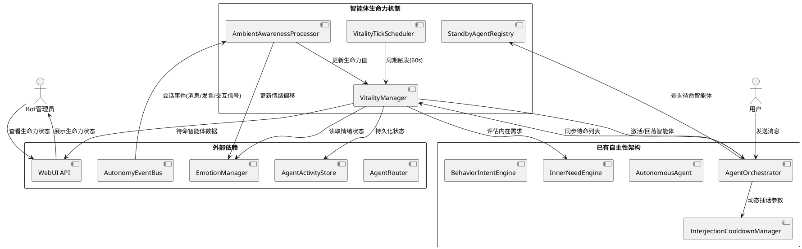
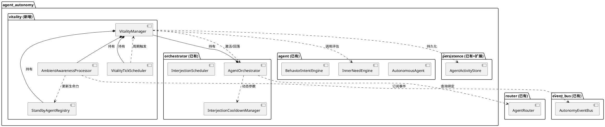
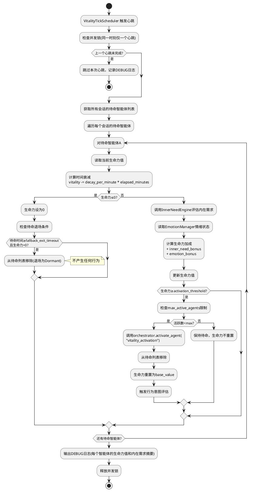
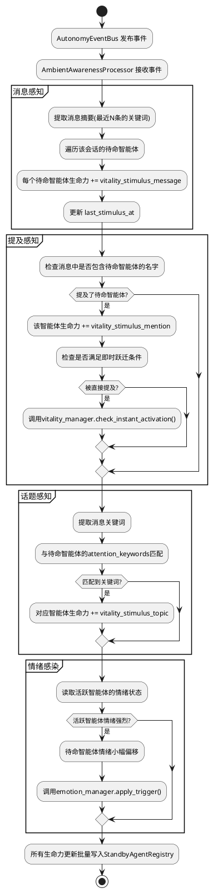
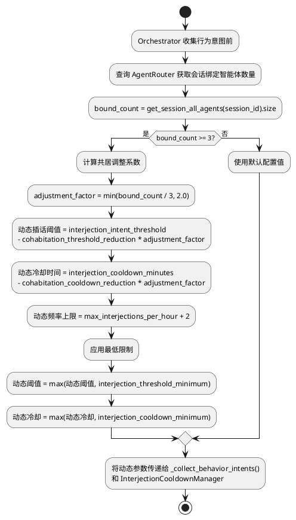
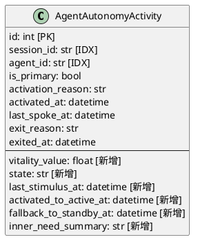
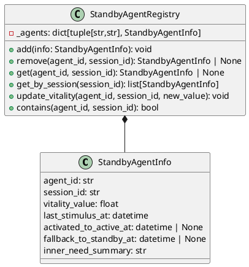

# 智能体活跃状态机制完善 — 技术设计文档

> 理想的角色不应是一具等待结局的标本，而应是一场永恒的进行时。

# 一、需求与存量功能关系分析

## 1.1 需求功能与存量功能对比

### 1.1.1 已实现功能

| 需求功能 | 存量功能 | 代码位置 | 匹配度 |
|---------|---------|---------|--------|
| 智能体激活（加入 `_active_agents`） | `AgentOrchestrator.activate_agent()` | `orchestrator.py:204-250` | 100% |
| 智能体退场（从 `_active_agents` 移除） | `AgentOrchestrator.deactivate_agent()` | `orchestrator.py:274-295` | 100% |
| 内在需求评估 | `InnerNeedEngine.evaluate()` + 三种计算器 | `inner_need.py:188-227` | 100% |
| 行为意图产生 | `BehaviorIntentEngine.produce_intents()` + 五种来源 | `behavior_intent.py:269-335` | 100% |
| 插话调度 | `InterjectionScheduler.schedule_with_session()` | `interjection_scheduler.py:98-156` | 100% |
| 插话冷却控制 | `InterjectionCooldownManager.can_interject()` | `interjection_cooldown.py:25-50` | 100% |
| 活跃状态持久化 | `AgentActivityStore.save_activity()/deactivate()` | `activity_store.py:48-125` | 100% |
| 会话-智能体绑定关系 | `AgentRouter.bind_session()/get_session_all_agents()` | `router.py:51-101` | 100% |
| 交互信号事件订阅 | `AutonomyEventBus.subscribe("interaction_signal")` | `event_bus.py:57-60` | 100% |
| 插话提及检测 | `Orchestrator._check_interjection_mention()` | `orchestrator.py:526-558` | 100% |
| 超时退场检查 | `Orchestrator._check_timeout_exit()` | `orchestrator.py:560-583` | 75% |
| 编排策略可配置 | `BaseOrchestratorStrategy` + 策略注册表 | `orchestrator_strategy.py:32-207` | 100% |
| 情绪状态读取 | `AutonomousAgent.get_emotion_state()` | `agent.py:126-130` | 100% |
| 自主性日志 | `AutonomyLogger.log()` + `AutonomyEventSubscriber` | `autonomy_logger.py:24-98` | 100% |
| 会话恢复 | `SessionRecoveryService.recover_all()` | `session_recovery.py:25-93` | 75% |

### 1.1.2 需要扩展的功能

| 需求功能 | 存量功能 | 差异说明 | 扩展方向 |
|---------|---------|---------|---------|
| 待命状态管理 | 无中间状态，仅有 `_active_agents` 字典 | 当前只有"在 `_active_agents` 中"和"不在"两种状态，无待命概念 | 在 Orchestrator 中新增 `_standby_agents` 字典，管理待命智能体及其生命力值 |
| 超时回落为待命 | `_check_timeout_exit()` 直接调用 `deactivate_agent("timeout")` 退场 | 当前超时后直接退场消失，无回落机制 | 修改超时逻辑：非主发言智能体超时后调用 `deactivate_agent("fallback_to_standby")` 并加入待命列表，而非直接退场 |
| 环境感知（消息/提及/话题） | 无。待命智能体对会话事件完全无感知 | 当前仅活跃智能体通过 `_collect_behavior_intents()` 参与感知 | 新增 `AmbientAwarenessProcessor`，订阅 EventBus 事件，为待命智能体计算环境刺激并更新生命力 |
| 生命力心跳 | 无周期性评估机制 | InnerNeedEngine 仅在 `handle_message()` 时被调用，无定时触发 | 新增 `VitalityTickScheduler`，使用 asyncio 定时任务周期性评估待命智能体生命力 |
| 生命力值存储 | `AgentAutonomyActivity` 表无生命力相关字段 | 当前 Activity 表仅记录激活/退场时间，无生命力值、待命状态等字段 | 在 `AgentAutonomyActivity` 表新增 `vitality_value`、`state`、`last_stimulus_at` 等字段 |
| 共居插话门槛优化 | `InterjectionCooldownManager` 使用固定配置值 | 当前冷却时间和频率限制是全局配置，不随绑定智能体数量动态调整 | 在 Orchestrator 调度时，根据会话绑定智能体数量动态计算插话参数 |
| WebUI 生命力状态展示 | `ActiveSessions.tsx` 仅有 active/bound_inactive 两种状态 | 当前 UI 无待命状态、无生命力值展示 | 扩展 WebUI API 和前端组件，新增待命状态和生命力值展示 |
| 会话恢复待命状态 | `SessionRecoveryService` 仅恢复 `_active_agents` | 当前恢复只处理活跃智能体，不恢复待命状态 | 扩展恢复逻辑，从数据库读取待命记录并重建待命列表 |
| 沉睡→待命自动激活 | 无。绑定智能体不会自动进入任何状态 | 当前 `handle_message()` 仅激活主发言智能体，其余绑定智能体始终沉睡 | 在 `handle_message()` 中新增待命同步逻辑，将所有绑定但非活跃的智能体加入待命列表 |

### 1.1.3 需要新增的功能或接口

**生命力管理模块** (`vitality_manager.py`)
- 输入：会话 ID、智能体 ID、环境刺激事件
- 输出：生命力值更新、状态跃迁决策
- 核心逻辑：生命力计算公式、衰减机制、激活阈值判定
- 依赖：InnerNeedEngine、EmotionManager、AgentRouter

**环境感知处理器** (`ambient_awareness.py`)
- 输入：AutonomyEventBus 事件（用户消息、智能体发言、交互信号）
- 输出：待命智能体的生命力增量和情绪偏移
- 核心逻辑：消息摘要提取、提及检测、话题关键词匹配、情绪感染计算
- 约束：纯规则计算，不调用 LLM

**生命力心跳调度器** (`vitality_tick.py`)
- 输入：定时器触发信号
- 输出：待命智能体生命力评估结果、跃迁决策
- 核心逻辑：遍历待命智能体、调用 InnerNeedEngine、计算生命力、判定激活阈值
- 约束：并发控制（同一时刻仅一个心跳任务）、不触发任何智能体行为

**WebUI 生命力 API** (`/api/webui/agent/vitality`)
- 输入：session_id 查询参数
- 输出：活跃/待命/沉睡分类的智能体列表及生命力值
- 依赖：VitalityManager、AgentOrchestrator、AgentRouter

## 1.2 存量功能详细分析

### AgentOrchestrator（`orchestrator.py`）

**接口契约**：
- `activate_agent(agent_id, reason) -> bool`：激活智能体，受 `max_active_agents` 限制，创建 AutonomousAgent 实例并写入 Activity
- `deactivate_agent(agent_id, reason)`：退场智能体，从 `_active_agents` 移除，记录 Activity 退场
- `handle_message(message)`：处理用户消息，激活主发言、收集意图、调度插话、检查超时
- `_collect_behavior_intents()`：遍历 `_active_agents`（排除主发言）收集行为意图
- `_check_timeout_exit()`：检查活跃智能体超时，直接退场

**业务规则**：
- 主发言智能体不参与插话调度，不执行超时退场
- 行为意图收集仅遍历 `_active_agents`，待命/沉睡智能体不参与
- 超时退场使用 `asyncio.create_task()` 异步执行

**扩展点**：
- `activate_agent()` 的 `reason` 参数已支持自定义原因，可直接传入 `"vitality_activation"` / `"fallback_to_standby"`
- `deactivate_agent()` 的 `reason` 参数已支持自定义原因，可直接传入 `"fallback_to_standby"`
- `_subscribe_events()` 已订阅 `"interaction_signal"` 和 `"interjection_mention"`，可扩展订阅新事件类型

**约束**：
- `_active_agents` 是 `dict[str, AutonomousAgent]`，线程安全依赖 asyncio 事件循环
- `max_active_agents` 默认为 3，范围 [2, 5]
- `_degraded` 标志控制降级模式，异常时自动降级为仅主发言

### InnerNeedEngine（`inner_need.py`）

**接口契约**：
- `evaluate(agent_id, emotion_state, memory_context, time_context) -> list[InnerNeed]`：评估内在需求
- `register_calculator(need_type, calculator)`：注册需求计算器

**业务规则**：
- 三种内置计算器：EmotionNeedCalculator、MemoryNeedCalculator、TimeNeedCalculator
- 所有计算器均为纯规则计算，不调用 LLM
- 计算结果按 strength 降序排列

**扩展点**：
- 计算器注册机制支持动态扩展
- 可直接为待命智能体调用 `agent.evaluate_inner_needs()` 获取内在需求

**约束**：
- `memory_context` 和 `time_context` 为可选参数，缺失时对应计算器返回空列表
- 单次评估耗时取决于计算器数量和复杂度，当前三种计算器均为毫秒级

### BehaviorIntentEngine（`behavior_intent.py`）

**接口契约**：
- `produce_intents(agent_id, emotion_state, conversation_context, interaction_signals, memory_context, time_context, intent_threshold) -> list[BehaviorIntent]`
- `register_source(source_type, source)`：注册意图来源

**业务规则**：
- 五种内置来源：InnerNeedIntentSource、EmotionIntentSource、TopicRelevanceIntentSource、RelationshipIntentSource、InteractionSignalIntentSource
- TopicRelevanceIntentSource 使用 `attention_keywords` 进行关键词匹配（纯规则）
- 结果按 intent_type 去重，保留强度最高的

**约束**：
- `conversation_context` 为 None 时，InnerNeedIntentSource 和 TopicRelevanceIntentSource 返回空列表
- 待命智能体在跃迁为活跃后可立即调用此引擎产生行为意图

### AutonomyEventBus（`event_bus.py`）

**接口契约**：
- `subscribe(event_type, handler)`：订阅事件
- `emit(event_type, event)`：异步发射事件
- `emit_sync(event_type, event)`：同步发射事件（创建 asyncio.Task）

**业务规则**：
- 单例模式，全局共享
- 当前支持的事件类型：`interaction_signal`、`interjection_mention`

**扩展点**：
- 可新增事件类型（如 `session_message`、`agent_speak`）用于环境感知
- 事件处理器支持异步和同步两种注册方式

### AgentActivityStore（`activity_store.py`）

**接口契约**：
- `save_activity(session_id, agent_id, is_primary, activation_reason)`：保存活跃记录
- `deactivate(session_id, agent_id, reason)`：记录退场
- `get_active_agents(session_id)`：获取会话活跃智能体列表
- `get_all_active_sessions()`：查询所有未退出的活跃记录

**业务规则**：
- 退场时设置 `exit_reason` 和 `exited_at`
- 活跃记录以 `exited_at is None` 为活跃判定条件

**约束**：
- 依赖 SQLAlchemy/SQLModel 的 `get_db_session()` 上下文管理器
- 当前 `AgentAutonomyActivity` 表无生命力值、状态、最近刺激时间等字段

### AgentRouter（`router.py`）

**接口契约**：
- `bind_session(session_id, agent_id)`：绑定会话到智能体
- `get_session_all_agents(session_id) -> set[str]`：获取会话绑定的所有智能体
- `get_session_primary_agent(session_id) -> str | None`：获取主发言智能体

**业务规则**：
- 绑定关系存储在内存 `_session_bindings: dict[str, set[str]]` 中
- 第一个绑定的智能体自动成为主发言

**约束**：
- 绑定关系不持久化到数据库（通过 ChatSession.agent_id 间接持久化主发言）
- 重启后需要从 ChatSession 恢复绑定关系

### InterjectionCooldownManager（`interjection_cooldown.py`）

**接口契约**：
- `can_interject(session_id, agent_id) -> bool`：检查是否可插话
- `record_interjection(session_id, agent_id)`：记录插话

**业务规则**：
- 三层限制：智能体冷却时间、智能体每小时频率、会话每小时频率
- 冷却时间和频率限制从 `global_config.agent_autonomy` 读取

**扩展点**：
- `can_interject()` 可增加动态参数覆盖，支持共居场景的参数调整

### WebUI API（`webui/routers/agent.py`）

**接口契约**：
- `GET /agent/sessions/{agent_id}`：获取智能体关联的所有会话及状态
- `GET /agent/batch/emotion`：批量获取情绪状态

**业务规则**：
- 会话状态仅有 `active` 和 `bound_inactive` 两种
- 共居智能体信息通过 `CohabitantInfo` 返回

**约束**：
- 需要管理员权限（`require_auth`）
- 当前无生命力值、待命状态等数据返回

# 二、增量设计方案

## 2.1 实现模型

### 2.1.1 上下文视图



**关键交互说明**：
1. 用户消息到达 → Orchestrator 调用 VitalityManager 同步待命列表 → 绑定但非活跃的智能体自动进入待命
2. EventBus 事件 → AmbientAwarenessProcessor 为待命智能体计算环境刺激 → 更新生命力值
3. 定时器触发 → VitalityTickScheduler 调用 VitalityManager 评估所有待命智能体 → 判定跃迁
4. 活跃智能体超时 → Orchestrator 调用 VitalityManager 执行回落 → 加入待命列表

### 2.1.2 服务/组件总体架构



**模块职责说明**：

| 模块 | 职责 | 新增/扩展 |
|------|------|----------|
| VitalityManager | 生命力值计算、状态跃迁决策、待命列表管理 | 新增 |
| AmbientAwarenessProcessor | 环境感知：消息/提及/话题/情绪感染处理 | 新增 |
| VitalityTickScheduler | 心跳定时任务调度、并发控制 | 新增 |
| StandbyAgentRegistry | 待命智能体注册表：存储待命智能体及其生命力值 | 新增 |
| AgentOrchestrator | 扩展 handle_message() 同步待命、扩展 _check_timeout_exit() 回落逻辑 | 扩展 |
| InterjectionCooldownManager | 扩展 can_interject() 支持动态参数 | 扩展 |
| AgentActivityStore | 扩展持久化待命状态和生命力值 | 扩展 |
| AutonomyEventBus | 新增 session_message 事件类型 | 扩展 |

### 2.1.3 实现设计文档

#### 2.1.3.1 智能体状态机设计

```plantuml
@startuml
[*] --> Dormant : 智能体绑定到会话

state Dormant {
  note : 对会话完全无感知\n不消耗任何资源
}

state Standby {
  note : 拥有环境感知能力\n生命力值持续变化\n不产生可见回复
}

state Active {
  note : 在 _active_agents 中\n可产生行为意图和插话\n可发送回复
}

Dormant --> Standby : 绑定+Orchestrator存在\n[handle_message同步]\n[交互信号触发]\n生命力初始化=base_value
Standby --> Active : 生命力≥activation_threshold\n[心跳触发跃迁]\n[提及即时跃迁]\n通过activate_agent()
Active --> Standby : 超时未发言(非主发言)\n[回落而非退场]\n通过deactivate_agent("fallback_to_standby")
Standby --> Dormant : 待命超时+生命力=0\n[回落退场时间耗尽]
Active --> Dormant : 禁止！必须先回落为待命
}

note right of Standby : 生命力计算：\nbase + 环境刺激\n+ 内在需求加成\n+ 情绪加成\n- 时间衰减

note right of Active : 跃迁后：\n生命力重置为base_value\n立即产生行为意图评估
@enduml
```

**状态跃迁规则**：
- Dormant → Standby：三种触发路径（消息到达同步、交互信号触发、绑定触发），初始化生命力为 `vitality_base_value`
- Standby → Active：生命力达到 `vitality_activation_threshold` 时自动跃迁；被直接提及时可绕过阈值立即跃迁；均受 `max_active_agents` 限制
- Active → Standby：非主发言智能体超时后回落，保留当前生命力值
- Standby → Dormant：待命超过 `fallback_exit_timeout_minutes` 且生命力为 0 时真正退场
- **禁止** Active → Dormant 直接跃迁

#### 2.1.3.2 生命力心跳流程



**心跳性能考量**：
- 13个待命智能体的单次心跳评估：每个智能体约 50ms（InnerNeedEngine 纯规则计算），总计约 650ms，远低于 2 秒限制
- 心跳间隔默认 60 秒，CPU 占用可忽略
- 无待命智能体的会话跳过评估，零开销

#### 2.1.3.3 环境感知处理流程



**环境感知性能考量**：
- 消息摘要提取：使用简单的关键词匹配（`attention_keywords` 列表遍历），不调用 LLM
- 提及检测：复用现有的 `_check_interjection_mention()` 逻辑，遍历 AgentConfigRegistry 中的显示名
- 话题匹配：与 `TopicRelevanceIntentSource` 使用相同的 `attention_keywords` 匹配逻辑
- 情绪感染：读取 EmotionManager 状态 + apply_trigger()，毫秒级操作
- 单次环境感知处理延迟 < 200ms（13个待命智能体）

#### 2.1.3.4 共居插话参数动态计算



## 2.2 接口设计

### 2.2.1 总体设计

接口分为四组：

| 接口组 | 稳定性 | 说明 |
|--------|--------|------|
| 生命力管理接口 | 稳定 | VitalityManager 对外暴露的核心接口 |
| 环境感知接口 | 稳定 | AmbientAwarenessProcessor 的事件处理接口 |
| 心跳调度接口 | 稳定 | VitalityTickScheduler 的启停接口 |
| WebUI 查询接口 | 稳定 | 生命力状态的 HTTP API |

接口变更策略：新增接口以扩展为主，不修改现有接口签名。对 Orchestrator 的修改仅限于内部方法扩展，公开接口 `activate_agent()`/`deactivate_agent()` 签名不变。

### 2.2.2 接口清单

#### VitalityManager

```python
class VitalityManager:
    """生命力管理器——管理待命智能体的生命力值和状态跃迁。"""

    def __init__(self, orchestrator: AgentOrchestrator) -> None: ...

    async def sync_standby_agents(self, session_id: str) -> None:
        """同步待命列表：将绑定但非活跃的智能体加入待命。

        前置条件：Orchestrator 已存在，AgentRouter 可用
        后置条件：不在活跃列表也不在待命列表的绑定智能体 → 进入待命
        异常映射：AgentRouter 不可用 → 跳过同步，记录 WARNING
        """

    async def add_to_standby(
        self, agent_id: str, session_id: str, reason: str, initial_vitality: float | None = None
    ) -> None:
        """将智能体加入待命列表。

        前置条件：智能体不在活跃列表中
        后置条件：智能体出现在待命列表中，生命力初始化
        异常映射：智能体已在待命列表 → 幂等处理，更新生命力值
        """

    async def remove_from_standby(self, agent_id: str, session_id: str, reason: str) -> None:
        """从待命列表移除智能体。

        前置条件：智能体在待命列表中
        后置条件：智能体从待命列表移除，持久化退场记录
        """

    async def update_vitality(
        self, agent_id: str, session_id: str, delta: float, reason: str
    ) -> float:
        """更新待命智能体的生命力值。

        前置条件：智能体在待命列表中
        后置条件：生命力值 += delta，范围限制在 [0.0, 100.0]
        返回值：更新后的生命力值
        异常映射：智能体不在待命列表 → 返回 0.0，记录 DEBUG
        """

    async def check_instant_activation(self, agent_id: str, session_id: str) -> bool:
        """检查待命智能体是否满足即时跃迁条件（被直接提及）。

        前置条件：智能体在待命列表中
        后置条件：满足条件时调用 orchestrator.activate_agent("vitality_activation")
        返回值：是否成功跃迁
        异常映射：max_active_agents 已满 → 返回 False，保持待命
        """

    async def evaluate_vitality_tick(self) -> None:
        """执行一次生命力心跳评估。

        前置条件：心跳并发锁未占用
        后置条件：所有待命智能体的生命力值已更新，跃迁决策已执行
        异常映射：评估超时 → 跳过该智能体，继续下一个
        """

    def get_standby_agents(self, session_id: str) -> list[StandbyAgentInfo]:
        """获取会话的待命智能体列表及生命力值。

        前置条件：无
        返回值：待命智能体信息列表
        """

    def get_agent_vitality(self, agent_id: str, session_id: str) -> float:
        """获取智能体在指定会话的生命力值。

        前置条件：无
        返回值：生命力值，不在待命列表时返回 0.0
        """

    def get_cohabitation_params(self, session_id: str) -> CohabitationParams:
        """获取会话的共居插话动态参数。

        前置条件：AgentRouter 可用
        返回值：动态计算的插话阈值、冷却时间、频率上限
        """
```

#### AmbientAwarenessProcessor

```python
class AmbientAwarenessProcessor:
    """环境感知处理器——为待命智能体处理会话事件。"""

    def __init__(self, vitality_manager: VitalityManager) -> None: ...

    async def on_session_message(self, event: SessionMessageEvent) -> None:
        """处理会话消息事件。

        前置条件：VitalityManager 已初始化
        后置条件：待命智能体的生命力值和情绪状态已更新
        异常映射：消息为空 → 跳过，记录 DEBUG
        """

    async def on_agent_speak(self, event: AgentSpeakEvent) -> None:
        """处理智能体发言事件（情绪感染）。

        前置条件：VitalityManager 已初始化
        后置条件：待命智能体情绪小幅偏移
        异常映射：EmotionManager 不可用 → 跳过情绪更新
        """

    def extract_message_summary(self, content: str, max_length: int = 200) -> str:
        """提取消息摘要（截取+关键词提取，不调用LLM）。

        前置条件：消息内容非空
        返回值：消息摘要字符串
        """

    def check_mention(self, content: str, agent_id: str) -> bool:
        """检查消息是否提及指定智能体。

        前置条件：AgentConfigRegistry 可用
        返回值：是否提及
        """

    def check_topic_relevance(self, content: str, agent_id: str) -> list[str]:
        """检查消息与智能体关注关键词的匹配。

        前置条件：AgentConfigRegistry 可用
        返回值：匹配的关键词列表
        """
```

#### VitalityTickScheduler

```python
class VitalityTickScheduler:
    """生命力心跳调度器。"""

    def __init__(self, vitality_manager: VitalityManager, interval_seconds: int = 60) -> None: ...

    async def start(self) -> None:
        """启动心跳定时任务。

        前置条件：VitalityManager 已初始化
        后置条件：定时任务开始运行
        """

    async def stop(self) -> None:
        """停止心跳定时任务。

        前置条件：定时任务正在运行
        后置条件：定时任务停止，当前心跳完成
        """

    @property
    def is_running(self) -> bool: ...
```

#### StandbyAgentRegistry

```python
@dataclass
class StandbyAgentInfo:
    """待命智能体信息。"""
    agent_id: str
    session_id: str
    vitality_value: float
    last_stimulus_at: datetime
    activated_to_active_at: datetime | None
    fallback_to_standby_at: datetime | None
    inner_need_summary: str

class StandbyAgentRegistry:
    """待命智能体注册表——内存中管理待命智能体及其生命力值。"""

    def __init__(self) -> None: ...

    def add(self, info: StandbyAgentInfo) -> None:
        """添加待命智能体。幂等操作。"""

    def remove(self, agent_id: str, session_id: str) -> StandbyAgentInfo | None:
        """移除待命智能体。"""

    def get(self, agent_id: str, session_id: str) -> StandbyAgentInfo | None:
        """获取待命智能体信息。"""

    def get_by_session(self, session_id: str) -> list[StandbyAgentInfo]:
        """获取会话的所有待命智能体。"""

    def update_vitality(self, agent_id: str, session_id: str, new_value: float) -> None:
        """更新生命力值。"""

    def contains(self, agent_id: str, session_id: str) -> bool:
        """检查智能体是否在待命列表中。"""
```

#### 新增事件类型

```python
@dataclass
class SessionMessageEvent:
    """会话消息事件——用户或智能体在会话中发送消息时发布。"""
    session_id: str
    sender_type: str  # "user" | "agent"
    sender_id: str
    content: str
    timestamp: datetime

@dataclass
class AgentSpeakEvent:
    """智能体发言事件——活跃智能体发言后发布。"""
    session_id: str
    agent_id: str
    content_summary: str
    emotion_type: str
    emotion_intensity: float
```

#### WebUI 生命力 API

```python
# GET /api/webui/agent/vitality?session_id={session_id}

class VitalityAgentItem(BaseModel):
    agent_id: str
    display_name: str
    state: str  # "active" | "standby" | "dormant"
    vitality_value: float = 0.0
    last_stimulus_at: str | None = None

class SessionVitalityResponse(BaseModel):
    success: bool
    session_id: str
    active_agents: list[VitalityAgentItem]
    standby_agents: list[VitalityAgentItem]
    dormant_agents: list[VitalityAgentItem]
```

#### CohabitationParams

```python
@dataclass
class CohabitationParams:
    """共居插话动态参数。"""
    intent_threshold: float
    cooldown_minutes: float
    max_interjections_per_hour: int
```

## 2.3 数据模型

### 2.3.1 设计目标

1. **支持三种状态**：活跃/待命/沉睡的状态分类和查询
2. **生命力值持久化**：重启后可从数据库恢复待命智能体列表和生命力值
3. **状态跃迁可追溯**：记录每次跃迁的时间、原因和生命力值
4. **兼容现有表结构**：在 `AgentAutonomyActivity` 表上扩展，不新建表

### 2.3.2 模型实现

#### AgentAutonomyActivity 表扩展

在现有 `AgentAutonomyActivity` 表上新增以下字段：



**新增字段说明**：

| 字段 | 类型 | 默认值 | 说明 |
|------|------|--------|------|
| `vitality_value` | Float | 0.0 | 生命力值，范围 [0.0, 100.0] |
| `state` | String(16) | "active" | 当前状态枚举：active / standby / dormant |
| `last_stimulus_at` | DateTime | None | 最近一次环境刺激时间 |
| `activated_to_active_at` | DateTime | None | 最近一次从待命跃迁为活跃的时间 |
| `fallback_to_standby_at` | DateTime | None | 最近一次从活跃回落为待命的时间 |
| `inner_need_summary` | String(500) | "" | 最近一次内在需求评估摘要 |

**持久化策略**：
- 活跃状态的记录：`state="active"`, `exited_at=None`（与现有逻辑兼容）
- 待命状态的记录：`state="standby"`, `exited_at=None`
- 退场/沉睡的记录：`state="dormant"`, `exited_at` 非空
- 生命力值在每次心跳和环境感知时异步写入数据库（批量更新，非逐条）
- 重启恢复时：从 `state="standby"` 且 `exited_at=None` 的记录重建待命列表

#### StandbyAgentInfo 内存模型



**对象生命周期**：
- 创建：智能体从沉睡进入待命时，`StandbyAgentInfo` 被创建并加入 `StandbyAgentRegistry`
- 更新：环境感知和心跳评估持续更新 `vitality_value` 和 `last_stimulus_at`
- 销毁：智能体跃迁为活跃或退场为沉睡时，从 Registry 移除

#### 生命力配置参数模型

在 `AgentAutonomyConfig`（`official_configs.py`）中新增以下字段：

| 参数 | 类型 | 默认值 | 范围 | 说明 |
|------|------|--------|------|------|
| `vitality_base_value` | Float | 30.0 | [0.0, 100.0] | 待命初始化生命力基准值 |
| `vitality_activation_threshold` | Float | 70.0 | [30.0, 100.0] | 待命→活跃激活阈值 |
| `vitality_decay_per_minute` | Float | 2.0 | [0.0, 10.0] | 每分钟生命力衰减值 |
| `vitality_stimulus_message` | Float | 5.0 | [0.0, 30.0] | 消息感知生命力增长值 |
| `vitality_stimulus_mention` | Float | 20.0 | [0.0, 50.0] | 提及感知生命力增长值 |
| `vitality_stimulus_topic` | Float | 10.0 | [0.0, 30.0] | 话题相关生命力增长值 |
| `vitality_tick_interval_seconds` | Int | 60 | [30, 300] | 心跳间隔秒数 |
| `fallback_exit_timeout_minutes` | Int | 120 | [30, 1440] | 回退退场时间（分钟） |
| `cohabitation_threshold_reduction` | Float | 10.0 | [0.0, 30.0] | 共居插话阈值降低基础值 |
| `cohabitation_cooldown_reduction_minutes` | Float | 1.0 | [0.0, 3.0] | 共居冷却缩短基础值（分钟） |
| `interjection_threshold_minimum` | Float | 20.0 | [10.0, 40.0] | 插话阈值最低限制 |
| `interjection_cooldown_minimum_minutes` | Float | 1.0 | [0.5, 3.0] | 冷却时间最低限制（分钟） |

## 2.4 性能考量

### 2.4.1 心跳评估性能

| 场景 | 待命数量 | 单次评估耗时 | 心跳间隔 | CPU 占用 |
|------|---------|------------|---------|---------|
| 最小场景 | 2 | ~100ms | 60s | 可忽略 |
| 典型场景 | 12 | ~600ms | 60s | < 1% |
| 极端场景 | 20 | ~1000ms | 30s | ~3% |

**优化措施**：
1. 无待命智能体的会话跳过评估
2. InnerNeedEngine 的三种计算器均为纯规则，无 I/O 和 LLM 调用
3. 心跳评估使用并发锁防止重复执行
4. 生命力值更新使用内存缓存 + 批量数据库写入

### 2.4.2 环境感知性能

| 操作 | 耗时 | 频率 |
|------|------|------|
| 消息摘要提取 | < 5ms | 每条消息 |
| 提及检测（13个智能体） | < 20ms | 每条消息 |
| 话题关键词匹配 | < 10ms | 每条消息 |
| 情绪感染计算 | < 5ms | 每条消息 |
| 生命力值更新 | < 1ms | 每次感知 |

**总延迟**：单条消息的环境感知处理 < 50ms（13个待命智能体），远低于 200ms 限制。

### 2.4.3 内存占用

- `StandbyAgentInfo`：每个约 200 字节
- 13个待命智能体：约 2.6 KB
- `StandbyAgentRegistry`：每个会话约 3 KB
- 10个会话：约 30 KB
- **结论**：内存占用可忽略

## 2.5 风险与缓解措施

| 风险 | 影响 | 概率 | 缓解措施 |
|------|------|------|---------|
| 心跳评估导致 CPU 峰值 | 高 | 低 | 心跳间隔最低 30 秒；无待命智能体时跳过；并发锁防止重复执行 |
| 环境感知处理延迟影响消息回复 | 高 | 低 | 环境感知使用 `emit_sync()` 异步执行，不阻塞消息处理主流程 |
| 生命力值频繁写入数据库导致 I/O 压力 | 中 | 中 | 内存缓存 + 批量写入；心跳时才持久化，非实时写入 |
| 待命智能体过多导致插话失控 | 中 | 中 | 共居参数有最低限制；max_active_agents 限制活跃数量；插话频率上限 |
| 系统重启后待命状态丢失 | 低 | 低 | 待命状态持久化到 AgentAutonomyActivity 表；恢复时从数据库重建 |
| InnerNeedEngine 评估异常 | 低 | 中 | 跳过内在需求加成，仅使用环境刺激和情绪计算生命力 |
| EmotionManager 不可用 | 低 | 中 | 跳过情绪更新，仅更新生命力值 |
| Orchestrator 降级时生命力机制干扰 | 高 | 低 | 降级模式下 VitalityManager 停止心跳，不触发任何跃迁 |
| 配置参数不合理导致智能体频繁跃迁 | 中 | 中 | 参数有合理范围限制；激活阈值最低 30.0；衰减率可配置 |
| WebUI 查询生命力状态时数据不一致 | 低 | 低 | 查询时加读锁；返回数据标注时间戳 |

## 2.6 Orchestrator 修改清单

对 `AgentOrchestrator` 的修改遵循最小侵入原则，仅扩展内部逻辑：

1. **`__init__()`**：新增 `self._vitality_manager = VitalityManager(self)` 和 `self._standby_registry = StandbyAgentRegistry()`
2. **`handle_message()`**：在激活主发言后，调用 `self._vitality_manager.sync_standby_agents(session_id)`；在收集行为意图时使用动态插话参数
3. **`_check_timeout_exit()`**：修改退场逻辑，非主发言智能体超时后调用 `self._vitality_manager.add_to_standby(agent_id, session_id, "timeout_fallback")` 而非直接 `deactivate_agent("timeout")`
4. **`deactivate_agent()`**：当 reason 为 `"fallback_to_standby"` 时，不设置 `exited_at`，而是更新 `state="standby"`
5. **`_subscribe_events()`**：新增订阅 `"session_message"` 事件，转发给 `AmbientAwarenessProcessor`
6. **`_collect_behavior_intents()`**：使用 `self._vitality_manager.get_cohabitation_params(session_id)` 获取动态插话参数
7. **`restore_agent()`**：扩展恢复逻辑，从数据库读取 `state="standby"` 的记录重建待命列表

## 2.7 文件变更清单

| 文件 | 变更类型 | 说明 |
|------|---------|------|
| `src/maisaka/agent_autonomy/vitality_manager.py` | 新增 | 生命力管理器 |
| `src/maisaka/agent_autonomy/ambient_awareness.py` | 新增 | 环境感知处理器 |
| `src/maisaka/agent_autonomy/vitality_tick.py` | 新增 | 心跳调度器 |
| `src/maisaka/agent_autonomy/standby_registry.py` | 新增 | 待命智能体注册表 |
| `src/maisaka/agent_autonomy/orchestrator.py` | 修改 | 扩展待命同步、回落逻辑、动态插话参数 |
| `src/maisaka/agent_autonomy/event_bus.py` | 修改 | 新增 SessionMessageEvent、AgentSpeakEvent |
| `src/maisaka/agent_autonomy/activity_store.py` | 修改 | 扩展待命状态持久化方法 |
| `src/maisaka/agent_autonomy/session_recovery.py` | 修改 | 扩展恢复待命状态 |
| `src/maisaka/agent_autonomy/interjection_cooldown.py` | 修改 | 支持动态参数覆盖 |
| `src/common/database/database_model.py` | 修改 | AgentAutonomyActivity 表新增字段 |
| `src/config/official_configs.py` | 修改 | AgentAutonomyConfig 新增生命力配置参数 |
| `src/webui/routers/agent.py` | 修改 | 新增生命力状态查询 API |
| `dashboard/src/routes/agent/components/inner-world/ActiveSessions.tsx` | 修改 | 展示待命状态和生命力值 |
| `dashboard/src/lib/agent-api.ts` | 修改 | 新增生命力状态 API 调用 |
| `dashboard/src/locales/zh-CN.json` | 修改 | 新增生命力相关中文翻译 |
| `dashboard/src/locales/en-US.json` | 修改 | 新增生命力相关英文翻译 |
| `dashboard/src/locales/ja-JP.json` | 修改 | 新增生命力相关日文翻译 |