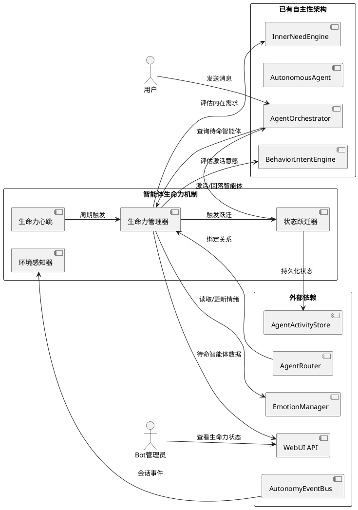
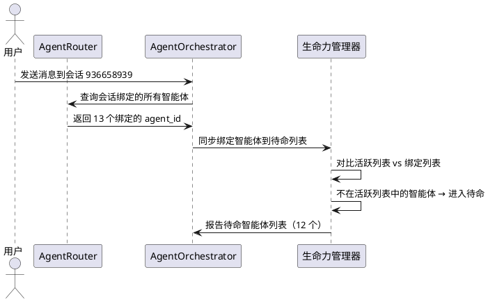
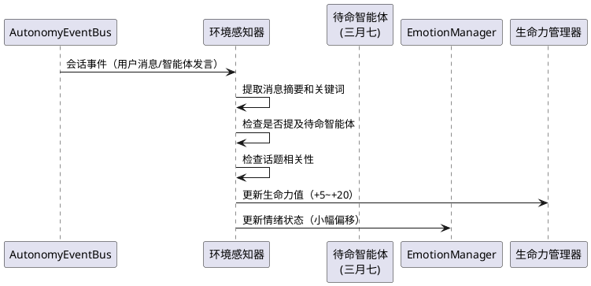
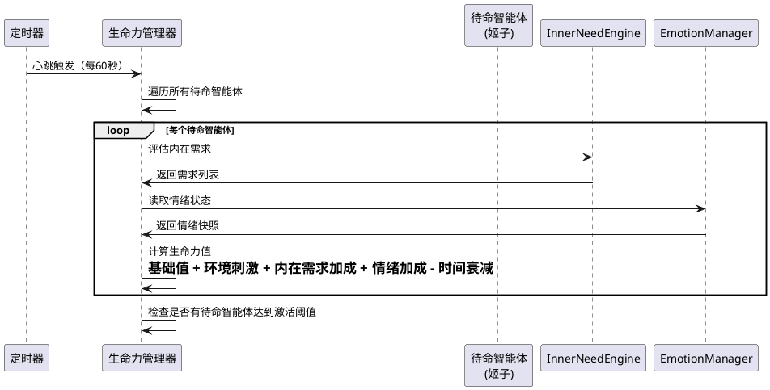
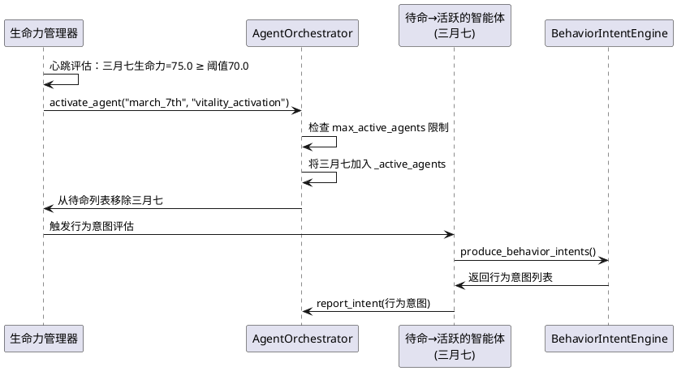
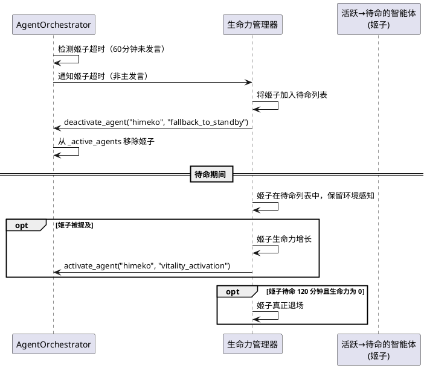
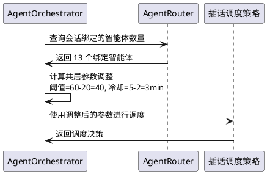
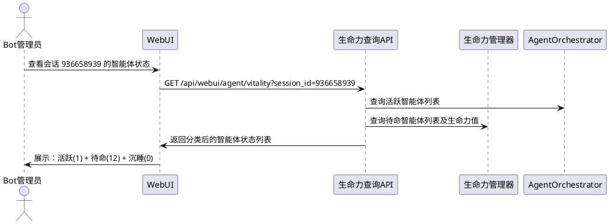

# 智能体活跃状态机制完善 — 需求规格

> 理想的角色不应是一具等待结局的标本，而应是一场永恒的进行时。

# **1. 组件定位**

## **1.1 核心职责**

本组件负责将多智能体共居会话中"大部分智能体沉睡"的问题，通过引入待命状态、环境感知和生命力心跳机制，使所有绑定智能体都能"活着"——拥有情绪波动、内在需求和偶尔插话的能力。

## **1.2 核心输入**

1. **会话绑定关系**：智能体与会话的绑定信息（来自 AgentRouter），确定哪些智能体应该在该会话中"活着"
2. **用户消息**：用户在会话中发送的消息，是环境感知的主要信息源
3. **智能体交互信号**：来自 agent-interaction-alive 系统的交互事件、情绪变化、提及传递等信号
4. **智能体情绪状态**：每个智能体当前的 EmotionManager 状态快照
5. **智能体记忆上下文**：每个智能体的 A_Memorix 记忆检索结果
6. **时间上下文**：当前时刻、智能体时间画像等时间相关信息
7. **生命力心跳触发**：定时器周期性触发的评估信号，驱动待命智能体的内在需求检查

## **1.3 核心输出**

1. **待命智能体列表**：会话中所有处于"待命"状态的智能体及其生命力值
2. **环境感知事件**：待命智能体对会话事件的感知结果（不产生可见回复，但影响内在状态）
3. **生命力评估结果**：每个待命智能体的内在需求强度、情绪波动、激活意愿
4. **待命→活跃跃迁**：待命智能体因生命力积累而自动激活为活跃智能体
5. **活跃→待命回落**：活跃智能体因超时或生命力衰减而回落为待命状态（而非直接退场）
6. **可观测性日志**：生命力心跳、状态跃迁、环境感知的结构化日志

## **1.4 职责边界**

- **不负责**：智能体的思维器官和表达器官的调用逻辑——那是 AutonomousAgent 和 Orchestrator 已有逻辑的职责
- **不负责**：智能体间交互的触发和影响计算——那是 agent-interaction-alive 系统的职责
- **不负责**：智能体配置的加载和管理——那是 AgentConfigRegistry 的职责
- **不负责**：消息的发送和平台适配——那是消息平台适配层的职责
- **不负责**：记忆的存储和检索——那是 A_Memorix 的职责
- **不负责**：修改 AgentAutonomyActivity 的数据库表结构——在已有表结构上扩展
- **不负责**：替智能体做发言决策——生命力机制只决定"智能体是否有资格思考"，不替智能体决定"是否发言"

# **2. 领域术语**

**生命力（Vitality）**
: 智能体在会话中的"活着程度"的量化指标。生命力值越高，智能体越有可能从待命状态跃迁为活跃状态。生命力由情绪强度、内在需求累积、环境刺激、时间衰减等因素共同决定。

**待命状态（Standby State）**
: 智能体在会话中的一种中间状态——不在 `_active_agents` 中（不能直接发言），但绑定到该会话且拥有环境感知能力。待命智能体可以感知会话事件、积累内在需求、产生情绪波动，但不能直接产生回复。待命是"活着但没说话"而非"沉睡"。

**活跃状态（Active State）**
: 智能体在 Orchestrator 的 `_active_agents` 中的状态，可以感知对话内容、产生行为意图、执行插话。这是现有的"活跃智能体"概念，不变。

**沉睡状态（Dormant State）**
: 智能体绑定到会话但既不在 `_active_agents` 中也不在待命列表中的状态。沉睡智能体对会话完全无感知。这是当前大部分共居智能体的实际状态，本组件要消除此状态。

**环境感知（Ambient Awareness）**
: 待命智能体对会话中发生的事件（用户消息、其他智能体发言、交互信号等）的被动感知能力。环境感知不产生可见回复，但会影响智能体的情绪状态和内在需求。

**生命力心跳（Vitality Tick）**
: 周期性触发的评估机制，检查所有待命智能体的生命力值，决定是否触发待命→活跃跃迁。心跳不是实时响应，而是定期巡检。

**状态跃迁（State Transition）**
: 智能体在沉睡→待命→活跃三种状态之间的流转。跃迁是单向升级（沉睡→待命→活跃）或降级回落（活跃→待命），不存在活跃→沉睡的直接路径。

**生命力衰减（Vitality Decay）**
: 待命智能体在长时间无环境刺激时，生命力值逐渐降低的机制。衰减防止智能体永远保持高生命力而频繁跃迁。

**共居智能体（Cohabiting Agent）**
: 与其他智能体绑定到同一会话的智能体。共居智能体之间应当有"住在一起"的感知——能听到对方说话、感受到对方的情绪、偶尔插话互动。

**待命激活阈值（Standby Activation Threshold）**
: 待命智能体的生命力值达到此阈值时，自动跃迁为活跃智能体。此阈值应低于活跃智能体的插话意图阈值，使待命智能体更容易被"唤醒"。

**回落退场时间（Fallback Exit Timeout）**
: 活跃智能体超时后先回落为待命状态，在待命状态继续停留一段时间后才真正退场。这段时间内如果受到刺激仍可重新激活。

# **3. 角色与边界**

## **3.1 核心角色**

**用户**：在多智能体共居会话中与智能体交互，期望所有绑定的智能体都"活着"，能感受到它们的存在和偶尔的互动。

**Bot 管理员**：通过 WebUI 管理智能体的生命力状态、查看待命智能体列表、手动调整生命力参数。

## **3.2 外部系统**

**AgentOrchestrator**：管理活跃智能体列表和发言权分配，本组件需要与其协作实现待命↔活跃的状态跃迁。

**AgentRouter**：提供会话与智能体的绑定关系，是确定"哪些智能体应该待命"的权威来源。

**AutonomousAgent**：智能体状态容器，本组件需要扩展其能力以支持待命状态和环境感知。

**InnerNeedEngine**：内在需求引擎，本组件需要调用其评估能力为待命智能体计算内在需求。

**BehaviorIntentEngine**：行为意图引擎，本组件需要调用其评估能力为待命智能体计算激活意愿。

**EmotionManager**：情绪管理器，本组件需要读取和更新待命智能体的情绪状态。

**AgentActivityStore**：智能体活跃状态持久化，本组件需要扩展其能力以持久化待命状态。

**AutonomyEventBus**：自主性事件总线，本组件需要订阅会话事件以实现环境感知。

**WebUI 后端 API**：消费智能体生命力状态数据，展示待命智能体列表。

## **3.3 交互上下文**

# **4. DFX约束**

## **4.1 性能**

1. 单次生命力心跳评估（所有待命智能体）的总耗时不得超过 2 秒
2. 单个待命智能体的内在需求评估延迟不得超过 500ms（不含 LLM 调用，纯规则计算）
3. 环境感知事件处理的延迟不得超过 200ms（仅更新情绪/内在状态，不产生回复）
4. 待命→活跃跃迁的延迟不得超过 1 秒（从决定跃迁到智能体出现在 `_active_agents` 中）
5. 生命力心跳的默认间隔不得低于 30 秒（避免过于频繁的计算开销）
6. 单个会话的待命智能体数量上限为 20（防止大量智能体导致计算过载）

## **4.2 可靠性**

1. 生命力心跳异常不得导致任何智能体功能中断，必须静默降级
2. 环境感知异常不得影响活跃智能体的正常回复流程
3. 待命→活跃跃迁失败时，智能体应保持在待命状态，等待下次心跳重试
4. 活跃→待命回落失败时，智能体应保持在活跃状态，不直接退场
5. 系统重启后，待命智能体列表必须从绑定关系和 Activity 记录中恢复
6. 生命力管理器的异常不得导致 Orchestrator 降级

## **4.3 安全性**

1. 待命智能体的环境感知不得泄露跨会话的对话内容
2. 待命智能体的情绪更新必须遵守 EmotionManager 的现有约束
3. 生命力参数的修改必须通过 WebUI API 进行，且需要管理员权限
4. 待命→活跃跃迁必须遵守 `max_active_agents` 限制——活跃数已满时，待命智能体不可跃迁

## **4.4 可维护性**

1. 生命力心跳的每次评估必须输出 DEBUG 级别日志，包含智能体 ID、生命力值、内在需求摘要
2. 状态跃迁必须输出 INFO 级别日志，格式为 `[agent_autonomy] agent=X action=standby_activate/active_fallback session=XX vitality=XX`
3. 环境感知事件的处理必须输出 DEBUG 级别日志
4. 生命力参数（心跳间隔、衰减率、激活阈值等）必须可通过配置文件调整
5. 待命智能体列表和生命力值必须通过 WebUI API 暴露

## **4.5 兼容性**

1. 本组件必须与现有的单智能体模式完全兼容——未启用多智能体共居时，不产生任何生命力计算开销
2. 本组件必须与现有的 Orchestrator 活跃智能体管理兼容——待命↔活跃跃迁通过现有 `activate_agent`/`deactivate_agent` 接口完成
3. 本组件必须与 agent-interaction-alive 系统兼容——交互信号仍然可以作为待命智能体的环境刺激源
4. 本组件必须与现有的插话机制兼容——活跃智能体的插话逻辑不变
5. 本组件必须与现有的超时退场机制兼容——超时退场变为"回落为待命"而非"直接退场"
6. 配置文件修改只改模板，新增版本号
7. 提示词修改需三语同步（zh-CN/en-US/ja-JP）

# **5. 核心能力**

## **5.1 沉睡→待命自动激活**

### **5.1.1 业务规则**

1. **绑定即待命规则**：智能体被绑定到会话后，如果该会话已有 Orchestrator，该智能体必须自动进入待命状态（而非沉睡）
   - 验收条件：[管理员将会话 936658939 绑定 13 个智能体] → [13 个智能体中，1 个为活跃（主发言），12 个为待命]
   - 验收条件：[待命智能体出现在生命力管理器的待命列表中] → [该智能体拥有环境感知能力]

2. **消息触发待命规则**：用户消息到达会话时，所有绑定到该会话但不在活跃列表中的智能体必须自动进入待命状态
   - 验收条件：[用户在会话 936658939 发送消息] → [所有 13 个绑定智能体中，非活跃的自动进入待命]
   - 验收条件：[之前沉睡的智能体被唤醒为待命] → [该智能体的生命力值初始化为基准值]

3. **交互信号触发待命规则**：agent-interaction-alive 的交互信号如果目标智能体处于沉睡，必须将其唤醒为待命
   - 验收条件：[交互信号"银狼想念三月七"且三月七处于沉睡] → [三月七进入待命状态]

4. **待命初始化生命力规则**：智能体从沉睡进入待命时，生命力值必须初始化为基准值（默认 30.0）
   - 验收条件：[智能体进入待命] → [生命力值 = 30.0（可配置）]

5. **禁止项**：禁止在无 Orchestrator 的会话中创建待命智能体——待命依赖于 Orchestrator 的存在
   - 验收条件：[会话尚无 Orchestrator] → [绑定智能体仅记录绑定关系，不进入待命]

### **5.1.2 交互流程**

### **5.1.3 异常场景**

1. **AgentRouter 不可用**
   - 触发条件：查询绑定关系时 AgentRouter 未初始化或异常
   - 系统行为：跳过本次待命同步，仅依赖已有的待命列表
   - 用户感知：新绑定的智能体可能延迟进入待命

2. **智能体配置缺失**
   - 触发条件：待命智能体的 agent_id 在 AgentConfigRegistry 中不存在
   - 系统行为：跳过该智能体，记录警告日志
   - 用户感知：该智能体不进入待命

## **5.2 环境感知**

### **5.2.1 业务规则**

1. **消息感知规则**：待命智能体必须能感知会话中的用户消息和其他智能体的发言
   - 验收条件：[用户在会话中发送消息] → [所有待命智能体的环境感知器接收到该消息摘要]
   - 验收条件：[待命智能体感知到消息] → [该智能体的生命力值获得小幅增长（+5.0，可配置）]

2. **提及感知规则**：当会话中有人提及待命智能体的名字时，该智能体必须获得显著的生命力增长
   - 验收条件：[用户说"三月七呢？"] → [三月七的生命力值获得大幅增长（+20.0，可配置）]
   - 验收条件：[银狼在插话中提到"姬子"] → [姬子的生命力值获得大幅增长（+15.0，可配置）]

3. **话题感知规则**：当会话话题与待命智能体的关注关键词匹配时，该智能体必须获得生命力增长
   - 验收条件：[用户讨论"游戏"且银狼的关注关键词包含"游戏"] → [银狼的生命力值获得增长（+10.0，可配置）]

4. **情绪感染规则**：活跃智能体的强烈情绪可以影响待命智能体的情绪
   - 验收条件：[银狼（活跃）情绪为 excited（强度 80）] → [同会话的待命智能体情绪获得小幅 happy 偏移（+3.0）]

5. **感知不产生回复规则**：环境感知只影响待命智能体的内在状态，不产生任何可见回复
   - 验收条件：[待命智能体感知到消息] → [不产生任何回复消息，仅更新生命力和情绪]

6. **感知摘要规则**：待命智能体感知的消息内容应为摘要形式（最近 N 条消息的关键词提取），而非完整对话历史
   - 验收条件：[待命智能体感知消息] → [感知内容为消息摘要，非完整文本]

7. **禁止项**：禁止待命智能体在感知过程中调用 LLM——环境感知必须是纯规则计算
   - 验收条件：[环境感知处理] → [不产生任何 LLM API 调用]

### **5.2.2 交互流程**

### **5.2.3 异常场景**

1. **情绪更新失败**
   - 触发条件：待命智能体的 EmotionManager 不可用
   - 系统行为：跳过情绪更新，仅更新生命力值
   - 用户感知：无感知

2. **消息摘要提取失败**
   - 触发条件：消息内容为空或格式异常
   - 系统行为：跳过本次感知，记录 DEBUG 日志
   - 用户感知：无感知

## **5.3 生命力心跳**

### **5.3.1 业务规则**

1. **心跳周期规则**：生命力管理器必须以可配置的间隔（默认 60 秒）周期性评估所有待命智能体的生命力
   - 验收条件：[心跳间隔设为 60 秒] → [每 60 秒对所有待命智能体执行一次生命力评估]
   - 验收条件：[会话中无待命智能体] → [心跳跳过该会话，不产生计算开销]

2. **生命力计算规则**：待命智能体的生命力值必须由以下因素综合计算：
   - 基础生命力：进入待命时的基准值（默认 30.0）
   - 环境刺激加成：感知到消息/提及/话题后的增长
   - 内在需求加成：InnerNeedEngine 评估出的需求强度
   - 情绪加成：当前情绪强度
   - 时间衰减：距离上次环境刺激的时间越长，衰减越多
   - 验收条件：[待命智能体 A 最近被提及且内在需求强] → [A 的生命力值高]
   - 验收条件：[待命智能体 B 长时间无刺激] → [B 的生命力值逐渐降低]

3. **生命力衰减规则**：待命智能体的生命力值必须随时间衰减，衰减速率可配置
   - 验收条件：[待命智能体 5 分钟内无环境刺激] → [生命力值衰减 10.0（可配置）]
   - 验收条件：[生命力值衰减至 0 以下] → [生命力值设为 0，智能体保持待命但不活跃]

4. **心跳评估内在需求规则**：每次心跳必须对待命智能体调用 InnerNeedEngine 评估内在需求
   - 验收条件：[心跳触发] → [调用 `agent.evaluate_inner_needs()` 获取内在需求列表]
   - 验收条件：[待命智能体产生"想念某人"的内在需求] → [生命力值获得内在需求加成]

5. **心跳不调用 LLM 规则**：生命力心跳的评估过程必须是纯规则计算，不调用 LLM
   - 验收条件：[心跳评估过程] → [不产生任何 LLM API 调用]

6. **心跳并发控制规则**：同一时刻只允许一个心跳任务在执行，防止并发评估导致状态不一致
   - 验收条件：[上一个心跳尚未完成] → [新的心跳触发被跳过，记录 DEBUG 日志]

7. **禁止项**：禁止心跳评估过程中触发任何智能体行为——心跳只评估状态，不执行行为
   - 验收条件：[心跳评估完成] → [不产生任何回复消息、插话或发言权变更]

### **5.3.2 交互流程**

### **5.3.3 异常场景**

1. **心跳评估超时**
   - 触发条件：单个待命智能体的评估耗时超过 2 秒
   - 系统行为：跳过该智能体，继续评估下一个
   - 用户感知：无感知

2. **InnerNeedEngine 异常**
   - 触发条件：内在需求评估抛出异常
   - 系统行为：跳过内在需求加成，仅使用环境刺激和情绪计算生命力
   - 用户感知：无感知

3. **所有待命智能体评估失败**
   - 触发条件：心跳中所有待命智能体的评估都失败
   - 系统行为：记录 WARNING 日志，等待下次心跳重试
   - 用户感知：无感知

## **5.4 待命→活跃跃迁**

### **5.4.1 业务规则**

1. **激活阈值规则**：待命智能体的生命力值达到激活阈值（默认 70.0，可配置）时，必须自动跃迁为活跃智能体
   - 验收条件：[三月七的生命力值达到 70.0] → [三月七自动从待命跃迁为活跃]
   - 验收条件：[三月七的生命力值为 65.0] → [三月七保持待命，等待生命力继续积累]

2. **活跃数量限制规则**：待命→活跃跃迁必须遵守 `max_active_agents` 限制
   - 验收条件：[会话已有 3 个活跃智能体（max=3）] → [待命智能体不可跃迁，生命力值继续积累]
   - 验收条件：[活跃智能体回落为待命后空出名额] → [生命力最高的待命智能体可跃迁]

3. **跃迁通过现有接口规则**：待命→活跃跃迁必须通过 Orchestrator 的 `activate_agent()` 接口完成，不引入新的激活路径
   - 验收条件：[待命智能体跃迁] → [调用 `orchestrator.activate_agent(agent_id, "vitality_activation")`]
   - 验收条件：[跃迁后的智能体] → [出现在 `_active_agents` 中，可参与插话]

4. **跃迁触发行为意图规则**：待命智能体跃迁为活跃后，必须立即产生一次行为意图评估
   - 验收条件：[三月七跃迁为活跃] → [立即调用 `agent.produce_behavior_intents()` 评估行为意图]
   - 验收条件：[三月七的行为意图强度足够] → [三月七可以参与本轮插话调度]

5. **提及即时跃迁规则**：如果待命智能体被直接提及（名字被说出），可以绕过激活阈值立即跃迁
   - 验收条件：[用户说"姬子你怎么看？"] → [姬子无视激活阈值，立即跃迁为活跃]
   - 验收条件：[即时跃迁仍受 max_active_agents 限制] → [活跃数已满时，即时跃迁同样被阻止]

6. **跃迁后生命力重置规则**：待命智能体跃迁为活跃后，生命力值重置为基准值
   - 验收条件：[三月七跃迁为活跃] → [三月七的生命力值重置为 30.0]

7. **禁止项**：禁止待命智能体在跃迁前产生任何可见回复——跃迁是"获得发言资格"的前提
   - 验收条件：[待命智能体] → [不能产生任何回复消息]

### **5.4.2 交互流程**

### **5.4.3 异常场景**

1. **激活被拒绝（活跃数已满）**
   - 触发条件：待命智能体达到激活阈值但活跃数已满
   - 系统行为：保持待命状态，生命力值不重置，等待活跃智能体回落
   - 用户感知：该智能体暂不发言，但仍在待命列表中

2. **activate_agent 调用失败**
   - 触发条件：Orchestrator 的 `activate_agent()` 抛出异常
   - 系统行为：智能体保持待命，记录 WARNING 日志，下次心跳重试
   - 用户感知：该智能体暂不发言

3. **行为意图评估失败**
   - 触发条件：跃迁后的行为意图评估抛出异常
   - 系统行为：智能体已活跃但本轮不产生行为意图，等待下次 handle_message
   - 用户感知：该智能体活跃但本轮不插话

## **5.5 活跃→待命回落**

### **5.5.1 业务规则**

1. **超时回落规则**：活跃智能体超过超时退场时间（默认 60 分钟）未发言时，必须先回落为待命状态，而非直接退场
   - 验收条件：[姬子 60 分钟未发言] → [姬子从活跃回落为待命，而非直接退场]
   - 验收条件：[姬子回落为待命] → [姬子仍在待命列表中，保留环境感知能力]

2. **回落退场规则**：活跃智能体回落后，如果在待命状态继续停留超过回落退场时间（默认 120 分钟）且生命力值为 0，才真正退场
   - 验收条件：[姬子回落为待命 120 分钟且生命力为 0] → [姬子真正退场，从待命列表移除]
   - 验收条件：[姬子回落为待命但生命力 > 0] → [姬子继续待命，不退场]

3. **回落保留生命力规则**：活跃智能体回落为待命时，生命力值不重置，保留当前积累值
   - 验收条件：[姬子活跃时生命力为 50.0] → [回落后生命力仍为 50.0]

4. **回落可重新激活规则**：回落的智能体如果生命力再次达到激活阈值，可以重新跃迁为活跃
   - 验收条件：[姬子回落为待命后，被用户提及，生命力达到 70.0] → [姬子重新跃迁为活跃]

5. **主发言不回落规则**：主发言智能体不执行超时回落，保持活跃
   - 验收条件：[银狼是主发言且 60 分钟未发言] → [银狼保持活跃，不回落]

6. **回落通过现有接口规则**：活跃→待命回落必须通过 Orchestrator 的 `deactivate_agent()` 接口完成，但需标记退场原因为 "fallback_to_standby" 而非 "timeout"
   - 验收条件：[姬子超时回落] → [调用 `orchestrator.deactivate_agent("himeko", "fallback_to_standby")`]
   - 验收条件：[回落记录在 AgentAutonomyActivity 中] → [exit_reason = "fallback_to_standby"]

7. **禁止项**：禁止活跃智能体直接从活跃状态退场为沉睡——必须先回落为待命
   - 验收条件：[活跃智能体超时] → [必须先回落为待命，不可跳过待命直接沉睡]

### **5.5.2 交互流程**

### **5.5.3 异常场景**

1. **deactivate_agent 调用失败**
   - 触发条件：Orchestrator 的 `deactivate_agent()` 抛出异常
   - 系统行为：智能体保持活跃，记录 WARNING 日志，下次检查重试
   - 用户感知：该智能体可能继续出现在活跃列表中

2. **待命列表中智能体已存在**
   - 触发条件：回落时发现该智能体已在待命列表中（如重复触发）
   - 系统行为：幂等处理，不报错，更新生命力值
   - 用户感知：无感知

3. **主发言智能体误触发回落**
   - 触发条件：主发言智能体被错误地标记为需要回落
   - 系统行为：跳过回落，记录 WARNING 日志
   - 用户感知：主发言智能体保持活跃

## **5.6 共居智能体插话门槛优化**

### **5.6.1 业务规则**

1. **共居插话阈值降低规则**：在多智能体共居场景（同一会话绑定 ≥3 个智能体）中，活跃智能体的插话意图阈值应当降低
   - 验收条件：[会话绑定 13 个智能体] → [活跃智能体的插话意图阈值从 60.0 降至 40.0（可配置）]
   - 验收条件：[会话仅绑定 2 个智能体] → [插话意图阈值保持 60.0 不变]

2. **共居冷却时间缩短规则**：在多智能体共居场景中，插话冷却时间应当缩短
   - 验收条件：[会话绑定 13 个智能体] → [插话冷却时间从 5 分钟缩短至 3 分钟（可配置）]
   - 验收条件：[会话仅绑定 2 个智能体] → [冷却时间保持 5 分钟不变]

3. **共居频率限制放宽规则**：在多智能体共居场景中，每智能体每小时的插话次数上限应当放宽
   - 验收条件：[会话绑定 13 个智能体] → [每智能体每小时插话上限从 3 次提升至 5 次（可配置）]
   - 验收条件：[会话仅绑定 2 个智能体] → [频率限制保持 3 次不变]

4. **共居参数动态计算规则**：共居插话参数应当根据绑定的智能体数量动态计算，而非固定值
   - 验收条件：[绑定 3 个智能体] → [阈值降低 10.0，冷却缩短 1 分钟]
   - 验收条件：[绑定 13 个智能体] → [阈值降低 20.0，冷却缩短 2 分钟]
   - 验收条件：[计算公式] → [参数调整幅度 = 基础调整 × min(绑定数 / 3, 2.0)]

5. **禁止项**：禁止共居参数调整导致插话失控——即使参数放宽，仍需遵守最低阈值（不低于 20.0）和最短冷却（不低于 1 分钟）
   - 验收条件：[共居参数计算结果低于最低限制] → [使用最低限制值]

### **5.6.2 交互流程**

### **5.6.3 异常场景**

1. **绑定数量查询失败**
   - 触发条件：AgentRouter 不可用
   - 系统行为：使用默认插话参数，不做共居优化
   - 用户感知：插话频率可能较低

2. **参数计算结果异常**
   - 触发条件：动态计算的参数值为负数或超出合理范围
   - 系统行为：使用最低限制值，记录 WARNING 日志
   - 用户感知：插话参数可能较为保守

## **5.7 WebUI 生命力状态展示**

### **5.7.1 业务规则**

1. **待命智能体列表展示**：WebUI 必须展示每个会话中的待命智能体列表及其生命力值
   - 验收条件：[会话 936658939 有 12 个待命智能体] → [WebUI 展示 12 个待命智能体及各自生命力值]

2. **生命力值可视化**：待命智能体的生命力值必须以进度条或数值形式展示
   - 验收条件：[生命力值 70.0] → [进度条接近满格，颜色为绿色]
   - 验收条件：[生命力值 10.0] → [进度条较短，颜色为灰色]

3. **状态分类展示**：每个智能体必须明确标注其当前状态（活跃/待命/沉睡）
   - 验收条件：[活跃智能体] → [显示绿色"活跃"标签]
   - 验收条件：[待命智能体] → [显示黄色"待命"标签及生命力值]
   - 验收条件：[沉睡智能体] → [显示灰色"沉睡"标签]

4. **i18n 三语**：生命力状态展示的所有 UI 文本必须支持中英日三语
   - 验收条件：[切换语言] → [标签、提示文本等均跟随切换]

5. **禁止项**：禁止在生命力面板中展示智能体的完整内在需求详情——仅展示生命力值和状态
   - 验收条件：[生命力面板] → [不包含内在需求列表、情绪详情等内部数据]

### **5.7.2 交互流程**

### **5.7.3 异常场景**

1. **生命力管理器未初始化**
   - 触发条件：生命力功能未启用
   - 系统行为：仅展示活跃智能体列表，不展示待命/沉睡
   - 用户感知：面板中无待命/沉睡分类

2. **API 查询超时**
   - 触发条件：生命力管理器响应过慢
   - 系统行为：返回部分数据（活跃列表），待命列表标记为"加载中"
   - 用户感知：面板部分数据延迟显示

# **6. 数据约束**

## **6.1 生命力记录**

1. **agent_id**：智能体唯一标识，非空字符串，与配置中的 agent_id 一致
2. **session_id**：关联的聊天会话 ID，非空字符串
3. **vitality_value**：生命力值，浮点数，范围 [0.0, 100.0]
4. **state**：当前状态枚举，必须为 standby / active / dormant 之一
5. **last_stimulus_at**：最近一次环境刺激时间，ISO 8601 格式
6. **activated_to_active_at**：最近一次从待命跃迁为活跃的时间，ISO 8601 格式，可为空
7. **fallback_to_standby_at**：最近一次从活跃回落为待命的时间，ISO 8601 格式，可为空
8. **inner_need_summary**：最近一次内在需求评估的摘要，字符串，可为空
9. **updated_at**：生命力记录最后更新时间，ISO 8601 格式

## **6.2 状态跃迁记录**

1. **agent_id**：智能体唯一标识，非空字符串
2. **session_id**：关联的聊天会话 ID，非空字符串
3. **from_state**：跃迁前状态，必须为 dormant / standby / active 之一
4. **to_state**：跃迁后状态，必须为 dormant / standby / active 之一
5. **trigger_reason**：跃迁触发原因，字符串（如 message_arrival / mention / vitality_threshold / timeout_fallback / interaction_signal）
6. **vitality_at_transition**：跃迁时的生命力值，浮点数
7. **timestamp**：跃迁发生时间，ISO 8601 格式

## **6.3 生命力配置参数**

1. **vitality_base_value**：待命初始化生命力基准值，浮点数，默认 30.0，范围 [0.0, 100.0]
2. **vitality_activation_threshold**：待命→活跃激活阈值，浮点数，默认 70.0，范围 [30.0, 100.0]
3. **vitality_decay_per_minute**：每分钟生命力衰减值，浮点数，默认 2.0，范围 [0.0, 10.0]
4. **vitality_stimulus_message**：消息感知生命力增长值，浮点数，默认 5.0，范围 [0.0, 30.0]
5. **vitality_stimulus_mention**：提及感知生命力增长值，浮点数，默认 20.0，范围 [0.0, 50.0]
6. **vitality_stimulus_topic**：话题相关生命力增长值，浮点数，默认 10.0，范围 [0.0, 30.0]
7. **vitality_tick_interval_seconds**：心跳间隔秒数，整数，默认 60，范围 [30, 300]
8. **fallback_exit_timeout_minutes**：回落退场时间（分钟），整数，默认 120，范围 [30, 1440]
9. **cohabitation_threshold_reduction**：共居插话阈值降低基础值，浮点数，默认 10.0，范围 [0.0, 30.0]
10. **cohabitation_cooldown_reduction_minutes**：共居冷却缩短基础值（分钟），浮点数，默认 1.0，范围 [0.0, 3.0]
11. **interjection_threshold_minimum**：插话阈值最低限制，浮点数，默认 20.0，范围 [10.0, 40.0]
12. **interjection_cooldown_minimum_minutes**：冷却时间最低限制（分钟），浮点数，默认 1.0，范围 [0.5, 3.0]