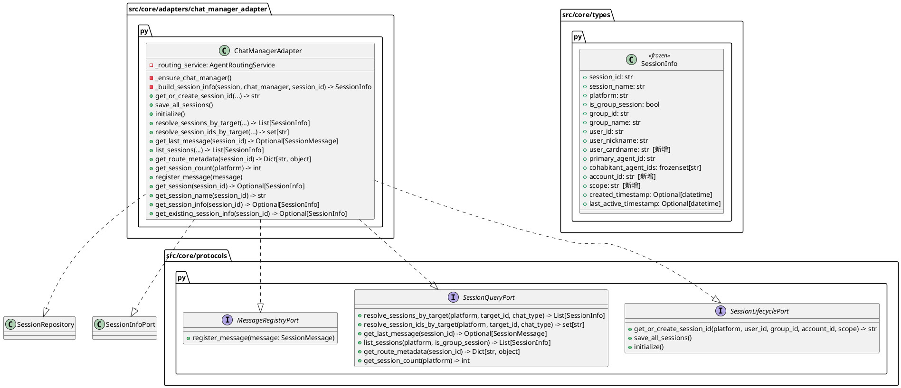
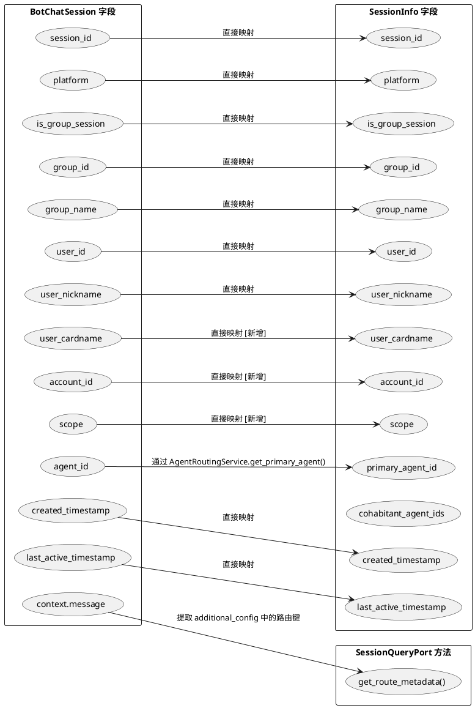
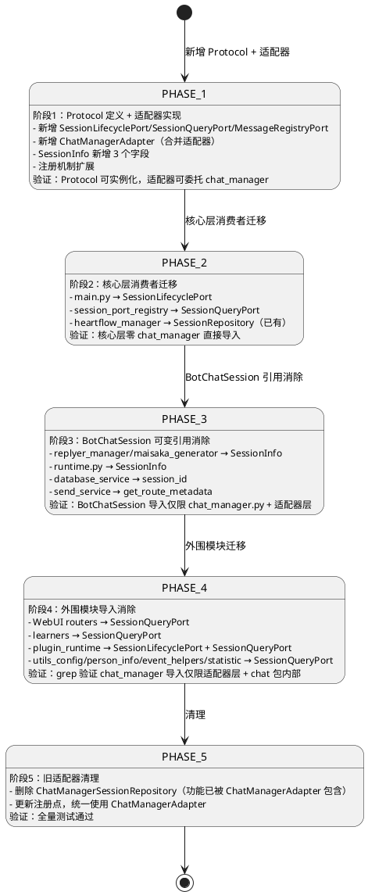
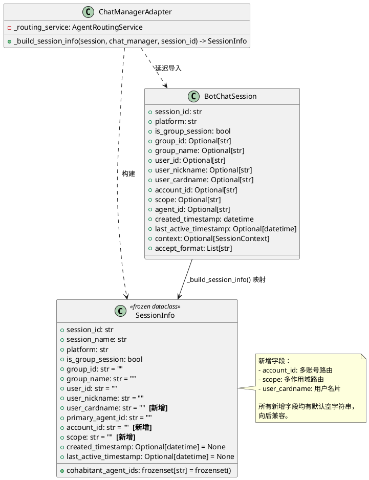

# 一、需求与存量功能关系分析

## 1.1 需求功能与存量功能对比

### 1.1.1 已实现功能

| 需求功能 | 存量功能 | 代码位置 | 匹配度 |
|---------|---------|---------|--------|
| 单会话查询（返回不可变快照） | `SessionRepository.get_session()` → `SessionInfo` | `src/core/protocols.py:21-43`, `src/core/adapters/session_repository.py:47-52` | 100% |
| 会话名称查询 | `SessionRepository.get_session_name()` | `src/core/protocols.py:34-42`, `src/core/adapters/session_repository.py:70-73` | 100% |
| 智能体路由解析 | `AgentRoutingService.resolve_agent/bind_session/unbind_session/get_primary_agent/get_session_all_agents` | `src/core/protocols.py:46-97`, `src/core/adapters/routing_adapter.py:14-44` | 100% |
| 组件反向查询会话信息 | `SessionInfoPort.get_session_info/get_existing_session_info` | `src/core/protocols.py:368-390`, `src/core/adapters/session_repository.py:54-68` | 100% |
| 适配器延迟导入 chat_manager | `_ensure_chat_manager()` 延迟导入模式 | `src/core/adapters/session_repository.py:23-26`, `src/core/adapters/routing_adapter.py:17-20` | 100% |
| SessionInfo 不可变快照 | `SessionInfo(frozen=True, slots=True)` | `src/core/types.py:479-517` | 75% |

**SessionInfo 75% 匹配说明**：当前 SessionInfo 缺少 `account_id`、`scope`、`user_cardname` 三个字段，这些字段存在于 BotChatSession（通过 MaiChatSession）中，但未映射到快照。需扩展。

### 1.1.2 需要扩展的功能

| 需求功能 | 存量功能 | 差异说明 | 扩展方向 |
|---------|---------|---------|---------|
| SessionInfo 新增路由元数据字段 | SessionInfo 无 account_id/scope/user_cardname | BotChatSession 通过 MaiChatSession 持有这些字段，但 SessionInfo 快照未包含 | 在 SessionInfo 中新增 `account_id: str = ""`、`scope: str = ""`、`user_cardname: str = ""` 三个字段，`_build_session_info` 同步映射 |
| 会话创建/获取（返回 session_id） | `chat_manager.get_or_create_session()` 返回 BotChatSession | 核心层无法调用此方法（禁止导入 chat_manager），且返回值是可变引用 | 新增 `SessionLifecyclePort` Protocol，方法返回 `session_id` 字符串，适配器层委托给 chat_manager |
| 消息注册 | `chat_manager.register_message()` | 核心层无法调用此方法（禁止导入 chat_manager） | 新增 `MessageRegistryPort` Protocol，适配器层委托给 chat_manager |
| 持久化触发 | `chat_manager.save_all_sessions()` | main.py 直接导入 chat_manager 调用 | 在 `SessionLifecyclePort` 中新增 `save_all_sessions()` 方法 |
| ChatManager 初始化 | `chat_manager.initialize()` | main.py 直接导入 chat_manager 调用 | 在 `SessionLifecyclePort` 中新增 `initialize()` 方法 |
| 按目标批量解析会话 | `chat_manager.resolve_sessions_by_target()` 返回 `List[BotChatSession]` | 返回可变引用，WebUI/学习器直接导入 chat_manager | 新增 `SessionQueryPort.resolve_sessions_by_target()` 返回 `List[SessionInfo]` |
| 按目标解析 session_id | `chat_manager.resolve_session_ids_by_target()` | 插件运行时直接导入 chat_manager | 新增 `SessionQueryPort.resolve_session_ids_by_target()` 返回 `set[str]` |
| 消息缓存查询 | `chat_manager.last_messages` 字典直接访问 | session_port_registry 直接导入 chat_manager | 新增 `SessionQueryPort.get_last_message()` 方法 |
| 会话列表查询 | `chat_manager.sessions.values()` 直接遍历 | WebUI/插件运行时直接访问内部字典 | 新增 `SessionQueryPort.list_sessions()` 方法 |
| 会话统计 | `len(chat_manager.sessions)` | WebUI 需要会话数量 | 新增 `SessionQueryPort.get_session_count()` 方法 |
| 路由元数据查询 | send_service 访问 `BotChatSession.context.message.message_info.additional_config` | send_service 持有 BotChatSession 可变引用，访问深层嵌套属性 | 新增 `SessionQueryPort.get_route_metadata()` 返回路由辅助字段字典 |
| 回复/生成层使用 SessionInfo | replyer_manager/maisaka_generator 接受 `Optional[BotChatSession]` | 生成器构造函数参数类型为 BotChatSession | 改为接受 `Optional[SessionInfo]`，生成器通过 SessionInfo 字段访问所需信息 |
| runtime 消除 BotChatSession 引用 | `MaisakaHeartFlowChatting.chat_stream: BotChatSession` | runtime.py 持有可变引用 | 改为 `self._session_info: SessionInfo`，通过 SessionInfoPort 获取 |
| database_service 参数类型 | `store_tool_info(chat_stream: BotChatSession)` | 参数类型为 BotChatSession，内部仅使用 `chat_stream.session_id` | 改为 `chat_stream: str`（session_id） |
| 插件运行时会话序列化 | `plugin_runtime/capabilities/data.py` 导入 BotChatSession 并遍历 `chat_manager.sessions` | 直接访问内部数据结构 | 通过 SessionQueryPort.list_sessions() 获取 SessionInfo 列表，直接序列化 |
| session_port_registry 消除直接导入 | `get_last_message()` 直接导入 chat_manager | 核心层模块直接依赖组件 | 通过 SessionQueryPort 委托 |

### 1.1.3 需要新增的功能或接口

#### 新增 Protocol 接口

1. **SessionLifecyclePort** — 会话生命周期管理
   - 输入：platform, user_id, group_id, account_id, scope
   - 输出：session_id 字符串
   - 核心逻辑：委托 chat_manager.get_or_create_session()，返回 session_id 而非 BotChatSession
   - 依赖：ChatManager（通过适配器层延迟导入）
   - 消费者：bot.py（消息链路）、plugin_runtime（插件创建会话）、main.py（初始化和持久化）

2. **SessionQueryPort** — 会话批量查询
   - 输入：platform, target_id, chat_type, session_id 等
   - 输出：List[SessionInfo]、set[str]、Dict[str, object] 等
   - 核心逻辑：委托 chat_manager 的各种查询方法，将 BotChatSession 转换为 SessionInfo
   - 依赖：ChatManager（通过适配器层延迟导入）、SessionRepository（复用 _build_session_info）
   - 消费者：WebUI（会话列表/统计）、学习器（按目标解析）、send_service（路由元数据）、plugin_runtime（会话列表）、session_port_registry（消息缓存）

3. **MessageRegistryPort** — 消息注册
   - 输入：SessionMessage
   - 输出：无
   - 核心逻辑：委托 chat_manager.register_message()
   - 依赖：ChatManager（通过适配器层延迟导入）
   - 消费者：bot.py（消息链路注册消息）

#### 新增适配器

4. **ChatManagerAdapter** — 统一适配器，实现 SessionLifecyclePort + SessionQueryPort + MessageRegistryPort
   - 位于 `src/core/adapters/chat_manager_adapter.py`
   - 延迟导入 chat_manager，复用 `_build_session_info` 逻辑
   - 合并现有 ChatManagerSessionRepository 的功能（SessionRepository + SessionInfoPort 实现）

#### SessionInfo 扩展字段

5. **SessionInfo 新增字段**
   - `account_id: str = ""` — 平台账号 ID，用于多账号路由
   - `scope: str = ""` — 路由作用域，用于多作用域路由
   - `user_cardname: str = ""` — 用户名片，私聊时可能非空

## 1.2 存量功能详细分析

### SessionRepository + ChatManagerSessionRepository

**接口契约**：
- `get_session(session_id: str) -> Optional[SessionInfo]`：异步，查询内存中会话
- `get_session_name(session_id: str) -> str`：异步，查询展示名称
- `get_session_info(session_id: str) -> Optional[SessionInfo]`：同步，供 SessionInfoPort 使用
- `get_existing_session_info(session_id: str) -> Optional[SessionInfo]`：同步，内存未命中时从 DB 加载

**业务规则**：
- `_build_session_info()` 将 BotChatSession 转换为不可变 SessionInfo 快照
- 通过 AgentRoutingService 查询智能体绑定信息填充 primary_agent_id 和 cohabitant_agent_ids
- 延迟导入 chat_manager，避免循环依赖

**扩展点**：
- `_build_session_info()` 需要扩展以映射新增的 account_id/scope/user_cardname 字段
- 当前 `created_timestamp` 和 `last_active_timestamp` 使用 `getattr(session, ...)` 访问，应改为直接属性访问（BotChatSession 通过 MaiChatSession 已有这些属性）

**约束**：
- SessionInfo 是 frozen dataclass，新增字段必须有默认值以保持向后兼容
- 适配器层是唯一允许导入 chat_manager 的地方

### AgentRoutingService + ChatManagerRoutingAdapter

**接口契约**：
- `resolve_agent(session_id, group_id) -> AgentConfig`
- `bind_session(session_id, agent_id) -> bool`
- `unbind_session(session_id, agent_id)`
- `get_primary_agent(session_id) -> Optional[str]`
- `get_session_all_agents(session_id) -> frozenset[str]`

**业务规则**：
- 委托 chat_manager.agent_router（AgentRouter 实例）
- bind_session 捕获 ValueError 返回 False

**约束**：
- 本 SSD 不修改此 Protocol，已完整覆盖智能体路由需求

### SessionInfoPort + session_port_registry

**接口契约**：
- `get_session_info(session_id) -> Optional[SessionInfo]`：同步，仅内存
- `get_existing_session_info(session_id) -> Optional[SessionInfo]`：同步，含 DB 回退

**业务规则**：
- 全局注册点模式：`register_session_info_port()` 在启动时注册，`get_session_info()` 供外围模块使用
- `get_last_message()` 当前直接导入 chat_manager.last_messages — 这是需要消除的泄漏点

**约束**：
- `get_last_message()` 必须迁移到通过 SessionQueryPort 访问
- 全局注册点模式保持不变，新增的 SessionLifecyclePort/SessionQueryPort/MessageRegistryPort 也需要注册机制

### ChatManager（被适配对象）

**接口契约**（公开方法，本 SSD 不修改）：
- `initialize()` — 异步，加载 DB 会话 + 恢复绑定 + 恢复 Orchestrator
- `get_or_create_session(platform, user_id, group_id, account_id, scope) -> BotChatSession` — 异步
- `register_message(message: SessionMessage)` — 同步
- `save_all_sessions()` — 同步
- `get_session_name(session_id) -> Optional[str]` — 同步
- `get_session_by_session_id(session_id) -> Optional[BotChatSession]` — 同步
- `get_existing_session_by_session_id(session_id) -> Optional[BotChatSession]` — 同步
- `resolve_sessions_by_target(platform, target_id, chat_type) -> List[BotChatSession]` — 同步
- `resolve_session_ids_by_target(platform, target_id, chat_type) -> set[str]` — 同步
- `get_session_by_info(platform, user_id, group_id, account_id, scope) -> Optional[BotChatSession]` — 同步
- `regularly_save_sessions(interval_seconds)` — 异步，定时保存

**内部状态**：
- `sessions: Dict[str, BotChatSession]` — 内存会话缓存
- `last_messages: Dict[str, SessionMessage]` — 最新消息缓存
- `_agent_router: Optional[AgentRouter]` — 智能体路由器

**约束**：
- 本 SSD 不修改 ChatManager 类的任何方法签名和内部实现
- ChatManager 作为模块级单例 `chat_manager = ChatManager()` 存在

### BotChatSession 可变引用泄漏现状

**直接导入 chat_manager 的文件（45 处）**：

| 层级 | 文件 | 导入方式 | 消费方式 |
|-----|------|---------|---------|
| 核心适配器 | `core/adapters/session_repository.py` | 延迟导入 | ✅ 允许 |
| 核心适配器 | `core/adapters/routing_adapter.py` | 延迟导入 | ✅ 允许 |
| 核心注册点 | `core/session_port_registry.py` | 延迟导入 | ❌ 需迁移到 SessionQueryPort |
| 消息链路 | `main.py` | 顶层导入 | ❌ 需迁移到 SessionLifecyclePort |
| 运行时 | `maisaka/runtime.py` | 顶层+延迟导入 | ❌ 需消除 BotChatSession 引用 |
| 运行时 | `chat/heart_flow/heartflow_manager.py` | 延迟导入 | ❌ 需迁移到 SessionRepository |
| 回复/生成 | `chat/replyer/replyer_manager.py` | 顶层导入 | ❌ 需消除 BotChatSession 引用 |
| 回复/生成 | `chat/replyer/maisaka_generator_base.py` | 顶层导入 | ❌ 需消除 BotChatSession 引用 |
| 回复/生成 | `chat/replyer/maisaka_generator.py` | 顶层导入 | ❌ 需消除 BotChatSession 引用 |
| 回复/生成 | `services/generator_service.py` | 顶层导入 | ❌ 需消除 BotChatSession 引用 |
| 发送服务 | `services/send_service.py` | 顶层导入 | ❌ 需消除 BotChatSession 引用 |
| 数据库服务 | `services/database_service.py` | TYPE_CHECKING 导入 | ❌ 需改参数类型 |
| WebUI | `webui/routers/chat/routes.py` | 顶层导入 | ❌ 需迁移到 SessionQueryPort |
| WebUI | `webui/routers/agent.py` | 延迟导入 | ❌ 需迁移到 SessionQueryPort |
| WebUI | `webui/routers/memory.py` | 顶层导入 | ❌ 需迁移到 SessionQueryPort |
| WebUI | `webui/routers/expression.py` | 顶层导入 | ❌ 需迁移到 SessionQueryPort |
| WebUI | `webui/routers/jargon.py` | 顶层导入 | ❌ 需迁移到 SessionQueryPort |
| WebUI | `webui/routers/reasoning_process.py` | 延迟导入 | ❌ 需迁移到 SessionQueryPort |
| 学习器 | `learners/jargon_learner.py` | 延迟导入 | ❌ 需迁移到 SessionQueryPort |
| 学习器 | `learners/expression_learner.py` | 延迟导入 | ❌ 需迁移到 SessionQueryPort |
| 学习器 | `learners/behavior_learner.py` | 延迟导入 | ❌ 需迁移到 SessionQueryPort |
| 学习器 | `learners/behavior_pattern_store.py` | 延迟导入 | ❌ 需迁移到 SessionQueryPort |
| 插件运行时 | `plugin_runtime/capabilities/data.py` | TYPE_CHECKING+延迟导入 | ❌ 需消除 BotChatSession 引用 |
| 插件运行时 | `plugin_runtime/capabilities/core.py` | 延迟导入 | ❌ 需迁移到 SessionLifecyclePort |
| 工具/配置 | `common/utils/utils_config.py` | 延迟导入 | ❌ 需迁移到 SessionQueryPort |
| 工具/配置 | `chat/utils/utils.py` | 顶层导入 | ❌ 需迁移到 SessionQueryPort |
| 工具/配置 | `chat/utils/statistic.py` | 延迟导入 | ❌ 需迁移到 SessionQueryPort |
| 人物信息 | `person_info/person_info.py` | 顶层导入 | ❌ 需迁移到 SessionQueryPort |
| 事件辅助 | `chat/event_helpers.py` | 延迟导入 | ❌ 需迁移到 SessionQueryPort |
| CLI | `cli/maisaka_cli.py` | 顶层导入 | ❌ 需消除 BotChatSession 引用 |
| chat 包内部 | `chat/message_receive/__init__.py` | 顶层导入 | ✅ chat 包内部允许 |
| chat 包内部 | `chat/__init__.py` | 顶层导入 | ✅ chat 包内部允许 |

**直接导入 BotChatSession 类型的文件（9 处，不含 chat_manager.py 自身）**：

| 文件 | 使用方式 | 消除方案 |
|-----|---------|---------|
| `services/send_service.py` | `_inherit_platform_io_route_metadata(target_stream: BotChatSession)` 参数类型 | 改为接收路由元数据字典 |
| `chat/replyer/maisaka_generator_base.py` | `chat_stream: Optional[BotChatSession]` 构造函数参数 | 改为 `Optional[SessionInfo]` |
| `chat/replyer/maisaka_generator.py` | `chat_stream: Optional[BotChatSession]` 构造函数参数 | 改为 `Optional[SessionInfo]` |
| `chat/replyer/replyer_manager.py` | `chat_stream: Optional[BotChatSession]` + `BotChatSession` 类型导入 | 改为 `Optional[SessionInfo]` |
| `services/generator_service.py` | `chat_stream: Optional[BotChatSession]` 参数类型 | 改为 `Optional[SessionInfo]` |
| `maisaka/runtime.py` | `self.chat_stream: BotChatSession` 可变引用 | 改为 `self._session_info: SessionInfo` |
| `services/database_service.py` | `chat_stream: "BotChatSession"` 参数类型 | 改为 `chat_stream: str`（session_id） |
| `plugin_runtime/capabilities/data.py` | `BotChatSession` 类型引用 + 序列化 | 通过 SessionQueryPort 获取 SessionInfo |
| `cli/maisaka_cli.py` | `BotChatSession` 类型 + chat_manager 导入 | 改为 SessionInfo + SessionLifecyclePort |

# 二、增量设计方案

## 2.1 实现模型

### 2.1.1 上下文视图

```plantuml
@startuml
skinparam componentStyle rectangle

rectangle "消费者" {
    [bot.py] as Bot
    [main.py] as Main
    [heartflow_manager] as HF
    [replyer_manager] as RM
    [maisaka_generator] as MG
    [send_service] as SS
    [database_service] as DS
    [runtime.py] as RT
    [WebUI routers] as WUI
    [learners] as LRN
    [plugin_runtime] as PLG
    [session_port_registry] as SPR
    [utils_config] as UC
    [person_info] as PI
    [event_helpers] as EH
    [statistic] as STAT
    [maisaka_cli] as CLI
}

rectangle "核心 Protocol 层" {
    [SessionLifecyclePort] as SLP
    [SessionQueryPort] as SQP
    [MessageRegistryPort] as MRP
    [SessionRepository] as SR
    [SessionInfoPort] as SIP
    [AgentRoutingService] as ARS
}

rectangle "适配器层" {
    [ChatManagerAdapter] as CMA
}

rectangle "组件层" {
    [ChatManager] as CM
}

Bot --> SLP : get_or_create_session_id
Bot --> MRP : register_message
Main --> SLP : initialize / save_all_sessions
HF --> SR : get_session
RM --> SR : get_session (→ SessionInfo)
MG --> SR : get_session (→ SessionInfo)
SS --> SQP : get_route_metadata
DS --> SQP : (改用 session_id)
RT --> SIP : get_session_info (→ SessionInfo)
WUI --> SQP : list_sessions / resolve_sessions_by_target
LRN --> SQP : resolve_sessions_by_target / resolve_session_ids_by_target
PLG --> SLP : get_or_create_session_id
PLG --> SQP : list_sessions / resolve_session_ids_by_target
SPR --> SQP : get_last_message
UC --> SQP : list_sessions
PI --> SQP : resolve_sessions_by_target
EH --> SQP : get_session_by_session_id
STAT --> SQP : get_session_count
CLI --> SLP : get_or_create_session_id

SLP --> CMA
SQP --> CMA
MRP --> CMA
SR --> CMA
SIP --> CMA
ARS --> CMA
CMA --> CM

@enduml
```



### 2.1.2 服务/组件总体架构



**设计决策：合并适配器而非拆分**

选择将 SessionLifecyclePort、SessionQueryPort、MessageRegistryPort 的实现合并到同一个 `ChatManagerAdapter` 类中，而非为每个 Protocol 创建独立适配器。理由：

1. 三个 Protocol 的底层依赖都是 chat_manager 单例，拆分适配器会导致延迟导入逻辑重复
2. `_build_session_info()` 转换逻辑在所有查询方法中复用，合并可避免代码重复
3. 现有 `ChatManagerSessionRepository` 已同时实现 SessionRepository + SessionInfoPort 两个 Protocol，合并是既有模式的延续
4. 合并后，`ChatManagerSessionRepository` 将被 `ChatManagerAdapter` 替代（功能超集）

### 2.1.3 实现设计文档

#### BotChatSession → SessionInfo 映射方案



**关键映射决策**：

1. **agent_id → primary_agent_id + cohabitant_agent_ids**：BotChatSession.agent_id 是初始智能体，但实际绑定关系由 AgentRouter 管理。SessionInfo 的智能体信息通过 `AgentRoutingService` 查询，不直接映射 agent_id 字段。

2. **context.message → get_route_metadata()**：BotChatSession.context.message 是深层嵌套的可变引用，不适合放入 SessionInfo 快照。路由元数据（account_id/scope 相关的 additional_config 键）通过专用方法 `get_route_metadata()` 提取为不可变字典。

3. **user_cardname / account_id / scope 新增映射**：这三个字段在 BotChatSession（通过 MaiChatSession）中已存在，只是当前 SessionInfo 未包含。新增字段均有默认空字符串，向后兼容。

#### send_service 路由元数据传递方案

**现状**：`_inherit_platform_io_route_metadata(target_stream: BotChatSession)` 接收 BotChatSession，访问 `target_stream.context.message.message_info.additional_config` 提取路由键。

**改造方案**：

```
改造前: send_service 持有 BotChatSession → 访问 context.message.message_info.additional_config
改造后: send_service 通过 SessionQueryPort.get_route_metadata(session_id) → 获取 Dict[str, object]
```

**`get_route_metadata()` 实现逻辑**：

1. 适配器通过 `chat_manager.get_session_by_session_id(session_id)` 获取 BotChatSession
2. 检查 `session.context` 是否存在
3. 若存在，从 `context.message.message_info.additional_config` 中提取 `RouteKeyFactory.ACCOUNT_ID_KEYS` 和 `RouteKeyFactory.SCOPE_KEYS` 对应的值
4. 返回 `{key: value}` 字典
5. 会话不存在或无 context 时返回空字典

**send_service 改造**：

- `_inherit_platform_io_route_metadata(target_stream: BotChatSession) -> Dict[str, object]` 改为 `_inherit_platform_io_route_metadata(route_metadata: Dict[str, object]) -> Dict[str, object]`
- 调用方在发送前通过 `SessionQueryPort.get_route_metadata(session_id)` 获取字典，传入此方法
- 方法内部逻辑不变，只是从传入的字典而非 BotChatSession 中读取

#### 迁移阶段状态机



## 2.2 接口设计

### 2.2.1 总体设计

| Protocol | 职责 | 稳定性 | 消费者 |
|----------|------|--------|--------|
| SessionLifecyclePort | 会话创建/持久化/初始化 | 稳定 | bot.py, main.py, plugin_runtime, maisaka_cli |
| SessionQueryPort | 会话批量查询/路由元数据/消息缓存 | 稳定 | WebUI, learners, send_service, plugin_runtime, session_port_registry, utils_config, person_info, event_helpers, statistic |
| MessageRegistryPort | 消息注册 | 稳定 | bot.py |
| SessionRepository | 单会话查询（已有） | 稳定 | heartflow_manager, replyer_manager, maisaka_generator |
| SessionInfoPort | 组件反向查询（已有） | 稳定 | runtime.py, A_memorix |

**接口变更策略**：
- 新增 Protocol 不影响已有 Protocol
- SessionInfo 新增字段均有默认值，向后兼容
- ChatManagerAdapter 替代 ChatManagerSessionRepository 后，注册点更新

### 2.2.2 接口清单

#### SessionLifecyclePort

```python
@runtime_checkable
class SessionLifecyclePort(Protocol):
    """会话生命周期管理接口 — 创建会话、持久化、初始化。"""

    async def get_or_create_session_id(
        self,
        platform: str,
        user_id: str,
        group_id: Optional[str] = None,
        account_id: Optional[str] = None,
        scope: Optional[str] = None,
    ) -> str:
        """获取或创建会话，返回 session_id。

        Args:
            platform: 平台标识
            user_id: 用户 ID
            group_id: 群 ID（群聊时必填）
            account_id: 平台账号 ID（多账号路由）
            scope: 路由作用域（多作用域路由）

        Returns:
            session_id 字符串

        Raises:
            Exception: 创建或获取会话失败时向上冒泡
        """

    def save_all_sessions(self) -> None:
        """将内存中的全部会话记录保存到数据库。

        Raises:
            Exception: 保存失败时向上冒泡
        """

    async def initialize(self) -> None:
        """初始化聊天管理器（加载 DB 会话、恢复绑定、恢复 Orchestrator）。

        Raises:
            Exception: 初始化失败时向上冒泡
        """
```

**前置条件**：chat_manager 单例已创建
**后置条件**：get_or_create_session_id 后会话存在于内存和 DB 中
**异常映射**：直接冒泡 chat_manager 的异常，不做转换

#### SessionQueryPort

```python
@runtime_checkable
class SessionQueryPort(Protocol):
    """会话批量查询接口 — 列表查询、目标解析、路由元数据、消息缓存。"""

    def resolve_sessions_by_target(
        self,
        *,
        platform: str,
        target_id: str,
        chat_type: str,
    ) -> List[SessionInfo]:
        """按平台、目标 ID 与聊天类型解析已存在的真实聊天流。

        Args:
            platform: 平台标识
            target_id: 目标 ID（群 ID 或用户 ID）
            chat_type: 聊天类型（"group" 或 "private"）

        Returns:
            SessionInfo 列表，无匹配时返回空列表
        """

    def resolve_session_ids_by_target(
        self,
        *,
        platform: str,
        target_id: str,
        chat_type: str,
    ) -> set[str]:
        """按平台、目标 ID 与聊天类型解析已存在的真实聊天流 ID。

        Args:
            platform: 平台标识
            target_id: 目标 ID（群 ID 或用户 ID）
            chat_type: 聊天类型（"group" 或 "private"）

        Returns:
            session_id 集合，无匹配时返回空集合
        """

    def get_last_message(self, session_id: str) -> Optional[Any]:
        """查询会话最新消息。

        Args:
            session_id: 会话 ID

        Returns:
            SessionMessage 快照，不存在时返回 None
        """

    def list_sessions(
        self,
        platform: str = "all_platforms",
        is_group_session: Optional[bool] = None,
    ) -> List[SessionInfo]:
        """获取会话列表。

        Args:
            platform: 平台标识，"all_platforms" 表示所有平台
            is_group_session: 是否为群聊，None 表示不限

        Returns:
            SessionInfo 列表
        """

    def get_route_metadata(self, session_id: str) -> Dict[str, object]:
        """查询会话的路由元数据（account_id/scope 相关的 additional_config 键）。

        Args:
            session_id: 会话 ID

        Returns:
            路由辅助字段字典，会话不存在或无 context 时返回空字典
        """

    def get_session_count(self, platform: str = "all_platforms") -> int:
        """获取会话数量。

        Args:
            platform: 平台标识，"all_platforms" 表示所有平台

        Returns:
            会话数量
        """
```

**前置条件**：chat_manager 已初始化
**后置条件**：纯查询，无副作用
**异常映射**：resolve_sessions_by_target 内部 DB 异常已捕获返回内存结果，不向上抛出

#### MessageRegistryPort

```python
@runtime_checkable
class MessageRegistryPort(Protocol):
    """消息注册接口 — 将入站消息注册到 ChatManager。"""

    def register_message(self, message: Any) -> None:
        """注册消息到 ChatManager。

        Args:
            message: SessionMessage 实例

        Raises:
            ValueError: 消息缺少平台信息时抛出
        """
```

**前置条件**：chat_manager 已初始化
**后置条件**：消息注册到 last_messages 缓存，会话身份可能更新
**异常映射**：ValueError 直接冒泡，与 chat_manager.register_message() 行为一致

## 2.3 数据模型

### 2.3.1 设计目标

1. **支持多账号/多作用域路由**：SessionInfo 需包含 account_id 和 scope 字段
2. **完整映射 BotChatSession 属性**：消除外部模块访问 BotChatSession 的必要性
3. **向后兼容**：新增字段均有默认值，现有代码无需修改
4. **不可变保证**：SessionInfo 保持 frozen，外部无法修改内部状态

### 2.3.2 模型实现



**映射策略**：

| BotChatSession 字段 | SessionInfo 字段 | 映射方式 |
|---------------------|-----------------|---------|
| session_id | session_id | 直接 |
| platform | platform | 直接 |
| is_group_session | is_group_session | 直接 |
| group_id | group_id | `session.group_id or ""` |
| group_name | group_name | `session.group_name or ""` |
| user_id | user_id | `session.user_id or ""` |
| user_nickname | user_nickname | `session.user_nickname or ""` |
| user_cardname | user_cardname | `session.user_cardname or ""` [新增] |
| account_id | account_id | `session.account_id or ""` [新增] |
| scope | scope | `session.scope or ""` [新增] |
| agent_id（初始值） | primary_agent_id | `routing_service.get_primary_agent(session_id) or ""` |
| N/A | cohabitant_agent_ids | `routing_service.get_session_all_agents(session_id) - {primary_agent_id}` |
| created_timestamp | created_timestamp | `session.created_timestamp` |
| last_active_timestamp | last_active_timestamp | `session.last_active_timestamp` |
| context.message | — | 不映射，通过 get_route_metadata() 独立查询 |

## 2.4 迁移策略

### 阶段 1：Protocol 定义 + 适配器实现（零风险引入）

**变更文件**：

| 文件 | 修改内容 | 修改原因 |
|-----|---------|---------|
| `src/core/protocols.py` | 新增 SessionLifecyclePort、SessionQueryPort、MessageRegistryPort 三个 Protocol 定义 | 定义接口契约 |
| `src/core/types.py` | SessionInfo 新增 account_id、scope、user_cardname 三个字段 | 完整映射 BotChatSession 属性 |
| `src/core/adapters/chat_manager_adapter.py` | 新建文件，实现 ChatManagerAdapter 类 | 统一适配器，实现所有新增 Protocol |
| `src/core/session_port_registry.py` | 新增 SessionLifecyclePort/SessionQueryPort/MessageRegistryPort 的注册和获取函数 | 扩展注册机制 |

**ChatManagerAdapter 实现要点**：

1. 延迟导入 chat_manager（与现有适配器一致）
2. 复用 `_build_session_info()` 逻辑（从 ChatManagerSessionRepository 迁移，扩展新增字段映射）
3. `get_route_metadata()` 实现：获取 BotChatSession → 检查 context → 提取 additional_config 中的路由键
4. `list_sessions()` 实现：遍历 `chat_manager.sessions.values()` → 过滤 → 转换为 SessionInfo
5. `get_last_message()` 实现：从 `chat_manager.last_messages` 获取
6. `get_session_count()` 实现：统计 `chat_manager.sessions` 数量

**验证条件**：
- ChatManagerAdapter 可实例化
- 所有 Protocol 方法可正常委托 chat_manager
- SessionInfo 新增字段正确映射
- 现有功能不受影响（纯增量）

### 阶段 2：核心层消费者迁移

**变更文件**：

| 文件 | 修改内容 | 修改原因 |
|-----|---------|---------|
| `src/main.py` | `chat_manager.initialize()` → `session_lifecycle_port.initialize()`；`chat_manager.regularly_save_sessions()` → 通过 port 触发 | 消除核心入口对 chat_manager 的直接导入 |
| `src/core/session_port_registry.py` | `get_last_message()` 从直接导入 chat_manager 改为通过 SessionQueryPort | 消除核心注册点对 chat_manager 的直接导入 |
| `src/chat/heart_flow/heartflow_manager.py` | 已通过 SessionRepository 访问，验证无直接导入 | 确认已迁移 |
| 启动注册代码 | 注册 ChatManagerAdapter 实例到各 Protocol 注册点 | 统一注册 |

**main.py 改造细节**：

- `from src.chat.message_receive.chat_manager import chat_manager` → `from src.core.session_port_registry import get_session_lifecycle_port`
- `await chat_manager.initialize()` → `await port.initialize()`
- `asyncio.create_task(chat_manager.regularly_save_sessions())` → 需要在 SessionLifecyclePort 中新增 `regularly_save_sessions()` 或在 main.py 中通过 port 调用 save_all_sessions 的定时包装

**session_port_registry 改造细节**：

- `get_last_message()` 中 `from src.chat.message_receive.chat_manager import chat_manager` → 通过 SessionQueryPort 注册点获取实例
- 新增 `register_session_query_port(port)` / `get_session_query_port()` 函数
- 新增 `register_session_lifecycle_port(port)` / `get_session_lifecycle_port()` 函数
- 新增 `register_message_registry_port(port)` / `get_message_registry_port()` 函数

**验证条件**：
- `grep -r "from src.chat.message_receive.chat_manager import" src/main.py src/core/` → 零匹配（适配器层除外）
- main.py 启动流程正常
- session_port_registry.get_last_message() 功能正常

### 阶段 3：BotChatSession 可变引用消除

**变更文件**：

| 文件 | 修改内容 | 修改原因 |
|-----|---------|---------|
| `src/chat/replyer/maisaka_generator_base.py` | `chat_stream: Optional[BotChatSession]` → `Optional[SessionInfo]`；内部访问改为 SessionInfo 字段 | 消除 BotChatSession 类型依赖 |
| `src/chat/replyer/maisaka_generator.py` | 同上 | 消除 BotChatSession 类型依赖 |
| `src/chat/replyer/replyer_manager.py` | `chat_stream: Optional[BotChatSession]` → `Optional[SessionInfo]`；`_chat_manager` 导入改为 SessionRepository | 消除 BotChatSession 类型依赖 |
| `src/services/generator_service.py` | `chat_stream: Optional[BotChatSession]` → `Optional[SessionInfo]` | 消除 BotChatSession 类型依赖 |
| `src/maisaka/runtime.py` | `self.chat_stream: BotChatSession` → `self._session_info: SessionInfo`；消除 chat_manager 延迟导入 | 消除可变引用 |
| `src/services/send_service.py` | `_inherit_platform_io_route_metadata(target_stream: BotChatSession)` → `_inherit_platform_io_route_metadata(route_metadata: Dict[str, object])`；调用方通过 SessionQueryPort 获取路由元数据 | 消除 BotChatSession 引用和深层属性访问 |
| `src/services/database_service.py` | `chat_stream: "BotChatSession"` → `chat_stream: str`（session_id） | 仅使用 session_id，无需 BotChatSession |
| `src/cli/maisaka_cli.py` | `BotChatSession` → SessionInfo；chat_manager 导入 → SessionLifecyclePort | CLI 也不应持有可变引用 |

**生成器改造细节**：

当前 `BaseMaisakaReplyGenerator.__init__` 中使用 `chat_stream` 的方式：
- `chat_stream.session_id` → `session_info.session_id`
- `chat_stream.is_group_session` → `session_info.is_group_session`
- `getattr(chat_stream, "session_id", "")` → `session_info.session_id`（消除 getattr）

这些字段在 SessionInfo 中均已存在，改造是直接替换。

**runtime.py 改造细节**：

当前 `MaisakaHeartFlowChatting.__init__` 中：
- `self.chat_stream: BotChatSession = chat_stream` → 删除此行
- 已有 `self._session_info = session_info` → 保留
- 所有 `self.chat_stream.xxx` 访问改为 `self._session_info.xxx`
- 延迟导入 chat_manager 的代码（L145, L1485）需评估是否可通过 Protocol 替代

**send_service 改造细节**：

当前 `_inherit_platform_io_route_metadata(target_stream: BotChatSession)` 的调用链：
1. 调用方已有 session_id
2. 通过 `SessionQueryPort.get_route_metadata(session_id)` 获取 `Dict[str, object]`
3. 传入 `_inherit_platform_io_route_metadata(route_metadata)` 
4. 方法内部从字典直接读取路由键，不再访问 BotChatSession

**验证条件**：
- `grep -r "BotChatSession" src/chat/replyer/ src/services/ src/maisaka/runtime.py src/cli/` → 零匹配
- 回复生成功能正常
- 消息发送功能正常
- 运行时生命周期正常

### 阶段 4：外围模块导入消除

**变更文件**：

| 文件 | 修改内容 | 修改原因 |
|-----|---------|---------|
| `src/webui/routers/chat/routes.py` | `core_chat_manager` → SessionQueryPort | 消除 WebUI 对 chat_manager 的直接导入 |
| `src/webui/routers/agent.py` | 延迟导入 chat_manager → SessionQueryPort | 同上 |
| `src/webui/routers/memory.py` | `_chat_manager` → SessionQueryPort | 同上 |
| `src/webui/routers/expression.py` | `_chat_manager` → SessionQueryPort | 同上 |
| `src/webui/routers/jargon.py` | `_chat_manager` → SessionQueryPort | 同上 |
| `src/webui/routers/reasoning_process.py` | 延迟导入 chat_manager → SessionQueryPort | 同上 |
| `src/learners/jargon_learner.py` | 延迟导入 chat_manager → SessionQueryPort | 消除学习器对 chat_manager 的直接导入 |
| `src/learners/expression_learner.py` | 延迟导入 chat_manager → SessionQueryPort | 同上 |
| `src/learners/behavior_learner.py` | 延迟导入 chat_manager → SessionQueryPort | 同上 |
| `src/learners/behavior_pattern_store.py` | 延迟导入 chat_manager → SessionQueryPort | 同上 |
| `src/plugin_runtime/capabilities/data.py` | BotChatSession 类型 + chat_manager 导入 → SessionQueryPort | 消除插件运行时对 BotChatSession 的依赖 |
| `src/plugin_runtime/capabilities/core.py` | 延迟导入 chat_manager → SessionLifecyclePort | 同上 |
| `src/common/utils/utils_config.py` | 延迟导入 chat_manager → SessionQueryPort | 消除工具/配置层对 chat_manager 的直接导入 |
| `src/chat/utils/utils.py` | `_chat_manager` → SessionQueryPort | 同上 |
| `src/chat/utils/statistic.py` | 延迟导入 chat_manager → SessionQueryPort | 同上 |
| `src/person_info/person_info.py` | `_chat_manager` → SessionQueryPort | 消除 person_info 对 chat_manager 的直接导入 |
| `src/chat/event_helpers.py` | 延迟导入 chat_manager → SessionQueryPort | 同上 |

**WebUI 路由改造模式**：

所有 WebUI 路由的改造模式一致：
1. 将 `from src.chat.message_receive.chat_manager import chat_manager as _chat_manager` 替换为 `from src.core.session_port_registry import get_session_query_port`
2. 将 `_chat_manager.xxx()` 调用替换为 `get_session_query_port().xxx()` 调用
3. 返回值从 BotChatSession 属性访问改为 SessionInfo 属性访问

**学习器改造模式**：

学习器主要使用 `chat_manager.resolve_sessions_by_target()` 和 `chat_manager.resolve_session_ids_by_target()`：
1. 替换为 `SessionQueryPort.resolve_sessions_by_target()` / `resolve_session_ids_by_target()`
2. 返回值从 `List[BotChatSession]` 变为 `List[SessionInfo]`，后续属性访问对应调整

**plugin_runtime/capabilities/data.py 改造**：

1. `_list_sessions()` 改为通过 `SessionQueryPort.list_sessions()` 获取 `List[SessionInfo]`
2. `_serialize_stream(stream: BotChatSession)` 改为 `_serialize_stream(stream: SessionInfo)`，直接访问 SessionInfo 字段
3. `_cap_chat_open_session()` 改为通过 `SessionLifecyclePort.get_or_create_session_id()` 获取 session_id
4. 消除 `from src.chat.message_receive.chat_manager import BotChatSession` 和延迟导入 chat_manager

**验证条件**：
- `grep -r "from src.chat.message_receive.chat_manager import" src/ --include="*.py"` → 仅匹配适配器层、chat 包内部模块、`__init__.py` 导出
- WebUI 所有页面功能正常
- 学习器功能正常
- 插件运行时功能正常

### 阶段 5：旧适配器清理

**变更文件**：

| 文件 | 修改内容 | 修改原因 |
|-----|---------|---------|
| `src/core/adapters/session_repository.py` | 删除 ChatManagerSessionRepository 类 | 功能已被 ChatManagerAdapter 包含 |
| `src/core/adapters/chat_manager_adapter.py` | 确保包含 SessionRepository + SessionInfoPort 的所有方法 | 功能完整性 |
| 启动注册代码 | 统一使用 ChatManagerAdapter 注册所有 Protocol | 简化注册逻辑 |

**验证条件**：
- 全量功能测试通过
- 无 ChatManagerSessionRepository 的残留引用
- 所有 Protocol 注册点指向 ChatManagerAdapter 实例

## 2.5 关键决策

### 决策 1：ChatManagerAdapter 合并 vs 拆分

**选择**：合并为单一 ChatManagerAdapter

**理由**：
1. 三个 Protocol 的底层依赖相同（chat_manager 单例），拆分导致延迟导入逻辑重复
2. `_build_session_info()` 在所有查询方法中复用
3. 现有 ChatManagerSessionRepository 已同时实现两个 Protocol，合并是既有模式延续
4. 单一适配器更容易管理生命周期和注册

**代价**：ChatManagerAdapter 类较大（约 150 行），但每个方法都是简单的委托+转换，复杂度可控

### 决策 2：SessionInfo 扩展 vs 专用查询方法

**选择**：SessionInfo 扩展 account_id/scope/user_cardname + 专用 get_route_metadata() 方法

**理由**：
1. account_id/scope 是会话固有属性，应映射到 SessionInfo 快照
2. context.message 中的 additional_config 是深层嵌套的可变引用，不适合放入快照
3. 路由元数据（additional_config 中的特定键）是 send_service 的专用需求，用专用方法隔离

**代价**：get_route_metadata() 需要适配器层访问 BotChatSession.context.message，但这是适配器层的职责（唯一允许导入 chat_manager 的地方）

### 决策 3：注册机制 — 全局注册点 vs 依赖注入

**选择**：延续现有全局注册点模式（session_port_registry.py）

**理由**：
1. 现有 SessionInfoPort 已使用全局注册点模式，外围模块通过 `get_session_info()` 等函数访问
2. MaiBot 的启动流程是过程式的（main.py 顺序初始化），全局注册点与此模式匹配
3. 改为依赖注入需要重构整个启动流程，超出本 SSD 范围

**代价**：全局可变状态，但注册只在启动时执行一次，运行时不可变

### 决策 4：regularly_save_sessions 的归属

**选择**：在 SessionLifecyclePort 中新增 `regularly_save_sessions(interval_seconds: int = 300)` 异步方法

**理由**：
1. main.py 当前调用 `asyncio.create_task(chat_manager.regularly_save_sessions())`
2. 迁移后 main.py 不应直接导入 chat_manager，需要通过 Protocol 触发
3. 此方法本质是生命周期管理（定期持久化），属于 SessionLifecyclePort 职责

## 2.6 回滚策略

### 阶段级回滚

每个阶段独立可回滚：

| 阶段 | 回滚方式 | 影响范围 |
|-----|---------|---------|
| 阶段 1 | 删除新增文件和 Protocol 定义 | 零影响（纯增量，无消费者） |
| 阶段 2 | 恢复 main.py 和 session_port_registry.py 的原始导入 | 仅核心入口 |
| 阶段 3 | 恢复 BotChatSession 参数类型 | 回复/生成/发送/运行时层 |
| 阶段 4 | 恢复外围模块的 chat_manager 直接导入 | WebUI/学习器/插件/工具层 |
| 阶段 5 | 恢复 ChatManagerSessionRepository | 适配器层 |

### 全量回滚

如果需要全量回滚：
1. `git revert` 整个分支的提交
2. 所有变更都是接口层和导入替换，不涉及数据模型或数据库变更，回滚无数据风险

### 风险控制

1. **每个阶段完成后运行全量测试**，确保无回归
2. **阶段 3 是风险最高的阶段**（涉及回复/生成/发送核心链路），需重点验证：
   - 回复生成功能正常（群聊+私聊）
   - 消息发送路由元数据正确继承
   - 运行时生命周期正常（创建/销毁/切换智能体）
3. **阶段 4 涉及面最广**（17 个文件），但每个文件的改造模式一致（替换导入+替换调用），可批量验证
4. **ChatManager 本体不变**，最坏情况下可直接回退到 chat_manager 直接导入