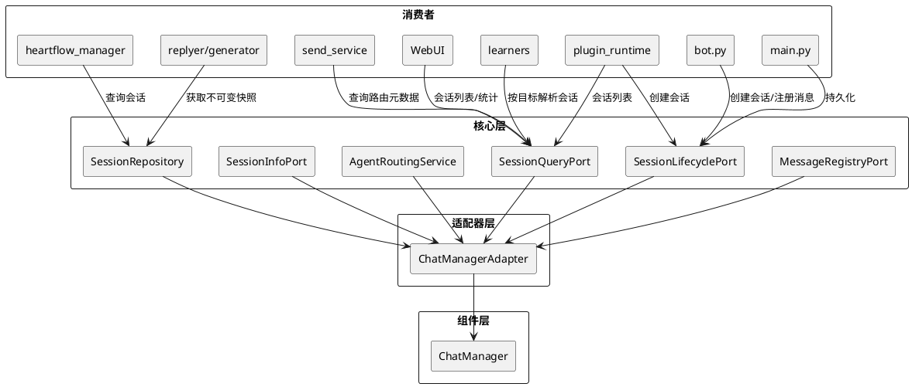
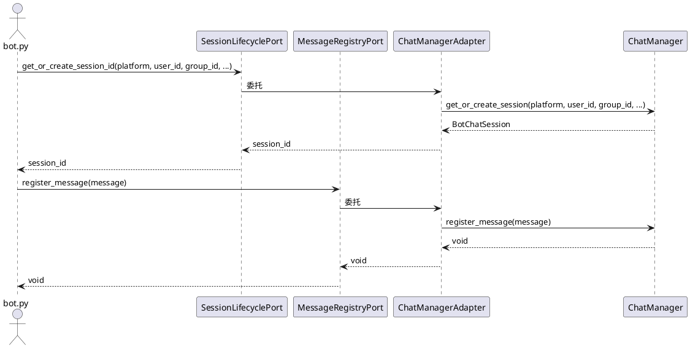
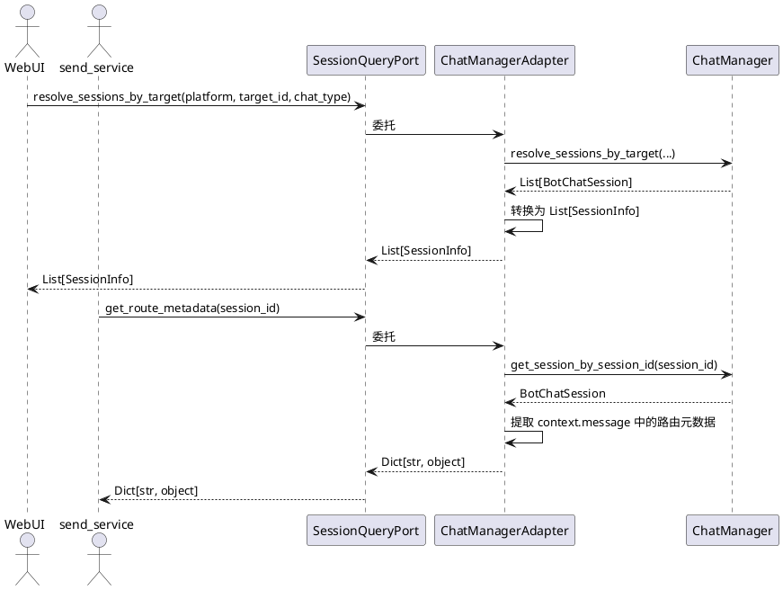
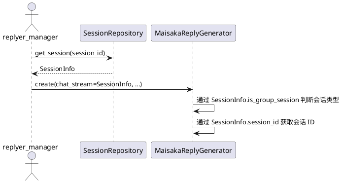
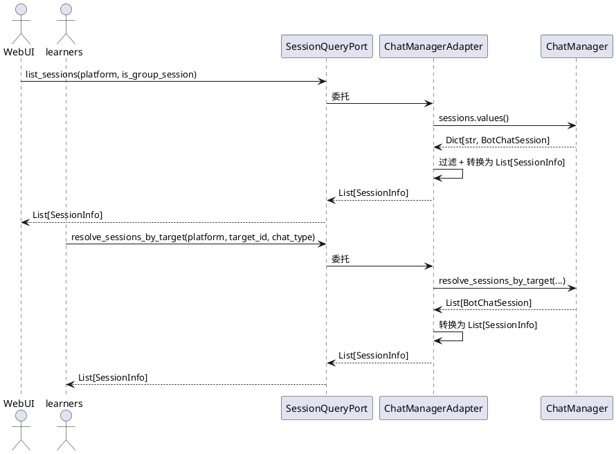

# 1. 组件定位

## 1.1 核心职责

本组件负责补全 ChatManager 的 Protocol 接口层，消灭 BotChatSession 可变引用泄漏，使所有模块通过 Protocol 访问 ChatManager。

## 1.2 核心输入

1. **消息链路层调用**：bot.py 调用 `get_or_create_session()` 和 `register_message()`，传入平台、用户 ID、群 ID 等参数
2. **运行时层查询**：heartflow_manager.py 调用 `get_session_by_session_id()`，传入 session_id
3. **WebUI 层查询**：WebUI 路由调用 `sessions`、`resolve_sessions_by_target()`、`last_messages`，传入平台、目标 ID 等参数
4. **学习器层查询**：jargon_learner、expression_learner 等调用 `resolve_sessions_by_target()`，传入平台、目标 ID
5. **插件运行时调用**：plugin_runtime 调用 `sessions`、`resolve_session_ids_by_target()`、`get_or_create_session()`
6. **回复/生成层访问**：replyer_manager、maisaka_generator 等持有 BotChatSession 可变引用，访问 session_id、is_group_session、context.message
7. **发送服务层访问**：send_service 持有 BotChatSession 引用，访问 context.message.message_info.additional_config 以继承路由元数据
8. **持久化触发**：main.py 调用 `save_all_sessions()`

## 1.3 核心输出

1. **不可变会话快照**：通过 SessionRepository/SessionInfoPort 返回 SessionInfo，替代 BotChatSession 可变引用
2. **会话创建结果**：通过新增 Protocol 方法返回 session_id，而非 BotChatSession 实例
3. **消息注册确认**：通过新增 Protocol 方法完成消息注册，调用方无需感知 ChatManager
4. **批量会话查询结果**：通过新增 Protocol 方法返回 SessionInfo 列表或 session_id 集合
5. **消息缓存查询结果**：通过新增 Protocol 方法返回最新消息快照
6. **会话统计信息**：通过新增 Protocol 方法返回会话数量和列表快照

## 1.4 职责边界

- **不拆分 ChatManager 本体**：ChatManager 类的内部实现和结构不变，那是 SSD-2 的工作
- **不修改 BotChatSession 类定义**：BotChatSession 作为内部实现类继续存在，只是外部不再直接导入
- **不修改数据库模型**：ChatSession 数据库模型不变
- **不新增"未来可能用到"的接口**：每个新增 Protocol 方法必须有明确的当前消费者
- **不改变消息链路的核心流程**：bot.py 的消息处理逻辑不变，只是调用方式从直接导入变为通过 Protocol

# 2. 领域术语

**Protocol 接口层**
: 核心模块定义的抽象接口（Protocol 类），组件层实现这些接口，核心层只依赖 Protocol 不依赖具体实现类。

**BotChatSession 可变引用泄漏**
: 外部模块直接导入 BotChatSession 类型并持有其实例引用，绕过了 SessionRepository 的不可变快照保护，导致外部可修改内部状态。

**不可变快照**
: SessionInfo 等 frozen dataclass，外部获取后无法修改内部状态，修改必须通过 Protocol 方法发起。

**适配器层**
: `src/core/adapters/` 目录，唯一允许导入组件具体类（如 chat_manager）的地方，负责将组件实现适配为核心 Protocol 接口。

**路由元数据**
: account_id 和 scope 字段，用于多账号/多作用域场景下的消息路由，存储在 BotChatSession 和入站消息的 additional_config 中。

**消息缓存**
: ChatManager.last_messages 字典，存储每个会话最新一条 SessionMessage，用于会话身份更新和消息构建。

**会话身份更新**
: 用真实入站消息补齐聊天流展示身份（群名、用户昵称等），由 ChatManager._update_session_identity() 执行。

# 3. 角色与边界

## 3.1 核心角色

- **消息链路层（bot.py）**：接收平台消息，触发会话创建和消息注册
- **运行时层（heartflow_manager.py, runtime.py）**：管理心流实例生命周期，查询会话信息
- **回复/生成层（replyer_manager, maisaka_generator）**：根据会话信息生成回复
- **发送服务层（send_service.py）**：发送消息，需要会话路由元数据
- **WebUI 层**：展示会话列表、统计信息、聊天记录
- **学习器层**：按目标解析会话，执行学习任务
- **插件运行时层**：插件通过能力接口访问会话数据

## 3.2 外部系统

- **ChatManager（被适配对象）**：当前 604 行的胖单例，本 SSD 不拆分其内部结构，只补全 Protocol 层
- **数据库服务**：ChatManager 内部使用，本 SSD 不改变其交互方式

## 3.3 交互上下文

# 4. DFX 约束

## 4.1 性能

1. 新增 Protocol 方法不得引入额外异步开销——同步方法保持同步，异步方法保持异步
2. 适配器层延迟导入 chat_manager 的模式不变，不增加启动时间
3. SessionInfo 快照构建（`_build_session_info`）性能不得劣于当前直接访问 BotChatSession 属性

## 4.2 可靠性

1. Protocol 方法签名变更必须保持向后兼容——新增参数必须有默认值
2. 适配器层延迟导入失败时必须抛出明确异常，不得静默返回 None
3. 消息注册失败（如缺少平台信息）必须抛出 ValueError，与当前行为一致

## 4.3 安全性

1. SessionInfo 快照的 frozen 特性不可被绕过——外部模块无法通过快照修改 ChatManager 内部状态
2. 适配器层是唯一允许导入 chat_manager 的地方，其他模块的导入必须在本次 SSD 中消除

## 4.4 可维护性

1. 新增 Protocol 方法必须有 docstring，说明参数、返回值、异常
2. 适配器实现必须保持与 ChatManager 方法的一一对应关系，便于追踪
3. 每个消除的 chat_manager 直接导入必须可通过 grep 验证

## 4.5 兼容性

1. ChatManager 的公开方法签名不变——本 SSD 只新增 Protocol 和适配器，不修改 ChatManager 本体
2. BotChatSession 类定义不变——内部继续使用，只是外部不再直接导入
3. SessionInfo 数据模型可新增字段，但不得删除或修改已有字段的语义

# 5. 核心能力

## 5.1 会话生命周期管理

### 5.1.1 业务规则

1. **会话创建/获取必须通过 Protocol**：当消息链路层需要获取或创建会话时，必须通过 SessionLifecyclePort 接口调用，禁止直接导入 chat_manager
   - 验收条件：[bot.py 收到新消息需要创建会话] → [通过 SessionLifecyclePort.get_or_create_session_id() 获取 session_id，而非直接调用 chat_manager.get_or_create_session()]

2. **会话创建返回 session_id 而非 BotChatSession**：Protocol 接口返回 session_id 字符串，调用方通过 SessionRepository 获取不可变快照
   - 验收条件：[调用 SessionLifecyclePort.get_or_create_session_id()] → [返回 session_id 字符串，调用方再通过 SessionRepository.get_session() 获取 SessionInfo]

3. **消息注册必须通过 Protocol**：当消息链路层需要注册消息时，必须通过 MessageRegistryPort 接口调用
   - 验收条件：[bot.py 收到消息需要注册] → [通过 MessageRegistryPort.register_message() 注册，而非直接调用 chat_manager.register_message()]

4. **持久化必须通过 Protocol**：当 main.py 需要保存全部会话时，必须通过 SessionLifecyclePort 接口调用
   - 验收条件：[main.py 关闭时保存会话] → [通过 SessionLifecyclePort.save_all_sessions() 保存，而非直接调用 chat_manager.save_all_sessions()]

5. **禁止项**：禁止消息链路层、运行时层、WebUI 层、学习器层、插件运行时层直接导入 chat_manager
   - 验收条件：[grep 搜索 `from src.chat.message_receive.chat_manager import`] → [仅适配器层和 chat 包内部模块匹配]

### 5.1.2 交互流程

### 5.1.3 异常场景

1. **会话创建失败**
   - 触发条件：数据库不可用或参数无效
   - 系统行为：向上抛出异常，与当前 chat_manager.get_or_create_session() 行为一致
   - 用户感知：异常冒泡到消息链路层，消息处理失败并记录错误日志

2. **消息注册缺少平台信息**
   - 触发条件：message.platform 为空
   - 系统行为：抛出 ValueError
   - 用户感知：消息注册失败，错误日志记录

## 5.2 会话查询补全

### 5.2.1 业务规则

1. **按目标批量解析会话必须通过 Protocol**：当 WebUI 或学习器需要按平台+目标 ID 解析会话时，必须通过 SessionQueryPort 接口调用
   - 验收条件：[WebUI 查询某群的所有会话] → [通过 SessionQueryPort.resolve_sessions_by_target() 获取 SessionInfo 列表，而非直接调用 chat_manager.resolve_sessions_by_target()]

2. **按目标批量解析 session_id 必须通过 Protocol**：当插件运行时需要按平台+目标 ID 解析 session_id 时，必须通过 SessionQueryPort 接口调用
   - 验收条件：[插件运行时查询目标会话 ID] → [通过 SessionQueryPort.resolve_session_ids_by_target() 获取 session_id 集合]

3. **消息缓存查询必须通过 Protocol**：当模块需要查询某会话最新消息时，必须通过 SessionQueryPort 接口调用
   - 验收条件：[session_port_registry 查询最新消息] → [通过 SessionQueryPort.get_last_message() 获取，而非直接访问 chat_manager.last_messages]

4. **会话列表查询必须通过 Protocol**：当 WebUI 或插件运行时需要获取会话列表时，必须通过 SessionQueryPort 接口调用
   - 验收条件：[WebUI 展示会话统计] → [通过 SessionQueryPort.list_sessions() 获取 SessionInfo 列表和数量]

5. **路由元数据查询必须通过 Protocol**：当 send_service 需要查询会话的路由元数据（account_id, scope, additional_config）时，必须通过 SessionQueryPort 接口调用
   - 验收条件：[send_service 发送消息需要路由元数据] → [通过 SessionQueryPort.get_route_metadata() 获取路由辅助字段字典，而非访问 BotChatSession.context.message]

6. **禁止项**：禁止外部模块直接访问 chat_manager.sessions、chat_manager.last_messages
   - 验收条件：[grep 搜索 `chat_manager.sessions` 或 `chat_manager.last_messages`] → [仅适配器层和 chat 包内部模块匹配]

### 5.2.2 交互流程

### 5.2.3 异常场景

1. **按目标解析无匹配会话**
   - 触发条件：指定平台和目标 ID 下不存在任何会话
   - 系统行为：返回空列表/空集合
   - 用户感知：WebUI 显示空列表，学习器跳过该目标

2. **路由元数据查询会话不存在**
   - 触发条件：session_id 对应的会话不存在
   - 系统行为：返回空字典
   - 用户感知：send_service 使用空路由元数据，降级为不附加路由信息

3. **消息缓存查询无消息**
   - 触发条件：指定会话无最新消息
   - 系统行为：返回 None
   - 用户感知：调用方按 None 处理，与当前行为一致

## 5.3 BotChatSession 可变引用消灭

### 5.3.1 业务规则

1. **回复/生成层必须使用 SessionInfo 替代 BotChatSession**：replyer_manager、maisaka_generator_base、maisaka_generator 不得再导入 BotChatSession 类型
   - 验收条件：[grep 搜索 `from src.chat.message_receive.chat_manager import BotChatSession`] → [仅 chat_manager.py 自身、chat 包内部模块、适配器层匹配]

2. **生成器构造函数接受 SessionInfo 而非 BotChatSession**：MaisakaReplyGenerator 等生成器的 chat_stream 参数类型从 `Optional[BotChatSession]` 改为 `Optional[SessionInfo]`
   - 验收条件：[创建 MaisakaReplyGenerator 时传入 SessionInfo] → [生成器通过 SessionInfo.session_id、SessionInfo.is_group_session 等字段访问所需信息]

3. **send_service 必须通过 Protocol 获取路由元数据**：send_service 不得持有 BotChatSession 引用，通过 SessionQueryPort.get_route_metadata() 获取路由辅助字段
   - 验收条件：[send_service._inherit_platform_io_route_metadata() 接收路由元数据字典而非 BotChatSession] → [从字典中直接读取路由字段，不再访问 BotChatSession.context.message]

4. **database_service 必须使用 session_id 替代 BotChatSession**：store_tool_info、store_action_info 的 chat_stream 参数改为 session_id 字符串
   - 验收条件：[调用 store_tool_info(chat_stream=session_id, ...)] → [函数内部使用 session_id 字符串，不再访问 BotChatSession 属性]

5. **runtime.py 必须使用 SessionInfo 替代 BotChatSession**：MaisakaHeartFlowChatting 不得持有 `self.chat_stream: BotChatSession` 可变引用
   - 验收条件：[runtime.py 初始化时] → [通过 SessionInfoPort 获取 SessionInfo 快照存储为 `self._session_info`，不再存储 BotChatSession 引用]

6. **插件运行时必须通过 Protocol 访问会话数据**：plugin_runtime/capabilities/data.py 不得导入 BotChatSession 类型
   - 验收条件：[插件运行时序列化会话数据] → [通过 SessionQueryPort.list_sessions() 获取 SessionInfo 列表，直接序列化 SessionInfo 字段]

7. **禁止项**：禁止核心层、回复/生成层、发送服务层、运行时层、插件运行时层导入 BotChatSession 类型
   - 验收条件：[grep 搜索 `BotChatSession` 在上述层中] → [零匹配]

### 5.3.2 交互流程

### 5.3.3 异常场景

1. **SessionInfo 快照缺少生成器所需字段**
   - 触发条件：生成器需要访问 BotChatSession 的 context.message 等不在 SessionInfo 中的字段
   - 系统行为：通过 SessionQueryPort.get_route_metadata() 等专用方法获取，而非扩展 SessionInfo
   - 用户感知：无变化，生成器功能正常

2. **runtime 初始化时 SessionInfo 不存在**
   - 触发条件：session_id 对应的会话尚未创建
   - 系统行为：抛出 ValueError，与当前行为一致
   - 用户感知：运行时创建失败，错误日志记录

## 5.4 外围模块导入消除

### 5.4.1 业务规则

1. **WebUI 层必须通过 Protocol 访问 ChatManager**：webui/routers/ 下的所有路由不得直接导入 chat_manager
   - 验收条件：[grep 搜索 `from src.chat.message_receive.chat_manager import` 在 webui/ 下] → [零匹配]

2. **学习器层必须通过 Protocol 访问 ChatManager**：learners/ 下的所有模块不得直接导入 chat_manager
   - 验收条件：[grep 搜索 `from src.chat.message_receive.chat_manager import` 在 learners/ 下] → [零匹配]

3. **工具/配置层必须通过 Protocol 访问 ChatManager**：common/utils/utils_config.py、chat/utils/ 等模块不得直接导入 chat_manager
   - 验收条件：[grep 搜索 `from src.chat.message_receive.chat_manager import` 在上述模块中] → [零匹配]

4. **person_info 必须通过 Protocol 访问 ChatManager**：person_info/person_info.py 不得直接导入 chat_manager
   - 验收条件：[grep 搜索 `from src.chat.message_receive.chat_manager import` 在 person_info/ 下] → [零匹配]

5. **禁止项**：禁止外围模块（WebUI/学习器/工具/配置/person_info）直接导入 chat_manager
   - 验收条件：[grep 搜索 `from src.chat.message_receive.chat_manager import`] → [仅适配器层、chat 包内部模块、CLI 入口匹配]

### 5.4.2 交互流程

### 5.4.3 异常场景

1. **WebUI 查询时 ChatManager 未初始化**
   - 触发条件：WebUI 启动早于 ChatManager 初始化
   - 系统行为：返回空列表
   - 用户感知：WebUI 显示空会话列表，刷新后正常

2. **学习器解析目标时数据库不可用**
   - 触发条件：数据库连接失败
   - 系统行为：返回内存中已缓存的会话列表（降级）
   - 用户感知：学习器仅处理内存中的会话，可能遗漏部分

# 6. 数据约束

## 6.1 SessionInfo（已有，可能扩展）

1. **session_id**：会话唯一标识，非空字符串
2. **session_name**：会话展示名称，非空字符串（群名或"xxx的私聊"）
3. **platform**：平台标识，非空字符串
4. **is_group_session**：是否为群聊，布尔值
5. **group_id**：群 ID，群聊时非空，私聊时为空字符串
6. **group_name**：群名称，群聊时可能非空，私聊时为空字符串
7. **user_id**：用户 ID，私聊时非空，群聊时为空字符串
8. **user_nickname**：用户昵称，私聊时可能非空，群聊时为空字符串
9. **primary_agent_id**：主发言智能体 ID，可能为空字符串（未绑定时）
10. **cohabitant_agent_ids**：共居智能体 ID 集合，不可变 frozenset
11. **created_timestamp**：会话创建时间，可选
12. **last_active_timestamp**：会话最后活跃时间，可选
13. **account_id**：平台账号 ID，可选（新增字段，用于多账号路由）
14. **scope**：路由作用域，可选（新增字段，用于多作用域路由）
15. **user_cardname**：用户名片，可选（新增字段，私聊时可能非空）

## 6.2 SessionLifecyclePort（新增 Protocol）

1. **get_or_create_session_id**：异步方法，参数为 platform, user_id, group_id, account_id, scope，返回 session_id 字符串
2. **save_all_sessions**：同步方法，无参数，无返回值
3. **initialize**：异步方法，无参数，无返回值（供 main.py 启动时调用）

## 6.3 SessionQueryPort（新增 Protocol）

1. **resolve_sessions_by_target**：同步方法，参数为 platform, target_id, chat_type，返回 List[SessionInfo]
2. **resolve_session_ids_by_target**：同步方法，参数为 platform, target_id, chat_type，返回 set[str]
3. **get_last_message**：同步方法，参数为 session_id，返回 Optional[SessionMessage]（或其不可变快照）
4. **list_sessions**：同步方法，参数为 platform（可选，默认 "all_platforms"）, is_group_session（可选），返回 List[SessionInfo]
5. **get_route_metadata**：同步方法，参数为 session_id，返回 Dict[str, object]（路由辅助字段字典）
6. **get_session_count**：同步方法，参数为 platform（可选），返回 int

## 6.4 MessageRegistryPort（新增 Protocol）

1. **register_message**：同步方法，参数为 SessionMessage，无返回值