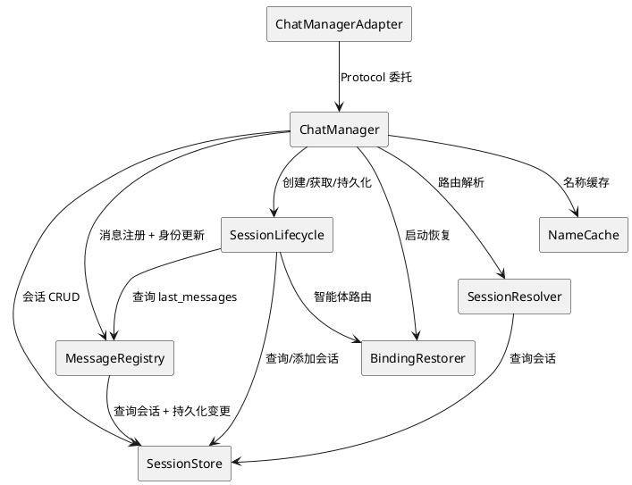
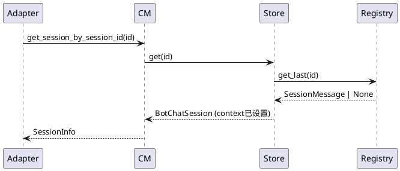

# 1. 组件定位

## 1.1 核心职责

本组件负责将 ChatManager 604行单例拆分为职责单一的子模块，使其通过已有的 Protocol 接口被外部消费，内部实现可独立演化。

## 1.2 核心输入

1. SSD-1 完成后的 ChatManagerAdapter（已实现 5 个 Protocol）
2. 当前 ChatManager 单例的 8 大职责混合代码
3. 外部模块通过 Protocol 接口的调用请求

## 1.3 核心输出

1. 拆分后的 ChatManager 内部子模块（不改变外部 Protocol 接口签名）
2. 消除 `sessions.pop()` 等可变操作对外暴露
3. ChatManager 单例变为薄协调层（< 200 行）

## 1.4 职责边界

- **不改变** Protocol 接口签名（SessionRepository/SessionInfoPort/SessionLifecyclePort/SessionQueryPort/MessageRegistryPort）
- **不改变** ChatManagerAdapter 的外部行为
- **不拆分**为独立服务或独立进程（仍是单进程内的模块拆分）
- **不引入**新的循环依赖
- **不消除** `chat_manager.sessions` 和 `chat_manager.last_messages` 属性代理（向后兼容），但新增子模块方法作为推荐访问方式

# 2. 领域术语

**ChatManager 单例**
: 当前 604 行的全局单例，混合了会话存储、消息注册、会话身份更新、会话创建、持久化、路由解析、名称缓存、智能体绑定恢复 8 大职责。

**会话存储**
: `sessions: Dict[str, BotChatSession]` 字典，管理内存中所有活跃会话实例。

**消息注册**
: `register_message()` 和 `last_messages: Dict[str, SessionMessage]`，入站消息的注册和缓存。

**会话身份更新**
: `_update_session_identity()`，用入站消息补齐会话的群名/用户昵称等显示身份。被 `register_message()` 和 `get_or_create_session()` 共同使用。

**会话创建/获取**
: `get_or_create_session()` 和 `get_session_by_session_id()` 等查询方法。涉及路由元数据应用（`_apply_route_metadata()`）和智能体路由解析。

**持久化**
: `save_all_sessions()`、`regularly_save_sessions()` 和 `_save_session()`，将会话状态写入数据库。

**路由解析**
: `resolve_sessions_by_target()` 和 `resolve_session_ids_by_target()`，按平台/目标匹配会话，含数据库懒加载。

**名称缓存**
: `get_session_name()`，会话显示名称的缓存和刷新。

**智能体绑定恢复**
: `_restore_bindings_from_db()` 和 `_restore_orchestrator_from_db()`，启动时从数据库恢复智能体绑定和 Orchestrator 状态。

# 3. 角色与边界

## 3.1 核心角色

- **ChatManagerAdapter**：通过 Protocol 接口消费 ChatManager 的唯一外部入口
- **main.py**：启动时初始化和注册

## 3.2 外部系统

- **数据库层**：会话持久化的存储后端
- **消息链路**：bot.py 通过 MessageRegistryPort 注册入站消息
- **AgentRouter**：智能体路由，被 SessionLifecycle 和 BindingRestorer 依赖

## 3.3 交互上下文

# 4. DFX约束

## 4.1 性能

- 会话查询响应时间不超过 1ms（内存字典直接访问）
- 名称缓存命中率不低于 95%

## 4.2 可靠性

- 拆分过程中不丢失任何会话数据
- 持久化行为不变（定时保存 + 退出保存）

## 4.3 兼容性

- Protocol 接口签名零变更
- ChatManagerAdapter 外部行为不变
- WebUI/学习器/插件运行时无需修改
- `chat_manager.sessions` 和 `chat_manager.last_messages` 属性代理保持向后兼容

# 5. 核心能力

## 5.1 会话存储拆分

### 5.1.1 业务规则

1. **会话存储独立**：`sessions` 字典和相关的 `get_session_by_session_id`/`get_existing_session_by_session_id` 必须提取为独立的 `SessionStore` 类
   - 验收条件：ChatManager 不再直接持有 `sessions` 字典 → 通过 `SessionStore` 代理访问

2. **可变操作封装**：`sessions.pop()` 必须封装为 `SessionStore.remove()` 方法
   - 验收条件：外部模块不再直接操作 `sessions` 字典 → 通过 Store 方法

3. **SessionStore 与 MessageRegistry 协作**：`get_session_by_session_id()` 在返回会话前会设置 `session.set_context(last_messages[session_id])`，SessionStore 必须接受 MessageRegistry 引用来完成此操作
   - 验收条件：SessionStore.get() 正确设置会话上下文

4. **持久化方法归属**：`_save_session()` 归属 SessionStore（单条保存），`save_all_sessions()` 和 `regularly_save_sessions()` 归属 SessionLifecycle（批量/定时）
   - 验收条件：`_save_session()` 通过 SessionStore.save() 调用

### 5.1.2 交互流程

### 5.1.3 异常场景

1. **会话不存在**
   - 触发条件：查询的 session_id 在内存和数据库中均不存在
   - 系统行为：返回 None
   - 用户感知：调用方收到 None，按自身逻辑处理

## 5.2 消息注册拆分

### 5.2.1 业务规则

1. **消息注册独立**：`register_message()` 和 `last_messages` 必须提取为独立的 `MessageRegistry` 类
   - 验收条件：ChatManager 不再直接持有 `last_messages` 字典 → 通过 `MessageRegistry` 代理访问

2. **消息缓存查询**：`get_last()` 必须通过 `MessageRegistry` 提供
   - 验收条件：SessionQueryPort.get_last_message() 委托给 MessageRegistry

3. **会话身份更新归属**：`_update_session_identity()` 归属 MessageRegistry（它由 `register_message()` 触发，且需要访问 last_messages 和 sessions）
   - 验收条件：MessageRegistry.register() 内部调用身份更新逻辑

## 5.3 会话生命周期拆分

### 5.3.1 业务规则

1. **创建/获取独立**：`get_or_create_session()` 必须提取为独立的 `SessionLifecycle` 类
   - 验收条件：ChatManager 不再直接实现创建逻辑 → 委托给 SessionLifecycle

2. **路由元数据应用**：`_apply_route_metadata()` 归属 SessionLifecycle
   - 验收条件：SessionLifecycle.get_or_create_session() 内部应用路由元数据

3. **持久化独立**：`save_all_sessions()` 和 `regularly_save_sessions()` 归属 SessionLifecycle
   - 验收条件：SessionLifecyclePort 直接委托给 SessionLifecycle

4. **SessionLifecycle 依赖**：必须接受 SessionStore + MessageRegistry + AgentRouter 引用
   - 验收条件：SessionLifecycle 构造函数接受这三个依赖

## 5.4 名称缓存拆分

### 5.4.1 业务规则

1. **名称缓存独立**：`get_session_name()` 必须提取为独立的 `SessionNameCache` 类
   - 验收条件：ChatManager 不再直接实现名称查询 → 委托给 SessionNameCache

2. **SessionNameCache 依赖**：必须接受 SessionStore 引用（获取会话信息用于名称推断）
   - 验收条件：SessionNameCache 正确从 SessionStore 获取群名/用户昵称

## 5.5 路由解析拆分

### 5.5.1 业务规则

1. **路由解析独立**：`resolve_sessions_by_target()` 和 `resolve_session_ids_by_target()` 必须提取为独立的 `SessionResolver` 类
   - 验收条件：SessionQueryPort 的路由解析方法委托给 SessionResolver

2. **SessionResolver 依赖**：必须接受 SessionStore 引用 + 数据库访问能力（懒加载未在内存的会话）
   - 验收条件：SessionResolver.resolve_by_target() 正确查询内存和数据库

## 5.6 智能体绑定恢复拆分

### 5.6.1 业务规则

1. **绑定恢复独立**：`_restore_bindings_from_db()` 和 `_restore_orchestrator_from_db()` 必须提取为独立的 `BindingRestorer` 类
   - 验收条件：ChatManager.initialize() 委托给 BindingRestorer

2. **BindingRestorer 依赖**：必须接受 AgentRouter 引用
   - 验收条件：BindingRestorer 正确恢复智能体绑定和 Orchestrator 状态

# 6. 数据约束

## 6.1 SessionStore

1. **sessions**：`Dict[str, BotChatSession]`，内存中所有活跃会话，键为 session_id
2. **线程安全**：当前为单线程异步模型，无需加锁
3. **save()**：单条会话持久化方法，供其他子模块调用

## 6.2 MessageRegistry

1. **last_messages**：`Dict[str, SessionMessage]`，每个会话最新一条消息，键为 session_id
2. **register()**：注册消息 + 触发会话身份更新 + 触发持久化

## 6.3 SessionNameCache

1. **无独立缓存字典**：当前 `get_session_name()` 每次从 SessionStore 实时计算，无需缓存字典
