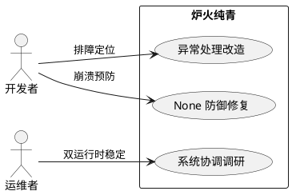
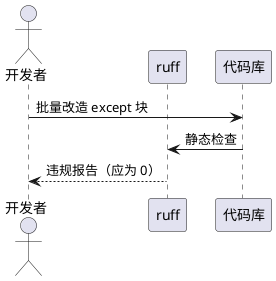

# 炉火纯青（ChunQing）— 需求规格

## 1. 组件定位

### 1.1 核心职责

本组件负责清算 Phoenix 后遗留的技术债、运行时崩溃风险和系统协调缺口，使 MaiBot 从"能用"进化到"排障可追踪、崩溃可预防、架构可演化"。

### 1.2 核心输入

1. 全项目 336 处 `except Exception:` 吞没（其中 88 处 `pass` 无日志、289 处无任何日志、13 处仅 `logger.debug` 等价于静默）
2. identity.py 2 处 None 防御缺失（运行时崩溃风险）
3. 系统协调盲区（V1/V2 双运行时、配置热重载、关闭序列、消息流去重）

### 1.3 核心输出

1. 所有异常捕获点可追踪（日志记录或显式 reraise）
2. identity.py 不再因 BotConfigPort 未注册而崩溃
3. 系统协调调研报告（指导 CQ-2+ 规划）

### 1.4 职责边界

- **不做**：重构业务逻辑、新增功能、修改 Protocol 接口签名
- **不做**：V1 插件系统内部重构（V1 将废弃）
- **不做**：WebUI 记忆可视化（独立功能，非清算范畴）
- **做**：让已有代码的异常可追踪、崩溃可预防、违规可发现

## 2. 领域术语

**异常吞没（Exception Swallowing）**
: `except Exception:` 或 `except Exception: pass` 捕获所有异常但不记录日志也不重新抛出，导致运行时错误无迹可查。

**异常降级（Exception Degradation）**
: `except Exception as exc:` 捕获后记录日志（logger.error/warning）但不重新抛出，允许系统在非关键路径上优雅降级。这是可接受的异常处理模式。

**None 防御（None Defense）**
: 在调用可能返回 None 的函数后，检查返回值是否为 None 再访问其属性，避免 AttributeError 崩溃。

**Port 未注册时序竞争（Port Registration Race）**
: 在 BotConfigPort 等全局 Port 注册完成前，业务代码（如 statistic.py 线程池）调用 get_bot_config_port() 返回 None，后续属性访问崩溃。

## 3. 角色与边界

### 3.1 核心角色

- **开发者**：通过异常日志定位 bug 根因
- **运维者**：通过系统协调保证 V1/V2 双运行时稳定共存

### 3.2 外部系统

- **ruff linter**：静态检查异常处理模式
- **日志系统**：接收异常日志输出

### 3.3 交互上下文

## 4. DFX 约束

### 4.1 性能

- 异常日志记录不得引入显著性能开销（每处 `except` 改造后，正常路径零开销，异常路径增加一次 logger 调用）
- 批量改造不得破坏现有异步性能特征

### 4.2 可靠性

- 改造后系统行为不变：异常仍然被捕获，只是不再静默
- identity.py 修复后：BotConfigPort 未注册时返回安全默认值而非崩溃

### 4.3 可维护性

- 异常处理模式必须可被 ruff 规则静态检查
- 改造后的代码必须通过现有 ruff 规则集

### 4.4 兼容性

- 不改变任何公共 API 的行为
- 不改变 Protocol 接口签名
- A_memorix 内部改造遵循 MODIFICATION_POLICY.md

## 5. 核心能力

### 5.1 异常处理改造（CQ-9 + CQ-10）

#### 5.1.1 业务规则

1. **禁止 bare `except:`**：所有 4 处 bare `except:` 必须改为 `except Exception` 或更具体的异常类型
   - 验收条件：`grep -rn 'except:' src/` 返回 0 结果（排除注释和字符串）

2. **禁止 `except Exception: pass` 无日志**：88 处必须改为以下之一：
   - `except Exception as exc: logger.error("...", exc_info=True)` — 记录完整堆栈
   - `except Exception as exc: logger.warning("...", exc_info=True)` — 降级但不静默
   - `except SpecificException:` — 缩小捕获范围到具体异常类型
   - 验收条件：`grep -rn 'except Exception.*:$' src/` 后跟 `pass` 的组合为 0

3. **`except Exception:` 无日志吞没改造**：289 处无任何日志的，必须补充日志
   - 验收条件：每个 `except Exception:` 块内至少有一条 `logger.warning`/`logger.error` 语句或 `raise`

4. **`logger.debug` 等价于静默**：13 处仅用 `logger.debug` 记录异常的，升级到 `logger.warning`
   - 验收条件：`except Exception:` 块内不含仅 `logger.debug` 的异常记录

4. **改造策略分级**：
   - **关键路径**（核心管道、消息收发、LLM 调用）：必须 `logger.error + exc_info=True`
   - **非关键路径**（缓存清理、统计输出、显示渲染）：允许 `logger.warning`
   - **启动/初始化**：允许 `logger.error` + 继续运行（不崩溃）

5. **禁止项**：不得将 `except Exception: pass` 改为 `except Exception: ...`（省略号块）来规避检查
   - 验收条件：ruff 规则可检测

#### 5.1.2 交互流程

#### 5.1.3 异常场景

1. **改造引入新 bug**
   - 触发条件：logger 调用引用了不存在的变量
   - 系统行为：启动时 NameError
   - 用户感知：服务启动失败

2. **日志洪水**
   - 触发条件：高频异常路径每秒记录大量 error 日志
   - 系统行为：日志文件快速增长
   - 用户感知：磁盘空间不足（已有日志轮转机制可缓解）

### 5.2 identity.py None 防御修复（CQ-3）

#### 5.2.1 业务规则

1. **`get_bot_account(platform)` 必须处理 BotConfigPort 未注册**：当 `get_bot_config_port()` 返回 None 时，返回空字符串而非崩溃
   - 验收条件：在 BotConfigPort 未注册时调用 `get_bot_account("qq")` 返回 `""`，不抛异常

2. **`get_all_bot_accounts()` 必须处理 BotConfigPort 未注册**：当 `get_bot_config_port()` 返回 None 时，返回空字典
   - 验收条件：在 BotConfigPort 未注册时调用 `get_all_bot_accounts()` 返回 `{}`，不抛异常

3. **statistic.py 线程池时序竞争**：statistic.py 在线程池中调用 `is_bot_self()`，可能早于 BotConfigPort 注册
   - 验收条件：BotConfigPort 未注册时 `is_bot_self()` 返回 `False`，不崩溃

#### 5.2.2 异常场景

1. **BotConfigPort 永不注册**
   - 触发条件：配置文件损坏，启动失败
   - 系统行为：所有身份判断返回安全默认值
   - 用户感知：机器人无法识别自身消息，但不崩溃

### 5.3 系统协调调研（CQ-8 子项）

#### 5.3.1 业务规则

1. **调研产出为报告，不产出代码**：调研结果写入 `.shared/handoff/` 供 CQ-2+ 规划参考
   - 验收条件：产出 1 份调研报告，覆盖 4 个方向

2. **调研方向**：
   - V1/V2 双运行时启动序列竞态
   - 配置热重载跨子系统传播一致性
   - 关闭序列协调（gRPC + V1 IPC + HeartFlow 优雅退出）
   - 消息流在 V1/V2 双路径下的去重与顺序保证

3. **调研结论必须可操作**：每个方向给出"有风险/无风险"，有风险的给出修复优先级和预估工作量
   - 验收条件：报告中每个方向都有明确的结论和行动建议

## 6. 数据约束

### 6.1 异常改造记录

1. **文件路径**：被改造文件的相对路径（如 `src/A_memorix/core/utils/io.py`）
2. **行号**：改造前的行号
3. **改造类型**：`bare_to_typed` / `add_logging` / `narrow_scope`
4. **严重度**：`error` / `warning`（决定日志级别）

### 6.2 调研报告

1. **方向**：4 个调研方向之一
2. **结论**：`有风险` / `无风险`
3. **风险描述**：具体竞态/不一致场景
4. **修复优先级**：P0/P1/P2
5. **预估工作量**：人天