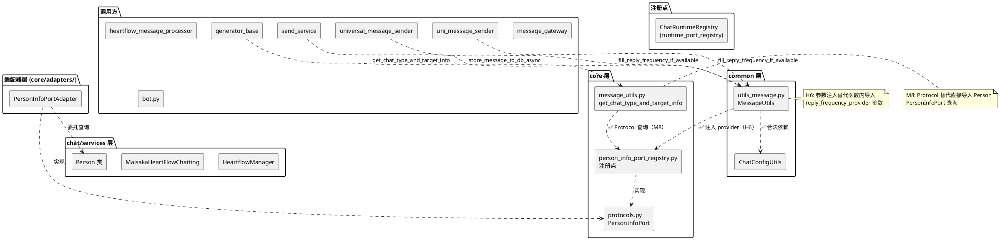
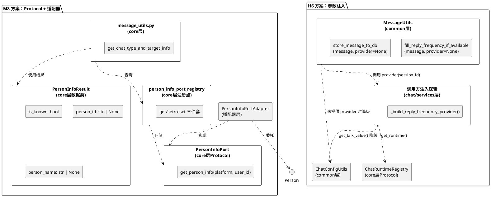
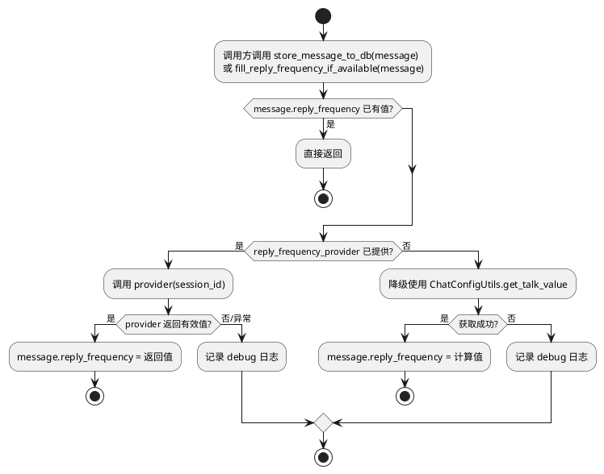
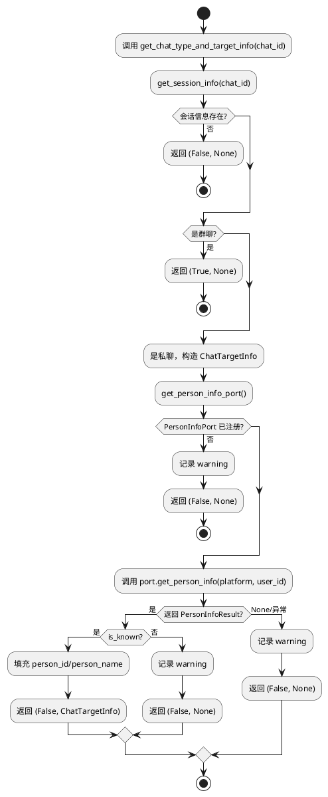
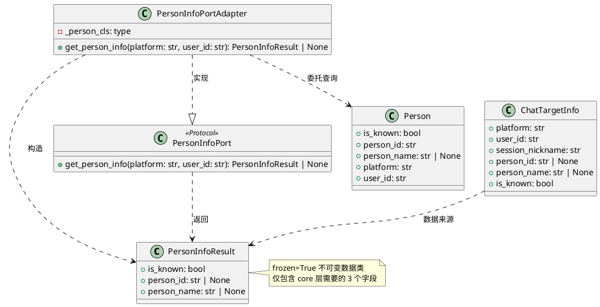

# SSD-9：Common 层架构归正 — 增量设计方案

# 一、需求与存量功能关系分析

## 1.1 需求功能与存量功能对比

### 1.1.1 已实现功能

| 需求功能 | 存量功能 | 代码位置 | 匹配度 |
|---------|---------|---------|--------|
| 会话信息查询（get_session_info） | SessionInfoPort + 注册点已实现 | `src/core/session_port_registry.py:49-56` | 100% |
| 运行时查询（get_runtime） | ChatRuntimeRegistry + 注册点已实现 | `src/core/runtime_port_registry.py:30-36` | 100% |
| 运行时回复频率读取（get_talk_frequency_adjust） | ChatRuntime Protocol 已定义 | `src/core/protocols.py:176-177` | 100% |
| 注册点模式（get/set/reset 三件套） | 多处注册点已建立 | `src/core/runtime_port_registry.py`, `src/core/session_port_registry.py`, `src/core/adapters/message_ingestion_port.py` | 100% |
| 适配器模式（鸭子类型包裹） | ChatBotMessageIngestionPort 等已实现 | `src/core/adapters/message_ingestion_port.py:36-46` | 100% |
| ruff banned-api 守卫 | 已有 18 条守卫规则 | `pyproject.toml:88-106` | 100% |
| ChatConfigUtils.get_talk_value 降级逻辑 | fill_reply_frequency_if_available 已有降级分支 | `src/common/utils/utils_message.py:253-256` | 100% |
| ChatTargetInfo 数据模型 | 已定义（platform/user_id/session_nickname/person_id/person_name/is_known） | `src/common/data_models/chat_target_info_data_model.py:11-32` | 100% |

### 1.1.2 需要扩展的功能

| 需求功能 | 存量功能 | 差异说明 | 扩展方向 |
|---------|---------|---------|---------|
| fill_reply_frequency_if_available 参数注入 | 当前通过函数内导入 heartflow_manager 获取频率 | 输入差异：当前自行导入 heartflow_manager，需改为通过参数接收 provider；业务逻辑差异：无（计算规则不变）；边界条件差异：provider 未提供时需降级 | 1. 新增 `reply_frequency_provider: Callable[[], float] \| None = None` 参数；2. 删除函数内 `from src.chat.heart_flow.heartflow_manager import heartflow_manager`；3. 保留 ChatConfigUtils.get_talk_value 降级分支 |
| get_chat_type_and_target_info 通过 Protocol 查询人物信息 | 当前直接 `from src.person_info.person_info import Person` 并实例化 | 输入差异：当前直接导入 Person 类，需改为通过 PersonInfoPort Protocol；业务逻辑差异：无（查询逻辑不变）；边界条件差异：PersonInfoPort 未注册时需降级 | 1. 新增 PersonInfoPort Protocol 定义；2. 新增 PersonInfoResult 数据类；3. 新增 PersonInfoPortAdapter 适配器；4. 新增注册点；5. 修改 get_chat_type_and_target_info 使用 Protocol |

### 1.1.3 需要新增的功能或接口

**H6 模块组**（参数注入方案，不新增 Protocol）：

| 功能点 | 输入 | 输出 | 核心逻辑 | 依赖 |
|-------|------|------|---------|------|
| reply_frequency_provider 参数 | session_id: str | float（0.0~1.0） | 通过 ChatRuntimeRegistry 获取运行时，读取 get_talk_frequency_adjust()，结合 ChatConfigUtils 计算 | ChatRuntimeRegistry Protocol |
| 调用方注入逻辑 | session_id | float | get_chat_runtime_registry() → get_runtime() → get_talk_frequency_adjust() → 频率计算 | core/runtime_port_registry |

**M8 模块组**（Protocol + 适配器 + 注册点方案）：

| 功能点 | 输入 | 输出 | 核心逻辑 | 依赖 |
|-------|------|------|---------|------|
| PersonInfoPort Protocol | platform: str, user_id: str | PersonInfoResult 或 None | 纯查询接口，不包含修改操作 | 无（Protocol 定义零依赖） |
| PersonInfoResult 数据类 | — | is_known: bool, person_id: str \| None, person_name: str \| None | 不可变数据对象 | 无 |
| PersonInfoPortAdapter | platform: str, user_id: str | PersonInfoResult 或 None | 委托 Person(platform, user_id) 查询 | person_info.person_info.Person |
| PersonInfoPort 注册点 | — | get/set/reset 三件套 | 模块级全局变量 + 函数 | PersonInfoPort Protocol |
| ruff banned-api 守卫 | — | — | 禁止 `src.person_info.person_info.Person` 在 core 层导入 | pyproject.toml |

## 1.2 存量功能详细分析

### 1.2.1 fill_reply_frequency_if_available 当前实现

**接口契约**：
- 入参：`message: SessionMessage`（静态方法，无 self）
- 出参：`None`（副作用：修改 `message.reply_frequency`）
- 异常：所有异常被 try/except 捕获，记录 debug 日志，不向上传播
- 副作用：修改传入 message 对象的 reply_frequency 属性

**业务规则**：
1. 如果 `message.reply_frequency` 已有值 → 跳过
2. 如果 `session_id` 为空 → 跳过
3. 尝试从 `heartflow_manager.heartflow_chat_list` 获取运行时 → 调用 `_get_effective_reply_frequency()` → 设置频率
4. 运行时不存在 → 降级使用 `ChatConfigUtils.get_talk_value(session_id, is_group_chat)`
5. 任何异常 → 记录 debug 日志，不设置频率

**扩展点**：无（当前是硬编码的函数内导入）

**约束**：
- 同步方法（不能改为异步，因为 store_message_to_db 是同步方法）
- 在 `_DB_WRITE_THREAD_LOCK` 内调用，不能阻塞
- 调用方有 3 处：`store_message_to_db`（同文件 L220）、`universal_message_sender.py`（L69）、`uni_message_sender.py`（L376）

### 1.2.2 get_chat_type_and_target_info 当前实现

**接口契约**：
- 入参：`chat_id: str`
- 出参：`Tuple[bool, Optional[ChatTargetInfo]]`（是否群聊, 私聊目标信息）
- 异常：外层 try/except 捕获所有异常，记录 error 日志，返回 `(False, None)`
- 副作用：无（纯查询）

**业务规则**：
1. 通过 `get_session_info(chat_id)` 获取会话信息
2. 群聊 → 返回 `(True, None)`
3. 私聊 → 构造 ChatTargetInfo，尝试通过 Person 类查询人物信息
4. Person.is_known == False → 返回 `(False, None)`
5. Person.is_known == True → 填充 person_id/person_name → 返回 `(False, ChatTargetInfo)`
6. Person 查询异常 → 记录 warning，ChatTargetInfo 中人物字段为空

**扩展点**：无（当前直接导入 Person 类）

**约束**：
- 同步方法（Person 类的数据库查询是同步的）
- 调用方有 2 处：`generator_base.py`（L268）、`chat/utils/utils.py`（L283 re-export）

### 1.2.3 Person 类依赖链分析

**Person 类的核心依赖**：
- `src.core.memory_port_registry.get_memory_service_port` — core 层注册点（函数内导入，在 `store_person_memory_from_answer` 中使用）
- `src.core.session_port_registry.get_session_info` — core 层注册点（模块级导入，在 `store_person_memory_from_answer` 中使用）
- `src.common.database.database.get_db_session` — common 层（合法）
- `src.config.config.global_config` — 配置层（合法）
- `src.core.identity.is_bot_self` — core 层（函数内导入，在 `_is_bot_self` 中使用）

**循环依赖链**：`core/message_utils.py` → `person_info/person_info.py` → `core/memory_port_registry` + `core/session_port_registry` + `core/identity`

**Person 类中 core 层依赖的具体用途**：
- `get_memory_service_port()`：仅在 `store_person_memory_from_answer()` 中使用，与 Person 类本身的 CRUD 无关
- `get_session_info()`：仅在 `store_person_memory_from_answer()` 中使用，与 Person 类本身的 CRUD 无关
- `is_bot_self()`：在 `_is_bot_self()` 和 `__init__()` 中使用，用于判断是否是机器人自己

**关键发现**：Person 类的核心功能（is_known/person_id/person_name 查询）仅依赖 common 层（数据库），core 层依赖来自辅助功能（记忆写回、机器人识别）。本次 M8 方案只需解耦查询路径，不涉及 Person 类内部重构。

### 1.2.4 已有注册点模式分析

项目已建立 6 套注册点，模式统一：

| 注册点文件 | Protocol | 注册函数 | 获取函数 | 重置函数 |
|-----------|----------|---------|---------|---------|
| `runtime_port_registry.py` | ChatRuntimeRegistry | `register_chat_runtime_registry` | `get_chat_runtime_registry` | — |
| `runtime_port_registry.py` | ChatRuntimeFactory | `register_chat_runtime_factory` | `get_chat_runtime_factory` | — |
| `session_port_registry.py` | SessionInfoPort | `register_session_info_port` | `get_session_info_port` | — |
| `session_port_registry.py` | SessionLifecyclePort | `register_session_lifecycle_port` | `get_session_lifecycle_port` | — |
| `session_port_registry.py` | SessionQueryPort | `register_session_query_port` | `get_session_query_port` | — |
| `message_ingestion_port.py` | MessageIngestionPort | `set_message_ingestion_port` | `get_message_ingestion_port` | `reset_message_ingestion_port` |

**模式特征**：
1. 模块级 `Optional[Protocol]` 变量存储实例
2. `register/set` 函数赋值全局变量
3. `get` 函数返回实例（未注册返回 None 或抛 RuntimeError）
4. 部分注册点提供便捷查询函数（如 `get_session_info(session_id)` 直接委托到 port）
5. 适配器使用鸭子类型包裹，不要求被适配类继承 Protocol

### 1.2.5 _get_effective_reply_frequency 分析

**当前实现**（`src/maisaka/runtime.py:1003-1022`）：
- 专注模式 → 1.0
- 基础频率 ≤ 0 或调整倍率 ≤ 0 → 0.0
- 计算：`ChatConfigUtils.get_talk_value() * _talk_frequency_adjust * agent_modifier`
- 返回 max(0.0, 结果)

**ChatRuntime Protocol 已暴露的方法**：
- `get_talk_frequency_adjust()` → 返回 `_talk_frequency_adjust`（L176-177）
- 但 `_get_effective_reply_frequency()` 是私有方法，未暴露在 Protocol 中

**关键问题**：`_get_effective_reply_frequency()` 是 MaisakaHeartFlowChatting 的私有方法，不在 ChatRuntime Protocol 中。common 层当前直接调用这个私有方法，违反封装。需要通过 ChatRuntime Protocol 的公开方法组合计算，或在 Protocol 中新增方法。

**方案选择**：不在 ChatRuntime Protocol 中新增方法（避免修改已有 Protocol 签名），而是让调用方通过 `get_talk_frequency_adjust()` + `ChatConfigUtils.get_talk_value()` 组合计算。这与 `_get_effective_reply_frequency()` 的核心逻辑一致，只是缺少专注模式和判断——但专注模式是 maisaka 内部概念，common 层不需要感知。

# 二、增量设计方案

## 2.1 实现模型

### 2.1.1 上下文视图



### 2.1.2 服务/组件总体架构



### 2.1.3 实现设计文档

#### H6：fill_reply_frequency_if_available 参数注入流程



#### M8：get_chat_type_and_target_info Protocol 查询流程



## 2.2 接口设计

### 2.2.1 总体设计

| 接口分类 | 接口名称 | 层级 | 稳定性 | 变更策略 |
|---------|---------|------|--------|---------|
| H6 参数类型 | ReplyFrequencyProvider | common | 稳定 | 类型别名，不单独版本化 |
| M8 Protocol | PersonInfoPort | core | 稳定 | 新增方法需扩展 Protocol |
| M8 数据类 | PersonInfoResult | core | 稳定 | 字段新增需扩展数据类 |
| M8 注册点 | get/set/reset_person_info_port | core | 稳定 | 与 Protocol 同步变更 |
| M8 适配器 | PersonInfoPortAdapter | adapters | 稳定 | 内部实现可替换 |

### 2.2.2 接口清单

#### H6：ReplyFrequencyProvider 类型别名

```python
# src/common/utils/utils_message.py
from typing import Callable, Optional

ReplyFrequencyProvider = Callable[[], Optional[float]]
```

**业务说明**：回复频率获取函数的类型约束。接收 session_id，返回回复频率值（0.0~1.0）或 None（降级）。

**前置条件**：无（纯类型定义）

**后置条件**：无（纯类型定义）

**异常映射**：provider 本身可以抛出异常，调用方（fill_reply_frequency_if_available）负责捕获

#### H6：fill_reply_frequency_if_available 修改后签名

```python
@staticmethod
def fill_reply_frequency_if_available(
    message: "SessionMessage",
    reply_frequency_provider: ReplyFrequencyProvider | None = None,
) -> None:
```

**业务说明**：在消息入库前补充当前会话的生效回复频率。新增可选参数 `reply_frequency_provider`，当提供时通过该函数获取频率，否则降级使用 ChatConfigUtils.get_talk_value。

**前置条件**：message 对象包含有效 session_id

**后置条件**：message.reply_frequency 被设置（成功时）或保持不变（失败时）

**异常映射**：所有异常被内部捕获，记录 debug 日志，不向上传播

**降级行为**：
1. provider 未提供 → 使用 ChatConfigUtils.get_talk_value（与当前降级路径一致）
2. provider 抛出异常 → 记录 debug 日志，不设置 reply_frequency
3. provider 返回 None → 记录 debug 日志，不设置 reply_frequency

#### H6：store_message_to_db 修改后签名

```python
@staticmethod
def store_message_to_db(
    message: "SessionMessage",
    reply_frequency_provider: ReplyFrequencyProvider | None = None,
) -> None:
```

**业务说明**：存储消息到数据库。新增可选参数透传给 fill_reply_frequency_if_available。

**前置条件**：无

**后置条件**：消息入库，reply_frequency 已补充

**异常映射**：与当前一致

#### H6：store_message_to_db_async 修改后签名

```python
@staticmethod
async def store_message_to_db_async(
    message: "SessionMessage",
    reply_frequency_provider: ReplyFrequencyProvider | None = None,
) -> None:
```

**业务说明**：异步存储消息到数据库。新增可选参数透传给 store_message_to_db。

#### H6：调用方注入函数

```python
# 在各调用方模块中定义
def _build_reply_frequency_provider() -> ReplyFrequencyProvider:
    """构建回复频率获取函数，通过 ChatRuntimeRegistry 获取运行时频率。"""
    from src.core.runtime_port_registry import get_chat_runtime_registry
    from src.common.utils.utils_config import ChatConfigUtils

    def _provider(session_id: str) -> float | None:
        registry = get_chat_runtime_registry()
        if registry is None:
            return None
        # 同步调用：ChatRuntimeRegistry.get_runtime 是 async，
        # 但 store_message_to_db 是同步方法，需要特殊处理
        ...
    return _provider
```

**关键设计决策**：`store_message_to_db` 是同步方法，而 `ChatRuntimeRegistry.get_runtime()` 是异步方法。存在同步/异步不匹配问题。

**解决方案**：调用方在异步上下文中预先获取运行时信息，构造同步 provider 闭包。具体方案见 2.3 节。

#### M8：PersonInfoPort Protocol

```python
# src/core/protocols.py
@runtime_checkable
class PersonInfoPort(Protocol):
    """人物信息查询接口 — 核心通过此接口查询人物信息，不直接依赖 Person 类。"""

    def get_person_info(self, platform: str, user_id: str) -> Optional["PersonInfoResult"]:
        """查询人物信息。

        Args:
            platform: 平台标识
            user_id: 用户 ID

        Returns:
            PersonInfoResult 查询结果，不存在时返回 None
        """
```

**业务说明**：纯查询接口，不包含注册/更新等修改操作。core 层通过此接口查询 is_known/person_id/person_name，不感知 Person 类的具体实现。

**前置条件**：无（未注册时返回 None）

**后置条件**：无（纯查询，无副作用）

**异常映射**：实现方应捕获异常并返回 None，而非向上传播

#### M8：PersonInfoResult 数据类

```python
# src/core/types.py 或独立文件
from dataclasses import dataclass
from typing import Optional

@dataclass(frozen=True)
class PersonInfoResult:
    """人物信息查询结果 — 不可变数据对象。"""

    is_known: bool
    person_id: Optional[str] = None
    person_name: Optional[str] = None
```

**业务说明**：PersonInfoPort.get_person_info 的返回类型。frozen=True 确保不可变性，防止调用方修改。

**前置条件**：无

**后置条件**：无

**数据约束**：
- is_known=True 时，person_id 和 person_name 通常有值（但不保证，与 Person 类行为一致）
- is_known=False 时，person_id 和 person_name 为 None

#### M8：PersonInfoPortAdapter

```python
# src/core/adapters/person_info_port.py
class PersonInfoPortAdapter:
    """PersonInfoPort 适配器 — 委托 Person 类完成查询。"""

    def get_person_info(self, platform: str, user_id: str) -> Optional[PersonInfoResult]:
        try:
            from src.person_info.person_info import Person

            person = Person(platform=platform, user_id=user_id)
            if not person.is_known:
                return PersonInfoResult(is_known=False)
            return PersonInfoResult(
                is_known=True,
                person_id=person.person_id,
                person_name=person.person_name,
            )
        except Exception as exc:
            logger.warning(f"查询人物信息失败: platform={platform} user_id={user_id} error={exc}")
            return None
```

**业务说明**：鸭子类型适配器，包裹 Person 类实现 PersonInfoPort Protocol。不要求 Person 类继承 Protocol。

**前置条件**：Person 类可用

**后置条件**：无

**异常映射**：Person 初始化异常 → 捕获并返回 None

#### M8：注册点

```python
# src/core/person_info_port_registry.py
_provider: Optional[PersonInfoPort] = None

def get_person_info_port() -> Optional[PersonInfoPort]:
    """获取全局 PersonInfoPort 实例。未注册时返回 None。"""
    return _provider

def set_person_info_port(port: PersonInfoPort) -> None:
    """注册全局 PersonInfoPort 实例。"""
    global _provider
    if _provider is not None:
        logger.warning("PersonInfoPort 已注册，将被覆盖")
    _provider = port

def reset_person_info_port() -> None:
    """重置 PersonInfoPort 实例（测试用）。"""
    global _provider
    _provider = None
```

**业务说明**：遵循项目已有的注册点模式（get/set/reset 三件套）。

**前置条件**：无

**后置条件**：注册后 get_person_info_port() 返回有效实例

## 2.3 数据模型

### 2.3.1 设计目标

1. **H6 目标**：消除 common 层对 chat 层的反向依赖，通过参数注入实现回复频率获取
2. **M8 目标**：消除 core 层对 person_info 模块的直接导入，通过 Protocol 接口解耦
3. **兼容性目标**：所有外部签名尽量不变，调用方零修改（除需注入 provider 的调用方）
4. **性能目标**：替代方案响应时间不超过当前实现的 2 倍

### 2.3.2 模型实现

#### H6 同步/异步不匹配问题

**问题**：`store_message_to_db` 是同步方法（在 `_DB_WRITE_THREAD_LOCK` 内执行），而 `ChatRuntimeRegistry.get_runtime()` 是异步方法。无法在同步上下文中直接调用异步方法。

**方案对比**：

| 方案 | 描述 | 优点 | 缺点 |
|------|------|------|------|
| A: 调用方预获取 | 在异步调用方中预先获取运行时信息，构造同步 provider 闭包 | 不改 store_message_to_db 的同步性质 | 调用方需修改，provider 闭包捕获运行时状态 |
| B: 同步包装 get_runtime | 在 ChatRuntimeRegistry 中新增同步方法 | 调用方零修改 | 违反异步设计原则，可能阻塞事件循环 |
| C: 改为异步链路 | store_message_to_db 改为异步 | 架构更干净 | 改动范围大，影响所有调用方 |

**选择方案 A**：调用方预获取。

**理由**：
1. store_message_to_db 的同步性质由 SQLite WAL 单写约束决定，不应改变
2. 调用方（send_service、heartflow_message_processor、bot.py）本身在异步上下文中，可以预先获取运行时信息
3. universal_message_sender 和 uni_message_sender 的调用也在异步上下文中
4. 方案 B 违反异步设计原则（在同步方法中 run_until_complete 可能死锁）
5. 方案 C 改动范围过大，不符合"最小变更"原则

**具体实现**：

对于 `store_message_to_db_async` 的调用方（send_service、heartflow_message_processor、bot.py、message_gateway），在异步上下文中构造 provider：

```python
# 调用方示例（send_service.py）
async def _send_and_store(self, message, ...):
    provider = await self._build_reply_frequency_provider(message.session_id)
    await MessageUtils.store_message_to_db_async(message, reply_frequency_provider=provider)

async def _build_reply_frequency_provider(self, session_id: str) -> ReplyFrequencyProvider:
    """在异步上下文中预先获取运行时信息，构造同步 provider。"""
    from src.core.runtime_port_registry import get_chat_runtime_registry
    from src.common.utils.utils_config import ChatConfigUtils

    registry = get_chat_runtime_registry()
    runtime = await registry.get_runtime(session_id) if registry else None

    def _provider(sid: str) -> float | None:
        if runtime is not None:
            adjust = runtime.get_talk_frequency_adjust()
            if adjust <= 0:
                return 0.0
            talk_value = float(ChatConfigUtils.get_talk_value(sid))
            return max(0.0, talk_value * adjust)
        return None

    return _provider
```

**注意**：provider 闭包捕获的 runtime 是调用时刻的快照。如果 session_id 与 provider 构造时的 session_id 不同（理论上不会发生，因为 provider 是为特定消息构造的），会使用错误的运行时。但实际场景中，每条消息的 provider 是为其自身 session_id 构造的，不存在不匹配问题。

对于 `universal_message_sender.py` 和 `uni_message_sender.py` 中直接调用 `fill_reply_frequency_if_available` 的场景，这两个调用方也在异步上下文中，可以同样预获取。

#### M8 PersonInfoResult 类图



## 2.4 ruff banned-api 守卫配置

### 2.4.1 新增守卫规则

在 `pyproject.toml` 的 `[tool.ruff.lint.flake8-tidy-imports.banned-api]` 中新增：

```toml
"src.person_info.person_info.Person" = {msg = "core 层禁止直接导入 Person 类，请使用 PersonInfoPort Protocol 接口（get_person_info_port()）"}
```

### 2.4.2 per-file-ignores 调整

在 `pyproject.toml` 的 `[tool.ruff.lint.per-file-ignores]` 中新增：

```toml
"src/core/adapters/person_info_port.py" = ["TID251"]
```

适配器层允许导入 Person 类，与已有模式一致（`src/core/adapters/*` 已有 `["TID251"]` 通配规则，此条为显式声明）。

### 2.4.3 已有守卫覆盖

`src.chat.heart_flow.heartflow_manager.heartflow_manager` 已在 banned-api 中（L106），H6 方案移除函数内导入后，common 层不再有违反此守卫的代码。

## 2.5 文件变更清单

### 2.5.1 新增文件

| 文件路径 | 职责 |
|---------|------|
| `src/core/person_info_port_registry.py` | PersonInfoPort 注册点（get/set/reset 三件套） |
| `src/core/adapters/person_info_port.py` | PersonInfoPortAdapter 适配器实现 |

### 2.5.2 修改文件

| 文件路径 | 变更内容 | 影响范围 |
|---------|---------|---------|
| `src/common/utils/utils_message.py` | 1. 新增 `ReplyFrequencyProvider` 类型别名<br>2. `fill_reply_frequency_if_available` 新增 `reply_frequency_provider` 参数<br>3. `store_message_to_db` 新增 `reply_frequency_provider` 参数透传<br>4. `store_message_to_db_async` 新增 `reply_frequency_provider` 参数透传<br>5. 删除函数内 `from src.chat.heart_flow.heartflow_manager import heartflow_manager` | H6 核心变更 |
| `src/core/protocols.py` | 新增 `PersonInfoPort` Protocol 定义 | M8 核心变更 |
| `src/core/types.py` | 新增 `PersonInfoResult` 数据类（frozen=True） | M8 数据模型 |
| `src/core/message_utils.py` | 1. 删除 `from src.person_info.person_info import Person`<br>2. `get_chat_type_and_target_info` 改用 `PersonInfoPort` 查询 | M8 核心变更 |
| `src/services/send_service.py` | 构造 `reply_frequency_provider` 并传递给 `store_message_to_db_async` | H6 调用方适配 |
| `src/chat/heart_flow/heartflow_message_processor.py` | 构造 `reply_frequency_provider` 并传递给 `store_message_to_db_async` | H6 调用方适配 |
| `src/chat/message_receive/bot.py` | 构造 `reply_frequency_provider` 并传递给 `store_message_to_db_async` | H6 调用方适配 |
| `src/plugin_runtime/host/message_gateway.py` | 构造 `reply_frequency_provider` 并传递给 `store_message_to_db_async` | H6 调用方适配 |
| `src/common/message_server/universal_message_sender.py` | 构造 `reply_frequency_provider` 并传递给 `fill_reply_frequency_if_available` | H6 调用方适配 |
| `src/chat/message_receive/uni_message_sender.py` | 构造 `reply_frequency_provider` 并传递给 `fill_reply_frequency_if_available` | H6 调用方适配 |
| `src/main.py` | 启动时注册 PersonInfoPortAdapter | M8 启动注册 |
| `pyproject.toml` | 1. 新增 `src.person_info.person_info.Person` banned-api 规则<br>2. 新增 `src/core/adapters/person_info_port.py` per-file-ignores | 守卫配置 |

### 2.5.3 删除文件

无。

## 2.6 风险评估与缓解措施

### 2.6.1 H6 风险

| 风险 | 严重度 | 概率 | 缓解措施 |
|------|--------|------|---------|
| 同步/异步不匹配导致死锁 | 高 | 低 | 调用方在异步上下文中预获取运行时信息，构造同步 provider 闭包；不在同步方法中调用 asyncio.run() 或 run_until_complete() |
| provider 闭包捕获的运行时状态过期 | 中 | 低 | provider 是为每条消息即时构造的，不存在过期问题；如果运行时在 provider 构造后、消息入库前被销毁，频率值可能不准确，但与当前行为一致（当前也是获取调用时刻的快照） |
| 调用方遗漏注入 provider | 中 | 中 | 默认参数为 None，降级使用 ChatConfigUtils.get_talk_value，行为与当前降级路径一致；ruff 守卫防止 heartflow_manager 导入复发 |
| 6 个调用方修改引入 bug | 中 | 中 | 每个调用方的修改模式一致（构造 provider → 传递），可批量验证；不修改 provider 时行为与当前降级路径一致 |

### 2.6.2 M8 风险

| 风险 | 严重度 | 概率 | 缓解措施 |
|------|--------|------|---------|
| PersonInfoPort 未注册时查询失败 | 中 | 低 | get_person_info_port() 返回 None 时，get_chat_type_and_target_info 降级返回 (False, None)，与当前 Person.is_known=False 行为一致 |
| Person 类内部依赖 core 注册点，适配器间接引入循环 | 低 | 低 | 适配器在 core/adapters/ 中，per-file-ignores 允许 TID251；Person 的 core 依赖是函数内导入，不会在 import 时触发循环 |
| PersonInfoResult 字段不足，后续需扩展 | 低 | 低 | frozen dataclass 可通过新增字段（带默认值）扩展，不影响已有调用方 |
| ChatTargetInfo.from_person_info 已有类似功能，与 PersonInfoResult 重复 | 低 | 低 | ChatTargetInfo.from_person_info 是 common 层的工厂方法，接收 MaiPersonInfo；PersonInfoResult 是 core 层的 Protocol 返回类型，两者职责不同 |

### 2.6.3 整体风险

| 风险 | 严重度 | 概率 | 缓解措施 |
|------|--------|------|---------|
| H6 和 M8 同时修改导致回归 | 中 | 低 | 分批实施：先 H6 后 M8，每批独立验证 |
| 启动时序问题：PersonInfoPort 注册晚于首次查询 | 低 | 低 | get_person_info_port() 返回 None 时优雅降级，与注册点未初始化时的行为一致 |
| common 层引入对 core 层的间接依赖 | 高 | 低 | H6 方案通过参数注入，common 层不导入 core 层注册点；调用方在 chat/services 层，依赖方向合法 |

## 2.7 实施批次建议

### 批次 1：H6 — 参数注入

1. 修改 `utils_message.py`：新增类型别名、修改方法签名、删除函数内导入
2. 修改 6 个调用方：构造 provider 并传递
3. 验证：`src/common/` 目录零 `from src.chat` 导入、零 `from src.core` 导入

### 批次 2：M8 — Protocol + 适配器

1. 新增 `PersonInfoPort` Protocol、`PersonInfoResult` 数据类
2. 新增 `person_info_port_registry.py` 注册点
3. 新增 `PersonInfoPortAdapter` 适配器
4. 修改 `message_utils.py`：删除 Person 导入，改用 PersonInfoPort
5. 修改 `main.py`：启动时注册适配器
6. 新增 ruff banned-api 守卫
7. 验证：`src/core/` 目录零 `from src.person_info` 导入
