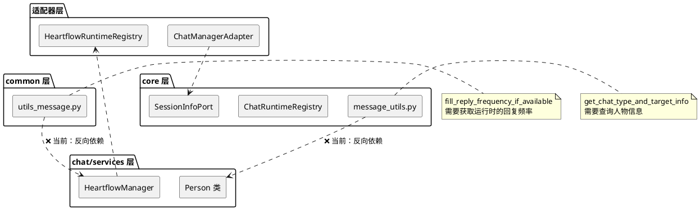
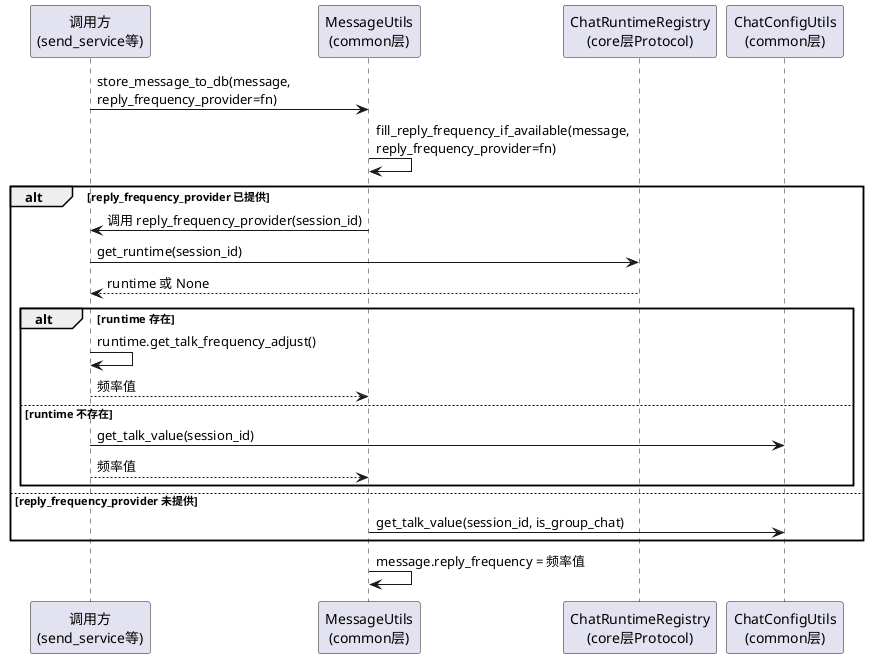
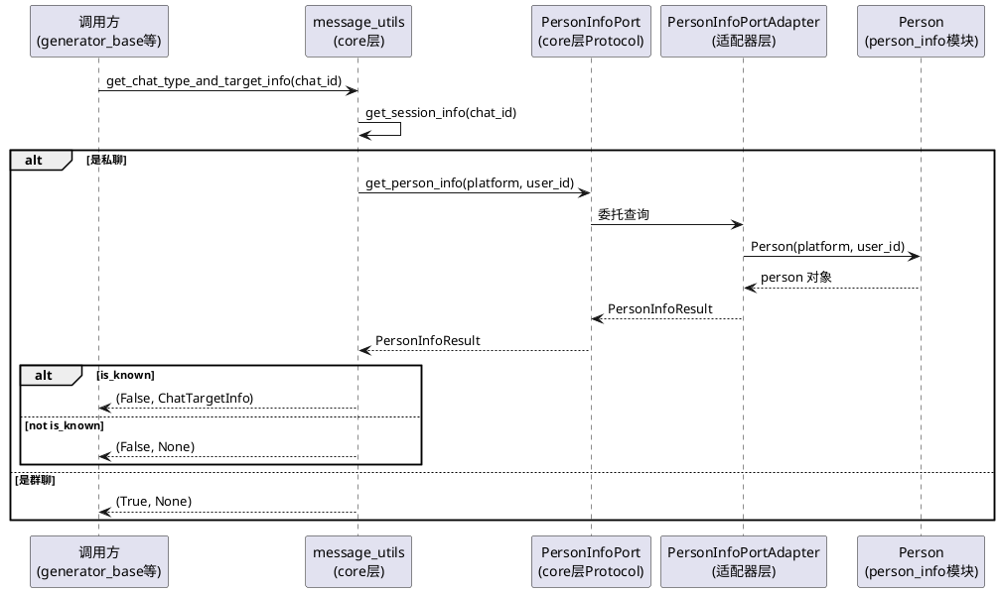

# SSD-9：Common 层架构归正

# 1. 组件定位

## 1.1 核心职责

本组件负责消除 common 层和 core 层对上层模块的反向依赖，确保层级依赖方向严格遵循 common ← core ← chat/services ← webui/plugin。

## 1.2 核心输入

1. **H6 反向依赖现状**：`src/common/utils/utils_message.py` 中 `fill_reply_frequency_if_available` 方法通过函数内导入访问 `src.chat.heart_flow.heartflow_manager.heartflow_manager` 全局单例，获取运行时的生效回复频率
2. **M8 反向依赖现状**：`src/core/message_utils.py` 中 `get_chat_type_and_target_info` 函数导入 `src.person_info.person_info.Person`，而 Person 类又依赖 `src.core.memory_port_registry` 和 `src.core.session_port_registry`，形成 core → person_info → core 的间接循环依赖
3. **已解决的 H6 子项**（M2/M3 快速修复已完成，不在本期范围）：
   - `utils_message.py:39` 的 SessionMessage 导入 → 已改为 `src.common.data_models.session_message_data_model`
   - `system_utils.py:9` 的 is_bot_self 导入 → 已改为 `src.core.identity`
   - `universal_message_sender.py:13` 的 SessionMessage 导入 → 已改为 `src.common.data_models.session_message_data_model`

## 1.3 核心输出

1. **common 层零 chat 层导入**：`utils_message.py` 不再通过任何形式（包括函数内导入）访问 chat 层模块
2. **core 层零 person_info 导入**：`message_utils.py` 不再直接导入 Person 类，通过 Protocol 或参数注入解耦
3. **ruff 守卫**：新增 banned-api 规则，防止反向依赖复发

## 1.4 职责边界

本组件**不负责**以下事项：

1. 不重构 `fill_reply_frequency_if_available` 的业务逻辑——只改变其获取回复频率的方式，不改变计算规则
2. 不重构 `get_chat_type_and_target_info` 的业务逻辑——只改变其获取人物信息的方式，不改变查询逻辑
3. 不迁移 `person_info` 模块本身的位置或架构——person_info 仍然作为独立模块存在
4. 不处理 `person_info` 被其他模块导入的情况（services/chat/maisaka/plugin_runtime 等上层模块导入 person_info 是合法的）
5. 不处理 `maisaka/runtime.py` 和 `maisaka/turn_scheduler.py` 等上层模块对 `_get_effective_reply_frequency` 的调用——这些是同层调用，合法

# 2. 领域术语

**反向依赖**
: 下层模块导入上层模块的代码，违反层级依赖方向。在本项目中，依赖方向应为 common ← core ← chat/services ← webui/plugin。

**函数内导入**
: 在函数体内部使用 `from ... import ...` 语句，而非在模块顶层导入。常用于规避循环导入，但本质仍是反向依赖，只是延迟了导入时机。

**层级依赖方向**
: 代码模块之间的依赖关系方向。common 是最底层的基础设施，不应依赖任何上层；core 是核心接口层，只依赖 common 和自身 Protocol；chat/services 是组件实现层，依赖 common 和 core。

**回复频率**
: 智能体在特定会话中回复消息的概率值（0.0~1.0），由基础频率、会话配置、智能体修正倍率、运行时调整值综合计算得出。

**人物信息查询**
: 根据 platform + user_id 查询用户是否已被认识（is_known）、person_id、person_name 等信息，用于私聊场景下构建聊天目标信息。

# 3. 角色与边界

## 3.1 核心角色

- **消息存储调用方**：调用 `MessageUtils.store_message_to_db` 的上层模块（send_service、uni_message_sender、universal_message_sender 等），需要消息入库时自动补充回复频率
- **聊天类型查询调用方**：调用 `get_chat_type_and_target_info` 的上层模块（generator_base、chat/utils/utils.py re-export），需要判断会话类型和获取私聊对象信息

## 3.2 外部系统

- **HeartflowManager**（chat 层）：当前被 common 层反向依赖的运行时管理器，持有各会话的运行时实例和回复频率信息
- **Person 类**（person_info 模块）：当前被 core 层直接导入的人物信息类，内部依赖 core 层注册点和数据库

## 3.3 交互上下文



# 4. DFX 约束

## 4.1 性能

1. `fill_reply_frequency_if_available` 的替代方案响应时间不得超过当前实现的 2 倍（当前实现为直接内存查找，≤1ms）
2. `get_chat_type_and_target_info` 的替代方案响应时间不得超过当前实现的 2 倍
3. 不得引入新的同步阻塞调用——如果替代方案需要异步操作，必须提供异步接口

## 4.2 可靠性

1. 回复频率补充失败时，行为必须与当前实现一致：记录 debug 日志，不抛出异常，不阻塞消息入库
2. 人物信息查询失败时，行为必须与当前实现一致：记录 warning 日志，返回降级结果（is_known=False 或 None）
3. 替代方案在启动早期（注册点尚未初始化时）必须优雅降级，不得崩溃

## 4.3 安全性

1. 新增 ruff banned-api 守卫，防止反向依赖复发
2. 守卫规则应覆盖函数内导入场景（不仅是顶层导入）

## 4.4 可维护性

1. 替代方案不得引入新的全局单例或新的注册点（除非有充分理由）
2. common 层解耦后不应引入对 core 层 Protocol 注册点的依赖——common 比 core 更底层
3. 如果 common 层需要运行时信息，应通过参数注入而非导入注册点

## 4.5 兼容性

1. `MessageUtils.store_message_to_db` 的外部签名不得变更——所有调用方零修改
2. `MessageUtils.fill_reply_frequency_if_available` 的外部签名不得变更——所有调用方零修改
3. `get_chat_type_and_target_info` 的外部签名不得变更——所有调用方零修改
4. `is_mentioned_bot_in_message` 不受本次变更影响，签名不变

# 5. 核心能力

## 5.1 H6：消除 utils_message.py 对 heartflow_manager 的反向依赖

### 5.1.1 业务规则

**当前问题**：`src/common/utils/utils_message.py` 第 246 行，`fill_reply_frequency_if_available` 方法通过函数内导入访问 `heartflow_manager.heartflow_chat_list`，获取运行时实例并调用其私有方法 `_get_effective_reply_frequency()`。

**具体用法分析**：

```python
# utils_message.py:245-256
from src.chat.heart_flow.heartflow_manager import heartflow_manager
runtime = heartflow_manager.heartflow_chat_list.get(session_id)
if runtime is not None:
    message.reply_frequency = float(runtime._get_effective_reply_frequency())
    return
# 降级：使用 ChatConfigUtils.get_talk_value
```

该方法的逻辑是：
1. 如果消息已有 reply_frequency，跳过
2. 尝试从 heartflow_manager 获取运行时，读取生效回复频率
3. 如果运行时不存在，降级使用 ChatConfigUtils.get_talk_value（纯配置计算，无反向依赖）

**约束**：
1. common 层不得导入 core 层的注册点（如 `get_chat_runtime_registry`）——common 比 core 更底层
2. common 层需要运行时信息时，应通过参数注入
3. `fill_reply_frequency_if_available` 的调用方有 3 处：`store_message_to_db`（同文件）、`universal_message_sender.py`、`uni_message_sender.py`

1. **规则：参数注入替代反向依赖**：`fill_reply_frequency_if_available` 方法必须通过参数接收回复频率获取函数，而非自行导入 heartflow_manager
   a. 验收条件：[调用 `fill_reply_frequency_if_available` 时] → [方法不包含任何 `from src.chat` 导入]
2. **规则：默认降级行为保持不变**：当未提供回复频率获取函数时，方法应降级使用 ChatConfigUtils.get_talk_value（当前已有的降级逻辑）
   a. 验收条件：[不提供频率获取函数 + session_id 对应运行时存在] → [使用 ChatConfigUtils.get_talk_value 计算频率，结果与当前降级路径一致]
3. **规则：调用方注入**：上层调用方（store_message_to_db、universal_message_sender、uni_message_sender）负责注入回复频率获取逻辑，通过 ChatRuntimeRegistry Protocol 获取运行时并读取频率
   a. 验收条件：[store_message_to_db 被调用] → [回复频率通过注入的获取函数计算，不再由 common 层自行访问 heartflow_manager]
4. **禁止项**：common 层不得导入 `src.core.runtime_port_registry` 或任何 core 层注册点
   a. 验收条件：[扫描 `src/common/` 目录] → [零 `from src.core` 导入]

### 5.1.2 交互流程



### 5.1.3 异常场景

1. **注册点未初始化**
   a. 触发条件：ChatRuntimeRegistry 尚未注册，get_runtime 返回 None
   b. 系统行为：调用方降级使用 ChatConfigUtils.get_talk_value
   c. 用户感知：无异常抛出，回复频率使用配置默认值

2. **运行时不存在**
   a. 触发条件：session_id 对应的运行时尚未创建或已销毁
   b. 系统行为：调用方降级使用 ChatConfigUtils.get_talk_value
   c. 用户感知：无异常抛出，回复频率使用配置默认值

3. **频率获取函数抛出异常**
   a. 触发条件：注入的 reply_frequency_provider 执行时抛出异常
   b. 系统行为：fill_reply_frequency_if_available 捕获异常，记录 debug 日志，不设置 reply_frequency
   c. 用户感知：消息正常入库，reply_frequency 字段为空

## 5.2 M8：消除 core/message_utils.py 对 person_info 的反向依赖

### 5.2.1 业务规则

**当前问题**：`src/core/message_utils.py` 第 26 行，`get_chat_type_and_target_info` 函数导入 `src.person_info.person_info.Person`，而 Person 类又依赖 `src.core.memory_port_registry` 和 `src.core.session_port_registry`，形成 core → person_info → core 的间接循环依赖。

**具体用法分析**：

```python
# core/message_utils.py:266-279
person = Person(platform=platform, user_id=user_id)
if not person.is_known:
    logger.warning(f"用户 {user_nickname} 尚未认识")
    return False, None
target_info.is_known = True
if person.person_id:
    target_info.person_id = person.person_id
    target_info.person_name = person.person_name
```

该函数仅使用了 Person 类的 3 个属性：
- `is_known`：用户是否已被认识
- `person_id`：人物唯一 ID
- `person_name`：人物名称

**person_info 的依赖链**：
- `src.core.memory_port_registry.get_memory_service_port` — core 层注册点
- `src.core.session_port_registry.get_session_info` — core 层注册点
- `src.common.database.database.get_db_session` — common 层（合法）
- `src.config.config.global_config` — 配置层（合法）

core → person_info → core 的循环依赖虽然不会导致运行时导入错误（因为 person_info 使用的是函数内导入或模块级导入的注册点函数），但违反了架构原则：core 层不应依赖一个又反向依赖 core 的模块。

**约束**：
1. core 层对人物信息的查询应通过 Protocol 接口或参数注入，不直接导入 Person 类
2. `get_chat_type_and_target_info` 的外部签名不得变更
3. Person 类的 is_known/person_id/person_name 查询本质是数据库查询，可以抽象为 Protocol

1. **规则：Protocol 接口抽象**：在 core 层定义 PersonInfoPort Protocol，提供 `get_person_info(platform, user_id)` 方法，返回包含 is_known/person_id/person_name 的数据对象
   a. 验收条件：[core/message_utils.py 调用 get_person_info] → [不包含任何 `from src.person_info` 导入]
2. **规则：适配器实现**：在适配器层实现 PersonInfoPort，内部委托 Person 类完成查询
   a. 验收条件：[PersonInfoPort 适配器内部] → [导入 Person 类并调用，core 层无感知]
3. **规则：注册点注册**：在启动流程中注册 PersonInfoPort 适配器实例
   a. 验收条件：[系统启动后] → [get_person_info_port() 返回有效实例]
4. **规则：降级行为**：PersonInfoPort 未注册或查询失败时，get_chat_type_and_target_info 应返回与当前一致的降级结果
   a. 验收条件：[PersonInfoPort 未注册] → [get_chat_type_and_target_info 返回 (False, None)]
5. **禁止项**：core 层不得直接导入 `src.person_info.person_info`
   a. 验收条件：[扫描 `src/core/` 目录] → [零 `from src.person_info` 导入]

### 5.2.2 交互流程



### 5.2.3 异常场景

1. **PersonInfoPort 未注册**
   a. 触发条件：启动早期或测试环境，PersonInfoPort 尚未注册
   b. 系统行为：get_chat_type_and_target_info 检测到端口不可用，返回 (False, None)
   c. 用户感知：私聊场景下无法获取人物信息，回复可能缺少人物上下文

2. **Person 查询抛出异常**
   a. 触发条件：Person 初始化时数据库查询失败
   b. 系统行为：适配器层捕获异常，返回 is_known=False 的默认结果
   c. 用户感知：与当前行为一致——日志记录 warning，返回降级结果

3. **PersonInfoResult 数据不完整**
   a. 触发条件：person_id 或 person_name 为空
   b. 系统行为：ChatTargetInfo 中对应字段为 None，与当前行为一致
   c. 用户感知：人物信息部分缺失，但不影响消息处理

# 6. 数据约束

## 6.1 ReplyFrequencyProvider

回复频率获取函数的类型约束：

1. **签名**：`Callable[[], float]` — 无参数，返回回复频率值
2. **返回值范围**：0.0 ~ 1.0（含边界）
3. **异常处理**：调用方应捕获异常并降级，provider 本身可以抛出异常
4. **可选性**：可为 None，表示使用默认降级逻辑（ChatConfigUtils.get_talk_value）

## 6.2 PersonInfoResult

人物信息查询结果的数据约束：

1. **is_known**：必填，bool 类型，表示用户是否已被认识
2. **person_id**：可选，str 类型，人物唯一 ID（is_known=True 时应有值）
3. **person_name**：可选，str 类型，人物名称（is_known=True 时应有值）
4. **不可变性**：应为不可变数据对象（dataclass 或 NamedTuple），防止调用方修改

## 6.3 PersonInfoPort Protocol

1. **get_person_info**：接收 platform + user_id，返回 PersonInfoResult 或 None
2. **纯查询接口**：不包含修改操作（注册/更新人物信息不属于 core 层职责）
3. **同步方法**：Person 类的查询是同步数据库操作，Protocol 方法签名应为同步

## 6.4 ChatTargetInfo

现有数据对象，本次变更不修改其结构：

1. **platform**：str，平台标识
2. **user_id**：str，用户 ID
3. **session_nickname**：str，会话昵称
4. **person_id**：Optional[str]，人物 ID
5. **person_name**：Optional[str]，人物名称
6. **is_known**：bool，用户是否已被认识