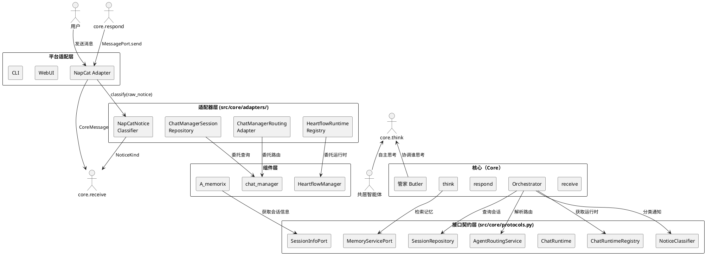
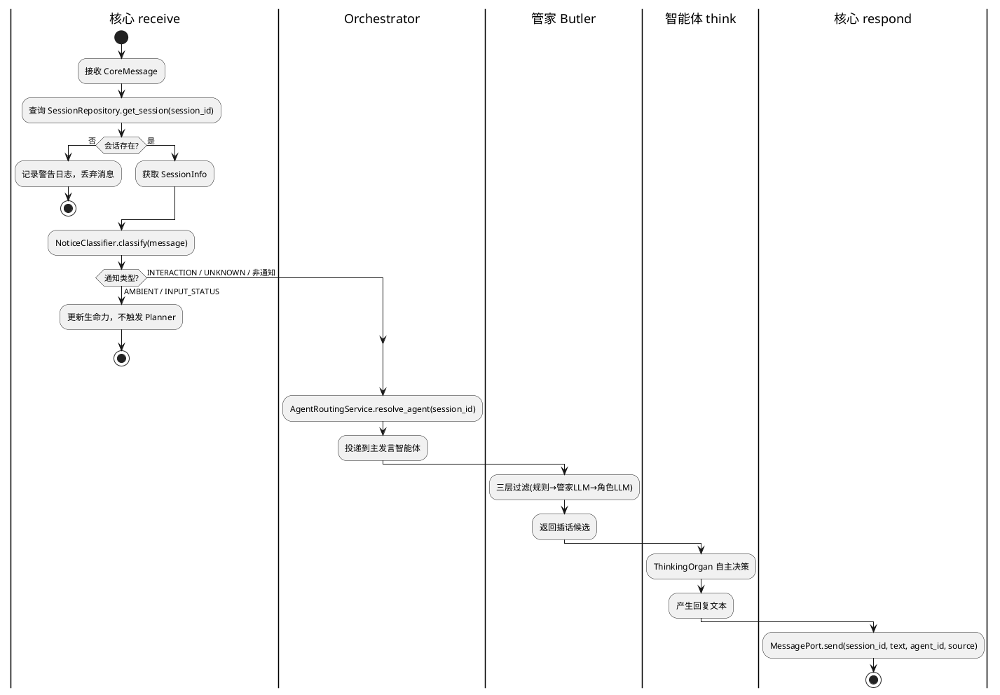
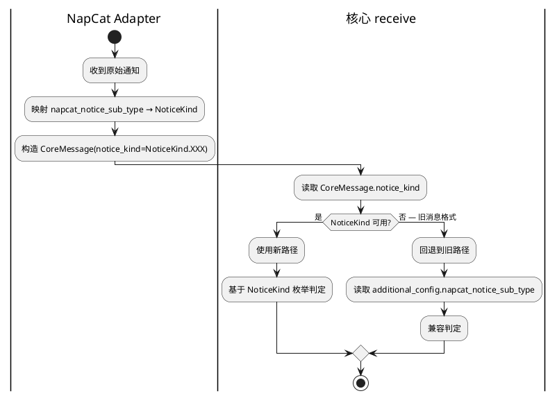
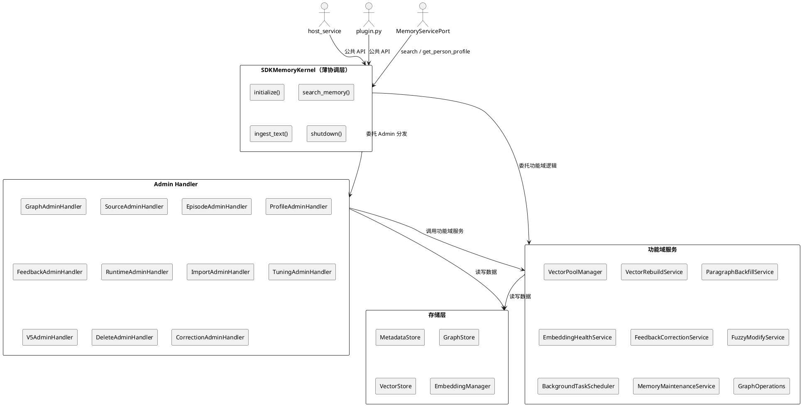
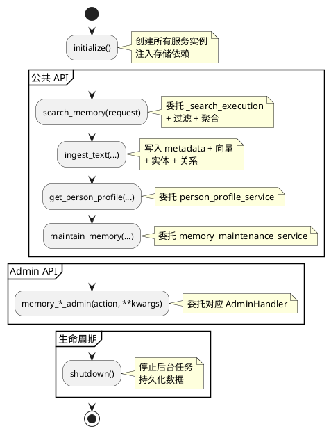
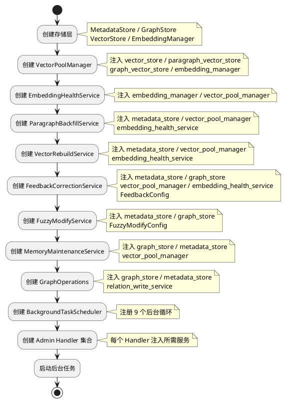
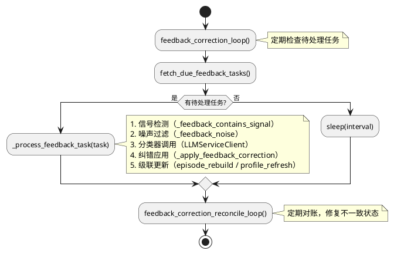

# MaiBot 核心架构变革 — 实现方案

# 一、需求与存量功能关系分析

## 1.1 需求功能与存量功能对比

### 1.1.1 已实现功能

| 需求功能 | 存量功能 | 代码位置 | 匹配度 |
|---------|---------|---------|--------|
| MessagePort 发送接口 | `MessagePort` Protocol + `SendServicePort` 实现 | `src/maisaka/message_port.py` | 100% |
| 管家三层过滤 | `Butler._rule_filter` + `Butler._llm_filter` + 角色LLM | `src/maisaka/agent_autonomy/butler.py:113-232` | 100% |
| 提醒管理 | `ReminderManager` + `ReminderStore` | `src/maisaka/agent_autonomy/reminder.py` | 100% |
| 智能体思维器官 | `ThinkingOrgan` + `EmbodiedPlannerPromptBuilder` | `src/maisaka/agent_autonomy/thinking_organ.py` | 90% |
| 内在需求引擎 | `InnerNeedEngine` + 三种计算器 | `src/maisaka/agent_autonomy/inner_need.py` | 100% |
| 生命力管理 | `VitalityManager` + `StandbyAgentRegistry` | `src/maisaka/agent_autonomy/vitality_manager.py` | 90% |
| 智能体配置注册表 | `AgentConfigRegistry` + `AgentConfig` | `src/maisaka/agent/registry.py`, `config.py` | 100% |
| 智能体路由 | `AgentRouter` (bind/unbind/resolve) | `src/maisaka/agent/router.py` | 75% |
| 多智能体编排 | `AgentOrchestrator` + 编排策略 | `src/maisaka/agent_autonomy/orchestrator.py` | 75% |
| 对话循环适配器 | `ChatLoopServiceAdapter` | `src/maisaka/agent_autonomy/bridge/chat_loop_adapter.py` | 50% |
| 核心消息模型 | `MaiMessages` | `src/core/types.py` | 25% |

### 1.1.2 需要扩展的功能

| 需求功能 | 存量功能 | 差异说明 | 扩展方向 |
|---------|---------|---------|---------|
| SessionRepository Protocol | `chat_manager.get_session_by_session_id()` | 返回可变 `BotChatSession` 引用，核心模块直接依赖 chat_manager 单例 | 定义 `SessionRepository` Protocol，返回不可变 `SessionInfo` 数据类，由 `ChatManagerSessionRepository` 适配器实现 |
| AgentRoutingService Protocol | `chat_manager._agent_router` | 核心直接访问 chat_manager 的私有属性 `_agent_router`，暴露可变内部状态 | 定义 `AgentRoutingService` Protocol，由 `ChatManagerRoutingAdapter` 适配器包装 `AgentRouter` |
| ChatRuntime Protocol | `MaisakaHeartFlowChatting` 具体类 | HeartflowManager 直接导入具体类，形成循环依赖；`ChatLoopServiceAdapter` 也导入具体类 | 定义 `ChatRuntime` Protocol 提取运行时接口，`MaisakaHeartFlowChatting` 实现此 Protocol |
| NoticeClassification | `AMBIENT_NOTICE_SUBTYPES` 硬编码 + `napcat_notice_sub_type` 字段 | 通知分类逻辑在 `orchestrator.py:476-500` 和 `runtime.py:1225-1244` 各定义一份，且直接读取 NapCat 平台字段 | 定义 `NoticeKind` 枚举 + `NoticeClassifier` Protocol，NapCat Adapter 负责映射，核心只处理枚举值 |
| ThinkingOrgan 接口化 | `ThinkingOrgan` 类 | 当前是具体类而非 Protocol，Orchestrator 直接依赖具体实现；`enqueue_proactive_task` 伪装多智能体插话 | 将 ThinkingOrgan 的核心方法提取为 Protocol，Orchestrator 依赖 Protocol；插话直接触发目标智能体的 ThinkingOrgan |
| MessagePort 多类型消息 | `MessagePort.send` 仅支持文本 | 缺少图片、表情、语音等消息类型支持 | 扩展 `MessagePort` 接口，增加 `send_image` 等方法，保持 `send` 向后兼容 |
| MemoryServicePort | `person_profile.py` 直接导入 `A_memorix.core.utils.profile_text` | 核心模块绕过接口直接访问 A_memorix 内部函数 | 定义 `MemoryServicePort` Protocol，A_memorix 实现此接口，核心通过接口调用 |
| CoreMessage 平台无关消息 | `MaiMessages` | 当前 `MaiMessages` 包含 `llm_prompt`、`llm_response_content` 等核心不应关心的字段，且缺少 `notice_kind` | 定义新的 `CoreMessage` 数据类，只包含核心关心的字段 |

### 1.1.3 需要新增的功能或接口

**核心接口层** (`src/core/protocols.py`)：
- `SessionRepository` Protocol — 会话查询接口
- `AgentRoutingService` Protocol — 智能体路由接口
- `ChatRuntime` Protocol — 运行时接口
- `ChatRuntimeRegistry` Protocol — 运行时注册表接口
- `NoticeClassifier` Protocol — 通知分类接口
- `MemoryServicePort` Protocol — 记忆服务接口
- `SessionInfoPort` Protocol — 会话信息查询接口（供 A_memorix 反向调用）

**核心数据模型** (`src/core/types.py` 扩展)：
- `CoreMessage` — 平台无关的核心消息
- `SessionInfo` — 不可变会话快照
- `NoticeKind` — 平台无关通知枚举
- `AgentConfig` — 智能体配置（从 `maisaka/agent/config.py` 提取公共子集）

**适配器层** (`src/core/adapters/`)：
- `ChatManagerSessionRepository` — SessionRepository 的 chat_manager 适配器
- `ChatManagerRoutingAdapter` — AgentRoutingService 的 chat_manager 适配器
- `HeartflowRuntimeRegistry` — ChatRuntimeRegistry 的 heartflow_manager 适配器
- `NapCatNoticeClassifier` — NoticeClassifier 的 NapCat 适配器

**CycleDetail 迁移**：
- 将 `CycleDetail` 从 `src/chat/heart_flow/heartFC_utils.py` 迁移到 `src/core/types.py`

## 1.2 存量功能详细分析

### 1.2.1 MessagePort（已实现，匹配度 100%）

- **接口契约**：`send(session_id, text, *, agent_id, source) -> bool`
- **实现**：`SendServicePort` 延迟导入 `send_service.text_to_stream`，全局单例 `get_message_port()` / `set_message_port()`
- **业务规则**：发送失败返回 False 并记录错误日志，不重试
- **扩展点**：`set_message_port()` 允许替换实现（测试/新平台）
- **约束**：当前仅支持纯文本消息，需扩展多类型消息支持

### 1.2.2 AgentRouter（已实现，匹配度 75%）

- **接口契约**：`resolve_agent(session_id, group_id?) -> AgentConfig`、`bind_session(session_id, agent_id)`、`unbind_session(session_id, agent_id?)`、`get_session_primary_agent(session_id) -> str?`、`get_session_all_agents(session_id) -> set[str]`
- **业务规则**：解析优先级：会话绑定(主发言) → 群配置绑定 → 默认智能体；支持多智能体共居
- **约束**：当前核心模块直接访问 `chat_manager._agent_router` 或 `chat_manager.agent_router`，暴露了内部可变状态。需要通过 `AgentRoutingService` Protocol 隔离

### 1.2.3 AgentOrchestrator（已实现，匹配度 75%）

- **接口契约**：`handle_message(message)`、`activate_agent(agent_id, reason)`、`deactivate_agent(agent_id, reason)`、`switch_primary_speaker(target_agent_id, reason)`
- **业务规则**：只协调执行顺序，不替智能体做决策；管家三层过滤独立于 Planner
- **关键问题**：
  1. `activate_agent()` 内直接 `from src.chat.message_receive.chat_manager import chat_manager` 访问 `chat_manager.agent_router.bind_session()`（行346-348）
  2. `deactivate_agent()` 内直接访问 `chat_manager.agent_router.unbind_session()`（行406-408）
  3. `_classify_notice()` 直接用 `getattr` 链式访问 `napcat_notice_sub_type`（行486-500）
  4. `_trigger_interjection_for()` 通过 `enqueue_proactive_task` 伪装多智能体插话（行231-236）
- **约束**：必须通过 `AgentRoutingService` 和 `NoticeClassifier` 接口替换上述直接依赖

### 1.2.4 ChatLoopServiceAdapter（已实现，匹配度 50%）

- **接口契约**：`switch_agent_context(agent_id)`、`enqueue_proactive_task(plugin_id, intent, reason, metadata)`、`get_prompt_template_name()`
- **关键问题**：
  1. `enqueue_proactive_task()` 内 `from src.maisaka.runtime import MaisakaHeartFlowChatting`（行90），直接依赖具体类
  2. `switch_agent_context()` 直接修改 `self._chat_loop_service._agent_id`（行33），访问私有属性
- **约束**：必须通过 `ChatRuntime` Protocol 替换对 `MaisakaHeartFlowChatting` 的直接依赖

### 1.2.5 VitalityManager（已实现，匹配度 90%）

- **接口契约**：`sync_standby_agents(session_id)`、`add_to_standby(agent_id, session_id, reason)`、`update_vitality(agent_id, session_id, delta, reason)`、`evaluate_vitality_tick()`、`get_cohabitation_params(session_id)`
- **关键问题**：
  1. `sync_standby_agents()` 直接 `from src.chat.message_receive.chat_manager import chat_manager`（行89）
  2. `get_cohabitation_params()` 直接访问 `chat_manager.agent_router`（行340）
- **约束**：必须通过 `AgentRoutingService` 替换对 `chat_manager` 的直接依赖

### 1.2.6 HeartflowManager（循环依赖核心）

- **接口契约**：`get_or_create_heartflow_chat(session_id) -> MaisakaHeartFlowChatting`、`adjust_talk_frequency(session_id, frequency)`
- **关键问题**：
  1. 直接 `from src.chat.message_receive.chat_manager import chat_manager`（行8）
  2. 直接 `from src.maisaka.runtime import MaisakaHeartFlowChatting`（行10）
  3. `heartflow_chat_list` 类型为 `OrderedDict[str, MaisakaHeartFlowChatting]`，暴露具体类
- **约束**：必须通过 `ChatRuntimeRegistry` Protocol + `ChatRuntime` Protocol 打破循环依赖

### 1.2.7 通知分类（重复定义 + 平台耦合）

- **存量位置1**：`orchestrator.py:476-500` — `AMBIENT_NOTICE_SUBTYPES` + `_classify_notice()`，使用 `getattr` 链式访问 `napcat_notice_sub_type`
- **存量位置2**：`runtime.py:1225-1244` — `_AMBIENT_NOTICE_SUBTYPES` + `_is_ambient_notice()`，使用 `additional_config.get("napcat_notice_sub_type", "")`
- **问题**：同一份通知子类型集合定义了两次（DRY 违反），且都直接读取 NapCat 平台字段
- **约束**：必须统一定义 `NoticeKind` 枚举 + `AMBIENT_NOTICE_SUBTYPES`，NapCat Adapter 负责映射

### 1.2.8 A_memorix 耦合

- **正向泄漏**：`maisaka/memory/person_profile.py:9` 直接 `from src.A_memorix.core.utils.profile_text import build_profile_injection_text`
- **反向依赖**：`A_memorix/core/runtime/sdk_memory_kernel.py:17` 直接 `from src.chat.message_receive.chat_manager import chat_manager`
- **约束**：正向通过 `MemoryServicePort` Protocol 隔离；反向通过 `SessionInfoPort` Protocol 隔离

# 二、增量设计方案

## 2.1 实现模型

### 2.1.1 上下文视图



### 2.1.2 服务/组件总体架构

```plantuml
@startuml
skinparam componentStyle rectangle

package "src/core/" {
    component "protocols.py" as proto {
        note: SessionRepository\nAgentRoutingService\nChatRuntime\nChatRuntimeRegistry\nNoticeClassifier\nMemoryServicePort\nSessionInfoPort
    }
    component "types.py" as types {
        note: CoreMessage\nSessionInfo\nNoticeKind\nAgentConfig\nCycleDetail
    }
    component "adapters/" as adapt {
        component "session_repository.py" as a_sr
        component "routing_adapter.py" as a_ra
        component "runtime_registry.py" as a_rr
        component "notice_classifier.py" as a_nc
    }
}

package "src/maisaka/agent_autonomy/" {
    component "orchestrator.py" as orch
    component "butler.py" as butler
    component "agent.py" as agent
    component "thinking_organ.py" as think
    component "vitality_manager.py" as vm
    component "inner_need.py" as ine
    component "reminder.py" as rem
}

package "src/maisaka/" {
    component "message_port.py" as mp
    component "runtime.py" as runtime
    component "chat_loop_service.py" as cls
}

package "src/chat/" {
    component "chat_manager.py" as cm
    component "heart_flow/" as hf
}

package "src/A_memorix/" {
    component "host_service.py" as memo
}

orch --> proto : 依赖 Protocol
orch --> mp : MessagePort
butler --> mp : MessagePort
vm --> proto : AgentRoutingService
runtime --> proto : ChatRuntime
hf --> proto : ChatRuntimeRegistry
a_sr --> cm : 委托
a_ra --> cm : 委托
a_rr --> hf : 委托
memo --> proto : SessionInfoPort

@enduml
```

### 2.1.3 实现设计文档

#### 核心管道流程



#### 迁移双模式流程（NoticeClassification）



## 2.2 接口设计

### 2.2.1 总体设计

接口分类依据：按核心与组件的交互方向分为三类——

| 接口类别 | 接口名称 | 稳定性 | 用途 |
|---------|---------|--------|------|
| 核心→组件查询 | `SessionRepository` | 稳定 | 核心查询会话信息 |
| 核心→组件查询 | `AgentRoutingService` | 稳定 | 核心解析智能体路由 |
| 核心→组件查询 | `ChatRuntimeRegistry` | 稳定 | 核心获取运行时实例 |
| 核心→组件发送 | `MessagePort` | 稳定 | 核心发送消息 |
| 核心→组件查询 | `NoticeClassifier` | 稳定 | 核心分类通知消息 |
| 核心→组件查询 | `MemoryServicePort` | 稳定 | 核心检索记忆 |
| 组件→核心查询 | `SessionInfoPort` | 稳定 | 组件反向查询会话信息 |
| 运行时契约 | `ChatRuntime` | 实验 | 运行时实例的方法契约 |

接口变更策略：
- 所有 Protocol 使用 `@runtime_checkable` 装饰器，支持运行时类型检查
- Protocol 方法只增不改，新增方法提供默认实现
- 适配器层是唯一允许导入组件具体类的地方

### 2.2.2 接口清单

#### SessionRepository

```python
@runtime_checkable
class SessionRepository(Protocol):
    """会话查询接口 — 核心通过此接口查询会话信息，不直接依赖 chat_manager。"""

    async def get_session(self, session_id: str) -> Optional[SessionInfo]:
        """查询会话信息，返回不可变快照。

        Args:
            session_id: 会话 ID

        Returns:
            SessionInfo 快照，不存在时返回 None
        """

    async def get_session_name(self, session_id: str) -> str:
        """查询会话展示名称。

        Args:
            session_id: 会话 ID

        Returns:
            群名称或 "xxx的私聊"，不存在时返回 session_id 本身
        """
```

**业务说明**：替代核心模块对 `chat_manager.get_session_by_session_id()` 和 `chat_manager.get_session_name()` 的直接调用。

**前置条件**：`chat_manager` 已初始化。

**后置条件**：返回的 `SessionInfo` 是不可变快照，修改不影响内部状态。

**异常映射**：底层存储不可用时抛出 `SessionRepositoryError`。

#### AgentRoutingService

```python
@runtime_checkable
class AgentRoutingService(Protocol):
    """智能体路由接口 — 核心通过此接口解析会话应使用的智能体。"""

    def resolve_agent(self, session_id: str, group_id: Optional[str] = None) -> AgentConfig:
        """解析会话应使用的智能体。

        Args:
            session_id: 会话 ID
            group_id: 群 ID（可选）

        Returns:
            AgentConfig，解析失败时返回默认智能体
        """

    def bind_session(self, session_id: str, agent_id: str) -> bool:
        """绑定会话到指定智能体。

        Args:
            session_id: 会话 ID
            agent_id: 智能体 ID

        Returns:
            绑定是否成功（智能体不存在或达到上限时返回 False）
        """

    def unbind_session(self, session_id: str, agent_id: Optional[str] = None) -> None:
        """解除会话的智能体绑定。

        Args:
            session_id: 会话 ID
            agent_id: 智能体 ID，None 时清除该会话所有绑定
        """

    def get_primary_agent(self, session_id: str) -> Optional[str]:
        """获取会话的主发言智能体 ID。

        Args:
            session_id: 会话 ID

        Returns:
            主发言智能体 ID，不存在时返回 None
        """

    def get_session_all_agents(self, session_id: str) -> frozenset[str]:
        """获取会话绑定的所有智能体 ID（不可变集合）。

        Args:
            session_id: 会话 ID

        Returns:
            不可变的智能体 ID 集合
        """
```

**业务说明**：替代核心模块对 `chat_manager._agent_router` 和 `chat_manager.agent_router` 的直接访问。

**前置条件**：`AgentRouter` 已初始化。

**后置条件**：`bind_session` 成功后，`resolve_agent` 返回新绑定的智能体。

**异常映射**：智能体不存在时 `bind_session` 返回 False（不抛异常）。

#### ChatRuntime

```python
@runtime_checkable
class ChatRuntime(Protocol):
    """运行时接口 — 打破 HeartFlow ↔ Maisaka 循环依赖。"""

    @property
    def session_id(self) -> str:
        """运行时所属会话 ID。"""

    @property
    def session_name(self) -> str:
        """运行时所属会话展示名称。"""

    async def enqueue_proactive_task(
        self,
        *,
        plugin_id: str,
        intent: str,
        reason: str = "",
        metadata: Optional[dict[str, Any]] = None,
    ) -> Optional[dict[str, Any]]:
        """触发主动对话任务（仅用于插件主动对话，禁止用于多智能体插话）。

        Args:
            plugin_id: 触发来源标识
            intent: 触发意图描述
            reason: 触发原因
            metadata: 附加元数据

        Returns:
            任务执行结果，失败时返回 None
        """

    async def start(self) -> None:
        """启动运行时。"""

    async def stop(self) -> None:
        """停止运行时。"""
```

**业务说明**：从 `MaisakaHeartFlowChatting` 提取核心方法，`HeartflowManager` 和 `ChatLoopServiceAdapter` 只依赖此 Protocol。

**设计约束**：`enqueue_proactive_task` 仅用于插件主动对话场景。多智能体插话和提醒必须通过 ThinkingOrgan 触发，禁止走此方法伪装成"插件主动对话"。

#### ChatRuntimeRegistry

```python
@runtime_checkable
class ChatRuntimeRegistry(Protocol):
    """运行时注册表接口 — 核心通过此接口查询运行时实例。"""

    async def get_runtime(self, session_id: str) -> Optional[ChatRuntime]:
        """获取指定会话的运行时实例。

        Args:
            session_id: 会话 ID

        Returns:
            ChatRuntime 实例，不存在时返回 None
        """

    async def get_or_create_runtime(self, session_id: str) -> ChatRuntime:
        """获取或创建指定会话的运行时实例。

        Args:
            session_id: 会话 ID

        Returns:
            ChatRuntime 实例

        Raises:
            RuntimeCreationError: 创建失败时抛出
        """
```

#### NoticeClassifier

```python
@runtime_checkable
class NoticeClassifier(Protocol):
    """通知分类接口 — 平台无关的通知分类机制。"""

    def classify(self, message: Any) -> NoticeKind:
        """分类通知消息。

        Args:
            message: 原始消息对象（平台特定）

        Returns:
            NoticeKind 枚举值，非通知消息返回 NoticeKind.UNKNOWN
        """
```

**业务说明**：NapCat Adapter 实现 `NoticeClassifier`，将 `napcat_notice_sub_type` 映射为 `NoticeKind` 枚举。核心只处理枚举值，不读取平台字段。

#### MemoryServicePort

```python
@runtime_checkable
class MemoryServicePort(Protocol):
    """记忆服务接口 — 核心通过此接口访问 A_memorix。"""

    async def search(self, query: str, session_id: str, *, limit: int = 5) -> list[dict[str, Any]]:
        """检索记忆。

        Args:
            query: 检索查询
            session_id: 会话 ID
            limit: 返回结果上限

        Returns:
            记忆结果列表
        """

    async def get_person_profile(self, person_id: str, *, limit: int = 4) -> Optional[dict[str, Any]]:
        """查询人物画像。

        Args:
            person_id: 人物 ID
            limit: 返回段落数上限

        Returns:
            画像数据字典，不存在时返回 None
        """

    async def build_profile_injection_text(self, raw_text: str) -> str:
        """构建画像注入文本。

        Args:
            raw_text: 原始画像文本

        Returns:
            格式化后的注入文本
        """
```

**业务说明**：替代 `maisaka/memory/person_profile.py` 对 `A_memorix.core.utils.profile_text.build_profile_injection_text` 的直接导入。

#### SessionInfoPort

```python
@runtime_checkable
class SessionInfoPort(Protocol):
    """会话信息查询接口 — 供组件反向查询会话信息。"""

    def get_session_info(self, session_id: str) -> Optional[SessionInfo]:
        """查询会话信息。

        Args:
            session_id: 会话 ID

        Returns:
            SessionInfo 快照，不存在时返回 None
        """
```

**业务说明**：供 `A_memorix` 的 `SDKMemoryKernel` 反向查询会话信息，替代其对 `chat_manager` 的直接导入。

#### ThinkingOrgan（架构变革核心）

```python
@runtime_checkable
class ThinkingOrgan(Protocol):
    """思维管道接口 — 每个智能体拥有自己的思维管道。

    Orchestrator 只协调"谁在思考"，不关心"怎么思考"。
    这是 Agent-owns-Thinking 架构的核心接口。
    """

    @property
    def agent_id(self) -> str:
        """所属智能体 ID。"""

    @property
    def is_degraded(self) -> bool:
        """是否降级（提示词构建失败等）。"""

    async def think(self, context: ThinkContext) -> ThinkResult:
        """执行一次思考。

        Args:
            context: 思考上下文（消息、内心状态、记忆片段）

        Returns:
            思考结果（回复文本、工具调用、或不回复）
        """

    async def think_proactive(self, reason: str, context: ThinkContext) -> ThinkResult:
        """执行一次主动思考（无外部消息触发）。

        Args:
            reason: 主动思考原因（欲望/提醒/管家协调）
            context: 思考上下文

        Returns:
            思考结果
        """
```

**业务说明**：这是整个架构变革的核心接口。当前所有智能体共享一个 Planner，通过切换 `_agent_id` 模拟多智能体。ThinkingOrgan 让每个智能体拥有独立的思维管道，Orchestrator 通过 `agent.think(context)` 触发思考，不再需要 `enqueue_proactive_task` 伪装。

**与现有 ThinkingOrgan 类的关系**：`src/maisaka/agent_autonomy/thinking_organ.py` 中已有 `ThinkingOrgan` 具体类，实现了 90% 的功能。此 Protocol 从中提取核心方法签名，具体类继续作为实现。

**前置条件**：智能体已激活（在 `_active_agents` 中），LLM 服务可用。

**后置条件**：思考完成后，`ThinkResult` 包含回复文本或工具调用，Orchestrator 通过 MessagePort 发送。

**异常映射**：LLM 调用失败时 `ThinkResult.action = ThinkAction.ERROR`，包含错误信息。

#### ThinkContext

```python
@dataclass(frozen=True, slots=True)
class ThinkContext:
    """思考上下文 — 智能体思考时需要的所有输入。"""

    messages: tuple[CoreMessage, ...]
    """待处理的消息序列（不可变）"""

    emotion_state_text: str = ""
    """当前情绪状态描述（自然语言）"""

    relationship_text: str = ""
    """当前关系描述（自然语言）"""

    memory_snippets: tuple[str, ...] = ()
    """记忆片段（不可变）"""

    cohabitant_summary: str = ""
    """共居智能体状态摘要（自然语言）"""

    trigger_reason: str = ""
    """触发思考的原因（user_message / inner_need / butler_interjection / reminder）"""

    metadata: dict[str, Any] = field(default_factory=dict)
    """附加元数据"""
```

**设计决策**：为什么 ThinkContext 是不可变数据类？
- 思考过程不应修改上下文，上下文是"输入"不是"状态"
- 不可变性保证并行思考时各智能体看到一致的上下文快照
- 与 SessionInfo 的不可变原则一致

#### ThinkResult

```python
class ThinkAction(Enum):
    """思考动作类型。"""
    REPLY = "reply"
    TOOL_CALL = "tool_call"
    SILENT = "silent"
    ERROR = "error"

@dataclass(slots=True)
class ThinkResult:
    """思考结果 — 智能体思考后产生的输出。"""

    action: ThinkAction = ThinkAction.SILENT
    """思考动作类型"""

    text: str = ""
    """回复文本（action=REPLY 时有值）"""

    tool_calls: list[dict[str, Any]] = field(default_factory=list)
    """工具调用（action=TOOL_CALL 时有值）"""

    emotion_type: str = ""
    """情绪类型（用于情绪感染）"""

    emotion_intensity: float = 0.0
    """情绪强度"""

    error_message: str = ""
    """错误信息（action=ERROR 时有值）"""

    thinking_time_ms: int = 0
    """思考耗时（毫秒）"""
```

**设计决策**：为什么 ThinkResult 是可变数据类？
- 思考结果是"输出"，由 ThinkingOrgan 产生，不需要不可变性
- `tool_calls` 列表在工具执行过程中可能追加结果

#### ThinkingOrganFactory

```python
@runtime_checkable
class ThinkingOrganFactory(Protocol):
    """思维管道工厂 — 为智能体创建 ThinkingOrgan 实例。"""

    def create(self, agent_id: str, session_id: str) -> ThinkingOrgan:
        """为指定智能体创建思维管道。

        Args:
            agent_id: 智能体 ID
            session_id: 会话 ID

        Returns:
            ThinkingOrgan 实例
        """
```

**业务说明**：Orchestrator 激活智能体时，通过工厂创建 ThinkingOrgan。工厂封装了 ThinkingOrgan 的创建细节（LLM 客户端、提示词构建器、记忆注入器等），Orchestrator 不关心这些。

**与现有代码的关系**：`AutonomousAgent` 类已有 `thinking_organ` 属性。工厂模式将创建逻辑从 `AutonomousAgent.__init__` 中提取出来，支持依赖注入。

#### ParallelThinkScheduler

```python
class ParallelThinkScheduler:
    """并行思考调度器 — 管理多个智能体的并行思考。"""

    def __init__(self, max_concurrent: int = 2) -> None:
        self._semaphore = asyncio.Semaphore(max_concurrent)
        self._pending: dict[str, asyncio.Task[ThinkResult]] = {}

    async def schedule(
        self,
        agent_id: str,
        organ: ThinkingOrgan,
        context: ThinkContext,
    ) -> asyncio.Task[ThinkResult]:
        """调度一次思考（可能并行执行）。

        Returns:
            思考结果的 asyncio.Task，可 await 获取结果
        """

    async def wait_all(self) -> dict[str, ThinkResult]:
        """等待所有待处理思考完成，返回 agent_id → ThinkResult 映射。"""

    def cancel(self, agent_id: str) -> None:
        """取消指定智能体的待处理思考。"""
```

**设计决策**：为什么用 asyncio.Semaphore 而不是线程池？
- LLM 调用是 I/O 密集型（等待 API 响应），asyncio 天然适合
- Semaphore 控制并发数，避免同时发起过多 LLM 请求
- 与现有 Maisaka 的异步架构一致

**并行思考流程**：
```
用户消息 → Orchestrator
              ├── 主智能体.think(context) → Task A
              ├── 管家决策：智能体B应插话
              │   └── 智能体B.think(context) → Task B
              └── 等待所有 Task 完成
                  ├── Task A 完成 → MessagePort.send(回复)
                  └── Task B 完成 → MessagePort.send(插话)
```

## 2.3 数据模型

### 2.3.1 设计目标

1. **核心消息模型**：定义平台无关的 `CoreMessage`，核心只关心消息进来、智能体思考、回复出去
2. **不可变快照**：`SessionInfo` 返回不可变数据类，外部修改不影响内部状态
3. **平台无关枚举**：`NoticeKind` 枚举替代 `napcat_notice_sub_type` 硬编码
4. **存量兼容**：`CycleDetail` 迁移到公共模块，Maisaka 和 HeartFlow 都从公共模块导入
5. **AgentConfig 公共子集**：核心接口使用的 `AgentConfig` 只包含核心关心的字段

### 2.3.2 模型实现

#### CoreMessage

```python
@dataclass(frozen=True, slots=True)
class CoreMessage:
    """平台无关的核心消息 — 核心只关心这些字段。"""

    session_id: str
    """消息所属会话 ID"""

    plain_text: str
    """消息纯文本内容"""

    is_notify: bool
    """是否为通知消息"""

    notice_kind: NoticeKind = NoticeKind.UNKNOWN
    """通知分类（仅 is_notify=True 时有意义）"""

    sender_id: str = ""
    """发送者 ID"""

    sender_name: str = ""
    """发送者展示名称"""

    platform: str = ""
    """来源平台标识"""

    timestamp: Optional[datetime] = None
    """消息时间戳"""

    additional_data: dict[str, Any] = field(default_factory=dict, hash=False)
    """平台特定附加数据（核心不解析此字段）"""
```

**设计决策**：为什么新建 `CoreMessage` 而不是复用 `MaiMessages`？
- `MaiMessages` 包含 `llm_prompt`、`llm_response_content`、`llm_response_reasoning` 等核心不应关心的字段
- `MaiMessages` 是可变的（有 `modify_*` 方法），违反核心接口的不可变性原则
- `CoreMessage` 使用 `frozen=True`，天然不可变

#### SessionInfo

```python
@dataclass(frozen=True, slots=True)
class SessionInfo:
    """不可变会话快照 — SessionRepository 返回此数据类。"""

    session_id: str
    """会话唯一标识"""

    session_name: str
    """会话展示名称"""

    platform: str
    """平台标识"""

    is_group_session: bool
    """是否为群聊"""

    group_id: str = ""
    """群 ID（仅群聊）"""

    group_name: str = ""
    """群名称（仅群聊）"""

    user_id: str = ""
    """用户 ID（仅私聊）"""

    user_nickname: str = ""
    """用户昵称（仅私聊）"""

    primary_agent_id: str = ""
    """主发言智能体 ID"""

    cohabitant_agent_ids: frozenset[str] = frozenset()
    """共居智能体 ID 列表（不可变集合）"""
```

**设计决策**：`cohabitant_agent_ids` 使用 `frozenset` 而非 `list[str]`？
- `frozenset` 天然不可变，且语义上"共居智能体"是集合（无序、去重）
- 与 `AgentRoutingService.get_session_all_agents()` 的返回类型对齐

**从 BotChatSession 转换逻辑**（在 `ChatManagerSessionRepository` 内部）：

```python
def _to_session_info(self, session: BotChatSession) -> SessionInfo:
    agent_ids = self._routing_service.get_session_all_agents(session.session_id)
    primary = self._routing_service.get_primary_agent(session.session_id)
    return SessionInfo(
        session_id=session.session_id,
        session_name=self._chat_manager.get_session_name(session.session_id) or session.session_id,
        platform=session.platform,
        is_group_session=session.is_group_session,
        group_id=session.group_id or "",
        group_name=session.group_name or "",
        user_id=session.user_id or "",
        user_nickname=session.user_nickname or "",
        primary_agent_id=primary or session.agent_id or "",
        cohabitant_agent_ids=agent_ids,
    )
```

#### NoticeKind

```python
class NoticeKind(Enum):
    """平台无关的通知类型枚举。"""

    AMBIENT = "ambient"
    """环境信号（输入状态、群成员变动等），不触发 Planner"""

    INTERACTION = "interaction"
    """交互信号（戳一戳、被@等），可能触发 Planner"""

    INPUT_STATUS = "input_status"
    """用户正在输入，不触发 Planner"""

    UNKNOWN = "unknown"
    """未知类型，按默认规则处理"""
```

**NapCat 通知子类型映射**（在 `NapCatNoticeClassifier` 内部）：

```python
_NAPCAT_AMBIENT_SUBTYPES: frozenset[str] = frozenset({
    "input_status",
    "group_ban",
    "group_increase",
    "group_decrease",
    "group_name",
    "group_upload",
    "group_msg_emoji_like",
})

_NAPCAT_INTERACTION_SUBTYPES: frozenset[str] = frozenset({
    "poke",
    "friend_add",
})

_NAPCAT_INPUT_STATUS_SUBTYPES: frozenset[str] = frozenset({
    "input_status",
})

class NapCatNoticeClassifier:
    """NapCat 平台的通知分类器。"""

    def classify(self, message: Any) -> NoticeKind:
        if not getattr(message, "is_notify", False):
            return NoticeKind.UNKNOWN

        sub_type = self._extract_napcat_sub_type(message)
        if sub_type in _NAPCAT_INPUT_STATUS_SUBTYPES:
            return NoticeKind.INPUT_STATUS
        if sub_type in _NAPCAT_AMBIENT_SUBTYPES:
            return NoticeKind.AMBIENT
        if sub_type in _NAPCAT_INTERACTION_SUBTYPES:
            return NoticeKind.INTERACTION
        return NoticeKind.UNKNOWN

    def _extract_napcat_sub_type(self, message: Any) -> str:
        """从消息中提取 napcat_notice_sub_type（适配器内部方法）。"""
        additional_config = getattr(
            getattr(getattr(message, "message_info", None), "additional_config", None),
            "get",
            lambda *a: None,
        )("napcat_notice_sub_type", "")
        if additional_config:
            return additional_config
        if isinstance(getattr(message, "message_info", None), object):
            config = getattr(message.message_info, "additional_config", None)
            if isinstance(config, dict):
                return config.get("napcat_notice_sub_type", "")
        return ""
```

**设计决策**：为什么 `AMBIENT_NOTICE_SUBTYPES` 定义在适配器而非核心？
- 通知子类型是平台特定的（NapCat 有 `poke`，其他平台可能有不同的交互信号名）
- 核心只关心 `NoticeKind` 枚举值，不关心平台特定子类型名
- 每个平台适配器自行定义映射表，核心无需修改

#### CycleDetail 迁移

将 `CycleDetail` 从 `src/chat/heart_flow/heartFC_utils.py` 迁移到 `src/core/types.py`，原位置保留导入重导出：

```python
# src/chat/heart_flow/heartFC_utils.py（迁移后）
from src.core.types import CycleDetail  # 重导出，保持向后兼容

__all__ = ["CycleDetail"]
```

#### AgentConfig 公共子集

核心接口使用的 `AgentConfig` 直接复用 `src/maisaka/agent/config.py` 中的 `AgentConfig`，不新建子集。原因：
- `AgentConfig` 已经是 Pydantic BaseModel，天然不可变（除非显式修改）
- 核心只读取 `agent_id`、`display_name`、`personality`、`is_default`、`internal_relationships` 等字段
- 不需要为"核心只关心部分字段"而新建类型——接口契约已经限定了使用范围

## 2.4 迁移策略

### 2.4.1 迁移顺序

迁移按依赖关系从底层到上层进行，每步可独立验证：

```
阶段1：基础设施（无破坏性）
  ├── 1a. 创建 src/core/protocols.py — 定义所有 Protocol（含 ThinkingOrgan）
  ├── 1b. 扩展 src/core/types.py — 新增 CoreMessage、SessionInfo、NoticeKind、ThinkContext、ThinkResult
  └── 1c. 迁移 CycleDetail 到 src/core/types.py

阶段2：适配器层（无破坏性，新增文件）
  ├── 2a. 创建 src/core/adapters/session_repository.py
  ├── 2b. 创建 src/core/adapters/routing_adapter.py
  ├── 2c. 创建 src/core/adapters/runtime_registry.py
  └── 2d. 创建 src/core/adapters/notice_classifier.py

阶段3：核心模块迁移（逐步替换导入）
  ├── 3a. Orchestrator — chat_manager → AgentRoutingService + NoticeClassifier
  ├── 3b. VitalityManager — chat_manager → AgentRoutingService
  ├── 3c. ChatLoopServiceAdapter — MaisakaHeartFlowChatting → ChatRuntime
  └── 3d. HeartflowManager — MaisakaHeartFlowChatting → ChatRuntime + ChatRuntimeRegistry

阶段4：通知分类统一（双模式过渡）
  ├── 4a. runtime.py — _is_ambient_notice → NoticeClassifier
  └── 4b. 删除 orchestrator.py 和 runtime.py 中的重复 AMBIENT_NOTICE_SUBTYPES

阶段5：Agent-owns-Thinking 变革（架构核心变革）
  ├── 5a. ThinkingOrgan Protocol 提取 — 从具体类提取接口签名
  ├── 5b. ThinkContext/ThinkResult 数据模型 — 替代直接传递 SessionMessage
  ├── 5c. ThinkingOrganFactory — 封装 ThinkingOrgan 创建逻辑
  ├── 5d. ParallelThinkScheduler — 并行思考调度器
  ├── 5e. Orchestrator 改造 — enqueue_proactive_task → agent.think()
  ├── 5f. 管家插话改造 — 直接触发目标智能体 ThinkingOrgan
  └── 5g. 提醒触发改造 — 直接触发主智能体 ThinkingOrgan（走 think_proactive）

阶段6：A_memorix 隔离
  ├── 6a. person_profile.py — build_profile_injection_text → MemoryServicePort
  └── 6b. SDKMemoryKernel — chat_manager → SessionInfoPort

阶段7：MessagePort 全面采用
  └── 7a. 内置工具 — send_service → MessagePort
```

### 2.4.2 文件级改动清单

#### 阶段1：基础设施

| 操作 | 文件 | 说明 |
|------|------|------|
| 新增 | `src/core/protocols.py` | 定义 7 个 Protocol |
| 修改 | `src/core/types.py` | 新增 CoreMessage、SessionInfo、NoticeKind、CycleDetail |
| 修改 | `src/chat/heart_flow/heartFC_utils.py` | 删除 CycleDetail 定义，改为从 core.types 导入 |

#### 阶段2：适配器层

| 操作 | 文件 | 说明 |
|------|------|------|
| 新增 | `src/core/adapters/__init__.py` | 适配器包 |
| 新增 | `src/core/adapters/session_repository.py` | ChatManagerSessionRepository |
| 新增 | `src/core/adapters/routing_adapter.py` | ChatManagerRoutingAdapter |
| 新增 | `src/core/adapters/runtime_registry.py` | HeartflowRuntimeRegistry |
| 新增 | `src/core/adapters/notice_classifier.py` | NapCatNoticeClassifier |

#### 阶段3：核心模块迁移

| 操作 | 文件 | 说明 |
|------|------|------|
| 修改 | `src/maisaka/agent_autonomy/orchestrator.py` | 替换 chat_manager 导入为 AgentRoutingService；替换 _classify_notice 为 NoticeClassifier |
| 修改 | `src/maisaka/agent_autonomy/vitality_manager.py` | 替换 chat_manager 导入为 AgentRoutingService |
| 修改 | `src/maisaka/agent_autonomy/bridge/chat_loop_adapter.py` | 替换 MaisakaHeartFlowChatting 导入为 ChatRuntime |
| 修改 | `src/chat/heart_flow/heartflow_manager.py` | 替换 MaisakaHeartFlowChatting 为 ChatRuntime；替换 chat_manager 为 ChatRuntimeRegistry |

#### 阶段4：通知分类统一

| 操作 | 文件 | 说明 |
|------|------|------|
| 修改 | `src/maisaka/runtime.py` | 替换 _is_ambient_notice 为 NoticeClassifier；删除 _AMBIENT_NOTICE_SUBTYPES |
| 修改 | `src/maisaka/agent_autonomy/orchestrator.py` | 删除 AMBIENT_NOTICE_SUBTYPES 和 _classify_notice |

#### 阶段5：Agent-owns-Thinking 变革

| 操作 | 文件 | 说明 |
|------|------|------|
| 修改 | `src/core/protocols.py` | 新增 ThinkingOrgan、ThinkingOrganFactory Protocol |
| 修改 | `src/core/types.py` | 新增 ThinkContext、ThinkResult、ThinkAction |
| 修改 | `src/maisaka/agent_autonomy/thinking_organ.py` | 让现有 ThinkingOrgan 类满足 Protocol |
| 新增 | `src/maisaka/agent_autonomy/parallel_think.py` | ParallelThinkScheduler 并行思考调度器 |
| 修改 | `src/maisaka/agent_autonomy/orchestrator.py` | 核心改造：`_trigger_interjection_for` 从 enqueue_proactive_task 改为 agent.think()；`_reminder_tick_loop` 从 enqueue_proactive_task 改为 agent.think_proactive()；新增 ParallelThinkScheduler |
| 修改 | `src/maisaka/agent_autonomy/agent.py` | AutonomousAgent 持有 ThinkingOrgan 实例，通过工厂创建 |

**阶段5 关键改造细节**：

**5e. Orchestrator 改造**：

当前 `_trigger_interjection_for` 通过 `enqueue_proactive_task` 伪装多智能体插话：
```python
# 当前（hack）
await self._chat_loop_adapter.enqueue_proactive_task(
    plugin_id="maisaka_butler",
    intent=f"管家协调你插话，话题：{context[:80]}",
    ...
)
```

改造后直接触发目标智能体的 ThinkingOrgan：
```python
# 目标（彻底变革）
agent = self._active_agents.get(agent_id)
if agent and agent.thinking_organ:
    context = ThinkContext(
        messages=(CoreMessage(...),),
        trigger_reason="butler_interjection",
    )
    result = await agent.thinking_organ.think(context)
    if result.action == ThinkAction.REPLY and result.text:
        await get_message_port().send(
            session_id=self._session_id,
            text=result.text,
            agent_id=agent_id,
            source="interjection",
        )
```

**5f. 管家插话改造**：

管家插话不再走"插件主动对话"路径，而是直接触发目标智能体的 ThinkingOrgan。Orchestrator 通过 ParallelThinkScheduler 管理并行思考。

**5g. 提醒触发改造**：

当前 `_reminder_tick_loop` 通过 `enqueue_proactive_task` 触发提醒：
```python
# 当前（hack）
await self._chat_loop_adapter.enqueue_proactive_task(
    plugin_id="maisaka_reminder",
    intent=f"提醒：{reminder.context}",
    ...
)
```

改造后直接触发主智能体的 ThinkingOrgan（走 think_proactive）：
```python
# 目标（彻底变革）
agent = self._active_agents.get(self._primary_agent_id)
if agent and agent.thinking_organ:
    context = ThinkContext(
        messages=(),
        trigger_reason="reminder",
        metadata={"reminder_id": reminder.reminder_id, "is_direct": reminder.is_direct},
    )
    result = await agent.thinking_organ.think_proactive(
        reason=f"定时提醒：{reminder.context}",
        context=context,
    )
    if result.action == ThinkAction.REPLY and result.text:
        await get_message_port().send(
            session_id=self._session_id,
            text=result.text,
            agent_id=self._primary_agent_id,
            source="reminder",
        )
```

#### 阶段6：A_memorix 隔离

| 操作 | 文件 | 说明 |
|------|------|------|
| 修改 | `src/maisaka/memory/person_profile.py` | 替换 build_profile_injection_text 直接导入为 MemoryServicePort 调用 |
| 修改 | `src/A_memorix/core/runtime/sdk_memory_kernel.py` | 替换 chat_manager 导入为 SessionInfoPort（需提交到上游） |

#### 阶段6：MessagePort 全面采用

| 操作 | 文件 | 说明 |
|------|------|------|
| 修改 | `src/maisaka/builtin_tool/` | 内置工具发送消息统一通过 MessagePort |

### 2.4.3 适配器实现要点

#### ChatManagerSessionRepository

```python
class ChatManagerSessionRepository:
    """基于 chat_manager 的 SessionRepository 实现。"""

    def __init__(self, routing_service: AgentRoutingService) -> None:
        self._routing_service = routing_service

    async def get_session(self, session_id: str) -> Optional[SessionInfo]:
        from src.chat.message_receive.chat_manager import chat_manager
        session = chat_manager.get_session_by_session_id(session_id)
        if session is None:
            return None
        return self._to_session_info(session)

    async def get_session_name(self, session_id: str) -> str:
        from src.chat.message_receive.chat_manager import chat_manager
        name = chat_manager.get_session_name(session_id)
        return name or session_id
```

**设计决策**：为什么 `chat_manager` 的导入放在方法内而非模块顶部？
- 适配器层是唯一允许导入组件具体类的地方
- 延迟导入避免循环依赖（chat_manager 初始化时可能依赖其他模块）
- 与 `SendServicePort._ensure_import()` 的模式一致

#### ChatManagerRoutingAdapter

```python
class ChatManagerRoutingAdapter:
    """基于 chat_manager._agent_router 的 AgentRoutingService 实现。"""

    def __init__(self) -> None:
        self._router: Optional[AgentRouter] = None

    def _ensure_router(self) -> AgentRouter:
        if self._router is not None:
            return self._router
        from src.chat.message_receive.chat_manager import chat_manager
        if chat_manager._agent_router is None:
            chat_manager._ensure_agent_router()
        self._router = chat_manager._agent_router
        return self._router

    def resolve_agent(self, session_id: str, group_id: Optional[str] = None) -> AgentConfig:
        return self._ensure_router().resolve_agent(session_id, group_id)

    def bind_session(self, session_id: str, agent_id: str) -> bool:
        try:
            self._ensure_router().bind_session(session_id, agent_id)
            return True
        except ValueError:
            return False

    def unbind_session(self, session_id: str, agent_id: Optional[str] = None) -> None:
        self._ensure_router().unbind_session(session_id, agent_id)

    def get_primary_agent(self, session_id: str) -> Optional[str]:
        return self._ensure_router().get_session_primary_agent(session_id)

    def get_session_all_agents(self, session_id: str) -> frozenset[str]:
        return frozenset(self._ensure_router().get_session_all_agents(session_id))
```

#### HeartflowRuntimeRegistry

```python
class HeartflowRuntimeRegistry:
    """基于 HeartflowManager 的 ChatRuntimeRegistry 实现。"""

    async def get_runtime(self, session_id: str) -> Optional[ChatRuntime]:
        from src.chat.heart_flow.heartflow_manager import heartflow_manager
        runtime = heartflow_manager.heartflow_chat_list.get(session_id)
        return runtime if runtime is not None else None

    async def get_or_create_runtime(self, session_id: str) -> ChatRuntime:
        from src.chat.heart_flow.heartflow_manager import heartflow_manager
        runtime = await heartflow_manager.get_or_create_heartflow_chat(session_id)
        return runtime
```

**设计决策**：`HeartflowRuntimeRegistry` 直接返回 `MaisakaHeartFlowChatting` 实例作为 `ChatRuntime`？
- `MaisakaHeartFlowChatting` 已经实现了 `ChatRuntime` Protocol 定义的方法
- Python Protocol 是结构化子类型（鸭子类型），不需要显式继承
- 返回类型注解为 `ChatRuntime`，调用方只依赖 Protocol

### 2.4.4 核心模块注入方式

核心模块通过构造函数注入 Protocol 实例，而非全局单例：

```python
class AgentOrchestrator:
    def __init__(
        self,
        session_id: str,
        session_name: str,
        chat_loop_adapter: ChatLoopServiceAdapter,
        *,
        routing_service: AgentRoutingService,
        notice_classifier: NoticeClassifier,
    ) -> None:
        self._routing_service = routing_service
        self._notice_classifier = notice_classifier
        # ...
```

**过渡期兼容**：为避免一次性修改所有调用点，提供默认值从全局适配器获取：

```python
def _get_default_routing_service() -> AgentRoutingService:
    from src.core.adapters.routing_adapter import ChatManagerRoutingAdapter
    return ChatManagerRoutingAdapter()

class AgentOrchestrator:
    def __init__(
        self,
        session_id: str,
        session_name: str,
        chat_loop_adapter: ChatLoopServiceAdapter,
        *,
        routing_service: AgentRoutingService | None = None,
        notice_classifier: NoticeClassifier | None = None,
    ) -> None:
        self._routing_service = routing_service or _get_default_routing_service()
        self._notice_classifier = notice_classifier or _get_default_notice_classifier()
        # ...
```

### 2.4.5 迁移验证检查点

每个阶段完成后，执行以下静态检查：

**阶段3完成后**：
- `rg "from src.chat.message_receive.chat_manager import" src/maisaka/agent_autonomy/` — 应为 0 匹配
- `rg "napcat_" src/maisaka/agent_autonomy/` — 应为 0 匹配
- `rg "MaisakaHeartFlowChatting" src/maisaka/agent_autonomy/ src/chat/heart_flow/` — 应为 0 匹配

**阶段4完成后**：
- `rg "AMBIENT_NOTICE_SUBTYPES" src/maisaka/` — 应为 0 匹配
- `rg "napcat_notice_sub_type" src/maisaka/ src/core/` — 应为 0 匹配

**阶段5完成后（架构变革核心验证）**：
- `rg "enqueue_proactive_task" src/maisaka/agent_autonomy/orchestrator.py` — 应为 0 匹配（管家插话和提醒不再走此路径）
- `rg "maisaka_butler\|maisaka_reminder" src/maisaka/agent_autonomy/orchestrator.py` — 应为 0 匹配（不再伪装成插件）
- `rg "ThinkingOrgan" src/core/protocols.py` — 应有匹配（Protocol 已定义）
- `rg "ParallelThinkScheduler" src/maisaka/agent_autonomy/` — 应有匹配（并行调度器已创建）
- 功能验证：管家插话 → 目标智能体的 ThinkingOrgan.think() 被调用 → 回复通过 MessagePort 发出
- 功能验证：提醒触发 → 主智能体的 ThinkingOrgan.think_proactive() 被调用 → 回复通过 MessagePort 发出

**阶段6完成后**：
- `rg "from src.A_memorix.core" src/maisaka/` — 应为 0 匹配
- `rg "from src.chat.message_receive.chat_manager import" src/A_memorix/` — 应为 0 匹配

**全部完成后**：
- `rg "from src.chat.message_receive.chat_manager import" src/core/ src/maisaka/agent_autonomy/` — 应为 0 匹配
- `rg "napcat_" src/core/ src/maisaka/agent_autonomy/` — 应为 0 匹配
- `rg "enqueue_proactive_task" src/maisaka/agent_autonomy/orchestrator.py` — 应为 0 匹配

---

# 阶段 7：SDKMemoryKernel 革命性重构 — 增量设计方案

> **设计哲学**：面对 10361 行的 God Class，不是用持续打补丁的方式去助长它的混乱，而是用革命的手段去扬弃它。保留精华（记忆检索、人物画像、关系图谱的核心能力），抛弃糟粕（God Class、过度防御、字符串分发、代理层冗余）。目标不是"让 10361 行变得更好维护"，而是"让 A_memorix 的架构配得上它的能力"。

# 一、需求与存量功能关系分析（阶段 7）

## 1.1 需求功能与存量功能对比

### 1.1.1 已实现功能（阶段 7 前置条件，阶段 1-6 已完成）

| 需求功能 | 存量功能 | 代码位置 | 匹配度 |
|---------|---------|---------|--------|
| A_memorix 内部不导入 chat_manager | `SDKMemoryKernel._session_info_port` 注入 | `src/A_memorix/core/runtime/sdk_memory_kernel.py:244` | 100% |
| 核心不导入 A_memorix 内部模块 | `MemoryServicePort` Protocol + `AMemorixMemoryServicePort` 适配器 | `src/core/protocols.py`, `src/core/adapters/` | 100% |
| person_profile 通过 MemoryServicePort 调用 | `person_profile.py` 已改为通过接口调用 | `src/maisaka/memory/person_profile.py` | 100% |

### 1.1.2 需要扩展的功能

| 需求功能 | 存量功能 | 差异说明 | 扩展方向 |
|---------|---------|---------|---------|
| God Class 拆分 | `SDKMemoryKernel`（10361 行、~354 个方法） | 全部功能逻辑堆砌在单一类中，`__init__` 持有 30+ 实例属性，方法间通过 `self` 隐式耦合 | 按功能域拆分为独立模块，Kernel 退化为薄协调层 |
| Admin API 路由拆分 | `memory_*_admin` 12 个方法（~800 行），字符串 if/elif 分发 | 每个 `memory_*_admin` 方法内部用 `action` 字符串分发到 5-15 个子操作，分发逻辑与业务逻辑混杂 | 每个 Admin 域拆为独立 Handler 类，字符串分发在 Handler 内部 |
| 反馈纠错子系统独立 | `_feedback_*` 方法 32 个（~2000 行），配置读取 15+ 个 `@staticmethod` | 反馈纠错信号检测、分类器调用、纠错应用、回退执行、stale 标记全部嵌在 Kernel 内；15+ 个 `_feedback_cfg_*` 静态方法通过 `getattr(global_config.a_memorix.integration, ...)` 读取配置 | 提取为 `FeedbackCorrectionService`，配置集中为 `FeedbackConfig` 数据类 |
| 模糊修改子系统独立 | `_fuzzy_modify_*` / `_preview_fuzzy_modify_*` / `_execute_fuzzy_modify_*` 方法（~1000 行） | 自然语言修改指令解析、候选匹配、执行与回滚全部嵌在 Kernel 内 | 提取为 `FuzzyModifyService` |
| 向量池管理独立 | `_dual_vector_*` / `_vector_*` / `_stored_vector_*` / `_embedding_*` 方法（~800 行） | 双池配置、manifest 读写、向量存储创建/保存/重载、embedding 指纹校验全部嵌在 Kernel 内 | 提取为 `VectorPoolManager` |
| 向量重建独立 | `_rebuild_all_vectors` / `_rebuild_all_vectors_locked` / `_encode_and_add_rebuild_vectors` 等（~600 行） | 全量向量重建、双池迁移、段落/实体/关系向量编码复制全部嵌在 Kernel 内 | 提取为 `VectorRebuildService` |
| 后台任务调度独立 | `_start_background_tasks` / `_ensure_background_task` / 9 个后台循环（~400 行调度逻辑） | 9 个后台循环的启停管理、生命周期协调全部嵌在 Kernel 内 | 提取为 `BackgroundTaskScheduler` |
| 记忆维护独立 | `_memory_maintenance_loop` / `_process_freeze_and_prune` / `_orphan_gc_phase`（~200 行） | 衰减、冻结、修剪、孤立 GC 全部嵌在 Kernel 内 | 提取为 `MemoryMaintenanceService` |
| 图操作独立 | `_serialize_graph` / `_search_graph` / `_build_graph_node_detail` / `_rename_node` / `_update_edge_weight`（~500 行） | 图序列化、搜索、节点详情、证据图构建、重命名、权重更新全部嵌在 Kernel 内 | 提取为 `GraphOperations` |
| Embedding 降级与自检独立 | `_is_embedding_degraded` / `_embedding_degraded_snapshot` / `_set_embedding_degraded` / `_refresh_runtime_self_check`（~150 行） | 降级状态管理、运行时自检、维度不匹配处理全部嵌在 Kernel 内 | 提取为 `EmbeddingHealthService` |
| 段落向量回填独立 | `_enqueue_paragraph_vector_backfill` / `_write_paragraph_vector_or_enqueue` / `_run_paragraph_backfill_once`（~200 行） | 回填队列管理、回填执行循环全部嵌在 Kernel 内 | 提取为 `ParagraphBackfillService` |
| _KernelRuntimeFacade 审视 | `_KernelRuntimeFacade`（~100 行代理类） | 作为 SDKMemoryKernel 的代理类，暴露 store 属性和部分方法给 `ImportTaskManager` / `RetrievalTuningManager` | MaiBot 已独立，无循环依赖风险，应删除此代理类 |
| getattr 消除 | 52 处 `getattr()` 调用 | 15+ 处对 `global_config.a_memorix.integration` 的 getattr 访问；对已知接口的 getattr（如 `store.dimension`）；对动态能力检测的 getattr | 替换为直接属性访问或 Protocol 接口统一 |
| 过度防御消除 | 616 处 `or "")` 模式 | 对已知类型为 str 的变量删除 `or ""` 兜底；对 `dict.get(key, "")` 已提供默认值的调用删除后续 `or ""` | 按类型注解精确消除 |
| 配置访问器精简 | 15+ 个单行配置读取方法（`_embedding_fallback_enabled()`、`_feedback_cfg_*` 等） | 同一功能域内的配置读取方法分散在 Kernel 上，通过 `getattr(global_config.a_memorix.integration, ...)` 读取 | 合并到功能域的配置数据类中 |

### 1.1.3 需要新增的功能或接口

**功能域模块**（`src/A_memorix/core/runtime/services/`）：
- `VectorPoolManager` — 向量池生命周期管理
- `VectorRebuildService` — 全量向量重建与双池迁移
- `ParagraphBackfillService` — 段落向量回填队列与执行
- `EmbeddingHealthService` — Embedding 降级状态、运行时自检、维度不匹配处理
- `FeedbackCorrectionService` — 反馈纠错信号检测、分类器调用、纠错应用、回退执行、stale 标记
- `FuzzyModifyService` — 自然语言修改指令解析、候选匹配、执行与回滚
- `BackgroundTaskScheduler` — 所有异步循环的启停管理、生命周期协调
- `MemoryMaintenanceService` — 衰减、冻结、修剪、孤立 GC
- `GraphOperations` — 图序列化、搜索、节点详情、证据图构建、重命名、权重更新

**Admin Handler 模块**（`src/A_memorix/core/runtime/admin/`）：
- `GraphAdminHandler` — 图管理操作分发
- `SourceAdminHandler` — 来源管理操作分发
- `EpisodeAdminHandler` — Episode 管理操作分发
- `ProfileAdminHandler` — 人物画像管理操作分发
- `FeedbackAdminHandler` — 反馈纠错管理操作分发
- `RuntimeAdminHandler` — 运行时管理操作分发
- `ImportAdminHandler` — 导入管理操作分发
- `TuningAdminHandler` — 调优管理操作分发
- `V5AdminHandler` — V5 管理操作分发
- `DeleteAdminHandler` — 删除管理操作分发
- `CorrectionAdminHandler` — 修正管理操作分发（含 fuzzy_modify 兼容入口）

**配置数据类**（`src/A_memorix/core/runtime/config/`）：
- `FeedbackConfig` — 反馈纠错配置（从 `global_config.a_memorix.integration` 提取）
- `FuzzyModifyConfig` — 模糊修改配置
- `VectorPoolConfig` — 向量池配置
- `EmbeddingConfig` — Embedding 配置
- `MaintenanceConfig` — 记忆维护配置

## 1.2 存量功能详细分析（阶段 7）

### 1.2.1 SDKMemoryKernel God Class 解剖

**规模**：10361 行，~354 个方法（含 `_KernelRuntimeFacade` 的 ~25 个方法）

**`__init__` 属性清单**（30+ 实例属性）：

| 属性 | 类型 | 职责域 |
|------|------|--------|
| `plugin_root` | `Path` | 生命周期 |
| `config` | `Dict[str, Any]` | 配置 |
| `data_dir` | `Path` | 存储 |
| `embedding_dimension` | `int` | 向量池 |
| `relation_vectors_enabled` | `bool` | 向量池 |
| `embedding_manager` | `Any` | 向量池 |
| `vector_store` | `Optional[VectorStore]` | 向量池 |
| `paragraph_vector_store` | `Optional[VectorStore]` | 向量池 |
| `graph_vector_store` | `Optional[VectorStore]` | 向量池 |
| `graph_store` | `Optional[GraphStore]` | 图操作 |
| `metadata_store` | `Optional[MetadataStore]` | 存储 |
| `relation_write_service` | `Optional[RelationWriteService]` | 写入 |
| `sparse_index` | `Optional[SparseBM25Index]` | 检索 |
| `retriever` | `Any` | 检索 |
| `threshold_filter` | `Any` | 检索 |
| `episode_retriever` | `Optional[EpisodeRetrievalService]` | 检索 |
| `aggregate_query_service` | `Optional[AggregateQueryService]` | 检索 |
| `person_profile_service` | `Optional[PersonProfileService]` | 人物画像 |
| `episode_segmentation_service` | `Optional[EpisodeSegmentationService]` | Episode |
| `episode_service` | `Optional[EpisodeService]` | Episode |
| `summary_importer` | `Optional[SummaryImporter]` | 导入 |
| `import_task_manager` | `Optional[ImportTaskManager]` | 导入 |
| `retrieval_tuning_manager` | `Optional[RetrievalTuningManager]` | 调优 |
| `_runtime_bundle` | `Optional[SearchRuntimeBundle]` | 检索 |
| `_runtime_facade` | `_KernelRuntimeFacade` | 代理层 |
| `_initialized` | `bool` | 生命周期 |
| `_last_maintenance_at` | `Optional[float]` | 维护 |
| `_request_dedup_tasks` | `Dict[str, asyncio.Task]` | 请求去重 |
| `_vector_rebuild_lock` | `asyncio.Lock` | 向量重建 |
| `_vector_persist_blocked_until_rebuild` | `bool` | 向量重建 |
| `_dual_vector_pools_ready` | `bool` | 向量池 |
| `_dual_vector_auto_migration_*` | `Dict[str, Any]` | 向量池 |
| `_background_tasks` | `Dict[str, asyncio.Task]` | 后台任务 |
| `_background_lock` / `_background_stopping` | `Lock` / `bool` | 后台任务 |
| `_active_person_timestamps` | `Dict[str, float]` | 人物画像 |
| `_embedding_degraded` | `Dict[str, Any]` | Embedding 降级 |
| `_current_effective_filter_cache` | `Dict[str, Any]` | 检索过滤 |
| `_feedback_classifier` | `Optional[LLMServiceClient]` | 反馈纠错 |
| `_fuzzy_modify_planner` | `Optional[LLMServiceClient]` | 模糊修改 |
| `_session_info_port` | `Optional[Any]` | 核心隔离 |

**接口契约**（外部调用方）：
- `host_service.py` 通过 `kernel.search_memory()` / `kernel.ingest_text()` / `kernel.ingest_summary()` / `kernel.get_person_profile()` / `kernel.maintain_memory()` / `kernel.memory_stats()` / `kernel.enqueue_feedback_task()` / `kernel.memory_*_admin()` 调用
- `plugin.py` 通过同样的方法调用
- `AMemorixMemoryServicePort` 通过 `kernel.search_memory()` / `kernel.get_person_profile()` 调用

**业务规则**：
1. `initialize()` 必须在任何业务方法调用前完成（所有业务方法开头都有 `await self.initialize()`）
2. `_persist()` 必须在写入操作后调用，但向量重建期间跳过向量持久化
3. 后台任务通过 `_background_tasks` 字典管理，`_background_stopping` 标志控制退出
4. 反馈纠错通过 `_feedback_correction_loop` 和 `_feedback_correction_reconcile_loop` 两个后台循环驱动
5. 向量重建通过 `_vector_rebuild_lock` 保证互斥

**扩展点**：
- `_runtime_facade` 是给 `ImportTaskManager` / `RetrievalTuningManager` 的代理层
- `_cfg(key, default)` 是统一的配置读取入口
- `_feedback_classifier` / `_fuzzy_modify_planner` 是延迟初始化的 LLM 客户端

**约束**：
1. 外部 API 签名（`host_service` / `plugin.py` 的调用方式）不可改变
2. 子模块不可反向持有 `SDKMemoryKernel` 引用
3. 不可引入新的循环依赖
4. 数据目录结构和持久化格式不可改变

### 1.2.2 _KernelRuntimeFacade 代理类

**接口契约**：代理 `SDKMemoryKernel` 的部分属性和方法，供 `ImportTaskManager` / `RetrievalTuningManager` 使用

**关键方法**：
- `get_config(key, default)` → 委托 `kernel._cfg()`
- `is_runtime_ready()` → 委托 `kernel.is_runtime_ready()`
- `is_chat_enabled(stream_id, ...)` → 委托 `kernel.is_chat_enabled()`
- `reinforce_access(relation_hashes)` → 委托 `kernel.metadata_store.reinforce_relations()`
- `execute_request_with_dedup(request_key, executor)` → 委托 `kernel.execute_request_with_dedup()`
- `apply_retrieval_tuning_profile(profile)` → 委托 `kernel.apply_retrieval_tuning_profile()`
- 属性代理：`vector_store` / `paragraph_vector_store` / `graph_vector_store` / `graph_store` / `metadata_store` / `embedding_manager` / `sparse_index` / `relation_write_service`

**存在原因**：在插件模式下，`ImportTaskManager` / `RetrievalTuningManager` 需要访问 Kernel 的部分能力，但不能直接持有 Kernel 引用（避免循环依赖）

**判定**：MaiBot 已独立，`ImportTaskManager` / `RetrievalTuningManager` 可以直接持有所需依赖（通过构造函数注入 `metadata_store` / `vector_store` 等），无需通过代理类间接访问。**应删除此代理类**。

### 1.2.3 Admin API 字符串分发模式

**12 个 `memory_*_admin` 方法**，每个内部用 `action` 字符串 if/elif 分发：

| 方法 | 行范围 | action 数量 | 核心依赖 |
|------|--------|------------|----------|
| `memory_graph_admin` | 3139-3281 | 8 | `graph_store`, `metadata_store`, `relation_write_service` |
| `memory_source_admin` | 3283-3322 | 3 | `metadata_store` |
| `memory_episode_admin` | 3324-3385 | 4+ | `metadata_store`, `episode_service` |
| `memory_profile_admin` | 3386-3486 | 5+ | `metadata_store`, `person_profile_service` |
| `memory_feedback_admin` | 3487-3518 | 3 | `metadata_store` |
| `memory_runtime_admin` | 3520-3613 | 7 | `vector_pool_manager`, `embedding_health_service`, `paragraph_backfill_service` |
| `memory_import_admin` | 3615-3670 | 12+ | `import_task_manager` |
| `memory_tuning_admin` | 3672-3755 | 5+ | `retrieval_tuning_manager` |
| `memory_v5_admin` | 3756-3806 | 4+ | `metadata_store` |
| `memory_delete_admin` | 3807-3864 | 4+ | `metadata_store`, `graph_store` |
| `memory_correction_admin` | 3865-3908 | 5 | `fuzzy_modify_service` |
| `memory_fuzzy_modify_admin` | 3910-3911 | 1（委托 correction_admin） | `fuzzy_modify_service` |

**问题**：
1. 每个 `memory_*_admin` 方法内部是一个巨大的 if/elif 链，`action` 字符串没有类型约束
2. 分发逻辑与业务逻辑混杂在同一方法中
3. `kwargs` 是 `Dict[str, Any]`，没有参数校验
4. 每个 admin 方法开头都有 `await self.initialize()` + `assert self.metadata_store is not None`

### 1.2.4 反馈纠错子系统（~2000 行）

**核心方法**：
- `_feedback_correction_loop()` — 后台循环，定期检查待处理的反馈任务
- `_feedback_correction_reconcile_loop()` — 后台循环，定期对账
- `_process_feedback_task()` — 处理单个反馈任务
- `_apply_feedback_correction()` — 应用纠错
- `_rollback_feedback_task()` — 回退纠错
- `_enqueue_feedback_episode_rebuilds()` / `_enqueue_feedback_profile_refreshes()` — 级联更新
- `_feedback_contains_signal()` / `_feedback_noise()` — 信号检测
- 15+ 个 `_feedback_cfg_*` 静态方法 — 配置读取

**配置读取模式**（15+ 处重复模式）：
```python
@staticmethod
def _feedback_cfg_enabled() -> bool:
    memory_cfg = global_config.a_memorix.integration
    return bool(getattr(memory_cfg, "feedback_correction_enabled", False))
```

**问题**：
1. 15+ 个 `_feedback_cfg_*` 静态方法，每个都重复 `global_config.a_memorix.integration` + `getattr` 模式
2. 反馈纠错的核心逻辑（信号检测、分类器调用、纠错应用、回退执行）全部嵌在 Kernel 内
3. 反馈纠错的后台循环与其他后台循环混在 `_start_background_tasks()` 中

### 1.2.5 模糊修改子系统（~1000 行）

**核心方法**：
- `_preview_fuzzy_modify_action()` — 预览修改计划
- `_execute_fuzzy_modify_action()` — 执行修改计划
- `_rollback_fuzzy_modify_action()` — 回滚修改
- `_apply_fuzzy_modify_plan()` — 应用修改计划
- `_build_fuzzy_modify_paragraph_cascade()` — 构建段落级联修改
- `_execute_fuzzy_modify_paragraph_cascade()` — 执行段落级联修改
- `_mark_fuzzy_modify_target_superseded()` — 标记目标为已替代
- 6 个 `_fuzzy_modify_cfg_*` 静态方法 — 配置读取

**问题**：与反馈纠错相同的模式——核心逻辑嵌在 Kernel 内，配置读取通过 `getattr` 静态方法

# 二、增量设计方案（阶段 7）

## 2.1 实现模型

### 2.1.1 上下文视图



### 2.1.2 服务/组件总体架构

```plantuml
@startuml
skinparam componentStyle rectangle

package "src/A_memorix/core/runtime/" {
    component "sdk_memory_kernel.py\n（薄协调层 ≤800 行）" as kernel {
        note: initialize() / shutdown()\nsearch_memory() / ingest_text()\nget_person_profile() / maintain_memory()\nmemory_*_admin() → 委托 Handler
    }

    package "services/" {
        component "vector_pool.py" as vpm {
            note: VectorPoolManager\n~800 行
        }
        component "vector_rebuild.py" as vrs {
            note: VectorRebuildService\n~600 行
        }
        component "paragraph_backfill.py" as pbs {
            note: ParagraphBackfillService\n~200 行
        }
        component "embedding_health.py" as ehs {
            note: EmbeddingHealthService\n~150 行
        }
        component "feedback_correction.py" as fcs {
            note: FeedbackCorrectionService\n~2000 行
        }
        component "fuzzy_modify.py" as fms {
            note: FuzzyModifyService\n~1000 行
        }
        component "background_scheduler.py" as bts {
            note: BackgroundTaskScheduler\n~400 行
        }
        component "memory_maintenance.py" as mms {
            note: MemoryMaintenanceService\n~200 行
        }
        component "graph_operations.py" as gop {
            note: GraphOperations\n~500 行
        }
    }

    package "admin/" {
        component "graph_admin.py" as gah
        component "source_admin.py" as sah
        component "episode_admin.py" as eah
        component "profile_admin.py" as pah
        component "feedback_admin.py" as fbah
        component "runtime_admin.py" as rtah
        component "import_admin.py" as iah
        component "tuning_admin.py" as tah
        component "v5_admin.py" as v5ah
        component "delete_admin.py" as dah
        component "correction_admin.py" as cah
    }

    package "config/" {
        component "feedback_config.py" as fbc {
            note: FeedbackConfig 数据类
        }
        component "fuzzy_modify_config.py" as fmc {
            note: FuzzyModifyConfig 数据类
        }
        component "vector_pool_config.py" as vpc {
            note: VectorPoolConfig 数据类
        }
    }
}

kernel --> vpm : 持有
kernel --> vrs : 持有
kernel --> pbs : 持有
kernel --> ehs : 持有
kernel --> fcs : 持有
kernel --> fms : 持有
kernel --> bts : 持有
kernel --> mms : 持有
kernel --> gop : 持有
kernel --> gah : 持有
kernel --> sah : 持有
kernel --> eah : 持有
kernel --> pah : 持有
kernel --> fbah : 持有
kernel --> rtah : 持有
kernel --> iah : 持有
kernel --> tah : 持有
kernel --> v5ah : 持有
kernel --> dah : 持有
kernel --> cah : 持有

vpm --> vpc : 读取配置
fcs --> fbc : 读取配置
fms --> fmc : 读取配置

@enduml
```

### 2.1.3 实现设计文档

#### SDKMemoryKernel 薄协调层



#### 功能域服务初始化流程



#### 反馈纠错服务内部流程



## 2.2 接口设计

### 2.2.1 总体设计

接口分类依据：按功能域划分，每个服务对外暴露窄接口，Kernel 通过这些接口委托功能域逻辑。

| 接口类别 | 接口名称 | 稳定性 | 用途 |
|---------|---------|--------|------|
| 向量池管理 | `VectorPoolManager` | 稳定 | 向量存储创建/保存/重载、双池配置、manifest 读写 |
| 向量重建 | `VectorRebuildService` | 稳定 | 全量向量重建、双池迁移 |
| 段落回填 | `ParagraphBackfillService` | 稳定 | 回填队列管理、回填执行 |
| Embedding 健康 | `EmbeddingHealthService` | 稳定 | 降级状态管理、运行时自检 |
| 反馈纠错 | `FeedbackCorrectionService` | 稳定 | 信号检测、分类器调用、纠错应用、回退执行 |
| 模糊修改 | `FuzzyModifyService` | 稳定 | 修改指令解析、候选匹配、执行与回滚 |
| 后台调度 | `BackgroundTaskScheduler` | 稳定 | 异步循环启停管理 |
| 记忆维护 | `MemoryMaintenanceService` | 稳定 | 衰减、冻结、修剪、孤立 GC |
| 图操作 | `GraphOperations` | 稳定 | 图序列化、搜索、节点详情 |
| Admin Handler | `*AdminHandler` | 稳定 | 各管理域操作分发 |

接口变更策略：
- 功能域服务的公共方法与当前 Kernel 对应方法签名一致，确保行为等价
- Admin Handler 的 `handle(action, **kwargs)` 签名与当前 `memory_*_admin` 一致
- 所有服务通过构造函数注入依赖，不持有 Kernel 引用

### 2.2.2 接口清单

#### VectorPoolManager

```python
class VectorPoolManager:
    """向量池生命周期管理 — 双池配置、manifest 读写、向量存储创建/保存/重载。"""

    def __init__(
        self,
        *,
        config: Dict[str, Any],
        data_dir: Path,
        embedding_dimension: int,
        embedding_manager: Any,
        vector_store: VectorStore,
        paragraph_vector_store: VectorStore,
        graph_vector_store: VectorStore,
    ) -> None: ...

    @property
    def dual_pools_enabled(self) -> bool: ...

    @property
    def dual_pools_ready(self) -> bool: ...

    def vectors_root(self) -> Path: ...
    def paragraph_vector_dir(self) -> Path: ...
    def graph_vector_dir(self) -> Path: ...

    def make_vector_store(self, data_dir: Path, *, dimension: Optional[int] = None) -> VectorStore: ...
    def save_vector_store(self, store: Optional[VectorStore]) -> None: ...
    def reload_dual_vector_stores_from_disk(self) -> bool: ...

    def read_dual_vector_ready_manifest(self) -> Optional[Dict[str, Any]]: ...
    def write_dual_vector_ready_manifest(self, *, dimension: int, embedding_fingerprint: Optional[Dict[str, Any]] = None) -> None: ...
    def remove_dual_vector_ready_manifest(self) -> None: ...

    def stored_vector_dimension(self, store: Optional[VectorStore] = None) -> Optional[int]: ...
    def stored_embedding_fingerprint(self, store: Optional[VectorStore] = None) -> Optional[Dict[str, Any]]: ...
    def current_embedding_fingerprint(self, *, dimension: Optional[int] = None) -> Optional[Dict[str, Any]]: ...
    def stored_vectors_compatible_with_current_embedding(self, store: Optional[VectorStore] = None) -> bool: ...

    def vector_rebuild_status(self) -> Dict[str, Any]: ...
    def vector_pools_status(self) -> Dict[str, Any]: ...

    def delete_vectors_by_type(self, *, paragraph_hashes: Sequence[str] = ..., entity_hashes: Sequence[str] = ..., relation_hashes: Sequence[str] = ...) -> None: ...

    def persist(self, *, force_vectors: bool = False, rebuild_required: bool = False) -> None: ...
```

**业务说明**：从 SDKMemoryKernel 中提取所有 `_dual_vector_*` / `_vector_*` / `_stored_vector_*` / `_embedding_fingerprint_*` 方法。

**前置条件**：存储层（VectorStore / EmbeddingManager）已创建。

**后置条件**：双池配置和 manifest 状态由 VectorPoolManager 独立管理。

#### FeedbackCorrectionService

```python
class FeedbackCorrectionService:
    """反馈纠错子系统 — 信号检测、分类器调用、纠错应用、回退执行。"""

    def __init__(
        self,
        *,
        config: FeedbackConfig,
        metadata_store: MetadataStore,
        graph_store: GraphStore,
        vector_pool_manager: VectorPoolManager,
        embedding_health_service: EmbeddingHealthService,
        session_info_port: Any,
    ) -> None: ...

    @property
    def config(self) -> FeedbackConfig: ...

    async def process_feedback_task(self, task: Dict[str, Any]) -> None: ...
    async def apply_feedback_correction(self, *, task_id: int, decision: Dict[str, Any]) -> Dict[str, Any]: ...
    async def rollback_feedback_task(self, *, task_id: int, requested_by: str, reason: str) -> Dict[str, Any]: ...

    def enqueue_feedback_episode_rebuilds(self, task: Dict[str, Any]) -> None: ...
    def enqueue_feedback_profile_refreshes(self, task: Dict[str, Any]) -> None: ...

    @staticmethod
    def feedback_contains_signal(text: str) -> bool: ...
    @staticmethod
    def feedback_noise(text: str) -> bool: ...

    async def feedback_correction_loop(self) -> None: ...
    async def feedback_correction_reconcile_loop(self) -> None: ...

    def build_feedback_task_summary(self, task: Dict[str, Any]) -> Dict[str, Any]: ...
    def build_feedback_task_detail(self, task: Dict[str, Any]) -> Dict[str, Any]: ...
```

**业务说明**：从 SDKMemoryKernel 中提取所有 `_feedback_*` 方法（32 个），配置读取从 15+ 个 `_feedback_cfg_*` 静态方法合并为 `FeedbackConfig` 数据类。

**前置条件**：`MetadataStore` / `GraphStore` 已初始化。

**后置条件**：反馈纠错的状态和逻辑由 `FeedbackCorrectionService` 独立管理。

#### FeedbackConfig

```python
@dataclass(frozen=True)
class FeedbackConfig:
    """反馈纠错配置 — 从 global_config.a_memorix.integration 提取。"""

    enabled: bool = False
    window_hours: float = 12.0
    check_interval_seconds: float = 1800.0
    batch_size: int = 20
    auto_apply_threshold: float = 0.85
    max_messages: int = 30
    prefilter_enabled: bool = True
    paragraph_mark_enabled: bool = True
    paragraph_hard_filter_enabled: bool = True
    profile_refresh_enabled: bool = True
    profile_force_refresh_on_read: bool = True
    episode_rebuild_enabled: bool = True
    episode_query_block_enabled: bool = True
    reconcile_interval_seconds: float = 300.0
    reconcile_batch_size: int = 20

    @classmethod
    def from_global_config(cls) -> FeedbackConfig: ...
```

**业务说明**：将 15+ 个 `_feedback_cfg_*` 静态方法合并为一个不可变数据类。`from_global_config()` 工厂方法从 `global_config.a_memorix.integration` 一次性读取所有配置，消除重复的 `getattr` 模式。

#### FuzzyModifyService

```python
class FuzzyModifyService:
    """模糊修改子系统 — 自然语言修改指令解析、候选匹配、执行与回滚。"""

    def __init__(
        self,
        *,
        config: FuzzyModifyConfig,
        metadata_store: MetadataStore,
        graph_store: GraphStore,
        vector_pool_manager: VectorPoolManager,
        embedding_health_service: EmbeddingHealthService,
        llm_client: Optional[LLMServiceClient] = None,
    ) -> None: ...

    async def preview_action(self, *, request_text: str, scope: str, person_id: str, person_keyword: str, chat_id: str, limit: int, requested_by: str, reason: str) -> Dict[str, Any]: ...
    async def execute_action(self, *, plan_id: str, confirmed: bool, requested_by: str, reason: str) -> Dict[str, Any]: ...
    async def rollback_action(self, *, plan_id: str, requested_by: str, reason: str) -> Dict[str, Any]: ...

    async def apply_plan(self, *, plan_record: Dict[str, Any], requested_by: str, reason: str) -> Dict[str, Any]: ...
```

**业务说明**：从 SDKMemoryKernel 中提取所有 `_fuzzy_modify_*` / `_preview_fuzzy_modify_*` / `_execute_fuzzy_modify_*` / `_rollback_fuzzy_modify_*` 方法。

#### BackgroundTaskScheduler

```python
class BackgroundTaskScheduler:
    """后台任务调度器 — 所有异步循环的启停管理。"""

    def __init__(self) -> None:
        self._tasks: Dict[str, asyncio.Task] = {}
        self._lock = asyncio.Lock()
        self._stopping = False

    def register(self, name: str, factory: Callable[[], Coroutine[Any, Any, None]]) -> None: ...
    def ensure_task(self, name: str, factory: Callable[[], Coroutine[Any, Any, None]]) -> None: ...
    async def start_all(self) -> None: ...
    async def stop_all(self) -> None: ...
    @property
    def stopping(self) -> bool: ...
```

**业务说明**：从 SDKMemoryKernel 中提取 `_start_background_tasks` / `_stop_background_tasks` / `_ensure_background_task` / `_background_tasks` / `_background_lock` / `_background_stopping`。Kernel 在 `initialize()` 中注册所有后台循环，`shutdown()` 中调用 `stop_all()`。

#### Admin Handler 基类

```python
class BaseAdminHandler:
    """Admin Handler 基类 — 各管理域操作分发的公共模式。"""

    async def handle(self, action: str, **kwargs) -> Dict[str, Any]:
        """分发 action 到对应处理方法。子类重写此方法实现分发逻辑。"""
        raise NotImplementedError
```

**业务说明**：每个 Admin Handler 实现自己的 `handle(action, **kwargs)` 方法，内部用 if/elif 分发。分发逻辑从 Kernel 内部移到 Handler 内部。Kernel 的 `memory_*_admin` 方法退化为：

```python
async def memory_graph_admin(self, *, action: str, **kwargs) -> Dict[str, Any]:
    await self.initialize()
    return await self._graph_admin_handler.handle(action, **kwargs)
```

#### GraphAdminHandler 示例

```python
class GraphAdminHandler(BaseAdminHandler):
    """图管理操作分发。"""

    def __init__(self, *, graph_ops: GraphOperations, metadata_store: MetadataStore, relation_write_service: Optional[RelationWriteService], relation_vectors_enabled: bool) -> None: ...

    async def handle(self, action: str, **kwargs) -> Dict[str, Any]:
        act = str(action or "").strip().lower()
        if act == "get_graph":
            return {"success": True, **self._graph_ops.serialize_graph(limit=...)}
        if act == "search":
            return self._graph_ops.search_graph(query=..., limit=...)
        if act == "node_detail":
            return self._graph_ops.build_node_detail(node_id=..., ...)
        # ... 其余 action
        return {"success": False, "error": f"不支持的 graph action: {act}"}
```

## 2.3 数据模型

### 2.3.1 设计目标

1. **功能域配置集中**：同一功能域的配置参数从分散的 `_cfg_*` / `_feedback_cfg_*` 静态方法合并为不可变数据类
2. **消除 getattr 配置读取**：`FeedbackConfig.from_global_config()` 一次性读取，替代 15+ 处 `getattr(global_config.a_memorix.integration, ...)`
3. **消除过度防御**：对已知类型为 str 的变量删除 `or ""` 兜底，对已知数值类型删除 `or 0` 兜底
4. **删除代理层**：`_KernelRuntimeFacade` 删除，`ImportTaskManager` / `RetrievalTuningManager` 通过构造函数注入所需依赖

### 2.3.2 模型实现

#### FeedbackConfig

```python
@dataclass(frozen=True)
class FeedbackConfig:
    """反馈纠错配置 — 不可变数据类。"""
    enabled: bool = False
    window_hours: float = 12.0
    check_interval_seconds: float = 1800.0
    batch_size: int = 20
    auto_apply_threshold: float = 0.85
    max_messages: int = 30
    prefilter_enabled: bool = True
    paragraph_mark_enabled: bool = True
    paragraph_hard_filter_enabled: bool = True
    profile_refresh_enabled: bool = True
    profile_force_refresh_on_read: bool = True
    episode_rebuild_enabled: bool = True
    episode_query_block_enabled: bool = True
    reconcile_interval_seconds: float = 300.0
    reconcile_batch_size: int = 20

    @classmethod
    def from_global_config(cls) -> FeedbackConfig:
        """从 global_config.a_memorix.integration 一次性读取所有反馈纠错配置。"""
        memory_cfg = global_config.a_memorix.integration
        return cls(
            enabled=bool(memory_cfg.feedback_correction_enabled),
            window_hours=max(0.1, float(memory_cfg.feedback_correction_window_hours or 12.0)),
            check_interval_seconds=max(60.0, float(memory_cfg.feedback_correction_check_interval_minutes or 30) * 60.0),
            batch_size=max(1, int(memory_cfg.feedback_correction_batch_size or 20)),
            auto_apply_threshold=min(1.0, max(0.0, float(memory_cfg.feedback_correction_auto_apply_threshold or 0.85))),
            max_messages=max(1, int(memory_cfg.feedback_correction_max_feedback_messages or 30)),
            prefilter_enabled=bool(memory_cfg.feedback_correction_prefilter_enabled or True),
            paragraph_mark_enabled=bool(memory_cfg.feedback_correction_paragraph_mark_enabled or True),
            paragraph_hard_filter_enabled=bool(memory_cfg.feedback_correction_paragraph_hard_filter_enabled or True),
            profile_refresh_enabled=bool(memory_cfg.feedback_correction_profile_refresh_enabled or True),
            profile_force_refresh_on_read=bool(memory_cfg.feedback_correction_profile_force_refresh_on_read or True),
            episode_rebuild_enabled=bool(memory_cfg.feedback_correction_episode_rebuild_enabled or True),
            episode_query_block_enabled=bool(memory_cfg.feedback_correction_episode_query_block_enabled or True),
            reconcile_interval_seconds=max(60.0, float(memory_cfg.feedback_correction_reconcile_interval_minutes or 5) * 60.0),
            reconcile_batch_size=max(1, int(memory_cfg.feedback_correction_reconcile_batch_size or 20)),
        )
```

**设计决策**：为什么用 `frozen=True` 数据类而非 `@staticmethod` 方法？
- 配置在服务生命周期内不应被修改，`frozen=True` 天然保证不可变
- `from_global_config()` 工厂方法一次性读取，替代 15+ 处重复的 `getattr(global_config.a_memorix.integration, ...)`
- 配置值集中在一处，修改配置只需改 `FeedbackConfig`，不用在 15+ 个静态方法中逐一修改

#### FuzzyModifyConfig

```python
@dataclass(frozen=True)
class FuzzyModifyConfig:
    """模糊修改配置 — 不可变数据类。"""
    enabled: bool = False
    auto_execute_enabled: bool = False
    confirm_threshold: float = 0.8
    candidate_limit: int = 10
    max_targets: int = 5
    allow_global_scope: bool = False

    @classmethod
    def from_global_config(cls) -> FuzzyModifyConfig: ...
```

#### VectorPoolConfig

```python
@dataclass(frozen=True)
class VectorPoolConfig:
    """向量池配置 — 不可变数据类。"""
    mode: str = "dual"
    config_enabled: bool = False
    embedding_fallback_enabled: bool = False
    allow_metadata_only_write: bool = False
    embedding_probe_interval_seconds: float = 300.0
    paragraph_vector_backfill_enabled: bool = False
    paragraph_vector_backfill_interval_seconds: float = 60.0
    paragraph_vector_backfill_batch_size: int = 50
    paragraph_vector_backfill_max_retry: int = 3
```

## 2.4 迁移策略

### 2.4.1 迁移顺序

迁移按依赖关系从底层到上层进行，每步可独立验证：

```
阶段7A：基础设施 — 配置数据类 + Admin Handler 基类
  ├── 7A-1. 创建 src/A_memorix/core/runtime/config/ 包
  │   ├── FeedbackConfig 数据类
  │   ├── FuzzyModifyConfig 数据类
  │   └── VectorPoolConfig 数据类
  ├── 7A-2. 创建 src/A_memorix/core/runtime/admin/ 包 + BaseAdminHandler
  └── 7A-3. 创建 src/A_memorix/core/runtime/services/ 包

阶段7B：功能域提取 — 逐个提取独立服务
  ├── 7B-1. EmbeddingHealthService（最小依赖，~150 行）
  ├── 7B-2. VectorPoolManager（依赖 EmbeddingHealthService，~800 行）
  ├── 7B-3. ParagraphBackfillService（依赖 VectorPoolManager，~200 行）
  ├── 7B-4. VectorRebuildService（依赖 VectorPoolManager + ParagraphBackfillService，~600 行）
  ├── 7B-5. MemoryMaintenanceService（依赖 GraphStore + MetadataStore，~200 行）
  ├── 7B-6. GraphOperations（依赖 GraphStore + MetadataStore，~500 行）
  ├── 7B-7. BackgroundTaskScheduler（独立，~400 行）
  ├── 7B-8. FeedbackCorrectionService（最大块，~2000 行）
  └── 7B-9. FuzzyModifyService（~1000 行）

阶段7C：Admin Handler 提取 — 逐个提取 Admin 分发
  ├── 7C-1. GraphAdminHandler（依赖 GraphOperations）
  ├── 7C-2. SourceAdminHandler
  ├── 7C-3. EpisodeAdminHandler
  ├── 7C-4. ProfileAdminHandler
  ├── 7C-5. FeedbackAdminHandler（依赖 FeedbackCorrectionService）
  ├── 7C-6. RuntimeAdminHandler（依赖 VectorPoolManager + EmbeddingHealthService）
  ├── 7C-7. ImportAdminHandler（委托 ImportTaskManager）
  ├── 7C-8. TuningAdminHandler（委托 RetrievalTuningManager）
  ├── 7C-9. V5AdminHandler
  ├── 7C-10. DeleteAdminHandler
  └── 7C-11. CorrectionAdminHandler（依赖 FuzzyModifyService）

阶段7D：Kernel 瘦身 + 清理
  ├── 7D-1. 删除 _KernelRuntimeFacade（ImportTaskManager / RetrievalTuningManager 改为构造函数注入）
  ├── 7D-2. 消除 getattr（52 → ≤5）
  ├── 7D-3. 消除过度防御（616 处 or "" → ≤150）
  ├── 7D-4. Kernel 公共方法改为委托服务
  └── 7D-5. 验证 Kernel 行数 ≤ 800

阶段7E：验证
  └── 7E-1. 全量功能回归验证
```

### 2.4.2 文件级改动清单

#### 阶段7A：基础设施

| 操作 | 文件 | 说明 |
|------|------|------|
| 新增 | `src/A_memorix/core/runtime/config/__init__.py` | 配置包 |
| 新增 | `src/A_memorix/core/runtime/config/feedback_config.py` | FeedbackConfig 数据类 |
| 新增 | `src/A_memorix/core/runtime/config/fuzzy_modify_config.py` | FuzzyModifyConfig 数据类 |
| 新增 | `src/A_memorix/core/runtime/config/vector_pool_config.py` | VectorPoolConfig 数据类 |
| 新增 | `src/A_memorix/core/runtime/admin/__init__.py` | Admin Handler 包 |
| 新增 | `src/A_memorix/core/runtime/admin/base.py` | BaseAdminHandler |
| 新增 | `src/A_memorix/core/runtime/services/__init__.py` | 服务包 |

#### 阶段7B：功能域提取

| 操作 | 文件 | 说明 |
|------|------|------|
| 新增 | `src/A_memorix/core/runtime/services/embedding_health.py` | EmbeddingHealthService |
| 新增 | `src/A_memorix/core/runtime/services/vector_pool.py` | VectorPoolManager |
| 新增 | `src/A_memorix/core/runtime/services/paragraph_backfill.py` | ParagraphBackfillService |
| 新增 | `src/A_memorix/core/runtime/services/vector_rebuild.py` | VectorRebuildService |
| 新增 | `src/A_memorix/core/runtime/services/memory_maintenance.py` | MemoryMaintenanceService |
| 新增 | `src/A_memorix/core/runtime/services/graph_operations.py` | GraphOperations |
| 新增 | `src/A_memorix/core/runtime/services/background_scheduler.py` | BackgroundTaskScheduler |
| 新增 | `src/A_memorix/core/runtime/services/feedback_correction.py` | FeedbackCorrectionService |
| 新增 | `src/A_memorix/core/runtime/services/fuzzy_modify.py` | FuzzyModifyService |
| 修改 | `src/A_memorix/core/runtime/sdk_memory_kernel.py` | 逐步删除已提取的方法，改为委托服务 |

#### 阶段7C：Admin Handler 提取

| 操作 | 文件 | 说明 |
|------|------|------|
| 新增 | `src/A_memorix/core/runtime/admin/graph_admin.py` | GraphAdminHandler |
| 新增 | `src/A_memorix/core/runtime/admin/source_admin.py` | SourceAdminHandler |
| 新增 | `src/A_memorix/core/runtime/admin/episode_admin.py` | EpisodeAdminHandler |
| 新增 | `src/A_memorix/core/runtime/admin/profile_admin.py` | ProfileAdminHandler |
| 新增 | `src/A_memorix/core/runtime/admin/feedback_admin.py` | FeedbackAdminHandler |
| 新增 | `src/A_memorix/core/runtime/admin/runtime_admin.py` | RuntimeAdminHandler |
| 新增 | `src/A_memorix/core/runtime/admin/import_admin.py` | ImportAdminHandler |
| 新增 | `src/A_memorix/core/runtime/admin/tuning_admin.py` | TuningAdminHandler |
| 新增 | `src/A_memorix/core/runtime/admin/v5_admin.py` | V5AdminHandler |
| 新增 | `src/A_memorix/core/runtime/admin/delete_admin.py` | DeleteAdminHandler |
| 新增 | `src/A_memorix/core/runtime/admin/correction_admin.py` | CorrectionAdminHandler |

#### 阶段7D：Kernel 瘦身 + 清理

| 操作 | 文件 | 说明 |
|------|------|------|
| 修改 | `src/A_memorix/core/runtime/sdk_memory_kernel.py` | 删除 `_KernelRuntimeFacade`；消除 `getattr`；消除 `or ""`；公共方法改为委托 |
| 修改 | `src/A_memorix/core/utils/web_import_manager.py` | `ImportTaskManager` 改为构造函数注入所需依赖，不再通过 Facade |
| 修改 | `src/A_memorix/core/utils/retrieval_tuning_manager.py` | `RetrievalTuningManager` 改为构造函数注入所需依赖 |

### 2.4.3 功能域提取策略

**提取原则**：

1. **每个功能域独立提取**：一次只提取一个功能域，提取后立即验证
2. **委托模式**：提取后 Kernel 的原方法改为委托调用，行为等价
3. **构造函数注入**：服务通过构造函数获取所需依赖，不持有 Kernel 引用
4. **渐进删除**：先提取（委托模式），确认功能正常后再删除 Kernel 中的原方法

**提取步骤模板**（以 `EmbeddingHealthService` 为例）：

1. 创建 `services/embedding_health.py`，将 `_is_embedding_degraded` / `_embedding_degraded_snapshot` / `_set_embedding_degraded` / `_refresh_runtime_self_check` 等方法移入
2. 在 `SDKMemoryKernel.__init__` 中创建 `self._embedding_health_service = EmbeddingHealthService(...)` 实例
3. 将 Kernel 中原方法改为委托：`def _is_embedding_degraded(self) -> bool: return self._embedding_health_service.is_degraded`
4. 验证：容器重启后功能正常
5. 删除 Kernel 中的委托方法（如果外部无直接调用），或保留委托方法作为公共 API

**_KernelRuntimeFacade 删除策略**：

1. 修改 `ImportTaskManager` 构造函数，从接收 `facade` 改为接收 `metadata_store` / `vector_store` / `embedding_manager` 等具体依赖
2. 修改 `RetrievalTuningManager` 构造函数，同理
3. 删除 `_KernelRuntimeFacade` 类
4. 删除 Kernel 中的 `self._runtime_facade = _KernelRuntimeFacade(self)`
5. 修改 `initialize()` 中创建 `ImportTaskManager` / `RetrievalTuningManager` 的代码

### 2.4.4 迁移验证检查点

**阶段7A完成后**：
- `from src.A_memorix.core.runtime.config.feedback_config import FeedbackConfig` 导入成功
- `FeedbackConfig.from_global_config()` 返回有效配置
- `from src.A_memorix.core.runtime.admin.base import BaseAdminHandler` 导入成功

**阶段7B完成后（每个服务提取后）**：
- 容器重启后功能正常
- Kernel 中对应方法改为委托调用
- 服务不持有 Kernel 引用（`rg "from ..sdk_memory_kernel import SDKMemoryKernel" src/A_memorix/core/runtime/services/` 为 0 匹配）

**阶段7C完成后**：
- `memory_*_admin` 方法退化为委托 Handler
- Admin Handler 不持有 Kernel 引用

**阶段7D完成后**：
- `_KernelRuntimeFacade` 已删除（`rg "_KernelRuntimeFacade" src/A_memorix/core/runtime/sdk_memory_kernel.py` 为 0 匹配）
- `getattr` 调用数量 ≤ 5
- `or "")` 模式数量 ≤ 150
- Kernel 代码行数 ≤ 800
- 外部 API 签名不变（`host_service` / `plugin.py` 的调用方式不变）

**阶段7E完成后**：
- `rg "from src.chat.message_receive.chat_manager import" src/A_memorix/` 为 0 匹配
- `rg "from src.services.send_service import" src/A_memorix/` 为 0 匹配
- 容器重启后所有功能正常：记忆检索、人物画像、反馈纠错、模糊修改、向量重建、Admin API

### 2.4.5 删除清单

以下代码应直接删除（不是"减少"，是"删除"）：

| 删除项 | 位置 | 原因 |
|--------|------|------|
| `_KernelRuntimeFacade` 类 | `sdk_memory_kernel.py:73-174` | MaiBot 已独立，无循环依赖风险，代理层冗余 |
| 15+ 个 `_feedback_cfg_*` 静态方法 | `sdk_memory_kernel.py:5127-5202` | 合并为 `FeedbackConfig` 数据类 |
| 6 个 `_fuzzy_modify_cfg_*` 静态方法 | `sdk_memory_kernel.py:9061-9086` | 合并为 `FuzzyModifyConfig` 数据类 |
| `_dual_vector_pools_enabled()` 方法 | `sdk_memory_kernel.py:679-681` | 移入 `VectorPoolManager.dual_pools_enabled` 属性 |
| `_embedding_fallback_enabled()` 等单行配置方法 | `sdk_memory_kernel.py:651-691` | 移入对应功能域的配置数据类 |
| `memory_fuzzy_modify_admin` 方法 | `sdk_memory_kernel.py:3910-3911` | 仅委托 `memory_correction_admin`，合并为 `CorrectionAdminHandler` |
| Kernel 中所有已提取到服务的方法 | `sdk_memory_kernel.py` 各处 | 功能域提取后删除原方法 |
| 52 处 `getattr` 中的 47 处 | `sdk_memory_kernel.py` 各处 | 替换为直接属性访问或 Protocol 接口 |
| 616 处 `or "")` 中的 466 处 | `sdk_memory_kernel.py` 各处 | 对已知类型变量删除兜底 |

### 2.4.6 核心隔离合规

重构后的代码必须继续遵守核心隔离原则：

1. **A_memorix 内部不导入 chat_manager**：`rg "from src.chat.message_receive.chat_manager import" src/A_memorix/` 为 0 匹配
2. **A_memorix 内部不导入 send_service**：`rg "from src.services.send_service import" src/A_memorix/` 为 0 匹配
3. **通过 SessionInfoPort 获取会话信息**：`SDKMemoryKernel._session_info_port` 已在阶段 6 注入
4. **通过 MemoryServicePort 向核心提供服务**：`AMemorixMemoryServicePort` 已在阶段 1 实现
5. **子模块不反向持有 Kernel 引用**：`rg "from ..sdk_memory_kernel import SDKMemoryKernel" src/A_memorix/core/runtime/services/ src/A_memorix/core/runtime/admin/` 为 0 匹配
6. **外部 API 签名不变**：`host_service.invoke()` 和 `plugin.py` 的调用方式不变