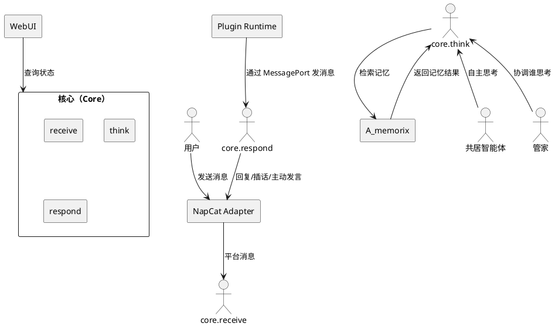
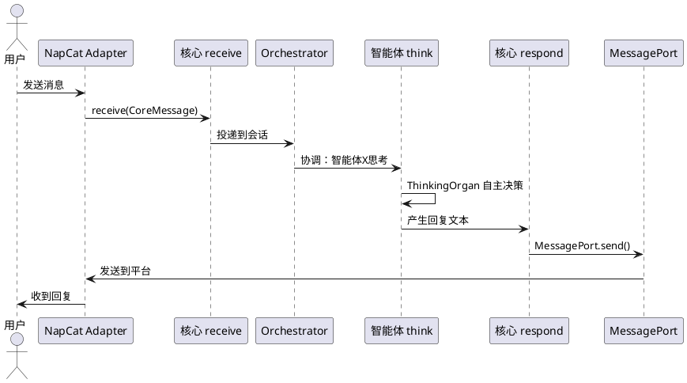
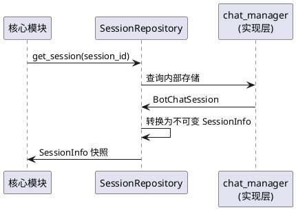
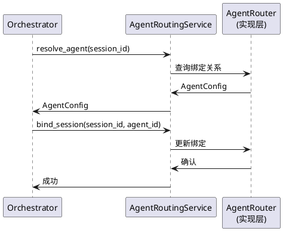
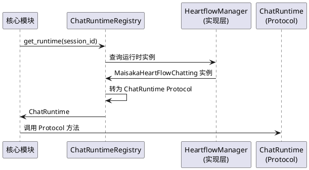
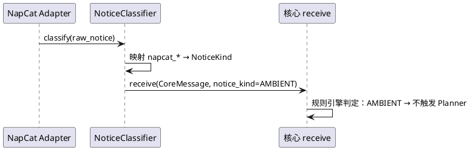
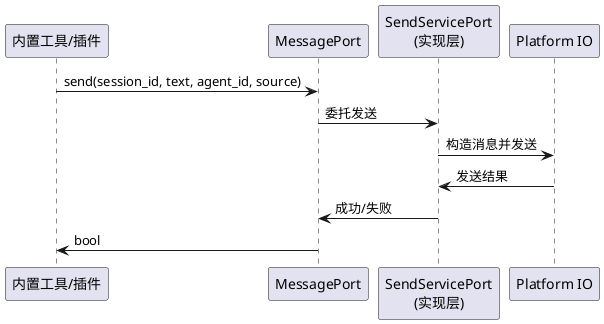
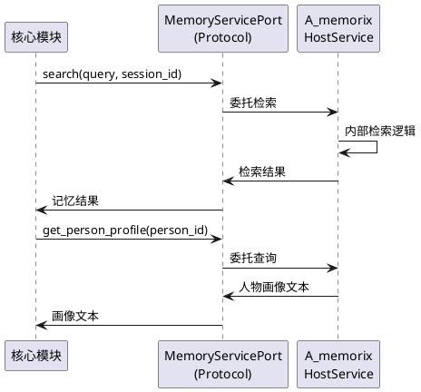
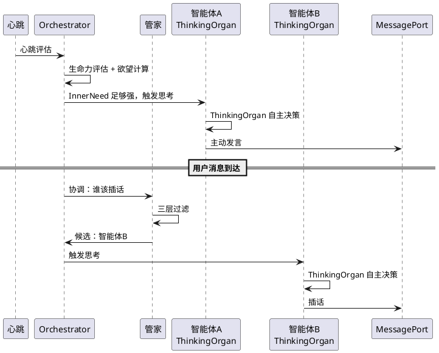
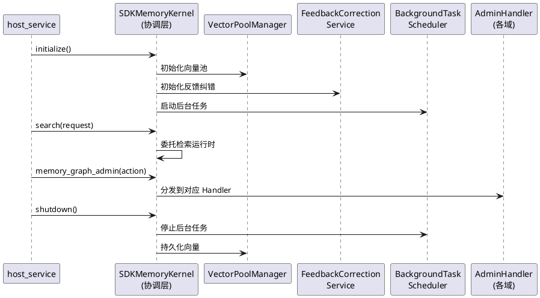

# MaiBot 核心架构变革 — 需求规格

# 1. 组件定位

## 1.1 核心职责

本组件负责定义并实现 MaiBot 核心的三层接口契约（receive / think / respond），将核心从组件耦合中解放出来，使核心 = 智能体 + 消息管道成为可独立演进、可替换组件的稳定基座。

## 1.2 核心输入

1. **用户消息**：来自平台适配器（NapCat、WebUI、CLI）的入站消息，经核心 receive 接口投递
2. **通知消息**：平台产生的环境信号（戳一戳、入群、输入状态等），经核心 receive 接口投递
3. **心跳信号**：60 秒间隔的定时心跳，驱动待命智能体的生命力评估和欲望计算
4. **提醒触发信号**：管家系统检测到的到期提醒，经 Orchestrator 协调后投递

## 1.3 核心输出

1. **回复消息**：智能体思考后产生的文本回复，经 MessagePort 发出
2. **插话消息**：共居智能体经管家协调后产生的插话，经 MessagePort 发出
3. **主动发言**：智能体欲望驱动或提醒触发的主动消息，经 MessagePort 发出
4. **环境感知结果**：通知消息经规则引擎分类后的判定结果（是否触发 Planner）

## 1.4 职责边界

- **不负责**平台协议适配（NapCat 字段解析、消息格式转换由平台适配器完成）
- **不负责**会话持久化和数据库操作（由 SessionRepository 实现类负责）
- **不负责**消息发送的具体实现（由 MessagePort 实现类负责）
- **不负责**记忆的存储和检索（由 A_memorix 通过 MemoryServicePort 接口提供）
- **不负责**智能体配置的加载和管理（由 AgentConfigRegistry 负责）

# 2. 领域术语

**核心（Core）**
: 智能体 + 消息管道的组合，只关心消息进来、智能体思考、回复出去。接口只有三个：receive / think / respond。

**组件（Component）**
: 围绕核心的可替换层，包括 HeartFlow、ChatManager、NapCat Adapter、A_Memorix、WebUI 等。组件实现核心定义的接口契约。

**MessagePort**
: 核心→外部的消息发送接口契约。核心模块只通过此接口发消息，不直接依赖 send_service / chat_manager / NapCat。

**SessionRepository**
: 替代 chat_manager 全局单例的会话查询接口。核心通过此接口查询会话信息，不直接依赖 chat_manager 的可变引用。

**AgentRoutingService**
: 替代 chat_manager._agent_router 的路由接口。核心通过此接口解析会话应使用的智能体，不直接访问 chat_manager 的私有属性。

**ChatRuntime**
: 打破 HeartFlow ↔ Maisaka 循环依赖的运行时接口。核心通过此接口与运行时交互，不直接导入 MaisakaHeartFlowChatting 具体类。

**NoticeClassification**
: 平台无关的通知分类机制。核心通过此机制判断通知消息的处理方式，不依赖 napcat_* 等平台特定字段。

**Agent-owns-Thinking**
: 每个智能体拥有自己的思维管道的架构模式。Orchestrator 协调"谁在思考"，不关心"怎么思考"。

**管家（Butler）**
: 彼岸居客厅的空间逻辑人格化，负责过滤（谁看见了消息）和协调（谁先抢到键盘），不说话。

**欲望（InnerNeed）**
: 让智能体在无人输入时也决定行动的规则引擎输出。欲望驱动系统调用 LLM，而非 LLM 自发产生输出。

# 3. 角色与边界

## 3.1 核心角色

- **主发言智能体**：每条消息必回，与用户建立深度关系
- **共居智能体**：通过管家三层过滤获得插话机会，可同时思考不同话题
- **管家**：过滤+协调+提醒，不说话，不是第14个角色

## 3.2 外部系统

- **NapCat Adapter**：平台消息的收发适配器，实现 MessagePort 接口
- **A_memorix**：记忆存储与检索服务，通过 MemoryServicePort 接口与核心交互
- **WebUI**：监控与管理界面，通过核心定义的查询接口获取状态
- **Plugin Runtime**：插件运行时，通过 MessagePort 发消息，通过核心接口注册工具

## 3.3 交互上下文

# 4. DFX约束

## 4.1 性能

1. 心跳评估（13 个待命智能体）单次耗时不得超过 600ms
2. 核心接口调用不得引入超过 5ms 的额外延迟（不含 LLM 调用时间）
3. SessionRepository 查询单次不得超过 10ms
4. NoticeClassification 分类判定不得超过 1ms（纯规则计算，不调用 LLM）

## 4.2 可靠性

1. 核心接口契约变更必须向后兼容，旧实现在新接口下不得崩溃
2. MessagePort 发送失败必须返回明确的错误信息，不得静默丢弃
3. SessionRepository 查询不到会话时必须返回 None/空值，不得抛出未处理异常

## 4.3 安全性

1. 核心不得直接暴露 chat_manager 的可变引用给外部模块
2. MessagePort 实现必须校验 session_id 的合法性
3. AgentRoutingService 不得暴露路由器的内部状态（_session_bindings 等）

## 4.4 可维护性

1. 核心模块不得出现对组件具体实现类的直接导入（仅依赖 Protocol/接口）
2. 循环依赖检测必须纳入 CI 流程
3. 核心接口变更必须同步更新 Protocol 定义和类型存根

## 4.5 兼容性

1. 新接口必须提供适配器层，使旧代码可渐进迁移
2. chat_manager 全局单例在过渡期内保留，但核心模块不得新增对其的导入
3. NapCat 平台适配器在 NoticeClassification 迁移期间必须同时支持新旧两种通知分类方式

# 5. 核心能力

## 5.1 核心接口契约

### 5.1.1 业务规则

1. **[REQ-CORE-001] receive 接口规则**：当消息到达核心时，系统必须将消息投递到对应会话的智能体运行时，消息内容必须是平台无关的统一格式。
   - 验收条件：用户消息到达 → 消息被投递到 session_id 对应的运行时 → 运行时收到平台无关的 CoreMessage 对象

2. **[REQ-CORE-002] think 接口规则**：当智能体被触发思考时，系统必须调用该智能体自己的思维管道（ThinkingOrgan），Orchestrator 只协调执行顺序，不替智能体做决策。
   - 验收条件：Orchestrator 调度 → 指定智能体的 ThinkingOrgan 被调用 → 思考结果由智能体自主产生

3. **[REQ-CORE-003] respond 接口规则**：当智能体产生回复时，系统必须通过 MessagePort 发送，不得绕过 MessagePort 直接调用 send_service。
   - 验收条件：智能体产生回复文本 → 回复通过 MessagePort.send 发出 → send_service 不被核心直接调用

4. **[REQ-CORE-004] 接口隔离规则**：核心模块禁止导入组件的具体实现类，只依赖 Protocol 定义的接口。
   - 验收条件：核心模块的 import 列表中不包含 chat_manager、MaisakaHeartFlowChatting、send_service 等具体实现 → 静态分析通过

5. **[REQ-CORE-005] 禁止项**：核心模块禁止直接访问 chat_manager 的可变引用（如 BotChatSession 实例）。
   - 验收条件：核心模块代码中不存在 `chat_manager.get_session_by_session_id()` 或 `chat_manager.sessions` 的调用 → 静态分析通过

### 5.1.2 交互流程

### 5.1.3 异常场景

1. **会话不存在**
   - 触发条件：receive 收到的 session_id 在 SessionRepository 中查不到
   - 系统行为：记录警告日志，丢弃消息
   - 用户感知：无回复（消息被静默丢弃，日志中有记录）

2. **MessagePort 发送失败**
   - 触发条件：MessagePort.send 返回 False 或抛出异常
   - 系统行为：记录错误日志，不重试（重试由 MessagePort 实现负责）
   - 用户感知：消息未送达，日志中有错误记录

3. **智能体思考超时**
   - 触发条件：ThinkingOrgan 执行时间超过配置上限
   - 系统行为：Orchestrator 取消当前思考，记录超时事件
   - 用户感知：无回复或延迟回复

## 5.2 SessionRepository

### 5.2.1 业务规则

1. **[REQ-SESS-001] 会话查询规则**：当核心需要查询会话信息时，系统必须通过 SessionRepository 接口查询，不得直接访问 chat_manager.sessions 字典。
   - 验收条件：核心模块调用 SessionRepository.get_session(session_id) → 返回不可变的 SessionInfo 快照 → 原始 BotChatSession 不被暴露

2. **[REQ-SESS-002] 会话名称查询规则**：当核心需要获取会话展示名称时，系统必须通过 SessionRepository.get_session_name(session_id) 查询。
   - 验收条件：调用 SessionRepository.get_session_name → 返回群名称或"xxx的私聊" → 不依赖 chat_manager.get_session_name

3. **[REQ-SESS-003] 不可变性规则**：SessionRepository 返回的会话信息必须是不可变快照，外部修改不得影响内部状态。
   - 验收条件：对返回的 SessionInfo 进行属性修改 → 原始会话数据不受影响

4. **[REQ-SESS-004] 禁止项**：SessionRepository 禁止暴露 chat_manager 的可变 sessions 字典或 BotChatSession 的可变引用。
   - 验收条件：SessionRepository 的返回类型不包含 BotChatSession → 返回值为 SessionInfo 数据类

### 5.2.2 交互流程

### 5.2.3 异常场景

1. **会话不存在**
   - 触发条件：查询的 session_id 在存储中不存在
   - 系统行为：返回 None
   - 用户感知：调用方收到 None，按自身逻辑处理

2. **底层存储不可用**
   - 触发条件：chat_manager 或数据库不可用
   - 系统行为：抛出 SessionRepositoryError，包含原始异常信息
   - 用户感知：调用方收到明确异常，可进行降级处理

## 5.3 AgentRoutingService

### 5.3.1 业务规则

1. **[REQ-ROUTE-001] 路由解析规则**：当核心需要解析会话应使用的智能体时，系统必须通过 AgentRoutingService 接口查询，不得直接访问 chat_manager._agent_router 私有属性。
   - 验收条件：核心模块调用 AgentRoutingService.resolve_agent(session_id) → 返回 AgentConfig → 不依赖 chat_manager._agent_router

2. **[REQ-ROUTE-002] 会话绑定规则**：当智能体加入/离开会话时，系统必须通过 AgentRoutingService 更新绑定关系。
   - 验收条件：Orchestrator 激活智能体 → 调用 AgentRoutingService.bind_session(session_id, agent_id) → 不直接操作 chat_manager.agent_router

3. **[REQ-ROUTE-003] 主发言智能体查询规则**：当核心需要获取会话的主发言智能体时，系统必须通过 AgentRoutingService.get_primary_agent(session_id) 查询。
   - 验收条件：调用返回主发言智能体 ID → 不依赖 chat_manager 的任何方法

4. **[REQ-ROUTE-004] 禁止项**：核心模块禁止通过 chat_manager.agent_router 访问路由器。
   - 验收条件：核心模块代码中不存在 `chat_manager.agent_router` 或 `chat_manager._agent_router` 的访问 → 静态分析通过

### 5.3.2 交互流程

### 5.3.3 异常场景

1. **智能体不存在**
   - 触发条件：bind_session 传入的 agent_id 在注册表中不存在
   - 系统行为：抛出 AgentNotFoundError
   - 用户感知：Orchestrator 收到异常，记录日志，智能体激活失败

2. **达到最大智能体数量**
   - 触发条件：会话绑定的智能体数量超过配置上限
   - 系统行为：拒绝绑定，返回 False
   - 用户感知：Orchestrator 记录警告，智能体不被激活

## 5.4 ChatRuntime Protocol

### 5.4.1 业务规则

1. **[REQ-RUNTIME-001] 运行时接口规则**：当核心需要与运行时交互时，系统必须通过 ChatRuntime Protocol 接口调用，不得直接导入 MaisakaHeartFlowChatting 具体类。
   - 验收条件：HeartflowManager 的类型注解使用 ChatRuntime 而非 MaisakaHeartFlowChatting → HeartflowManager 不导入 MaisakaHeartFlowChatting

2. **[REQ-RUNTIME-002] CycleDetail 解耦规则**：CycleDetail 数据模型必须从循环依赖链中提取到独立的公共模块，Maisaka 和 HeartFlow 不得互相导入对方的具体类。
   - 验收条件：CycleDetail 定义在 src/core/types.py 或独立模块 → Maisaka 和 HeartFlow 都从公共模块导入

3. **[REQ-RUNTIME-003] 运行时查询规则**：当核心需要查询运行时实例时，系统必须通过 ChatRuntimeRegistry 接口查询，不得直接访问 heartflow_manager.heartflow_chat_list。
   - 验收条件：核心模块调用 ChatRuntimeRegistry.get_runtime(session_id) → 返回 ChatRuntime Protocol → 不依赖 heartflow_manager

4. **[REQ-RUNTIME-004] 禁止项**：HeartflowManager 禁止导入 MaisakaHeartFlowChatting 具体类，只依赖 ChatRuntime Protocol。
   - 验收条件：HeartflowManager 的 import 列表中不包含 MaisakaHeartFlowChatting → 静态分析通过

### 5.4.2 交互流程

### 5.4.3 异常场景

1. **运行时不存在**
   - 触发条件：查询的 session_id 没有活跃的运行时实例
   - 系统行为：返回 None
   - 用户感知：调用方收到 None，按需创建或降级

2. **运行时创建失败**
   - 触发条件：get_or_create_runtime 时底层创建失败
   - 系统行为：抛出 RuntimeCreationError，包含原始异常
   - 用户感知：消息处理链中断，日志中有错误记录

## 5.5 NoticeClassification

### 5.5.1 业务规则

1. **[REQ-NOTICE-001] 平台无关分类规则**：当通知消息到达核心时，系统必须通过 NoticeClassification 接口进行分类，不得在核心代码中硬编码 napcat_notice_sub_type 等平台特定字段。
   - 验收条件：核心模块代码中不包含 "napcat_" 字符串 → 静态分析通过

2. **[REQ-NOTICE-002] 分类枚举规则**：NoticeClassification 必须定义平台无关的通知类型枚举（如 AMBIENT / INTERACTION / INPUT_STATUS），平台适配器负责将平台特定字段映射到枚举值。
   - 验收条件：NapCat Adapter 将 napcat_notice_sub_type 映射为 NoticeKind 枚举 → 核心只处理 NoticeKind 枚举

3. **[REQ-NOTICE-003] 单一定义规则**：AMBIENT_NOTICE_SUBTYPES 等通知子类型集合必须只定义一次，不得在多处重复定义。
   - 验收条件：全局搜索 AMBIENT_NOTICE_SUBTYPES 只出现一次定义 → DRY 原则

4. **[REQ-NOTICE-004] 禁止项**：核心模块禁止使用 getattr 链式访问平台特定字段（如 getattr(message.message_info.additional_config, 'get', ...)('napcat_notice_sub_type', '')）。
   - 验收条件：核心模块代码中不存在 getattr 访问 napcat_ 字段 → 静态分析通过

### 5.5.2 交互流程

### 5.5.3 异常场景

1. **未知通知类型**
   - 触发条件：平台适配器传入的通知子类型不在映射表中
   - 系统行为：分类为 NoticeKind.UNKNOWN，记录警告日志
   - 用户感知：通知按默认规则处理（可能触发 Planner，可能不触发）

2. **平台适配器未注册分类映射**
   - 触发条件：新平台接入但未提供通知分类映射
   - 系统行为：所有通知分类为 NoticeKind.UNKNOWN
   - 用户感知：通知按默认规则处理

## 5.6 MessagePort 全面采用

### 5.6.1 业务规则

1. **[REQ-PORT-001] 内置工具发送规则**：当内置工具（reply、send_image 等）需要发送消息时，系统必须通过 MessagePort 接口发送，不得直接调用 send_service。
   - 验收条件：内置工具代码中不包含 `from src.services.send_service import` → 静态分析通过

2. **[REQ-PORT-002] 插件运行时发送规则**：当插件运行时需要发送消息时，系统必须通过 MessagePort 接口发送，不得直接导入 send_service。
   - 验收条件：plugin_runtime 模块中不包含 `from src.services.send_service import` → 静态分析通过

3. **[REQ-PORT-003] MessagePort 扩展规则**：MessagePort 必须支持除文本外的消息类型（图片、表情、语音等），扩展后的接口必须向后兼容。
   - 验收条件：MessagePort.send 支持发送图片 → 旧的纯文本调用方式仍然有效

4. **[REQ-PORT-004] 禁止项**：核心模块和内置工具禁止绕过 MessagePort 直接调用 send_service.text_to_stream 或 send_service.send_custom_message。
   - 验收条件：核心模块和内置工具的 import 列表中不包含 send_service → 静态分析通过

### 5.6.2 交互流程

### 5.6.3 异常场景

1. **MessagePort 未初始化**
   - 触发条件：在 set_message_port 调用之前尝试发送消息
   - 系统行为：使用默认的 SendServicePort 实现
   - 用户感知：消息正常发送，无感知

2. **发送失败**
   - 触发条件：底层 send_service 或 Platform IO 调用失败
   - 系统行为：MessagePort.send 返回 False，记录错误日志
   - 用户感知：消息未送达

## 5.7 A_memorix 隔离

### 5.7.1 业务规则

1. **[REQ-MEMO-001] 内部函数隔离规则**：核心模块禁止直接导入 A_memorix 的内部工具函数（如 build_profile_injection_text），必须通过 MemoryServicePort 接口访问。
   - 验收条件：核心模块代码中不包含 `from src.A_memorix.core.utils` 的导入 → 静态分析通过

2. **[REQ-MEMO-002] 内核反向依赖消除规则**：A_memorix 的 SDKMemoryKernel 禁止反向依赖 chat_manager，必须通过核心提供的 SessionInfoPort 接口获取会话信息。
   - 验收条件：SDKMemoryKernel 的 import 列表中不包含 `from src.chat.message_receive.chat_manager import` → 静态分析通过

3. **[REQ-MEMO-003] 记忆服务接口规则**：核心必须定义 MemoryServicePort Protocol，A_memorix 实现此接口，核心通过接口调用记忆服务。
   - 验收条件：核心模块通过 MemoryServicePort 调用记忆检索 → 不直接导入 A_memorix 的任何模块

4. **[REQ-MEMO-004] 禁止项**：核心模块禁止导入 A_memorix 的内部模块（core.utils、core.storage 等），只允许通过 host_service 或 Protocol 接口交互。
   - 验收条件：核心模块的 import 列表中不包含 `from src.A_memorix.core` → 静态分析通过

### 5.7.2 交互流程

### 5.7.3 异常场景

1. **A_memorix 服务不可用**
   - 触发条件：A_memorix 未加载或初始化失败
   - 系统行为：MemoryServicePort 返回空结果，记录警告日志
   - 用户感知：智能体回复中不包含记忆上下文，功能降级但不崩溃

2. **记忆检索超时**
   - 触发条件：A_memorix 检索耗时超过配置上限
   - 系统行为：MemoryServicePort 返回空结果，记录超时事件
   - 用户感知：智能体回复中不包含记忆上下文

## 5.8 Agent-owns-Thinking

### 5.8.1 业务规则

1. **[REQ-THINK-001] 思维管道归属规则**：每个智能体必须拥有自己的思维管道（ThinkingOrgan），Orchestrator 只协调"谁在思考"，不关心"怎么思考"。
   - 验收条件：Orchestrator 调度智能体思考 → 调用智能体的 ThinkingOrgan → 不在 Orchestrator 中执行 Planner 逻辑

2. **[REQ-THINK-002] 并行思考规则**：当多个智能体需要同时思考不同话题时，系统必须支持并行思考，不得串行阻塞。
   - 验收条件：智能体A思考话题1 与 智能体B思考话题2 可同时进行 → 总耗时接近 max(A, B) 而非 A + B

3. **[REQ-THINK-003] 管家协调规则**：管家的三层过滤（规则过滤→管家LLM→角色LLM）必须独立于 Planner 执行，Planner 不知道多智能体的存在。
   - 验收条件：Planner 的输入上下文中不包含"共居智能体"相关信息 → 管家在 Planner 之外完成过滤

4. **[REQ-THINK-004] 主动发言规则**：当智能体的欲望（InnerNeed）足够强时，系统必须支持智能体主动发言，无需外部消息触发。
   - 验收条件：心跳评估 → InnerNeed 强度超过阈值 → 触发 ThinkingOrgan → 产生主动发言

5. **[REQ-THINK-005] 禁止项**：Orchestrator 禁止在 Planner 层面模拟多智能体（如通过切换 _agent_id 或 enqueue_proactive_task 伪装成"插件主动对话"）。
   - 验收条件：Orchestrator 的代码中不存在 `enqueue_proactive_task` 用于模拟多智能体插话 → 插话通过管家协调直接触发目标智能体的 ThinkingOrgan

### 5.8.2 交互流程

### 5.8.3 异常场景

1. **ThinkingOrgan 降级**
   - 触发条件：智能体配置缺失或提示词构建失败
   - 系统行为：ThinkingOrgan.is_degraded 返回 True，回退到旁观者模式
   - 用户感知：智能体回复风格变为通用模式，失去角色特征

2. **并行思考资源竞争**
   - 触发条件：多个智能体同时思考导致 LLM 调用排队
   - 系统行为：Orchestrator 的信号量控制并发数，超出并发的思考排队等待
   - 用户感知：部分智能体回复延迟

3. **管家 LLM 筛选失败**
   - 触发条件：管家 LLM 调用失败或返回格式错误
   - 系统行为：回退到规则过滤结果，记录警告日志
   - 用户感知：插话可能不如预期精准，但不会中断

## 5.9 SDKMemoryKernel 屎山审视与清理

### 5.9.1 业务规则

1. **[REQ-CLEANUP-001] God Class 拆分规则**：SDKMemoryKernel（10361 行、~358 个方法）必须按功能域拆分为独立模块，每个模块职责单一、行数不超过 1500 行。SDKMemoryKernel 自身退化为薄协调层，只持有子模块引用和生命周期管理。
   - 验收条件：SDKMemoryKernel 自身代码行数 ≤ 800 行 → 功能逻辑分布在独立子模块中 → 每个子模块行数 ≤ 1500 行

2. **[REQ-CLEANUP-002] 功能域拆分规则**：以下功能域必须从 SDKMemoryKernel 中拆分为独立模块，每个模块通过构造函数注入所需依赖（metadata_store、graph_store、embedding_manager 等），不反向持有 SDKMemoryKernel 引用：
   - **向量池管理**（VectorPoolManager）：双池配置、manifest 读写、向量存储创建/保存/重载、embedding 指纹校验（~800 行）
   - **向量重建**（VectorRebuildService）：全量向量重建、双池迁移、段落/实体/关系向量编码复制（~600 行）
   - **段落向量回填**（ParagraphBackfillService）：回填队列管理、回填执行循环（~200 行）
   - **Embedding 降级与自检**（EmbeddingHealthService）：降级状态管理、运行时自检、维度不匹配处理（~150 行）
   - **反馈纠错**（FeedbackCorrectionService）：信号检测、分类器调用、纠错应用、回退执行、stale 标记（~2000 行）
   - **模糊修改**（FuzzyModifyService）：自然语言修改指令解析、候选匹配、执行与回滚（~1000 行）
   - **后台任务调度**（BackgroundTaskScheduler）：所有异步循环的启停管理、生命周期协调（~400 行）
   - **记忆维护**（MemoryMaintenanceService）：衰减、冻结、修剪、孤立 GC（~200 行）
   - **图操作**（GraphOperations）：图序列化、搜索、节点详情、证据图构建、重命名、权重更新（~500 行）
   - 验收条件：每个功能域有独立文件 → 文件内类不持有 SDKMemoryKernel 引用 → 依赖通过构造函数注入

3. **[REQ-CLEANUP-003] Admin API 路由拆分规则**：当前 `memory_*_admin` 方法（graph_admin、source_admin、episode_admin、profile_admin、feedback_admin、runtime_admin、import_admin、tuning_admin、v5_admin、delete_admin、correction_admin）使用字符串 action 分发的 if/elif 链模式，必须拆分为独立的 Admin Handler 类，每个 Handler 只负责一个管理域。
   - 验收条件：SDKMemoryKernel 中不存在 `memory_*_admin` 方法 → 每个 Admin Handler 独立文件 → 字符串分发逻辑在 Handler 内部而非 Kernel 内部

4. **[REQ-CLEANUP-004] getattr 消除规则**：文件中 52 处 `getattr()` 调用必须按以下优先级消除：
   - 对 `global_config.a_memorix.integration` 的 getattr 访问（15+ 处反馈纠错配置读取）→ 替换为直接属性访问
   - 对已知接口的 getattr（如 `store.dimension`、`store.num_vectors`）→ 替换为直接属性访问
   - 对动态能力检测的 getattr（如 `encode_batch`、`iter_vectors_by_ids`）→ 通过 Protocol 接口统一，消除运行时能力探测
   - 验收条件：`getattr` 调用数量从 52 处降至 ≤ 5 处（仅保留真正需要动态检测的场景）→ 静态分析通过

5. **[REQ-CLEANUP-005] 过度防御消除规则**：文件中 616 处 `or "")` 模式必须按以下原则精简：
   - 对已知类型为 str 的变量（函数参数有类型注解、配置值已知为字符串），删除 `or ""` 兜底
   - 对 `dict.get(key, "")` 已提供默认值的调用，删除后续的 `or ""`
   - 对 `str(x or "").strip()` 链式调用，当 x 已知为 str 时简化为 `x.strip()`
   - 对 `int(x or 0)`、`float(x or 0.0)` 等数值兜底，当 x 已知为数值类型时删除兜底
   - 验收条件：`or "")` 模式数量从 616 处降至 ≤ 150 处（仅保留真正可能为 None 的场景）→ 不引入新的运行时错误

6. **[REQ-CLEANUP-006] _KernelRuntimeFacade 审视规则**：_KernelRuntimeFacade 作为 SDKMemoryKernel 的代理类，必须评估其存在必要性。如果 MaiBot 已独立且不存在循环依赖问题，应删除此代理类，调用方直接使用 SDKMemoryKernel。
   - 验收条件：评估 _KernelRuntimeFacade 的所有调用方 → 如果无循环依赖风险则删除 → 如有风险则保留并文档化原因

7. **[REQ-CLEANUP-007] 配置访问器精简规则**：数十个单行配置读取方法（`_embedding_fallback_enabled()`、`_paragraph_vector_backfill_enabled()`、`_feedback_cfg_*` 等 15+ 个）必须精简：
   - 同一功能域内的配置读取方法合并到该域的配置数据类中
   - 用 `@property` 替代无参数方法（语义更清晰）
   - 反馈纠错配置从 `getattr(global_config.a_memorix.integration, ...)` 改为统一的配置数据类
   - 验收条件：SDKMemoryKernel 上的单行配置读取方法数量减少 50%+ → 配置集中在功能域模块内

8. **[REQ-CLEANUP-008] 核心隔离合规规则**：清理后的代码必须继续遵守核心隔离原则：
   - A_memorix 内部不导入 chat_manager、send_service 等外部组件
   - 通过 SessionInfoPort 获取会话信息
   - 通过 MemoryServicePort 向核心提供服务
   - 验收条件：`rg "from src.chat.message_receive.chat_manager import" src/A_memorix/` 为 0 匹配 → `rg "from src.services.send_service import" src/A_memorix/` 为 0 匹配

9. **[REQ-CLEANUP-009] 禁止项**：
   - 禁止在拆分过程中引入新的循环依赖
   - 禁止子模块反向持有 SDKMemoryKernel 引用（必须通过依赖注入获取所需组件）
   - 禁止在拆分过程中改变外部可见的 API 签名（host_service、plugin.py 的调用方式不变）
   - 禁止为拆分而拆分——如果某功能域与 SDKMemoryKernel 高度耦合且拆分收益不大，可暂缓拆分
   - 验收条件：子模块 import 列表中不包含 `from ..sdk_memory_kernel import SDKMemoryKernel` → 外部调用方无需修改 → 容器重启后功能正常

### 5.9.2 交互流程

### 5.9.3 异常场景

1. **拆分后功能回归**
   - 触发条件：拆分后某功能域的行为与拆分前不一致
   - 系统行为：容器启动时自检失败，记录具体差异
   - 用户感知：记忆检索、人物画像、反馈纠错等功能异常

2. **循环依赖引入**
   - 触发条件：拆分后子模块之间或子模块与 Kernel 之间产生循环导入
   - 系统行为：Python 导入时抛出 ImportError
   - 用户感知：容器无法启动

3. **过度删除兜底导致运行时异常**
   - 触发条件：删除 `or ""` 兜底后，某处传入 None 导致 `.strip()` 或 `.lower()` 抛出 AttributeError
   - 系统行为：运行时异常，日志中有 traceback
   - 用户感知：对应功能中断，需修复后重启

4. **Admin Handler 分发错误**
   - 触发条件：拆分后 action 字符串分发逻辑遗漏或重复
   - 系统行为：WebUI 管理操作返回"不支持的 action"错误
   - 用户感知：管理界面部分功能不可用

# 6. 数据约束

## 6.1 CoreMessage

1. **session_id**：必填，字符串，标识消息所属会话
2. **plain_text**：必填，字符串，消息的纯文本内容
3. **is_notify**：必填，布尔值，是否为通知消息
4. **notice_kind**：当 is_notify=True 时必填，NoticeKind 枚举值，平台无关的通知分类
5. **sender_id**：必填，字符串，发送者 ID
6. **sender_name**：可选，字符串，发送者展示名称
7. **platform**：必填，字符串，来源平台标识
8. **timestamp**：必填，datetime，消息时间戳
9. **additional_data**：可选，字典，平台特定附加数据（核心不解析此字段）

## 6.2 SessionInfo

1. **session_id**：必填，字符串，会话唯一标识
2. **session_name**：必填，字符串，会话展示名称
3. **platform**：必填，字符串，平台标识
4. **is_group_session**：必填，布尔值，是否为群聊
5. **group_id**：可选，字符串，群 ID
6. **group_name**：可选，字符串，群名称
7. **user_id**：可选，字符串，用户 ID
8. **user_nickname**：可选，字符串，用户昵称
9. **primary_agent_id**：必填，字符串，主发言智能体 ID
10. **cohabitant_agent_ids**：必填，字符串集合，共居智能体 ID 列表

## 6.3 NoticeKind

1. **AMBIENT**：环境信号（如输入状态、群成员变动），不触发 Planner
2. **INTERACTION**：交互信号（如戳一戳、被 @），可能触发 Planner
3. **INPUT_STATUS**：用户正在输入，不触发 Planner
4. **UNKNOWN**：未知类型，按默认规则处理

## 6.4 AgentConfig

1. **agent_id**：必填，字符串，智能体唯一标识
2. **display_name**：必填，字符串，智能体展示名称
3. **personality**：可选，字符串，人格描述摘要
4. **is_default**：必填，布尔值，是否为默认智能体
5. **internal_relationships**：可选，InternalRelationship 列表，与其他智能体的关系