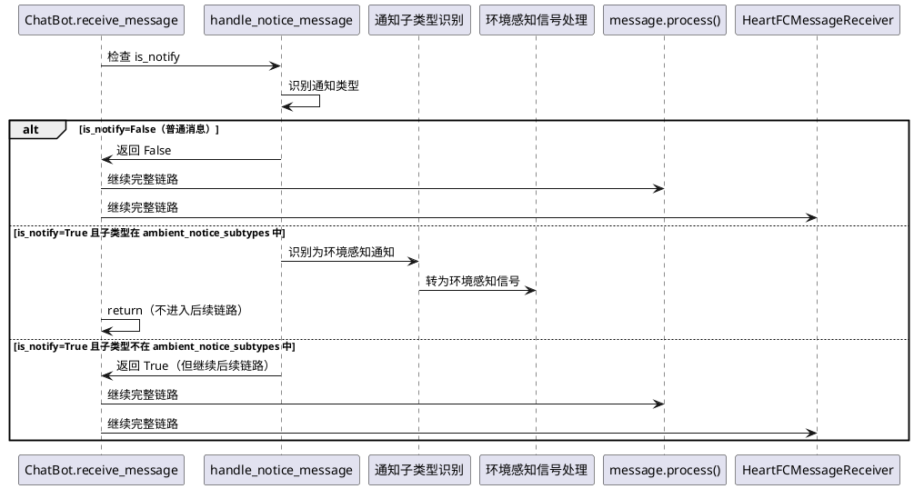
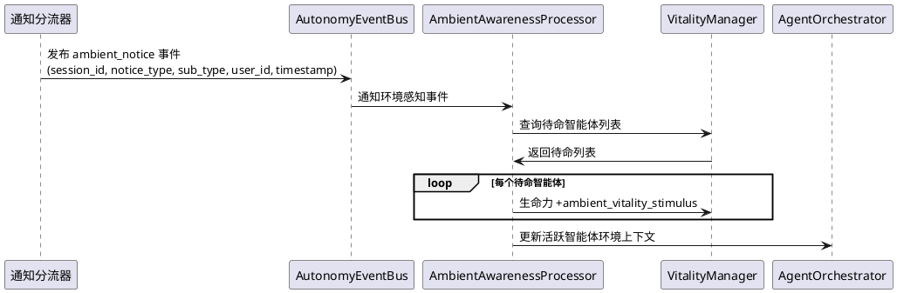
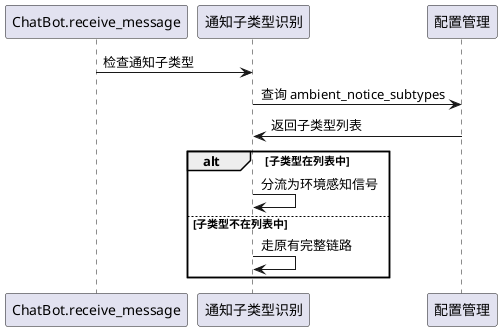

# 环境感知通知分流与处理优化 — 需求规格

> ⚠️ **已废弃 (SUPERSEDED)**：本 spec 描述的 bot.py 层面分流方案已被 Orchestrator 规则引擎分类方案替代。实际实现见 `src/maisaka/agent_autonomy/orchestrator.py` 中的 `_classify_notice` / `_handle_ambient_notice`，以及 `src/maisaka/runtime.py` 中的 `_is_ambient_notice`。

> 理想的角色不应是一具等待结局的标本，而应是一场永恒的进行时。

# **1. 组件定位**

## **1.1 核心职责**

本组件负责将环境感知类通知（输入状态、戳一戳、禁言、入群退群等）从完整 Planner 决策链路中剥离，转为轻量级环境感知信号，使智能体感知会话环境变化但不触发 LLM 推理。

## **1.2 核心输入**

1. **环境感知类通知消息**：来自平台适配器的 `is_notify=True` 且通知子类型在 `ambient_notice_subtypes` 配置列表中的消息，包括输入状态、戳一戳、禁言、入群退群、群名修改、文件上传、表情回应等
2. **其他通知消息**：来自平台适配器的 `is_notify=True` 但子类型不在 `ambient_notice_subtypes` 列表中的通知（撤回、精华消息、管理员变更等），这些消息的处理方式不应被改变
3. **普通用户消息**：来自平台适配器的 `is_notify=False` 的消息，这些消息的处理方式不应被改变

## **1.3 核心输出**

1. **环境感知信号**：环境感知类通知被转换为轻量级信号，注入到智能体自主性架构的环境感知处理器（AmbientAwarenessProcessor），作为待命智能体生命力微调的依据
2. **Planner 不触发**：环境感知类通知不再触发 Planner 循环，不消耗 LLM tokens
3. **日志记录**：环境感知类通知的处理过程输出 DEBUG 级别日志，包含会话标识和通知类型
4. **其他通知消息正常处理**：撤回、精华消息等不在分流列表中的通知仍按原有链路处理

## **1.4 职责边界**

- **不负责**：通知消息的解析——通知消息的解析由平台适配器完成，本组件只消费解析结果
- **不负责**：非环境感知类通知的处理策略——撤回、精华消息等通知仍走原有链路
- **不负责**：智能体行为意图的产生——环境感知信号只调整环境参数，不替智能体做决策
- **不负责**：跨会话的环境感知——环境感知通知仅影响同一会话内的智能体
- **不负责**：环境感知事件的可视化展示——WebUI 展示不在本组件范围内

# **2. 领域术语**

**环境感知通知（Ambient Notice）**
: 平台适配器上报的、属于纯状态变化的通知消息。这类通知不包含需要智能体回复的内容，仅表示会话环境发生了变化（如用户正在输入、有人戳一戳、有人入群等）。环境感知通知应被分流为轻量级信号，不触发 Planner 循环。

**环境感知信号（Ambient Signal）**
: 不触发 Planner 决策循环的轻量级会话事件。环境感知信号仅影响待命智能体的生命力参数和环境感知状态，不产生可见回复。输入状态通知是环境感知信号的一种。

**通知子类型（Notice Sub Type）**
: 适配器在 `additional_config` 中携带的通知分类标识，用于区分不同类型的通知（如 `input_status`、`poke`、`recall` 等）。本组件仅关注 `input_status` 子类型，其他子类型的处理方式不变。

**Planner 循环（Planner Loop）**
: MaiSaka 运行时中，消息触发 LLM 推理并产生行为决策的完整流程。一次 Planner 循环消耗约 10k tokens。输入状态通知不应触发 Planner 循环。

**轻量级感知（Lightweight Awareness）**
: 不调用 LLM 的纯规则计算型环境感知。待命智能体通过轻量级感知更新生命力等参数，活跃智能体通过提示词注入获得环境信息。输入状态通知的处理必须是轻量级感知。

# **3. 角色与边界**

## **3.1 核心角色**

**活跃智能体**：在会话中可发言的智能体，通过提示词上下文感知会话环境变化（如用户正在输入、有人入群等），但不因此触发额外的 Planner 循环。

**待命智能体**：在会话中拥有环境感知但不可发言的智能体，通过规则引擎间接感知环境事件（如生命力微调），不直接获得状态文本。

## **3.2 外部系统**

**平台适配器**：上报通知消息，通过 `is_notify` 和 `additional_config` 中的通知子类型标识消息类型。

**ChatBot 消息主链路（bot.py）**：消息入站的第一道关卡，负责根据通知子类型将输入状态通知从完整链路中分流。

**HeartFCMessageReceiver**：心流消息处理器，接收普通消息和需要完整处理的通知消息，将其路由到 MaiSaka 运行时。

**MaisakaHeartFlowChatting**：MaiSaka 会话运行时，`register_message` 方法接收消息并触发 Planner 循环。

**AgentOrchestrator**：智能体编排器，`handle_message` 处理消息并调度行为意图收集和插话。

**AmbientAwarenessProcessor**：环境感知处理器，处理会话消息事件和智能体发言事件，更新待命智能体生命力。

**AutonomyEventBus**：自主性事件总线，用于发布环境感知事件。

## **3.3 交互上下文**

```plantuml
@startuml
left to right direction

actor "活跃智能体" as active_agent
actor "待命智能体" as standby_agent

rectangle "环境感知通知分流与处理优化" {
  [通知分流器] as dispatcher
  [环境感知信号处理] as ambient_signal
}

rectangle "消息主链路" {
  [ChatBot.receive_message] as bot
  [HeartFCMessageReceiver] as heartflow
  [MaisakaHeartFlowChatting] as maisaka
}

rectangle "智能体自主性架构" {
  [AgentOrchestrator] as orch
  [AmbientAwarenessProcessor] as ambient
  [AutonomyEventBus] as bus
}

actor "平台适配器" as adapter

adapter -down-> bot : 上报通知消息
bot -down-> dispatcher : 识别通知子类型

alt 子类型在 ambient_notice_subtypes 中
  dispatcher -down-> ambient_signal : 转为环境感知信号
  ambient_signal -down-> bus : 发布 ambient_notice 事件
  bus -down-> ambient : 待命智能体生命力微调
  ambient_signal -down-> orch : 更新活跃智能体环境上下文
else 其他通知/普通消息
  dispatcher -down-> heartflow : 走原有完整链路
  heartflow -down-> maisaka : 触发 Planner 循环
end

active_agent -left-> orch : 感知环境变化(通过上下文)
standby_agent -left-> ambient : 规则感知(生命力微调)
@enduml
```

# **4. DFX约束**

## **4.1 性能**

1. 环境感知通知的处理延迟不得超过 5ms（纯规则判断 + 事件发布，无 LLM 调用）
2. 环境感知通知不得触发任何 LLM API 调用
3. 环境感知通知不得进入消息缓存（`message_cache`），避免污染上下文窗口
4. 环境感知通知不得触发 Planner 中断请求

## **4.2 可靠性**

1. 环境感知通知处理异常不得影响普通消息和其他通知消息的正常处理
2. 环境感知通知处理异常不得影响智能体的正常回复流程
3. 通知子类型识别失败时，应按原有链路处理（即降级为不分流），避免丢失消息

## **4.3 安全性**

1. 环境感知通知不得被持久化到消息数据库——它是瞬时状态信号，不是消息
2. 环境感知通知不得被注入到 LLM 上下文历史中——避免浪费上下文窗口

## **4.4 可维护性**

1. 环境感知通知的每次处理必须输出 DEBUG 级别日志，包含会话标识、通知类型和处理结果
2. 通知子类型的识别规则必须可配置——哪些子类型应被分流为环境感知信号
3. 环境感知通知的生命力微调参数必须可通过配置文件调整

## **4.5 兼容性**

1. 本组件必须与现有的通知消息处理链路完全兼容——不在 `ambient_notice_subtypes` 列表中的通知仍走原有链路
2. 本组件必须与现有的智能体自主性架构兼容——通过 AutonomyEventBus 发布事件，不修改现有事件类型
3. 本组件必须与现有的环境感知处理器兼容——环境感知通知作为新的环境感知信号类型
4. 本组件必须与单智能体模式兼容——无智能体自主性架构时不产生任何开销
5. 本组件必须与现有的消息存储和上下文恢复机制兼容——环境感知通知不进入数据库

# **5. 核心能力**

## **5.1 输入状态通知分流**

### **5.1.1 业务规则**

1. **通知子类型识别规则**：当消息的 `is_notify` 为 `True` 时，系统必须检查 `additional_config` 中的通知子类型（`napcat_notice_type` 和 `napcat_notice_sub_type` 的组合），判断是否属于环境感知通知
   - 验收条件：[消息 `is_notify=True` 且子类型为 `input_status`] → [识别为环境感知通知]
   - 验收条件：[消息 `is_notify=True` 且子类型为 `poke`] → [识别为环境感知通知]
   - 验收条件：[消息 `is_notify=True` 且子类型为 `group_recall`] → [不在默认列表中，走原有链路]
   - 验收条件：[消息 `is_notify=True` 但 `additional_config` 中无子类型信息] → [按原有链路处理，不分流]

2. **环境感知通知分流规则**：属于 `ambient_notice_subtypes` 的通知必须从完整消息处理链路中分流出来，不进入 `message.process()`、`chat_manager.register_message()`、`HeartFCMessageReceiver.process_message()` 和 `MaisakaHeartFlowChatting.register_message()`
   - 验收条件：[环境感知通知到达 `receive_message`] → [在 `handle_notice_message` 之后、`message.process()` 之前被分流]
   - 验收条件：[环境感知通知] → [不调用 `message.process()`]
   - 验收条件：[环境感知通知] → [不调用 `chat_manager.register_message()`]
   - 验收条件：[环境感知通知] → [不调用 `heartflow_message_receiver.process_message()`]
   - 验收条件：[环境感知通知] → [不进入 `MaisakaHeartFlowChatting.message_cache`]

3. **其他通知消息不受影响规则**：不在 `ambient_notice_subtypes` 默认列表中的通知消息必须仍按原有链路处理
   - 验收条件：[撤回通知（`group_recall`/`friend_recall`）] → [仍走完整链路，触发 Planner 循环]
   - 验收条件：[精华消息通知（`essence`）] → [仍走完整链路]
   - 验收条件：[管理员变更通知（`group_admin`）] → [仍走完整链路]

4. **普通消息不受影响规则**：`is_notify=False` 的普通消息必须仍按原有链路处理
   - 验收条件：[普通用户消息] → [仍走完整链路，触发 Planner 循环]

5. **禁止项**：禁止将环境感知通知持久化到消息数据库
   - 验收条件：[环境感知通知] → [不写入 `Messages` 数据库表]

### **5.1.2 交互流程**



### **5.1.3 异常场景**

1. **additional_config 缺失或格式异常**
   - 触发条件：通知消息的 `additional_config` 不是 `dict` 或缺少子类型字段
   - 系统行为：按原有链路处理，不进行分流
   - 用户感知：通知消息正常处理，可能触发 Planner 循环

2. **通知子类型值不在已知列表中**
   - 触发条件：通知子类型为未知值（非 `input_status`、`poke`、`recall` 等已知类型）
   - 系统行为：按原有链路处理，不进行分流
   - 用户感知：通知消息正常处理

3. **环境感知处理异常**
   - 触发条件：环境感知事件发布或生命力微调过程中发生异常
   - 系统行为：记录 WARNING 日志，不影响后续消息处理
   - 用户感知：智能体可能不感知该环境事件，但正常回复不受影响

## **5.2 环境感知信号处理**

### **5.2.1 业务规则**

1. **待命智能体生命力微调规则**：当收到环境感知通知时，同一会话中的待命智能体生命力应当获得微小的提升，表示"会话环境有变化，保持关注"
   - 验收条件：[收到环境感知通知，会话中有 3 个待命智能体] → [每个待命智能体生命力 +`ambient_vitality_stimulus`（默认 1.0，可配置）]
   - 验收条件：[收到环境感知通知，会话中无待命智能体] → [不执行任何操作]

2. **活跃智能体环境上下文更新规则**：当收到环境感知通知时，活跃智能体的环境上下文中应记录该环境事件，但不触发 Planner 循环
   - 验收条件：[收到 `input_status` 通知] → [活跃智能体的环境上下文中标记 `user_typing=True`]
   - 验收条件：[收到 `poke` 通知] → [活跃智能体的环境上下文中记录戳一戳事件]
   - 验收条件：[收到 `input_status` 通知后用户发送了实际消息] → [环境上下文中 `user_typing` 标记被清除]

3. **事件发布规则**：环境感知通知必须通过 AutonomyEventBus 发布事件，供其他模块订阅
   - 验收条件：[收到环境感知通知] → [发布 `ambient_notice` 事件，包含 session_id、notice_type、sub_type、user_id、timestamp]
   - 验收条件：[AutonomyEventBus 不可用] → [记录 WARNING 日志，不阻塞处理]

4. **去重与节流规则**：同一用户在同一会话中的同类环境感知通知应当节流处理，避免频繁触发环境感知计算
   - 验收条件：[同一用户在 3 秒内连续发送 5 次 `input_status` 通知] → [仅处理第一次，后续 4 次忽略]
   - 验收条件：[不同用户的环境感知通知] → [分别独立处理，不互相节流]
   - 验收条件：[同一用户先发送 `input_status` 再发送 `poke`] → [分别处理，不互相节流]

5. **纯规则计算规则**：环境感知通知的处理必须是纯规则计算，禁止调用 LLM
   - 验收条件：[环境感知通知处理过程] → [不产生任何 LLM API 调用]

6. **禁止项**：禁止环境感知通知直接决定智能体是否发言——它只调整环境参数，不替智能体做决策
   - 验收条件：[环境感知通知] → [不产生"必须发言"或"必须沉默"的强制决策]

### **5.2.2 交互流程**



### **5.2.3 异常场景**

1. **VitalityManager 不可用**
   - 触发条件：查询待命列表时 VitalityManager 未初始化或异常
   - 系统行为：跳过生命力微调，仅更新活跃智能体环境上下文
   - 用户感知：待命智能体可能不感知该环境事件

2. **节流窗口内重复通知**
   - 触发条件：同一用户在节流窗口内发送多次输入状态通知
   - 系统行为：仅处理第一次，后续通知静默忽略
   - 用户感知：无感知，行为一致

3. **环境感知通知与实际消息的时序竞争**
   - 触发条件：环境感知通知和用户的实际消息几乎同时到达
   - 系统行为：环境感知通知先被处理（环境感知），实际消息随后触发完整 Planner 循环，相关环境上下文标记被更新
   - 用户感知：无感知，Planner 循环由实际消息触发

## **5.3 通知子类型配置化**

### **5.3.1 业务规则**

1. **环境感知通知子类型列表规则**：系统必须提供配置项，指定哪些通知子类型应被分流为环境感知信号（不触发 Planner），而非走完整链路
   - 验收条件：[配置 `ambient_notice_subtypes` 包含 `input_status`] → [`input_status` 通知被分流为环境感知信号]
   - 验收条件：[配置 `ambient_notice_subtypes` 为空] → [所有通知走原有链路]
   - 验收条件：[配置 `ambient_notice_subtypes` 包含 `input_status` 和 `poke`] → [`input_status` 和 `poke` 通知都被分流为环境感知信号]

2. **默认值规则**：`ambient_notice_subtypes` 的默认值必须包含所有不需要触发 Planner 的通知子类型，确保开箱即用。根据 NapCat 适配器的通知类型分析，以下通知类型属于纯状态变化信号，不应触发 Planner：
   - `input_status`：用户正在输入
   - `poke`：戳一戳
   - `group_ban`：禁言/解除禁言
   - `group_increase`：入群
   - `group_decrease`：退群
   - `group_name`：群名修改
   - `group_upload`：文件上传
   - `group_msg_emoji_like`：表情回应
   - 验收条件：[未配置 `ambient_notice_subtypes`] → [默认包含上述所有子类型]

3. **向后兼容规则**：配置项不存在时，系统必须按默认值处理，不报错
   - 验收条件：[旧配置文件不含 `ambient_notice_subtypes`] → [使用默认值]

### **5.3.2 交互流程**



### **5.3.3 异常场景**

1. **配置项值异常**
   - 触发条件：`ambient_notice_subtypes` 配置值不是列表或包含非法值
   - 系统行为：使用默认值，记录 WARNING 日志
   - 用户感知：环境感知通知分流可能不符合预期

# **6. 数据约束**

## **6.1 环境感知通知事件**

1. **event_type**：事件类型，固定为 "ambient_notice"
2. **session_id**：所属会话 ID，非空字符串
3. **notice_type**：原始通知类型（如 `notify`、`group_ban`、`group_increase` 等），非空字符串
4. **sub_type**：原始通知子类型（如 `input_status`、`poke`、`ban` 等），可为空字符串
5. **user_id**：触发通知的用户 ID，非空字符串
6. **timestamp**：事件时间戳，ISO 8601 格式

## **6.2 环境感知通知子类型配置**

1. **ambient_notice_subtypes**：应被分流为环境感知信号的通知子类型列表，字符串列表，默认 `["input_status", "poke", "group_ban", "group_increase", "group_decrease", "group_name", "group_upload", "group_msg_emoji_like"]`
2. **ambient_vitality_stimulus**：环境感知通知对待命智能体的生命力微调值，浮点数，默认 1.0，范围 [0.0, 10.0]
3. **ambient_notice_throttle_seconds**：同一用户同一会话的同类环境感知通知节流窗口，浮点数，默认 3.0，范围 [1.0, 30.0]

## **6.3 活跃智能体环境上下文**

1. **user_typing**：是否有用户正在输入，布尔值，默认 False
2. **last_ambient_event**：最近一次环境感知事件类型，字符串，可为空
3. **last_ambient_event_at**：最近一次环境感知事件时间，ISO 8601 格式，可为空