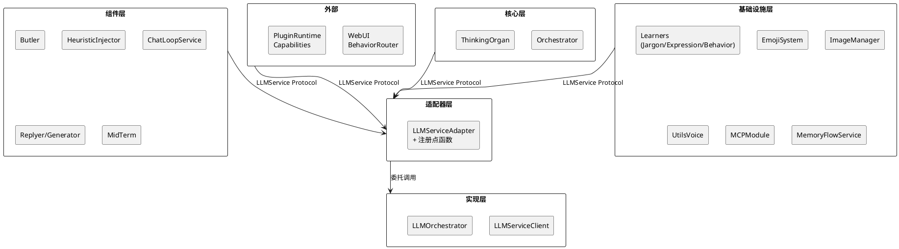
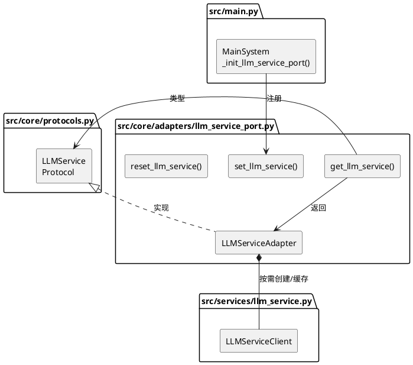
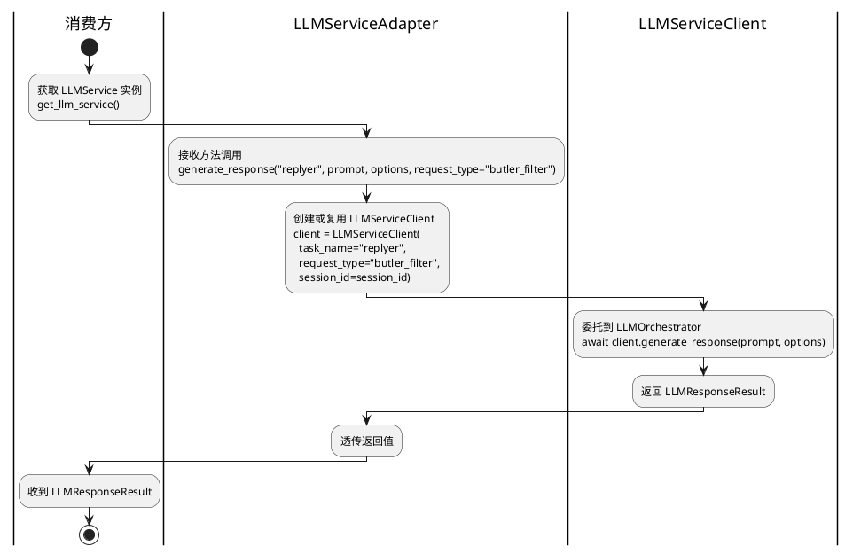
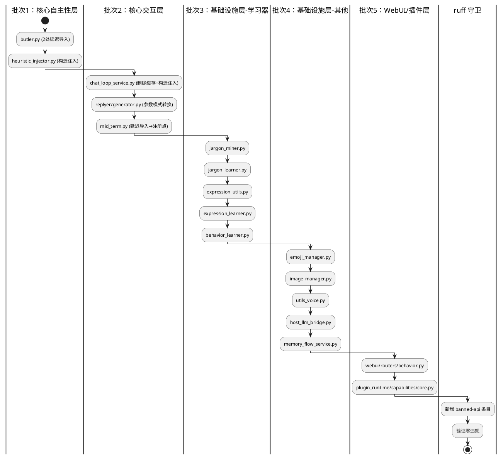
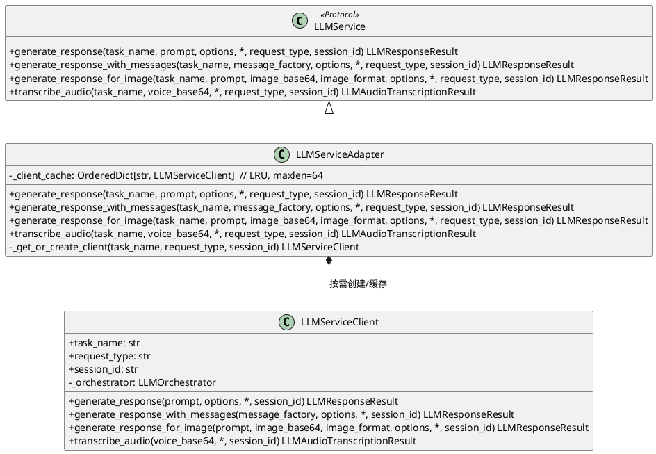

# 一、需求与存量功能关系分析

## 1.1 需求功能与存量功能对比

### 1.1.1 已实现功能

| 需求功能　　　　　　　　　　　　　　　 | 存量功能　　　　　　　　　　　　　　　　　　　　　　　　　　　　　　　　　　　　　　　| 代码位置　　　　　　　　　　　　　　　　　　　 | 匹配度 |
| ----------------------------------------| ---------------------------------------------------------------------------------------| ------------------------------------------------| --------|
| LLM 文本生成（单轮）　　　　　　　　　 | `LLMServiceClient.generate_response()`　　　　　　　　　　　　　　　　　　　　　　　　| `src/services/llm_service.py:172`　　　　　　　| 100%　 |
| LLM 文本生成（消息工厂）　　　　　　　 | `LLMServiceClient.generate_response_with_messages()`　　　　　　　　　　　　　　　　　| `src/services/llm_service.py:208`　　　　　　　| 100%　 |
| LLM 图像理解　　　　　　　　　　　　　 | `LLMServiceClient.generate_response_for_image()`　　　　　　　　　　　　　　　　　　　| `src/services/llm_service.py:257`　　　　　　　| 100%　 |
| LLM 音频转写　　　　　　　　　　　　　 | `LLMServiceClient.transcribe_audio()`　　　　　　　　　　　　　　　　　　　　　　　　 | `src/services/llm_service.py:325`　　　　　　　| 100%　 |
| task_name 路由　　　　　　　　　　　　 | `LLMServiceClient.__init__(task_name)` → `LLMOrchestrator`　　　　　　　　　　　　　　| `src/services/llm_service.py:53-67`　　　　　　| 100%　 |
| request_type 统计　　　　　　　　　　　| `LLMServiceClient.__init__(request_type)` → `_record_cache_stats`　　　　　　　　　　 | `src/services/llm_service.py:53-67`　　　　　　| 100%　 |
| prompt cache 统计　　　　　　　　　　　| `LLMServiceClient._record_cache_stats()`　　　　　　　　　　　　　　　　　　　　　　　| `src/services/llm_service.py:152-170`　　　　　| 100%　 |
| 注册点模式（参考）　　　　　　　　　　 | `get_memory_service_port()`/`set_memory_service_port()`/`reset_memory_service_port()` | `src/core/adapters/memory_service.py`　　　　　| 100%　 |
| 适配器纯委托模式（参考）　　　　　　　 | `AgentConfigProviderAdapter` 包裹 `AgentConfigRegistry`　　　　　　　　　　　　　　　 | `src/core/adapters/agent_config_port.py:39-64` | 100%　 |
| ruff TID251 守卫（参考）　　　　　　　 | `pyproject.toml` banned-api 列表　　　　　　　　　　　　　　　　　　　　　　　　　　　| `pyproject.toml:88-103`　　　　　　　　　　　　| 100%　 |
| 返回类型 `LLMResponseResult`　　　　　 | 已定义在 `src/common/data_models/llm_service_data_models.py:64`　　　　　　　　　　　 | `llm_service_data_models.py:64-76`　　　　　　 | 100%　 |
| 返回类型 `LLMAudioTranscriptionResult` | 已定义在 `src/common/data_models/llm_service_data_models.py:176`　　　　　　　　　　　| `llm_service_data_models.py:176-179`　　　　　 | 100%　 |

### 1.1.2 需要扩展的功能

| 需求功能 | 存量功能 | 差异说明 | 扩展方向 |
|---------|---------|---------|---------|
| `LLMService` Protocol 定义 | 无对应 Protocol | 核心层无 LLM 服务接口契约，21 处消费方直接导入 `LLMServiceClient` | 在 `src/core/protocols.py` 新增 `LLMService` Protocol，定义 4 个方法签名，`task_name` 从构造参数提升为方法参数 |
| `LLMServiceAdapter` 适配器 | 无对应适配器 | 适配器层无 LLM 服务适配器，消费方直接创建 `LLMServiceClient` 实例 | 在 `src/core/adapters/` 新增 `llm_service_port.py`，纯委托包裹 `LLMServiceClient` |
| 注册点函数 | 无对应注册点 | LLM 服务无全局注册点，各消费方自行实例化客户端 | 在适配器文件中新增 `get_llm_service()`/`set_llm_service()`/`reset_llm_service()` |
| 启动流程注册 | 无对应启动步骤 | `MainSystem._init_components()` 未注册 LLM 服务端口 | 在 `CORE_SERVICES` 阶段新增 `_init_llm_service_port()` 启动步骤 |
| ruff banned-api 规则 | 无 `LLMServiceClient` 的 banned 条目 | `pyproject.toml` 的 banned-api 列表中无 `src.services.llm_service.LLMServiceClient` | 新增 banned-api 条目，阻止核心层和组件层直接导入 |
| `chat_loop_service` 客户端缓存消除 | `_llm_chat_clients: dict[str, LLMServiceClient]` + `_get_llm_chat_client()` | `ChatLoopService` 缓存 `LLMServiceClient` 实例，按 `task_name:request_type` 为键 | 删除缓存字典和获取方法，改为直接调用 `LLMService` 方法 |
| `replyer/generator` 参数模式转换 | `llm_client_cls` 类参数 | `BaseMaisakaReplyGenerator` 接受 `llm_client_cls` 类对象，内部 `self._llm_client_cls(task_name=...)` 创建实例 | 构造参数从 `llm_client_cls` 改为 `llm_service: LLMService`，内部调用改为 `llm_service.generate_response_with_messages(task_name, ...)` |
| A_memorix 消费方 | `self._ports.llm_api.LLMServiceClient(...)` | A_memorix 通过 `AMemorixServicePorts.llm_service` 注入整个 `llm_service` 模块，内部自行调用 `LLMServiceClient` | 本期不改动 A_memorix 端口模式（spec 明确排除），后续优化 |

### 1.1.3 需要新增的功能或接口

**Protocol 接口层**（`src/core/protocols.py`）：

1. **`LLMService` Protocol**：4 个方法
   - `generate_response(task_name, prompt, options, *, request_type, session_id) -> LLMResponseResult`
   - `generate_response_with_messages(task_name, message_factory, options, *, request_type, session_id) -> LLMResponseResult`
   - `generate_response_for_image(task_name, prompt, image_base64, image_format, options, *, request_type, session_id) -> LLMResponseResult`
   - `transcribe_audio(task_name, voice_base64, *, request_type, session_id) -> LLMAudioTranscriptionResult`
   - 依赖关系：依赖 `src/common/data_models/llm_service_data_models.py` 中的 `LLMGenerationOptions`、`LLMImageOptions`、`LLMResponseResult`、`LLMAudioTranscriptionResult`、`MessageFactory`

**适配器层**（`src/core/adapters/llm_service_port.py`）：

1. **`LLMServiceAdapter`**：纯委托适配器，包裹 `LLMServiceClient`
   - 构造函数无参数，内部按需创建 `LLMServiceClient` 实例
   - 可选地缓存客户端实例（按 `task_name:request_type:session_id` 为键）
   - 4 个方法一一委托到 `LLMServiceClient` 对应方法

2. **注册点函数**：`get_llm_service()`/`set_llm_service()`/`reset_llm_service()`

**启动流程**（`src/main.py`）：

1. **`_init_llm_service_port()`**：在 `CORE_SERVICES` 阶段注册 `LLMServiceAdapter`

**ruff 守卫**（`pyproject.toml`）：

1. **banned-api 条目**：`"src.services.llm_service.LLMServiceClient"` → 禁止直接导入

## 1.2 存量功能详细分析

### 1.2.1 LLMServiceClient 接口契约

**公共方法**（4 个，纳入 Protocol）：

| 方法 | 入参 | 出参 | 副作用 |
|------|------|------|--------|
| `generate_response` | `prompt: str`, `options: LLMGenerationOptions \| None`, `session_id: str` | `LLMResponseResult` | 调用 `LLMOrchestrator.generate_response_async`，记录 cache 统计 |
| `generate_response_with_messages` | `message_factory: MessageFactory`, `options: LLMGenerationOptions \| None`, `session_id: str` | `LLMResponseResult` | 调用 `LLMOrchestrator.generate_response_with_message_async`，记录 cache 统计 |
| `generate_response_for_image` | `prompt: str`, `image_base64: str`, `image_format: str`, `options: LLMImageOptions \| None`, `session_id: str` | `LLMResponseResult` | 调用 `LLMOrchestrator.generate_response_for_image`，图片预处理，记录 cache 统计 |
| `transcribe_audio` | `voice_base64: str`, `session_id: str` | `LLMAudioTranscriptionResult` | 调用 `LLMOrchestrator.generate_response_for_voice` |

**构造参数**：

| 参数 | 类型 | 默认值 | 作用 |
|------|------|--------|------|
| `task_name` | `str` | 必填 | 模型任务配置名称，经 `resolve_task_name()` 解析后传给 `LLMOrchestrator` |
| `request_type` | `str` | `""` | 业务类型标识，用于 cache 统计分类 |
| `session_id` | `str` | `""` | 聊天流 ID，用于 cache 统计归属 |

**私有方法/属性**（不纳入 Protocol）：

- `_orchestrator`：内部 `LLMOrchestrator` 实例
- `_record_cache_stats()`：记录 prompt cache 统计
- `_normalize_generation_options()`/`_normalize_image_options()`：规范化选项
- `_serialize_message_for_cache_stats()`/`_build_cache_stats_prompt_text()`：cache 统计辅助
- `_resolve_effective_session_id()`：解析有效 session_id

**业务规则**：

1. `task_name` 在构造时经 `resolve_task_name()` 解析，空字符串时返回首个可用任务名
2. `session_id` 在构造时 `str(session_id or "").strip()` 处理
3. `generate_response_with_messages` 的 `message_factory` 支持单参数和双参数两种签名（`inspect.signature` 检测）
4. `generate_response_for_image` 内部调用 `ImageUtils.normalize_image_base64_for_model` 预处理图片
5. `transcribe_audio` 的 `session_id` 参数当前被 `del` 忽略

**扩展点**：

- `embed_text` 方法已标记为兼容入口，委托给 `EmbeddingServiceClient`，不纳入 Protocol
- `LLMOrchestrator` 是内部调度器，消费方不应直接访问

**约束**：

1. `LLMServiceClient` 不是线程安全的——每个实例持有独立的 `LLMOrchestrator`
2. 缓存统计（`_record_cache_stats`）在每次调用后自动执行，消费方无法控制
3. `session_id` 参数在 `generate_response`/`generate_response_with_messages`/`generate_response_for_image` 中作为关键字参数传入，会覆盖构造时的 `session_id`

### 1.2.2 消费方导入模式分析

**18 处直接导入**（不含 A_memorix 内部和定义文件自身）：

| 消费方 | 导入方式 | 实例化模式 | 迁移策略 |
|--------|---------|-----------|---------|
| `butler.py` (2处) | 函数内延迟导入 | 临时实例，用完即弃 | 注册点 `get_llm_service()` |
| `heuristic_injector.py` | 模块级导入 | `__init__` 中创建 `self._impression_client` | 构造注入 `llm_service: LLMService` |
| `chat_loop_service.py` | 模块级导入 | 缓存字典 `_llm_chat_clients` + `_get_llm_chat_client()` | 构造注入 + 删除缓存 |
| `replyer/generator.py` | 模块级导入 | `llm_client_cls` 类参数 | 参数改为 `llm_service: LLMService` |
| `mid_term.py` | 函数内延迟导入 | 临时实例 | 注册点 `get_llm_service()` |
| `utils_voice.py` | 模块级导入 | 模块级实例 `asr_model` | 注册点 + 删除模块级实例 |
| `image_manager.py` | 模块级导入 | 模块级实例 `vlm` | 注册点 + 删除模块级实例 |
| `webui/routers/behavior.py` | 模块级导入 | 模块级实例 `behavior_scene_debug_model` | 注册点 + 删除模块级实例 |
| `mcp_module/host_llm_bridge.py` | 模块级导入 | `__init__` 中创建 `self._sampling_client` | 构造注入 `llm_service: LLMService` |
| `jargon_miner.py` | 模块级导入 | 模块级实例 `llm_inference` | 注册点 + 删除模块级实例 |
| `jargon_learner.py` | 模块级导入 | 模块级实例 `jargon_learn_model` | 注册点 + 删除模块级实例 |
| `expression_utils.py` | 模块级导入 | 模块级实例 `judge_llm` | 注册点 + 删除模块级实例 |
| `expression_learner.py` | 模块级导入 | 模块级实例 `express_learn_model` + `summary_model` | 注册点 + 删除模块级实例 |
| `behavior_learner.py` | 模块级导入 | 模块级实例 `behavior_learn_model` + `behavior_scene_model` + `behavior_feedback_model` | 注册点 + 删除模块级实例 |
| `emoji_manager.py` | 模块级导入 | 模块级实例 `emoji_manager_vlm` + `emoji_manager_emotion_judge_llm` | 注册点 + 删除模块级实例 |
| `memory_flow_service.py` | 函数内延迟导入 | `self._extractor` 懒初始化 | 构造注入 `llm_service: LLMService` |
| `plugin_runtime/capabilities/core.py` | 函数内延迟导入 | 临时实例 | 注册点 `get_llm_service()` |

**A_memorix 内部**（4 处，本期不迁移）：

| 消费方 | 导入方式 | 说明 |
|--------|---------|--------|
| `sdk_memory_kernel.py` | `self._ports.llm_api.LLMServiceClient(...)` | 通过 `AMemorixServicePorts.llm_service` 注入整个模块 |
| `fuzzy_modify.py` | `self._llm_api.LLMServiceClient(...)` | 同上 |
| `feedback_correction.py` | `self._llm_api.LLMServiceClient(...)` | 同上 |
| `model_routing.py` | `llm_api.LLMServiceClient(...)` | 同上，且直接访问 `client._orchestrator.model_for_task` |

### 1.2.3 现有注册点模式参考

项目中已有 3 套注册点模式，SSD-7 应与之一致：

| 注册点 | 文件位置 | 模式 |
|--------|---------|------|
| `get_memory_service_port()`/`set_memory_service_port()`/`reset_memory_service_port()` | `src/core/adapters/memory_service.py` | 模块级 `_provider` 变量 + 全局函数 |
| `get_agent_config_provider()`/`set_agent_config_provider()`/`reset_agent_config_provider()` | `src/core/adapters/agent_config_port.py` | 模块级 `_provider` 变量 + 全局函数 |
| `get_model_config_port()`（无 set/reset，构造注入） | `src/core/adapters/model_config_port.py` | 构造注入到消费方 |

**选择理由**：`LLMService` 使用与 `MemoryServicePort`/`AgentConfigProvider` 一致的注册点模式（`get/set/reset` 三件套），原因：

1. 消费方分散在多个模块，构造注入不现实（如模块级实例、函数内延迟导入）
2. 注册点模式已在项目中验证过 3 次，团队熟悉
3. 启动流程中统一注册，保证时序可控

### 1.2.4 现有适配器模式参考

`AgentConfigProviderAdapter`（`src/core/adapters/agent_config_port.py:39-64`）是最简洁的参考实现：

- 构造函数接受被包裹对象
- 所有方法纯委托，无额外逻辑
- 注册点函数在同一文件中定义

SSD-7 的 `LLMServiceAdapter` 需要稍作调整——构造函数无参数，内部按需创建 `LLMServiceClient` 实例，因为 `task_name` 从构造参数提升为了方法参数。

# 二、增量设计方案

## 2.1 实现模型

### 2.1.1 上下文视图



**通信协议**：所有消费方通过 `LLMService` Protocol 异步调用适配器，适配器内部同步创建 `LLMServiceClient` 实例后异步委托。

**调用频率**：高频——每次智能体思考、管家过滤、学习器推理、回复生成均需调用。

### 2.1.2 服务/组件总体架构



**模块划分**：

| 模块 | 职责 |
|------|------|
| `LLMService` Protocol | 定义 4 个方法签名，核心层和组件层只依赖此接口 |
| `LLMServiceAdapter` | 纯委托适配器，包裹 `LLMServiceClient`，按需创建实例 |
| 注册点函数 | 全局单例管理，与 `MemoryServicePort`/`AgentConfigProvider` 模式一致 |
| 启动注册步骤 | 在 `CORE_SERVICES` 阶段创建适配器并注册 |

**核心类职责**：

- `LLMServiceAdapter`：4 个公共方法，每个方法内部创建或复用 `LLMServiceClient(task_name=..., request_type=..., session_id=...)` 实例，然后委托调用
- 可选缓存：按 `task_name:request_type:session_id` 为键缓存客户端实例，避免重复创建（与现有消费方自建实例等价）

### 2.1.3 实现设计文档

#### 调用模式转换流程



#### 5 批次迁移流程



## 2.2 接口设计

### 2.2.1 总体设计

**接口分类**：按调用模式分为 4 类

| 接口 | 分类 | 稳定性 | 说明 |
|------|------|--------|------|
| `generate_response` | 文本生成 | 稳定 | 单轮文本生成，最常用 |
| `generate_response_with_messages` | 文本生成 | 稳定 | 基于消息工厂生成，replyer/planner 使用 |
| `generate_response_for_image` | 多模态 | 稳定 | 图像理解，emoji/image_manager 使用 |
| `transcribe_audio` | 语音 | 稳定 | 音频转写，utils_voice/plugin 使用 |

**接口变更策略**：

1. `LLMService` Protocol 一旦定义，方法签名不再变更
2. 新增能力（如流式生成）通过新增方法扩展，不修改现有方法
3. 返回类型 `LLMResponseResult`/`LLMAudioTranscriptionResult` 由 `common` 层定义，SSD-7 不修改

### 2.2.2 接口清单

#### `LLMService` Protocol

**接口签名**：

```python
@runtime_checkable
class LLMService(Protocol):
    async def generate_response(
        self,
        task_name: str,
        prompt: str,
        options: LLMGenerationOptions | None = None,
        *,
        request_type: str = "",
        session_id: str = "",
    ) -> LLMResponseResult: ...

    async def generate_response_with_messages(
        self,
        task_name: str,
        message_factory: MessageFactory,
        options: LLMGenerationOptions | None = None,
        *,
        request_type: str = "",
        session_id: str = "",
    ) -> LLMResponseResult: ...

    async def generate_response_for_image(
        self,
        task_name: str,
        prompt: str,
        image_base64: str,
        image_format: str,
        options: LLMImageOptions | None = None,
        *,
        request_type: str = "",
        session_id: str = "",
    ) -> LLMResponseResult: ...

    async def transcribe_audio(
        self,
        task_name: str,
        voice_base64: str,
        *,
        request_type: str = "",
        session_id: str = "",
    ) -> LLMAudioTranscriptionResult: ...
```

**业务说明**：`LLMService` 是核心层和组件层访问 LLM 能力的统一接口。消费方不再创建 `LLMServiceClient` 实例，而是通过 `get_llm_service()` 获取全局实例后直接调用方法。`task_name` 从构造参数提升为方法参数，确保每次调用都明确指定任务类型。

**前置条件**：

1. `set_llm_service()` 已在启动流程中调用
2. `task_name` 对应的模型任务配置存在

**后置条件**：

1. 返回 `LLMResponseResult` 或 `LLMAudioTranscriptionResult`，与直接使用 `LLMServiceClient` 完全一致
2. prompt cache 统计由适配器内部的 `LLMServiceClient` 实例自动记录

**异常映射**：

| 场景 | 异常类型 | 来源 |
|------|---------|------|
| `LLMService` 未注册 | `RuntimeError("LLMService 未注册，请先调用 set_llm_service()")` | 注册点函数 |
| `task_name` 不存在 | `ValueError` | `LLMOrchestrator` 内部 |
| LLM 调用失败 | 原始异常透传 | `LLMOrchestrator` |
| 图片格式不支持 | 原始异常透传 | `ImageUtils` 或模型端 |

**调用示例**：

```python
# 旧模式
from src.services.llm_service import LLMServiceClient
client = LLMServiceClient(task_name="replyer", request_type="butler_filter")
result = await client.generate_response(prompt, options)

# 新模式
from src.core.adapters.llm_service_port import get_llm_service
llm_service = get_llm_service()
result = await llm_service.generate_response("replyer", prompt, options, request_type="butler_filter")
```

#### 注册点函数

**接口签名**：

```python
def get_llm_service() -> LLMService:
    """获取全局 LLMService 实例。未注册时抛出 RuntimeError。"""

def set_llm_service(service: LLMService) -> None:
    """注册全局 LLMService 实例。重复注册时覆盖旧实例并记录 warning 日志。"""

def reset_llm_service() -> None:
    """重置全局实例（仅用于测试）。"""
```

**业务说明**：与 `MemoryServicePort`/`AgentConfigProvider` 注册点模式完全一致。

**前置条件**：`set_llm_service()` 在启动流程 `CORE_SERVICES` 阶段调用。

**后置条件**：`get_llm_service()` 返回已注册的 `LLMService` 实例。

**异常映射**：

| 场景 | 异常 |
|------|------|
| 未注册时调用 `get_llm_service()` | `RuntimeError("LLMService 未注册，请先调用 set_llm_service()")` |

## 2.3 数据模型

### 2.3.1 设计目标

1. **支持的业务场景**：文本生成、图像理解、音频转写、消息工厂生成
2. **性能目标**：适配器层零开销，调用响应时间与直接使用 `LLMServiceClient` 一致
3. **兼容策略**：返回类型与现有完全一致，不修改 `LLMResponseResult`/`LLMAudioTranscriptionResult` 等数据模型

### 2.3.2 模型实现



**对象创建策略**：

- `LLMServiceAdapter`：启动时由 `MainSystem._init_llm_service_port()` 创建并注册，全局单例
- `LLMServiceClient`：适配器内部按需创建，可选缓存（按 `task_name:request_type:session_id` 为键）

**持久化策略**：

- `LLMServiceAdapter` 和 `LLMServiceClient` 均为无状态服务对象，无需持久化
- 缓存的客户端实例与现有消费方自建实例等价，生命周期与适配器一致

**关键设计决策**：

1. **`task_name` 从构造参数提升为方法参数**：消费方不再创建客户端实例，每次调用明确指定任务类型，防止遗漏
2. **适配器 LRU 缓存**：缓存键为 `task_name:request_type:session_id`，使用 `OrderedDict` 实现 LRU 淘汰（maxlen=64），防止 session_id 无限增长导致内存泄漏。与 `chat_loop_service` 现有缓存策略等价，但由适配器统一管理且增加淘汰机制
3. **`request_type` 默认空字符串**：与 `LLMServiceClient.__init__` 行为一致，仅用于统计和日志分类
4. **`session_id` 作为关键字参数**：与 `LLMServiceClient` 方法签名一致，可选覆盖