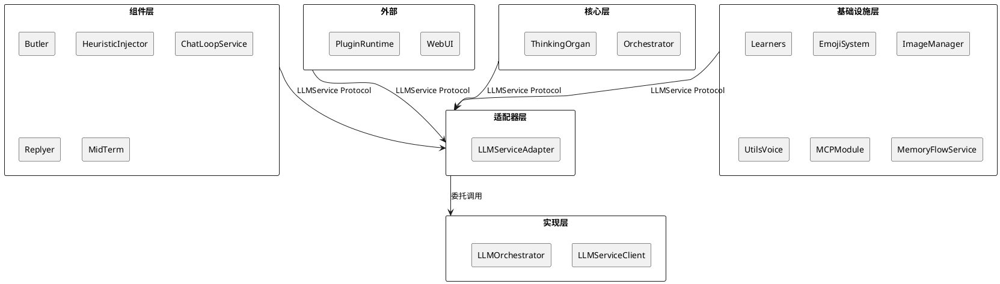
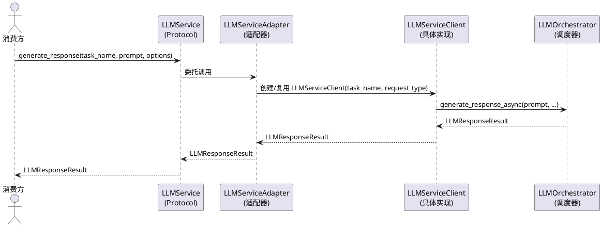
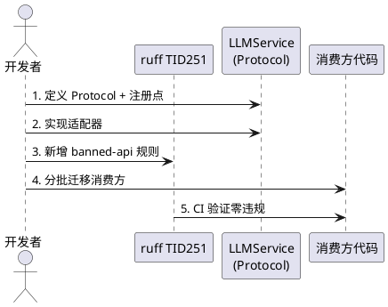
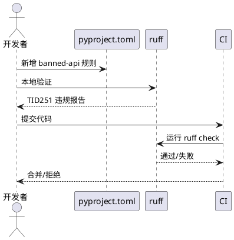

# SSD-7：LLM 服务协议化

## 1. 组件定位

### 1.1 核心职责

本组件负责将 LLM 服务调用从 `LLMServiceClient` 具体实现类解耦为 `LLMService` Protocol 接口，使核心层和组件层通过接口契约访问 LLM 能力，不再直接依赖具体实现类。

### 1.2 核心输入

1. **核心层/组件层的 LLM 调用请求**：通过 `LLMService` Protocol 发起的文本生成、图像理解、音频转写等调用
2. **任务配置参数**：`task_name`（模型任务名）和 `request_type`（业务类型标识），作为方法参数传入
3. **启动流程的服务注册信号**：`StartupOrchestrator` 阶段触发 `LLMService` 适配器注册

### 1.3 核心输出

1. **LLMResponseResult**：文本生成结果（含响应文本、token 统计、模型名等）
2. **LLMAudioTranscriptionResult**：音频转写结果
3. **缓存统计记录**：prompt cache 命中/未命中统计，由适配器层内部处理

### 1.4 职责边界

本组件**不负责**：

1. **模型配置查询**：`task_name` 解析和模型选择仍由 `ModelConfigPort` 负责
2. **嵌入向量生成**：`embed_text` 方法已标记为兼容入口，推荐改用 `EmbeddingServiceClient`，SSD-7 不将其纳入 Protocol
3. **LLM 供应商调度**：模型路由、多模型切换仍由 `LLMOrchestrator` 内部处理
4. **消息格式转换**：`_build_message_from_dict` 等辅助函数属于 `llm_service` 模块内部实现，不暴露为 Protocol
5. **A_memorix 的 llm_api 端口**：A_memorix 已通过 `AMemorixServicePorts.llm_service` 注入整个 `llm_service` 模块，SSD-7 仅处理核心层和组件层的直接导入，A_memorix 的端口迁移作为后续优化

## 2. 领域术语

**LLMService**
: LLM 服务的 Protocol 接口，定义核心层和组件层访问 LLM 能力的契约。核心只依赖此接口，不依赖 `LLMServiceClient` 具体类。方法签名包含 `task_name` 和 `request_type` 参数，消费方无需创建客户端实例。

**LLMServiceClient**
: LLM 服务的具体实现类，面向上层模块的对象式门面。当前消费方通过 `LLMServiceClient(task_name="xxx")` 创建实例后调用方法。SSD-7 后将被 `LLMService` 适配器包裹，消费方不再直接引用。

**task_name**
: 模型任务配置名称，对应 `model_task_config` 下的字段名（如 `replyer`、`planner`、`utils`、`vlm`、`voice`、`learner`、`embedding`）。决定使用哪个模型和参数。

**request_type**
: 当前请求的业务类型标识（如 `butler_filter`、`jargon.inference`、`emoji.see`）。用于统计和日志分类，不影响模型选择。

**ruff TID251 守卫**
: ruff 的 flake8-tidy-imports 规则，用于在 CI 层面禁止特定模块的直接导入。SSD-7 需新增 `src.services.llm_service.LLMServiceClient` 到 banned-api 列表。

## 3. 角色与边界

### 3.1 核心角色

- **核心层消费者**（Orchestrator/ThinkingOrgan 等）：通过 `LLMService` Protocol 调用 LLM 能力，不再直接导入 `LLMServiceClient`
- **组件层消费者**（butler/heuristic_injector/chat_loop_service/replyer/mid_term 等）：同样通过 `LLMService` Protocol 调用
- **基础设施层消费者**（learners/emoji_system/image_manager/utils_voice/mcp_module 等）：通过 `LLMService` Protocol 调用
- **WebUI 管理员**：通过 WebUI 路由调用 LLM 能力，走 `LLMService` Protocol

### 3.2 外部系统

- **LLMOrchestrator**：底层模型调度器，`LLMServiceClient` 的内部依赖，SSD-7 不改动
- **ModelConfigPort**：模型配置查询端口，`task_name` 解析的最终提供者
- **EmbeddingServiceClient**：嵌入向量服务，`embed_text` 的推荐替代，SSD-7 不改动
- **A_memorix ServicePorts**：A_memorix 的外部服务端口容器，当前注入整个 `llm_service` 模块

### 3.3 交互上下文

## 4. DFX约束

### 4.1 性能

1. **调用响应时间**：适配器层零开销，LLM 调用响应时间与直接使用 `LLMServiceClient` 一致
2. **实例创建开销**：适配器内部可缓存 `LLMServiceClient` 实例（按 `task_name:request_type` 为键），避免重复创建
3. **内存占用**：适配器层不引入额外内存开销，缓存的客户端实例与现有消费方自建实例等价

### 4.2 可靠性

1. **调用失败处理**：LLM 调用失败时异常向上传播，适配器层不捕获不兜底
2. **单例一致性**：全局只存在一个 `LLMService` 实例（通过注册点管理），避免多实例导致缓存统计不一致
3. **降级策略**：如果 `LLMService` 未注册，查询时必须立即报错（RuntimeError），不用空客户端兜底

### 4.3 安全性

1. **接口隔离**：`LLMService` Protocol 只暴露 4 个公共方法，不暴露 `_orchestrator`、`_record_cache_stats` 等内部实现
2. **ruff 守卫**：新增 `src.services.llm_service.LLMServiceClient` 到 banned-api 列表，CI 层面阻止新增违规导入

### 4.4 可维护性

1. **注册点模式**：与 `MemoryServicePort`/`ModelConfigPort`/`AgentConfigProvider` 一致，使用 `get_llm_service()`/`set_llm_service()`/`reset_llm_service()` 注册点管理
2. **日志规范**：适配器层使用 `core.adapters.llm_service` 命名空间的 logger
3. **迁移可追踪**：每批次迁移后通过 `rg "from src.services.llm_service import LLMServiceClient" src/` 验证剩余引用数

### 4.5 兼容性

1. **方法签名对齐**：`LLMService` 的方法签名与 `LLMServiceClient` 的公共方法一一对应，仅增加 `task_name` 和 `request_type` 参数
2. **返回类型不变**：返回的 `LLMResponseResult`/`LLMAudioTranscriptionResult` 与现有完全一致
3. **渐进式迁移**：适配器先包裹现有 `LLMServiceClient`，不改变其内部实现

## 5. 核心能力

### 5.1 LLM 服务调用

#### 5.1.1 业务规则

1. **Protocol 定义规则**：`LLMService` Protocol 必须定义以下 4 个方法，覆盖消费方实际使用的 `LLMServiceClient` 公共方法：
   - `generate_response(task_name, prompt, options, *, request_type, session_id) -> LLMResponseResult`：单轮文本生成
   - `generate_response_with_messages(task_name, message_factory, options, *, request_type, session_id) -> LLMResponseResult`：基于消息工厂生成响应
   - `generate_response_for_image(task_name, prompt, image_base64, image_format, options, *, request_type, session_id) -> LLMResponseResult`：图像理解
   - `transcribe_audio(task_name, voice_base64, *, request_type, session_id) -> LLMAudioTranscriptionResult`：音频转写
   a. 验收条件：[核心层调用 `llm_service.generate_response("replyer", prompt, options, request_type="butler_filter")`] → [返回 LLMResponseResult，与直接使用 `LLMServiceClient(task_name="replyer", request_type="butler_filter").generate_response(prompt, options)` 完全一致]
   b. 验收条件：[核心层调用 `llm_service.transcribe_audio("voice", voice_base64, request_type="audio")`] → [返回 LLMAudioTranscriptionResult，与直接使用 `LLMServiceClient(task_name="voice", request_type="audio").transcribe_audio(voice_base64)` 完全一致]
   c. 验收条件：[核心层调用 `llm_service.generate_response_for_image("vlm", prompt, image_base64, image_format)`] → [返回 LLMResponseResult，与直接使用 `LLMServiceClient(task_name="vlm").generate_response_for_image(...)` 完全一致]

2. **注册点规则**：必须提供全局注册点函数，与 `MemoryServicePort`/`ModelConfigPort`/`AgentConfigProvider` 模式一致：
   - `get_llm_service() -> LLMService`：获取全局实例，未注册时抛出 RuntimeError
   - `set_llm_service(service: LLMService) -> None`：注册全局实例
   - `reset_llm_service() -> None`：重置全局实例（仅用于测试）
   a. 验收条件：[未注册时调用 `get_llm_service()`] → [抛出 RuntimeError，提示"LLMService 未注册"]
   b. 验收条件：[注册后调用 `get_llm_service()`] → [返回已注册的实例]
   c. 验收条件：[测试中调用 `reset_llm_service()`] → [全局实例被清除，后续查询抛出 RuntimeError]

3. **适配器实现规则**：`LLMServiceAdapter` 必须包裹现有 `LLMServiceClient`，所有方法委托调用：
   - 构造函数无需参数（适配器内部按需创建 `LLMServiceClient` 实例）
   - 每个方法内部创建或复用 `LLMServiceClient(task_name=..., request_type=..., session_id=...)` 实例
   - 可选地缓存客户端实例（按 `task_name:request_type:session_id` 为键），避免重复创建
   - 不引入额外的缓存、转换或延迟加载逻辑
   a. 验收条件：[适配器的 `generate_response()` 返回值] → [与直接调用 `LLMServiceClient(task_name=..., request_type=...).generate_response(...)` 完全一致]

4. **禁止项**：`LLMService` Protocol 禁止暴露以下内部实现细节：
   - `_orchestrator` 内部调度器
   - `_record_cache_stats` 缓存统计方法
   - `_normalize_generation_options`/`_normalize_image_options` 规范化方法
   - `embed_text` 兼容入口（推荐改用 `EmbeddingServiceClient`）
   a. 验收条件：[审查 Protocol 定义] → [不包含上述任何私有方法或兼容入口]

5. **task_name 参数必填规则**：所有 Protocol 方法的 `task_name` 参数为必填位置参数，不提供默认值：
   - `task_name` 决定使用哪个模型和参数，是每次调用的核心路由信息
   - 不提供默认值可防止消费方遗漏，确保每次调用都明确指定任务类型
   a. 验收条件：[调用 `llm_service.generate_response(prompt="hello")` 不传 task_name] → [Python 类型检查报错或运行时 TypeError]

6. **request_type 参数可选规则**：`request_type` 为可选关键字参数，默认空字符串：
   - `request_type` 仅用于统计和日志分类，不影响模型选择
   - 保留默认空字符串与现有 `LLMServiceClient.__init__` 行为一致
   a. 验收条件：[调用 `llm_service.generate_response("replyer", prompt)` 不传 request_type] → [正常执行，request_type 为空字符串]

#### 5.1.2 交互流程

#### 5.1.3 异常场景

1. **LLMService 未注册**
   a. 触发条件：消费方调用 `get_llm_service()` 但尚未注册
   b. 系统行为：抛出 RuntimeError，消息为 "LLMService 未注册，请先调用 set_llm_service()"
   c. 用户感知：启动失败，日志中显示明确的注册时序错误

2. **LLM 调用失败**
   a. 触发条件：模型服务不可用、网络超时、API 额度耗尽等
   b. 系统行为：`LLMOrchestrator` 抛出异常，适配器层不捕获，向上传播
   c. 用户感知：调用方收到异常，日志中显示 LLM 错误详情

3. **task_name 不存在**
   a. 触发条件：传入的 `task_name` 在模型配置中不存在
   b. 系统行为：`LLMOrchestrator` 内部抛出 ValueError
   c. 用户感知：调用方收到 ValueError，提示任务名不存在

4. **图片格式不支持**
   a. 触发条件：`generate_response_for_image` 传入不支持的图片格式
   b. 系统行为：`ImageUtils.normalize_image_base64_for_model` 或模型端抛出异常
   c. 用户感知：调用方收到异常

### 5.2 消费方迁移

#### 5.2.1 业务规则

1. **迁移优先级规则**：按对核心架构的影响程度分批迁移，优先迁移核心层消费者：
   - **批次1（核心自主性层）**：`src/maisaka/agent_autonomy/` 下的消费者（butler/heuristic_injector）
   - **批次2（核心交互层）**：`src/maisaka/chat_loop_service.py`、`src/maisaka/replyer/`、`src/maisaka/memory/mid_term.py`
   - **批次3（基础设施层-学习器）**：`src/learners/` 下的消费者（jargon_miner/jargon_learner/expression_utils/expression_learner/behavior_learner）
   - **批次4（基础设施层-其他）**：`src/emoji_system/`、`src/chat/image_system/`、`src/common/utils/utils_voice.py`、`src/mcp_module/`、`src/services/memory_flow_service.py`
   - **批次5（WebUI/插件层）**：`src/webui/routers/behavior.py`、`src/plugin_runtime/capabilities/core.py`
   a. 验收条件：[每批次迁移完成后运行 `rg "from src.services.llm_service import LLMServiceClient" src/`] → [该批次对应的文件不再出现在结果中]

2. **迁移模式规则**：所有消费方必须按统一模式迁移：
   - **构造注入优先**：如果消费方已有构造函数，在构造函数中接受 `LLMService` 参数
   - **注册点兜底**：如果消费方无法构造注入（如模块级函数），使用 `get_llm_service()` 获取实例
   - **禁止延迟导入**：迁移后不再出现 `from src.services.llm_service import LLMServiceClient` 的函数内延迟导入
   a. 验收条件：[审查迁移后的代码] → [不再存在 `from src.services.llm_service import LLMServiceClient` 导入语句]
   b. 验收条件：[审查迁移后的代码] → [不再存在 `LLMServiceClient(...)` 直接实例化]

3. **调用模式转换规则**：迁移时消费方的调用模式从"创建客户端实例+调用方法"转换为"直接调用服务方法"：
   - **旧模式**：`client = LLMServiceClient(task_name="replyer", request_type="butler_filter")` → `result = await client.generate_response(prompt, options)`
   - **新模式**：`result = await llm_service.generate_response("replyer", prompt, options, request_type="butler_filter")`
   - **模块级实例消除**：`asr_model = LLMServiceClient(task_name="voice", request_type="audio")` → 直接调用 `llm_service.transcribe_audio("voice", voice_base64, request_type="audio")`
   a. 验收条件：[审查迁移后的代码] → [不再存在模块级 `LLMServiceClient` 实例]
   b. 验收条件：[审查迁移后的代码] → [不再存在 `LLMServiceClient` 类型的实例变量]

4. **chat_loop_service 缓存迁移规则**：`chat_loop_service.py` 当前缓存 `LLMServiceClient` 实例（`_llm_chat_clients: dict[str, LLMServiceClient]`），迁移后：
   - 删除 `_llm_chat_clients` 缓存字典
   - 删除 `_get_llm_chat_client()` 方法
   - 所有调用改为直接使用 `LLMService` 的方法，`task_name` 和 `request_type` 作为参数传入
   a. 验收条件：[审查 `chat_loop_service.py`] → [不再存在 `_llm_chat_clients` 和 `_get_llm_chat_client`]
   b. 验收条件：[审查 `chat_loop_service.py`] → [所有 LLM 调用通过 `LLMService` Protocol]

5. **replyer/generator 注入迁移规则**：`replyer/generator.py` 当前接受 `llm_client_cls` 参数，迁移后：
   - 构造函数参数从 `llm_client_cls` 改为 `llm_service: LLMService`
   - 内部调用从 `self._llm_client_cls(task_name=..., request_type=...).generate_response_with_messages(...)` 改为 `self._llm_service.generate_response_with_messages(task_name, ..., request_type=...)`
   a. 验收条件：[审查 `generator.py` 构造函数] → [参数类型为 `LLMService` Protocol]
   b. 验收条件：[审查 `generator.py` 内部调用] → [通过 `LLMService` 方法调用]

6. **禁止项**：迁移过程中禁止以下行为：
   - 禁止在核心层（`src/core/`）导入 `LLMServiceClient`（ruff TID251 守卫阻止）
   - 禁止在适配器层（`src/core/adapters/`）以外的任何地方导入 `LLMServiceClient`
   - 禁止修改 `LLMResponseResult`/`LLMAudioTranscriptionResult` 等返回类型的数据模型
   - 禁止修改 `LLMGenerationOptions`/`LLMImageOptions` 等选项类型的数据模型
   a. 验收条件：[运行 ruff check] → [核心层和组件层不再有 `LLMServiceClient` 导入违规]

#### 5.2.2 交互流程

#### 5.2.3 异常场景

1. **迁移遗漏**
   a. 触发条件：某文件遗漏迁移，仍直接导入 `LLMServiceClient`
   b. 系统行为：ruff TID251 守卫在 CI 中报错
   c. 用户感知：CI 不通过，错误信息指向具体文件和行号

2. **循环依赖**
   a. 触发条件：`LLMService` 的注册点模块导入了消费方模块
   b. 系统行为：Python 启动时 ImportError
   c. 用户感知：启动失败，日志中显示循环导入链

3. **注册时序错误**
   a. 触发条件：消费方在 `set_llm_service()` 之前调用 `get_llm_service()`
   b. 系统行为：抛出 RuntimeError
   c. 用户感知：启动失败，日志中显示明确的注册时序错误

### 5.3 ruff 守卫与验证

#### 5.3.1 业务规则

1. **banned-api 规则**：在 `pyproject.toml` 的 `[tool.ruff.lint.flake8-tidy-imports.banned-api]` 中新增：
   - `"src.services.llm_service.LLMServiceClient"` → 禁止直接导入，提示使用 `LLMService` Protocol 接口
   a. 验收条件：[在核心层文件中添加 `from src.services.llm_service import LLMServiceClient`] → [ruff check 报 TID251 错误]

2. **per-file-ignores 规则**：以下文件允许导入 `LLMServiceClient`（适配器层和启动入口）：
   - `src/core/adapters/*`：已有 TID251 豁免
   - `src/main.py`：已有 TID251 豁免（启动时创建适配器需要导入具体类）
   - `src/services/llm_service.py`：定义文件本身
   a. 验收条件：[审查 per-file-ignores 配置] → [仅适配器层、启动入口和定义文件有 TID251 豁免]

3. **迁移完成验证规则**：全部迁移完成后，运行以下验证：
   - `rg "from src.services.llm_service import LLMServiceClient" src/` → 仅剩适配器层、main.py 和 llm_service.py 自身
   - `rg "LLMServiceClient(" src/` → 仅剩适配器层、main.py 和 llm_service.py 自身
   - `ruff check src/` → 零 TID251 违规
   a. 验收条件：[运行上述 3 条命令] → [结果符合预期，核心层和组件层零违规]

#### 5.3.2 交互流程

#### 5.3.3 异常场景

1. **banned-api 误杀**
   a. 触发条件：banned-api 规则过于宽泛，阻止了合法的适配器层导入
   b. 系统行为：ruff 误报 TID251 错误
   c. 用户感知：CI 误报失败，需调整 per-file-ignores 或细化 banned-api 规则

2. **存量违规未清理**
   a. 触发条件：迁移批次中遗漏了某些文件，ruff 报错但被 per-file-ignores 豁免
   b. 系统行为：存量违规被豁免掩盖
   c. 用户感知：需审查 per-file-ignores 列表，确保不新增不必要的豁免

## 6. 数据约束

### 6.1 LLMService（Protocol 接口）

1. **generate_response**：接受 `task_name`(str, 必填)、`prompt`(str, 必填)、`options`(LLMGenerationOptions | None, 可选)、`request_type`(str, 可选, 默认"")、`session_id`(str, 可选, 默认"")，返回 LLMResponseResult
2. **generate_response_with_messages**：接受 `task_name`(str, 必填)、`message_factory`(MessageFactory, 必填)、`options`(LLMGenerationOptions | None, 可选)、`request_type`(str, 可选, 默认"")、`session_id`(str, 可选, 默认"")，返回 LLMResponseResult
3. **generate_response_for_image**：接受 `task_name`(str, 必填)、`prompt`(str, 必填)、`image_base64`(str, 必填)、`image_format`(str, 必填)、`options`(LLMImageOptions | None, 可选)、`request_type`(str, 可选, 默认"")、`session_id`(str, 可选, 默认"")，返回 LLMResponseResult
4. **transcribe_audio**：接受 `task_name`(str, 必填)、`voice_base64`(str, 必填)、`request_type`(str, 可选, 默认"")、`session_id`(str, 可选, 默认"")，返回 LLMAudioTranscriptionResult

### 6.2 LLMResponseResult（数据模型，SSD-7 不修改）

1. **response_text**：响应文本内容，字符串
2. **model_name**：使用的模型名称，字符串
3. **prompt_tokens**：输入 token 数，整数
4. **completion_tokens**：输出 token 数，整数
5. **prompt_cache_hit_tokens**：缓存命中 token 数，整数
6. **prompt_cache_miss_tokens**：缓存未命中 token 数，整数
7. **tool_calls**：工具调用列表，可选
8. **其他字段**：详见 `src/common/data_models/llm_service_data_models.py`，SSD-7 不做任何修改

### 6.3 注册点函数

1. **get_llm_service**：无参数，返回 LLMService 实例。未注册时抛出 RuntimeError
2. **set_llm_service**：接受 LLMService 参数，无返回值。重复注册时覆盖旧实例并记录 warning 日志
3. **reset_llm_service**：无参数，无返回值。清除已注册实例（仅用于测试）

## 附录：不在范围内的事项

1. **LLMServiceClient 内部重构**：不修改 `LLMServiceClient` 的内部实现、方法签名或字段
2. **LLMOrchestrator 重构**：不修改底层模型调度器的实现
3. **EmbeddingServiceClient 协议化**：`embed_text` 已标记为兼容入口，推荐改用 `EmbeddingServiceClient`，不在本期 Protocol 化范围
4. **A_memorix llm_api 端口迁移**：A_memorix 已通过 `AMemorixServicePorts.llm_service` 注入整个 `llm_service` 模块，本期不改动此端口模式；后续可将 `AMemorixServicePorts.llm_service` 从模块级注入改为 `LLMService` Protocol 注入
5. **A_memorix model_routing.py 私有属性访问**：`client._orchestrator.model_for_task = ...` 是对 LLMServiceClient 内部实现的直接访问，违反封装原则，但修复成本高且仅在 A_memorix 内部使用，不在本期范围
6. **resolve_task_name / get_available_models 协议化**：这些是模块级工具函数，`resolve_task_name` 的职责已由 `ModelConfigPort` 覆盖，`get_available_models` 是配置查询，不在 LLM 调用 Protocol 范围内
7. **LLMServiceClient 单例模式退役**：本期仅用适配器包裹，不改变其内部实现
8. **LLM 调用链路追踪**：不新增分布式追踪或链路 ID 机制
9. **多 LLM 供应商动态切换**：Protocol 化是供应商切换的前置条件，但动态切换逻辑本身不在本期范围