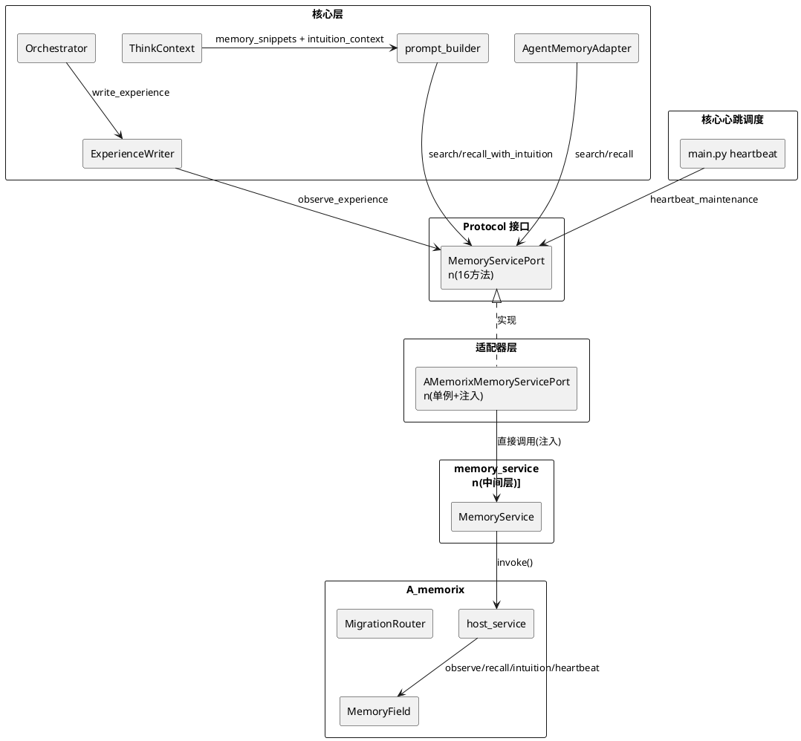
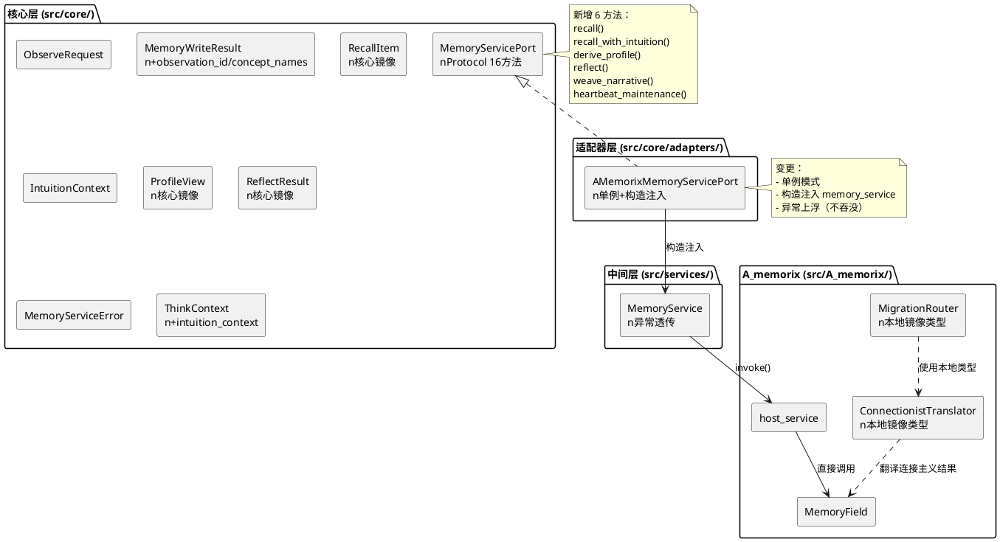
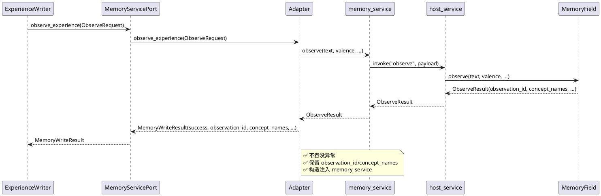
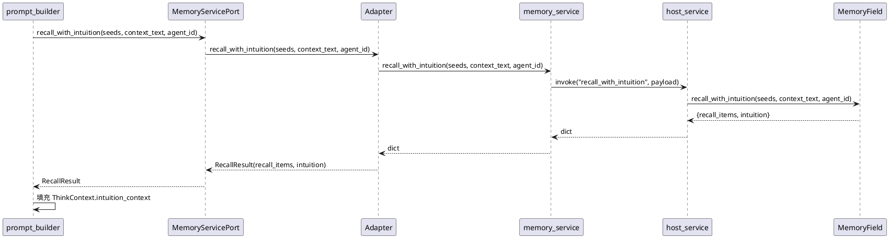
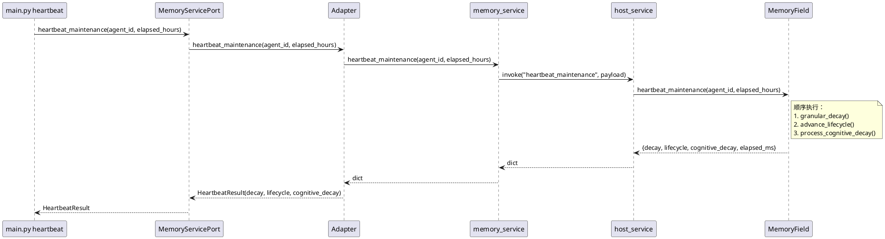
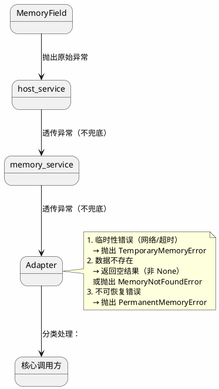
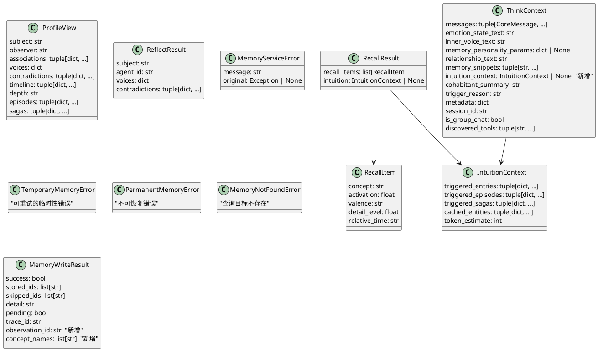

# 记忆系统与核心架构差距 — 增量设计方案

# 一、需求与存量功能关系分析

## 1.1 需求功能与存量功能对比

### 1.1.1 已实现功能

| 需求功能 | 存量功能 | 代码位置 | 匹配度 |
|---------|---------|---------|--------|
| 智能体体验写入（连接主义路径） | observe_experience() → memory_service.observe() → host_service._dispatch("observe") → MemoryField.observe() | `src/core/protocols.py:225-258` / `src/core/adapters/memory_service.py:17-48` / `src/services/memory_service.py:258-287` | 100% |
| 记忆检索（迁移路由） | search() → memory_service.migration_search() → host_service._dispatch("migration_search") → MigrationRouter.search() | `src/core/protocols.py:260-290` / `src/core/adapters/memory_service.py:50-70` / `src/services/memory_service.py:472-477` | 75% |
| 人物画像查询 | get_person_profile() → memory_service.migration_get_person_profile() → MigrationRouter.get_person_profile() | `src/core/protocols.py:292-301` / `src/core/adapters/memory_service.py:72-82` / `src/services/memory_service.py:479-482` | 75% |
| 画像管理操作 | profile_admin() → memory_service.profile_admin() → host_service._dispatch("memory_profile_admin") | `src/core/protocols.py:303-312` / `src/core/adapters/memory_service.py:84-91` | 100% |
| 记忆维护操作 | maintain_memory() → memory_service.maintain_memory() → host_service._dispatch("maintain_memory") | `src/core/protocols.py:359-379` / `src/core/adapters/memory_service.py:140-157` | 50% |
| 删除管理操作 | delete_admin() → memory_service.delete_admin() → host_service._dispatch("memory_delete_admin") | `src/core/protocols.py:381-391` / `src/core/adapters/memory_service.py:159-166` | 100% |
| 反馈纠错入队 | enqueue_feedback_task() → memory_service.enqueue_feedback_task() → host_service._dispatch("enqueue_feedback_task") | `src/core/protocols.py:393-411` / `src/core/adapters/memory_service.py:168-187` | 100% |
| 画像注入文本构建 | build_profile_injection_text() → memory_service.migration_build_profile_injection_text() → MigrationRouter.build_profile_injection_text() | `src/core/protocols.py:413-421` / `src/core/adapters/memory_service.py:189-192` | 75% |
| 记忆性格设置 | set_memory_personality() → memory_service.register_agent() → host_service._dispatch("register_agent") → MemoryField.register_agent() | `src/core/protocols.py:423-429` / `src/core/adapters/memory_service.py:194-203` | 100% |
| 废弃方法兼容 | ingest_text() — DEPRECATED，仍保留在 Protocol 中 | `src/core/protocols.py:314-357` / `src/core/adapters/memory_service.py:93-138` | 100% |

### 1.1.2 需要扩展的功能

| 需求功能 | 存量功能 | 差异说明 | 扩展方向 |
|---------|---------|---------|---------|
| 直觉召回接口（G1） | MemoryField.get_intuition() 已实现，host_service._dispatch("intuition_trigger") 已实现 | MemoryServicePort 未定义直觉召回方法；核心层无法通过 Protocol 访问 | 新增 MemoryServicePort.recall_with_intuition() 方法 |
| 连接主义召回接口（G2） | MemoryField.recall() 已实现，host_service._dispatch("recall") 已实现 | search() 走迁移路由的向量搜索，未暴露概念激活扩散召回 | 新增 MemoryServicePort.recall() 方法，返回 RecallItem 列表 |
| 画像实时视图接口（G3） | MemoryField.derive_profile() 已实现，host_service._dispatch("derive_profile") 已实现 | get_person_profile() 返回分类学画像字典，非连接主义 ProfileView | 新增 MemoryServicePort.derive_profile() 方法 |
| 心跳维护接口（G4） | MemoryField.heartbeat_maintenance() 已实现 | maintain_memory(action="decay") 仅触发 granular_decay，未触发 advance_lifecycle 和 process_cognitive_decay | 新增 MemoryServicePort.heartbeat_maintenance() 方法 |
| 叙事编织接口（G5） | MemoryField.weave_narrative() 已实现，host_service._dispatch("narrative_weave") 已实现 | MemoryServicePort 未暴露叙事编织能力 | 新增 MemoryServicePort.weave_narrative() 方法 |
| 反思接口（G6） | MemoryField.reflect() 已实现，host_service._dispatch("reflect") 已实现 | MemoryServicePort 未暴露反思能力 | 新增 MemoryServicePort.reflect() 方法 |
| search() 参数语义对齐（G8） | search(person_id=) → adapter 映射为 agent_id 传给 migration_search | 参数语义从"人物 ID"偏移为"智能体 ID"，调用方需理解内部映射 | 拆分参数语义：新增 agent_id 参数，保留 person_id 用于画像查询 |
| observe_experience() 参数统一（G9） | ObserveRequest 数据类已定义但 observe_experience() 使用关键字参数 | 两套参数定义存在维护负担 | observe_experience() 改为接受 ObserveRequest 对象 |
| MemoryWriteResult 扩展（G10） | MemoryWriteResult 仅含 success/stored_ids/skipped_ids/detail/pending/trace_id | ObserveResult 的 observation_id/concept_names/extraction 信息被丢弃 | 扩展 MemoryWriteResult 或引入 ObserveResult 镜像类型 |
| 连接主义召回结果暴露（G11） | RecallItem 仅在 A_memorix 内部使用 | search() 返回 MemorySearchResult（分类学格式），连接主义结果需翻译 | 新增 RecallResult 类型到核心层，或让 search() 支持返回原生格式 |
| 适配器实例单例化（G13） | AMemorixMemoryServicePort 在 12 处独立实例化 | 每次实例化创建新对象但底层共享 memory_service 单例 | 改为全局单例 + 依赖注入 |
| 适配器延迟导入消除（G14） | 每个方法内 `from src.services.memory_service import memory_service` | 绕过依赖注入，运行时查找单例 | 构造函数注入 memory_service |
| A_memorix/core/ 反向依赖消除（G15） | 5 处导入 src.core.*（migration_router/translator/sdk_memory_kernel/async_write_queue） | 违反"A_memorix/core/ 零违规导入"原则 | 类型镜像到 A_memorix 内部或通过 AMemorixServicePorts 注入 |
| 情绪与记忆效价联动（G17） | ExperienceWriter._emotion_to_valence() 手动映射 | valence 手动设置，未与 EmotionManager 实时情绪联动 | observe_experience() 支持从 EmotionManager 自动推导 valence |
| 直觉召回接入思考循环（G20） | ThinkContext.memory_snippets 仅含 search() 结果 | IntuitionEngine 结果未接入 ThinkContext | 扩展 ThinkContext，新增 intuition_context 字段 |
| 心跳维护接入核心调度（G25） | main.py 心跳仅调用 maintain_memory(action="decay") | 未触发 advance_lifecycle 和 process_cognitive_decay | 心跳调度改为调用 heartbeat_maintenance() |
| 适配器异常上浮（G26） | 8/8 方法吞没异常，返回空结果或 warning | 违反"不兜底"原则，掩盖真实错误 | 适配器异常策略重构：可恢复错误重试，不可恢复错误上浮 |
| get_person_profile() 返回值语义（G27） | 返回 None 既表示"不存在"也表示"查询失败" | 调用方无法区分 | 不存在返回空画像字典，失败抛出 MemoryServiceError |
| memory_service 中间层双重兜底（G29） | memory_service.py 几乎所有方法都有 except Exception | 与适配器层双重兜底，错误更难追踪 | 移除中间层兜底，让异常传播到适配器层 |

### 1.1.3 需要新增的功能或接口

**核心层新增 Protocol 方法（MemoryServicePort 扩展）**：

1. `recall()` — 概念激活扩散召回，返回连接主义原生 RecallItem 列表
2. `recall_with_intuition()` — 直觉召回（recall + intuition 合并），返回 RecallItem + 直觉触发结果
3. `derive_profile()` — 画像实时视图，返回连接主义 ProfileView
4. `reflect()` — 反思，返回 ReflectResult
5. `weave_narrative()` — 叙事编织触发
6. `heartbeat_maintenance()` — 完整心跳维护（granular_decay + advance_lifecycle + process_cognitive_decay）

**核心层新增数据模型**：

1. `RecallItem` 核心镜像类型 — 概念/激活度/效价/细节层级/相对时间
2. `IntuitionContext` — 直觉触发结果，接入 ThinkContext
3. `ProfileView` 核心镜像类型 — 关联/声音视角/矛盾/时间线/叙事弧
4. `ReflectResult` 核心镜像类型 — 多声音视角 + 矛盾检测
5. `MemoryServiceError` — 记忆服务异常基类，区分"不存在"和"失败"

**核心层修改**：

1. `ThinkContext` 扩展 — 新增 `intuition_context` 字段
2. `MemoryWriteResult` 扩展 — 新增 `observation_id` / `concept_names` 字段
3. `observe_experience()` 签名变更 — 改为接受 ObserveRequest 对象
4. `search()` 参数扩展 — 新增 `agent_id` 参数

**适配器层重构**：

1. `AMemorixMemoryServicePort` 单例化 + 构造函数注入
2. 异常策略重构 — 不吞没异常
3. 新增 6 个 Protocol 方法的适配器实现

**A_memorix/core/ 反向依赖消除**：

1. migration_router.py / translator.py — 将 `src.core.types.MemoryHit/MemorySearchResult` 替换为本地镜像类型
2. sdk_memory_kernel.py — 将 `src.core.protocols.SessionInfoPort` 替换为通过 AMemorixServicePorts 注入
3. async_write_queue.py — 将 `src.core.types.MemoryWriteResult` 替换为本地镜像类型

## 1.2 存量功能详细分析

### 1.2.1 MemoryServicePort Protocol（src/core/protocols.py:222-429）

**接口契约**：10 个方法，定义核心对记忆服务的全部需求。

**关键约束**：
- `observe_experience()` 走连接主义路径，不走分类学
- `search()` 走迁移路由，当前阶段 NEW_INDEPENDENT 下走连接主义 recall + 翻译
- `ingest_text()` 已标记 DEPRECATED，但仍保留签名
- `maintain_memory()` 的 action 参数为字符串枚举（decay/reinforce/freeze/restore/protect），无类型安全保证

**扩展点**：Protocol 是 `@runtime_checkable` 的，新增方法不破坏现有实现（Python Protocol 的鸭子类型特性）。

### 1.2.2 AMemorixMemoryServicePort 适配器（src/core/adapters/memory_service.py）

**接口契约**：实现 MemoryServicePort 的 10 个方法。

**关键问题**：
- 8/8 方法吞没异常（`except Exception` → 返回空结果或 warning）
- 每个方法内延迟导入 `from src.services.memory_service import memory_service`
- 12 处独立实例化，无单例保证
- `observe_experience()` 手动生成 trace_id（`uuid.uuid4().hex[:12]`），而非使用底层 ObserveResult 的 observation_id
- `search()` 将 person_id 映射为 agent_id 传给 migration_search()，参数语义偏移

### 1.2.3 memory_service 中间层（src/services/memory_service.py）

**接口契约**：对 host_service.invoke() 的封装，提供类型安全的 Python API。

**关键问题**：
- 几乎所有方法都有 `except Exception` 捕获并返回空结果
- `_invoke()` 方法处理多种返回格式（dict/payload/model_dump），增加复杂度
- `observe()` 方法直接调用 `host_service.invoke("observe")`，不经过迁移路由
- `migration_search()` / `migration_get_person_profile()` 等方法名含"migration_"前缀，但 NEW_INDEPENDENT 阶段已不需要迁移语义

### 1.2.4 MemoryField 连接主义核心（src/A_memorix/core/connectionist/memory_field.py）

**接口契约**：连接主义记忆系统的运行时核心，提供 observe/recall/intuition/derive_profile/reflect/heartbeat_maintenance/weave_narrative 等方法。

**关键能力**：
- `observe()` — 异步写入（AsyncWriteQueue），fire-and-forget 通知 CS/NW
- `recall()` — 概念激活扩散，感知记忆性格
- `recall_with_intuition()` — recall + intuition 合并
- `heartbeat_maintenance()` — granular_decay → advance_lifecycle → process_cognitive_decay
- `get_intuition()` — 纯规则直觉触发，迁移阶段守卫

**约束**：
- AsyncWriteQueue 延迟初始化（首次 observe() 时启动），存在竞态风险
- 迁移阶段守卫（`_is_read_allowed()`）限制直觉/认知查询
- 返回类型为 A_memorix 内部数据模型（ObserveResult/RecallItem/ProfileView 等），核心层不可直接使用

### 1.2.5 host_service 分发层（src/A_memorix/host_service.py）

**接口契约**：通过 `invoke(component_name, args)` 分发所有 A_memorix 调用。

**关键问题**：
- `_dispatch()` 方法直接访问 kernel 私有属性（`kernel._memory_field`、`kernel._migration_adapter`、`kernel._migration_router`、`kernel._admin_handlers`）
- 分发逻辑为长 if-elif 链（~30 个分支），维护困难
- `maintain_memory` 的 "decay" action 间接触发 `kernel._memory_field.granular_decay()`，但未触发 advance_lifecycle 和 process_cognitive_decay

### 1.2.6 A_memorix/core/ 反向依赖（5 处违规导入）

| 文件 | 导入内容 | 影响 |
|------|---------|------|
| `migration_router.py:6-7` | `src.core.memory_utils.coerce_search_result/coerce_write_result` + `src.core.types.MemoryHit/MemorySearchResult/MemoryWriteResult` | 核心类型变更影响迁移路由 |
| `sdk_memory_kernel.py:13` | `src.core.protocols.SessionInfoPort` | 核心接口变更影响 kernel |
| `async_write_queue.py:14` | `src.core.types.MemoryWriteResult` | 核心类型变更影响异步写入 |
| `translator.py:6` | `src.core.types.MemoryHit/MemorySearchResult` | 核心类型变更影响翻译层 |

**约束**：这些导入是当前 ruff TID251 守卫的盲区——守卫检查 `src/A_memorix/core/` 目录，但 migration/ 和 runtime/ 子目录可能未被覆盖。

# 二、增量设计方案

## 2.1 实现模型

### 2.1.1 上下文视图



### 2.1.2 服务/组件总体架构



### 2.1.3 实现设计文档

#### 核心调用链路（observe_experience 改进后）



#### 核心调用链路（recall_with_intuition 新增）



#### 心跳维护链路（改进后）



#### 异常策略（改进后）



## 2.2 接口设计

### 2.2.1 总体设计

**接口分类**：

| 分类 | 方法 | 稳定性 |
|------|------|--------|
| 写入 | observe_experience | 稳定 |
| 检索 | search, recall, recall_with_intuition | 稳定（recall 系列为新增） |
| 画像 | get_person_profile, derive_profile, reflect, profile_admin, build_profile_injection_text | 稳定（derive_profile/reflect 为新增） |
| 维护 | maintain_memory, heartbeat_maintenance, weave_narrative | 稳定（heartbeat_maintenance/weave_narrative 为新增） |
| 管理 | delete_admin, enqueue_feedback_task, set_memory_personality | 稳定 |
| 废弃 | ingest_text | 第 6 批全链路删除（不留过渡期） |

**接口变更策略**：
- 新增方法不破坏现有实现（Python Protocol 特性）
- 现有方法签名变更通过新增参数（带默认值）保证向后兼容
- ingest_text 在第 6 批全链路删除——Protocol 签名、适配器实现、中间层方法、host_service 分支、三层 DeprecationWarning 一并清理

### 2.2.2 接口清单

#### observe_experience（签名变更）

```python
async def observe_experience(self, request: ObserveRequest) -> MemoryWriteResult:
    """观察智能体的体验并写入连接主义记忆。

    Args:
        request: 连接主义记忆观察请求（统一入口）

    Returns:
        MemoryWriteResult 含 observation_id 和 concept_names

    Raises:
        PermanentMemoryError: 写入失败时抛出
    """
```

**变更说明**：参数从关键字参数改为 ObserveRequest 对象，消除参数重复定义。MemoryWriteResult 扩展 observation_id 和 concept_names 字段。

**向后兼容**：ObserveRequest 所有字段有默认值，现有调用方可逐步迁移。

#### recall（新增）

```python
async def recall(
    self,
    seeds: list[str],
    *,
    agent_id: str = "",
    min_weight: float = 0.05,
    max_results: int = 20,
) -> list[RecallItem]:
    """概念激活扩散召回——连接主义原生召回路径。

    Args:
        seeds: 概念种子列表
        agent_id: 智能体 ID（感知记忆性格）
        min_weight: 最小激活权重
        max_results: 最大返回数量

    Returns:
        RecallItem 列表（概念/激活度/效价/细节层级/相对时间）
    """
```

#### recall_with_intuition（新增）

```python
async def recall_with_intuition(
    self,
    seeds: list[str],
    context_text: str,
    *,
    agent_id: str = "",
    min_weight: float = 0.05,
    max_results: int = 20,
    max_tokens: int = 800,
) -> RecallResult:
    """直觉召回——概念激活 + 认知和叙事深度。

    Args:
        seeds: 概念种子列表
        context_text: 上下文文本（直觉触发用）
        agent_id: 智能体 ID
        min_weight: 最小激活权重
        max_results: 最大返回数量
        max_tokens: 直觉触发最大 token 估算

    Returns:
        RecallResult 含 recall_items 和 intuition
    """
```

#### derive_profile（新增）

```python
async def derive_profile(
    self,
    subject: str,
    *,
    observer: str = "",
) -> ProfileView:
    """画像实时视图——连接主义原生画像。

    Args:
        subject: 画像主体（人物/概念）
        observer: 观察者智能体 ID

    Returns:
        ProfileView 含关联/声音视角/矛盾/时间线/叙事弧
    """
```

#### reflect（新增）

```python
async def reflect(
    self,
    subject: str,
    *,
    agent_id: str = "",
) -> ReflectResult:
    """反思——多声音视角 + 矛盾检测。

    Args:
        subject: 反思主题
        agent_id: 智能体 ID

    Returns:
        ReflectResult 含 voices 和 contradictions
    """
```

#### weave_narrative（新增）

```python
async def weave_narrative(
    self,
    *,
    agent_id: str = "",
) -> dict[str, Any]:
    """触发叙事编织——Fragment → Episode → Saga。

    Args:
        agent_id: 智能体 ID（空则全部）

    Returns:
        编织结果（fragments_processed/episodes_created/sagas_created）
    """
```

#### heartbeat_maintenance（新增）

```python
async def heartbeat_maintenance(
    self,
    *,
    agent_id: str = "",
    elapsed_hours: float = 1.0,
) -> dict[str, Any]:
    """完整心跳维护——granular_decay + advance_lifecycle + process_cognitive_decay。

    Args:
        agent_id: 智能体 ID（空则全部）
        elapsed_hours: 距上次心跳的小时数

    Returns:
        维护结果（decay/lifecycle/cognitive_decay/elapsed_ms）
    """
```

#### search（参数扩展）

```python
async def search(
    self,
    query: str,
    *,
    limit: int = 5,
    mode: str = "search",
    chat_id: str = "",
    person_id: str = "",
    agent_id: str = "",  # 新增：智能体 ID，语义明确
    time_start: str | float | None = None,
    time_end: str | float | None = None,
    respect_filter: bool = True,
    user_id: str = "",
    group_id: str = "",
) -> MemorySearchResult:
```

**变更说明**：新增 `agent_id` 参数，语义为"按智能体过滤记忆"。`person_id` 保留用于"按人物查询画像"场景。适配器中 `agent_id` 优先传给 migration_search()。

#### get_person_profile（返回值语义变更）

```python
async def get_person_profile(
    self,
    person_id: str,
    *,
    limit: int = 4,
) -> dict[str, Any]:
    """查询人物画像。

    Returns:
        画像数据字典。不存在时返回空字典（非 None）。

    Raises:
        PermanentMemoryError: 查询失败时抛出
        MemoryNotFoundError: 画像不存在时抛出（或返回空字典）
    """
```

**变更说明**：返回值从 `Optional[dict]` 改为 `dict`。不存在返回空字典，失败抛出 MemoryServiceError。

## 2.3 数据模型

### 2.3.1 设计目标

1. 纯数据类型定义在 `src/common/memory_types.py`，core 和 A_memorix 都从 common 导入——不做本地镜像
2. Protocol 接口和业务语义类型留在 `src/core/types.py`（ThinkContext、ObserveRequest 等）
3. 数据模型变更向后兼容——新增字段有默认值
4. ThinkContext 扩展支持直觉上下文注入

### 2.3.2 模型实现

#### 核心层新增数据模型（src/core/types.py）



**设计决策**：

1. **数据类型下放 common 层**（CC 审查修改）：RecallItem/ProfileView/ReflectResult/MemoryHit/MemorySearchResult/MemoryWriteResult 等纯数据类型定义在 `src/common/memory_types.py`，core 和 A_memorix 都从 common 导入。不做本地镜像——"改了 core 忘了 mirror"是必然发生的事情。

2. **IntuitionContext 冻结**：使用 tuple 替代 list，保持 ThinkContext 的不可变语义。

3. **MemoryWriteResult 扩展**：新增 observation_id 和 concept_names 字段，默认值为空字符串和空列表，向后兼容。

4. **异常子类体系**（CC 审查修改）：`MemoryServiceError` 为基类，`TemporaryMemoryError`（可重试）、`PermanentMemoryError`（应放弃）、`MemoryNotFoundError`（不存在）为子类。调用方用 `except TemporaryMemoryError` 精确捕获，而非检查 `is_temporary` bool 属性。

#### A_memorix/core/ 反向依赖消除 — common 层方案

~~本地镜像类型方案已废弃（CC 审查：注定不同步，是死路）。~~

正确方案：纯数据类型定义在 `src/common/memory_types.py`，A_memorix/core/ 从 common 导入，不违规。

| 原导入 | 替换为 |
|--------|--------|
| `from src.core.types import MemoryHit, MemorySearchResult, MemoryWriteResult` | `from src.common.memory_types import MemoryHit, MemorySearchResult, MemoryWriteResult` |
| `from src.core.memory_utils import coerce_search_result, coerce_write_result` | `from src.common.memory_utils import coerce_search_result, coerce_write_result` |
| `from src.core.protocols import SessionInfoPort` | 通过 `AMemorixServicePorts` 注入 |

`src/core/memory_utils.py` 整体迁移到 `src/common/memory_utils.py`（mem_write 引入的文件，放在 core 是倒退）。

## 2.4 分批实施计划

### 第 1 批：异常暴露 + 适配器单例化（P0 基础设施）

**目标**：消除适配器层异常吞没，建立异常子类体系 + 单例模式，为后续新增方法提供正确的基础设施。

**变更范围**：
1. `src/core/types.py` — 新增 `MemoryServiceError` / `TemporaryMemoryError` / `PermanentMemoryError` / `MemoryNotFoundError` 异常子类体系
2. `src/core/adapters/memory_service.py` — 单例化 + 构造注入 + 一次性移除所有 try-except（8 处）
3. `src/services/memory_service.py` — 一次性移除所有 try-except（21 处），让异常传播
4. 12 处调用方 — 从 `AMemorixMemoryServicePort()` 改为 `get_memory_service_port()` 全局单例
5. 调用方异常处理适配 — 捕获 `TemporaryMemoryError`/`PermanentMemoryError`，降级或记录

**CC 审查关键决策**：一次性移除所有 try-except，不拆分。炸了就修调用方，暴露依赖静默降级的技术债。

**验证**：
- 现有 10 个 Protocol 方法的签名不变
- 异常场景下错误完整上浮到调用方
- 全局仅 1 个 AMemorixMemoryServicePort 实例

### 第 2 批：数据类型下放 common 层 + 核心模型扩展 + A_memorix 解耦

**目标**：将纯数据类型从 `src/core/types.py` 下放到 `src/common/memory_types.py`，core 和 A_memorix 都从 common 导入。同时扩展核心数据模型，变更接口签名。

**变更范围**：
1. `src/common/memory_types.py` — 新建，迁移 MemoryHit/MemorySearchResult/MemoryWriteResult/RecallItem/IntuitionContext/RecallResult/ProfileView/ReflectResult
2. `src/common/memory_utils.py` — 从 `src/core/memory_utils.py` 迁移
3. `src/core/types.py` — 删除类定义，改为从 common 重新导出（向后兼容）
4. A_memorix/core/ 5 处反向依赖 — 切换到 common 导入
5. `src/core/protocols.py` — observe_experience() 改为接受 ObserveRequest；search() 新增 agent_id 参数；get_person_profile() 返回值语义变更
6. 调用方迁移 — observe_experience() 调用方改为 ObserveRequest 对象

**CC 审查关键决策**：第 2+6 批合并。数据类型定义和 A_memorix 解耦是同一件事的两面，一次性完成。

**验证**：
- `rg "from src\.core" src/A_memorix/core/` 返回 0 结果
- observe_experience() 返回的 MemoryWriteResult 含 observation_id 和 concept_names
- get_person_profile() 不存在时返回空字典，失败时抛出 MemoryNotFoundError

### 第 3 批：新增 6 个 Protocol 方法 + host_service 分发补全

**目标**：在 MemoryServicePort 中新增 recall/recall_with_intuition/derive_profile/reflect/weave_narrative/heartbeat_maintenance，补全 host_service 缺失的 2 个分发分支。

**变更范围**：
1. `src/core/protocols.py` — 新增 6 个方法定义
2. `src/core/adapters/memory_service.py` — 新增 6 个适配器实现
3. `src/services/memory_service.py` — 新增 6 个中间层方法
4. `src/A_memorix/host_service.py` — _dispatch() 新增 `heartbeat_maintenance` 和 `recall_with_intuition` 分支（recall/derive_profile/reflect/narrative_weave/intuition_trigger 已有分支）

**事实核实**：MemoryField.heartbeat_maintenance() 已实现（line 218），host_service 缺失该分支。MemoryField.recall_with_intuition() 已实现（line 157），host_service 缺失该分支。

**验证**：
- 核心层可通过 Protocol 调用全部 6 个新方法
- recall() 返回 RecallItem 列表
- recall_with_intuition() 返回 RecallResult
- heartbeat_maintenance() 执行完整心跳维护

### 第 4 批：ThinkContext 扩展 + 直觉接入思考循环

**目标**：将直觉召回结果接入 ThinkContext，prompt_builder 可利用直觉信息构建提示词。

**变更范围**：
1. `src/core/types.py` — ThinkContext 新增 intuition_context 字段
2. `src/maisaka/agent_autonomy/prompt_builder.py` — 构建提示词时先调用 recall_with_intuition()，填充 intuition_context
3. `src/maisaka/agent_autonomy/agent.py` — 记忆检索改用 recall_with_intuition()
4. `src/maisaka/memory/heuristic_injector.py` — 启发式注入改用直觉路径

**验证**：
- ThinkContext 包含直觉触发结果
- prompt_builder 构建的提示词包含直觉上下文
- 思考循环延迟不增加（直觉召回 ≤50ms）

### 第 5 批：心跳维护接入核心调度

**目标**：将 heartbeat_maintenance() 接入 main.py 的心跳调度，替代 maintain_memory(action="decay")。

**变更范围**：
1. `src/main.py` — 心跳调度改为调用 heartbeat_maintenance()
2. 叙事生命周期和认知衰减持续演进

**验证**：
- 心跳调度每次触发 granular_decay + advance_lifecycle + process_cognitive_decay
- 心跳单次执行 ≤2s
- Fragment/Episode/Saga 生命周期正常推进

### 第 6 批：ingest_text 全链路删除 + 情绪联动

**目标**：彻底删除 ingest_text 全链路，不留过渡期痕迹。实现情绪与记忆效价联动。

**变更范围**：
1. `src/core/protocols.py` — 移除 ingest_text() 方法
2. `src/core/adapters/memory_service.py` — 移除 ingest_text() 实现（含 DeprecationWarning）
3. `src/services/memory_service.py` — 移除 ingest_text() 和 migration_ingest_text()（含 DeprecationWarning）
4. `src/A_memorix/host_service.py` — 移除 "ingest_text" 和 "migration_ingest_text" 分支
5. `src/maisaka/agent_autonomy/experience_writer.py` — observe_experience() 支持从 EmotionManager 自动推导 valence

**CC 审查关键决策**：三层 DeprecationWarning 一并清理，不留过渡期。A_memorix 内部的 ingest.py/fuzzy_modify.py/feedback_correction.py 仍使用 kernel.ingest_text()，这是内部路径，不在本期删除范围。

**验证**：
- ingest_text() 从 Protocol 中完全移除
- ExperienceWriter 的 valence 从 EmotionManager 自动推导
- 情绪与记忆效价一致

## 2.5 关键设计决策与权衡

### 决策 1：数据类型下放 common 层 vs 本地镜像

**选择**：数据类型下放 common 层（CC 审查修改）

**理由**：
- 本地镜像（`_types.py`）注定不同步——"改了 core 忘了 mirror"是必然发生的事情
- 纯数据类型（MemoryHit/RecallItem/ProfileView 等）不属于 core 的业务语义，它们是跨模块共享的数据结构
- core 持有 Protocol 和业务语义（ThinkContext/ObserveRequest），common 持有纯数据结构，架构更干净
- `src/core/memory_utils.py`（mem_write 引入）同理——移到 common，不是废弃而是升级

### 决策 2：observe_experience() 签名变更方式

**选择**：改为接受 ObserveRequest 对象（CC 审查修改——统一入口，消除参数重复定义）

**理由**：
- 关键字参数和 ObserveRequest 并存是两套标准，统一用 ObserveRequest
- ObserveRequest 可以在调用链上传递、校验、日志记录，关键字参数不能
- ObserveRequest 所有字段有默认值，向后兼容

### 决策 3：异常策略——异常子类体系 vs is_temporary bool

**选择**：异常子类体系（CC 审查修改）

**理由**：
- `is_temporary: bool` 是妥协——调用方用 `except TemporaryMemoryError` 精确捕获，比检查 bool 属性更 Pythonic
- 三个子类：`TemporaryMemoryError`（可重试）、`PermanentMemoryError`（应放弃）、`MemoryNotFoundError`（不存在）
- ExperienceWriter 的 fire-and-forget 模式需要知道是否值得重试
- 心跳调度需要知道是否应该报警

### 决策 4：A_memorix/core/ 反向依赖消除——common 层导入 vs 本地镜像

**选择**：common 层导入 + AMemorixServicePorts 注入（CC 审查修改——废弃本地镜像方案）

**理由**：
- 纯数据类型从 core 下放到 common，A_memorix 从 common 导入不违规
- Protocol 接口（SessionInfoPort）用注入——已有 AMemorixServicePorts 机制
- 工具函数（coerce_search_result/coerce_write_result）从 core 移到 common
- 不需要本地镜像这种注定不同步的脏方案

### 决策 5：search() 参数语义——拆分 vs 保留

**选择**：新增 agent_id 参数，保留 person_id

**理由**：
- person_id 的语义是"按人物查询画像"，agent_id 的语义是"按智能体过滤记忆"
- 两者使用场景不同：person_id 用于 get_person_profile()，agent_id 用于 recall()
- 拆分后语义明确，调用方无需理解内部映射
- 代价：search() 参数增加一个，但默认值为空字符串不影响现有调用

## 2.6 风险评估与回滚策略

### 风险 1：observe_experience() 签名变更导致调用方崩溃

**概率**：中
**影响**：高（12 处调用方）
**缓解**：分批迁移——第 2 批仅变更 Protocol 签名和适配器，调用方在后续批次逐步迁移。适配器同时支持 ObserveRequest 和关键字参数。
**回滚**：恢复 observe_experience() 的关键字参数签名，ObserveRequest 保留但标记为实验性。

### 风险 2：异常上浮导致现有功能异常中断

**概率**：高
**影响**：高（记忆写入/检索可能频繁失败）
**缓解**：第 1 批一次性移除所有 try-except，调用方崩溃了就修调用方。早暴露早修复，不让它们继续躲在兜底后面。唯一的例外：如果崩溃导致容器无法启动——此时可以临时 catch 但必须加 ERROR 日志 + 倒计时移除。
**不回滚只前滚**：异常上浮后如果调用方崩溃，修调用方，不恢复 try-except。

### 风险 3：数据类型下放 common 层导致循环导入

**概率**：低
**影响**：高（循环导入会阻止启动）
**缓解**：common 层只放纯数据类（dataclass/frozen=True），不放业务逻辑。Protocol 留在 core，不在 common。
**回滚**：恢复 core/types.py 原始定义，common 层改为重新导出。

### 风险 4：心跳维护接入后性能不达标

**概率**：低
**影响**：中（心跳超时影响智能体响应）
**缓解**：heartbeat_maintenance() 已有性能日志（elapsed_ms），可监控。如超时，可拆分为三次独立调用。
**回滚**：心跳调度恢复为 maintain_memory(action="decay")。

### 风险 5：直觉召回接入思考循环后延迟增加

**概率**：低
**影响**：低（直觉召回目标 ≤50ms）
**缓解**：recall_with_intuition() 的直觉部分为纯规则计算，不调用 LLM。性能测试验证延迟。
**回滚**：ThinkContext.intuition_context 设为可选，prompt_builder 不使用直觉信息。