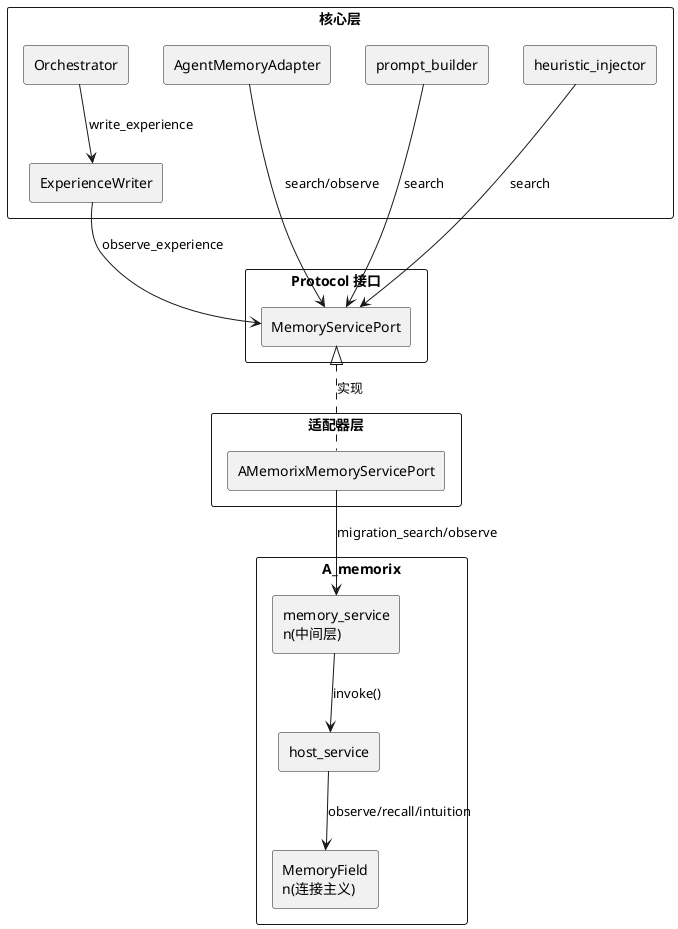
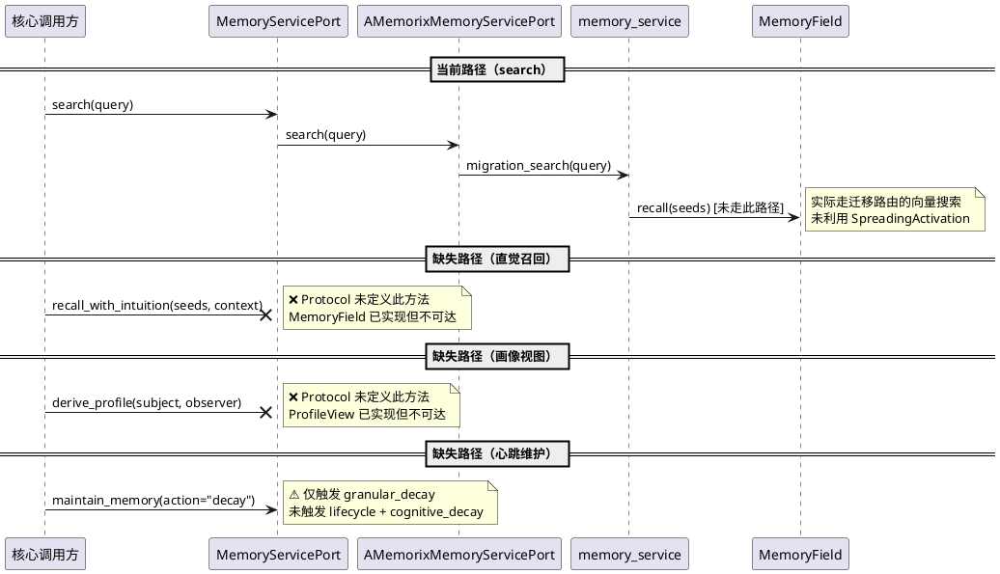
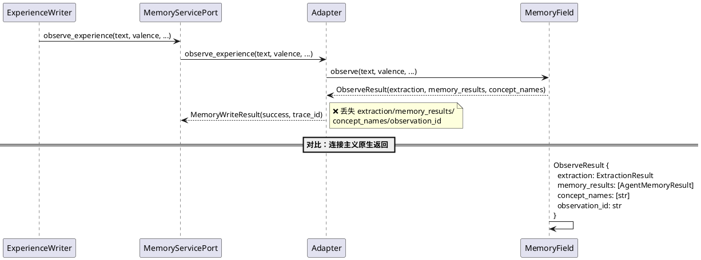
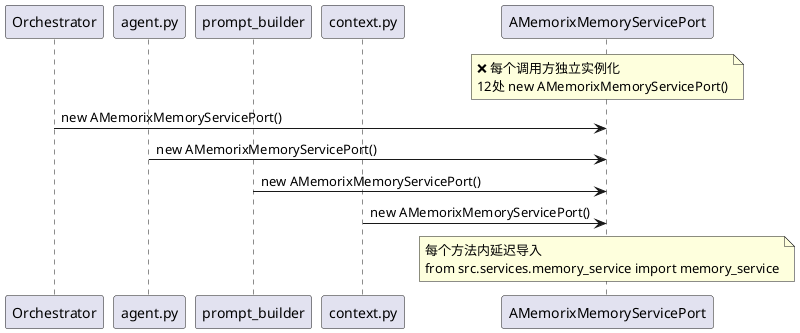
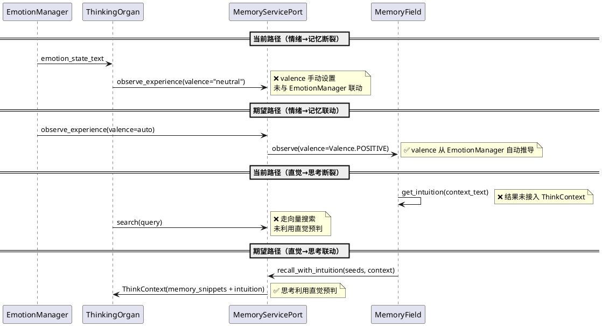
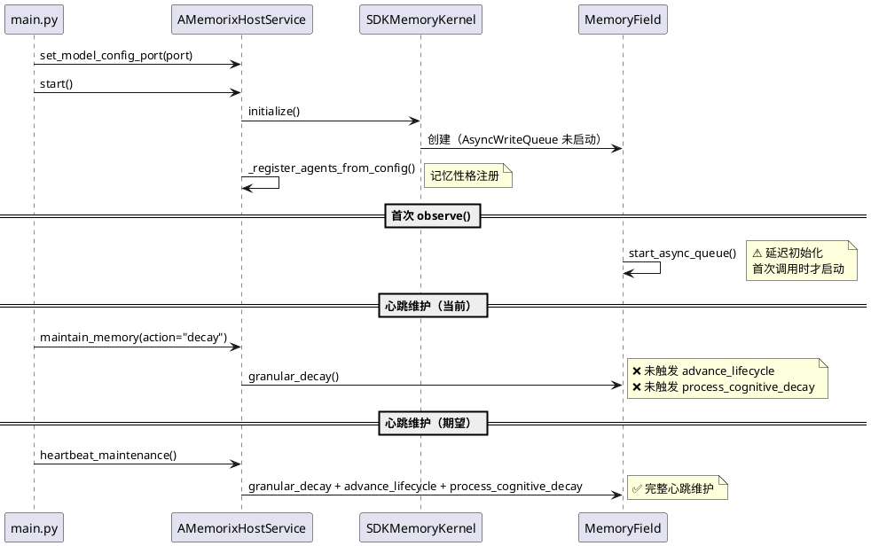
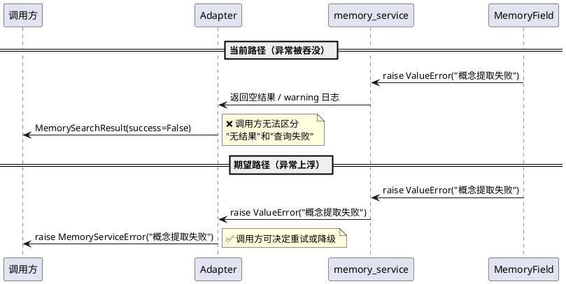

# 记忆系统与核心架构差距分析需求规格

# **1. 组件定位**

## **1.1 核心职责**

本组件负责识别并消除 A_memorix 记忆系统与 MaiBot 微内核核心架构之间的差距，使记忆系统完全适配核心的 Protocol 接口契约、智能体自主性架构和连接主义范式。

## **1.2 核心输入**

1. 核心层 MemoryServicePort Protocol 定义（`src/core/protocols.py`）— 14 个 Protocol 之一，定义核心对记忆的接口契约
2. 核心数据模型（`src/core/types.py`）— ThinkContext/ThinkResult/ObserveRequest/MemoryWriteResult/MemorySearchResult 等
3. 适配器实现（`src/core/adapters/memory_service.py`）— AMemorixMemoryServicePort，核心与 A_memorix 的唯一桥梁
4. A_memorix 公共 API（`src/A_memorix/host_service.py`）— 通过 invoke() 分发的组件调用
5. 连接主义记忆场（`src/A_memorix/core/connectionist/memory_field.py`）— observe/recall/intuition/derive_profile 等连接主义能力
6. 核心调用方使用模式 — Orchestrator/AgentMemoryAdapter/prompt_builder/heuristic_injector 等 12 处调用点

## **1.3 核心输出**

1. 差距分析报告（6 个维度的差距识别与严重程度评估）
2. 改进需求列表（EARS 格式，含验收条件）
3. 优先级排序建议（基于影响范围和修复成本）

## **1.4 职责边界**

- 本组件**不负责**设计具体的代码实现方案（属于 design.md 范畴）
- 本组件**不负责**拆解开发任务（属于 tasks.md 范畴）
- 本组件**不负责**修改 MemoryServicePort 的接口签名（仅识别差距，接口变更需经核心架构评审）
- 本组件**不负责**评估 A_memorix 内部子系统的实现质量（仅关注与核心的适配程度）

# **2. 领域术语**

**MemoryServicePort**
: 核心层定义的记忆服务 Protocol 接口，是核心模块访问 A_memorix 的唯一契约。当前包含 10 个方法。

**AMemorixMemoryServicePort**
: MemoryServicePort 的适配器实现类，位于 `src/core/adapters/memory_service.py`，是核心与 A_memorix 之间的桥梁。

**连接主义记忆**
: 以概念连接为第一公民的记忆范式。新记忆 = 新连接，遗忘 = 连接衰减，回忆 = 重新激活模式。当前阶段为 NEW_INDEPENDENT，所有请求走连接主义路径。

**分类学记忆**
: 以 Paragraph/Entity/Relation/Episode/Profile 为数据模型的旧范式。已标记 DEPRECATED 且零调用，代码保留但不再使用。

**直觉召回**
: 连接主义记忆的纯规则快速召回路径（IntuitionEngine），目标延迟 ≤50ms，不走 LLM。通过关键词 + bigram 双层匹配触发。

**叙事编织**
: 观察 → Fragment → Episode → Saga 的三层叙事自组织过程，由 NarrativeWeaver 驱动。

**记忆性格**
: 智能体对记忆系统的行为声明（衰减率、情感敏感度、联想深度等），由 MemoryPersonalityV2 承载，通过 PersonalityRegistry 注册。

**fire-and-forget**
: observe() 完成后异步通知 CognitiveStratifier 和 NarrativeWeaver 的模式，不阻塞主写入路径。

**AMemorixServicePorts**
: A_memorix 的依赖注入容器，所有外部依赖（LLM 服务、数据库、配置等）通过此容器构造注入，实现 SDKMemoryKernel 完全隔离。

**AgentMemoryAdapter**
: 智能体交互记忆适配器，通过语义映射复用 MemoryServicePort，将智能体间交互记忆与用户记忆隔离。

# **3. 角色与边界**

## **3.1 核心角色**

- **核心架构守护者**：确保 MemoryServicePort 满足核心所有记忆需求，审查接口变更
- **A_memorix 维护者**：确保 A_memorix 严格遵守核心禁止项，通过 Protocol 接口与核心交互

## **3.2 外部系统**

- **核心编排层（Orchestrator）**：通过 ExperienceWriter 写入智能体体验，是 observe_experience() 的主要调用方
- **智能体层（maisaka/agent）**：通过 AgentMemoryAdapter 访问记忆，是 search()/observe_experience() 的高频调用方
- **提示词构建器（prompt_builder）**：通过记忆片段构建提示词，依赖 search() 结果
- **WebUI（webui/routers/agent.py）**：通过 profile_admin() 管理画像
- **内置工具（builtin_tool）**：通过 context.py 延迟初始化 memory_port

## **3.3 交互上下文**

# **4. DFX约束**

## **4.1 性能**

1. 直觉召回（IntuitionEngine）延迟必须 ≤50ms（纯规则，零 LLM 调用）
2. observe_experience() 写入路径必须 ≤200ms（含概念提取和 Trace 写入）
3. search() 检索路径必须 ≤500ms（含向量搜索和结果排序）
4. 心跳维护（granular_decay + advance_lifecycle + process_cognitive_decay）单次必须 ≤2s

## **4.2 可靠性**

1. 记忆写入不可丢失 — observe_experience() 失败时必须完整上浮错误，不可静默吞没
2. 记忆检索降级必须可观测 — search() 走迁移路由失败时，错误信息必须包含原始异常
3. 异步写入队列（AsyncWriteQueue）崩溃时必须重试或完整报错，不可静默丢弃

## **4.3 安全性**

1. A_memorix/core/ 禁止反向导入核心层模块（ruff TID251 守卫 + CI AST 脚本）
2. 适配器层是唯一允许同时导入核心 Protocol 和 A_memorix 具体类的地方
3. memory_service 中间层的延迟导入必须在首次调用时完成，不可在模块加载时触发

## **4.4 可维护性**

1. MemoryServicePort 的每个方法必须有明确的 Protocol 文档（参数语义、返回类型、异常行为）
2. 适配器层的方法实现必须与 Protocol 签名一一对应，不可增删参数
3. 废弃方法（ingest_text）必须在 Protocol 中标记 DEPRECATED，适配器中发出 DeprecationWarning

## **4.5 兼容性**

1. MemoryServicePort 接口变更必须向后兼容 — 新增方法不破坏现有实现
2. ObserveRequest 数据模型变更必须向后兼容 — 新增字段必须有默认值
3. 迁移路由（MigrationRouter）的搜索结果格式必须与 MemorySearchResult 对齐

# **5. 核心能力**

## **5.1 接口完备性差距**

### **5.1.1 业务规则**

1. **缺失直觉召回接口**：MemoryServicePort 未暴露 recall_with_intuition() 或 get_intuition() 方法。IntuitionEngine 已在 MemoryField 中实现，但核心层无法通过 Protocol 访问此能力。
   a. 验收条件：核心层通过 MemoryServicePort 调用直觉召回 → 返回直觉触发结果（triggered_entries/triggered_episodes/triggered_sagas/cached_entities）
2. **缺失连接主义召回接口**：MemoryServicePort 未暴露 recall() 方法（概念激活扩散召回）。当前 search() 走迁移路由，底层仍为向量搜索，未利用连接主义的 SpreadingActivation 能力。
   a. 验收条件：核心层通过 MemoryServicePort 调用概念激活召回 → 返回 RecallItem 列表（concept/activation/valence/detail_level）
3. **缺失画像实时视图接口**：MemoryServicePort 未暴露 derive_profile() 方法。当前 get_person_profile() 返回分类学画像字典，而非连接主义的 ProfileView（含关联/声音视角/矛盾点/时间线/叙事弧）。
   a. 验收条件：核心层通过 MemoryServicePort 调用画像实时视图 → 返回 ProfileView（含 associations/voices/contradictions/timeline/episodes/sagas）
4. **缺失反思接口**：MemoryServicePort 未暴露 reflect() 方法。ProfileDeriver 已实现反思能力（多声音视角 + 矛盾检测），但核心层无法访问。
   a. 验收条件：核心层通过 MemoryServicePort 调用反思 → 返回 ReflectResult（含 voices/contradictions）
5. **缺失心跳维护接口**：MemoryServicePort 未暴露 heartbeat_maintenance() 方法。当前心跳仅在 host_service 的 maintain_memory(action="decay") 中间接触发，且仅触发 granular_decay，未触发 advance_lifecycle 和 process_cognitive_decay。
   a. 验收条件：核心层通过 MemoryServicePort 调用心跳维护 → 执行 granular_decay + advance_lifecycle + process_cognitive_decay，返回综合结果
6. **缺失叙事编织接口**：MemoryServicePort 未暴露 weave_narrative() 方法。NarrativeWeaver 已实现，但核心层无法触发叙事编织。
   a. 验收条件：核心层通过 MemoryServicePort 调用叙事编织 → 返回编织结果（新增/合并的 Episode 和 Saga）
7. **废弃方法残留**：ingest_text() 仍保留在 Protocol 中，已标记 DEPRECATED 但未设定移除时间线。
   a. 验收条件：ingest_text() 从 Protocol 中移除 → 所有调用方已迁移至 observe_experience()

### **5.1.2 交互流程**

### **5.1.3 异常场景**

1. **search() 走迁移路由失败**
   a. 触发条件：migration_search() 内部异常
   b. 系统行为：适配器捕获异常，返回 MemorySearchResult(success=False)
   c. 用户感知：搜索结果为空，日志记录 warning

2. **直觉召回不可达**
   a. 触发条件：核心层需要快速记忆片段但只能走 search()
   b. 系统行为：search() 走向量搜索，延迟高于直觉召回
   c. 用户感知：记忆片段注入延迟增加，可能影响思考循环性能

## **5.2 数据契约一致性差距**

### **5.2.1 业务规则**

1. **search() 参数语义偏移**：MemoryServicePort.search() 的 `person_id` 参数在适配器中被映射为 `agent_id` 传给 migration_search()。参数语义从"人物 ID"偏移为"智能体 ID"，导致调用方需要理解内部映射逻辑。
   a. 验收条件：search() 的参数语义与底层实现一致 → 调用方无需理解 person_id→agent_id 映射
2. **ObserveRequest 与 observe_experience() 参数不对齐**：core/types.py 定义了 ObserveRequest 数据类（text/valence/timestamp/source_id/session_id/agent_id/participants/tags/metadata），但 MemoryServicePort.observe_experience() 使用关键字参数而非 ObserveRequest 对象。两套参数定义存在维护负担。
   a. 验收条件：observe_experience() 接受 ObserveRequest 对象 → 消除参数重复定义
3. **MemoryWriteResult 与 ObserveResult 不对齐**：observe_experience() 返回 MemoryWriteResult（success/stored_ids/skipped_ids/detail/pending/trace_id），但 MemoryField.observe() 返回 ObserveResult（text/extraction/memory_results/observation_id/concept_names）。适配器在 observe_experience() 中手动设置 trace_id，但丢失了 extraction/memory_results/observation_id/concept_names 等连接主义特有的结果信息。
   a. 验收条件：observe_experience() 返回的 MemoryWriteResult 包含连接主义结果信息 → 调用方可获取 observation_id 和概念名称
4. **MemorySearchResult 与 RecallItem 不对齐**：search() 返回 MemorySearchResult（summary/hits/filtered/success/error），其中 hits 为 MemoryHit 列表（content/score/hit_type/source/hash_value/metadata）。但连接主义 recall() 返回 RecallItem 列表（concept/activation/valence/detail_level/time_of_day/relative_time）。两者数据模型完全不同，适配器需要翻译。
   a. 验收条件：核心层可通过 Protocol 获取连接主义原生召回结果 → 无需翻译层
5. **ThinkContext.memory_snippets 与记忆检索结果脱节**：ThinkContext 包含 memory_snippets: tuple[str, ...]，但记忆检索返回 MemorySearchResult（含 MemoryHit 列表）。从 MemorySearchResult 到 memory_snippets 的转换逻辑分散在 prompt_builder 中，无统一转换规则。
   a. 验收条件：ThinkContext.memory_snippets 的填充规则明确 → 从 MemorySearchResult/MemoryWriteResult 到 str 的转换有统一标准

### **5.2.2 交互流程**

### **5.2.3 异常场景**

1. **ObserveResult 信息丢失**
   a. 触发条件：observe_experience() 调用成功但连接主义返回的 observation_id/concept_names 被丢弃
   b. 系统行为：调用方无法追踪写入的记忆条目，无法关联后续的叙事编织和认知分层
   c. 用户感知：记忆写入成功但无法追踪，调试困难

2. **参数语义偏移导致误用**
   a. 触发条件：调用方传入 person_id 预期查询用户画像，但底层被当作 agent_id 处理
   b. 系统行为：搜索结果可能不符合预期
   c. 用户感知：记忆检索结果不准确

## **5.3 架构合规性差距**

### **5.3.1 业务规则**

1. **适配器实例重复创建**：AMemorixMemoryServicePort() 在 12 处被独立实例化（agent.py 2处、chat_loop_service.py 1处、prompt_builder.py 1处、orchestrator.py 2处、context.py 1处、heuristic_injector.py 1处、person_profile.py 1处、tool_post_execution.py 1处、main.py 1处、webui/routers/agent.py 1处）。每次实例化都创建新对象，但底层共享同一个 memory_service 单例，导致不必要的对象创建和延迟导入开销。
   a. 验收条件：AMemorixMemoryServicePort 实例全局唯一 → 所有调用方共享同一实例
2. **适配器层延迟导入 memory_service**：AMemorixMemoryServicePort 的每个方法都包含 `from src.services.memory_service import memory_service` 延迟导入。这是对 memory_service 单例的运行时查找，绕过了依赖注入。
   a. 验收条件：AMemorixMemoryServicePort 通过构造函数注入 memory_service → 消除方法级延迟导入
3. **A_memorix/core/ 对核心层的反向依赖**：A_memorix/core/ 中有 5 处导入核心层模块：
   - migration_router.py 导入 `src.core.memory_utils` 和 `src.core.types`
   - sdk_memory_kernel.py 导入 `src.core.protocols.SessionInfoPort`
   - async_write_queue.py 导入 `src.core.types.MemoryWriteResult`
   - translator.py 导入 `src.core.types.MemoryHit, MemorySearchResult`
   
   这些导入违反了"A_memorix/core/ 零违规导入"原则（虽然当前 AGENTS.md 声称已消除，但实际仍有 5 处）。
   a. 验收条件：A_memorix/core/ 零导入 src.core.* → 所有核心类型通过 AMemorixServicePorts 注入或通过本地镜像类型解耦
4. **host_service 直接访问 kernel 内部属性**：host_service._dispatch() 中大量访问 `kernel._memory_field`、`kernel._migration_adapter`、`kernel._migration_router`、`kernel._admin_handlers` 等私有属性。虽然 host_service 不属于核心层，但这种访问模式使 kernel 的内部结构变更困难。
   a. 验收条件：host_service 通过 kernel 的公共方法访问能力 → 不直接访问 _ 前缀属性

### **5.3.2 交互流程**

### **5.3.3 异常场景**

1. **A_memorix/core/ 反向依赖核心类型**
   a. 触发条件：核心层修改 MemoryWriteResult/MemoryHit/MemorySearchResult 的字段
   b. 系统行为：A_memorix/core/ 编译失败或运行时字段缺失
   c. 用户感知：启动失败或记忆功能异常

2. **适配器实例重复创建**
   a. 触发条件：memory_service 单例尚未初始化时，多个适配器实例同时触发延迟导入
   b. 系统行为：潜在的竞态条件（虽然 Python GIL 保护了模块级单例）
   c. 用户感知：无明显影响，但增加不必要的延迟导入开销

## **5.4 连接主义适配差距**

### **5.4.1 业务规则**

1. **内心状态三层与记忆层脱节**：核心架构定义了内心状态三层（情绪/欲望/记忆），但 MemoryServicePort 未提供与情绪层和欲望层的交互接口。observe_experience() 的 valence 参数是静态字符串，未与 EmotionManager 的实时情绪状态联动。
   a. 验收条件：observe_experience() 的 valence 可从 EmotionManager 的实时情绪自动推导 → 无需调用方手动映射
2. **Agent-owns-Thinking 与记忆性格未联动**：每个智能体拥有独立 ThinkingOrgan，但 MemoryServicePort 的 search() 和 observe_experience() 不感知调用智能体的记忆性格。记忆性格参数（衰减率、情感敏感度等）仅在 MemoryField 内部使用，核心层无法通过 Protocol 查询或利用。
   a. 验收条件：MemoryServicePort 的检索和写入方法感知调用智能体的记忆性格 → 结果受性格参数影响
3. **管家系统与记忆系统未联动**：管家协调插话时需要理解角色关系和话题相关性，但 MemoryServicePort 未提供关系查询接口。管家三层过滤的第二层（管家 LLM 判断"谁会关心"）无法利用记忆系统中的关系数据。
   a. 验收条件：管家可通过 MemoryServicePort 查询角色间关系记忆 → 插话判断利用历史交互数据
4. **直觉召回未接入思考循环**：IntuitionEngine 的直觉触发结果（triggered_entries/triggered_episodes/triggered_sagas）未接入 ThinkContext。思考循环构建提示词时无法利用直觉引擎的快速预判。
   a. 验收条件：ThinkContext 包含直觉触发结果 → prompt_builder 可利用直觉信息构建提示词
5. **叙事弧未接入智能体认知**：Saga（长期叙事弧）和 Episode（情节）未通过 MemoryServicePort 暴露。智能体无法感知自己正在经历的叙事弧，也无法在思考中引用叙事上下文。
   a. 验收条件：智能体可通过 MemoryServicePort 查询自己的叙事弧 → 思考时引用叙事上下文

### **5.4.2 交互流程**

### **5.4.3 异常场景**

1. **情绪与记忆效价不一致**
   a. 触发条件：智能体当前情绪为"愤怒"但 observe_experience() 的 valence 被设为 "neutral"
   b. 系统行为：记忆系统记录的情感效价与实际情绪不一致，影响后续回忆的情感着色
   c. 用户感知：智能体回忆时情感着色不准确

2. **直觉引擎结果不可达**
   a. 触发条件：思考循环需要快速记忆预判但只能走 search() 向量搜索
   b. 系统行为：search() 延迟高于直觉召回，且结果不含叙事和认知深度
   c. 用户感知：思考循环变慢，记忆片段缺乏深度

## **5.5 时序与生命周期差距**

### **5.5.1 业务规则**

1. **MemoryField 异步写入队列启动时序**：MemoryField._async_write_started 在首次 observe() 调用时延迟初始化。如果 observe() 在 AsyncWriteQueue.start() 完成前被并发调用，可能导致写入丢失。之前的 bug（_async_write_started 未初始化）已修复，但延迟初始化模式仍有竞态风险。
   a. 验收条件：AsyncWriteQueue 在 MemoryField 创建时同步启动 → 不依赖首次 observe() 触发
2. **ModelConfigPort 注入时序**：AMemorixHostService.set_model_config_port() 必须在 start() 之前调用。如果时序错误，EmbeddingAPIAdapter 会因 ModelConfigPort 为 None 而崩溃。之前的 bug 已修复（提前注入 + None 保护），但依赖调用方遵守时序约束。
   a. 验收条件：ModelConfigPort 的注入时序有编译时或启动时检查 → 时序错误在启动阶段暴露
3. **记忆性格注册时序**：智能体记忆性格通过 host_service._register_agents_from_config() 在 kernel 初始化后注册。但核心层的智能体注册（AgentRoutingService.bind_session）与记忆性格注册是独立的，没有时序保证。如果智能体在记忆性格注册前就开始写入体验，会使用默认性格。
   a. 验收条件：智能体记忆性格在智能体首次使用前完成注册 → 不存在使用默认性格的窗口期
4. **心跳维护未接入核心调度**：MemoryField.heartbeat_maintenance()（granular_decay + advance_lifecycle + process_cognitive_decay）未接入核心的心跳调度。当前仅通过 host_service 的 maintain_memory(action="decay") 间接触发 granular_decay，未触发 advance_lifecycle 和 process_cognitive_decay。
   a. 验收条件：核心心跳调度定期调用 MemoryServicePort 的心跳维护方法 → 叙事生命周期和认知衰减持续演进

### **5.5.2 交互流程**

### **5.5.3 异常场景**

1. **AsyncWriteQueue 延迟启动竞态**
   a. 触发条件：多个并发 observe() 调用在 AsyncWriteQueue.start() 完成前到达
   b. 系统行为：start_async_queue() 有 `if getattr(self, "_async_write_started", False)` 保护，但并发场景下可能重复创建队列
   c. 用户感知：潜在的内存泄漏或写入丢失

2. **记忆性格注册窗口期**
   a. 触发条件：智能体在记忆性格注册前写入体验
   b. 系统行为：使用默认性格（decay_rate=1.0, emotional_sensitivity=1.0），后续注册不会回溯修正
   c. 用户感知：早期体验的记忆衰减和情感着色不符合预期

## **5.6 错误暴露差距**

### **5.6.1 业务规则**

1. **适配器层全面吞没异常**：AMemorixMemoryServicePort 的 8 个方法中有 8 处 `except Exception` 捕获，全部将异常转换为"成功但空"的返回值或 warning 日志。这违反了"不兜底"原则，掩盖了记忆系统的真实错误。
   - search() 失败 → 返回 MemorySearchResult(success=False)，但调用方通常只检查 hits 是否为空
   - get_person_profile() 失败 → 返回 None，调用方无法区分"不存在"和"查询失败"
   - profile_admin() 失败 → 返回 {"success": False}，但调用方可能不检查
   - maintain_memory() 失败 → 返回 MemoryWriteResult(success=False)，但心跳调用方通常忽略返回值
   - delete_admin() 失败 → 返回 {"success": False}
   - enqueue_feedback_task() 失败 → 返回 {"success": False, "queued": False}
   - set_memory_personality() 失败 → 仅记录 warning，不抛出异常
   a. 验收条件：适配器层不吞没异常 → 可恢复的临时错误重试，不可恢复的错误完整上浮到调用方
2. **get_person_profile() 返回 None 语义模糊**：返回 None 既表示"人物不存在"也表示"查询失败"，调用方无法区分。
   a. 验收条件：get_person_profile() 明确区分"不存在"和"失败" → 不存在返回空画像，失败抛出异常
3. **A_memorix 内部 322 处 bare except**：A_memorix 模块中有 322 处 `except Exception` 捕获（含 `except Exception:` 和 `except Exception as exc:`），大量静默吞没异常。虽然部分是合理的（如 fire-and-forget 通知），但多数缺乏明确的错误处理策略。
   a. 验收条件：A_memorix 的异常处理遵循"不兜底"原则 → 可恢复错误重试，不可恢复错误上浮，fire-and-forget 标注明确
4. **memory_service 中间层的异常兜底**：memory_service.py 的几乎所有方法都包含 `except Exception` 捕获并返回空结果。这是适配器层和 A_memorix 之间的双重兜底，使错误更难追踪。
   a. 验收条件：memory_service 中间层不吞没异常 → 错误传播到适配器层由其决定处理策略

### **5.6.2 交互流程**

### **5.6.3 异常场景**

1. **记忆写入静默失败**
   a. 触发条件：observe_experience() 内部异常被适配器捕获并返回 MemoryWriteResult(success=False)
   b. 系统行为：ExperienceWriter 的 fire-and-forget 模式不检查返回值，写入失败无人感知
   c. 用户感知：智能体体验丢失，但无任何错误提示

2. **画像查询失败与不存在混淆**
   a. 触发条件：get_person_profile() 因数据库连接失败返回 None
   b. 系统行为：调用方认为"人物不存在"，跳过画像注入
   c. 用户感知：智能体对已知人物的回应缺乏画像上下文

# **6. 数据约束**

## **6.1 MemoryServicePort 接口方法**

1. **observe_experience**：观察智能体体验并写入连接主义记忆
2. **search**：检索记忆（当前走迁移路由向量搜索）
3. **get_person_profile**：查询人物画像（返回分类学画像字典）
4. **profile_admin**：画像管理操作（query/update/delete）
5. **ingest_text**：DEPRECATED，摄入文本到记忆系统
6. **maintain_memory**：记忆维护操作（decay/reinforce/freeze/restore/protect）
7. **delete_admin**：删除管理操作（preview/confirm/cancel）
8. **enqueue_feedback_task**：反馈纠错任务入队
9. **build_profile_injection_text**：构建画像注入文本
10. **set_memory_personality**：设置智能体记忆性格参数

## **6.2 连接主义能力（MemoryField 已实现但 Protocol 未暴露）**

1. **recall**：概念激活扩散召回，返回 RecallItem 列表
2. **recall_with_intuition**：recall + intuition 合并，返回 RecallItem + 直觉触发结果
3. **get_intuition**：直觉触发，返回 triggered_entries/triggered_episodes/triggered_sagas/cached_entities
4. **derive_profile**：画像实时视图，返回 ProfileView（含 associations/voices/contradictions/timeline/episodes/sagas）
5. **reflect**：反思，返回 ReflectResult（含 voices/contradictions）
6. **weave_narrative**：叙事编织，返回编织结果
7. **heartbeat_maintenance**：心跳维护（granular_decay + advance_lifecycle + process_cognitive_decay）
8. **advance_lifecycle**：推进叙事元素生命周期
9. **process_cognitive_decay**：处理认知衰减
10. **get_cognitive_entries**：查询认知条目
11. **add_cognitive_evidence**：添加认知证据

## **6.3 核心数据模型**

1. **ObserveRequest**：连接主义记忆观察请求（text/valence/timestamp/source_id/session_id/agent_id/participants/tags/metadata）
2. **MemoryWriteResult**：记忆写入结果（success/stored_ids/skipped_ids/detail/pending/trace_id）
3. **MemorySearchResult**：记忆检索结果（summary/hits/filtered/success/error）
4. **MemoryHit**：记忆检索命中项（content/score/hit_type/source/hash_value/metadata/episode_id/title）
5. **ThinkContext**：思考上下文（messages/emotion_state_text/inner_voice_text/memory_personality_params/relationship_text/memory_snippets/cohabitant_summary/trigger_reason/metadata/session_id/is_group_chat/discovered_tools）
6. **ThinkResult**：思考结果（action/text/tool_calls/emotion_type/emotion_intensity/error_message/thinking_time_ms/silence_reason/thought_summary/reply_sent）

## **6.4 连接主义数据模型（A_memorix 内部）**

1. **ObserveResult**：observe() 返回结果（text/extraction/memory_results/observation_id/concept_names）
2. **RecallItem**：recall() 单条回忆结果（concept/activation/valence/detail_level/time_of_day/relative_time）
3. **ProfileView**：画像实时视图（subject/observer/associations/voices/contradictions/timeline/depth/concept_type/episodes/sagas）
4. **ReflectResult**：反思结果（subject/agent_id/voices/contradictions）
5. **DecayResult**：衰减结果（traces_processed/traces_consolidated）
6. **LifecycleResult**：生命周期推进结果（fragments_advanced）
7. **CognitiveDecayResult**：认知衰减结果（entries_processed）

---

# 附录：差距严重程度评估与优先级排序

| 编号 | 差距 | 维度 | 严重程度 | 影响范围 | 修复成本 | 优先级 |
|---|---|---|---|---|---|---|
| G1 | 缺失直觉召回接口 | 接口完备性 | 高 | 思考循环性能、记忆片段质量 | 低（新增 Protocol 方法） | P0 |
| G2 | 缺失连接主义召回接口 | 接口完备性 | 高 | 记忆检索准确性、连接主义能力不可达 | 中（新增方法 + 适配器翻译） | P0 |
| G3 | 缺失画像实时视图接口 | 接口完备性 | 中 | 画像查询仅返回分类学格式 | 中（新增方法 + ProfileView 翻译） | P1 |
| G4 | 缺失心跳维护接口 | 接口完备性 | 高 | 叙事生命周期和认知衰减不演进 | 低（新增 Protocol 方法） | P0 |
| G5 | 缺失叙事编织接口 | 接口完备性 | 低 | 叙事编织仅通过 WebUI 触发 | 低（新增 Protocol 方法） | P2 |
| G6 | 缺失反思接口 | 接口完备性 | 低 | 反思能力不可达 | 低（新增 Protocol 方法） | P2 |
| G7 | 废弃方法残留 | 接口完备性 | 低 | 代码维护负担 | 低（删除方法） | P2 |
| G8 | search() 参数语义偏移 | 数据契约 | 中 | 调用方理解负担、潜在误用 | 低（参数重命名或拆分） | P1 |
| G9 | ObserveRequest 与 observe_experience() 不对齐 | 数据契约 | 中 | 参数重复定义、维护负担 | 中（改用 ObserveRequest 对象） | P1 |
| G10 | MemoryWriteResult 与 ObserveResult 不对齐 | 数据契约 | 高 | 连接主义结果信息丢失 | 中（扩展 MemoryWriteResult 或引入新类型） | P0 |
| G11 | MemorySearchResult 与 RecallItem 不对齐 | 数据契约 | 中 | 连接主义召回结果需翻译 | 中（引入新返回类型） | P1 |
| G12 | ThinkContext.memory_snippets 填充规则不明确 | 数据契约 | 低 | 提示词构建分散 | 低（定义转换规则） | P2 |
| G13 | 适配器实例重复创建 | 架构合规 | 中 | 不必要的对象创建、延迟导入开销 | 低（全局单例） | P1 |
| G14 | 适配器层延迟导入 memory_service | 架构合规 | 低 | 绕过依赖注入 | 中（构造函数注入） | P2 |
| G15 | A_memorix/core/ 反向依赖核心层 | 架构合规 | 高 | 核心类型变更影响 A_memorix | 高（类型镜像或注入） | P1 |
| G16 | host_service 直接访问 kernel 私有属性 | 架构合规 | 低 | kernel 内部结构变更困难 | 高（公共 API 重构） | P2 |
| G17 | 情绪与记忆效价未联动 | 连接主义适配 | 中 | 情感着色不准确 | 中（自动推导 valence） | P1 |
| G18 | Agent-owns-Thinking 与记忆性格未联动 | 连接主义适配 | 低 | 记忆性格对检索无影响 | 中（Protocol 传递 agent_id） | P2 |
| G19 | 管家系统与记忆系统未联动 | 连接主义适配 | 中 | 插话判断缺乏关系数据 | 高（新增关系查询接口） | P1 |
| G20 | 直觉召回未接入思考循环 | 连接主义适配 | 高 | 思考循环无法利用直觉预判 | 中（ThinkContext 扩展） | P0 |
| G21 | 叙事弧未接入智能体认知 | 连接主义适配 | 中 | 智能体无叙事上下文 | 中（暴露叙事查询接口） | P1 |
| G22 | AsyncWriteQueue 延迟启动竞态 | 时序与生命周期 | 中 | 潜在写入丢失 | 低（启动时初始化） | P1 |
| G23 | ModelConfigPort 注入时序无检查 | 时序与生命周期 | 低 | 时序错误运行时才暴露 | 低（启动时断言） | P2 |
| G24 | 记忆性格注册窗口期 | 时序与生命周期 | 中 | 早期体验使用默认性格 | 中（注册时序保证） | P1 |
| G25 | 心跳维护未接入核心调度 | 时序与生命周期 | 高 | 叙事和认知不演进 | 中（接入核心心跳） | P0 |
| G26 | 适配器层全面吞没异常 | 错误暴露 | 高 | 记忆错误被掩盖 | 中（异常策略重构） | P0 |
| G27 | get_person_profile() 返回 None 语义模糊 | 错误暴露 | 中 | 不存在与失败不可区分 | 低（区分返回值） | P1 |
| G28 | A_memorix 内部 322 处 bare except | 错误暴露 | 中 | 大量异常被静默吞没 | 高（逐个审查） | P2 |
| G29 | memory_service 中间层双重兜底 | 错误暴露 | 中 | 错误更难追踪 | 中（移除中间层兜底） | P1 |