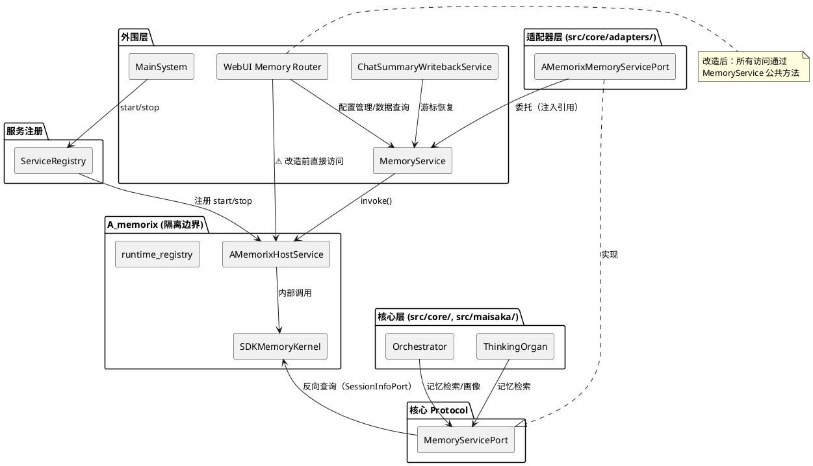
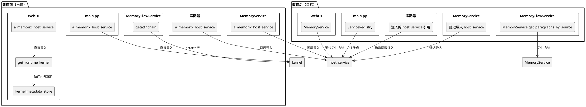
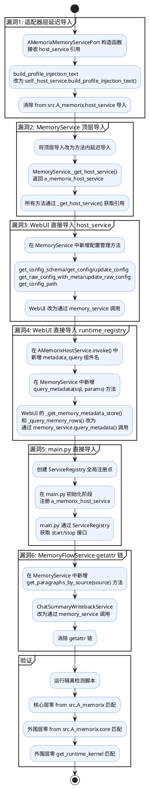
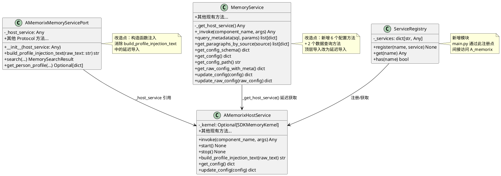

# SDKMemoryKernel 完全隔离 — 实现方案

# 一、需求与存量功能关系分析

## 1.1 需求功能与存量功能对比

### 1.1.1 已实现功能

| 需求功能 | 存量功能 | 代码位置 | 匹配度 |
|---------|---------|---------|--------|
| 核心层通过 MemoryServicePort 访问记忆服务 | AMemorixMemoryServicePort 适配器已实现 search/get_person_profile/ingest_text/maintain_memory/delete_admin/enqueue_feedback_task/build_profile_injection_text/set_memory_personality 全部 Protocol 方法 | `src/core/adapters/memory_service.py` | 100% |
| AMemorixHostService 作为公共 API 层 | AMemorixHostService.invoke() 已覆盖 search_memory/ingest_text/ingest_summary/get_person_profile/maintain_memory/memory_stats/observe/recall/derive_profile/reflect/register_agent/connectionist_stats 及 12 个 admin handler | `src/A_memorix/host_service.py:178-380` | 100% |
| A_memorix 反向查询会话信息 | _inject_session_info_port() 在 kernel 初始化时注入 SessionInfoPort，kernel 内部通过 _session_info_port 查询 | `src/A_memorix/host_service.py:401-408` | 100% |
| MemoryService 作为外围层统一委托层 | MemoryService._invoke() 统一委托 a_memorix_host_service.invoke()，提供 search/ingest_text/ingest_summary/profile_admin/graph_admin 等全部方法 | `src/services/memory_service.py:35-395` | 100% |
| A_memorix 未启用时的降级响应 | AMemorixHostService._disabled_response() 为每个 component_name 返回结构化空结果 | `src/A_memorix/host_service.py:482-557` | 100% |
| build_profile_injection_text 公共 API | AMemorixHostService.build_profile_injection_text() 已作为静态方法暴露 | `src/A_memorix/host_service.py:570-578` | 100% |

### 1.1.2 需要扩展的功能

| 需求功能 | 存量功能 | 差异说明 | 扩展方向 |
|---------|---------|---------|---------|
| 适配器层 build_profile_injection_text 消除延迟导入 | `memory_service.py:166` 延迟导入 `from src.A_memorix.host_service import a_memorix_host_service` | 当前在函数体内延迟导入 host_service，虽避免启动循环依赖但违反隔离原则。host_service.build_profile_injection_text() 已是公共 API，适配器应通过注入的引用调用 | 将 a_memorix_host_service 引用通过构造函数注入到 AMemorixMemoryServicePort，消除延迟导入 |
| 外围层 memory_service.py 消除顶层导入 | `memory_service.py:6` 顶层导入 `from src.A_memorix.host_service import a_memorix_host_service` | MemoryService 直接依赖 A_memorix 具体模块，违反外围层只通过公共 API 访问的原则。但 MemoryService 本身就是 A_memorix 的委托层，其职责就是封装 host_service | 改为延迟导入或通过注册机制获取 host_service 引用，消除模块顶层对 A_memorix 的硬依赖 |
| main.py 启动/停止路径解耦 | `main.py:132,276` 直接导入 `from src.A_memorix.host_service import a_memorix_host_service` | main.py 作为系统启动入口直接依赖 A_memorix 具体模块，A_memorix 内部变更会导致 main.py 需要修改 | 通过服务注册点（ServiceRegistry）间接访问，main.py 只调用注册的 start/stop 接口 |
| WebUI 配置管理消除直接导入 | `memory.py:16` 导入 `from src.A_memorix.host_service import a_memorix_host_service`，用于配置读写（get_config_schema/get_config/update_config 等） | WebUI 配置操作绕过 MemoryService 直接调用 host_service，导致 WebUI 与 A_memorix 具体实现耦合 | 将配置管理能力纳入 MemoryService 公共方法，WebUI 通过 MemoryService 间接访问 |

### 1.1.3 需要新增的功能或接口

**模块：A_memorix 公共 API 扩展**

1. **metadata_store SQL 查询公共 API**
   - 输入：`component_name="metadata_query"`, args 包含 `sql: str`, `params: tuple`
   - 输出：`list[dict[str, Any]]`
   - 核心逻辑：在 AMemorixHostService.invoke() 中新增 `metadata_query` 组件名，委托 kernel.metadata_store.query() 执行只读 SQL 查询，返回序列化结果
   - 依赖：WebUI timeline 功能（段落/Episode/反馈/删除/画像/维护事件查询）

2. **metadata_store 段落查询公共 API**
   - 输入：`component_name="metadata_get_paragraphs_by_source"`, args 包含 `source: str`
   - 输出：`list[dict[str, Any]]`
   - 核心逻辑：委托 kernel.metadata_store.get_paragraphs_by_source()，返回序列化结果
   - 依赖：ChatSummaryWritebackService 游标恢复

3. **MemoryService 配置管理方法**
   - 输入：`get_config_schema()`, `get_config()`, `update_config(config)`, `get_raw_config_with_meta()`, `update_raw_config(raw_config)`, `get_config_path()`
   - 输出：与当前 a_memorix_host_service 对应方法相同的返回值
   - 核心逻辑：委托 a_memorix_host_service 对应方法
   - 依赖：WebUI 配置管理路由

**模块：服务注册机制**

4. **ServiceRegistry 服务注册点**
   - 输入：`register(name, service_instance)`, `get(name) -> service_instance`
   - 输出：注册/获取服务实例
   - 核心逻辑：全局服务定位器，main.py 通过注册点获取 A_memorix 的 start/stop 接口，而非直接导入
   - 依赖：main.py 启动/停止流程

**模块：隔离验证脚本**

5. **CI 隔离检测脚本**
   - 输入：项目根目录路径
   - 输出：通过/失败 + 违规详情
   - 核心逻辑：grep 扫描核心层/外围层对 A_memorix 内部模块的违规导入，白名单排除适配器层
   - 依赖：CI 流水线

## 1.2 存量功能详细分析

### 1.2.1 AMemorixHostService — 公共 API 层

**接口契约**：
- `invoke(component_name, args, timeout_ms)` → 统一调用入口，分发到 kernel 内部方法
- `start()` / `stop()` / `reload()` → 生命周期管理
- `build_profile_injection_text(raw_text)` → 画像注入文本构建（静态方法）
- `get_config()` / `update_config(config)` / `get_config_schema()` / `get_config_path()` → 配置管理
- `is_enabled()` → 启用状态查询

**业务规则**：
- invoke() 通过 component_name 字符串分发，内部延迟导入 KernelSearchRequest 等内部类
- 未启用时返回 _disabled_response()，不抛异常
- _ensure_kernel() 内部创建 SDKMemoryKernel 实例并通过 set_runtime_kernel() 注册到全局

**扩展点**：
- invoke() 的 component_name 可扩展，新增组件名只需在方法内添加 if 分支
- _disabled_response() 可扩展，新增组件名的降级响应

**约束**：
- invoke() 内部仍直接访问 kernel._feedback_correction_service、kernel._memory_field 等私有属性
- build_profile_injection_text() 内部延迟导入 `src.A_memorix.core.utils.profile_text`

### 1.2.2 AMemorixMemoryServicePort — 核心适配器

**接口契约**：
- 实现 MemoryServicePort Protocol 的全部方法
- 每个方法内部延迟导入 `from src.services.memory_service import memory_service` 委托
- build_profile_injection_text() 延迟导入 `from src.A_memorix.host_service import a_memorix_host_service` 委托

**业务规则**：
- 所有方法使用 try/except 包裹，异常时返回空结果而非抛出
- search() 失败返回 MemorySearchResult(success=False)
- get_person_profile() 失败返回 None

**约束**：
- 延迟导入 memory_service 是为了打破循环依赖（适配器 → memory_service → host_service → kernel）
- build_profile_injection_text 的延迟导入是当前唯一的 A_memorix 内部模块直接导入点

### 1.2.3 MemoryService — 外围委托层

**接口契约**：
- `_invoke(component_name, args, timeout_ms)` → 统一委托 a_memorix_host_service.invoke()
- `_invoke_admin(component_name, action, **kwargs)` → admin 操作的便捷封装
- `_coerce_write_result()` / `_coerce_search_result()` / `_coerce_profile_result()` → 结果标准化

**业务规则**：
- 顶层导入 a_memorix_host_service，所有方法通过 _invoke() 间接调用
- 结果标准化将 kernel 内部返回值转换为 MemorySearchResult/MemoryWriteResult/PersonProfileResult

**约束**：
- 顶层导入 `from src.A_memorix.host_service import a_memorix_host_service` 是硬依赖
- MemoryService 本身是 A_memorix 的委托封装，其存在意义就是隔离外部模块与 host_service

### 1.2.4 runtime_registry — 全局单例注册表

**接口契约**：
- `set_runtime_kernel(kernel)` / `get_runtime_kernel()` → 全局 kernel 实例存取
- `get_runtime_components()` → 获取 kernel 内部组件引用（vector_store/metadata_store 等）

**业务规则**：
- 使用模块级全局变量 `_runtime_kernel` 存储 kernel 引用
- get_runtime_components() 通过 getattr 访问 kernel 内部属性

**约束**：
- runtime_registry 是 A_memorix 内部模块，外部不应直接导入
- 当前被 WebUI 直接导入用于访问 kernel.metadata_store

### 1.2.5 WebUI memory 路由 — 隔离漏洞集中区

**接口契约**：
- 50+ HTTP 端点，覆盖图谱/来源/查询/Episode/画像/反馈/运行时/配置/导入/调优/删除/纠错/V5/时间线
- 大部分端点通过 memory_service 委托（已隔离）
- 配置相关端点直接调用 a_memorix_host_service（未隔离）
- 时间线功能通过 _get_memory_metadata_store() 访问 kernel.metadata_store（未隔离）

**业务规则**：
- `_get_memory_metadata_store()` 通过 get_runtime_kernel() 获取 kernel 实例，再通过 getattr 访问 metadata_store
- `_query_memory_rows(sql, params)` 通过 metadata_store.query() 执行 SQL 查询
- 时间线功能（6 个 _timeline_*_events 函数）全部依赖 _query_memory_rows()

**约束**：
- metadata_store.query() 支持任意 SQL，包括 SELECT/JOIN 等复杂查询
- 时间线查询涉及 paragraphs/episodes/memory_feedback_tasks/delete_operations/person_profile_snapshots/relations 等多张表
- 直接暴露 metadata_store 引用会破坏封装，但 SQL 查询能力需要通过公共 API 暴露

### 1.2.6 ChatSummaryWritebackService — 游标恢复漏洞

**接口契约**：
- `_load_last_trigger_message_count()` 通过 getattr 链访问 kernel 内部

**业务规则**：
- `getattr(memory_service_module, "a_memorix_host_service", None)` 获取 host_service
- `getattr(runtime_manager, "_ensure_kernel", None)` 获取 kernel 创建方法
- `await ensure_kernel()` 获取 kernel 实例
- `getattr(kernel, "metadata_store", None)` 获取 metadata_store
- `metadata_store.get_paragraphs_by_source(source)` 查询段落

**约束**：
- 四层 getattr 链是典型的反模式，完全绕过了 MemoryService 的公共 API
- 需要的能力（按 source 查询段落）应通过 MemoryService 公共方法暴露

# 二、增量设计方案

## 2.1 实现模型

### 2.1.1 上下文视图



### 2.1.2 服务/组件总体架构



### 2.1.3 实现设计文档

#### 漏洞消除流程



## 2.2 接口设计

### 2.2.1 总体设计

接口按层次分为三类：

| 接口分类 | 接口名 | 所在模块 | 稳定性 |
|---------|--------|---------|--------|
| 核心 Protocol | MemoryServicePort | src/core/protocols.py | 稳定 — 签名不变 |
| 外围委托层 | MemoryService | src/services/memory_service.py | 稳定 — 新增方法，不改签名 |
| 公共 API 层 | AMemorixHostService | src/A_memorix/host_service.py | 稳定 — 新增 invoke 组件名 |
| 服务注册 | ServiceRegistry | src/common/service_registry.py | 实验 — 新增 |

**接口变更策略**：
- MemoryServicePort Protocol 签名不变
- MemoryService 新增方法，现有方法签名不变
- AMemorixHostService.invoke() 新增组件名，现有组件名不变
- ServiceRegistry 为新增模块

### 2.2.2 接口清单

#### 2.2.2.1 AMemorixMemoryServicePort — 构造函数注入

**接口签名**：
```python
class AMemorixMemoryServicePort:
    def __init__(self, host_service: Any) -> None:
        self._host_service = host_service
```

**业务说明**：适配器通过构造函数接收 host_service 引用，消除 build_profile_injection_text 中的延迟导入。

**前置条件**：host_service 必须是 AMemorixHostService 实例或具备 build_profile_injection_text 方法的对象。

**后置条件**：self._host_service 持有 host_service 引用，build_profile_injection_text 通过 self._host_service 调用。

**异常映射**：host_service 为 None 时，build_profile_injection_text 抛出 AttributeError（不兜底）。

#### 2.2.2.2 MemoryService — 配置管理方法

**接口签名**：
```python
class MemoryService:
    def get_config_schema(self) -> dict[str, Any]: ...
    def get_config(self) -> dict[str, Any]: ...
    def get_config_path(self) -> str: ...
    def get_raw_config_with_meta(self) -> dict[str, Any]: ...
    async def update_config(self, config: dict[str, Any]) -> dict[str, Any]: ...
    async def update_raw_config(self, raw_config: str) -> dict[str, Any]: ...
```

**业务说明**：将 a_memorix_host_service 的配置管理能力封装到 MemoryService，WebUI 通过 MemoryService 访问配置。

**前置条件**：A_memorix 已初始化或至少配置文件可读。

**后置条件**：配置读写操作与直接调用 host_service 完全等价。

**异常映射**：配置文件不存在时 get_config() 返回默认配置；update_config() 写入失败时抛出异常。

#### 2.2.2.3 MemoryService — 元数据查询方法

**接口签名**：
```python
class MemoryService:
    def query_metadata(self, sql: str, params: tuple[Any, ...] = ()) -> list[dict[str, Any]]: ...
```

**业务说明**：通过 AMemorixHostService.invoke("metadata_query") 执行只读 SQL 查询，替代 WebUI 直接访问 kernel.metadata_store.query()。

**前置条件**：A_memorix 已启动且 kernel 已初始化。sql 必须为 SELECT 语句。

**后置条件**：返回查询结果列表，每个元素为字典。

**异常映射**：A_memorix 未启用时返回空列表；kernel 未初始化时返回空列表；SQL 执行失败时返回空列表。

**调用示例**：
```python
rows = memory_service.query_metadata(
    "SELECT hash, content, source FROM paragraphs WHERE hash = ? LIMIT 1",
    (paragraph_hash,),
)
```

#### 2.2.2.4 MemoryService — 段落查询方法

**接口签名**：
```python
class MemoryService:
    def get_paragraphs_by_source(self, source: str) -> list[dict[str, Any]]: ...
```

**业务说明**：按 source 查询段落列表，替代 ChatSummaryWritebackService 中的 getattr 链。

**前置条件**：A_memorix 已启动且 kernel 已初始化。

**后置条件**：返回段落列表，每个元素为字典。

**异常映射**：A_memorix 未启用时返回空列表；source 为空时返回空列表。

**调用示例**：
```python
paragraphs = memory_service.get_paragraphs_by_source(f"chat_summary:{session_id}")
```

#### 2.2.2.5 AMemorixHostService.invoke — 新增组件名

**接口签名**：
```python
# 在 invoke() 方法中新增两个 component_name 分支：

if component_name == "metadata_query":
    # 委托 kernel.metadata_store.query()
    return kernel.metadata_store.query(
        str(payload.get("sql", "")),
        tuple(payload.get("params", ())),
    )

if component_name == "metadata_get_paragraphs_by_source":
    # 委托 kernel.metadata_store.get_paragraphs_by_source()
    return kernel.metadata_store.get_paragraphs_by_source(
        str(payload.get("source", "")),
    )
```

**业务说明**：为 WebUI 时间线查询和 ChatSummaryWritebackService 游标恢复提供公共 API。

**前置条件**：kernel 已初始化，metadata_store 已连接。

**后置条件**：返回序列化后的查询结果，不暴露 metadata_store 对象引用。

**异常映射**：kernel 未初始化时抛出 RuntimeError；SQL 执行失败时抛出异常（不兜底）。

#### 2.2.2.6 ServiceRegistry — 服务注册点

**接口签名**：
```python
class ServiceRegistry:
    def register(self, name: str, service: Any) -> None: ...
    def get(self, name: str) -> Any: ...
    def has(self, name: str) -> bool: ...

service_registry = ServiceRegistry()
```

**业务说明**：全局服务注册点，main.py 通过此注册点获取 A_memorix 的生命周期接口，消除直接导入。

**前置条件**：服务在启动阶段注册。

**后置条件**：注册后可通过 name 获取服务实例。

**异常映射**：get() 未找到服务时抛出 KeyError（不兜底）。

**调用示例**：
```python
# 注册（在 main.py _init_components 中）
from src.A_memorix.host_service import a_memorix_host_service
service_registry.register("a_memorix", a_memorix_host_service)

# 获取（在 main.py main() 中）
memorix = service_registry.get("a_memorix")
await memorix.stop()
```

## 2.3 数据模型

### 2.3.1 设计目标

1. **支持业务场景**：WebUI 时间线查询、配置管理、ChatSummaryWritebackService 游标恢复
2. **性能目标**：公共 API 调用延迟不超过直接访问方式的 5%
3. **兼容策略**：所有新增方法返回与当前直接访问方式相同的数据结构，WebUI HTTP 接口和返回数据结构不变

### 2.3.2 模型实现



### 2.3.3 各漏洞改造详细方案

#### 改造点1：适配器层延迟导入消除

**当前代码**（`src/core/adapters/memory_service.py:165-168`）：
```python
async def build_profile_injection_text(self, raw_text: str) -> str:
    from src.A_memorix.host_service import a_memorix_host_service
    return a_memorix_host_service.build_profile_injection_text(raw_text)
```

**改造方案**：
1. AMemorixMemoryServicePort 新增 `__init__(self, host_service)` 构造函数
2. `build_profile_injection_text` 改为 `return self._host_service.build_profile_injection_text(raw_text)`
3. 适配器实例化处（Orchestrator 或其他注入点）传入 host_service 引用

**影响范围**：`src/core/adapters/memory_service.py`、适配器实例化处

#### 改造点2：MemoryService 顶层导入消除

**当前代码**（`src/services/memory_service.py:6`）：
```python
from src.A_memorix.host_service import a_memorix_host_service
```

**改造方案**：
1. 删除顶层导入
2. 新增 `_get_host_service()` 方法，在方法内延迟导入并返回 `a_memorix_host_service`
3. `_invoke()` 方法改为 `response = await self._get_host_service().invoke(...)`
4. 所有直接使用 `a_memorix_host_service` 的地方改为通过 `_get_host_service()` 获取

**影响范围**：`src/services/memory_service.py`

**选择理由**：MemoryService 本身就是 A_memorix 的委托层，其职责是封装 host_service。延迟导入比引入 ServiceRegistry 更简单，且 MemoryService 不属于核心层，延迟导入不违反核心禁止项。

#### 改造点3：WebUI 配置管理消除直接导入

**当前代码**（`src/webui/routers/memory.py:16`）：
```python
from src.A_memorix.host_service import a_memorix_host_service
```

**改造方案**：
1. 在 MemoryService 中新增 6 个配置管理方法（见 2.2.2.2）
2. MemoryService 内部通过 `_get_host_service()` 委托到 host_service 对应方法
3. WebUI 中删除 `from src.A_memorix.host_service import a_memorix_host_service`
4. 所有 `a_memorix_host_service.xxx()` 调用改为 `memory_service.xxx()`

**影响范围**：`src/services/memory_service.py`、`src/webui/routers/memory.py`

**具体 WebUI 改造映射**：

| 当前调用 | 改造后调用 |
|---------|---------|
| `a_memorix_host_service.get_config_schema()` | `memory_service.get_config_schema()` |
| `a_memorix_host_service.get_config()` | `memory_service.get_config()` |
| `a_memorix_host_service.get_config_path()` | `memory_service.get_config_path()` |
| `a_memorix_host_service.get_raw_config_with_meta()` | `memory_service.get_raw_config_with_meta()` |
| `await a_memorix_host_service.update_config(config)` | `await memory_service.update_config(config)` |
| `await a_memorix_host_service.update_raw_config(config)` | `await memory_service.update_raw_config(config)` |

#### 改造点4：WebUI runtime_registry 访问消除

**当前代码**（`src/webui/routers/memory.py:17,723-725`）：
```python
from src.A_memorix.runtime_registry import get_runtime_kernel

def _get_memory_metadata_store() -> Any:
    kernel = get_runtime_kernel()
    return getattr(kernel, "metadata_store", None) if kernel is not None else None
```

**改造方案**：
1. 在 AMemorixHostService.invoke() 中新增 `metadata_query` 组件名
2. 在 MemoryService 中新增 `query_metadata(sql, params)` 方法
3. WebUI 中删除 `from src.A_memorix.runtime_registry import get_runtime_kernel`
4. `_get_memory_metadata_store()` 和 `_query_memory_rows()` 改为通过 `memory_service.query_metadata()` 调用

**影响范围**：`src/A_memorix/host_service.py`、`src/services/memory_service.py`、`src/webui/routers/memory.py`

**具体改造**：

`_get_memory_metadata_store()` 函数删除。

`_query_memory_rows(sql, params)` 改造为：
```python
def _query_memory_rows(sql: str, params: tuple[Any, ...] = ()) -> list[dict[str, Any]]:
    return memory_service.query_metadata(sql, params)
```

所有 `_timeline_*_events` 函数和 `_graph_get_paragraph_detail` 等函数无需修改，因为它们只调用 `_query_memory_rows()`。

#### 改造点5：main.py 直接导入消除

**当前代码**（`src/main.py:132,276`）：
```python
from src.A_memorix.host_service import a_memorix_host_service
```

**改造方案**：
1. 新建 `src/common/service_registry.py`，实现 ServiceRegistry
2. 在 `_init_components()` 中注册 a_memorix_host_service
3. 在 `main()` 的 finally 块中通过 service_registry 获取并调用 stop()

**影响范围**：新增 `src/common/service_registry.py`，修改 `src/main.py`

**选择理由**：main.py 是系统启动入口，不应直接依赖任何组件的具体实现。ServiceRegistry 是最简单的解耦方式——main.py 只知道"有个叫 a_memorix 的服务需要启动/停止"，不关心它的具体类。相比引入完整的依赖注入框架，ServiceRegistry 只需 20 行代码。

**具体改造**：

`_init_components()` 中：
```python
from src.A_memorix.host_service import a_memorix_host_service
from src.common.service_registry import service_registry

service_registry.register("a_memorix", a_memorix_host_service)
a_memorix_host_service.register_config_reload_callback()
a_memorix_task = asyncio.create_task(a_memorix_host_service.start(), name="a_memorix_start")
```

`main()` 的 finally 块中：
```python
from src.common.service_registry import service_registry
memorix = service_registry.get("a_memorix")
if memorix is not None:
    await memorix.stop()
```

注意：`_init_components()` 中的导入仍保留在函数体内（延迟导入），这是合理的——启动阶段需要创建实例。改造重点是 `main()` 的 finally 块不再需要导入 A_memorix 模块。

#### 改造点6：ChatSummaryWritebackService getattr 链消除

**当前代码**（`src/services/memory_flow_service.py:547-557`）：
```python
runtime_manager = getattr(memory_service_module, "a_memorix_host_service", None)
ensure_kernel = getattr(runtime_manager, "_ensure_kernel", None)
if not callable(ensure_kernel):
    return 0
kernel = await ensure_kernel()
metadata_store = getattr(kernel, "metadata_store", None)
if metadata_store is None:
    return 0
paragraphs = metadata_store.get_paragraphs_by_source(f"chat_summary:{session_id}")
```

**改造方案**：
1. 在 AMemorixHostService.invoke() 中新增 `metadata_get_paragraphs_by_source` 组件名
2. 在 MemoryService 中新增 `get_paragraphs_by_source(source)` 方法
3. ChatSummaryWritebackService 改为通过 `memory_service.get_paragraphs_by_source()` 调用

**影响范围**：`src/A_memorix/host_service.py`、`src/services/memory_service.py`、`src/services/memory_flow_service.py`

**具体改造**：

`_load_last_trigger_message_count()` 改造为：
```python
async def _load_last_trigger_message_count(self, *, session_id: str, total_message_count: int) -> int:
    try:
        paragraphs = memory_service.get_paragraphs_by_source(f"chat_summary:{session_id}")
        if not paragraphs:
            return 0
        latest_paragraph = max(paragraphs, key=self._paragraph_created_at)
        metadata = self._paragraph_metadata(latest_paragraph)
        trigger_message_count = self._coerce_positive_int(metadata.get("trigger_message_count"))
        if trigger_message_count > 0:
            return min(total_message_count, trigger_message_count)
        return total_message_count
    except Exception as exc:
        logger.debug(f"恢复聊天摘要写回游标失败: session_id={session_id} error={exc}")
        return 0
```

同时删除 `from src.services import memory_service as memory_service_module` 导入（不再需要通过模块访问 a_memorix_host_service 属性）。

### 2.3.4 隔离验证机制设计

#### 检测脚本

脚本路径：`scripts/check_memorix_isolation.py`

**检测规则**：

| 规则 | 扫描目录 | 扫描模式 | 白名单 |
|------|---------|---------|--------|
| 核心层零 A_memorix 导入 | `src/core/`, `src/maisaka/` | `from src.A_memorix` | 无 |
| 外围层零 A_memorix.core 导入 | `src/services/`, `src/webui/`, `src/main.py` | `from src.A_memorix.core` | 无 |
| 外围层零 runtime_registry 导入 | `src/`（排除 `src/A_memorix/`） | `from src.A_memorix.runtime_registry` | 无 |
| 外围层零 get_runtime_kernel 调用 | `src/`（排除 `src/A_memorix/`） | `get_runtime_kernel` | 无 |
| 外围层零 kernel 内部属性访问 | `src/`（排除 `src/A_memorix/`） | `kernel\.metadata_store`, `kernel\._` | 无 |

**执行方式**：
```bash
python scripts/check_memorix_isolation.py
# 输出：PASS（零违规）或 FAIL（列出违规文件和行号）
```

**CI 集成**：在 CI 流水线中添加此脚本作为检查步骤，违规时构建失败。

### 2.3.5 改造优先级与分批策略

| 批次 | 改造点 | 风险 | 可独立运行 |
|------|--------|------|-----------|
| 第1批 | 改造点2（MemoryService 顶层导入消除）+ 改造点6（getattr 链消除） | 低 — MemoryService 内部重构，外部接口不变 | ✅ |
| 第2批 | 改造点4（WebUI runtime_registry 消除）+ 改造点3（WebUI 配置管理消除） | 中 — WebUI 功能回归需验证 | ✅ |
| 第3批 | 改造点1（适配器层延迟导入消除） | 低 — 仅影响适配器内部实现 | ✅ |
| 第4批 | 改造点5（main.py 直接导入消除） | 低 — 仅影响启动/停止路径 | ✅ |
| 第5批 | 隔离验证脚本 + CI 集成 | 低 — 纯新增 | ✅ |

每批改造后系统可独立运行，支持渐进式迁移