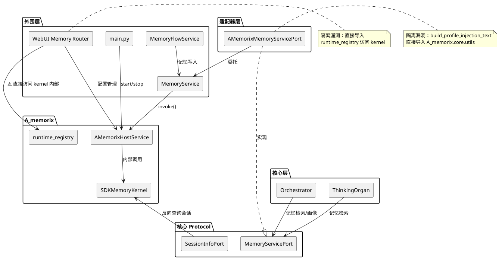
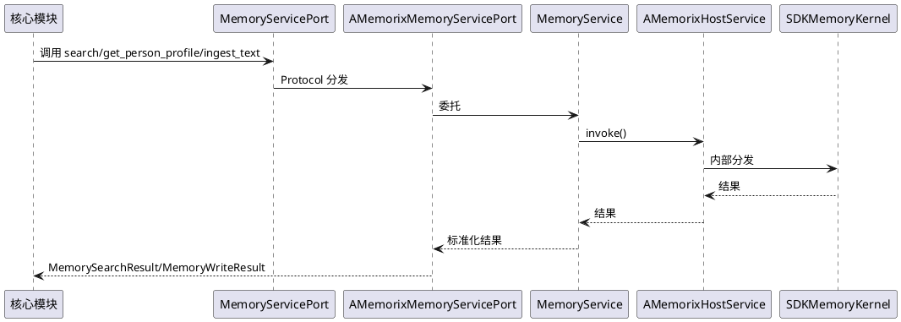
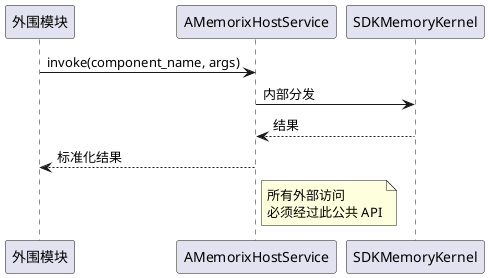
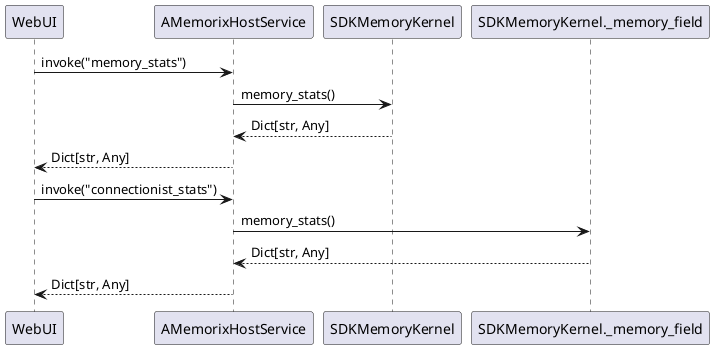
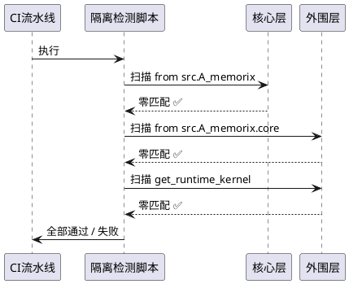

# SDKMemoryKernel 完全隔离 — 需求规格

# 1. 组件定位

## 1.1 核心职责

本组件负责消除核心模块及外围模块对 A_memorix 内部模块的直接依赖，实现 A_memorix 作为可独立重构子系统的完全隔离。

## 1.2 核心输入

1. **核心模块的访问请求**：`src/core/`、`src/maisaka/` 等核心层对记忆服务的调用，当前通过 MemoryServicePort Protocol 交互
2. **外围模块的访问请求**：`src/services/`、`src/webui/`、`src/main.py` 等对 A_memorix 的调用，当前部分直接导入 `a_memorix_host_service` 或 `get_runtime_kernel`
3. **A_memorix 内部的反向查询**：A_memorix 内部对会话信息的查询，当前通过注入的 `_session_info_port` 实现

## 1.3 核心输出

1. **隔离后的公共 API 层**：A_memorix 对外暴露的统一接口，所有外部模块通过此接口交互
2. **验证通过的隔离状态**：核心模块零直接导入 A_memorix 内部模块，外围模块仅通过公共 API 访问
3. **可独立重构的 A_memorix**：A_memorix 内部变更不影响核心模块和外围模块的编译与运行

## 1.4 职责边界

1. **不改变 A_memorix 内部架构**：本需求不涉及 SDKMemoryKernel 内部的服务拆分、类结构重构等内部设计
2. **不改变核心 Protocol 接口签名**：MemoryServicePort、SessionInfoPort 等 Protocol 的方法签名保持不变
3. **不新增业务功能**：本需求是纯架构债务消除，不引入新的业务能力
4. **不处理记忆范式迁移**：连接主义记忆系统的范式迁移是独立需求，不在本范围内

# 2. 领域术语

**隔离**
: 外部模块不直接导入 A_memorix 内部模块（`src/A_memorix/core/`、`src/A_memorix/runtime_registry.py` 等），只通过公共 API 或 Protocol 接口交互。

**公共 API 层**
: A_memorix 对外暴露的统一调用入口，当前为 `AMemorixHostService` 类及其 `invoke` 方法，未来可能扩展为更细粒度的接口。

**延迟导入（Lazy Import）**
: 在函数体内而非模块顶层执行 `from src.A_memorix.xxx import yyy`，虽然避免了启动时的循环依赖，但仍然违反隔离原则。

**核心层**
: `src/core/` 和 `src/maisaka/` 目录下的模块，是系统的心脏，必须遵守核心禁止项。

**外围层**
: `src/services/`、`src/webui/`、`src/main.py` 等非核心、非 A_memorix 内部的模块。外围层可以导入 A_memorix 的公共 API，但禁止导入内部模块。

**适配器层**
: `src/core/adapters/` 目录下的模块，是唯一允许导入 A_memorix 具体实现的地方，负责将 A_memorix 的公共 API 适配为核心 Protocol 接口。

**runtime_registry**
: `src/A_memorix/runtime_registry.py`，全局单例注册表，存储 SDKMemoryKernel 实例引用。当前被 WebUI 直接导入访问 kernel 内部属性，属于隔离漏洞。

# 3. 角色与边界

## 3.1 核心角色

- **核心开发者**：维护 `src/core/` 和 `src/maisaka/` 的开发者，需要确保核心模块不直接依赖 A_memorix 内部
- **A_memorix 维护者**：维护 `src/A_memorix/` 的开发者，需要确保内部变更不影响外部模块
- **WebUI 开发者**：维护 `src/webui/` 的开发者，需要通过公共 API 访问记忆服务

## 3.2 外部系统

- **MemoryServicePort**：核心定义的记忆服务 Protocol，AMemorixMemoryServicePort 适配器实现
- **SessionInfoPort**：核心定义的会话信息查询 Protocol，供 A_memorix 反向查询会话
- **AMemorixHostService**：A_memorix 的公共 API 层，当前通过 `invoke` 方法提供统一调用入口

## 3.3 交互上下文

# 4. DFX 约束

## 4.1 性能

1. **公共 API 调用延迟**：通过公共 API 调用的延迟不得高于当前直接导入方式，差异不超过 5%
2. **启动时间**：隔离改造后 A_memorix 启动时间不得增加超过 100ms

## 4.2 可靠性

1. **零功能回归**：所有现有记忆检索、写入、画像、管理功能的行为必须与改造前完全一致
2. **编译时隔离验证**：隔离状态必须可通过静态分析工具验证（如 grep 搜索导入模式），而非仅靠人工审查

## 4.3 安全性

1. **访问边界**：A_memorix 内部属性（如 `kernel.metadata_store`、`kernel._memory_field`）不得被外部模块直接访问
2. **错误暴露**：隔离改造中不得引入兜底逻辑掩盖错误，违反"不兜底"原则

## 4.4 可维护性

1. **导入规则可检测**：核心禁止项6（禁止核心导入 A_memorix 内部模块）必须可通过 CI 脚本自动检测
2. **变更影响可控**：A_memorix 内部重构时，只需验证适配器层和公共 API 层，无需检查核心模块

## 4.5 兼容性

1. **MemoryServicePort 接口兼容**：Protocol 方法签名不变，现有调用方无需修改
2. **WebUI API 兼容**：WebUI 的 HTTP 接口和返回数据结构不变
3. **渐进式迁移**：支持分批消除隔离漏洞，每批改造后系统可独立运行

# 5. 核心能力

## 5.1 核心层隔离强化

### 5.1.1 业务规则

1. **核心层零直接导入规则**：`src/core/` 和 `src/maisaka/` 目录下的模块禁止出现 `from src.A_memorix` 或 `from src.A_memorix.core` 的导入语句
   - 验收条件：在 `src/core/` 和 `src/maisaka/` 目录执行 `grep -r "from src.A_memorix" .` → 返回零匹配

2. **适配器层延迟导入消除规则**：`src/core/adapters/memory_service.py` 中的 `build_profile_injection_text` 方法当前直接导入 `src.A_memorix.core.utils.profile_text`，必须改为通过 `AMemorixHostService` 的公共 API 调用
   - 验收条件：`src/core/adapters/memory_service.py` 中不再出现 `from src.A_memorix.core` 导入 → `build_profile_injection_text` 通过 `a_memorix_host_service.build_profile_injection_text()` 委托

3. **禁止项**：核心层禁止绕过 MemoryServicePort 直接访问 A_memorix 内部类或函数
   - 验收条件：核心模块中出现 `SDKMemoryKernel`、`KernelSearchRequest` 等内部类名 → 编译错误或 lint 警告

### 5.1.2 交互流程

### 5.1.3 异常场景

1. **A_memorix 未启用时的隔离调用**
   - 触发条件：核心模块通过 MemoryServicePort 调用记忆服务，但 A_memorix 配置为未启用
   - 系统行为：AMemorixHostService.invoke() 返回 `_disabled_response`，适配器层将其转换为空结果
   - 用户感知：记忆检索返回空结果，不抛出异常

2. **公共 API 方法缺失**
   - 触发条件：适配器层调用的公共 API 方法在 AMemorixHostService 中不存在
   - 系统行为：AMemorixHostService.invoke() 抛出 RuntimeError
   - 用户感知：调用方收到异常，错误信息包含不支持的组件名称

## 5.2 外围层隔离规范

### 5.2.1 业务规则

1. **外围层公共 API 访问规则**：`src/services/`、`src/webui/`、`src/main.py` 等外围模块只能导入 A_memorix 的公共 API（`a_memorix_host_service`），禁止导入 `src.A_memorix.core.*`、`src.A_memorix.runtime_registry` 等内部模块
   - 验收条件：外围模块中执行 `grep -r "from src.A_memorix.core" .` → 返回零匹配（`src/A_memorix/` 目录内部除外）

2. **runtime_registry 访问消除规则**：`src/webui/routers/memory.py` 当前直接导入 `get_runtime_kernel` 并访问 `kernel.metadata_store` 等内部属性，必须改为通过 `AMemorixHostService` 的公共 API 获取所需数据
   - 验收条件：`src/webui/routers/memory.py` 不再导入 `src.A_memorix.runtime_registry` → 通过 `a_memorix_host_service.invoke()` 获取统计数据

3. **MemoryService 直接导入消除规则**：`src/services/memory_service.py` 当前顶层导入 `from src.A_memorix.host_service import a_memorix_host_service`，应改为延迟导入或通过注册机制解耦
   - 验收条件：`memory_service.py` 的模块顶层不再出现 `from src.A_memorix` 导入

4. **main.py 启动/停止路径规范**：`src/main.py` 中的 `a_memorix_host_service.start()/stop()` 调用应通过注册机制或服务定位器模式解耦，而非直接导入
   - 验收条件：`main.py` 不再直接导入 `from src.A_memorix.host_service`

5. **禁止项**：外围模块禁止通过 `get_runtime_kernel()` 获取 SDKMemoryKernel 实例后直接访问其内部属性
   - 验收条件：外围模块中出现 `kernel.metadata_store`、`kernel._memory_field` 等直接属性访问 → 编译错误或 lint 警告

### 5.2.2 交互流程

### 5.2.3 异常场景

1. **WebUI 访问 kernel 内部属性**
   - 触发条件：WebUI 需要获取 `metadata_store` 执行 SQL 查询等底层操作
   - 系统行为：AMemorixHostService 提供等价的公共 API 方法（如 `invoke("memory_stats")` 或新增专用方法）
   - 用户感知：WebUI 功能不变，但通过公共 API 而非直接访问实现

2. **MemoryFlowService 通过 getattr 访问 kernel 内部**
   - 触发条件：`memory_flow_service.py` 通过 `getattr(memory_service_module, "a_memorix_host_service")` 获取 host_service，再通过 `getattr(runtime_manager, "_ensure_kernel")` 获取 kernel，最终访问 `kernel.metadata_store`
   - 系统行为：改为通过 `memory_service` 的公共方法查询，不直接访问 kernel 内部
   - 用户感知：聊天摘要功能不变

## 5.3 A_memorix 公共 API 补全

### 5.3.1 业务规则

1. **公共 API 覆盖完整性规则**：AMemorixHostService 的 `invoke` 方法必须覆盖所有外部模块当前直接访问 kernel 内部属性所需要的能力，确保消除直接访问后无功能缺失
   - 验收条件：逐一对照当前 `get_runtime_kernel()` 的使用场景，每个场景都有对应的 `invoke` 组件名或公共方法

2. **build_profile_injection_text 公共 API 规则**：`AMemorixHostService.build_profile_injection_text()` 已作为公共 API 存在，适配器层必须通过此方法调用，而非直接导入 `src.A_memorix.core.utils.profile_text`
   - 验收条件：`src/core/adapters/memory_service.py` 中 `build_profile_injection_text` 方法的实现调用 `a_memorix_host_service.build_profile_injection_text()`

3. **WebUI 统计数据公共 API 规则**：WebUI 当前通过 `get_runtime_kernel()` 获取 kernel 实例后访问 `metadata_store` 执行查询，必须在 AMemorixHostService 中提供等价的公共 API
   - 验收条件：WebUI 的所有 kernel 内部属性访问都有对应的 `invoke` 组件名

4. **禁止项**：公共 API 方法禁止暴露 SDKMemoryKernel 的内部属性引用（如直接返回 `kernel.metadata_store` 对象），必须返回序列化后的数据
   - 验收条件：`invoke` 返回值为 `Dict[str, Any]` 或其他纯数据类型 → 不包含对 kernel 内部对象的引用

### 5.3.2 交互流程

### 5.3.3 异常场景

1. **公共 API 方法尚未实现**
   - 触发条件：外部模块需要的能力在 AMemorixHostService.invoke() 中没有对应的组件名
   - 系统行为：invoke() 抛出 RuntimeError，提示不支持的调用
   - 用户感知：调用方收到明确的错误信息，可据此补充公共 API

2. **公共 API 返回数据结构变更**
   - 触发条件：A_memorix 内部重构导致 invoke() 返回的字典结构变化
   - 系统行为：适配器层和 MemoryService 负责适配，核心模块不受影响
   - 用户感知：核心模块无感知，外围模块通过 MemoryService 间接适配

## 5.4 隔离验证机制

### 5.4.1 业务规则

1. **静态导入检测规则**：必须提供可执行的检测脚本或 CI 规则，自动扫描核心层和外围层对 A_memorix 内部模块的违规导入
   - 验收条件：运行检测脚本 → 核心层零匹配 `from src.A_memorix`（适配器层除外），外围层零匹配 `from src.A_memorix.core`

2. **runtime_registry 使用检测规则**：必须检测外围模块对 `get_runtime_kernel()` 的直接调用
   - 验收条件：运行检测脚本 → `src/A_memorix/` 目录外零匹配 `get_runtime_kernel`

3. **kernel 内部属性访问检测规则**：必须检测外围模块对 `kernel._xxx`、`kernel.metadata_store` 等内部属性的访问
   - 验收条件：运行检测脚本 → `src/A_memorix/` 目录外零匹配 `kernel\._` 或 `kernel\.metadata_store`

4. **禁止项**：隔离验证不得依赖人工审查，必须可自动化执行
   - 验收条件：检测脚本可在 CI 环境中运行并输出通过/失败结果

### 5.4.2 交互流程

### 5.4.3 异常场景

1. **检测脚本误报**
   - 触发条件：适配器层的合法导入被检测脚本标记为违规
   - 系统行为：检测脚本维护白名单，排除适配器层的合法导入
   - 用户感知：CI 不因误报而失败

2. **新增代码引入违规导入**
   - 触发条件：开发者在新代码中引入了对 A_memorix 内部模块的直接导入
   - 系统行为：CI 检测脚本拦截，构建失败
   - 用户感知：开发者收到明确的违规提示，需修改为通过公共 API 访问

# 6. 数据约束

## 6.1 隔离违规记录

1. **违规类型**：枚举值，包含 `core_direct_import`、`peripheral_core_import`、`runtime_registry_access`、`kernel_internal_access`
2. **违规文件**：违规所在的文件路径
3. **违规行号**：违规所在的行号
4. **当前状态**：枚举值，包含 `pending`（待修复）、`fixed`（已修复）、`whitelisted`（白名单豁免）

## 6.2 公共 API 能力映射

1. **组件名**：invoke() 的 component_name 参数值
2. **对应 kernel 内部方法/属性**：该组件名替代的直接访问路径
3. **调用方列表**：当前使用该能力的外围模块
4. **暴露状态**：枚举值，包含 `exposed`（已通过公共 API 暴露）、`missing`（尚未暴露，需新增）、`internal_only`（仅内部使用，无需暴露）

## 6.3 当前隔离漏洞清单

基于代码分析，当前存在以下隔离漏洞：

1. **`src/core/adapters/memory_service.py:166`**：延迟导入 `from src.A_memorix.host_service import a_memorix_host_service`，在 `build_profile_injection_text` 方法中直接调用 host_service
2. **`src/services/memory_service.py:6`**：顶层导入 `from src.A_memorix.host_service import a_memorix_host_service`
3. **`src/webui/routers/memory.py:16-17`**：直接导入 `from src.A_memorix.host_service import a_memorix_host_service` 和 `from src.A_memorix.runtime_registry import get_runtime_kernel`
4. **`src/webui/routers/memory.py:724`**：通过 `get_runtime_kernel()` 获取 kernel 实例，访问 `kernel.metadata_store`
5. **`src/main.py:132,276`**：直接导入 `from src.A_memorix.host_service import a_memorix_host_service`
6. **`src/services/memory_flow_service.py:547`**：通过 `getattr(memory_service_module, "a_memorix_host_service")` 和 `getattr(runtime_manager, "_ensure_kernel")` 访问 kernel 内部