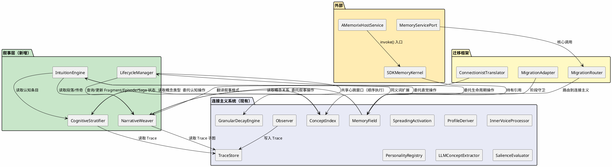
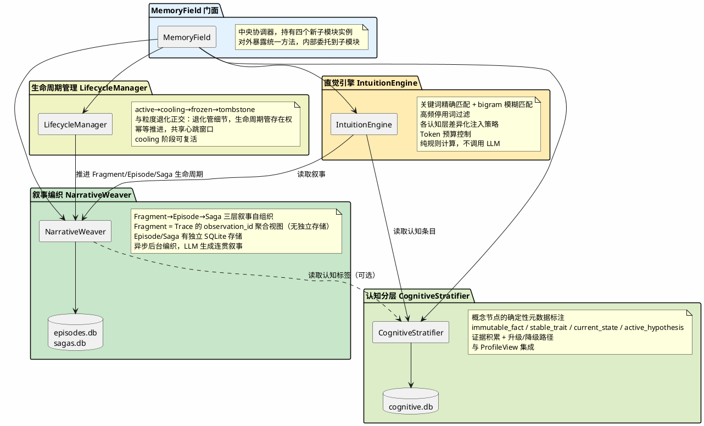
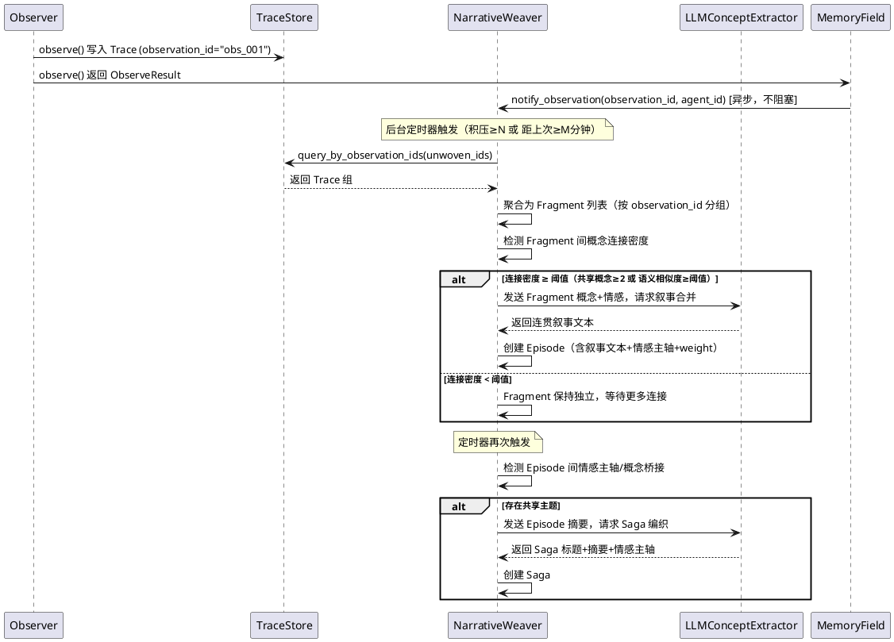
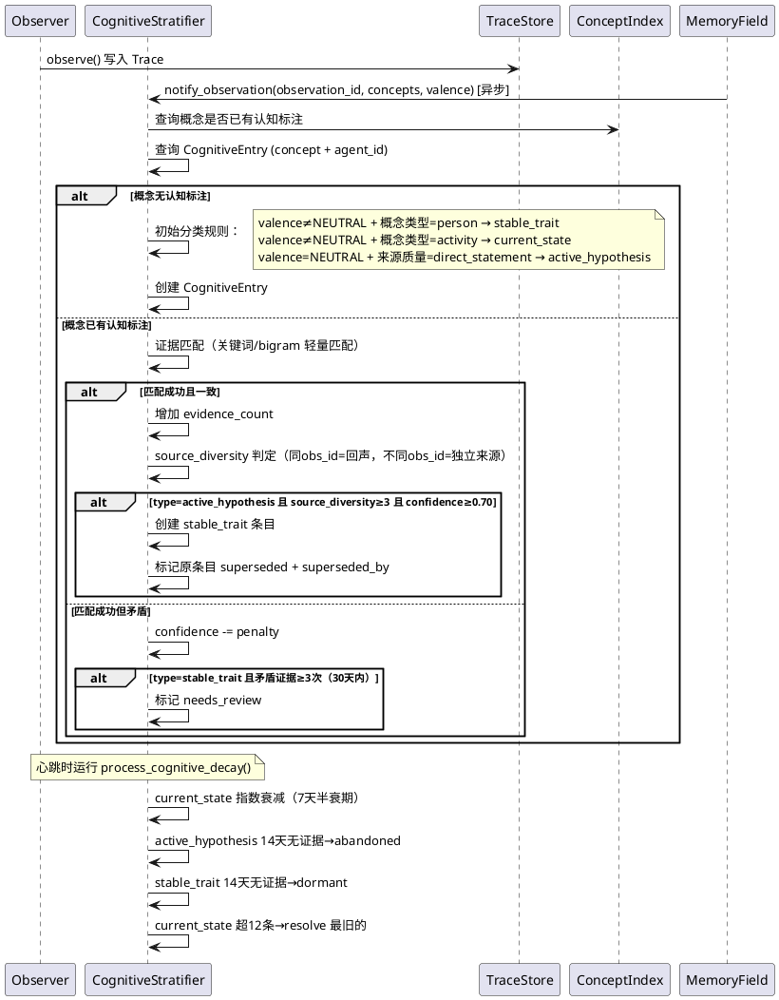
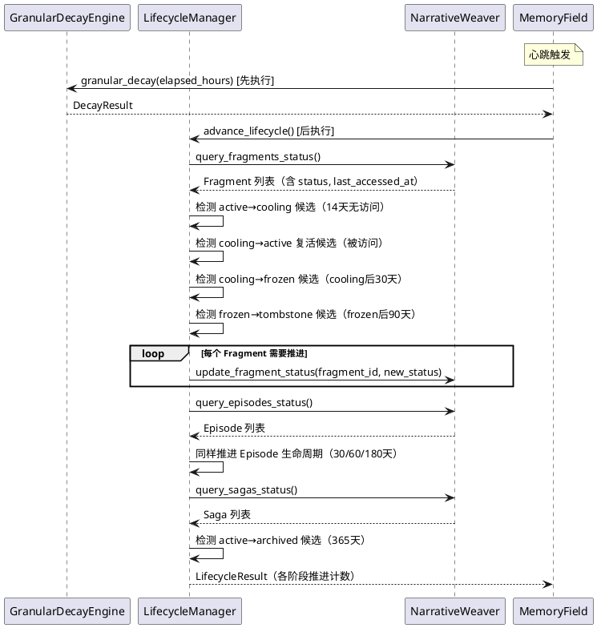
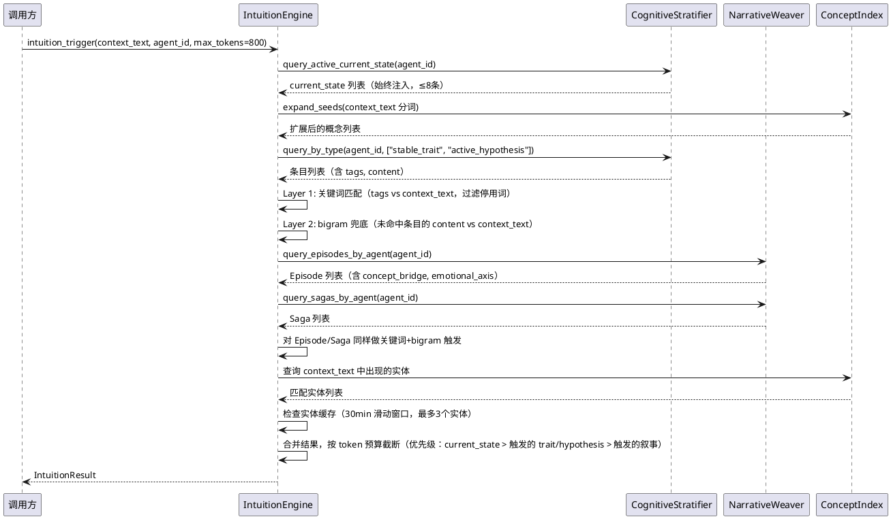
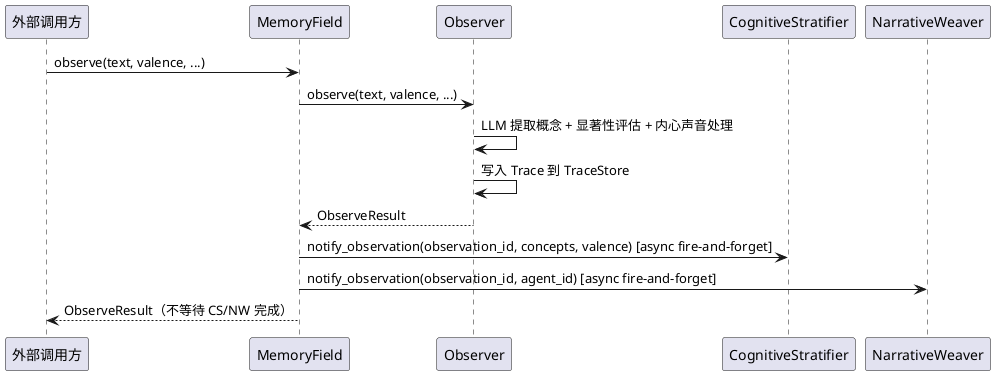

# 1. 实现模型

## 1.1 上下文视图



## 1.2 服务/组件总体架构



## 1.3 实现设计文档

### 1.3.1 叙事编织流程



### 1.3.2 认知分层流程



### 1.3.3 生命周期推进流程



### 1.3.4 直觉触发流程



### 1.3.5 Observer 集成流程



# 2. 接口设计

## 2.1 总体设计

| 模块 | 接口 | 变更类型 | 说明 |
|------|------|----------|------|
| MemoryField | `weave_narrative(agent_id)` | 新增 | 手动触发叙事编织 |
| MemoryField | `get_intuition(context_text, agent_id, max_tokens)` | 新增 | 获取直觉触发结果 |
| MemoryField | `advance_lifecycle()` | 新增 | 推进生命周期 |
| MemoryField | `get_cognitive_entries(agent_id, concept)` | 新增 | 查询认知条目 |
| MemoryField | `add_cognitive_evidence(entry_id, observation_id, is_confirm)` | 新增 | 增加认知证据 |
| MemoryField | `memory_stats()` | 修改 | 增加叙事/认知/生命周期统计 |
| Observer | `observe()` | 修改 | 完成后通知 CS/NW（异步） |
| ProfileDeriver | `derive_profile()` | 修改 | AssociationItem 增加 cognitive_type，ProfileView 增加 episodes/sagas |
| AssociationItem | `cognitive_type` | 新增字段 | 认知层类型 |
| ProfileView | `episodes` | 新增字段 | 相关 Episode 摘要 |
| ProfileView | `sagas` | 新增字段 | 相关 Saga 摘要 |
| NarrativeWeaver | `notify_observation(observation_id, agent_id)` | 新增 | 通知新观察 |
| NarrativeWeaver | `weave(agent_id)` | 新增 | 执行叙事编织 |
| NarrativeWeaver | `query_fragments_status()` | 新增 | 查询 Fragment 状态 |
| NarrativeWeaver | `query_episodes_by_agent(agent_id)` | 新增 | 查询 Episode |
| NarrativeWeaver | `query_sagas_by_agent(agent_id)` | 新增 | 查询 Saga |
| NarrativeWeaver | `update_fragment_status(fragment_id, status)` | 新增 | 更新 Fragment 生命周期 |
| NarrativeWeaver | `update_episode_status(episode_id, status)` | 新增 | 更新 Episode 生命周期 |
| CognitiveStratifier | `notify_observation(observation_id, concepts, valence)` | 新增 | 通知新观察 |
| CognitiveStratifier | `query_active_current_state(agent_id)` | 新增 | 查询当前状态 |
| CognitiveStratifier | `query_by_type(agent_id, types)` | 新增 | 按类型查询 |
| CognitiveStratifier | `process_cognitive_decay()` | 新增 | 认知衰减处理 |
| LifecycleManager | `advance_lifecycle()` | 新增 | 推进生命周期 |
| IntuitionEngine | `intuition_trigger(context_text, agent_id, max_tokens)` | 新增 | 直觉触发 |
| TraceStore | `query_by_observation_ids(observation_ids)` | 新增 | 按观察批次查询 |
| TraceStore | `query_by_observation_id(observation_id)` | 新增 | 按单个观察批次查询 |

## 2.2 接口清单

### 2.2.1 MemoryField 新增方法

#### `weave_narrative(agent_id: str) -> None`

- **业务说明**：手动触发指定智能体的叙事编织
- **前置条件**：MigrationAdapter.should_observe() == True
- **后置条件**：Fragment 积压被编织为 Episode/Saga（异步执行）
- **变更内容**：新增方法，委托到 NarrativeWeaver.weave()

#### `get_intuition(context_text: str, agent_id: str, max_tokens: int = 800) -> IntuitionResult`

- **业务说明**：根据对话上下文选择性注入记忆信息
- **前置条件**：MigrationAdapter.should_recall() == True（DUAL_READ 及以后阶段才读取）
- **后置条件**：返回触发的认知条目、叙事段落、传奇摘要
- **变更内容**：新增方法，委托到 IntuitionEngine.intuition_trigger()

#### `advance_lifecycle() -> LifecycleResult`

- **业务说明**：推进 Fragment/Episode/Saga 的生命周期阶段
- **前置条件**：MigrationAdapter.should_observe() == True
- **后置条件**：符合条件的状态被推进，操作幂等
- **变更内容**：新增方法，委托到 LifecycleManager.advance_lifecycle()

#### `get_cognitive_entries(agent_id: str, concept: str = "") -> list[CognitiveEntry]`

- **业务说明**：查询指定智能体的认知条目
- **前置条件**：MigrationAdapter.should_recall() == True
- **后置条件**：返回匹配的认知条目列表
- **变更内容**：新增方法，委托到 CognitiveStratifier

#### `add_cognitive_evidence(entry_id: int, observation_id: str, is_confirm: bool) -> None`

- **业务说明**：为认知条目增加证据
- **前置条件**：entry_id 对应的 CognitiveEntry 存在且 status=active
- **后置条件**：evidence_count 增加，source_diversity 可能增加，confidence 可能变化
- **变更内容**：新增方法，委托到 CognitiveStratifier

### 2.2.2 NarrativeWeaver 接口

#### `notify_observation(observation_id: str, agent_id: str) -> None`

- **业务说明**：Observer 完成写入后通知叙事编织器
- **前置条件**：observation_id 对应的 Trace 已写入 TraceStore
- **后置条件**：observation_id 加入待编织队列
- **变更内容**：新增方法

#### `weave(agent_id: str) -> WeaveResult`

- **业务说明**：执行叙事编织（Fragment→Episode→Saga）
- **前置条件**：有待编织的 Fragment 积压
- **后置条件**：语义相关的 Fragment 被编织为 Episode，主题相关的 Episode 被编织为 Saga
- **变更内容**：新增方法

#### `query_fragments_status() -> list[Fragment]`

- **业务说明**：查询所有 Fragment 的状态（供 LifecycleManager 使用）
- **前置条件**：无
- **后置条件**：返回 Fragment 列表
- **变更内容**：新增方法。Fragment 是 Trace 的聚合视图，通过 TraceStore.query_by_observation_ids() 动态构建

#### `query_episodes_by_agent(agent_id: str) -> list[Episode]`

- **业务说明**：查询指定智能体的所有 Episode
- **前置条件**：无
- **后置条件**：返回 Episode 列表
- **变更内容**：新增方法

#### `query_sagas_by_agent(agent_id: str) -> list[Saga]`

- **业务说明**：查询指定智能体的所有 Saga
- **前置条件**：无
- **后置条件**：返回 Saga 列表
- **变更内容**：新增方法

#### `update_fragment_status(observation_id: str, status: str) -> None`

- **业务说明**：更新 Fragment 的生命周期状态
- **前置条件**：Fragment 存在
- **后置条件**：Fragment 的 status 更新
- **变更内容**：新增方法。Fragment 状态存储在独立的 fragment_status 表中

#### `update_episode_status(episode_id: int, status: str) -> None`

- **业务说明**：更新 Episode 的生命周期状态
- **前置条件**：Episode 存在
- **后置条件**：Episode 的 status 更新
- **变更内容**：新增方法

### 2.2.3 CognitiveStratifier 接口

#### `notify_observation(observation_id: str, concepts: list[str], valence: Valence, agent_id: str) -> None`

- **业务说明**：Observer 完成写入后通知认知分层器
- **前置条件**：observation_id 对应的 Trace 已写入
- **后置条件**：新概念创建初始认知条目，已有概念增加证据
- **变更内容**：新增方法

#### `query_active_current_state(agent_id: str) -> list[CognitiveEntry]`

- **业务说明**：查询指定智能体的活跃当前状态
- **前置条件**：无
- **后置条件**：返回 status=active 且 type=current_state 的条目列表
- **变更内容**：新增方法

#### `query_by_type(agent_id: str, types: list[str]) -> list[CognitiveEntry]`

- **业务说明**：按认知类型查询条目
- **前置条件**：无
- **后置条件**：返回匹配的 CognitiveEntry 列表
- **变更内容**：新增方法

#### `process_cognitive_decay() -> CognitiveDecayResult`

- **业务说明**：处理认知衰减（current_state 指数衰减、hypothesis 超时放弃、trait 休眠）
- **前置条件**：无
- **后置条件**：符合衰减条件的条目 confidence 降低或 status 变更
- **变更内容**：新增方法

### 2.2.4 LifecycleManager 接口

#### `advance_lifecycle() -> LifecycleResult`

- **业务说明**：推进 Fragment/Episode/Saga 的生命周期
- **前置条件**：无
- **后置条件**：符合时间条件的条目 status 推进，操作幂等
- **变更内容**：新增方法

### 2.2.5 IntuitionEngine 接口

#### `intuition_trigger(context_text: str, agent_id: str, max_tokens: int = 800) -> IntuitionResult`

- **业务说明**：根据对话上下文选择性注入记忆信息
- **前置条件**：无
- **后置条件**：返回触发的认知条目、叙事段落、传奇摘要，总 token 不超过 max_tokens
- **变更内容**：新增方法

### 2.2.6 TraceStore 新增方法

#### `query_by_observation_id(observation_id: str) -> list[Trace]`

- **业务说明**：按单个观察批次 ID 查询 Trace
- **前置条件**：无
- **后置条件**：返回该 observation_id 下的所有 Trace
- **变更内容**：新增方法

#### `query_by_observation_ids(observation_ids: list[str]) -> dict[str, list[Trace]]`

- **业务说明**：批量按观察批次 ID 查询 Trace
- **前置条件**：无
- **后置条件**：返回 observation_id → Trace 列表的映射
- **变更内容**：新增方法

### 2.2.7 现有接口变更

#### `AssociationItem` 新增字段

- `cognitive_type: str = ""` — 认知层类型（immutable_fact/stable_trait/current_state/active_hypothesis/unknown）

#### `ProfileView` 新增字段

- `episodes: list[EpisodeSummary] = field(default_factory=list)` — 相关 Episode 摘要
- `sagas: list[SagaSummary] = field(default_factory=list)` — 相关 Saga 摘要

#### `MemoryField.memory_stats()` 扩展

- 返回值增加 `fragment_count`、`episode_count`、`saga_count`、`cognitive_entry_count` 字段

# 3. 数据模型

## 3.1 设计目标

1. **Fragment 不新建存储表**——是 Trace 的 observation_id 聚合视图，通过 TraceStore 动态查询构建
2. **Episode/Saga 有独立存储**——但可追溯到底层 Trace（通过 fragment_ids → observation_id → Trace）
3. **认知标注独立存储**——与 Trace/ConceptIndex 解耦，删除认知标注不影响基础数据
4. **Fragment 生命周期状态需持久化**——Fragment 本身是视图，但 status 和 last_accessed_at 需要存储
5. **所有表使用 TraceStore 的数据库连接**——不新建数据库文件，统一在 connectionist/ 目录下
6. **agent_id 隔离**——所有表包含 agent_id 字段

## 3.2 模型实现

### 3.2.1 SQLite 表结构

#### episodes 表

```sql
CREATE TABLE IF NOT EXISTS episodes (
    id INTEGER PRIMARY KEY AUTOINCREMENT,
    agent_id TEXT NOT NULL,
    title TEXT NOT NULL,
    content TEXT NOT NULL,
    weight REAL NOT NULL DEFAULT 0.5,
    emotional_axis TEXT NOT NULL DEFAULT 'none',
    fragment_ids TEXT NOT NULL,          -- JSON array of observation_id strings
    concept_bridge TEXT NOT NULL DEFAULT '[]',  -- JSON array of shared concepts
    all_concepts TEXT NOT NULL DEFAULT '[]',    -- JSON array of all underlying Fragment concepts
    consolidation_type TEXT NOT NULL DEFAULT 'standard',  -- standard/flash/degraded
    status TEXT NOT NULL DEFAULT 'active',  -- active/cooling/frozen/tombstone
    detail_level REAL NOT NULL DEFAULT 1.0,
    last_accessed_at REAL NOT NULL DEFAULT 0.0,
    timestamp REAL NOT NULL DEFAULT 0.0
);

CREATE INDEX IF NOT EXISTS idx_episodes_agent ON episodes(agent_id);
CREATE INDEX IF NOT EXISTS idx_episodes_status ON episodes(agent_id, status);
```

#### sagas 表

```sql
CREATE TABLE IF NOT EXISTS sagas (
    id INTEGER PRIMARY KEY AUTOINCREMENT,
    agent_id TEXT NOT NULL,
    title TEXT NOT NULL,
    description TEXT NOT NULL,
    emotional_axis TEXT NOT NULL DEFAULT 'none',
    episode_ids TEXT NOT NULL,           -- JSON array of episode IDs
    status TEXT NOT NULL DEFAULT 'active',  -- active/archived
    last_accessed_at REAL NOT NULL DEFAULT 0.0,
    timestamp REAL NOT NULL DEFAULT 0.0
);

CREATE INDEX IF NOT EXISTS idx_sagas_agent ON sagas(agent_id);
CREATE INDEX IF NOT EXISTS idx_sagas_status ON sagas(agent_id, status);
```

#### fragment_status 表

```sql
CREATE TABLE IF NOT EXISTS fragment_status (
    observation_id TEXT NOT NULL,
    agent_id TEXT NOT NULL,
    status TEXT NOT NULL DEFAULT 'active',  -- active/cooling/frozen/tombstone
    last_accessed_at REAL NOT NULL DEFAULT 0.0,
    PRIMARY KEY (observation_id, agent_id)
);

CREATE INDEX IF NOT EXISTS idx_fragment_status_state ON fragment_status(agent_id, status);
```

#### cognitive_entries 表

```sql
CREATE TABLE IF NOT EXISTS cognitive_entries (
    id INTEGER PRIMARY KEY AUTOINCREMENT,
    concept TEXT NOT NULL,
    agent_id TEXT NOT NULL,
    type TEXT NOT NULL,                  -- immutable_fact/stable_trait/current_state/active_hypothesis
    content TEXT NOT NULL,
    confidence REAL NOT NULL DEFAULT 0.3,
    decay_type TEXT NOT NULL DEFAULT 'evidence_dependent',  -- none/evidence_dependent/exponential
    evidence_count INTEGER NOT NULL DEFAULT 0,
    last_evidence_at REAL NOT NULL DEFAULT 0.0,
    source_diversity INTEGER NOT NULL DEFAULT 1,
    source_quality TEXT NOT NULL DEFAULT 'inferred',  -- direct_statement/inferred/backfilled
    status TEXT NOT NULL DEFAULT 'active',  -- active/resolved/abandoned/superseded/needs_review/dormant
    tags TEXT NOT NULL DEFAULT '[]',     -- JSON array of trigger keywords
    expires_at REAL,                     -- current_state 专用
    evolution_history TEXT NOT NULL DEFAULT '[]',  -- JSON array of evolution records
    superseded_by INTEGER,               -- FK to cognitive_entries.id
    contradicts_id INTEGER,              -- FK to cognitive_entries.id
    observation_ids TEXT NOT NULL DEFAULT '[]',  -- JSON array of source observation_ids
    timestamp REAL NOT NULL DEFAULT 0.0
);

CREATE INDEX IF NOT EXISTS idx_cog_entry_concept ON cognitive_entries(concept, agent_id);
CREATE INDEX IF NOT EXISTS idx_cog_entry_type ON cognitive_entries(agent_id, type, status);
CREATE INDEX IF NOT EXISTS idx_cog_entry_status ON cognitive_entries(agent_id, status);
```

#### intuition_stopwords 表

```sql
CREATE TABLE IF NOT EXISTS intuition_stopwords (
    word TEXT PRIMARY KEY,
    frequency INTEGER NOT NULL DEFAULT 0,
    updated_at REAL NOT NULL DEFAULT 0.0
);
```

### 3.2.2 dataclass 定义

```python
@dataclass
class Fragment:
    """叙事碎片——Trace 的 observation_id 聚合视图，无独立存储"""
    observation_id: str
    agent_id: str
    concepts: list[str]
    trace_keys: list[tuple[str, str, str, str]]
    valence: Valence
    max_weight: float
    timestamp: float
    status: str = "active"
    last_accessed_at: float = 0.0

@dataclass
class Episode:
    """叙事段落——围绕同一主题的碎片叙事整合"""
    id: int
    agent_id: str
    title: str
    content: str
    weight: float
    emotional_axis: str
    fragment_ids: list[str]
    concept_bridge: list[str]
    all_concepts: list[str] = field(default_factory=list)  # 底层 Fragment 概念并集，用于 Saga 连接检测
    consolidation_type: str = "standard"
    status: str = "active"
    detail_level: float = 1.0
    last_accessed_at: float = 0.0
    timestamp: float = 0.0

@dataclass
class Saga:
    """叙事传奇——跨主题的长期叙事弧线"""
    id: int
    agent_id: str
    title: str
    description: str
    emotional_axis: str
    episode_ids: list[int]
    status: str = "active"
    last_accessed_at: float = 0.0
    timestamp: float = 0.0

@dataclass
class CognitiveEntry:
    """认知条目——概念节点的确定性元数据标注"""
    id: int
    concept: str
    agent_id: str
    type: str
    content: str
    confidence: float = 0.3
    decay_type: str = "evidence_dependent"
    evidence_count: int = 0
    last_evidence_at: float = 0.0
    source_diversity: int = 1
    source_quality: str = "inferred"
    status: str = "active"
    tags: list[str] = field(default_factory=list)
    expires_at: float | None = None
    evolution_history: list[dict] = field(default_factory=list)
    superseded_by: int | None = None
    contradicts_id: int | None = None
    observation_ids: list[str] = field(default_factory=list)
    timestamp: float = 0.0

@dataclass
class IntuitionResult:
    """直觉触发结果"""
    triggered_entries: list[dict]
    triggered_episodes: list[dict]
    triggered_sagas: list[dict]
    cached_entities: list[dict]
    token_estimate: int
    trigger_stats: dict

@dataclass
class WeaveResult:
    """叙事编织结果"""
    fragments_processed: int
    episodes_created: int
    sagas_created: int
    elapsed_ms: float

@dataclass
class LifecycleResult:
    """生命周期推进结果"""
    fragments_advanced: int
    episodes_advanced: int
    sagas_archived: int
    revived: int
    elapsed_ms: float

@dataclass
class CognitiveDecayResult:
    """认知衰减结果"""
    entries_processed: int
    hypotheses_abandoned: int
    traits_dormant: int
    states_expired: int
    elapsed_ms: float

@dataclass
class EpisodeSummary:
    """画像推导中的 Episode 摘要"""
    title: str
    emotional_axis: str
    fragment_count: int

@dataclass
class SagaSummary:
    """画像推导中的 Saga 摘要"""
    title: str
    emotional_axis: str
    episode_count: int
```

### 3.2.3 新增枚举

```python
class CognitiveType(str, Enum):
    """认知层类型"""
    IMMUTABLE_FACT = "immutable_fact"
    STABLE_TRAIT = "stable_trait"
    CURRENT_STATE = "current_state"
    ACTIVE_HYPOTHESIS = "active_hypothesis"

class LifecycleStatus(str, Enum):
    """生命周期阶段"""
    ACTIVE = "active"
    COOLING = "cooling"
    FROZEN = "frozen"
    TOMBSTONE = "tombstone"

class EmotionalAxis(str, Enum):
    """情感主轴"""
    BOND = "bond"
    VIGILANCE = "vigilance"
    CONFIDENCE = "confidence"
    HUMILITY = "humility"
    WARMTH = "warmth"
    MELANCHOLY = "melancholy"
    GROUNDED = "grounded"
    NONE = "none"
```

### 3.2.4 文件组织

```
src/A_memorix/core/connectionist/
├── memory_field.py              # 扩展：新增 5 个委托方法
├── models.py                    # 扩展：新增 Fragment/Episode/Saga/CognitiveEntry 等 dataclass
├── enums.py                     # 扩展：新增 CognitiveType/LifecycleStatus/EmotionalAxis
├── observer.py                  # 扩展：observe() 完成后通知 CS/NW
├── profile_deriver.py           # 扩展：AssociationItem 增加 cognitive_type，ProfileView 增加 episodes/sagas
├── trace_store.py               # 扩展：新增 query_by_observation_id(s) 方法
├── narrative/
│   ├── __init__.py
│   ├── narrative_weaver.py      # 叙事编织器
│   ├── episode_store.py         # Episode/Saga SQLite 持久化
│   └── fragment_view.py         # Fragment 聚合视图构建
├── cognitive/
│   ├── __init__.py
│   ├── cognitive_stratifier.py  # 认知分层器
│   └── cognitive_store.py       # CognitiveEntry SQLite 持久化
├── lifecycle/
│   ├── __init__.py
│   └── lifecycle_manager.py     # 生命周期管理器
└── intuition/
    ├── __init__.py
    ├── intuition_engine.py      # 直觉引擎
    └── stopwords.py             # 停用词管理
```