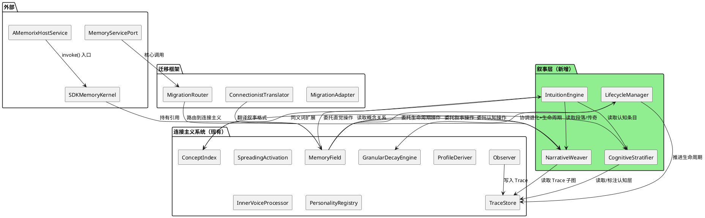
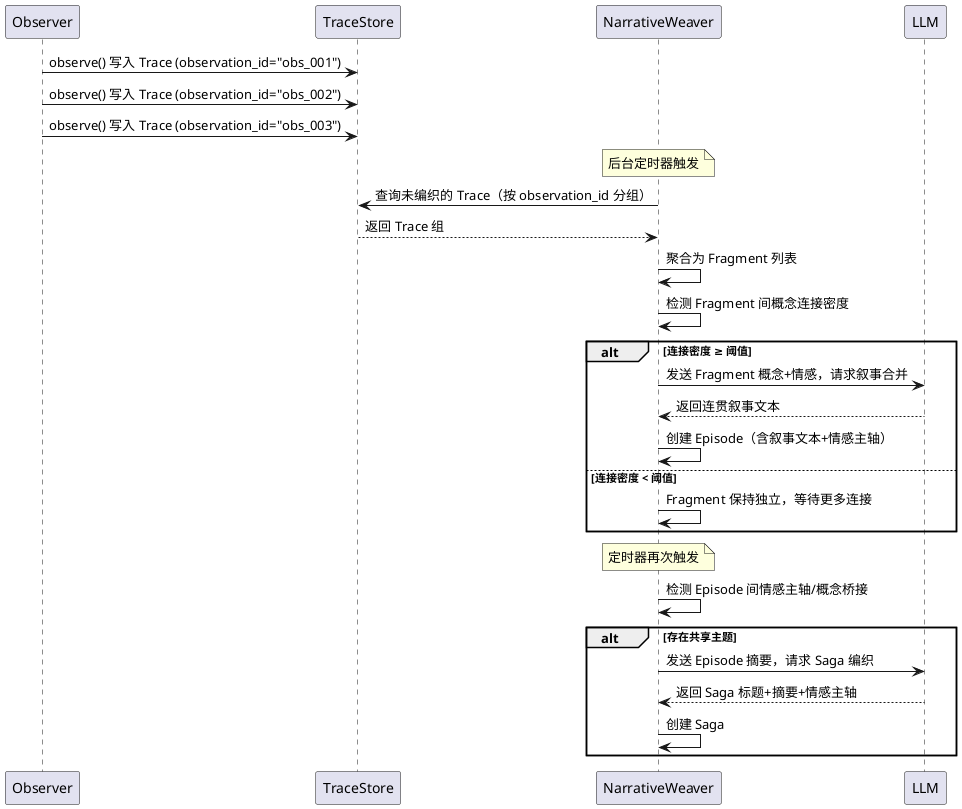
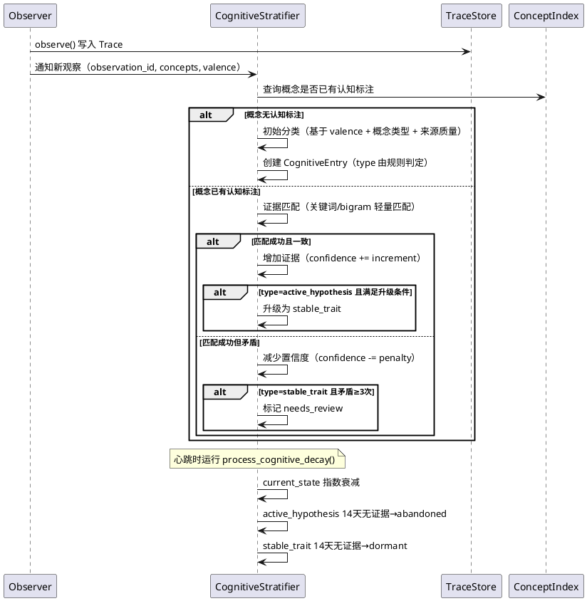
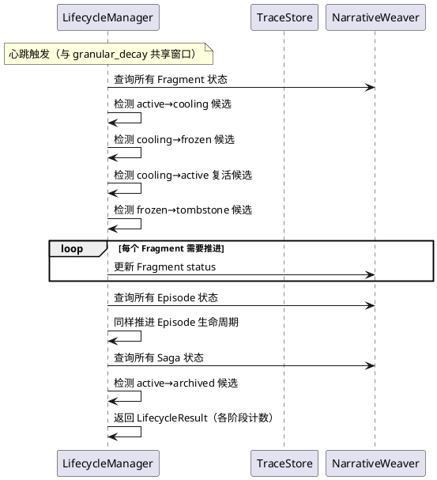
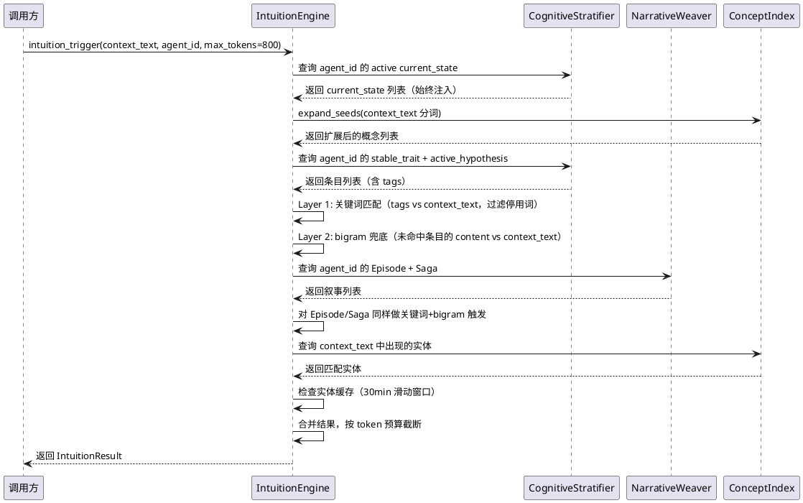

# 1. 组件定位

## 1.1 核心职责

本组件为 A_Memorix 连接主义记忆系统增加**叙事整合**能力，并借鉴 MemoryConstellations 的认知分层、生命周期和直觉触发思想，使连接主义系统从"概念间的激活痕迹"进化为"能将碎片编织成故事"的记忆场。

**定位：原型实验**——验证核心概念的可行性，不是完整的生产系统。

## 1.2 核心输入

1. **现有连接主义系统** — Trace（概念连接痕迹）、ConceptIndex（概念注册/同义词/频率）、SpreadingActivation（激活扩散回忆）、GranularDecayEngine（粒度退化+情感地板）、ProfileDeriver（画像推导）、InnerVoiceProcessor（内心声音处理）、PersonalityRegistry（性格注册表）
2. **MemoryPersonalityV2** — 智能体记忆性格声明（decay_rate/emotional_sensitivity/association_depth 等8参数）
3. **13个智能体** — 各自独立的记忆空间（agent_id 隔离），各有 inner_voices 配置
4. **MigrationAdapter** — 五阶段迁移状态机（当前 DUAL_WRITE 阶段）
5. **MigrationRouter** — 迁移感知路由（分类学+连接主义双写，仅分类学读取）
6. **MemoryConstellations 框架** — 开源记忆框架，其核心思想值得借鉴移植（Fragment→Episode→Saga 叙事自组织、四层认知模型、四阶段生命周期、直觉引擎）

## 1.3 核心输出

1. **叙事层**（Narrative Layer）— 在 Trace 之上增加 Fragment→Episode→Saga 三层叙事自组织能力，使连接主义系统能将碎片编织成故事
2. **认知分层**（Cognitive Stratification）— 将 ProfileView 的扁平画像细分为 immutable_fact/stable_trait/current_state/active_hypothesis 四层，区分"不变事实""稳定特质""当前状态""活跃假设"
3. **生命周期完善**（Lifecycle Completion）— 在 GranularDecayEngine 的粒度退化基础上增加 active→cooling→frozen→tombstone 四阶段生命周期，使记忆有完整的新陈代谢
4. **直觉触发**（Intuition Triggering）— 增加关键词+bigram 双层触发机制，只在相关时注入上下文，避免全量 dump

## 1.4 职责边界

- **是**：在连接主义系统内部增加叙事、认知、生命周期、直觉四个子模块
- **是**：与现有 Trace/ConceptIndex/SpreadingActivation/GranularDecayEngine 兼容，不破坏已有功能
- **是**：保持与"记忆是连接而非对象"原则一致——叙事不是新的标本类型，而是连接的涌现属性
- **否**：不改变 MigrationAdapter 的阶段推进逻辑（仍处于 DUAL_WRITE）
- **否**：不修改 MemoryServicePort Protocol 接口签名
- **否**：不修改核心模块（src/maisaka/、src/core/）的代码
- **否**：不引入对 MemoryConstellations 代码的直接依赖（仅借鉴思想，用 Python 重新实现）
- **否**：不改变分类学系统的任何行为

## 1.5 原型实验定位

本阶段是**原型实验**，目标是验证核心概念的可行性，不是构建完整的生产系统。具体含义：

- 优先验证**叙事整合**（连接主义系统最大的缺口），其余三个借鉴点作为辅助
- 允许使用 LLM 调用进行叙事合并和认知分类，不追求零 LLM 的纯规则方案
- 数据模型可以简化，但必须与 Trace 体系兼容
- 不要求 WebUI 展示，但需提供 admin API 供调试
- 不要求性能优化，但不得显著退化现有心跳评估（13智能体单次 ~600ms）

# 2. 领域术语

**叙事（Narrative）**
: 记忆的涌现属性——当足够多的 Trace 围绕同一主题形成密集连接时，叙事从连接网络中自然涌现。叙事不是新的标本类型，不是给记忆贴的标签，而是连接的编织模式。新叙事 = 新的连接编织，叙事遗忘 = 编织模式衰减，叙事回忆 = 重新激活编织模式。

**碎片（Fragment）**
: 叙事层的最小单位，由一次观察（observe）产生的概念提取结果自动聚合。碎片不是独立的数据条目，而是同一 observation_id 下的一组 Trace 的聚合视图。碎片继承其底层 Trace 的所有属性（概念、权重、情感极性、声音视角）。

**段落（Episode）**
: 围绕同一主题的碎片叙事整合。当多个碎片通过 Trace 连接形成密集子图时，段落从子图中涌现。段落是叙事的中间层——它不是碎片的简单拼接，而是对"发生了什么"的连贯叙述。段落有独立的权重和情感主轴。

**传奇（Saga）**
: 跨主题的长期叙事弧线。当多个段落共享情感主轴或概念桥接时，传奇从段落间涌现。传奇是叙事的最高层——它描述的不是单个事件，而是跨越时间的主题线索（如"一段友谊的深化""一个项目的起伏"）。传奇的 emotional_axis 对智能体情绪产生微弱但持续的偏置。

**认知层（Cognitive Layer）**
: 对画像中概念条目的确定性分层，区分"不变事实""稳定特质""当前状态""活跃假设"四种确定性层级。认知层不是新的数据结构，而是对 Trace 网络中概念节点的元数据标注——同一个概念可以同时处于多个认知层（如"银狼"既是不变事实又是稳定特质）。

**不变事实（Immutable Fact）**
: 一旦确认就不会变的客观事实。永不衰减，仅通过明确纠正修改。如"银狼的生日是3月15日"。

**稳定特质（Stable Trait）**
: 长期稳定的人格特质、偏好、习惯。依赖证据积累精细化，矛盾证据≥3次触发降级重审。如"银狼喜欢游戏"。

**当前状态（Current State）**
: 瞬时状态，有明确的时间边界。指数衰减（7天半衰期），过期自动消解。如"银狼正在打崩铁"。

**活跃假设（Active Hypothesis）**
: 尚未充分验证的推测。3次独立确认升级为稳定特质，14天无证据自动放弃。如"银狼可能对新出的游戏感兴趣"。

**生命周期阶段（Lifecycle Phase）**
: 记忆从出生到退休的完整新陈代谢路径：active→cooling→frozen→tombstone。与粒度退化互补——粒度退化控制"细节的模糊化"，生命周期控制"存在权的逐步撤销"。

**直觉触发（Intuition Triggering）**
: 基于当前对话上下文选择性注入记忆信息的机制。关键词精确匹配优先，bigram 模糊匹配兜底，高频停用词过滤。只在相关时注入，避免全量 dump。

**情感主轴（Emotional Axis）**
: 传奇的情感基调，从连接网络中推导。8个值：bond（联结）/vigilance（警觉）/confidence（自信）/humility（谦逊）/warmth（温暖）/melancholy（忧郁）/grounded（沉稳）/none。对智能体情绪产生微弱偏置（约6%自然漂移率）。

**证据多样性（Source Diversity）**
: 认知条目的证据来源独立性度量。独立来源（不同观察批次、不同时间窗口）的确认权重显著高于同批次回声。防止"自证循环"——同一消息链中反复出现的表述不应被误判为多重确认。

# 3. 角色与边界

## 3.1 核心角色

- **开发者**：在 A_memorix 连接主义系统内部实现叙事、认知、生命周期、直觉四个子模块
- **运维人员**：通过 admin API 和日志监控叙事整合效果、认知分层准确性、生命周期状态、直觉触发命中率
- **智能体**：通过 MemoryServicePort 间接消费叙事层产出的更丰富记忆上下文

## 3.2 外部系统

- **MemoryServicePort** — 核心与 A_memorix 之间的 Protocol 接口，叙事层产出最终通过此接口暴露
- **MigrationRouter** — 迁移感知路由，叙事层需在迁移框架内正确路由
- **SDKMemoryKernel** — A_memorix 运行时内核，叙事层作为其子模块注册
- **AMemorixHostService** — 对外统一 API 入口，叙事层通过 invoke() 暴露 admin 操作
- **EmotionManager** — 智能体情绪系统，传奇的 emotional_axis 可作为情绪偏置源（未来集成，本原型不实现）

## 3.3 交互上下文



# 4. DFX约束

## 4.1 性能

- 叙事整合（Fragment→Episode）的 LLM 调用不得在消息处理热路径上——必须在后台异步执行
- 直觉触发的判定逻辑必须是纯规则计算（关键词+bigram），单次判定 ≤ 5ms
- 生命周期推进与粒度退化共享心跳窗口，不得使 13 智能体单次评估从 ~600ms 增长超过 50%
- 认知分层的证据匹配优先使用轻量规则（关键词/bigram），LLM 仅用于矛盾判定和假设升级

## 4.2 可靠性

- 叙事层失败不得影响 Trace 的正常读写——叙事是 Trace 的涌现属性，Trace 是基础
- 认知分层标注错误不应导致记忆丢失——认知层是元数据，不是数据本身
- 生命周期推进必须是幂等的——重复执行不产生副作用
- 直觉触发失败时优雅降级为不注入额外上下文，而非报错中断

## 4.3 兼容性

- 叙事层必须与现有 Trace 数据模型兼容——Fragment 是 Trace 的聚合视图，不是新的存储表
- 认知分层必须与 ProfileView 兼容——认知层是 ProfileView 中 AssociationItem 的元数据扩展
- 生命周期必须与 GranularDecayEngine 协调——粒度退化和生命周期是正交维度，不得互相干扰
- 直觉引擎必须与 SpreadingActivation 的 recall 结果兼容——直觉是 recall 的补充，不是替代
- 所有新增数据必须支持 agent_id 隔离——13个智能体的叙事/认知/生命周期/直觉各自独立
- 迁移阶段守卫：叙事层操作必须通过 MigrationAdapter 阶段检查，DUAL_WRITE 阶段仅写入不读取

## 4.4 可维护性

- 叙事/认知/生命周期/直觉四个子模块各自独立，通过 MemoryField 门面协调，不互相直接依赖
- 新增数据模型使用 dataclass，与现有 Trace/MemoryPersonalityV2 风格一致
- LLM 调用必须通过现有 LLMConceptExtractor 的 llm_client，不另建 LLM 通道
- 所有新增 SQLite 表使用现有 TraceStore 的数据库连接，不新建数据库文件

## 4.5 原型实验约束

- 不要求 WebUI 展示，但需提供 admin API（通过 AMemorixHostService.invoke()）
- 不要求完整的错误恢复机制，但错误必须完整暴露（不兜底、不掩盖）
- 不要求性能优化，但需记录关键操作耗时（日志级别 DEBUG）
- 不要求多智能体叙事交叉（如"银狼和提纳里共同经历的事件"），但数据模型不得排除未来扩展

# 5. 核心能力

## 5.1 叙事整合（Narrative Weaving）

### 5.1.1 业务规则

1. **Fragment 是 Trace 的聚合视图，不是独立存储**：一次 observe 产生的同一 observation_id 下的所有 Trace 构成一个 Fragment。Fragment 不复制 Trace 数据，而是持有对 Trace 的引用集合
   - 验收条件：Fragment 可通过 observation_id 从 TraceStore 查询得到，无需额外存储表

2. **Episode 从 Fragment 连接子图中涌现**：当多个 Fragment 的概念通过 Trace 形成密集子图（语义相似度 ≥ 阈值 或 共享概念数 ≥ 阈值）时，这些 Fragment 被编织为一个 Episode。编织过程使用 LLM 生成连贯叙事（100-250字），叙事文本存储为 Episode 的 content
   - 验收条件：给定一组语义相关的 Fragment，NarrativeWeaver 能产出包含主题、叙事文本、情感主轴的 Episode

3. **Saga 从 Episode 间涌现**：当多个 Episode 共享情感主轴或通过概念桥接（不同 Episode 的概念间存在 Trace）时，这些 Episode 被编织为一个 Saga。Saga 描述跨时间的主题线索，包含标题（≤15字）、叙事摘要（150-300字）、情感主轴
   - 验收条件：给定一组共享主题的 Episode，NarrativeWeaver 能产出包含标题、摘要、情感主轴的 Saga

4. **叙事编织是异步后台操作**：Fragment→Episode 的编织不在消息处理热路径上，由后台定时器触发（类似 MC 的 Archivist 深循环）。触发条件：Fragment 积压 ≥ N 条 或 距上次编织 ≥ M 分钟
   - 验收条件：observe() 调用不等待叙事编织完成，编织在后台独立执行

5. **叙事不是新的标本类型，而是连接的涌现属性**：Episode 和 Saga 不脱离 Trace 独立存在。Episode 持有其底层 Fragment 的 observation_id 列表，Saga 持有其底层 Episode 的 ID 列表。删除 Episode/Saga 不影响底层 Trace
   - 验收条件：Episode 可追溯到其底层 Trace，Saga 可追溯到其底层 Episode；删除 Episode/Saga 后底层 Trace 完好

6. **叙事有独立的权重和情感主轴**：Episode 的权重由其底层 Fragment 的 Trace 权重聚合得出；Saga 的情感主轴由其底层 Episode 的情感极性分布推导。叙事权重和情感主轴参与粒度退化和生命周期
   - 验收条件：Episode 有 weight 字段（由 Trace 权重聚合），Saga 有 emotional_axis 字段（由 Episode 情感推导）

7. **叙事编织使用 LLM 但有降级方案**：LLM 不可用时，Fragment→Episode 退化为概念关键词拼接（无连贯叙事），Episode→Saga 退化为标题+概念列表。降级产物的权重降低
   - 验收条件：LLM 调用失败时，叙事编织不报错，产出降级内容并标记 consolidation_type="degraded"

### 5.1.2 数据模型

```python
@dataclass
class Fragment:
    observation_id: str              # 对应 Observer 的观察批次ID
    agent_id: str                    # 所属智能体
    concepts: list[str]              # 聚合的概念列表
    trace_keys: list[tuple]          # 底层 Trace 的 unique_key 列表
    valence: Valence                 # 聚合情感极性
    max_weight: float                # 底层 Trace 最大权重
    timestamp: float                 # 最早 Trace 的时间戳
    status: str = "active"           # 生命周期阶段

@dataclass
class Episode:
    id: int                          # 自增ID
    agent_id: str                    # 所属智能体
    title: str                       # 标题（≤50字）
    content: str                     # 叙事文本（100-250字）
    weight: float                    # 权重（由底层 Trace 聚合）
    emotional_axis: str              # 情感主轴（8值之一或none）
    fragment_ids: list[str]          # 底层 Fragment 的 observation_id 列表
    concept_bridge: list[str]        # 概念桥接（连接不同 Fragment 的共享概念）
    all_concepts: list[str] = field(default_factory=list)  # 底层 Fragment 概念并集（用于 Saga 连接检测）
    consolidation_type: str = "standard"  # standard/flash/degraded
    status: str = "active"           # 生命周期阶段
    timestamp: float = 0.0
    detail_level: float = 1.0        # 继承粒度退化

@dataclass
class Saga:
    id: int                          # 自增ID
    agent_id: str                    # 所属智能体
    title: str                       # 标题（≤15字）
    description: str                 # 叙事摘要（150-300字）
    emotional_axis: str              # 情感主轴
    episode_ids: list[int]           # 底层 Episode 的 ID 列表
    status: str = "active"           # 生命周期阶段
    timestamp: float = 0.0
```

### 5.1.3 交互流程



### 5.1.4 异常场景

1. **LLM 调用超时或失败**
   - 触发条件：叙事合并 LLM 调用超时或返回无效 JSON
   - 系统行为：降级为概念关键词拼接，consolidation_type="degraded"，weight 降低 50%
   - 用户感知：叙事内容为概念列表而非连贯文本，但不影响 Trace 正常工作

2. **Fragment 概念连接密度不足以编织 Episode**
   - 触发条件：Fragment 间共享概念数 < 2
   - 系统行为：Fragment 保持独立状态，等待后续观察产生更多连接
   - 用户感知：记忆以碎片形式存在，尚未形成叙事

3. **Episode 已存在但底层 Fragment 有新增 Trace**
   - 触发条件：同一 observation_id 下有新 Trace 写入（如强化）
   - 系统行为：Episode 的 weight 和情感极性随底层 Trace 更新而更新，叙事文本不自动重生成
   - 用户感知：Episode 的权重变化反映在画像推导中

## 5.2 认知分层（Cognitive Stratification）

### 5.2.1 业务规则

1. **认知层是 Trace 网络中概念节点的元数据标注，不是新的数据结构**：每个概念（ConceptIndex 中的条目）可以被标注为属于一个或多个认知层。标注存储在独立的认知标注表中，不修改 Trace 或 ConceptIndex 的数据
   - 验收条件：认知标注与 Trace/ConceptIndex 解耦，删除认知标注不影响 Trace/ConceptIndex

2. **四层认知的确定性递减**：immutable_fact > stable_trait > current_state > active_hypothesis。每层有不同的衰减策略、证据积累规则和升级/降级路径
   - 验收条件：每个认知条目有 type 字段，值为四者之一；不同 type 有不同的 decay_type

3. **immutable_fact 永不衰减**：不变事实的 decay_type="none"，confidence 一旦确认不再降低。仅通过明确纠正（correctEntry）修改，修改记入 evolution_history
   - 验收条件：immutable_fact 的 weight 不受 GranularDecayEngine 影响

4. **stable_trait 依赖证据积累精细化**：独立来源确认 +0.05，同批次回声 +0.02。矛盾证据≥3次（30天内）触发 needs_review 标记。14天无证据标记 dormant，新证据到来复活
   - 验收条件：stable_trait 的 confidence 随证据动态变化；needs_review 标记可查询

5. **current_state 指数衰减**：7天半衰期，有显式 expires_at（最长90天）。最多12条 active current_state，超出自动 resolve 最旧的
   - 验收条件：current_state 的 confidence 按指数衰减；超过12条时最旧的自动消解

6. **active_hypothesis 可升级或放弃**：source_diversity ≥ 3 且 confidence ≥ 0.70 自动升级为 stable_trait。14天无证据自动 abandoned
   - 验收条件：假设升级时创建 stable_trait 条目并标记原条目 superseded；假设放弃时标记 abandoned

7. **证据多样性防止自证循环**：同一 observation_id 下的多次确认视为同批次回声（权重低），不同 observation_id 的确认视为独立来源（权重高）
   - 验收条件：同批次确认的 confidence 增量 < 独立来源确认的增量

8. **认知分层与 ProfileView 集成**：ProfileDeriver.derive_profile() 返回的 ProfileView 中，AssociationItem 增加 cognitive_type 字段，标识该概念的认知层
   - 验收条件：ProfileView.associations 中每项有 cognitive_type 字段

### 5.2.2 数据模型

```python
@dataclass
class CognitiveEntry:
    id: int                              # 自增ID
    concept: str                         # 概念名（关联 ConceptIndex）
    agent_id: str                        # 所属智能体
    type: str                            # immutable_fact/stable_trait/current_state/active_hypothesis
    content: str                         # 认知内容描述
    confidence: float = 0.3              # 置信度
    decay_type: str = ""                 # none/evidence_dependent/exponential
    evidence_count: int = 0              # 证据计数
    last_evidence_at: float = 0.0        # 最后证据时间
    source_diversity: int = 1            # 独立来源数
    source_quality: str = "inferred"     # direct_statement/inferred/backfilled
    status: str = "active"               # active/resolved/abandoned/superseded/needs_review/dormant
    tags: list[str] = field(default_factory=list)  # 直觉触发关键词
    expires_at: float | None = None      # 显式过期时间（current_state 专用）
    evolution_history: list[dict] = field(default_factory=list)  # 演化记录
    superseded_by: int | None = None     # 被哪个条目取代
    contradicts_id: int | None = None    # 与哪个条目矛盾
    observation_ids: list[str] = field(default_factory=list)  # 来源观察批次
    timestamp: float = 0.0
```

### 5.2.3 交互流程



### 5.2.4 异常场景

1. **概念同时被标注为多个认知层**
   - 触发条件：同一概念+agent_id 下存在多个 active CognitiveEntry
   - 系统行为：这是合法的——"银狼"可以同时是 immutable_fact（存在事实）和 stable_trait（性格特质）。不同 type 的条目独立管理
   - 用户感知：画像推导中该概念出现在多个认知层

2. **假设升级时原条目的引用失效**
   - 触发条件：active_hypothesis 升级为 stable_trait 后，其他模块仍引用原 hypothesis ID
   - 系统行为：原条目标记 superseded + superseded_by 指向新条目。引用方通过 superseded_by 链找到新条目
   - 用户感知：无感知，引用自动跟随

3. **current_state 超过12条上限**
   - 触发条件：新观察产生第13条 active current_state
   - 系统行为：自动 resolve 最旧的（timestamp 最早）current_state
   - 用户感知：旧状态自动消解，新状态正常记录

## 5.3 生命周期完善（Lifecycle Completion）

### 5.3.1 业务规则

1. **生命周期与粒度退化是正交维度**：粒度退化控制"细节的模糊化"（detail_level 下降），生命周期控制"存在权的逐步撤销"（status 推进）。两者独立运行，不互相干扰
   - 验收条件：Trace 的 detail_level 和 status 可以独立变化

2. **四阶段生命周期适用于 Fragment 和 Episode**：Fragment 和 Episode 各自有 active→cooling→frozen→tombstone 的完整生命周期。Saga 仅有 active→archived 两阶段（长期叙事不轻易消亡）
   - 验收条件：Fragment/Episode 有 status 字段，值为 active/cooling/frozen/tombstone 之一

3. **active→cooling：N天无人访问**：Fragment 14天无访问（read_count=0）→ cooling。Episode 30天无访问 → cooling。访问重置计时器
   - 验收条件：冷却中的 Fragment/Episode 仍可被检索到

4. **cooling→frozen：冷却期后再无访问**：Fragment cooling 30天后 → frozen（从向量索引删除，仅关键词可命中）。Episode cooling 60天后 → frozen
   - 验收条件：frozen 的 Fragment 不可被语义检索，但关键词检索仍可命中

5. **frozen→tombstone：冻结期后内容清空**：Fragment frozen 90天后 → tombstone（内容标记为 [expired]，仅保留证据链）。Episode frozen 180天后 → tombstone
   - 验收条件：tombstone 的 Fragment 内容为 [expired]，但 observation_id 和 trace_keys 仍可查询

6. **复活机制**：cooling 阶段的 Fragment/Episode 如果被访问（read_count > 0），自动回到 active 状态
   - 验收条件：被回忆的记忆保持新鲜——访问重置生命周期计时器

7. **生命周期推进在心跳中异步执行**：与 GranularDecayEngine.granular_decay() 共享心跳窗口，但独立执行。生命周期推进是幂等操作
   - 验收条件：重复执行 lifecycle_advance() 不产生副作用

8. **Trace 本身不参与生命周期**：Trace 是基础数据，只有粒度退化没有生命周期。生命周期作用于 Trace 的聚合视图（Fragment/Episode）和叙事（Saga）
   - 验收条件：Trace 没有 status 字段，不受 LifecycleManager 影响

### 5.3.2 生命周期时间参数

| 对象 | active→cooling | cooling→frozen | frozen→tombstone | 复活条件 |
|------|---------------|----------------|-------------------|---------|
| Fragment | 14天无访问 | cooling后30天 | frozen后90天 | cooling期被访问 |
| Episode | 30天无访问 | cooling后60天 | frozen后180天 | cooling期被访问 |
| Saga | — | — | active→archived（365天） | 不复活 |

### 5.3.3 交互流程



### 5.3.4 异常场景

1. **Fragment 的底层 Trace 被粒度退化到极低权重**
   - 触发条件：Fragment 底层 Trace 的 weight 降至 emotional_floor 附近
   - 系统行为：Fragment 的 max_weight 随之降低，但不影响 Fragment 的生命周期阶段。低权重的 Fragment 仍走完整生命周期
   - 用户感知：Fragment 在画像推导中的权重降低，但仍然存在

2. **Episode 的底层 Fragment 已进入 tombstone**
   - 触发条件：Episode 引用的 Fragment 已被清空内容
   - 系统行为：Episode 的叙事文本仍然存在（Episode 有独立的 content），但追溯底层 Fragment 时得到 [expired]
   - 用户感知：Episode 的叙事完整，但无法追溯原始碎片

3. **生命周期推进与叙事编织并发**
   - 触发条件：NarrativeWeaver 正在读取 Fragment 编织 Episode，同时 LifecycleManager 将 Fragment 推进到 frozen
   - 系统行为：NarrativeWeaver 读取的是快照，不受并发推进影响。编织完成后 Episode 持有 Fragment ID，后续查询时 Fragment 可能已 frozen
   - 用户感知：无感知，编织结果正确

## 5.4 直觉触发（Intuition Triggering）

### 5.4.1 业务规则

1. **直觉触发替代全量 dump**：当智能体需要记忆上下文时，不再将所有相关 Trace/Fragment/Episode 全量注入提示词，而是根据当前对话内容选择性注入。只在相关时注入，避免 token 浪费和注意力稀释
   - 验收条件：相同对话上下文下，直觉注入的 token 数 < 全量 dump 的 30%

2. **双层触发：关键词精确匹配优先 + bigram 模糊匹配兜底**：Layer 1 检查认知条目的 tags 字段是否命中当前对话文本；Layer 2 对未命中的条目做 bigram 重叠检测，重叠 ≥ 阈值时兜底触发
   - 验收条件：关键词匹配的条目优先注入；bigram 兜底仅在关键词未命中时生效

3. **高频停用词过滤**：日常高频词（如"游戏""代码"）不能作为触发器——挂上这些词的条目等于永远激活，直觉退化成全量 dump。停用词由叙事编织时统计近30天高频概念维护
   - 验收条件：停用词列表中的关键词不触发直觉注入

4. **各认知层的注入策略不同**：
   - current_state：始终注入（≤8条）——瞬时态，活在当下
   - stable_trait：关键词/bigram 触发——长期特质，只在相关时注入
   - active_hypothesis：关键词/bigram 触发——假设，只在相关时注入
   - immutable_fact：不注入聊天——不变事实通过画像推导间接体现
   - Episode/Saga：关键词/bigram 触发——叙事上下文，只在相关时注入
   - 验收条件：current_state 始终出现在直觉注入结果中；其他层仅在触发时出现

5. **实体缓存机制**：对话中提到的实体（ConceptIndex 中的概念）的画像信息缓存30分钟。30分钟内无再次提及自动过期清除。最多缓存3个实体
   - 验收条件：同一实体在30分钟内的后续消息中自动注入画像，无需再次提及

6. **Token 预算控制**：直觉注入的总 token 数有上限（默认800 token）。超预算时优先保留 current_state，截断其他内容
   - 验收条件：直觉注入结果不超过 max_tokens 参数

7. **直觉触发是纯规则计算，不调用 LLM**：关键词匹配和 bigram 计算都是确定性算法，单次判定 ≤ 5ms
   - 验收条件：intuition_trigger() 不包含任何 LLM 调用

### 5.4.2 数据模型

```python
@dataclass
class IntuitionResult:
    triggered_entries: list[dict]    # 触发的认知条目摘要
    triggered_episodes: list[dict]   # 触发的叙事段落摘要
    triggered_sagas: list[dict]      # 触发的传奇摘要
    cached_entities: list[dict]      # 缓存的实体画像
    token_estimate: int              # 估算 token 数
    trigger_stats: dict              # 触发统计（关键词命中数/bigram命中数/停用词过滤数）
```

### 5.4.3 交互流程



### 5.4.4 异常场景

1. **停用词列表为空或加载失败**
   - 触发条件：intuition_stopwords 配置不存在或解析失败
   - 系统行为：退化为无停用词过滤——所有关键词均可触发。不报错，但日志 WARN
   - 用户感知：可能注入过多上下文，但不中断

2. **bigram 计算结果为空**
   - 触发条件：认知条目的 content 为空或过短（< 2字）
   - 系统行为：跳过该条目的 bigram 兜底检测，仅依赖关键词匹配
   - 用户感知：该条目可能不会被触发

3. **Token 预算不足以容纳 current_state**
   - 触发条件：current_state 条目过多，总 token 超过 max_tokens
   - 系统行为：截断 current_state 至 max_tokens，其他层不注入
   - 用户感知：仅看到部分当前状态

# 6. 与现有系统的集成点

## 6.1 MemoryField 门面扩展

MemoryField 是连接主义系统的中央协调器。四个新子模块通过 MemoryField 门面暴露：

| 新方法 | 委托到 | 说明 |
|--------|--------|------|
| `weave_narrative()` | NarrativeWeaver | 手动触发叙事编织（后台异步） |
| `get_intuition(context_text, agent_id)` | IntuitionEngine | 获取直觉触发结果 |
| `advance_lifecycle()` | LifecycleManager | 推进生命周期（心跳中自动调用） |
| `get_cognitive_entries(agent_id, concept)` | CognitiveStratifier | 查询认知条目 |
| `add_cognitive_evidence(entry_id, observation_id, is_confirm)` | CognitiveStratifier | 增加认知证据 |

## 6.2 Observer 集成

Observer.observe() 完成后，需通知 CognitiveStratifier 有新观察：
- 新概念 → 初始认知分类
- 已有概念 → 证据匹配
- 不阻塞 observe() 的返回——通知是异步的

## 6.3 GranularDecayEngine 协调

粒度退化与生命周期共享心跳窗口：
- 先执行 granular_decay()（更新 Trace 的 detail_level 和 weight）
- 再执行 advance_lifecycle()（推进 Fragment/Episode/Saga 的 status）
- 两者操作不同数据，无冲突

## 6.4 ProfileDeriver 扩展

ProfileDeriver.derive_profile() 返回的 ProfileView 中：
- AssociationItem 增加 cognitive_type 字段
- ProfileView 增加 episodes 字段（相关 Episode 摘要列表）
- ProfileView 增加 sagas 字段（相关 Saga 摘要列表）

## 6.5 SpreadingActivation 补充

SpreadingActivation.recall() 的结果可与 IntuitionEngine 互补：
- recall() 返回概念激活模式（RecallItem 列表）
- intuition_trigger() 返回认知条目和叙事上下文
- 两者可合并注入提示词，recall 提供概念激活，直觉提供认知和叙事深度

## 6.6 MigrationRouter 适配

叙事层操作需在迁移框架内正确路由：
- DUAL_WRITE 阶段：叙事编织正常写入，但直觉触发结果不替代分类学搜索结果
- DUAL_READ 阶段：直觉触发结果可对比分类学搜索结果
- NEW_INDEPENDENT 阶段：直觉触发结果完全替代分类学搜索

## 6.7 HostService API 扩展

AMemorixHostService.invoke() 新增 component_name：

| component_name | 说明 |
|---------------|------|
| `narrative_weave` | 手动触发叙事编织 |
| `narrative_stats` | 叙事统计（Fragment/Episode/Saga 数量） |
| `cognitive_query` | 查询认知条目 |
| `cognitive_evidence` | 增加认知证据 |
| `cognitive_correct` | 纠正认知条目 |
| `intuition_trigger` | 触发直觉注入 |
| `lifecycle_advance` | 手动推进生命周期 |
| `lifecycle_stats` | 生命周期统计 |

# 7. 原型实验验证计划

## 7.1 验证目标

1. **叙事涌现验证**：给定一组语义相关的 Trace，验证 NarrativeWeaver 能产出有意义的 Episode 和 Saga
2. **认知分层验证**：给定一组概念观察，验证 CognitiveStratifier 能正确分类并随证据动态调整
3. **生命周期验证**：验证 Fragment/Episode/Saga 的生命周期推进正确，复活机制有效
4. **直觉触发验证**：给定对话上下文，验证 IntuitionEngine 能选择性注入相关记忆，token 控制有效

## 7.2 验证方法

- **单元测试**：每个子模块的核心方法有独立测试
- **集成测试**：通过 MemoryField 门面调用完整流程（observe → weave → intuition_trigger）
- **手动验证**：通过 admin API 手动触发叙事编织，检查产出质量
- **性能基准**：测量叙事编织耗时、直觉触发耗时、生命周期推进耗时

## 7.3 验证通过标准

1. 叙事编织能从 ≥5 个语义相关的 Fragment 产出连贯的 Episode
2. 认知分层的证据积累和升级/降级路径正确
3. 生命周期推进幂等，复活机制有效
4. 直觉触发的 token 注入量 < 全量 dump 的 30%
5. 13智能体心跳评估耗时增长 < 50%（从 ~600ms 到 ≤900ms）
6. 现有 Trace 读写功能不受影响