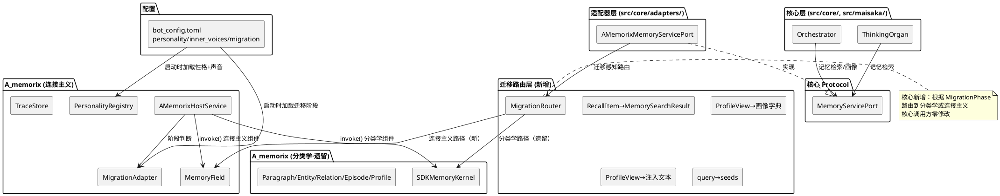
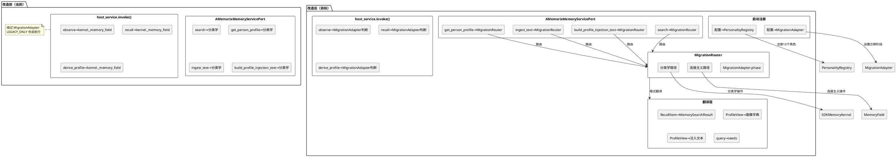
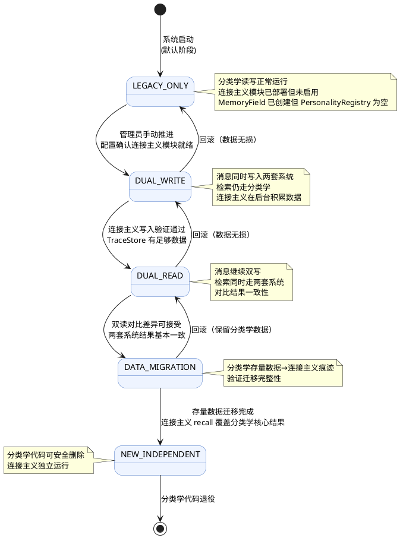
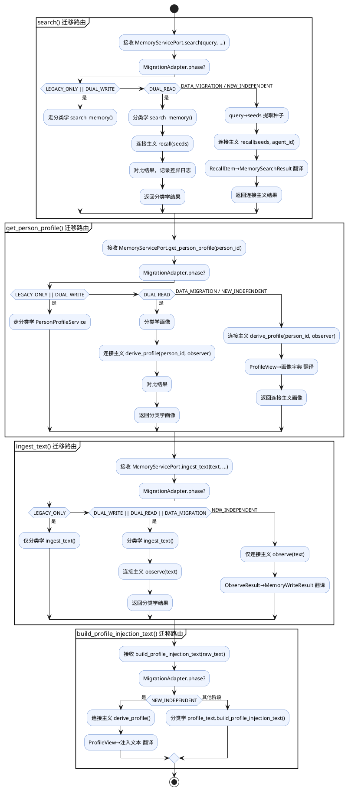
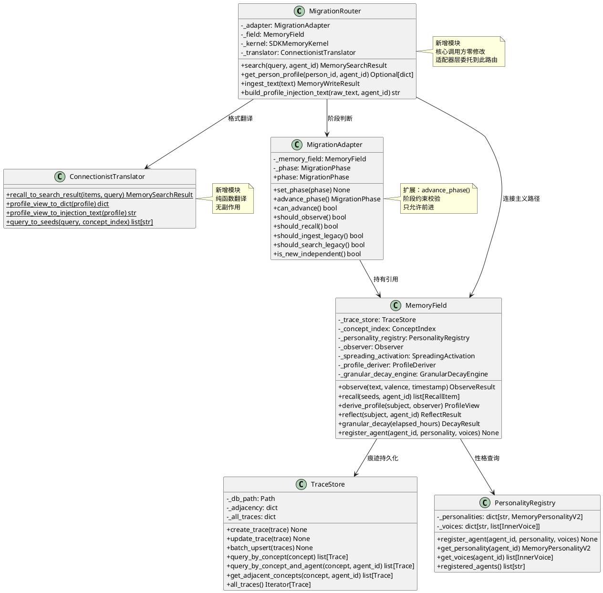

# 记忆系统范式迁移 — 实现方案

# 一、需求与存量功能关系分析

## 1.1 需求功能与存量功能对比

### 1.1.1 已实现功能

| 需求功能 | 存量功能 | 代码位置 | 匹配度 |
|---------|---------|---------|--------|
| Trace 数据模型（source/target/weight/valence/agent_id/timestamp/detail_level/time_of_day/observation_id/voice_name） | Trace dataclass 完整实现，含 emotional_floor 计算、unique_key 属性、参数校验 | `src/A_memorix/core/connectionist/models.py:54-88` | 100% |
| MemoryPersonalityV2 数据模型（decay_rate/emotional_sensitivity/association_depth/reinforcement_boost/attention_tags/positive_affinity/negative_affinity/curiosity） | MemoryPersonalityV2 dataclass 完整实现，含参数范围校验 | `src/A_memorix/core/connectionist/models.py:90-117` | 100% |
| InnerVoice 数据模型（name/style/focus_concepts/weight_multiplier/description + transform_valence/filter_concepts） | InnerVoice dataclass 完整实现，5种 VoiceStyle 处理 | `src/A_memorix/core/connectionist/models.py:120-164` | 100% |
| Valence 枚举（NEGATIVE/NEUTRAL/POSITIVE + value_int 属性） | Valence(str, Enum) 完整实现 | `src/A_memorix/core/connectionist/enums.py:6-21` | 100% |
| VoiceStyle 枚举（AMPLIFY/NEUTRALIZE/PRESERVE/INVERT/CHAOTIC） | VoiceStyle(str, Enum) 完整实现 | `src/A_memorix/core/connectionist/enums.py:24-31` | 100% |
| TimeOfDay 枚举（DAWN/MORNING/NOON/AFTERNOON/EVENING/NIGHT/UNKNOWN） | TimeOfDay(str, Enum) 完整实现 | `src/A_memorix/core/connectionist/enums.py:34-43` | 100% |
| TraceStore 持久化存储（SQLite + 内存邻接索引） | TraceStore 完整实现：create_trace/update_trace/delete_trace/query_by_concept/query_by_concept_and_agent/batch_upsert/flush | `src/A_memorix/core/connectionist/trace_store.py:67-229` | 100% |
| ConceptIndex 概念索引（类型映射/同义词表/频率统计/种子扩展） | ConceptIndex 完整实现：register_concept/register_synonym/expand_seeds/increment_count | `src/A_memorix/core/connectionist/concept_index.py:12-76` | 100% |
| MemoryField 核心运行时（observe/recall/derive_profile/reflect/granular_decay/register_agent/memory_stats） | MemoryField 完整实现，组装所有子模块 | `src/A_memorix/core/connectionist/memory_field.py:23-83` | 100% |
| Observer 选择性记忆（LLM概念提取→显著性评估→内心声音处理→痕迹写入/强化） | Observer 完整实现：observe() 全流程 | `src/A_memorix/core/connectionist/observer.py:27-152` | 100% |
| SalienceEvaluator 四维度显著性评估（情感/关注/关联/新颖） | SalienceEvaluator 完整实现：evaluate() 返回 (score, reason) | `src/A_memorix/core/connectionist/salience_evaluator.py:7-51` | 100% |
| InnerVoiceProcessor 内心声音处理（transform_valence + filter_concepts + process_experience） | InnerVoiceProcessor 完整实现 | `src/A_memorix/core/personality/inner_voice_processor.py:7-29` | 100% |
| PersonalityRegistry 智能体记忆性格注册表 | PersonalityRegistry 完整实现：register_agent/get_personality/get_voices/registered_agents | `src/A_memorix/core/personality/personality_registry.py:14-38` | 100% |
| SpreadingActivation 激活扩散回忆 | SpreadingActivation 完整实现：recall() 含近期加成、粒度因子、深度控制 | `src/A_memorix/core/connectionist/spreading_activation.py:12-93` | 100% |
| ProfileDeriver 画像实时提取（per-agent视角/矛盾保留/画像深度/时间线） | ProfileDeriver 完整实现：derive_profile()/reflect()/_find_contradictions() | `src/A_memorix/core/connectionist/profile_deriver.py:19-142` | 100% |
| GranularDecayEngine 粒度退化引擎（detail_level衰减/emotional_floor保护/批量更新） | GranularDecayEngine 完整实现：granular_decay()/consolidate() | `src/A_memorix/core/connectionist/granular_decay_engine.py:18-61` | 100% |
| LLMConceptExtractor LLM语义概念提取 | LLMConceptExtractor 完整实现：extract() + _parse_response() | `src/A_memorix/core/extraction/llm_concept_extractor.py:34-100` | 100% |
| MigrationPhase 枚举（LEGACY_ONLY/DUAL_WRITE/DUAL_READ/DATA_MIGRATION/NEW_INDEPENDENT） | MigrationPhase(str, Enum) 完整实现 | `src/A_memorix/core/migration/migration_adapter.py:16-21` | 100% |
| MigrationAdapter 迁移适配层（should_observe/should_recall/should_ingest_legacy/should_search_legacy/is_new_independent） | MigrationAdapter 完整实现 | `src/A_memorix/core/migration/migration_adapter.py:24-71` | 100% |
| DataConverter 旧数据→Trace 转换器（convert_paragraph/convert_entity/convert_relation/convert_episode） | DataConverter 完整实现 | `src/A_memorix/core/migration/data_converter.py:16-116` | 100% |
| ObserveResult/RecallItem/ProfileView/DecayResult 等返回值模型 | 全部 dataclass 完整实现 | `src/A_memorix/core/connectionist/models.py:196-301` | 100% |
| host_service.invoke() 连接主义组件名（observe/recall/derive_profile/reflect/register_agent/connectionist_stats） | 6 个连接主义组件名已注册在 invoke() 中 | `src/A_memorix/host_service.py:278-358` | 100% |
| SDKMemoryKernel 持有 MemoryField 实例 | `self._memory_field = MemoryField(self.data_dir)` 在 initialize() 中创建 | `src/A_memorix/core/runtime/sdk_memory_kernel.py:390-391` | 100% |
| MemoryServicePort Protocol（search/get_person_profile/ingest_text/maintain_memory/delete_admin/enqueue_feedback_task/build_profile_injection_text/set_memory_personality） | Protocol 完整定义 | `src/core/protocols.py:193-365` | 100% |
| AMemorixMemoryServicePort 适配器 | 完整实现全部 Protocol 方法 | `src/core/adapters/memory_service.py:14-185` | 100% |
| compute_emotional_floor 函数（NEUTRAL→0.02, 情感→0.10~0.30） | 完整实现 | `src/A_memorix/core/connectionist/models.py:47-50` | 100% |

### 1.1.2 需要扩展的功能

| 需求功能 | 存量功能 | 差异说明 | 扩展方向 |
|---------|---------|---------|---------|
| MemoryServicePort.search() 走连接主义 recall() | 当前 search() 走分类学 search_memory（向量+BM25+图增强），连接主义 recall() 仅通过 invoke("recall") 暴露 | search() 的查询文本需转为种子概念调用 recall()，RecallItem 需转为 MemorySearchResult 格式。当前适配器层直接委托分类学，无翻译层 | 在 AMemorixMemoryServicePort 中新增迁移感知路由：根据 MigrationPhase 决定走分类学还是连接主义，新增 query→seeds 翻译和 RecallItem→MemorySearchResult 格式化 |
| MemoryServicePort.get_person_profile() 走连接主义 derive_profile() | 当前 get_person_profile() 走分类学 PersonProfileService，连接主义 derive_profile() 仅通过 invoke("derive_profile") 暴露 | ProfileView（associations/voices/contradictions/timeline/depth）需转为画像字典格式（summary/traits/evidence）。当前适配器层直接委托分类学 | 在适配器层新增 ProfileView→画像字典 翻译，根据 MigrationPhase 决定走分类学还是连接主义 |
| MemoryServicePort.ingest_text() 走连接主义 observe() | 当前 ingest_text() 走分类学 IngestService（段落+实体+关系+Episode），连接主义 observe() 仅通过 invoke("observe") 暴露 | ingest_text() 的 text 需直接传入 observe()，但 observe() 需要所有已注册智能体独立判断是否记忆。当前 ingest_text 是单次写入，observe 是多智能体并行判断 | 在适配器层新增迁移感知路由：DUAL_WRITE 阶段同时调用分类学 ingest_text 和连接主义 observe，NEW_INDEPENDENT 阶段仅调用 observe |
| build_profile_injection_text 从 ProfileView 生成 | 当前 build_profile_injection_text 从分类学画像段落构建，连接主义 ProfileView 有更丰富的结构（矛盾/内心声音/时间线） | ProfileView 的 associations/voices/contradictions/timeline/depth 需转为紧凑注入文本。当前实现只处理原始文本格式 | 新增 ProfileView→注入文本 翻译函数，保留现有分类学翻译作为 LEGACY_ONLY 阶段的后备 |
| host_service.invoke() 中 observe/recall/derive_profile 直接访问 kernel._memory_field | 当前 6 个连接主义组件名通过 `kernel._memory_field.xxx()` 访问，绕过 MigrationAdapter | invoke() 未使用 MigrationAdapter 判断当前阶段，连接主义操作在 LEGACY_ONLY 阶段也会执行 | invoke() 中连接主义组件名通过 MigrationAdapter 判断是否执行，LEGACY_ONLY 阶段返回空结果 |
| MigrationAdapter.set_phase() 无阶段约束 | 当前 set_phase() 允许任意切换阶段，无"只能前进不能后退"约束 | spec 要求迁移只能前进（LEGACY_ONLY→...→NEW_INDEPENDENT），不可跳过阶段 | set_phase() 新增阶段约束校验，只允许切换到下一阶段 |
| DataConverter 转换质量粗糙 | convert_paragraph/convert_episode 将文本截取前50字符作为 source 和 target，生成自环痕迹（source==target） | 自环痕迹不是有效的概念间连接，丢失了原始文本的语义信息。应使用 LLM 提取概念后再创建痕迹 | 改用 LLMConceptExtractor 提取概念，或至少将 Paragraph 文本拆为有意义的 source→target 对 |
| SDKMemoryKernel.initialize() 中 MemoryField 创建但未注册智能体 | MemoryField 在 initialize() 中创建，但 PersonalityRegistry 为空，observe() 时所有智能体使用默认性格 | 13 个角色的 MemoryPersonalityV2 和 InnerVoice 需在启动时从配置文件加载并注册 | 新增配置驱动的智能体注册流程：从 bot_config.toml 读取 personality + inner_voices 配置，调用 register_agent() |
| granular_decay 未集成到心跳 | GranularDecayEngine 已实现但未在心跳中调用，spec 要求心跳中定期执行 | 当前心跳只调用分类学的 maintain_memory(action="decay")，连接主义的 granular_decay 未接入 | 在心跳的 maintain_memory 调用后，根据 MigrationPhase 决定是否同时调用 granular_decay |
| LLMConceptExtractor 无 jieba 降级 | spec 要求 LLM 不可用时回退到 jieba+同义词表，当前实现 LLM 失败时返回空 ExtractionResult | LLM 失败时 observe() 因 concepts 为空直接返回 ObserveResult(remembered=False)，消息被完全丢弃 | 新增 SemanticConceptExtractor（jieba+同义词表）作为降级方案，LLM 失败时自动切换 |

### 1.1.3 需要新增的功能或接口

**模块：配置驱动**

1. **bot_config.toml 记忆性格配置段**
   - 输入：`[a_memorix.personality.{agent_id}]` 段的 decay_rate/emotional_sensitivity/association_depth/reinforcement_boost/attention_tags/positive_affinity/negative_affinity/curiosity
   - 输出：MemoryPersonalityV2 实例
   - 核心逻辑：从 TOML 配置解析为 MemoryPersonalityV2，参数范围校验失败时启动报错
   - 依赖：AMemorixConfig 模型扩展、配置模板更新

2. **bot_config.toml 内心声音配置段**
   - 输入：`[a_memorix.inner_voices.{agent_id}]` 段的 voices 列表（name/style/focus_concepts/weight_multiplier/description）
   - 输出：list[InnerVoice] 实例
   - 核心逻辑：从 TOML 配置解析为 InnerVoice 列表，同名声音报错
   - 依赖：AMemorixConfig 模型扩展、配置模板更新

3. **bot_config.toml 迁移阶段配置段**
   - 输入：`[a_memorix.migration]` 段的 phase 字段
   - 输出：MigrationPhase 枚举值
   - 核心逻辑：从 TOML 配置解析为 MigrationPhase，无效值报错
   - 依赖：AMemorixConfig 模型扩展、配置模板更新

**模块：适配器翻译层**

4. **RecallItem→MemorySearchResult 翻译器**
   - 输入：list[RecallItem]（concept/activation/valence/detail_level/relative_time）
   - 输出：MemorySearchResult（success/hits/summary）
   - 核心逻辑：RecallItem.concept→MemoryHit.content，activation→MemoryHit.score，valence+detail_level+relative_time→MemoryHit.metadata
   - 依赖：AMemorixMemoryServicePort.search() 路由

5. **ProfileView→画像字典 翻译器**
   - 输入：ProfileView（associations/voices/contradictions/timeline/depth/concept_type）
   - 输出：dict（success/summary/traits/evidence）
   - 核心逻辑：associations→evidence，depth→summary 描述，contradictions→traits 中的矛盾标注
   - 依赖：AMemorixMemoryServicePort.get_person_profile() 路由

6. **ProfileView→注入文本 翻译器**
   - 输入：ProfileView
   - 输出：str（紧凑注入文本，供 ThinkingOrgan 使用）
   - 核心逻辑：associations 按强度排序生成关联描述，contradictions 生成矛盾描述，depth 生成熟悉度描述
   - 依赖：build_profile_injection_text() 路由

7. **query→seeds 种子提取器**
   - 输入：search() 的 query 字符串
   - 输出：list[str]（种子概念列表）
   - 核心逻辑：短查询直接作为种子，长查询提取关键词/概念。可复用 ConceptIndex.expand_seeds() 扩展同义词
   - 依赖：AMemorixMemoryServicePort.search() 路由

**模块：迁移集成**

8. **迁移感知路由层**
   - 输入：MemoryServicePort 方法调用 + 当前 MigrationPhase
   - 输出：根据阶段路由到分类学或连接主义实现
   - 核心逻辑：LEGACY_ONLY→全走分类学；DUAL_WRITE→写双写、读走分类学；DUAL_READ→写双写、读双读对比；DATA_MIGRATION→存量数据迁移；NEW_INDEPENDENT→全走连接主义
   - 依赖：MigrationAdapter、适配器翻译层

9. **jieba 降级概念提取器**
   - 输入：文本
   - 输出：ExtractionResult（concepts/relations/valence）
   - 核心逻辑：jieba 分词 + ConceptIndex 同义词表归一化，valence 固定 NEUTRAL
   - 依赖：LLMConceptExtractor 降级路径

**模块：数据迁移增强**

10. **LLM 增强 DataConverter**
    - 输入：分类学 Paragraph/Entity/Relation/Episode 数据
    - 输出：list[Trace]（语义正确的概念间痕迹）
    - 核心逻辑：对 Paragraph/Episode 使用 LLMConceptExtractor 提取概念后创建痕迹（替代当前截取前50字符的自环痕迹），对 Relation 直接映射为 Trace
    - 依赖：LLMConceptExtractor、DataConverter 改造

## 1.2 存量功能详细分析

### 1.2.1 MemoryField — 连接主义核心运行时

**接口契约**：
- `observe(text, valence, timestamp, source_id, session_id)` → ObserveResult：消息感知写入
- `recall(seeds, agent_id, min_weight, max_results)` → list[RecallItem]：激活扩散回忆
- `derive_profile(subject, observer, now)` → ProfileView：画像实时提取
- `reflect(subject, agent_id)` → ReflectResult：反思
- `granular_decay(elapsed_hours)` → DecayResult：粒度退化
- `register_agent(agent_id, personality, voices)` → None：注册智能体记忆性格
- `memory_stats()` → dict：统计信息

**业务规则**：
- observe() 委托 Observer，对每个已注册智能体独立评估显著性
- recall() 委托 SpreadingActivation，从种子概念出发沿痕迹扩散
- derive_profile() 委托 ProfileDeriver，从痕迹实时提取画像（不缓存）
- granular_decay() 委托 GranularDecayEngine，批量更新所有痕迹的 weight/detail_level

**扩展点**：
- 子模块（Observer/SpreadingActivation/ProfileDeriver/GranularDecayEngine）均可独立替换
- PersonalityRegistry 支持动态注册新智能体

**约束**：
- MemoryField 在 SDKMemoryKernel.initialize() 中创建，但 PersonalityRegistry 为空
- observe() 对未注册智能体使用默认性格（decay_rate=1.0, 无内心声音），与 spec 的"配置驱动"要求不符
- recall() 的 min_weight=0.05 是硬编码默认值，应从 personality 读取

### 1.2.2 SDKMemoryKernel — 分类学遗留内核

**接口契约**：
- `search_memory(KernelSearchRequest)` → dict：分类学检索（向量+BM25+图增强+Episode+聚合）
- `ingest_text(...)` → dict：分类学写入（段落+实体+关系+Episode）
- `get_person_profile(person_id, chat_id, limit)` → dict：分类学画像
- `maintain_memory(action, target, hours, reason, limit)` → dict：分类学维护
- `_memory_field: MemoryField`：连接主义实例（已创建但未集成到主流程）

**业务规则**：
- 分类学检索走 SearchExecutionService → 向量检索 + BM25 + 图增强 + 后验过滤
- 分类学写入走 IngestService → 段落存储 + 实体提取 + 关系写入 + Episode 切分
- 画像走 PersonProfileService → 版本化快照 + 证据溯源

**扩展点**：
- _memory_field 已存在，连接主义操作可通过 kernel._memory_field.xxx() 访问
- host_service.invoke() 已暴露 6 个连接主义组件名

**约束**：
- kernel._memory_field 是私有属性，外部通过 getattr 访问（host_service.invoke() 中）
- 分类学和连接主义两套系统并存，但无迁移协调逻辑
- 分类学数据模型（Paragraph/Entity/Relation/Episode/Profile）与连接主义数据模型（Trace）完全不同

### 1.2.3 AMemorixHostService — 公共 API 层

**接口契约**：
- `invoke(component_name, args, timeout_ms)` → Any：统一调用入口
- `start()/stop()/reload()` → 生命周期管理
- `build_profile_injection_text(raw_text)` → str：画像注入文本（静态方法）
- 配置管理方法（get_config/update_config/get_config_schema 等）

**业务规则**：
- invoke() 通过 component_name 字符串分发到 kernel 内部方法
- 连接主义组件名（observe/recall/derive_profile/reflect/register_agent/connectionist_stats）直接访问 kernel._memory_field
- 分类学组件名（search_memory/ingest_text/get_person_profile/maintain_memory 等）访问 kernel 分类学方法
- 未启用时返回 _disabled_response()

**扩展点**：
- invoke() 可新增组件名
- _disabled_response() 可扩展新组件名的降级响应

**约束**：
- invoke() 中连接主义组件名未通过 MigrationAdapter 判断阶段
- 连接主义操作在 LEGACY_ONLY 阶段也会执行（应返回空结果或走分类学）
- build_profile_injection_text() 内部延迟导入 `src.A_memorix.core.utils.profile_text`，仅支持分类学格式

### 1.2.4 AMemorixMemoryServicePort — 核心适配器

**接口契约**：
- 实现 MemoryServicePort Protocol 全部方法
- 每个方法内部延迟导入 memory_service 委托

**业务规则**：
- search() 委托 memory_service.search() → 分类学 search_memory
- get_person_profile() 委托 memory_service.profile_admin(action="query") → 分类学画像
- ingest_text() 委托 memory_service.ingest_text() → 分类学写入
- build_profile_injection_text() 委托 memory_service.build_profile_injection_text() → 分类学格式
- set_memory_personality() 委托 memory_service.invoke("register_agent") → 连接主义注册

**约束**：
- 所有方法走分类学路径，无迁移感知路由
- set_memory_personality() 是唯一走连接主义的方法，但注册后的性格在分类学流程中不生效
- 适配器层是迁移路由的最佳位置（核心调用方零修改）

### 1.2.5 MigrationAdapter — 迁移适配层

**接口契约**：
- `should_observe()` → bool：是否执行连接主义写入
- `should_recall()` → bool：是否执行连接主义读取
- `should_ingest_legacy()` → bool：是否执行分类学写入
- `should_search_legacy()` → bool：是否执行分类学读取
- `is_new_independent()` → bool：是否已进入独立运行阶段
- `set_phase(phase)` → None：切换迁移阶段

**业务规则**：
- DUAL_WRITE: should_observe=True, should_recall=False, should_ingest_legacy=True, should_search_legacy=True
- DUAL_READ: should_observe=True, should_recall=True, should_ingest_legacy=True, should_search_legacy=True
- DATA_MIGRATION: 同 DUAL_READ
- NEW_INDEPENDENT: should_observe=True, should_recall=True, should_ingest_legacy=False, should_search_legacy=False

**扩展点**：
- 可新增阶段约束校验
- 可新增阶段切换回调

**约束**：
- 当前未被 host_service.invoke() 使用，连接主义组件名绕过 MigrationAdapter
- set_phase() 无阶段约束，允许任意切换
- MigrationAdapter 持有 MemoryField 引用但未在 invoke() 中传递使用

### 1.2.6 DataConverter — 数据迁移转换器

**接口契约**：
- `convert_paragraph(paragraph, agent_id)` → Trace | None
- `convert_entity(entity)` → None（仅注册概念）
- `convert_relation(relation, agent_id)` → Trace | None
- `convert_episode(episode, agent_id)` → Trace | None

**业务规则**：
- Paragraph/Episode：截取文本前50字符作为 source 和 target，生成自环痕迹
- Entity：仅注册到 ConceptIndex，不创建痕迹
- Relation：subject→object 直接映射为 Trace

**约束**：
- Paragraph/Episode 的自环痕迹（source==target）不是有效的概念间连接
- 所有迁移痕迹的 valence=NEUTRAL，丢失了原始情感信息
- 所有迁移痕迹的 detail_level=0.3，固定值不反映实际记忆清晰度
- convert_entity 仅注册概念但不创建痕迹，Entity 的关联信息丢失

# 二、增量设计方案

## 2.1 实现模型

### 2.1.1 上下文视图



### 2.1.2 服务/组件总体架构



### 2.1.3 实现设计文档

#### 迁移五阶段状态机



#### MemoryServicePort 方法迁移路由流程



## 2.2 接口设计

### 2.2.1 总体设计

接口按层次分为四类：

| 接口分类 | 接口名 | 所在模块 | 稳定性 |
|---------|--------|---------|--------|
| 核心 Protocol | MemoryServicePort | src/core/protocols.py | 稳定 — 签名不变 |
| 迁移路由层 | MigrationRouter | src/A_memorix/core/migration/migration_router.py | 实验 — 新增 |
| 翻译层 | ConnectionistTranslator | src/A_memorix/core/migration/translator.py | 实验 — 新增 |
| 迁移适配层 | MigrationAdapter | src/A_memorix/core/migration/migration_adapter.py | 稳定 — 扩展阶段约束 |
| 公共 API 层 | AMemorixHostService | src/A_memorix/host_service.py | 稳定 — 连接主义组件名增加阶段判断 |
| 配置模型 | AMemorixConfig | src/config/official_configs.py | 稳定 — 新增字段 |

**接口变更策略**：
- MemoryServicePort Protocol 签名不变，核心调用方零修改
- MigrationRouter 新增模块，封装迁移路由逻辑
- ConnectionistTranslator 新增模块，封装格式翻译逻辑
- MigrationAdapter 扩展 set_phase() 增加阶段约束
- AMemorixHostService.invoke() 连接主义组件名增加 MigrationAdapter 阶段判断
- AMemorixConfig 新增 personality/inner_voices/migration 配置段

### 2.2.2 接口清单

#### 2.2.2.1 MigrationRouter — 迁移感知路由

**接口签名**：
```python
class MigrationRouter:
    def __init__(self, migration_adapter: MigrationAdapter, memory_field: MemoryField, kernel: SDKMemoryKernel) -> None: ...

    async def search(self, query: str, *, agent_id: str = "", **kwargs: Any) -> MemorySearchResult: ...
    async def get_person_profile(self, person_id: str, *, agent_id: str = "", limit: int = 4) -> Optional[dict[str, Any]]: ...
    async def ingest_text(self, text: str, **kwargs: Any) -> MemoryWriteResult: ...
    async def build_profile_injection_text(self, raw_text: str, *, agent_id: str = "") -> str: ...
```

**业务说明**：根据 MigrationPhase 将 MemoryServicePort 方法调用路由到分类学或连接主义实现。DUAL_READ 阶段同时调用两套系统并记录差异日志。

**前置条件**：MigrationAdapter 已初始化，MigrationPhase 已从配置加载。

**后置条件**：返回与分类学格式兼容的结果，核心调用方无感知。

**异常映射**：连接主义调用失败时，LEGACY_ONLY/DUAL_WRITE 阶段不受影响（走分类学）；NEW_INDEPENDENT 阶段失败直接抛出异常（不兜底）。

#### 2.2.2.2 ConnectionistTranslator — 格式翻译器

**接口签名**：
```python
class ConnectionistTranslator:
    @staticmethod
    def recall_to_search_result(items: list[RecallItem], query: str) -> MemorySearchResult: ...

    @staticmethod
    def profile_view_to_dict(profile: ProfileView) -> dict[str, Any]: ...

    @staticmethod
    def profile_view_to_injection_text(profile: ProfileView) -> str: ...

    @staticmethod
    def query_to_seeds(query: str, concept_index: ConceptIndex) -> list[str]: ...
```

**业务说明**：将连接主义内部数据模型翻译为核心模块可理解的格式。RecallItem→MemorySearchResult、ProfileView→画像字典、ProfileView→注入文本、query→seeds。

**前置条件**：输入数据为连接主义内部模型实例。

**后置条件**：输出格式与分类学返回格式兼容。

**异常映射**：输入为空时返回空结果（MemorySearchResult(success=True, hits=[]) 或空字典），不抛异常。

**调用示例**：
```python
# RecallItem → MemorySearchResult
items = memory_field.recall(seeds=["小明"], agent_id="silver_wolf")
result = ConnectionistTranslator.recall_to_search_result(items, query="小明")

# ProfileView → 画像字典
profile = await memory_field.derive_profile(subject="小明", observer="silver_wolf")
profile_dict = ConnectionistTranslator.profile_view_to_dict(profile)
```

#### 2.2.2.3 MigrationAdapter — 阶段约束扩展

**接口签名**：
```python
class MigrationAdapter:
    # 新增方法
    def advance_phase(self) -> MigrationPhase: ...
    def can_advance(self) -> bool: ...
```

**业务说明**：advance_phase() 只允许切换到下一阶段（LEGACY_ONLY→DUAL_WRITE→DUAL_READ→DATA_MIGRATION→NEW_INDEPENDENT），不可跳过、不可回退。can_advance() 检查是否可以推进到下一阶段。

**前置条件**：当前阶段已稳定运行。

**后置条件**：阶段前进一级，配置文件同步更新。

**异常映射**：尝试跳过阶段或回退时抛出 ValueError。

#### 2.2.2.4 AMemorixHostService.invoke() — 连接主义组件名阶段判断

**接口签名**：
```python
# 在 invoke() 方法中，连接主义组件名增加 MigrationAdapter 判断：
if component_name == "observe":
    if not self._migration_adapter.should_observe():
        return ObserveResult(text=str(payload.get("text", "")))
    # ... 原有逻辑

if component_name == "recall":
    if not self._migration_adapter.should_recall():
        return []
    # ... 原有逻辑
```

**业务说明**：连接主义组件名在 LEGACY_ONLY 阶段返回空结果，避免在未就绪时执行连接主义操作。

**前置条件**：MigrationAdapter 已初始化。

**后置条件**：LEGACY_ONLY 阶段连接主义操作返回空结果，不执行实际逻辑。

**异常映射**：无特殊异常，空结果是合法返回。

#### 2.2.2.5 配置模型扩展

**接口签名**：
```python
# AMemorixConfig 新增字段
class PersonalityConfig:
    decay_rate: float = 1.0
    emotional_sensitivity: float = 1.0
    association_depth: int = 2
    reinforcement_boost: float = 0.3
    attention_tags: list[str] = []
    positive_affinity: float = 1.0
    negative_affinity: float = 1.0
    curiosity: float = 1.0

class InnerVoiceConfig:
    name: str
    style: str = "preserve"
    focus_concepts: list[str] = []
    weight_multiplier: float = 1.0
    description: str = ""

class MigrationConfig:
    phase: str = "legacy_only"

# AMemorixConfig 新增
class AMemorixConfig:
    # ... 现有字段
    personality: dict[str, PersonalityConfig] = {}
    inner_voices: dict[str, list[InnerVoiceConfig]] = {}
    migration: MigrationConfig = MigrationConfig()
```

**业务说明**：13 个角色的 MemoryPersonalityV2 和 InnerVoice 从 bot_config.toml 加载，迁移阶段从配置读取。参数范围校验在 MemoryPersonalityV2/InnerVoice 的 `__post_init__` 中执行，超出范围直接报错。

**前置条件**：配置文件格式正确。

**后置条件**：启动时 PersonalityRegistry 注册所有角色，MigrationAdapter 设置初始阶段。

**异常映射**：配置缺失角色定义时启动报错；参数超范围时启动报错；同名内心声音时启动报错。

#### 2.2.2.6 启动时智能体注册流程

**接口签名**：
```python
# 在 SDKMemoryKernel.initialize() 或 host_service._ensure_kernel() 中
async def _register_agents_from_config(self) -> None:
    config = self._read_config()
    personality_config = config.get("personality", {})
    voices_config = config.get("inner_voices", {})
    for agent_id, p_cfg in personality_config.items():
        personality = MemoryPersonalityV2(**p_cfg)
        voices = [InnerVoice(**v) for v in voices_config.get(agent_id, [])]
        self._kernel._memory_field.register_agent(agent_id, personality, voices)
```

**业务说明**：启动时从配置读取 13 个角色的记忆性格和内心声音，注册到 PersonalityRegistry。未配置的角色不注册，observe() 时使用默认性格（与 spec 的"配置驱动"一致——缺失配置应报错暴露）。

**前置条件**：MemoryField 已创建，配置文件可读。

**后置条件**：PersonalityRegistry 包含所有已配置角色的性格和声音。

**异常映射**：配置缺失时不注册（observe 使用默认性格并记录警告日志），不阻断启动。

#### 2.2.2.7 jieba 降级概念提取器

**接口签名**：
```python
class SemanticConceptExtractor:
    def __init__(self, concept_index: ConceptIndex) -> None: ...
    async def extract(self, text: str) -> ExtractionResult: ...
```

**业务说明**：LLM 不可用时自动降级为 jieba 分词 + ConceptIndex 同义词表归一化。valence 固定 NEUTRAL，不提取关系。

**前置条件**：ConceptIndex 已初始化。

**后置条件**：返回 ExtractionResult，concepts 质量低于 LLM 但非空。

**异常映射**：jieba 分词失败时返回空 ExtractionResult。

#### 2.2.2.8 LLM 增强 DataConverter

**接口签名**：
```python
class DataConverter:
    # 改造方法
    async def convert_paragraph(self, paragraph: dict, agent_id: str = "") -> list[Trace]: ...
    async def convert_episode(self, episode: dict, agent_id: str = "") -> list[Trace]: ...
```

**业务说明**：对 Paragraph/Episode 使用 LLMConceptExtractor 提取概念后创建痕迹，替代当前截取前50字符的自环痕迹。返回值从 Trace | None 改为 list[Trace]（一次提取可创建多条痕迹）。

**前置条件**：LLMConceptExtractor 可用。

**后置条件**：迁移后的痕迹是有效的概念间连接（source≠target）。

**异常映射**：LLM 提取失败时降级为 SemanticConceptExtractor，再失败则跳过该条数据（记录警告日志）。

## 2.3 数据模型

### 2.3.1 设计目标

1. **支持业务场景**：连接主义记忆的写入、回忆、画像、退化全流程，渐进式迁移五阶段
2. **性能目标**：recall() 延迟不高于分类学 search()；granular_decay() 13 智能体 ≤50ms；LLM 概念提取 ≤2s
3. **兼容策略**：MemoryServicePort 签名不变；RecallItem/ProfileView 通过翻译层转为分类学兼容格式；迁移期间两套系统数据独立存储

### 2.3.2 模型实现



### 2.3.3 各改造点详细方案

#### 改造点1：MigrationRouter 迁移路由层

**当前状态**：AMemorixMemoryServicePort 的 search/get_person_profile/ingest_text/build_profile_injection_text 全部走分类学路径，无迁移感知。

**改造方案**：
1. 新建 `src/A_memorix/core/migration/migration_router.py`，实现 MigrationRouter
2. MigrationRouter 持有 MigrationAdapter + MemoryField + SDKMemoryKernel 引用
3. 每个 Protocol 方法内部根据 MigrationAdapter.phase 路由到分类学或连接主义
4. AMemorixMemoryServicePort 的方法委托到 MigrationRouter（而非直接委托 memory_service）

**影响范围**：新增 `migration_router.py`，修改 `src/core/adapters/memory_service.py`

**选择理由**：路由逻辑集中在一个类中，避免在每个适配器方法中散布 if/else。MigrationRouter 是唯一知道"当前应该走哪套系统"的地方。

#### 改造点2：ConnectionistTranslator 格式翻译层

**当前状态**：RecallItem/ProfileView 是连接主义内部模型，核心模块无法理解。

**改造方案**：
1. 新建 `src/A_memorix/core/migration/translator.py`，实现 ConnectionistTranslator
2. recall_to_search_result：RecallItem.concept→MemoryHit.content，activation→MemoryHit.score，valence/detail_level/relative_time→metadata
3. profile_view_to_dict：associations→evidence，depth→summary，contradictions→traits
4. profile_view_to_injection_text：从 ProfileView 生成紧凑注入文本（关联概念+情感+矛盾+熟悉度）
5. query_to_seeds：短查询直接作为种子，长查询用 jieba 提取关键词，ConceptIndex.expand_seeds() 扩展同义词

**影响范围**：新增 `translator.py`

**选择理由**：翻译逻辑与路由逻辑分离，单一职责。翻译函数为纯函数，无副作用，易于测试。

#### 改造点3：MigrationAdapter 阶段约束

**当前状态**：set_phase() 允许任意切换，无阶段约束。

**改造方案**：
1. 新增 advance_phase() 方法，只允许前进一级
2. 新增 can_advance() 方法，检查是否可以推进
3. set_phase() 保留但增加校验：只能设置当前阶段或下一阶段
4. 阶段切换时同步更新配置文件中的 migration.phase

**影响范围**：修改 `src/A_memorix/core/migration/migration_adapter.py`

**选择理由**：spec 明确要求"不可跳过阶段"，advance_phase() 是最简单的实现方式。保留 set_phase() 是为了回滚场景（管理员手动回退）。

#### 改造点4：host_service.invoke() 连接主义组件名阶段判断

**当前状态**：observe/recall/derive_profile/reflect/register_agent/connectionist_stats 6 个组件名直接访问 kernel._memory_field，未通过 MigrationAdapter 判断阶段。

**改造方案**：
1. 在 _ensure_kernel() 中创建 MigrationAdapter 实例并存储
2. invoke() 中连接主义组件名增加 MigrationAdapter 判断
3. LEGACY_ONLY 阶段：observe 返回 ObserveResult(remembered=False)，recall 返回空列表，derive_profile 返回空白 ProfileView
4. DUAL_WRITE 及之后阶段：正常执行连接主义操作

**影响范围**：修改 `src/A_memorix/host_service.py`

**选择理由**：invoke() 是所有外部调用的统一入口，阶段判断应在此处集中处理，而非在每个调用方中判断。

#### 改造点5：配置驱动的智能体注册

**当前状态**：SDKMemoryKernel.initialize() 中创建 MemoryField，但 PersonalityRegistry 为空，observe() 时所有智能体使用默认性格。

**改造方案**：
1. AMemorixConfig 新增 personality/inner_voices/migration 配置段
2. 配置模板新增对应段和版本号
3. 在 host_service._ensure_kernel() 中，kernel 创建后从配置读取 personality + inner_voices，调用 kernel._memory_field.register_agent()
4. 从配置读取 migration.phase，设置 MigrationAdapter 初始阶段
5. 缺失配置的角色不注册（observe 时使用默认性格并记录警告日志）

**影响范围**：修改 `src/config/official_configs.py`，修改 `src/A_memorix/host_service.py`，新增配置模板段

**选择理由**：配置驱动是 spec 明确要求。在 _ensure_kernel() 中注册是因为 MemoryField 在 kernel 创建后才存在。

#### 改造点6：granular_decay 集成到心跳

**当前状态**：GranularDecayEngine 已实现但未在心跳中调用。

**改造方案**：
1. 在 host_service.invoke() 的 "maintain_memory" 组件名中，当 action="decay" 时，根据 MigrationAdapter 判断是否同时调用 granular_decay
2. DUAL_WRITE/DUAL_READ/DATA_MIGRATION 阶段：分类学 decay 后同时调用 granular_decay
3. NEW_INDEPENDENT 阶段：仅调用 granular_decay
4. granular_decay 的 elapsed_hours 参数从 maintain_memory 的 hours 参数传入

**影响范围**：修改 `src/A_memorix/host_service.py` 的 invoke() 方法

**选择理由**：maintain_memory(action="decay") 是现有心跳调用的入口，在此处集成 granular_decay 最自然。

#### 改造点7：LLMConceptExtractor jieba 降级

**当前状态**：LLM 失败时返回空 ExtractionResult，observe() 因 concepts 为空直接返回 remembered=False。

**改造方案**：
1. 新建 `src/A_memorix/core/extraction/semantic_concept_extractor.py`，实现 SemanticConceptExtractor
2. SemanticConceptExtractor 使用 jieba 分词 + ConceptIndex 同义词表归一化
3. LLMConceptExtractor.extract() 失败时自动降级到 SemanticConceptExtractor
4. 降级时 valence 固定 NEUTRAL，不提取关系

**影响范围**：新增 `semantic_concept_extractor.py`，修改 `llm_concept_extractor.py`

**选择理由**：spec 要求 LLM 不可用时回退到 jieba，降级逻辑在 LLMConceptExtractor 内部处理最简单。

#### 改造点8：DataConverter LLM 增强

**当前状态**：convert_paragraph/convert_episode 截取前50字符生成自环痕迹。

**改造方案**：
1. DataConverter 新增 LLMConceptExtractor 依赖
2. convert_paragraph：对文本调用 LLMConceptExtractor.extract()，从提取的概念对创建痕迹
3. convert_episode：同 convert_paragraph
4. LLM 提取失败时降级到 SemanticConceptExtractor
5. 返回值从 Trace | None 改为 list[Trace]

**影响范围**：修改 `src/A_memorix/core/migration/data_converter.py`

**选择理由**：自环痕迹（source==target）不是有效的概念间连接，LLM 提取能生成有意义的 source→target 对。DATA_MIGRATION 阶段是一次性操作，LLM 调用延迟可接受。

### 2.3.4 改造优先级与分批策略

| 批次 | 改造点 | 风险 | 可独立运行 | 说明 |
|------|--------|------|-----------|------|
| 第1批 | 改造点5（配置驱动注册）+ 改造点7（jieba降级） | 低 — 新增配置和降级，不影响现有流程 | ✅ | 基础设施：配置加载 + LLM降级，为后续改造铺路 |
| 第2批 | 改造点4（invoke阶段判断）+ 改造点3（阶段约束）+ 改造点6（granular_decay集成） | 低 — invoke 增加阶段判断，现有流程不受影响 | ✅ | 迁移框架：阶段判断 + 退化集成，LEGACY_ONLY 阶段行为不变 |
| 第3批 | 改造点2（翻译层）+ 改造点1（路由层） | 中 — 适配器层委托路径变更，需验证格式兼容性 | ✅ | 核心改造：路由+翻译，DUAL_WRITE 阶段开始双写 |
| 第4批 | 改造点8（DataConverter LLM增强） | 中 — 数据迁移质量取决于 LLM 提取质量 | ✅ | 数据迁移：存量数据转换，DATA_MIGRATION 阶段执行 |
| 第5批 | 分类学代码退役 | 高 — 删除大量遗留代码 | ⚠️ 需充分验证 | 最终目标：NEW_INDEPENDENT 阶段确认后执行 |

### 2.3.5 迁移阶段验收标准

| 阶段 | 验收标准 | 回滚条件 |
|------|---------|---------|
| LEGACY_ONLY | 分类学读写正常运行；连接主义模块已部署但未启用 | N/A（初始阶段） |
| DUAL_WRITE | 消息同时写入两套系统；分类学检索不受影响；TraceStore 有数据积累 | 连接主义写入异常 |
| DUAL_READ | 两套系统检索结果差异可观测；差异日志正常记录 | 分类学检索受影响 |
| DATA_MIGRATION | 分类学存量数据成功转换为连接主义痕迹；recall() 能覆盖分类学 search() 的核心结果 | 数据迁移异常或结果不完整 |
| NEW_INDEPENDENT | 分类学代码删除后，所有记忆功能正常；MemoryServicePort 行为兼容 | 不回滚（分类学代码已删除） |