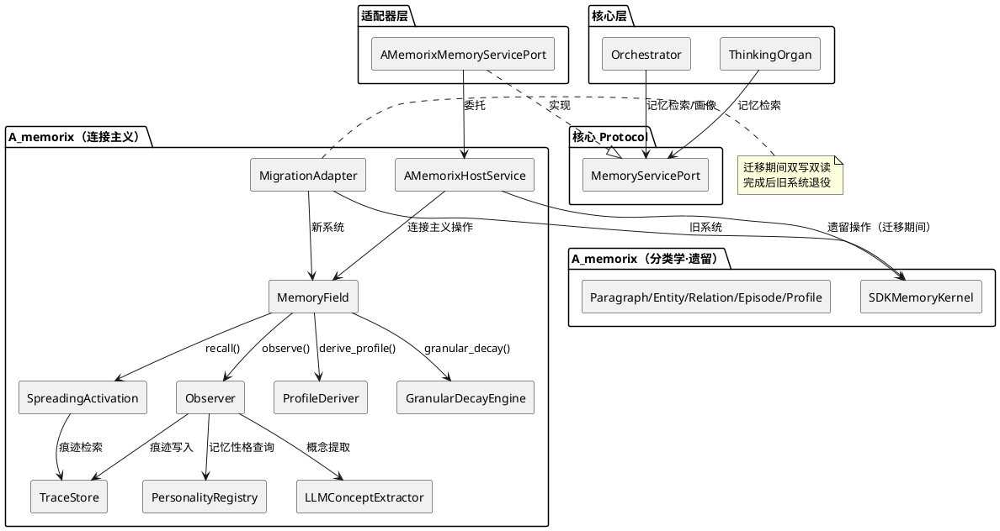
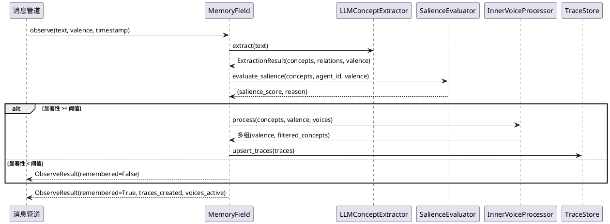
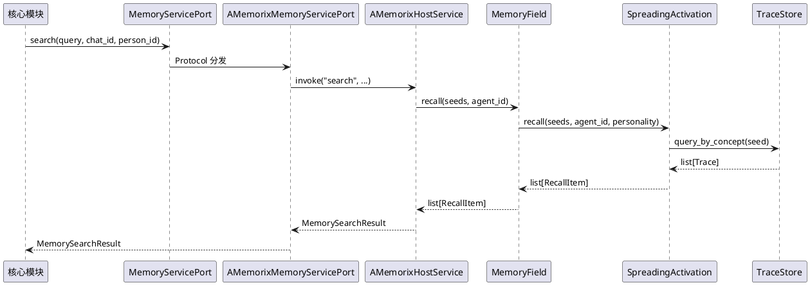
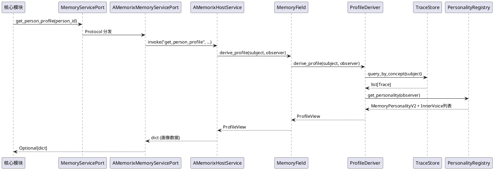
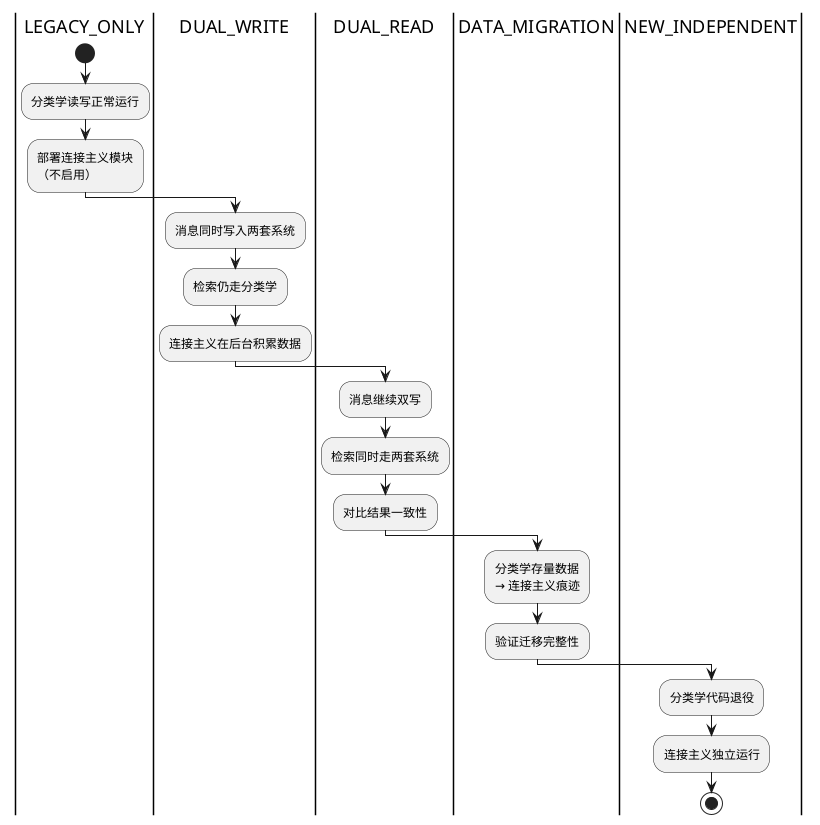

# 记忆系统范式迁移 — 需求规格

# 1. 组件定位

## 1.1 核心职责

本组件负责将 A_Memorix 的记忆范式从**分类学**（Paragraph/Entity/Relation/Episode/Profile 五种类型肢解经验）迁移到**连接主义**（记忆是概念间的激活模式，新记忆=新连接，遗忘=连接衰减，回忆=重新激活模式）。

## 1.2 核心输入

1. **对话消息流**：来自消息管道的聊天文本，经 LLM 提取概念后写入记忆场
2. **智能体记忆性格声明**：每个智能体声明自己的 MemoryPersonalityV2（衰减率、情感敏感度、联想深度、关注领域、好奇心）和 InnerVoice（内心声音列表）
3. **回忆请求**：核心模块通过 MemoryServicePort 发起的记忆检索和画像查询
4. **现有分类学数据**：SQLite 中已存储的 Paragraph/Entity/Relation/Episode/Profile 数据，需迁移到连接主义模型

## 1.3 核心输出

1. **连接主义记忆系统**：以 Trace（概念间连接痕迹）为第一公民的完整记忆运行时，替代分类学的五种类型
2. **兼容的 MemoryServicePort 接口**：核心模块的调用方式不变，但内部实现从分类学检索切换为激活扩散
3. **迁移后的数据**：现有分类学数据无损转换为连接主义痕迹
4. **13 个智能体的记忆性格配置**：每个角色拥有独立的记忆性格和内心声音定义

## 1.4 职责边界

1. **不改变核心架构**：核心 = 智能体 + 管家 + 消息管道，记忆系统是可替换组件，此定位不变
2. **不改变 MemoryServicePort Protocol 签名**：核心调用方无需修改代码，适配器层负责翻译
3. **不重新发明基础设施**：TraceStore（SQLite 持久化）、LLMConceptExtractor（概念提取）、SpreadingActivation（激活扩散）等已有模块直接复用
4. **不处理 WebUI 重构**：WebUI 的记忆管理界面适配是独立需求，本规格仅确保公共 API 提供足够数据

# 2. 领域术语

**分类学（Taxonomy）**
: 当前 A_Memorix 的记忆范式。经验被肢解为五种类型（Paragraph/Entity/Relation/Episode/Profile），分别存储、分别检索。肢解后贴更多标签（时间、情感、视角）无法修复被分类切断的联系。

**连接主义（Connectionism）**
: 目标记忆范式。没有记忆对象，只有概念节点和连接痕迹。回忆是激活扩散，新记忆是新连接，遗忘是连接衰减。

**痕迹（Trace）**
: 两个概念之间的连接，是连接主义记忆的最小单位。包含 weight（连接强度）、valence（情感极性）、agent_id（视角归属）、detail_level（粒度退化）、time_of_day（时段）、voice_name（内心声音来源）。

**记忆场（MemoryField）**
: 概念和痕迹的集合，连接主义记忆系统的核心运行时。提供 observe（感知写入）、recall（激活扩散回忆）、derive_profile（画像实时提取）、reflect（反思）、granular_decay（粒度退化）五个核心操作。

**记忆性格（MemoryPersonalityV2）**
: 智能体声明"我是什么样的记忆者"。包含 decay_rate（衰减率）、emotional_sensitivity（情感敏感度）、association_depth（联想深度）、attention_tags（关注领域）、curiosity（好奇心）等参数。智能体声明，记忆系统解读执行。

**内心声音（InnerVoice）**
: 智能体内心的不同视角（不是分裂人格，是内心独白）。每个声音有处理风格（AMPLIFY/NEUTRALIZE/PRESERVE/INVERT/CHAOTIC），对同一体验产生不同情感极性和概念过滤。同一次体验经多个声音处理后产生多组痕迹，记忆更丰富有层次。

**激活扩散（Spreading Activation）**
: 连接主义的回忆机制。从种子概念出发，沿痕迹连接向相邻概念扩散激活，扩散强度随距离衰减。回忆结果是一组被激活的概念及其激活强度，而非检索到的"记忆对象"。

**粒度退化（Granular Decay）**
: 时间不是让记忆消失，是让记忆模糊。weight 有 emotional_floor 下限（情感锚定），detail_level 随时间下降（今天"小明考试考了90分很开心"→一个月后"小明有次考试"），但永远不会真正归零。

**画像实时提取（Profile Derivation）**
: 画像不是独立数据结构，是痕迹网络的实时视图。`derive_profile(subject, observer)` 从痕迹中提取关联概念、内心声音视角、矛盾点、时间线、画像深度。per-agent 视角，保留矛盾，可成长。

**迁移阶段（Migration Phase）**
: 渐进式迁移的五个阶段：LEGACY_ONLY（仅旧系统）→ DUAL_WRITE（双写）→ DUAL_READ（双读）→ DATA_MIGRATION（数据迁移）→ NEW_INDEPENDENT（新系统独立运行）。

# 3. 角色与边界

## 3.1 核心角色

- **核心模块**：通过 MemoryServicePort 调用记忆服务的调用方（Orchestrator、ThinkingOrgan），不感知记忆系统内部范式
- **A_memorix 维护者**：负责连接主义记忆系统的实现和迁移，确保外部 API 兼容
- **智能体配置者**：为 13 个角色定义 MemoryPersonalityV2 和 InnerVoice 配置

## 3.2 外部系统

- **MemoryServicePort**：核心定义的记忆服务 Protocol，当前方法签名（search/get_person_profile/ingest_text/maintain_memory/build_profile_injection_text）不变
- **EmotionManager**：情绪层，记忆的 valence 应能影响情绪状态（情绪-记忆闭环）
- **WebUI**：记忆管理界面，通过 AMemorixHostService 公共 API 访问

## 3.3 交互上下文



# 4. DFX 约束

## 4.1 性能

1. **回忆延迟**：连接主义 recall() 的延迟不得高于当前分类学 search() 的延迟
2. **概念提取延迟**：LLM 概念提取（单条消息）延迟 ≤ 2s，使用 flash 模型
3. **粒度退化开销**：心跳中的 granular_decay() 执行时间 ≤ 50ms（13 个智能体）
4. **存储效率**：TraceStore 的存储体积不得超过当前分类学存储的 1.5 倍

## 4.2 可靠性

1. **零功能回归**：迁移期间，所有现有记忆检索、写入、画像、管理功能的行为必须与改造前一致
2. **数据无损迁移**：分类学数据迁移到连接主义痕迹后，信息量不得丢失（可接受粒度变化，不可接受信息丢失）
3. **迁移可回滚**：每个迁移阶段可独立回滚到上一阶段

## 4.3 安全性

1. **记忆隔离**：不同智能体的痕迹严格按 agent_id 隔离，一个智能体的回忆不得泄漏到另一个智能体的视角
2. **情感下限保护**：粒度退化的 emotional_floor 确保情感记忆永不归零，防止关键记忆意外丢失

## 4.4 可维护性

1. **迁移阶段可观测**：当前迁移阶段通过 AMemorixHostService 公共 API 可查询
2. **配置驱动**：13 个角色的 MemoryPersonalityV2 和 InnerVoice 从配置文件加载，不硬编码
3. **遗留代码可删除**：NEW_INDEPENDENT 阶段完成后，分类学的五种类型相关代码可安全删除

## 4.5 兼容性

1. **MemoryServicePort 接口兼容**：Protocol 方法签名不变，现有调用方无需修改
2. **WebUI API 兼容**：WebUI 的 HTTP 接口和返回数据结构在迁移期间保持兼容
3. **渐进式迁移**：五个迁移阶段，每阶段完成后系统可独立运行

# 5. 核心能力

## 5.1 连接主义记忆写入（observe）

### 5.1.1 业务规则

1. **消息流入自主记忆规则**：对话消息通过 observe() 流入记忆系统，系统基于每个已注册智能体的记忆性格自主判断"这条值得记住吗"，不需要智能体主动调用
   - 验收条件：10 条群聊消息，银狼记住 ~5-8 条（记仇+关注游戏），刃记住 ~3-5 条（只记吵架/战斗）

2. **选择性记忆规则**：不是所有内容都值得记忆。过滤器三维度：情感显著性（valence 强弱）、新颖性（是否与已有记忆关联）、关注领域匹配（attention_tags）
   - 验收条件：无聊消息（"嗯""哦"）被过滤，情感显著消息被记住

3. **概念提取规则**：使用 LLM 从文本中提取概念+关系+情感，替代 jieba 分词。LLM 不可用时回退到 jieba+同义词表
   - 验收条件：LLM 提取的概念质量优于 jieba（动词保留、隐含概念提取、粒度归一化）

4. **内心声音处理规则**：同一次体验经每个智能体的所有内心声音分别处理，产生多组痕迹。不同声音对同一概念可产生不同情感极性
   - 验收条件：银狼的"倔强"声音把"迟到"(NEGATIVE)反转为 POSITIVE，"恶作剧心"声音保留 NEGATIVE → 矛盾被保留

5. **重复体验强化规则**：重复体验强化已有连接的 weight，不创建新痕迹
   - 验收条件：同一组概念第二次 experience 后，trace_count 不变，weight 增加

6. **禁止项**：observe 不得绕过选择性记忆直接写入所有痕迹；不得跳过内心声音处理

### 5.1.2 交互流程



### 5.1.3 异常场景

1. **LLM 概念提取失败**
   - 触发条件：LLM API 不可用或返回非标准 JSON
   - 系统行为：回退到 SemanticConceptExtractor（jieba+同义词表），valence 默认 NEUTRAL
   - 用户感知：记忆写入正常，但概念质量下降

2. **智能体未注册记忆性格**
   - 触发条件：observe 时 agent_id 未在 PersonalityRegistry 中注册
   - 系统行为：使用默认 MemoryPersonalityV2（所有参数=1.0），无内心声音
   - 用户感知：记忆写入正常，但无个性化过滤

## 5.2 连接主义记忆回忆（recall）

### 5.2.1 业务规则

1. **激活扩散规则**：回忆从种子概念出发，沿痕迹连接向相邻概念扩散。扩散强度 = 前一跳激活强度 × 痕迹 weight × 衰减因子(0.85)
   - 验收条件：从"游戏厅"出发，3 跳内可达"奶茶"（游戏厅→格斗游戏→赢了→奶茶）

2. **记忆性格影响规则**：association_depth 控制扩散深度（1-4 跳），decay_rate 影响痕迹的当前 weight
   - 验收条件：association_depth=4 的智能体能回忆到更远的关联概念

3. **近期加成规则**：近期痕迹（<1h）提供微弱加成，让"刚发生的事"更容易想起。weight 和 detail_level 已包含时间衰减，recall 不再叠加 recency 惩罚（避免双重惩罚）
   - 验收条件：1 小时内的记忆比 1 天前的记忆更容易被回忆

4. **粒度退化规则**：时间让记忆模糊而非消失。detail_level 随时间下降，但 weight 有 emotional_floor 下限：
   - NEUTRAL → floor=0.02（几乎可以忘光）
   - POSITIVE/NEGATIVE → floor=0.10~0.25（永远保留印象）
   - 强情感 × 高敏感度 → floor 可达 0.30
   - 验收条件：1 年后，情感记忆 weight=floor(0.20)，仍能回忆；中性记忆 weight=floor(0.02)，几乎遗忘

5. **细节恢复规则**：重新体验后 detail_level 恢复（不是回到 1.0，而是增加 0.3）
   - 验收条件：detail_level=0.10 的痕迹重新体验后恢复到 0.40

6. **禁止项**：recall 不得返回其他 agent_id 的痕迹；不得绕过粒度退化直接返回原始 detail_level

### 5.2.2 交互流程



### 5.2.3 异常场景

1. **种子概念不存在**
   - 触发条件：recall 的种子概念在 TraceStore 中没有任何痕迹
   - 系统行为：返回空结果列表
   - 用户感知：智能体表示"没什么印象"

2. **所有痕迹 weight 低于 min_weight**
   - 触发条件：长时间衰减后，所有相关痕迹的 weight 低于阈值
   - 系统行为：返回空结果列表（但痕迹仍存在，emotional_floor 保护下不会真正删除）
   - 用户感知：智能体表示"记不太清了"

## 5.3 画像实时提取（derive_profile）

### 5.3.1 业务规则

1. **per-agent 视角规则**：画像从痕迹网络实时提取，每个智能体对同一对象有不同画像
   - 验收条件：银狼眼中的小明"深知+4处矛盾"，刃眼中"初识+模糊印象"

2. **画像深度成长规则**：画像深度从痕迹数量和强度推导：空白（0痕迹）→初识（1-5）→相识（6-15）→熟悉（16-30）→深知（30+）
   - 验收条件：持续互动后画像深度从"初识"成长到"深知"

3. **矛盾保留规则**：同一概念在不同内心声音下有不同情感极性时，矛盾被保留在画像中
   - 验收条件：倔强声音觉得迟到是+，恶作剧心觉得是-，矛盾点出现在画像中

4. **概念类型覆盖规则**：任何概念（人/物/地点/活动）都可以有画像，不仅限于"人"
   - 验收条件：游戏厅（地点）也有画像：关联小明、打游戏、关门、失望

5. **禁止项**：画像不得缓存为静态快照（每次 derive_profile 都是实时计算）；不得合并不同 agent_id 的视角

### 5.3.2 交互流程



### 5.3.3 异常场景

1. **对象无任何痕迹**
   - 触发条件：derive_profile 的 subject 在 TraceStore 中无痕迹
   - 系统行为：返回空白 ProfileView（depth="空白"，associations=[]）
   - 用户感知：智能体表示"不认识这个人"

2. **观察者未注册**
   - 触发条件：observer 的 agent_id 未在 PersonalityRegistry 中注册
   - 系统行为：使用默认视角（无内心声音过滤），返回基础画像
   - 用户感知：画像缺少内心声音维度

## 5.4 粒度退化与遗忘（granular_decay）

### 5.4.1 业务规则

1. **时间驱动退化规则**：detail_level 随时间指数衰减，速率由智能体的 decay_rate 参数化。detail_level 下限为 SKELETON(0.1)，表示"只剩骨架"
   - 验收条件：1 个月后 detail_level 从 1.0 下降到 ~0.3

2. **情感锚定规则**：weight 有 emotional_floor 下限，情感记忆永不归零
   - 验收条件：1 年后，强情感记忆 weight=floor(0.20)，仍可被回忆

3. **连接合并规则**：多次弱连接（同一对概念、同一 agent_id、不同 voice_name）在 consolidate() 中合并为强连接
   - 验收条件：3 次弱连接(weight=0.2)合并为 1 次强连接(weight=0.5)

4. **心跳触发规则**：granular_decay() 在心跳中定期调用（默认每小时一次），处理所有智能体的痕迹
   - 验收条件：13 个智能体的 granular_decay() 执行时间 ≤ 50ms

5. **禁止项**：不得物理删除 weight > emotional_floor 的痕迹；不得在 recall 中叠加时间惩罚（weight 和 detail_level 已包含时间衰减）

### 5.4.2 交互流程

```plantuml
@startuml
心跳(60s) -> AMemorixHostService : invoke("granular_decay", elapsed_hours=1.0)
AMemorixHostService -> MemoryField : granular_decay(elapsed_hours)
MemoryField -> GranularDecayEngine : granular_decay(elapsed_hours)
GranularDecayEngine -> TraceStore : iter_all_traces()
TraceStore --> GranularDecayEngine : Iterator[Trace]
GranularDecayEngine -> GranularDecayEngine : 对每条痕迹计算新 weight/detail_level
GranularDecayEngine -> TraceStore : upsert_traces(updated_traces)
GranularDecayEngine -> GranularDecayEngine : consolidate() 合并弱连接
GranularDecayEngine --> MemoryField : DecayResult
MemoryField --> AMemorixHostService : DecayResult
@enduml
```

## 5.5 智能体记忆性格配置

### 5.5.1 业务规则

1. **配置驱动规则**：13 个角色的 MemoryPersonalityV2 和 InnerVoice 从配置文件加载，不硬编码
   - 验收条件：修改配置文件后重启容器，记忆性格生效

2. **性格参数约束规则**：MemoryPersonalityV2 的每个参数有有效范围，超出范围报错而非静默截断
   - 验收条件：decay_rate=10.0 → ValueError，而非静默设为 5.0

3. **内心声音角色定制规则**：每个角色的内心声音列表由角色性格决定，不是系统预设
   - 验收条件：银狼有"恶作剧心+游戏瘾+倔强"，刃有"战斗本能+孤独+执念"，花火有"欢愉+混沌+疯狂"

4. **禁止项**：不得硬编码任何角色的记忆性格；不得使用默认值替代缺失配置（应报错暴露）

### 5.5.2 异常场景

1. **配置文件缺失角色定义**
   - 触发条件：某角色的 agent_id 在配置文件中无对应条目
   - 系统行为：启动时报错，提示缺失的角色 ID
   - 用户感知：容器启动失败，日志提示配置缺失

2. **内心声音定义冲突**
   - 触发条件：同一角色定义了两个同名内心声音
   - 系统行为：启动时报错，提示重复的声音名称
   - 用户感知：容器启动失败，日志提示配置冲突

## 5.6 渐进式迁移

### 5.6.1 业务规则

1. **五阶段迁移规则**：迁移必须按 LEGACY_ONLY → DUAL_WRITE → DUAL_READ → DATA_MIGRATION → NEW_INDEPENDENT 顺序执行，不可跳过阶段
   - 验收条件：MigrationAdapter 的 set_phase() 只允许切换到下一阶段

2. **DUAL_WRITE 双写规则**：DUAL_WRITE 阶段，消息同时写入分类学和连接主义系统，但检索仍走分类学
   - 验收条件：DUAL_WRITE 期间，search() 返回分类学结果，连接主义系统在后台积累数据

3. **DUAL_READ 双读规则**：DUAL_READ 阶段，检索同时走两套系统，对比结果一致性
   - 验收条件：DUAL_READ 期间，两套系统的 search() 结果差异可观测

4. **DATA_MIGRATION 数据迁移规则**：DATA_MIGRATION 阶段，将分类学存量数据转换为连接主义痕迹
   - 验收条件：迁移后，连接主义 recall() 能覆盖分类学 search() 的核心结果

5. **NEW_INDEPENDENT 独立运行规则**：NEW_INDEPENDENT 阶段，分类学代码可安全删除
   - 验收条件：删除分类学代码后，所有记忆功能正常

6. **迁移阶段可查询规则**：当前迁移阶段通过 AMemorixHostService 公共 API 可查询
   - 验收条件：invoke("migration_status") 返回当前阶段名称

7. **禁止项**：不得跳过阶段直接进入 NEW_INDEPENDENT；不得在 DUAL_WRITE/DUAL_READ 阶段删除分类学数据

### 5.6.2 交互流程



### 5.6.3 异常场景

1. **DUAL_READ 阶段结果不一致**
   - 触发条件：两套系统的 search() 结果差异超过阈值
   - 系统行为：记录差异日志，不阻断迁移
   - 用户感知：日志中出现差异告警，迁移继续

2. **DATA_MIGRATION 阶段迁移失败**
   - 触发条件：分类学数据转换过程中出现异常
   - 系统行为：回滚到 DUAL_READ 阶段，保留分类学数据
   - 用户感知：系统退回上一阶段，功能不受影响

## 5.7 MemoryServicePort 适配

### 5.7.1 业务规则

1. **search 适配规则**：MemoryServicePort.search() 的查询文本作为种子概念，调用连接主义 recall()，结果格式化为 MemorySearchResult
   - 验收条件：search("小明") 返回与小明相关的激活概念，格式与分类学结果兼容

2. **get_person_profile 适配规则**：调用 derive_profile()，将 ProfileView 转换为画像字典格式
   - 验收条件：返回的画像数据结构与分类学时代兼容

3. **ingest_text 适配规则**：调用 observe()，将文本写入连接主义记忆场
   - 验收条件：ingest_text 后 recall 能检索到相关概念

4. **build_profile_injection_text 适配规则**：从 ProfileView 生成画像注入文本，供 ThinkingOrgan 使用
   - 验收条件：注入文本包含关联概念、情感极性、矛盾点

5. **禁止项**：适配层不得暴露连接主义内部数据结构（Trace、TraceStore）给核心模块

# 6. 数据约束

## 6.1 连接主义核心数据模型

1. **Trace**：source, target, weight, valence, agent_id, timestamp, detail_level, time_of_day, observation_id, voice_name — 主键为 (source, target, agent_id, voice_name)
2. **MemoryPersonalityV2**：decay_rate, emotional_sensitivity, association_depth, reinforcement_boost, attention_tags, positive_affinity, negative_affinity, curiosity — 每个 agent_id 一条
3. **InnerVoice**：name, style, focus_concepts, weight_multiplier, description — 每个 agent_id 可有多条

## 6.2 分类学到连接主义的数据映射

| 分类学类型 | 连接主义映射 |
|-----------|-------------|
| Paragraph | observe(text) → LLM 提取概念 → 创建痕迹 |
| Entity | 概念节点（隐含在 Trace 的 source/target 中） |
| Relation | Trace 本身（source→target 就是关系） |
| Episode | 多条共享 observation_id 的 Trace 的集合 |
| Person Profile | derive_profile() 的实时视图 |

## 6.3 存储约束

1. **TraceStore 使用 SQLite**：与现有 A_memorix 存储引擎一致
2. **概念索引用 SQLite FTS**：支持概念快速查找
3. **向量检索可选**：连接主义的核心检索是激活扩散（图遍历），不依赖向量相似度。但保留向量池用于语义桥接（v0.4 已验证）

## 6.4 配置文件约束

1. **记忆性格配置在 bot_config.toml**：新增 `[a_memorix.personality]` 段
2. **内心声音配置在 bot_config.toml**：新增 `[a_memorix.inner_voices]` 段
3. **迁移阶段配置在 bot_config.toml**：新增 `[a_memorix.migration]` 段，phase 字段控制当前阶段
4. **只修改配置模板**：不修改实际 bot_config.toml，新增版本号

# 7. 验收标准

## 7.1 核心功能验收

1. **连接主义写入**：10 条群聊消息，不同智能体自主选择性记忆，痕迹数符合性格差异
2. **激活扩散回忆**：从种子概念出发，3 跳内可达关联概念，叙事弧线自然涌现
3. **画像实时提取**：per-agent 视角，矛盾保留，画像深度可成长
4. **粒度退化**：1 个月后情感记忆仍可回忆，中性记忆几乎遗忘
5. **记忆性格差异化**：银狼记仇、刃忘得快、景元关注工作——同样消息产生不同记忆

## 7.2 迁移验收

1. **DUAL_WRITE 阶段**：消息同时写入两套系统，分类学检索不受影响
2. **DATA_MIGRATION 阶段**：分类学存量数据成功转换为连接主义痕迹
3. **NEW_INDEPENDENT 阶段**：分类学代码删除后，所有记忆功能正常

## 7.3 兼容性验收

1. **MemoryServicePort**：核心模块零修改，search/get_person_profile/ingest_text 行为兼容
2. **WebUI**：记忆管理界面功能不退化
3. **性能**：回忆延迟不高于分类学时代

## 7.4 架构验收

1. **核心隔离**：核心模块零直接导入 A_memorix 内部模块
2. **公共 API 完整**：所有外部需求通过 AMemorixHostService 公共 API 满足
3. **配置驱动**：13 个角色的记忆性格从配置文件加载，不硬编码