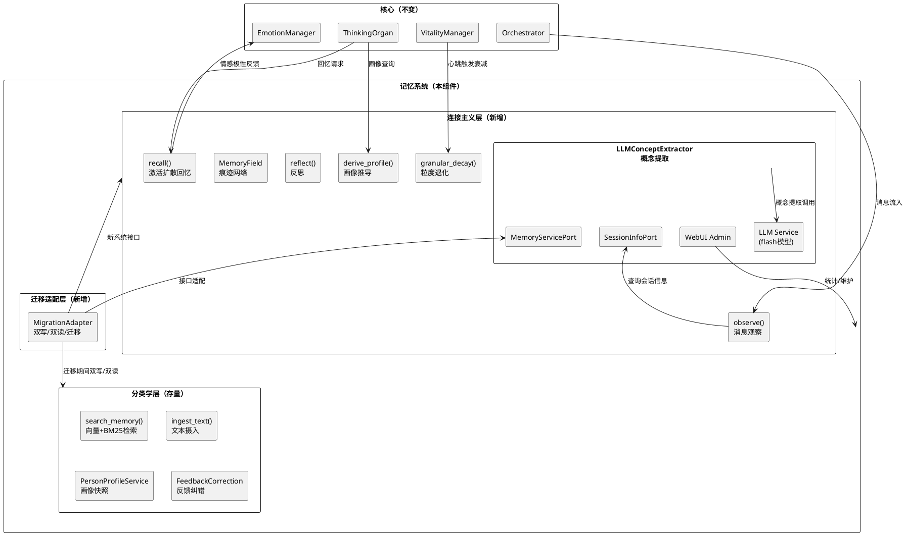
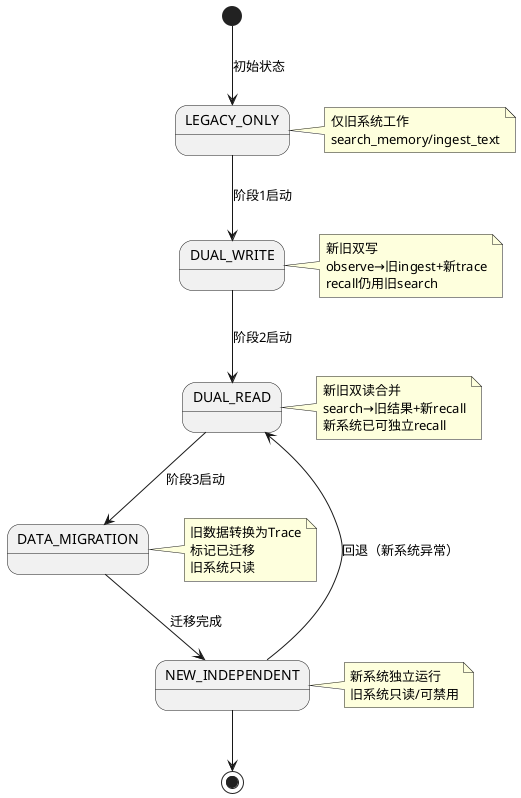
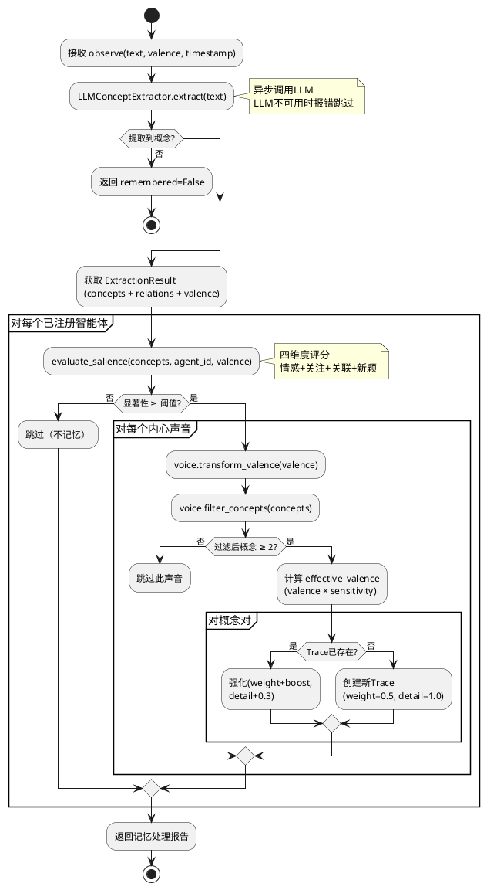
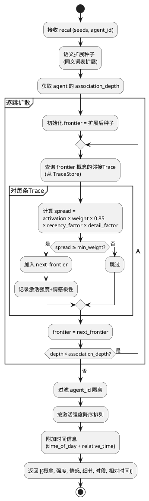
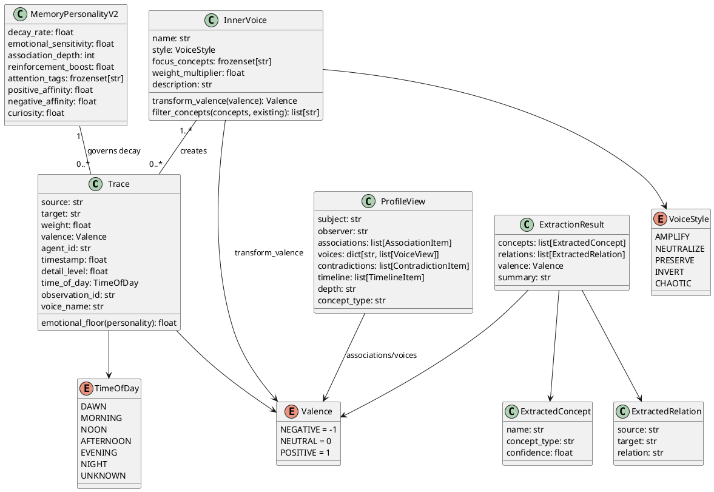

# 记忆系统革命 — 实现方案文档

# 一、需求与存量功能关系分析

## 1.1 需求功能与存量功能对比

### 1.1.1 已实现功能

| 需求功能 | 存量功能 | 代码位置 | 匹配度 |
|---------|---------|---------|--------|
| 记忆衰减（遗忘） | Relation 衰减/强化机制 | `core/storage/graph_store.py` + `core/utils/relation_write_service.py` | 50% |
| 情感极性数据 | Relation 情感标签（部分） | `core/storage/graph_store.py` 中 Relation 的 valence 字段 | 25% |
| 人物画像查询 | PersonProfileService | `core/utils/person_profile_service.py` + `core/runtime/services/profile_evidence.py` | 50% |
| 记忆检索（向量+图） | 双路径检索（向量+BM25+PPR+GraphRecall） | `core/retrieval/` 全模块 + `core/runtime/services/search.py` | 75% |
| 概念提取 | jieba 分词 + LLM 关系抽取 | `core/strategies/` + `core/utils/relation_write_service.py` | 50% |
| 记忆持久化 | SQLite + Faiss + SciPy 三层存储 | `core/storage/` 全模块 | 75% |
| 反馈纠错 | FeedbackCorrectionService + FuzzyModifyService | `core/runtime/services/feedback_correction.py` + `fuzzy_modify.py` | 100% |
| 智能体记忆性格 | MemoryServicePort.set_memory_personality() | `src/core/protocols.py:218` + `src/core/adapters/memory_service.py:45` | 25% |
| 痕迹强化（重复体验） | Relation 强化（weight 递增） | `core/utils/relation_write_service.py` 中 update_relation | 50% |
| LLM 调用能力 | LLMServiceClient（关系抽取/反馈分类/Episode切分） | `core/runtime/sdk_memory_kernel.py` 中多处 LLM 调用 | 75% |

### 1.1.2 需要扩展的功能

| 需求功能 | 存量功能 | 差异说明 | 扩展方向 |
|---------|---------|---------|---------|
| 激活扩散回忆 | PPR + GraphRecall 图增强检索 | 现有 PPR 是全局 PageRank，不区分智能体视角；GraphRecall 是后验图构建，非实时激活扩散。新需求要求从种子概念出发、沿痕迹逐跳扩散、受智能体联想深度控制 | 在 A_memorix 内部新增 MemoryField 组件，实现 per-agent 激活扩散算法，替代 PPR 作为回忆核心 |
| 记忆衰减 | Relation 简单指数衰减 | 现有衰减只降 weight，无 detail_level 退化概念；无情感锚定下限；无 emotional_floor | 扩展 Trace 数据模型，新增 detail_level + emotional_floor；将衰减从简单指数改为粒度退化模型 |
| 人物画像 | PersonProfileService 版本化快照 | 现有画像是独立存储的快照（版本化），非实时视图；只有"人"的画像，无"物/地点"；无内心声音视角；无矛盾保留 | 新增 derive_profile() 实时视图推导，替代 PersonProfileService 的快照模式；画像中心从"人"扩展到"任何概念" |
| 概念提取 | jieba 分词 + LLM 关系抽取 | 现有 jieba 无法理解语义、丢失动词、无情感判断；LLM 关系抽取已存在但用于 Relation 三元组，非概念+痕迹 | 新增 LLMConceptExtractor，提取概念+关系+情感极性+概念类型，替代 jieba 分词入口 |
| 智能体记忆性格 | set_memory_personality() 空壳 | 现有接口只有签名无实现（`memory_service.py:45` 只 try/except），无 MemoryPersonality 数据模型 | 实现 MemoryPersonalityV2 数据模型，在 observe() 中实际使用性格参数进行显著性评估 |
| 记忆检索 | search_memory 双路径检索 | 现有检索基于 Paragraph 向量+BM25，不基于痕迹激活扩散；迁移期间需双读合并 | 新增 recall() 入口，迁移期间 search() 内部双读合并新旧系统结果 |

### 1.1.3 需要新增的功能或接口

**核心新增（连接主义范式）**：

1. **痕迹（Trace）数据模型**：两个概念之间的连接，包含 weight/valence/agent_id/timestamp/detail_level/time_of_day/observation_id/voice_name/emotional_floor。这是连接主义的第一公民，替代 Paragraph/Entity/Relation 三元组
2. **概念（Concept）节点**：记忆网络中的语义单元标识符，无内容，只在 Trace 中被引用。概念类型（人/物/地点/活动/情感/抽象）由 LLMConceptExtractor 自动标注
3. **MemoryField 组件**：痕迹网络的核心运行时，管理 Trace 的创建/强化/衰减/激活扩散/画像推导。对应实验原型 `memory_v10.py` 的 RelationalMemoryField + `memory_v11.py` 的 LLMMemoryField
4. **observe() 入口**：消息流入记忆系统的唯一写入入口。双层架构——智能体声明性格，系统自主判断是否记忆。包含 LLM 概念提取 → 显著性评估 → 内心声音处理 → 痕迹创建/强化
5. **recall() 入口**：激活扩散回忆。从种子概念出发，沿痕迹网络逐跳扩散，受智能体联想深度控制。返回 [(概念, 激活强度, 情感极性, 细节等级, 时段, 相对时间)]
6. **derive_profile() 入口**：画像实时推导。从痕迹网络中提取 per-agent 视角的子图，包含关联概念、内心声音视角、矛盾点、时间线、画像深度
7. **reflect() 入口**：反思机制。展示同一概念在不同内心声音下的痕迹，供 ThinkingOrgan 构建内心独白上下文

**支撑新增**：

8. **MemoryPersonalityV2 数据模型**：智能体记忆性格声明（decay_rate/emotional_sensitivity/association_depth/reinforcement_boost/attention_tags/positive_affinity/negative_affinity/curiosity）
9. **InnerVoice 数据模型**：内心声音定义（name/style/focus_concepts/weight_multiplier/description），style 枚举 AMPLIFY/NEUTRALIZE/PRESERVE/INVERT/CHAOTIC
10. **LLMConceptExtractor**：LLM 语义概念提取器，提取概念+关系+情感极性+概念类型。LLM 不可用时记录错误日志并跳过本次 observe，不降级到低质量提取方式
11. **粒度退化引擎（granular_decay）**：detail_level 逐渐下降 + weight 有 emotional_floor 下限 + 情感慢化因子
12. **显著性评估器（evaluate_salience）**：四维度评分（情感显著性/关注领域匹配/关联度/新颖性），决定是否记忆
13. **迁移适配层**：双写→双读→数据迁移→新系统独立的四阶段渐进式迁移

## 1.2 存量功能详细分析

### 1.2.1 SDKMemoryKernel（核心运行时）

**接口契约**：
- `search_memory()` → 向量+BM25+PPR 检索，返回 Paragraph 列表
- `ingest_text()` / `ingest_summary()` → 文本摄入，创建 Paragraph + Entity + Relation
- `get_person_profile()` → PersonProfile 快照查询
- `maintain_memory()` → 维护操作
- `memory_stats()` → 统计信息

**业务规则**：
- Paragraph 是不可变的原始文本片段，写入后不更新
- Entity 是提及的人/物，只有名字+出现次数
- Relation 是三元组（subject→predicate→object），有衰减/强化但内容不可变
- Episode 是 LLM 语义切分的情景，不可更新/合并
- PersonProfile 是版本化快照，定期重建

**约束**：
- 2911 行代码，14 个 service 文件已拆分，但核心数据模型（Paragraph/Entity/Relation/Episode/Profile）不变
- 外部 API 签名（host_service.invoke）不可变
- 子模块不反向持有 SDKMemoryKernel 引用

**扩展点**：
- `_session_info_port` 已注入，可查询会话信息
- `_feedback_correction_service` / `_fuzzy_modify_service` 提供记忆演化入口
- `person_profile_service` 可被 derive_profile() 替代

### 1.2.2 三层存储（SQLite + Faiss + SciPy）

**接口契约**：
- MetadataStore（SQLite）：Paragraph/Entity/Relation 的元数据 CRUD
- VectorStore（Faiss）：向量索引，支持双向量池（段落向量+关系向量）
- GraphStore（SciPy）：稀疏邻接矩阵，支持 PPR 扩散

**业务规则**：
- Paragraph 存储在 SQLite，向量在 Faiss，图关系在 SciPy
- 向量维度 1024，支持量化（int8/float16/float32）
- PPR 扩散基于全局邻接矩阵，不区分智能体视角

**约束**：
- GraphStore 的 PPR 是全局计算，无法 per-agent 隔离
- VectorStore 的向量与 Paragraph 绑定，无法映射到 Trace

**扩展点**：
- VectorStore 可新增 Trace 向量池（概念向量索引）
- GraphStore 的稀疏矩阵结构可复用于 Trace 邻接关系
- MetadataStore 可新增 Trace 表

### 1.2.3 检索链（BM25 + 向量 + PPR + GraphRecall + PosteriorGraph）

**接口契约**：
- SparseBM25Index：BM25 稀疏检索
- VectorStore：向量相似度检索
- pagerank.py：PPR 扩散
- graph_relation_recall.py：基于图关系的回忆
- posterior_graph.py：后验图构建
- dual_path.py：双路径合并

**业务规则**：
- 检索基于 Paragraph 向量 + BM25 关键词 + PPR 图增强
- GraphRecall 是后验构建（先检索再构建子图），非实时激活扩散
- PosteriorGraph 从检索结果中提取实体关系子图

**约束**：
- 检索粒度是 Paragraph（文本片段），不是概念
- PPR 不区分智能体，无法实现 per-agent 激活扩散
- GraphRecall 依赖检索结果，无法独立运行

**扩展点**：
- recall() 可作为新的检索路径，与现有双路径并行
- 迁移期间，search() 内部合并 recall() 结果和 Paragraph 检索结果

### 1.2.4 MemoryServicePort（核心 Protocol 接口）

**接口契约**：
- `search(query, session_id, limit)` → 记忆检索
- `get_person_profile(person_id, limit)` → 人物画像
- `build_profile_injection_text(raw_text)` → 画像注入文本
- `set_memory_personality(agent_id, params)` → 设置记忆性格

**约束**：
- 核心模块只依赖此 Protocol，不导入 A_memorix 内部模块
- AMemorixMemoryServicePort 是唯一适配器

**扩展点**：
- `search()` 内部实现可替换（从 Paragraph 检索改为 Trace 激活扩散）
- `get_person_profile()` 内部实现可替换（从快照查询改为 derive_profile()）
- `set_memory_personality()` 需要实际实现（当前是空壳）
- 可新增 `observe()` / `recall()` / `reflect()` 方法（需评估是否扩展 Protocol 或在 A_memorix 内部暴露）

### 1.2.5 host_service（外部 API 入口）

**接口契约**：
- `invoke(component_name, args)` → 统一调用入口
- 支持的 component_name：search_memory / ingest_text / ingest_summary / get_person_profile / maintain_memory / memory_stats / enqueue_feedback_task / admin 系列

**约束**：
- 调用方式不可变（invoke 签名不变）
- 新增 component_name 是允许的（不破坏现有调用）

**扩展点**：
- 可新增 `observe` / `recall` / `derive_profile` / `reflect` / `register_agent` 等 component_name
- 现有 component_name 的内部实现可替换

---

# 二、增量设计方案

## 2.1 实现模型

### 2.1.1 上下文视图



**通信协议**：
- Orchestrator → observe()：同步调用，消息流入即触发。记忆系统被动观察消息流，只负责提取连接模式，不替智能体做回复决策
- ThinkingOrgan → recall()/derive_profile()：异步调用，思考过程中按需检索
- VitalityManager → granular_decay()：心跳触发（60秒间隔）
- LLMConceptExtractor → LLM Service：异步 HTTP 调用，使用 flash 模型

### 2.1.2 服务/组件总体架构

```plantuml
@startuml
skinparam componentStyle rectangle

package "A_memorix/core/" {
    package "connectionist/（新增）" {
        [MemoryField] as Field
        [TraceStore] as TraceStore
        [ConceptIndex] as ConceptIdx
        [SalienceEvaluator] as SalEval
        [SpreadingActivation] as SpreadAct
        [ProfileDeriver] as ProfDer
        [GranularDecayEngine] as Decay
    }
    
    package "extraction/（新增）" {
        [LLMConceptExtractor] as LLMExt

    }
    
    package "personality/（新增）" {
        [PersonalityRegistry] as PersReg
        [InnerVoiceProcessor] as VoiceProc
    ]
    }
    
    package "migration/（新增）" {
        [MigrationAdapter] as MigAdapt
        [DataConverter] as DataConv
    ]
    }
    
    package "runtime/（存量，扩展）" {
        [SDKMemoryKernel] as Kernel
        [host_service] as HostSvc
    }
    
    package "storage/（存量，复用）" {
        [MetadataStore] as MetaStore
        [VectorStore] as VecStore
        [GraphStore] as GraphStore
    }
}

Field --> TraceStore : 痕迹CRUD
Field --> ConceptIdx : 概念查询
Field --> SpreadAct : 激活扩散
Field --> ProfDer : 画像推导
Field --> Decay : 粒度退化

Kernel --> Field : observe/recall/derive_profile
Kernel --> MigAdapt : 迁移控制
MigAdapt --> DataConv : 旧数据转换

HostSvc --> Kernel : invoke()

@enduml
```

**模块职责**：

| 模块 | 职责 | 来源 |
|------|------|------|
| MemoryField | 痕迹网络核心运行时，管理 Trace 的创建/强化/衰减/激活扩散/画像推导 | 实验原型 `memory_v10.py` RelationalMemoryField + `memory_v11.py` LLMMemoryField |
| TraceStore | Trace 持久化存储（SQLite），概念邻接索引 | 新增，复用 MetadataStore 的 SQLite 基础设施 |
| ConceptIndex | 概念→类型映射、同义词表、概念频率统计 | 实验原型 `memory_v4.py` SemanticConceptExtractor 的同义词表 |
| SalienceEvaluator | 四维度显著性评估（情感/关注/关联/新颖） | 实验原型 `memory_v7.py` evaluate_salience() |
| SpreadingActivation | 激活扩散算法（逐跳扩散+时近因子+细节因子） | 实验原型 `memory_field.py` recall() + `memory_v5.py` recency_factor |
| ProfileDeriver | 画像实时推导（关联概念+内心声音视角+矛盾+时间线+深度） | 实验原型 `memory_v10.py` derive_profile() |
| GranularDecayEngine | 粒度退化（detail_level 下降+emotional_floor+情感慢化） | 实验原型 `memory_v6.py` granular_decay() |
| LLMConceptExtractor | LLM 语义概念提取（概念+关系+情感+类型），LLM不可用时报错跳过 | 实验原型 `memory_v11.py` LLMConceptExtractor |
| PersonalityRegistry | 智能体记忆性格注册表（MemoryPersonalityV2 + InnerVoice 列表） | 实验原型 `memory_v7.py` + `memory_v9.py` |
| InnerVoiceProcessor | 内心声音处理（transform_valence + filter_concepts） | 实验原型 `memory_v9.py` InnerVoice |
| MigrationAdapter | 迁移适配层（双写/双读/数据迁移/回退控制） | spec.md 5.7 渐进式迁移 |
| DataConverter | 旧数据→Trace 转换器（Paragraph/Entity/Relation/Episode/Profile → Trace） | 新增 |

### 2.1.3 实现设计文档

#### 渐进式迁移状态机



**迁移阶段详细设计**：

**阶段1：双写（DUAL_WRITE）**
- 触发条件：配置 `memory_revolution.phase = "dual_write"`
- 行为：消息流入时，同时调用旧 `ingest_text()` 和新 `observe()`
- 旧系统：正常工作，search_memory/ingest_text 不受影响
- 新系统：observe() 创建 Trace，但 recall() 结果不对外暴露
- 回退：配置改回 `"legacy_only"` 即可

**阶段2：双读（DUAL_READ）**
- 触发条件：配置 `memory_revolution.phase = "dual_read"` + 新系统 Trace 数量 > 阈值
- 行为：search() 内部同时查询旧系统和新系统，合并去重
- 旧系统：search_memory 正常工作
- 新系统：recall() 结果参与合并，derive_profile() 可独立使用
- 合并策略：旧系统结果按 Paragraph 排序，新系统结果按激活强度排序，取并集去重
- 回退：配置改回 `"dual_write"` 即可

**阶段3：数据迁移（DATA_MIGRATION）**
- 触发条件：配置 `memory_revolution.phase = "data_migration"` + 双读运行稳定
- 行为：DataConverter 将旧数据转换为 Trace
  - Paragraph → 提取概念 + 创建 Trace（使用 LLMConceptExtractor 重新提取）
  - Entity → 概念节点注册（更新 ConceptIndex）
  - Relation → Trace（subject→object，weight 从 relation 强度映射，valence 默认 NEUTRAL）
  - Episode → 提取概念 + 创建 Trace（保留时间信息）
  - PersonProfile → 不转换（derive_profile() 实时推导替代）
- 旧系统：标记已迁移数据，不再写入
- 回退：新系统 Trace 数据独立存储，删除即可回退

**阶段4：新系统独立（NEW_INDEPENDENT）**
- 触发条件：配置 `memory_revolution.phase = "new_independent"` + 数据迁移完成
- 行为：search() 只查询新系统，旧系统只读
- 旧系统：保留但不活跃，可用于回退
- 回退：配置改回 `"dual_read"` 即可

#### observe() 处理流程



#### recall() 激活扩散流程



## 2.2 接口设计

### 2.2.1 总体设计

**接口分类**：

| 分类 | 接口 | 稳定性 | 说明 |
|------|------|--------|------|
| **核心写入** | observe() | 实验 | 消息流入，系统自主记忆 |
| **核心读取** | recall() | 实验 | 激活扩散回忆 |
| **核心读取** | derive_profile() | 实验 | 画像实时推导 |
| **核心读取** | reflect() | 实验 | 反思（内心声音视角） |
| **注册** | register_agent() | 稳定 | 注册智能体记忆性格+内心声音 |
| **维护** | granular_decay() | 稳定 | 心跳触发的粒度退化 |
| **维护** | consolidate() | 稳定 | 合并重复弱连接 |
| **迁移** | MigrationAdapter 接口 | 实验 | 迁移阶段控制 |
| **存量兼容** | search_memory() | 稳定 | 迁移期间双读合并 |
| **存量兼容** | ingest_text() | 稳定 | 迁移期间双写 |
| **存量兼容** | get_person_profile() | 稳定 | 迁移期间兼容，逐步替换为 derive_profile() |

**接口变更策略**：
- MemoryServicePort Protocol 不新增方法（保持向后兼容）
- 新接口通过 host_service.invoke() 新增 component_name 暴露
- 核心模块（Orchestrator/ThinkingOrgan）通过 MemoryServicePort 现有方法间接使用新功能
- 迁移完成后，search() 内部完全切换到 recall()，get_person_profile() 内部切换到 derive_profile()

### 2.2.2 接口清单

#### observe() — 消息观察与选择性记忆

```python
async def observe(
    text: str,
    valence: Valence = Valence.NEUTRAL,
    timestamp: float | None = None,
    source_id: str = "",
    session_id: str = "",
) -> ObserveResult:
    """消息流入记忆系统的唯一写入入口。

    双层架构：智能体声明性格，系统自主判断是否记忆。
    对每个已注册智能体独立评估显著性，内心声音处理体验。

    前置条件：至少一个智能体已注册（否则使用默认性格）
    后置条件：Trace 创建/强化，ConceptIndex 更新
    异常映射：LLM 不可用 → 记录错误日志并跳过本次 observe，不降级
    """
```

**ObserveResult**：
- text: 原始文本
- extraction: ExtractionResult（概念+关系+情感+摘要）
- memory_results: list[AgentMemoryResult]（每个智能体的记忆结果）
  - agent_id: 智能体ID
  - remembered: bool
  - reason: 原因描述
  - traces_created: int
  - voices_active: list[str]

#### recall() — 激活扩散回忆

```python
async def recall(
    seeds: list[str],
    agent_id: str,
    min_weight: float = 0.05,
    max_results: int = 20,
) -> list[RecallItem]:
    """从种子概念出发，沿痕迹网络逐跳扩散。

    扩散深度由智能体的 association_depth 决定。
    结果按激活强度降序排列，只包含该智能体的痕迹。

    前置条件：agent_id 已注册
    后置条件：无状态变更（纯读取）
    异常映射：种子不存在 → 返回空列表
    """
```

**RecallItem**：
- concept: 概念名
- activation: 激活强度 [0, 1]
- valence: 情感极性 (POSITIVE/NEUTRAL/NEGATIVE)
- detail_level: 细节等级 [0.1, 1.0]
- time_of_day: 时段（凌晨/上午/中午/下午/晚上/深夜/未知）
- relative_time: 相对时间（刚刚/今天/昨天/这几天/上周/很久以前）

#### derive_profile() — 画像实时推导

```python
async def derive_profile(
    subject: str,
    observer: str,
    now: float | None = None,
) -> ProfileView:
    """从痕迹网络中实时提取 per-agent 画像视图。

    画像不是独立存储的，是从 observer 的所有痕迹中，
    以 subject 为中心提取的子图。

    前置条件：observer 已注册
    后置条件：无状态变更（纯读取）
    异常映射：无痕迹 → 返回空白画像
    """
```

**ProfileView**：
- subject: 被观察概念
- observer: 观察者智能体ID
- associations: list[AssociationItem]（关联概念，按强度降序）
- voices: dict[str, list[VoiceView]]（每个内心声音的视角）
- contradictions: list[ContradictionItem]（矛盾点）
- timeline: list[TimelineItem]（时间线）
- depth: str（空白/初识/相识/熟悉/深知）
- concept_type: str（人/物/地点/活动/抽象/未知）

#### reflect() — 反思

```python
async def reflect(
    subject: str,
    agent_id: str,
) -> ReflectResult:
    """展示同一概念在不同内心声音下的痕迹。

    不是回忆（激活扩散），是内心独白的素材。
    供 ThinkingOrgan 构建内心冲突/矛盾的上下文。

    前置条件：agent_id 已注册且有内心声音
    后置条件：无状态变更
    异常映射：无痕迹 → 返回空反思
    """
```

**ReflectResult**：
- subject: 概念名
- agent_id: 智能体ID
- voices: dict[str, list[VoiceView]]（每个声音的视角）
- contradictions: list[ContradictionItem]（矛盾点）

#### register_agent() — 注册智能体记忆性格

```python
async def register_agent(
    agent_id: str,
    personality: MemoryPersonalityV2,
    voices: list[InnerVoice],
) -> None:
    """注册智能体的记忆性格和内心声音。

    注册后，observe() 自动使用此性格进行显著性评估。
    内心声音列表决定同一体验产生几组痕迹。

    前置条件：agent_id 非空
    后置条件：PersonalityRegistry 更新
    异常映射：重复注册 → 覆盖旧值
    """
```

#### granular_decay() — 粒度退化

```python
async def granular_decay(
    elapsed_hours: float = 1.0,
) -> DecayResult:
    """心跳触发的粒度退化。

    对所有 Trace 执行：
    1. detail_level 按 decay_rate 下降（受情感慢化因子影响）
    2. weight 乘以衰减因子，但不低于 emotional_floor
    3. 合并重复弱连接（consolidate）

    前置条件：MemoryField 已初始化
    后置条件：Trace 的 weight/detail_level 更新
    异常映射：Trace 数量过多 → 分批处理
    """
```

**DecayResult**：
- traces_processed: int
- traces_consolidated: int
- elapsed_ms: float

## 2.3 数据模型

### 2.3.1 设计目标

1. **连接主义第一公民**：Trace 是核心数据结构，不是 Paragraph/Entity/Relation 的附属
2. **per-agent 隔离**：每条 Trace 绑定 agent_id，不同智能体的记忆完全隔离
3. **与存量数据共存**：Trace 独立存储，不影响 Paragraph/Entity/Relation/Episode/Profile
4. **持久化可靠**：Trace 可持久化到 SQLite，重启后可恢复
5. **内存高效**：10000 条 Trace × 13 智能体 ≤ 200MB 常驻内存

### 2.3.2 模型实现



**Trace 字段约束**：

| 字段 | 类型 | 约束 | 说明 |
|------|------|------|------|
| source | str | 非空，≤50字符 | 源概念标识符 |
| target | str | 非空，≤50字符 | 目标概念标识符 |
| weight | float | [emotional_floor, 1.0]，初始0.5 | 连接强度 |
| valence | Valence | 枚举 | 情感极性 |
| agent_id | str | 非空 | 所属智能体 |
| timestamp | float | Unix时间戳（秒） | 创建/最后更新时间 |
| detail_level | float | [SKELETON(0.1), 1.0]，初始1.0 | 细节等级 |
| time_of_day | TimeOfDay | 枚举 | 时段 |
| observation_id | str | 格式 "obs_{counter}" | 原始观察事件ID |
| voice_name | str | 非空 | 创建此痕迹的内心声音名称 |

**Trace 唯一键**：(source, target, agent_id, voice_name) — 同一智能体同一声音下，两个概念之间只有一条 Trace

**Trace 持久化策略**：
- 存储位置：`{data_dir}/connectionist/traces.db`（独立 SQLite 数据库）
- 邻接索引：内存中的 `dict[str, dict[str, list[Trace]]]`（概念→agent_id→Trace列表）
- 持久化时机：每次 observe() 后异步写入，心跳时批量刷盘
- 恢复策略：启动时从 SQLite 加载到内存，重建邻接索引

**概念节点存储**：
- 概念不是独立存储的对象，只在 Trace 中被引用
- ConceptIndex 维护：概念→类型映射、同义词表、概念频率
- 存储位置：`{data_dir}/connectionist/concepts.json`

**MemoryPersonalityV2 字段约束**：

| 字段 | 类型 | 默认值 | 有效范围 | 说明 |
|------|------|--------|----------|------|
| decay_rate | float | 1.0 | [0.1, 5.0] | 衰减率倍数 |
| emotional_sensitivity | float | 1.0 | [0.1, 3.0] | 情感敏感度 |
| association_depth | int | 2 | [1, 4] | 联想深度（跳数） |
| reinforcement_boost | float | 0.3 | [0.1, 0.5] | 强化增幅 |
| attention_tags | frozenset[str] | frozenset() | — | 关注领域 |
| positive_affinity | float | 1.0 | [0.0, 3.0] | 正面情感偏好 |
| negative_affinity | float | 1.0 | [0.0, 3.0] | 负面情感偏好 |
| curiosity | float | 1.0 | [0.5, 2.0] | 好奇心/记忆门槛 |

**InnerVoice 字段约束**：

| 字段 | 类型 | 约束 | 说明 |
|------|------|------|------|
| name | str | 非空 | 声音名称（如"恶作剧心"） |
| style | VoiceStyle | 枚举 | 处理风格 |
| focus_concepts | frozenset[str] | — | 关注概念过滤器 |
| weight_multiplier | float | [0.1, 2.0]，默认1.0 | 权重乘数 |
| description | str | 可选 | 声音描述 |

**InnerVoice.transform_valence() 逻辑**：

| style | 行为 |
|-------|------|
| AMPLIFY | valence 值 × 1.5（放大情感） |
| NEUTRALIZE | valence = NEUTRAL（归零情感） |
| PRESERVE | 保持原始 valence |
| INVERT | valence 值 × -1（反转情感） |
| CHAOTIC | 随机选择 AMPLIFY/NEUTRALIZE/PRESERVE/INVERT |

**InnerVoice.filter_concepts() 逻辑**：
- focus_concepts 非空时，只保留与 focus_concepts 有交集的概念 + 已有记忆中的概念
- focus_concepts 为空时，保留全部概念

**emotional_floor 计算公式**：
- NEUTRAL → 0.02
- POSITIVE/NEGATIVE → min(0.30, 0.10 × |valence| × emotional_sensitivity)

**粒度退化公式**：
- emotional_slowdown = 1.0 / (1.0 + 0.5 × |valence| × sensitivity)
- detail_level -= detail_decay_rate × elapsed_hours × emotional_slowdown
- detail_level = max(SKELETON, detail_level)
- weight = max(emotional_floor, weight × decay_factor)

**显著性评估公式**：
- 情感显著性：0.4 × affinity × sensitivity（valence ≠ NEUTRAL 时）
- 关注领域匹配：0.5 × 匹配概念数
- 关联度：0.2 × 与已有记忆重叠概念数
- 新颖性：0.15 × 新概念数（≥2 时才计）
- 总分 = min(1.0, 上述之和)
- 阈值 = 0.25 / max(0.5, curiosity)

**激活扩散公式**：
- spread = activation × weight × 0.85（衰减系数）× recency_factor × detail_factor
- recency_factor：近期（<1h）1.0~1.5，1h 后归为 1.0
- detail_factor = 0.3 + 0.7 × detail_level

**画像深度判定**：
- ≤3 条痕迹 → "初识——只有模糊的印象"
- ≤8 条 → "相识——开始有了轮廓"
- ≤15 条 → "熟悉——有了较深的了解"
- >15 条 → "深知——深入骨髓的理解"

**旧数据→Trace 转换规则**：

| 旧数据类型 | 转换规则 |
|-----------|---------|
| Paragraph | LLMConceptExtractor 重新提取概念 → 创建 Trace（weight=0.5, valence=NEUTRAL, detail_level=0.3 退化为骨架） |
| Entity | 注册为概念节点（更新 ConceptIndex），无 Trace 创建 |
| Relation | subject→object 创建 Trace（weight 从 relation 强度映射 [0,1]，valence 默认 NEUTRAL） |
| Episode | LLMConceptExtractor 重新提取概念 → 创建 Trace（保留 timestamp，detail_level=0.3） |
| PersonProfile | 不转换，derive_profile() 实时推导替代 |