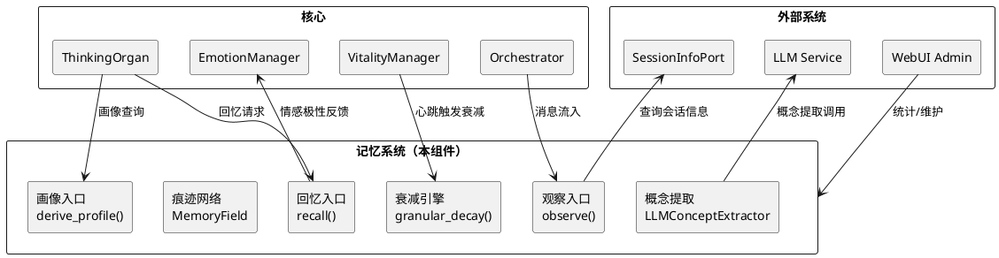
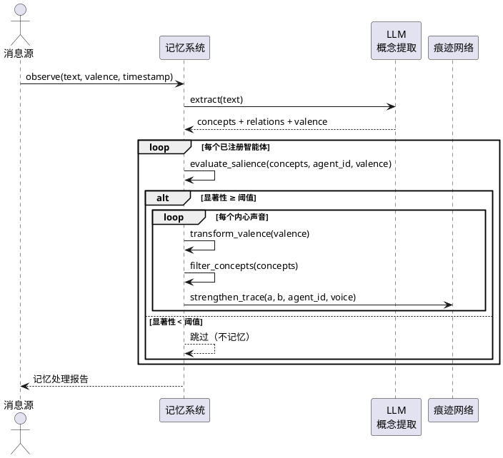
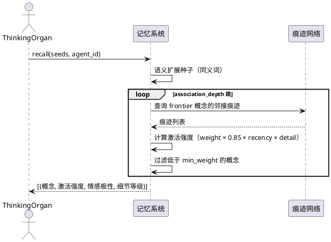
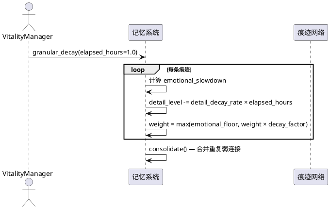
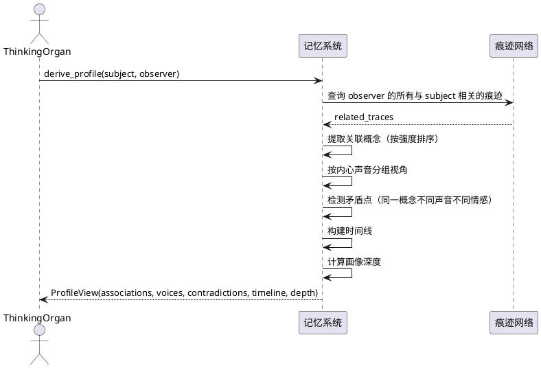
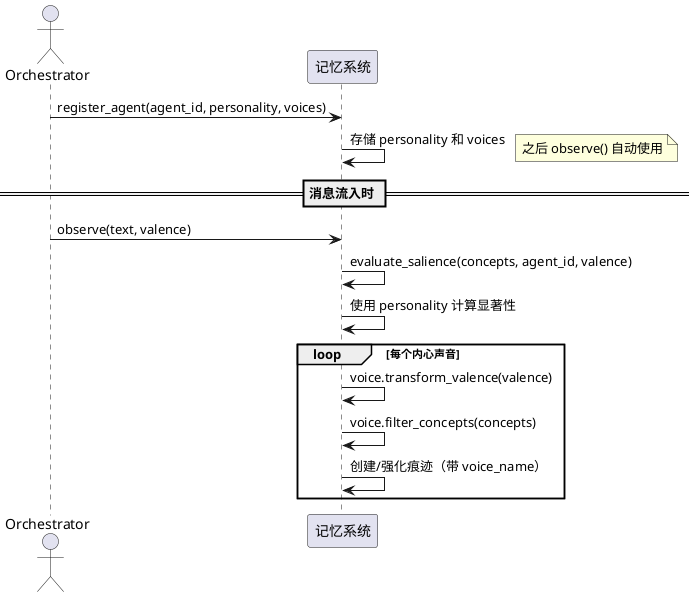
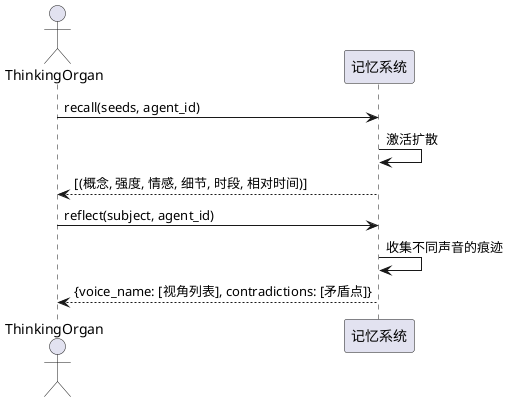
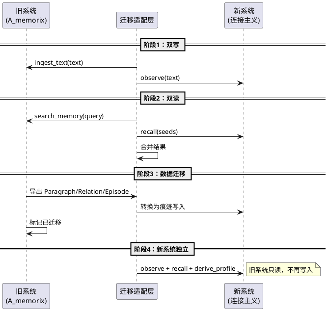

# 记忆系统革命 — 需求规格文档

## 1. 组件定位

### 1.1 核心职责

本组件负责将 MaiBot 记忆系统从分类学范式（Paragraph/Entity/Relation/Episode/Profile 五种静态类型）迁移到连接主义范式（概念节点+连接痕迹+激活扩散），实现"记忆是连接而非对象"的核心理念。

### 1.2 核心输入

1. **对话消息流**：来自 ChatManager 的实时聊天消息（文本+发送者+时间+会话ID），通过 `observe()` 接口流入记忆系统
2. **智能体记忆性格声明**：每个智能体注册的 MemoryPersonality（衰减率、情感敏感度、联想深度、关注领域、情感偏好、好奇心），决定"什么样的记忆者"
3. **智能体内心声音定义**：每个智能体的 InnerVoice 列表（处理风格、关注概念、权重乘数），决定"内心如何处理体验"
4. **回忆请求**：来自 ThinkingOrgan 的回忆触发（种子概念+智能体ID），通过 `recall()` 接口检索
5. **画像查询请求**：来自 MemoryServicePort 的画像查询（主体概念+观察者智能体ID），通过 `derive_profile()` 接口提取
6. **心跳信号**：来自 VitalityManager 的周期性心跳（60秒间隔），触发记忆衰减和整合
7. **反馈纠错指令**：来自用户或系统的记忆修正请求（已有功能，需保留）

### 1.3 核心输出

1. **回忆结果**：返回给 ThinkingOrgan 的激活模式（概念+激活强度+情感极性+细节等级+时间信息），用于构建思考上下文
2. **画像视图**：返回给 MemoryServicePort 的 per-agent 画像（关联概念+内心声音视角+矛盾点+时间线+画像深度），替代当前的 PersonProfile
3. **记忆处理报告**：每次 observe 的处理结果（哪些智能体记住了、显著性评分、创建/强化的痕迹数），用于调试和日志
4. **记忆统计信息**：返回给 WebUI Admin 的系统状态（痕迹数、概念数、各智能体记忆量），用于运维监控
5. **记忆衰减事件**：痕迹权重降至情感锚定下限时的状态变更，用于内部整合和日志

### 1.4 职责边界

本组件**不负责**以下事项：

1. **不负责消息路由和回复决策**：消息是否需要回复、是否触发 Planner，由 Orchestrator 和 ThinkingOrgan 决定。记忆系统通过 observe() 被动观察消息流，只负责提取连接模式，不替智能体做回复决策
2. **不负责情绪计算**：情绪状态由 EmotionManager 管理，记忆系统只提供情感极性数据作为输入
3. **不负责 LLM 推理**：记忆系统不调用 LLM 进行回复生成，只调用 LLM 进行概念提取（轻量级、低成本）
4. **不负责会话管理**：会话信息通过 SessionInfoPort 查询，不持有可变会话引用
5. **不负责消息发送**：核心通过 MessagePort 发送消息，记忆系统不直接调用 send_service
6. **不负责插件管理**：插件系统独立运行，记忆系统不感知插件的存在
7. **不一次性替换 A_memorix**：渐进式迁移，新旧系统共存过渡，不破坏现有功能

---

## 2. 领域术语

**概念（Concept）**
: 记忆网络中的节点，代表一个语义单元（人名、地点、物品、活动、情感、抽象概念）。概念没有内容，只是标识符。概念不是独立存储的对象，只在连接痕迹中被引用。

**痕迹（Trace）**
: 两个概念之间的连接，是记忆的最小单位。痕迹包含权重（weight）、情感极性（valence）、所属智能体（agent_id）、时间戳、细节等级（detail_level）、时段（time_of_day）、观察ID（observation_id）、内心声音名（voice_name）。新记忆 = 新痕迹或痕迹强化，遗忘 = 痕迹衰减。

**激活扩散（Spreading Activation）**
: 回忆的机制。从种子概念出发，沿痕迹网络逐跳扩散激活，每跳衰减。扩散深度由智能体的联想深度（association_depth）决定。激活模式本身就是回忆的结果，不存在独立的"记忆对象"被检索。

**记忆性格（MemoryPersonality）**
: 智能体声明的记忆偏好参数集合，包括衰减率（decay_rate）、情感敏感度（emotional_sensitivity）、联想深度（association_depth）、强化增幅（reinforcement_boost）、关注领域（attention_tags）、情感偏好（positive_affinity/negative_affinity）、好奇心（curiosity）。智能体声明"我是什么样的记忆者"，记忆系统解读执行。

**内心声音（InnerVoice）**
: 智能体内心的不同视角，不是分裂人格，是内心独白。每个声音有处理风格（AMPLIFY/NEUTRALIZE/PRESERVE/INVERT/CHAOTIC）、关注概念过滤器、权重乘数。同一次体验经不同声音处理，产生不同情感极性和关注焦点的痕迹。

**粒度退化（Granular Decay）**
: 时间不是让记忆消失，是让记忆模糊。detail_level 从 1.0（细节完整）逐渐降至 SKELETON（只剩骨架），但 weight 有情感锚定下限（emotional_floor），永不真正归零。

**情感锚定（Emotional Anchoring）**
: 带情感极性的痕迹（POSITIVE/NEGATIVE）拥有比中性痕迹更高的 weight 下限。强情感 × 高敏感度 → 下限可达 0.30，中性痕迹下限仅 0.02。这保证情感记忆永不真正遗忘。

**显著性评估（Salience Evaluation）**
: 记忆系统自主判断一条消息对某个智能体的记忆价值。四维度评分：情感显著性、关注领域匹配、与已有记忆关联度、新颖性。评分低于阈值（由 curiosity 调节）则不记忆。

**画像视图（ProfileView）**
: 从某个智能体的视角看某个概念的实时快照。不是独立存储的数据结构，是从痕迹网络中 derive_profile() 实时提取的子图。包含关联概念、内心声音视角、矛盾点、时间线、画像深度。

**叙事涌现（Narrative Emergence）**
: 不需要显式存储故事，叙事弧线从连接模式中自然涌现。"吵架→冷战→和好"不是三个独立事件，而是激活扩散路径上自然连通的概念链。

**概念提取（Concept Extraction）**
: 从自然语言文本中提取概念、关系和情感极性的过程。使用 LLM 语义提取（精准、有情感判断、有语义关系）。LLM 不可用时记录错误日志并跳过本次 observe，不降级到低质量提取方式。

**观察（Observation）**
: 消息流入记忆系统的入口事件。包含文本、情感极性、时间戳、来源ID。observe() 是唯一写入入口——消息流入，系统对每个已注册智能体独立判断是否记忆。

---

## 3. 角色与边界

### 3.1 核心角色

- **主智能体（银狼/提纳里）**：每条消息必经记忆系统，拥有完整记忆性格和内心声音定义
- **共居智能体（刃/花火/景元等12位）**：通过管家三层过滤获得消息，拥有独立的记忆性格和内心声音，选择性记忆
- **运维管理员**：通过 WebUI Admin 查看记忆统计、调整记忆参数、执行记忆维护操作

### 3.2 外部系统

- **Orchestrator**：调用记忆系统的 observe() 写入消息，调用 recall() 获取回忆结果，调用 derive_profile() 获取画像
- **ThinkingOrgan**：在 think() 过程中通过 MemoryServicePort 获取记忆上下文
- **EmotionManager**：记忆系统提供情感极性数据，EmotionManager 据此更新情绪状态
- **VitalityManager**：心跳信号触发记忆衰减和整合
- **LLM Service**：记忆系统调用 LLM 进行概念提取（轻量级调用，使用 flash 模型）
- **WebUI Admin**：查询记忆统计、执行维护操作

### 3.3 交互上下文

---

## 4. DFX约束

### 4.1 性能

1. **概念提取延迟**：单条消息 LLM 概念提取延迟应 ≤ 2 秒（使用 flash 模型）
2. **回忆延迟**：单次 recall() 激活扩散延迟应 ≤ 100ms（纯内存计算，不涉及 LLM）
3. **画像推导延迟**：单次 derive_profile() 延迟应 ≤ 200ms（从痕迹网络提取子图）
4. **观察吞吐量**：observe() 应支持 ≥ 10 条/秒的消息摄入（含 LLM 概念提取的异步处理）
5. **心跳衰减开销**：单次 granular_decay() 全量扫描应 ≤ 500ms（13个智能体，假设 ≤ 10000 条痕迹）
6. **内存占用**：痕迹网络常驻内存应 ≤ 200MB（10000 条痕迹 × 13 智能体）

### 4.2 可靠性

1. **记忆持久化**：痕迹网络必须可持久化到磁盘（JSON/SQLite），重启后可恢复
2. **数据不丢失**：observe() 写入的痕迹在持久化前不得丢失，异常退出时最多丢失最近一次心跳周期内的数据
3. **LLM 不可用时跳过**：LLM 不可用时，概念提取记录错误日志并跳过本次 observe，不降级到低质量提取方式，记忆系统不阻塞
4. **旧数据兼容**：迁移期间，A_memorix 旧格式数据（Paragraph/Entity/Relation/Episode/Profile）必须可读取，不丢失已有记忆

### 4.3 安全性

1. **记忆隔离**：不同智能体的记忆通过 agent_id 隔离，一个智能体的 recall() 不能访问另一个智能体的痕迹（除非显式共享）
2. **核心隔离**：核心模块只通过 MemoryServicePort Protocol 访问记忆系统，不导入 A_memorix 内部模块
3. **反向依赖禁止**：记忆系统内部不导入 chat_manager、send_service 等外部组件

### 4.4 可维护性

1. **记忆可观测**：每次 observe 的处理结果必须可查询（哪个智能体记住了、为什么/为什么不）
2. **痕迹可追溯**：每条痕迹包含 observation_id，可追溯到原始观察事件
3. **参数可调**：记忆性格参数（衰减率、情感敏感度等）可通过配置文件调整，无需改代码
4. **统计可查**：WebUI Admin 可查看痕迹数、概念数、各智能体记忆量、观察日志

### 4.5 兼容性

1. **MemoryServicePort 接口不变**：`search()`、`get_person_profile()`、`build_profile_injection_text()`、`set_memory_personality()` 四个方法签名保持兼容
2. **host_service 调用方式不变**：`invoke(component_name, args)` 的调用方式保持兼容
3. **渐进式迁移**：新旧系统共存期间，旧接口（search_memory、ingest_text、ingest_summary 等）仍可用
4. **配置文件兼容**：现有 A_memorix 配置项在迁移期间仍可解析，新增连接主义配置项独立存放

---

## 5. 核心能力

### 5.1 消息观察与选择性记忆

#### 5.1.1 业务规则

1. **双层架构规则**：智能体声明记忆性格，记忆系统自主判断是否记忆。智能体不逐条决定记不记，只声明偏好。
   a. 验收条件：[消息流入 observe()] → [系统基于每个已注册智能体的性格独立判断] → [不同智能体对同一消息有不同记忆决策]

2. **显著性评估规则**：四维度评分决定记忆价值——情感显著性（0.4 × affinity × sensitivity）、关注领域匹配（0.5 × 匹配数）、关联度（0.2 × 重叠数）、新颖性（0.15 × 新概念数）。总分 ≥ 阈值（0.25 / max(0.5, curiosity)）则记忆。
   a. 验收条件：[13条群聊消息流入] → [银狼记住18条痕迹（记仇+关注游戏），刃记住10条（只记吵架/战斗），景元记住18条（关注工作）]

3. **内心声音处理规则**：同一次体验经不同内心声音处理，产生不同情感极性和关注焦点的痕迹。每个声音独立 transform_valence() 和 filter_concepts()。
   a. 验收条件：[银狼体验"小明迟到了"] → [倔强声音反转情感为POSITIVE（"哼，迟到了又怎样"），恶作剧心保留NEGATIVE（真实不满）] → [同一概念产生矛盾痕迹]

4. **LLM 概念提取规则**：使用 LLM 从文本中提取概念+关系+情感。LLM 提取结果包含概念类型（人/物/地点/活动/情感/抽象）、语义关系（不是简单共现）、情感极性判断。LLM 不可用时记录错误日志并跳过本次 observe，不降级到低质量提取方式。
   a. 验收条件：["救命啊，bug太难修了"输入] → [LLM提取：bug、修复、困难、焦虑] → [LLM不可用时] → [记录错误日志，跳过本次observe]

5. **概念粒度归一化规则**：LLM 自然归一化概念粒度——"打游戏"和"游戏"统一为"游戏"，"吵架"和"争吵"统一为"吵架"。
   a. 验收条件：["打游戏"和"游戏"出现在不同消息中] → [提取为同一概念"游戏"] → [痕迹强化而非创建新概念]

6. **禁止项**：禁止全量记忆（所有消息都记住）、禁止智能体逐条调用 perceive（必须通过 observe 自主处理）、禁止 LLM 不可用时降级到低质量提取方式（应报错跳过）
   a. 验收条件：[LLM 服务不可用] → [记录错误日志并跳过本次 observe] → [记忆系统不阻塞，但不产生低质量痕迹]

#### 5.1.2 交互流程

#### 5.1.3 异常场景

1. **LLM 概念提取失败**
   a. 触发条件：LLM 服务不可用、超时、返回非标准 JSON
   b. 系统行为：记录错误日志并跳过本次 observe，不降级到低质量提取方式。错误完整暴露，不掩盖
   c. 用户感知：本次消息不产生记忆痕迹，日志中有明确错误记录

2. **概念提取结果为空**
   a. 触发条件：消息内容过短（如"嗯"、"好"）或无有效概念
   b. 系统行为：跳过该消息，返回 remembered=False，reason="无概念提取"
   c. 用户感知：无感知，该消息不产生记忆痕迹

3. **所有智能体显著性不足**
   a. 触发条件：消息对任何智能体都不够显著（如纯环境信号）
   b. 系统行为：所有智能体返回 remembered=False，不创建任何痕迹
   c. 用户感知：无感知，该消息被自然过滤

### 5.2 激活扩散回忆

#### 5.2.1 业务规则

1. **激活扩散规则**：从种子概念出发，沿痕迹网络逐跳扩散。每跳激活强度 = 上跳强度 × 痕迹权重 × 0.85（衰减系数）× 时近因子 × 细节因子。扩散深度由智能体的 association_depth 决定（默认2跳，最大4跳）。
   a. 验收条件：[从"游戏厅"出发，association_depth=3] → [1跳到"格斗游戏"，2跳到"赢了"，3跳到"奶茶"]

2. **时近因子规则**：近期记忆（<1小时）获得微弱加成（1.0~1.5），1小时后归为1.0。注意：weight 和 detail 已包含时间衰减，recall 不再叠加 recency 惩罚（否则双重惩罚）。
   a. 验收条件：[1小时前体验的痕迹 vs 24小时前体验的痕迹] → [近期痕迹激活强度略高，但差距不大]

3. **细节因子规则**：detail_level 高的痕迹在扩散中贡献更多激活。detail_factor = 0.3 + 0.7 × detail_level。
   a. 验收条件：[detail=1.0 的痕迹扩散强度 > detail=0.3 的痕迹]

4. **语义扩展种子规则**：回忆时，种子概念的同义词也作为起点。用"高兴"回忆（从未体验过）能到达"小明"（通过语义桥接）。
   a. 验收条件：[用"高兴"作为种子] → [通过同义词桥接到"开心"] → [激活"小明"等相关概念]

5. **禁止项**：禁止回忆结果包含其他智能体的痕迹、禁止激活强度低于 min_weight 的概念出现在结果中
   a. 验收条件：[银狼 recall("小明")] → [结果只包含 agent_id="银狼" 的痕迹]

#### 5.2.2 交互流程

#### 5.2.3 异常场景

1. **种子概念不存在于痕迹网络**
   a. 触发条件：recall() 的种子概念从未被任何智能体体验过
   b. 系统行为：尝试语义扩展（同义词），若仍无匹配则返回空列表
   c. 用户感知：ThinkingOrgan 收到空回忆结果，智能体回应"没什么印象"

2. **痕迹网络为空**
   a. 触发条件：新部署或数据丢失后，痕迹网络无任何痕迹
   b. 系统行为：recall() 直接返回空列表
   c. 用户感知：智能体无记忆可用，回应无上下文

### 5.3 粒度退化与情感锚定

#### 5.3.1 业务规则

1. **粒度退化规则**：时间让记忆模糊而非消失。detail_level 从 1.0（细节完整）按 decay_rate 逐渐降至 SKELETON（0.1，只剩骨架）。退化速度受情感慢化因子影响：emotional_slowdown = 1.0 / (1.0 + 0.5 × |valence| × sensitivity)。
   a. 验收条件：[今天"小明考试考了90分，很开心"（detail=1.0）] → [一周后"小明考试考得不错"（detail=0.6）] → [一个月后"小明有次考试"（detail=0.3）]

2. **情感锚定规则**：weight 有 emotional_floor 下限。NEUTRAL → floor=0.02（几乎可以忘光），POSITIVE/NEGATIVE → floor=0.10~0.25（永远保留印象），强情感 × 高敏感度 → floor 可达 0.30。
   a. 验收条件：[1年后中性痕迹 weight=0.02，情感痕迹 weight=0.20] → [情感痕迹仍可被回忆]

3. **永不归零规则**：weight 永远不低于 emotional_floor。即使经过极长时间衰减，带情感的痕迹仍保留最低限度的激活能力。
   a. 验收条件：[痕迹衰减1年] → [weight = emotional_floor] → [仍能被 recall() 激活]

4. **细节恢复规则**：重新体验已退化的记忆时，detail_level 从低值恢复。每次强化增加 0.3，上限 1.0。
   a. 验收条件：[detail=0.10 的痕迹被重新体验] → [detail 恢复到 0.40]

5. **禁止项**：禁止 weight 降至 0（必须保留 emotional_floor）、禁止 detail_level 降至 SKELETON 以下
   a. 验收条件：[极长时间衰减后] → [weight ≥ emotional_floor] → [detail ≥ SKELETON]

#### 5.3.2 交互流程

#### 5.3.3 异常场景

1. **痕迹数量过多导致衰减耗时过长**
   a. 触发条件：痕迹数超过预期（如 >50000 条）
   b. 系统行为：分批衰减，单次心跳只处理一部分痕迹，记录警告日志
   c. 用户感知：心跳间隔可能略延长，但不超过 2 秒

### 5.4 关系画像推导

#### 5.4.1 业务规则

1. **画像即视图规则**：画像不是独立存储的数据结构，是从痕迹网络中 derive_profile() 实时提取的子图。当痕迹变化时，画像自然更新，无需同步。
   a. 验收条件：[银狼和小明有新互动] → [痕迹更新] → [derive_profile("小明", "银狼") 自动反映最新关系]

2. **per-agent 画像规则**：每个智能体对同一概念有不同画像。银狼眼中的"小明"和提纳里眼中的完全不同。
   a. 验收条件：[derive_profile("小明", "银狼") 返回"熟悉+4处矛盾"] → [derive_profile("小明", "刃") 返回"初识+模糊印象"]

3. **万物皆可画像规则**：任何概念都可以是画像中心——人、物、地点、活动。"游戏厅"也有画像（关联小明、打游戏、关门、失望）。
   a. 验收条件：[derive_profile("游戏厅", "银狼")] → [返回关联概念和情感极性]

4. **矛盾保留规则**：同一概念在不同内心声音下有不同情感极性时，矛盾被保留而非平均化。倔强声音觉得迟到是+，恶作剧心觉得迟到是-。
   a. 验收条件：[derive_profile("小明", "银狼")] → [contradictions 包含"迟到：倔强觉得+，恶作剧心觉得-"]

5. **画像深度规则**：画像深度从痕迹数量和多样性推导——≤3条"初识"，≤8条"相识"，≤15条"熟悉"，>15条"深知"。
   a. 验收条件：[银狼和小明互动20次] → [画像深度="深知"] → [刃和小明互动2次] → [画像深度="初识"]

6. **画像成长规则**：画像从"初识"成长到"深知"，矛盾从0处增长到多处。旧的认知不被覆盖，矛盾递增是关系的证据。
   a. 验收条件：[连续互动] → [画像深度递增] → [矛盾点递增]

7. **禁止项**：禁止画像覆盖旧认知（矛盾必须保留）、禁止画像跨智能体共享（必须 per-agent）
   a. 验收条件：[同一概念不同时间有矛盾情感] → [矛盾点列表包含所有矛盾]

#### 5.4.2 交互流程

#### 5.4.3 异常场景

1. **被观察概念无任何痕迹**
   a. 触发条件：derive_profile() 的 subject 概念从未被 observer 体验过
   b. 系统行为：返回空白画像（depth="空白——尚无任何印象"）
   c. 用户感知：ThinkingOrgan 收到空白画像，智能体无相关记忆

2. **画像推导耗时过长**
   a. 触发条件：某概念的关联痕迹极多（如核心人物 >100 条痕迹）
   b. 系统行为：限制返回的关联概念数量（最多 top-20），限制矛盾点数量（最多 top-10）
   c. 用户感知：画像内容被截断，但核心信息完整

### 5.5 记忆性格与内心声音

#### 5.5.1 业务规则

1. **智能体声明性格规则**：智能体注册时必须声明 MemoryPersonality（衰减率、情感敏感度、联想深度、强化增幅、关注领域、情感偏好、好奇心）。性格一旦注册，observe() 时自动生效。
   a. 验收条件：[银狼注册：decay_rate=0.5, emotional_sensitivity=1.5, attention_tags={"游戏","黑客"}] → [observe() 时银狼对游戏相关消息显著性更高]

2. **好奇心只影响阈值规则**：curiosity 只影响记忆门槛（0.25 / max(0.5, curiosity)），不乘以显著性分数。避免冷漠者完全失忆。
   a. 验收条件：[curiosity=0.5 的智能体] → [阈值=0.50，仍能记住高显著性消息] → [不会完全失忆]

3. **内心声音由角色决定规则**：内心声音不是系统预设的三件套（情感/理性/记忆），而是由角色定义。银狼有"恶作剧心+游戏瘾+倔强"，刃有"战斗本能+孤独+执念"，花火有"欢愉+混沌+疯狂"。
   a. 验收条件：[银狼的"倔强"把"迟到"(NEGATIVE)反转为POSITIVE——"哼，迟到了又怎样"]

4. **声音处理风格规则**：AMPLIFY（放大情感）、NEUTRALIZE（归零情感）、PRESERVE（保留原始）、INVERT（反转情感）、CHAOTIC（随机处理）。
   a. 验收条件：[花火的"疯狂"(INVERT)把"吵架"(NEGATIVE)反转为POSITIVE——"吵架真有趣！"]

5. **禁止项**：禁止系统预设内心声音（必须由角色定义）、禁止好奇心直接乘以显著性分数
   a. 验收条件：[新角色注册] → [必须提供自己的 InnerVoice 列表]

#### 5.5.2 交互流程

#### 5.5.3 异常场景

1. **智能体未注册性格**
   a. 触发条件：observe() 时某个智能体未注册 MemoryPersonality
   b. 系统行为：使用默认性格（所有参数为 1.0，无关注领域，无内心声音），记录警告日志
   c. 用户感知：该智能体的记忆行为完全中性，无偏好

2. **内心声音列表为空**
   a. 触发条件：智能体注册时 voices 参数为空列表
   b. 系统行为：使用默认声音（PRESERVE 风格，保留原始情感，不过滤概念），保证至少一组痕迹被创建
   c. 用户感知：该智能体的记忆无内心层次，但功能正常

### 5.6 时间感知与反思

#### 5.6.1 业务规则

1. **时间感知规则**：痕迹包含 time_of_day（时段：凌晨/上午/中午/下午/晚上/深夜）和 relative_time（回忆时的模糊时间感：刚刚/今天/昨天/上周/很久以前）。回忆结果包含时间信息，能回答"什么时候"。
   a. 验收条件：[回忆"小明"] → [结果包含"下午"和"昨天"等时间信息]

2. **反思机制规则**：reflect() 不是回忆（激活扩散），而是展示同一个概念在不同内心声音下的痕迹。像一个人静下来回想——"想到小明，我情感上觉得生气，但理性上觉得没什么，记忆里还连着上次和好的事"。
   a. 验收条件：[reflect("小明", "银狼")] → [返回不同声音的视角：倔强觉得+，恶作剧心觉得-]

3. **禁止项**：禁止回忆结果叠加 recency 惩罚（weight 和 detail 已包含时间衰减）
   a. 验收条件：[回忆近期痕迹和远期痕迹] → [远期痕迹的 weight 已衰减，不再额外惩罚]

#### 5.6.2 交互流程

#### 5.6.3 异常场景

1. **时间信息缺失**
   a. 触发条件：从旧数据迁移的痕迹无 time_of_day 字段
   b. 系统行为：time_of_day 默认为"未知"，relative_time 基于 timestamp 计算
   c. 用户感知：时间信息不完整，但不影响回忆功能

### 5.7 渐进式迁移

#### 5.7.1 业务规则

1. **共存规则**：迁移期间，新旧记忆系统共存。旧系统（A_memorix 分类学）继续提供 search_memory、ingest_text、ingest_summary 等功能，新系统（连接主义）逐步接管 observe、recall、derive_profile。
   a. 验收条件：[迁移期间] → [旧接口正常工作] → [新接口逐步启用] → [无功能中断]

2. **数据迁移规则**：旧系统的 Paragraph/Entity/Relation/Episode/Profile 数据必须可转换为连接主义痕迹。转换是一次性的，转换后旧数据标记为已迁移。
   a. 验收条件：[旧 Relation "小明→朋友→银狼"] → [转换为痕迹：小明↔朋友(weight=0.8, valence=POSITIVE, agent_id=银狼)]

3. **接口适配规则**：MemoryServicePort 的 search() 方法在迁移期间同时查询新旧系统，合并结果。迁移完成后只查询新系统。
   a. 验收条件：[search("小明")] → [迁移期间：旧系统结果 + 新系统结果] → [迁移完成后：仅新系统结果]

4. **回退规则**：如果新系统出现严重问题，可以切回旧系统。新系统的痕迹数据独立存储，不影响旧系统。
   a. 验收条件：[新系统异常] → [配置切换为旧系统] → [旧系统正常工作]

5. **禁止项**：禁止一次性替换（必须渐进式）、禁止迁移期间删除旧数据（必须标记而非删除）、禁止新系统故障时无法回退
   a. 验收条件：[迁移过程中断] → [旧系统仍可独立运行]

#### 5.7.2 交互流程

#### 5.7.3 异常场景

1. **数据迁移转换失败**
   a. 触发条件：旧数据格式异常或无法映射到连接主义痕迹
   b. 系统行为：跳过该条数据，记录错误日志，标记为"迁移失败"，不阻塞后续迁移
   c. 用户感知：部分旧记忆可能丢失，但新记忆正常工作

2. **双写期间新旧系统不一致**
   a. 触发条件：新系统 observe 失败但旧系统 ingest 成功
   b. 系统行为：记录不一致日志，新系统下次心跳尝试补写
   c. 用户感知：短期记忆可能不完整，但旧系统仍可提供搜索结果

---

## 6. 数据约束

### 6.1 痕迹（Trace）

1. **source**：源概念标识符，非空字符串，长度 ≤ 50 字符
2. **target**：目标概念标识符，非空字符串，长度 ≤ 50 字符
3. **weight**：连接强度，取值范围 [emotional_floor, 1.0]，初始值 0.5
4. **valence**：情感极性，枚举值 POSITIVE(+1) / NEUTRAL(0) / NEGATIVE(-1)
5. **agent_id**：所属智能体ID，非空字符串，与智能体注册ID一致
6. **timestamp**：创建/最后更新时间戳，Unix 时间戳（秒）
7. **detail_level**：细节等级，取值范围 [SKELETON(0.1), 1.0]，初始值 1.0
8. **time_of_day**：时段，枚举值 凌晨/上午/中午/下午/晚上/深夜/未知
9. **observation_id**：原始观察事件ID，格式 "obs_{counter}"，可追溯
10. **voice_name**：创建此痕迹的内心声音名称，非空字符串
11. **emotional_floor**：情感锚定下限，由 valence 和智能体 emotional_sensitivity 动态计算：NEUTRAL=0.02，POSITIVE/NEGATIVE=0.10~0.25，强情感×高敏感度可达0.30

### 6.2 记忆性格（MemoryPersonality）

1. **decay_rate**：衰减率倍数，默认 1.0，>1.0 忘得快，<1.0 忘得慢，有效范围 [0.1, 5.0]
2. **emotional_sensitivity**：情感敏感度倍数，默认 1.0，>1.0 情感放大，<1.0 情感钝化，有效范围 [0.1, 3.0]
3. **association_depth**：联想深度（跳数），默认 2，有效范围 [1, 4]
4. **reinforcement_boost**：强化增幅，默认 0.3，每次回忆/重复体验的 weight 增量，有效范围 [0.1, 0.5]
5. **attention_tags**：关注领域，frozenset[str]，这些概念更容易被记住
6. **positive_affinity**：正面情感偏好，默认 1.0，>1.0 更容易记住正面体验，有效范围 [0.0, 3.0]
7. **negative_affinity**：负面情感偏好，默认 1.0，>1.0 更容易记住负面体验，有效范围 [0.0, 3.0]
8. **curiosity**：好奇心/记忆门槛，默认 1.0，>1.0 记得多，<1.0 记得少，有效范围 [0.5, 2.0]

### 6.3 内心声音（InnerVoice）

1. **name**：声音名称，非空字符串，如"恶作剧心"、"倔强"、"战斗本能"
2. **style**：处理风格，枚举值 AMPLIFY / NEUTRALIZE / PRESERVE / INVERT / CHAOTIC
3. **focus_concepts**：关注概念过滤器，frozenset[str]，空集表示不过滤
4. **weight_multiplier**：权重乘数，默认 1.0，有效范围 [0.1, 2.0]
5. **description**：声音描述，可选字符串

### 6.4 画像视图（ProfileView）

1. **subject**：被观察的概念，非空字符串
2. **observer**：观察者智能体ID，非空字符串
3. **associations**：关联概念列表，按强度降序排列，每项包含 concept/strength/valence/voice/time_of_day/relative_time/detail
4. **voices**：每个内心声音的视角，dict[voice_name, list[视角]]
5. **contradictions**：矛盾点列表，同一概念在不同声音下有不同情感
6. **timeline**：时间线，按时间排序的痕迹列表
7. **depth**：画像深度描述，枚举值 空白/初识/相识/熟悉/深知
8. **concept_type**：概念类型，枚举值 人/物/地点/活动/抽象/未知

### 6.5 LLM 提取结果（ExtractionResult）

1. **concepts**：提取的概念列表，每项包含 name/concept_type/confidence
2. **relations**：概念间关系列表，每项包含 source/target/relation（语义关系描述）
3. **valence**：整体情感极性，枚举值 POSITIVE / NEGATIVE / NEUTRAL
4. **summary**：一句话摘要，可选字符串