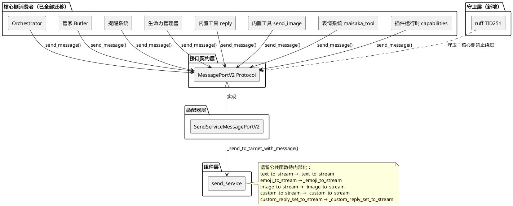
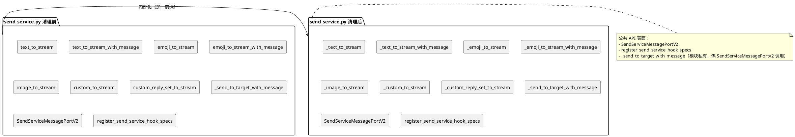
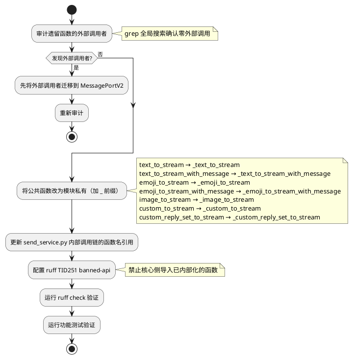
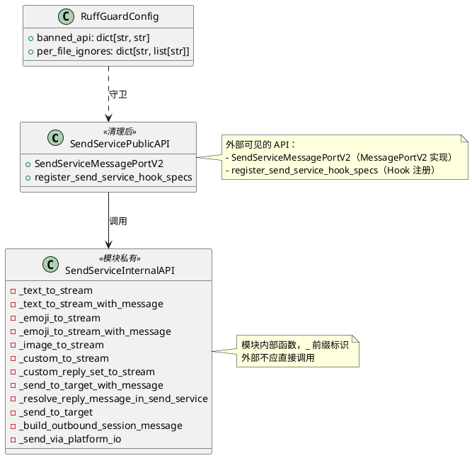

# 一、需求与存量功能关系分析

## 1.1 需求功能与存量功能对比

### 1.1.1 已实现功能

| 需求功能 | 存量功能 | 代码位置 | 匹配度 |
|---------|---------|---------|--------|
| MessagePortV2 统一发送接口 | `MessagePortV2` Protocol，单方法 `send_message(session_id, message, *, reply_to_id, agent_id, source) -> SendMessageResult` | `src/core/protocols.py:448-478` | 100% |
| SendServiceMessagePortV2 直通实现 | 直接调用 `_send_to_target_with_message`，消除桥接层 | `src/services/send_service.py:1330-1390` | 100% |
| Orchestrator 通过 MessagePortV2 发送 | 已迁移 | `src/core/orchestrator.py` | 100% |
| 管家通过 MessagePortV2 发送 | 已迁移 | `src/core/butler.py` | 100% |
| 提醒系统通过 MessagePortV2 发送 | 已迁移 | `src/core/reminder.py` | 100% |
| 生命力管理器通过 MessagePortV2 发送 | 已迁移 | `src/core/vitality_manager.py` | 100% |
| 内置工具 reply 通过 MessagePortV2 发送 | 已迁移 | `src/maisaka/builtin_tool/reply.py` | 100% |
| 内置工具 send_image 通过 MessagePortV2 发送 | 已迁移 | `src/maisaka/builtin_tool/send_image.py` | 100% |
| 表情系统通过 MessagePortV2 发送 | 已迁移 | `src/emoji_system/maisaka_tool.py` | 100% |
| 插件运行时 capabilities 通过 MessagePortV2 发送 | 已迁移 | `src/plugin_runtime/capabilities/core.py` | 100% |
| MessagePortV2 全局注册点 | `get_message_port_v2()` / `set_message_port_v2()` | `src/core/message_port_registry.py` | 100% |
| SendMessageResult 数据类 | `SendMessageResult(success, message_id, error)` + `ok()` / `failed()` 工厂方法 | `src/core/types.py` | 100% |

**关键发现**：所有核心侧消费者已 100% 迁移到 MessagePortV2。grep 验证确认 `src/core/` 和 `src/maisaka/` 中不存在 send_service 的直接导入（除 3 个豁免文件）。剩余工作是**清理 send_service 遗留公共函数**和**配置 ruff 守卫防止回潮**。

### 1.1.2 需要扩展的功能

| 需求功能 | 存量功能 | 差异说明 | 扩展方向 |
|---------|---------|---------|---------|
| send_service 遗留函数内部化 | `text_to_stream` 等 7 个公共函数仍为公共 API | 这些函数无外部调用者，但仍以公共函数暴露，存在被新代码误用的风险 | 将无外部调用者的公共函数改为模块私有（`_` 前缀），或标记为 deprecated |
| ruff 守卫规则 | 无 | 核心禁止项第5条"禁止核心绕过 MessagePort 直接调用 send_service"目前仅靠文档约定 | 与 ruff_guard_rules spec 协同，在 pyproject.toml 中配置 TID251 banned-api |

### 1.1.3 需要新增的功能或接口

**send_service 公共 API 收缩**：
- 将 `text_to_stream`、`text_to_stream_with_message`、`emoji_to_stream`、`emoji_to_stream_with_message`、`image_to_stream`、`custom_to_stream`、`custom_reply_set_to_stream` 改为模块私有
- 保留 `SendServiceMessagePortV2`、`register_send_service_hook_specs`、`_send_to_target_with_message`、`_resolve_reply_message_in_send_service` 为公共/内部 API

**ruff 守卫配置**（与 ruff_guard_rules spec 协同）：
- 在 pyproject.toml 中配置 TID251 banned-api 禁止核心侧导入 send_service 遗留函数

## 1.2 存量功能详细分析

### 1.2.1 send_service 遗留函数审计

**审计方法**：全局搜索每个函数名，确认调用者范围。

| 函数名 | 定义位置 | 外部调用者 | 内部调用者 | 清理策略 |
|--------|---------|-----------|-----------|---------|
| `text_to_stream` | `send_service.py:1090` | **无** | `text_to_stream_with_message`（被其调用，但 text_to_stream 本身是 text_to_stream_with_message 的 bool 包装） | 内部化 → `_text_to_stream` |
| `text_to_stream_with_message` | `send_service.py:1065` | **无** | 无 | 内部化 → `_text_to_stream_with_message` |
| `emoji_to_stream` | `send_service.py:1153` | **无** | `emoji_to_stream_with_message`（同上，bool 包装） | 内部化 → `_emoji_to_stream` |
| `emoji_to_stream_with_message` | `send_service.py:1131` | **无** | 无 | 内部化 → `_emoji_to_stream_with_message` |
| `image_to_stream` | `send_service.py:1188` | **无** | 无 | 内部化 → `_image_to_stream` |
| `custom_to_stream` | `send_service.py:1221` | **无** | 无 | 内部化 → `_custom_to_stream` |
| `custom_reply_set_to_stream` | `send_service.py:1264` | **无** | 无 | 内部化 → `_custom_reply_set_to_stream` |
| `_send_to_target_with_message` | `send_service.py:~980` | SendServiceMessagePortV2 | 多个遗留函数 | **保留**——SendServiceMessagePortV2 的核心调用目标 |
| `SendServiceMessagePortV2` | `send_service.py:1330` | message_port_registry.py、message_port.py | 无 | **保留**——MessagePortV2 的直通实现 |
| `register_send_service_hook_specs` | `send_service.py` | hook_catalog.py | 无 | **保留**——Hook 注册 |

**审计结论**：7 个遗留公共函数均无外部调用者，可安全内部化。

**内部调用链分析**：
```
text_to_stream → text_to_stream_with_message → _send_to_target_with_message
emoji_to_stream → emoji_to_stream_with_message → _send_to_target_with_message
image_to_stream → _send_to_target（旧路径，不走 _with_message）
custom_to_stream → _send_to_target（旧路径）
custom_reply_set_to_stream → _send_to_target（旧路径）
```

**约束**：
- `_send_to_target_with_message` 是 SendServiceMessagePortV2 的核心调用目标，不得修改其内部实现逻辑
- 遗留函数内部化后，send_service.py 内部的调用链不受影响（只是函数名加 `_` 前缀）
- `image_to_stream`、`custom_to_stream`、`custom_reply_set_to_stream` 调用的是 `_send_to_target`（旧路径），不是 `_send_to_target_with_message`

### 1.2.2 MessagePortV2 当前接口

**接口契约**：
- 签名：`async def send_message(self, session_id: str, message: MessageSequence, *, reply_to_id: str = "", agent_id: str = "", source: str = "core") -> SendMessageResult`
- 入参：session_id（目标会话）、message（MessageSequence 消息序列）、reply_to_id（被引用消息 ID）、agent_id（发言智能体）、source（来源标识）
- 出参：SendMessageResult(success, message_id, error)
- 异常：内部捕获所有异常，返回 SendMessageResult.failed()

**约束**：
- 方法签名不可变更（spec 4.5.1）
- MessageSequence 直传，不做 dict 序列化/反序列化
- 引用回复通过 reply_to_id 传递，找不到时降级为不引用

### 1.2.3 豁免文件清单

| 文件 | 导入内容 | 豁免原因 |
|------|---------|---------|
| `src/core/message_port_registry.py` | `SendServiceMessagePortV2` | MessagePortV2 注册点 |
| `src/maisaka/message_port.py` | `SendServiceMessagePortV2` | MessagePortV2 向后兼容重导出 |
| `src/plugin_runtime/hook_catalog.py` | `register_send_service_hook_specs` | Hook 注册 |
| `src/core/adapters/*` | send_service 公共 API | 适配器层 |

# 二、增量设计方案

## 2.1 实现模型

### 2.1.1 上下文视图



### 2.1.2 服务/组件总体架构



### 2.1.3 实现设计文档

#### 遗留函数清理流程



## 2.2 接口设计

### 2.2.1 总体设计

**接口分类**：本次设计不新增接口，只收缩 send_service 的公共 API 表面。

**公共 API 变更策略**：

| API | 变更前 | 变更后 | 理由 |
|-----|--------|--------|------|
| `text_to_stream` | 公共 | `_text_to_stream`（模块私有） | 无外部调用者 |
| `text_to_stream_with_message` | 公共 | `_text_to_stream_with_message`（模块私有） | 无外部调用者 |
| `emoji_to_stream` | 公共 | `_emoji_to_stream`（模块私有） | 无外部调用者 |
| `emoji_to_stream_with_message` | 公共 | `_emoji_to_stream_with_message`（模块私有） | 无外部调用者 |
| `image_to_stream` | 公共 | `_image_to_stream`（模块私有） | 无外部调用者 |
| `custom_to_stream` | 公共 | `_custom_to_stream`（模块私有） | 无外部调用者 |
| `custom_reply_set_to_stream` | 公共 | `_custom_reply_set_to_stream`（模块私有） | 无外部调用者 |
| `_send_to_target_with_message` | 模块私有 | 保留 | SendServiceMessagePortV2 核心调用目标 |
| `SendServiceMessagePortV2` | 公共 | 保留 | MessagePortV2 直通实现 |
| `register_send_service_hook_specs` | 公共 | 保留 | Hook 注册 |

### 2.2.2 接口清单

#### send_service 公共 API 收缩

**变更内容**：将 7 个遗留公共函数重命名为模块私有（加 `_` 前缀）

**业务说明**：这些函数在 MessagePortV2 迁移完成后已无外部调用者。内部化后，send_service 的公共 API 表面最小化为 `SendServiceMessagePortV2` + `register_send_service_hook_specs`。

**前置条件**：确认每个遗留函数确实无外部调用者（grep 验证通过）

**后置条件**：
- send_service.py 的公共 API 只包含 `SendServiceMessagePortV2`、`register_send_service_hook_specs`
- send_service.py 内部调用链的函数名引用同步更新
- ruff TID251 banned-api 配置禁止核心侧导入这些已内部化的函数

**异常映射**：若审计发现未预期的外部调用者，先迁移该调用者到 MessagePortV2，再内部化

#### ruff TID251 守卫配置

**变更内容**：在 pyproject.toml 中配置 TID251 banned-api，禁止核心侧导入 send_service 遗留函数

**业务说明**：与 ruff_guard_rules spec 协同。守卫规则覆盖核心禁止项第5条"禁止核心绕过 MessagePort 直接调用 send_service"。

**前置条件**：ruff >= 0.12.2，TID251 规则已启用

**后置条件**：核心侧新增 `from src.services.send_service import text_to_stream` 等 → ruff 报告 TID251 违规

**调用示例**：
```bash
# 本地验证
ruff check src/core/ src/maisaka/

# CI 验证
ruff check --output-format=github
```

## 2.3 数据模型

### 2.3.1 设计目标

1. **公共 API 最小化**：send_service 的公共 API 表面从 9 个函数/类缩减为 2 个（SendServiceMessagePortV2 + register_send_service_hook_specs）
2. **防止绕过回潮**：通过 ruff 守卫规则，核心侧新增代码无法直接调用 send_service 发送函数
3. **零功能回归**：内部化操作不影响任何现有功能

### 2.3.2 模型实现



**对象创建策略**：
- `SendServiceMessagePortV2` 通过 `get_message_port_v2()` 全局单例获取
- `register_send_service_hook_specs` 通过 `hook_catalog.py` 延迟导入调用

**持久化策略**：
- 无新增持久化需求
- 消息持久化由 `_store_sent_message` 处理，不受本次变更影响
