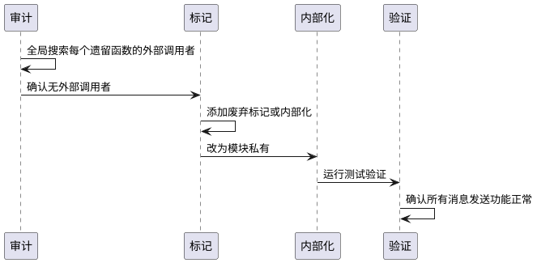
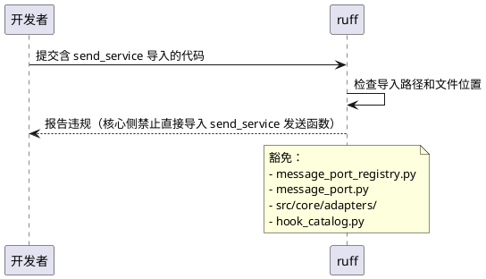
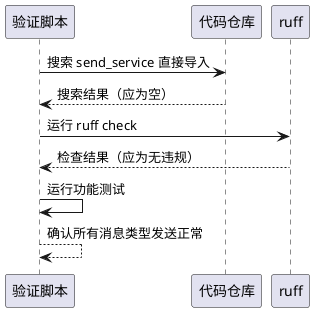

# **1. 组件定位**

## **1.1 核心职责**

本组件负责完成 MessagePortV2 的全面采用，消除 send_service 的遗留公共发送函数，并通过 ruff 守卫规则防止新的绕过，确保所有核心侧出站消息统一通过 MessagePortV2 接口发送。

## **1.2 核心输入**

1. **核心模块的发送请求**：Orchestrator、管家、提醒、生命力管理器通过 `get_message_port_v2()` 发出的文本消息（已走 MessagePortV2）
2. **内置工具的发送请求**：reply、send_image 工具通过 `get_message_port_v2()` 发出的各类消息（已走 MessagePortV2）
3. **插件运行时的发送请求**：`_cap_send_text`、`_cap_send_emoji`、`_cap_send_image`、`_cap_send_hybrid`、`_cap_send_forward`、`_cap_send_command`、`_cap_send_custom` 等 capability 通过 `get_message_port_v2()` 发出的各类消息（已走 MessagePortV2）
4. **表情系统的发送请求**：`emoji_system/maisaka_tool.py` 通过 `get_message_port_v2()` 发出的表情消息（已走 MessagePortV2）

## **1.3 核心输出**

1. **send_service 遗留函数清理**：废弃或移除不再被外部调用的 send_service 公共发送函数
2. **ruff 守卫规则**：防止核心侧新增 send_service 绕过（与 ruff_guard_rules spec 协同）
3. **完整性验证**：确认所有核心侧消费者均通过 MessagePortV2 发送消息

## **1.4 职责边界**

1. 本组件不负责 MessagePortV2 Protocol 接口的扩展（接口已完备，支持 MessageSequence 直传所有消息类型）
2. 本组件不负责消息接收和入站处理（那是 CoreMessage 的职责）
3. 本组件不负责消息内容生成（那是 ThinkingOrgan/Planner 的职责）
4. 本组件不负责平台 IO 路由决策（那是 send_service 内部的职责）
5. 本组件不负责 Hook 生命周期管理（那是 send_service 内部的 after_build_message/before_send/after_send 链路的职责）
6. 本组件不负责 send_service 内部函数的重构（只关注公共 API 的废弃/移除）

# **2. 领域术语**

**MessagePortV2**
: 核心消息端口 Protocol，定义统一的 `send_message()` 方法。所有核心模块和内置工具必须通过此接口发送消息，禁止直接依赖 send_service 的发送函数。

**SendServiceMessagePortV2**
: MessagePortV2 的直通实现，位于 `src/services/send_service.py`，直接调用 `_send_to_target_with_message`，消除桥接层和延迟导入。

**send_service 遗留函数**
: send_service 中不再被外部调用的公共发送函数，包括 `text_to_stream`、`text_to_stream_with_message`、`emoji_to_stream`、`emoji_to_stream_with_message`、`image_to_stream`、`custom_to_stream`、`custom_reply_set_to_stream`。这些函数在 MessagePortV2 迁移完成后已无外部消费者。

**消息绕过**
: 核心侧模块不通过 MessagePortV2 接口，直接调用 send_service 的发送函数发送消息的行为。这是架构违规，违反核心禁止项第5条。

**MessageSequence**
: 统一的消息组件序列，可包含 TextComponent、ImageComponent、EmojiComponent、ForwardNodeComponent 等任意组合。MessagePortV2 通过 MessageSequence 直传实现所有消息类型的统一发送。

# **3. 角色与边界**

## **3.1 核心角色**

- **Orchestrator**：通过 MessagePortV2 发送智能体回复文本消息（已迁移 ✅）
- **管家（Butler）**：通过 MessagePortV2 发送插话文本消息（已迁移 ✅）
- **提醒系统**：通过 MessagePortV2 发送提醒文本消息（已迁移 ✅）
- **生命力管理器**：通过 MessagePortV2 发送主动发言文本消息（已迁移 ✅）
- **内置工具 reply**：通过 MessagePortV2 发送带引用的回复消息（已迁移 ✅）
- **内置工具 send_image**：通过 MessagePortV2 发送图片消息（已迁移 ✅）
- **表情系统 maisaka_tool**：通过 MessagePortV2 发送表情消息（已迁移 ✅）
- **插件运行时 capabilities**：通过 MessagePortV2 发送各类消息（已迁移 ✅）

## **3.2 外部系统**

- **send_service**：底层发送服务，SendServiceMessagePortV2 是其唯一的核心侧调用入口
- **ruff 守卫规则**：防止新的 send_service 绕过（由 ruff_guard_rules spec 定义）
- **平台 IO 层**：消息最终投递的目标，由 send_service 内部路由，MessagePortV2 不直接交互

## **3.3 交互上下文**

```plantuml
@startuml
skinparam componentStyle rectangle

package "核心侧（已全部迁移）" {
    [Orchestrator] as orch
    [管家 Butler] as butler
    [提醒系统] as reminder
    [生命力管理器] as vitality
    [内置工具 reply] as reply_tool
    [内置工具 send_image] as image_tool
    [表情系统 maisaka_tool] as emoji_sys
    [插件运行时 capabilities] as plugin_cap
}

package "接口契约层" {
    [MessagePortV2 Protocol] as mp
}

package "适配器层" {
    [SendServiceMessagePortV2] as adapter
}

package "组件层" {
    [send_service] as ss
}

orch --> mp : send_message()
butler --> mp : send_message()
reminder --> mp : send_message()
vitality --> mp : send_message()
reply_tool --> mp : send_message()
image_tool --> mp : send_message()
emoji_sys --> mp : send_message()
plugin_cap --> mp : send_message()
mp <|.. adapter : 实现
adapter --> ss : _send_to_target_with_message()

note over ss : 遗留公共函数待清理：\ntext_to_stream / emoji_to_stream /\nimage_to_stream / custom_to_stream /\ncustom_reply_set_to_stream

@enduml
```

# **4. DFX约束**

## **4.1 性能**

1. MessagePortV2 的 `send_message()` 调用延迟不得超过之前直接调用 send_service 的延迟 +5%
2. SendServiceMessagePortV2 的直通实现不得引入额外的异步等待或阻塞操作

## **4.2 可靠性**

1. 遗留函数清理后，所有现有消息发送功能必须保持行为一致
2. 遗留函数的移除不得导致任何现有消费者发送失败
3. ruff 守卫规则必须能拦截所有已知的绕过模式

## **4.3 安全性**

1. MessagePortV2 的 `source` 参数必须保持追踪能力，所有消息必须携带来源标识
2. SendServiceMessagePortV2 不得暴露 send_service 的内部实现细节给核心模块

## **4.4 可维护性**

1. send_service 的公共 API 表面应最小化，只保留 SendServiceMessagePortV2 需要的内部函数
2. 遗留函数的废弃/移除必须有清晰的迁移路径文档

## **4.5 兼容性**

1. MessagePortV2 的 `send_message()` 方法签名不得变更
2. 插件运行时 capability 的外部 API 签名不变
3. 遗留函数的移除不得影响 send_service 内部的函数调用链

# **5. 核心能力**

## **5.1 send_service 遗留函数清理**

清理 send_service 中不再被外部调用的公共发送函数，缩小攻击面，防止新的绕过。

### **5.1.1 业务规则**

1. **外部调用者审计规则**：在清理前，必须确认每个遗留函数确实没有外部调用者
   a. 验收条件：[全局搜索 `text_to_stream` 的调用] → [仅在 send_service.py 内部有调用]
   a. 验收条件：[全局搜索 `emoji_to_stream` 的调用] → [仅在 send_service.py 内部有调用]
   a. 验收条件：[全局搜索 `image_to_stream` 的调用] → [仅在 send_service.py 内部有调用]
   a. 验收条件：[全局搜索 `custom_to_stream` 的调用] → [仅在 send_service.py 内部有调用]
   a. 验收条件：[全局搜索 `custom_reply_set_to_stream` 的调用] → [仅在 send_service.py 内部有调用]

2. **废弃标记规则**：对于仍有内部调用者的遗留函数，添加 `DeprecationWarning` 或文档注释标记为内部使用
   a. 验收条件：[遗留函数的文档字符串包含"内部使用"或"deprecated"标记] → [外部开发者知道不应直接调用]

3. **内部化规则**：将不再被外部调用的公共函数改为模块私有（加 `_` 前缀），或移至 SendServiceMessagePortV2 内部
   a. 验收条件：[send_service.py 的公共 API 只包含 `SendServiceMessagePortV2`、`register_send_service_hook_specs` 和必要的内部函数] → [公共 API 表面最小化]

4. **禁止项**：不得在清理过程中修改 `_send_to_target_with_message` 的内部实现逻辑
   a. 验收条件：[_send_to_target_with_message 的发送行为与清理前完全一致]

### **5.1.2 交互流程**



### **5.1.3 异常场景**

1. **发现未预期的外部调用者**
   a. 触发条件：审计时发现某个遗留函数仍被外部模块调用
   b. 系统行为：先将外部调用者迁移到 MessagePortV2，再清理遗留函数
   c. 用户感知：相关模块的发送行为不变

2. **遗留函数被 send_service 内部链路依赖**
   a. 触发条件：`text_to_stream` 被 `_send_to_target` 内部调用
   b. 系统行为：保留内部调用链，但将公共函数改为模块私有
   c. 用户感知：send_service 内部行为不变

## **5.2 MessagePortV2 绕过守卫**

通过 ruff 守卫规则，防止核心侧新增对 send_service 发送函数的直接导入。

### **5.2.1 业务规则**

1. **核心侧 send_service 导入禁止规则**：`src/core/` 和 `src/maisaka/` 内部模块禁止导入 send_service 的发送函数（`text_to_stream`、`emoji_to_stream`、`image_to_stream`、`custom_to_stream`、`custom_reply_set_to_stream`、`_send_to_target_with_message`）
   a. 验收条件：[在 `src/core/` 中新增 `from src.services.send_service import text_to_stream`] → [ruff check 报告违规]

2. **注册点和适配器层豁免**：`src/core/message_port_registry.py`、`src/maisaka/message_port.py`、`src/core/adapters/` 允许导入 `SendServiceMessagePortV2`
   a. 验收条件：[在 `src/core/message_port_registry.py` 中导入 `SendServiceMessagePortV2`] → [ruff check 不报告违规]

3. **Hook 注册豁免**：`src/plugin_runtime/hook_catalog.py` 允许导入 `register_send_service_hook_specs`
   a. 验收条件：[在 `src/plugin_runtime/hook_catalog.py` 中导入 `register_send_service_hook_specs`] → [ruff check 不报告违规]

4. **禁止项**：核心侧模块不得通过延迟导入（函数体内 import）绕过守卫规则
   a. 验收条件：[在 `src/maisaka/builtin_tool/reply.py` 中新增函数体内 `from src.services.send_service import ...`] → [ruff check 报告违规]

### **5.2.2 交互流程**



### **5.2.3 异常场景**

1. **新增 MessagePortV2 注册点**
   a. 触发条件：需要新增注册点文件导入 SendServiceMessagePortV2
   b. 系统行为：在 ruff 配置的白名单中添加新文件路径
   c. 用户感知：更新 pyproject.toml 配置

## **5.3 迁移完整性验证**

确认所有核心侧消费者均通过 MessagePortV2 发送消息，不存在 send_service 绕过。

### **5.3.1 业务规则**

1. **零绕过验证规则**：`src/core/` 和 `src/maisaka/` 中不得存在对 send_service 发送函数的直接导入
   a. 验收条件：[在 `src/core/` 和 `src/maisaka/` 中搜索 `from src.services.send_service import`（排除豁免文件）] → [无匹配结果]

2. **零绕过验证规则（间接导入）**：`src/core/` 和 `src/maisaka/` 中不得存在对 send_service 模块的直接导入后调用发送函数
   a. 验收条件：[在 `src/core/` 和 `src/maisaka/` 中搜索 `from src.services import send_service`（排除豁免文件）] → [无匹配结果]

3. **功能回归验证规则**：迁移完成后，所有消息类型的发送功能必须正常
   a. 验收条件：[reply 工具发送多段回复（含引用）] → [正常]
   a. 验收条件：[send_image 工具发送图片] → [正常]
   a. 验收条件：[表情系统发送表情] → [正常]
   a. 验收条件：[插件运行时发送文本/图片/表情/混合/转发/命令/自定义消息] → [正常]
   a. 验收条件：[管家插话] → [正常]
   a. 验收条件：[提醒发送] → [正常]
   a. 验收条件：[生命力主动发言] → [正常]

4. **禁止项**：不得在验证过程中修改 MessagePortV2 的 `send_message()` 方法签名
   a. 验收条件：[MessagePortV2 Protocol 的 `send_message()` 签名与验证前一致]

### **5.3.2 交互流程**



### **5.3.3 异常场景**

1. **发现未迁移的调用者**
   a. 触发条件：验证时发现某个核心侧文件仍直接调用 send_service
   b. 系统行为：先将该文件迁移到 MessagePortV2，再重新验证
   c. 用户感知：相关模块的发送行为不变

2. **功能回归**
   a. 触发条件：验证时发现某种消息类型的发送失败率上升
   b. 系统行为：回滚相关变更，排查根因
   c. 用户感知：发送功能恢复正常

# **6. 数据约束**

## **6.1 MessagePortV2 接口**

1. **方法签名**：`async def send_message(self, session_id: str, message: MessageSequence, *, reply_to_id: str = "", agent_id: str = "", source: str = "core") -> SendMessageResult`
2. **返回类型**：`SendMessageResult(success: bool, message_id: str = "", error: str = "")`
3. **消息类型支持**：通过 MessageSequence 的 components 支持所有消息类型（TextComponent、ImageComponent、EmojiComponent、ForwardNodeComponent 等）

## **6.2 send_service 遗留函数清单**

| 函数名 | 当前状态 | 目标状态 | 备注 |
|--------|---------|---------|------|
| `text_to_stream` | 公共函数 | 废弃/内部化 | 无外部调用者 |
| `text_to_stream_with_message` | 公共函数 | 废弃/内部化 | 无外部调用者 |
| `emoji_to_stream` | 公共函数 | 废弃/内部化 | 无外部调用者 |
| `emoji_to_stream_with_message` | 公共函数 | 废弃/内部化 | 无外部调用者 |
| `image_to_stream` | 公共函数 | 废弃/内部化 | 无外部调用者 |
| `custom_to_stream` | 公共函数 | 废弃/内部化 | 无外部调用者 |
| `custom_reply_set_to_stream` | 公共函数 | 废弃/内部化 | 无外部调用者 |
| `_send_to_target_with_message` | 模块私有 | 保留 | SendServiceMessagePortV2 的核心调用目标 |
| `SendServiceMessagePortV2` | 公共类 | 保留 | MessagePortV2 的直通实现 |
| `register_send_service_hook_specs` | 公共函数 | 保留 | Hook 注册 |

## **6.3 ruff 守卫规则豁免清单**

| 文件路径 | 允许导入 | 豁免原因 |
|---------|---------|---------|
| `src/core/message_port_registry.py` | `SendServiceMessagePortV2` | MessagePortV2 注册点 |
| `src/maisaka/message_port.py` | `SendServiceMessagePortV2` | MessagePortV2 注册点 |
| `src/core/adapters/*` | send_service 公共 API | 适配器层 |
| `src/plugin_runtime/hook_catalog.py` | `register_send_service_hook_specs` | Hook 注册 |
