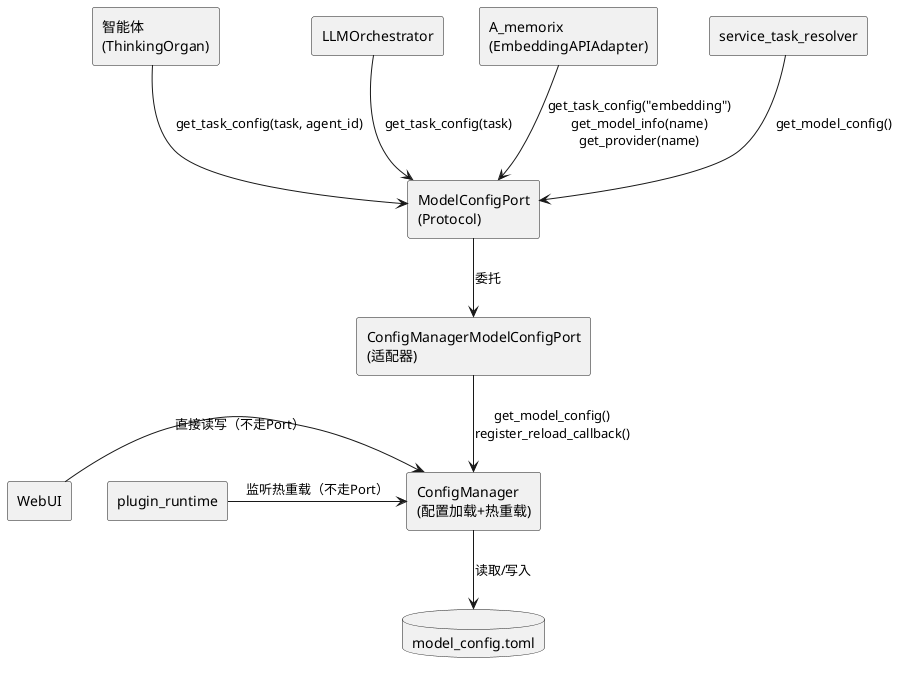
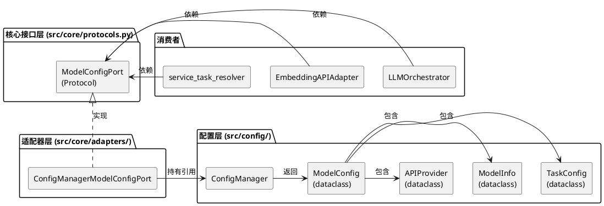
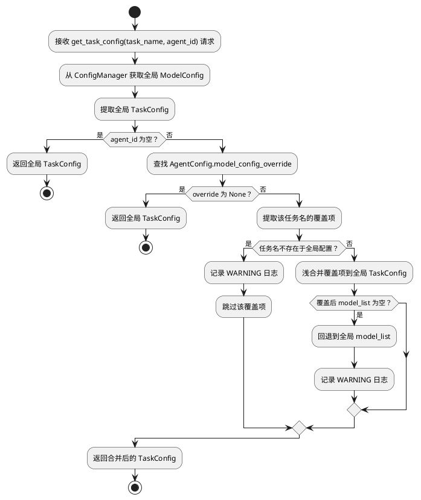
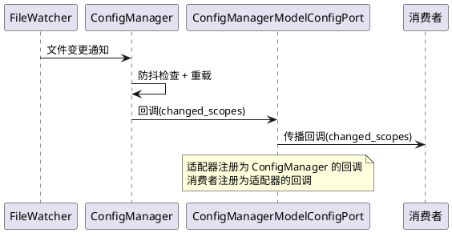
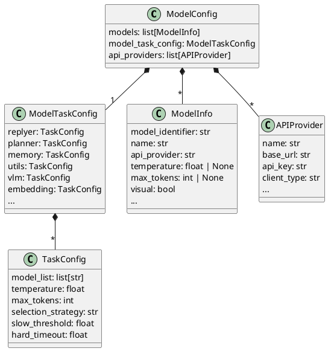
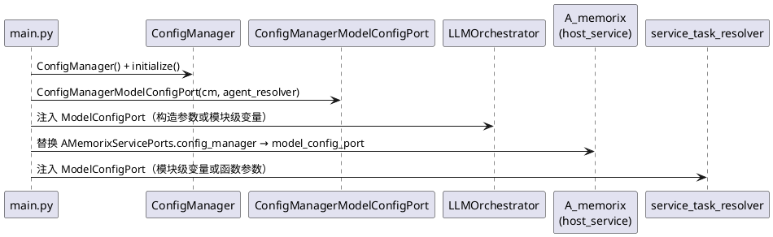

# 一、需求与存量功能关系分析

## 1.1 需求功能与存量功能对比

### 1.1.1 已实现功能

| 需求功能 | 存量功能 | 代码位置 | 匹配度 |
|---------|---------|---------|--------|
| 模型配置加载与校验 | ConfigManager.initialize() + ModelConfig.model_post_init() | `src/config/config.py:279-292`, `src/config/config.py:186-215` | 100% |
| 任务配置查询（按任务名） | ConfigManager.get_model_config().model_task_config + getattr | `src/config/config.py:317-320`, `src/llm_models/utils_model.py:111-133` | 100% |
| 模型信息查询（按模型名） | 遍历 ModelConfig.models 列表 | `src/A_memorix/core/embedding/api_adapter.py:87-92` | 100% |
| 提供商查询（按提供商名） | 遍历 ModelConfig.api_providers 列表 | `src/A_memorix/core/embedding/api_adapter.py:94-99` | 100% |
| 热重载机制 | ConfigManager.reload_config() + FileWatcher + 回调注册 | `src/config/config.py:435-486`, `src/config/config.py:488-550` | 100% |
| 热重载回调注册/注销 | ConfigManager.register_reload_callback() / unregister_reload_callback() | `src/config/config.py:322-342` | 100% |
| 模块级配置代理（热重载后自动更新） | _ConfigProxy + model_config / global_config 模块变量 | `src/config/config.py:730-756` | 100% |
| AgentConfig.model_config_override 字段声明 | AgentConfig.model_config_override: Optional[dict[str, object]] | `src/maisaka/agent/config.py:212` | 100% |

### 1.1.2 需要扩展的功能

| 需求功能 | 存量功能 | 差异说明 | 扩展方向 |
|---------|---------|---------|---------|
| ModelConfigPort Protocol 接口定义 | 无 Protocol，消费者直接导入 config_manager | 当前 122 处直接导入 `from src.config.config import config_manager`，无接口隔离层 | 新增 Protocol 定义于 `src/core/protocols.py`，4 个查询方法 |
| ConfigManagerModelConfigPort 适配器 | 无适配器，消费者直接持有 ConfigManager 引用 | LLMOrchestrator、service_task_resolver、EmbeddingAPIAdapter 均直接调用 config_manager | 新增适配器于 `src/core/adapters/model_config_port.py`，委托 ConfigManager |
| 智能体级配置覆盖合并 | AgentConfig.model_config_override 字段已声明但无消费逻辑 | 字段存在（`src/maisaka/agent/config.py:212`），但 LLMOrchestrator._get_task_config_or_raise() 只读全局配置（`src/llm_models/utils_model.py:123`），无合并 | 适配器内实现浅合并算法，get_task_config 增加 agent_id 参数 |
| A_memorix 配置依赖隔离 | AMemorixServicePorts.config_manager: Any 注入整个 ConfigManager | EmbeddingAPIAdapter 通过 self._config_manager.get_model_config() 消费（`src/A_memorix/core/embedding/api_adapter.py:85-99`），summary_importer 也依赖 config_manager（`src/A_memorix/core/utils/summary_importer.py:291`） | AMemorixServicePorts.config_manager → model_config_port: ModelConfigPort，EmbeddingAPIAdapter 构造参数替换 |
| ruff TID251 守卫封堵旧导入 | 当前 TID251 仅守卫 A_memorix 和 adapters 目录 | `src/llm_models/` 和 `src/services/` 中 9 处 config_manager 导入未被守卫 | pyproject.toml 新增 banned-api 规则 + per-file-ignores 扩展 |

### 1.1.3 需要新增的功能或接口

**模块：核心接口层**
- `ModelConfigPort` Protocol：4 个查询方法（get_task_config / get_model_info / get_provider / get_model_config）
- 热重载回调注册方法：`register_reload_callback(callback)` / `unregister_reload_callback(callback)`

**模块：适配器层**
- `ConfigManagerModelConfigPort` 适配器：实现 ModelConfigPort，持有 ConfigManager 引用，实现智能体级配置合并

**模块：依赖注入**
- main.py 启动流程中创建适配器并注入到消费者

**模块：ruff 守卫**
- `src.config.config.config_manager` banned-api 规则
- `src.config.config.model_config` banned-api 规则
- per-file-ignores 扩展（适配器 + main.py 允许导入）

## 1.2 存量功能详细分析

### ConfigManager（`src/config/config.py:259-550`）

**接口契约**：
- `initialize()` → 加载 bot_config.toml + model_config.toml，校验后赋值 self.global_config / self.model_config
- `get_model_config()` → 返回 ModelConfig 实例，未初始化时抛出 RuntimeError
- `get_global_config()` → 返回 Config 实例，未初始化时抛出 RuntimeError
- `register_reload_callback(callback)` → 注册热重载回调，回调签名支持无参或接收 Sequence[str]
- `unregister_reload_callback(callback)` → 注销回调
- `reload_config(changed_scopes)` → 异步重载，防抖+超时保护，成功后遍历回调

**业务规则**：
- 热重载防抖：最小间隔 1s，超时 20s
- 回调兼容：自动检测回调签名，支持有参/无参两种
- 失败保护：重载异常时保留旧配置，不替换为 None
- 文件监听：FileWatcher 订阅 bot_config.toml + model_config.toml

**约束**：
- 模块级单例：`config_manager = ConfigManager()` 在 import 时即初始化
- _ConfigProxy 代理：`model_config` / `global_config` 模块变量通过代理自动跟踪热重载
- 线程安全：asyncio.Lock 保护重载过程

### LLMOrchestrator（`src/llm_models/utils_model.py:86-147`）

**接口契约**：
- `__init__(task_name, request_type, session_id)` → 初始化时通过 config_manager.get_model_config() 拉取全局配置
- `_get_task_config_or_raise()` → getattr(model_task_config, self.task_name)，空 model_list 时按 EMPTY_TASK_FALLBACKS 回退
- `_refresh_task_config()` → 每次请求前刷新，同步 model_usage 字典

**业务规则**：
- EMPTY_TASK_FALLBACKS：expression_use→utils, learner→utils, mid_memory→planner
- 每次请求前调用 _refresh_task_config()，实时感知热重载

**约束**：
- 直接导入 config_manager（`src/llm_models/utils_model.py:20`），违反组件兼容核心原则
- 不支持智能体级配置覆盖

### AMemorixServicePorts（`src/A_memorix/core/ports.py:14-49`）

**接口契约**：
- `config_manager: Any = None` → 注入整个 ConfigManager 实例
- `require_config_manager()` → 断言非 None，否则 RuntimeError

**约束**：
- config_manager 字段类型为 Any，无类型安全保证
- A_memorix/core/ 内部通过此端口访问 config_manager.get_model_config()（EmbeddingAPIAdapter 3 处、summary_importer 1 处、kernel_initializer 2 处）

### EmbeddingAPIAdapter（`src/A_memorix/core/embedding/api_adapter.py:28-100`）

**接口契约**：
- `__init__(..., config_manager, client_registry, embedding_request_cls, network_connection_error_cls)` → 接收注入的外部依赖
- `_get_current_model_config()` → self._config_manager.get_model_config()
- `_find_model_info(model_name)` → 遍历 model_cfg.models
- `_find_provider(provider_name)` → 遍历 model_cfg.api_providers
- `_resolve_candidate_model_names()` → 从 embedding 任务配置获取候选模型列表

**约束**：
- 持有 config_manager 引用，每次查询都调用 get_model_config()
- 无 ModelConfigPort 隔离，直接依赖 ConfigManager 的方法签名

### service_task_resolver（`src/services/service_task_resolver.py:1-108`）

**接口契约**：
- `get_available_models()` → config_manager.get_model_config().model_task_config，遍历属性收集 TaskConfig
- `resolve_task_name(task_name)` → 解析任务名，不存在时 ValueError
- `resolve_task_name_from_model_config(model_config, preferred_task_name)` → 旧版兼容，按 model_list 近似映射

**约束**：
- 直接导入 config_manager（`src/services/service_task_resolver.py:6`）
- 使用 getattr + isinstance 反射遍历 ModelTaskConfig 属性

### AgentConfig.model_config_override（`src/maisaka/agent/config.py:212`）

**接口契约**：
- `model_config_override: Optional[dict[str, object]] = None` → 字段已声明，类型为任务名→覆盖字段字典

**约束**：
- 字段存在但零消费逻辑，当前无任何代码读取此字段
- 类型为 dict[str, object]，值类型不精确，需要运行时校验

# 二、增量设计方案

## 2.1 实现模型

### 2.1.1 上下文视图



**通信协议**：
- 消费者 → ModelConfigPort：同步方法调用，纯内存读取，≤1ms
- 适配器 → ConfigManager：同步方法调用，委托查询
- ConfigManager → toml：文件 IO（仅热重载时）
- 热重载回调：ConfigManager → 适配器 → 消费者（异步通知）

### 2.1.2 服务/组件总体架构



**核心类职责**：

| 类 | 职责 | 位置 |
|---|---|---|
| ModelConfigPort | Protocol 接口，定义模型配置查询契约 | `src/core/protocols.py` |
| ConfigManagerModelConfigPort | 适配器，委托 ConfigManager，实现智能体级配置合并 | `src/core/adapters/model_config_port.py` |
| ConfigManager | 配置加载、校验、热重载（存量不变） | `src/config/config.py` |

### 2.1.3 实现设计文档

#### 智能体级配置合并流程



**合并算法（浅合并）**：
1. 以全局 TaskConfig 为基准，deepcopy 一份
2. 遍历 override 字典中的每个字段
3. 类型校验：覆盖值类型与 TaskConfig 字段类型不兼容时跳过并记录 WARNING
4. 直接替换：`merged_task.field = override_value`（不做递归合并）
5. model_list 空保护：合并后 model_list 为空列表时回退到全局

**设计理由**：
- 浅合并而非深合并：TaskConfig 是扁平结构，无嵌套字典需要递归处理
- 跳过而非报错：覆盖项来自用户配置，一个字段出错不应阻断整个覆盖
- model_list 空保护：这是唯一会导致任务不可用的覆盖结果，必须回退

#### 热重载回调传播流程



**设计理由**：
- 适配器作为回调中继：消费者只依赖 ModelConfigPort，不感知 ConfigManager
- 回调签名透传：适配器注册到 ConfigManager 的回调签名与消费者注册到适配器的一致
- 智能体覆盖缓存无需失效：每次 get_task_config 都实时合并，无缓存状态

## 2.2 接口设计

### 2.2.1 总体设计

| 接口 | 分类 | 稳定性 | 说明 |
|------|------|--------|------|
| get_task_config | 查询 | 稳定 | 核心查询接口，支持智能体级覆盖 |
| get_model_info | 查询 | 稳定 | 按模型名查询模型元信息 |
| get_provider | 查询 | 稳定 | 按提供商名查询提供商配置 |
| get_model_config | 查询 | 稳定 | 获取完整模型配置（仅限需要全量配置的场景） |
| register_reload_callback | 回调 | 稳定 | 注册热重载回调 |
| unregister_reload_callback | 回调 | 稳定 | 注销热重载回调 |

**接口变更策略**：ModelConfigPort 一旦定义，方法签名在过渡期保持稳定。新增查询需求通过新增方法扩展，不修改现有方法签名。

### 2.2.2 接口清单

#### ModelConfigPort Protocol

```python
@runtime_checkable
class ModelConfigPort(Protocol):
    """模型配置查询接口 — 核心通过此接口查询模型配置，不直接依赖 ConfigManager。"""

    def get_task_config(self, task_name: str, *, agent_id: str = "") -> TaskConfig:
        """按任务名查询任务配置，支持智能体级覆盖。

        Args:
            task_name: 任务配置名称（replyer/planner/memory/utils/vlm/embedding 等）
            agent_id: 智能体 ID，非空时应用该智能体的 model_config_override

        Returns:
            TaskConfig 实例（全局配置或智能体覆盖后的配置）

        Raises:
            ValueError: 任务名不存在时
            RuntimeError: 配置未初始化时
        """

    def get_model_info(self, model_name: str) -> ModelInfo:
        """按模型名查询模型信息。

        Args:
            model_name: 模型名称（对应 ModelInfo.name）

        Returns:
            ModelInfo 实例

        Raises:
            ValueError: 模型名不存在时
            RuntimeError: 配置未初始化时
        """

    def get_provider(self, provider_name: str) -> APIProvider:
        """按提供商名查询提供商配置。

        Args:
            provider_name: 提供商名称（对应 APIProvider.name）

        Returns:
            APIProvider 实例

        Raises:
            ValueError: 提供商名不存在时
            RuntimeError: 配置未初始化时
        """

    def get_model_config(self) -> ModelConfig:
        """获取完整模型配置。

        Returns:
            ModelConfig 实例（全局配置，不含智能体覆盖）

        Raises:
            RuntimeError: 配置未初始化时
        """

    def register_reload_callback(self, callback: Callable[[Sequence[str]], object] | Callable[[], object]) -> None:
        """注册配置热重载回调。

        Args:
            callback: 回调函数，支持无参或接收 Sequence[str] 类型的变更范围
        """

    def unregister_reload_callback(self, callback: Callable[[Sequence[str]], object] | Callable[[], object]) -> None:
        """注销配置热重载回调。

        Args:
            callback: 先前注册过的回调对象
        """
```

**前置条件**：
- ConfigManager.initialize() 已完成
- 适配器已持有有效的 ConfigManager 实例

**后置条件**：
- get_task_config：返回的 TaskConfig 是新构造的实例（deepcopy），调用方修改不影响全局
- register_reload_callback：回调在 model_config.toml 热重载成功后被调用

**异常映射**：

| 业务异常 | 错误类型 | 消息模板 |
|---------|---------|---------|
| 任务名不存在 | ValueError | `未找到名为 '{task_name}' 的任务配置，可用任务: {available}` |
| 模型名不存在 | ValueError | `未找到名为 '{model_name}' 的模型` |
| 提供商名不存在 | ValueError | `未找到名为 '{provider_name}' 的提供商` |
| 配置未初始化 | RuntimeError | `模型配置未初始化` |

#### ConfigManagerModelConfigPort 适配器

```python
class ConfigManagerModelConfigPort:
    """ModelConfigPort 适配器 — 委托 ConfigManager，实现智能体级配置合并。"""

    def __init__(self, config_manager: ConfigManager, agent_config_resolver: Callable[[str], AgentConfig | None]) -> None:
        """初始化适配器。

        Args:
            config_manager: ConfigManager 实例
            agent_config_resolver: 根据 agent_id 解析 AgentConfig 的回调
        """
```

**设计决策**：
- `agent_config_resolver` 回调而非直接依赖 AgentRegistry：避免适配器层反向依赖 maisaka 模块，保持适配器层薄且单向
- resolver 由 main.py 注入，实现为 `lambda aid: agent_registry.get(aid)` 的简单查找

**智能体覆盖合并实现要点**：
1. 从 agent_config_resolver(agent_id) 获取 AgentConfig
2. 若 AgentConfig.model_config_override 为 None，直接返回全局 TaskConfig
3. 提取 override[task_name]，若任务名不存在于全局 ModelTaskConfig 则跳过
4. 对全局 TaskConfig 做 deepcopy，然后逐字段浅合并
5. 类型校验：使用 TaskConfig 的 model_fields 做类型检查，不兼容时跳过
6. model_list 空保护：合并后 model_list 为空时回退到全局

## 2.3 数据模型

### 2.3.1 设计目标

1. 支持智能体级差异化模型配置，不同智能体可使用不同的模型/温度/max_tokens
2. 配置查询性能 ≤1ms（纯内存，无 IO）
3. 热重载后智能体覆盖基于最新全局配置重新合并
4. 与存量 ModelConfig/TaskConfig/ModelInfo/APIProvider 数据模型完全兼容

### 2.3.2 模型实现

**存量数据模型（不变）**：



**新增数据流（无新数据模型）**：

智能体级配置合并不引入新的持久化模型，而是运行时动态计算：
- 输入：全局 TaskConfig + AgentConfig.model_config_override
- 输出：合并后的 TaskConfig（deepcopy 副本）
- 生命周期：每次查询时实时计算，无缓存

**设计理由**：
- 不缓存合并结果：热重载后全局配置变化，缓存需要失效管理，增加复杂度
- 实时计算成本极低：deepcopy + 浅合并 < 0.1ms，13 个智能体并发查询无锁竞争
- 零开箱抽象：不为尚未出现的"配置版本管理"需求预制缓存层

## 2.4 依赖注入方案

### 2.4.1 注入链路



### 2.4.2 注入点设计

| 消费者 | 当前获取方式 | 迁移后获取方式 | 注入点 |
|--------|------------|--------------|--------|
| LLMOrchestrator | `from src.config.config import config_manager` | 构造参数 `model_config_port: ModelConfigPort` | `__init__` 参数 |
| service_task_resolver | `from src.config.config import config_manager` | 模块级变量 `_model_config_port` + setter | `set_model_config_port()` |
| EmbeddingAPIAdapter | 通过 AMemorixServicePorts.config_manager | 构造参数 `model_config_port: ModelConfigPort` | AMemorixServicePorts.model_config_port |
| kernel_initializer | kernel._ports.config_manager | kernel._ports.model_config_port | AMemorixServicePorts.model_config_port |
| summary_importer | kernel._ports.config_manager | kernel._ports.model_config_port | AMemorixServicePorts.model_config_port |

**LLMOrchestrator 注入细节**：
- LLMOrchestrator 当前在 `__init__` 中通过 `config_manager.get_model_config()` 拉取配置
- 迁移后：`__init__(task_name, request_type, session_id, model_config_port: ModelConfigPort)`
- `_get_task_config_or_raise()` 改为 `self._model_config_port.get_task_config(self.task_name)`
- 调用方（ThinkingOrgan、replyer 等）在构造 LLMOrchestrator 时传入 ModelConfigPort

**service_task_resolver 注入细节**：
- 当前是模块级函数，直接导入 config_manager
- 迁移后：模块级变量 `_model_config_port: ModelConfigPort | None = None` + `set_model_config_port(port)` setter
- `get_available_models()` 改为 `if _model_config_port is None: raise RuntimeError(...)`
- main.py 启动时调用 `set_model_config_port(adapter)`

**A_memorix 注入细节**：
- AMemorixServicePorts 新增 `model_config_port: ModelConfigPort | None = None` 字段
- 保留 `config_manager: Any = None` 字段（过渡期兼容，kernel_initializer 仍需 get_global_config()）
- host_service._build_service_ports() 新增 `model_config_port=adapter` 参数
- EmbeddingAPIAdapter 构造参数 `config_manager` → `model_config_port: ModelConfigPort`
- EmbeddingAPIAdapter 内部 `self._config_manager.get_model_config()` → `self._model_config_port.get_model_config()`

## 2.5 迁移阶段设计

### 阶段 1：Protocol 定义 + 适配器实现（零风险引入）

**改动范围**：
1. `src/core/protocols.py`：新增 ModelConfigPort Protocol
2. `src/core/adapters/model_config_port.py`：新增 ConfigManagerModelConfigPort 适配器
3. `src/main.py`：创建适配器实例（暂不注入，仅验证可创建）

**验证标准**：
- [x] ModelConfigPort Protocol 可被 runtime_checkable 检查
- [x] ConfigManagerModelConfigPort 实现所有 Protocol 方法
- [x] 适配器构造后 get_task_config("replyer") 返回正确 TaskConfig
- [x] 适配器构造后 get_model_info / get_provider 返回正确实例
- [x] 现有系统无任何行为变化（新代码仅定义，未接入）

### 阶段 2：核心消费者迁移（LLMOrchestrator + service_task_resolver）

**改动范围**：
1. `src/llm_models/utils_model.py`：
   - LLMOrchestrator.__init__ 新增 `model_config_port` 参数
   - `_get_task_config_or_raise()` 改用 `self._model_config_port.get_task_config()`
   - `_refresh_task_config()` 同步修改
   - 删除 `from src.config.config import config_manager`
2. `src/services/service_task_resolver.py`：
   - 新增 `_model_config_port` 模块变量 + setter
   - `get_available_models()` 改用 `_model_config_port.get_model_config()`
   - 删除 `from src.config.config import config_manager`
3. `src/llm_models/model_client/base_client.py`：
   - `clear_client_instance_cache` 回调改注册到 ModelConfigPort
4. `src/llm_models/model_client/__init__.py`：
   - `ensure_configured_clients_loaded` 改用 ModelConfigPort
5. `src/main.py`：创建适配器并注入到消费者

**验证标准**：
- [x] LLMOrchestrator 不再直接导入 config_manager
- [x] service_task_resolver 不再直接导入 config_manager
- [x] 所有 LLM 请求功能正常（replyer/planner/utils/vlm/embedding）
- [x] 热重载后 LLMOrchestrator 实时感知配置变更
- [x] 现有测试全部通过

### 阶段 3：A_memorix 迁移（替换 AMemorixServicePorts.config_manager）

**改动范围**：
1. `src/A_memorix/core/ports.py`：
   - 新增 `model_config_port: ModelConfigPort | None = None` 字段
   - 新增 `require_model_config_port()` 方法
   - 保留 `config_manager` 字段（kernel_initializer 仍需 get_global_config()）
2. `src/A_memorix/core/embedding/api_adapter.py`：
   - 构造参数 `config_manager` → `model_config_port: ModelConfigPort`
   - `_get_current_model_config()` → `self._model_config_port.get_model_config()`
   - `_find_model_info()` → `self._model_config_port.get_model_info()`
   - `_find_provider()` → `self._model_config_port.get_provider()`
3. `src/A_memorix/core/utils/summary_importer.py`：
   - `config_manager` 参数 → `model_config_port: ModelConfigPort`
   - 内部调用改用 ModelConfigPort 方法
4. `src/A_memorix/core/runtime/services/kernel_initializer.py`：
   - EmbeddingAPIAdapter 构造改用 `model_config_port=kernel._ports.model_config_port`
5. `src/A_memorix/host_service.py`：
   - `_build_service_ports()` 新增 `model_config_port=adapter`
6. `src/main.py`：将适配器传入 host_service

**验证标准**：
- [x] `src/A_memorix/core/` 内部零 `config_manager.get_model_config()` 调用
- [x] EmbeddingAPIAdapter 通过 ModelConfigPort 获取 embedding 配置
- [x] 嵌入维度检测正常
- [x] 记忆写入/检索功能正常
- [x] 现有测试全部通过

### 阶段 4：ruff TID251 守卫封堵旧导入

**改动范围**：
1. `pyproject.toml`：
   - 新增 banned-api：`"src.config.config.config_manager"` + 提示消息
   - 新增 banned-api：`"src.config.config.model_config"` + 提示消息
   - per-file-ignores 扩展：适配器文件 + main.py 允许 TID251
2. 清理剩余的 `from src.config.config import config_manager` 导入（WebUI、emoji、visual 等外围模块）
3. 更新 AGENTS.md 核心接口层表格和核心禁止项

**验证标准**：
- [x] `ruff check src/llm_models src/services src/A_memorix/core` 零 TID251 违规
- [x] `ruff check src/` 对 config_manager/model_config 的 banned-api 报错正确
- [x] 适配器文件和 main.py 的 per-file-ignores 生效
- [x] 现有测试全部通过

## 2.6 热重载回调机制设计

### 回调链路

```
FileWatcher → ConfigManager._handle_file_changes()
            → ConfigManager.reload_config()
            → ConfigManager._invoke_reload_callback(adapter_callback)
            → ConfigManagerModelConfigPort._on_config_reloaded(changed_scopes)
            → 消费者回调(consumer_callback, changed_scopes)
```

### 适配器回调管理

ConfigManagerModelConfigPort 内部维护 `_reload_callbacks: list[ConfigReloadCallback]`，与 ConfigManager 的回调机制对齐：

- `register_reload_callback(callback)`：追加到 `_reload_callbacks`
- `unregister_reload_callback(callback)`：从 `_reload_callbacks` 移除
- 适配器自身注册为 ConfigManager 的回调，在收到通知后遍历 `_reload_callbacks` 传播

### 智能体覆盖与热重载

热重载后智能体覆盖自动生效，无需额外机制：
- 每次调用 `get_task_config(task_name, agent_id=xxx)` 时实时合并
- 全局配置已更新，合并基于最新的全局 TaskConfig
- 无缓存，无需失效

## 2.7 A_memorix 迁移方案

### AMemorixServicePorts 演进

**过渡期**（阶段 3 完成前）：
```python
@dataclass
class AMemorixServicePorts:
    llm_service: Any = None
    message_service: Any = None
    config_manager: Any = None          # 保留，kernel_initializer 仍需 get_global_config()
    model_config_port: ModelConfigPort | None = None  # 新增
    db_session_factory: Callable[..., Any] | None = None
    ...
```

**最终状态**（所有 config_manager 消费点迁移完成后）：
```python
@dataclass
class AMemorixServicePorts:
    llm_service: Any = None
    message_service: Any = None
    config_manager: Any = None          # 保留，A_memorix 仍需 get_global_config() 读取 a_memorix 配置段
    model_config_port: ModelConfigPort | None = None  # 替代 config_manager 的模型配置查询
    db_session_factory: Callable[..., Any] | None = None
    ...
```

**设计理由**：
- `config_manager` 保留而非删除：A_memorix 的 host_service._read_config() 仍需通过 config_manager.get_global_config().a_memorix 读取自身配置段，这不是模型配置的职责
- `model_config_port` 独立于 `config_manager`：模型配置查询走 ModelConfigPort，全局配置读取仍走 config_manager
- 两个端口职责不重叠：config_manager 负责"我是谁"（a_memorix 配置），model_config_port 负责"我用什么模型"

### EmbeddingAPIAdapter 参数替换

| 旧参数 | 新参数 | 说明 |
|--------|--------|------|
| config_manager: Any | model_config_port: ModelConfigPort | 模型配置查询 |
| client_registry: Any | client_registry: Any（不变） | 客户端实例获取 |
| embedding_request_cls: Any | embedding_request_cls: Any（不变） | 请求类 |
| network_connection_error_cls: Any | network_connection_error_cls: Any（不变） | 异常类 |

**内部方法替换**：

| 旧调用 | 新调用 |
|--------|--------|
| `self._config_manager.get_model_config()` | `self._model_config_port.get_model_config()` |
| `self._config_manager.get_model_config().models` 遍历 | `self._model_config_port.get_model_info(name)` |
| `self._config_manager.get_model_config().api_providers` 遍历 | `self._model_config_port.get_provider(name)` |
| `self._config_manager.get_model_config().model_task_config.embedding` | `self._model_config_port.get_task_config("embedding")` |

## 2.8 ruff TID251 守卫规则

### banned-api 新增

```toml
[tool.ruff.lint.flake8-tidy-imports.banned-api]
"src.config.config.config_manager" = {msg = "禁止直接导入 config_manager 获取模型配置，请使用 ModelConfigPort Protocol 接口"}
"src.config.config.model_config" = {msg = "禁止直接导入 model_config 模块变量，请使用 ModelConfigPort Protocol 接口"}
```

### per-file-ignores 扩展

```toml
[tool.ruff.lint.per-file-ignores]
"src/core/adapters/*" = ["TID251"]       # 已有，适配器层允许导入具体类
"src/main.py" = ["TID251"]               # 已有，启动流程允许导入
"src/services/memory_service.py" = ["TID251"]  # 已有
"src/core/message_port_registry.py" = ["TID251"]  # 已有
"src/maisaka/message_port.py" = ["TID251"]  # 已有
"src/plugin_runtime/hook_catalog.py" = ["TID251"]  # 已有
"src/services/send_service.py" = ["TID251"]  # 已有
"src/A_memorix/**" = ["TID251"]           # 已有
"src/config/config.py" = ["TID251"]       # 新增，ConfigManager 自身允许
```

### 守卫范围

| 目录 | 守卫目标 | 预期违规数 |
|------|---------|-----------|
| src/llm_models/ | config_manager / model_config 导入 | 阶段2后 0 |
| src/services/ | config_manager / model_config 导入 | 阶段2后 0 |
| src/A_memorix/core/ | config_manager / model_config 导入 | 阶段3后 0 |
| src/maisaka/ | config_manager / model_config 导入 | 后续迁移 |
| src/webui/ | config_manager / model_config 导入 | 后续迁移 |

**设计理由**：
- 不一次性封堵所有目录：WebUI 和 maisaka 的 config_manager 导入用于 global_config（非模型配置），与本次 ModelConfigPort 范围不同
- 分阶段封堵：先封堵模型配置消费者（llm_models/services/A_memorix），再扩展到其他目录
- ConfigManager 自身允许导入：`src/config/config.py` 加入 per-file-ignores，避免自引用报错