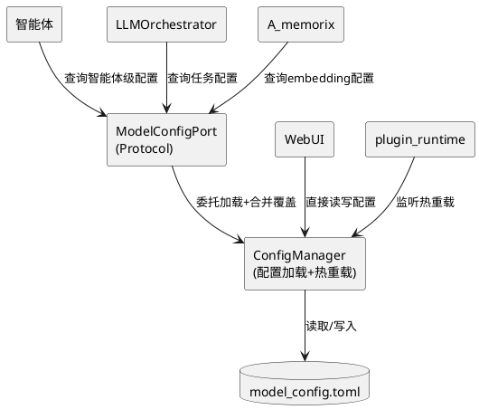
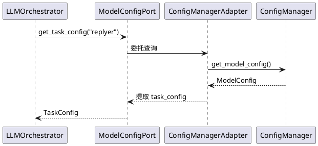
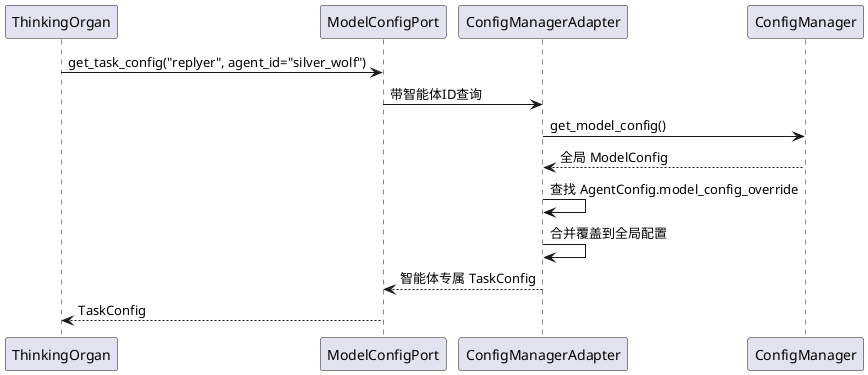
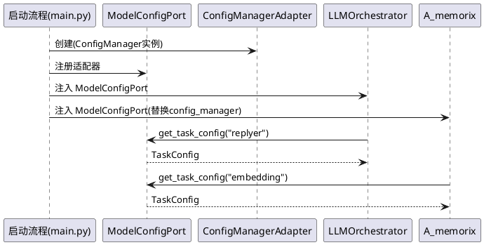
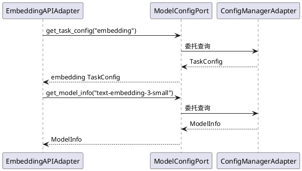
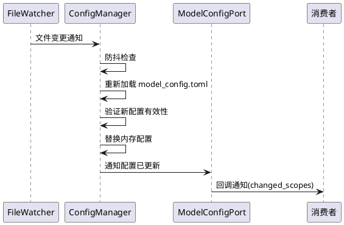

# **1. 组件定位**

## **1.1 核心职责**

本组件负责模型配置的接口隔离与智能体级差异化分发，实现不同智能体使用不同模型配置的能力。

## **1.2 核心输入**

1. **model_config.toml 文件**：用户编辑的 TOML 配置文件，包含 API 提供商列表、模型列表、任务配置
2. **AgentConfig.model_config_override**：智能体级别的模型配置覆盖声明（已存在但未实现消费逻辑）
3. **热重载信号**：文件监听器检测到 model_config.toml 变更后触发的重载请求
4. **任务名查询请求**：LLMOrchestrator 等消费者请求指定任务的模型配置

## **1.3 核心输出**

1. **任务级模型配置**：根据任务名返回对应的 TaskConfig（含模型列表、温度、max_tokens 等）
2. **智能体级差异化配置**：当智能体声明了 model_config_override 时，返回覆盖后的配置
3. **热重载通知**：配置变更后通知所有已注册的消费者
4. **模型/提供商查询结果**：按名称查询 ModelInfo 或 APIProvider

## **1.4 职责边界**

1. **不负责** LLM 请求的执行和调度（LLMOrchestrator 的职责）
2. **不负责** 配置文件的解析和版本迁移（ConfigManager 现有逻辑保留）
3. **不负责** 模型客户端的创建和管理（client_registry 的职责）
4. **不负责** 远程配置中心的对接（当前无此需求，零开箱抽象）
5. **不负责** WebUI 的配置编辑界面（WebUI 路由直接读 ConfigManager）

# **2. 领域术语**

**ModelConfig**
: 模型配置的完整数据对象，包含 models（模型列表）、api_providers（API提供商列表）、model_task_config（任务配置）三个顶层字段。

**TaskConfig**
: 单个任务的模型配置，包含 model_list（模型名称列表）、temperature、max_tokens、selection_strategy 等。对应 model_task_config 下的一个字段（如 replyer、planner、memory）。

**ModelTaskConfig**
: 所有任务配置的容器，持有 replyer/planner/memory/utils/vlm/embedding 等多个 TaskConfig 实例。

**APIProvider**
: API 服务商配置，包含 base_url、api_key、client_type、auth_type、timeout 等连接参数。

**ModelInfo**
: 单个模型的元信息，包含 model_identifier、name、api_provider、visual、temperature 等属性。

**model_config_override**
: AgentConfig 上的可选字段，类型为 `Optional[dict[str, object]]`，允许智能体声明对全局模型配置的覆盖规则。

**ModelConfigPort**
: 待定义的 Protocol 接口，隔离消费者对 ConfigManager 具体类的直接依赖。

**配置快照**
: 某一时刻 ModelConfig 的不可变副本，用于智能体级配置合并的基准。

# **3. 角色与边界**

## **3.1 核心角色**

- **智能体（Agent）**：通过 model_config_override 声明自身需要的模型配置差异
- **运维用户**：通过编辑 model_config.toml 或 WebUI 管理全局模型配置

## **3.2 外部系统**

- **LLMOrchestrator**：消费 TaskConfig 执行 LLM 请求调度，当前每次请求拉取全局配置
- **A_memorix**：通过 AMemorixServicePorts.config_manager 访问模型配置（embedding 任务）
- **WebUI**：直接读取 ConfigManager 展示和编辑配置
- **plugin_runtime**：监听配置热重载事件广播
- **service_task_resolver**：解析任务名到 TaskConfig 的映射

## **3.3 交互上下文**

# **4. DFX约束**

## **4.1 性能**

1. 配置查询响应时间不得超过 1ms（纯内存读取，无 IO）
2. 热重载完成时间不得超过 2s（含文件读取、解析、回调通知）
3. 智能体级配置合并不得引入额外的 LLM 调用
4. 13 个智能体并发查询配置时不得产生锁竞争

## **4.2 可靠性**

1. 热重载失败时必须保留上一份有效配置，不得用 None 替换
2. 配置合并过程中出现非法覆盖项时，必须跳过该项并记录警告日志，不得丢弃整个覆盖
3. ConfigManager 单例退役后，配置初始化失败必须阻止系统启动（错误完整暴露）

## **4.3 安全性**

1. API 密钥不得出现在日志明文中
2. model_config_override 不得覆盖 api_key 等敏感字段（只允许覆盖任务级配置）

## **4.4 可维护性**

1. 所有 model_config 消费者必须通过 ModelConfigPort Protocol 访问，禁止直接导入 config_manager
2. 新增 model_config 消费点时，ruff TID251 守卫应阻止直接导入 ConfigManager
3. 配置变更必须通过热重载回调通知消费者，禁止消费者轮询

## **4.5 兼容性**

1. model_config.toml 文件格式不得发生破坏性变更，现有用户配置文件必须可直接加载
2. ConfigManager 的公共 API 签名（get_model_config / register_reload_callback）在过渡期保持兼容
3. A_memorix 的 AMemorixServicePorts.config_manager 字段在过渡期保持类型兼容
4. WebUI 配置编辑功能不得因架构变更而中断

# **5. 核心能力**

## **5.1 模型配置接口隔离**

### **5.1.1 业务规则**

1. **Protocol 定义规则**：When 系统需要查询模型配置，the system shall 通过 ModelConfigPort Protocol 接口提供查询能力，不暴露 ConfigManager 具体类
   a. 验收条件：[消费者导入 ModelConfigPort] → [消费者代码中无 `from src.config.config import config_manager`]

2. **查询接口规则**：ModelConfigPort shall 提供以下查询方法：
   - `get_task_config(task_name: str) -> TaskConfig`：按任务名查询任务配置
   - `get_model_info(model_name: str) -> ModelInfo`：按模型名查询模型信息
   - `get_provider(provider_name: str) -> APIProvider`：按提供商名查询提供商配置
   - `get_model_config() -> ModelConfig`：获取完整模型配置（仅限需要全量配置的场景）
   a. 验收条件：[调用 get_task_config("replyer")] → [返回 replyer 任务的 TaskConfig 实例]

3. **适配器实现规则**：ModelConfigPort shall 由 ConfigManagerModelConfigPort 适配器实现，适配器内部持有 ConfigManager 实例引用
   a. 验收条件：[适配器构造时传入 ConfigManager] → [适配器方法委托给 ConfigManager.get_model_config()]

4. **禁止项**：禁止消费者直接导入 `from src.config.config import config_manager` 获取模型配置
   a. 验收条件：[ruff TID251 扫描 src/llm_models、src/services、src/A_memorix/core] → [零违规导入]

### **5.1.2 交互流程**

### **5.1.3 异常场景**

1. **任务名不存在**
   a. 触发条件：调用 get_task_config 时传入未定义的任务名
   b. 系统行为：抛出 ValueError，包含具体的任务名和可用任务列表
   c. 用户感知：`ValueError: 未找到名为 'xxx' 的任务配置，可用任务: replyer, planner, ...`

2. **ConfigManager 未初始化**
   a. 触发条件：在 ConfigManager.initialize() 之前查询配置
   b. 系统行为：抛出 RuntimeError，明确提示配置未初始化
   c. 用户感知：`RuntimeError: 模型配置未初始化`

## **5.2 智能体级模型配置覆盖**

### **5.2.1 业务规则**

1. **覆盖声明规则**：When 智能体在 AgentConfig 中声明了 model_config_override，the system shall 将覆盖项合并到全局配置上，生成该智能体专属的配置视图
   a. 验收条件：[AgentConfig.model_config_override = {"replyer": {"model_list": ["model-a"]}}] → [该智能体调用 replyer 任务时使用 model-a]

2. **覆盖范围规则**：model_config_override shall 只允许覆盖 TaskConfig 级别的字段，禁止覆盖 APIProvider 和 ModelInfo
   a. 验收条件：[model_config_override 包含 "api_providers" 键] → [跳过该键并记录警告日志]

3. **合并语义规则**：覆盖采用浅合并策略——覆盖项中的字段直接替换全局配置的对应字段，不做深度递归合并
   a. 验收条件：[override = {"replyer": {"temperature": 0.7}}] → [replyer 的 temperature=0.7，其余字段保持全局值]

4. **空覆盖规则**：When 智能体未声明 model_config_override 或其值为 None，the system shall 使用全局配置，不做任何合并
   a. 验收条件：[AgentConfig.model_config_override = None] → [行为与当前完全一致]

5. **热重载同步规则**：When 全局配置热重载完成，the system shall 使所有智能体的覆盖配置基于新的全局配置重新合并
   a. 验收条件：[热重载后查询智能体配置] → [覆盖项作用于最新的全局配置]

6. **禁止项**：禁止在配置合并中使用 LLM 推理
   a. 验收条件：[配置合并过程] → [零 LLM 调用]

### **5.2.2 交互流程**

### **5.2.3 异常场景**

1. **覆盖项引用不存在的任务**
   a. 触发条件：model_config_override 中包含全局 ModelTaskConfig 中不存在的任务名
   b. 系统行为：跳过该覆盖项，记录警告日志
   c. 用户感知：日志 `WARNING: 智能体 xxx 的 model_config_override 引用了不存在的任务 'yyy'，已跳过`

2. **覆盖项类型不匹配**
   a. 触发条件：覆盖项中某字段的值类型与 TaskConfig 定义不匹配（如 temperature 传入字符串）
   b. 系统行为：跳过该字段，记录警告日志
   c. 用户感知：日志 `WARNING: 智能体 xxx 覆盖任务 yyy 的 temperature 类型不匹配，已跳过`

3. **覆盖后模型列表为空**
   a. 触发条件：覆盖导致某任务的 model_list 变为空列表
   b. 系统行为：使用全局配置的 model_list 作为回退，记录警告日志
   c. 用户感知：日志 `WARNING: 智能体 xxx 覆盖后任务 yyy 的 model_list 为空，回退到全局配置`

## **5.3 ConfigManager 单例退役与依赖注入**

### **5.3.1 业务规则**

1. **模块级单例退役规则**：When 系统启动，the system shall 通过依赖注入将 ModelConfigPort 实例传递给消费者，而非消费者自行导入 config_manager 全局单例
   a. 验收条件：[LLMOrchestrator 构造时] → [接收 ModelConfigPort 实例而非自行拉取]

2. **渐进迁移规则**：迁移 shall 分阶段进行，每个阶段保持系统可运行
   - 阶段1：定义 ModelConfigPort Protocol + 适配器实现，消费者可选择使用新接口
   - 阶段2：核心消费者（LLMOrchestrator、service_task_resolver）迁移到 ModelConfigPort
   - 阶段3：A_memorix 迁移到 ModelConfigPort（替换 AMemorixServicePorts.config_manager）
   - 阶段4：ruff TID251 守卫封堵旧导入路径
   a. 验收条件：[每个阶段完成后] → [所有现有测试通过，无功能回退]

3. **过渡期兼容规则**：在迁移完成前，ConfigManager.get_model_config() 和模块级 model_config 代理 shall 继续可用
   a. 验收条件：[过渡期内未迁移的消费者] → [仍可通过旧路径获取配置]

4. **禁止项**：禁止一次性删除 config_manager 全局单例（必须渐进迁移）
   a. 验收条件：[任何单次提交] → [不得同时删除 config_manager 和所有旧消费者]

### **5.3.2 交互流程**

### **5.3.3 异常场景**

1. **依赖注入缺失**
   a. 触发条件：消费者需要的 ModelConfigPort 未被注入
   b. 系统行为：启动时立即报错，阻止系统启动
   c. 用户感知：`RuntimeError: ModelConfigPort 未注入，LLMOrchestrator 无法初始化`

2. **过渡期新旧路径不一致**
   a. 触发条件：同一配置通过旧路径和新路径获取到不同的值
   b. 系统行为：记录 ERROR 日志，包含两个路径的返回值差异
   c. 用户感知：日志 `ERROR: 配置路径不一致: config_manager.get_model_config() vs ModelConfigPort`

## **5.4 A_memorix 配置依赖隔离**

### **5.4.1 业务规则**

1. **端口替换规则**：When A_memorix 需要访问模型配置，the system shall 通过 ModelConfigPort 而非 AMemorixServicePorts.config_manager 获取
   a. 验收条件：[A_memorix/core/ 目录扫描] → [零 `config_manager.get_model_config()` 调用]

2. **AMemorixServicePorts 演进规则**：AMemorixServicePorts.config_manager 字段 shall 被替换为 model_config_port: ModelConfigPort
   a. 验收条件：[AMemorixServicePorts 数据类] → [config_manager 字段不存在，model_config_port 字段存在]

3. **EmbeddingAPIAdapter 隔离规则**：EmbeddingAPIAdapter shall 通过 ModelConfigPort 查询 embedding 任务配置，不再持有 config_manager 引用
   a. 验收条件：[EmbeddingAPIAdapter 构造参数] → [无 config_manager 参数，有 model_config_port 参数]

4. **禁止项**：禁止 A_memorix/core/ 内部模块直接导入 src.config.config
   a. 验收条件：[ruff TID251 扫描 src/A_memorix/core/] → [零违规导入]

### **5.4.2 交互流程**

### **5.4.3 异常场景**

1. **ModelConfigPort 未注入到 A_memorix**
   a. 触发条件：host_service 构建服务端口时未传入 model_config_port
   b. 系统行为：A_memorix 初始化时抛出 RuntimeError
   c. 用户感知：`RuntimeError: A_memorix: ModelConfigPort 未注入`

2. **embedding 任务配置为空**
   a. 触发条件：全局配置中 embedding 任务的 model_list 为空
   b. 系统行为：EmbeddingAPIAdapter 初始化时记录警告，降级为不可用状态
   c. 用户感知：日志 `WARNING: embedding 任务未配置模型，嵌入功能不可用`

## **5.5 热重载保留**

### **5.5.1 业务规则**

1. **热重载触发规则**：When model_config.toml 文件发生变更，the system shall 在防抖间隔后自动重新加载配置并通知所有消费者
   a. 验收条件：[编辑 model_config.toml 保存后] → [2s 内消费者获取到新配置]

2. **回调通知规则**：热重载完成时 shall 调用所有已注册的回调函数，传入变更范围
   a. 验收条件：[model_config.toml 变更] → [回调接收 changed_scopes=("model",)]

3. **智能体覆盖同步规则**：When 热重载完成，the system shall 使所有智能体的覆盖配置基于新的全局配置重新合并
   a. 验收条件：[热重载后智能体查询配置] → [覆盖项作用于最新全局配置]

4. **防抖规则**：热重载 shall 遵守最小间隔（1s）和超时限制（20s），防止频繁重载和卡死
   a. 验收条件：[1s 内多次文件变更] → [只触发一次重载]

5. **禁止项**：禁止热重载失败时用 None 替换当前配置
   a. 验收条件：[热重载过程中文件格式错误] → [保留上一份有效配置，记录错误日志]

### **5.5.2 交互流程**

### **5.5.3 异常场景**

1. **配置文件格式错误**
   a. 触发条件：model_config.toml 包含非法 TOML 语法
   b. 系统行为：保留当前配置，记录 ERROR 日志，不触发回调
   c. 用户感知：日志 `ERROR: 配置热重载失败: ...`

2. **配置校验失败**
   a. 触发条件：TOML 格式正确但业务校验失败（如模型引用不存在的 provider）
   b. 系统行为：保留当前配置，记录 ERROR 日志
   c. 用户感知：日志 `ERROR: 配置校验失败: ...`

3. **热重载超时**
   a. 触发条件：重载过程超过 20s
   b. 系统行为：取消重载，保留当前配置，记录 ERROR 日志
   c. 用户感知：日志 `ERROR: 配置热重载超时`

# **6. 数据约束**

## **6.1 ModelConfig**

1. **models**：模型信息列表，至少包含 1 个 ModelInfo，模型名称（name）不可重复
2. **api_providers**：API 提供商列表，至少包含 1 个 APIProvider，提供商名称（name）不可重复
3. **model_task_config**：任务配置容器，必须包含 replyer、planner、utils、vlm、embedding 五个必需任务

## **6.2 TaskConfig**

1. **model_list**：模型名称列表，至少包含 1 个有效模型名（空列表时按 EMPTY_TASK_FALLBACKS 回退）
2. **temperature**：模型温度，取值范围 [0, 2]
3. **max_tokens**：最大输出 token 数，取值范围 ≥ 1
4. **selection_strategy**：模型选择策略，可选值 balance/random/sequential
5. **slow_threshold**：超时警告阈值（秒），取值范围 ≥ 0
6. **hard_timeout**：硬超时（秒），取值范围 ≥ 1

## **6.3 model_config_override**

1. **类型**：`Optional[dict[str, object]]`，键为任务名，值为该任务的覆盖字段字典
2. **允许覆盖的键**：与 ModelTaskConfig 的字段名对应（replyer、planner、memory 等）
3. **允许覆盖的值**：与对应 TaskConfig 字段类型兼容的值
4. **禁止覆盖**：api_providers、models 等全局级配置
5. **默认值**：None（不覆盖，使用全局配置）

## **6.4 ModelConfigPort 查询结果**

1. **get_task_config 返回值**：TaskConfig 实例，保证非 None
2. **get_model_info 返回值**：ModelInfo 实例，不存在时抛出 ValueError
3. **get_provider 返回值**：APIProvider 实例，不存在时抛出 ValueError
4. **get_model_config 返回值**：ModelConfig 实例，保证非 None