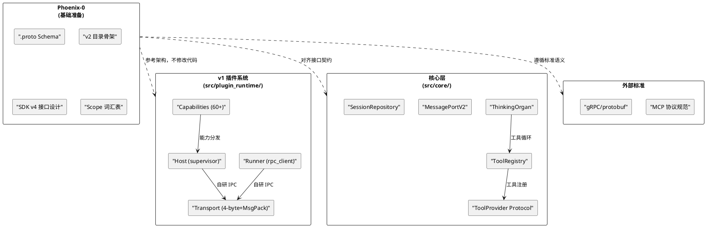
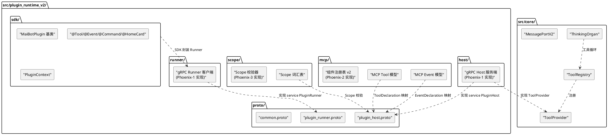
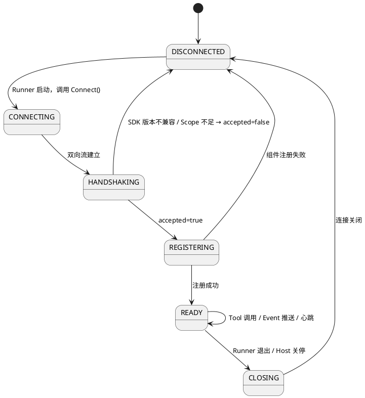
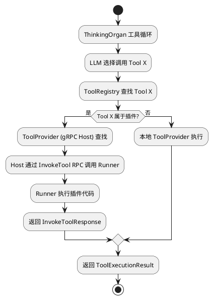
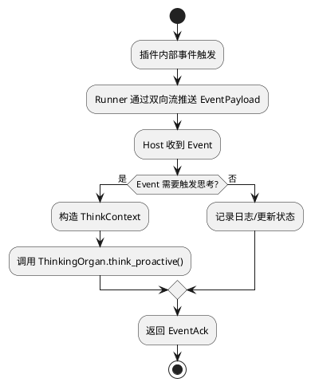
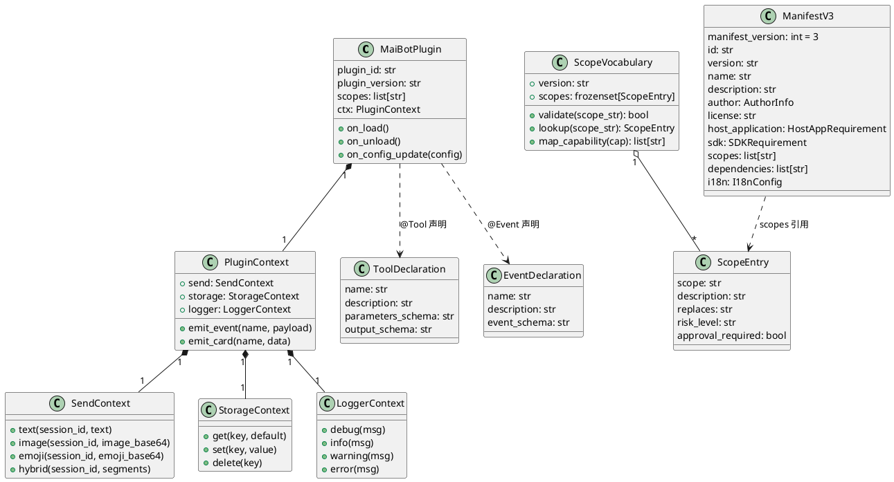

# Phoenix-0：基础准备 — 增量设计方案

# 一、需求与存量功能关系分析

## 1.1 需求功能与存量功能对比

### 1.1.1 已实现功能

| 需求功能 | 存量功能 | 代码位置 | 匹配度 |
|---------|---------|---------|--------|
| Host/Runner 双端架构 | Host（supervisor/rpc_server）+ Runner（rpc_client/runner_main） | `src/plugin_runtime/host/`, `src/plugin_runtime/runner/` | 75% |
| 握手连接（HelloPayload/HelloResponse） | HelloPayload + HelloResponsePayload Pydantic 模型 | `src/plugin_runtime/protocol/envelope.py:162-181` | 75% |
| 组件注册（Tool/Event 声明上报） | ComponentDeclaration + RegisterPluginPayload | `src/plugin_runtime/protocol/envelope.py:185-241` | 50% |
| Tool 调用（Host→Runner） | InvokePayload + InvokeResultPayload | `src/plugin_runtime/protocol/envelope.py:256-270` | 75% |
| 能力调用（Runner→Host） | CapabilityRequestPayload + CapabilityResponsePayload | `src/plugin_runtime/protocol/envelope.py:286-301` | 50% |
| 心跳保活 | HealthPayload + RunnerReadyPayload | `src/plugin_runtime/protocol/envelope.py:305-327` | 25% |
| 传输层分帧协议 | 4-byte big-endian length prefix + MsgPack | `src/plugin_runtime/transport/base.py:17-18` | 25% |
| 权限声明（capabilities_required） | capabilities_required 字段 | `src/plugin_runtime/protocol/envelope.py:232` | 25% |
| 工具声明模型 | ToolInfo + ToolSpec | `src/core/types.py:137-158`, `src/core/tooling.py:79-153` | 75% |
| 工具注册表 | ToolRegistry + ToolProvider Protocol | `src/core/tooling.py:257-414` | 75% |
| 组件类型枚举 | ComponentTypes (7 种) | `src/plugin_runtime/host/component_registry.py:51-58` | 25% |
| 能力注册表 | 60+ capabilities 注册 | `src/plugin_runtime/capabilities/registry.py:13-115` | 50% |
| 插件生命周期钩子 | on_load/on_unload/on_config_update | SDK v3（外部包） | 75% |

**匹配度评估依据**：
- **75%**：核心语义一致，但传输协议/字段名/数据格式不同，需重新定义
- **50%**：部分语义匹配，但模型结构差异大（如 8 种组件 vs 2 种、capabilities vs scopes）
- **25%**：仅概念相似，实现方式完全不同（如心跳机制、传输协议）

### 1.1.2 需要扩展的功能

| 需求功能 | 存量功能 | 差异说明 | 扩展方向 |
|---------|---------|---------|---------|
| gRPC 双向流传输 | 4-byte prefix + MsgPack 自研协议 | v1 使用自定义分帧+MsgPack序列化，Phoenix 使用 gRPC 双向流+protobuf 序列化。传输层完全替换，但 RPC 语义（请求-响应-广播）可复用 | 新建 `src/plugin_runtime_v2/proto/` 定义 .proto Schema，替换整个 transport/ 目录 |
| MCP Tool/Event 统一组件模型 | 8 种组件类型（Action/Command/Tool/EventHandler/HookHandler/MessageGateway/API/HomeCard） | v1 组件类型碎片化，Phoenix 统一为 Tool（拉取式）+ Event（推送式）。Command = Tool 语法糖，HomeCard = Event 语法糖。**MessageGateway 拆分为 Tool（发送消息）+ Event（接收消息）**，明确双向语义映射 | 新建 `src/plugin_runtime_v2/mcp/` 定义统一组件模型，Command/HomeCard 作为装饰器层保留 |
| Scope 细粒度授权 | capabilities 粗粒度权限（send.text, db.query 等） | v1 的 capabilities 是扁平字符串列表，无资源域/操作/资源类型分层。Phoenix 的 scope 是三段式 `资源域:操作:资源类型` | 新建 `src/plugin_runtime_v2/scope/` 定义词汇表和校验逻辑，建立 capabilities→scope 映射 |
| SDK v4 接口 | SDK v3（MaiBotPlugin + @Action/@Command/@Tool/@EventHandler/@HookHandler/@HomeCard） | v3 暴露 capabilities/stream_id 概念，v4 统一替换为 scope/session_id。装饰器从 6 种收敛为 @Tool/@Event + @Command/@HomeCard 语法糖 | 新建 `src/plugin_runtime_v2/sdk/` 定义 SDK v4 接口，不再依赖 v3 SDK 包 |
| Manifest v3 | Manifest v2（_manifest.json） | v2 使用 capabilities_required，v3 使用 scopes。manifest_version 从 2 升级为 3，字段结构重新设计 | 新建 Manifest v3 格式定义，含 scopes/dependencies/i18n 字段 |
| 握手协议扩展 | HelloPayload（runner_id, sdk_version, session_token） | v1 握手不含 scopes 声明，Phoenix 握手需携带 scopes 列表，Host 需返回 rejected_scopes | .proto 中 HelloPayload 增加 scopes 字段，HelloResponse 增加 rejected_scopes 字段 |

### 1.1.3 需要新增的功能或接口

**gRPC 传输层（.proto Schema）**：
- `service PluginHost`：Host 端暴露的 gRPC 服务，含 Connect（双向流）、RegisterComponents（一元 RPC）
- `service PluginRunner`：Runner 端暴露的 gRPC 服务，含 InvokeTool（一元 RPC）
- 12 种 protobuf message 类型（HelloPayload、HelloResponse、ToolDeclaration、EventDeclaration 等）

**v2 目录骨架**：
- `src/plugin_runtime_v2/` 及其 7 个子目录（proto/host/runner/scope/mcp/sdk/），每个含 `__init__.py`

**SDK v4 接口设计**：
- `MaiBotPlugin` 基类：on_load/on_unload/on_config_update 生命周期 + scopes 类属性
- `@Tool` 装饰器：name/description/parameters_schema
- `@Event` 装饰器：name/description/event_schema
- `@Command` 装饰器：带 pattern 约束的 Tool 语法糖
- `@HomeCard` 装饰器：推送卡片数据的 Event 语法糖
- `PluginContext` 上下文对象：send/storage/logger 子对象

**WebUI 集成预留**（Phoenix-3 依赖）：
- Scope 审批界面需要读取插件的 scopes 声明和 approval_required 元数据
- Manifest v3 的 scopes 字段是 WebUI 渲染审批表单的数据源
- Phoenix-0 只定义数据结构，不实现 WebUI 路由（defer 到 Phoenix-3）

**Scope 词汇表**：
- 11 个资源域（message/database/session/memory/config/agent/person/llm/emoji/plugin/system）的完整 scope 清单
- 每个 scope 含 description/replaces/risk_level/approval_required 元数据
- 现有 capabilities→scope 的完整映射关系

**Manifest v3 格式**：
- 新增 scopes 字段替代 capabilities_required
- 新增 dependencies/i18n 字段
- manifest_version=3

## 1.2 存量功能详细分析

### 1.2.1 传输层（`src/plugin_runtime/transport/`）

**接口契约**：
- `TransportServer.start(handler)` / `stop()` / `get_address()` — 服务端抽象
- `TransportClient.connect()` → `Connection` — 客户端抽象
- `Connection.send_frame(data)` / `recv_frame()` — 分帧读写

**业务规则**：
- 分帧协议：4-byte big-endian length prefix + payload，最大帧 16MB
- 3 种传输后端：UDS（Unix Domain Socket）、Named Pipe（Windows）、TCP
- 写锁保护并发写入的帧完整性

**约束**：
- Phoenix-0 不修改此模块，Phoenix-1 用 gRPC 替换
- gRPC 自带分帧和流控，无需手动实现

### 1.2.2 协议层（`src/plugin_runtime/protocol/`）

**接口契约**：
- `Envelope`：统一消息封装（protocol_version, request_id, message_type, method, payload, error）
- `Codec`：编解码器抽象（encode_envelope/decode_envelope/encode/decode）
- `MsgPackCodec`：MsgPack 实现，含 datetime/date ExtType 支持

**业务规则**：
- 消息类型：REQUEST / RESPONSE / BROADCAST
- 请求 ID 单调递增（int64）
- 握手流程：Runner 发 HelloPayload → Host 回 HelloResponsePayload

**约束**：
- Phoenix 用 protobuf 替代 Pydantic + MsgPack，但 RPC 语义可参考
- .proto 消息类型需与 Envelope 的 method 字段对齐

### 1.2.3 组件注册表（`src/plugin_runtime/host/component_registry.py`）

**接口契约**：
- 8 种组件类型：ACTION / COMMAND / TOOL / EVENT_HANDLER / HOOK_HANDLER / MESSAGE_GATEWAY / HOME_CARD / API
- `ComponentEntry`：name, full_name, component_type, plugin_id, metadata, enabled, timeout_ms, chat_scope, allowed_session
- `ComponentRegistry`：按类型注册、命名空间（plugin_id.name）、命令正则匹配、启用/禁用、多维度查询

**业务规则**：
- 命名空间：`plugin_id.component_name`
- ACTION 归一化为 TOOL（`_normalize_component_type` 中 ACTION→TOOL）
- Command 支持正则匹配（compiled_pattern）
- Tool 含 parameters_schema（对象级 JSON Schema）

**扩展点**：
- Phoenix 将 8 种收敛为 Tool + Event，但 ToolEntry 的 parameters_schema 机制可直接复用
- CommandEntry 的正则匹配逻辑在 Phoenix 中作为 @Command 装饰器的 pattern 参数保留

### 1.2.4 能力系统（`src/plugin_runtime/capabilities/`）

**接口契约**：
- `CapabilityImpl`：`async (plugin_id, capability, args) -> Any`
- `CapabilityService`：register_capability(name, impl) + dispatch
- 60+ 已注册能力（见 `registry.py`）

**业务规则**：
- 能力按命名空间组织：send.* / db.* / chat.* / maisaka.* / agent.* / person.* / emoji.* / config.* / llm.* / frequency.* / tool.* / api.* / component.* / knowledge.* / statistics.* / render.*
- 能力调用走 Envelope 的 `cap.*` method

**约束**：
- Phoenix 中 capabilities 替换为 scope，但能力实现的业务逻辑不变
- Scope 词汇表必须覆盖所有 60+ capabilities 对应的能力

### 1.2.5 核心工具抽象（`src/core/tooling.py`）

**接口契约**：
- `ToolSpec`：name, description, parameters_schema, output_schema, provider_name, provider_type, enabled
- `ToolInvocation`：tool_name, arguments, call_id, session_id
- `ToolExecutionResult`：tool_name, success, content, error_message, structured_content, content_items
- `ToolProvider` Protocol：list_tools() / invoke() / close()
- `ToolRegistry`：register_provider / list_tools / invoke / get_llm_definitions

**业务规则**：
- Provider 按注册顺序去重（同名工具保留先注册的）
- invoke 遍历 providers 查找匹配工具
- to_llm_definition() 生成 LLM 可消费的工具定义

**扩展点**：
- MCP Tool 的 ToolDeclaration 可直接映射到 ToolSpec
- Phoenix 的 gRPC Host 需实现 ToolProvider Protocol，将远程插件的 Tool 桥接到本地 ToolRegistry
- 这是 Phoenix-2（MCP 组件模型）的关键对接点

### 1.2.6 ThinkingOrgan（`src/maisaka/agent_autonomy/thinking_organ.py`）

**接口契约**：
- `think(context: ThinkContext) -> ThinkResult` — 执行一次思考
- `think_proactive(reason, context) -> ThinkResult` — 主动思考
- 依赖 `tool_registry`（ToolRegistry 实例）执行工具循环

**业务规则**：
- 所有思考路径统一走工具循环（_think_with_tools）
- content = 内心独白（永不外发），reply 工具调用 = 对外回复
- MAX_INTERNAL_ROUNDS = 10

**扩展点**：
- MCP Tool 注册到 ToolRegistry → ThinkingOrgan 自动可用
- 无需修改 ThinkingOrgan 代码，只需 Phoenix-2 的 Host 实现 ToolProvider

# 二、增量设计方案

## 2.1 实现模型

### 2.1.1 上下文视图



### 2.1.2 服务/组件总体架构



### 2.1.3 实现设计文档

#### 2.1.3.1 gRPC 连接生命周期



#### 2.1.3.2 MCP Tool 调用流程



#### 2.1.3.3 MCP Event 推送流程



## 2.2 接口设计

### 2.2.1 总体设计

**接口分类**：

| 分类 | 接口 | 稳定性 | 说明 |
|------|------|--------|------|
| gRPC 服务 | PluginHost | 稳定 | Host 端暴露的 RPC 方法 |
| gRPC 服务 | PluginRunner | 稳定 | Runner 端暴露的 RPC 方法 |
| SDK 基类 | MaiBotPlugin | 稳定 | 插件开发者继承的基类 |
| SDK 装饰器 | @Tool | 稳定 | MCP Tool 声明 |
| SDK 装饰器 | @Event | 稳定 | MCP Event 声明 |
| SDK 装饰器 | @Command | 稳定 | Tool 语法糖 |
| SDK 装饰器 | @HomeCard | 稳定 | Event 语法糖 |
| SDK 上下文 | PluginContext | 稳定 | 插件运行时上下文 |
| 数据定义 | Scope 词汇表 | 稳定 | 细粒度权限声明 |
| 数据定义 | Manifest v3 | 稳定 | 插件元数据格式 |

**接口变更策略**：
- .proto 使用 proto3 语法，新增字段不破坏旧版反序列化
- SDK v4 大版本升级，不保证 v3 兼容性
- Scope 词汇表语义化版本，新增 scope 不改变已有 scope 语义

### 2.2.2 接口清单

#### 2.2.2.1 PluginHost gRPC 服务

```protobuf
// Host 端暴露的 gRPC 服务，Runner 连接后调用
service PluginHost {
  // 双向流连接：Runner 通过此流建立持久连接，
  // 首次消息携带 HelloPayload，后续可推送 EventPayload
  rpc Connect(stream RunnerMessage) returns (stream HostMessage);

  // 组件注册：Runner 上报 Tool 和 Event 声明
  rpc RegisterComponents(RegisterComponentsRequest) returns (RegisterComponentsResponse);
}
```

**业务说明**：Runner 启动后首先调用 Connect 建立双向流，握手成功后调用 RegisterComponents 上报组件声明。

**前置条件**：Runner 进程已启动，持有有效的 session_token。

**后置条件**：连接建立后，Host 可通过 Runner 的 InvokeTool RPC 调用插件 Tool；Runner 可通过双向流向 Host 推送 Event。

**异常映射**：
- SDK 版本不兼容 → `HelloResponse.accepted=false, reason="SDK_VERSION_MISMATCH"`
- Scope 授权不足 → `HelloResponse.accepted=false, rejected_scopes=[...]`
- 组件注册失败 → `RegisterComponentsResponse.accepted=false, reasons=[...]`

#### 2.2.2.2 PluginRunner gRPC 服务

```protobuf
// Runner 端暴露的 gRPC 服务，Host 调用插件功能
service PluginRunner {
  // Tool 调用：Host 请求 Runner 执行指定 Tool
  rpc InvokeTool(InvokeToolRequest) returns (InvokeToolResponse);
}
```

**业务说明**：ThinkingOrgan 工具循环中，当 LLM 选择调用插件注册的 Tool 时，Host 通过此 RPC 转发到 Runner 执行。

**前置条件**：Runner 已通过 Connect 握手并注册了指定 Tool。

**后置条件**：Tool 执行完成，返回成功或失败结果。

**异常映射**：
- Tool 不存在 → `InvokeToolResponse.success=false, error="TOOL_NOT_FOUND"`
- 参数校验失败 → `InvokeToolResponse.success=false, error="PARAMETER_VALIDATION_FAILED"`
- 执行超时 → `InvokeToolResponse.success=false, error="TIMEOUT"`
- 执行异常 → `InvokeToolResponse.success=false, error="EXECUTION_ERROR: {detail}"`

#### 2.2.2.3 .proto 完整消息类型定义

```protobuf
syntax = "proto3";

package maibot.plugin.v2;

// ============================================================
// 通用消息：双向流中的消息封装
// ============================================================

// Runner → Host 的流消息
message RunnerMessage {
  oneof payload {
    HelloPayload hello = 1;           // 握手请求（首条消息）
    EventPayload event = 2;           // Event 推送
    HeartbeatResponse heartbeat = 3;  // 心跳响应
  }
}

// Host → Runner 的流消息
message HostMessage {
  oneof payload {
    HelloResponse hello_response = 1;  // 握手响应
    HeartbeatRequest heartbeat = 2;    // 心跳请求
    ShutdownRequest shutdown = 3;      // 关停请求
  }
}

// ============================================================
// 握手
// ============================================================

// 握手请求：Runner 连接后发送的首条消息
message HelloPayload {
  string runner_id = 1;       // Runner 进程唯一标识（必填）
  string sdk_version = 2;     // SDK 版本号（必填）
  string session_token = 3;   // 一次性会话令牌（必填，Phoenix-3 签发）
  repeated string scopes = 4; // 所需 scope 列表（至少 1 项）
}

// 握手响应：Host 校验后返回
message HelloResponse {
  bool accepted = 1;               // 是否接受连接（必填）
  string host_version = 2;         // Host 版本号
  string reason = 3;               // 拒绝原因（accepted=false 时有值）
  repeated string rejected_scopes = 4; // 未批准的 scope 列表
}

// ============================================================
// 组件声明
// ============================================================

// MCP Tool 声明
message ToolDeclaration {
  string name = 1;               // 工具名称（必填，全局唯一）
  string description = 2;        // 工具描述（必填，供 LLM 理解）
  string parameters_schema = 3;  // 参数 JSON Schema（JSON 字符串）
  string output_schema = 4;      // 输出 JSON Schema（可选）
}

// MCP Event 声明
message EventDeclaration {
  string name = 1;          // 事件名称（必填，全局唯一）
  string description = 2;   // 事件描述（必填）
  string event_schema = 3;  // 事件载荷 JSON Schema（JSON 字符串）
}

// 组件注册请求
message RegisterComponentsRequest {
  string plugin_id = 1;                  // 插件 ID（必填）
  string plugin_version = 2;             // 插件版本
  repeated ToolDeclaration tools = 3;    // Tool 声明列表
  repeated EventDeclaration events = 4;  // Event 声明列表
}

// 组件注册响应
message RegisterComponentsResponse {
  bool accepted = 1;           // 是否全部接受（必填）
  repeated string reasons = 2; // 拒绝原因列表
}

// ============================================================
// Tool 调用
// ============================================================

// Tool 调用请求
message InvokeToolRequest {
  string tool_name = 1;  // 工具名称（必填）
  string args = 2;       // 调用参数（JSON 字符串，必填）
  int32 timeout_ms = 3;  // 超时时间（毫秒，默认 30000）
}

// Tool 调用响应
message InvokeToolResponse {
  bool success = 1;   // 是否成功（必填）
  string result = 2;  // 执行结果（JSON 字符串）
  string error = 3;   // 错误信息
}

// ============================================================
// Event 推送
// ============================================================

// Event 推送载荷
message EventPayload {
  string event_name = 1;  // 事件名称（必填）
  string payload = 2;     // 事件载荷（JSON 字符串）
}

// Event 确认
message EventAck {
  bool received = 1;  // 是否已接收（必填）
}

// ============================================================
// 心跳与关停
// ============================================================

// 心跳请求（Host → Runner）
message HeartbeatRequest {
  int64 timestamp_ms = 1;  // 发送时间戳（毫秒）
}

// 心跳响应（Runner → Host）
message HeartbeatResponse {
  int64 timestamp_ms = 1;  // 响应时间戳（毫秒）
}

// 关停请求（Host → Runner）
message ShutdownRequest {
  string reason = 1;            // 关停原因
  int32 drain_timeout_ms = 2;   // 排空超时（毫秒，默认 5000）
}
```

**设计决策说明**：

1. **双向流消息封装**：使用 `oneof` 区分 RunnerMessage/HostMessage 中的消息类型，而非为每种消息定义独立的 RPC 方法。理由：gRPC 双向流天然支持多路复用，用 oneof 封装可减少 RPC 方法定义，同时保持类型安全。

2. **Event 通过双向流推送**：Event 不走独立 RPC，而是通过 Connect 双向流推送。理由：Event 是异步推送式，与双向流语义天然匹配；独立 RPC 需要额外的连接管理。

3. **JSON Schema 用 string 传递**：parameters_schema/event_schema/output_schema 使用 JSON 字符串而非 protobuf 结构。理由：JSON Schema 本身是递归结构，protobuf 无法自然表达；string 传递保持灵活性，运行时用 json_schema_validator 校验。

4. **禁止重复定义核心类型**：.proto 中不定义 CoreMessage、SessionInfo 等与 `src/core/types.py` 重复的类型。插件需要这些信息时，通过 Tool 调用参数或 Event 载荷以 JSON 字符串传递，由桥接层负责序列化/反序列化。

5. **EventAck 内嵌于 HostMessage**：Event 的确认不作为独立消息类型，而是通过 EventAck 在 HostMessage 中返回。简化设计，避免消息类型膨胀。

#### 2.2.2.4 SDK v4 — MaiBotPlugin 基类

```python
from typing import Any, Callable


class MaiBotPlugin:
    """SDK v4 插件基类 — 所有插件的入口点。

    插件开发者继承此类，使用 @Tool/@Event/@Command/@HomeCard 装饰器声明组件，
    在 scopes 类属性中声明所需权限。
    """

    # 插件元数据（由子类覆盖）
    plugin_id: str = ""
    plugin_version: str = "1.0.0"

    # Scope 声明（由子类覆盖，至少 1 项）
    scopes: list[str] = []

    # 运行时上下文（由 Runner 注入）
    ctx: PluginContext

    async def on_load(self) -> None:
        """插件加载时调用。子类可覆盖以执行初始化逻辑。"""

    async def on_unload(self) -> None:
        """插件卸载时调用。子类可覆盖以执行清理逻辑。"""

    async def on_config_update(self, config: dict[str, Any]) -> None:
        """配置更新时调用。子类可覆盖以响应配置变更。"""
```

**业务说明**：MaiBotPlugin 是 SDK v4 的核心基类，与 v3 保持 on_load/on_unload/on_config_update 三个生命周期钩子的语义一致。新增 scopes 类属性替代 v3 的 capabilities_required。

**前置条件**：子类必须设置 plugin_id 和 scopes。

**后置条件**：Runner 启动时自动收集子类的 @Tool/@Event 装饰器声明，通过 RegisterComponents 上报 Host。

#### 2.2.2.5 SDK v4 — @Tool 装饰器

```python
from typing import Any, Callable


def Tool(
    *,
    name: str,
    description: str,
    parameters_schema: dict[str, Any] | None = None,
    output_schema: dict[str, Any] | None = None,
) -> Callable:
    """MCP Tool 装饰器 — 声明一个拉取式组件。

    被 @Tool 装饰的方法会在 LLM 工具循环中被调用。
    Host 将此 Tool 注册到 ThinkingOrgan 的工具列表，
    LLM 决定何时调用。

    Args:
        name: 工具名称，全局唯一，建议使用 plugin_id.tool_name 格式
        description: 工具描述，供 LLM 理解用途
        parameters_schema: 参数 JSON Schema，描述工具接受的参数
        output_schema: 输出 JSON Schema，描述工具返回的结果

    Returns:
        装饰器函数
    """
```

**业务说明**：替代 v3 的 `@Tool` 和 `@Action`，统一为 MCP Tool 语义。被装饰的方法签名必须为 `async def method_name(self, args: dict[str, Any]) -> dict[str, Any]`。

**前置条件**：方法必须是 MaiBotPlugin 子类的异步方法。

**后置条件**：Runner 自动收集此声明，通过 RegisterComponents 上报。Host 将其注册到 ToolRegistry，ThinkingOrgan 可调用。

#### 2.2.2.6 SDK v4 — @Event 装饰器

```python
from typing import Any, Callable


def Event(
    *,
    name: str,
    description: str,
    event_schema: dict[str, Any] | None = None,
) -> Callable:
    """MCP Event 装饰器 — 声明一个推送式组件。

    被 @Event 装饰的方法定义了 Event 的载荷结构。
    插件在运行时主动推送 Event，Host 订阅后接收。

    Args:
        name: 事件名称，全局唯一，建议使用 plugin_id.event_name 格式
        description: 事件描述
        event_schema: 事件载荷 JSON Schema

    Returns:
        装饰器函数
    """
```

**业务说明**：替代 v3 的 `@EventHandler` 和 `@HookHandler`，统一为 MCP Event 语义。被装饰的方法不是处理函数，而是事件声明。插件通过 `self.ctx.emit_event(name, payload)` 推送事件。

**前置条件**：方法必须是 MaiBotPlugin 子类的方法。

**后置条件**：Runner 自动收集此声明，通过 RegisterComponents 上报。Host 订阅后可接收推送。

#### 2.2.2.7 SDK v4 — @Command 装饰器

```python
from typing import Any, Callable


def Command(
    *,
    name: str,
    pattern: str,
    description: str = "",
    parameters_schema: dict[str, Any] | None = None,
) -> Callable:
    """命令装饰器 — @Tool 的语法糖。

    底层实现为注册一个匹配命令模式的 Tool。
    当用户消息匹配 pattern 时，LLM 优先调用此 Tool。

    Args:
        name: 命令名称
        pattern: 命令匹配模式（正则表达式）
        description: 命令描述
        parameters_schema: 参数 JSON Schema

    Returns:
        装饰器函数
    """
```

**业务说明**：保留 v3 的 @Command 语义，但底层统一为 MCP Tool。pattern 作为 Tool 的 metadata 传递，Host 侧在消息预处理阶段匹配命令。

#### 2.2.2.8 SDK v4 — @HomeCard 装饰器

```python
from typing import Any, Callable


def HomeCard(
    *,
    name: str,
    title: str = "",
    description: str = "",
    width: str = "medium",
) -> Callable:
    """首页卡片装饰器 — @Event 的语法糖。

    底层实现为推送 WebUI 卡片数据的 Event。
    插件调用 self.ctx.emit_card(name, data) 时，
    Runner 推送一个 Event，Host 转发到 WebUI。

    Args:
        name: 卡片标识
        title: 卡片标题
        description: 卡片描述
        width: 卡片宽度（small/medium/large/wide/full）

    Returns:
        装饰器函数
    """
```

**业务说明**：保留 v3 的 @HomeCard 语义，但底层统一为 MCP Event。卡片元数据（title/width）作为 Event 的 metadata 传递。

#### 2.2.2.9 SDK v4 — PluginContext 上下文对象

```python
from typing import Any


class PluginContext:
    """插件运行时上下文 — 替代 v3 的 self.ctx。

    通过 self.ctx 访问，提供消息发送、键值存储、日志桥接等子对象。
    """

    @property
    def send(self) -> "SendContext":
        """消息发送子对象。"""

    @property
    def storage(self) -> "StorageContext":
        """键值存储子对象。"""

    @property
    def logger(self) -> "LoggerContext":
        """日志桥接子对象。"""


class SendContext:
    """消息发送上下文 — 需要 message:send:* scope。"""

    async def text(self, session_id: str, text: str) -> dict[str, Any]:
        """发送文本消息。需要 message:send:text scope。"""

    async def image(self, session_id: str, image_base64: str) -> dict[str, Any]:
        """发送图片。需要 message:send:image scope。"""

    async def emoji(self, session_id: str, emoji_base64: str) -> dict[str, Any]:
        """发送表情包。需要 message:send:emoji scope。"""

    async def hybrid(self, session_id: str, segments: list[dict[str, Any]]) -> dict[str, Any]:
        """发送图文混合消息。需要 message:send:hybrid scope。"""


class StorageContext:
    """键值存储上下文 — 需要 database:read:self / database:write:self scope。"""

    async def get(self, key: str, default: Any = None) -> Any:
        """读取键值。需要 database:read:self scope。"""

    async def set(self, key: str, value: Any) -> None:
        """写入键值。需要 database:write:self scope。"""

    async def delete(self, key: str) -> bool:
        """删除键值。需要 database:write:self scope。"""


class LoggerContext:
    """日志桥接上下文 — 无需 scope。"""

    def debug(self, msg: str, *args: Any) -> None: ...
    def info(self, msg: str, *args: Any) -> None: ...
    def warning(self, msg: str, *args: Any) -> None: ...
    def error(self, msg: str, *args: Any) -> None: ...
```

**业务说明**：替代 v3 的 `self.ctx.send`/`self.ctx.emoji` 等分散接口，统一为结构化的子对象。所有方法使用 session_id 替代 v3 的 stream_id。每个方法调用前 SDK 本地校验 scope，未授权时抛出 ScopeDeniedError。

**前置条件**：插件已声明对应 scope。

**异常映射**：
- Scope 未授权 → `ScopeDeniedError("Scope {scope} 未授权")`
- session_id 无效 → `ValueError("无效的 session_id")`

## 2.3 数据模型

### 2.3.1 设计目标

1. **支持的业务场景**：
   - 插件通过 gRPC 双向流与 Host 通信
   - 插件声明 Tool/Event 组件，Host 注册到 ToolRegistry
   - 插件声明 Scope，Host 校验后决定是否允许连接
   - 插件通过 PluginContext 调用宿主能力

2. **性能目标**：
   - 单条 protobuf 消息序列化/反序列化延迟 ≤1ms
   - Scope 匹配 O(1)（使用 frozenset 或 dict 查找）

3. **兼容策略**：
   - v1 和 v2 完全隔离，不共享代码
   - .proto 使用 proto3 语法，新增字段不破坏旧版反序列化
   - Scope 词汇表语义化版本，新增 scope 不改变已有 scope 语义

### 2.3.2 模型实现

#### 2.3.2.1 v2 目录结构

```
src/plugin_runtime_v2/
├── __init__.py                    # 包入口，导出公共 API
├── proto/
│   ├── __init__.py                # protobuf 生成代码的导出
│   ├── plugin_host.proto          # Host 端 gRPC 服务定义
│   ├── plugin_runner.proto        # Runner 端 gRPC 服务定义
│   └── common.proto               # 通用消息类型（RunnerMessage/HostMessage）
├── host/
│   └── __init__.py                # gRPC Host 端逻辑（Phoenix-1 实现）
├── runner/
│   └── __init__.py                # gRPC Runner 端逻辑（Phoenix-1 实现）
├── scope/
│   ├── __init__.py                # Scope 公共 API
│   └── vocabulary.py              # Scope 词汇表定义（Phoenix-0 产出）
├── mcp/
│   └── __init__.py                # MCP Tool/Event 组件模型（Phoenix-2 实现）
└── sdk/
    └── __init__.py                # SDK v4 接口定义（Phoenix-2 实现）
```

**设计决策**：
- proto/ 目录同时存放 .proto 源文件和生成的 Python 代码，避免目录层级过深
- scope/vocabulary.py 是 Phoenix-0 唯一产出的含逻辑代码的文件，其余为空占位
- v2 与 v1 零交叉引用，grep `from src.plugin_runtime` 在 v2 目录下零匹配

#### 2.3.2.2 核心领域对象关系



#### 2.3.2.3 Scope 词汇表完整清单

**版本**：`scope_version: "1.0.0"`

| Scope | Description | Replaces | Risk Level | Approval Required |
|-------|-------------|----------|------------|-------------------|
| **message 资源域** | | | | |
| `message:send:text` | 发送文本消息 | send.text | low | false |
| `message:send:image` | 发送图片消息 | send.image | medium | true |
| `message:send:emoji` | 发送表情包 | send.emoji | medium | true |
| `message:send:forward` | 发送转发消息 | send.forward | medium | true |
| `message:send:hybrid` | 发送图文混合消息 | send.hybrid | medium | true |
| `message:read:recent` | 读取最近消息 | message.get_recent | low | false |
| `message:read:by_time` | 按时间范围读取消息 | message.get_by_time | low | false |
| `message:read:by_id` | 按 ID 读取消息 | message.get_by_id | low | false |
| `message:write:context` | 向聊天上下文追加消息 | maisaka.context.append | high | true |
| **database 资源域** | | | | |
| `database:read:session_message` | 读取会话消息表 | db.query, db.get | low | false |
| `database:read:plugin_data` | 读取插件数据表 | db.query, db.get | low | false |
| `database:write:session_message` | 写入会话消息表 | db.save, db.create | high | true |
| `database:write:plugin_data` | 写入插件数据表 | db.save, db.create | medium | true |
| `database:delete:session_message` | 删除会话消息 | db.delete | high | true |
| `database:delete:plugin_data` | 删除插件数据 | db.delete | medium | true |
| `database:read:self` | 读取自身插件键值存储 | config.get | low | false |
| `database:write:self` | 写入自身插件键值存储 | config.get | low | false |
| **session 资源域** | | | | |
| `session:read:list` | 列出所有会话 | chat.get_all_streams, chat.get_group_streams, chat.get_private_streams | low | false |
| `session:read:detail` | 查询会话详情 | chat.get_stream_by_group_id, chat.get_stream_by_user_id | low | false |
| `session:write:create` | 创建新会话 | chat.open_session | medium | true |
| **memory 资源域** | | | | |
| `memory:read:search` | 检索记忆 | (新增) | medium | true |
| `memory:read:profile` | 查询人物画像 | (新增) | medium | true |
| `memory:write:observe` | 写入记忆观察 | (新增) | high | true |
| **config 资源域** | | | | |
| `config:read:self` | 读取自身插件配置 | config.get_plugin | low | false |
| `config:read:all` | 读取全部配置 | config.get_all | high | true |
| `config:write:self` | 修改自身插件配置 | component.update_plugin_config | medium | true |
| **agent 资源域** | | | | |
| `agent:read:emotion` | 查询智能体情绪 | agent.emotion.get | low | false |
| `agent:read:relationship` | 查询智能体关系 | agent.relationship.get | low | false |
| `agent:execute:proactive` | 触发智能体主动对话 | maisaka.proactive.trigger | high | true |
| **person 资源域** | | | | |
| `person:read:id` | 查询人物 ID | person.get_id, person.get_id_by_name | low | false |
| `person:read:detail` | 查询人物详情 | person.get_value | low | false |
| **llm 资源域** | | | | |
| `llm:execute:generate` | 调用 LLM 生成 | llm.generate | high | true |
| `llm:execute:generate_with_tools` | 调用 LLM 工具循环 | llm.generate_with_tools | high | true |
| `llm:execute:embed` | 调用 LLM 嵌入 | llm.embed | medium | true |
| `llm:execute:transcribe` | 调用 LLM 语音转文字 | llm.transcribe_audio | medium | true |
| `llm:read:models` | 查询可用模型 | llm.get_available_models | low | false |
| **emoji 资源域** | | | | |
| `emoji:read:random` | 获取随机表情包 | emoji.get_random | low | false |
| `emoji:read:by_description` | 按描述搜索表情包 | emoji.get_by_description | low | false |
| `emoji:read:list` | 列出所有表情包 | emoji.get_all, emoji.get_count | low | false |
| `emoji:write:register` | 注册新表情包 | emoji.register | medium | true |
| `emoji:write:delete` | 删除表情包 | emoji.delete | high | true |
| **plugin 资源域** | | | | |
| `plugin:read:list` | 列出已加载插件 | component.list_loaded_plugins, component.list_registered_plugins | low | false |
| `plugin:read:info` | 查询插件信息 | component.get_plugin_info, component.get_plugin_config_schema | low | false |
| `plugin:write:config` | 修改插件配置 | component.update_plugin_config | medium | true |
| `plugin:write:enable` | 启用/禁用插件 | component.enable, component.disable | medium | true |
| `plugin:execute:load` | 加载/卸载/重载插件 | component.load_plugin, component.unload_plugin, component.reload_plugin | high | true |
| `plugin:execute:api` | 调用插件 API | api.call, api.get, api.list | medium | true |
| **system 资源域** | | | | |
| `system:read:statistics` | 读取系统统计 | statistics.local.* | low | false |
| `system:read:frequency` | 读取发言频率 | frequency.get_current_talk_value, frequency.get_adjust | low | false |
| `system:write:frequency` | 调整发言频率 | frequency.set_adjust | medium | true |
| `system:execute:render` | 渲染 HTML 为图片 | render.html2png | medium | true |
| `system:execute:command` | 发送平台命令 | send.command | high | true |
| `system:execute:knowledge` | 搜索知识库 | knowledge.search | low | false |
| `system:read:tool_definitions` | 读取工具定义 | tool.get_definitions | low | false |

**设计决策**：

1. **database:read:self / database:write:self**：新增 scope，替代 v3 的 config.get（插件自身键值存储）。与 database:read:plugin_data 的区别：self 只能读写自身 plugin_id 命名空间的数据，risk_level 更低。

2. **memory 资源域**：v3 没有直接暴露记忆能力的 capability（记忆通过 maisaka.context.append 间接使用），Phoenix 新增 memory 资源域以支持更细粒度的记忆访问。

3. **禁止通配 scope**：每个 scope 必须是具体的，不存在 `*:*:*` 或 `database:*:*` 等通配形式。理由：通配 scope 等于上帝权限，违反最小权限原则。

4. **risk_level 分级**：
   - `low`：只读、不影响系统状态，默认批准
   - `medium`：可能影响用户体验（发送消息、修改配置），需显式审批
   - `high`：可能影响系统安全（写入核心数据、触发主动对话），需显式审批且日志记录

#### 2.3.2.4 Manifest v3 格式

```json
{
  "manifest_version": 3,
  "id": "org.example.my_plugin",
  "version": "1.0.0",
  "name": "My Plugin",
  "description": "A sample plugin for MaiBot",
  "author": {
    "name": "Developer Name",
    "url": "https://example.com"
  },
  "license": "MIT",
  "host_application": {
    "min_version": "5.0.0",
    "max_version": ""
  },
  "sdk": {
    "min_version": "4.0.0",
    "max_version": ""
  },
  "scopes": [
    "message:send:text",
    "database:read:self",
    "database:write:self"
  ],
  "dependencies": [],
  "i18n": {
    "default_locale": "zh-CN",
    "locales": ["zh-CN", "en-US", "ja-JP"]
  }
}
```

**与 v2 的差异**：
- `manifest_version` 从 2 升级为 3
- `capabilities_required` 替换为 `scopes`
- 新增 `dependencies` 字段（插件级依赖）
- 新增 `i18n` 字段（国际化配置）
- `id` 格式要求 `组织名.插件名`（v2 无此约束）

#### 2.3.2.5 现有 capabilities → Scope 完整映射

| 旧 Capability | 新 Scope | 说明 |
|---------------|----------|------|
| `send.text` | `message:send:text` | 1:1 映射 |
| `send.image` | `message:send:image` | 1:1 映射 |
| `send.emoji` | `message:send:emoji` | 1:1 映射 |
| `send.forward` | `message:send:forward` | 1:1 映射 |
| `send.hybrid` | `message:send:hybrid` | 1:1 映射 |
| `send.command` | `system:execute:command` | 重新分类到 system |
| `send.custom` | `system:execute:command` | 合并到 system:execute:command |
| `db.query` | `database:read:session_message` 或 `database:read:plugin_data` | 按 model_name 分类 |
| `db.get` | `database:read:session_message` 或 `database:read:plugin_data` | 按 model_name 分类 |
| `db.count` | `database:read:session_message` 或 `database:read:plugin_data` | 按 model_name 分类 |
| `db.save` / `db.create` | `database:write:session_message` 或 `database:write:plugin_data` | 按 model_name 分类 |
| `db.delete` | `database:delete:session_message` 或 `database:delete:plugin_data` | 按 model_name 分类 |
| `config.get` | `database:read:self` | 插件自身键值存储 |
| `config.get_plugin` | `config:read:self` | 插件自身配置 |
| `config.get_all` | `config:read:all` | 全局配置 |
| `emoji.get_random` | `emoji:read:random` | 1:1 映射 |
| `emoji.get_by_description` | `emoji:read:by_description` | 1:1 映射 |
| `emoji.get_count` | `emoji:read:list` | 合并到 list |
| `emoji.get_emotions` | `emoji:read:list` | 合并到 list |
| `emoji.get_all` | `emoji:read:list` | 合并到 list |
| `emoji.get_info` | `emoji:read:list` | 合并到 list |
| `emoji.register` | `emoji:write:register` | 1:1 映射 |
| `emoji.delete` | `emoji:write:delete` | 1:1 映射 |
| `chat.get_all_streams` | `session:read:list` | 1:1 映射 |
| `chat.get_group_streams` | `session:read:list` | 合并到 list（客户端过滤） |
| `chat.get_private_streams` | `session:read:list` | 合并到 list（客户端过滤） |
| `chat.open_session` | `session:write:create` | 1:1 映射 |
| `chat.get_stream_by_group_id` | `session:read:detail` | 合并到 detail |
| `chat.get_stream_by_user_id` | `session:read:detail` | 合并到 detail |
| `message.get_by_time` | `message:read:by_time` | 1:1 映射 |
| `message.get_by_time_in_chat` | `message:read:by_time` | 合并到 by_time |
| `message.get_by_id` | `message:read:by_id` | 1:1 映射 |
| `message.get_recent` | `message:read:recent` | 1:1 映射 |
| `message.count_new` | `message:read:recent` | 合并到 recent |
| `message.build_readable` | `message:read:recent` | 合并到 recent |
| `maisaka.context.append` | `message:write:context` | 重新分类到 message |
| `maisaka.proactive.trigger` | `agent:execute:proactive` | 重新分类到 agent |
| `agent.emotion.get` | `agent:read:emotion` | 1:1 映射 |
| `agent.relationship.get` | `agent:read:relationship` | 1:1 映射 |
| `person.get_id` | `person:read:id` | 1:1 映射 |
| `person.get_value` | `person:read:detail` | 1:1 映射 |
| `person.get_id_by_name` | `person:read:id` | 合并到 id |
| `llm.generate` | `llm:execute:generate` | 1:1 映射 |
| `llm.generate_with_tools` | `llm:execute:generate_with_tools` | 1:1 映射 |
| `llm.embed` | `llm:execute:embed` | 1:1 映射 |
| `llm.transcribe_audio` | `llm:execute:transcribe` | 1:1 映射 |
| `llm.get_available_models` | `llm:read:models` | 1:1 映射 |
| `frequency.get_current_talk_value` | `system:read:frequency` | 重新分类到 system |
| `frequency.set_adjust` | `system:write:frequency` | 重新分类到 system |
| `frequency.get_adjust` | `system:read:frequency` | 重新分类到 system |
| `tool.get_definitions` | `system:read:tool_definitions` | 重新分类到 system |
| `api.call` | `plugin:execute:api` | 重新分类到 plugin |
| `api.get` | `plugin:execute:api` | 合并到 api |
| `api.list` | `plugin:execute:api` | 合并到 api |
| `api.replace_dynamic` | `plugin:execute:api` | 合并到 api |
| `component.get_all_plugins` | `plugin:read:list` | 重新分类到 plugin |
| `component.get_plugin_info` | `plugin:read:info` | 重新分类到 plugin |
| `component.get_plugin_config_schema` | `plugin:read:info` | 合并到 info |
| `component.update_plugin_config` | `plugin:write:config` | 重新分类到 plugin |
| `component.list_loaded_plugins` | `plugin:read:list` | 合并到 list |
| `component.list_registered_plugins` | `plugin:read:list` | 合并到 list |
| `component.enable` | `plugin:write:enable` | 重新分类到 plugin |
| `component.disable` | `plugin:write:enable` | 合并到 enable |
| `component.load_plugin` | `plugin:execute:load` | 重新分类到 plugin |
| `component.unload_plugin` | `plugin:execute:load` | 合并到 load |
| `component.reload_plugin` | `plugin:execute:load` | 合并到 load |
| `knowledge.search` | `system:execute:knowledge` | 重新分类到 system |
| `statistics.local.*` | `system:read:statistics` | 全部合并到 statistics |
| `render.html2png` | `system:execute:render` | 重新分类到 system |

**映射原则**：
1. 60+ capabilities 收敛为 ~45 个 scope，粒度更细但数量更少
2. 多个 capabilities 合并为一个 scope 时，scope 的 risk_level 取最高值
3. db.* 按 model_name 分类到 session_message/plugin_data，运行时由 Host 判断
4. 重新分类的 capability（maisaka.* → message/agent, frequency.* → system）更符合资源域语义