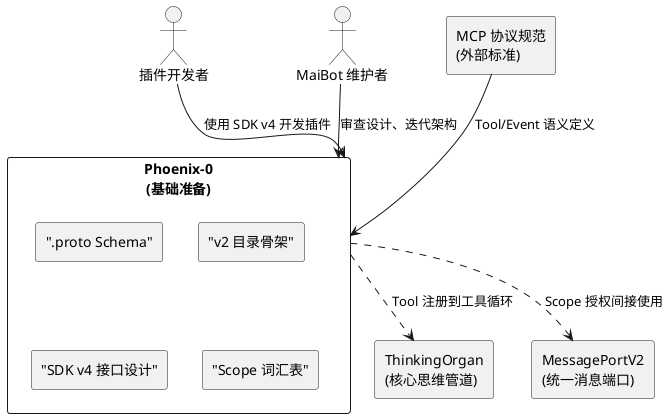
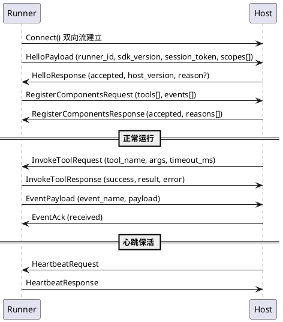
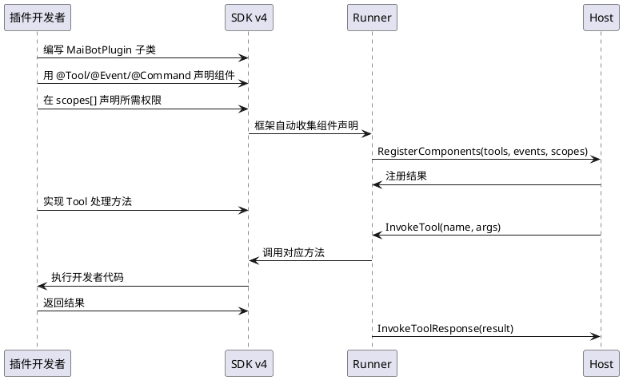

# Phoenix-0：基础准备 — 需求规格

# **1. 组件定位**

## **1.1 核心职责**

本组件负责定义 Phoenix 插件系统的基础契约，产出 .proto Schema、v2 目录骨架、SDK v4 接口设计和 Scope 词汇表，为 Phoenix-1~4 的实现奠定设计基础。

## **1.2 核心输入**

1. **MCP 协议规范**：Model Context Protocol 标准中 Tool（拉取式）和 Event（推送式）的语义定义，作为组件模型的设计输入
2. **现有插件系统架构**：`src/plugin_runtime/` 的 Host/Runner 模型、8 种组件类型（Action/Command/Tool/EventHandler/HookHandler/MessageGateway/API/HomeCard）、capabilities 权限模型、4-byte prefix + MsgPack 传输协议
3. **核心 Protocol 接口**：`src/core/protocols.py` 中 20+ Protocol 定义（MessagePortV2、SessionRepository、ThinkingOrgan 等），新设计需对齐这些接口
4. **核心工具抽象**：`src/core/tooling.py` 中 ToolSpec/ToolProvider/ToolInvocation 等统一工具模型，MCP Tool 需与此对接
5. **现有 SDK v3 API**：`maibot_sdk` 包的 MaiBotPlugin 基类、Action/Command/Tool/EventHandler/HomeCard 装饰器、PluginConfigBase 配置模型

## **1.3 核心输出**

1. **.proto Schema 文件**：gRPC 服务定义和消息类型定义，存放在 `src/plugin_runtime_v2/proto/` 目录
2. **v2 目录骨架**：`src/plugin_runtime_v2/` 目录结构，含 `__init__.py` 和空模块占位
3. **SDK v4 接口设计文档**：MaiBotPlugin 基类 + Tool/Event 装饰器 API 的完整接口签名和语义说明
4. **Scope 词汇表**：标准化的 scope 字符串清单，替代旧的粗粒度 capabilities

## **1.4 职责边界**

- **不修改** `src/plugin_runtime/` 下的任何现有代码
- **不实现** gRPC 传输层（Phoenix-1 的职责）
- **不实现** MCP 组件模型的运行时逻辑（Phoenix-2 的职责）
- **不实现** Scope 授权的签发/校验逻辑（Phoenix-3 的职责）
- **不实现** 能力层 Protocol 化的代码迁移（Phoenix-4 的职责）
- **不编写** 可运行的代码，只产出设计文档、.proto 定义和空目录骨架

# **2. 领域术语**

**MCP Tool**
: 拉取式组件，由 Host 在工具循环中主动调用。插件声明 Tool 的名称、描述、参数 Schema，Host 将其注册到 ThinkingOrgan 的工具列表中，LLM 决定何时调用。
: 备注：对应现有 SDK v3 的 `@Tool` 和 `@Action` 装饰器，Phoenix 中统一为 MCP Tool。

**MCP Event**
: 推送式组件，由插件在特定事件发生时主动推送给 Host。插件声明 Event 的名称和载荷 Schema，Host 订阅后接收推送。
: 备注：对应现有 SDK v3 的 `@EventHandler` 和 `@HookHandler`，Phoenix 中统一为 MCP Event。

**Scope**
: 细粒度能力授权字符串，格式为 `资源域:操作:资源类型`，如 `database:read:session_message`。替代现有 capabilities 的粗粒度权限声明（如 `send.text`、`db.query`）。
: 备注：灵感来自 OAuth 2.0 Scope，但简化为声明式而非交互式授权。

**gRPC Host**
: gRPC 服务端，运行在主程序进程内，监听插件 Runner 的连接。负责组件注册、Tool 调用分发、Event 接收和 Scope 校验。
: 备注：对应现有 `src/plugin_runtime/host/` 的角色。

**gRPC Runner**
: gRPC 客户端，运行在插件进程内，主动连接 Host。负责组件声明上报、Tool 执行、Event 推送和 Scope 声明。
: 备注：对应现有 `src/plugin_runtime/runner/` 的角色。

**Manifest v3**
: 插件元数据描述文件的新版本格式，包含插件 ID、版本、Scope 声明、组件声明等。替代现有 `_manifest.json` 的 v2 格式。
: 备注：现有 manifest_version=2，Phoenix 升级为 v3，不兼容旧格式。

**PluginRuntimeV2**
: Phoenix 插件运行时的代码命名空间，位于 `src/plugin_runtime_v2/`。与现有 `src/plugin_runtime/` 完全隔离，不共享代码。

# **3. 角色与边界**

## **3.1 核心角色**

- **插件开发者**：使用 SDK v4 开发插件的第三方开发者，需要清晰、简洁的 API 和完善的类型提示
- **MaiBot 维护者**：MaiBot 核心团队，需要可维护、可扩展的插件系统架构

## **3.2 外部系统**

- **ThinkingOrgan**：核心思维管道，MCP Tool 需注册到其工具循环中，MCP Event 可触发其主动思考
- **MessagePortV2**：统一消息发送接口，插件通过 Scope 授权后间接使用
- **MCP 协议规范**：外部标准，Phoenix 的组件模型需对齐其 Tool/Event 语义
- **gRPC 生态**：protobuf 编译器、gRPC Python 库等工具链

## **3.3 交互上下文**

# **4. DFX约束**

## **4.1 性能**

1. .proto Schema 设计应当支持 gRPC 双向流，单条消息序列化/反序列化延迟 ≤1ms
2. Scope 字符串匹配必须是 O(1) 或 O(log n) 级别，不得使用线性扫描

## **4.2 可靠性**

1. .proto Schema 必须向前兼容：新增字段不得破坏旧版 Runner 的反序列化
2. Scope 词汇表必须有明确的版本号，新增 scope 不得改变已有 scope 的语义

## **4.3 安全性**

1. Scope 词汇表必须覆盖所有现有 capabilities 对应的能力，不得有权限降级
2. 每个 Scope 必须有最小权限说明，禁止出现"上帝 scope"（如 `*:*:*`）
3. .proto 传输层必须预留认证字段（session_token），为 Phoenix-3 的 Scope 签发预留接口

## **4.4 可维护性**

1. .proto 文件必须有完整的中文注释，每个 message和 service 必须有注释说明用途
2. SDK v4 接口设计文档必须包含完整的类型签名和使用示例
3. v2 目录结构必须与 v1 有清晰的对应关系，便于后续迁移参考

## **4.5 兼容性**

1. Phoenix-0 的产出物不兼容现有插件系统，这是明确的破坏性变更
2. .proto Schema 的 protobuf 版本必须使用 proto3 语法
3. SDK v4 的 Python 版本要求与主程序一致（≥3.11）

# **5. 核心能力**

## **5.1 .proto Schema 定义**

### **5.1.1 业务规则**

1. **gRPC 服务定义**：必须定义 `PluginHost` 和 `PluginRunner` 两个 service，分别对应 Host 端和 Runner 端暴露的 RPC 方法
   a. 验收条件：[查看 .proto 文件] → [存在 `service PluginHost` 和 `service PluginRunner` 定义]

2. **双向流握手**：Runner 通过 `PluginHost.Connect` 双向流建立连接，首次消息携带 HelloPayload，Host 回复 HelloResponse
   a. 验收条件：[Runner 发起 Connect RPC] → [Host 收到 HelloPayload 并回复 HelloResponse]

3. **组件注册**：Runner 通过 `PluginHost.RegisterComponents` 上报 Tool 和 Event 声明
   a. 验收条件：[Runner 发送 RegisterComponentsRequest] → [Host 收到组件声明列表并确认注册]

4. **Tool 调用**：Host 通过 `PluginRunner.InvokeTool` 调用插件的 Tool，Runner 返回执行结果
   a. 验收条件：[Host 发送 InvokeToolRequest] → [Runner 执行 Tool 并返回 InvokeToolResponse]

5. **Event 推送**：Runner 通过双向流向 Host 推送 Event，Host 确认接收
   a. 验收条件：[Runner 推送 EventPayload] → [Host 收到 Event 并返回确认]

6. **Scope 声明**：Runner 在注册时声明所需的 scope 列表，Host 校验后决定是否允许连接
   a. 验收条件：[Runner 声明 scope 列表] → [Host 校验 scope 并在 HelloResponse 中返回 accepted/rejected]

7. **心跳保活**：Host 和 Runner 通过双向流交换心跳消息，检测连接存活性
   a. 验收条件：[连接空闲超过 30s] → [Host 发送 HeartbeatRequest，Runner 回复 HeartbeatResponse]

8. **禁止项**：.proto 中禁止定义与核心 Protocol 接口重复的消息类型（如 CoreMessage、SessionInfo），这些应通过引用或桥接层复用
   a. 验收条件：[审查 .proto 文件] → [不存在与 src/core/types.py 中已有类型重复的 message 定义]

### **5.1.2 交互流程**

### **5.1.3 异常场景**

1. **SDK 版本不兼容**
   a. 触发条件：Runner 的 sdk_version 不在 Host 支持的版本范围内
   b. 系统行为：Host 在 HelloResponse 中返回 accepted=false，附带拒绝原因
   c. 用户感知：Runner 进程退出，日志记录"SDK 版本不兼容"

2. **Scope 授权不足**
   a. 触发条件：Runner 声明的 scope 列表中包含 Host 未批准的 scope
   b. 系统行为：Host 在 HelloResponse 中返回 accepted=false，列出未批准的 scope
   c. 用户感知：Runner 进程退出，日志记录"Scope 授权不足"

3. **Tool 调用超时**
   a. 触发条件：Host 发送 InvokeToolRequest 后 Runner 在 timeout_ms 内未返回
   b. 系统行为：Host 返回超时错误，记录日志
   c. 用户感知：LLM 收到工具执行失败的反馈

## **5.2 v2 目录骨架**

### **5.2.1 业务规则**

1. **目录位置**：v2 代码必须放在 `src/plugin_runtime_v2/`，与现有 `src/plugin_runtime/` 完全隔离
   a. 验收条件：[检查 src/ 目录] → [存在 `plugin_runtime_v2/` 目录，不存在对 `plugin_runtime/` 的交叉引用]

2. **目录结构**：必须包含以下子目录，每个子目录含 `__init__.py`：
   - `proto/`：.proto Schema 文件和生成的 Python 代码
   - `host/`：gRPC Host 端逻辑（Phoenix-1 实现）
   - `runner/`：gRPC Runner 端逻辑（Phoenix-1 实现）
   - `scope/`：Scope 词汇表和校验逻辑（Phoenix-3 实现）
   - `mcp/`：MCP Tool/Event 组件模型（Phoenix-2 实现）
   - `sdk/`：SDK v4 接口定义（Phoenix-2 实现）
   a. 验收条件：[检查目录结构] → [7 个子目录均存在且含 `__init__.py`]

3. **禁止项**：v2 目录中禁止导入 v1 的任何模块
   a. 验收条件：[grep `from src.plugin_runtime` in plugin_runtime_v2/] → [零匹配]

### **5.2.2 交互流程**

无交互流程（本模块为纯目录结构，不涉及运行时交互）。

### **5.2.3 异常场景**

无异常场景（本模块为纯目录结构）。

## **5.3 SDK v4 接口设计**

### **5.3.1 业务规则**

1. **MaiBotPlugin 基类**：必须提供 `on_load`、`on_unload`、`on_config_update` 三个生命周期钩子，与 SDK v3 保持语义一致
   a. 验收条件：[查看 SDK v4 接口设计文档] → [MaiBotPlugin 基类包含三个生命周期方法签名]

2. **Tool 装饰器**：必须替代现有 `@Tool` 和 `@Action`，统一为 MCP Tool 语义。装饰器参数必须包含 name、description、parameters_schema
   a. 验收条件：[查看 SDK v4 接口设计文档] → [存在 `@Tool` 装饰器，参数包含 name/description/parameters_schema]

3. **Event 装饰器**：必须替代现有 `@EventHandler` 和 `@HookHandler`，统一为 MCP Event 语义。装饰器参数必须包含 name、description、event_schema
   a. 验收条件：[查看 SDK v4 接口设计文档] → [存在 `@Event` 装饰器，参数包含 name/description/event_schema]

4. **Command 保留**：`@Command` 装饰器必须保留，作为 Tool 的语法糖——底层实现为注册一个匹配命令模式的 Tool
   a. 验收条件：[查看 SDK v4 接口设计文档] → [存在 `@Command` 装饰器，文档说明其等价于带 pattern 约束的 Tool]

5. **HomeCard 保留**：`@HomeCard` 装饰器必须保留，作为 Event 的语法糖——底层实现为推送 WebUI 卡片数据的 Event
   a. 验收条件：[查看 SDK v4 接口设计文档] → [存在 `@HomeCard` 装饰器，文档说明其等价于推送卡片数据的 Event]

6. **Scope 声明**：MaiBotPlugin 基类必须提供 `scopes` 类属性，插件声明所需的 scope 列表
   a. 验收条件：[查看 SDK v4 接口设计文档] → [MaiBotPlugin 基类包含 `scopes: list[str]` 类属性]

7. **ctx 上下文对象**：必须提供 `self.ctx` 上下文对象，包含 `send`（消息发送）、`storage`（键值存储）、`logger`（日志桥接）等子对象，替代现有 `self.ctx.send`/`self.ctx.emoji` 等
   a. 验收条件：[查看 SDK v4 接口设计文档] → [ctx 对象包含 send/storage/logger 子对象的类型签名]

8. **禁止项**：SDK v4 禁止暴露 capabilities 概念，统一替换为 scope
   a. 验收条件：[审查 SDK v4 接口设计文档] → [不存在 `capabilities`、`capabilities_required` 等术语]

9. **禁止项**：SDK v4 禁止暴露 stream_id 概念，统一替换为 session_id
   a. 验收条件：[审查 SDK v4 接口设计文档] → [不存在 `stream_id` 参数名，统一使用 `session_id`]

### **5.3.2 交互流程**

### **5.3.3 异常场景**

1. **Tool 参数校验失败**
   a. 触发条件：Host 传入的 args 不符合 Tool 声明的 parameters_schema
   b. 系统行为：Runner 在调用开发者代码前校验参数，校验失败直接返回错误
   c. 用户感知：Host 收到 InvokeToolResponse(success=false, error="参数校验失败")

2. **Scope 不足导致 API 调用被拒**
   a. 触发条件：插件调用 ctx.send.text() 但未声明 `message:send:text` scope
   b. 系统行为：SDK 在本地校验 scope，未授权时抛出 ScopeDeniedError
   c. 用户感知：插件捕获异常，日志记录"Scope message:send:text 未授权"

## **5.4 Scope 词汇表**

### **5.4.1 业务规则**

1. **Scope 格式**：每个 scope 必须遵循 `资源域:操作:资源类型` 三段式格式，如 `database:read:session_message`
   a. 验收条件：[审查 Scope 词汇表] → [每个 scope 均为三段式，以冒号分隔]

2. **资源域分类**：必须覆盖以下资源域：
   - `message`：消息发送和读取
   - `database`：数据库读写
   - `session`：会话信息查询
   - `memory`：记忆服务访问
   - `config`：配置读写
   - `agent`：智能体信息查询
   - `person`：人物信息查询
   - `llm`：LLM 服务调用
   - `emoji`：表情包操作
   - `plugin`：插件管理
   - `system`：系统级操作
   a. 验收条件：[审查 Scope 词汇表] → [11 个资源域均有对应的 scope 条目]

3. **操作分类**：每个资源域的操作必须包含 `read` 和 `write`（如适用），部分资源域包含 `execute`
   a. 验收条件：[审查 Scope 词汇表] → [每个资源域至少有 read 操作的 scope]

4. **现有 capabilities 映射**：每个现有 capability 必须有对应的 scope 映射，确保无权限降级
   a. 验收条件：[对比 capabilities 列表和 Scope 词汇表] → [每个 capability 都有等价或更细粒度的 scope]

5. **现有 capabilities 到 Scope 的映射关系**：
   - `send.text` → `message:send:text`
   - `send.image` → `message:send:image`
   - `send.emoji` → `message:send:emoji`
   - `send.forward` → `message:send:forward`
   - `send.hybrid` → `message:send:hybrid`
   - `db.query` / `db.get` / `db.count` → `database:read:*`
   - `db.save` / `db.create` → `database:write:*`
   - `db.delete` → `database:delete:*`
   - `config.get` → `config:read:self`
   - `emoji.get_random` → `emoji:read:random`
   - `chat.get_all_streams` / `chat.get_group_streams` / `chat.get_private_streams` → `session:read:list`
   - `chat.open_session` → `session:write:create`
   - `maisaka.context.append` → `message:write:context`
   - `maisaka.proactive.trigger` → `agent:execute:proactive`
   a. 验收条件：[逐一核对映射关系] → [每个 capability 均有等价 scope]

6. **禁止项**：禁止定义通配 scope（如 `*:*:*`、`database:*:*`），每个 scope 必须是具体的
   a. 验收条件：[审查 Scope 词汇表] → [不存在含通配符的 scope]

7. **版本化**：Scope 词汇表必须有版本号，遵循语义化版本规则
   a. 验收条件：[审查 Scope 词汇表] → [文件头部包含 `scope_version: "1.0.0"`]

### **5.4.2 交互流程**

无交互流程（本模块为纯数据定义，不涉及运行时交互）。

### **5.4.3 异常场景**

1. **Scope 未定义**
   a. 触发条件：插件声明了一个不在词汇表中的 scope 字符串
   b. 系统行为：Host 在注册阶段拒绝，返回"未知的 scope"
   c. 用户感知：Runner 日志记录"Scope xxx 未在词汇表中定义"

2. **Scope 语义冲突**
   a. 触发条件：新增 scope 与已有 scope 的语义重叠
   b. 系统行为：设计评审阶段发现并拒绝
   c. 用户感知：维护者收到设计评审反馈

# **6. 数据约束**

## **6.1 .proto 消息类型**

1. **HelloPayload**：runner_id（string, 必填）、sdk_version（string, 必填）、session_token（string, 必填）、scopes（repeated string, 至少1项）
2. **HelloResponse**：accepted（bool, 必填）、host_version（string）、reason（string）、rejected_scopes（repeated string）
3. **ToolDeclaration**：name（string, 必填）、description（string, 必填）、parameters_schema（string, JSON Schema 格式）、output_schema（string, JSON Schema 格式, 可选）
4. **EventDeclaration**：name（string, 必填）、description（string, 必填）、event_schema（string, JSON Schema 格式）
5. **RegisterComponentsRequest**：plugin_id（string, 必填）、plugin_version（string）、tools（repeated ToolDeclaration）、events（repeated EventDeclaration）
6. **RegisterComponentsResponse**：accepted（bool, 必填）、reasons（repeated string）
7. **InvokeToolRequest**：tool_name（string, 必填）、args（string, JSON 格式）、timeout_ms（int32, 默认30000）
8. **InvokeToolResponse**：success（bool, 必填）、result（string, JSON 格式）、error（string）
9. **EventPayload**：event_name（string, 必填）、payload（string, JSON 格式）
10. **EventAck**：received（bool, 必填）
11. **HeartbeatRequest**：timestamp_ms（int64）
12. **HeartbeatResponse**：timestamp_ms（int64）

## **6.2 Manifest v3**

1. **manifest_version**：必须为 3（int, 必填）
2. **id**：插件唯一标识，格式为 `组织名.插件名`（string, 必填）
3. **version**：语义化版本号（string, 必填）
4. **name**：插件展示名称（string, 必填）
5. **description**：插件描述（string, 必填）
6. **author**：作者信息（object, 必填）
7. **license**：开源协议（string, 必填）
8. **host_application**：宿主版本要求（object, 必填），含 min_version 和 max_version
9. **sdk**：SDK 版本要求（object, 必填），含 min_version 和 max_version
10. **scopes**：所需 scope 列表（repeated string, 必填，至少1项）
11. **dependencies**：依赖插件列表（repeated string, 可选）
12. **i18n**：国际化配置（object, 可选）

## **6.3 Scope 词汇表**

1. **scope**：三段式 scope 字符串（string, 必填）
2. **description**：scope 的业务含义描述（string, 必填）
3. **replaces**：该 scope 替代的旧 capability 名称（string, 可选）
4. **risk_level**：风险等级，取值为 low/medium/high（string, 必填）
5. **approval_required**：是否需要用户显式审批（bool, 必填）