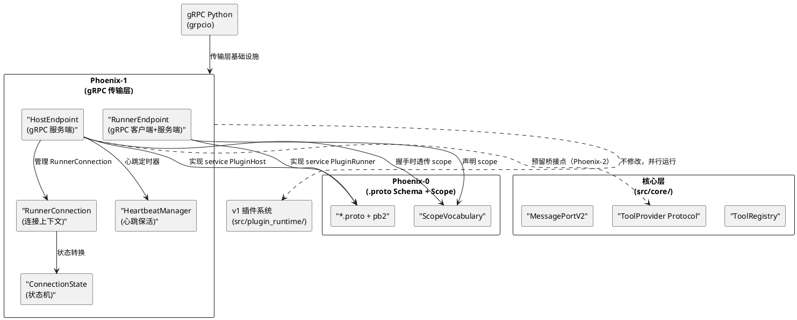
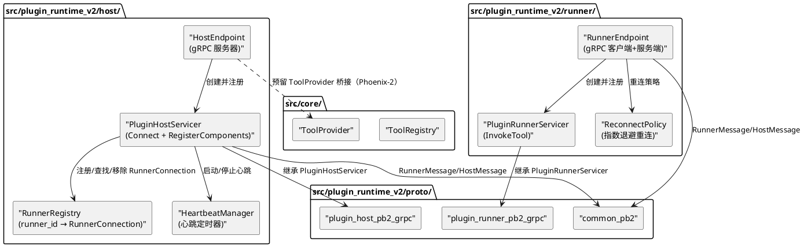
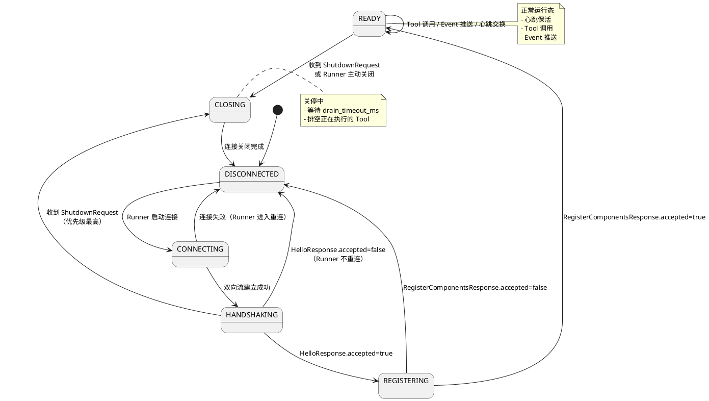
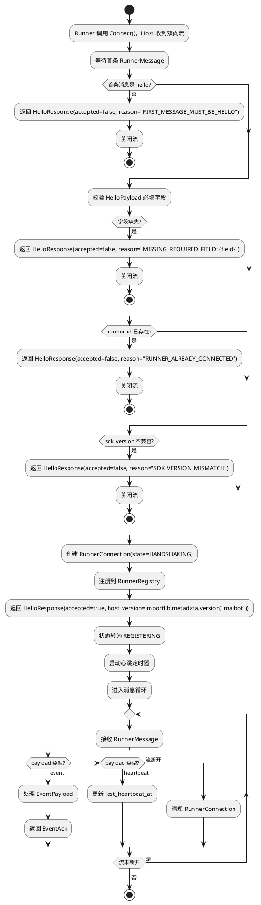
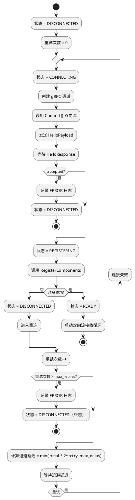
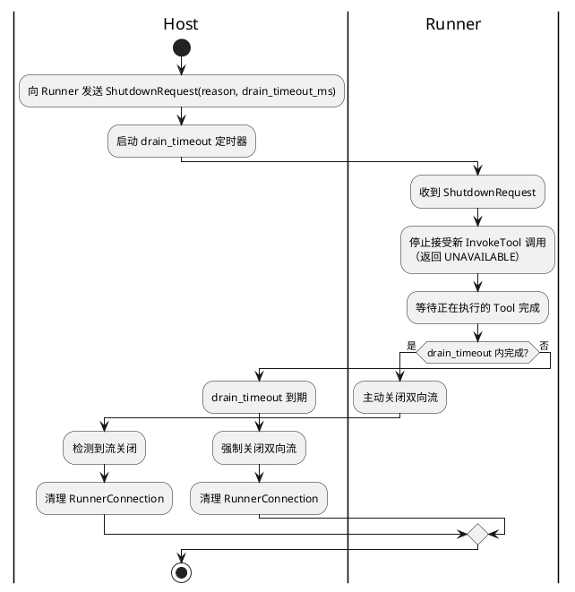
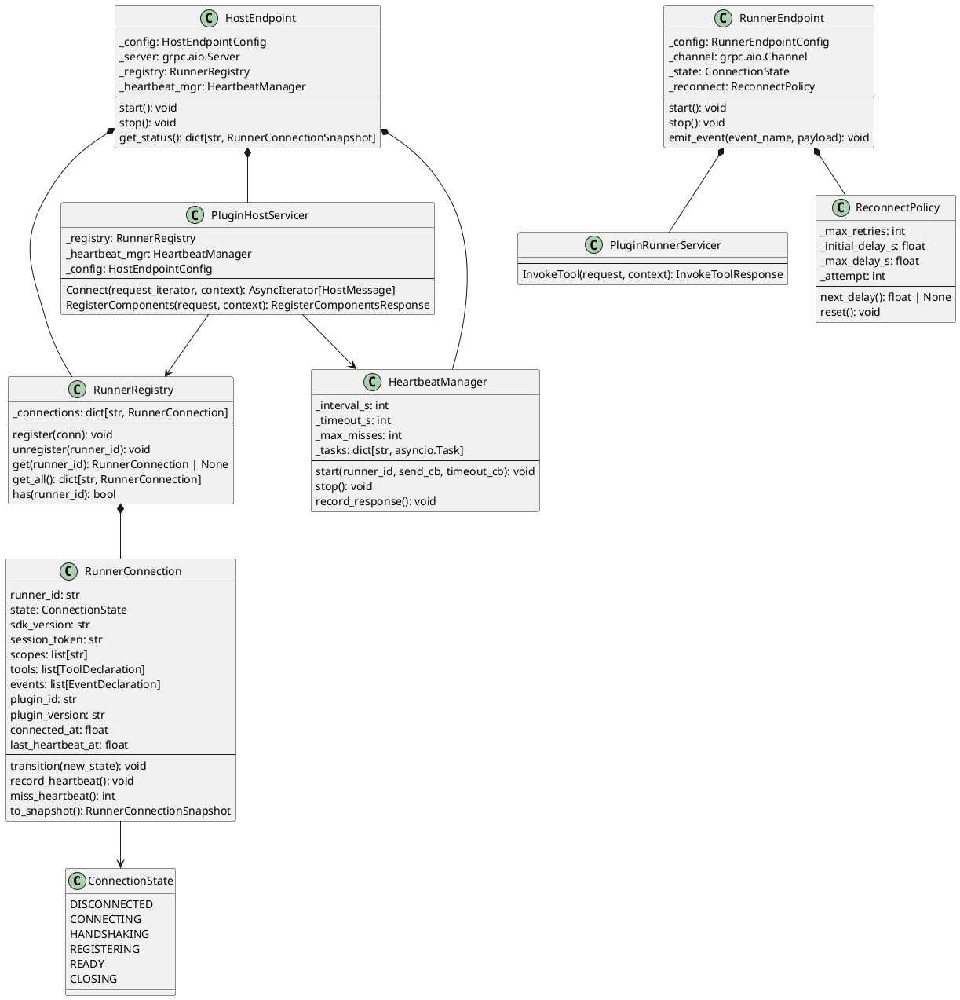

# Phoenix-1：gRPC 传输层 — 增量设计方案

# 一、需求与存量功能关系分析

## 1.1 需求功能与存量功能对比

### 1.1.1 已实现功能

| 需求功能 | 存量功能 | 代码位置 | 匹配度 |
|---------|---------|---------|--------|
| Host/Runner 双端架构 | Host（supervisor + rpc_server）+ Runner（rpc_client + runner_main） | `src/plugin_runtime/host/`, `src/plugin_runtime/runner/` | 75% |
| 握手连接（HelloPayload → HelloResponse） | HelloPayload + HelloResponsePayload Pydantic 模型 + 握手流程 | `src/plugin_runtime/protocol/envelope.py:162-181`, `src/plugin_runtime/host/rpc_server.py:274-289` | 75% |
| 组件注册（Tool/Event 声明上报） | RegisterPluginPayload + ComponentRegistry | `src/plugin_runtime/protocol/envelope.py:185-241`, `src/plugin_runtime/host/component_registry.py` | 50% |
| Tool 调用（Host→Runner） | InvokePayload + InvokeResultPayload + RPCServer.send_request | `src/plugin_runtime/protocol/envelope.py:256-270`, `src/plugin_runtime/host/rpc_server.py:177-241` | 75% |
| 心跳保活 | HealthPayload + _health_check_loop | `src/plugin_runtime/protocol/envelope.py:305-327`, `src/plugin_runtime/host/supervisor.py:457` | 25% |
| 传输层分帧协议 | 4-byte big-endian length prefix + MsgPack | `src/plugin_runtime/transport/base.py:17-18` | 25% |
| 请求-响应关联 | pending_requests dict + request_id 单调递增 | `src/plugin_runtime/host/rpc_server.py:66-67`, `src/plugin_runtime/runner/rpc_client.py:73` | 75% |
| Runner 进程管理 | _spawn_runner + _shutdown_runner + max_restart_attempts | `src/plugin_runtime/host/supervisor.py:428-478` | 50% |
| 连接断开清理 | _recv_loop 异常处理 + pending_requests 清理 | `src/plugin_runtime/host/rpc_server.py:291-300`, `src/plugin_runtime/runner/rpc_client.py:161-169` | 75% |
| .proto Schema 定义 | Phoenix-0 产出的 3 个 .proto 文件 + 生成代码 | `src/plugin_runtime_v2/proto/common.proto`, `plugin_host.proto`, `plugin_runner.proto` | 100% |
| Scope 词汇表 | ScopeVocabulary + 54 个 ScopeEntry + capability 映射 | `src/plugin_runtime_v2/scope/vocabulary.py` | 100% |
| v2 目录骨架 | host/runner/mcp/scope/sdk/ 子目录 + __init__.py | `src/plugin_runtime_v2/` | 100% |

**匹配度评估依据**：
- **100%**：Phoenix-0 已完整实现，Phoenix-1 直接使用
- **75%**：核心语义一致，但传输协议/序列化方式/字段名不同，需重新实现
- **50%**：部分语义匹配，但模型结构差异大（如 8 种组件 vs 2 种、进程管理 vs 连接管理）
- **25%**：仅概念相似，实现方式完全不同（如心跳机制、传输协议）

### 1.1.2 需要扩展的功能

| 需求功能 | 存量功能 | 差异说明 | 扩展方向 |
|---------|---------|---------|---------|
| gRPC 双向流传输 | 4-byte prefix + MsgPack 自研协议 | v1 使用自定义分帧+MsgPack序列化，Phoenix-1 使用 gRPC 双向流+protobuf 序列化。gRPC 自带分帧和流控，无需手动实现 | 新建 `src/plugin_runtime_v2/host/endpoint.py` 和 `src/plugin_runtime_v2/runner/endpoint.py`，基于 grpcio 实现 |
| 连接状态机（6 状态） | v1 无显式状态机，连接状态散落在 `_running`/`_connection`/`is_connected` 等 flag 中 | v1 的连接状态隐含在多个布尔变量中，无法表达 HANDSHAKING/REGISTERING 等中间态。Phoenix-1 需要显式的 enum + 转换规则 | 新建 `ConnectionState` 枚举 + `RunnerConnection` 数据类，在 Host 端维护每个 Runner 的状态 |
| 心跳保活（应用层 + gRPC keepalive） | v1 的 HealthPayload 是 Runner→Host 的单向心跳，间隔 30s | v1 心跳是 Runner 主动上报，Phoenix-1 是 Host 主动探测。v1 无 gRPC keepalive 配置。Phoenix-1 需要双层心跳：应用层（业务状态感知）+ gRPC keepalive（传输层连接检测） | Host 端新增心跳定时器任务，通过双向流发送 HeartbeatRequest；gRPC 通道配置 keepalive 参数 |
| 优雅关停（ShutdownRequest + drain_timeout） | v1 的 ShutdownPayload 无 drain_timeout，直接断开 | v1 关停时 Host 发 ShutdownPayload 后直接关闭连接，无排空等待。Phoenix-1 需要 drain_timeout_ms 让 Runner 排空正在执行的 Tool 调用 | Host 端新增关停流程：发送 ShutdownRequest → 等待 drain_timeout_ms → 强制关闭 |
| Runner 注册表（多 Runner 并行） | v1 的 RPCServer 只支持单个 `_connection` | v1 设计为 1:1（一个 Supervisor 对应一个 Runner 进程）。Phoenix-1 的 HostEndpoint 需要支持多个 Runner 同时连接（dict[runner_id, RunnerConnection]） | Host 端新增 `dict[runner_id, RunnerConnection]` 注册表，Connect 双向流处理器按 runner_id 隔离 |
| 自动重连（指数退避） | v1 的 Runner 无自动重连逻辑，断开后由 Supervisor 重启进程 | v1 中 Runner 崩溃后由 Supervisor._spawn_runner 重启整个进程。Phoenix-1 的 RunnerEndpoint 需要自行重连（指数退避，初始 1s，最大 30s，最多 10 次） | Runner 端新增重连逻辑：检测断开 → 指数退避 → 重新握手+注册 |
| Event 推送（通过双向流） | v1 的 Event 通过 Envelope BROADCAST 消息类型发送 | v1 的 Event 走独立的 BROADCAST 消息类型。Phoenix-1 的 Event 通过 Connect 双向流的 RunnerMessage.event 字段推送，Host 通过 HostMessage.event_ack 确认 | Runner 端新增 emit_event 方法，通过双向流发送 EventPayload；Host 端处理 EventPayload 并返回 EventAck |
| InvokeTool（一元 RPC） | v1 的 Tool 调用走 Envelope REQUEST/RESPONSE | v1 的 Tool 调用通过 RPCServer.send_request 发送 InvokePayload，等待 InvokeResultPayload。Phoenix-1 使用 gRPC 一元 RPC（PluginRunner.InvokeTool），更简洁 | Runner 端实现 PluginRunnerServicer，Host 端通过 gRPC stub 调用 InvokeTool |

### 1.1.3 需要新增的功能或接口

**gRPC Host 服务端**（`src/plugin_runtime_v2/host/`）：
- `HostEndpoint`：gRPC 服务器实例，监听指定地址，接受 Runner 连接
  - 输入：listen_address, heartbeat_interval_s, max_runners 等配置
  - 输出：启动/停止 gRPC 服务器，管理 Runner 连接生命周期
  - 核心逻辑：实现 `service PluginHost` 的 Connect + RegisterComponents
- `PluginHostServicer`：gRPC 服务实现，处理 Connect 双向流和 RegisterComponents 一元 RPC
  - 输入：RunnerMessage 流（Connect）、RegisterComponentsRequest
  - 输出：HostMessage 流（Connect）、RegisterComponentsResponse
  - 核心逻辑：握手校验、组件注册、心跳发送、关停请求
- `RunnerConnection`：单个 Runner 连接上下文
  - 输入：runner_id, 连接状态, 双向流句柄, 已注册组件
  - 输出：状态快照、组件列表
  - 核心逻辑：状态转换、心跳跟踪、资源清理
- `ConnectionState`：连接状态枚举（6 状态）
  - DISCONNECTED / CONNECTING / HANDSHAKING / REGISTERING / READY / CLOSING

**gRPC Runner 客户端**（`src/plugin_runtime_v2/runner/`）：
- `RunnerEndpoint`：gRPC 客户端+服务端组合
  - 输入：host_address, runner_id, session_token, scopes 等配置
  - 输出：建立连接、执行 Tool 调用、推送 Event
  - 核心逻辑：Connect 双向流管理、InvokeTool 服务实现、自动重连
- `PluginRunnerServicer`：gRPC 服务实现，处理 InvokeTool 一元 RPC
  - 输入：InvokeToolRequest
  - 输出：InvokeToolResponse
  - 核心逻辑：Phoenix-1 阶段返回 NOT_IMPLEMENTED，Phoenix-2 接入 @Tool 装饰器

**与核心层对接**（预留桥接点，Phoenix-2 实现）：
- Host 端预留 ToolProvider 桥接点：RunnerConnection 中的 tools 列表可映射到 ToolSpec
- Host 端预留 Event 回调：收到 EventPayload 时触发回调，Phoenix-2 接入事件分发

## 1.2 存量功能详细分析

### 1.2.1 v1 传输层（`src/plugin_runtime/transport/`）

**接口契约**：
- `TransportServer.start(handler)` / `stop()` / `get_address()` — 服务端抽象
- `TransportClient.connect()` → `Connection` — 客户端抽象
- `Connection.send_frame(data)` / `recv_frame()` — 分帧读写

**业务规则**：
- 分帧协议：4-byte big-endian length prefix + payload，最大帧 16MB
- 3 种传输后端：UDS（Linux）、Named Pipe（Windows）、TCP
- 写锁（`_write_lock`）保护并发写入的帧完整性

**约束**：
- Phoenix-1 不修改此模块，用 gRPC 替换
- gRPC 自带分帧和流控，无需手动实现
- Windows 不支持 UDS，v1 用 Named Pipe 替代；gRPC 统一用 TCP localhost，跨平台一致

### 1.2.2 v1 RPC 服务器（`src/plugin_runtime/host/rpc_server.py`）

**接口契约**：
- `RPCServer.start()` / `stop()` — 启停
- `RPCServer.send_request(method, plugin_id, payload, timeout_ms)` → `Envelope` — 发送请求
- `RPCServer.register_method(method, handler)` — 注册方法处理器
- `RPCServer.is_connected` — 连接状态
- `RPCServer.session_token` — 握手令牌

**业务规则**：
- 握手流程：Runner 发 HelloPayload → Host 校验 → 返回 HelloResponsePayload
- SDK 版本校验：MIN_SDK_VERSION / MAX_SDK_VERSION 范围检查
- 请求-响应关联：`pending_requests: dict[int, Future[Envelope]]`，request_id 单调递增
- 发送队列背压：`asyncio.Queue(maxsize=128)` 串行化写入
- 单连接模型：`_connection: Optional[Connection]`，只支持一个 Runner

**约束**：
- Phoenix-1 的 HostEndpoint 需要支持多 Runner 并行连接
- v1 的单连接模型是最大的架构差异

### 1.2.3 v1 RPC 客户端（`src/plugin_runtime/runner/rpc_client.py`）

**接口契约**：
- `RPCClient.connect_and_handshake()` → `bool` — 连接+握手
- `RPCClient.send_request(method, plugin_id, payload, timeout_ms)` → `Envelope` — 发送请求
- `RPCClient.send_event(method, plugin_id, payload)` — 发送广播
- `RPCClient.register_method(method, handler)` — 注册方法处理器
- `RPCClient.is_connected` — 连接状态

**业务规则**：
- 握手后启动 `_recv_loop` 后台任务
- 收到 REQUEST 调用 `_method_handlers`，收到 RESPONSE 关联 `_pending_requests`
- 无自动重连：断开后由 Supervisor 重启进程

**约束**：
- Phoenix-1 的 RunnerEndpoint 需要自行实现自动重连
- v1 的 send_event 走 BROADCAST 消息类型，Phoenix-1 走双向流 EventPayload

### 1.2.4 v1 Supervisor（`src/plugin_runtime/host/supervisor.py`）

**接口契约**：
- `PluginRunnerSupervisor.start()` / `stop()` — 启停（含进程管理）
- `PluginRunnerSupervisor.invoke_plugin(method, plugin_id, component_name, args, timeout_ms)` → `Envelope` — 调用插件
- `PluginRunnerSupervisor.dispatch_event(event_type, message, extra_args)` — 分发事件
- `PluginRunnerSupervisor.invoke_hook(hook_name, **kwargs)` — 触发 Hook

**业务规则**：
- 进程管理：`_spawn_runner` 启动子进程，`_shutdown_runner` 关停子进程
- 健康检查：`_health_check_loop` 定期发送 HealthPayload
- 自动重启：Runner 崩溃后最多重启 `_max_restart_attempts` 次
- 组件注册表：8 种组件类型（ACTION/COMMAND/TOOL/EVENT_HANDLER/HOOK_HANDLER/MESSAGE_GATEWAY/HOME_CARD/API）
- 能力服务：60+ capabilities 注册和分发

**约束**：
- Phoenix-1 不实现进程管理（沿用 v1 或由 Phoenix-2/4 统一改造）
- Phoenix-1 不实现能力分发（Phoenix-2 的 MCP 组件模型替代）
- Supervisor 使用 `global_config`（noqa TID251），Phoenix-1 的 HostEndpoint 禁止导入 global_config

### 1.2.5 核心工具抽象（`src/core/tooling.py`）

**接口契约**：
- `ToolProvider` Protocol：`list_tools()` / `invoke()` / `close()`
- `ToolRegistry`：`register_provider()` / `list_tools()` / `invoke()` / `get_llm_definitions()`
- `ToolSpec`：name, description, parameters_schema, output_schema, provider_name, provider_type, enabled
- `ToolInvocation`：tool_name, arguments, call_id, session_id
- `ToolExecutionResult`：tool_name, success, content, error_message, structured_content, content_items

**业务规则**：
- Provider 按注册顺序去重（同名工具保留先注册的）
- invoke 遍历 providers 查找匹配工具
- to_llm_definition() 生成 LLM 可消费的工具定义

**扩展点**：
- Phoenix-2 的 Host 端需实现 ToolProvider Protocol，将远程插件的 Tool 桥接到 ToolRegistry
- ToolDeclaration → ToolSpec 映射：name→name, description→description, parameters_schema→parameters_schema, output_schema→output_schema
- Phoenix-1 预留桥接点（RunnerConnection.tools 列表），Phoenix-2 实现 ToolProvider 注册

### 1.2.6 Phoenix-0 产出物

**.proto Schema**（`src/plugin_runtime_v2/proto/`）：
- `common.proto`：RunnerMessage/HostMessage（oneof 封装）+ HelloPayload/HelloResponse + HeartbeatRequest/HeartbeatResponse + ShutdownRequest + EventPayload/EventAck
- `plugin_host.proto`：`service PluginHost`（Connect 双向流 + RegisterComponents 一元 RPC）+ ToolDeclaration/EventDeclaration + RegisterComponentsRequest/Response
- `plugin_runner.proto`：`service PluginRunner`（InvokeTool 一元 RPC）+ InvokeToolRequest/InvokeToolResponse
- 生成代码：`*_pb2.py` + `*_pb2_grpc.py`（6 个文件）

**Scope 词汇表**（`src/plugin_runtime_v2/scope/vocabulary.py`）：
- 54 个 ScopeEntry，11 个资源域，覆盖 75 个旧 capabilities
- `ScopeVocabulary.validate(scope_str)` → O(1) 查找
- `ScopeVocabulary.map_capability(cap)` → capability→scope 映射

**约束**：
- Phoenix-1 不修改 .proto 文件（如需变更回溯 Phoenix-0）
- Phoenix-1 握手阶段仅透传 scope 列表，不做校验（Phoenix-3 职责）

# 二、增量设计方案

## 2.1 实现模型

### 2.1.1 上下文视图



### 2.1.2 服务/组件总体架构



### 2.1.3 实现设计文档

#### 2.1.3.1 连接生命周期状态机



**状态转换规则**：

| 当前状态 | 触发事件 | 目标状态 | 处理逻辑 |
|---------|---------|---------|---------|
| DISCONNECTED | Runner 发起 Connect | CONNECTING | Runner 端创建 gRPC 通道 |
| CONNECTING | 双向流建立成功 | HANDSHAKING | Runner 发送 HelloPayload |
| CONNECTING | 连接失败 | DISCONNECTED | Runner 进入重连（指数退避） |
| HANDSHAKING | accepted=true | REGISTERING | Host 注册 RunnerConnection，Runner 调用 RegisterComponents |
| HANDSHAKING | accepted=false | DISCONNECTED | Runner 记录 ERROR 日志，不重连 |
| HANDSHAKING | 收到 ShutdownRequest | CLOSING | ShutdownRequest 优先级最高 |
| REGISTERING | 注册成功 | READY | Host 启动心跳定时器，记录 connected_at |
| REGISTERING | 注册失败 | DISCONNECTED | Host 关闭双向流 |
| REGISTERING | 30s 超时未注册 | CLOSING | Host 主动关闭双向流 |
| READY | 心跳/Tool/Event | READY | 正常运行 |
| READY | 收到 ShutdownRequest | CLOSING | Runner 停止接受新 Tool，等待排空 |
| READY | 双向流异常断开 | DISCONNECTED | Host 直接清理资源 |
| CLOSING | 连接关闭完成 | DISCONNECTED | Host 移除 RunnerConnection |

**非法状态转换**：任何不在上述规则中的转换必须被拒绝，记录 ERROR 日志。例如 READY → HANDSHAKING、DISCONNECTED → READY 均为非法。

#### 2.1.3.2 Connect 双向流处理流程（Host 端）



#### 2.1.3.3 Runner 连接+重连流程（Runner 端）



#### 2.1.3.4 优雅关停流程



## 2.2 接口设计

### 2.2.1 总体设计

**接口分类**：

| 分类 | 接口 | 稳定性 | 说明 |
|------|------|--------|------|
| gRPC 服务 | PluginHost | 稳定 | Host 端暴露的 RPC 方法（Phoenix-0 定义） |
| gRPC 服务 | PluginRunner | 稳定 | Runner 端暴露的 RPC 方法（Phoenix-0 定义） |
| Host 公共 API | HostEndpoint | 稳定 | Host 端生命周期管理 |
| Host 公共 API | RunnerRegistry | 稳定 | Runner 连接注册表查询 |
| Runner 公共 API | RunnerEndpoint | 稳定 | Runner 端连接管理和 Tool 调用 |
| 内部组件 | HeartbeatManager | 内部 | 心跳定时器管理 |
| 内部组件 | ReconnectPolicy | 内部 | 重连策略计算 |
| 数据类型 | RunnerConnection | 稳定 | Runner 连接上下文快照 |
| 数据类型 | ConnectionState | 稳定 | 连接状态枚举 |
| 数据类型 | HostEndpointConfig | 稳定 | Host 端配置 |
| 数据类型 | RunnerEndpointConfig | 稳定 | Runner 端配置 |

**接口变更策略**：
- .proto 接口由 Phoenix-0 定义，Phoenix-1 不修改
- Host/Runner 公共 API 以 dataclass 参数为主，便于后续扩展字段
- 内部组件不对外暴露，可自由重构

### 2.2.2 接口清单

#### 2.2.2.1 HostEndpoint

```python
class HostEndpoint:
    """gRPC Host 服务端 — 管理 Runner 连接生命周期。"""

    def __init__(self, config: HostEndpointConfig) -> None: ...
    async def start(self) -> None:
        """启动 gRPC 服务器，开始监听 Runner 连接。

        前置条件：未启动。
        后置条件：gRPC 服务器运行，反射服务可用。
        异常：OSError（端口被占用）。
        """

    async def stop(self) -> None:
        """优雅关停：向所有 Runner 发送 ShutdownRequest，等待排空后关闭。

        前置条件：已启动。
        后置条件：所有 Runner 断开，gRPC 服务器停止。
        """

    def get_status(self) -> dict[str, RunnerConnectionSnapshot]:
        """返回所有 Runner 连接状态快照，供 WebUI 调试页使用。

        Returns:
            dict[runner_id, RunnerConnectionSnapshot]
        """

    @property
    def listen_address(self) -> str:
        """实际监听地址（启动后可用）。"""
```

#### 2.2.2.2 RunnerEndpoint

```python
class RunnerEndpoint:
    """gRPC Runner 客户端+服务端 — 连接 Host 并暴露 InvokeTool 服务。"""

    def __init__(self, config: RunnerEndpointConfig) -> None: ...
    async def start(self) -> None:
        """启动 Runner：连接 Host、握手、注册组件。

        前置条件：Host 可达。
        后置条件：连接建立，状态为 READY。
        异常：连接失败时自动重连（指数退避）。
        """

    async def stop(self) -> None:
        """断开与 Host 的连接，停止 InvokeTool 服务。"""

    async def emit_event(self, event_name: str, payload: dict[str, Any]) -> None:
        """通过双向流向 Host 推送 Event。

        前置条件：状态为 READY。
        后置条件：Host 收到 EventPayload 并返回 EventAck。
        异常：ConnectionError（流已断开）。
        """

    @property
    def state(self) -> ConnectionState:
        """当前连接状态。"""

    @property
    def is_ready(self) -> bool:
        """是否处于 READY 状态。"""
```

#### 2.2.2.3 PluginHostServicer（内部）

```python
class PluginHostServicer(plugin_host_pb2_grpc.PluginHostServicer):
    """实现 service PluginHost 的 gRPC 服务。"""

    async def Connect(
        self, request_iterator: AsyncIterator[RunnerMessage], context: ServicerContext
    ) -> AsyncIterator[HostMessage]:
        """处理 Connect 双向流。

        流程：
        1. 等待首条 RunnerMessage，验证 payload 为 hello
        2. 校验 HelloPayload，返回 HelloResponse
        3. 进入消息循环：接收 Event/Heartbeat，发送 Heartbeat/Shutdown
        """

    async def RegisterComponents(
        self, request: RegisterComponentsRequest, context: ServicerContext
    ) -> RegisterComponentsResponse:
        """处理 RegisterComponents 一元 RPC。

        流程：
        1. 验证 plugin_id 非空
        2. 验证 tools/events 的 name 非空且无重复
        3. 存储到 RunnerConnection
        """
```

#### 2.2.2.4 PluginRunnerServicer（内部）

```python
class PluginRunnerServicer(plugin_runner_pb2_grpc.PluginRunnerServicer):
    """实现 service PluginRunner 的 gRPC 服务。"""

    async def InvokeTool(
        self, request: InvokeToolRequest, context: ServicerContext
    ) -> InvokeToolResponse:
        """处理 InvokeTool 一元 RPC。

        Phoenix-1 阶段：返回 success=false, error="NOT_IMPLEMENTED"。
        Phoenix-2 阶段：查找 @Tool 装饰器注册的处理函数并执行。
        """
```

#### 2.2.2.5 ConnectionState

```python
class ConnectionState(str, Enum):
    """连接生命周期状态枚举。"""

    DISCONNECTED = "disconnected"
    CONNECTING = "connecting"
    HANDSHAKING = "handshaking"
    REGISTERING = "registering"
    READY = "ready"
    CLOSING = "closing"
```

#### 2.2.2.6 RunnerConnection

```python
@dataclass(slots=True)
class RunnerConnection:
    """Host 端维护的单个 Runner 连接上下文。"""

    runner_id: str
    state: ConnectionState
    sdk_version: str
    session_token: str
    scopes: list[str]
    tools: list[ToolDeclaration]  # protobuf 对象
    events: list[EventDeclaration]  # protobuf 对象
    plugin_id: str
    plugin_version: str
    connected_at: float  # Unix 时间戳，READY 时有值
    last_heartbeat_at: float  # Unix 时间戳，READY 时有值
    _heartbeat_misses: int  # 连续心跳丢失次数

    def transition(self, new_state: ConnectionState) -> None:
        """状态转换，校验合法性。非法转换抛出 ValueError。"""

    def record_heartbeat(self) -> None:
        """记录心跳响应，重置 _heartbeat_misses。"""

    def miss_heartbeat(self) -> int:
        """心跳丢失计数+1，返回当前连续丢失次数。"""

    def to_snapshot(self) -> RunnerConnectionSnapshot:
        """生成不可变快照，供 get_status() 使用。"""
```

#### 2.2.2.7 HostEndpointConfig

```python
@dataclass(frozen=True, slots=True)
class HostEndpointConfig:
    """Host 端配置。"""

    listen_address: str = "127.0.0.1:50051"
    heartbeat_interval_s: int = 30
    heartbeat_timeout_s: int = 10
    max_heartbeat_misses: int = 2
    register_timeout_s: int = 30
    default_drain_timeout_ms: int = 5000
    max_runners: int = 10
    server_id: str = ""  # 自动生成 UUID v4
```

#### 2.2.2.8 RunnerEndpointConfig

```python
@dataclass(frozen=True, slots=True)
class RunnerEndpointConfig:
    """Runner 端配置。"""

    host_address: str  # 必填
    runner_id: str = ""  # 自动生成 UUID v4
    sdk_version: str = ""  # 自动读取
    session_token: str  # 必填
    scopes: list[str] = field(default_factory=list)  # 至少 1 项
    tools: list[ToolDeclaration] = field(default_factory=list)
    events: list[EventDeclaration] = field(default_factory=list)
    plugin_id: str = ""
    plugin_version: str = "1.0.0"
    reconnect_max_retries: int = 10
    reconnect_initial_delay_s: float = 1.0
    reconnect_max_delay_s: float = 30.0
    tool_timeout_ms: int = 30000
```

#### 2.2.2.9 HeartbeatManager（内部）

```python
class HeartbeatManager:
    """心跳保活管理器 — Host 端使用。"""

    def __init__(
        self,
        interval_s: int,
        timeout_s: int,
        max_misses: int,
    ) -> None: ...

    def start(
        self,
        runner_id: str,
        send_callback: Callable[[HeartbeatRequest], Awaitable[None]],
        timeout_callback: Callable[[str], Awaitable[None]],
    ) -> None:
        """启动心跳定时器。

        Args:
            runner_id: Runner 标识
            send_callback: 发送心跳请求的回调
            timeout_callback: 心跳超时的回调（判定断开）
        """

    def stop(self) -> None:
        """停止心跳定时器。"""

    def record_response(self) -> None:
        """记录心跳响应，重置丢失计数。"""
```

#### 2.2.2.10 ReconnectPolicy（内部）

```python
class ReconnectPolicy:
    """重连策略 — Runner 端使用。"""

    def __init__(
        self,
        max_retries: int,
        initial_delay_s: float,
        max_delay_s: float,
    ) -> None: ...

    def next_delay(self) -> float | None:
        """计算下一次重连延迟（指数退避）。

        Returns:
            延迟秒数，已达最大重试次数时返回 None。
        """

    def reset(self) -> None:
        """重连成功后重置计数。"""
```

## 2.3 数据模型

### 2.3.1 设计目标

1. **支持的业务场景**：
   - 多 Runner 并行连接到单个 Host
   - 每个 Runner 独立管理连接状态（6 状态机）
   - Host 通过双向流与 Runner 交换心跳、Event、关停请求
   - Host 通过一元 RPC 调用 Runner 的 InvokeTool
   - Runner 断开后自动重连（指数退避）

2. **性能目标**：
   - gRPC 双向流单条消息（≤4KB）端到端延迟 ≤5ms（同机通信）
   - Host 支持至少 10 个 Runner 同时连接
   - 心跳检测 60s 内发现连接断开
   - InvokeTool 一元 RPC gRPC 层开销 ≤2ms

3. **兼容策略**：
   - v1 和 v2 完全隔离，v2 禁止导入 v1 模块
   - .proto 使用 proto3 语法，新增字段不破坏旧版反序列化
   - RunnerConnection 数据可映射到 ToolSpec（Phoenix-2 桥接）

### 2.3.2 模型实现

#### 2.3.2.1 文件结构

```
src/plugin_runtime_v2/
├── host/
│   ├── __init__.py
│   ├── endpoint.py          # HostEndpoint（公共 API）
│   ├── servicer.py          # PluginHostServicer（gRPC 服务实现）
│   ├── connection.py        # RunnerConnection + ConnectionState
│   ├── registry.py          # RunnerRegistry（runner_id → RunnerConnection）
│   └── heartbeat.py         # HeartbeatManager
├── runner/
│   ├── __init__.py
│   ├── endpoint.py          # RunnerEndpoint（公共 API）
│   ├── servicer.py          # PluginRunnerServicer（gRPC 服务实现）
│   └── reconnect.py         # ReconnectPolicy
├── proto/                    # Phoenix-0 产出，不修改
├── scope/                    # Phoenix-0 产出，不修改
├── mcp/                      # Phoenix-2 实现
└── sdk/                      # Phoenix-2 实现
```

#### 2.3.2.2 核心类图



#### 2.3.2.3 RunnerConnectionSnapshot（不可变快照）

```python
@dataclass(frozen=True, slots=True)
class RunnerConnectionSnapshot:
    """Runner 连接状态快照 — 供 get_status() 和 WebUI 使用。"""

    runner_id: str
    state: str  # ConnectionState 值的字符串表示
    sdk_version: str
    scopes: tuple[str, ...]
    plugin_id: str
    plugin_version: str
    tool_count: int
    event_count: int
    connected_at: float
    last_heartbeat_at: float
```

#### 2.3.2.4 gRPC keepalive 配置

Runner 端创建 gRPC 通道时必须配置以下 keepalive 参数：

```python
GRPC_CHANNEL_OPTIONS = [
    ("grpc.keepalive_time_ms", 30000),
    ("grpc.keepalive_timeout_ms", 10000),
    ("grpc.keepalive_permit_without_calls", 1),
    ("grpc.http2.max_pings_without_data", 0),
]
```

Host 端 gRPC 服务器配置：

```python
GRPC_SERVER_OPTIONS = [
    ("grpc.keepalive_time_ms", 30000),
    ("grpc.keepalive_timeout_ms", 10000),
    ("grpc.keepalive_permit_without_calls", 1),
    ("grpc.http2.max_pings_without_data", 0),
    ("grpc.http2.min_time_between_pings_ms", 10000),
    ("grpc.http2.min_ping_interval_without_data_ms", 5000),
]
```

#### 2.3.2.5 异常映射

**Host 端异常 → gRPC 状态码**：

| 业务异常 | gRPC 状态码 | 说明 |
|---------|------------|------|
| runner_id 已存在 | 返回 HelloResponse(accepted=false) | 不用 gRPC 状态码，走业务拒绝 |
| SDK 版本不兼容 | 返回 HelloResponse(accepted=false) | 同上 |
| 必填字段缺失 | 返回 HelloResponse(accepted=false) | 同上 |
| 首条消息非 Hello | 返回 HelloResponse(accepted=false) + 关闭流 | 同上 |
| 组件名称重复 | 返回 RegisterComponentsResponse(accepted=false) | 同上 |
| Runner 心跳超时 | Host 端清理连接 | 不发 gRPC 错误，直接清理 |
| InvokeTool 超时 | DEADLINE_EXCEEDED | gRPC 自带超时机制 |
| Runner 不可用 | UNAVAILABLE | 双向流已断开 |

**Runner 端异常 → 行为**：

| 业务异常 | Runner 行为 | 说明 |
|---------|------------|------|
| Host 不可达 | 指数退避重连 | 连接阶段失败 |
| 握手被拒绝 | 记录 ERROR，不重连 | 业务决策，非临时故障 |
| 重连耗尽 | 记录 ERROR，进入终态 | 不再尝试 |
| 收到 ShutdownRequest | 停止接受新 Tool，排空后关闭 | 优雅关停 |
| InvokeTool 收到但正在关停 | 返回 success=false, error="SHUTTING_DOWN" | 关停期间拒绝新调用 |

#### 2.3.2.6 日志规范

所有 gRPC 相关日志使用 `src/common/logger.py` 的 `get_logger`，模块名前缀为 `plugin_runtime_v2.`：

| 模块 | logger 名称 | 日志级别 |
|------|------------|---------|
| HostEndpoint | `plugin_runtime_v2.host.endpoint` | INFO（启停）/ WARNING（异常） |
| PluginHostServicer | `plugin_runtime_v2.host.servicer` | INFO（连接/断开/握手）/ WARNING（心跳超时） |
| RunnerEndpoint | `plugin_runtime_v2.runner.endpoint` | INFO（连接/断开）/ WARNING（重连） |
| PluginRunnerServicer | `plugin_runtime_v2.runner.servicer` | INFO（Tool 调用） |
| HeartbeatManager | `plugin_runtime_v2.host.heartbeat` | WARNING（心跳超时） |

**必记日志事件**：
- Runner 连接/断开：INFO 级别，含 runner_id 和状态
- 状态转换：INFO 级别，含 runner_id 和新旧状态
- 心跳超时：WARNING 级别，含 runner_id 和连续丢失次数
- 重连事件：WARNING 级别，含重试次数和延迟
- 握手拒绝：INFO 级别，含 runner_id 和拒绝原因
- 优雅关停：INFO 级别，含 runner_id 和 drain 结果